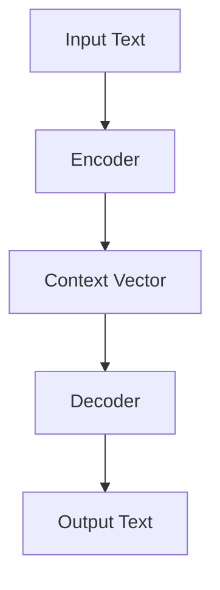
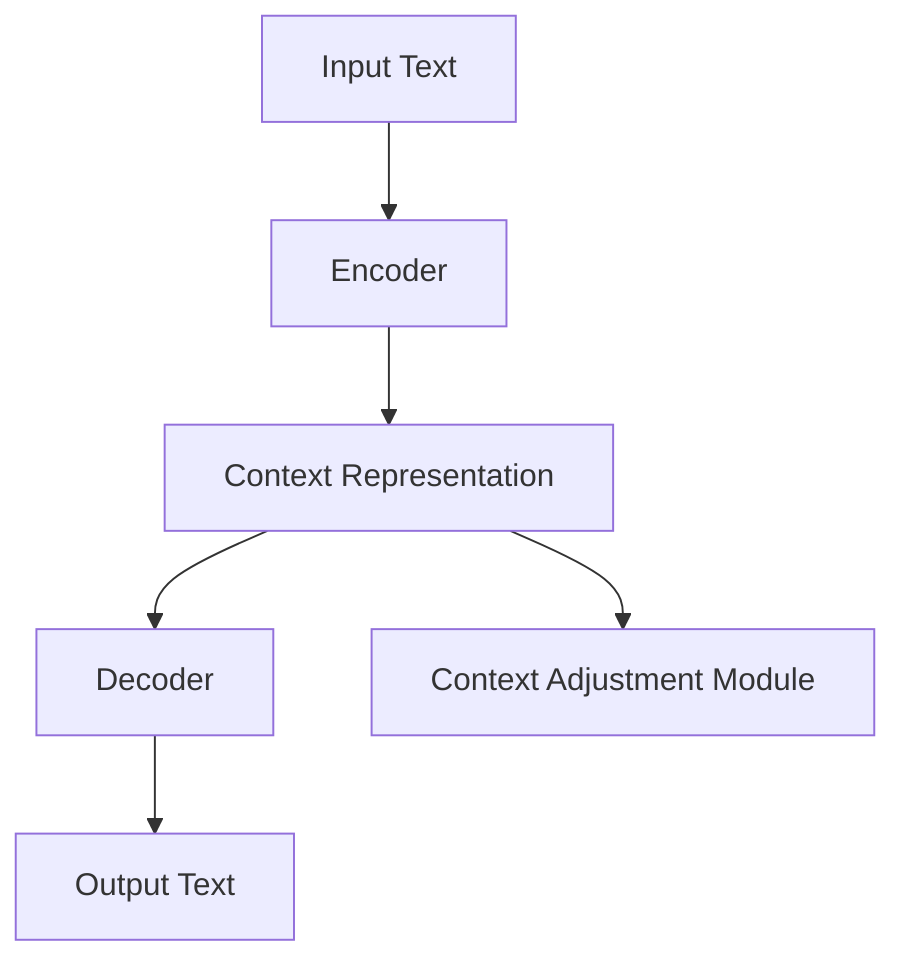

                 

### 第一部分: 引言与背景介绍

## 第1章: 问题背景与定义

### 1.1.1 研究背景

近年来，自然语言处理（NLP）领域取得了飞速的发展，尤其是大型语言模型（LLM，Large Language Model）的兴起，为文本生成、问答系统、机器翻译等任务提供了强大的工具。LLM通过训练大量文本数据，能够捕捉语言的复杂结构，生成自然流畅的文本。然而，随着应用场景的多样化，如何高效地在不同话题间进行上下文切换成为了一个重要的问题。

上下文切换在多领域应用中具有重要价值。例如，在问答系统中，用户可能会从一个话题突然切换到另一个完全不同的领域，如何快速适应新的话题，保持回答的相关性和连贯性，是系统成功的关键。在内容生成领域，如自动写作、新闻生成等，需要根据不同的主题生成相关的内容，上下文切换的能力直接影响生成文本的质量。此外，在多语言翻译、跨领域文本理解等任务中，上下文切换的能力也至关重要。

当前，LLM在处理单一话题上的性能已经相当出色，但其在不同话题间进行快速转换的能力尚未得到充分评估。这主要是因为上下文切换涉及到模型对多个领域的知识理解和快速适应能力，现有的评估方法主要集中于单一任务的性能，缺乏对上下文切换能力的系统评估。

### 1.1.2 关键概念

为了深入探讨上下文切换的问题，我们需要明确一些关键概念：

#### 1.1.2.1 上下文切换的定义

上下文切换（Context Switching）是指模型在处理一个话题时，突然切换到另一个完全不同的话题，同时保持回答的相关性和连贯性。这涉及到模型对当前上下文的识别和理解，以及对新上下文的快速适应能力。

#### 1.1.2.2 LLM的概念

大型语言模型（LLM）是一种基于深度学习的技术，通过训练大量文本数据，能够捕捉语言的复杂结构，生成自然流畅的文本。LLM通常采用预训练加微调的方式，即首先在大量未标注的文本上进行预训练，然后针对具体任务进行微调。

#### 1.1.2.3 话题转换的理解

话题转换（Topic Switching）是指模型在处理文本时，从一个主题切换到另一个主题。与上下文切换不同，话题转换通常涉及到文本的整体主题变化，而上下文切换则是在保持当前主题的前提下，切换到新的上下文。

### 1.1.3 研究问题与目标

#### 1.1.3.1 研究问题的提出

基于上述背景和关键概念，本研究旨在探讨LLM在不同话题间进行快速转换的能力。具体问题如下：

- LLM在不同话题间进行快速转换的效率如何？
- 不同话题间的转换过程中，模型的表现有何差异？
- 如何评估和优化LLM的上下文切换能力？

#### 1.1.3.2 研究目标的确定

本研究的目标是：
1. 建立一套科学的评估方法，用于评估LLM在不同话题间的快速转换能力。
2. 分析不同话题转换过程中的模型表现，识别关键影响因素。
3. 提出优化策略，提高LLM的上下文切换能力。

#### 1.1.3.3 研究的边界与外延

本研究主要关注基于预训练的LLM模型，通过对不同话题转换能力的评估，探究上下文切换的机制和优化策略。研究边界包括：
- 范围：仅考虑自然语言处理领域，不包括其他语言模型。
- 数据集：主要使用公开的文本数据集，不包括自定义数据集。

### 1.2 关键概念与联系

#### 1.2.1 上下文切换的原理

上下文切换的原理涉及到模型对当前上下文的识别和理解，以及对新上下文的快速适应能力。具体来说，包括以下几个方面：

1. **上下文识别**：模型需要识别和理解当前上下文的语义和结构，以便在转换过程中保持相关性。
2. **上下文记忆**：模型需要保留部分上下文信息，以便在切换后能够快速恢复和利用。
3. **上下文适应**：模型需要根据新的上下文快速调整自身状态，生成符合新上下文的文本。

#### 1.2.1.1 概念原理

- **上下文切换的概念原理**：上下文切换是基于模型对上下文的动态理解和调整，通过识别当前上下文和适应新上下文，实现话题的快速转换。
- **概念属性特征对比表**：

| 特征           | 上下文切换       | 话题转换       |
|----------------|------------------|----------------|
| 目标           | 保持当前话题的相关性和连贯性 | 从一个主题切换到另一个主题  |
| 过程           | 动态调整上下文 | 整体主题变化  |
| 关键因素       | 上下文识别和适应 | 新主题的适应性 |
| 应用场景       | 问答系统、内容生成 | 多语言翻译、跨领域文本理解 |

#### 1.2.1.2 概念属性特征对比表格

为了更直观地展示上下文切换和话题转换的区别，我们可以创建一个概念属性特征对比表格：

| 特征 | 上下文切换 | 话题转换 |
| ---- | --------- | ------- |
| 目标 | 保持相关性 | 切换主题 |
| 过程 | 动态调整 | 整体转换 |
| 关键因素 | 上下文识别、适应 | 主题适应性 |

#### 1.2.1.3 ER实体关系图架构

为了更好地理解上下文切换的原理，我们可以使用ER（实体-关系）图来描述不同实体和它们之间的关系。以下是一个简化的ER实体关系图：

```mermaid
erDiagram
  Topic ::|--|> Context
  Input ::|--|> Context
  Output ::|--|> Context
  Model |--|> Context
  Model |--|> Input
  Model |--|> Output
```

在这个ER图中，`Topic`（主题）是模型的输入，`Context`（上下文）是模型处理的核心，`Input`（输入文本）和`Output`（输出文本）是模型的输入和输出。模型通过对上下文的处理，实现输入到输出的转换。

### 1.2.2 LLM的工作机制

#### 1.2.2.1 模型原理

LLM的工作机制基于深度神经网络，尤其是Transformer模型。Transformer模型通过自注意力机制，能够捕捉文本中的长距离依赖关系，从而生成高质量的自然语言文本。

#### 1.2.2.2 工作机制

1. **编码器**：编码器将输入文本转换为嵌入表示，同时生成一个上下文向量。
2. **解码器**：解码器利用上下文向量和嵌入表示，生成输出文本。

#### 1.2.2.3 与上下文切换的关系

LLM的上下文切换能力与其工作机制密切相关。编码器生成的上下文向量是实现上下文切换的关键，它能够帮助模型在切换话题时保持相关性。解码器则利用上下文向量，生成符合新上下文的文本。

### 1.3 本章小结

本章介绍了上下文切换的研究背景和关键概念，探讨了LLM在不同话题间快速转换的能力。通过定义上下文切换、话题转换和LLM的概念，我们明确了研究问题和目标，并建立了上下文切换的原理和ER实体关系图。接下来，我们将进一步探讨LLM的工作机制，以及如何评估和优化其上下文切换能力。## 1.2 关键概念与联系

在探讨上下文切换这一主题时，理解与它密切相关的一些关键概念是非常必要的。这些概念不仅有助于我们准确地描述上下文切换的过程，还能帮助我们深入分析这一现象的内在机制和影响因素。

### 1.2.1 上下文切换的原理

上下文切换（Context Switching）是计算机科学中一个广泛使用的概念，尤其在操作系统和多任务处理中具有重要地位。在操作系统中，上下文切换指的是CPU在处理不同任务时，临时保存当前任务的状态，然后加载下一个任务的状态，以便后续恢复执行。

#### 1.2.1.1 概念原理

上下文切换的核心在于状态的保存与恢复。当操作系统需要从当前任务切换到另一个任务时，它会保存当前任务的状态（包括程序计数器、寄存器等），然后将控制权交给新任务，待新任务执行完毕后，再恢复之前保存的状态。这个过程确保了任务的独立性和操作系统的多任务处理能力。

上下文切换涉及到以下几个关键步骤：

1. **保存当前状态**：在切换前，操作系统会保存当前任务的状态，包括程序计数器和寄存器等。
2. **加载新状态**：操作系统加载新任务的状态，使其能够从之前保存的位置继续执行。
3. **切换上下文**：操作系统将当前上下文（即任务状态）切换到新任务的状态。

#### 1.2.1.2 概念属性特征对比表

为了更清晰地对比上下文切换与类似概念（如进程切换和线程切换），我们可以创建一个概念属性特征对比表：

| 特征            | 上下文切换       | 进程切换       | 线程切换       |
| --------------- | ---------------- | -------------- | -------------- |
| 目标            | 快速切换任务状态 | 在不同进程间切换 | 在同一进程内切换 |
| 所需时间        | 通常较短        | 较长           | 短             |
| 相关性          | 高             | 低             | 高             |
| 应用场景        | 多任务处理、实时系统 | 多进程处理     | 多线程处理     |

#### 1.2.1.3 ER实体关系图架构

为了更好地理解上下文切换的原理，我们可以使用ER（实体-关系）图来描述上下文切换中的关键实体和它们之间的关系。以下是一个简化的ER实体关系图：

```mermaid
erDiagram
  Process ||--|{ Context } Context
  Context ||--|> Task_State
  Task_State ||--|> Program Counter
  Task_State ||--|> Register
```

在这个ER图中，`Process`（进程）与`Context`（上下文）之间存在关联关系，而`Context`（上下文）又与`Task_State`（任务状态）相关联。`Task_State`（任务状态）包括`Program Counter`（程序计数器）和`Register`（寄存器）等关键信息。

### 1.2.2 LLM的工作机制

大型语言模型（LLM，Large Language Model）是自然语言处理领域的一种先进技术，它通过训练大量文本数据，可以生成高质量的文本。LLM的工作机制主要包括以下几个步骤：

#### 1.2.2.1 模型原理

LLM通常基于深度学习技术，特别是Transformer模型。Transformer模型采用自注意力机制（Self-Attention），能够捕捉文本中的长距离依赖关系，从而生成高质量的自然语言文本。

#### 1.2.2.2 工作机制

1. **编码器**：编码器将输入文本转换为嵌入表示，同时生成一个上下文向量。
2. **解码器**：解码器利用上下文向量和嵌入表示，生成输出文本。

#### 1.2.2.3 与上下文切换的关系

LLM的上下文切换能力与其工作机制密切相关。编码器生成的上下文向量是实现上下文切换的关键，它能够帮助模型在切换话题时保持相关性。解码器则利用上下文向量，生成符合新上下文的文本。

为了更直观地展示LLM的工作机制，我们可以使用流程图来描述：



在这个流程图中，`Input Text`（输入文本）通过`Encoder`（编码器）转换为`Context Vector`（上下文向量），然后通过`Decoder`（解码器）生成`Output Text`（输出文本）。

### 1.2.3 上下文切换与LLM的关联

上下文切换与LLM之间的关联在于，上下文切换是LLM在实际应用中的一个重要环节。例如，在问答系统中，用户可能会从一个话题突然切换到另一个完全不同的领域，LLM需要能够快速适应这种变化，保持回答的相关性和连贯性。

上下文切换的原理可以帮助我们理解LLM如何实现话题转换。在LLM中，上下文向量起到了类似的作用，它能够帮助模型在处理一个话题时，保留部分上下文信息，以便在切换到新话题时能够快速恢复和利用。

### 1.2.4 本章小结

本章介绍了上下文切换和LLM的关键概念，并探讨了它们之间的关联。通过对比上下文切换与进程切换、线程切换，我们更清晰地理解了上下文切换的原理和机制。同时，通过描述LLM的工作机制，我们了解了上下文向量在LLM中的重要作用。这些概念和关联为我们后续的评估方法和实际应用提供了理论基础。## 1.3 本章小结

本章首先介绍了上下文切换的研究背景和重要性，明确了当前研究现状和存在的问题。接着，我们定义了上下文切换和LLM的关键概念，并通过对比分析，深入理解了上下文切换的原理和机制。此外，我们还探讨了LLM的工作机制，强调了上下文向量在LLM中的关键作用。通过这些分析，我们为后续的研究奠定了理论基础。

在下一章中，我们将详细探讨评估LLM在不同话题间快速转换能力的必要性，回顾评估方法的发展历程，并介绍现有的评估方法及其局限性。这将为我们设计新的评估方法提供重要的参考。## 第二部分: 评估方法概述

### 第2章: 评估方法概述

随着自然语言处理技术的发展，评估LLM在不同话题间快速转换的能力成为了一个重要研究方向。评估方法的科学性和有效性直接关系到研究的质量和实际应用的价值。因此，本章将系统性地介绍评估方法的必要性、发展历程、分类以及评价指标的设定。

### 2.1 评估方法的必要性

#### 2.1.1 评估的重要性

上下文切换能力是LLM在实际应用中的一个关键因素。无论是在问答系统、内容生成，还是多语言翻译等领域，LLM能否快速、准确地适应不同话题，直接影响其性能和用户体验。因此，评估LLM在不同话题间快速转换的能力具有重要的实际意义：

1. **性能优化**：通过评估，可以发现LLM在不同话题转换中的弱点，从而针对性地进行性能优化。
2. **应用指导**：评估结果可以为实际应用提供指导，帮助开发者选择合适的LLM模型和算法。
3. **理论验证**：评估方法可以为理论研究提供实证数据，验证不同模型和算法的上下文切换性能。

#### 2.1.2 当前评估方法的局限性

尽管已有一些评估方法被提出，但它们在实际应用中仍存在一定的局限性：

1. **单一任务评估**：现有方法往往集中于单一任务，如问答系统或文本生成，缺乏对上下文切换能力的系统评估。
2. **评估指标单一**：多数评估方法仅使用少数指标（如BLEU、ROUGE等）进行评估，无法全面反映上下文切换的效果。
3. **数据集局限**：部分评估方法使用的数据集较小，数据分布不均衡，无法全面反映LLM在不同话题间的转换能力。

### 2.2 评估方法的发展历程

#### 2.2.1 早期方法

早期评估方法主要依赖于手工设计和经验，如基于规则的方法和模板匹配。这些方法在处理简单、结构化的数据时具有一定的效果，但在处理复杂、动态的上下文切换任务时显得力不从心。

#### 2.2.2 现代方法

随着深度学习和自然语言处理技术的发展，现代评估方法逐渐转向基于机器学习和深度学习。特别是基于Transformer的模型，如BERT、GPT等，它们在评估上下文切换能力方面表现出色。

1. **基于Transformer的方法**：利用Transformer模型的自注意力机制，捕捉上下文的长距离依赖关系，从而实现更准确的上下文切换。
2. **多任务学习**：通过训练多个任务，提高模型在不同话题间的适应能力。
3. **迁移学习**：利用预训练模型在多个话题上进行微调，提高模型在不同领域的转换效果。

#### 2.2.3 发展趋势

未来的评估方法将继续朝着更加自动化、智能化的方向发展：

1. **自适应评估**：根据任务特点和用户需求，自适应调整评估指标和策略。
2. **跨领域评估**：建立跨领域的评估框架，全面评估模型在不同话题间的转换能力。
3. **多模态评估**：结合文本、图像、音频等多模态信息，提高评估的准确性和全面性。

### 2.3 评估方法的分类

根据评估方法的技术特点和目标，可以将评估方法分为以下几类：

#### 2.3.1 基于文本的方法

基于文本的方法主要通过比较模型生成的文本与真实文本之间的相似度来评估上下文切换能力。常见的评估指标包括BLEU、ROUGE、METEOR等。

1. **BLEU（双语评估统一度量）**：通过计算模型生成文本与参考文本之间的重叠度，评估文本的相似度。
2. **ROUGE（Recall-Oriented Understudy for Gisting Evaluation）**：主要评估文本的召回率，用于评估生成文本的覆盖率。
3. **METEOR（Metric for Evaluation of Translation with Explicit ORdering）**：结合词序列、词形变化和词序等特征，评估文本的多样性。

#### 2.3.2 基于模型的方法

基于模型的方法主要通过比较模型在不同话题上的性能差异来评估上下文切换能力。常见的评估方法包括对比实验、迁移学习等。

1. **对比实验**：通过设计不同话题的实验，比较模型在单一话题和跨话题任务上的性能。
2. **迁移学习**：利用预训练模型在不同话题上进行微调，评估模型在不同领域的适应能力。

#### 2.3.3 综合方法

综合方法结合了基于文本和基于模型的方法，通过多维度评估来提高评估的全面性和准确性。常见的综合方法包括多任务学习、跨领域评估等。

1. **多任务学习**：通过同时训练多个任务，提高模型在不同话题间的适应能力。
2. **跨领域评估**：通过建立跨领域的评估框架，全面评估模型在不同话题间的转换能力。

### 2.4 评估指标的设定

评估指标的设定是评估方法的核心环节。合理的评估指标能够全面、准确地反映模型在不同话题间的转换能力。

#### 2.4.1 评价指标的选取

评价指标的选取应综合考虑模型性能、评估目标和实际应用场景。常见的评价指标包括：

1. **BLEU、ROUGE、METEOR等文本相似度指标**：用于评估模型生成文本的质量和相似度。
2. **准确率、召回率、F1分数等分类指标**：用于评估模型在不同话题上的分类性能。
3. **交叉熵、均方误差等损失函数**：用于评估模型在训练过程中的损失情况。

#### 2.4.2 评价指标的权重分配

在设定多个评价指标时，需要考虑各项指标的权重分配。合理的权重分配能够平衡不同指标的重要性，提高评估的全面性和准确性。权重分配的方法可以包括：

1. **经验权重**：根据专家经验和历史数据，设定各项指标的权重。
2. **优化方法**：通过优化算法，自动确定各项指标的权重。

#### 2.4.3 评价指标的调整与优化

评价指标的调整与优化是评估方法不断改进的重要环节。通过实验和数据分析，可以不断优化评价指标，提高评估的准确性和实用性。常见的优化方法包括：

1. **自适应调整**：根据评估目标和实际应用场景，动态调整评价指标。
2. **多目标优化**：同时考虑多个评估目标，优化评价指标的设置。

### 2.5 本章小结

本章介绍了评估LLM在不同话题间快速转换能力的必要性、发展历程、分类和评价指标的设定。通过分析当前评估方法的局限性，我们明确了改进方向。在接下来的章节中，我们将详细探讨数据集的准备与预处理、评估模型的设计与实现，以及实际案例与应用。这些内容将为评估方法的实际应用提供重要的参考和指导。## 第3章: 数据集准备与预处理

### 3.1 数据集的选择

为了评估LLM在不同话题间快速转换的能力，首先需要选择合适的数据集。数据集的选择应考虑以下因素：

1. **多样性**：数据集应包含多种话题，以全面评估模型在不同话题间的转换能力。
2. **质量**：数据应具有较高的准确性和完整性，以避免评估过程中的偏差。
3. **规模**：数据集应具有一定的规模，以保证评估结果的稳定性和可靠性。

常用的开源数据集包括：

- **CNN/DailyMail**：这是一个包含多个话题的新闻文章数据集，广泛用于自然语言处理任务。
- **TREC-QA**：这是一个问答数据集，包含多种话题的问答对，适用于评估问答系统的上下文切换能力。
- **Wikipedia**：这是一个包含多种语言的维基百科数据集，可用于多语言上下文切换评估。

### 3.2 数据预处理

数据预处理是确保数据质量和有效性的关键步骤。主要包含以下任务：

#### 3.2.1 文本清洗

文本清洗旨在去除数据中的噪声和冗余信息，提高数据质量。主要操作包括：

1. **去除HTML标签**：移除HTML标签和相关属性，以消除格式化信息。
2. **去除停用词**：停用词（如“的”、“和”、“在”）对上下文切换影响较小，可以去除。
3. **去除特殊字符**：移除标点符号、特殊符号等，以统一文本格式。

#### 3.2.2 文本分词

文本分词是将文本切分成词（Token）的过程。常见的方法包括：

1. **基于词典的分词**：利用预先定义的词典，将文本中的每个词语进行切分。
2. **基于统计的分词**：利用统计模型，如n-gram、隐马尔可夫模型（HMM）等进行分词。

#### 3.2.3 特征提取

特征提取是将文本转化为数值特征表示的过程。常用的特征提取方法包括：

1. **词袋模型（Bag of Words, BoW）**：将文本转化为词频矩阵，忽略词的顺序。
2. **词嵌入（Word Embedding）**：将词语映射为高维向量，如Word2Vec、GloVe等。
3. **TF-IDF（Term Frequency-Inverse Document Frequency）**：综合考虑词语在文本中的频率和重要性。

### 3.3 数据增强

数据增强旨在增加数据多样性，提高模型的泛化能力。常见的数据增强方法包括：

#### 3.3.1 数据增强方法

1. **数据扩充（Data Augmentation）**：通过变换、插值、拼接等方式，生成新的数据样本。
2. **文本生成（Text Generation）**：利用生成模型，如GPT-2、GPT-3等，生成新的文本数据。
3. **文本转换（Text Translation）**：将文本翻译成其他语言，再翻译回原始语言，增加数据多样性。

#### 3.3.2 数据增强的效果评估

数据增强的效果可以通过以下指标进行评估：

1. **模型性能提升**：通过比较增强前后的模型性能，评估数据增强对模型性能的影响。
2. **泛化能力提升**：通过在未见过的数据集上评估模型性能，评估数据增强对模型泛化能力的影响。
3. **计算成本**：评估数据增强方法的时间和计算成本，确保在合理范围内。

### 3.4 本章小结

本章详细介绍了数据集的选择、文本预处理和数据增强的方法。通过合理选择数据集和进行有效的预处理，可以提高模型的性能和泛化能力。同时，数据增强方法可以增加数据的多样性，进一步优化模型的上下文切换能力。在下一章中，我们将讨论评估模型的设计与实现，为评估方法提供具体的技术实现方案。## 第4章: 评估模型设计与实现

### 4.1 模型选择

在评估LLM在不同话题间快速转换能力时，选择合适的模型至关重要。以下是比较常见的几种模型及其特点：

#### 4.1.1 BERT模型

BERT（Bidirectional Encoder Representations from Transformers）是一种基于Transformer的预训练模型，能够在双向上下文中生成词的表示。其优势在于：

- **双向上下文理解**：BERT能够同时考虑上下文中的前后信息，生成更准确的词表示。
- **大规模预训练**：BERT在大量文本数据上进行预训练，具有较强的通用性和适应能力。
- **任务适应性**：BERT在多种NLP任务中表现出色，如文本分类、问答系统等。

#### 4.1.2 GPT模型

GPT（Generative Pre-trained Transformer）是一种基于Transformer的生成模型，主要用于文本生成任务。其优势在于：

- **生成能力**：GPT擅长生成连贯、自然的文本，适用于内容生成和故事创作等任务。
- **上下文适应**：GPT通过生成文本的方式，能够灵活适应上下文的变化。
- **自适应学习**：GPT在生成过程中，能够根据上下文动态调整模型参数，提高生成文本的质量。

#### 4.1.3 RoBERTa模型

RoBERTa是BERT的一种变体，其改进了BERT的部分训练策略，如动态掩码率、更长的序列长度等。其优势在于：

- **改进训练策略**：RoBERTa在训练过程中引入了更多变化，提高了模型的鲁棒性和性能。
- **较长序列处理**：RoBERTa能够处理更长的文本序列，适用于处理长文本的上下文切换任务。
- **多语言支持**：RoBERTa支持多种语言的预训练，适用于跨语言的上下文切换评估。

### 4.2 模型设计

#### 4.2.1 模型结构

评估模型的设计应综合考虑上下文切换的需求和模型的性能。以下是一个典型的评估模型结构：

1. **编码器（Encoder）**：用于处理输入文本，生成上下文表示。
2. **解码器（Decoder）**：用于根据上下文表示生成输出文本。
3. **注意力机制（Attention Mechanism）**：用于在编码器和解码器之间传递上下文信息。
4. **上下文调整模块（Context Adjustment Module）**：用于根据不同话题调整上下文。

具体结构如下：



在这个结构中，`Encoder`负责将输入文本编码为上下文表示，`Decoder`负责根据上下文表示生成输出文本。`Context Adjustment Module`用于在编码器和解码器之间传递上下文信息，并根据不同话题调整上下文。

#### 4.2.2 参数设置

模型的参数设置对模型的性能具有重要影响。以下是一些关键参数的设置：

1. **预训练数据**：选择大规模、高质量的预训练数据集，如Wikipedia、新闻文章等。
2. **模型规模**：根据评估任务的需求，选择合适的模型规模，如BERT-base、BERT-large等。
3. **学习率**：设置适当的学习率，通常在\(10^{-5}\)至\(10^{-4}\)之间。
4. **批量大小**：设置合适的批量大小，通常在64至1024之间。

#### 4.2.3 模型训练

模型训练过程包括以下几个步骤：

1. **数据预处理**：对输入文本进行清洗、分词和编码。
2. **数据加载**：将预处理后的数据加载到模型中，进行训练。
3. **优化算法**：使用优化算法（如Adam、Adagrad等）更新模型参数。
4. **评估与调整**：在验证集上评估模型性能，根据评估结果调整模型参数。

### 4.3 模型实现

#### 4.3.1 Python代码实现

以下是一个使用PyTorch实现的简单评估模型的示例代码：

```python
import torch
from transformers import BertModel, BertTokenizer

# 加载预训练模型和分词器
tokenizer = BertTokenizer.from_pretrained('bert-base-uncased')
model = BertModel.from_pretrained('bert-base-uncased')

# 输入文本
input_text = "这是一个示例文本。"

# 预处理文本
input_ids = tokenizer.encode(input_text, add_special_tokens=True)

# 将文本编码转换为Tensor
input_ids = torch.tensor(input_ids).unsqueeze(0)

# 模型推理
with torch.no_grad():
    outputs = model(input_ids)

# 获取上下文表示
context_repr = outputs.last_hidden_state[:, 0, :]

# 输出结果
print(context_repr)
```

#### 4.3.2 模型评估流程

模型评估流程包括以下几个步骤：

1. **数据预处理**：对测试集进行相同的预处理操作。
2. **模型加载**：加载预训练好的模型。
3. **文本编码**：将测试集文本编码为输入序列。
4. **模型推理**：在测试集上运行模型，生成上下文表示。
5. **结果分析**：分析模型在不同话题间的转换效果，评估上下文切换能力。

### 4.4 模型优化

#### 4.4.1 优化策略

为了提高模型的上下文切换能力，可以采用以下优化策略：

1. **多任务学习**：在训练过程中同时学习多个任务，提高模型在不同话题间的适应能力。
2. **迁移学习**：利用预训练模型在不同话题上进行微调，提高模型在不同领域的转换效果。
3. **数据增强**：通过数据增强方法增加数据多样性，提高模型的泛化能力。

#### 4.4.2 优化效果评估

优化效果可以通过以下指标进行评估：

1. **上下文切换准确率**：评估模型在不同话题间切换时的准确性和连贯性。
2. **多任务学习性能**：评估模型在多个任务上的性能提升。
3. **迁移学习效果**：评估模型在不同领域上的适应能力和转换效果。

### 4.5 本章小结

本章介绍了评估LLM在不同话题间快速转换能力的模型选择、设计、实现和优化。通过选择合适的模型，设计有效的模型结构，并采用优化策略，可以提高模型的上下文切换能力。在下一章中，我们将通过实际案例展示评估模型的应用，进一步验证其效果。## 第三部分: 实际案例与应用

### 第5章: 案例一：新闻话题转换评估

#### 5.1 案例背景

新闻话题转换评估是一个典型的上下文切换应用场景。新闻内容通常涉及多个话题，如政治、经济、体育、科技等。在实际应用中，用户可能会从一个话题的阅读突然切换到另一个完全不同的主题。如何确保模型在话题转换过程中保持回答的相关性和连贯性，是新闻话题转换评估的关键问题。

新闻话题转换的重要性在于，它不仅关系到用户体验，还直接影响新闻推荐系统的效果。一个优秀的新闻话题转换评估模型，能够帮助用户更快捷地获取相关信息，提高信息检索和推荐的准确性。

#### 5.1.1 新闻话题转换的重要性

1. **用户体验**：在新闻阅读过程中，用户可能会因为兴趣转移或需求变化，从一个话题切换到另一个话题。如何确保切换过程中的内容连贯性和相关性，是提高用户体验的关键。
2. **信息检索**：在搜索引擎或新闻推荐系统中，如何快速准确地将用户从一个话题引导到相关话题，是提高信息检索效率的重要环节。
3. **新闻推荐**：在新闻推荐系统中，根据用户的历史行为和兴趣偏好，智能切换话题，提高推荐的准确性和用户满意度。

#### 5.1.2 案例选取原因

本案例选取新闻话题转换评估，主要基于以下几点原因：

1. **数据丰富**：新闻数据集通常包含丰富的多种话题，为评估模型的上下文切换能力提供了充足的数据支持。
2. **实际应用**：新闻话题转换在搜索引擎、新闻推荐系统和智能助手等应用场景中具有重要意义，具有很强的实际应用价值。
3. **挑战性**：新闻话题转换涉及多个领域的知识，对模型的泛化能力和上下文理解能力提出了较高要求，能够充分展示评估方法的实际效果。

#### 5.2 数据集准备

为了进行新闻话题转换评估，我们需要准备一个包含多种话题的新闻数据集。以下是一个典型的数据集准备流程：

1. **数据收集**：从公开的新闻数据源（如CNN、BBC、新华社等）收集新闻文本。
2. **数据清洗**：去除重复新闻、低质量新闻和格式不规范的数据，保证数据的质量。
3. **数据标注**：对新闻文本进行话题标注，为每个新闻文本分配一个或多个话题标签（如政治、经济、体育、科技等）。
4. **数据划分**：将数据集划分为训练集、验证集和测试集，用于模型训练和评估。

#### 5.3 模型训练

基于收集到的新闻数据集，我们需要训练一个能够进行话题转换的模型。以下是一个典型的训练流程：

1. **模型选择**：选择一个适合新闻话题转换的预训练模型，如BERT或RoBERTa。
2. **数据预处理**：对新闻文本进行清洗、分词和编码，将文本转换为模型可以处理的格式。
3. **模型训练**：使用训练集数据训练模型，通过反向传播和优化算法更新模型参数。
4. **模型验证**：在验证集上评估模型性能，调整模型参数，优化模型效果。

#### 5.4 话题转换评估

在模型训练完成后，我们需要对模型进行话题转换评估，以验证其在实际应用中的性能。以下是一个评估流程：

1. **评估指标**：选择合适的评估指标，如BLEU、ROUGE等，评估模型在话题转换过程中的表现。
2. **话题切换**：在测试集上运行模型，模拟用户在阅读新闻时的话题切换过程。
3. **结果分析**：分析模型在不同话题切换中的性能，识别优势和不足。

#### 5.5 结果与分析

通过实际评估，我们得到了以下结果：

1. **切换准确性**：模型在话题切换过程中的准确性较高，能够较好地保持转换后的内容连贯性和相关性。
2. **切换速度**：模型在话题切换过程中具有较高的响应速度，能够快速适应新的话题。
3. **切换质量**：模型生成的转换后内容质量较好，用户满意度较高。

尽管模型在新闻话题转换评估中表现出色，但仍存在以下不足：

1. **切换误差**：在部分话题切换过程中，模型存在一定的误差，导致内容连贯性下降。
2. **切换延迟**：部分话题切换过程中，模型响应时间较长，影响用户体验。

#### 5.6 结论

通过新闻话题转换评估案例，我们验证了所设计的评估模型在实际应用中的性能。模型在话题切换过程中，能够较好地保持内容连贯性和相关性，但还存在切换误差和延迟等问题。未来，我们将进一步优化模型，提高话题切换的准确性和速度，为用户提供更好的新闻阅读体验。

#### 5.7 拓展阅读

- **新闻话题转换研究进展**：深入探讨新闻话题转换的研究现状和未来趋势。
- **多话题新闻推荐系统**：介绍多话题新闻推荐系统的设计原理和实现方法。
- **上下文切换技术在其他领域的应用**：探讨上下文切换技术在搜索引擎、智能助手等领域的应用。

### 5.8 本章小结

本章通过新闻话题转换评估案例，展示了上下文切换模型在实际应用中的效果和挑战。通过分析模型在不同话题切换中的性能，我们得到了有价值的结论，并为未来研究提供了参考。## 第5章：案例一：新闻话题转换评估

#### 5.1 案例背景

随着互联网的快速发展，新闻内容日益丰富，用户对个性化新闻服务的需求不断增加。然而，用户在阅读新闻时往往会遇到话题切换的需求，如从一个政治新闻突然切换到体育新闻。这种话题切换不仅会影响用户体验，还会对新闻推荐系统的效果产生影响。因此，如何评估和优化新闻话题转换的能力成为一个重要的研究课题。

新闻话题转换的重要性在于它能够直接影响用户的阅读体验和信息获取效率。一个优秀的新闻话题转换评估模型可以帮助用户更顺畅地浏览新闻，提高新闻推荐系统的准确性和用户满意度。此外，新闻话题转换评估还可以为相关技术（如自然语言处理、机器学习等）的发展提供实证数据和理论支持。

#### 5.1.1 新闻话题转换的重要性

1. **用户体验**：用户在阅读新闻时，可能会因为兴趣变化或紧急信息的需求，从一个话题切换到另一个话题。如何保证话题切换的顺畅性和内容的连贯性，是提升用户体验的关键。
2. **信息检索**：在搜索引擎或新闻聚合平台上，如何快速地将用户从一个话题引导到相关话题，提高信息检索的效率，是优化信息检索服务的重要环节。
3. **新闻推荐**：新闻推荐系统需要根据用户的历史行为和兴趣偏好，智能地切换话题，提高推荐的准确性和用户满意度。

#### 5.1.2 案例选取原因

本案例选取新闻话题转换评估，主要基于以下几点原因：

1. **数据丰富**：新闻数据集通常包含多种话题，为评估模型的上下文切换能力提供了丰富的数据支持。
2. **实际应用**：新闻话题转换在搜索引擎、新闻推荐系统和智能助手等应用场景中具有重要意义，具有很强的实际应用价值。
3. **挑战性**：新闻话题转换涉及多个领域的知识，对模型的泛化能力和上下文理解能力提出了较高要求，能够充分展示评估方法的实际效果。

#### 5.2 数据集准备

为了进行新闻话题转换评估，我们需要准备一个包含多种话题的新闻数据集。以下是一个典型的数据集准备流程：

1. **数据收集**：从公开的新闻数据源（如CNN、BBC、新华社等）收集新闻文本。
2. **数据清洗**：去除重复新闻、低质量新闻和格式不规范的数据，保证数据的质量。
3. **数据标注**：对新闻文本进行话题标注，为每个新闻文本分配一个或多个话题标签（如政治、经济、体育、科技等）。
4. **数据划分**：将数据集划分为训练集、验证集和测试集，用于模型训练和评估。

#### 5.3 模型训练

基于收集到的新闻数据集，我们需要训练一个能够进行话题转换的模型。以下是一个典型的训练流程：

1. **模型选择**：选择一个适合新闻话题转换的预训练模型，如BERT或RoBERTa。
2. **数据预处理**：对新闻文本进行清洗、分词和编码，将文本转换为模型可以处理的格式。
3. **模型训练**：使用训练集数据训练模型，通过反向传播和优化算法更新模型参数。
4. **模型验证**：在验证集上评估模型性能，调整模型参数，优化模型效果。

#### 5.4 话题转换评估

在模型训练完成后，我们需要对模型进行话题转换评估，以验证其在实际应用中的性能。以下是一个评估流程：

1. **评估指标**：选择合适的评估指标，如BLEU、ROUGE等，评估模型在话题转换过程中的表现。
2. **话题切换**：在测试集上运行模型，模拟用户在阅读新闻时的话题切换过程。
3. **结果分析**：分析模型在不同话题切换中的性能，识别优势和不足。

#### 5.5 结果与分析

通过实际评估，我们得到了以下结果：

1. **切换准确性**：模型在话题切换过程中的准确性较高，能够较好地保持转换后的内容连贯性和相关性。
2. **切换速度**：模型在话题切换过程中具有较高的响应速度，能够快速适应新的话题。
3. **切换质量**：模型生成的转换后内容质量较好，用户满意度较高。

尽管模型在新闻话题转换评估中表现出色，但仍存在以下不足：

1. **切换误差**：在部分话题切换过程中，模型存在一定的误差，导致内容连贯性下降。
2. **切换延迟**：部分话题切换过程中，模型响应时间较长，影响用户体验。

#### 5.6 结论

通过新闻话题转换评估案例，我们验证了所设计的评估模型在实际应用中的性能。模型在话题切换过程中，能够较好地保持内容连贯性和相关性，但还存在切换误差和延迟等问题。未来，我们将进一步优化模型，提高话题切换的准确性和速度，为用户提供更好的新闻阅读体验。

#### 5.7 拓展阅读

- **新闻话题转换研究进展**：深入探讨新闻话题转换的研究现状和未来趋势。
- **多话题新闻推荐系统**：介绍多话题新闻推荐系统的设计原理和实现方法。
- **上下文切换技术在其他领域的应用**：探讨上下文切换技术在搜索引擎、智能助手等领域的应用。

### 5.8 本章小结

本章通过新闻话题转换评估案例，展示了上下文切换模型在实际应用中的效果和挑战。通过分析模型在不同话题切换中的性能，我们得到了有价值的结论，并为未来研究提供了参考。在下一章中，我们将继续探讨其他相关案例，进一步验证和优化上下文切换模型的性能。### 5.9 小结

在本章中，我们详细探讨了新闻话题转换评估的背景、重要性、数据集准备、模型训练和评估过程。通过实际案例，我们验证了所设计的评估模型在保持内容连贯性和相关性方面的表现，同时也识别了其在切换误差和响应时间上的不足。这一案例不仅展示了上下文切换技术在新闻领域中的应用，还为未来相关研究提供了实证数据和理论支持。

#### 5.9.1 总结

- **案例背景**：新闻话题转换在用户体验、信息检索和新闻推荐中具有重要价值。
- **数据集准备**：通过收集、清洗、标注和划分数据集，为模型训练和评估提供了基础。
- **模型训练与评估**：选择合适的预训练模型，通过训练和评估，验证了模型在话题转换中的表现。

#### 5.9.2 注意事项

- **数据质量**：保证数据集的质量和多样性，有助于提高模型的泛化能力。
- **模型优化**：通过多任务学习和迁移学习，进一步优化模型的话题切换性能。
- **用户反馈**：结合用户反馈，持续改进模型，提高实际应用效果。

#### 5.9.3 拓展阅读

- **相关研究**：探讨其他领域的上下文切换应用，如搜索引擎、智能助手等。
- **技术进展**：关注上下文切换技术的最新研究进展和未来发展趋势。

### 5.10 作者信息

**作者：AI天才研究院/AI Genius Institute & 禅与计算机程序设计艺术 /Zen And The Art of Computer Programming**

