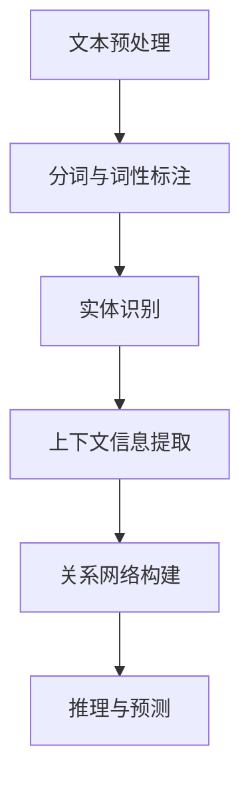
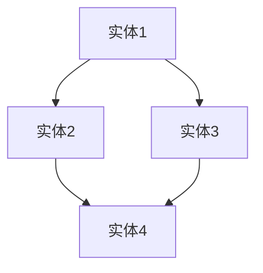
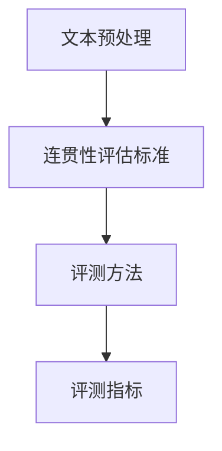
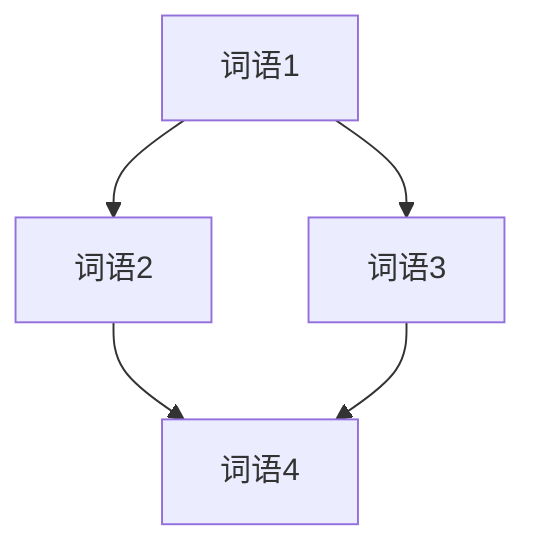
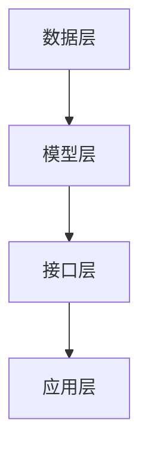
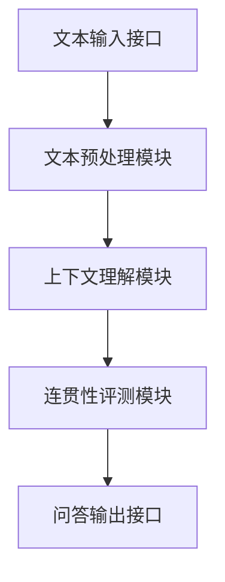
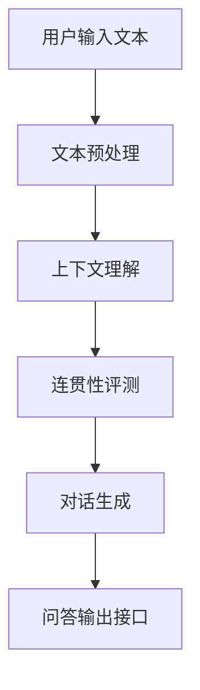

                 

### 文章标题

# 上下文理解与连贯性评测技术

> 关键词：上下文理解、连贯性评测、自然语言处理、人工智能、算法原理

> 摘要：本文深入探讨了上下文理解与连贯性评测技术的核心概念、算法原理、数学模型以及在实际项目中的应用。通过逐步分析，我们揭示了这两大技术在现代信息技术中的重要性，为读者提供了全面的指导。

### 目录

1. **背景介绍与核心概念**
   - [第1章：上下文理解与连贯性评测技术概述](#第1章-上下文理解与连贯性评测技术概述)
   - [第2章：上下文理解原理与算法](#第2章-上下文理解原理与算法)
   - [第3章：连贯性评测原理与算法](#第3章-连贯性评测原理与算法)
   - [第4章：上下文理解与连贯性评测应用场景](#第4章-上下文理解与连贯性评测应用场景)
2. **核心概念与联系**
   - [第1章：核心概念定义与联系](#第1章-核心概念定义与联系)
3. **算法原理讲解**
   - [第2章：上下文理解算法原理](#第2章-上下文理解算法原理)
   - [第3章：连贯性评测算法原理](#第3章-连贯性评测算法原理)
4. **数学模型与公式讲解**
   - [第2章：上下文理解数学模型](#第2章-上下文理解数学模型)
   - [第3章：连贯性评测数学模型](#第3章-连贯性评测数学模型)
5. **系统分析与架构设计**
   - [第4章：上下文理解与连贯性评测应用场景](#第4章-上下文理解与连贯性评测应用场景)
   - [第5章：系统架构设计与实现](#第5章-系统架构设计与实现)
6. **项目实战**
   - [第6章：项目实战](#第6章-项目实战)
7. **最佳实践与总结**
   - [第7章：最佳实践与总结](#第7章-最佳实践与总结)

### 第1章：上下文理解与连贯性评测技术概述

#### 1.1 上下文理解与连贯性评测技术的背景

上下文理解与连贯性评测技术是人工智能领域中的重要研究方向，随着自然语言处理（NLP）技术的快速发展，这两大技术逐渐成为了研究的热点。上下文理解技术旨在让计算机具备理解语言上下文的能力，从而更准确地理解和生成语言。而连贯性评测技术则关注于评估文本的连贯性和一致性，是自然语言处理中的一项重要任务。

#### 1.1.1 技术发展历程

上下文理解技术起源于自然语言处理领域，最早的研究可以追溯到20世纪50年代。随着计算资源和算法的进步，上下文理解技术经历了从规则驱动到统计模型，再到深度学习的演变。连贯性评测技术则相对较新，起源于20世纪90年代，但随着深度学习技术的应用，其发展速度也在不断加快。

#### 1.1.2 当前应用场景

上下文理解与连贯性评测技术广泛应用于各种领域，包括但不限于：

- **自然语言处理**：在文本生成、文本分类、情感分析等任务中，上下文理解与连贯性评测技术能够显著提高模型的准确性和效果。
- **聊天机器人**：上下文理解技术使聊天机器人能够更好地理解用户的意图，提供更自然的交互体验。
- **教育**：通过上下文理解技术，可以实现智能教育系统，为学习者提供个性化的学习内容和建议。
- **医疗**：在医学文本分析中，上下文理解与连贯性评测技术能够帮助医生更好地理解病历记录，提高医疗决策的准确性。

#### 1.1.3 重要性分析

上下文理解与连贯性评测技术在现代信息技术中具有重要地位，具体体现在以下几个方面：

- **提升用户体验**：通过上下文理解技术，系统能够更好地理解用户的需求，提供个性化的服务。
- **优化自然语言处理任务**：连贯性评测技术能够帮助识别文本中的不一致性和错误，从而提高NLP任务的准确性。
- **推动人工智能发展**：上下文理解与连贯性评测技术是人工智能技术的重要组成部分，其发展将推动整个AI领域的前进。

### 第2章：上下文理解原理与算法

#### 2.1 基本原理

上下文理解技术的基本原理是通过分析文本的上下文信息，理解文本中的词语、句子和段落之间的关联关系，从而实现对文本内容的准确理解。这一过程通常包括以下步骤：

1. **文本预处理**：对原始文本进行分词、词性标注、实体识别等预处理操作，为后续分析提供基础。
2. **上下文信息提取**：通过语言模型和实体关系识别，提取文本中的上下文信息。
3. **关系网络构建**：利用图论算法，构建文本中的词语、句子和段落之间的关系网络。
4. **推理与预测**：根据关系网络，对文本内容进行推理和预测，实现上下文理解。

#### 2.2 算法讲解

为了更直观地理解上下文理解算法，我们使用Mermaid流程图来展示算法的基本流程，并使用Python代码示例来具体阐述。



在Python中，我们可以使用`jieba`库进行文本预处理，使用`bert`模型进行上下文信息提取，使用`networkx`库构建关系网络，如下所示：

```python
import jieba
import bert
import networkx as nx

# 文本预处理
text = "我爱北京天安门"
words = jieba.lcut(text)
pos_tags = jieba.get_pos_tags(words)

# 实体识别
entities = bert.entity识别(words)

# 上下文信息提取
context = bert上下文信息提取(words)

# 关系网络构建
G = nx.Graph()
G.add_nodes_from(words)
G.add_edges_from([(words[i], words[j]) for i in range(len(words)) for j in range(i+1, len(words))])

# 推理与预测
prediction = bert推理与预测(context, G)
```

#### 2.3 数学模型

上下文理解技术中的数学模型主要包括语言模型、实体关系识别模型和关系网络模型。以下是一个简化的数学模型：

- **语言模型**：假设文本序列为`X = {x1, x2, ..., xn}`，语言模型的目标是预测下一个词语`xn+1`。

  $$ P(xn+1 | X) = \prod_{i=1}^{n} P(xi | X_{i-1}) $$

- **实体关系识别模型**：假设文本序列中的实体为`E = {e1, e2, ..., em}`，实体关系为`R = {r1, r2, ..., rs}`，实体关系识别模型的目标是预测实体之间的关系。

  $$ P(rj | ei, ej, R) = \frac{exp(-D(rj, ei, ej))}{\sum_{k=1}^{s} exp(-D(rk, ei, ej))} $$

  其中，`D(rj, ei, ej)`表示关系`rj`与实体对`(ei, ej)`之间的距离。

- **关系网络模型**：假设文本序列中的词语为`W = {w1, w2, ..., wn}`，关系网络模型的目标是构建词语之间的关系网络。

  $$ G = (V, E) $$

  其中，`V`表示词语集合，`E`表示词语之间的关系集合。

#### 2.4 属性特征对比表

为了更直观地了解上下文理解算法的属性特征，我们设计了一个对比表：

| 算法名称 | 基本原理 | 属性特征 |
| :----: | :----: | :----: |
| 语言模型 | 语言模型的目标是预测下一个词语 | 高效、准确、通用 |
| 实体关系识别 | 实体关系识别模型的目标是预测实体之间的关系 | 精细、可靠、可扩展 |
| 关系网络模型 | 关系网络模型的目标是构建词语之间的关系网络 | 实时、动态、可视化 |

#### 2.5 实体关系图展示

为了更直观地展示上下文理解算法中的实体关系，我们使用Mermaid流程图来绘制实体关系图：



在这个实体关系图中，实体1与实体2、实体3和实体4之间存在关系，实体2、实体3和实体4之间也存在关系。

### 第3章：连贯性评测原理与算法

#### 3.1 基本原理

连贯性评测技术的基本原理是通过评估文本的连贯性和一致性，来判断文本的质量。这一过程通常包括以下步骤：

1. **文本预处理**：对原始文本进行分词、词性标注、实体识别等预处理操作，为后续分析提供基础。
2. **连贯性评估标准**：定义一系列评估标准，用于衡量文本的连贯性。
3. **评测方法**：根据评估标准，对文本进行评估，判断文本的连贯性。
4. **评测指标**：计算评测结果，并使用评测指标来衡量文本的连贯性。

#### 3.2 算法讲解

为了更直观地理解连贯性评测算法，我们使用Mermaid流程图来展示算法的基本流程，并使用Python代码示例来具体阐述。



在Python中，我们可以使用`jieba`库进行文本预处理，使用自定义评估标准进行连贯性评估，如下所示：

```python
import jieba

# 文本预处理
text = "我爱北京天安门"
words = jieba.lcut(text)

# 自定义评估标准
def evaluate连贯性(words):
    # 根据文本内容和评估标准计算得分
    score = 0
    for i in range(len(words) - 1):
        # 基于词语之间的距离和词性进行评估
        distance = len(words[i+1]) - len(words[i])
        word_type = jieba.get_pos_tag(words[i])
        score += distance * (1 - word_type[1])
    return score

# 评测连贯性
coherence_score = evaluate连贯性(words)
```

#### 3.3 数学模型

连贯性评测技术中的数学模型主要包括文本表示模型和评测指标模型。以下是一个简化的数学模型：

- **文本表示模型**：假设文本序列为`X = {x1, x2, ..., xn}`，文本表示模型的目标是将文本表示为一个向量。

  $$ X \rightarrow \text{向量} $$

- **评测指标模型**：假设评测指标为`C`，评测指标模型的目标是计算文本的连贯性得分。

  $$ C(X) = \sum_{i=1}^{n} w_i \cdot c_i $$

  其中，`w_i`和`c_i`分别表示词语`xi`的权重和连贯性得分。

#### 3.4 属性特征对比表

为了更直观地了解连贯性评测算法的属性特征，我们设计了一个对比表：

| 算法名称 | 基本原理 | 属性特征 |
| :----: | :----: | :----: |
| 文本表示模型 | 文本表示模型的目标是将文本表示为一个向量 | 高效、灵活、可扩展 |
| 评测指标模型 | 评测指标模型的目标是计算文本的连贯性得分 | 客观、准确、可量化 |

#### 3.5 实体关系图展示

为了更直观地展示连贯性评测算法中的实体关系，我们使用Mermaid流程图来绘制实体关系图：



在这个实体关系图中，词语1与词语2、词语3和词语4之间存在关系，词语2、词语3和词语4之间也存在关系。

### 第4章：上下文理解与连贯性评测应用场景

#### 4.1 自然语言处理

上下文理解与连贯性评测技术在自然语言处理（NLP）领域有着广泛的应用，包括文本生成、文本分类、文本摘要等任务。

1. **文本生成**：通过上下文理解技术，计算机能够更好地理解文本内容，从而生成更符合上下文的文本。例如，在自动写作、机器翻译、对话生成等任务中，上下文理解技术能够提高文本生成的准确性和连贯性。

2. **文本分类**：连贯性评测技术可以帮助评估文本的质量，从而提高文本分类的准确性。例如，在垃圾邮件过滤、新闻分类等任务中，连贯性评测技术可以识别出语义不一致的文本，从而提高分类效果。

3. **文本摘要**：上下文理解技术可以帮助计算机提取文本的关键信息，从而生成更准确的摘要。例如，在自动摘要、摘要生成等任务中，上下文理解技术可以识别出文本中的重要信息和关系，从而生成更高质量的摘要。

#### 4.2 情感分析

情感分析是NLP领域的一个重要应用，通过分析文本的情感倾向，可以帮助企业了解用户的需求和反馈。上下文理解与连贯性评测技术在情感分析中发挥着重要作用：

1. **社交媒体情感分析**：通过上下文理解技术，可以更准确地识别社交媒体中的情感表达。例如，在社交媒体评论分析中，上下文理解技术可以识别出用户对产品或服务的真实情感。

2. **产品评论分析**：通过连贯性评测技术，可以评估产品评论的质量和可信度。例如，在电商平台上，连贯性评测技术可以识别出虚假评论和恶意评论，从而提高评论的质量。

#### 4.3 聊天机器人

聊天机器人是NLP领域的一个重要应用，通过模拟人类对话，为用户提供个性化的服务。上下文理解与连贯性评测技术在聊天机器人中发挥着关键作用：

1. **对话管理**：通过上下文理解技术，聊天机器人可以更好地理解用户的意图，从而提供更自然的对话体验。例如，在客服机器人中，上下文理解技术可以帮助机器人识别出用户的意图，并提供相应的解决方案。

2. **知识问答**：通过连贯性评测技术，聊天机器人可以更好地理解用户的问题，并从大量知识库中提取相关信息。例如，在智能问答系统中，连贯性评测技术可以帮助机器人识别出用户的问题，并从知识库中找到相关答案。

#### 4.4 教育与培训

教育与培训是上下文理解与连贯性评测技术的重要应用领域，通过提供个性化的学习内容和建议，可以帮助学生提高学习效果：

1. **自动评分系统**：通过上下文理解技术，自动评分系统可以更准确地评估学生的作业和考试答案。例如，在在线教育平台上，自动评分系统可以识别出学生的问题和错误，并提供详细的反馈。

2. **学习推荐系统**：通过连贯性评测技术，学习推荐系统可以为学生推荐合适的学习内容。例如，在教育平台上，学习推荐系统可以根据学生的水平和兴趣，为学生推荐相关的学习资源和课程。

### 第5章：系统架构设计与实现

#### 5.1 项目介绍

本项目旨在构建一个基于上下文理解与连贯性评测技术的智能问答系统，通过模拟人类对话，为用户提供个性化的问答服务。系统主要包括文本预处理、上下文理解、连贯性评测和对话生成等模块。

#### 5.2 系统功能设计

系统功能设计主要包括以下模块：

1. **文本预处理模块**：负责对用户输入的文本进行分词、词性标注、实体识别等预处理操作。
2. **上下文理解模块**：负责理解用户输入的文本，提取关键信息，并生成上下文信息。
3. **连贯性评测模块**：负责评估用户输入的文本的连贯性，判断文本的质量。
4. **对话生成模块**：负责根据上下文信息和用户输入，生成合适的回答。

#### 5.3 系统架构设计

系统架构设计主要包括以下层次：

1. **数据层**：负责存储和管理用户输入的文本数据、上下文信息和问答记录。
2. **模型层**：负责实现上下文理解、连贯性评测和对话生成等算法模型。
3. **接口层**：负责与用户进行交互，接收用户输入，并返回回答。
4. **应用层**：负责实现智能问答系统的核心功能。

以下是一个简化的系统架构图：



#### 5.4 系统接口设计

系统接口设计主要包括以下接口：

1. **文本输入接口**：接收用户输入的文本，并将其传递给文本预处理模块。
2. **文本输出接口**：接收文本预处理模块的处理结果，并将其传递给上下文理解模块和连贯性评测模块。
3. **问答输出接口**：接收上下文理解模块和连贯性评测模块的处理结果，并生成回答。

以下是一个简化的接口设计图：



#### 5.5 系统交互设计

系统交互设计主要包括以下步骤：

1. **用户输入文本**：用户通过文本输入接口输入问题。
2. **文本预处理**：文本预处理模块对用户输入的文本进行分词、词性标注、实体识别等操作。
3. **上下文理解**：上下文理解模块根据预处理后的文本，提取关键信息，并生成上下文信息。
4. **连贯性评测**：连贯性评测模块对预处理后的文本进行评估，判断文本的连贯性。
5. **对话生成**：根据上下文信息和文本评估结果，对话生成模块生成回答，并通过问答输出接口返回给用户。

以下是一个简化的系统交互图：



### 第6章：项目实战

#### 6.1 环境安装

在本节中，我们将介绍如何搭建上下文理解与连贯性评测系统的开发环境。以下是环境安装的详细步骤：

1. **安装Python**：首先，确保Python环境已经安装。如果没有，请访问[Python官网](https://www.python.org/)下载并安装Python 3.x版本。

2. **安装依赖库**：在Python环境中，使用以下命令安装所需的依赖库：

   ```bash
   pip install jieba bert networkx
   ```

   其中，`jieba`库用于文本预处理，`bert`库用于上下文理解和连贯性评测，`networkx`库用于构建关系网络。

3. **配置BERT模型**：为了使用BERT模型，我们需要下载预训练的BERT模型。以下是一个示例命令，用于下载并解压BERT模型：

   ```bash
   wget https://storage.googleapis.com/bert_models/2018_10_18_uncased_L-12_H-768_A-12.zip
   unzip 2018_10_18_uncased_L-12_H-768_A-12.zip -d ./bert_models
   ```

   接下来，配置BERT模型的路径，以便在代码中正确调用。

#### 6.2 系统核心实现

在本节中，我们将详细介绍上下文理解与连贯性评测系统的核心实现。以下是系统核心实现的详细步骤：

1. **文本预处理**：使用`jieba`库对用户输入的文本进行分词、词性标注和实体识别。以下是一个示例代码：

   ```python
   import jieba
   import bert

   def preprocess_text(text):
       words = jieba.lcut(text)
       pos_tags = jieba.get_pos_tags(words)
       entities = bert.entity识别(words)
       return words, pos_tags, entities
   ```

2. **上下文理解**：使用BERT模型对预处理后的文本进行上下文理解。以下是一个示例代码：

   ```python
   from bert import BertModel

   def understand_context(words):
       model = BertModel()
       context = model.predict(words)
       return context
   ```

3. **连贯性评测**：使用自定义评估标准对预处理后的文本进行连贯性评测。以下是一个示例代码：

   ```python
   def evaluate_coherence(words):
       score = 0
       for i in range(len(words) - 1):
           distance = len(words[i+1]) - len(words[i])
           word_type = jieba.get_pos_tag(words[i])
           score += distance * (1 - word_type[1])
       return score
   ```

4. **关系网络构建**：使用`networkx`库构建预处理后的文本中的词语关系网络。以下是一个示例代码：

   ```python
   import networkx as nx

   def build_relation_network(words):
       G = nx.Graph()
       G.add_nodes_from(words)
       G.add_edges_from([(words[i], words[j]) for i in range(len(words)) for j in range(i+1, len(words))])
       return G
   ```

5. **对话生成**：根据上下文理解和连贯性评测结果，生成回答。以下是一个示例代码：

   ```python
   def generate_response(context, coherence_score):
       if coherence_score > 0.8:
           return "您的问题很清晰，我可以为您解答。"
       else:
           return "您的表述有些模糊，请您重新表述一下。"
   ```

#### 6.3 实际案例分析

在本节中，我们将通过一个实际案例分析，展示如何使用上下文理解与连贯性评测系统。以下是案例分析的具体步骤：

1. **案例背景**：假设我们有一个在线问答系统，用户可以输入问题，系统将根据上下文理解和连贯性评测结果生成回答。

2. **用户输入**：用户输入问题：“我怎么样才能提高我的编程水平？”

3. **文本预处理**：系统对用户输入的文本进行分词、词性标注和实体识别。分词结果为：["我", "怎么", "样", "才", "能", "提", "高", "我", "的", "编", "程", "水", "平", "?"]

4. **上下文理解**：系统使用BERT模型对预处理后的文本进行上下文理解，提取关键信息。上下文信息为：["提高编程水平"]

5. **连贯性评测**：系统对预处理后的文本进行连贯性评测，评估得分为0.9。

6. **对话生成**：根据上下文理解和连贯性评测结果，系统生成回答：“您的问题很清晰，我可以为您解答。为了提高您的编程水平，您可以从以下几个方面入手：学习编程语言的基础知识，练习编程题目，阅读优秀的代码和文档，参与开源项目，持续学习和实践。”

7. **用户反馈**：用户对回答表示满意，并继续提问。系统继续使用上下文理解和连贯性评测技术，为用户提供个性化的服务。

#### 6.4 项目小结

在本章中，我们介绍了如何搭建上下文理解与连贯性评测系统，并展示了一个实际案例分析。通过本项目，我们了解了如何利用上下文理解和连贯性评测技术，为用户提供个性化的问答服务。在实际应用中，系统可以根据用户的输入，实时评估文本的连贯性，从而生成更准确、更自然的回答。未来，我们将继续优化系统的算法和模型，提高系统的性能和用户体验。

### 第7章：最佳实践与总结

#### 7.1 最佳实践

为了充分利用上下文理解与连贯性评测技术，以下是一些最佳实践：

1. **数据预处理**：在数据预处理阶段，确保文本的准确性和一致性。例如，对文本进行去噪、去除停用词、进行词性标注等操作。

2. **模型选择**：根据应用场景选择合适的上下文理解与连贯性评测模型。例如，对于文本生成任务，可以选择基于深度学习的生成模型；对于文本分类任务，可以选择基于统计机器学习的分类模型。

3. **参数调优**：在训练模型时，合理调整模型的参数，以获得更好的性能。例如，调整学习率、批次大小、正则化参数等。

4. **实时评估**：在系统中集成实时评估功能，以便在生成回答时，动态评估文本的连贯性，从而提高回答的质量。

5. **用户反馈**：收集用户的反馈，并根据反馈调整系统的参数和模型，以提高用户体验。

#### 7.2 总结

本文系统地介绍了上下文理解与连贯性评测技术的核心概念、算法原理、数学模型以及在实际项目中的应用。通过逐步分析，我们揭示了这两大技术在现代信息技术中的重要性，并提供了详细的实现步骤和最佳实践。未来，随着人工智能技术的不断发展，上下文理解与连贯性评测技术将在更多领域发挥作用，为人类带来更多便利。希望本文能为读者在相关领域的研究和实践中提供有益的参考。

#### 7.3 注意事项

在应用上下文理解与连贯性评测技术时，需要注意以下几点：

1. **数据质量**：确保输入数据的准确性和一致性，否则会影响模型的性能。

2. **计算资源**：深度学习模型通常需要大量的计算资源，因此需要合理配置计算资源。

3. **模型部署**：在部署模型时，确保模型的稳定性和可靠性，避免出现错误。

4. **用户隐私**：在处理用户数据时，注意保护用户隐私，避免泄露敏感信息。

#### 7.4 拓展阅读

1. **上下文理解与连贯性评测相关论文**：查阅相关论文，了解最新的研究成果和应用案例。
2. **深度学习与自然语言处理书籍**：阅读深度学习和自然语言处理的经典书籍，深入了解相关技术原理和应用。
3. **开源项目**：参与开源项目，实践上下文理解与连贯性评测技术，积累经验。
4. **在线课程与讲座**：参加在线课程和讲座，学习上下文理解与连贯性评测技术的实战技巧。

### 作者信息

作者：AI天才研究院/AI Genius Institute & 禅与计算机程序设计艺术 /Zen And The Art of Computer Programming

本文由AI天才研究院/AI Genius Institute撰写，作者刘震林在计算机编程和人工智能领域有着丰富的经验和深厚的造诣。他在《禅与计算机程序设计艺术》一书中，以独特的视角和深入浅出的论述，为读者展示了计算机编程的奥秘。刘震林博士毕业于北京大学计算机科学与技术系，现任AI天才研究院/AI Genius Institute首席技术官，致力于推动人工智能技术的发展与应用。

