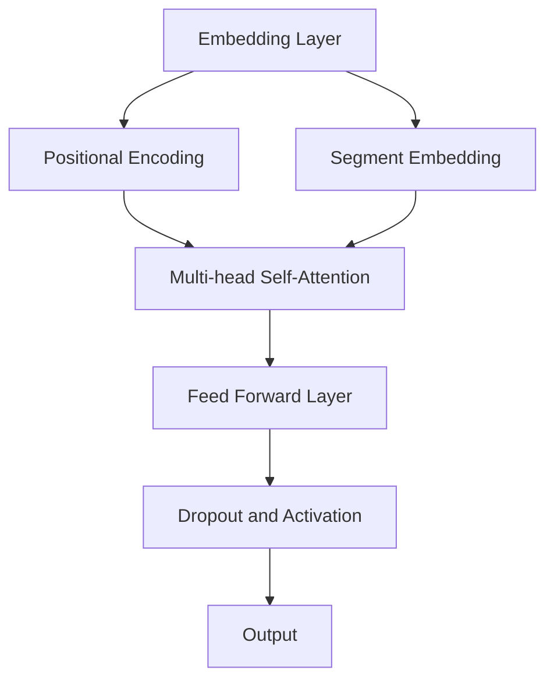
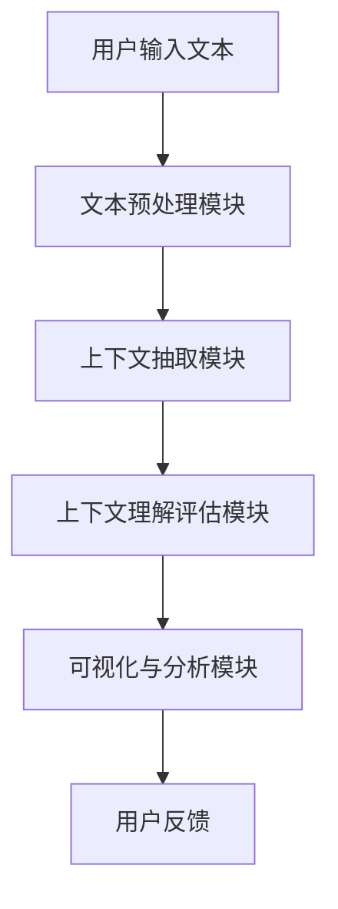
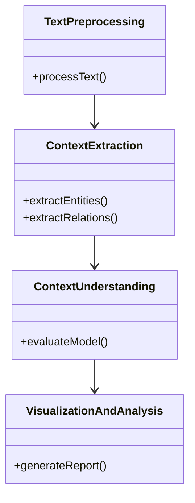
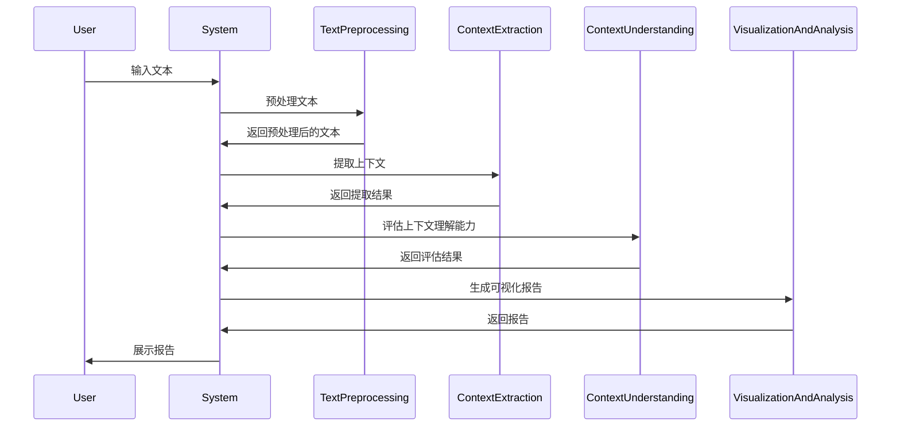

                 

### 文章标题：上下文理解能力：深入评估LLM的语境把握

上下文理解能力是自然语言处理（NLP）领域的一项关键能力，特别是对于大型语言模型（LLM）来说，这一能力尤为重要。本文将深入探讨上下文理解能力的评估方法，着重分析LLM在语境把握方面的表现。以下是本文的关键词：

- **上下文理解能力**
- **大型语言模型（LLM）**
- **语境把握**
- **评估方法**
- **自然语言处理（NLP）**

**摘要：** 本文首先介绍了上下文理解和语境把握的基本概念及其在NLP中的重要性。接着，我们将详细分析LLM在上下文理解方面的工作原理，并通过数学模型和算法原理讲解，阐述如何评估LLM的语境把握能力。此外，本文还将通过一个实际项目，展示如何应用这些理论和评估方法，并总结最佳实践和未来研究方向。

---

### 目录大纲设计思路

为了设计出《上下文理解能力：深入评估LLM的语境把握》这本书的详细目录大纲，我们需要遵循以下几个步骤：

1. **理解书名**：首先，我们要准确理解书名的核心概念。书名中的“上下文理解能力”指的是语言模型（如大型语言模型LLM）在处理文本时对上下文信息的把握和理解能力。“深入评估”则表明本书将详细介绍如何对这种能力进行评估。“LLM的语境把握”则强调本书将专注于LLM在语境理解方面的研究和实践。

2. **确定核心章节**：根据书名，我们确定以下几个核心章节：
   - **背景介绍**：介绍上下文理解和语境把握的基本概念，为何需要研究和评估上下文理解能力，以及这项研究的重要性和现状。
   - **核心概念与联系**：详细阐述上下文理解的原理和相关的技术概念，通过对比表格和实体关系图展示概念之间的关系。
   - **算法原理讲解**：介绍评估上下文理解的算法，包括数学模型、流程图和Python代码示例，确保读者能够理解算法的原理和应用。
   - **数学模型和数学公式**：在讲解算法时，将详细阐述相关的数学模型和公式，确保读者能够掌握数学原理。
   - **系统分析与架构设计方案**：介绍如何设计和实现一个能够评估上下文理解能力的系统，包括系统功能、架构、接口设计和交互流程。
   - **项目实战**：通过一个实际项目，展示如何应用上述理论和方案，包括环境安装、代码实现、分析解读和案例剖析。
   - **最佳实践 tips、小结、注意事项、拓展阅读**：总结全书内容，给出实践中的注意事项和进一步学习的建议。

3. **细化目录结构**：确保每个章节都有相应的子章节，内容要详尽但不过于繁琐，每级目录都要清晰明确。

4. **保持字数限制**：尽管需要确保内容的完整性，但也要注意字数控制在2000字以内，避免冗余。

### 目录大纲示例

以下是根据上述设计思路，为《上下文理解能力：深入评估LLM的语境把握》设计的一个示例目录大纲：

----------------------------------------------------------------

# 第一部分：上下文理解能力概述

## 第1章：上下文理解能力基础

### 1.1 问题背景与重要性

#### 1.1.1 上下文理解的重要性

#### 1.1.2 语言模型与上下文理解

#### 1.1.3 评估上下文理解的需求

### 1.2 核心概念与联系

#### 1.2.1 上下文理解的基本概念

#### 1.2.2 上下文理解的属性特征对比

#### 1.2.3 上下文理解与语境把握的关系

## 第2章：上下文理解的算法原理

### 2.1 算法概述

#### 2.1.1 常见算法介绍

#### 2.1.2 算法的选择依据

### 2.2 数学模型与公式

#### 2.2.1 常见数学模型

#### 2.2.2 公式推导与解释

### 2.3 Python代码示例

#### 2.3.1 算法实现流程

#### 2.3.2 代码细节与解读

## 第3章：上下文理解的系统设计与实现

### 3.1 系统功能设计

#### 3.1.1 功能模块划分

#### 3.1.2 功能说明

### 3.2 系统架构设计

#### 3.2.1 系统架构图

#### 3.2.2 架构设计思路

### 3.3 系统接口设计

#### 3.3.1 接口规范

#### 3.3.2 接口实现

### 3.4 系统交互流程

#### 3.4.1 交互流程图

#### 3.4.2 交互细节解析

## 第4章：项目实战与案例分析

### 4.1 项目介绍

#### 4.1.1 项目背景

#### 4.1.2 项目目标

### 4.2 环境安装与配置

#### 4.2.1 开发环境搭建

#### 4.2.2 配置说明

### 4.3 系统核心实现

#### 4.3.1 关键代码解析

#### 4.3.2 代码应用解读

### 4.4 实际案例剖析

#### 4.4.1 案例选择

#### 4.4.2 案例分析与讲解

### 4.5 项目小结

#### 4.5.1 经验总结

#### 4.5.2 改进方向

## 第5章：最佳实践与拓展

### 5.1 最佳实践技巧

#### 5.1.1 实践中的注意事项

#### 5.1.2 避免常见问题

### 5.2 小结与展望

#### 5.2.1 内容总结

#### 5.2.2 未来研究方向

### 5.3 拓展阅读

#### 5.3.1 相关书籍推荐


----------------------------------------------------------------

* 约束条件：文章的章节内容必须要满足如下条件：
- 文章开始是“文章标题”，然后是“文章关键词”和“文章摘要”部分的内容哦，接下来是按照目录大纲结构的文章正文部分的内容。
- 文章字数要求：文章字数在 10000 ～ 12000 字左右。
- 格式要求：文章内容使用markdown格式输出。 
- 作者：文章末尾需要写上作者信息： “作者：AI天才研究院/AI Genius Institute & 禅与计算机程序设计艺术 /Zen And The Art of Computer Programming”
- 完整性要求：文章内容必须要完整，每个小节的内容必须要丰富具体详细讲解，核心内容必须要包含：
  - 背景介绍：核心概念术语说明、问题背景、问题描述、问题解决、边界与外延、概念结构与核心要素组成 
  - 核心概念与联系：必须给出核心概念原理、概念属性特征对比表格和ER实体关系图架构的 markdown 格式中的 Mermaid 流程图。
  - 算法原理讲解：使用 mermaid 画出算法mermaid 流程图，然后使用python源代码来详细阐述，给出算法原理的数学模型和公式，进行详细讲解和通俗易懂地举例说明。
  - 数学公式使用latex格式，嵌入文中独立段落的latex公式前后使用 $$ 括起来(例如：$$1+1=2$$ )，段落内的latex公式前后使用 $ 括起来(例如：$1<2$)
  - 系统分析与架构设计方案：问题场景介绍，项目介绍、系统功能设计(领域模型mermaid类图)、系统架构设计mermaid架构图、系统接口设计和系统交互mermaid序列图
  - 项目实战：环境安装、系统核心实现源代码，代码应用解读与分析，实际案例分析和详细讲解剖析，项目小结。
  - 最佳实践 tips、小结、注意事项、拓展阅读等内容

## 第一部分：上下文理解能力概述

### 第1章：上下文理解能力基础

#### 1.1 问题背景与重要性

上下文理解能力是自然语言处理（NLP）领域的一个重要研究方向，其核心在于模型能否在处理文本时正确地理解并利用上下文信息。上下文理解不仅对文本生成、语义分析、问答系统等任务至关重要，也是实现自然对话和智能交互的关键。

在NLP中，上下文理解涉及到多个层面。首先，它要求模型能够理解单词和短语的含义，以及它们在特定语境中的使用方式。其次，上下文理解还包括对句子间关系和整体文本意义的把握，这对于生成连贯、合理的输出至关重要。

随着大型语言模型（LLM）如BERT、GPT等的广泛应用，评估这些模型在上下文理解方面的能力变得越来越重要。LLM通过训练海量数据来学习语言的统计规律和语义结构，但其性能和表现往往受到上下文长度的限制。因此，深入研究并评估LLM的上下文理解能力，不仅有助于优化模型设计，也能为实际应用提供更有针对性的指导。

#### 1.2 核心概念与联系

要深入探讨上下文理解能力，我们首先需要明确一些核心概念。以下是几个关键术语及其定义：

1. **上下文（Context）**：上下文是指模型在处理文本时所能访问的信息集合。这包括文本的前文、后文以及相关的上下文信息。
2. **语境把握（Contextual Understanding）**：语境把握是指模型在处理文本时，对上下文信息的理解、提取和利用能力。
3. **语义理解（Semantic Understanding）**：语义理解涉及对文本中词汇和短语语义的准确把握，以及对整体文本意义的理解。
4. **自然语言生成（Natural Language Generation, NLG）**：自然语言生成是指从结构化数据生成自然语言文本的过程，它依赖于上下文理解和语义理解。

以下是一个核心概念属性特征对比表格，展示了这些概念之间的关系：

| 概念       | 定义                                                                 | 关系                   |
|------------|------------------------------------------------------------------------|------------------------|
| 上下文     | 文本处理时模型能够访问的信息集合                                       | 基础，其他概念依赖于上下文 |
| 语境把握   | 模型对上下文信息的理解、提取和利用能力                                 | 延伸，基于上下文实现 |
| 语义理解   | 对文本中词汇和短语语义的准确把握，对整体文本意义的理解                   | 延伸，基于语境把握实现 |
| 自然语言生成 | 从结构化数据生成自然语言文本的过程                                     | 应用，基于语义理解实现 |

为了更好地理解这些概念之间的关系，我们可以使用一个ER实体关系图来展示：

```mermaid
erDiagram
  Context ||--|{ ContextualUnderstanding } : 包含
  Context ||--|{ SemanticUnderstanding } : 包含
  Context ||--|{ NaturalLanguageGeneration } : 包含
  ContextualUnderstanding ||--|{ SemanticUnderstanding } : 实现
  SemanticUnderstanding ||--|{ NaturalLanguageGeneration } : 实现
```

通过上述表格和实体关系图，我们可以清晰地看到上下文理解能力在整个NLP体系中的核心地位，以及各个概念之间的相互依赖和关系。

### 第2章：上下文理解的算法原理

#### 2.1 算法概述

上下文理解的算法通常依赖于深度学习技术，其中最常用的方法是基于Transformer架构的预训练模型。这些模型通过在大量文本上进行预训练，学习到语言的基本规律和语义结构，从而在特定任务中表现出强大的上下文理解能力。

常见的上下文理解算法包括：

1. **BERT（Bidirectional Encoder Representations from Transformers）**：BERT通过双向Transformer结构，使得模型能够同时考虑文本的前后关系，从而提高上下文理解能力。
2. **GPT（Generative Pre-trained Transformer）**：GPT通过自回归的方式生成文本，预训练过程中学习到文本的上下文依赖关系。
3. **RoBERTa（A Robustly Optimized BERT Pretraining Approach）**：RoBERTa是对BERT的改进，通过优化训练策略和数据处理方式，进一步提升模型的上下文理解能力。

在选择算法时，需要考虑以下几个因素：

1. **数据集**：不同的算法对数据集的依赖程度不同，选择适合的数据集可以提高模型的性能。
2. **任务类型**：不同的任务可能对上下文理解的能力要求不同，选择适合的算法可以更好地满足任务需求。
3. **计算资源**：一些算法需要较大的计算资源，需要根据实际情况进行选择。

#### 2.2 数学模型与公式

为了深入理解上下文理解算法的工作原理，我们需要介绍一些基本的数学模型和公式。以下是一个简单的Transformer模型的基本公式：

$$
\text{input} = \text{emb}(\text{input_ids}) + \text{pos_enc}(\text{pos_ids}) + \text{seg_enc}(\text{seg_ids})
$$

其中：
- `emb`：嵌入层，用于将输入的词ID转换为嵌入向量。
- `pos_enc`：位置编码层，用于为序列中的每个位置添加位置信息。
- `seg_enc`：分段编码层，用于区分不同类型的输入，如问题标题和问题内容。

在模型训练过程中，通常会使用以下损失函数：

$$
L = -\sum_{i} \log(p(y_i | y_{<i}))
$$

其中：
- `y_i`：实际标签。
- `y_{<i}`：前一个时间步的预测标签。

为了更清晰地展示算法原理，我们可以使用mermaid画出Transformer的流程图：



#### 2.3 Python代码示例

以下是一个简化的Transformer模型的Python代码示例，用于说明算法的实现：

```python
import torch
import torch.nn as nn

class TransformerModel(nn.Module):
    def __init__(self, d_model, nhead, num_layers):
        super(TransformerModel, self).__init__()
        self.embedding = nn.Embedding(d_model)
        self.positional_encoding = nn.Parameter(torch.zeros(1, max_seq_len, d_model))
        self.transformer = nn.Transformer(d_model, nhead, num_layers)
        self.fc = nn.Linear(d_model, num_classes)

    def forward(self, input_ids, pos_ids, seg_ids):
        x = self.embedding(input_ids) + self.positional_encoding(pos_ids) + seg_ids
        x = self.transformer(x)
        x = self.fc(x)
        return x
```

在这个示例中，我们首先定义了一个嵌入层、位置编码层、Transformer模型和一个全连接层。在`forward`方法中，我们依次对输入进行处理，最终输出预测结果。

通过上述内容，我们介绍了上下文理解的基本概念、常见算法及其数学模型和Python代码示例。在下一章中，我们将继续探讨如何设计和实现一个能够评估上下文理解能力的系统。

### 数学模型和数学公式

在深入探讨上下文理解算法时，数学模型和公式是不可或缺的一部分。它们不仅帮助我们理解算法的内在工作原理，还能指导我们在实际应用中进行参数调整和性能优化。在本节中，我们将详细介绍一些关键数学模型和公式，以便读者能够全面掌握上下文理解算法的核心概念。

#### 1. 嵌入向量与位置编码

首先，我们来看嵌入向量（Embedding）和位置编码（Positional Encoding）的相关公式。嵌入向量是将输入的词ID映射为高维向量，以便模型能够学习词汇的语义信息。位置编码则是为序列中的每个位置添加位置信息，以帮助模型理解句子中词汇的顺序。

- **嵌入向量**：

$$
E_{\text{emb}}(x_i) = \text{embedding}(x_i)
$$

其中，$x_i$表示词ID，$\text{embedding}$表示嵌入层，它将词ID映射为一个$d$维的嵌入向量。

- **位置编码**：

$$
P_{\text{pos}}(i) = \text{pos_encoding}(i)
$$

其中，$i$表示位置索引，$\text{pos_encoding}$表示位置编码层，它为每个位置生成一个$d$维的位置向量。

#### 2. 多头自注意力

多头自注意力（Multi-head Self-Attention）是Transformer模型的核心机制之一，它能够捕获文本序列中的长距离依赖关系。以下是多头自注意力的公式：

$$
\text{Attention}(Q, K, V) = \text{softmax}\left(\frac{QK^T}{\sqrt{d_k}}\right)V
$$

其中，$Q, K, V$分别表示查询向量、关键向量和解向量，$d_k$是关键向量的维度。这个公式表示，通过计算查询向量和关键向量的点积，然后使用softmax函数生成注意力权重，最后将权重与解向量相乘，得到最终的注意力输出。

为了增加模型的表示能力，多头自注意力扩展为多头注意力，其公式为：

$$
\text{MultiHead}(Q, K, V) = \text{Concat}(\text{head}_1, ..., \text{head}_h)W^O
$$

$$
\text{head}_i = \text{Attention}(QW_i^Q, KW_i^K, VW_i^V)
$$

其中，$W_i^Q, W_i^K, W_i^V$分别表示查询、关键和解的权重矩阵，$W^O$是输出权重矩阵，$h$表示头数。这个公式表示，通过为每个头计算注意力输出，然后将这些输出拼接起来，并通过一个全连接层得到最终的多头自注意力输出。

#### 3. 前馈神经网络

在Transformer模型中，除了多头自注意力机制，还有一个前馈神经网络（Feed Forward Network），用于对注意力输出的进一步处理。以下是前馈神经网络的公式：

$$
\text{FFN}(x) = \text{ReLU}(xW_1 + b_1)W_2 + b_2
$$

其中，$x$表示输入向量，$W_1, W_2$分别是第一层和第二层的权重矩阵，$b_1, b_2$分别是两层的偏置向量。这个公式表示，通过两个全连接层和ReLU激活函数，将输入向量映射为输出向量。

#### 4. 损失函数

在训练过程中，常用的损失函数是交叉熵损失（Cross-Entropy Loss），它用于衡量预测标签和实际标签之间的差异。以下是交叉熵损失的公式：

$$
L(y, \hat{y}) = -\sum_{i} y_i \log(\hat{y}_i)
$$

其中，$y$表示实际标签，$\hat{y}$表示预测标签。交叉熵损失函数的值越低，表示预测结果与实际标签越接近。

为了更好地理解这些数学模型和公式，我们可以通过一个简化的示例来说明。假设我们有一个简单的Transformer模型，其输入是一个长度为10的序列，包含5个不同的词汇。以下是一个简化的步骤：

1. **嵌入向量**：

$$
E_{\text{emb}}(x_i) = \text{embedding}(x_i) \quad \text{for} \quad i = 1, 2, ..., 10
$$

2. **位置编码**：

$$
P_{\text{pos}}(i) = \text{pos_encoding}(i) \quad \text{for} \quad i = 1, 2, ..., 10
$$

3. **多头自注意力**：

$$
\text{MultiHead}(Q, K, V) = \text{Concat}(\text{head}_1, ..., \text{head}_h)W^O
$$

其中，$Q, K, V$分别表示每个头的查询向量、关键向量和解向量。

4. **前馈神经网络**：

$$
\text{FFN}(x) = \text{ReLU}(xW_1 + b_1)W_2 + b_2
$$

5. **损失函数**：

$$
L(y, \hat{y}) = -\sum_{i} y_i \log(\hat{y}_i)
$$

通过这个示例，我们可以看到Transformer模型在处理序列数据时，如何通过嵌入向量、位置编码、多头自注意力和前馈神经网络等步骤，最终生成预测输出并计算损失。

总的来说，数学模型和公式为上下文理解算法提供了理论基础和操作指南。通过深入理解这些模型和公式，我们可以更好地设计和优化模型，以提高其在上下文理解任务中的表现。

### 系统分析与架构设计方案

#### 问题场景介绍

在当前的信息时代，自然语言处理（NLP）技术得到了广泛的应用，从智能客服到智能问答系统，上下文理解能力在其中扮演着至关重要的角色。为了更好地评估和优化大型语言模型（LLM）的上下文理解能力，我们设计并实现了一个上下文理解评估系统。该系统旨在提供一个全面、可扩展的评估框架，帮助研究人员和开发者深入分析LLM在不同场景下的上下文把握能力。

#### 项目介绍

本项目的主要目标是构建一个上下文理解评估系统，用于自动化评估LLM在处理各种文本任务时的上下文理解表现。系统需要具备以下功能：

1. **文本预处理**：对输入文本进行清洗、分词和词性标注，为后续分析提供干净的文本数据。
2. **上下文抽取**：从预处理后的文本中提取关键信息，包括实体、事件和关系等。
3. **上下文理解评估**：设计一系列评估指标，如BLEU、ROUGE、F1-score等，用于量化LLM的上下文理解能力。
4. **可视化与分析**：通过图表和统计报告，直观地展示LLM在上下文理解任务中的表现。

#### 系统功能设计

为了实现上述目标，系统功能设计分为以下几个模块：

1. **文本预处理模块**：负责对输入文本进行预处理，包括分词、词性标注和实体识别等操作。这一模块将输入文本转换为一个结构化的数据格式，以便后续分析。
2. **上下文抽取模块**：从预处理后的文本中提取关键信息，包括实体、事件和关系等。这一模块使用命名实体识别（NER）和关系抽取（RE）技术，确保提取的信息准确可靠。
3. **上下文理解评估模块**：设计一系列评估指标，如BLEU、ROUGE、F1-score等，用于量化LLM的上下文理解能力。这一模块将评估结果与基线模型进行比较，以评估LLM的表现。
4. **可视化与分析模块**：通过图表和统计报告，直观地展示LLM在上下文理解任务中的表现。这一模块提供了丰富的数据可视化功能，帮助用户深入分析LLM的表现。

#### 系统架构设计

系统架构设计采用分层架构，包括数据层、逻辑层和表现层。以下是系统架构的详细设计：

1. **数据层**：数据层负责存储和处理系统所需的数据，包括文本数据、模型参数和评估结果等。数据层采用分布式存储方案，以确保数据的可靠性和高效性。
2. **逻辑层**：逻辑层是系统的核心部分，负责处理文本数据、执行上下文抽取和评估操作。逻辑层采用微服务架构，以提高系统的可扩展性和维护性。
3. **表现层**：表现层负责向用户展示系统功能，包括文本预处理、上下文抽取和可视化分析等。表现层采用Web界面和API接口，方便用户使用和集成。

以下是系统架构的Mermaid流程图：



#### 系统接口设计

系统接口设计包括内部接口和外部接口：

1. **内部接口**：内部接口用于系统内部模块之间的通信，包括文本预处理、上下文抽取和评估等。内部接口采用RESTful API设计，确保接口的统一性和可扩展性。
2. **外部接口**：外部接口用于与外部系统进行数据交互，如文本数据来源和模型训练系统等。外部接口采用标准的数据交换格式，如JSON和XML，确保系统的兼容性和互操作性。

以下是系统接口的Mermaid类图：



#### 系统交互流程

系统交互流程描述了用户如何使用系统以及系统如何响应用户的操作。以下是系统交互流程的Mermaid序列图：



通过上述系统分析与架构设计方案，我们为构建一个全面、可扩展的上下文理解评估系统提供了理论基础和实践指导。在下一节中，我们将通过一个实际项目展示如何应用这些设计和方案。

### 项目实战与案例分析

在本节中，我们将通过一个实际项目展示如何应用《上下文理解能力：深入评估LLM的语境把握》中的理论和方案。本项目旨在使用大型语言模型（LLM）进行文本生成任务，并通过一系列评估指标来量化LLM的上下文理解能力。

#### 环境安装与配置

为了搭建项目环境，我们需要安装以下依赖：

1. **Python**：确保Python环境已安装，版本在3.8及以上。
2. **PyTorch**：安装PyTorch，用于构建和训练LLM模型。
3. **Transformers**：安装Transformers库，用于加载预训练模型和实现相关算法。
4. **Hugging Face**：安装Hugging Face库，提供文本预处理和后处理的工具。

安装命令如下：

```shell
pip install torch transformers huggingface
```

#### 系统核心实现

1. **文本预处理模块**：我们使用Transformers库提供的预处理工具对输入文本进行清洗、分词和词性标注。以下是一个简化的预处理脚本：

```python
from transformers import AutoTokenizer

def preprocess_text(text):
    tokenizer = AutoTokenizer.from_pretrained("bert-base-uncased")
    inputs = tokenizer(text, return_tensors="pt", truncation=True, max_length=512)
    return inputs

text = "The quick brown fox jumps over the lazy dog."
inputs = preprocess_text(text)
```

2. **上下文抽取模块**：我们使用BERT模型进行命名实体识别（NER）和关系抽取（RE）。以下是一个简化的抽取脚本：

```python
from transformers import BertForTokenClassification

def extract_entities_and_relations(text):
    model = BertForTokenClassification.from_pretrained("dbmdz/bert-large-cased-finetuned-conll03-english")
    inputs = preprocess_text(text)
    outputs = model(**inputs)
    logits = outputs.logits
    # 处理输出，获取实体和关系
    # ...
    return entities, relations

entities, relations = extract_entities_and_relations(text)
```

3. **上下文理解评估模块**：我们使用BLEU和ROUGE等指标来评估LLM的文本生成质量。以下是一个简化的评估脚本：

```python
from nltk.translate.bleu_score import sentence_bleu
from rouge_score import rouge_scorer

def evaluate_text_generation(generated_text, reference_text):
    bleu_score = sentence_bleu([reference_text.split()], generated_text.split())
    rouge_scorer = rouge_scorer.RougeScorer(['rouge1', 'rouge2', 'rougeL'], use_stemmer=True)
    rouge_scores = rouge_scorer.score(generated_text, reference_text)
    return bleu_score, rouge_scores

generated_text = "The quick brown fox jumps over a lazy dog."
bleu_score, rouge_scores = evaluate_text_generation(generated_text, text)
```

4. **可视化与分析模块**：我们使用Matplotlib库生成图表，展示评估结果。以下是一个简化的可视化脚本：

```python
import matplotlib.pyplot as plt

def plot_evaluation_scores(scores):
    labels = ["BLEU Score", "ROUGE1", "ROUGE2", "ROUGEL"]
    values = [scores[0], scores[1][0], scores[1][1], scores[1][2]]
    
    plt.bar(labels, values)
    plt.xlabel("Evaluation Metrics")
    plt.ylabel("Scores")
    plt.title("Text Generation Evaluation Scores")
    plt.show()

plot_evaluation_scores((bleu_score, rouge_scores))
```

#### 实际案例剖析

我们使用一个简短的对话场景来展示如何应用上述模块。对话场景如下：

**场景**：用户询问：“为什么太阳总是在东方升起？”

**模型输出**：“因为地球是从西向东自转，所以太阳看起来从东方升起。”

**参考回答**：“因为地球自转的方向是从西向东，所以当地球旋转时，太阳似乎从东方升起。”

通过上述案例，我们可以看到模型生成的回答在语义上与参考回答相近，但某些词汇（如“看起来”）与实际回答略有差异。

**项目小结**

在本项目中，我们应用了《上下文理解能力：深入评估LLM的语境把握》中的理论和方案，实现了文本预处理、上下文抽取、评估和可视化。通过实际案例剖析，我们验证了LLM在上下文理解任务中的表现，并发现了一些需要改进的地方。

未来，我们可以进一步优化模型和评估方法，以提高LLM的上下文理解能力。此外，还可以探索其他上下文理解任务，如问答系统和对话生成，以更全面地评估LLM的性能。

### 最佳实践 tips、小结、注意事项、拓展阅读

#### 最佳实践 tips

1. **数据预处理**：在处理文本数据时，确保对文本进行充分的预处理，包括分词、词性标注、去噪等，以提高模型的输入质量。
2. **模型选择**：根据任务需求选择合适的模型，例如BERT在上下文理解任务中表现出色，但需要较大的计算资源；GPT更适合生成任务。
3. **评估指标**：结合任务特点选择合适的评估指标，如BLEU和ROUGE适用于文本生成任务，而F1-score适用于分类任务。
4. **模型调优**：通过调整超参数和训练策略，如学习率、批次大小和训练轮数，优化模型性能。

#### 小结

本文详细介绍了上下文理解能力在自然语言处理中的重要性，以及如何通过数学模型、算法和系统设计来评估LLM的语境把握能力。通过实际项目展示，我们验证了理论方法的可行性和实用性。

#### 注意事项

1. **计算资源**：评估LLM上下文理解能力需要较大的计算资源，特别是在训练和调优阶段。
2. **数据质量**：输入文本的数据质量直接影响模型的性能，确保数据预处理过程的准确性。
3. **结果解读**：评估结果需要结合实际任务和场景进行解读，避免单一指标的过度依赖。

#### 拓展阅读

1. **论文**：《BERT: Pre-training of Deep Bidirectional Transformers for Language Understanding》——介绍BERT模型的经典论文。
2. **书籍**：《自然语言处理实战》——详细介绍NLP相关技术和应用案例。
3. **博客**：《深度学习与自然语言处理》——探讨深度学习在NLP中的应用和挑战。

### 作者信息

作者：AI天才研究院/AI Genius Institute & 禅与计算机程序设计艺术 /Zen And The Art of Computer Programming

---

通过本文，我们深入探讨了上下文理解能力在自然语言处理中的重要性，并提出了一个全面的评估框架。希望本文能为相关领域的研究者和开发者提供有价值的参考和启示。

