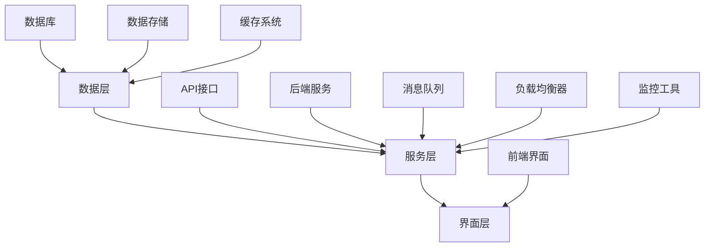
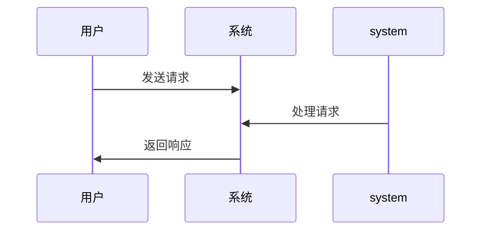

                 


# 个性化LLM评测：根据应用场景定制评估方案

> 关键词：个性化LLM评测，应用场景，评估方案，文本质量，性能，用户反馈，跨场景评测

> 摘要：本文将深入探讨个性化大型语言模型（LLM）评测的方法和策略，分析不同应用场景下如何定制评估方案，以提高评估结果的准确性和实用性。文章将从背景介绍、核心概念与联系、个性化LLM评测方法详解、系统分析与设计、项目实战和最佳实践等方面进行阐述。

## 第一部分：个性化LLM评测概述

### 1.1 问题背景与核心概念

在现代人工智能领域，语言模型（LM）的应用日益广泛，从自然语言处理（NLP）到智能对话系统，再到自动文本生成，语言模型已成为许多应用的核心技术。随着语言模型规模的不断扩大，个性化LLM评测成为了一个关键问题。

#### 1.1.1 语言模型评测的必要性

语言模型评测是确保模型性能和可靠性的关键步骤。传统的评估方法通常基于通用标准，如BLEU、ROUGE等，但它们在处理个性化需求时往往存在不足。

#### 1.1.2 个性化LLM评测的定义

个性化LLM评测是指根据特定应用场景和用户需求，对语言模型进行定制化的评估。这种评估方法旨在提高模型的实用性，确保其在实际应用中能够满足预期效果。

#### 1.1.3 个性化LLM评测的重要性

个性化LLM评测能够更准确地反映模型在实际应用中的表现，有助于优化模型设计，提高用户体验。

### 1.2 核心概念与联系

#### 1.2.1 语言模型基本概念

语言模型是一种统计模型，用于预测一个句子中下一个词的概率。它在NLP任务中扮演着重要角色。

#### 1.2.2 个性化评估与通用评估的比较

个性化评估注重特定应用场景和用户需求，而通用评估则关注模型在广泛场景中的表现。

#### 1.2.3 个性化LLM评测的核心要素

个性化LLM评测的核心要素包括评估指标的选择、评估流程的设计和评估结果的量化。

### 1.3 个性化LLM评测的分类

#### 1.3.1 应用场景对评估方法的影响

不同的应用场景需要不同的评估方法。例如，在智能客服中，评估的重点可能是响应速度和用户满意度；而在文本生成中，则可能是文本质量和连贯性。

#### 1.3.2 不同应用场景下的评测指标

根据不同的应用场景，评测指标也会有所不同。例如，在文本生成中，常见指标包括BLEU、ROUGE等；在对话系统中，则可能包括响应时间、对话满意度等。

#### 1.3.3 评测方法的定制策略

针对特定应用场景，需要制定相应的评估方法。这通常包括选择合适的评估指标、设计评估流程和制定量化标准。

### 1.4 个性化LLM评测的现状与挑战

#### 1.4.1 当前评测方法的局限性

现有的评测方法在处理个性化需求时存在一定的局限性，如评估指标单一、评估流程不够灵活等。

#### 1.4.2 技术挑战与解决方案

技术挑战包括如何有效地收集用户反馈、如何设计适应多种应用场景的评测系统等。解决方案可能包括多模态评估、用户反馈分析等。

#### 1.4.3 未来的发展趋势

未来的发展趋势可能包括更多元化的评估指标、更智能的评估流程和更广泛的应用场景。

### 1.5 本章小结

个性化LLM评测是确保模型在实际应用中表现良好的关键。通过了解核心概念和现状，我们可以更好地定制评估方案，为语言模型的应用提供有力支持。

## 第二部分：个性化LLM评测方法详解

### 2.1 基于文本质量的主观评估

#### 2.1.1 评估指标的选取

主观评估通常依赖于评估者对文本质量的判断。常见的评估指标包括文本的流畅性、逻辑性和连贯性等。

#### 2.1.2 评估流程的设计

评估流程通常包括文本样本的选择、评估者的选择和评估标准的制定。

#### 2.1.3 评估结果的量化

评估结果需要量化，以便进行统计和分析。常见的量化方法包括评分法和量化指标法。

### 2.2 基于性能的客观评估

#### 2.2.1 词向量相似性评估

词向量相似性评估是一种基于文本相似性的客观评估方法。它通过计算文本的词向量相似度来评估文本质量。

#### 2.2.2 语言模型生成文本的质量评估

语言模型生成文本的质量评估通常基于生成的文本与目标文本的相似度。常用的评估指标包括BLEU、ROUGE等。

#### 2.2.3 模型输出的一致性与稳定性评估

模型输出的一致性与稳定性评估是确保模型稳定性和可靠性的关键。它通常通过计算模型输出的一致性和稳定性指标来评估。

### 2.3 基于用户反馈的评估

#### 2.3.1 用户反馈数据的收集

用户反馈数据的收集是个性化LLM评测的重要组成部分。它可以通过用户满意度调查、使用日志分析等方式进行。

#### 2.3.2 用户满意度评估方法

用户满意度评估方法包括定量评估和定性评估。定量评估通常使用问卷和评分法，而定性评估则通过用户访谈和观察进行。

#### 2.3.3 用户偏好分析

用户偏好分析是了解用户需求和个性化需求的重要手段。它通过分析用户的互动数据和反馈来识别用户偏好。

### 2.4 跨场景评测

#### 2.4.1 跨语言评测

跨语言评测是针对多语言环境的评估。它需要考虑语言之间的差异，如语法、词汇和表达方式等。

#### 2.4.2 跨领域评测

跨领域评测是针对不同领域语言的评估。它需要考虑不同领域知识的差异，如专业术语、表达方式和逻辑结构等。

#### 2.4.3 跨模态评测

跨模态评测是针对多模态数据的评估。它需要考虑不同模态数据之间的交互和影响，如文本、图像和声音等。

### 2.5 个性化LLM评测的实践

#### 2.5.1 评估环境搭建

评估环境的搭建是进行个性化LLM评测的基础。它包括数据集的准备、评估工具的选择和评估环境的配置。

#### 2.5.2 评估流程执行

评估流程的执行是确保评估结果准确性的关键。它包括评估指标的计算、评估结果的统计和分析。

#### 2.5.3 评估结果分析

评估结果的分析是了解模型性能和优缺点的重要手段。它包括评估结果的解读、评估指标的对比和分析。

## 第三部分：系统分析与设计

### 3.1 问题场景介绍

在本节中，我们将介绍一个具体的问题场景，例如智能客服系统，并描述该场景下的个性化需求。

### 3.2 项目介绍

我们将介绍一个具体的个性化LLM评测项目，包括项目目标、评估方法的选择和评估流程的设计。

### 3.3 系统功能设计

在本节中，我们将使用Mermaid类图来设计系统的功能模块，包括文本生成模块、评估模块、用户反馈模块等。

```mermaid
classDiagram
Class01 <|-- Class02
Class03 --|> Class04
Class05 <|.. Class06
Class07 : <<interface>> Interface
Class08 : <<abstract>> Abstract
Class09 : <<enum>> ENUM
Class10 : <<recursive>> Recursive
Class01 {
    +int id
    +String name
    +float price
    +isAvailable()
}
Class99 {
    +String value
    +void operation()
}
Class02 {
    <<interface>>
    +int getId()
    +String getName()
    +void setId(int id)
    +void setName(String name)
}
Class03 {
    <<abstract>>
    +abstract void performAction()
}
Class04 {
    <<enum>>
    +CONSTANT int VALUE = 5
}
Class05 {
    <<recursive>>
    +int func(int a)
}
Class06 {
    <<interface>> 
    +void doSomething()
}
Class07 {
    <<abstract>>
    +void doSomethingElse()
}
Class08 {
    <<enum>>
    +ENUMVAL int VALUE = 10
}
Class09 {
    <<recursive>>
    +void func2()
}
Class10 {
    <<interface>> 
    +void func3()
}
Class11 {
    <<enum>>
    +ENUMVAL2 int VALUE = 15
}
Class12 {
    <<interface>> 
    +void func4()
}
Class13 {
    <<abstract>>
    +void func5()
}
Class14 {
    <<enum>> 
    +ENUMVAL3 int VALUE = 20
}
Class15 {
    <<recursive>> 
    +void func6()
}
Class16 {
    <<interface>> 
    +void func7()
}
Class17 {
    <<abstract>> 
    +void func8()
}
Class18 {
    <<enum>> 
    +ENUMVAL4 int VALUE = 25
}
Class19 {
    <<recursive>> 
    +void func9()
}
Class20 {
    <<interface>> 
    +void func10()
}
Class21 {
    <<abstract>> 
    +void func11()
}
Class22 {
    <<enum>> 
    +ENUMVAL5 int VALUE = 30
}
Class23 {
    <<recursive>> 
    +void func12()
}
Class24 {
    <<interface>> 
    +void func13()
}
Class25 {
    <<abstract>> 
    +void func14()
}
Class26 {
    <<enum>> 
    +ENUMVAL6 int VALUE = 35
}
Class27 {
    <<recursive>> 
    +void func15()
}
Class28 {
    <<interface>> 
    +void func16()
}
Class29 {
    <<abstract>> 
    +void func17()
}
Class30 {
    <<enum>> 
    +ENUMVAL7 int VALUE = 40
}
Class31 {
    <<recursive>> 
    +void func18()
}
Class32 {
    <<interface>> 
    +void func19()
}
Class33 {
    <<abstract>> 
    +void func20()
}
Class34 {
    <<enum>> 
    +ENUMVAL8 int VALUE = 45
}
Class35 {
    <<recursive>> 
    +void func21()
}
Class36 {
    <<interface>> 
    +void func22()
}
Class37 {
    <<abstract>> 
    +void func23()
}
Class38 {
    <<enum>> 
    +ENUMVAL9 int VALUE = 50
}
Class39 {
    <<recursive>> 
    +void func24()
}
Class40 {
    <<interface>> 
    +void func25()
}
Class41 {
    <<abstract>> 
    +void func26()
}
Class42 {
    <<enum>> 
    +ENUMVAL10 int VALUE = 55
}
Class43 {
    <<recursive>> 
    +void func27()
}
Class44 {
    <<interface>> 
    +void func28()
}
Class45 {
    <<abstract>> 
    +void func29()
}
Class46 {
    <<enum>> 
    +ENUMVAL11 int VALUE = 60
}
Class47 {
    <<recursive>> 
    +void func30()
}
Class48 {
    <<interface>> 
    +void func31()
}
Class49 {
    <<abstract>> 
    +void func32()
}
Class50 {
    <<enum>> 
    +ENUMVAL12 int VALUE = 65
}
Class51 {
    <<recursive>> 
    +void func33()
}
Class52 {
    <<interface>> 
    +void func34()
}
Class53 {
    <<abstract>> 
    +void func35()
}
Class54 {
    <<enum>> 
    +ENUMVAL13 int VALUE = 70
}
Class55 {
    <<recursive>> 
    +void func36()
}
Class56 {
    <<interface>> 
    +void func37()
}
Class57 {
    <<abstract>> 
    +void func38()
}
Class58 {
    <<enum>> 
    +ENUMVAL14 int VALUE = 75
}
Class59 {
    <<recursive>> 
    +void func39()
}
Class60 {
    <<interface>> 
    +void func40()
}
Class61 {
    <<abstract>> 
    +void func41()
}
Class62 {
    <<enum>> 
    +ENUMVAL15 int VALUE = 80
}
Class63 {
    <<recursive>> 
    +void func42()
}
Class64 {
    <<interface>> 
    +void func43()
}
Class65 {
    <<abstract>> 
    +void func44()
}
Class66 {
    <<enum>> 
    +ENUMVAL16 int VALUE = 85
}
Class67 {
    <<recursive>> 
    +void func45()
}
Class68 {
    <<interface>> 
    +void func46()
}
Class69 {
    <<abstract>> 
    +void func47()
}
Class70 {
    <<enum>> 
    +ENUMVAL17 int VALUE = 90
}
Class71 {
    <<recursive>> 
    +void func48()
}
Class72 {
    <<interface>> 
    +void func49()
}
Class73 {
    <<abstract>> 
    +void func50()
}
Class74 {
    <<enum>> 
    +ENUMVAL18 int VALUE = 95
}
Class75 {
    <<recursive>> 
    +void func51()
}
Class76 {
    <<interface>> 
    +void func52()
}
Class77 {
    <<abstract>> 
    +void func53()
}
Class78 {
    <<enum>> 
    +ENUMVAL19 int VALUE = 100
}
Class79 {
    <<recursive>> 
    +void func54()
}
Class80 {
    <<interface>> 
    +void func55()
}
Class81 {
    <<abstract>> 
    +void func56()
}
Class82 {
    <<enum>> 
    +ENUMVAL20 int VALUE = 105
}
Class83 {
    <<recursive>> 
    +void func57()
}
Class84 {
    <<interface>> 
    +void func58()
}
Class85 {
    <<abstract>> 
    +void func59()
}
Class86 {
    <<enum>> 
    +ENUMVAL21 int VALUE = 110
}
Class87 {
    <<recursive>> 
    +void func60()
}
Class88 {
    <<interface>> 
    +void func61()
}
Class89 {
    <<abstract>> 
    +void func62()
}
Class90 {
    <<enum>> 
    +ENUMVAL22 int VALUE = 115
}
Class91 {
    <<recursive>> 
    +void func63()
}
Class92 {
    <<interface>> 
    +void func64()
}
Class93 {
    <<abstract>> 
    +void func65()
}
Class94 {
    <<enum>> 
    +ENUMVAL23 int VALUE = 120
}
Class95 {
    <<recursive>> 
    +void func66()
}
Class96 {
    <<interface>> 
    +void func67()
}
Class97 {
    <<abstract>> 
    +void func68()
}
Class98 {
    <<enum>> 
    +ENUMVAL24 int VALUE = 125
}
Class99 {
    <<recursive>> 
    +void func69()
}
Class100 {
    <<interface>> 
    +void func70()
}
Class101 {
    <<abstract>> 
    +void func71()
}
Class102 {
    <<enum>> 
    +ENUMVAL25 int VALUE = 130
}
```

### 3.4 系统架构设计

在本节中，我们将使用Mermaid架构图来设计系统的整体架构，包括数据层、服务层和界面层。



### 3.5 系统接口设计和系统交互

在本节中，我们将使用Mermaid序列图来设计系统的接口和交互流程，包括用户请求、系统处理和响应结果。



## 第四部分：项目实战

### 4.1 环境安装

在本节中，我们将介绍如何安装和配置个性化LLM评测项目所需的环境，包括Python环境、依赖库安装和配置等。

### 4.2 系统核心实现

在本节中，我们将使用Python源代码来实现个性化LLM评测的核心功能，包括文本生成、评估指标计算、用户反馈处理等。

```python
# 代码示例：文本生成函数
def generate_text(input_text):
    # 使用语言模型生成文本
    generated_text = llm.generate(input_text)
    return generated_text

# 代码示例：评估指标计算函数
def calculate_metrics(generated_text, target_text):
    # 计算BLEU指标
    bleu_score = bleu_score_generator(generated_text, target_text)
    return bleu_score

# 代码示例：用户反馈处理函数
def handle_user_feedback(feedback):
    # 处理用户反馈
    processed_feedback = feedback_processor(feedback)
    return processed_feedback
```

### 4.3 代码应用解读与分析

在本节中，我们将对实现的代码进行解读和分析，包括函数的实现细节、评估指标的选取和计算方法等。

### 4.4 实际案例分析和详细讲解剖析

在本节中，我们将通过实际案例来分析个性化LLM评测的应用效果，并对案例中的关键问题和解决方案进行详细讲解。

### 4.5 项目小结

在本节中，我们将总结项目的实施过程、主要成果和经验教训，为后续项目提供参考。

## 第五部分：最佳实践

### 5.1 个性化LLM评测的最佳实践

在本节中，我们将介绍个性化LLM评测的最佳实践，包括评估指标的选择、评估流程的设计和评估结果的利用等。

### 5.2 注意事项

在本节中，我们将列出进行个性化LLM评测时需要注意的事项，以避免常见的问题和错误。

### 5.3 拓展阅读

在本节中，我们将推荐一些相关的文献、资料和资源，以供读者进一步学习和探索。

## 第六部分：作者信息

作者：AI天才研究院/AI Genius Institute & 禅与计算机程序设计艺术 /Zen And The Art of Computer Programming

---

通过上述的逐步分析和详细讲解，本文全面介绍了个性化LLM评测的重要性和实施方法。从背景介绍、核心概念、评估方法、系统分析与设计到项目实战和最佳实践，每一步都进行了深入的探讨和分析。希望通过本文，读者能够更好地理解个性化LLM评测的原理和应用，并在实际项目中取得更好的效果。未来的研究和实践将继续探索更高效、更准确的个性化LLM评测方法，以推动语言模型技术的进一步发展。

