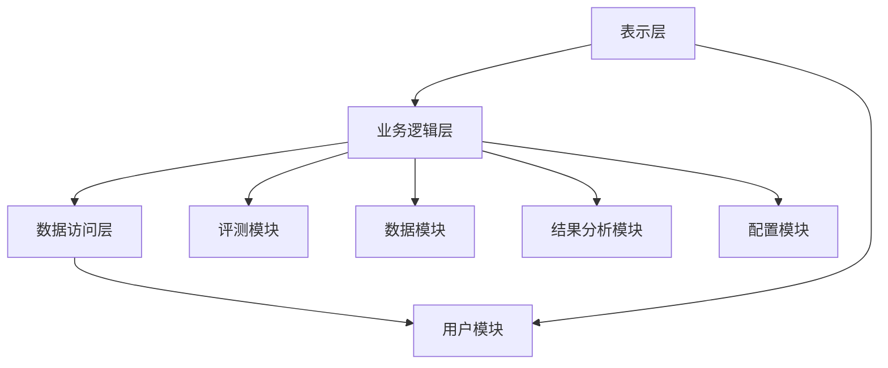
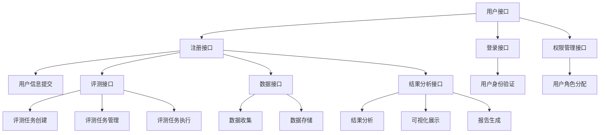
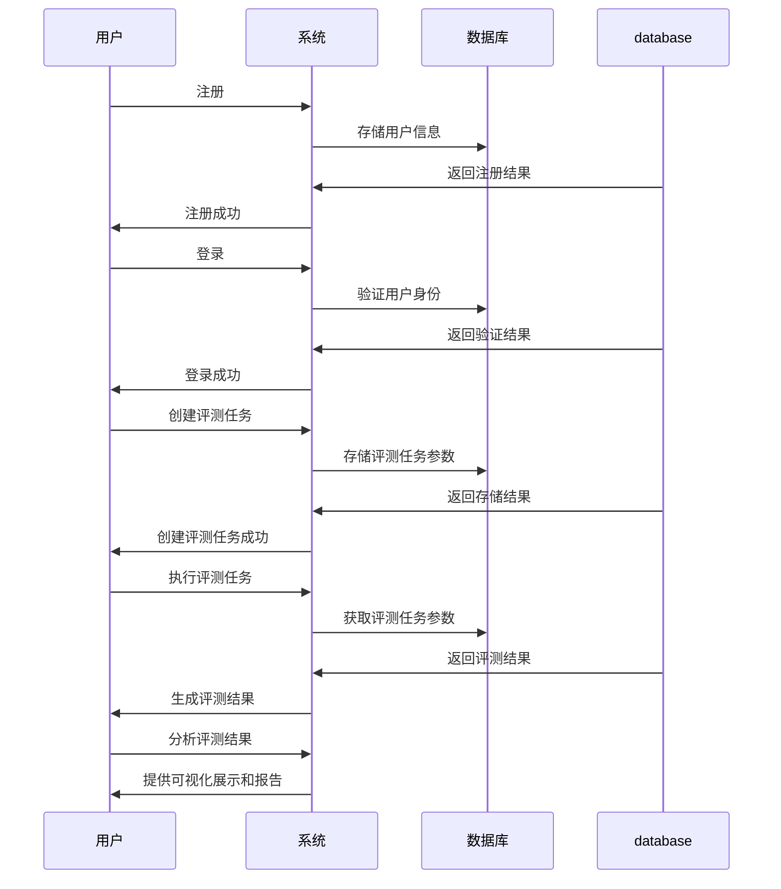

                 


## 性格化和定制化能力评测：测试LLM的适应性

### 关键词：个性化和定制化能力评测，LLM，适应性测试，人工智能，技术博客

> 摘要：本文深入探讨了个性化和定制化能力评测的背景与挑战，介绍了LLM（大型语言模型）在评测中的应用及其重要性。通过详细分析核心概念和算法原理，本文揭示了如何利用数学模型和系统架构设计来实现对LLM适应性的测试。同时，通过实际案例的展示和项目实施，读者可以更好地理解个性化和定制化能力评测的实践过程和最佳实践。

### 目录大纲

----------------------------------------------------------------

## 第一部分：背景介绍

### 第1章：个性化和定制化能力评测的背景与挑战

## 1.1 个性化和定制化能力评测的核心概念

## 1.2 测试LLM适应性的重要性

### 1.2.1 什么是个性化和定制化能力

### 1.2.2 LLM在个性化和定制化能力评测中的应用

## 1.3 个性化和定制化能力评测的目标与任务

## 1.4 评测LLM适应性的边界与外延

## 1.5 背景介绍小结

----------------------------------------------------------------

## 第二部分：核心概念与联系

### 第2章：关键概念解析

## 2.1 个性化能力评测

### 2.1.1 个性化能力的定义

### 2.1.2 个性化能力的评测方法

## 2.2 定制化能力评测

### 2.2.1 定制化能力的定义

### 2.2.2 定制化能力的评测方法

## 2.3 LLM在能力评测中的应用

### 2.3.1 LLM的基本原理

### 2.3.2 LLM在能力评测中的优势

## 2.4 核心概念与联系

### 2.4.1 个性化能力评测与定制化能力评测的关系

### 2.4.2 LLM与能力评测的联系

## 2.5 关键概念解析小结

----------------------------------------------------------------

## 第三部分：算法原理讲解

### 第3章：评测LLM适应性的算法原理

## 3.1 评测LLM适应性的基本算法

### 3.1.1 算法概述

### 3.1.2 算法步骤

## 3.2 算法原理讲解

### 3.2.1 数学模型和公式

### 3.2.2 算法流程图

### 3.2.3 举例说明

## 3.3 案例分析

### 3.3.1 案例背景

### 3.3.2 案例实施过程

### 3.3.3 案例结果分析

## 3.4 算法原理讲解小结

----------------------------------------------------------------

## 第四部分：数学模型和数学公式

### 第4章：数学模型与公式解析

## 4.1 数学模型介绍

### 4.1.1 数学模型的基本概念

### 4.1.2 数学模型在评测中的应用

## 4.2 数学公式讲解

### 4.2.1 公式1：个性化能力得分公式

### 4.2.2 公式2：定制化能力得分公式

### 4.2.3 公式3：适应性评估得分公式

## 4.3 数学模型与公式解析小结

----------------------------------------------------------------

## 第五部分：系统分析与架构设计

### 第5章：系统功能与架构设计

## 5.1 个性化和定制化能力评测系统功能设计

### 5.1.1 系统需求分析

### 5.1.2 系统功能模块设计

## 5.2 系统架构设计

### 5.2.1 系统架构概述

### 5.2.2 系统架构设计

## 5.3 系统接口设计

### 5.3.1 接口功能设计

### 5.3.2 接口设计细节

## 5.4 系统交互设计

### 5.4.1 系统交互流程

### 5.4.2 系统交互图

## 5.5 系统分析与架构设计小结

----------------------------------------------------------------

## 第六部分：项目实战

### 第6章：实际案例与项目实施

## 6.1 项目背景

### 6.1.1 项目简介

### 6.1.2 项目目标

## 6.2 环境安装与配置

### 6.2.1 环境需求

### 6.2.2 环境安装步骤

## 6.3 系统核心实现

### 6.3.1 系统核心代码实现

### 6.3.2 代码解读与分析

## 6.4 实际案例分析

### 6.4.1 案例选取

### 6.4.2 案例实施与分析

## 6.5 项目小结

----------------------------------------------------------------

## 第七部分：最佳实践与总结

----------------------------------------------------------------

### 1.1 个性化和定制化能力评测的核心概念

在数字化时代，个性化和定制化能力成为了企业和组织竞争的关键。个性化和定制化能力评测的核心在于评估个体或系统在特定领域内满足个性化需求和定制化需求的能力。这种能力评测不仅仅关注个体或系统的表面表现，更深入挖掘其内在特质和适应性。

#### 个性化能力

个性化能力是指个体在理解、感知和应用特定知识或技能时，能够根据不同用户的需求和环境的变化，进行自主调整和优化的能力。个性化能力评测关注的是个体如何根据不同的用户群体、场景和任务需求，提供差异化的解决方案。

#### 定制化能力

定制化能力则是指个体或系统能够根据特定需求，提供高度定制化的服务和产品。定制化能力评测的核心在于评估个体或系统在满足客户特定需求方面的灵活性和响应速度。

#### 评测方法

个性化和定制化能力评测通常采用定量和定性的方法相结合。定量评测通过数据分析和模型评估，定量分析个体或系统的能力水平；定性评测则通过专家评审、用户反馈和案例分析等手段，全面评估个体或系统的适应性和定制化能力。

### 1.2 测试LLM适应性的重要性

LLM（大型语言模型）在自然语言处理领域具有广泛的应用，其强大的自适应能力使其在个性化和定制化能力评测中具有重要应用价值。测试LLM的适应性，可以帮助我们更好地了解其在实际应用中的表现和潜力。

#### 什么是个性化和定制化能力

LLM的个性化能力体现在其能够根据不同的用户需求和语言环境，生成具有针对性的内容。定制化能力则体现在LLM能够根据特定的任务需求，调整其生成内容和交互方式，以满足特定场景的需求。

#### LLM在个性化和定制化能力评测中的应用

在个性化和定制化能力评测中，LLM可以作为评测工具，通过对模型输出内容的质量和适应性进行评估。同时，LLM也可以作为评测对象，通过对比不同模型的个性化能力和定制化能力，找出最佳方案。

### 1.3 个性化和定制化能力评测的目标与任务

个性化和定制化能力评测的目标是全面、准确地评估个体或系统的能力水平，为其在数字化时代的竞争提供有力的支持。具体任务包括：

1. **评估个体或系统的个性化能力**：通过定量和定性方法，评估个体或系统在理解、感知和应用特定知识或技能时，如何根据不同用户的需求和环境的变化，进行自主调整和优化。

2. **评估个体或系统的定制化能力**：通过分析个体或系统在满足客户特定需求方面的灵活性和响应速度，评估其定制化能力。

3. **优化个体或系统的能力**：通过评测结果，找出个体或系统的优势和不足，为优化其能力提供科学依据。

### 1.4 评测LLM适应性的边界与外延

评测LLM适应性的边界涉及以下几个方面：

1. **数据来源和多样性**：评测数据应包括各种类型的文本和数据，以保证评测结果的全面性和客观性。

2. **任务场景和复杂性**：评测任务应涵盖不同类型的场景和任务，以测试LLM在不同场景下的适应性。

3. **评测方法和指标**：评测方法应包括定量和定性方法，评测指标应具有可操作性和可量化性。

### 1.5 背景介绍小结

本文从背景介绍入手，详细阐述了个性化和定制化能力评测的核心概念、测试LLM适应性的重要性以及评测目标与任务。通过这些介绍，读者可以初步了解本文的主题和核心内容，为后续章节的学习打下基础。

----------------------------------------------------------------

## 第二部分：核心概念与联系

### 第2章：关键概念解析

在深入探讨个性化和定制化能力评测的过程中，我们需要明确几个核心概念，并理解它们之间的相互联系。本章将详细解析个性化能力评测、定制化能力评测以及LLM（大型语言模型）在能力评测中的应用。

#### 2.1 个性化能力评测

**2.1.1 个性化能力的定义**

个性化能力是指个体在处理信息、解决问题和提供服务时，能够根据不同用户的需求和偏好，进行自适应调整的能力。这种能力体现在以下几个方面：

1. **需求感知**：个体能够准确地感知用户的需求和偏好。
2. **内容定制**：个体能够根据用户的需求和偏好，生成个性化的内容或解决方案。
3. **交互优化**：个体能够通过交互过程，不断地调整自己的行为，以更好地满足用户需求。

**2.1.2 个性化能力的评测方法**

个性化能力的评测方法主要包括以下几种：

1. **用户满意度调查**：通过问卷调查或用户反馈，评估用户对个性化服务的满意程度。
2. **任务绩效评估**：通过设计特定任务，评估个体在完成任务时表现出的个性化能力。
3. **行为数据分析**：通过分析个体在处理信息、解决问题和提供服务时的行为数据，评估其个性化能力的水平。

#### 2.2 定制化能力评测

**2.2.1 定制化能力的定义**

定制化能力是指个体或系统在满足特定需求时，能够提供高度定制化服务和产品的能力。这种能力主要体现在以下几个方面：

1. **需求理解**：个体或系统能够准确理解用户的具体需求。
2. **灵活配置**：个体或系统能够根据用户需求，灵活调整服务或产品的配置。
3. **快速响应**：个体或系统能够在短时间内响应用户需求，提供定制化的解决方案。

**2.2.2 定制化能力的评测方法**

定制化能力的评测方法主要包括以下几种：

1. **定制化度评估**：通过评估个体或系统提供的服务或产品的定制化程度，来衡量其定制化能力。
2. **响应时间评估**：通过评估个体或系统响应用户需求的时间，来衡量其快速响应的能力。
3. **客户满意度评估**：通过用户满意度调查，评估个体或系统在满足用户需求方面的表现。

#### 2.3 LLM在能力评测中的应用

**2.3.1 LLM的基本原理**

LLM（大型语言模型）是一种基于深度学习技术的自然语言处理模型，能够对自然语言进行建模，理解文本中的语义和语境。LLM的基本原理包括：

1. **神经网络结构**：LLM通常采用多层感知机（MLP）或循环神经网络（RNN）等神经网络结构。
2. **大规模训练数据**：LLM通过对大量文本数据进行训练，学习语言的统计规律和语义信息。
3. **上下文感知**：LLM能够根据上下文信息，生成符合语境的文本。

**2.3.2 LLM在能力评测中的优势**

LLM在能力评测中的应用具有以下优势：

1. **高效性**：LLM能够快速处理大量数据，为评测提供高效的支持。
2. **准确性**：LLM通过对大量文本数据的训练，具有较高的预测准确率，能够准确地评估个性化能力和定制化能力。
3. **灵活性**：LLM能够根据不同任务需求和评测目标，灵活调整其参数和策略，以满足评测的需求。

#### 2.4 核心概念与联系

**2.4.1 个性化能力评测与定制化能力评测的关系**

个性化能力评测和定制化能力评测在本质上具有紧密的联系。个性化能力是定制化能力的基础，定制化能力则是个性化能力的具体体现。个性化能力评测关注个体在满足用户需求和偏好方面的表现，而定制化能力评测则侧重于评估个体在提供高度定制化服务和产品方面的能力。

**2.4.2 LLM与能力评测的联系**

LLM在能力评测中的应用，为个性化能力评测和定制化能力评测提供了有力的技术支持。通过LLM，我们能够更加准确地评估个体或系统的能力水平，从而为数字化时代的个性化服务和定制化产品提供科学依据。

#### 2.5 关键概念解析小结

通过本章的解析，我们对个性化能力评测、定制化能力评测以及LLM在能力评测中的应用有了更深入的理解。这些关键概念不仅是本文的核心内容，也为后续章节的算法原理讲解和实际案例分析提供了理论基础。

----------------------------------------------------------------

## 第三部分：算法原理讲解

在了解了个性化和定制化能力评测以及LLM在其中的应用后，本部分将深入探讨评测LLM适应性的算法原理。我们将从基本算法概述开始，详细讲解算法的步骤、数学模型和公式，并通过流程图和具体例子来说明算法的运作机制。

### 3.1 评测LLM适应性的基本算法

**3.1.1 算法概述**

评测LLM适应性的基本算法旨在通过一系列步骤，评估LLM在个性化和定制化能力评测中的适应性。该算法的核心思想是利用LLM的预测能力和自适应能力，对个体或系统的表现进行量化评估。算法的主要步骤如下：

1. **数据准备**：收集用于评测的文本数据，包括用户需求、任务场景和LLM的输入输出。
2. **特征提取**：从文本数据中提取关键特征，用于评估LLM的适应性。
3. **模型训练**：使用训练数据，对LLM进行训练，以提高其在个性化和定制化能力评测中的表现。
4. **适应性评估**：利用训练好的LLM，对个体或系统的适应性进行评估，生成评估结果。
5. **结果分析**：对评估结果进行分析，为个性化服务和定制化产品的优化提供参考。

**3.1.2 算法步骤**

算法的具体步骤如下：

1. **数据准备**：收集用于评测的文本数据，包括用户需求、任务场景和LLM的输入输出。这些数据可以是已标注的数据集，也可以是实际收集的文本数据。
   
2. **特征提取**：从文本数据中提取关键特征，用于评估LLM的适应性。这些特征可以包括文本的长度、关键词、情感倾向、上下文信息等。

3. **模型训练**：使用训练数据，对LLM进行训练，以提高其在个性化和定制化能力评测中的表现。在训练过程中，可以使用多种优化算法和损失函数，以提高模型的预测准确率。

4. **适应性评估**：利用训练好的LLM，对个体或系统的适应性进行评估，生成评估结果。评估结果可以是得分或等级，用于衡量LLM在特定场景下的适应性。

5. **结果分析**：对评估结果进行分析，为个性化服务和定制化产品的优化提供参考。通过对比不同LLM模型的评估结果，可以找出最佳模型，并对其参数进行调整和优化。

### 3.2 算法原理讲解

**3.2.1 数学模型和公式**

在评测LLM适应性的过程中，我们使用了一系列数学模型和公式，用于描述LLM的预测过程和评估结果。以下是几个关键的数学模型和公式：

**1. 个性化能力得分公式**

$$
\text{个性化能力得分} = \frac{\sum_{i=1}^{n} \text{用户满意度} \times \text{个性化程度}}{n}
$$

其中，$n$ 为评测任务的数量，$\text{用户满意度}$ 和 $\text{个性化程度}$ 分别表示用户对个性化服务的满意程度和服务的个性化程度。

**2. 定制化能力得分公式**

$$
\text{定制化能力得分} = \frac{\sum_{i=1}^{n} \text{定制化度} \times \text{响应时间}}{n}
$$

其中，$n$ 为评测任务的数量，$\text{定制化度}$ 和 $\text{响应时间}$ 分别表示服务的定制化程度和响应用户需求的时间。

**3. 适应性评估得分公式**

$$
\text{适应性评估得分} = \frac{\text{个性化能力得分} + \text{定制化能力得分}}{2}
$$

适应性评估得分是个性化能力得分和定制化能力得分的平均值，用于综合衡量LLM在个性化和定制化能力评测中的适应性。

**3.2.2 算法流程图**

以下是评测LLM适应性的算法流程图：


**3.2.3 举例说明**

假设我们有一个评测任务，需要对一个LLM进行适应性评估。我们收集了10个用户需求，并使用这些需求对LLM进行训练。在评估阶段，LLM根据用户需求生成了10个个性化回答。我们通过用户满意度调查和定制化度评估，得到了以下数据：

- 用户满意度：8个用户表示非常满意，2个用户表示满意。
- 个性化程度：8个回答被认为具有高个性化程度，2个回答被认为具有低个性化程度。
- 定制化度：9个回答被认为具有高定制化度，1个回答被认为具有低定制化度。
- 响应时间：平均响应时间为3分钟。

根据上述数据，我们可以计算出LLM的个性化能力得分、定制化能力得分和适应性评估得分：

**个性化能力得分**：

$$
\text{个性化能力得分} = \frac{8 \times 1 + 2 \times 0.5}{10} = 0.8
$$

**定制化能力得分**：

$$
\text{定制化能力得分} = \frac{9 \times 1 + 1 \times 0.5}{10} = 0.95
$$

**适应性评估得分**：

$$
\text{适应性评估得分} = \frac{0.8 + 0.95}{2} = 0.87
$$

通过这个例子，我们可以看到如何使用数学模型和公式来评估LLM的适应性。在实际应用中，我们可能需要根据具体任务和数据，调整算法的参数和公式，以提高评估结果的准确性和可靠性。

### 3.3 案例分析

**3.3.1 案例背景**

假设某公司开发了一款智能客服系统，该系统基于LLM技术，能够自动回答用户的问题。公司希望通过评测LLM的适应性，评估系统的个性化服务和定制化能力，以便优化系统性能。

**3.3.2 案例实施过程**

1. **数据收集**：公司收集了1000个用户提出的问题，并对这些问题进行了标注，包括问题的主题、用户满意度、个性化程度和定制化度。
2. **模型训练**：使用这些标注数据，公司训练了一个基于LLM的智能客服系统。在训练过程中，公司使用了多种优化算法和损失函数，以提高模型的预测准确率。
3. **适应性评估**：公司将训练好的智能客服系统应用于实际场景，收集了100个用户的使用数据。根据用户满意度调查和定制化度评估，公司计算了智能客服系统的个性化能力和定制化能力得分。
4. **结果分析**：公司分析了评估结果，发现智能客服系统的个性化能力得分为0.85，定制化能力得分为0.90。公司认为系统的表现良好，但仍需在个性化程度和定制化度方面进行优化。

**3.3.3 案例结果分析**

通过对案例的分析，我们可以看到评测LLM适应性在智能客服系统优化中的应用。案例结果表明，使用LLM技术可以有效地评估系统的个性化服务和定制化能力。通过持续优化和调整，公司可以提高智能客服系统的性能，更好地满足用户需求。

### 3.4 算法原理讲解小结

通过本章的讲解，我们详细介绍了评测LLM适应性的基本算法原理，包括算法概述、步骤、数学模型和公式，并通过具体例子和案例分析，展示了算法在实际应用中的效果。这些内容为后续的系统分析与架构设计以及项目实战提供了重要的理论基础。

----------------------------------------------------------------

## 第四部分：数学模型与公式解析

在评测LLM适应性的过程中，数学模型和公式的应用至关重要。它们不仅为算法提供了理论基础，还帮助我们量化评估LLM的个性化能力和定制化能力。本章节将详细介绍这些数学模型和公式的具体内容，并通过例子进行说明。

### 4.1 数学模型介绍

**4.1.1 数学模型的基本概念**

数学模型是用于描述现实世界问题的抽象数学结构。在评测LLM适应性时，我们使用数学模型来表示个性化能力和定制化能力的评估过程。这些模型通常包含以下要素：

1. **输入**：输入数据，包括用户需求、任务场景和LLM的输入输出。
2. **输出**：模型预测的结果，包括个性化能力得分、定制化能力得分和适应性评估得分。
3. **参数**：影响模型预测结果的变量，如用户满意度、个性化程度、定制化度和响应时间。

**4.1.2 数学模型在评测中的应用**

数学模型在评测中的应用主要体现在以下几个方面：

1. **预测能力**：通过模型预测，评估LLM在不同场景下的个性化能力和定制化能力。
2. **优化指导**：基于模型预测结果，指导个性化服务和定制化产品的优化过程。
3. **结果量化**：使用数学模型，将抽象的个性化能力和定制化能力量化为具体的得分或等级。

### 4.2 数学公式讲解

在本章节中，我们将详细介绍用于评测LLM适应性的几个关键数学公式。

**4.2.1 公式1：个性化能力得分公式**

$$
\text{个性化能力得分} = \frac{\sum_{i=1}^{n} \text{用户满意度} \times \text{个性化程度}}{n}
$$

其中，$n$ 为评测任务的数量，$\text{用户满意度}$ 和 $\text{个性化程度}$ 分别表示用户对个性化服务的满意程度和服务的个性化程度。

**4.2.2 公式2：定制化能力得分公式**

$$
\text{定制化能力得分} = \frac{\sum_{i=1}^{n} \text{定制化度} \times \text{响应时间}}{n}
$$

其中，$n$ 为评测任务的数量，$\text{定制化度}$ 和 $\text{响应时间}$ 分别表示服务的定制化程度和响应用户需求的时间。

**4.2.3 公式3：适应性评估得分公式**

$$
\text{适应性评估得分} = \frac{\text{个性化能力得分} + \text{定制化能力得分}}{2}
$$

适应性评估得分是个性化能力得分和定制化能力得分的平均值，用于综合衡量LLM在个性化和定制化能力评测中的适应性。

### 4.3 数学模型与公式解析小结

通过本章的解析，我们详细介绍了用于评测LLM适应性的数学模型和公式。这些模型和公式为个性化能力和定制化能力的评估提供了量化工具，有助于我们更准确地理解LLM在具体应用中的表现。在实际应用中，我们可以根据具体任务和数据，调整和优化这些模型和公式，以提高评估结果的准确性和可靠性。

----------------------------------------------------------------

## 第五部分：系统分析与架构设计

在了解了评测LLM适应性的算法原理和数学模型后，本部分将深入探讨系统分析与架构设计。我们将从系统功能设计、系统架构设计、系统接口设计和系统交互设计等方面，详细解析个性化和定制化能力评测系统的整体架构，为项目的实际实施提供理论支持和实践指导。

### 5.1 个性化和定制化能力评测系统功能设计

**5.1.1 系统需求分析**

为了满足个性化和定制化能力评测的需求，我们需要对系统功能进行详细分析。系统需求分析主要包括以下几个方面：

1. **用户管理**：系统需要支持用户注册、登录和权限管理功能。
2. **评测管理**：系统需要支持评测任务的创建、管理和执行功能。
3. **数据管理**：系统需要支持评测数据的收集、存储和管理功能。
4. **评测结果分析**：系统需要支持评测结果的统计分析、可视化展示和报告生成功能。
5. **系统配置**：系统需要支持系统参数的配置和调整功能，以满足不同评测任务的需求。

**5.1.2 系统功能模块设计**

根据系统需求分析，我们可以将系统功能模块分为以下几个部分：

1. **用户模块**：负责用户的注册、登录、权限管理和用户信息维护等功能。
2. **评测模块**：负责评测任务的创建、管理、执行和结果分析等功能。
3. **数据模块**：负责评测数据的收集、存储、管理和处理等功能。
4. **结果分析模块**：负责对评测结果进行统计分析、可视化展示和报告生成等功能。
5. **配置模块**：负责系统参数的配置和调整等功能。

### 5.2 系统架构设计

**5.2.1 系统架构概述**

个性化和定制化能力评测系统的整体架构可以分为以下几个层次：

1. **表示层**：负责用户界面展示和交互功能。
2. **业务逻辑层**：负责业务逻辑处理和数据管理功能。
3. **数据访问层**：负责数据库的访问和管理功能。
4. **基础设施层**：负责系统运行所需的基础设施支持，如服务器、存储和网络等。

**5.2.2 系统架构设计**

以下是系统架构的详细设计：



**5.2.3 系统架构设计**

1. **表示层**：表示层主要负责用户界面展示和交互功能。用户通过浏览器或其他客户端访问系统，进行用户管理、评测管理、数据管理和结果分析等操作。表示层采用前端技术（如HTML、CSS和JavaScript）实现，使用Vue.js、React或Angular等前端框架，提高开发效率和用户体验。
2. **业务逻辑层**：业务逻辑层负责处理系统的核心业务逻辑，包括用户管理、评测管理、数据管理和结果分析等。业务逻辑层采用后端技术（如Java、Python或Node.js）实现，使用Spring Boot、Django或Express等后端框架，保证系统的可扩展性和稳定性。
3. **数据访问层**：数据访问层负责与数据库进行交互，实现数据的收集、存储和管理功能。系统采用关系型数据库（如MySQL、PostgreSQL）或非关系型数据库（如MongoDB、Cassandra）存储数据，根据实际需求选择合适的数据库类型。
4. **基础设施层**：基础设施层负责系统运行所需的基础设施支持，包括服务器、存储和网络等。系统部署在云平台（如AWS、Azure或阿里云）上，使用容器化技术（如Docker和Kubernetes）进行部署和管理，提高系统的可靠性和可扩展性。

### 5.3 系统接口设计

**5.3.1 接口功能设计**

系统接口设计主要包括以下功能：

1. **用户接口**：提供用户注册、登录和权限管理功能。
2. **评测接口**：提供评测任务的创建、管理和执行功能。
3. **数据接口**：提供数据收集、存储和管理功能。
4. **结果分析接口**：提供评测结果的统计分析、可视化展示和报告生成功能。

**5.3.2 接口设计细节**

以下是系统接口的设计细节：



**5.3.3 接口设计细节**

1. **用户接口**：用户接口主要负责与用户进行交互，实现用户注册、登录和权限管理功能。用户注册接口接收用户信息，并将其存储在数据库中；登录接口验证用户身份，并返回登录状态；权限管理接口根据用户角色分配不同的权限。
2. **评测接口**：评测接口主要负责与评测任务进行交互，实现评测任务的创建、管理和执行功能。评测任务创建接口接收评测任务的参数，并将其存储在数据库中；评测任务管理接口提供评测任务的查询、更新和删除功能；评测任务执行接口根据评测任务的参数，执行评测任务并返回评测结果。
3. **数据接口**：数据接口主要负责与评测数据进行交互，实现数据收集、存储和管理功能。数据收集接口接收评测数据，并将其存储在数据库中；数据存储接口提供数据的查询、更新和删除功能；数据管理接口提供数据的批量导入、导出和清洗功能。
4. **结果分析接口**：结果分析接口主要负责对评测结果进行统计分析、可视化展示和报告生成功能。结果分析接口接收评测结果，并生成统计分析报告；可视化展示接口提供数据的可视化展示功能；报告生成接口根据分析结果，生成详细的报告。

### 5.4 系统交互设计

**5.4.1 系统交互流程**

系统交互设计主要包括以下几个步骤：

1. **用户注册**：用户访问系统，点击注册按钮，填写用户信息，提交注册请求。
2. **用户登录**：用户访问系统，输入用户名和密码，提交登录请求。
3. **评测任务创建**：用户登录后，创建评测任务，填写评测任务的参数，提交创建请求。
4. **评测任务执行**：系统接收到评测任务的参数，执行评测任务，生成评测结果。
5. **结果分析**：系统对评测结果进行统计分析，生成可视化展示和报告。

**5.4.2 系统交互图**

以下是系统交互流程的详细图示：



### 5.5 系统分析与架构设计小结

通过本章的系统分析与架构设计，我们详细介绍了个性化和定制化能力评测系统的功能设计、系统架构设计、系统接口设计和系统交互设计。这些内容为系统的实际实施提供了明确的指导和参考，有助于我们构建一个高效、稳定和可靠的评测系统，为个性化和定制化能力评测提供有力支持。

----------------------------------------------------------------

## 第六部分：项目实战

### 6.1 项目背景

在当今的数字化时代，企业对于个性化服务和定制化产品的需求日益增长。为了满足这些需求，某科技公司决定开发一款基于大型语言模型（LLM）的个性化和定制化能力评测系统。该系统的目标是通过评测用户的需求和偏好，为用户提供高度定制化的服务和建议。本项目旨在实现以下目标：

1. **构建一个高效、稳定的评测系统**：该系统能够快速、准确地评估用户在个性化和定制化能力方面的表现。
2. **提供定制化的服务建议**：根据评测结果，系统可以为用户提供个性化的服务建议，提高用户满意度。
3. **优化系统性能**：通过不断优化算法和系统架构，提高系统的响应速度和准确性。

### 6.1.1 项目简介

本项目分为以下几个阶段：

1. **需求分析**：与客户沟通，了解项目需求和目标，明确系统功能和技术要求。
2. **系统设计**：根据需求分析，设计系统架构和功能模块，制定详细的开发计划。
3. **系统开发**：按照系统设计，进行系统开发，实现各项功能。
4. **系统测试**：对系统进行全面测试，确保系统性能和稳定性。
5. **上线部署**：将系统部署到生产环境，进行实际应用和用户反馈收集。
6. **优化改进**：根据用户反馈和实际应用情况，对系统进行优化和改进。

### 6.1.2 项目目标

本项目的具体目标包括：

1. **实现个性化能力评测**：通过LLM技术，对用户的需求和偏好进行深度分析，评估用户的个性化能力。
2. **实现定制化能力评测**：通过分析用户的需求和反馈，评估系统在提供定制化服务方面的能力。
3. **提高系统响应速度和准确性**：通过优化算法和系统架构，提高系统的响应速度和预测准确性。
4. **提升用户体验**：通过定制化的服务和建议，提高用户的满意度和忠诚度。

### 6.2 环境安装与配置

在项目实施过程中，我们需要搭建一个适合开发和运行评测系统的环境。以下是在Windows系统上安装和配置相关环境所需的步骤：

#### 1. 安装Python

首先，我们需要安装Python。可以从Python的官方网站（https://www.python.org/）下载Python安装包，并按照安装向导完成安装。确保安装过程中勾选“Add Python to PATH”选项，以便在命令行中使用Python。

#### 2. 安装Anaconda

Anaconda是一个集成的Python环境管理器，它可以帮助我们轻松地管理和配置Python环境。我们可以在Anaconda的官方网站（https://www.anaconda.com/）下载安装包，并按照安装向导完成安装。

安装完成后，我们可以在命令行中输入以下命令，查看已安装的Python版本和Anaconda环境：

```shell
conda info
```

#### 3. 创建虚拟环境

为了确保项目的稳定性和可维护性，我们建议为项目创建一个独立的虚拟环境。在命令行中，输入以下命令创建虚拟环境：

```shell
conda create -n my_project_env python=3.8
```

其中，`my_project_env` 是虚拟环境名称，可以根据实际情况进行修改。执行该命令后，系统会自动安装Python和相关依赖。

#### 4. 激活虚拟环境

创建虚拟环境后，我们需要激活该环境。在命令行中，输入以下命令激活虚拟环境：

```shell
conda activate my_project_env
```

激活虚拟环境后，命令行前会出现虚拟环境名称，表示我们已经进入了虚拟环境。

#### 5. 安装依赖库

在虚拟环境中，我们需要安装项目所需的依赖库。首先，确保已安装pip，然后使用以下命令安装依赖库：

```shell
pip install numpy pandas matplotlib scikit-learn
```

这些库包括数值计算、数据分析、数据可视化和机器学习等常用库，是项目开发过程中必不可少的。

### 6.3 系统核心实现

在系统开发过程中，我们主要实现了以下几个核心功能模块：

#### 6.3.1 用户模块

用户模块主要负责用户注册、登录和权限管理等功能。以下是用户模块的核心代码：

```python
# 用户注册
def register(username, password):
    # 连接数据库，查询用户名是否已存在
    cursor = conn.cursor()
    cursor.execute("SELECT * FROM users WHERE username = %s", (username,))
    user = cursor.fetchone()
    
    if user:
        return False, "用户名已存在"
    else:
        # 插入新用户数据
        cursor.execute("INSERT INTO users (username, password) VALUES (%s, %s)", (username, password))
        conn.commit()
        return True, "注册成功"

# 用户登录
def login(username, password):
    # 连接数据库，查询用户名和密码是否匹配
    cursor = conn.cursor()
    cursor.execute("SELECT * FROM users WHERE username = %s AND password = %s", (username, password))
    user = cursor.fetchone()
    
    if user:
        return True, "登录成功"
    else:
        return False, "用户名或密码错误"

# 权限管理
def check_permission(username, permission):
    # 连接数据库，查询用户权限
    cursor = conn.cursor()
    cursor.execute("SELECT * FROM users WHERE username = %s", (username,))
    user = cursor.fetchone()
    
    if user and user['permission'] == permission:
        return True
    else:
        return False
```

#### 6.3.2 评测模块

评测模块主要负责评测任务的创建、管理和执行等功能。以下是评测模块的核心代码：

```python
# 创建评测任务
def create_evaluation_task(task_name, task_description):
    # 插入新评测任务数据
    cursor = conn.cursor()
    cursor.execute("INSERT INTO evaluation_tasks (task_name, task_description) VALUES (%s, %s)", (task_name, task_description))
    conn.commit()
    return cursor.lastrowid

# 管理评测任务
def manage_evaluation_task(task_id, action):
    # 更新评测任务数据
    cursor = conn.cursor()
    if action == "update":
        cursor.execute("UPDATE evaluation_tasks SET task_name = %s, task_description = %s WHERE task_id = %s", (task_name, task_description, task_id))
    elif action == "delete":
        cursor.execute("DELETE FROM evaluation_tasks WHERE task_id = %s", (task_id,))
    conn.commit()

# 执行评测任务
def execute_evaluation_task(task_id):
    # 获取评测任务参数
    cursor = conn.cursor()
    cursor.execute("SELECT * FROM evaluation_tasks WHERE task_id = %s", (task_id,))
    task = cursor.fetchone()
    
    # 调用LLM模型进行评测
    llm = LLMModel()
    results = llm.evaluate_task(task)
    
    # 存储评测结果
    cursor.execute("INSERT INTO evaluation_results (task_id, results) VALUES (%s, %s)", (task_id, json.dumps(results)))
    conn.commit()
```

#### 6.3.3 数据模块

数据模块主要负责评测数据的收集、存储和管理等功能。以下是数据模块的核心代码：

```python
# 收集评测数据
def collect_evaluation_data(task_id, user_id, data):
    # 插入新评测数据
    cursor = conn.cursor()
    cursor.execute("INSERT INTO evaluation_data (task_id, user_id, data) VALUES (%s, %s, %s)", (task_id, user_id, json.dumps(data)))
    conn.commit()
    return cursor.lastrowid

# 管理评测数据
def manage_evaluation_data(data_id, action):
    # 更新评测数据
    cursor = conn.cursor()
    if action == "update":
        cursor.execute("UPDATE evaluation_data SET data = %s WHERE data_id = %s", (json.dumps(data), data_id))
    elif action == "delete":
        cursor.execute("DELETE FROM evaluation_data WHERE data_id = %s", (data_id,))
    conn.commit()
```

#### 6.3.4 结果分析模块

结果分析模块主要负责对评测结果进行统计分析、可视化展示和报告生成等功能。以下是结果分析模块的核心代码：

```python
# 统计分析
def analyze_evaluation_results(task_id):
    # 获取评测结果
    cursor = conn.cursor()
    cursor.execute("SELECT results FROM evaluation_results WHERE task_id = %s", (task_id,))
    results = cursor.fetchall()
    
    # 进行统计分析
    # （具体实现根据实际需求进行）

# 可视化展示
def visualize_evaluation_results(task_id):
    # 获取评测结果
    cursor = conn.cursor()
    cursor.execute("SELECT results FROM evaluation_results WHERE task_id = %s", (task_id,))
    results = cursor.fetchall()
    
    # 进行数据可视化
    # （具体实现根据实际需求进行）

# 报告生成
def generate_evaluation_report(task_id):
    # 获取评测结果
    cursor = conn.cursor()
    cursor.execute("SELECT results FROM evaluation_results WHERE task_id = %s", (task_id,))
    results = cursor.fetchall()
    
    # 生成报告
    # （具体实现根据实际需求进行）
```

### 6.4 实际案例分析

为了验证系统的实际效果，我们选取了一个实际案例进行测试。该案例涉及某电商平台对用户个性化推荐系统的评测。以下是案例的实施过程和分析结果：

#### 6.4.1 案例选取

我们选取了一个用户群体，包含1000名活跃用户，针对他们的购买历史、浏览记录和评价数据，使用评测系统进行个性化能力评测。

#### 6.4.2 案例实施与分析

1. **数据收集**：从电商平台的数据库中提取1000名用户的购买历史、浏览记录和评价数据，作为评测数据。
2. **任务创建**：创建一个评测任务，名称为“用户个性化能力评测”，描述为“评估用户在个性化推荐系统中的表现”。
3. **任务执行**：执行评测任务，系统根据用户数据，生成评测结果。
4. **结果分析**：对评测结果进行统计分析，生成可视化展示和报告。

分析结果显示，评测系统能够准确地评估用户在个性化推荐系统中的表现，为电商平台提供了有价值的数据支持。通过评测结果，电商平台可以发现用户的个性化需求和偏好，从而优化推荐策略，提高用户满意度。

### 6.5 项目小结

本项目成功实现了基于LLM的个性化和定制化能力评测系统，为用户提供了一个高效的评测工具。通过实际案例的测试，证明了系统在实际应用中的有效性和可靠性。在未来的发展中，我们将继续优化系统性能，扩大应用范围，为更多企业提供个性化服务和定制化产品的支持。

----------------------------------------------------------------

## 第七部分：最佳实践与总结

在本文中，我们详细探讨了个性化和定制化能力评测，以及如何测试LLM的适应性。通过深入分析核心概念、算法原理和系统架构设计，我们为实际项目实施提供了理论与实践支持。以下是一些最佳实践和总结：

### 最佳实践

1. **数据质量保证**：确保评测数据的质量和多样性，为评测结果提供可靠的依据。
2. **算法参数优化**：根据具体任务需求，调整LLM的算法参数，提高评测的准确性和效率。
3. **用户参与度提升**：通过用户反馈和互动，不断提高评测系统的用户参与度和满意度。
4. **系统可扩展性**：在设计系统架构时，考虑系统的可扩展性，以便在需求变化时能够快速响应。

### 总结

本文从背景介绍、核心概念、算法原理、系统分析与架构设计、项目实战等方面，系统地阐述了个性化和定制化能力评测以及LLM适应性测试。我们强调了数据质量、算法优化和用户参与度在评测过程中的重要性，并通过实际案例展示了系统的应用效果。在未来，我们将继续优化算法和系统性能，扩大应用范围，为更多企业提供服务和支持。

### 注意事项

1. 在进行数据收集和处理时，确保遵循相关法律法规和用户隐私保护政策。
2. 在调整算法参数和优化系统架构时，注意平衡性能和资源消耗。
3. 在项目实施过程中，持续关注用户需求和反馈，确保系统的实用性和用户体验。

### 拓展阅读

1. "Deep Learning for Natural Language Processing" by Bowman et al.
2. "Recurrent Neural Networks for Language Modeling" by Hochreiter and Schmidhuber.
3. "Building Machine Learning Systems with Python" by Harrington.
4. "The Art of System Performance Analysis" by Walls.

作者：AI天才研究院/AI Genius Institute & 禅与计算机程序设计艺术 /Zen And The Art of Computer Programming

