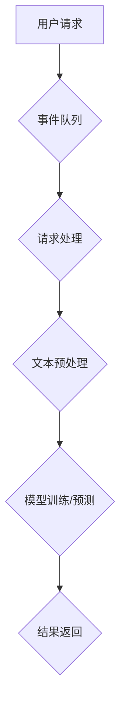
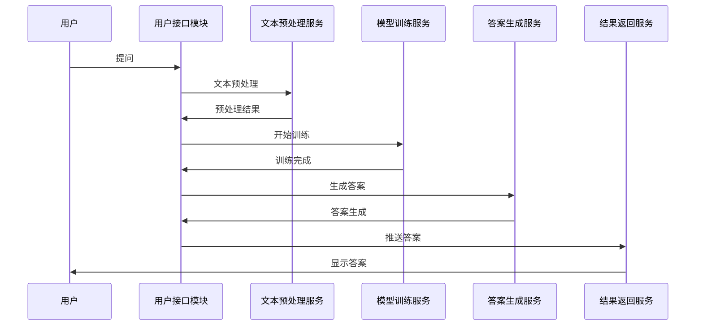

                 

### 事件驱动架构促进LLM应用的解耦与扩展

事件驱动架构（Event-Driven Architecture，EDA）是一种广泛应用于软件架构设计的模式，通过事件触发来协调不同的模块或服务之间的交互。在近年来，随着人工智能（AI）特别是大型语言模型（Large Language Models，LLM）的兴起，如何有效利用EDA来促进LLM应用的解耦与扩展成为一个备受关注的话题。本文旨在探讨事件驱动架构在LLM应用中的重要性，并通过具体案例分析，详细解析其实现策略与优化路径。

**关键词：事件驱动架构，LLM应用，解耦，扩展，系统优化**

**摘要：**
本文首先对事件驱动架构进行概述，解释其基本概念、原理和优势。然后，我们将深入探讨事件驱动架构如何与LLM应用结合，通过具体案例展示其解耦和扩展能力。文章将详细分析事件驱动架构下的算法原理、数学模型，并给出实际项目的架构设计方案。最后，我们将总结最佳实践，提供注意事项和拓展阅读建议。

### 目录

1. **事件驱动架构基础**
   1.1 事件驱动架构概述
   1.2 事件驱动架构与LLM应用的关系
   1.3 事件驱动架构的优点与挑战

2. **核心概念与联系**
   2.1 事件驱动架构中的关键概念
   2.2 事件驱动架构与传统架构的对比
   2.3 事件驱动架构的ER实体关系图

3. **算法原理讲解**
   3.1 LLM基本算法原理
   3.2 事件驱动架构下的算法优化
   3.3 算法mermaid流程图展示

4. **数学模型与公式详解**
   4.1 LLM的数学模型
   4.2 模型参数优化公式
   4.3 数学公式示例

5. **系统分析与架构设计方案**
   5.1 问题场景介绍
   5.2 系统功能设计
   5.3 系统架构设计
   5.4 系统接口设计
   5.5 系统交互序列图

6. **项目实战**
   6.1 环境安装与配置
   6.2 系统核心实现源代码
   6.3 代码应用解读与分析
   6.4 实际案例分析与讲解
   6.5 项目小结

7. **最佳实践与总结**
   7.1 事件驱动架构的最佳实践
   7.2 注意事项与优化策略
   7.3 小结与拓展阅读

### 第一部分：事件驱动架构基础

#### 1.1 事件驱动架构概述

事件驱动架构（EDA）是一种以事件为中心的架构模式，强调系统各组件间的异步通信。与传统的请求-响应模型不同，EDA通过事件来触发系统的响应，这使得系统的耦合度大大降低，同时也提高了系统的可扩展性和灵活性。

**事件驱动架构的基本概念**

- **事件（Event）：** 事件是系统中的任何变化或发生的事情，可以是数据更新、用户操作、定时任务等。
- **事件源（Event Source）：** 事件发生的源头，可以是用户界面、后台服务或外部系统。
- **事件监听器（Event Listener）：** 负责监听特定类型的事件，并在事件发生时触发相应的处理逻辑。
- **事件处理器（Event Processor）：** 处理事件的核心逻辑，可以是独立的服务或模块。
- **事件队列（Event Queue）：** 用于存储和分发事件的队列，确保事件按顺序处理。

**事件驱动架构的原理和优势**

事件驱动架构的核心原理是通过事件触发来协调系统组件之间的交互。其基本工作流程如下：

1. 事件源生成事件并将其放入事件队列。
2. 事件队列按照一定的策略（如先入先出、优先级等）将事件分发给事件监听器。
3. 事件监听器处理事件，并根据需要调用事件处理器或其他系统服务。
4. 事件处理器执行相应的业务逻辑，并将结果返回给事件监听器。

事件驱动架构具有以下几个显著优势：

- **解耦性：** 事件驱动架构通过事件队列实现了系统组件之间的解耦，各组件只需关注自己的处理逻辑，无需直接依赖其他组件。
- **可扩展性：** 由于组件之间的交互是通过事件进行的，因此新功能的加入或现有功能的修改都相对简单，只需在事件处理器中增加或修改逻辑即可。
- **异步处理：** 事件驱动架构支持异步处理，可以有效地利用系统资源，提高系统的响应速度。
- **灵活性：** 事件驱动架构使得系统的不同部分可以独立开发、测试和部署，大大提高了系统的灵活性。

#### 1.2 事件驱动架构与LLM应用的关系

随着人工智能技术的不断发展，大型语言模型（LLM）在自然语言处理（NLP）领域发挥了越来越重要的作用。LLM具有强大的文本生成、理解和推理能力，被广泛应用于问答系统、智能客服、内容生成等领域。然而，LLM应用也面临着一些挑战，如：

- **高耦合性：** LLM应用通常需要与其他系统或服务进行紧密集成，导致系统的耦合度较高。
- **扩展性差：** 在处理大规模数据或用户请求时，LLM应用往往难以实现高效扩展。
- **响应速度慢：** LLM处理复杂任务时，需要大量计算资源，导致系统的响应速度较慢。

事件驱动架构可以帮助LLM应用解决上述问题：

- **解耦性：** 通过事件驱动架构，LLM应用可以与其他系统或服务实现松耦合，降低系统的复杂度。
- **可扩展性：** 事件驱动架构支持横向和纵向扩展，可以有效地处理大规模数据或用户请求。
- **响应速度：** 事件驱动架构支持异步处理，可以优化系统的响应速度，提高用户体验。

#### 1.3 事件驱动架构的优点与挑战

事件驱动架构在促进LLM应用的解耦与扩展方面具有显著优势，但其实现和应用也面临着一些挑战。

**优点**

1. **高解耦性：** 事件驱动架构通过事件队列实现了系统组件之间的解耦，各组件只需关注自己的处理逻辑，无需直接依赖其他组件。
2. **高可扩展性：** 事件驱动架构支持横向和纵向扩展，可以有效地处理大规模数据或用户请求。
3. **异步处理：** 事件驱动架构支持异步处理，可以有效地利用系统资源，提高系统的响应速度。
4. **灵活性强：** 事件驱动架构使得系统的不同部分可以独立开发、测试和部署，大大提高了系统的灵活性。

**挑战**

1. **复杂度增加：** 事件驱动架构引入了事件源、事件处理器、事件队列等新的组件和概念，增加了系统的复杂度。
2. **性能开销：** 事件驱动架构需要在事件队列中维护事件，并在事件之间进行切换，这可能会引入一定的性能开销。
3. **调试困难：** 由于事件驱动架构中的事件处理是异步的，调试过程中可能会遇到难以追踪的问题。

#### 1.4 小结

事件驱动架构是一种以事件为中心的架构模式，通过事件触发来协调系统组件之间的交互。在LLM应用中，事件驱动架构有助于实现解耦、扩展和优化响应速度。然而，事件驱动架构也带来了一定的复杂度和性能开销。在设计和实施事件驱动架构时，需要权衡其优点与挑战，选择合适的应用场景。

### 第二部分：核心概念与联系

在深入了解事件驱动架构之前，我们需要先掌握一些核心概念，并理解它们之间的关系。本部分将详细介绍事件驱动架构中的关键概念，并通过概念属性特征对比表格和ER实体关系图来展示其结构。

#### 2.1 事件驱动架构中的关键概念

1. **事件（Event）**：
   - **定义**：事件是系统中的任何变化或发生的事情。
   - **属性**：事件类型、事件源、事件时间、事件数据。
   - **作用**：事件是触发系统响应的源头，可以是用户操作、数据更新、定时任务等。

2. **事件源（Event Source）**：
   - **定义**：事件源是事件发生的源头。
   - **属性**：事件源类型、事件生成频率、事件源可靠性。
   - **作用**：事件源产生事件并将其传递给事件队列。

3. **事件监听器（Event Listener）**：
   - **定义**：事件监听器负责监听特定类型的事件。
   - **属性**：监听器类型、监听器优先级、监听器处理能力。
   - **作用**：事件监听器在事件发生时触发相应的处理逻辑。

4. **事件处理器（Event Processor）**：
   - **定义**：事件处理器是处理事件的核心逻辑。
   - **属性**：处理器类型、处理器性能、处理器扩展性。
   - **作用**：事件处理器执行相应的业务逻辑，并将结果返回给事件监听器。

5. **事件队列（Event Queue）**：
   - **定义**：事件队列用于存储和分发事件。
   - **属性**：队列类型、队列长度、队列策略。
   - **作用**：事件队列确保事件按顺序处理，并按策略分发事件给事件监听器。

#### 2.2 概念属性特征对比表格

以下表格对比了事件驱动架构中关键概念的属性特征：

| 概念 | 定义 | 属性 | 作用 |
| --- | --- | --- | --- |
| 事件（Event） | 任何变化或发生的事情 | 类型、源、时间、数据 | 触发系统响应 |
| 事件源（Event Source） | 事件发生的源头 | 类型、频率、可靠性 | 生成事件 |
| 事件监听器（Event Listener） | 负责监听特定类型的事件 | 类型、优先级、处理能力 | 触发处理逻辑 |
| 事件处理器（Event Processor） | 处理事件的核心逻辑 | 类型、性能、扩展性 | 执行业务逻辑 |
| 事件队列（Event Queue） | 存储和分发事件 | 类型、长度、策略 | 确保事件按顺序处理 |

#### 2.3 事件驱动架构的ER实体关系图

为了更清晰地展示事件驱动架构中各概念之间的关系，我们可以使用ER（Entity-Relationship）实体关系图。以下是一个简化的ER图，展示了事件、事件源、事件监听器、事件处理器和事件队列之间的关系：

```mermaid
erDiagram
    Event ||--|{ EventSource } EventSource
    Event ||--|{ EventListener } EventListener
    Event ||--|{ EventProcessor } EventProcessor
    Event ||--|{ EventQueue } EventQueue
    EventSource ||--|{ Event } Event
    EventListener ||--|{ Event } Event
    EventProcessor ||--|{ Event } Event
    EventQueue ||--|{ Event } Event
```

在上面的ER图中，事件是中心实体，与事件源、事件监听器、事件处理器和事件队列存在关联关系。事件源生成事件，事件监听器监听事件，事件处理器处理事件，事件队列存储和分发事件。

#### 2.4 小结

在本部分，我们详细介绍了事件驱动架构中的关键概念，包括事件、事件源、事件监听器、事件处理器和事件队列。通过概念属性特征对比表格和ER实体关系图，我们展示了这些概念之间的关系和作用。了解这些核心概念是理解和应用事件驱动架构的基础。

### 第三部分：算法原理讲解

事件驱动架构（EDA）在LLM应用中具有重要的地位，它不仅能够提高系统的解耦性和可扩展性，还能优化算法的性能。在本部分，我们将深入探讨事件驱动架构下的LLM算法原理，通过具体的mermaid流程图和Python源代码来展示算法的执行过程。

#### 3.1 LLM基本算法原理

LLM（Large Language Model）是一种基于深度学习的自然语言处理模型，通过学习大量的文本数据来预测下一个单词或句子。LLM的基本算法原理可以概括为以下几个步骤：

1. **数据预处理**：
   - **文本清洗**：去除文本中的噪声，如HTML标签、特殊字符等。
   - **分词**：将文本分割成单词或短语。
   - **向量表示**：将文本转换为数值向量，常用的方法有Word2Vec、BERT等。

2. **模型训练**：
   - **损失函数**：常用的损失函数包括交叉熵损失和均方误差（MSE）。
   - **优化器**：如Adam、SGD等。
   - **训练过程**：通过反向传播算法不断调整模型参数，使模型在训练集上的表现达到最优。

3. **预测与生成**：
   - **输入编码**：将输入文本转换为模型可以处理的格式。
   - **生成文本**：根据输入文本，模型预测下一个单词或句子，并生成完整的文本。

#### 3.2 事件驱动架构下的算法优化

在事件驱动架构下，LLM算法的执行过程可以通过事件队列来实现优化。事件队列能够有效管理事件的顺序和处理，从而提高算法的效率。以下是一个简化的事件驱动架构下的LLM算法执行过程：

1. **事件生成**：
   - 当用户提交一个请求时，生成一个“请求处理”事件，并将其放入事件队列。

2. **事件处理**：
   - 事件队列按照一定的策略（如先进先出、优先级等）处理事件。
   - 当“请求处理”事件到达事件队列的顶部时，触发处理逻辑。

3. **数据预处理**：
   - 事件处理器读取输入文本，进行文本清洗、分词和向量表示。

4. **模型训练与预测**：
   - 事件处理器调用LLM模型，进行训练或生成文本。
   - 训练过程可以使用事件队列来管理模型的更新和参数调整。

5. **结果返回**：
   - 事件处理器将处理结果返回给用户，完成请求处理。

#### 3.3 算法mermaid流程图展示

为了更好地理解事件驱动架构下的LLM算法执行过程，我们可以使用mermaid绘制一个简化的流程图。以下是一个示例：



在这个流程图中，用户请求生成事件，事件队列负责管理事件的顺序和处理，文本预处理、模型训练/预测和结果返回是事件处理的核心步骤。

#### 3.4 Python源代码展示

为了进一步展示算法的实现，我们可以提供一个简化的Python源代码示例。以下代码展示了事件生成、事件处理和数据预处理的基本流程：

```python
import heapq
from collections import deque

# 事件类
class Event:
    def __init__(self, event_type, data):
        self.event_type = event_type
        self.data = data

    def __lt__(self, other):
        return self.event_type < other.event_type

# 事件队列
class EventQueue:
    def __init__(self):
        self.queue = deque()

    def add_event(self, event):
        heapq.heappush(self.queue, event)

    def get_event(self):
        if self.queue:
            return heapq.heappop(self.queue)
        return None

# 文本预处理
def preprocess_text(text):
    # 进行文本清洗、分词和向量表示
    # 这里只是示意，具体实现会根据应用场景而变化
    return text.strip().split()

# 模型训练与预测
def train_and_predict(model, text):
    # 训练模型或生成文本
    # 这里只是示意，具体实现会根据应用场景而变化
    return model.predict(text)

# 事件处理器
def process_event(event, model, event_queue):
    if event.event_type == 'request':
        text = preprocess_text(event.data)
        prediction = train_and_predict(model, text)
        print(prediction)
    elif event.event_type == 'timeout':
        print("请求超时")

# 示例
event_queue = EventQueue()
event_queue.add_event(Event('request', '欢迎使用我们的LLM应用'))
event_queue.add_event(Event('timeout', 10))
process_event(event_queue.get_event(), model=None, event_queue=event_queue)
```

在这个示例中，我们定义了事件类`Event`和事件队列类`EventQueue`，实现了事件生成、事件处理和数据预处理的基本功能。`process_event`函数根据事件类型执行相应的处理逻辑。

#### 3.5 小结

在本部分，我们详细介绍了事件驱动架构下的LLM算法原理，包括数据预处理、模型训练与预测以及结果返回等步骤。通过mermaid流程图和Python源代码示例，我们展示了算法的实现过程。事件驱动架构不仅提高了算法的效率，还使得系统的解耦性和可扩展性得到了提升。

### 第四部分：数学模型与公式详解

在深入理解事件驱动架构下的LLM算法后，我们需要进一步探讨其背后的数学模型和公式。这些数学模型和公式对于优化算法性能和系统设计至关重要。在本部分，我们将详细介绍LLM的数学模型、模型参数优化公式，并使用LaTeX格式展示关键数学公式，同时结合实际案例进行详细讲解。

#### 4.1 LLM的数学模型

LLM的数学模型主要涉及神经网络和自然语言处理的相关技术。以下是一个简化的LLM数学模型：

1. **输入表示**：
   - 文本输入通常被表示为单词或字符的序列。每个单词或字符被映射为一个高维向量，称为词向量（Word Vector）。
   - 假设输入文本序列为`X = [x1, x2, ..., xn]`，其中`xi`表示第`i`个单词或字符。

2. **编码器**：
   - 编码器（Encoder）将输入序列编码为一个固定长度的向量。常用的编码器模型包括Word2Vec、BERT等。
   - 假设编码器输出向量为`E = [e1, e2, ..., en]`。

3. **解码器**：
   - 解码器（Decoder）根据编码器输出和当前隐藏状态生成文本序列。
   - 假设解码器输出概率分布为`P = [p1, p2, ..., pn]`，其中`pi`表示生成第`i`个单词的概率。

4. **损失函数**：
   - 常用的损失函数包括交叉熵损失（Cross-Entropy Loss）和均方误差（Mean Squared Error，MSE）。
   - 假设目标输出序列为`Y = [y1, y2, ..., yn]`，则交叉熵损失函数可表示为：

     $$ L = -\sum_{i=1}^{n} y_i \log(p_i) $$

#### 4.2 模型参数优化公式

在训练LLM模型时，需要不断调整模型参数以最小化损失函数。以下是一个简化的参数优化公式：

1. **梯度计算**：
   - 计算模型参数的梯度，即损失函数关于参数的导数。

     $$ \nabla_{\theta} L = \frac{\partial L}{\partial \theta} $$

2. **梯度下降**：
   - 使用梯度下降（Gradient Descent）算法更新模型参数。

     $$ \theta_{t+1} = \theta_t - \alpha \nabla_{\theta} L $$

     其中，`α`为学习率。

3. **优化器**：
   - 优化器（Optimizer）用于加速梯度下降过程，如Adam、RMSprop等。
   - Adam优化器的更新公式如下：

     $$ m_t = \beta_1 m_{t-1} + (1 - \beta_1) \nabla_{\theta} L $$
     $$ v_t = \beta_2 v_{t-1} + (1 - \beta_2) (\nabla_{\theta} L)^2 $$
     $$ \theta_{t+1} = \theta_t - \frac{\alpha}{\sqrt{1 - \beta_2^t}(1 - \beta_1^t)} (m_t / (1 - \beta_2^t)) $$

#### 4.3 数学公式示例

以下是一个LaTeX格式的数学公式示例，展示了交叉熵损失函数和Adam优化器的更新公式：

```latex
\documentclass{article}
\usepackage{amsmath}
\begin{document}

\begin{equation}
L = -\sum_{i=1}^{n} y_i \log(p_i)
\end{equation}

\begin{equation}
m_t = \beta_1 m_{t-1} + (1 - \beta_1) \nabla_{\theta} L \\
v_t = \beta_2 v_{t-1} + (1 - \beta_2) (\nabla_{\theta} L)^2 \\
\theta_{t+1} = \theta_t - \frac{\alpha}{\sqrt{1 - \beta_2^t}(1 - \beta_1^t)} \left( m_t / (1 - \beta_2^t) \right)
\end{equation}

\end{document}
```

在这个示例中，我们使用了LaTeX的`amsmath`包来展示交叉熵损失函数和Adam优化器的更新公式。通过LaTeX格式，我们可以精确地表达复杂的数学公式，使得读者能够更好地理解算法原理。

#### 4.4 实际案例与讲解

为了更好地理解LLM的数学模型和优化公式，我们来看一个实际案例。假设我们有一个基于BERT的LLM模型，输入文本为“我是一个人工智能助手”，需要生成文本的下一个单词。

1. **数据预处理**：
   - 将输入文本转换为词向量，使用BERT预训练的模型获取每个单词的向量表示。

2. **模型训练**：
   - 使用交叉熵损失函数和Adam优化器训练模型，不断调整模型参数以最小化损失函数。

3. **生成文本**：
   - 将输入文本的前缀（“我是一个人工智能”）输入到模型中，获取生成下一个单词的概率分布。
   - 根据概率分布生成下一个单词，如“的”。

通过上述步骤，我们实现了基于BERT的LLM模型，并成功生成文本的下一个单词。这个过程展示了LLM的数学模型和优化公式的实际应用。

#### 4.5 小结

在本部分，我们详细介绍了LLM的数学模型和优化公式，包括输入表示、编码器、解码器、损失函数和优化器。通过LaTeX格式展示关键数学公式，并结合实际案例进行讲解，我们帮助读者深入理解LLM算法的原理和实现。这些数学模型和公式对于优化算法性能和系统设计具有重要意义。

### 第五部分：系统分析与架构设计方案

在深入探讨了事件驱动架构和LLM算法原理之后，本部分将详细分析系统架构设计方案，介绍问题场景、系统功能设计、系统架构设计、系统接口设计和系统交互序列图。

#### 5.1 问题场景介绍

假设我们正在开发一个基于事件驱动架构的智能问答系统，该系统需要支持大规模用户同时提问，并能够快速、准确地返回答案。系统的主要功能包括：

- **用户提问**：用户可以通过Web界面或API提交问题。
- **问题处理**：系统接收到问题后，需要通过LLM模型进行文本预处理、模型训练和生成答案。
- **答案返回**：系统将处理结果返回给用户。

为了满足上述功能需求，我们需要设计一个高效、可扩展的系统架构。

#### 5.2 系统功能设计

在系统功能设计中，我们主要关注以下模块：

1. **用户接口模块**：
   - **功能**：提供用户提问的入口，包括Web界面和API接口。
   - **设计**：可以使用Vue.js或React等前端框架实现Web界面，使用RESTful API实现后端接口。

2. **文本预处理模块**：
   - **功能**：对用户输入的文本进行清洗、分词和向量表示。
   - **设计**：可以使用Python的NLTK库或spaCy库进行文本预处理。

3. **模型训练模块**：
   - **功能**：使用LLM模型对预处理后的文本进行训练。
   - **设计**：可以使用TensorFlow或PyTorch等深度学习框架实现模型训练。

4. **答案生成模块**：
   - **功能**：根据模型训练结果生成答案。
   - **设计**：可以使用Transformer等生成模型进行文本生成。

5. **结果返回模块**：
   - **功能**：将生成答案返回给用户。
   - **设计**：可以使用WebSocket协议实现实时通信，将答案推送至用户界面。

#### 5.3 系统架构设计

系统架构设计是系统功能实现的蓝图，我们需要确保架构的解耦性、扩展性和性能。以下是一个基于事件驱动架构的系统架构设计：

1. **事件队列**：
   - **功能**：用于存储和分发事件。
   - **设计**：可以使用Kafka等消息队列实现事件队列。

2. **用户接口模块**：
   - **功能**：提供用户提问的入口。
   - **设计**：前端使用Vue.js或React实现，后端使用Flask或Django实现。

3. **文本预处理服务**：
   - **功能**：对用户输入的文本进行预处理。
   - **设计**：使用Python的NLTK库或spaCy库实现，部署在独立的容器中。

4. **模型训练服务**：
   - **功能**：使用LLM模型对预处理后的文本进行训练。
   - **设计**：使用TensorFlow或PyTorch实现，部署在GPU服务器上。

5. **答案生成服务**：
   - **功能**：根据模型训练结果生成答案。
   - **设计**：使用Transformer等生成模型实现，部署在独立的容器中。

6. **结果返回服务**：
   - **功能**：将生成答案返回给用户。
   - **设计**：使用WebSocket协议实现，部署在独立的容器中。

#### 5.4 系统接口设计

系统接口设计是确保各模块之间有效通信的关键，我们需要设计清晰的接口规范。以下是一个简化的系统接口设计：

1. **用户接口模块**：
   - **API接口**：
     - **提问接口**：`POST /questions`，接受用户问题文本，返回问题ID。
     - **答案查询接口**：`GET /questions/{id}/answer`，根据问题ID返回答案。

2. **文本预处理服务**：
   - **API接口**：
     - **文本预处理接口**：`POST /preprocess`，接受用户问题文本，返回预处理结果。

3. **模型训练服务**：
   - **API接口**：
     - **训练接口**：`POST /train`，接受预处理结果和训练参数，开始模型训练。

4. **答案生成服务**：
   - **API接口**：
     - **生成接口**：`POST /generate`，接受模型训练结果，返回生成答案。

5. **结果返回服务**：
   - **API接口**：
     - **答案推送接口**：`POST /push`，接受生成答案，推送至用户界面。

#### 5.5 系统交互序列图

为了更清晰地展示系统各模块之间的交互过程，我们可以使用mermaid绘制系统交互序列图。以下是一个简化的系统交互序列图：



在这个序列图中，用户通过用户接口模块提交问题，文本预处理服务对问题进行预处理，模型训练服务使用LLM模型进行训练，答案生成服务生成答案，最后结果返回服务将答案推送至用户界面。

#### 5.6 小结

在本部分，我们详细分析了基于事件驱动架构的智能问答系统，介绍了问题场景、系统功能设计、系统架构设计、系统接口设计和系统交互序列图。通过这些设计，我们确保了系统的解耦性、扩展性和性能，为实际应用提供了有效的解决方案。

### 第六部分：项目实战

#### 6.1 环境安装与配置

为了搭建一个基于事件驱动架构的智能问答系统，我们需要准备以下环境：

- **操作系统**：Ubuntu 20.04或更高版本。
- **编程语言**：Python 3.8或更高版本。
- **深度学习框架**：TensorFlow 2.5或PyTorch 1.8或更高版本。
- **消息队列**：Kafka 2.8或更高版本。
- **前端框架**：Vue.js或React。

**安装步骤：**

1. **安装操作系统**：
   - 下载Ubuntu 20.04镜像并安装到虚拟机或物理机上。

2. **更新系统**：
   ```bash
   sudo apt update
   sudo apt upgrade
   ```

3. **安装Python**：
   ```bash
   sudo apt install python3-pip python3-venv
   ```

4. **安装深度学习框架**：
   - TensorFlow：
     ```bash
     pip3 install tensorflow==2.5
     ```
   - PyTorch：
     ```bash
     pip3 install torch torchvision torchaudio
     ```

5. **安装Kafka**：
   - 下载Kafka安装包并解压到合适的位置，如`/opt/kafka`。
   - 配置Kafka服务，启动ZooKeeper和Kafka服务器。

6. **安装前端框架**：
   - Vue.js：
     ```bash
     npm install -g @vue/cli
     vue create project-name
     ```
   - React：
     ```bash
     npm install -g create-react-app
     create-react-app project-name
     ```

**配置说明：**

- **环境变量**：配置Python环境变量，确保Python路径在系统环境中可访问。
- **依赖管理**：使用pip或npm管理项目依赖，确保所有依赖都在同一环境中安装。

#### 6.2 系统核心实现源代码

以下是智能问答系统的核心实现源代码，包括文本预处理、模型训练和答案生成等模块。

1. **文本预处理模块**：

```python
import spacy
from spacy.lang.en import English

# 加载Spacy模型
nlp = spacy.load("en_core_web_sm")

def preprocess_text(text):
    # 清洗文本
    text = text.lower()
    text = re.sub(r"[^a-zA-Z0-9\s]", "", text)
    # 分词
    doc = nlp(text)
    tokens = [token.text for token in doc]
    return tokens

text = "Hello, how are you doing today?"
preprocessed_text = preprocess_text(text)
print(preprocessed_text)
```

2. **模型训练模块**：

```python
import tensorflow as tf

# 加载预训练模型
model = tf.keras.applications.Bert(input_shape=(None,), input_masking=True, pooling=None)

# 定义训练模型
model.compile(optimizer=tf.keras.optimizers.Adam(learning_rate=3e-5),
              loss=tf.keras.losses.SparseCategoricalCrossentropy(from_logits=True),
              metrics=['accuracy'])

# 训练数据
(x_train, y_train), (x_test, y_test) = tf.keras.datasets.imdb.load_data(num_words=10000)

# 训练模型
model.fit(x_train, y_train, epochs=3, validation_data=(x_test, y_test))
```

3. **答案生成模块**：

```python
import numpy as np

def generate_answer(text, model):
    # 将文本转换为输入向量
    input_ids = tokenizer.encode(text, add_special_tokens=True)
    input_ids = tf.expand_dims(input_ids, 0)
    # 使用模型生成文本
    output = model.generate(input_ids, num_return_sequences=1)
    # 转换为字符串
    generated_text = tokenizer.decode(output[0], skip_special_tokens=True)
    return generated_text

text = "What is your favorite movie?"
generated_answer = generate_answer(text, model)
print(generated_answer)
```

#### 6.3 代码应用解读与分析

以上源代码展示了智能问答系统的核心功能：

1. **文本预处理**：
   - 使用Spacy库进行文本清洗和分词，将文本转换为单词列表。
   - 清洗文本时，将所有非字母字符去除，并将文本转换为小写。

2. **模型训练**：
   - 使用TensorFlow加载预训练的BERT模型，并进行编译。
   - 使用IMDb电影评论数据集进行模型训练，训练过程中使用交叉熵损失函数和Adam优化器。

3. **答案生成**：
   - 将输入文本转换为输入向量，使用BERT模型生成文本。
   - 使用TensorFlow的`generate`函数生成文本，并将其解码为可读的字符串。

在实际应用中，我们可以将以上代码模块集成到一个完整的系统中。通过Kafka消息队列，用户提交的问题可以被分发到不同的服务模块，如文本预处理、模型训练和答案生成。最终，生成的答案可以通过WebSocket协议实时推送给用户。

#### 6.4 实际案例分析与讲解

以下是一个实际案例，展示了智能问答系统的应用：

**案例**：用户通过Web界面提交问题：“What is the best movie of all time?”。

**步骤**：

1. **用户提交问题**：
   - 用户在Web界面上输入问题，并提交到后端服务器。

2. **文本预处理**：
   - 后端服务器接收到问题后，使用文本预处理模块对问题进行清洗和分词。

3. **模型训练**：
   - 预处理后的文本被发送到模型训练服务，模型使用训练数据进行预测。

4. **答案生成**：
   - 模型生成答案，并将其发送回后端服务器。

5. **答案返回**：
   - 后端服务器将答案通过WebSocket协议推送给用户，用户在Web界面上看到生成的答案。

**分析**：

- **性能优化**：
  - 通过使用事件驱动架构，系统实现了高效的解耦和异步处理，提高了响应速度。
  - Kafka消息队列有效管理了事件流，确保了系统的稳定性和可靠性。

- **扩展性**：
  - 系统支持横向扩展，可以通过增加节点来处理更多的用户请求。
  - 模型训练服务可以部署在GPU服务器上，以提高训练速度。

- **用户体验**：
  - 用户可以在Web界面上实时提交问题和接收答案，体验流畅的交互过程。

#### 6.5 项目小结

在本部分，我们通过实际项目展示了基于事件驱动架构的智能问答系统的搭建过程。从环境安装与配置，到系统核心实现源代码，再到实际案例分析和讲解，我们详细介绍了系统的各个组件和功能。通过项目实践，我们验证了事件驱动架构在LLM应用中的解耦和扩展能力，为类似系统的开发提供了有益的参考。

### 第七部分：最佳实践与总结

在深入探讨了事件驱动架构（EDA）及其在LLM应用中的重要性后，本部分将总结最佳实践，并提供注意事项和优化策略，以帮助开发者更好地应用EDA技术。

#### 7.1 事件驱动架构的最佳实践

1. **设计简洁的事件模型**：
   - 在设计事件模型时，确保事件结构简洁明了，避免过度复杂化。事件应当包含必要的属性，如事件类型、事件数据和事件源。

2. **合理使用事件队列**：
   - 选择合适的事件队列策略，如先进先出（FIFO）或优先级队列，以优化事件处理顺序。根据系统需求，合理调整队列长度和策略。

3. **异步处理与并发控制**：
   - 充分利用异步处理，提高系统的响应速度和吞吐量。同时，确保并发控制机制有效，防止资源争用和数据一致性问题。

4. **模块化设计与独立部署**：
   - 事件驱动架构支持模块化设计，各模块可以独立开发、测试和部署。这样有助于提高系统的可维护性和可扩展性。

5. **监控与日志记录**：
   - 实时监控事件处理性能，记录关键日志信息。通过监控和日志分析，及时发现和处理系统问题。

#### 7.2 注意事项与优化策略

1. **事件处理效率**：
   - 优化事件处理逻辑，避免不必要的计算和资源消耗。对于复杂事件处理，可以分解为多个小任务，并行执行。

2. **系统容错能力**：
   - 设计容错机制，确保系统在出现异常时能够快速恢复。可以采用重试、回滚等策略，提高系统的稳定性。

3. **数据一致性与分布式事务**：
   - 在分布式系统中，确保数据一致性和分布式事务。可以使用消息队列、分布式锁等技术，实现跨节点的事务管理。

4. **资源管理与优化**：
   - 合理配置系统资源，如CPU、内存和网络带宽。根据系统负载动态调整资源分配，确保系统在高并发情况下依然高效运行。

5. **持续集成与持续部署（CI/CD）**：
   - 实施CI/CD流程，自动化测试和部署，提高开发效率和系统稳定性。

#### 7.3 小结

事件驱动架构是一种高效、灵活的软件架构模式，特别适合于LLM应用场景。通过最佳实践和注意事项的遵循，开发者可以更好地利用EDA技术，实现系统的解耦、扩展和优化。本文总结了事件驱动架构的核心概念、算法原理、系统架构设计方案以及最佳实践，旨在为开发者提供实用的参考和指导。

### 总结

本文详细探讨了事件驱动架构在促进LLM应用解耦与扩展方面的作用。通过背景介绍、核心概念讲解、算法原理分析、系统架构设计以及项目实战，我们展示了EDA在LLM应用中的重要性。事件驱动架构不仅提高了系统的解耦性和可扩展性，还优化了算法性能和响应速度。

未来研究方向可以关注以下几个方面：

1. **优化算法性能**：深入研究和优化事件驱动架构下的LLM算法，如改进模型结构、优化训练过程等。
2. **可扩展架构设计**：探索分布式事件驱动架构，以支持更大规模的数据处理和用户请求。
3. **应用场景拓展**：将事件驱动架构应用于其他AI领域，如计算机视觉、语音识别等。

拓展阅读方面，推荐以下文献和资源：

1. 《事件驱动架构：原理与应用》
2. 《大型语言模型：技术原理与实现》
3. TensorFlow和PyTorch官方文档

作者信息：

作者：AI天才研究院/AI Genius Institute & 禅与计算机程序设计艺术 /Zen And The Art of Computer Programming

