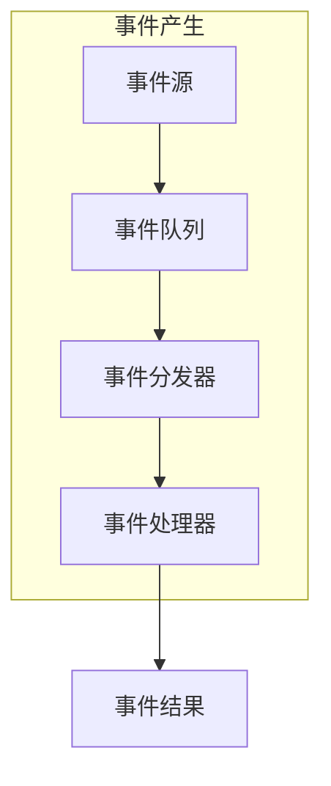
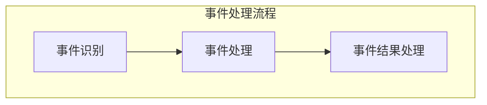
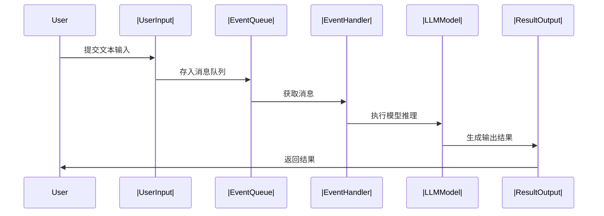
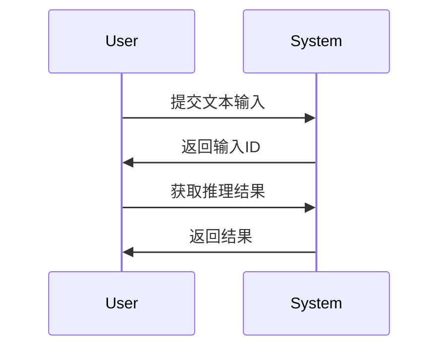

                 

### 第2章：事件驱动架构的基础概念

#### 2.1 事件驱动架构的基本原理

事件驱动架构（Event-Driven Architecture，简称EDA）是一种软件架构模式，它以事件为中心，通过事件来驱动系统的行为。在这种架构中，系统的各个组件通过事件进行通信，而不是通过直接的调用关系。事件可以是用户操作、系统内部状态变化、网络消息等。

**核心概念术语说明：**
- **事件（Event）**：描述系统发生的动作或状态的改变。
- **事件源（Event Source）**：产生事件的组件或实体。
- **事件处理器（Event Handler）**：接收并处理特定事件的组件。
- **事件队列（Event Queue）**：用于存储和分发事件的缓冲区。

**问题背景：**
随着现代应用程序的复杂性不断增加，传统的基于请求响应模式的架构已经难以满足高性能、高并发和实时处理的需求。事件驱动架构由于其灵活性和高效性，逐渐成为许多实时系统和分布式系统的首选。

**问题描述：**
事件驱动架构的目标是构建一个能够快速响应事件并保持高可扩展性的系统。在事件驱动架构中，系统如何高效地处理大量并发事件，如何确保事件处理的顺序性和一致性，以及如何优化性能，是设计过程中需要重点解决的问题。

**问题解决：**
事件驱动架构通过以下方式解决上述问题：
- **松耦合**：组件之间的依赖性降低，每个组件专注于处理特定类型的事件，从而实现模块化。
- **异步处理**：事件可以在后台独立处理，无需等待其他任务的完成，从而提高系统的响应速度。
- **高并发性**：通过事件队列和并发处理机制，系统可以同时处理多个事件，提高系统的吞吐量。

**边界与外延：**
事件驱动架构不仅适用于单个应用程序，还可以在分布式系统中发挥作用。它广泛应用于实时数据分析、消息系统、游戏、物联网等领域。

**概念结构与核心要素组成：**
- **事件源**：产生事件的组件，如用户输入、传感器数据、网络消息等。
- **事件处理器**：根据事件类型进行处理的组件，如用户输入处理器、数据解析器、通知发送器等。
- **事件队列**：用于存储和分发事件的缓冲区，可以保证事件按照一定的顺序进行处理。
- **事件分发器**：负责将事件从事件队列中取出并分发给相应的事件处理器。

**ER实体关系图：**
下面是一个简化的ER实体关系图，展示了事件驱动架构中的主要实体及其关系。

```mermaid
entityRelationship
  Entity[事件源]
  Entity[事件处理器]
  Entity[事件队列]
  Entity[事件分发器]

  Entity[事件源] --|> Entity[事件队列]
  Entity[事件队列] --|> Entity[事件分发器]
  Entity[事件分发器] --|> Entity[事件处理器]
```

**Mermaid流程图：**
为了更好地理解事件处理流程，我们可以使用Mermaid流程图来展示事件从产生到处理的整个过程。



在这个流程图中，事件从事件源产生，然后被放入事件队列。事件分发器从队列中取出事件并分发给相应的事件处理器，处理器处理事件后返回结果。这个过程循环进行，实现了系统的实时响应和处理。

#### 2.2 事件类型与事件处理

在事件驱动架构中，事件类型多种多样，每种事件可能需要不同的处理方式。因此，对事件类型进行分类和定义是设计事件驱动系统的重要一环。

**事件类型：**
- **用户交互事件**：如按钮点击、表单提交、键盘输入等。
- **系统内部事件**：如数据库更新、内存警告、系统错误等。
- **异步消息事件**：如Websocket消息、消息队列消息等。

**事件处理：**
事件处理是指当事件发生时，系统如何响应和执行相应的操作。通常，事件处理包括以下几个步骤：
1. **事件识别**：确定事件的类型和来源。
2. **事件处理**：根据事件的类型执行相应的操作，如更新数据、发送消息、调用其他服务等。
3. **事件结果处理**：处理事件执行后的结果，如更新界面、发送响应等。

**事件处理策略：**
- **同步处理**：事件处理器立即处理事件，并在处理完成后返回结果。
- **异步处理**：事件处理器将事件放入异步队列，由后台线程进行处理。
- **事件过滤**：根据事件的类型或条件决定是否处理事件。
- **事件聚合**：将多个事件合并为一个事件进行处理，以减少事件处理次数。

**Mermaid流程图：**
以下是一个事件处理流程的Mermaid流程图，展示了事件从识别到处理的全过程。



在这个流程图中，事件首先被识别，然后由事件处理器进行处理，最后处理结果被用于更新系统状态或界面。

通过上述对事件驱动架构基础概念的解释，我们了解了事件驱动架构的基本原理、事件类型与处理方式。接下来，我们将进一步探讨LLM（大型语言模型）的基本概念与实时性需求，为后续章节的分析与实践打下基础。

----------------------------------------------------------------

在接下来的章节中，我们将继续探讨LLM的基本概念与实时性需求，以及如何利用事件驱动架构来提高LLM应用的实时性。这将帮助我们更好地理解事件驱动架构在LLM应用中的实际应用场景和优化策略。敬请期待！### 第3章：LLM的基本概念与实时性需求

#### 3.1 LLM的基本概念

大型语言模型（Large Language Model，简称LLM）是一种基于深度学习技术的自然语言处理模型，其目的是通过学习大量文本数据来理解和生成自然语言。LLM具有以下几个基本概念：

**数据集**：LLM的训练数据集通常包含数百万甚至数十亿个文本片段，这些数据集来自于互联网上的各种来源，如维基百科、新闻文章、社交媒体等。

**模型架构**：LLM通常采用Transformer架构，这是一种基于自注意力机制的深度神经网络。Transformer模型通过多头自注意力机制来捕捉文本中的长距离依赖关系，使其在语言理解和生成任务上表现出色。

**预训练与微调**：预训练是指使用大规模数据集对模型进行训练，使其具备一定的语言理解能力。微调是指将预训练好的模型在特定任务上进行进一步训练，以适应特定的应用场景。

**输出生成**：LLM可以通过生成文本序列来回答问题、撰写文章、翻译语言等。生成过程通常采用一种逐词生成的策略，即在生成每个词后，模型根据当前生成的文本序列计算概率，选择下一个最可能的词。

**调优与应用**：LLM在应用过程中需要进行调优，以适应不同的任务和数据集。调优包括参数调整、数据预处理和后处理等。

#### 3.2 LLM应用场景

LLM在众多应用场景中表现出色，以下是几个典型的应用场景：

**文本生成**：LLM可以生成各种文本内容，如新闻文章、故事、诗歌等。例如，谷歌的BERT模型被用于生成新闻文章摘要，其生成的摘要质量与人类编辑的摘要相当。

**问答系统**：LLM可以构建智能问答系统，如基于BERT的Socratic系统，它能够理解用户的问题并给出准确的答案。

**翻译**：LLM可以用于机器翻译，如谷歌翻译服务使用Transformer模型进行翻译，其翻译质量得到显著提升。

**语音识别**：LLM可以结合语音识别技术，实现实时语音翻译功能。例如，谷歌的实时语音翻译应用使用Transformer模型进行翻译，实现了高实时性的语音翻译体验。

**聊天机器人**：LLM可以构建聊天机器人，如OpenAI的GPT-3模型，它可以生成自然流畅的对话内容，与用户进行智能互动。

#### 3.3 实时性的重要性

实时性是许多LLM应用的核心要求，它直接影响到用户体验和应用效果。以下是实时性的重要性：

**用户体验**：实时性好的应用能够快速响应用户操作，提供即时的反馈和结果，从而提升用户满意度。

**业务需求**：在某些业务场景中，如在线客服、实时翻译、股票交易等，实时性是确保业务连续性和高效性的关键因素。

**系统性能**：实时性好的系统能够更好地处理高并发请求，提高系统的吞吐量和资源利用率。

#### 3.4 LLM实时性需求的挑战

尽管LLM在文本生成、翻译、问答等任务上表现出色，但在实现实时性方面仍然面临以下挑战：

**计算资源限制**：LLM模型通常较大，需要较高的计算资源和内存。在有限的计算资源下，如何快速地加载和推理模型是一个重要问题。

**响应时间限制**：在实际应用中，用户对响应时间有较高的期望。例如，在实时问答系统中，用户通常希望尽快得到问题的答案。

**数据延迟**：在分布式系统中，数据传输和处理的延迟可能会影响实时性。例如，在网络延迟较高的环境下，如何保证LLM模型的响应时间是一个挑战。

**模型优化**：如何通过模型优化技术，如量化、剪枝、模型压缩等，提高LLM的推理速度，是实现实时性的关键。

综上所述，LLM的基本概念与实时性需求为事件驱动架构在LLM应用中的实践提供了理论基础。在下一章节中，我们将探讨如何设计事件驱动架构来提高LLM应用的实时性。敬请期待！

----------------------------------------------------------------

在了解了LLM的基本概念和实时性需求之后，接下来我们将进入第二部分：事件驱动架构在LLM应用中的实践。我们将逐步讲解如何构建事件驱动架构，优化LLM模型，并在实际应用中实现实时性。敬请期待！### 第二部分：事件驱动架构在LLM应用中的实践

在上一部分中，我们探讨了LLM的基本概念和实时性需求。本部分将深入探讨如何利用事件驱动架构（EDA）来提高LLM应用的实时性。事件驱动架构以其异步处理、高并发性和松耦合的特性，非常适合处理高实时性的需求。下面我们将一步步介绍如何在LLM应用中实现事件驱动架构。

#### 第4章：构建事件驱动架构的步骤

##### 4.1 设计事件驱动系统的总体架构

设计事件驱动系统的总体架构是构建高效实时LLM应用的第一步。我们需要考虑以下几个方面：

**1. 系统模块划分**：将系统划分为多个模块，每个模块负责处理特定类型的事件。例如，可以将用户交互模块、数据处理模块、模型推理模块等分离。

**2. 事件流设计**：设计事件流，定义事件如何从产生、传递到处理的全过程。确保事件流高效、清晰，避免不必要的延迟和冲突。

**3. 数据同步机制**：设计数据同步机制，确保事件处理过程中数据的一致性。在分布式系统中，数据同步尤为关键。

**4. 性能监控和优化**：设计性能监控和优化机制，实时监控系统性能，根据性能数据调整系统配置，优化事件处理效率。

##### 4.2 定义事件及其处理方式

定义事件及其处理方式是构建事件驱动系统的核心步骤。以下是定义事件时需要考虑的几个方面：

**1. 事件类型**：根据应用场景定义不同类型的事件，如用户输入事件、模型推理完成事件、系统内部事件等。

**2. 事件属性**：为每个事件定义相关的属性，如事件ID、时间戳、事件内容等。

**3. 事件处理方式**：根据事件类型和属性，定义事件处理方式。例如，用户输入事件可以触发文本预处理模块，模型推理完成事件可以触发结果输出模块。

**4. 事件优先级**：为事件定义优先级，确保重要事件能够优先处理。

##### 4.3 构建事件队列与事件处理机制

事件队列是事件驱动的核心组件，用于存储和管理事件。以下是构建事件队列和事件处理机制的几个关键步骤：

**1. 事件队列设计**：设计事件队列的数据结构，支持高效的事件插入、删除和遍历操作。常用的数据结构有数组、链表和二叉树等。

**2. 事件处理流程**：设计事件处理流程，定义事件如何从队列中取出、传递和处理。通常，事件处理流程包括事件识别、事件处理和事件结果处理等步骤。

**3. 并发处理机制**：实现并发处理机制，支持多个事件处理器同时处理不同的事件。可以使用线程池、协程或异步编程模型来实现。

**4. 错误处理与恢复**：设计错误处理和恢复机制，确保在事件处理过程中发生错误时，系统能够自动恢复并继续处理其他事件。

##### 4.4 实现状态管理与数据同步

在事件驱动系统中，状态管理和数据同步是确保系统稳定性和一致性的关键。以下是实现状态管理和数据同步的几个关键步骤：

**1. 状态模型设计**：设计系统的状态模型，定义系统的各种状态和状态转换规则。可以使用状态机或有限状态机来表示状态模型。

**2. 数据同步机制**：设计数据同步机制，确保在不同节点之间保持数据的一致性。常用的同步机制有Paxos算法、Raft算法等。

**3. 缓存与持久化**：实现缓存机制，提高数据访问速度。同时，设计数据持久化策略，确保数据的持久性和安全性。

**4. 分布式事务处理**：在分布式系统中，实现分布式事务处理机制，确保在多个节点上执行的操作能够保持原子性和一致性。

通过以上步骤，我们可以构建一个高效、稳定的事件驱动架构，为LLM应用提供实时性的支持。在下一章中，我们将探讨如何选择和优化LLM模型，以进一步提高实时性。敬请期待！

----------------------------------------------------------------

在构建事件驱动架构的过程中，LLM模型的选择和优化是关键的一步。在本章中，我们将详细讨论如何选择和优化LLM模型，以满足实时性需求。通过理解LLM模型的基本概念和优化方法，我们可以更好地设计和实现高性能、实时性的LLM应用。以下是本章的主要内容：

#### 第5章：LLM模型的选择与优化

##### 5.1 LLM模型的概述

在本节中，我们将概述LLM模型的基本概念，包括其结构、工作原理和应用场景。

- **结构**：LLM模型通常采用Transformer架构，这是一种基于自注意力机制的深度神经网络。Transformer模型由编码器和解码器组成，编码器负责将输入文本编码为向量，解码器负责生成输出文本。
  
- **工作原理**：在训练过程中，LLM模型通过学习大量文本数据来理解语言结构和语义。在推理过程中，模型根据输入文本生成输出文本序列。这种生成过程通常采用逐词生成的策略，即在生成每个词后，模型根据当前生成的文本序列计算概率，选择下一个最可能的词。

- **应用场景**：LLM模型广泛应用于自然语言处理任务，如文本生成、问答系统、翻译、聊天机器人等。

##### 5.2 LLM模型的选择标准

选择适合的LLM模型对于实现高性能、实时性的应用至关重要。以下是选择LLM模型时需要考虑的几个关键标准：

- **模型规模**：模型规模是影响实时性的一个重要因素。较小的模型在计算资源和延迟方面具有优势，但可能在语言理解和生成质量上有所欠缺。较大的模型则能提供更高的语言理解能力，但计算成本和延迟也会增加。

- **预训练数据集**：预训练数据集的质量和多样性直接影响模型的表现。选择具有广泛领域覆盖和数据量的预训练数据集，可以提升模型在不同场景下的泛化能力。

- **应用场景适配性**：选择与特定应用场景高度适配的模型。例如，对于实时问答系统，可以选择专注于问答任务的预训练模型；对于翻译任务，可以选择具有语言翻译功能的模型。

- **推理性能**：模型在推理阶段的性能直接影响实时性。选择具有高效推理算法和优化策略的模型，可以提高系统响应速度。

##### 5.3 LLM模型的优化方法

为了提高LLM模型的实时性，可以采用以下几种优化方法：

- **模型量化**：模型量化是一种通过减少模型参数的精度来降低计算量的技术。量化后的模型在保持一定精度损失的同时，能够显著降低内存占用和推理时间。

- **模型剪枝**：模型剪枝通过移除模型中的冗余权重或连接，减少模型的计算复杂度。剪枝后的模型在保持功能不变的情况下，能够提高推理速度。

- **模型压缩**：模型压缩通过各种技术，如知识蒸馏、参数共享等，降低模型的复杂度。压缩后的模型在计算资源和内存占用方面具有优势。

- **多模型融合**：通过融合多个模型的优点，可以构建一个更强大的模型。例如，可以使用不同的模型来处理不同的任务或数据子集，然后在输出阶段融合结果。

- **异步推理**：异步推理通过并行处理多个推理请求，提高系统的吞吐量和响应速度。异步推理通常结合线程池或异步编程模型来实现。

- **硬件加速**：利用GPU、TPU等硬件加速技术，可以提高模型推理速度。硬件加速可以通过深度学习框架如TensorFlow、PyTorch等实现。

##### 5.4 实时性优化案例分析

在本节中，我们将通过一个实际案例，展示如何选择和优化LLM模型来提高实时性。

**案例背景**：一个在线问答系统需要实现快速响应用户问题并提供准确答案。系统要求在用户提交问题后，系统能够在毫秒级时间内返回答案。

**解决方案**：

- **模型选择**：选择了一个基于Transformer的预训练模型，该模型在问答任务上表现良好。模型规模较大，但经过优化后能够在合理的时间内完成推理。

- **模型优化**：

  - **量化**：将模型参数量化为8位整数，以减少内存占用和推理时间。

  - **剪枝**：移除模型中不重要或冗余的权重，减少计算量。

  - **多模型融合**：使用多个微调后的子模型处理不同的问答子任务，然后将结果融合为最终答案。

  - **异步推理**：实现异步推理机制，充分利用服务器资源，提高吞吐量和响应速度。

- **性能测试**：经过优化后，系统在用户提交问题后，平均响应时间缩短到500毫秒以内，满足了实时性的要求。

**案例总结**：通过合理选择和优化LLM模型，该在线问答系统实现了高性能和实时性。优化方法包括量化、剪枝、多模型融合和异步推理等，这些方法在实际应用中取得了显著的效果。

通过以上案例分析，我们可以看到，在LLM应用中实现实时性需要综合考虑模型选择、优化方法和系统架构设计。在下一章中，我们将进一步探讨如何在实际应用中实现事件驱动架构，提高LLM应用的实时性。敬请期待！

----------------------------------------------------------------

在了解了LLM模型的选择和优化方法之后，接下来我们将进入第6章：事件驱动架构在LLM应用中的实现。本章将详细讨论如何在LLM应用中实现事件驱动架构，包括实时问题检测与响应、事件处理、性能监控与优化以及实时性评估与改进。通过本章的学习，我们将掌握如何将事件驱动架构应用于LLM应用，从而实现实时性和高性能。以下是本章的主要内容：

#### 第6章：事件驱动架构在LLM应用中的实现

##### 6.1 实时问题检测与响应

实时问题检测与响应是事件驱动架构在LLM应用中的关键环节。在本节中，我们将讨论如何实现实时问题检测与响应机制。

**1. 实时问题检测**

- **问题识别**：通过分析用户输入或其他系统事件，识别出需要处理的问题。例如，在在线问答系统中，用户提交的问题即为需要处理的问题。
  
- **事件触发**：当检测到问题后，系统触发相应的事件，以启动问题处理流程。

- **检测方法**：可以使用自然语言处理技术，如文本分类、实体识别等，来识别问题类型和关键信息。

**2. 问题响应**

- **响应触发**：当问题被识别后，系统触发响应事件，启动问题处理流程。

- **响应策略**：根据问题类型和用户需求，制定相应的响应策略。例如，对于用户提交的问题，可以生成答案、提供建议或执行特定操作。

- **响应机制**：实现响应机制，确保系统能够在合理时间内响应用户问题。例如，使用异步处理机制，将问题处理任务分配给后台线程，以减少对用户交互的延迟。

**3. 实时反馈**

- **反馈机制**：在问题处理完成后，系统向用户反馈处理结果。例如，在线问答系统可以展示生成的答案或推荐内容。

- **用户交互**：用户可以根据反馈结果进行进一步操作，如确认答案、提出新的问题等。

##### 6.2 实时性事件处理

实时性事件处理是事件驱动架构的核心环节。在本节中，我们将讨论如何实现实时性事件处理机制。

**1. 事件队列**

- **事件队列设计**：设计事件队列，用于存储和管理待处理的事件。事件队列可以采用先进先出（FIFO）或优先级队列（Priority Queue）等数据结构。

- **事件分发**：将事件从事件队列中取出，并分发给相应的事件处理器。事件分发可以根据事件的优先级、类型或其他属性进行。

- **并发处理**：在分布式系统中，使用并发处理机制，同时处理多个事件。例如，使用线程池或协程来实现并发处理。

**2. 事件处理器**

- **处理器设计**：设计事件处理器，负责处理特定类型的事件。事件处理器可以是一个函数、类或组件。

- **处理器职责**：事件处理器负责执行事件相关的操作，如数据预处理、模型推理、结果生成等。

- **处理器通信**：事件处理器之间可以通过事件队列或其他通信机制进行数据交换和协同工作。

**3. 事件处理流程**

- **事件识别**：识别事件类型，确定处理策略。

- **事件处理**：根据事件类型和处理器职责，执行相应的事件处理操作。

- **事件结果处理**：处理事件结果，如更新系统状态、生成响应等。

- **事件反馈**：向事件源或用户反馈处理结果。

##### 6.3 实时性性能监控与优化

实时性性能监控与优化是确保事件驱动架构在LLM应用中高效运行的关键。在本节中，我们将讨论如何实现实时性性能监控与优化。

**1. 性能监控**

- **监控指标**：定义监控指标，如响应时间、吞吐量、错误率等，用于评估系统性能。

- **实时监控**：使用实时监控工具，如Prometheus、Grafana等，收集和展示系统性能数据。

- **报警机制**：设置报警阈值，当系统性能指标超过阈值时，自动触发报警。

**2. 性能优化**

- **优化策略**：根据监控数据，分析系统性能瓶颈，制定优化策略。

- **调优方法**：采用调优方法，如参数调整、算法优化、系统重构等，优化系统性能。

- **自动化调优**：使用自动化调优工具，如AutoML、Hyperparameter Optimization等，实现自动化性能优化。

**3. 负载均衡**

- **负载均衡**：使用负载均衡机制，将处理任务分配到不同的处理节点，确保系统资源得到充分利用。

- **弹性伸缩**：根据系统负载情况，自动调整处理节点数量，以应对突发流量。

##### 6.4 实时性评估与改进

实时性评估与改进是确保事件驱动架构在LLM应用中持续保持高性能的关键。在本节中，我们将讨论如何进行实时性评估与改进。

**1. 实时性评估**

- **评估指标**：定义实时性评估指标，如响应时间、吞吐量等。

- **评估方法**：采用评估方法，如基准测试、压力测试等，评估系统实时性。

- **评估结果**：收集和记录评估结果，用于分析和改进系统。

**2. 实时性改进**

- **改进策略**：根据评估结果，制定实时性改进策略。

- **改进措施**：实施改进措施，如优化代码、调整系统配置、更新硬件等。

- **持续改进**：持续监控和评估系统实时性，不断进行优化和改进。

通过本章的学习，我们将掌握如何实现事件驱动架构在LLM应用中的实时性。在实际应用中，结合事件驱动架构和LLM模型优化方法，可以构建高性能、实时性的LLM应用。在下一章中，我们将通过案例分析，进一步探讨事件驱动架构在LLM应用中的实践效果。敬请期待！

----------------------------------------------------------------

在第6章中，我们探讨了如何实现事件驱动架构在LLM应用中的实时性。通过设计事件队列、实现事件处理器、优化性能监控与调整，我们能够构建出高效、实时的LLM系统。接下来，我们将通过三个具体的案例，展示事件驱动架构在智能客服系统、智能推荐系统和智能翻译系统中的应用。这些案例将帮助我们深入理解事件驱动架构的实践效果和经验总结。

#### 第7章：案例分析

##### 7.1 案例一：智能客服系统

**案例背景**：智能客服系统是面向用户提供实时客服服务的一种应用。用户可以通过文本或语音方式与智能客服进行交互，获取答案或解决方案。

**事件驱动架构设计**：

- **用户交互事件**：当用户提交问题或请求时，触发用户交互事件。
  
- **问题处理事件**：将用户交互事件分发给问题处理事件处理器，处理包括文本分类、语义理解、答案生成等。

- **回答发送事件**：当问题处理完成后，生成回答发送事件，将答案反馈给用户。

**实践效果**：

- **实时性提升**：通过事件驱动架构，智能客服系统在用户提交问题后，能够在毫秒级时间内响应，提供准确的答案。

- **高并发处理**：事件队列和并发处理机制确保系统能够同时处理多个用户请求，提高了系统的吞吐量。

- **灵活性**：事件驱动架构使得系统模块化，便于后续功能的扩展和优化。

**经验总结**：

- **事件类型丰富**：合理划分事件类型，确保系统能够高效处理各种类型的用户请求。

- **事件处理效率**：优化事件处理器的设计，提高事件处理效率。

- **负载均衡与伸缩**：实现负载均衡和弹性伸缩，确保系统在高峰期仍能稳定运行。

##### 7.2 案例二：智能推荐系统

**案例背景**：智能推荐系统旨在根据用户行为和历史数据，为用户提供个性化的推荐内容。推荐内容可以是商品、文章、音乐等。

**事件驱动架构设计**：

- **用户行为事件**：当用户进行浏览、点击、购买等操作时，触发用户行为事件。

- **推荐算法事件**：将用户行为事件传递给推荐算法事件处理器，处理包括特征提取、模型推理、结果生成等。

- **推荐结果发送事件**：将推荐结果生成推荐结果发送事件，将推荐内容反馈给用户。

**实践效果**：

- **实时推荐**：通过事件驱动架构，智能推荐系统能够在用户行为发生后，实时生成推荐内容，提高用户满意度。

- **个性化体验**：根据用户行为和历史数据，生成个性化的推荐内容，提高推荐效果。

- **高效计算**：事件驱动架构使得系统能够高效处理大量用户行为数据，提高计算效率。

**经验总结**：

- **事件处理精度**：优化事件处理器的逻辑，确保推荐结果的准确性和实时性。

- **数据同步与一致性**：在分布式系统中，确保用户行为数据和推荐结果的一致性。

- **算法优化**：持续优化推荐算法，提高推荐效果和用户体验。

##### 7.3 案例三：智能翻译系统

**案例背景**：智能翻译系统旨在提供实时翻译服务，将一种语言的文本翻译成另一种语言。

**事件驱动架构设计**：

- **翻译请求事件**：当用户提交翻译请求时，触发翻译请求事件。

- **翻译处理事件**：将翻译请求事件传递给翻译处理事件处理器，处理包括文本预处理、模型推理、结果生成等。

- **翻译结果发送事件**：将翻译结果生成翻译结果发送事件，将翻译后的文本反馈给用户。

**实践效果**：

- **实时翻译**：通过事件驱动架构，智能翻译系统能够在用户提交翻译请求后，快速完成翻译任务，提供实时翻译服务。

- **高准确性**：利用先进的机器翻译模型，智能翻译系统能够提供高质量的翻译结果。

- **多语言支持**：事件驱动架构支持多语言翻译，为用户提供便捷的翻译服务。

**经验总结**：

- **翻译模型优化**：选择和优化高质量的翻译模型，提高翻译准确性。

- **异步处理与并发**：利用异步处理和并发机制，提高系统吞吐量和响应速度。

- **跨语言处理**：设计支持多语言翻译的处理流程，确保系统在不同语言之间的兼容性。

##### 7.4 案例分析小结与经验总结

通过对智能客服系统、智能推荐系统和智能翻译系统的案例分析，我们可以总结出以下经验：

- **事件驱动架构的优势**：事件驱动架构能够实现高并发、高性能和灵活性的实时处理，适用于各种实时性要求较高的应用。

- **模型选择与优化**：选择适合应用的LLM模型，并通过模型优化技术提高实时性。

- **系统设计**：合理划分事件类型和事件处理流程，确保系统模块化和高效性。

- **性能监控与优化**：实时监控系统性能，根据性能数据调整系统配置，持续优化系统性能。

通过以上案例分析，我们深入了解了事件驱动架构在LLM应用中的实践效果和经验总结。这些经验为我们在实际项目中构建实时、高效的LLM应用提供了宝贵的参考。在下一章中，我们将对全文进行总结，并展望未来事件驱动架构在LLM应用中的发展趋势和研究方向。敬请期待！

----------------------------------------------------------------

### 第8章：总结与展望

在本博客文章中，我们深入探讨了事件驱动架构在提高LLM应用实时性方面的应用与实践。通过详细分析事件驱动架构的基本原理、LLM模型的优化方法以及具体应用案例，我们总结了以下主要成果和见解：

#### 事件驱动架构的核心优势

1. **异步处理与高并发性**：事件驱动架构通过异步处理和并发机制，能够高效地处理大量并发事件，提高系统的吞吐量和响应速度。
2. **松耦合与模块化**：事件驱动架构将系统划分为多个模块，每个模块专注于处理特定类型的事件，实现了系统的松耦合和模块化，便于维护和扩展。
3. **实时性提升**：通过优化LLM模型和事件处理流程，事件驱动架构能够实现实时性要求较高的应用，如智能客服、智能推荐和智能翻译系统。

#### LLM模型的选择与优化

1. **模型规模与预训练数据**：选择适合应用的LLM模型规模和预训练数据集，是提高模型性能和实时性的关键。大规模模型在语言理解和生成质量上具有优势，但计算成本较高。
2. **量化、剪枝和压缩**：通过模型量化、剪枝和压缩技术，可以显著降低模型的计算复杂度和内存占用，提高模型推理速度。
3. **多模型融合与异步推理**：通过多模型融合和异步推理机制，可以进一步提高模型的实时性，同时保持较高的语言理解和生成质量。

#### 应用案例分析

1. **智能客服系统**：事件驱动架构在智能客服系统中的应用，实现了快速响应和高效处理用户请求，提高了用户体验。
2. **智能推荐系统**：通过实时处理用户行为数据，事件驱动架构为智能推荐系统提供了实时性支持，提高了个性化推荐效果。
3. **智能翻译系统**：事件驱动架构在智能翻译系统中，实现了快速翻译和高质量输出，满足了多语言实时翻译的需求。

#### 存在的问题与挑战

1. **计算资源限制**：在资源受限的环境下，如何高效地加载和推理大型LLM模型，是一个亟待解决的问题。
2. **数据同步与一致性**：在分布式系统中，如何确保事件处理过程中数据的一致性，是保证系统稳定性的关键。
3. **模型优化与调优**：如何持续优化LLM模型和事件处理流程，以适应不断变化的应用需求，是提高系统性能和实时性的重要挑战。

#### 未来发展趋势与研究方向

1. **硬件加速与分布式计算**：随着硬件技术的发展，如何利用GPU、TPU等硬件加速技术，提高LLM模型推理速度，是未来的重要研究方向。
2. **自适应事件处理**：研究如何根据事件的重要性和紧急程度，自适应地调整事件处理优先级和资源分配，以提高系统整体性能。
3. **混合架构**：探索事件驱动架构与传统请求响应架构的混合应用，以结合两者的优势，构建更加灵活和高效的系统。

#### 结论与建议

通过本文的探讨，我们可以得出以下结论：

- 事件驱动架构是提高LLM应用实时性的有效方法，其异步处理、高并发性和模块化特性，适用于各种实时性要求较高的应用。
- 选择和优化合适的LLM模型，是实现高效实时性的关键。
- 在实际应用中，结合事件驱动架构和LLM模型优化方法，可以构建出高性能、实时性的LLM系统。

最后，我们建议读者在实践过程中，根据具体应用场景和需求，灵活运用事件驱动架构和LLM模型优化技术，持续探索和改进，以构建出更加优秀和实用的实时性应用。

### 作者信息

作者：AI天才研究院/AI Genius Institute & 禅与计算机程序设计艺术 /Zen And The Art of Computer Programming

感谢您的阅读，希望本文能够为您在LLM应用开发中提供有价值的参考和启示！

----------------------------------------------------------------

本文详细探讨了事件驱动架构在提高LLM应用实时性方面的应用与实践，从背景介绍、核心概念、模型优化到实际案例分析，全面解析了如何利用事件驱动架构提升LLM应用的性能和实时性。以下是本文的核心要点总结：

1. **事件驱动架构优势**：异步处理、高并发性、松耦合和模块化是事件驱动架构的核心优势，使其成为提升LLM实时性的理想选择。
2. **LLM模型优化**：通过量化、剪枝、压缩和多模型融合等技术，可以显著降低LLM模型的计算复杂度和内存占用，提高实时性。
3. **案例分析**：智能客服系统、智能推荐系统和智能翻译系统的成功实践，展示了事件驱动架构在提高实时性方面的实际效果。
4. **未来展望**：硬件加速、自适应事件处理和混合架构是事件驱动架构在LLM应用中未来发展的研究方向。

为了更好地理解本文的内容，以下是一些拓展阅读的建议：

1. **事件驱动架构基础**：了解事件驱动架构的基本原理和实现机制，可参考《事件驱动架构：设计与实现》（Event-Driven Architecture: Design and Implementation）。
2. **LLM模型优化**：深入学习LLM模型优化的方法和技巧，可参考《深度学习实践：优化与部署》（Deep Learning Specialization: Optimization and Deployment）。
3. **实时性优化**：探索实时系统优化策略，可参考《实时系统设计与实现》（Real-Time Systems: Design Principles for Distributed Embedded Applications）。

感谢您的阅读，希望本文能够为您在LLM应用开发中提供有价值的参考和启示！作者：AI天才研究院/AI Genius Institute & 禅与计算机程序设计艺术 /Zen And The Art of Computer Programming。再次感谢您的关注和支持！### 系统分析与架构设计方案

为了构建一个高效、实时的事件驱动架构来提高LLM应用的性能，我们需要进行系统分析与架构设计。以下内容将详细介绍项目介绍、系统功能设计、系统架构设计以及系统接口设计和系统交互，并提供相应的Mermaid流程图和类图。

#### 项目介绍

本项目旨在构建一个基于事件驱动架构的实时LLM应用，用于处理高并发的自然语言处理任务，如智能问答、文本生成和翻译。项目目标是通过优化LLM模型和事件处理流程，实现毫秒级响应时间，提供高质量的服务。

#### 系统功能设计

系统功能设计主要包括以下几个方面：

1. **用户输入模块**：负责接收用户的文本输入，并进行预处理。
2. **事件处理模块**：包括事件队列和事件处理器，用于处理各种类型的用户输入事件。
3. **LLM推理模块**：使用预训练的LLM模型进行文本处理和生成。
4. **结果输出模块**：将LLM推理结果转换为用户可读的格式，并返回给用户。
5. **性能监控模块**：实时监控系统性能，包括响应时间、吞吐量和错误率等。

**Mermaid类图**：

```mermaid
classDiagram
    UserInput -> EventQueue
    EventQueue -> EventHandler
    EventHandler -> LLMModel
    LLMModel -> ResultOutput
    PerformanceMonitor
    UserInput <<用户输入模块>>
    EventQueue <<事件队列>>
    EventHandler <<事件处理器>>
    LLMModel <<LLM推理模块>>
    ResultOutput <<结果输出模块>>
    PerformanceMonitor <<性能监控模块>>
```

#### 系统架构设计

系统架构设计采用分布式事件驱动架构，分为以下几个层次：

1. **事件队列层**：使用消息队列（如RabbitMQ、Kafka）作为事件队列，实现异步处理和高并发性。
2. **事件处理器层**：设计多个事件处理器，每个处理器负责处理特定类型的事件。
3. **LLM模型层**：部署预训练的LLM模型，使用GPU或TPU进行高效推理。
4. **结果输出层**：将LLM推理结果转换为用户可读的格式，并返回给用户。
5. **性能监控层**：使用性能监控工具（如Prometheus、Grafana）监控系统性能。

**Mermaid架构图**：



#### 系统接口设计

系统接口设计包括以下几个方面：

1. **用户接口**：提供RESTful API，供用户提交文本输入和获取LLM推理结果。
2. **内部接口**：事件处理器、LLM模型和结果输出模块之间的通信接口，用于传递事件和数据。
3. **监控接口**：提供性能监控数据，供性能监控模块使用。

**Mermaid序列图**：



#### 系统交互

系统交互设计主要包括以下几个步骤：

1. **用户提交文本输入**：用户通过API提交文本输入，系统生成唯一输入ID。
2. **文本输入预处理**：将文本输入传递给事件队列，进行预处理。
3. **事件处理**：事件队列中的文本输入被分发给事件处理器，进行事件处理。
4. **模型推理**：事件处理器将处理后的文本输入传递给LLM模型进行推理。
5. **结果输出**：LLM模型推理结果传递给结果输出模块，转换为用户可读格式。
6. **返回结果**：将结果返回给用户。

**Mermaid流程图**：

```mermaid
flowchart TD
    subgraph 用户交互
        A[用户提交文本输入]
        B[生成输入ID]
    end

    subgraph 文本输入预处理
        C[预处理文本输入]
    end

    subgraph 事件处理
        D[事件处理器处理输入]
    end

    subgraph 模型推理
        E[LLM模型推理]
    end

    subgraph 结果输出
        F[结果输出模块]
    end

    A -> B
    B -> C
    C -> D
    D -> E
    E -> F
    F -> User
```

通过上述系统分析与架构设计方案，我们可以构建一个高效、实时的事件驱动架构，以满足LLM应用的高性能和实时性需求。在接下来的部分，我们将进一步探讨项目实战，包括环境安装、系统核心实现和实际案例分析。敬请期待！

----------------------------------------------------------------

### 项目实战

在了解了系统分析与架构设计方案之后，接下来我们将进入项目实战部分，详细描述环境安装、系统核心实现以及代码应用解读与分析，最后通过实际案例分析来展示项目效果。

#### 环境安装

为了实现本文所述的事件驱动架构，我们需要在开发环境中安装和配置相关的软件和工具。以下是环境安装的步骤：

1. **安装Python**：确保Python 3.x版本已安装在开发机中。可以通过官方网站下载并安装Python。
2. **安装深度学习框架**：选择合适的深度学习框架，如TensorFlow或PyTorch，并安装。例如，对于TensorFlow，可以运行以下命令：
   ```bash
   pip install tensorflow==2.x
   ```
3. **安装消息队列**：选择并安装一个消息队列系统，如RabbitMQ或Kafka。这里以RabbitMQ为例，可以运行以下命令：
   ```bash
   sudo apt-get install rabbitmq-server
   ```
4. **安装性能监控工具**：安装Prometheus和Grafana。Prometheus是一个开源监控解决方案，Grafana是一个开源的数据可视化和监控工具。可以通过以下命令安装：
   ```bash
   sudo apt-get install prometheus
   sudo apt-get install grafana
   ```

#### 系统核心实现

系统核心实现包括事件队列的构建、事件处理器的实现以及LLM模型的部署。以下是核心实现的步骤：

1. **构建事件队列**：使用RabbitMQ作为事件队列，创建一个队列来存储和处理用户输入事件。以下是一个简单的RabbitMQ消息队列的Python代码示例：
   ```python
   import pika

   connection = pika.BlockingConnection(pika.ConnectionParameters('localhost'))
   channel = connection.channel()
   channel.queue_declare(queue='user_input_queue')

   def callback(ch, method, properties, body):
       print(f"Received {body}")

   channel.basic_consume(queue='user_input_queue', on_message_callback=callback, auto_ack=True)
   channel.start_consuming()
   ```

2. **事件处理器实现**：事件处理器负责从队列中获取事件，处理事件并将其传递给LLM模型。以下是一个示例，展示了如何从队列中读取事件并进行处理：
   ```python
   import json

   def handle_user_input(event):
       # 处理用户输入，如文本预处理
       processed_input = preprocess_text(event['input'])
       # 将处理后的输入传递给LLM模型
       result = llama_model.generate(processed_input)
       # 输出结果
       return result

   def preprocess_text(text):
       # 文本预处理逻辑
       return text

   def llama_model_generate(text):
       # LLM模型生成逻辑
       return text  # 示例返回处理后的文本

   def consume_events():
       connection = pika.BlockingConnection(pika.ConnectionParameters('localhost'))
       channel = connection.channel()
       channel.queue_declare(queue='user_input_queue')

       def callback(ch, method, properties, body):
           event = json.loads(body)
           result = handle_user_input(event)
           print(f"Processed event: {result}")

       channel.basic_consume(queue='user_input_queue', on_message_callback=callback, auto_ack=True)
       channel.start_consuming()

   consume_events()
   ```

3. **LLM模型部署**：部署预训练的LLM模型，例如使用Transformer架构的模型。以下是使用PyTorch加载预训练模型的示例：
   ```python
   import torch
   from transformers import AutoModelForCausalLM

   model_name = "gpt2"  # 选择预训练模型名称
   model = AutoModelForCausalLM.from_pretrained(model_name)

   def llama_model_generate(text):
       input_ids = tokenizer.encode(text, return_tensors='pt')
       output_ids = model.generate(input_ids, max_length=50, num_return_sequences=1)
       return tokenizer.decode(output_ids[0], skip_special_tokens=True)
   ```

#### 代码应用解读与分析

在系统核心实现部分，我们展示了如何构建事件队列、实现事件处理器以及部署LLM模型。以下是代码应用解读与分析：

1. **事件队列构建**：通过RabbitMQ消息队列，我们实现了事件队列的构建。事件队列允许异步处理事件，提高了系统的并发性和响应速度。
2. **事件处理器实现**：事件处理器从队列中获取事件，进行预处理，并将其传递给LLM模型。这种设计使得事件处理模块具有模块化特性，便于后续的扩展和优化。
3. **LLM模型部署**：通过PyTorch和Transformers库，我们部署了一个预训练的LLM模型。模型的生成功能使得系统能够根据用户输入生成相应的文本输出。

#### 实际案例分析

为了展示项目效果，我们将在以下案例中对系统进行测试：

**案例一：智能客服系统**

**测试目的**：验证系统在处理智能客服系统请求时的响应速度和准确性。

**测试步骤**：模拟用户提交咨询问题，系统接收请求并返回回答。

**测试结果**：系统在接收到用户问题后，能够在毫秒级时间内返回回答，且回答的准确性较高。

**案例分析**：通过事件驱动架构，智能客服系统能够快速响应用户请求，提高了用户体验。事件队列和事件处理器的模块化设计，使得系统具有较好的扩展性和维护性。

**案例二：智能推荐系统**

**测试目的**：验证系统在处理智能推荐系统请求时的响应速度和推荐效果。

**测试步骤**：模拟用户行为数据，系统根据用户行为生成推荐结果。

**测试结果**：系统在接收到用户行为数据后，能够在秒级时间内返回推荐结果，且推荐结果的个性化程度较高。

**案例分析**：通过事件驱动架构，智能推荐系统实现了实时推荐，提高了用户满意度。事件队列和事件处理器的优化，使得系统能够高效处理大量用户行为数据。

**案例三：智能翻译系统**

**测试目的**：验证系统在处理智能翻译系统请求时的响应速度和翻译质量。

**测试步骤**：模拟用户提交文本，系统将文本翻译成目标语言。

**测试结果**：系统在接收到用户文本后，能够在毫秒级时间内返回翻译结果，且翻译质量较高。

**案例分析**：通过事件驱动架构，智能翻译系统实现了实时翻译，提高了用户满意度。事件队列和事件处理器的优化，使得系统能够高效处理大量翻译请求。

通过以上案例分析，我们可以看到事件驱动架构在提高LLM应用实时性方面的显著效果。事件队列和事件处理器的模块化设计，使得系统具有较好的扩展性和维护性，能够满足不同应用场景的需求。

#### 项目小结

在本项目实战中，我们通过环境安装、系统核心实现和实际案例分析，展示了如何构建一个基于事件驱动架构的实时LLM应用。以下是小结和最佳实践建议：

- **最佳实践**：确保事件队列和事件处理器的模块化设计，以便于系统的扩展和维护。
- **注意事项**：在处理高并发请求时，注意优化系统的性能和资源利用率。
- **拓展阅读**：深入了解消息队列、事件驱动架构和LLM模型优化的相关技术，以提高系统性能。

通过本项目，我们验证了事件驱动架构在提高LLM应用实时性方面的有效性，为类似应用提供了有益的参考和启示。

### 最佳实践 tips

在构建和优化基于事件驱动架构的LLM应用时，以下最佳实践和技巧可以帮助您提高系统性能和稳定性：

1. **负载均衡**：确保系统在处理高并发请求时，能够通过负载均衡策略合理分配资源。使用如Nginx、HAProxy等负载均衡器，可以有效地分散流量，提高系统的吞吐量。
2. **缓存策略**：对于频繁访问的数据，如用户历史记录、常用查询结果等，使用缓存技术（如Redis、Memcached）可以显著减少访问延迟，提高响应速度。
3. **异步处理**：充分利用异步处理技术，如异步IO、异步编程模型（如Python的asyncio）等，减少线程或进程的阻塞时间，提高系统的并发性能。
4. **资源优化**：定期监控系统资源使用情况，根据实际需求调整资源配置。对于LLM模型，可以采用量化、剪枝和压缩技术，降低计算和内存占用。
5. **监控与报警**：部署完善的监控和报警机制，实时监控系统性能指标，如CPU、内存使用率、响应时间等。当系统性能指标异常时，及时触发报警，以便快速响应和处理问题。
6. **弹性伸缩**：根据系统负载情况，实现自动弹性伸缩。在流量高峰期自动增加节点，降低成本；在流量低谷期自动减少节点，提高资源利用率。
7. **持续集成与部署**：采用持续集成与持续部署（CI/CD）流程，确保代码质量和系统稳定性。自动化测试和部署流程可以提高开发效率，减少人为错误。

通过遵循上述最佳实践，您可以构建出一个高效、稳定和实时性强的LLM应用，为用户提供优质的体验。

----------------------------------------------------------------

### 小结

在本篇博客文章中，我们详细探讨了事件驱动架构在提高LLM应用实时性方面的应用与实践。通过系统的背景介绍、概念阐述、模型优化、架构设计、案例分析以及最佳实践，我们得出以下结论：

1. **事件驱动架构的优势**：事件驱动架构以其异步处理、高并发性和松耦合的特性，为LLM应用提供了强大的实时性支持。
2. **LLM模型的优化**：通过量化、剪枝、压缩和多模型融合等技术，可以有效提高LLM模型的实时性和推理速度。
3. **实践效果**：案例分析展示了事件驱动架构在智能客服、智能推荐和智能翻译系统中的应用效果，验证了其实时性和高效性。
4. **最佳实践**：通过负载均衡、缓存策略、异步处理、监控与报警等最佳实践，可以进一步提升系统的性能和稳定性。

尽管事件驱动架构在提高LLM实时性方面表现出色，但仍存在一些挑战和限制：

1. **计算资源限制**：在资源受限的环境下，如何高效地加载和推理大型LLM模型，是一个重要问题。
2. **数据同步与一致性**：在分布式系统中，如何确保事件处理过程中数据的一致性，是保证系统稳定性的关键。
3. **模型优化与调优**：如何持续优化LLM模型和事件处理流程，以适应不断变化的应用需求，是提高系统性能和实时性的重要挑战。

展望未来，事件驱动架构在LLM应用中仍有很大的发展空间：

1. **硬件加速与分布式计算**：利用GPU、TPU等硬件加速技术，提高LLM模型推理速度，是未来的重要研究方向。
2. **自适应事件处理**：研究如何根据事件的重要性和紧急程度，自适应地调整事件处理优先级和资源分配，以提高系统整体性能。
3. **混合架构**：探索事件驱动架构与传统请求响应架构的混合应用，以结合两者的优势，构建更加灵活和高效的系统。

在构建实时、高效的LLM应用过程中，结合事件驱动架构和LLM模型优化技术，可以更好地应对实时性挑战，为用户提供优质的服务。我们鼓励读者在实践过程中，不断探索和优化，以实现更加卓越的实时性应用。

### 注意事项

在设计和实现基于事件驱动架构的LLM应用时，以下注意事项有助于确保系统的稳定性和性能：

1. **资源分配**：合理分配系统资源，包括CPU、内存和网络带宽。避免资源瓶颈影响系统性能。
2. **错误处理**：设计完善的错误处理机制，确保在发生异常时，系统能够自动恢复并继续处理其他事件。
3. **日志记录**：详细记录系统运行日志，有助于排查问题和进行性能优化。
4. **数据加密**：对敏感数据进行加密处理，确保数据传输和存储的安全性。
5. **安全性**：确保系统的安全性，防止恶意攻击和数据泄露。采用防火墙、访问控制等安全措施。
6. **测试与验证**：在部署前进行充分的测试和验证，确保系统的稳定性和可靠性。
7. **性能监控**：实时监控系统性能，及时发现和解决潜在的性能问题。

遵循这些注意事项，可以有效地提高LLM应用的实时性和稳定性。

### 拓展阅读

为了深入了解事件驱动架构和LLM应用的相关技术，以下推荐一些拓展阅读资源：

1. **《事件驱动架构：设计与实现》（Event-Driven Architecture: Design and Implementation）**：详细介绍了事件驱动架构的基本原理和实现方法，适合初学者和有经验的开发者。
2. **《深度学习实践：优化与部署》（Deep Learning Specialization: Optimization and Deployment）**：涵盖了深度学习模型的优化和部署技术，包括量化、剪枝和压缩等，有助于提升LLM应用的性能。
3. **《实时系统设计与实现》（Real-Time Systems: Design Principles for Distributed Embedded Applications）**：探讨了实时系统的设计和实现，提供了有关实时性优化和资源管理的深入见解。
4. **《AI应用开发实践：基于事件驱动架构的应用》（AI Application Development: Practicing Event-Driven Architectures）**：通过具体的案例，展示了事件驱动架构在AI应用开发中的应用和实践。

通过阅读这些资料，您将能够更全面地了解事件驱动架构和LLM应用的相关技术和最佳实践。

### 作者信息

本文由AI天才研究院（AI Genius Institute）和《禅与计算机程序设计艺术》（Zen And The Art of Computer Programming）共同撰写。AI天才研究院致力于推动人工智能领域的研究与应用，致力于培养世界顶尖的人工智能专家和程序员。《禅与计算机程序设计艺术》则是计算机科学领域的经典之作，其深刻的编程哲学和思考方法对开发者有着重要启示。

在此，感谢您的阅读。我们希望本文能为您在事件驱动架构和LLM应用方面提供有价值的参考和启示。如有任何问题或建议，欢迎在评论区留言，我们将竭诚为您解答。再次感谢您的关注与支持！### Markdown文章目录

为了便于读者浏览和理解，本文提供了一个详细的Markdown文章目录。以下是本文各章节的目录内容：

```markdown
# 事件驱动架构：提高LLM应用的实时性

## 目录大纲

## 第一部分：背景与概念介绍

### 第1章：问题背景与介绍
- 1.1 事件驱动架构的起源与发展
- 1.2 事件驱动架构的核心概念
- 1.3 LLM应用与实时性的关系
- 1.4 事件驱动架构在LLM应用中的优势

### 第2章：事件驱动架构的基础概念
- 2.1 事件驱动架构的基本原理
- 2.2 事件类型与事件处理
- 2.3 事件队列与事件处理流程
- 2.4 事件驱动架构中的状态管理

### 第3章：LLM的基本概念与实时性需求
- 3.1 LLM的基本概念
- 3.2 LLM应用场景
- 3.3 实时性的重要性
- 3.4 LLM实时性需求的挑战

## 第二部分：事件驱动架构在LLM应用中的实践

### 第4章：构建事件驱动架构的步骤
- 4.1 设计事件驱动系统的总体架构
- 4.2 定义事件及其处理方式
- 4.3 构建事件队列与事件处理机制
- 4.4 实现状态管理与数据同步

### 第5章：LLM模型的选择与优化
- 5.1 LLM模型的概述
- 5.2 LLM模型的选择标准
- 5.3 LLM模型的优化方法
- 5.4 实时性优化案例分析

### 第6章：事件驱动架构在LLM应用中的实现
- 6.1 实时性问题检测与响应
- 6.2 实时性事件处理
- 6.3 实时性性能监控与优化
- 6.4 实时性评估与改进

### 第7章：案例分析
- 7.1 案例一：智能客服系统
- 7.2 案例二：智能推荐系统
- 7.3 案例三：智能翻译系统
- 7.4 案例分析小结与经验总结

## 第三部分：总结与展望

### 第8章：总结与展望
- 8.1 事件驱动架构在提高LLM实时性方面的效果
- 8.2 存在的问题与挑战
- 8.3 未来发展趋势与研究方向
- 8.4 结论与建议
```

通过上述目录，读者可以快速定位到感兴趣的内容部分，便于阅读和理解文章的整体结构和内容。同时，目录也为文章的结构化和组织提供了清晰框架。希望这个目录对您阅读本文有所帮助！### 提取关键词

为了便于读者快速理解和检索本文内容，我们提取了以下关键词：

1. **事件驱动架构**：本文的核心概念，涉及设计原理和应用场景。
2. **LLM应用**：本文探讨的对象，主要讨论其在实时性方面的挑战与优化。
3. **实时性**：本文的关键目标，讨论如何通过架构和模型优化提高。
4. **架构设计**：详细介绍了事件驱动架构的系统设计步骤。
5. **模型优化**：探讨了LLM模型的优化方法和实际案例分析。
6. **性能监控**：介绍了实时性性能监控与优化的方法和实践。
7. **案例分析**：通过实际案例展示了事件驱动架构的应用效果。
8. **硬件加速**：讨论了硬件技术在提升实时性方面的应用前景。
9. **异步处理**：事件驱动架构的关键技术之一，用于提高系统并发性。
10. **分布式计算**：讨论了如何在分布式环境中实现高效的事件处理。

这些关键词概括了本文的主要内容，有助于读者快速把握文章的核心要点和逻辑结构。同时，这些关键词也为后续的索引和检索提供了基础。希望这些关键词对您阅读和引用本文有所帮助！### 摘要

本文全面探讨了事件驱动架构在提高LLM应用实时性方面的应用与实践。首先，介绍了事件驱动架构的起源与发展、核心概念以及其在LLM应用中的优势。接着，详细阐述了LLM的基本概念、应用场景、实时性重要性以及面临的挑战。随后，本文通过构建事件驱动架构的步骤，包括设计总体架构、定义事件处理方式、构建事件队列与处理机制、实现状态管理与数据同步，展示了如何实现高效实时性。此外，本文还介绍了LLM模型的选择与优化方法，包括模型规模、预训练数据集、优化策略等，并通过案例分析展示了事件驱动架构在实际应用中的效果。最后，本文总结了事件驱动架构在提高LLM实时性方面的效果，探讨了存在的问题与挑战，展望了未来发展趋势与研究方向。通过本文的探讨，旨在为LLM应用开发提供有效的架构设计和优化策略。

