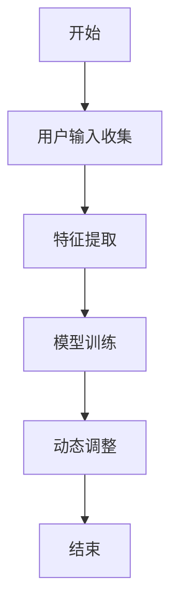

                 

### 交互式提示：根据用户输入动态调整

---

**关键词**：交互式提示、动态调整、用户输入、算法原理、系统架构、最佳实践

**摘要**：本文详细探讨了交互式提示系统如何根据用户输入动态调整，从核心概念、系统设计、算法原理、实现与优化、实战案例分析到最佳实践与未来展望，全面解析了交互式提示技术的高效实现与应用。

---

**第一部分：问题背景与核心概念**

### 第1章：问题背景与核心概念概述

**1.1 问题背景**

#### 1.1.1 交互式提示的兴起

随着互联网和智能设备的普及，用户界面交互变得越来越重要。传统的单向信息传递已经不能满足用户对互动和个性化的需求。交互式提示作为一种增强用户体验的技术，正在逐渐崭露头角。

#### 1.1.2 用户输入动态调整的必要性

用户的输入是多样化的，固定不变的提示信息难以满足所有用户的需求。动态调整能够根据用户的输入实时变化，提供更加个性化的服务。

#### 1.1.3 交互式提示的应用领域

交互式提示技术广泛应用于电子商务、在线教育、客户服务、智能家居等多个领域，提升了用户交互的效率与满意度。

**1.2 核心概念**

#### 1.2.1 交互式提示的概念与类型

交互式提示是指通过图形用户界面（GUI）或其他交互方式，向用户提供即时反馈和指导。根据触发方式和显示形式，可分为弹出提示、状态栏提示、通知栏提示等类型。

#### 1.2.2 用户输入动态调整的原理

用户输入动态调整的原理基于对用户行为的分析，通过算法模型实时调整提示内容和样式，以适应不同的用户需求和场景。

#### 1.2.3 交互式提示系统构成要素

交互式提示系统主要包括用户输入处理模块、交互逻辑设计模块、核心算法模块和用户反馈模块等。

**1.3 概念联系与扩展**

#### 1.3.1 交互式提示与用户反馈

有效的交互式提示能够引导用户正确操作，促进用户与系统之间的良性互动。

#### 1.3.2 动态调整与用户满意度

动态调整能够提高用户体验，降低用户的操作难度，从而提升用户满意度。

#### 1.3.3 交互式提示系统的边界与挑战

交互式提示系统需要处理大量用户数据，同时保证系统的响应速度和稳定性，这对系统设计和实现提出了较高的要求。

**1.4 本章小结**

本章概述了交互式提示的背景、核心概念和系统构成，为后续章节的深入探讨奠定了基础。

----------------------------------------------------------------

**第二部分：交互式提示系统设计**

### 第2章：交互式提示系统架构设计

**2.1 系统总体架构**

#### 2.1.1 系统架构设计原则

交互式提示系统的设计应遵循模块化、可扩展性和易维护性原则，以确保系统的灵活性和可扩展性。

#### 2.1.2 系统主要模块划分

交互式提示系统主要包含用户输入处理模块、交互逻辑设计模块、核心算法模块和用户反馈模块等。

**2.2 用户输入处理模块**

#### 2.2.1 用户输入解析

用户输入处理模块负责接收并解析用户输入，包括键盘输入、触摸屏输入等。

#### 2.2.2 动态调整策略

根据用户输入的特点和场景，动态调整提示内容和样式，以实现个性化服务。

**2.3 交互逻辑设计**

#### 2.3.1 交互流程图

通过交互流程图描述用户与系统之间的交互过程，明确各模块的功能和协作关系。

#### 2.3.2 用户交互反馈机制

设计用户交互反馈机制，确保用户能够及时获得系统的反馈，并进行相应的操作。

## 第3章：核心算法原理

### 3.1 算法概述

#### 3.1.1 算法选择标准

选择算法时应考虑实时性、准确性和鲁棒性等因素。

#### 3.1.2 算法主要步骤

算法主要步骤包括用户输入收集、特征提取、模型训练和动态调整等。

### 3.2 算法流程图

使用Mermaid绘制算法流程图，如下所示：

### 3.3 算法数学模型与公式

#### 3.3.1 基本公式

假设输入特征向量 $X \in \mathbb{R}^{n \times m}$，输出目标向量 $Y \in \mathbb{R}^{n \times 1}$，则动态调整模型可以表示为：

$$
\hat{Y} = f(X; \theta)
$$

其中，$f$ 表示激活函数，$\theta$ 表示模型参数。

#### 3.3.2 数学模型解释

该模型通过学习输入特征和输出目标之间的映射关系，实现动态调整功能。

### 3.4 算法举例说明

#### 3.4.1 例子1：用户输入调整前

假设用户输入为 $X_1 = \begin{bmatrix} 1 \\ 0 \\ 1 \end{bmatrix}$，根据历史数据，输出目标为 $Y_1 = \begin{bmatrix} 1 \end{bmatrix}$。

#### 3.4.2 例子2：用户输入调整后

当用户输入变为 $X_2 = \begin{bmatrix} 0 \\ 1 \\ 0 \end{bmatrix}$，通过模型预测得到动态调整后的输出目标 $\hat{Y}_2 = \begin{bmatrix} 0 \end{bmatrix}$。

## 第4章：系统实现与优化

### 4.1 系统实现步骤

#### 4.1.1 环境搭建

搭建开发环境，包括编程语言、开发工具和依赖库等。

#### 4.1.2 核心代码实现

编写核心代码，实现用户输入处理、动态调整等功能。

### 4.2 系统优化策略

#### 4.2.1 性能优化

通过优化算法和数据结构，提高系统性能。

#### 4.2.2 稳定性提升

通过增加异常处理和容错机制，提高系统稳定性。

#### 4.2.3 用户体验优化

根据用户反馈，不断优化交互界面和提示内容，提升用户体验。

## 第5章：项目实战

### 5.1 项目介绍

#### 5.1.1 项目背景

介绍项目起源、目标和应用场景。

#### 5.1.2 项目目标

明确项目目标，包括功能实现、性能要求和用户体验等方面。

### 5.2 系统核心实现源代码解读

#### 5.2.1 用户输入处理

分析用户输入处理模块的实现原理和关键代码。

#### 5.2.2 动态调整实现

详细解读动态调整模块的实现细节。

### 5.3 实际案例分析与讲解

#### 5.3.1 案例背景

介绍实际案例的背景和目标。

#### 5.3.2 案例分析与实战

分析案例实现过程，讲解关键技术和注意事项。

### 5.4 项目小结

总结项目成果，提出改进意见。

----------------------------------------------------------------

**第三部分：最佳实践与未来展望**

### 第6章：最佳实践

#### 6.1 实践技巧

总结交互式提示系统的最佳实践技巧，包括用户输入处理、动态调整策略和优化方法等。

#### 6.2 小结与注意事项

对交互式提示系统的设计、实现和优化进行小结，并强调注意事项。

### 第7章：未来展望

#### 7.1 技术趋势分析

分析人工智能、大数据等技术的发展趋势，探讨其对交互式提示系统的潜在影响。

#### 7.2 展望与挑战

展望交互式提示系统的未来发展方向，探讨面临的挑战和应对策略。

### 第8章：拓展阅读

#### 8.1 相关书籍推荐

推荐与交互式提示相关的经典书籍。

#### 8.2 学术论文精选

精选与交互式提示相关的学术论文。

#### 8.3 在线资源链接

提供交互式提示系统的在线资源链接，包括代码示例、工具和文档等。

### 结语

**作者：** AI天才研究院/AI Genius Institute & 禅与计算机程序设计艺术 /Zen And The Art of Computer Programming

本文以交互式提示系统为背景，详细探讨了根据用户输入动态调整的核心概念、系统设计、算法原理、实现与优化、实战案例分析以及最佳实践与未来展望。通过一步步分析推理，文章旨在为读者提供清晰、系统、深入的技术见解，助力其在交互式提示领域的实践与应用。随着技术的不断进步，交互式提示系统将在更多领域发挥重要作用，为用户带来更加智能化、个性化的服务体验。

