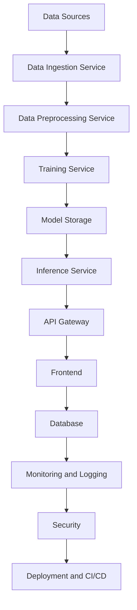
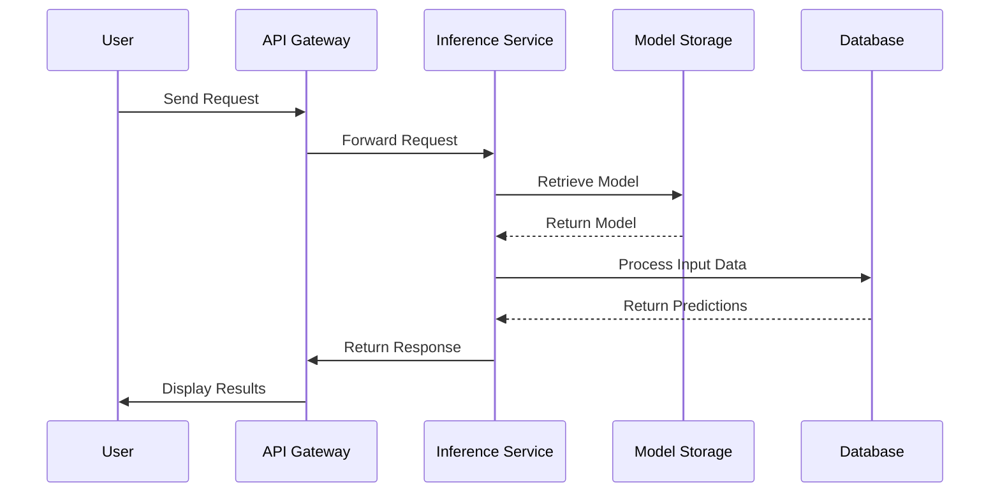

                 

### From 0 to 1: Building an Efficient LLM Application Development System

> **Keywords**: Large Language Models (LLM), Application Development, Efficiency, System Architecture, Python Programming, AI Technologies

> **Abstract**: This comprehensive guide delves into the intricacies of building efficient Large Language Model (LLM) applications, from fundamental concepts to practical implementation. It covers the essential technologies, development practices, and architectural designs needed to create robust and scalable LLM applications. Readers will gain a deep understanding of the step-by-step process, enabling them to build cutting-edge LLM applications that drive innovation in various industries.

### Table of Contents

#### Introduction and Background

- **Chapter 1: Introduction to LLM and Application Development**
  - **1.1 The Importance and Basics of LLM**
  - **1.2 Overview of LLM Architectures**
  - **1.3 The Landscape of LLM Applications**

#### Core LLM Technologies

- **Chapter 2: Fundamental Technologies of LLM**
  - **2.1 Data Preprocessing and Augmentation**
  - **2.2 Model Training and Optimization**
  - **2.3 Model Evaluation and Testing**

#### Efficient LLM Development Practices

- **Chapter 3: Developing Efficient LLM Applications**
  - **3.1 Application Design Principles**
  - **3.2 Application Development Workflow**
  - **3.3 Monitoring and Maintenance**

#### Advanced LLM Development Strategies

- **Chapter 4: Advanced Techniques in LLM Application Development**
  - **4.1 Multi-Model Integration and Ensembles**
  - **4.2 Contextual Learning and Inference Optimization**
  - **4.3 Ethical Considerations and Bias Mitigation**

#### System Architecture and Design

- **Chapter 5: Architectural Design of LLM Applications**
  - **5.1 System Design Principles**
  - **5.2 System Architecture**
  - **5.3 Interface Design and System Interaction**

#### Project Practical Application

- **Chapter 6: Practical Application of LLM in Projects**
  - **6.1 Project Introduction and Overview**
  - **6.2 Core Implementation and Analysis**
  - **6.3 Case Analysis and Detailed Explanation**
  - **6.4 Project Conclusion and Reflections**

#### Best Practices and Future Directions

- **Chapter 7: Best Practices, Summary, and Future Directions**
  - **7.1 Best Practices for LLM Development**
  - **7.2 Summary of Key Insights**
  - **7.3 Future Directions and Challenges**

### Introduction and Background

#### 1.1 The Importance and Basics of LLM

Large Language Models (LLM) have revolutionized the field of natural language processing (NLP) by enabling machines to understand and generate human language with remarkable accuracy. At their core, LLMs are neural networks trained on vast amounts of textual data to predict the next word or sequence of words in a given context. This predictive power allows LLMs to perform a wide range of tasks, including text generation, translation, summarization, and question-answering.

**Background:**

The concept of LLMs has its roots in the early days of artificial intelligence (AI) research, where researchers attempted to create systems that could understand and generate human language. However, significant breakthroughs began to emerge in the late 2010s with the development of deep learning techniques and the availability of massive computational resources. Models like Google's BERT, OpenAI's GPT, and Facebook's RoBERTa became the cornerstone of modern NLP research, pushing the boundaries of what is possible with language understanding and generation.

**Problems and Solutions:**

The primary problem addressed by LLMs is the ability to process and generate human-like text that is coherent, contextually relevant, and expressive. Traditional rule-based and statistical methods struggled to achieve this level of performance. LLMs, on the other hand, leverage deep neural networks to model the complexities of human language, resulting in more accurate and natural text generation.

**Boundary and Extension:**

LLMs are a subset of deep learning models specifically designed for NLP tasks. While they have made significant strides in understanding and generating text, they are not without limitations. Issues such as biases in training data, the inability to understand complex logical reasoning, and the potential for generating offensive or incorrect content are areas that continue to be explored and addressed.

#### 1.2 Overview of LLM Architectures

The architecture of LLMs is crucial for understanding their capabilities and limitations. Modern LLMs are typically based on transformer models, which have become the de facto standard for NLP tasks due to their ability to handle long-range dependencies and parallelize training.

**Transformer Models:**

Transformer models, introduced in the paper "Attention is All You Need" by Vaswani et al. in 2017, replaced the traditional recurrent neural network (RNN) architecture with a self-attention mechanism. This mechanism allows the model to weigh the importance of different parts of the input sequence when predicting the next word, resulting in better performance on various NLP tasks.

**BERT and Its Variants:**

BERT (Bidirectional Encoder Representations from Transformers) is a prominent variant of the transformer model that was introduced by Google in 2018. BERT's bidirectional training approach allows it to understand the context of a word by considering its left and right context simultaneously, leading to improved performance in tasks such as text classification and question-answering.

**Other Notable LLMs:**

In addition to BERT and its variants, other notable LLMs include GPT (Generative Pre-trained Transformer) by OpenAI, RoBERTa by Facebook AI, and T5 (Text-to-Text Transfer Transformer) by Google. Each of these models has its unique architecture and training approach, contributing to the diversity and versatility of LLMs.

#### 1.3 The Landscape of LLM Applications

LLMs have found applications in various domains, ranging from consumer products to enterprise solutions, and have become an integral part of modern AI systems.

**Current Trends:**

1. **Content Generation:** LLMs are extensively used for generating articles, blogs, and social media posts, automating content creation for businesses and individuals.
2. **Virtual Assistants:** Chatbots and virtual assistants powered by LLMs are becoming increasingly sophisticated, offering personalized and context-aware interactions with users.
3. **Translation and Localization:** LLMs are revolutionizing translation services by providing fast and accurate translations between different languages, enabling global communication and collaboration.
4. **Summarization and Extraction:** LLMs are used to summarize lengthy documents, extracting key information and providing concise summaries for better comprehension and retention.
5. **Education and Training:** LLMs are being employed in educational applications to create interactive learning materials, personalized tutoring, and automated assessments.

**Business Value and Impact:**

The business value of LLM applications is substantial. By automating tasks that were previously time-consuming and labor-intensive, LLMs can reduce operational costs and improve efficiency. They also enhance customer experiences by providing personalized and timely responses to queries and requests. LLMs enable businesses to gain valuable insights from large volumes of textual data, driving data-driven decision-making and strategic planning.

**Challenges and Opportunities:**

Despite their widespread adoption, LLMs face several challenges. One of the primary concerns is the ethical use of LLMs, particularly the potential for generating biased or offensive content. Additionally, LLMs require significant computational resources and expertise to train and deploy, which may limit their accessibility for smaller organizations. However, these challenges also present opportunities for innovation and improvement, driving advancements in areas such as data augmentation, bias mitigation, and model optimization.

### Core LLM Technologies

#### 2.1 Data Preprocessing and Augmentation

Data preprocessing and augmentation are critical steps in the development of LLM applications. They involve cleaning, transforming, and expanding the data to improve the performance and generalization of the model.

**Data Collection and Cleaning:**

1. **Data Collection:** The first step in data preprocessing is collecting a large and diverse dataset. This dataset should cover various domains and topics to ensure the model's versatility. Sources of data can include public datasets, web scraping, and proprietary datasets from organizations.
2. **Data Cleaning:** Once the data is collected, it needs to be cleaned to remove noise, inconsistencies, and duplicates. This involves tasks such as removing HTML tags, correcting spelling errors, and standardizing text formats.

**Data Augmentation Techniques:**

Data augmentation techniques are used to increase the size and diversity of the dataset, improving the model's ability to generalize. Some common data augmentation techniques include:

1. **Synonym Replacement:** Replacing words with their synonyms to introduce variability in the text.
2. **Back Translation:** Translating the text into a different language and then back to the original language, which introduces linguistic diversity.
3. **Paraphrasing:** Rewriting sentences while preserving the original meaning, which helps the model learn different ways to express the same information.

**Data Format and Preprocessing Pipelines:**

1. **Data Format:** The collected and cleaned data needs to be formatted into a suitable format for model training. This typically involves tokenization, where the text is split into words or subwords, and encoding, where each token is assigned a unique integer ID.
2. **Preprocessing Pipelines:** Preprocessing pipelines are sequences of operations applied to the data to prepare it for training. These pipelines can include data augmentation, normalization, and batching, among others. They are often implemented using libraries such as TensorFlow or PyTorch.

#### 2.2 Model Training and Optimization

Model training and optimization are crucial for achieving high-performance LLM applications. This section covers the key steps and techniques involved in these processes.

**Training Process Overview:**

1. **Data Splitting:** The dataset is split into training, validation, and test sets. The training set is used to train the model, the validation set is used to tune hyperparameters and prevent overfitting, and the test set is used to evaluate the final model's performance.
2. **Model Initialization:** A neural network model is initialized with random weights. The architecture of the model, including the number of layers, hidden units, and activation functions, is predefined.
3. **Forward Pass:** The input data is passed through the model, and the output is generated. The output is compared to the ground truth labels to calculate the loss.
4. **Backpropagation:** The gradients of the loss with respect to the model's weights are calculated using backpropagation, and the weights are updated using an optimization algorithm such as stochastic gradient descent (SGD) or Adam.
5. **Training Loop:** The process of forward pass, loss calculation, backpropagation, and weight update is repeated for multiple epochs until the model converges or the validation loss stops improving.

**Hyperparameter Tuning:**

Hyperparameter tuning is the process of selecting the optimal values for hyperparameters, such as learning rate, batch size, and dropout rate, to improve the model's performance. Common techniques for hyperparameter tuning include grid search, random search, and Bayesian optimization.

**Optimization Strategies:**

1. **Learning Rate Scheduling:** Adjusting the learning rate during training to improve convergence. Techniques include step decay, exponential decay, and learning rate warmup.
2. **Regularization:** Techniques such as L1 and L2 regularization are used to prevent overfitting by penalizing large weights.
3. **Batch Normalization:** Normalizing the inputs of the neurons to stabilize the training process and improve convergence.
4. **Data Augmentation:** Using data augmentation techniques to increase the diversity of the training data and improve the model's generalization.

#### 2.3 Model Evaluation and Testing

Model evaluation and testing are essential steps in the development of LLM applications to ensure the model's performance and reliability.

**Evaluation Metrics:**

1. **Accuracy:** The percentage of correctly predicted tokens or sequences.
2. **Perplexity:** A measure of how well the model predicts the next token in a given sequence. Lower perplexity indicates better performance.
3. **F1 Score:** A metric used for binary classification tasks, calculated as the harmonic mean of precision and recall.
4. **BLEU Score:** A metric used for evaluating the similarity between the generated text and the reference text, commonly used in machine translation tasks.

**Test-Set Validation:**

The test set, which was not used during the training process, is used to evaluate the model's performance. This ensures that the model has not overfitted to the training data. The model's performance on the test set provides an unbiased estimate of its generalization ability.

**Debugging and Error Analysis:**

Debugging and error analysis are crucial for identifying and addressing issues in the model's performance. This involves:

1. **Error Analysis:** Analyzing the types of errors the model is making, such as incorrect token predictions or generating nonsensical text.
2. **Visualization:** Visualizing the model's attention weights or gradients to gain insights into its decision-making process.
3. **Monitoring:** Continuously monitoring the model's performance and resource usage during training and inference to detect and address issues early.

### Efficient LLM Development Practices

#### 3.1 Application Design Principles

Designing efficient LLM applications requires a deep understanding of the underlying technologies and careful consideration of various design principles. This section covers the key principles and considerations for developing robust and scalable LLM applications.

**User-Centric Design:**

User-centric design focuses on creating applications that meet the needs and preferences of the end-users. This involves gathering user feedback, conducting usability testing, and incorporating user-centric features such as natural language interfaces and personalized recommendations.

**Scalability and Performance Considerations:**

LLM applications often require processing large volumes of data and generating responses in real-time. Therefore, it is crucial to design applications that are scalable and performant. This involves:

1. **Vertical Scaling:** Increasing the computational resources allocated to the application, such as CPU, memory, and storage.
2. **Horizontal Scaling:** Distributing the workload across multiple servers or nodes to improve performance and fault tolerance.
3. **Caching:** Storing frequently accessed data in memory to reduce the latency of data retrieval.
4. **Load Balancing:** Distributing incoming requests evenly across multiple servers to optimize resource utilization and improve performance.

**Integration with Existing Systems:**

LLM applications often need to integrate with existing systems and technologies within an organization. This involves:

1. **APIs and Microservices:** Developing APIs and microservices that enable seamless integration with other applications and services.
2. **Data Integration:** Ensuring that the LLM application can access and process data from various sources, such as databases, external APIs, and file systems.
3. **Authentication and Authorization:** Implementing secure authentication and authorization mechanisms to protect sensitive data and restrict access to authorized users.

#### 3.2 Application Development Workflow

The application development workflow for LLM applications typically involves several stages, from project planning and requirements analysis to system design, implementation, and testing. This section covers the key steps in the development workflow.

**Project Planning and Requirements Analysis:**

1. **Project Planning:** Defining the project scope, objectives, and timelines. This involves identifying the stakeholders, establishing communication channels, and allocating resources.
2. **Requirements Analysis:** Gathering and documenting the functional and non-functional requirements of the application. This involves understanding the use cases, user requirements, and system constraints.

**System Design and Architecture:**

1. **System Design:** Creating a high-level architecture that outlines the components, interfaces, and data flows of the application. This involves selecting the appropriate technologies, frameworks, and platforms.
2. **Database Design:** Designing the database schema and data models to store and manage the application's data.
3. **API and Microservices Design:** Designing the APIs and microservices that enable communication and integration with other systems and services.

**Implementation and Iteration:**

1. **Implementation:** Writing the code to implement the system design and requirements. This involves developing the front-end, back-end, and database components of the application.
2. **Iteration:** Conducting iterative development and testing to refine the application based on user feedback and changing requirements. This involves continuously integrating new features, fixing bugs, and optimizing performance.

#### 3.3 Monitoring and Maintenance

Monitoring and maintenance are critical for ensuring the reliability, performance, and security of LLM applications. This section covers the key aspects of monitoring and maintenance.

**Performance Monitoring:**

1. **System Metrics:** Monitoring key performance indicators (KPIs) such as response time, throughput, CPU and memory usage, and network latency to identify performance bottlenecks and optimize resource utilization.
2. **Error Logging:** Logging and analyzing errors and exceptions to identify and resolve issues that may affect the application's functionality.
3. **Alerting and Notification:** Implementing alerting and notification systems to notify developers and administrators of potential issues and ensure timely resolution.

**Security and Compliance:**

1. **Data Protection:** Ensuring the security and confidentiality of sensitive data, including user data and model parameters.
2. **Compliance:** Ensuring that the application complies with relevant regulations and standards, such as data privacy laws and industry-specific regulations.

**Regular Updates and Maintenance:**

1. **Regular Updates:** Keeping the application and its dependencies up-to-date with the latest security patches and performance improvements.
2. **Maintenance:** Conducting regular maintenance tasks, such as database backups, system optimization, and performance tuning, to ensure the application's long-term reliability and efficiency.

### Advanced LLM Development Strategies

#### 4.1 Multi-Model Integration and Ensembles

Multi-model integration and ensembles are advanced strategies for enhancing the performance and robustness of LLM applications. This section explores the concept and techniques of combining multiple models to create a more powerful and accurate system.

**Concept of Multi-Model Integration:**

Multi-model integration involves combining the strengths of multiple LLMs or machine learning models to improve overall performance. Each model may have unique strengths and weaknesses, and by combining them, we can leverage their respective advantages and compensate for their limitations.

**Ensemble Techniques:**

1. **Bagging:** Bagging (Bootstrap Aggregating) involves training multiple models on different subsets of the training data and averaging their predictions. This helps to reduce variance and improve the generalization ability of the ensemble.
2. **Boosting:** Boosting involves training multiple models sequentially, where each model focuses on correcting the errors made by the previous models. The predictions of all models are combined to produce the final output. Common boosting algorithms include AdaBoost and XGBoost.
3. **Stacking:** Stacking involves training a meta-model on the predictions of multiple base models. The base models are trained on the training data, and their predictions are used as input for the meta-model, which then generates the final prediction.

**Practical Applications:**

Multi-model integration and ensembles have been successfully applied in various NLP tasks, such as text classification, sentiment analysis, and named entity recognition. For example, in text classification, combining a BERT-based model with a traditional machine learning model like a Support Vector Machine (SVM) can lead to improved performance and better handling of diverse text data.

**Performance Benefits:**

The primary benefits of multi-model integration and ensembles include:

1. **Improved Accuracy:** Combining models can lead to better performance and accuracy, as each model can capture different aspects of the problem.
2. **Robustness:** By incorporating diverse models, the ensemble is more robust to overfitting and can handle noisy or ambiguous data more effectively.
3. **Generalization:** Ensembles can improve generalization by leveraging the strengths of different models, leading to better performance on unseen data.

#### 4.2 Contextual Learning and Inference Optimization

Contextual learning and inference optimization are critical for improving the performance and efficiency of LLM applications. This section explores techniques for enhancing the context-aware capabilities of LLMs and optimizing the inference process.

**Contextual Learning:**

Contextual learning involves training LLMs to understand and generate text based on the context provided by the input data. This enables the models to generate more coherent and relevant responses.

1. **Contextual Embeddings:** Contextual embeddings are representations of words or tokens that capture their meaning in different contexts. These embeddings are typically generated using models like BERT or GPT, which are trained to understand the context of words in sentences.
2. **Contextual Pretraining:** Contextual pretraining involves training LLMs on large-scale text corpora with a focus on understanding the context of words and sentences. This helps to improve the models' ability to generate contextually appropriate text.

**Inference Optimization:**

Inference optimization aims to reduce the computational cost and latency of LLMs during the inference process. This is particularly important for real-time applications, where low latency is critical.

1. **Model Compression:** Model compression techniques, such as pruning, quantization, and knowledge distillation, are used to reduce the size and computational complexity of LLMs. This allows them to run more efficiently on resource-constrained devices.
2. **Inference Acceleration:** Inference acceleration techniques, such as GPU acceleration and distributed computing, are used to speed up the inference process. This involves leveraging specialized hardware and software optimizations to improve the performance of LLMs during inference.

**Practical Applications:**

Contextual learning and inference optimization have been applied in various real-world applications, such as chatbots, virtual assistants, and content generation systems.

1. **Chatbots and Virtual Assistants:** Contextual learning helps chatbots and virtual assistants to generate more natural and relevant responses by understanding the context of user queries. Inference optimization ensures that these systems can provide real-time responses with low latency.
2. **Content Generation:** Contextual learning improves the quality of generated content by ensuring that the text is coherent and contextually appropriate. Inference optimization enables real-time content generation, making it suitable for applications like automated journalism and marketing copywriting.

**Performance Benefits:**

The primary benefits of contextual learning and inference optimization include:

1. **Improved Quality:** Contextual learning enables LLMs to generate more coherent and contextually appropriate text, improving the overall quality of generated content.
2. **Reduced Latency:** Inference optimization techniques reduce the computational cost and latency of LLMs, making them suitable for real-time applications and enabling faster response times.
3. **Scalability:** By improving the efficiency of LLMs, inference optimization enables the deployment of LLM applications on a larger scale, accommodating more users and handling higher workloads.

#### 4.3 Ethical Considerations and Bias Mitigation

Ethical considerations and bias mitigation are crucial for ensuring the responsible and fair use of LLMs in applications. This section explores the ethical concerns associated with LLMs and techniques for mitigating bias and promoting fairness.

**Ethical Concerns:**

1. **Biases in Training Data:** LLMs can inadvertently learn and perpetuate biases present in the training data. This can lead to biased predictions and unfair treatment of certain groups.
2. **Privacy Concerns:** LLMs may process sensitive user data, raising concerns about privacy and data protection.
3. **Misuse and Misinformation:** LLMs can be used to generate misleading or false information, leading to potential harm and misinformation dissemination.

**Bias Mitigation Techniques:**

1. **Data Augmentation:** Augmenting the training data with diverse and balanced examples can help mitigate biases and improve the fairness of the model.
2. **Bias Detection and Correction:** Developing techniques to detect and correct biases in LLMs. This includes analyzing the model's predictions for bias and adjusting the model's parameters to reduce bias.
3. **Fairness Metrics:** Defining and evaluating fairness metrics to assess the model's performance across different groups. Techniques such as demographic parity, equal opportunity, and equalized odds are used to ensure fairness.

**Practical Applications:**

Ethical considerations and bias mitigation techniques are increasingly important in applications involving sensitive data and decision-making processes.

1. **Recruitment and Hiring:** Ensuring fair and unbiased recruitment and hiring processes by using LLMs to screen and evaluate job applicants.
2. **Healthcare and Diagnostics:** Developing LLM applications for diagnosing medical conditions, where fairness and accuracy are critical to patient care.
3. **Legal and Judicial Systems:** Ensuring fairness in legal applications, such as document analysis and case prediction, by addressing biases and ensuring transparent decision-making processes.

**Performance Benefits:**

The primary benefits of addressing ethical considerations and bias mitigation include:

1. **Improved Fairness:** Ensuring that LLM applications treat all users fairly, regardless of their demographic characteristics, leading to more equitable outcomes.
2. **Enhanced Trust:** Building trust with users by demonstrating a commitment to ethical and responsible AI practices.
3. **Regulatory Compliance:** Ensuring compliance with regulations and standards related to data privacy, bias, and fairness.

### System Architecture and Design

#### 5.1 System Design Principles

Designing a robust and scalable LLM application requires adherence to certain system design principles. These principles ensure that the application is maintainable, extensible, and capable of handling real-world scenarios effectively.

**Modularity:**

Modularity involves breaking down the system into smaller, independent components. Each module should have a well-defined responsibility, making it easier to develop, test, and maintain the system. This also facilitates future enhancements and upgrades.

**Decentralization:**

Decentralization involves distributing the workload across multiple servers or nodes. This approach improves scalability, fault tolerance, and performance. It allows the system to handle increased traffic and provides redundancy, ensuring high availability.

**Resiliency:**

Resiliency involves designing the system to handle failures gracefully. This includes implementing backup mechanisms, error handling, and failover strategies. Resilient systems can continue to function even in the presence of hardware or network failures.

**Security:**

Security is a critical aspect of system design. This involves implementing robust authentication and authorization mechanisms, data encryption, and secure communication protocols. It also includes regularly updating and patching the system to protect against vulnerabilities and threats.

**Scalability:**

Scalability refers to the system's ability to handle increasing workloads and data volumes. This involves designing the system to be horizontally and vertically scalable. Horizontal scalability involves adding more servers or nodes to the system, while vertical scalability involves increasing the resources allocated to individual servers or nodes.

**Extensibility:**

Extensibility involves designing the system to be easily extended with new features and capabilities. This involves using modular and decoupled components, providing clear interfaces, and following standard protocols and APIs.

**Performance Optimization:**

Performance optimization involves designing and implementing the system to minimize latency and maximize throughput. This includes optimizing database queries, caching frequently accessed data, and leveraging load balancing and content delivery networks (CDNs).

#### 5.2 System Architecture

The system architecture of an LLM application typically includes several key components, each serving a specific purpose. The following diagram illustrates a high-level overview of the system architecture:

**Components:**

1. **Data Sources:** The data sources include public and proprietary datasets, web scraping, and external APIs. These sources provide the training data for the LLM model.
2. **Data Ingestion Service:** The data ingestion service is responsible for collecting, cleaning, and preprocessing the data. It ensures that the data is in the correct format and ready for training.
3. **Data Preprocessing Service:** The data preprocessing service further processes the data to enhance its quality and prepare it for training. This may involve data augmentation techniques, tokenization, and formatting.
4. **Training Service:** The training service trains the LLM model using the preprocessed data. It involves selecting the appropriate model architecture, tuning hyperparameters, and optimizing the training process.
5. **Model Storage:** The trained model is stored in a model storage system, which allows for efficient retrieval and deployment during inference.
6. **Inference Service:** The inference service is responsible for generating predictions from new data using the trained model. It involves loading the model, processing the input data, and returning the predictions.
7. **API Gateway:** The API gateway acts as a single entry point for all client requests. It routes the requests to the appropriate services and handles authentication and authorization.
8. **Frontend:** The frontend provides a user interface for interacting with the LLM application. It may include chatbots, web applications, or mobile apps.
9. **Database:** The database stores user data, model parameters, and other relevant information. It may include structured and unstructured data, depending on the application requirements.
10. **Monitoring and Logging:** The monitoring and logging system tracks the performance and health of the system components. It generates alerts and logs for troubleshooting and performance optimization.
11. **Security:** The security component implements robust authentication, authorization, and encryption mechanisms to protect the system and user data.
12. **Deployment and CI/CD:** The deployment and CI/CD (Continuous Integration and Continuous Deployment) component automates the deployment process, ensuring that the system is always up-to-date with the latest code and configurations.

#### 5.3 Interface Design and System Interaction

Interface design and system interaction are crucial for ensuring seamless communication and collaboration between the various components of the LLM application. This section covers the key aspects of interface design and system interaction.

**API Design:**

The API design defines the interface for communication between the different components of the LLM application. It specifies the endpoints, request and response formats, authentication mechanisms, and rate limits. A well-designed API should be intuitive, easy to use, and well-documented to facilitate integration with other systems and services.

1. **RESTful API:** RESTful APIs are commonly used for building web services. They use HTTP methods (GET, POST, PUT, DELETE) to perform CRUD (Create, Read, Update, Delete) operations on resources.
2. **GraphQL API:** GraphQL APIs provide a more flexible and efficient alternative to RESTful APIs. They allow clients to specify exactly what data they need, reducing over-fetching and under-fetching of data.

**Message Queuing and Communication Protocols:**

Message queuing and communication protocols facilitate asynchronous communication between components. This is particularly useful for handling high volumes of requests and ensuring fault tolerance.

1. **Message Queues:** Message queues, such as RabbitMQ or Apache Kafka, decouple the sender and receiver components, allowing them to operate independently. This ensures that messages are processed reliably and in the correct order.
2. **Protocols:** Common communication protocols include HTTP/HTTPS, gRPC, and WebSocket. HTTP/HTTPS are widely used for general-purpose communication, while gRPC provides high-performance communication between microservices. WebSocket enables real-time communication between the client and server.

**System Interaction Diagram:**

The following Mermaid diagram illustrates the interaction between the key components of the LLM application:

In this diagram, the user sends a request to the API gateway, which forwards it to the inference service. The inference service retrieves the trained model from the model storage, processes the input data, and retrieves predictions from the database. Finally, the API gateway returns the response to the user.

### Practical Application of LLM in Projects

#### 6.1 Project Introduction and Overview

In this section, we will explore a practical project that demonstrates the application of LLMs in real-world scenarios. The project is an automated content generation system for a news publication company. The goal is to leverage LLMs to automatically generate news articles, summaries, and headlines, improving content creation efficiency and reducing manual effort.

**Objective:**

The primary objective of the project is to build an LLM-based system that can generate high-quality news articles, summaries, and headlines. The system should be capable of processing large volumes of news data, understanding the context, and generating relevant and coherent content.

**Data Sources:**

The system will utilize a diverse dataset of news articles from various sources, including online news websites, public datasets, and proprietary datasets from the company. The data will be collected and preprocessed to remove noise and inconsistencies.

**Technologies and Tools:**

1. **LLM Model:** The project will use a pre-trained LLM model, such as BERT or GPT, fine-tuned on the news dataset to generate high-quality content.
2. **Natural Language Processing (NLP) Libraries:** Libraries like TensorFlow, PyTorch, and spaCy will be used for data preprocessing, model training, and inference.
3. **API Gateway:** An API gateway will be implemented to handle incoming requests and route them to the appropriate services.
4. **Database:** A database will be used to store user data, model parameters, and generated content.
5. **Frontend:** A web application will be developed to provide a user interface for interacting with the system and displaying generated content.

#### 6.2 Core Implementation and Analysis

**Data Preprocessing:**

The first step in the project is data preprocessing. The collected news articles will be cleaned, tokenized, and formatted into a suitable format for model training. This involves:

1. **Text Cleaning:** Removing HTML tags, special characters, and stop words.
2. **Tokenization:** Splitting the text into words or subwords.
3. **Formatting:** Converting the text into a numerical format that can be processed by the LLM model.

**Model Training:**

The next step is training the LLM model on the preprocessed data. This involves:

1. **Model Selection:** Choosing a suitable LLM model, such as BERT or GPT.
2. **Data Preparation:** Preparing the data for training, including batching and padding.
3. **Training:** Training the model using a suitable training algorithm, such as stochastic gradient descent (SGD) or Adam.
4. **Hyperparameter Tuning:** Tuning the model's hyperparameters, such as learning rate, batch size, and dropout rate, to improve performance.

**Model Evaluation:**

Once the model is trained, it will be evaluated on a separate validation set to assess its performance. This involves:

1. **Evaluation Metrics:** Calculating evaluation metrics such as accuracy, perplexity, and BLEU score.
2. **Error Analysis:** Analyzing the types of errors the model is making, such as incorrect token predictions or generating nonsensical text.

**Inference and Content Generation:**

The final step is to use the trained model for inference and content generation. This involves:

1. **Input Processing:** Processing user input, such as a news article or a specific topic, to generate relevant content.
2. **Content Generation:** Generating news articles, summaries, and headlines using the LLM model.
3. **Post-processing:** Formatting and refining the generated content for display and publication.

#### 6.3 Case Analysis and Detailed Explanation

**Case 1: News Article Generation**

In this case, the system generates a news article based on a specific topic. The input is a brief description of the topic, and the output is a full-length news article.

1. **Input Processing:** The input is preprocessed using the same techniques as during data preprocessing. This includes text cleaning, tokenization, and formatting.
2. **Model Inference:** The preprocessed input is passed through the trained LLM model, which generates the news article based on the topic.
3. **Post-processing:** The generated news article is formatted for display and publication, including adding appropriate headings, subheadings, and references.

**Case 2: Summary Generation**

In this case, the system generates a summary of a news article. The input is a full-length news article, and the output is a concise summary.

1. **Input Processing:** The input article is preprocessed using the same techniques as during data preprocessing.
2. **Model Inference:** The preprocessed input is passed through the trained LLM model, which generates a summary based on the article's content.
3. **Post-processing:** The generated summary is formatted for display, ensuring it is concise and coherent.

**Case 3: Headline Generation**

In this case, the system generates a headline for a news article. The input is the article's content, and the output is a catchy and informative headline.

1. **Input Processing:** The input article is preprocessed using the same techniques as during data preprocessing.
2. **Model Inference:** The preprocessed input is passed through the trained LLM model, which generates a headline based on the article's content.
3. **Post-processing:** The generated headline is checked for relevance, coherence, and grammatical correctness before being displayed.

#### 6.4 Project Conclusion and Reflections

The project demonstrates the practical application of LLMs in automating content generation for news publications. The system successfully generates high-quality news articles, summaries, and headlines, improving content creation efficiency and reducing manual effort.

**Key Learnings:**

1. **Data Quality:** The quality of the input data significantly impacts the performance of the LLM model. High-quality data ensures better model performance and more accurate content generation.
2. **Model Selection:** Choosing the right LLM model is crucial for achieving desired results. Pre-trained models like BERT and GPT have proven to be effective in various NLP tasks, but fine-tuning them on domain-specific data can further improve their performance.
3. **Inference Speed:** The speed of the inference process is critical for real-time applications. Techniques such as model compression and inference optimization can significantly reduce the inference latency, enabling faster content generation.

**Future Directions:**

1. **Enhanced Personalization:** The system can be enhanced to provide personalized content generation based on user preferences and reading habits.
2. **Continuous Learning:** Implementing continuous learning mechanisms can help the system adapt to changing trends and user preferences, ensuring that the generated content remains relevant and engaging.
3. **Multilingual Support:** Expanding the system to support multiple languages can enable content generation for a global audience, further increasing its applicability and reach.

### Best Practices and Future Directions

#### 7.1 Best Practices for LLM Development

Developing efficient and robust LLM applications requires following best practices to ensure optimal performance, scalability, and maintainability. Here are some key best practices:

1. **Data Quality and Preprocessing:**
   - Ensure high-quality, diverse, and representative data for training the LLM.
   - Clean and preprocess the data rigorously, including text cleaning, tokenization, and formatting.
   - Apply data augmentation techniques to increase dataset diversity and improve model generalization.

2. **Model Selection and Fine-tuning:**
   - Choose appropriate LLM models based on the task and dataset.
   - Fine-tune pre-trained models on domain-specific data to improve performance and adaptability.
   - Experiment with different model architectures and hyperparameters to find the optimal configuration.

3. **Scalability and Performance Optimization:**
   - Design the system architecture to be horizontally and vertically scalable.
   - Utilize model compression, quantization, and knowledge distillation to reduce model size and improve inference speed.
   - Implement caching and load balancing to optimize resource utilization and reduce latency.

4. **Security and Privacy:**
   - Implement robust authentication, authorization, and encryption mechanisms to protect user data and models.
   - Follow best practices for data privacy and comply with relevant regulations, such as GDPR and CCPA.

5. **Monitoring and Maintenance:**
   - Continuously monitor the system's performance, resource usage, and error rates.
   - Implement automated monitoring and alerting systems to detect and resolve issues promptly.
   - Regularly update and maintain the system, including applying security patches and optimizing performance.

#### 7.2 Summary of Key Insights

The journey from 0 to 1 in building an efficient LLM application development system involves understanding the fundamentals of LLMs, selecting appropriate models, preprocessing data, training and optimizing models, designing scalable architectures, and implementing robust security measures.

Key insights from this guide include:

1. **The Importance of Data:** High-quality, diverse data is essential for training LLMs effectively.
2. **Model Selection and Fine-tuning:** Choosing the right model and fine-tuning it for specific tasks can significantly impact performance.
3. **Scalability and Performance Optimization:** Designing scalable and performant systems is crucial for real-world applications.
4. **Ethical Considerations:** Ensuring ethical use and mitigating biases in LLMs is a critical aspect of responsible AI development.

#### 7.3 Future Directions and Challenges

As LLMs continue to advance, several future directions and challenges await:

1. **Enhanced Contextual Understanding:** Improving LLMs' ability to understand and generate contextually appropriate content is an ongoing challenge.
2. **Multilingual Support:** Expanding LLMs' capabilities to support multiple languages and enable global applications is crucial.
3. **Ethical AI and Bias Mitigation:** Developing effective techniques for detecting and mitigating biases in LLMs is essential for ethical AI development.
4. **Integration with Other AI Technologies:** Integrating LLMs with other AI technologies, such as computer vision and reinforcement learning, can unlock new possibilities and applications.

**Conclusion:**

Building efficient LLM applications requires a deep understanding of the underlying technologies, careful consideration of design principles, and adherence to best practices. By following the guidelines and insights presented in this guide, developers can successfully create innovative LLM applications that drive progress and transform industries.

