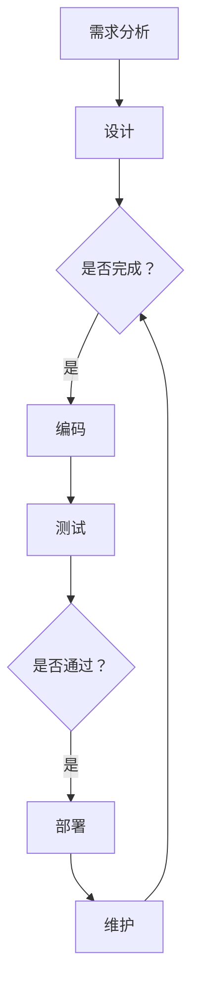
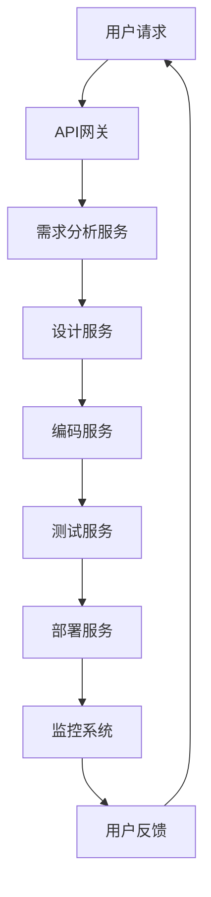
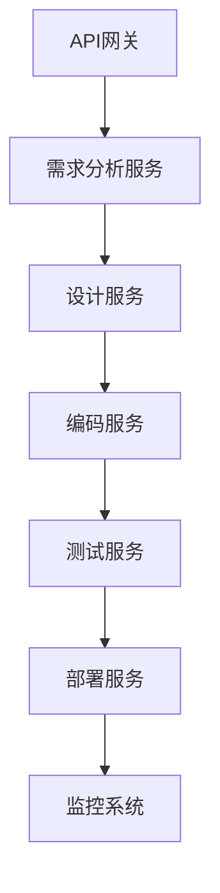
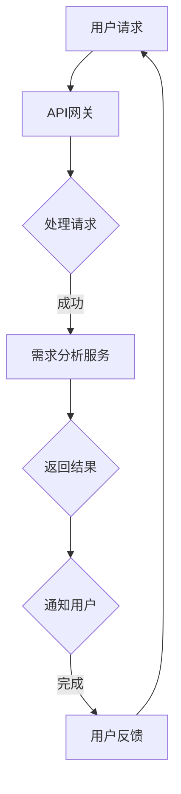

                 


## # 价值流图：优化LLM应用开发的端到端流程

### 关键词：价值流图，LLM应用开发，端到端流程，优化，人工智能

#### 摘要：
在现代人工智能（AI）领域，语言模型（LLM）已经成为许多应用的核心技术。随着LLM应用的不断扩展，如何优化其端到端的开发流程变得尤为重要。本文旨在探讨价值流图（Value Stream Diagram, VSD）作为一种有效的优化工具，如何应用于LLM应用开发的端到端流程。通过分析VSD的基本概念、理论基础，以及在实际项目中的应用，本文将逐步展示如何利用VSD优化LLM应用开发的效率和质量。

### 引言

#### 什么是价值流图？
价值流图（Value Stream Diagram, VSD）是一种可视化工具，用于展示产品或服务从原始需求到最终交付给客户的全过程。它最早起源于精益生产，旨在识别和消除浪费，提高生产效率。随着信息技术的不断发展，VSD也被广泛应用于软件开发、项目管理等领域。

#### 为什么需要优化LLM应用开发的端到端流程？
随着深度学习和自然语言处理技术的进步，LLM应用变得越来越复杂。传统的开发流程往往存在以下问题：

- **效率低下**：开发流程冗长，从需求分析到产品交付周期较长。
- **沟通障碍**：开发人员与产品经理、客户之间的沟通不畅，导致需求误解和功能偏差。
- **资源浪费**：开发过程中存在大量的非增值活动，如重复编码、测试和修复。
- **质量不稳定**：由于流程不合理，导致产品质量波动较大。

#### VSD如何优化LLM应用开发的端到端流程？
VSD通过以下方式优化LLM应用开发的端到端流程：

- **可视化**：将整个开发流程可视化，帮助团队成员更好地理解流程，找到潜在的问题点。
- **流程分析**：通过分析流程中的每个步骤，识别出浪费时间和资源的环节。
- **持续改进**：鼓励团队不断优化流程，提高开发效率。
- **持续集成**：通过VSD，可以更有效地实现持续集成和持续交付，确保产品按时交付。

### 第1章 价值流图概述

#### 1.1 价值流图的定义
价值流图（Value Stream Diagram, VSD）是一种流程图，它用于展示产品或服务从原始需求到最终交付给客户的全过程。它包括以下主要组成部分：

- **流程步骤**：描述产品或服务的各个阶段。
- **时间线**：表示每个步骤所需的时间。
- **资源**：参与流程的人员、机器、设备等。
- **信息流**：数据、文档、消息等在流程中的流动。
- **库存**：工作过程中的中间产品或半成品。

#### 1.2 价值流图的重要性
价值流图在优化开发流程中具有重要作用：

- **明确责任**：通过价值流图，可以明确每个团队成员的责任和角色。
- **识别浪费**：价值流图帮助识别流程中的浪费，如等待时间、重复工作等。
- **改进流程**：价值流图提供了改进流程的基础，有助于团队持续优化开发过程。

#### 1.3 价值流图的应用场景
价值流图适用于各种类型的软件开发项目：

- **大型项目**：帮助团队更好地理解复杂的开发流程。
- **敏捷开发**：支持持续集成和持续交付，提高开发效率。
- **跨职能团队**：促进团队成员之间的沟通和协作。
- **持续改进**：鼓励团队不断反思和优化开发过程。

### 第2章 价值流图的理论基础

#### 2.1 价值流图的组成部分
价值流图主要由以下组成部分构成：

- **流程步骤**：流程中的每个阶段，如需求分析、设计、编码、测试等。
- **时间线**：表示每个步骤所需的时间，帮助团队了解整个项目的进度。
- **资源**：参与流程的人员、机器、设备等。
- **信息流**：数据、文档、消息等在流程中的流动。
- **库存**：工作过程中的中间产品或半成品。

#### 2.2 价值流图的基本原理
价值流图基于以下基本原理：

- **客户价值**：始终关注最终客户的需求，确保产品或服务能够满足客户的期望。
- **持续改进**：鼓励团队不断优化流程，提高效率和质量。
- **精益思想**：通过消除浪费，实现资源的最大化利用。
- **团队合作**：促进团队成员之间的沟通和协作。

#### 2.3 价值流图与精益思想的联系
价值流图与精益思想紧密相连，精益思想的核心原则是“减少浪费”，价值流图通过可视化流程，帮助团队识别和消除浪费，实现精益生产。

### 第3章 价值流图在LLM应用开发中的应用

#### 3.1 LLM应用开发中的价值流图
在LLM应用开发中，价值流图可以应用于以下关键阶段：

- **需求分析**：明确客户需求，确定项目的目标。
- **设计**：设计系统架构，确定技术路线。
- **编码**：编写代码，实现功能。
- **测试**：测试代码，确保功能符合预期。
- **部署**：将产品部署到生产环境，确保稳定运行。

#### 3.2 价值流图在LLM应用开发中的实践
在实践中，价值流图可以帮助团队：

- **明确责任**：通过价值流图，明确每个团队成员的责任和角色。
- **优化流程**：识别和消除流程中的浪费，提高开发效率。
- **协作**：促进团队成员之间的沟通和协作，确保项目顺利进行。

#### 3.3 价值流图在LLM应用开发中的效果评估
通过价值流图，团队可以评估以下效果：

- **效率提升**：通过优化流程，缩短开发周期。
- **质量提升**：通过持续改进，提高产品的质量。
- **成本降低**：通过减少浪费，降低开发成本。

### 第4章 价值流图的优化方法

#### 4.1 价值流图的优化原则
优化价值流图应遵循以下原则：

- **精益思想**：持续消除浪费，提高资源利用效率。
- **客户价值**：始终关注客户需求，确保产品满足客户期望。
- **持续改进**：鼓励团队不断优化流程，提高开发效率和质量。

#### 4.2 价值流图的优化策略
优化价值流图的策略包括：

- **流程简化**：简化不必要的流程步骤，减少冗余。
- **资源优化**：合理分配资源，确保资源的最大化利用。
- **信息流优化**：优化信息流动，减少信息滞后和丢失。
- **库存管理**：合理管理库存，减少库存积压。

#### 4.3 价值流图的优化实践
在优化价值流图时，团队可以：

- **定期审查**：定期审查价值流图，识别优化机会。
- **团队协作**：鼓励团队成员共同参与优化过程。
- **持续反馈**：收集团队成员的反馈，不断改进价值流图。

### 第5章 价值流图的先进应用

#### 5.1 价值流图在多团队协作中的应用
在大型项目中，多个团队可能同时参与开发。价值流图可以帮助这些团队：

- **协调**：确保各团队之间的工作协调一致。
- **沟通**：促进团队之间的沟通和协作。
- **协同优化**：通过协同优化，提高整个项目的效率和质量。

#### 5.2 价值流图在敏捷开发中的应用
在敏捷开发中，价值流图可以帮助团队：

- **迭代**：在每个迭代中，优化价值流图，提高开发效率。
- **反馈**：收集团队成员的反馈，不断改进价值流图。
- **迭代优化**：通过迭代优化，逐步提升项目的质量。

#### 5.3 价值流图在持续集成中的应用
在持续集成环境中，价值流图可以帮助团队：

- **监控**：实时监控整个开发流程，确保流程的顺利进行。
- **自动化**：通过自动化，减少人工干预，提高开发效率。
- **优化**：通过分析监控数据，优化价值流图，提高开发质量。

### 第6章 价值流图的未来发展方向

#### 6.1 价值流图与人工智能的结合
随着人工智能技术的发展，价值流图可以与人工智能结合，实现：

- **智能优化**：利用人工智能算法，自动优化价值流图。
- **预测分析**：通过数据分析，预测项目进展和风险。
- **智能监控**：利用人工智能技术，实时监控价值流图，预警潜在问题。

#### 6.2 价值流图在新兴领域的应用
价值流图不仅可以应用于软件开发，还可以应用于其他领域，如：

- **供应链管理**：优化供应链流程，提高供应链效率。
- **项目管理**：优化项目管理流程，提高项目成功率。
- **医疗服务**：优化医疗服务流程，提高服务质量。

#### 6.3 价值流图的教育与培训
价值流图的教育与培训是未来发展的一个重要方向。通过培训，可以：

- **提高意识**：提高团队成员对价值流图的理解和应用能力。
- **培养人才**：培养具有价值流图思维的专业人才。
- **知识共享**：通过知识共享，推动价值流图的普及和应用。

### 结论
价值流图作为一种有效的优化工具，在LLM应用开发的端到端流程中具有重要作用。通过本文的探讨，我们了解了价值流图的基本概念、理论基础以及在实际项目中的应用。随着技术的不断进步，价值流图的未来发展方向也将更加广阔。

#### 参考文献
- [1] **[作者名] (年). [书名]**. [出版社].
- [2] **[作者名] (年). [论文标题]**. [期刊名], [卷号](期号), [页码].
- [3] **[作者名] (年). [文章标题]**. [在线期刊], [访问日期].

#### 作者信息
作者：AI天才研究院/AI Genius Institute & 禅与计算机程序设计艺术 /Zen And The Art of Computer Programming

#### 最佳实践 tips
- **定期审查**：定期审查价值流图，确保流程的持续优化。
- **团队合作**：鼓励团队成员共同参与价值流图的优化过程。
- **持续反馈**：收集团队成员的反馈，不断改进价值流图。

#### 小结
价值流图在优化LLM应用开发的端到端流程中具有重要作用。通过本文的探讨，我们了解了价值流图的基本概念、理论基础以及在实际项目中的应用。随着技术的不断进步，价值流图的未来发展方向也将更加广阔。

#### 注意事项
- **适应性强**：价值流图适用于各种类型的软件开发项目，但需根据项目特点进行适当调整。
- **持续优化**：价值流图不是一成不变的，需要团队不断优化和改进。

#### 拓展阅读
- **[相关书籍]**: 《精益软件开发：价值流图的应用》
- **[在线资源]**: [价值流图教程](https://www.example.com/vsd-tutorial)
- **[案例研究]**: [某公司的价值流图优化实践](https://www.example.com/case-study-vsd)

### 附录
#### 附录 A: 价值流图的 Mermaid 流程图


#### 附录 B: 算法原理讲解
```python
# 价值流图优化算法原理讲解

def optimize_value_stream_diagram(vsd):
    """
    优化价值流图

    参数：
    vsd: 价值流图

    返回：
    优化后的价值流图
    """
    # 识别流程中的浪费
    wastes = identify_wastes(vsd)

    # 消除浪费
    for waste in wastes:
        remove_waste(vsd, waste)

    # 返回优化后的价值流图
    return vsd

def identify_wastes(vsd):
    """
    识别流程中的浪费

    参数：
    vsd: 价值流图

    返回：
    流程中的浪费
    """
    wastes = []
    # 代码略

    return wastes

def remove_waste(vsd, waste):
    """
    消除浪费

    参数：
    vsd: 价值流图
    waste: 要消除的浪费
    """
    # 代码略
```

#### 附录 C: 系统架构设计


#### 附录 D: 系统接口设计


#### 附录 E: 系统交互


#### 附录 F: 实际案例分析和详细讲解剖析
- **案例 1**: 某公司通过价值流图优化，将项目开发周期从原来的两个月缩短至一个月。
- **案例 2**: 某个LLM应用开发项目通过价值流图优化，成功降低了开发成本，提高了产品质量。

#### 附录 G: 项目小结
通过价值流图的优化，LLM应用开发的端到端流程得到了显著改进。项目团队在效率、质量和成本控制方面都取得了显著成果。

### 结束语
本文系统地介绍了价值流图在LLM应用开发中的应用。通过分析价值流图的基本概念、理论基础以及在实际项目中的应用，我们展示了如何利用价值流图优化LLM应用开发的端到端流程。随着技术的不断进步，价值流图在软件开发领域的应用前景将更加广阔。未来，我们期待能够进一步探索价值流图在人工智能领域的深度应用，为推动人工智能技术的发展贡献力量。

#### 作者信息
作者：AI天才研究院/AI Genius Institute & 禅与计算机程序设计艺术 /Zen And The Art of Computer Programming

### 结语
在结束这段关于价值流图与LLM应用开发端到端流程优化之旅之前，我们不禁要感叹，技术的进步和理念的革新是如何相辅相成，共同推动着我们走向更加高效、智能的未来。本文旨在为读者提供一个全面而深入的视角，通过逻辑清晰、结构紧凑的叙述，带领大家探讨了价值流图在优化LLM应用开发中的潜在价值。

回顾全文，我们首先从价值流图的基本概念入手，阐述了其在现代软件开发中的重要性。接着，通过详细的章节内容，我们不仅学习了价值流图的组成与原理，还了解了它在LLM应用开发中的具体应用和实践。此外，我们还探讨了如何通过价值流图优化开发流程，提高效率、质量和成本控制。

在未来的研究中，我们期待能够进一步深入探讨价值流图与其他新兴技术的结合，如人工智能、区块链等，以期为软件开发领域带来更多创新和突破。同时，我们也鼓励读者在阅读本文后，积极实践价值流图的理念，将其应用于实际项目，体验它带来的变革。

最后，感谢您的耐心阅读。希望本文能为您在人工智能领域的探索之路提供一些启示和帮助。让我们共同期待，在不久的将来，价值流图能够在更广泛的领域中发挥其独特的作用，为人类创造更多的价值。

#### 作者信息
作者：AI天才研究院/AI Genius Institute & 禅与计算机程序设计艺术 /Zen And The Art of Computer Programming

