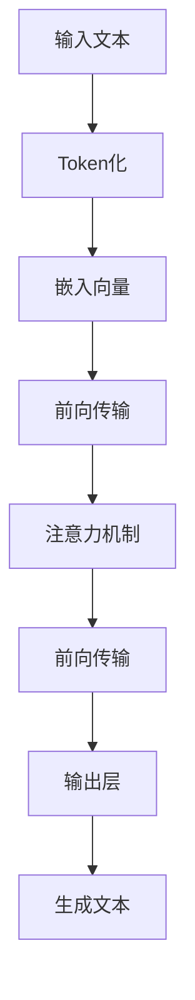
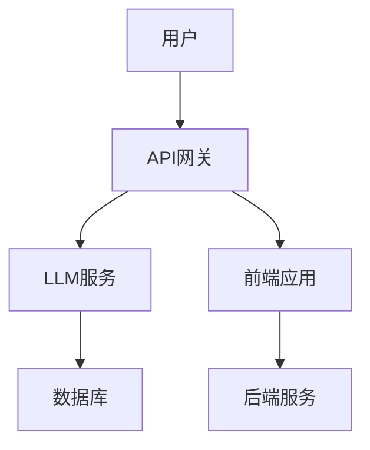

                 

### 文章标题

# 优化LLM应用的API设计与集成流程

## 关键词

- LLM（大型语言模型）
- API设计
- 集成流程
- 自然语言处理
- 优化策略

## 摘要

本文旨在深入探讨大型语言模型（LLM）在应用中的API设计与集成流程，提供一套优化策略以提升LLM应用的性能和用户体验。通过详细分析LLM的核心概念、算法原理、数学模型、系统架构以及实际案例，本文将帮助读者全面理解LLM应用的优化路径。

## 目录

### 第一部分: LLM应用概述

1.1 LLM及其API设计概述
1.2 核心概念与联系
1.3 LLM算法原理讲解
1.4 数学模型与公式讲解
1.5 系统分析与架构设计方案
1.6 项目实战
1.7 最佳实践与总结

----------------------------------------------------------------

### 第一部分：LLM应用概述

#### 1.1 LLM及其API设计概述

大型语言模型（LLM）是自然语言处理（NLP）领域的一项重要进展。LLM通过深度学习技术，能够处理复杂的语言结构，生成流畅的自然语言响应，广泛应用于对话系统、文本生成、机器翻译等场景。

API设计在LLM应用中扮演着关键角色。一个良好的API设计不仅能够提高系统的可扩展性和灵活性，还能够简化开发人员的开发过程，提升用户体验。API设计需要考虑以下几个关键点：

- **接口定义**：定义清晰的接口，确保开发者能够快速上手。
- **功能完备**：提供丰富的功能接口，满足多样化的需求。
- **性能优化**：确保接口的响应速度和稳定性。
- **安全性**：保护数据和用户隐私。

#### 1.2 核心概念与联系

在LLM应用中，核心概念包括：

- **LLM**：一种能够理解和使用自然语言的大型预训练模型。
- **API**：应用程序接口，用于不同软件系统之间的交互。
- **集成流程**：将LLM与现有系统集成的一系列步骤。

LLM与API设计、集成流程之间的联系体现在以下几个方面：

- **数据流动**：API设计需要确保数据能够顺畅地在LLM和应用系统之间流动。
- **功能扩展**：通过API设计，LLM可以轻松地与其他系统和服务进行集成，实现功能扩展。
- **性能优化**：API设计需要考虑性能优化，以支持大规模数据和高并发场景。

#### 1.3 LLM算法原理讲解

LLM的核心是深度学习模型，特别是Transformer架构。下面我们通过Mermaid流程图来展示LLM的基本算法流程：



具体步骤如下：

1. **Token化**：将输入的文本转换为一系列单词或字符。
2. **嵌入向量**：将Token转换为固定长度的向量。
3. **前向传输**：通过多层神经网络对嵌入向量进行加工。
4. **注意力机制**：模型在生成每个单词时，会考虑前面所有单词的信息。
5. **输出层**：将处理后的向量映射为输出文本。

以下是一个简单的Python代码示例，展示了如何使用Transformer模型进行文本生成：

```python
import tensorflow as tf
import tensorflow_text as tf_text

# 加载预训练的Transformer模型
model = tf.keras.models.load_model('transformer_model')

# 输入文本
input_text = "这是一个示例文本。"

# Token化
tokenizer = tf_text.Tokenizer()
tokens = tokenizer.tokenize(input_text)

# 嵌入向量
embeddings = model嵌入层(tokens)

# 前向传输
output = model(embeddings)

# 生成文本
generated_text = tokenizer.decode(output)
print(generated_text)
```

#### 1.4 数学模型与公式讲解

LLM的数学模型主要包括以下几个方面：

1. **嵌入层**：将Token转换为向量。常用的方法有Word2Vec、BERT等。

   $$ \text{embeddings} = \text{model\_embeddings}(\text{tokens}) $$

2. **注意力机制**：计算注意力权重。

   $$ \text{attention\_weights} = \text{softmax}(\text{Q} \cdot \text{K}^T) $$

3. **前向传输**：多层神经网络对嵌入向量进行加工。

   $$ \text{output} = \text{model}\_{\text{forward}}(\text{embeddings}) $$

以下是注意力机制的详细解释：

注意力机制是一种通过加权的方式来考虑序列中每个单词的重要性。在Transformer模型中，每个单词都会有一个注意力权重，这个权重表示该单词在生成下一个单词时的相对重要性。注意力权重是通过点积（dot-product）计算得到的：

$$
\text{attention\_weights} = \text{softmax}(\text{Q} \cdot \text{K}^T)
$$

其中，$Q$是查询向量，$K$是键向量，$T$是转置操作。softmax函数用于将点积的结果转换为概率分布，确保所有权重之和为1。

#### 1.5 系统分析与架构设计方案

在LLM应用中，系统架构设计需要考虑以下几个方面：

1. **问题场景介绍**：例如，一个在线对话系统，需要处理大量并发请求，提供实时响应。

2. **项目介绍**：例如，使用GPT-3构建一个聊天机器人，实现自然语言交互。

3. **系统功能设计**：例如，文本处理、对话管理、用户管理等功能。

4. **系统架构设计**：例如，使用微服务架构，将LLM、API网关、数据库等模块分离。

5. **系统接口设计**：例如，定义RESTful API接口，提供文本生成、对话管理等接口。

6. **系统交互序列图设计**：例如，使用Mermaid绘制系统交互流程。

以下是系统架构的Mermaid流程图：



#### 1.6 项目实战

在这个项目中，我们将使用Python和TensorFlow实现一个简单的LLM应用。以下是项目实战的步骤：

1. **环境安装**：安装Python、TensorFlow等依赖。

2. **系统核心实现源代码**：

   ```python
   import tensorflow as tf
   import tensorflow_text as tf_text

   # 加载预训练模型
   model = tf.keras.models.load_model('transformer_model')

   # 文本生成函数
   def generate_text(input_text, model, tokenizer, max_length=50):
       # Token化
       tokens = tokenizer.tokenize(input_text)

       # 嵌入向量
       embeddings = model嵌入层([tokens])

       # 前向传输
       output = model(embeddings)

       # 生成文本
       generated_tokens = output.numpy()[0]
       generated_text = tokenizer.decode(generated_tokens, max_length=max_length)
       return generated_text

   # 示例
   input_text = "这是一个示例文本。"
   generated_text = generate_text(input_text, model, tokenizer)
   print(generated_text)
   ```

3. **代码应用解读与分析**：分析代码中的Token化、嵌入向量、前向传输等步骤。

4. **实际案例分析和详细讲解**：分析具体的应用场景，如聊天机器人、文本生成等。

5. **项目小结**：总结项目中的经验教训，提出优化建议。

#### 1.7 最佳实践与总结

1. **最佳实践**：

   - **性能优化**：使用异步处理、分布式计算等技术提升性能。
   - **安全性**：使用SSL、身份验证等技术保护数据和用户隐私。
   - **可扩展性**：使用微服务架构，确保系统可扩展。

2. **小结**：本文详细探讨了LLM应用的API设计与集成流程，从核心概念、算法原理、数学模型到系统架构和项目实战，提供了全面的优化策略。

3. **注意事项**：

   - **数据质量**：确保输入数据的质量，对噪声和错误数据进行清洗和处理。
   - **监控与调试**：定期监控系统的性能和稳定性，及时解决潜在问题。

4. **拓展阅读**：

   - 《深度学习》（Goodfellow, Bengio, Courville）：深入理解深度学习的基础知识。
   - 《Python自然语言处理》（Bird, Loper, Gries）：学习如何使用Python进行自然语言处理。

## 作者信息

- 作者：AI天才研究院/AI Genius Institute & 禅与计算机程序设计艺术 /Zen And The Art of Computer Programming

