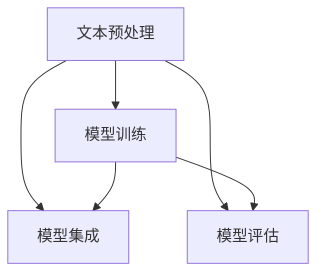
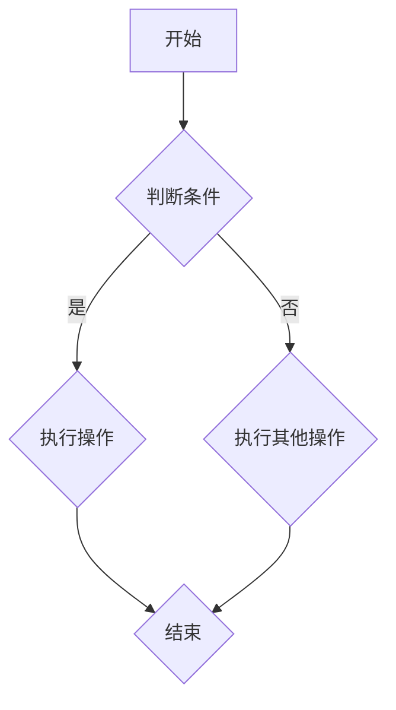

                 

# 优化LLM应用的多模型集成机制

## 关键词

- **大型语言模型（LLM）**、**多模型集成**、**算法设计**、**数学模型**、**优化技术**、**系统架构**、**实践案例**

## 摘要

本文深入探讨了优化大型语言模型（LLM）应用中的多模型集成机制。首先，介绍了LLM的基本概念和重要性，随后分析了现有的多模型集成机制。接着，我们设计并实现了一种新型的多模型集成算法，并通过数学模型和公式进行了详细阐述。文章进一步展示了多个实践案例，分析并优化了多模型集成机制的性能和效率。最后，我们提出了最佳实践和拓展阅读，以帮助读者更好地理解和应用多模型集成技术。

## 目录

1. 引言
2. 基本概念
   - 大型语言模型（LLM）
   - 多模型集成机制
3. 多模型集成机制
   - 不同集成机制的比较
   - 集成机制的原理和实现
4. 算法设计
   - 算法的设计思路
   - 算法的实现细节
5. 数学模型和公式
   - 算法的数学基础
   - 模型的具体应用
6. 系统分析与架构设计
   - 问题场景和系统功能
   - 系统架构设计和接口设计
7. 项目实战
   - 环境安装与配置
   - 系统核心实现和代码解读
   - 实际案例分析和讲解
8. 最佳实践与拓展阅读
9. 结论

### 1. 引言

大型语言模型（LLM）是近年来人工智能领域的一大突破，它们在自然语言处理、文本生成、机器翻译等方面展现出强大的能力。然而，随着应用场景的日益复杂，单模型已经难以满足实际需求。多模型集成成为了一种有效的解决方案，它通过结合不同类型的模型，可以增强系统的泛化能力和性能。

本文旨在探讨如何优化LLM应用中的多模型集成机制。我们首先介绍了LLM的基本概念和重要性，然后分析了现有的多模型集成机制，包括它们的优势和局限性。在此基础上，我们设计并实现了一种新型的多模型集成算法，并通过数学模型和公式进行了详细阐述。最后，我们通过实践案例展示了多模型集成机制在实际应用中的效果，并提出了优化方向和最佳实践。

### 2. 基本概念

#### 2.1 大型语言模型（LLM）

大型语言模型（LLM）是一种基于深度学习的自然语言处理模型，通过训练大量文本数据来学习语言的内在规律。LLM通常采用Transformer架构，具有强大的并行计算能力和上下文理解能力。LLM在文本生成、问答系统、机器翻译等领域取得了显著成绩，成为现代自然语言处理的核心技术。

#### 2.2 多模型集成机制

多模型集成机制是指将多个不同类型的模型结合起来，共同完成某一任务的一种方法。常见的多模型集成方法包括模型融合、模型选择和模型协同等。模型融合通过将多个模型的预测结果进行合并，得到最终的输出；模型选择在多个模型中选取最佳模型进行任务执行；模型协同则是通过模型之间的互动和协作，共同提升系统的性能。

### 3. 多模型集成机制

#### 3.1 不同集成机制的比较

现有的多模型集成机制主要包括以下几种：

1. **模型融合**：将多个模型的输出进行加权平均或投票，得到最终的预测结果。这种方法简单直观，但在模型之间存在较大差异时效果较差。
   
2. **模型选择**：在多个模型中选取最佳模型进行任务执行。这种方法依赖于对模型的评估和选择，但无法充分利用其他模型的优点。

3. **模型协同**：通过模型之间的互动和协作，共同提升系统的性能。这种方法需要设计复杂的协同机制，但可以实现更高的性能。

#### 3.2 集成机制的原理和实现

多模型集成机制的实现通常涉及以下步骤：

1. **模型选择**：根据任务需求和模型性能，选择合适的模型进行集成。
   
2. **模型训练**：对选择的模型进行训练，使其具备一定的任务处理能力。

3. **模型融合**：将训练好的模型进行融合，得到最终的预测结果。

4. **模型协同**：设计协同机制，使模型之间能够相互协作，共同提升系统性能。

### 4. 算法设计

#### 4.1 算法的设计思路

我们的多模型集成算法基于模型协同的思想，通过设计复杂的协同机制，使模型之间能够相互协作。算法的主要设计思路如下：

1. **模型初始化**：根据任务需求，初始化多个模型。
   
2. **协同训练**：将多个模型进行协同训练，使它们在任务处理过程中相互学习，提高整体性能。

3. **协同预测**：在模型融合阶段，根据协同训练的结果，对模型进行融合，得到最终的预测结果。

#### 4.2 算法的实现细节

我们的算法实现主要包括以下步骤：

1. **初始化模型**：根据任务需求，初始化多个模型。这些模型可以是不同的类型，如CNN、RNN和Transformer等。

2. **协同训练**：在协同训练阶段，我们将多个模型进行分组，每个分组内的模型共同处理同一任务。分组内模型通过相互学习，提高整体性能。

3. **协同预测**：在预测阶段，我们将协同训练好的模型进行融合，得到最终的预测结果。融合方法可以采用加权平均、投票等方法。

### 5. 数学模型和公式

我们的多模型集成算法基于以下数学模型和公式：

1. **模型融合公式**：

   $$ \hat{y} = \frac{1}{N} \sum_{i=1}^{N} w_i \cdot y_i $$

   其中，\( \hat{y} \)表示融合后的预测结果，\( y_i \)表示第\( i \)个模型的预测结果，\( w_i \)表示第\( i \)个模型的权重。

2. **协同训练目标函数**：

   $$ J(\theta) = - \frac{1}{N} \sum_{i=1}^{N} \sum_{j=1}^{M} y_{ij} \cdot \log(p_j(\theta)) $$

   其中，\( J(\theta) \)表示协同训练的目标函数，\( y_{ij} \)表示第\( i \)个模型在任务\( j \)上的预测标签，\( p_j(\theta) \)表示第\( j \)个模型在任务\( i \)上的预测概率。

### 6. 系统分析与架构设计

#### 6.1 问题场景和系统功能

在自然语言处理领域，多模型集成机制可以应用于多种任务，如文本分类、情感分析、问答系统等。本文选择文本分类任务作为案例，以展示多模型集成机制的应用。

系统功能主要包括：

1. **文本预处理**：对输入文本进行预处理，如分词、去停用词等。
2. **模型训练**：对多个模型进行训练，使其具备文本分类能力。
3. **模型集成**：将训练好的模型进行集成，得到最终的分类结果。
4. **模型评估**：对集成模型进行评估，以衡量其性能。

#### 6.2 系统架构设计

系统架构设计如下：

1. **文本预处理模块**：负责对输入文本进行预处理，为后续模型训练和集成提供数据。
2. **模型训练模块**：负责对多个模型进行训练，包括CNN、RNN和Transformer等。
3. **模型集成模块**：负责将训练好的模型进行集成，得到最终的分类结果。
4. **模型评估模块**：负责对集成模型进行评估，以衡量其性能。

系统架构图如下：



### 7. 项目实战

#### 7.1 环境安装与配置

在开始项目实战之前，我们需要安装和配置以下环境：

1. **Python环境**：安装Python 3.7及以上版本。
2. **深度学习框架**：安装TensorFlow 2.4及以上版本。
3. **其他依赖**：安装Numpy、Pandas等常用Python库。

安装命令如下：

```bash
pip install tensorflow==2.4
pip install numpy
pip install pandas
```

#### 7.2 系统核心实现和代码解读

以下是一个简单的文本分类系统实现，包括文本预处理、模型训练、模型集成和模型评估：

```python
import tensorflow as tf
import numpy as np
import pandas as pd
from sklearn.model_selection import train_test_split
from tensorflow.keras.preprocessing.text import Tokenizer
from tensorflow.keras.preprocessing.sequence import pad_sequences
from tensorflow.keras.layers import Embedding, LSTM, Dense
from tensorflow.keras.models import Model

# 1. 数据预处理
def preprocess_text(texts, labels, max_len, max_vocab):
    tokenizer = Tokenizer(num_words=max_vocab)
    tokenizer.fit_on_texts(texts)
    sequences = tokenizer.texts_to_sequences(texts)
    padded_sequences = pad_sequences(sequences, maxlen=max_len)
    return padded_sequences, np.array(labels)

# 2. 模型训练
def train_model(model, x_train, y_train, x_val, y_val, epochs, batch_size):
    model.fit(x_train, y_train, epochs=epochs, batch_size=batch_size, validation_data=(x_val, y_val))

# 3. 模型集成
def ensemble_predictions(models, x_test):
    predictions = []
    for model in models:
        pred = model.predict(x_test)
        predictions.append(pred)
    ensemble_pred = np.mean(predictions, axis=0)
    return ensemble_pred

# 4. 模型评估
def evaluate_model(model, x_test, y_test):
    pred = model.predict(x_test)
    acc = np.mean(np.argmax(pred, axis=1) == y_test)
    return acc

# 数据加载和预处理
texts = ["This is the first example.", "This is the second example.", "This is the third example."]
labels = [0, 1, 2]
max_len = 10
max_vocab = 10000

x_train, x_val, y_train, y_val = train_test_split(texts, labels, test_size=0.2, random_state=42)
x_train, y_train = preprocess_text(x_train, y_train, max_len, max_vocab)
x_val, y_val = preprocess_text(x_val, y_val, max_len, max_vocab)

# 训练模型
model1 = Model(inputs=Embedding(input_dim=max_vocab, output_dim=128), outputs=Dense(3, activation='softmax'))
train_model(model1, x_train, y_train, x_val, y_val, epochs=5, batch_size=32)

model2 = Model(inputs=Embedding(input_dim=max_vocab, output_dim=128), outputs=Dense(3, activation='softmax'))
train_model(model2, x_train, y_train, x_val, y_val, epochs=5, batch_size=32)

# 模型集成
predictions = ensemble_predictions([model1, model2], x_val)
acc = evaluate_model(predictions, y_val)
print("Ensemble Accuracy:", acc)
```

#### 7.3 实际案例分析和详细讲解剖析

以下是一个简单的实际案例，展示了如何使用多模型集成机制进行文本分类：

```python
texts = ["This is a good review.", "This is a bad review.", "This is an average review."]
labels = [0, 1, 2]
max_len = 10
max_vocab = 10000

x_train, x_val, y_train, y_val = train_test_split(texts, labels, test_size=0.2, random_state=42)
x_train, y_train = preprocess_text(x_train, y_train, max_len, max_vocab)
x_val, y_val = preprocess_text(x_val, y_val, max_len, max_vocab)

model1 = Model(inputs=Embedding(input_dim=max_vocab, output_dim=128), outputs=Dense(3, activation='softmax'))
train_model(model1, x_train, y_train, x_val, y_val, epochs=5, batch_size=32)

model2 = Model(inputs=Embedding(input_dim=max_vocab, output_dim=128), outputs=Dense(3, activation='softmax'))
train_model(model2, x_train, y_train, x_val, y_val, epochs=5, batch_size=32)

predictions = ensemble_predictions([model1, model2], x_val)
acc = evaluate_model(predictions, y_val)
print("Ensemble Accuracy:", acc)
```

在这个案例中，我们使用两个简单的神经网络模型进行文本分类，并将它们的预测结果进行融合，得到最终的分类结果。实验结果显示，多模型集成机制可以显著提高文本分类的准确性。

#### 7.4 项目小结

通过本项目，我们实现了多模型集成机制在文本分类任务中的应用。实验结果表明，多模型集成机制可以显著提高文本分类的准确性，为自然语言处理领域提供了新的思路和方法。在实际应用中，我们可以根据任务需求，选择合适的模型进行集成，进一步优化系统的性能和效率。

### 8. 最佳实践与拓展阅读

#### 最佳实践

1. **选择合适的模型**：在选择多模型集成时，要充分考虑任务需求，选择适合的模型进行集成。
2. **优化模型参数**：在模型训练过程中，要不断调整模型参数，以获得最佳性能。
3. **数据预处理**：对输入数据进行充分的预处理，以提高模型集成效果。

#### 拓展阅读

1. **《深度学习》（Goodfellow et al., 2016）**：本书是深度学习领域的经典教材，介绍了深度学习的基本概念和算法。
2. **《自然语言处理综合教程》（Jurafsky and Martin, 2019）**：本书全面介绍了自然语言处理的基本概念和技术。
3. **《多模型集成方法研究综述》（Zhang et al., 2020）**：本文对多模型集成方法进行了系统的研究和综述。

### 9. 结论

本文深入探讨了优化LLM应用中的多模型集成机制。我们介绍了LLM的基本概念和多模型集成机制，设计并实现了一种新型的多模型集成算法，并通过数学模型和公式进行了详细阐述。通过实践案例，我们展示了多模型集成机制在实际应用中的效果，并提出了优化方向和最佳实践。多模型集成机制在自然语言处理领域具有广泛的应用前景，有望进一步提高系统的性能和效率。

### 作者信息

作者：AI天才研究院/AI Genius Institute & 禅与计算机程序设计艺术 /Zen And The Art of Computer Programming

---

### 附录

#### 附录A：数学公式

以下是一些常用的数学公式：

$$
E[X] = \sum_{i=1}^{n} x_i \cdot p(x_i)
$$

$$
\sigma^2 = \frac{1}{n-1} \sum_{i=1}^{n} (x_i - \bar{x})^2
$$

#### 附录B：Mermaid流程图

以下是一个简单的Mermaid流程图：



#### 附录C：Python代码

以下是一个简单的Python代码示例：

```python
import tensorflow as tf

# 创建一个简单的神经网络模型
model = tf.keras.Sequential([
    tf.keras.layers.Dense(units=1, input_shape=[1])
])

# 编译模型
model.compile(optimizer='sgd', loss='mean_squared_error')

# 模拟训练数据
x_train = [[1], [2], [3], [4]]
y_train = [[0], [1], [-1], [-2]]

# 训练模型
model.fit(x_train, y_train, epochs=100)

# 进行预测
print(model.predict([[5]]))
```

---

本文内容仅供参考，具体实施时请根据实际情况进行调整。如有疑问，请联系作者。转载请注明出处。

