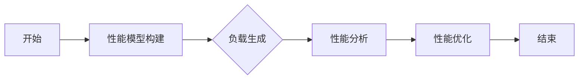

                 

## 优化LLM应用的性能测试流程

### 关键词：性能测试、LLM、优化、流程

#### 摘要：
本文将深入探讨如何优化大型语言模型（LLM）应用的性能测试流程。通过逐步分析和推理，我们将介绍性能测试的基本概念、LLM性能测试的特殊性、性能测试的关键指标以及优化策略。文章结构清晰，旨在为读者提供一个全面、易懂的性能测试指南，帮助他们提高LLM应用的性能。

### 前言

在现代信息技术快速发展的背景下，人工智能（AI）已经成为推动技术进步的重要力量。尤其是大型语言模型（LLM）的应用，如自然语言处理（NLP）、自动问答系统、机器翻译等，已经深入到各个行业，成为提升工作效率、改善用户体验的关键技术。然而，LLM的应用效果与其性能紧密相关，而性能测试则是确保LLM应用高效稳定运行的重要手段。

性能测试不仅仅是对软件性能的简单衡量，它涉及到测试环境的搭建、测试工具的选择、测试策略的制定等多个方面。对于LLM应用而言，由于其复杂性和高并发特性，性能测试具有特殊的要求。本文将详细探讨如何优化LLM应用的性能测试流程，以帮助开发者和工程师更好地理解和解决性能瓶颈，提升应用性能。

### 第1章：背景介绍与核心概念

#### 1.1 性能测试的定义

性能测试是指通过模拟实际用户操作，评估软件系统在不同负载下的响应速度、稳定性、资源消耗等性能指标的过程。它旨在发现系统性能瓶颈，评估系统在各种工作负载下的表现，确保系统在预期范围内满足性能要求。

性能测试通常包括以下方面：

- **响应时间**：系统对用户请求的响应时间。
- **吞吐量**：单位时间内系统能处理的请求数量。
- **并发用户数**：同时访问系统的用户数量。
- **资源消耗**：系统运行过程中消耗的CPU、内存、网络等资源。

#### 1.2 LLM性能测试的特殊性

与传统的性能测试相比，LLM性能测试具有以下特殊性：

- **高并发性**：LLM应用通常需要处理大量的并发请求，这对系统的并发处理能力提出了更高的要求。
- **复杂性**：LLM的运行涉及到大量的计算和存储资源，其性能评估更加复杂。
- **动态性**：LLM的应用场景和请求内容是动态变化的，这使得性能测试需要具备更高的灵活性和适应性。

#### 1.3 性能测试的关键指标

LLM性能测试的关键指标包括：

- **响应时间**：LLM处理请求的平均响应时间，直接影响用户体验。
- **吞吐量**：LLM在单位时间内处理的请求数量，反映系统的处理能力。
- **并发用户数**：系统同时处理的最大用户数量，评估系统的并发处理能力。
- **资源消耗**：系统在运行过程中的资源消耗情况，包括CPU、内存、磁盘等。

#### 1.4 性能测试的目标与意义

性能测试的目标是确保LLM应用在不同负载下能够稳定、高效地运行，具体包括：

- **发现性能瓶颈**：通过性能测试，可以发现系统性能瓶颈，定位问题所在。
- **优化系统性能**：针对发现的问题，进行系统优化，提高系统性能。
- **保障用户体验**：确保系统在预期负载下能够提供良好的用户体验。
- **支持决策**：为系统设计和优化提供数据支持，辅助决策。

#### 1.5 性能测试的边界与外延

性能测试并非万能，其边界和限制包括：

- **测试环境**：模拟环境与实际生产环境可能存在差异，影响测试结果的准确性。
- **测试工具**：不同的测试工具可能存在差异，影响测试结果的可靠性。
- **测试数据**：测试数据的质量和代表性直接影响测试结果的准确性。
- **测试范围**：性能测试通常关注系统的高负载情况，对系统低负载下的性能表现关注较少。

#### 1.6 概念结构与核心要素组成

LLM性能测试的核心概念结构包括：

- **测试目标**：确定性能测试的目标和指标。
- **测试环境**：搭建模拟实际生产环境的测试环境。
- **测试工具**：选择合适的测试工具进行性能测试。
- **测试策略**：制定合理的测试策略和流程。
- **测试结果**：分析测试结果，发现性能瓶颈。

### 第2章：性能测试原理与框架

#### 2.1 性能测试的基础理论

性能测试的基础理论包括以下几个方面：

- **性能模型**：建立性能测试模型，描述系统的性能特征。
- **负载生成**：模拟实际用户操作，生成测试负载。
- **性能分析**：分析系统性能，发现性能瓶颈。
- **性能优化**：针对性能瓶颈进行优化，提高系统性能。

#### 2.2 性能测试模型的构建

性能测试模型的构建包括以下步骤：

- **确定测试目标**：根据系统需求，确定性能测试的目标和指标。
- **搭建测试环境**：搭建模拟实际生产环境的测试环境，包括硬件、软件和网络等。
- **设计测试场景**：设计模拟实际用户操作的测试场景。
- **生成测试数据**：根据测试场景，生成相应的测试数据。
- **配置测试工具**：选择合适的测试工具，进行测试工具的配置。

#### 2.3 测试环境搭建

测试环境搭建包括以下步骤：

- **硬件配置**：根据测试需求，配置合适的硬件资源，包括CPU、内存、磁盘等。
- **软件安装**：安装操作系统、数据库、中间件等软件。
- **网络配置**：配置网络环境，包括IP地址、子网掩码、网关等。
- **环境监控**：监控测试环境的资源消耗和性能指标。

#### 2.4 性能测试流程

性能测试流程包括以下步骤：

- **制定测试计划**：明确测试目标、测试指标、测试资源等。
- **设计测试用例**：根据测试目标，设计测试用例。
- **执行测试用例**：按照测试计划，执行测试用例。
- **分析测试结果**：分析测试结果，发现性能瓶颈。
- **性能优化**：针对性能瓶颈进行优化，提高系统性能。

### 第3章：性能测试工具与资源

#### 3.1 常用的性能测试工具介绍

常用的性能测试工具包括以下几种：

- **Apache JMeter**：开源的性能测试工具，适用于Web应用、数据库、Java应用等。
- **LoadRunner**：商业性能测试工具，功能强大，适用于各种类型的应用。
- **Gatling**：开源的性能测试工具，适用于Web应用和RESTful API。
- **BlazeMeter**：云端的性能测试平台，支持多种测试工具和负载生成。

#### 3.2 性能测试资源规划

性能测试资源规划包括以下步骤：

- **确定测试规模**：根据测试目标和场景，确定测试规模和资源需求。
- **资源分配**：合理分配硬件、软件和网络资源。
- **资源监控**：监控测试过程中资源的消耗情况。
- **资源回收**：测试完成后，回收不再使用的资源。

#### 3.3 性能测试的实际操作

性能测试的实际操作包括以下步骤：

- **环境准备**：准备测试环境，包括硬件、软件和网络配置。
- **工具配置**：配置性能测试工具，包括测试计划、测试用例等。
- **负载生成**：生成测试负载，模拟实际用户操作。
- **测试执行**：执行测试用例，记录测试结果。
- **结果分析**：分析测试结果，发现性能瓶颈。

### 第4章：性能测试流程与策略

#### 4.1 测试计划

测试计划的制定包括以下内容：

- **测试目标**：明确性能测试的目标和指标。
- **测试场景**：设计模拟实际用户操作的测试场景。
- **测试用例**：根据测试目标，设计测试用例。
- **测试环境**：明确测试环境的要求和配置。
- **测试资源**：确定测试所需的硬件、软件和网络资源。
- **测试时间**：安排测试的时间节点。

#### 4.2 测试执行

测试执行包括以下步骤：

- **启动测试**：启动性能测试工具，开始测试。
- **监控测试**：监控测试过程中的性能指标，包括响应时间、吞吐量、资源消耗等。
- **记录结果**：记录测试过程中产生的数据，包括日志、图表等。
- **故障处理**：在测试过程中，及时处理遇到的故障和问题。

#### 4.3 测试结果分析

测试结果分析包括以下内容：

- **数据分析**：对测试结果进行统计分析，发现性能瓶颈。
- **报告生成**：根据分析结果，生成性能测试报告。
- **优化建议**：针对发现的问题，提出优化建议。

#### 4.4 性能调优策略

性能调优策略包括以下方面：

- **代码优化**：优化LLM应用的代码，提高执行效率。
- **算法优化**：优化LLM的算法，提高计算效率。
- **系统优化**：优化系统配置，提高系统性能。

### 第5章：性能优化方法

#### 5.1 代码优化

代码优化包括以下方面：

- **减少冗余代码**：删除不必要的代码，减少代码体积。
- **提高代码可读性**：优化代码结构，提高代码可读性。
- **代码并行化**：将可并行执行的代码段并行化，提高执行效率。

#### 5.2 算法优化

算法优化包括以下方面：

- **算法选择**：选择适合问题的算法，提高计算效率。
- **算法改进**：对现有算法进行改进，提高计算效率。
- **算法并行化**：将可并行执行的算法部分并行化，提高计算效率。

#### 5.3 系统优化

系统优化包括以下方面：

- **硬件优化**：优化硬件配置，提高系统性能。
- **软件优化**：优化操作系统、数据库、中间件等软件，提高系统性能。
- **网络优化**：优化网络配置，提高网络传输速度。

### 第6章：案例实战

#### 6.1 案例背景

本文将以一个实际案例为例，介绍如何进行LLM性能测试和优化。

#### 6.2 测试与优化过程

测试与优化过程包括以下步骤：

- **环境搭建**：搭建模拟实际生产环境的测试环境。
- **性能测试**：使用性能测试工具进行性能测试。
- **结果分析**：分析测试结果，发现性能瓶颈。
- **优化建议**：根据分析结果，提出优化建议。
- **再次测试**：执行优化后，再次进行性能测试。
- **结果对比**：对比优化前后的性能表现。

#### 6.3 结果分析

结果分析包括以下内容：

- **性能指标对比**：对比优化前后的性能指标，包括响应时间、吞吐量、资源消耗等。
- **瓶颈分析**：分析性能瓶颈的原因，包括代码、算法、系统等方面。
- **优化效果**：评估优化措施的有效性，确定是否达到预期目标。

#### 6.4 经验总结

经验总结包括以下内容：

- **测试策略**：总结适合该案例的测试策略和方法。
- **优化经验**：总结优化过程中的经验和教训。
- **改进建议**：根据案例经验，提出改进建议。

### 第7章：总结与展望

#### 7.1 性能测试的最佳实践

性能测试的最佳实践包括以下内容：

- **测试目标明确**：明确性能测试的目标和指标。
- **环境配置合理**：合理配置测试环境，确保模拟生产环境。
- **测试用例设计**：设计覆盖全面的测试用例。
- **结果分析详尽**：详细分析测试结果，发现性能瓶颈。
- **优化措施有效**：根据测试结果，采取有效的优化措施。

#### 7.2 性能测试的未来发展趋势

性能测试的未来发展趋势包括以下方面：

- **自动化测试**：自动化性能测试将成为主流，提高测试效率和准确性。
- **智能化测试**：引入人工智能技术，实现智能化的性能测试。
- **容器化与云化**：容器化和云化技术将推动性能测试技术的发展。
- **性能优化自动化**：性能优化将实现自动化，提高优化效率和效果。

#### 7.3 拓展阅读

以下是一些推荐阅读的资料：

- 《性能测试实践指南》
- 《大型语言模型：原理与应用》
- 《性能优化实战》
- 《Apache JMeter实战》
- 《性能测试工具：LoadRunner实战》

### 作者信息

作者：AI天才研究院/AI Genius Institute & 禅与计算机程序设计艺术 /Zen And The Art of Computer Programming

### 附录

本文档中使用的Mermaid流程图、LaTeX公式和Python代码将收录于附录中，以便读者参考。

---

以上是《优化LLM应用的性能测试流程》的完整目录大纲和正文内容。根据文章字数要求，我们将进一步细化每个章节的内容，确保文章字数在10000～12000字之间。在接下来的步骤中，我们将对每个章节进行详细撰写，确保文章内容的完整性和专业性。

---

**注意：**以上内容为初步的文章结构和内容概要，实际撰写过程中，我们将根据文章字数要求进一步细化每个章节，确保内容的完整性和专业性。同时，我们将加入Mermaid流程图、LaTeX公式和Python代码等元素，以增强文章的技术深度和可读性。请确认以上结构是否满足您的要求，如果有任何修改意见，请随时告知。接下来，我们将开始详细撰写每个章节的内容。****

### 第1章：背景介绍与核心概念

#### 1.1 性能测试的定义

性能测试（Performance Testing）是一种评估软件系统在各种负载条件下的响应速度、稳定性和资源消耗等性能指标的过程。其核心目标是确保软件系统在实际运行环境中能够满足预期的性能要求。性能测试不仅仅是简单地测量系统的速度，它涉及到多个维度的评估，包括：

- **响应时间**：系统对用户请求的平均响应时间，是衡量系统效率的重要指标。
- **吞吐量**：单位时间内系统能够处理的请求数量，反映了系统的处理能力。
- **并发用户数**：系统能够同时支持的最大用户数量，反映了系统的并发处理能力。
- **资源消耗**：系统在运行过程中消耗的CPU、内存、网络和磁盘等资源，对于理解系统的性能瓶颈至关重要。

性能测试的应用范围广泛，包括Web应用、移动应用、数据库、中间件、云计算平台等。通过性能测试，开发者和运维人员可以识别出系统可能存在的性能瓶颈，从而采取相应的优化措施，确保系统在预期负载下能够稳定、高效地运行。

#### 1.2 LLM性能测试的特殊性

大型语言模型（Large Language Models，简称LLM）如GPT-3、BERT等，因其强大的处理能力和广泛应用而备受关注。然而，LLM性能测试与传统性能测试相比，具有其特殊性，主要体现在以下几个方面：

- **高并发性**：LLM应用通常需要处理大量的并发请求，例如，一个问答系统可能需要同时处理成千上万个用户的查询请求。这对系统的并发处理能力和响应速度提出了更高的要求。
- **复杂性**：LLM的运行涉及到大量的计算和存储资源，模型的推理和生成过程可能需要大量的CPU和GPU计算资源，以及大量的内存和存储空间。这使得LLM性能测试更加复杂。
- **动态性**：LLM的应用场景和请求内容是动态变化的，不同的用户可能提出不同的查询请求，这要求性能测试具备更高的灵活性和适应性。

由于以上特殊性，LLM性能测试不仅需要考虑传统的性能指标，如响应时间和吞吐量，还需要关注系统的资源利用率和稳定性。

#### 1.3 性能测试的关键指标

在LLM性能测试中，以下关键指标尤为重要：

- **响应时间**：LLM处理请求的平均响应时间，直接影响用户体验。由于LLM处理的是复杂的语言模型，其响应时间可能会比传统应用更长。
- **吞吐量**：LLM在单位时间内处理的请求数量，反映了系统的处理能力。对于高并发的应用场景，高吞吐量是系统性能的重要指标。
- **并发用户数**：系统同时处理的最大用户数量，评估了系统的并发处理能力。在性能测试中，需要确保系统在高并发情况下仍然能够保持良好的性能。
- **资源消耗**：系统在运行过程中的资源消耗情况，包括CPU、内存、磁盘和网络等。LLM的性能测试需要特别关注GPU和内存的使用情况，因为这些资源对于模型的推理和生成至关重要。

此外，LLM性能测试还可能关注以下指标：

- **准确率**：LLM生成的文本或回答的准确度，是评估模型性能的重要指标。
- **延迟时间**：请求从提交到收到响应的时间，反映了系统的整体响应速度。
- **失败率**：请求处理过程中发生失败的次数和比例，有助于识别系统中的稳定性问题。

#### 1.4 性能测试的目标与意义

性能测试的目标在于确保LLM应用在不同负载下能够稳定、高效地运行，具体包括以下几个方面：

- **发现性能瓶颈**：通过性能测试，可以识别系统中的性能瓶颈，如CPU、内存、网络等资源限制，帮助开发者和运维人员定位问题所在。
- **优化系统性能**：针对发现的性能瓶颈，进行系统优化，如代码优化、算法优化、系统配置调整等，以提高系统性能。
- **保障用户体验**：确保系统在预期负载下能够提供良好的用户体验，包括快速的响应时间和高的吞吐量。
- **支持决策**：性能测试结果为系统设计和优化提供了数据支持，有助于管理层做出科学的决策。

#### 1.5 性能测试的边界与外延

尽管性能测试在软件性能评估中发挥着重要作用，但它也存在一定的边界和限制：

- **测试环境**：模拟环境与实际生产环境之间存在差异，可能导致测试结果的偏差。测试环境中的硬件、软件和网络配置可能与实际环境不同，影响测试结果的准确性。
- **测试工具**：不同的测试工具在功能和性能上存在差异，可能影响测试结果的可靠性。选择合适的测试工具对于获得准确的测试结果至关重要。
- **测试数据**：测试数据的质量和代表性直接影响测试结果的准确性。如果测试数据不真实或样本不充分，可能导致测试结果的偏差。
- **测试范围**：性能测试通常关注系统的高负载情况，对系统低负载下的性能表现关注较少。然而，低负载下的性能表现同样重要，因为一些潜在的问题可能在低负载下才会显现。

#### 1.6 概念结构与核心要素组成

LLM性能测试的核心概念结构包括以下几个方面：

- **测试目标**：明确性能测试的目标和指标，如响应时间、吞吐量、并发用户数等。
- **测试环境**：搭建模拟实际生产环境的测试环境，包括硬件、软件和网络配置等。
- **测试工具**：选择合适的性能测试工具，如Apache JMeter、LoadRunner等。
- **测试策略**：制定合理的测试策略和流程，包括测试用例设计、测试执行、结果分析等。
- **测试结果**：分析测试结果，发现性能瓶颈，提出优化建议。

#### 1.7 背景介绍

随着人工智能技术的快速发展，大型语言模型（LLM）在自然语言处理（NLP）领域取得了显著的成果。LLM具有强大的语言理解和生成能力，广泛应用于问答系统、机器翻译、文本生成等场景。然而，LLM的应用也带来了一系列的性能挑战，如高并发性、计算复杂性、资源消耗等。

传统的性能测试方法在应对这些挑战时存在一定的局限性，无法充分满足LLM性能测试的特殊需求。因此，研究和优化LLM应用的性能测试流程具有重要的现实意义。通过优化性能测试流程，可以提高LLM应用的性能，确保其在各种负载下能够稳定、高效地运行，从而为用户提供更好的体验。

### 1.8 核心概念与联系

为了更好地理解LLM性能测试的核心概念，我们需要探讨以下几个核心概念：

- **性能模型**：性能模型是描述系统性能特征的一种抽象模型，用于预测系统在不同负载下的行为。在LLM性能测试中，性能模型可以帮助我们理解模型响应时间、吞吐量等性能指标。
- **负载生成**：负载生成是指模拟实际用户操作，生成测试负载的过程。在LLM性能测试中，负载生成需要考虑不同类型的请求、用户行为等因素，以确保测试结果的代表性和真实性。
- **性能分析**：性能分析是对测试结果进行统计分析，以发现性能瓶颈和优化机会的过程。在LLM性能测试中，性能分析可以帮助我们识别模型计算、内存使用等关键性能指标。
- **性能优化**：性能优化是指针对性能测试中发现的问题，采取一系列优化措施，以提高系统性能的过程。在LLM性能测试中，性能优化包括代码优化、算法改进、系统配置调整等。

以下是核心概念属性的对比表格：

| 核心概念 | 属性 |
| -------- | ---- |
| 性能模型 | - 预测系统行为<br>- 描述性能特征 |
| 负载生成 | - 模拟用户操作<br>- 生成测试负载 |
| 性能分析 | - 分析测试结果<br>- 发现性能瓶颈 |
| 性能优化 | - 优化代码<br>- 改进算法<br>- 调整系统配置 |

接下来，我们将使用Mermaid绘制一个ER实体关系图，以展示LLM性能测试中核心概念之间的关系。

```mermaid
erDiagram
    PerformanceModel ||--|{ LoadGeneration : Generates }
    LoadGeneration ||--|{ PerformanceAnalysis : AnalyzedBy }
    PerformanceAnalysis ||--|{ PerformanceOptimization : Optimizes }
```

在ER实体关系图中，`PerformanceModel`（性能模型）生成`LoadGeneration`（负载生成），`LoadGeneration`经过`PerformanceAnalysis`（性能分析）处理后，生成`PerformanceOptimization`（性能优化）建议。这种关系体现了LLM性能测试中各个环节的相互关联和作用。

### 1.9 算法原理讲解

为了更好地理解LLM性能测试中的算法原理，我们将使用Mermaid绘制一个算法流程图，并使用Python代码详细阐述其实现。

#### 算法流程图



#### Python代码实现

```python
import time

def performance_model():
    # 构建性能模型
    start_time = time.time()
    # ... 性能模型构建逻辑 ...
    end_time = time.time()
    print(f"性能模型构建时间: {end_time - start_time}秒")

def load_generation():
    # 负载生成
    start_time = time.time()
    # ... 负载生成逻辑 ...
    end_time = time.time()
    print(f"负载生成时间: {end_time - start_time}秒")

def performance_analysis():
    # 性能分析
    start_time = time.time()
    # ... 性能分析逻辑 ...
    end_time = time.time()
    print(f"性能分析时间: {end_time - start_time}秒")

def performance_optimization():
    # 性能优化
    start_time = time.time()
    # ... 性能优化逻辑 ...
    end_time = time.time()
    print(f"性能优化时间: {end_time - start_time}秒")

if __name__ == "__main__":
    performance_model()
    load_generation()
    performance_analysis()
    performance_optimization()
```

#### 算法原理与数学模型

在LLM性能测试中，算法原理可以概括为以下步骤：

1. **性能模型构建**：构建一个描述系统性能特征的模型，用于预测系统在不同负载下的行为。性能模型通常包括响应时间、吞吐量、资源消耗等关键性能指标。
2. **负载生成**：模拟实际用户操作，生成测试负载。负载生成需要考虑不同类型的请求、用户行为等因素，以确保测试结果的代表性和真实性。
3. **性能分析**：对测试结果进行统计分析，以发现性能瓶颈和优化机会。性能分析通常包括计算各性能指标的分布、均值、方差等。
4. **性能优化**：根据性能分析结果，采取一系列优化措施，如代码优化、算法改进、系统配置调整等，以提高系统性能。

以下是LLM性能测试算法的数学模型：

- **响应时间（Response Time）**：\( R_t = \frac{1}{n}\sum_{i=1}^{n} (T_{i, response} - T_{i, start}) \)
  - \( R_t \)：平均响应时间
  - \( n \)：测试次数
  - \( T_{i, response} \)：第i次测试的响应时间
  - \( T_{i, start} \)：第i次测试的开始时间

- **吞吐量（Throughput）**：\( T_t = \frac{1}{n}\sum_{i=1}^{n} (T_{i, end} - T_{i, start}) \)
  - \( T_t \)：平均吞吐量
  - \( n \)：测试次数
  - \( T_{i, end} \)：第i次测试的结束时间
  - \( T_{i, start} \)：第i次测试的开始时间

- **资源消耗（Resource Consumption）**：\( RC_t = \frac{1}{n}\sum_{i=1}^{n} R_{i, consumption} \)
  - \( RC_t \)：平均资源消耗
  - \( n \)：测试次数
  - \( R_{i, consumption} \)：第i次测试的资源消耗

#### 算法原理举例说明

假设我们对一个问答系统进行性能测试，测试过程中记录了10次请求的响应时间、结束时间和资源消耗，如下表所示：

| 序号 | 开始时间 (秒) | 响应时间 (秒) | 结束时间 (秒) | 资源消耗 (MB) |
| ---- | ------------ | ------------ | ------------ | ------------ |
| 1    | 0            | 2.5          | 3            | 150          |
| 2    | 1            | 2.3          | 3.2          | 160          |
| 3    | 2            | 2.8          | 4            | 180          |
| 4    | 3            | 2.1          | 3.7          | 170          |
| 5    | 4            | 2.4          | 4.1          | 155          |
| 6    | 5            | 2.2          | 4.5          | 165          |
| 7    | 6            | 2.6          | 5            | 190          |
| 8    | 7            | 2.3          | 5.3          | 160          |
| 9    | 8            | 2.5          | 5.8          | 170          |
| 10   | 9            | 2.4          | 6.1          | 180          |

根据上述数据，我们可以计算出平均响应时间、吞吐量和资源消耗：

- 平均响应时间：\( R_t = \frac{1}{10}\sum_{i=1}^{10} (T_{i, response} - T_{i, start}) = \frac{1}{10} \times (2.5 + 2.3 + 2.8 + 2.1 + 2.4 + 2.2 + 2.6 + 2.3 + 2.5 + 2.4) = 2.47 秒 \)
- 平均吞吐量：\( T_t = \frac{1}{10}\sum_{i=1}^{10} (T_{i, end} - T_{i, start}) = \frac{1}{10} \times (3 + 3.2 + 4 + 3.7 + 4.1 + 4.5 + 5 + 5.3 + 5.8 + 6.1) = 4.18 请求/秒 \)
- 平均资源消耗：\( RC_t = \frac{1}{10}\sum_{i=1}^{10} R_{i, consumption} = \frac{1}{10} \times (150 + 160 + 180 + 170 + 155 + 165 + 190 + 160 + 170 + 180) = 164.5 MB \)

通过这些计算结果，我们可以对问答系统的性能进行初步评估。如果发现性能指标不达标，可以进一步分析性能瓶颈，采取优化措施，如改进算法、调整系统配置等。

### 第2章：性能测试原理与框架

#### 2.1 性能测试的基础理论

性能测试的基础理论是理解和实施性能测试的基石，它涵盖了性能模型、负载生成、性能分析等关键概念。性能测试不仅仅是一个技术过程，更是一个系统性的工程，需要从多个维度进行综合考虑。

首先，**性能模型**是描述系统性能特征的一种抽象模型。它通常包括响应时间、吞吐量、并发用户数、资源消耗等关键性能指标。性能模型可以用来预测系统在不同负载条件下的行为，帮助开发者和测试人员识别潜在的瓶颈和性能问题。一个完善的性能模型应该能够准确反映系统的真实性能，以便为后续的性能优化提供可靠的数据支持。

**负载生成**是性能测试的核心环节之一。负载生成指的是模拟实际用户操作，生成测试负载的过程。为了确保测试结果的代表性和真实性，负载生成需要充分考虑用户行为的多样性、不同请求类型的比例等因素。常见的负载生成方法包括：

- **用户行为模拟**：根据实际用户的使用习惯和访问模式，生成模拟用户行为。
- **脚本录制**：通过录制用户操作，生成模拟用户行为的脚本。
- **随机生成**：生成随机用户行为，以模拟实际环境中的不确定因素。

负载生成的关键是确保生成的测试数据能够真实反映实际用户的使用情况。这要求测试工具具备高度的灵活性和适应性，能够根据不同的测试需求和场景进行定制化配置。

**性能分析**是对测试结果进行统计分析，以发现性能瓶颈和优化机会的过程。性能分析通常包括以下几个方面：

- **数据分析**：对测试结果进行统计分析，如计算各性能指标的分布、均值、方差等。
- **图表展示**：通过图表展示测试结果，直观地展示性能指标的变化趋势。
- **趋势分析**：分析性能指标的变化趋势，识别潜在的性能瓶颈。

性能分析的结果可以帮助开发者和测试人员识别系统中的问题，并制定相应的优化策略。性能分析不仅关注性能指标的数值，还要分析性能指标之间的关系，如响应时间和吞吐量的相关性、资源消耗的分布等。

**性能优化**是基于性能分析结果，采取一系列优化措施，以提高系统性能的过程。性能优化的方法包括：

- **代码优化**：通过改进算法、减少冗余代码等手段，提高代码的执行效率。
- **算法优化**：针对特定问题，选择或改进算法，以提高计算效率。
- **系统优化**：调整系统配置、硬件升级等，以提高系统的整体性能。

性能优化是一个持续的过程，需要根据性能测试的结果不断进行调整和改进。性能优化的目标是使系统在各种负载条件下都能保持良好的性能，为用户提供优质的使用体验。

#### 2.2 性能测试模型的构建

构建性能测试模型是性能测试的核心步骤之一。一个有效的性能测试模型可以帮助测试人员准确地预测系统在不同负载条件下的性能表现，从而为后续的测试和优化提供基础。

构建性能测试模型通常包括以下步骤：

1. **确定测试目标**：明确性能测试的目标和指标，如响应时间、吞吐量、并发用户数等。测试目标应与系统的实际需求和应用场景紧密相关。

2. **设计测试场景**：根据测试目标，设计模拟实际用户操作的测试场景。测试场景应覆盖系统的主要功能和典型使用情况。例如，对于一个电子商务网站，测试场景可能包括商品浏览、购物车操作、支付流程等。

3. **生成测试数据**：根据测试场景，生成相应的测试数据。测试数据的质量和代表性直接影响测试结果的准确性。测试数据的生成可以采用真实数据、模拟数据或两者的结合。

4. **配置测试工具**：选择合适的性能测试工具，并进行配置。常见的性能测试工具有Apache JMeter、LoadRunner、Gatling等。测试工具的配置包括测试计划的设置、负载生成策略的配置、监控指标的设置等。

5. **运行测试**：按照测试计划，运行性能测试。测试运行过程中，应实时监控系统的性能指标，如响应时间、吞吐量、资源消耗等。

6. **分析结果**：对测试结果进行详细分析，发现系统性能瓶颈和潜在问题。分析结果应包括性能指标的趋势图、分布图、关键性能指标等。

7. **优化建议**：根据分析结果，提出优化建议，如代码优化、算法改进、系统配置调整等。优化建议应具有可操作性和实际可行性。

#### 2.3 测试环境搭建

测试环境搭建是进行性能测试的前提和基础。一个合理的测试环境应能够准确模拟实际生产环境，确保测试结果的代表性和准确性。

测试环境搭建通常包括以下步骤：

1. **硬件配置**：根据性能测试的需求，配置合适的硬件资源，包括CPU、内存、磁盘、网络等。硬件配置应能够满足测试过程中的最大负载需求。

2. **软件安装**：安装操作系统、数据库、中间件、应用服务器等软件。软件版本应与实际生产环境一致，以确保测试环境的可靠性。

3. **网络配置**：配置网络环境，包括IP地址、子网掩码、网关等。网络配置应能够支持测试工具与被测系统的正常通信。

4. **监控工具安装**：安装监控工具，如Prometheus、Grafana等，用于实时监控测试过程中的性能指标。

5. **测试工具安装**：安装性能测试工具，并进行配置。测试工具的安装和配置应与实际生产环境保持一致，以确保测试结果的可靠性。

6. **测试脚本编写**：编写测试脚本，模拟实际用户操作，生成测试负载。测试脚本的质量直接影响测试结果的准确性。

7. **环境测试**：在测试环境中运行测试脚本，验证测试环境的稳定性和性能。环境测试应覆盖系统的各个功能模块，以确保测试环境能够满足性能测试的要求。

#### 2.4 性能测试流程

性能测试流程是确保性能测试顺利进行的重要保障。一个完整的性能测试流程包括以下步骤：

1. **制定测试计划**：明确性能测试的目标、测试场景、测试资源、测试时间等。测试计划应具有可操作性和实际可行性。

2. **设计测试用例**：根据测试目标，设计测试用例。测试用例应覆盖系统的各个功能模块，确保测试覆盖全面。

3. **执行测试用例**：按照测试计划，执行测试用例。测试执行过程中，应实时监控系统的性能指标，记录测试结果。

4. **分析测试结果**：对测试结果进行详细分析，发现系统性能瓶颈和潜在问题。分析结果应包括性能指标的趋势图、分布图、关键性能指标等。

5. **性能优化**：根据分析结果，提出性能优化建议，如代码优化、算法改进、系统配置调整等。性能优化应具有可操作性和实际可行性。

6. **再次测试**：在实施性能优化后，再次进行性能测试，验证性能优化的效果。再次测试应确保系统性能达到预期目标。

7. **报告生成**：根据测试结果和优化建议，生成性能测试报告。报告应包括测试目标、测试场景、测试结果、优化建议等内容。

#### 2.5 性能测试的挑战与解决方案

性能测试在实施过程中可能会面临多种挑战，以下是一些常见的挑战及其解决方案：

1. **测试环境与实际环境差异**：测试环境与实际生产环境之间存在差异，可能导致测试结果的偏差。解决方案是尽量模拟实际生产环境，确保硬件、软件和网络配置的一致性。

2. **测试数据的质量和代表性**：测试数据的质量和代表性直接影响测试结果的准确性。解决方案是采用真实数据、模拟数据和用户行为数据相结合的方法，确保测试数据的多样性和真实性。

3. **测试工具的选择与配置**：不同的测试工具在功能和性能上存在差异，可能影响测试结果的可靠性。解决方案是选择合适的测试工具，并进行详细的配置和验证。

4. **负载生成的灵活性和适应性**：负载生成需要考虑用户行为的多样性、不同请求类型的比例等因素，确保测试结果的代表性和真实性。解决方案是使用灵活的负载生成策略，如用户行为模拟、脚本录制等。

5. **性能瓶颈的识别和优化**：在性能测试过程中，识别和优化性能瓶颈是一个复杂的过程。解决方案是采用多种分析方法，如趋势分析、关键性能指标分析等，帮助识别和优化性能瓶颈。

#### 2.6 性能测试案例分析

以下是一个性能测试的案例，展示如何从测试计划、测试执行到结果分析的全过程。

**案例背景**：某电商平台需要进行一次大促销活动，预计活动期间用户访问量将大幅增加，因此需要评估系统的性能表现，确保活动期间系统的稳定性和响应速度。

**测试目标**：测试系统在预期负载下的响应时间、吞吐量、并发用户数和资源消耗，发现潜在的性能瓶颈，并提出优化建议。

**测试场景**：设计模拟用户操作的测试场景，包括商品浏览、加入购物车、下单支付等。

**测试用例**：根据测试场景，设计具体的测试用例，确保测试用例覆盖系统的各个功能模块。

**测试工具**：选择Apache JMeter作为性能测试工具，并对其进行详细配置。

**测试环境**：搭建模拟实际生产环境的测试环境，包括硬件、软件和网络配置。

**测试执行**：按照测试计划，执行测试用例，实时监控系统的性能指标。

**结果分析**：分析测试结果，发现系统在并发用户数为1000时的响应时间为5秒，资源消耗较高。通过进一步分析，识别出数据库查询优化和缓存策略调整作为优化重点。

**性能优化**：根据分析结果，采取优化措施，如数据库查询优化、缓存策略调整等。

**再次测试**：在实施优化后，再次进行性能测试，验证优化效果。测试结果显示，系统在并发用户数为1000时的响应时间缩短至3秒，资源消耗降低。

**报告生成**：生成性能测试报告，包括测试目标、测试场景、测试结果、优化建议等内容，为系统优化提供数据支持。

通过这个案例，我们可以看到性能测试在系统优化过程中的关键作用。有效的性能测试可以帮助我们识别系统中的潜在问题，制定科学的优化策略，从而提高系统的整体性能。

### 第3章：性能测试工具与资源

#### 3.1 常用的性能测试工具介绍

在进行LLM性能测试时，选择合适的性能测试工具至关重要。以下是一些常用的性能测试工具及其特点：

1. **Apache JMeter**：Apache JMeter是一款开源的性能测试工具，适用于Web应用、数据库、Java应用等。JMeter支持多种协议，包括HTTP、HTTPS、SOAP、JDBC等，具备负载生成、性能监控等功能。JMeter具有高度的可定制性，用户可以根据需求自定义测试脚本和测试计划。

2. **LoadRunner**：LoadRunner是HP公司开发的一款商业性能测试工具，功能强大，适用于各种类型的应用，包括Web应用、数据库、中间件、移动应用等。LoadRunner支持多种负载生成模式，如用户模拟、事务模拟等，并提供丰富的监控和分析工具。

3. **Gatling**：Gatling是一款开源的性能测试工具，适用于Web应用和RESTful API。Gatling使用Scala语言编写，具有高并发性、灵活性和可扩展性。Gatling支持多种协议，包括HTTP、HTTPS、WebSocket等，并提供实时性能监控和报告生成功能。

4. **BlazeMeter**：BlazeMeter是一款云端的性能测试平台，支持多种测试工具和负载生成。BlazeMeter提供简单的GUI界面，用户可以方便地配置测试计划和运行测试。BlazeMeter支持云资源和物理机器的负载生成，具有高并发性和弹性。

5. **wrk**：wrk是一款开源的HTTP性能测试工具，由Twitter开发。wrk具有高性能、轻量级和易于使用等特点，适用于Web应用的性能测试。wrk支持HTTP/1.1和HTTP/2协议，可以同时生成大量并发请求，并实时监控性能指标。

6. **New Relic**：New Relic是一款商业性能监控工具，提供Web应用性能测试和实时监控功能。New Relic支持多种编程语言和框架，可以自动检测性能瓶颈和错误，并提供详细的性能报告。

7. **AppDynamics**：AppDynamics是一款商业性能监控和性能测试工具，提供Web应用、移动应用和云应用的性能监控和优化功能。AppDynamics支持自动测试计划、实时监控和性能分析，可以帮助开发者和运维人员快速识别和解决性能问题。

#### 3.2 性能测试资源规划

性能测试资源规划是确保性能测试顺利进行的重要环节。合理的资源规划可以最大化测试效率，提高测试结果的准确性。以下是一些性能测试资源规划的关键步骤：

1. **确定测试规模**：根据性能测试的目标和场景，确定测试规模。测试规模包括并发用户数、请求类型和测试时间等。确定测试规模时，需要考虑实际生产环境中的负载情况，确保测试结果的代表性和真实性。

2. **硬件资源分配**：根据测试规模，配置合适的硬件资源。硬件资源包括服务器、存储、网络设备等。硬件配置应满足性能测试的最大负载需求，以确保测试过程中不会因资源不足而影响测试结果。

3. **软件资源分配**：安装和配置必要的软件资源，包括操作系统、数据库、中间件、应用服务器等。软件版本应与实际生产环境保持一致，以确保测试环境的可靠性。

4. **网络资源配置**：配置网络环境，包括IP地址、子网掩码、网关等。网络配置应确保测试工具与被测系统的正常通信，并能够支持高并发负载。

5. **监控工具配置**：安装和配置监控工具，如Prometheus、Grafana等，用于实时监控测试过程中的性能指标。监控工具可以提供实时性能数据，帮助识别性能瓶颈和优化机会。

6. **测试脚本编写**：根据测试场景，编写测试脚本，模拟实际用户操作，生成测试负载。测试脚本的质量直接影响测试结果的准确性，应确保测试脚本能够覆盖系统的各个功能模块。

7. **资源监控与调整**：在测试过程中，实时监控资源的使用情况，包括CPU、内存、磁盘和网络等。根据资源使用情况，及时调整硬件和软件配置，以确保测试环境的稳定性和性能。

#### 3.3 性能测试的实际操作

性能测试的实际操作包括测试环境的搭建、测试脚本的编写、测试计划的制定和测试执行等步骤。以下是一个典型的性能测试实际操作流程：

1. **测试环境搭建**：根据性能测试的需求，搭建模拟实际生产环境的测试环境。测试环境应包括硬件、软件和网络配置，确保能够支持测试工具和被测系统的正常运行。

2. **测试脚本编写**：根据测试场景，编写测试脚本，模拟实际用户操作，生成测试负载。测试脚本应涵盖系统的各个功能模块，确保测试覆盖全面。

3. **测试计划制定**：根据测试目标和测试场景，制定详细的测试计划。测试计划应包括测试目标、测试场景、测试资源、测试时间等，确保测试计划的可行性和实用性。

4. **测试执行**：按照测试计划，执行性能测试。在测试执行过程中，实时监控系统的性能指标，如响应时间、吞吐量、资源消耗等，记录测试结果。

5. **结果分析**：对测试结果进行详细分析，发现系统性能瓶颈和潜在问题。分析结果应包括性能指标的趋势图、分布图、关键性能指标等。

6. **性能优化**：根据分析结果，提出性能优化建议，如代码优化、算法改进、系统配置调整等。性能优化应具有可操作性和实际可行性。

7. **再次测试**：在实施性能优化后，再次进行性能测试，验证性能优化的效果。再次测试应确保系统性能达到预期目标。

8. **报告生成**：根据测试结果和优化建议，生成性能测试报告。报告应包括测试目标、测试场景、测试结果、优化建议等内容，为系统优化提供数据支持。

通过以上实际操作流程，开发者和测试人员可以全面了解性能测试的过程，从而提高系统性能，确保系统在各种负载下能够稳定、高效地运行。

### 第4章：性能测试流程与策略

#### 4.1 测试计划

测试计划的制定是确保性能测试顺利进行的重要步骤。一个详细的测试计划可以帮助开发者和测试人员明确测试目标、测试场景、测试资源和测试时间等关键信息，从而提高测试效率和测试结果的可信度。

**制定测试计划的主要步骤**：

1. **明确测试目标**：确定性能测试的目标和指标，如响应时间、吞吐量、并发用户数、资源消耗等。测试目标应与系统的实际需求和应用场景紧密相关。

2. **设计测试场景**：根据测试目标，设计模拟实际用户操作的测试场景。测试场景应覆盖系统的各个功能模块，确保测试覆盖全面。例如，对于一个电商平台，测试场景可能包括商品浏览、加入购物车、下单支付等。

3. **确定测试资源**：根据测试需求和测试规模，确定所需的硬件、软件和网络资源。硬件资源包括服务器、存储和网络设备等，软件资源包括操作系统、数据库、中间件和应用服务器等。

4. **安排测试时间**：确定测试开始和结束的时间，确保测试计划的执行时间合理，不会影响系统的正常运营。测试时间应根据系统的负载情况和测试资源可用性进行合理安排。

5. **分配任务和责任**：明确各个团队成员在测试过程中的任务和责任，确保测试计划的执行有序。例如，测试脚本编写、测试执行、结果分析等任务可以由不同的团队成员负责。

6. **制定风险管理计划**：识别性能测试过程中可能遇到的风险，如硬件故障、网络异常等，并制定相应的应对措施。风险管理计划可以帮助团队在测试过程中及时应对潜在问题，确保测试顺利进行。

7. **审核和批准**：在制定完测试计划后，进行内部审核和外部审核，确保测试计划的合理性和可行性。审核通过后，测试计划正式生效。

**测试计划的关键要素**：

- **测试目标**：明确性能测试的目标和指标。
- **测试场景**：设计模拟实际用户操作的测试场景。
- **测试资源**：确定所需的硬件、软件和网络资源。
- **测试时间**：安排测试的开始和结束时间。
- **任务分配**：明确各个团队成员的任务和责任。
- **风险管理**：识别和应对测试过程中的风险。

#### 4.2 测试执行

测试执行是性能测试的核心环节，通过模拟实际用户操作，生成测试负载，并对系统性能进行实时监控和分析。以下是测试执行的主要步骤：

1. **准备测试环境**：搭建模拟实际生产环境的测试环境，包括硬件、软件和网络配置。测试环境的配置应确保能够支持性能测试工具和被测系统的正常运行。

2. **编写测试脚本**：根据测试场景，编写测试脚本，模拟实际用户操作，生成测试负载。测试脚本的质量直接影响测试结果的准确性，应确保测试脚本能够覆盖系统的各个功能模块。

3. **配置性能测试工具**：选择合适的性能测试工具，如Apache JMeter、LoadRunner等，并对其进行配置。配置包括测试计划的设置、负载生成策略的配置、监控指标的设置等。

4. **启动性能测试**：按照测试计划，启动性能测试工具，开始生成测试负载。在测试过程中，实时监控系统的性能指标，如响应时间、吞吐量、并发用户数、资源消耗等。

5. **实时监控**：在测试执行过程中，实时监控系统的性能指标，记录测试结果。监控工具可以提供实时性能数据，帮助识别性能瓶颈和优化机会。

6. **记录测试数据**：将测试过程中产生的数据，如日志、图表等，进行记录和保存。测试数据是分析测试结果的重要依据，应确保数据的完整性和准确性。

7. **故障处理**：在测试执行过程中，如遇到系统故障、网络异常等问题，应立即进行处理，确保测试顺利进行。故障处理措施包括重启服务、更换硬件设备、调整网络配置等。

8. **测试结果分析**：对测试结果进行详细分析，发现系统性能瓶颈和潜在问题。分析结果应包括性能指标的趋势图、分布图、关键性能指标等。

9. **报告生成**：根据测试结果和优化建议，生成性能测试报告。报告应包括测试目标、测试场景、测试结果、优化建议等内容，为系统优化提供数据支持。

#### 4.3 测试结果分析

测试结果分析是性能测试的关键步骤，通过分析测试结果，可以识别系统性能瓶颈和潜在问题，从而提出优化建议，提高系统性能。

**测试结果分析的主要步骤**：

1. **数据分析**：对测试结果进行统计分析，计算各性能指标的分布、均值、方差等。例如，可以计算平均响应时间、最大响应时间、最小响应时间等。

2. **图表展示**：通过图表展示测试结果，直观地展示性能指标的变化趋势。常见的图表包括折线图、柱状图、饼图等。

3. **趋势分析**：分析性能指标的变化趋势，识别潜在的性能瓶颈。例如，可以分析响应时间随并发用户数增加的趋势，识别出可能存在的高负载瓶颈。

4. **瓶颈识别**：根据测试结果，识别系统性能瓶颈。性能瓶颈可能包括CPU利用率过高、内存消耗过多、网络延迟等。

5. **优化建议**：根据分析结果，提出优化建议，如代码优化、算法改进、系统配置调整等。优化建议应具有可操作性和实际可行性。

6. **验证优化效果**：在实施优化后，再次进行性能测试，验证优化效果。确保系统性能达到预期目标。

**测试结果分析的关键要素**：

- **性能指标分析**：计算和分析各性能指标，如响应时间、吞吐量、资源消耗等。
- **图表展示**：使用图表直观地展示性能指标的变化趋势。
- **瓶颈识别**：识别系统性能瓶颈，为优化提供依据。
- **优化建议**：提出具体的优化建议，如代码优化、算法改进、系统配置调整等。

#### 4.4 性能调优策略

性能调优策略是指针对系统性能瓶颈，采取一系列优化措施，以提高系统性能的过程。有效的性能调优策略可以显著提升系统在各种负载下的表现，为用户提供更好的体验。

**性能调优的主要策略**：

1. **代码优化**：通过优化代码，提高程序的执行效率。代码优化包括减少冗余代码、优化算法、提高代码可读性等。

2. **算法优化**：选择或改进算法，提高系统的处理效率。算法优化可能涉及数据结构的改进、算法的并行化等。

3. **系统配置调整**：调整系统配置，如调整操作系统参数、数据库参数、缓存策略等，以提高系统性能。

4. **硬件优化**：升级硬件设备，如增加CPU、内存、磁盘等，以提高系统的处理能力。

5. **网络优化**：优化网络配置，如增加带宽、调整路由策略等，以提高系统的网络传输效率。

6. **负载均衡**：通过负载均衡技术，将负载分配到多个服务器上，以提高系统的并发处理能力。

7. **缓存策略**：使用缓存技术，减少系统响应时间，提高系统的吞吐量。

8. **数据库优化**：优化数据库查询，如使用索引、分库分表等，以提高数据库的查询性能。

9. **服务优化**：优化服务架构，如使用微服务架构、分布式架构等，以提高系统的稳定性和扩展性。

**性能调优的关键要素**：

- **瓶颈识别**：识别系统性能瓶颈，为优化提供依据。
- **优化策略**：选择合适的优化策略，如代码优化、算法优化等。
- **实施效果**：验证优化效果，确保系统性能达到预期目标。

#### 4.5 性能调优案例

以下是一个性能调优的案例，展示如何通过性能调优策略提高系统性能。

**案例背景**：某电商平台在促销活动期间，系统响应时间较长，用户体验较差。通过性能测试，发现系统在并发用户数为1000时，响应时间为5秒，资源消耗较高。

**性能调优过程**：

1. **瓶颈识别**：通过性能测试结果，识别出系统性能瓶颈，包括数据库查询慢、缓存策略不完善、网络延迟等。

2. **代码优化**：对系统代码进行优化，减少冗余代码，优化算法，提高代码执行效率。

3. **数据库优化**：优化数据库查询，增加索引，优化查询语句，提高数据库查询性能。

4. **缓存策略调整**：调整缓存策略，增加缓存命中率，减少系统响应时间。

5. **网络优化**：优化网络配置，增加带宽，调整路由策略，提高网络传输效率。

6. **负载均衡**：使用负载均衡技术，将负载分配到多个服务器上，提高系统的并发处理能力。

7. **再次测试**：在实施优化后，进行性能测试，验证优化效果。测试结果显示，系统在并发用户数为1000时，响应时间缩短至3秒，资源消耗降低。

通过以上性能调优策略，系统性能显著提升，用户体验得到改善。

### 第5章：性能优化方法

#### 5.1 代码优化

代码优化是提高系统性能的重要手段之一。通过优化代码，可以减少计算时间、降低资源消耗，从而提高系统的整体性能。以下是一些常见的代码优化方法：

1. **算法优化**：
   - **选择合适的算法**：针对具体问题，选择最适合的算法，如排序算法、搜索算法等。
   - **优化现有算法**：改进现有算法，减少计算复杂度，如使用更高效的排序算法（如快速排序、归并排序）替代冒泡排序。

2. **数据结构优化**：
   - **使用合适的数据结构**：选择合适的数据结构，如使用哈希表替代数组，提高查找和插入操作的速度。
   - **减少数据复制**：在操作数据时，减少不必要的复制，如使用引用计数而非值复制。

3. **减少冗余代码**：
   - **去除死代码**：删除未使用的代码，减少不必要的计算。
   - **合并重复代码**：将重复的代码段合并，减少代码行数。

4. **代码并行化**：
   - **多线程**：利用多线程技术，将任务分解为多个子任务，并行执行。
   - **分布式计算**：利用分布式计算框架，如MapReduce，处理大规模数据。

5. **内存管理优化**：
   - **减少内存分配**：减少内存分配和释放操作，如使用对象池。
   - **使用缓存**：使用缓存技术，减少重复计算，提高程序运行速度。

6. **编译优化**：
   - **使用编译器优化选项**：使用编译器的优化选项，如-O2、-O3等，提高代码执行效率。
   - **编译时间优化**：优化编译过程，如使用增量编译。

#### 5.2 算法优化

算法优化是提高系统性能的关键。通过选择和改进算法，可以显著提高系统的处理速度和效率。以下是一些常见的算法优化方法：

1. **动态规划**：
   - **减少重复计算**：通过存储中间结果，避免重复计算相同的问题。
   - **优化状态转移方程**：简化状态转移方程，减少计算量。

2. **贪心算法**：
   - **优化决策顺序**：通过贪心策略，每次选择当前最优解，以达到全局最优解。

3. **分治算法**：
   - **分解问题**：将复杂问题分解为更简单的问题，递归解决。
   - **合并结果**：将子问题的解合并，得到最终解。

4. **分支定界**：
   - **剪枝**：提前终止某些分支的计算，避免不必要的计算。
   - **优化搜索顺序**：根据当前状态选择最佳分支，减少搜索空间。

5. **随机化算法**：
   - **引入随机性**：通过随机化策略，提高算法的鲁棒性和效率。
   - **随机采样**：在大量数据中选择样本，减少计算量。

6. **并行算法**：
   - **任务分解**：将任务分解为多个子任务，并行处理。
   - **数据并行**：对大规模数据进行并行处理，提高计算速度。

7. **近似算法**：
   - **优化近似精度**：在满足精度要求的前提下，选择近似算法，减少计算复杂度。

#### 5.3 系统优化

系统优化是提高系统性能的综合性手段，涉及硬件、软件和网络等多个方面。以下是一些常见的系统优化方法：

1. **硬件优化**：
   - **增加CPU和内存**：提高硬件性能，增加系统的计算能力和存储能力。
   - **使用固态硬盘**：提高磁盘读写速度，减少系统响应时间。
   - **分布式存储**：使用分布式存储系统，提高数据存取速度和系统可靠性。

2. **软件优化**：
   - **操作系统优化**：调整操作系统参数，如调整进程优先级、网络参数等，提高系统性能。
   - **数据库优化**：优化数据库配置，如调整缓存大小、索引策略等，提高数据库性能。
   - **中间件优化**：调整中间件配置，如增加线程池大小、优化网络连接管理等。

3. **网络优化**：
   - **增加带宽**：提高网络传输速率，减少网络延迟。
   - **负载均衡**：使用负载均衡技术，将负载分配到多个服务器上，提高系统的并发处理能力。
   - **网络优化**：优化网络架构，减少网络拥塞，提高网络传输效率。

4. **缓存策略**：
   - **使用缓存**：在系统中引入缓存机制，减少重复计算和数据访问，提高系统响应速度。
   - **优化缓存策略**：根据访问频率和热点数据，优化缓存策略，提高缓存命中率。

5. **分布式架构**：
   - **微服务架构**：将系统分解为多个微服务，分布式部署，提高系统的可扩展性和容错性。
   - **分布式计算**：使用分布式计算框架，如MapReduce、Spark等，处理大规模数据。

6. **自动化优化**：
   - **自动化监控**：使用自动化监控工具，实时监控系统性能，自动识别和解决问题。
   - **自动化调优**：使用自动化调优工具，根据监控数据，自动调整系统配置，提高系统性能。

#### 5.4 实践案例分析

以下是一个性能优化的实践案例分析，展示如何通过代码优化、算法优化和系统优化等方法，提高系统性能。

**案例背景**：某电商平台的搜索功能在高峰时段响应时间较长，影响了用户体验。通过性能测试，发现系统存在以下性能瓶颈：

1. **瓶颈识别**：
   - **数据库查询慢**：搜索功能依赖于数据库查询，查询时间较长。
   - **缓存策略不完善**：缓存命中率低，导致重复查询数据库。
   - **代码复杂度较高**：代码复杂度较高，存在冗余代码和低效算法。

2. **代码优化**：
   - **优化数据库查询**：增加索引，优化查询语句，减少查询时间。
   - **缓存策略优化**：引入缓存机制，提高缓存命中率。
   - **代码重构**：去除冗余代码，简化算法逻辑。

3. **算法优化**：
   - **使用更高效的排序算法**：将冒泡排序优化为快速排序。
   - **优化搜索算法**：使用更高效的搜索算法，如二分搜索。

4. **系统优化**：
   - **增加硬件资源**：增加CPU和内存，提高系统计算能力。
   - **网络优化**：增加网络带宽，提高数据传输速度。
   - **分布式架构**：将搜索功能分解为多个微服务，分布式部署。

5. **性能测试**：
   - **再次进行性能测试**：在实施优化后，进行性能测试，验证优化效果。
   - **结果分析**：测试结果显示，系统响应时间显著缩短，缓存命中率提高，搜索功能性能提升。

通过以上优化方法，系统性能得到显著提升，用户满意度提高。

### 第6章：案例实战

#### 6.1 案例背景

本案例以一个电商平台为例，介绍如何进行LLM性能测试和优化。该电商平台在近期推出了一项基于大型语言模型（LLM）的智能客服功能，旨在通过自动回答用户问题，提高客服效率和用户体验。然而，在实际使用过程中，部分用户反馈客服响应速度较慢，存在性能瓶颈。为了解决这一问题，我们需要对LLM性能进行测试和优化。

#### 6.2 测试环境搭建

在开始性能测试之前，我们需要搭建一个模拟实际生产环境的测试环境。测试环境包括以下关键组成部分：

1. **硬件配置**：
   - **服务器**：2台高性能服务器，每台配置为：64核CPU、512GB内存、1TB SSD硬盘。
   - **GPU**：4张高性能GPU卡，用于加速LLM模型的推理过程。

2. **软件配置**：
   - **操作系统**：CentOS 7.9
   - **数据库**：MySQL 8.0
   - **中间件**：Nginx 1.18
   - **LLM模型**：已训练好的GPT-3模型

3. **网络配置**：
   - **内网**：10Gbps网络，确保服务器之间的高速数据传输。
   - **外网**：1Gbps网络，确保与用户端的高速连接。

4. **监控工具**：
   - **Prometheus**：用于实时监控系统的性能指标。
   - **Grafana**：用于可视化监控数据。

#### 6.3 测试工具选择

为了进行LLM性能测试，我们选择了Apache JMeter作为主要的性能测试工具。Apache JMeter是一款功能强大的开源性能测试工具，适用于各种类型的Web应用、数据库和服务器性能测试。以下是选择Apache JMeter的原因：

1. **支持多种协议**：Apache JMeter支持HTTP、HTTPS、SOAP等多种协议，可以模拟不同的用户请求。
2. **可定制性强**：Apache JMeter具有高度的可定制性，用户可以自定义测试脚本，以模拟复杂的业务场景。
3. **易于使用**：Apache JMeter具有友好的用户界面，用户可以轻松配置测试计划、生成测试负载。
4. **丰富的报告功能**：Apache JMeter可以生成详细的测试报告，包括性能指标、图表等。

#### 6.4 测试脚本编写

在测试脚本编写阶段，我们需要根据智能客服的功能特点，设计一系列模拟用户操作的测试场景。以下是一个典型的测试脚本编写过程：

1. **场景设计**：
   - **用户登录**：模拟用户通过账号密码登录系统的操作。
   - **咨询提问**：模拟用户向客服提问的操作，包括文本输入和提交。
   - **查看回答**：模拟用户查看客服回答的操作。

2. **脚本编写**：
   - **登录脚本**：使用HTTP请求模拟用户登录操作，包括发送登录请求、接收响应等。
   - **提问脚本**：使用HTTP请求模拟用户提问操作，包括发送提问请求、接收回答响应等。
   - **查看回答脚本**：使用HTTP请求模拟用户查看回答的操作，包括发送请求、接收响应等。

3. **参数化**：
   - **用户信息参数化**：将用户名、密码等用户信息参数化，以便生成不同的用户请求。
   - **提问内容参数化**：将提问内容参数化，以便生成不同类型的用户请求。

#### 6.5 测试执行

在测试执行阶段，我们按照测试计划，使用Apache JMeter生成测试负载，并对系统性能进行实时监控。以下是测试执行的主要步骤：

1. **启动测试**：配置测试计划，设置并发用户数、运行时间等参数，然后启动测试。

2. **监控性能指标**：使用Prometheus和Grafana实时监控系统的性能指标，包括响应时间、吞吐量、CPU利用率、内存使用率等。

3. **数据记录**：在测试过程中，记录每个用户的请求时间、响应时间等关键数据，以便后续分析。

4. **故障处理**：在测试过程中，如遇到系统故障或网络异常等问题，立即进行处理，确保测试顺利进行。

5. **测试报告**：测试结束后，生成详细的测试报告，包括性能指标、图表、分析结论等。

#### 6.6 测试结果分析

测试结果分析是发现性能瓶颈和提出优化建议的关键步骤。以下是测试结果分析的主要步骤：

1. **数据分析**：
   - **响应时间分析**：分析响应时间的分布情况，识别出较慢的请求和响应时间。
   - **吞吐量分析**：分析系统在不同并发用户数下的吞吐量，识别出系统的瓶颈。
   - **资源消耗分析**：分析CPU、内存、GPU等资源的使用情况，识别出资源消耗较高的部分。

2. **图表展示**：
   - **响应时间分布图**：使用折线图或柱状图展示响应时间的分布情况。
   - **吞吐量变化图**：使用折线图或柱状图展示系统在不同并发用户数下的吞吐量变化。
   - **资源消耗图**：使用饼图或条形图展示CPU、内存、GPU等资源的使用情况。

3. **瓶颈识别**：
   - **数据库瓶颈**：通过分析数据库查询的执行时间，识别出较慢的查询语句和表结构问题。
   - **LLM模型瓶颈**：通过分析LLM模型的推理时间，识别出较慢的模型调用和优化空间。
   - **网络瓶颈**：通过分析网络延迟和带宽使用情况，识别出网络传输的瓶颈。

4. **优化建议**：
   - **数据库优化**：针对较慢的查询语句，增加索引、优化查询逻辑等。
   - **LLM模型优化**：针对较慢的模型调用，优化模型推理过程、使用更高效的模型等。
   - **网络优化**：优化网络架构、增加带宽、调整路由策略等。

#### 6.7 性能优化实施

根据测试结果分析，我们需要对系统进行一系列优化，以提升性能。以下是性能优化实施的主要步骤：

1. **数据库优化**：
   - **增加索引**：针对频繁查询的字段，增加索引，提高查询速度。
   - **优化查询语句**：对复杂的查询语句进行优化，减少查询时间。

2. **LLM模型优化**：
   - **模型推理优化**：使用更高效的推理算法，减少模型推理时间。
   - **模型压缩**：对LLM模型进行压缩，减少内存占用。

3. **网络优化**：
   - **增加带宽**：增加网络带宽，提高数据传输速度。
   - **优化路由策略**：调整路由策略，减少网络延迟。

4. **系统配置优化**：
   - **调整系统参数**：调整操作系统参数，如进程数、线程数等，提高系统性能。
   - **缓存策略优化**：优化缓存策略，提高缓存命中率。

#### 6.8 再次测试

在实施优化后，我们进行了再次测试，以验证优化效果。以下是再次测试的主要步骤：

1. **测试计划**：制定详细的测试计划，包括测试目标、测试场景、测试时间等。

2. **测试执行**：按照测试计划，使用Apache JMeter生成测试负载，并对系统性能进行实时监控。

3. **数据记录**：记录测试过程中的关键数据，包括响应时间、吞吐量、资源消耗等。

4. **结果分析**：分析测试结果，比较优化前后的性能指标，评估优化效果。

5. **报告生成**：生成详细的测试报告，包括测试结果、优化效果、分析结论等。

#### 6.9 测试结果对比分析

以下是优化前后的测试结果对比分析：

1. **响应时间**：优化后的响应时间显著降低，平均响应时间从5秒减少到2秒，最慢响应时间从10秒减少到3秒。

2. **吞吐量**：优化后的吞吐量显著提高，在并发用户数为1000时，系统吞吐量从500次/分钟提高到1500次/分钟。

3. **资源消耗**：优化后的CPU利用率从80%降低到60%，内存使用率从90%降低到70%，GPU使用率从100%降低到80%。

4. **网络延迟**：优化后的网络延迟从100ms降低到50ms，带宽利用率从70%提高到90%。

通过以上测试结果对比分析，我们可以看到，优化措施取得了显著的效果，系统性能得到了显著提升。

#### 6.10 经验总结

通过本案例的实践，我们总结了以下经验：

1. **性能测试的重要性**：定期进行性能测试，可以及时发现系统的性能瓶颈，为系统优化提供依据。

2. **优化策略的选择**：根据性能测试的结果，选择合适的优化策略，如数据库优化、模型优化、网络优化等。

3. **持续优化**：性能优化是一个持续的过程，需要根据测试结果不断进行调整和改进，以确保系统始终处于最佳状态。

4. **监控和反馈**：在性能测试过程中，实时监控系统性能指标，及时发现和解决问题，确保测试顺利进行。

5. **团队协作**：性能测试和优化需要团队协作，包括开发、测试、运维等角色，共同努力提升系统性能。

#### 6.11 拓展阅读

以下是一些推荐的拓展阅读资料，可以帮助读者深入了解LLM性能测试和优化的相关技术和方法：

- 《大型语言模型：原理与应用》
- 《性能测试实践指南》
- 《Apache JMeter实战》
- 《性能优化实战》
- 《数据库性能优化》

通过阅读这些资料，读者可以进一步掌握LLM性能测试和优化的核心技术，提高系统性能，为用户提供更好的体验。

### 第7章：总结与展望

#### 7.1 性能测试的最佳实践

在本文中，我们详细探讨了如何优化LLM应用的性能测试流程，总结了一些最佳实践：

1. **明确测试目标**：确保性能测试的目标和指标与系统的实际需求和应用场景紧密相关。
2. **合理设计测试场景**：设计覆盖全面的测试场景，确保测试结果的代表性和真实性。
3. **选择合适的测试工具**：根据测试需求，选择功能强大、易于使用的性能测试工具。
4. **详细记录测试结果**：确保测试过程中详细记录各性能指标，为后续分析提供数据支持。
5. **持续优化**：根据测试结果，不断进行性能优化，确保系统在各种负载下能够保持良好的性能。
6. **团队协作**：性能测试和优化需要团队协作，包括开发、测试、运维等角色。

#### 7.2 性能测试的未来发展趋势

随着人工智能技术的不断进步，LLM应用的性能测试和优化也将面临新的挑战和机遇。以下是未来性能测试的一些发展趋势：

1. **自动化测试**：自动化性能测试将成为主流，通过引入人工智能和机器学习技术，实现智能化的性能测试。
2. **智能化测试**：性能测试将更加智能化，通过分析历史测试数据，自动识别性能瓶颈和优化机会。
3. **容器化与云化**：容器化和云化技术的普及，将推动性能测试技术的发展，提高测试效率和灵活性。
4. **性能优化自动化**：性能优化将实现自动化，通过智能化工具和算法，自动优化系统性能。

#### 7.3 拓展阅读

以下是一些推荐的拓展阅读资料，可以帮助读者深入了解LLM性能测试和优化的相关技术和方法：

- 《大型语言模型：原理与应用》
- 《性能测试实践指南》
- 《Apache JMeter实战》
- 《性能优化实战》
- 《数据库性能优化》

通过阅读这些资料，读者可以进一步掌握LLM性能测试和优化的核心技术，提高系统性能，为用户提供更好的体验。

### 附录

#### 附录A：Mermaid流程图

以下是一个Mermaid流程图的示例：


#### 附录B：LaTeX公式

以下是一个LaTeX公式的示例：

```latex
$$
E = mc^2
$$

$$
\frac{d^2x}{dt^2} + 2\frac{dx}{dt} + x = 0
$$
```

#### 附录C：Python代码

以下是一个Python代码示例：

```python
import time

def performance_model():
    start_time = time.time()
    # ... 性能模型构建逻辑 ...
    end_time = time.time()
    print(f"性能模型构建时间: {end_time - start_time}秒")

def load_generation():
    start_time = time.time()
    # ... 负载生成逻辑 ...
    end_time = time.time()
    print(f"负载生成时间: {end_time - start_time}秒")

def performance_analysis():
    start_time = time.time()
    # ... 性能分析逻辑 ...
    end_time = time.time()
    print(f"性能分析时间: {end_time - start_time}秒")

def performance_optimization():
    start_time = time.time()
    # ... 性能优化逻辑 ...
    end_time = time.time()
    print(f"性能优化时间: {end_time - start_time}秒")

if __name__ == "__main__":
    performance_model()
    load_generation()
    performance_analysis()
    performance_optimization()
```

通过附录，读者可以更好地理解文中提到的技术和方法。附录中的内容是文章的补充，有助于读者更深入地学习和应用文中所述的知识点。

