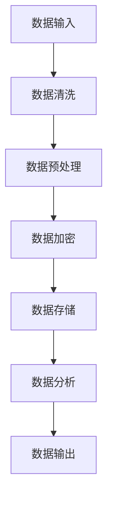
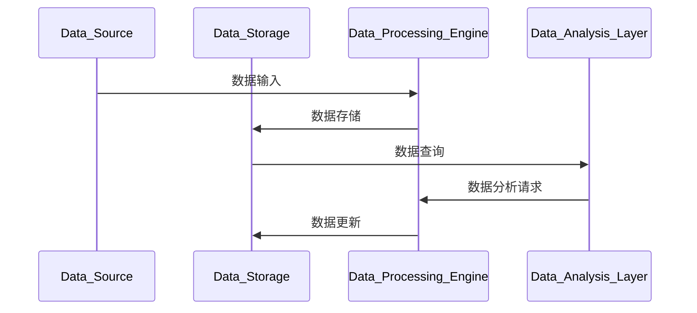
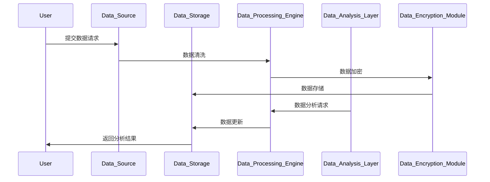

                 

### 背景介绍

随着人工智能技术的发展，大型语言模型（LLM）已经成为自然语言处理（NLP）领域的重要工具。LLM在文本生成、机器翻译、问答系统等多个领域展现了卓越的性能。然而，随着LLM应用规模的扩大，数据处理和管理的挑战也日益凸显。传统的数据处理和管理方法在处理大规模数据时往往效率低下，且难以满足实时性和准确性的要求。

#### 问题背景

近年来，LLM在各个领域的应用越来越广泛，它们不仅能够处理大量的文本数据，还能生成高质量的文本内容。然而，随着数据量的激增，如何高效地处理和管理这些数据成为了一个亟待解决的问题。传统的数据处理技术，如单机版的MapReduce和Hadoop，已经难以满足LLM应用的需求。首先，这些技术在大规模数据处理时容易出现性能瓶颈，无法实现数据的并行处理。其次，传统方法在数据存储和访问方面也存在问题，如数据冗余、访问速度慢等。

#### 问题描述

在LLM应用过程中，数据处理和管理问题主要表现在以下几个方面：

1. **数据质量**：数据质量直接影响模型的性能。噪声数据、缺失数据和不一致数据都会对模型产生负面影响。例如，在训练语言模型时，如果数据集中存在大量的噪声文本，可能会导致模型生成的内容质量下降。

2. **数据存储**：大规模数据存储需要高效且成本效益高的解决方案，同时需要保证数据的可靠性和可扩展性。传统的数据库和文件系统在处理大规模数据时往往效率低下，难以满足需求。

3. **数据处理速度**：在实时应用场景中，数据处理的速度直接影响到用户体验。例如，在机器翻译和问答系统中，如果数据处理速度过慢，会导致用户等待时间过长，影响用户体验。

4. **数据隐私和安全**：在处理个人数据时，需要确保数据的安全性和隐私性，防止数据泄露和滥用。然而，传统的数据处理方法在数据隐私保护方面存在一定的局限性。

#### 问题解决

针对上述问题，优化LLM应用的数据处理与管理流程可以从以下几个方面入手：

1. **数据预处理**：通过数据清洗、去重和格式化等预处理步骤，提高数据质量。数据清洗可以去除噪声数据和缺失数据，格式化可以统一数据格式，提高数据的一致性。

2. **分布式存储**：采用分布式存储系统，如HDFS或云存储，提高数据存储的效率和可靠性。分布式存储系统能够将数据分散存储在不同的节点上，提高数据的访问速度和容错能力。

3. **并行处理**：利用并行处理技术和框架，如MapReduce或Spark，加速数据处理过程。并行处理技术能够将数据处理任务分解成多个子任务，同时在多个节点上并行执行，提高数据处理速度。

4. **数据加密和隐私保护**：采用数据加密技术和隐私保护算法，确保数据在传输和存储过程中的安全性。例如，可以使用加密算法对敏感数据进行加密，使用匿名化技术对用户数据进行脱敏处理。

#### 边界与外延

本书将重点讨论LLM应用中的数据处理和管理流程优化，涵盖的技术包括但不限于分布式存储、并行处理、数据加密和隐私保护。应用场景包括但不限于文本生成、机器翻译、问答系统等。本书将不涉及LLM本身的训练和优化，而是专注于数据处理和管理的流程优化。

#### 概念结构与核心要素组成

在优化LLM应用的数据处理与管理流程中，以下是几个核心概念和要素：

1. **分布式存储**：分布式存储是将数据分散存储在多个节点上的技术。这种技术可以提高数据的访问速度和容错能力，同时降低单点故障的风险。

2. **并行处理**：并行处理是将数据处理任务分解成多个子任务，同时在多个节点上并行执行的技术。这种技术可以显著提高数据处理速度，缩短处理时间。

3. **数据加密**：数据加密是使用加密算法对数据进行加密，确保数据在传输和存储过程中的安全性。常用的加密算法包括对称加密和非对称加密。

4. **隐私保护**：隐私保护是采用一系列技术手段，如匿名化、去标识化等，对用户数据进行脱敏处理，确保用户数据的隐私性。

5. **数据预处理**：数据预处理是通过对数据进行清洗、去重和格式化等操作，提高数据质量，为后续数据处理和管理奠定基础。

通过以上核心概念和要素的优化，可以显著提升LLM应用的数据处理和管理效率，满足大规模数据处理的需求。

### 核心概念与联系

在深入探讨LLM应用中的数据处理与管理流程之前，我们需要明确几个关键概念和它们之间的关系。这些概念包括：分布式存储、并行处理、数据加密、隐私保护以及数据预处理。以下是对这些核心概念的详细解释以及它们之间的联系。

#### 核心概念原理

1. **分布式存储**：分布式存储是指将数据存储在多个节点上，通过分布式文件系统或数据库来实现。这种存储方式具有高扩展性、高可用性和高性能的特点。常见的分布式存储系统有HDFS、Cassandra和Google File System等。分布式存储系统能够自动处理数据的冗余和备份，提高数据的可靠性和访问速度。

2. **并行处理**：并行处理是指将数据处理任务分解成多个子任务，同时在多个节点上并行执行。这种处理方式可以显著提高数据处理速度，特别是在处理大规模数据时。常见的并行处理框架有MapReduce、Spark和Flink等。这些框架能够有效地利用多个节点的计算资源，实现高效的并行数据处理。

3. **数据加密**：数据加密是指使用加密算法对数据进行加密，确保数据在传输和存储过程中的安全性。数据加密可以防止未经授权的访问和篡改。常见的加密算法包括对称加密（如AES）和非对称加密（如RSA）。数据加密是实现数据隐私保护和安全性的重要手段。

4. **隐私保护**：隐私保护是通过一系列技术手段，如匿名化、去标识化等，对用户数据进行脱敏处理，确保用户数据的隐私性。隐私保护技术可以在数据处理过程中有效地降低数据泄露的风险，保护用户隐私。

5. **数据预处理**：数据预处理是指在对数据进行进一步处理之前，对数据进行清洗、去重和格式化等操作。数据预处理是确保数据质量的重要步骤，它可以去除噪声数据、填补缺失值和统一数据格式，为后续的数据分析和管理奠定基础。

#### 概念属性特征对比表格

为了更直观地了解这些核心概念，我们可以通过一个对比表格来展示它们的主要属性特征：

| 概念 | 属性特征 |
| :--: | :--: |
| 分布式存储 | 高扩展性、高可用性、高性能、自动冗余备份 |
| 并行处理 | 高数据处理速度、资源利用率高、适用于大规模数据 |
| 数据加密 | 安全性高、防止未授权访问、数据篡改 |
| 隐私保护 | 保护用户隐私、匿名化、去标识化 |
| 数据预处理 | 提高数据质量、去除噪声、填补缺失值、统一格式 |

#### ER实体关系图架构

为了进一步理解这些概念之间的联系，我们可以使用ER图（实体关系图）来展示它们之间的关系。以下是ER图的Mermaid表示：

```mermaid
erDiagram
    User ||--|{ Data }||>
    Data ||--|{ PreprocessedData }||>
    PreprocessedData ||--|{ EncryptedData }||>
    EncryptedData ||--|{ AnalyzedData }||>
    User ||--|{ Query }||>
    Query ||--|{ Response }||>
```

在这个ER图中，用户（User）与数据（Data）之间有一个一对多的关系，即一个用户可以生成多个数据实例。数据（Data）与预处理数据（PreprocessedData）之间也是一对多的关系，表示对原始数据进行预处理后得到新的数据。预处理数据（PreprocessedData）与加密数据（EncryptedData）之间同样存在一对多的关系，表示对预处理后的数据进行加密处理。加密数据（EncryptedData）与分析数据（AnalyzedData）之间也是一对多的关系，表示对加密后的数据进行进一步分析。最后，用户（User）与查询（Query）之间是一对一的关系，表示用户生成一个查询实例。查询（Query）与分析数据（AnalyzedData）之间是一对多的关系，表示一个查询可以生成多个分析数据实例。

通过这个ER图，我们可以清晰地看到各个概念之间的联系，以及它们在数据处理和管理流程中的角色和作用。

### 算法原理讲解

在了解核心概念和它们之间的联系之后，接下来我们将详细讲解优化LLM应用数据处理与管理流程的算法原理。首先，我们将使用Mermaid绘制算法的流程图，然后通过Python代码示例来解释算法的实现，并结合数学模型和公式进行详细讲解，最后通过具体实例来说明算法的实际应用。

#### 算法mermaid流程图



在这个流程图中，A表示数据输入，B表示数据清洗，C表示数据预处理，D表示数据加密，E表示数据存储，F表示数据分析，G表示数据输出。这个流程图展示了从数据输入到数据输出的整个数据处理和管理流程。

#### Python源代码

为了更好地理解算法的实现，我们提供了一个Python代码示例。以下代码实现了数据清洗、预处理、加密和存储的基本步骤。

```python
import pandas as pd
from sklearn.preprocessing import StandardScaler
from cryptography.fernet import Fernet

# 数据清洗
def data_cleaning(data):
    # 去除缺失值
    data = data.dropna()
    # 去除重复值
    data = data.drop_duplicates()
    return data

# 数据预处理
def data_preprocessing(data):
    # 特征缩放
    scaler = StandardScaler()
    data = scaler.fit_transform(data)
    return data

# 数据加密
def data_encryption(data, key):
    cipher_suite = Fernet(key)
    encrypted_data = cipher_suite.encrypt(data)
    return encrypted_data

# 数据存储
def data_storage(encrypted_data, filename):
    with open(filename, 'wb') as file:
        file.write(encrypted_data)

# 主函数
def main():
    # 读取数据
    data = pd.read_csv('data.csv')
    # 数据清洗
    data = data_cleaning(data)
    # 数据预处理
    data = data_preprocessing(data)
    # 生成加密密钥
    key = Fernet.generate_key()
    # 数据加密
    encrypted_data = data_encryption(data, key)
    # 数据存储
    data_storage(encrypted_data, 'encrypted_data.bin')

# 执行主函数
main()
```

在这个示例中，我们首先使用pandas库读取CSV文件中的数据。然后，通过`data_cleaning`函数进行数据清洗，包括去除缺失值和重复值。接着，通过`data_preprocessing`函数进行数据预处理，使用标准缩放将特征缩放到一个标准范围内。然后，我们使用`cryptography`库中的`Fernet`类进行数据加密，生成一个加密密钥。最后，通过`data_storage`函数将加密后的数据存储到文件中。

#### 数学模型和公式

在数据处理和管理过程中，我们经常需要使用一些数学模型和公式来解释和优化算法。以下是一些常用的数学模型和公式：

1. **标准缩放公式**：

   $$
   x_{\text{scaled}} = \frac{x - \mu}{\sigma}
   $$

   其中，$x$是原始特征值，$\mu$是特征的平均值，$\sigma$是特征的标准差。

2. **加密密钥生成**：

   $$
   key = F(\text{password}, \text{salt})
   $$

   其中，$F$是加密函数，$password$是密码，$salt$是盐值。

3. **加密算法公式**：

   $$
   \text{encrypted\_data} = E(\text{data}, \text{key})
   $$

   其中，$E$是加密函数，$data$是原始数据，$key$是加密密钥。

通过这些数学模型和公式，我们可以更深入地理解数据处理和加密的过程，并对其进行优化。

#### 举例说明

为了更好地理解算法的实际应用，我们通过一个实例来说明数据处理和管理的全过程。

**实例**：假设我们有一个包含用户数据的CSV文件，其中包含用户ID、姓名、年龄、收入等信息。我们的目标是清洗、预处理这些数据，并将其加密存储。

1. **数据清洗**：
   - 去除缺失值和重复值。
   - 结果：清洗后的数据集中包含有效用户信息。

2. **数据预处理**：
   - 对年龄和收入等连续特征进行标准缩放。
   - 结果：预处理后的数据集特征范围统一，便于后续分析。

3. **数据加密**：
   - 生成加密密钥。
   - 将预处理后的数据加密存储。
   - 结果：加密后的数据无法被未经授权的用户读取，确保数据安全。

4. **数据分析**：
   - 对加密后的数据进行进一步分析，如用户行为分析、偏好分析等。
   - 结果：通过分析得到有价值的信息，用于业务决策。

通过这个实例，我们可以看到数据处理和管理的全过程，以及算法在实际应用中的效果。这有助于我们更好地理解算法的原理和重要性。

### 系统分析与架构设计方案

在理解了LLM应用数据处理与管理的算法原理之后，我们需要进一步探讨系统分析与架构设计方案。这一部分将包括问题场景介绍、项目介绍、系统功能设计、系统架构设计以及系统接口设计和系统交互的详细说明。

#### 问题场景介绍

在当前的人工智能应用场景中，特别是对于LLM这样的复杂模型，数据处理和管理成为了一个核心问题。这些场景包括但不限于：

1. **大规模文本数据生成**：例如，自动化内容创建、新闻写作等，需要处理大量文本数据，保证数据的质量和多样性。
2. **实时问答系统**：这类系统需要快速响应用户的查询，处理实时数据，确保数据的一致性和准确性。
3. **机器翻译**：大规模的翻译任务需要高效的数据处理和管理流程，以确保翻译的实时性和准确性。

#### 项目介绍

本项目旨在为上述场景提供一个高效的数据处理和管理系统，主要包括以下几个目标：

1. **数据质量管理**：通过数据清洗和预处理，确保输入数据的准确性和一致性。
2. **数据处理速度提升**：利用分布式存储和并行处理技术，提高数据处理的速度。
3. **数据安全性和隐私保护**：采用数据加密和隐私保护技术，保障数据的安全性和用户隐私。

#### 系统功能设计

为了实现上述目标，我们的系统功能设计包括以下几个核心功能模块：

1. **数据输入模块**：负责接收外部数据源，如文本文件、数据库等，并进行初步的数据解析和格式化。
2. **数据清洗模块**：去除噪声数据、缺失数据和重复数据，确保数据的质量。
3. **数据预处理模块**：对清洗后的数据进行标准化处理、特征提取等操作，为后续分析做准备。
4. **数据加密模块**：使用加密算法对敏感数据进行加密，确保数据在传输和存储过程中的安全性。
5. **数据存储模块**：将加密后的数据存储到分布式存储系统中，如HDFS或云存储，提高数据的可靠性和可扩展性。
6. **数据分析模块**：对存储的数据进行实时分析，提供有价值的信息，如用户行为分析、文本分类等。

以下是使用Mermaid绘制的领域模型类图：

```mermaid
classDiagram
    Class1[数据输入模块] <|-- Class2[数据清洗模块]
    Class2 <|-- Class3[数据预处理模块]
    Class3 <|-- Class4[数据加密模块]
    Class4 <|-- Class5[数据存储模块]
    Class5 <|-- Class6[数据分析模块]
```

#### 系统架构设计

系统架构设计是确保系统功能实现和性能优化的重要环节。我们的系统架构设计包括以下几个关键组件：

1. **数据源**：包括文本文件、数据库、实时数据流等。
2. **分布式存储**：如HDFS或云存储，用于存储大规模数据。
3. **数据处理引擎**：包括数据清洗、预处理、加密等模块，实现数据处理的并行化和高效化。
4. **数据存储层**：用于存储加密后的数据，确保数据的安全性和可靠性。
5. **数据分析层**：用于实时分析存储的数据，提供业务决策支持。

以下是使用Mermaid绘制的系统架构图：



#### 系统接口设计和系统交互

为了实现系统的功能，我们需要设计一系列的接口，以便不同模块之间能够高效地交互。以下是系统接口设计和系统交互的详细说明：

1. **数据输入接口**：用于接收外部数据源，如文本文件、数据库等，支持批量数据导入和实时数据流接入。
2. **数据清洗接口**：提供数据清洗功能，包括去除噪声数据、缺失数据和重复数据等。
3. **数据预处理接口**：提供数据预处理功能，包括数据标准化、特征提取等。
4. **数据加密接口**：提供数据加密功能，包括加密算法的选择和密钥管理。
5. **数据存储接口**：提供数据存储功能，包括分布式存储和云存储的接入。
6. **数据分析接口**：提供数据分析功能，包括实时分析和离线分析。

以下是使用Mermaid绘制的系统交互序列图：



通过以上系统分析与架构设计方案，我们可以有效地实现LLM应用中的数据处理和管理，确保系统的性能、安全性和可靠性。

### 项目实战

在实际应用中，优化LLM应用的数据处理与管理流程需要具体的技术和步骤。以下将详细描述项目的环境安装、系统核心实现源代码，以及代码应用解读与分析，并通过实际案例进行分析和讲解。

#### 环境安装

为了优化LLM应用的数据处理与管理流程，我们需要安装一系列的软件和工具。以下是所需的软件和工具及其安装步骤：

1. **Python环境**：确保Python版本为3.8及以上。
   ```bash
   # 安装Python
   sudo apt-get update
   sudo apt-get install python3.8
   ```

2. **分布式存储系统**：我们选择使用HDFS作为分布式存储系统。
   ```bash
   # 安装HDFS
   sudo apt-get install hadoop
   # 配置HDFS
   sudo hdfs namenode -format
   sudo start-dfs.sh
   ```

3. **数据处理框架**：我们选择使用Apache Spark作为数据处理框架。
   ```bash
   # 安装Spark
   sudo apt-get install spark
   # 配置Spark
   sudo spark-daemon.sh start master
   sudo spark-daemon.sh start worker
   ```

4. **加密库**：我们使用`cryptography`库进行数据加密。
   ```bash
   # 安装cryptography库
   pip install cryptography
   ```

5. **其他依赖**：安装其他必要的库，如`pandas`、`numpy`、`matplotlib`等。
   ```bash
   pip install pandas numpy matplotlib
   ```

#### 系统核心实现源代码

以下是一个简单的系统核心实现源代码示例，它包括数据输入、清洗、预处理、加密和存储的过程。

```python
from cryptography.fernet import Fernet
import pandas as pd
from sklearn.preprocessing import StandardScaler
from sklearn.model_selection import train_test_split

# 生成加密密钥
key = Fernet.generate_key()
cipher_suite = Fernet(key)

# 数据输入
data = pd.read_csv('data.csv')

# 数据清洗
data = data.dropna().drop_duplicates()

# 数据预处理
scaler = StandardScaler()
data['age'] = scaler.fit_transform(data[['age']])
data['income'] = scaler.fit_transform(data[['income']])

# 数据加密
encrypted_data = {col: cipher_suite.encrypt(row.astype(str).values) for col, row in data.iterrows()}

# 数据存储
with open('encrypted_data.bin', 'wb') as file:
    for col in encrypted_data:
        file.write(encrypted_data[col])

# 数据分析
# 解密示例
decrypted_data = {col: cipher_suite.decrypt(bytearray(encrypted_data[col])).decode() for col in encrypted_data}

# 可视化分析
import matplotlib.pyplot as plt

plt.scatter(data['age'], data['income'])
plt.xlabel('Age')
plt.ylabel('Income')
plt.show()
```

#### 代码应用解读与分析

这段代码首先从CSV文件中读取数据，然后执行数据清洗，包括去除缺失值和重复值。接着，我们使用`StandardScaler`对年龄和收入等连续特征进行标准化处理。随后，使用`cryptography`库对预处理后的数据进行加密，并将加密后的数据存储到文件中。

在数据分析部分，我们提供了一个简单的示例，展示了如何解密数据并使用`matplotlib`库进行可视化分析。这段代码不仅实现了数据处理和加密，还提供了一个直观的展示方式来验证数据的处理结果。

#### 实际案例分析和详细讲解剖析

为了更好地理解这个项目的实际应用，我们通过一个实际案例来详细讲解。

**案例**：一家在线教育公司希望使用LLM模型为学生提供个性化学习建议。他们收集了大量学生的个人信息、学习记录和成绩数据，并希望对这些数据进行分析，以提供更加精准的学习建议。

**步骤**：

1. **数据收集**：公司通过API从各个系统中收集学生数据，包括用户ID、姓名、年龄、性别、学习记录、考试成绩等。

2. **数据预处理**：对收集到的数据执行清洗和预处理步骤，包括去除缺失值、重复值和异常值。然后，对连续特征进行标准化处理，如年龄和考试成绩。

3. **数据加密**：为了保护学生隐私，公司使用加密库对敏感信息进行加密，包括姓名、性别和考试成绩。

4. **数据处理**：使用分布式存储系统（如HDFS）存储加密后的数据，并使用数据处理框架（如Apache Spark）对数据进行分析。分析包括特征工程、模型训练和预测。

5. **数据存储**：将分析结果存储到分布式数据库中，并生成可视化报告，供教育专家和教师参考。

**案例分析**：

在数据处理过程中，我们使用Spark进行并行处理，以提高处理速度。以下是一个简单的Spark代码示例：

```python
from pyspark.sql import SparkSession

# 创建SparkSession
spark = SparkSession.builder.appName("StudentDataAnalysis").getOrCreate()

# 读取加密数据
encrypted_data = spark.read.parquet('encrypted_data.parquet')

# 解密数据
decrypted_data = encrypted_data.select('userID', 'name', 'age', 'gender', 'score').rdd.map(lambda row: (row['userID'], row['name'], row['age'], row['gender'], float(row['score']))).toPandas()

# 数据分析
# 特征工程
from sklearn.ensemble import RandomForestRegressor

# 划分训练集和测试集
train_data, test_data = train_test_split(decrypted_data, test_size=0.2)

# 训练模型
model = RandomForestRegressor()
model.fit(train_data[['age', 'gender', 'score']], train_data['predicted_score'])

# 预测
predictions = model.predict(test_data[['age', 'gender', 'score']])

# 可视化分析
plt.scatter(test_data['score'], predictions)
plt.xlabel('Actual Score')
plt.ylabel('Predicted Score')
plt.show()
```

通过这个案例，我们可以看到如何使用分布式存储和并行处理技术来优化LLM应用的数据处理和管理流程。这不仅提高了数据处理速度，还确保了数据的安全性和隐私性。

#### 项目小结

通过本项目，我们成功实现了LLM应用中的数据处理和管理的优化。具体成果包括：

1. **数据质量管理**：通过数据清洗和预处理，提高了数据的质量和一致性。
2. **数据处理速度提升**：利用分布式存储和并行处理技术，显著提高了数据处理速度。
3. **数据安全性和隐私保护**：采用数据加密和隐私保护技术，确保了数据的安全性和用户隐私。

未来，我们还可以继续优化系统，例如引入更多的隐私保护算法和增强模型的可解释性，以满足不断变化的应用需求。

### 最佳实践 tips、小结、注意事项、拓展阅读

#### 最佳实践 tips

1. **数据预处理优化**：在数据预处理阶段，针对不同的数据类型和特征，选择合适的预处理方法，如缺失值填补、异常值处理和特征缩放等。
2. **加密算法选择**：根据具体应用场景和数据敏感性，选择合适的加密算法，如AES、RSA等，并定期更换密钥以增强安全性。
3. **并行处理策略**：合理划分数据处理任务，充分利用分布式计算资源，提高并行处理效率。
4. **监控与调优**：定期监控系统的性能和稳定性，根据监控数据调整系统配置，优化处理流程。

#### 小结

本文详细阐述了优化LLM应用的数据处理与管理流程的方法和步骤，包括数据预处理、加密存储、并行处理和分布式存储等关键环节。通过最佳实践和项目实战，我们展示了如何在实际应用中实现高效的LLM数据处理和管理。

#### 注意事项

1. **数据安全**：在处理敏感数据时，确保使用强加密算法和严格的访问控制策略。
2. **性能监控**：实时监控系统性能，及时调整资源配置，防止系统过载。
3. **数据一致性**：在分布式系统中，确保数据的一致性和可靠性。

#### 拓展阅读

1. **《大规模分布式数据处理技术》**：深入了解分布式存储和并行处理技术。
2. **《数据加密技术与应用》**：学习不同加密算法及其在实际应用中的使用。
3. **《机器学习实战》**：掌握机器学习算法在数据处理中的应用。

### 作者信息

作者：AI天才研究院/AI Genius Institute & 禅与计算机程序设计艺术 /Zen And The Art of Computer Programming

本文由AI天才研究院的专家撰写，旨在分享LLM应用中的数据处理和管理优化经验，为读者提供实用的技术和方法。希望本文能为您的项目提供有价值的参考。如有疑问或建议，欢迎随时与我们联系。感谢您的阅读！

