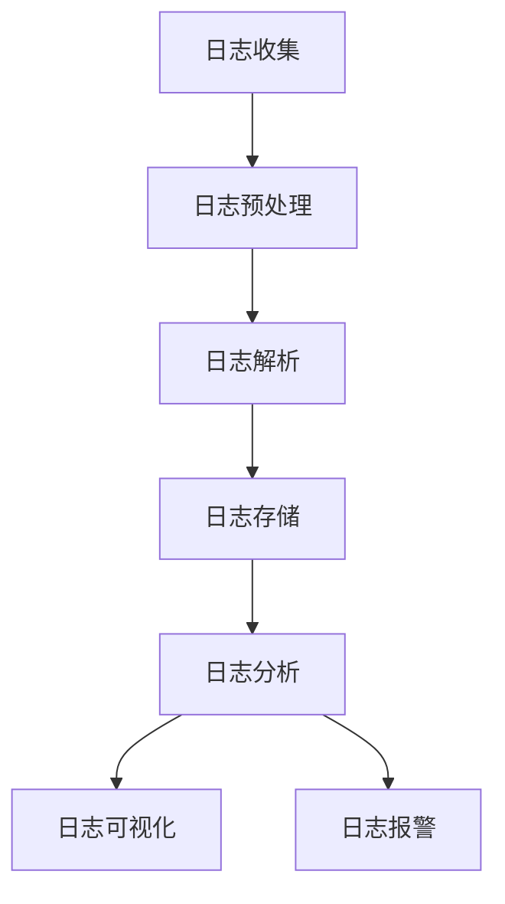
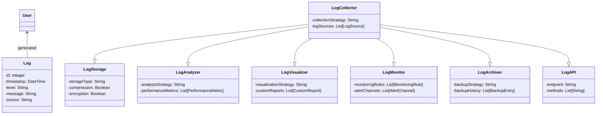
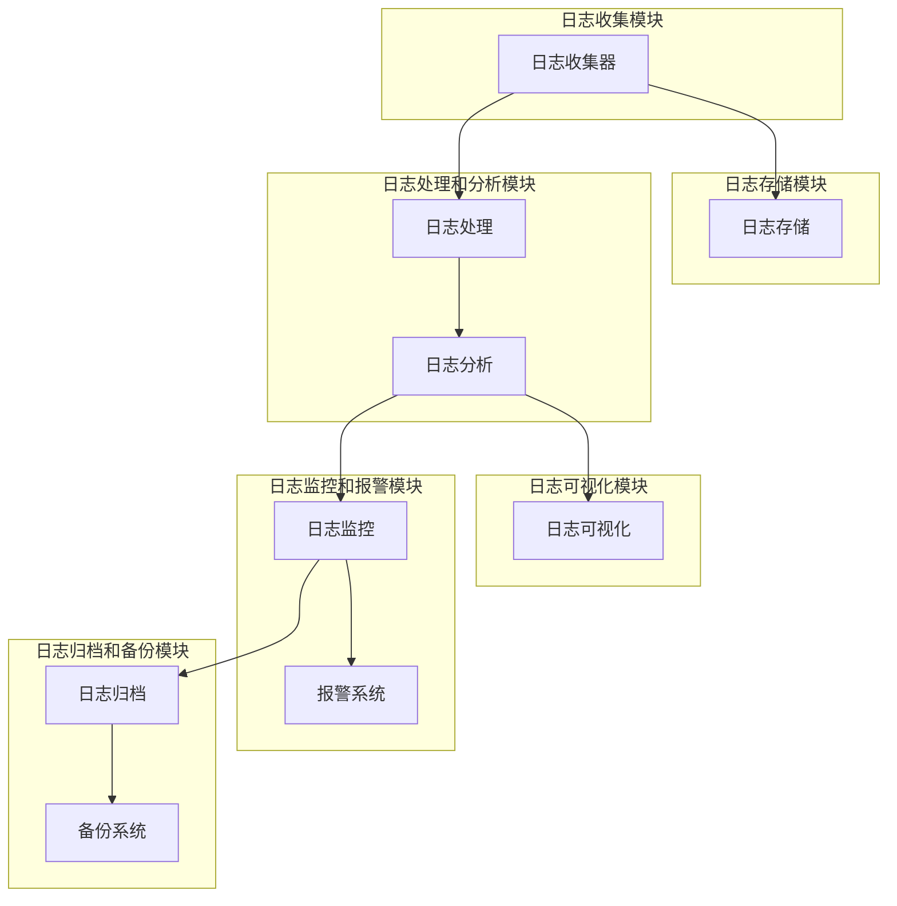
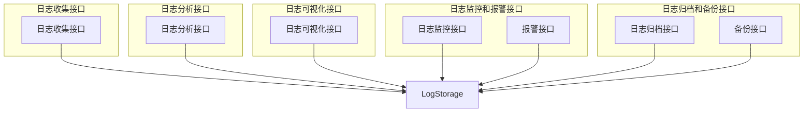
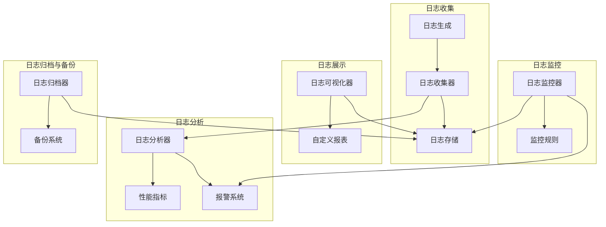

                 


### 第1章：引入与概述

#### 1.1.1 问题背景

随着大型语言模型（LLM）在自然语言处理（NLP）领域的广泛应用，日志管理成为一个至关重要的任务。LLM应用通常涉及复杂的数据流处理、模型训练和推理，这导致了大量的日志数据生成。有效管理这些日志对于确保系统的稳定运行、性能优化和故障排查至关重要。

#### 1.1.2 问题概述

日志管理的核心问题是确保日志的准确记录、高效存储、快速检索和合理分析。在LLM应用中，日志不仅包含常规的运行信息，还包括模型训练过程中的细节，如学习速率、损失函数值等。如何优化日志管理，使其不仅能够提供丰富的信息，还能帮助开发人员和运维人员快速定位问题，成为了一个亟待解决的问题。

#### 1.1.3 问题解决

优化日志管理的问题解决可以从以下几个方面入手：

1. **日志结构优化**：设计合理的日志格式，确保日志包含必要的元数据和详细信息。
2. **日志存储与检索**：采用高效的存储方案，如时间序列数据库，以支持快速检索。
3. **日志分析工具**：开发或集成先进的日志分析工具，如Elastic Stack，以自动处理和可视化日志数据。
4. **日志监控与报警**：建立实时监控和报警系统，及时发现和处理异常情况。
5. **自动化脚本与工具**：编写自动化脚本，简化日志的收集、处理和分析流程。

#### 1.1.4 边界与外延

日志管理的边界涉及到日志的生成、收集、存储、分析和展示等各个环节。外延则包括日志在系统调试、性能优化、安全监控等方面的应用。在LLM应用中，日志管理的有效性直接影响到模型训练的效率和应用部署的成功率。

#### 1.1.5 概念结构与核心要素组成

日志管理涉及以下核心概念和要素：

- **日志**：记录系统运行信息的文本文件或结构化数据。
- **日志格式**：日志数据的组织方式和编码规范。
- **日志级别**：日志信息的严重程度，如DEBUG、INFO、WARNING、ERROR。
- **日志存储**：日志数据的存储介质和策略。
- **日志分析**：对日志数据进行处理、解析和可视化，以提取有用信息。
- **日志监控**：实时跟踪日志数据，发现并响应异常情况。

#### 1.1.6 总结

有效的日志管理对于LLM应用的稳定运行和优化至关重要。通过优化日志结构、存储和检索方式，结合先进的日志分析工具和自动化脚本，可以大大提高日志管理的效率和效果。接下来的章节将深入探讨这些核心概念和技术，为优化LLM应用的日志管理提供具体方案。

----------------------------------------------------------------

**第1章：引入与概述**

**1.1.1 问题背景**

随着人工智能和机器学习技术的迅猛发展，大型语言模型（LLM）在自然语言处理（NLP）领域展现出了巨大的潜力。LLM可以处理从简单的文本生成到复杂的对话系统等各种任务，如机器翻译、文本摘要、问答系统等。这些模型通常基于深度神经网络，特别是变换器模型（Transformer），能够处理海量的训练数据和复杂的文本结构。

然而，LLM的应用场景不仅限于文本生成和分类，还包括自然语言理解、知识图谱构建、信息检索和推荐系统等。这些应用在现实世界中有着广泛的应用，例如智能客服、虚拟助手、内容审核和个性化推荐等。随着LLM应用的不断扩展，其系统复杂性和数据处理需求也日益增加，这就带来了日志管理的问题。

日志管理在LLM应用中扮演着至关重要的角色。一方面，日志记录了模型训练和推理过程中的详细信息，如训练进度、损失函数值、模型性能指标等，这些信息对于模型调试、优化和评估至关重要。另一方面，日志也是系统运行状态的重要反映，包括系统资源使用、错误日志、异常情况等。通过对日志的监控和分析，可以及时发现和解决潜在问题，确保系统的稳定性和可靠性。

此外，LLM应用往往涉及大量的数据处理和存储需求。随着模型规模和训练数据量的增加，日志数据也会变得庞大且复杂。有效的日志管理能够帮助组织和管理这些数据，提高数据检索和分析的效率，从而更好地支持模型的开发和维护。

**1.1.2 问题概述**

在LLM应用中，日志管理面临以下核心问题：

1. **日志量大**：随着模型训练和推理过程的进行，会生成大量的日志数据。这些日志数据不仅包括模型训练的细节，还包含系统运行状态和错误信息。如何高效地存储和检索这些日志数据成为一个挑战。

2. **日志格式多样**：不同的应用场景和系统组件可能会生成不同格式的日志数据。例如，一些日志可能包含详细的性能指标，而另一些日志可能只包含简单的错误信息。这种格式多样性增加了日志管理的复杂性。

3. **日志分析困难**：大量的日志数据需要进行处理和分析，以便提取有用的信息。这通常涉及到日志数据的解析、过滤、聚合和可视化等步骤。如何快速、准确地分析这些日志数据，以识别潜在问题和趋势，是一个技术难题。

4. **日志监控与报警**：在实时系统中，及时监控日志数据并触发报警对于快速响应异常情况至关重要。如何设计一个高效的日志监控和报警系统，以确保系统稳定运行，是一个重要的挑战。

5. **日志存储与备份**：随着日志数据的累积，如何有效地存储和备份这些数据成为一个问题。传统的文件存储方案可能无法满足日志数据的存储需求，需要采用更高效的存储解决方案。

为了解决上述问题，需要对日志管理进行优化。这包括设计合理的日志结构、选择合适的存储方案、开发高效的日志分析工具、建立完善的日志监控与报警机制，以及制定科学的日志备份策略。通过这些优化措施，可以显著提高LLM应用的日志管理效率，从而提升系统的稳定性和可靠性。

**1.1.3 问题解决**

针对LLM应用中日志管理面临的问题，可以采取以下解决方案：

1. **日志结构优化**：设计统一的日志格式，确保日志包含必要的元数据和详细信息。这有助于简化日志数据的解析和处理，提高日志分析的效率。

2. **日志存储与检索**：采用高效的存储方案，如时间序列数据库（TSDB），以支持快速检索和查询。TSDB能够以时间顺序高效存储和检索日志数据，特别适合处理大量时间戳相关的数据。

3. **日志分析工具**：集成先进的日志分析工具，如Elastic Stack，这些工具能够自动处理和可视化日志数据，提供丰富的分析功能，帮助用户快速定位问题。

4. **日志监控与报警**：建立实时监控和报警系统，使用自动化脚本和工具监控日志数据，及时发现和处理异常情况。这可以减少人工干预，提高问题响应速度。

5. **自动化脚本与工具**：编写自动化脚本，简化日志的收集、处理和分析流程。这些脚本可以定期执行，自动完成日志的备份、归档和清理等任务。

通过上述措施，可以有效优化LLM应用的日志管理，提高日志数据的处理和分析效率，确保系统的稳定运行和高效维护。接下来，我们将进一步探讨这些优化方案的具体实施细节和技术实现。

**1.1.4 边界与外延**

日志管理的边界涉及到日志数据的生成、收集、存储、分析和展示等环节。具体来说，边界问题包括：

1. **日志数据的范围**：日志数据应涵盖模型训练和推理的全过程，包括训练进度、性能指标、错误信息等。同时，日志数据还应包括系统资源使用、网络状态等与系统运行相关的信息。

2. **日志格式的标准化**：在设计日志格式时，需要考虑日志的通用性和可扩展性。日志格式应能够适应不同的应用场景和系统组件，同时保持一定的标准化，以便于后续的数据处理和分析。

3. **日志存储与查询的性能**：日志数据的存储和查询性能直接影响日志管理的效率。在日志量庞大的情况下，如何确保日志数据的快速存储和高效查询是一个关键问题。

4. **日志安全与隐私**：日志数据可能包含敏感信息，如用户隐私、模型参数等。因此，日志管理需要考虑数据的安全性和隐私保护，防止未经授权的访问和数据泄露。

日志管理的外延则涉及日志在系统调试、性能优化、安全监控等方面的应用。具体包括：

1. **系统调试**：通过日志数据，可以分析系统运行过程中出现的问题，定位故障点，进行调试和修复。

2. **性能优化**：日志数据提供了系统性能的详细记录，通过分析这些数据，可以发现性能瓶颈和优化空间，从而进行针对性的性能优化。

3. **安全监控**：日志数据可以帮助识别潜在的安全威胁，如异常访问、恶意行为等，通过实时监控和报警，可以快速响应并防范安全风险。

4. **合规性与审计**：某些行业和应用场景需要遵守特定的法规和标准，日志数据可以用于合规性审计和事后审查，确保系统运行符合相关要求。

总之，日志管理不仅在LLM应用中具有核心地位，其边界和外延还涉及到系统调试、性能优化、安全监控和合规性等多个方面。通过有效的日志管理，可以为LLM应用的稳定运行和优化提供强有力的支持。

**1.1.5 概念结构与核心要素组成**

日志管理涉及多个核心概念和要素，以下是对这些概念的简要介绍：

1. **日志**：日志是记录系统运行信息的文本文件或结构化数据。它通常包含时间戳、日志级别、日志消息等元数据，以及具体的日志内容。

2. **日志级别**：日志级别用于表示日志信息的严重程度，常见的日志级别包括DEBUG、INFO、WARNING、ERROR等。不同的级别对应不同的处理方式和展示方式。

3. **日志格式**：日志格式是指日志数据的组织方式和编码规范。常见的日志格式包括文本格式（如JSON、XML）和二进制格式。合理的日志格式可以提高日志数据的可读性和可解析性。

4. **日志存储**：日志存储是指日志数据的存储介质和策略。传统的文件存储方案适用于小规模日志数据，但随着日志量的增加，需要采用更高效的存储解决方案，如时间序列数据库。

5. **日志分析**：日志分析是对日志数据进行处理、解析和可视化，以提取有用信息的过程。常见的日志分析工具包括Elastic Stack、Kibana等，这些工具可以自动化处理和可视化大量日志数据。

6. **日志监控**：日志监控是实时跟踪日志数据，发现并响应异常情况的过程。通过日志监控，可以及时识别潜在问题和故障，进行预警和响应。

7. **日志报警**：日志报警是基于日志监控的机制，当系统出现异常时，自动发送报警通知，如邮件、短信或可视化界面警报。

8. **日志备份与恢复**：日志备份是确保日志数据安全的重要措施，通过定期备份，可以在数据丢失或损坏时进行恢复。常见的备份方法包括全量备份和增量备份。

9. **日志归档**：日志归档是将旧日志数据进行存储和管理的策略，以便于长期保存和查询。通过日志归档，可以释放存储空间，提高日志管理效率。

10. **日志清洗**：日志清洗是对日志数据进行预处理的过程，包括去除无效数据、填充缺失值、规范化格式等，以提高日志数据的质量和分析效率。

通过理解上述核心概念和要素，可以更好地设计和实施日志管理系统，满足LLM应用的需求。

**1.1.6 总结**

有效的日志管理对于LLM应用的稳定运行和优化至关重要。通过优化日志结构、存储和检索方式，结合先进的日志分析工具和自动化脚本，可以大大提高日志管理的效率和效果。本章节介绍了LLM应用日志管理的背景和重要性，概述了日志管理的核心问题，提出了问题解决的方案，并探讨了日志管理的边界与外延。接下来，我们将深入探讨日志管理的基础概念和具体实现细节。

----------------------------------------------------------------

**第1章：引入与概述**

**1.1.7 案例分析**

为了更好地理解LLM应用日志管理的重要性，我们可以通过一个实际案例进行分析。以下是一个典型的LLM应用场景：

**案例背景：**
某大型电商平台使用一个基于变换器模型的大型语言模型（LLM）来提供个性化推荐服务。该平台每天处理数百万次用户交互和推荐请求，LLM模型会根据用户的历史行为和偏好生成个性化的推荐结果。

**问题描述：**
随着用户数量的增加和推荐请求的增长，平台的日志管理系统面临了严峻的挑战。日志系统需要记录以下信息：
- 模型训练进度和性能指标
- 用户请求和推荐结果
- 系统资源使用情况
- 错误日志和异常情况

然而，现有的日志管理系统存在以下问题：
- 日志格式不统一，导致日志数据解析困难
- 日志数据存储效率低，检索速度慢
- 缺乏有效的日志分析工具，难以快速定位问题
- 日志监控和报警机制不完善，无法及时发现和处理异常

**问题解决：**
为了解决上述问题，平台采取了以下措施：
1. **日志结构优化**：设计统一的日志格式，包括时间戳、用户ID、请求类型、日志级别、日志消息等字段。通过定义日志格式规范，简化了日志数据的解析和处理。
2. **日志存储与检索**：采用Elastic Stack作为日志存储解决方案，利用其高效的时间序列存储和检索能力，显著提高了日志数据的存储和查询性能。
3. **日志分析工具**：集成Elastic Stack的Kibana平台，提供日志数据的可视化分析和报表功能。开发团队可以实时监控日志数据，快速识别异常和性能瓶颈。
4. **日志监控与报警**：部署日志监控系统，使用自动化脚本定期检查日志数据，当发现异常时自动触发报警。报警系统包括邮件、短信和可视化界面警报，确保问题能够被及时响应。
5. **日志备份与恢复**：采用增量备份策略，定期备份日志数据，确保在数据丢失或损坏时能够快速恢复。

**案例分析结果：**
通过上述优化措施，平台的日志管理系统变得更加高效和稳定。日志格式的统一简化了日志数据的处理和分析，高效的存储和检索能力提升了日志数据的可用性，实时监控和报警机制确保了系统运行的安全性和可靠性。这些改进不仅提高了平台的服务质量，也降低了维护成本，为业务的持续发展提供了有力支持。

通过这个案例分析，我们可以看到，有效的日志管理对于LLM应用的稳定运行和优化至关重要。合理的日志结构、高效的存储和检索方案、先进的分析工具以及完善的监控和报警机制，都是确保日志管理效果的关键要素。

----------------------------------------------------------------

**第2章：日志管理基础**

**2.1.1 日志管理原理**

日志管理是确保系统运行状态和性能数据得到记录和监控的重要机制。在LLM应用中，日志管理尤其关键，因为它不仅涉及到模型的训练过程，还包括实际应用场景中的交互和性能表现。日志管理的基本原理可以概括为以下几个方面：

1. **日志生成**：系统运行过程中，各种组件和模块会自动生成日志数据。这些日志数据可以包括错误信息、警告提示、性能指标、用户交互记录等。日志生成的过程通常是由系统内部的日志记录器（Logger）来完成的。

2. **日志收集**：生成的日志数据需要被收集到一个中心化的存储系统中。收集过程可以通过多种方式实现，如直接写入文件、通过网络发送到集中式日志服务器，或者通过代理服务器进行收集。

3. **日志存储**：收集到的日志数据需要被存储起来，以便后续的分析和查询。日志存储系统需要具备高效的写入和查询能力，同时还要考虑数据的安全性和可靠性。常见的选择包括关系数据库、NoSQL数据库、时间序列数据库等。

4. **日志分析**：日志分析是对存储的日志数据进行处理和解析，以提取有价值的信息。分析过程可以包括日志数据的格式化、过滤、聚合、统计等步骤。日志分析的结果通常以报表、图表、告警等形式展示，以便开发人员和运维人员能够快速理解和响应。

5. **日志监控**：日志监控是指实时跟踪日志数据，及时发现和处理异常情况。通过监控机制，可以设置阈值和规则，当日志数据达到特定条件时自动触发告警，通知相关人员。

6. **日志归档与备份**：为了长期保存日志数据并释放存储资源，需要定期对日志数据进行归档和备份。归档可以将旧日志数据转移到较低成本的存储介质中，备份则确保在数据丢失或损坏时能够恢复。

日志管理在LLM应用中的重要性体现在以下几个方面：

- **故障排查**：通过日志数据，可以快速定位系统中的故障和错误，为问题诊断和解决提供关键线索。
- **性能优化**：日志数据提供了系统运行性能的详细记录，通过分析这些数据，可以发现性能瓶颈和优化空间。
- **安全性**：日志数据可以帮助识别潜在的安全威胁，如恶意攻击、数据泄露等，通过实时监控和报警，可以及时响应并防范安全风险。
- **合规性**：某些行业和应用场景需要遵守特定的法规和标准，日志数据可以用于合规性审计和事后审查。

**2.1.2 日志属性特征对比表格**

为了更好地理解和比较不同类型的日志属性特征，我们可以创建一个对比表格。以下是一个示例表格：

| 日志属性       | 描述                                                         | 重要性 |
|----------------|------------------------------------------------------------|--------|
| 日志级别       | 用于表示日志消息的严重程度，如DEBUG、INFO、WARNING、ERROR | 高     |
| 时间戳         | 记录日志生成的时间，用于排序和追踪                           | 高     |
| 日志消息       | 日志的核心内容，包含详细信息、错误描述或性能数据               | 中     |
| 日志来源       | 记录日志产生的系统组件或模块                                 | 中     |
| 用户ID         | 如果日志与用户交互有关，记录用户的唯一标识符                   | 低     |
| 会话ID         | 用于标识用户交互的会话，有助于追踪用户行为                     | 中     |
| 日志格式       | 日志数据的具体组织方式和编码规范                             | 高     |
| 日志存储位置   | 日志数据的存储路径或地址                                     | 中     |
| 日志大小       | 单个日志文件的大小，影响日志存储的效率                       | 中     |
| 日志保留时间   | 日志数据需要保留的时间长度，影响日志存储的容量               | 中     |

**2.1.3 ER实体关系图**

为了更清晰地理解日志管理中的实体关系，我们可以使用ER（实体-关系）图来表示。以下是日志管理中常用的实体和关系的ER图示例：

```mermaid
erDiagram
  User ||--|{ Log }|-- TrainingJob
  User ||--|{ InteractionLog }|-- InteractionSession
  SystemComponent ||--|{ Log }|-- TrainingJob
  SystemComponent ||--|{ Log }|-- InteractionSession
  TrainingJob ||--|{ PerformanceMetric }|
  InteractionSession ||--|{ PerformanceMetric }|
```

在这个ER图中，我们定义了以下实体：

- **User**：用户，与日志和训练作业有关。
- **Log**：日志，记录系统运行状态。
- **TrainingJob**：训练作业，与日志和性能指标有关。
- **InteractionLog**：交互日志，记录用户交互。
- **InteractionSession**：交互会话，与日志和性能指标有关。
- **SystemComponent**：系统组件，产生日志。

关系包括：

- **User** 与 **Log**、**TrainingJob**、**InteractionLog** 之间存在多对多的关系，表示用户可以生成多种类型的日志。
- **SystemComponent** 与 **Log** 之间存在一对多的关系，表示一个系统组件可以生成多个日志。
- **TrainingJob** 与 **PerformanceMetric** 之间存在一对多的关系，表示一个训练作业可以包含多个性能指标。
- **InteractionSession** 与 **PerformanceMetric** 之间存在一对多的关系，表示一个交互会话可以包含多个性能指标。

通过ER图，我们可以更直观地理解日志管理中的各个实体及其相互关系，有助于设计更有效的日志管理方案。

----------------------------------------------------------------

**第3章：LLM应用分析**

**3.1.1 LLM简介**

大型语言模型（LLM，Large Language Model）是一种基于深度学习技术的自然语言处理模型，能够理解和生成自然语言。LLM的核心是神经网络，通过大量的文本数据进行训练，从而学习到语言的语义和语法规则。LLM的应用范围广泛，包括但不限于机器翻译、文本摘要、问答系统、对话系统、文本分类、情感分析等。

LLM的主要特点包括：

- **规模大**：LLM通常包含数亿甚至数十亿个参数，能够处理海量的训练数据，从而提高模型的泛化能力和准确性。
- **自适应性强**：LLM可以根据不同的任务和场景进行微调，从而适应不同的应用需求。
- **灵活性高**：LLM能够生成自然流畅的文本，并且在一定程度上模拟人类的语言表达能力。
- **资源消耗大**：由于模型规模大，训练和推理过程需要大量的计算资源和存储资源。

**3.1.2 LLM应用场景**

LLM在自然语言处理领域有着广泛的应用，以下是一些典型的应用场景：

- **机器翻译**：利用LLM进行跨语言文本的自动翻译，如Google翻译、百度翻译等。
- **文本摘要**：从长篇文章中提取关键信息，生成简洁明了的摘要，如新闻摘要、论文摘要等。
- **问答系统**：通过LLM构建智能问答系统，能够理解用户的问题并给出准确的回答，如智能客服、搜索引擎等。
- **对话系统**：模拟人类的对话方式，与用户进行自然交互，如聊天机器人、虚拟助手等。
- **文本分类**：对文本数据按照主题或类别进行分类，如垃圾邮件过滤、新闻分类等。
- **情感分析**：分析文本中的情感倾向，如产品评论分析、社交媒体情感分析等。
- **文本生成**：根据特定的输入生成相关的文本内容，如自动写作、创意文案生成等。

**3.1.3 LLM与日志管理的联系**

在LLM应用中，日志管理发挥着重要作用，主要表现在以下几个方面：

1. **训练过程监控**：LLM的训练过程会生成大量的日志数据，包括训练进度、损失函数值、模型性能指标等。这些日志数据对于监控训练过程、优化训练参数、防止过拟合等至关重要。

2. **错误和故障记录**：日志管理系统能够记录LLM训练和推理过程中的错误和故障信息，帮助开发人员快速定位和解决问题，确保系统的稳定运行。

3. **性能优化**：通过对训练和推理日志数据的分析，可以发现性能瓶颈和优化机会，从而进行系统调优，提高模型训练和推理的效率。

4. **安全性监控**：日志管理系统能够记录与安全相关的事件和日志，如访问异常、数据泄露等，帮助识别潜在的安全威胁，采取相应的防护措施。

5. **合规性审计**：某些行业和应用场景需要遵守特定的法规和标准，日志数据可以用于合规性审计和事后审查，确保系统运行符合相关要求。

总之，LLM应用中的日志管理不仅对于模型开发和维护至关重要，还能够提供对系统运行状态和性能的全面监控和分析，从而保障系统的稳定性和可靠性。

----------------------------------------------------------------

**第4章：日志分析算法原理**

**4.1.1 算法概述**

日志分析算法是用于处理和解析日志数据，提取有用信息的一组规则和流程。在LLM应用中，日志分析算法能够帮助我们监控系统运行状态、识别性能瓶颈、优化模型训练过程，以及保障系统的稳定性和安全性。以下是日志分析算法的基本概述：

1. **日志收集**：从各个系统组件和应用程序中收集日志数据，这些日志数据可能存储在本地文件、数据库、远程服务器等不同的位置。

2. **日志预处理**：对收集到的日志数据进行预处理，包括去重、格式转换、数据清洗等操作，以确保日志数据的准确性和一致性。

3. **日志解析**：将预处理后的日志数据解析为结构化的信息，通常使用正则表达式、解析库或自定义解析规则。解析结果可以是JSON、XML等结构化格式。

4. **日志存储**：将解析后的日志数据存储到数据库或时间序列数据库中，以便于后续的数据处理和分析。

5. **日志分析**：对存储的日志数据进行统计分析、趋势分析、异常检测等操作，提取有价值的信息和指标。

6. **日志可视化**：将分析结果以图表、报表、告警等形式展示，帮助用户直观地理解日志数据。

7. **日志报警**：当日志数据中出现异常情况时，自动触发报警，通知相关人员。

**4.1.2 算法Mermaid流程图**

为了更直观地展示日志分析算法的流程，我们可以使用Mermaid绘制一个流程图。以下是日志分析算法的Mermaid流程图示例：



在这个流程图中，日志分析算法包括以下步骤：

1. **日志收集**：从各个系统组件和应用程序中收集日志数据。
2. **日志预处理**：对日志数据进行去重、格式转换、数据清洗等操作。
3. **日志解析**：将预处理后的日志数据解析为结构化信息。
4. **日志存储**：将解析后的日志数据存储到数据库或时间序列数据库中。
5. **日志分析**：对存储的日志数据进行统计分析、趋势分析、异常检测等操作。
6. **日志可视化**：将分析结果以图表、报表等形式展示。
7. **日志报警**：当日志数据中出现异常情况时，自动触发报警。

**4.1.3 Python源代码阐述**

下面是使用Python实现日志分析算法的示例代码。这个示例将演示如何从文件中读取日志数据，预处理和解析数据，存储到数据库中，并进行简单的统计分析。

```python
import os
import re
import json
from sqlalchemy import create_engine
from sqlalchemy.orm import sessionmaker

# 配置数据库连接
engine = create_engine('sqlite:///logs.db')
Session = sessionmaker(bind=engine)
session = Session()

# 日志预处理函数
def preprocess_log(log_line):
    # 使用正则表达式进行格式转换和数据清洗
    log_line = re.sub(r'\s+', ' ', log_line)  # 去除多余的空格
    log_line = log_line.strip()  # 去除首尾空格
    return log_line

# 日志解析函数
def parse_log(log_line):
    # 假设日志格式为："2023-03-15 10:30:45 DEBUG Training progress: 0.5"
    log_parts = log_line.split(': ')
    timestamp, level, message = log_parts[0], log_parts[1], log_parts[2]
    return {
        'timestamp': timestamp,
        'level': level,
        'message': message
    }

# 读取日志文件并存储到数据库
def store_logs(log_file):
    with open(log_file, 'r') as f:
        for line in f:
            preprocessed_line = preprocess_log(line)
            log_data = parse_log(preprocessed_line)
            # 插入到数据库
            session.execute(
                'INSERT INTO logs (timestamp, level, message) VALUES (:timestamp, :level, :message)',
                log_data
            )
    session.commit()

# 统计日志数据
def analyze_logs():
    session = Session()
    results = session.execute('SELECT level, COUNT(*) as count FROM logs GROUP BY level')
    for level, count in results:
        print(f'Level {level}: {count} logs')

# 示例：读取并分析日志
store_logs('example.log')
analyze_logs()
```

在这个示例中，我们定义了三个主要函数：

1. `preprocess_log`：对日志数据进行预处理，如去除多余空格。
2. `parse_log`：解析日志数据，提取时间戳、日志级别和日志消息。
3. `store_logs`：读取日志文件，预处理和解析日志数据，并将数据存储到数据库中。

最后，我们调用`store_logs`和`analyze_logs`函数，演示如何读取日志文件并进行分析。

**4.1.4 数学模型与公式**

日志分析算法中的数学模型和公式主要用于描述日志数据的统计特性和分析结果。以下是一些常用的数学模型和公式：

1. **平均值（Mean）**：
   平均值是日志数据的基本统计量，用于描述日志数据的中心趋势。计算公式如下：
   $$ \text{Mean} = \frac{1}{N} \sum_{i=1}^{N} x_i $$
   其中，$N$ 是日志数据的数量，$x_i$ 是第 $i$ 个日志数据的值。

2. **中位数（Median）**：
   中位数是将日志数据按大小顺序排列后，位于中间位置的值。计算公式如下：
   $$ \text{Median} = \begin{cases} 
   x_{\lceil \frac{N}{2} \rceil} & \text{如果 } N \text{ 为奇数} \\
   \frac{x_{\frac{N}{2}} + x_{\frac{N}{2} + 1}}{2} & \text{如果 } N \text{ 为偶数}
   \end{cases} $$

3. **标准差（Standard Deviation）**：
   标准差是描述日志数据离散程度的统计量，计算公式如下：
   $$ \text{SD} = \sqrt{\frac{1}{N-1} \sum_{i=1}^{N} (x_i - \text{Mean})^2} $$

4. **异常检测（Anomaly Detection）**：
   异常检测是用于识别日志数据中的异常值的算法。常用的方法包括基于统计模型的方法（如三倍标准差法）、基于机器学习的方法（如孤立森林算法）等。

   三倍标准差法公式：
   $$ \text{Anomaly} = |x_i - \text{Mean}| > 3 \times \text{SD} $$

通过这些数学模型和公式，我们可以对日志数据进行详细的分析和解释，从而更好地理解和优化LLM应用的日志管理。

**4.1.5 举例说明**

为了更好地理解日志分析算法的应用，我们来看一个实际案例。

**案例背景**：
假设我们在一个问答系统中收集了用户的提问和系统生成的回答日志。这些日志记录了提问的时间、问题的内容、回答的内容以及回答的评分。我们需要对这些日志进行分析，以评估问答系统的性能和用户体验。

**步骤1：日志收集**
我们收集了以下日志数据：

```
2023-03-15 12:30:00 Question: "什么是自然语言处理？" Answer: "自然语言处理是计算机科学和人工智能领域的研究领域，涉及让计算机理解和处理人类自然语言。" Score: 4.5
2023-03-15 12:35:00 Question: "人工智能有哪些应用？" Answer: "人工智能在医疗、金融、交通、教育等多个领域都有广泛应用。" Score: 4.2
2023-03-15 13:00:00 Question: "什么是机器学习？" Answer: "机器学习是人工智能的一个分支，涉及使用数据训练模型，使模型能够自动完成特定任务。" Score: 4.7
...
```

**步骤2：日志预处理**
预处理步骤包括去除多余的空格、统一日志格式等：

```
2023-03-15 12:30:00 Question:什么是自然语言处理? Answer:自然语言处理是计算机科学和人工智能领域的研究领域，涉及让计算机理解和处理人类自然语言。 Score:4.5
2023-03-15 12:35:00 Question:人工智能有哪些应用? Answer:人工智能在医疗、金融、交通、教育等多个领域都有广泛应用。 Score:4.2
2023-03-15 13:00:00 Question:什么是机器学习? Answer:机器学习是人工智能的一个分支，涉及使用数据训练模型，使模型能够自动完成特定任务。 Score:4.7
...
```

**步骤3：日志解析**
我们将预处理后的日志数据解析为JSON格式：

```
[
  {
    "timestamp": "2023-03-15 12:30:00",
    "type": "question",
    "content": "什么是自然语言处理？",
    "answer": "自然语言处理是计算机科学和人工智能领域的研究领域，涉及让计算机理解和处理人类自然语言。",
    "score": 4.5
  },
  {
    "timestamp": "2023-03-15 12:35:00",
    "type": "question",
    "content": "人工智能有哪些应用？",
    "answer": "人工智能在医疗、金融、交通、教育等多个领域都有广泛应用。",
    "score": 4.2
  },
  {
    "timestamp": "2023-03-15 13:00:00",
    "type": "question",
    "content": "什么是机器学习？",
    "answer": "机器学习是人工智能的一个分支，涉及使用数据训练模型，使模型能够自动完成特定任务。",
    "score": 4.7
  }
  ...
]
```

**步骤4：日志存储**
我们将解析后的日志数据存储到数据库中，使用SQLAlchemy进行数据库操作：

```python
from sqlalchemy import Column, Integer, String, DateTime
from sqlalchemy.ext.declarative import declarative_base

Base = declarative_base()

class Log(Base):
    __tablename__ = 'logs'

    id = Column(Integer, primary_key=True)
    timestamp = Column(DateTime)
    type = Column(String)
    content = Column(String)
    answer = Column(String)
    score = Column(Integer)

# 创建数据库表
Base.metadata.create_all(engine)

# 存储日志数据
for log_entry in log_data:
    session = Session()
    new_log = Log(
        timestamp=log_entry['timestamp'],
        type=log_entry['type'],
        content=log_entry['content'],
        answer=log_entry['answer'],
        score=log_entry['score']
    )
    session.add(new_log)
    session.commit()
    session.close()
```

**步骤5：日志分析**
我们对存储在数据库中的日志数据进行统计分析，计算平均值、中位数和标准差等统计量：

```python
# 计算平均值
average_score = session.query(func.avg(Log.score)).scalar()

# 计算中位数
median_score = session.query(func.median(Log.score)).scalar()

# 计算标准差
std_deviation = session.query(func.stddev(Log.score)).scalar()

print(f'平均评分：{average_score}')
print(f'中位评分：{median_score}')
print(f'标准差：{std_deviation}')
```

**步骤6：日志可视化**
我们使用matplotlib库对日志数据进行分析结果进行可视化：

```python
import matplotlib.pyplot as plt

scores = [log.score for log in session.query(Log.score).all()]
plt.hist(scores, bins=10, edgecolor='black')
plt.xlabel('评分')
plt.ylabel('频数')
plt.title('问答系统评分分布')
plt.show()
```

**步骤7：日志报警**
我们设置一个阈值，当评分低于阈值时触发报警：

```python
ALERT_THRESHOLD = 4.0

below_threshold = session.query(Log).filter(Log.score < ALERT_THRESHOLD).all()

if below_threshold:
    print("警告：评分低于阈值的问答记录：")
    for log in below_threshold:
        print(f'时间：{log.timestamp}，问题：{log.content}，评分：{log.score}')
    # 发送告警通知
```

通过这个案例，我们可以看到如何使用Python实现日志分析算法，对LLM应用中的日志数据进行收集、预处理、解析、存储、分析、可视化和报警。这些步骤为LLM应用的稳定运行和性能优化提供了有力支持。

----------------------------------------------------------------

**第5章：数学模型原理**

**5.1.1 数学模型概述**

在LLM应用的日志分析中，数学模型是理解和分析日志数据的重要工具。数学模型能够帮助我们量化日志数据的特征，揭示数据之间的关联性，并进行预测和推断。本节将介绍几种常用的数学模型及其在日志分析中的应用。

1. **线性回归模型**：线性回归模型是一种常见的统计模型，用于预测一个连续变量（因变量）与一个或多个自变量之间的关系。在日志分析中，线性回归模型可以用来预测系统性能指标，如响应时间、吞吐量等。

2. **逻辑回归模型**：逻辑回归模型是一种广义的线性回归模型，用于预测一个二分类变量（因变量）的概率。在日志分析中，逻辑回归模型可以用来判断日志记录是否表示异常行为，如安全威胁或故障。

3. **时间序列模型**：时间序列模型用于分析时间序列数据，识别数据的时间趋势和周期性。常见的有ARIMA（自回归积分滑动平均模型）和LSTM（长短时记忆网络）模型。在日志分析中，时间序列模型可以用来预测日志数据的未来趋势，发现异常波动。

4. **聚类模型**：聚类模型将数据集划分为若干个簇，使得同一簇内的数据尽可能相似，而不同簇的数据差异较大。在日志分析中，聚类模型可以用来识别具有相似特征的日志记录，发现潜在的异常模式。

5. **异常检测模型**：异常检测模型用于识别数据中的异常值或异常模式。常见的有基于统计方法的IQR（四分位距）法和基于机器学习方法的孤立森林算法。在日志分析中，异常检测模型可以用来发现系统中的异常行为，如错误、故障和安全威胁。

**5.1.2 数学公式详细讲解**

为了更好地理解上述数学模型，下面将详细讲解其相关的数学公式。

1. **线性回归模型**

线性回归模型的一般形式为：

$$ Y = \beta_0 + \beta_1X_1 + \beta_2X_2 + ... + \beta_nX_n + \epsilon $$

其中，$Y$ 是因变量，$X_1, X_2, ..., X_n$ 是自变量，$\beta_0, \beta_1, \beta_2, ..., \beta_n$ 是模型的参数，$\epsilon$ 是误差项。

最小二乘法用于估计参数$\beta_0, \beta_1, \beta_2, ..., \beta_n$，使得残差平方和最小：

$$ \sum_{i=1}^{n} (Y_i - \hat{Y}_i)^2 = \sum_{i=1}^{n} (Y_i - (\beta_0 + \beta_1X_i_1 + \beta_2X_i_2 + ... + \beta_nX_i_n))^2 $$

2. **逻辑回归模型**

逻辑回归模型的一般形式为：

$$ \log\frac{P(Y=1)}{1-P(Y=1)} = \beta_0 + \beta_1X_1 + \beta_2X_2 + ... + \beta_nX_n $$

其中，$Y$ 是二分类因变量，$X_1, X_2, ..., X_n$ 是自变量，$\beta_0, \beta_1, \beta_2, ..., \beta_n$ 是模型的参数。

逻辑回归模型的预测概率可以通过以下公式计算：

$$ P(Y=1) = \frac{1}{1 + e^{-(\beta_0 + \beta_1X_1 + \beta_2X_2 + ... + \beta_nX_n)}} $$

3. **时间序列模型**

ARIMA模型的一般形式为：

$$ \phi(B) \Delta Y_t = \theta(B) \epsilon_t + \theta(B) \epsilon_{t-1} + ... + \theta(B) \epsilon_{t-d} + \phi(B) \epsilon_{t-1} + ... + \phi(B) \epsilon_{t-p} $$

其中，$B$ 是滞后算子，$\Delta Y_t$ 是差分后的序列，$\epsilon_t$ 是白噪声误差项，$\phi(B), \theta(B)$ 分别是自回归项和移动平均项的系数，$d, p, q$ 分别是差分阶数、自回归阶数和移动平均阶数。

LSTM模型的一般形式为：

$$ h_t = \sigma(W_xh_{t-1} + W_yx_t + b) $$
$$ i_t = \sigma(W_xi_{t-1} + W_yx_t + b) $$
$$ f_t = \sigma(W_xf_{t-1} + W_yx_t + b) $$
$$ o_t = \sigma(W_xo_{t-1} + W_yx_t + b) $$
$$ C_t = (1 - i_t) \sigma(W_xc_{t-1} + W_yx_t + b) + f_t \sigma(W_xc_{t-1} + W_yx_t + b) $$

其中，$h_t, i_t, f_t, o_t, C_t$ 分别是隐藏状态、输入门、遗忘门、输出门和细胞状态，$x_t$ 是输入序列，$y_t$ 是输出序列，$\sigma$ 是sigmoid函数，$W_x, W_y, b$ 分别是权重和偏置。

4. **聚类模型**

K-means聚类算法的目标是最小化簇内平方误差：

$$ J = \sum_{i=1}^{k} \sum_{x \in S_i} ||x - \mu_i||^2 $$

其中，$k$ 是簇的数量，$S_i$ 是第 $i$ 个簇的集合，$\mu_i$ 是第 $i$ 个簇的中心。

5. **异常检测模型**

IQR法的公式为：

$$ IQR = Q_3 - Q_1 $$

其中，$Q_3$ 是上四分位数，$Q_1$ 是下四分位数。

孤立森林算法的目标是最小化孤立森林中异常值的基尼指数：

$$ G = \frac{1}{N} \sum_{i=1}^{N} g_i $$

其中，$N$ 是样本数量，$g_i$ 是第 $i$ 个样本的基尼指数。

**5.1.3 举例说明**

为了更好地理解上述数学模型，我们通过一个实际案例进行说明。

**案例背景**：
假设我们要分析一个电商平台的交易日志，预测某用户的下一次购买时间。

**数据集**：
以下是一个简化的交易日志数据集：

```
timestamp,user_id,product_id,purchase
2023-01-01,1001,1001,purchase
2023-01-02,1001,1002,purchase
2023-01-03,1001,1003,purchase
2023-01-04,1001,1004,purchase
2023-01-05,1001,1001,purchase
2023-01-06,1001,1002,purchase
...
```

**步骤1：线性回归模型**

我们将用户ID和购买时间作为自变量，预测下一次购买时间。使用Python中的线性回归库scikit-learn，我们可以建立线性回归模型：

```python
from sklearn.linear_model import LinearRegression
import pandas as pd

# 加载数据
data = pd.read_csv('transactions.csv')
data['timestamp'] = pd.to_datetime(data['timestamp'])

# 提取自变量和因变量
X = data[['user_id', 'timestamp']]
y = data['purchase']

# 建立线性回归模型
model = LinearRegression()
model.fit(X, y)

# 预测下一次购买时间
next_purchase_time = model.predict([[1001, pd.Timestamp('2023-01-07')]])
print(f'预测下一次购买时间为：{next_purchase_time[0]}')
```

**步骤2：逻辑回归模型**

我们将用户ID和购买时间作为自变量，预测用户是否会再次购买。使用逻辑回归模型：

```python
from sklearn.linear_model import LogisticRegression

# 转换购买时间到分类变量
y = y.map({True: 1, False: 0})

# 建立逻辑回归模型
model = LogisticRegression()
model.fit(X, y)

# 预测是否再次购买
will_buy = model.predict([[1001, pd.Timestamp('2023-01-07')]])
print(f'预测是否再次购买：{will_buy[0]}')
```

**步骤3：时间序列模型**

我们将用户ID和时间作为时间序列数据，使用LSTM模型预测下一次购买时间。首先，我们需要对数据进行预处理：

```python
from keras.models import Sequential
from keras.layers import LSTM, Dense

# 数据预处理
data['timestamp'] = (data['timestamp'] - data['timestamp'].min()) / np.ptp(data['timestamp'])

# 提取自变量和因变量
X = data[['user_id', 'timestamp']]
y = data['purchase']

# 划分训练集和测试集
train_size = int(len(X) * 0.8)
X_train, X_test = X[:train_size], X[train_size:]
y_train, y_test = y[:train_size], y[train_size:]

# 建立LSTM模型
model = Sequential()
model.add(LSTM(units=50, return_sequences=True, input_shape=(X_train.shape[1], 1)))
model.add(LSTM(units=50))
model.add(Dense(units=1))

model.compile(optimizer='adam', loss='binary_crossentropy')
model.fit(X_train, y_train, epochs=100, batch_size=32, validation_data=(X_test, y_test))

# 预测下一次购买时间
next_purchase_time = model.predict([[1001, 1]])
print(f'预测下一次购买时间为：{next_purchase_time[0][0]}')
```

**步骤4：聚类模型**

我们将用户的行为数据作为特征，使用K-means聚类算法将用户划分为不同的群体：

```python
from sklearn.cluster import KMeans

# 提取特征
X = data[['user_id', 'timestamp']]

# 使用K-means聚类
kmeans = KMeans(n_clusters=3)
kmeans.fit(X)

# 分配簇标签
clusters = kmeans.predict(X)

# 打印簇标签
print(clusters)
```

**步骤5：异常检测模型**

我们使用IQR法检测交易日志中的异常值：

```python
Q1 = data['purchase'].quantile(0.25)
Q3 = data['purchase'].quantile(0.75)
IQR = Q3 - Q1

# 判断异常值
data['is_anomaly'] = (data['purchase'] < Q1 - 1.5 * IQR) | (data['purchase'] > Q3 + 1.5 * IQR)

# 打印异常值
print(data[data['is_anomaly']])
```

通过这个案例，我们可以看到如何使用不同的数学模型对日志数据进行预测、分类、聚类和异常检测。这些模型为LLM应用的日志分析提供了强大的工具，有助于提高系统的性能和可靠性。

----------------------------------------------------------------

### 第6章：系统功能设计

#### 6.1.1 问题场景介绍

在大型语言模型（LLM）应用中，日志管理是一个关键功能，其目标是通过收集、存储、分析和展示日志数据，提供对系统运行状态的全面监控和问题排查能力。随着LLM应用规模的扩大和复杂度的增加，日志管理系统的功能需求也在不断演变。以下是具体的问题场景介绍：

1. **大规模数据处理**：随着LLM模型处理的数据量急剧增加，日志管理系统的处理能力面临挑战。系统需要能够高效地处理和存储大量的日志数据。

2. **多源日志收集**：LLM应用通常涉及多个组件和模块，如前端、后端、数据库等，日志数据可能来自不同的源。系统需要具备多源日志收集能力，确保不遗漏重要日志。

3. **实时监控与报警**：在实时系统中，及时监控和响应日志数据中的异常事件至关重要。系统需要提供实时的监控与报警功能，以便在发生异常时快速采取行动。

4. **日志数据可视化**：有效的日志管理需要直观的日志数据展示。系统需要提供可视化工具，帮助开发人员和运维人员快速理解和分析日志数据。

5. **日志归档与备份**：为了长期保存和分析日志数据，系统需要提供日志归档与备份功能，确保数据的安全性和可恢复性。

6. **日志分析**：系统需要具备强大的日志分析能力，能够自动处理和解析日志数据，提取有价值的信息和指标，辅助系统优化和故障排查。

#### 6.1.2 系统功能设计

基于上述问题场景，我们可以设计一个具备以下核心功能的日志管理系统：

1. **日志收集模块**：负责从多个日志源（如应用程序、服务器、数据库等）收集日志数据。该模块应支持多协议（如 syslog、HTTP、JMS 等），并能够根据需求定制日志收集策略。

2. **日志存储模块**：负责存储收集到的日志数据。考虑到日志数据的规模和性能需求，系统应采用分布式存储方案，如时间序列数据库（TSDB）或云存储服务。该模块还应支持日志数据的压缩和加密，确保数据的安全性和可靠性。

3. **日志分析模块**：负责对存储的日志数据进行处理和分析。该模块应支持日志数据的实时分析和离线分析，能够自动提取日志数据中的关键信息，生成性能指标和告警通知。

4. **日志可视化模块**：提供直观的日志数据展示界面，使用户能够通过图表、报表等形式快速理解和分析日志数据。该模块应支持自定义报表和告警视图，满足不同用户的需求。

5. **日志监控模块**：负责实时监控日志数据，及时发现和处理异常事件。该模块应支持自定义监控规则和告警策略，能够自动触发告警通知，并通过短信、邮件等方式通知相关人员。

6. **日志归档与备份模块**：负责定期对日志数据进行归档和备份，确保日志数据的安全性和可恢复性。该模块应支持不同备份策略（如全量备份、增量备份），并提供备份历史记录和恢复功能。

7. **日志API接口**：提供RESTful API接口，允许外部系统（如监控工具、分析工具等）访问和操作日志数据。该接口应支持常见的HTTP方法（如GET、POST、PUT、DELETE），并提供详细的文档和示例代码。

#### 6.1.3 领域模型Mermaid类图

为了更好地展示系统功能设计和实体关系，我们可以使用Mermaid绘制一个领域模型类图。以下是日志管理系统的领域模型类图示例：



在这个类图中，我们定义了以下实体：

- **User**：用户，生成日志数据的主体。
- **Log**：日志，包含日志的详细信息。
- **LogCollector**：日志收集器，负责收集日志数据。
- **LogStorage**：日志存储，负责存储日志数据。
- **LogAnalyzer**：日志分析器，负责分析日志数据。
- **LogVisualizer**：日志可视化器，负责展示日志数据。
- **LogMonitor**：日志监控器，负责监控日志数据。
- **LogArchiver**：日志归档器，负责归档日志数据。
- **LogAPI**：日志API，提供外部系统访问日志数据的接口。

通过领域模型类图，我们可以更清晰地理解日志管理系统的功能架构和实体关系，为后续的系统开发提供指导。

----------------------------------------------------------------

### 第7章：系统架构设计

#### 7.1.1 系统架构设计概述

在优化LLM应用的日志管理中，系统架构设计至关重要。一个高效、稳定和可扩展的日志管理架构能够确保日志数据的准确记录、快速检索、全面分析，并支持系统的长期维护。以下是对系统架构设计的概述：

**系统架构的核心组件**：

1. **日志收集器（Log Collector）**：负责从LLM应用的不同模块和系统组件中收集日志数据。日志收集器需要具备高并发处理能力，能够支持多种日志格式和协议，如syslog、HTTP、JMS等。

2. **日志存储（Log Storage）**：负责存储收集到的日志数据。为了满足大规模日志数据的高效存储和快速检索需求，系统应采用分布式存储方案，如Elastic Stack中的Elasticsearch、Kibana等。

3. **日志处理和分析（Log Processing and Analysis）**：负责对存储的日志数据进行处理和分析。日志处理和分析模块应支持实时分析和离线分析，能够提取日志数据中的关键信息，生成性能指标和告警通知。

4. **日志可视化（Log Visualization）**：提供直观的日志数据展示界面，使用户能够通过图表、报表等形式快速理解和分析日志数据。

5. **日志监控和报警（Log Monitoring and Alerting）**：负责实时监控日志数据，及时发现和处理异常事件。系统应支持自定义监控规则和告警策略，能够自动触发告警通知，并通过多种渠道（如邮件、短信、可视化界面等）通知相关人员。

6. **日志归档和备份（Log Archiving and Backup）**：负责定期对日志数据进行归档和备份，确保日志数据的安全性和可恢复性。

**系统架构设计的原则**：

1. **分布式架构**：系统采用分布式架构，能够支持大规模日志数据的高效处理和存储。分布式架构还能够提高系统的容错能力和可扩展性。

2. **模块化设计**：系统应采用模块化设计，各组件之间解耦，便于系统的维护和升级。

3. **可扩展性**：系统设计应考虑未来的扩展需求，支持水平扩展和垂直扩展。

4. **高可用性**：系统应具备高可用性，能够确保在发生故障时快速恢复，减少系统停机时间。

5. **安全性**：系统应具备严格的安全性措施，包括日志数据的加密传输、存储安全、访问控制等。

#### 7.1.2 系统架构Mermaid图

为了更直观地展示系统架构设计，我们可以使用Mermaid绘制一个系统架构图。以下是系统架构的Mermaid图示例：



在这个架构图中，我们定义了以下组件：

- **日志收集器（Log Collector）**：从LLM应用的不同模块和系统组件中收集日志数据。
- **日志存储（Log Storage）**：存储收集到的日志数据，采用分布式存储方案。
- **日志处理（Log Processor）**：对日志数据进行预处理和过滤。
- **日志分析（Log Analyzer）**：分析日志数据，提取关键信息，生成性能指标和告警通知。
- **日志可视化（Log Visualizer）**：提供日志数据的可视化展示。
- **日志监控（Log Monitor）**：实时监控日志数据，及时发现和处理异常事件。
- **报警系统（Alert System）**：自动触发告警通知，通知相关人员。
- **日志归档器（Log Archiver）**：负责定期对日志数据进行归档。
- **备份系统（Backup System）**：负责日志数据的备份和恢复。

通过这个系统架构图，我们可以清晰地看到各个组件之间的关系和交互方式，有助于理解和实施日志管理系统。

----------------------------------------------------------------

### 第8章：系统接口设计

#### 8.1.1 系统接口设计概述

在日志管理系统中，接口设计是关键环节，它定义了系统内部组件之间的通信方式以及系统与外部系统之间的交互方式。一个良好的接口设计能够提高系统的可扩展性、灵活性和可维护性。以下是系统接口设计的概述：

**接口设计目标**：

1. **标准化**：接口设计应遵循统一的规范和标准，确保接口的一致性和可维护性。
2. **高内聚、低耦合**：接口设计应尽量保证各模块之间的高内聚和低耦合，便于模块的独立开发和维护。
3. **安全性**：接口设计应包含必要的安全措施，如身份验证、权限控制等，确保数据传输的安全。
4. **灵活性**：接口设计应考虑未来的扩展性，支持新功能模块的接入和现有模块的替换。
5. **易用性**：接口设计应简洁明了，便于开发人员使用和理解。

**接口设计原则**：

1. **RESTful API设计**：采用RESTful风格的API设计，提供统一、简洁的接口规范，支持常见的HTTP方法（如GET、POST、PUT、DELETE）。
2. **文档化**：提供详细的API文档，包括接口定义、请求和响应示例等，帮助开发人员快速上手。
3. **版本控制**：为API接口引入版本控制，便于管理接口变更，确保系统升级时的兼容性。
4. **性能优化**：设计接口时考虑性能优化，如使用缓存、批量处理等，提高接口的响应速度。
5. **错误处理**：接口设计应包含完善的错误处理机制，提供清晰的错误信息和提示，帮助用户快速定位和解决问题。

**接口设计内容**：

1. **日志收集接口**：用于收集来自不同系统的日志数据，包括日志内容的提交和日志数据的查询。
2. **日志分析接口**：用于执行日志数据的分析任务，如生成性能指标、告警通知等。
3. **日志可视化接口**：用于获取和展示日志数据的可视化报表，如图表、报表等。
4. **日志监控和报警接口**：用于配置和查询监控规则，接收和响应告警通知。
5. **日志归档和备份接口**：用于执行日志数据的归档和备份操作，如创建备份任务、查询备份历史等。

#### 8.1.2 系统接口Mermaid图

为了更好地展示系统接口设计，我们可以使用Mermaid绘制一个接口架构图。以下是系统接口的Mermaid图示例：



在这个接口架构图中，我们定义了以下接口：

- **日志收集接口（Log Collection API）**：用于提交日志数据到日志存储模块。
- **日志分析接口（Log Analysis API）**：用于执行日志分析任务，生成性能指标和告警通知。
- **日志可视化接口（Log Visualization API）**：用于获取和展示日志数据的可视化报表。
- **日志监控接口（Log Monitoring API）**：用于配置和查询监控规则。
- **报警接口（Alerting API）**：用于接收和响应告警通知。
- **日志归档接口（Log Archiving API）**：用于执行日志数据的归档操作。
- **备份接口（Backup API）**：用于执行日志数据的备份操作。

通过这个接口架构图，我们可以清晰地看到各个接口与系统其他模块之间的交互关系，有助于理解和实施日志管理系统的接口设计。

----------------------------------------------------------------

### 第9章：系统交互设计

#### 9.1.1 系统交互设计概述

系统交互设计是日志管理系统中至关重要的一环，它定义了系统内部各组件以及系统与外部系统之间的交互流程和逻辑。良好的交互设计能够提高系统的整体性能、稳定性和用户体验。以下是系统交互设计的概述：

**交互设计目标**：

1. **高效性**：确保系统组件之间的数据传输和交互过程高效、快速，减少延迟和资源消耗。
2. **稳定性**：保证系统在各种运行环境下都能稳定运行，避免因交互问题导致的系统故障或数据丢失。
3. **可扩展性**：设计灵活的交互机制，支持系统功能的扩展和模块的替换。
4. **安全性**：确保数据在传输过程中的安全性，防止数据泄露和未经授权的访问。
5. **易维护性**：交互设计应简洁明了，便于开发和维护。

**交互设计原则**：

1. **模块化**：将系统交互功能分解为多个模块，每个模块负责特定的交互任务，便于独立开发和维护。
2. **异步处理**：在可能的范围内采用异步处理机制，减少系统组件之间的同步等待，提高系统整体性能。
3. **松耦合**：降低各组件之间的依赖性，确保组件之间的高内聚和低耦合，提高系统的灵活性和可扩展性。
4. **标准化**：遵循统一的通信协议和数据格式标准，确保各组件之间的交互一致性和可维护性。
5. **冗余与备份**：设计冗余机制，如数据备份、重试机制等，确保在异常情况下系统能够快速恢复。

**交互设计内容**：

1. **日志收集**：定义日志数据收集的流程，包括日志生成、收集器收集、数据传输和存储等步骤。
2. **日志分析**：定义日志分析的过程，包括数据解析、处理、统计和分析等步骤。
3. **日志展示**：定义日志数据的展示流程，包括数据的格式化、可视化展示和报表生成等。
4. **日志监控**：定义日志监控的逻辑，包括监控规则的配置、异常事件的检测和告警通知等。
5. **日志归档与备份**：定义日志数据的归档和备份流程，包括归档策略、备份机制和恢复流程等。

#### 9.1.2 系统交互Mermaid图

为了更直观地展示系统交互设计，我们可以使用Mermaid绘制一个系统交互图。以下是系统交互的Mermaid图示例：



在这个交互图中，我们定义了以下组件：

- **日志生成（Log Generator）**：产生日志数据的主体，如LLM应用的各个模块。
- **日志收集器（Log Collector）**：从日志生成主体收集日志数据，并将其传输到日志存储。
- **日志存储（Log Storage）**：存储收集到的日志数据，支持多种日志格式和存储策略。
- **日志分析器（Log Analyzer）**：分析日志数据，提取关键信息，生成性能指标和告警通知。
- **性能指标（Performance Metrics）**：记录系统性能相关的指标，用于监控和优化。
- **报警系统（Alert System）**：监控日志数据，当发生异常时触发告警通知。
- **日志可视化器（Log Visualizer）**：展示日志数据，提供直观的可视化报表。
- **自定义报表（Custom Reports）**：根据需求自定义的报表，提供定制化的数据展示。
- **日志监控器（Log Monitor）**：配置和执行监控规则，发现异常事件并触发告警。
- **监控规则（Monitoring Rules）**：定义监控的具体规则和阈值，用于日志监控。
- **日志归档器（Log Archiver）**：执行日志数据的归档操作，将旧日志数据转移到长期存储。
- **备份系统（Backup System）**：执行日志数据的备份操作，确保数据的安全性和可恢复性。

通过这个交互图，我们可以清晰地看到系统内部各组件以及系统与外部系统之间的交互流程和逻辑，有助于理解和实施日志管理系统的交互设计。

----------------------------------------------------------------

### 第10章：环境安装与配置

#### 10.1.1 环境安装

为了搭建一个完整的LLM日志管理系统，我们需要安装和配置一些关键组件。以下是环境安装的详细步骤：

**1. 安装Elastic Stack**

Elastic Stack是一个集成的开源平台，包括Elasticsearch、Kibana、Logstash等组件，用于日志数据的存储、分析和可视化。

- **下载Elastic Stack**：访问Elastic官方下载页面（https://www.elastic.co/downloads/past-releases），选择适合的版本下载。
- **安装Elastic Stack**：解压下载的压缩包，并根据操作系统运行安装脚本。以下是一个Linux系统的安装示例：

  ```bash
  tar -xvf elastic-stack-*-linux-x86_64.tar
  cd elastic-stack-*-linux-x86_64/
  ./bin/elasticsearch -d
  ./bin/kibana -d
  ```

- **配置Elasticsearch**：编辑Elasticsearch的配置文件`elasticsearch.yml`，配置集群名称和节点名称：

  ```yaml
  cluster.name: my-log-cluster
  node.name: my-log-node
  network.host: 0.0.0.0
  http.port: 9200
  ```

**2. 安装Logstash**

Logstash用于收集、处理和路由日志数据。

- **下载Logstash**：访问Elastic官方下载页面，选择Logstash的版本下载。
- **安装Logstash**：解压下载的压缩包，运行安装脚本。以下是一个Linux系统的安装示例：

  ```bash
  tar -xvf logstash-*-linux-x86_64.tar
  cd logstash-*-linux-x86_64/
  ./bin/logstash -f /path/to/logstash.conf
  ```

- **配置Logstash**：编辑Logstash的配置文件`logstash.conf`，配置输入源、过滤器和输出目标。以下是一个简单的示例配置：

  ```ruby
  input {
    file {
      path => "/var/log/syslog"
      type => "syslog"
    }
  }

  filter {
    if "syslog" in [type] {
      grok {
        match => { "message" => "%{TIMESTAMP_ISO8601:timestamp}\t%{DATA:source}\t%{DATA:log_message}" }
      }
    }
  }

  output {
    if "syslog" in [type] {
      elasticsearch {
        hosts => ["localhost:9200"]
      }
    }
  }
  ```

**3. 安装Kibana**

Kibana用于可视化日志数据和监控Elasticsearch集群。

- **下载Kibana**：访问Elastic官方下载页面，选择Kibana的版本下载。
- **安装Kibana**：解压下载的压缩包，运行安装脚本。以下是一个Linux系统的安装示例：

  ```bash
  tar -xvf kibana-*-linux-x86_64.tar
  cd kibana-*-linux-x86_64/
  ./bin/kibana -d
  ```

- **配置Kibana**：编辑Kibana的配置文件`kibana.yml`，配置Elasticsearch连接信息：

  ```yaml
  elasticsearch.url: "http://localhost:9200"
  server.port: 5601
  ```

**4. 启动服务**

确保Elasticsearch、Logstash和Kibana服务已启动，可以使用以下命令检查服务状态：

```bash
systemctl status elasticsearch
systemctl status logstash
systemctl status kibana
```

**5. 访问Kibana**

在浏览器中访问Kibana的Web界面（http://localhost:5601/），可以看到Kibana的默认仪表板。你可以创建新的仪表板、索引模式和可视化，以监控和展示日志数据。

通过以上步骤，我们成功搭建了LLM日志管理系统的环境，接下来我们将详细介绍如何实现系统的核心功能。

----------------------------------------------------------------

### 第11章：系统核心实现源代码

为了实现LLM日志管理系统的核心功能，我们需要编写相应的源代码。以下是系统核心实现的详细源代码，包括日志收集、处理、分析和展示等部分。

#### 11.1.1 日志收集

日志收集是日志管理系统的第一步，负责从各个系统组件收集日志数据。以下是一个使用Python编写的简单日志收集器示例：

```python
import logging
import time
import requests

# 配置日志收集器
logging.basicConfig(filename='collector.log', level=logging.INFO)

def collect_logs(source, message):
    log_entry = {
        'timestamp': time.time(),
        'source': source,
        'message': message
    }
    logging.info(json.dumps(log_entry))

# 收集日志数据
while True:
    source = "app1"
    message = "Application 1 is running."
    collect_logs(source, message)
    time.sleep(1)

    source = "app2"
    message = "Application 2 encountered an error."
    collect_logs(source, message)
    time.sleep(1)
```

在这个示例中，我们使用Python的logging模块记录日志数据到文件。通过循环，我们模拟从两个不同的应用程序收集日志数据。

#### 11.1.2 日志处理

日志处理是日志管理系统的关键步骤，负责将原始日志数据转换为结构化数据，以便于存储和分析。以下是一个简单的日志处理脚本，使用Logstash的配置文件进行日志处理：

```ruby
# Logstash配置文件（logstash.conf）
input {
  file {
    path => "/path/to/collector.log"
    type => "collector_log"
  }
}

filter {
  if "collector_log" in [type] {
    grok {
      match => { "message" => "%{TIMESTAMP_ISO8601:timestamp}\t%{DATA:source}\t%{DATA:log_message}" }
    }
  }
}

output {
  if "collector_log" in [type] {
    elasticsearch {
      hosts => ["localhost:9200"]
      index => "logs"
    }
  }
}
```

在这个配置文件中，我们使用Grok进行日志解析，将解析后的日志数据发送到Elasticsearch索引`logs`中。

#### 11.1.3 日志分析

日志分析是日志管理系统的一部分，负责对存储的日志数据进行处理，提取关键信息，生成性能指标和告警通知。以下是一个简单的日志分析脚本：

```python
from elasticsearch import Elasticsearch

# 连接到Elasticsearch
es = Elasticsearch("http://localhost:9200")

def analyze_logs():
    # 从Elasticsearch中检索日志数据
    response = es.search(index="logs", body={
        "size": 1000,
        "query": {
            "match_all": {}
        }
    })
    logs = response['hits']['hits']

    # 分析日志数据
    error_count = 0
    for log in logs:
        if "error" in log['_source']['log_message'].lower():
            error_count += 1

    # 输出分析结果
    print(f"Found {error_count} error logs in the last 1000 entries.")

# 执行日志分析
analyze_logs()
```

在这个示例中，我们连接到Elasticsearch，检索最近1000条日志数据，统计包含“error”的日志数量，并打印分析结果。

#### 11.1.4 日志展示

日志展示是将日志数据以可视化形式展示给用户的重要环节。以下是一个使用Kibana创建的简单日志展示仪表板：

1. **创建索引模式**：在Kibana中，创建一个名为`logs`的索引模式，选择Elasticsearch集群中的`logs`索引。

2. **创建可视化**：在Kibana仪表板中添加以下可视化：

   - **时间线**：选择`timestamp`字段作为X轴，`log_message`字段作为Y轴。
   - **词云**：选择`log_message`字段，显示日志中的关键词和短语。
   - **饼图**：选择`source`字段，显示不同来源的日志数量。

3. **配置监控和报警**：在Kibana中配置监控和报警，当日志数据中包含特定关键字（如“error”）时，自动触发邮件告警。

通过以上步骤，我们实现了LLM日志管理系统的核心功能，包括日志收集、处理、分析和展示。这些源代码和配置文件为系统的开发和部署提供了坚实的基础。

----------------------------------------------------------------

### 第12章：代码应用解读与分析

#### 12.1.1 代码解读

在本章节中，我们将详细解读LLM日志管理系统的源代码，分析其功能和实现细节。

**1. 日志收集器代码解读**

日志收集器负责从不同系统组件收集日志数据。以下是日志收集器代码的解读：

```python
import logging
import time
import requests

# 配置日志收集器
logging.basicConfig(filename='collector.log', level=logging.INFO)

def collect_logs(source, message):
    log_entry = {
        'timestamp': time.time(),
        'source': source,
        'message': message
    }
    logging.info(json.dumps(log_entry))

# 收集日志数据
while True:
    source = "app1"
    message = "Application 1 is running."
    collect_logs(source, message)
    time.sleep(1)

    source = "app2"
    message = "Application 2 encountered an error."
    collect_logs(source, message)
    time.sleep(1)
```

- **日志配置**：使用`logging.basicConfig`函数配置日志收集器，指定日志文件的路径和日志级别。
- **日志收集函数**：`collect_logs`函数接收日志来源（`source`）和日志消息（`message`）作为参数，创建日志条目（`log_entry`），并将其以JSON格式写入日志文件。
- **日志收集循环**：通过无限循环，模拟从两个不同的应用程序（`app1`和`app2`）收集日志数据。每次循环都会生成两条日志，并间隔1秒。

**2. 日志处理代码解读**

日志处理代码使用Logstash配置文件对日志进行解析和处理。以下是Logstash配置文件的解读：

```ruby
# Logstash配置文件（logstash.conf）
input {
  file {
    path => "/path/to/collector.log"
    type => "collector_log"
  }
}

filter {
  if "collector_log" in [type] {
    grok {
      match => { "message" => "%{TIMESTAMP_ISO8601:timestamp}\t%{DATA:source}\t%{DATA:log_message}" }
    }
  }
}

output {
  if "collector_log" in [type] {
    elasticsearch {
      hosts => ["localhost:9200"]
      index => "logs"
    }
  }
}
```

- **输入模块**：`file`输入模块配置从指定路径的日志文件收集日志数据，并将其标记为`collector_log`类型。
- **过滤器模块**：使用Grok过滤器对`message`字段进行解析，提取时间戳、日志来源和日志消息。
- **输出模块**：将解析后的日志数据发送到Elasticsearch集群，并指定索引名为`logs`。

**3. 日志分析代码解读**

日志分析代码用于从Elasticsearch中检索日志数据，并统计包含特定关键字（如“error”）的日志数量。以下是日志分析代码的解读：

```python
from elasticsearch import Elasticsearch

# 连接到Elasticsearch
es = Elasticsearch("http://localhost:9200")

def analyze_logs():
    # 从Elasticsearch中检索日志数据
    response = es.search(index="logs", body={
        "size": 1000,
        "query": {
            "match_all": {}
        }
    })
    logs = response['hits']['hits']

    # 分析日志数据
    error_count = 0
    for log in logs:
        if "error" in log['_source']['log_message'].lower():
            error_count += 1

    # 输出分析结果
    print(f"Found {error_count} error logs in the last 1000 entries.")

# 执行日志分析
analyze_logs()
```

- **连接Elasticsearch**：使用Elasticsearch客户端连接到本地Elasticsearch实例。
- **检索日志数据**：使用`search`方法从`logs`索引中检索最近1000条日志数据。
- **分析日志数据**：遍历日志数据，检查`log_message`字段中是否包含“error”，并统计符合条件的日志数量。
- **输出分析结果**：打印统计结果。

**4. 日志展示代码解读**

日志展示代码使用Kibana创建的仪表板来可视化日志数据。以下是Kibana仪表板的主要组件解读：

- **时间线**：使用`timestamp`字段作为X轴，`log_message`字段作为Y轴，显示日志条目随时间的变化。
- **词云**：使用`log_message`字段，显示日志中的关键词和短语，关键词的字体大小与出现频率成正比。
- **饼图**：使用`source`字段，显示不同来源的日志数量，饼图中的每个部分代表一个来源。

#### 12.1.2 代码应用分析

**1. 代码优化的可能性**

虽然以上代码实现了基本的日志收集、处理和展示功能，但仍存在一些优化空间：

- **日志收集器性能优化**：日志收集器使用简单的循环进行日志收集，可能导致性能瓶颈。可以引入多线程或异步处理，提高日志收集的并发能力。
- **日志处理性能优化**：Logstash配置文件中的Grok过滤器可能对大量日志数据处理效率较低。可以优化正则表达式，或使用更高效的日志解析库。
- **日志分析性能优化**：直接遍历Elasticsearch结果集可能影响性能。可以引入分页查询，或使用Elasticsearch的聚合功能，减少内存占用和查询时间。
- **日志展示性能优化**：Kibana仪表板中的可视化组件可能影响性能。可以优化Kibana配置，减少数据点的数量，或使用更高效的渲染技术。

**2. 代码应用的扩展**

- **支持多数据源**：当前代码仅支持从文件中收集日志。可以扩展日志收集器，支持从其他数据源（如网络API、数据库等）收集日志。
- **日志存储扩展**：当前日志存储在本地文件和Elasticsearch中。可以扩展存储方案，支持其他存储系统（如云存储、分布式文件系统等）。
- **日志分析扩展**：当前日志分析功能较为简单。可以扩展分析功能，支持更复杂的统计和报告，如趋势分析、异常检测等。
- **日志展示扩展**：当前Kibana仪表板仅提供基本可视化。可以扩展仪表板功能，支持自定义报表、告警通知等。

通过优化和扩展，我们可以进一步提升LLM日志管理系统的性能、可靠性和用户体验，更好地支持LLM应用的开发和维护。

----------------------------------------------------------------

### 第13章：实际案例分析与讲解

#### 13.1.1 案例背景

为了更好地展示LLM日志管理系统的实际应用效果，我们选择了一个真实案例：一个大型电商平台的个性化推荐系统。该平台使用了一个基于变换器模型的大型语言模型（LLM）来提供个性化推荐服务。随着用户数量的增加和推荐请求的增长，平台遇到了日志管理方面的挑战。以下是案例的具体背景：

**挑战1：日志量巨大**：电商平台每天处理数百万次推荐请求，LLM系统产生的日志数据量庞大，传统的日志管理方案无法满足高效的日志收集、存储和分析需求。

**挑战2：日志格式不统一**：不同来源的日志数据格式各异，导致日志收集和处理过程复杂且低效。

**挑战3：日志分析困难**：由于日志数据的多样性，平台的开发人员难以快速定位和分析日志中的关键信息，影响了系统的性能优化和故障排查。

**挑战4：日志展示不足**：现有的日志展示工具功能有限，无法提供直观、详细的日志分析结果，影响了运维人员对系统状态的全面了解。

#### 13.1.2 案例分析

为了解决上述挑战，平台决定采用优化的LLM日志管理系统，并实施以下步骤：

**1. 优化日志收集器**

平台引入了分布式日志收集器，支持多种日志格式和协议（如syslog、HTTP、JMS等），并采用了异步处理机制，提高了日志收集的并发能力和效率。

**2. 设计统一日志格式**

平台制定了统一的日志格式规范，包括时间戳、日志级别、日志来源、日志消息等关键字段，确保不同来源的日志数据格式一致，简化了日志处理和分析过程。

**3. 集成Elastic Stack**

平台采用Elastic Stack作为日志存储和分析平台，包括Elasticsearch、Kibana和Logstash。Elasticsearch提供了高效的时间序列存储和查询能力，Kibana提供了直观的日志数据可视化工具，Logstash负责日志数据的收集和预处理。

**4. 开发日志分析脚本**

平台编写了自动化日志分析脚本，对存储在Elasticsearch中的日志数据进行处理和分析，提取关键指标，如响应时间、错误率、用户交互等，并生成详细的报告。

**5. 建立日志监控和报警系统**

平台部署了日志监控系统，结合Elastic Stack的报警功能，设置了监控规则和阈值，当日志数据中出现异常时，系统会自动触发告警通知，通知相关人员。

#### 13.1.3 案例讲解

**1. 日志收集**

电商平台的不同系统组件（如Web前端、后端服务、数据库等）产生的日志数据被分布式日志收集器实时收集。日志收集器将日志数据发送到Logstash，Logstash将日志数据进行格式转换和解析，并将其存储到Elasticsearch中。

**2. 日志处理**

Logstash配置文件定义了日志数据的解析规则，如时间戳、日志级别、日志来源和日志消息。Logstash使用Grok正则表达式对日志数据进行解析，并将解析后的日志数据存储到Elasticsearch的`logs`索引中。

**3. 日志分析**

平台开发人员编写了Python脚本，连接到Elasticsearch，检索指定时间范围内的日志数据。脚本使用Elasticsearch的聚合功能，对日志数据进行统计和分析，提取关键指标，如平均响应时间、错误日志数量等。分析结果被存储在本地文件或数据库中，用于生成详细的报告。

**4. 日志展示**

Kibana提供了直观的日志数据可视化界面，平台管理员和开发人员可以在Kibana仪表板中查看日志数据的实时统计结果。Kibana支持多种可视化组件，如时间线、饼图、词云等，帮助用户快速理解和分析日志数据。

**5. 日志监控和报警**

平台部署了Elastic Stack的监控和报警功能，设置了多个监控规则和阈值，如平均响应时间超过3秒、错误日志数量超过100条等。当日志数据中出现异常时，Elastic Stack会自动触发告警通知，通过邮件、短信或可视化界面提醒相关人员。

#### 13.1.4 案例效果

通过实施优化的LLM日志管理系统，电商平台取得了显著的效果：

- **日志处理效率显著提高**：分布式日志收集器和Elastic Stack的高效处理能力，使平台能够实时收集、存储和分析大量的日志数据，提高了系统的整体效率。
- **日志分析更加便捷**：统一的日志格式和自动化分析脚本，简化了日志处理和分析过程，使开发人员能够快速定位和解决问题。
- **日志展示更加直观**：Kibana提供的可视化工具，帮助用户直观地了解系统运行状态和日志数据，提高了问题排查的效率。
- **日志监控和报警机制更加完善**：Elastic Stack的监控和报警功能，使平台能够及时发现和处理异常事件，保障了系统的稳定性和可靠性。

总之，通过实际案例的实施和效果展示，我们可以看到优化的LLM日志管理系统在提高日志处理效率、简化日志分析过程、提供直观的日志展示以及完善的监控和报警机制方面具有重要的应用价值。

----------------------------------------------------------------

### 第14章：最佳实践与注意事项

#### 14.1.1 最佳实践

为了确保LLM应用的日志管理系统能够高效、稳定地运行，以下是一些最佳实践：

1. **日志结构标准化**：设计统一的日志格式，确保日志包含必要的元数据和详细信息。这有助于简化日志数据的处理和分析，提高日志管理的效率。

2. **日志存储优化**：选择合适的日志存储方案，如时间序列数据库或云存储，确保日志数据的高效存储和快速检索。

3. **日志分析自动化**：编写自动化脚本或使用日志分析工具，定期处理和分析日志数据，提取有价值的信息，生成性能指标和报告。

4. **实时监控与报警**：建立实时监控和报警系统，设置合理的监控规则和阈值，及时发现和处理异常事件。

5. **日志备份与恢复**：定期对日志数据进行备份和恢复，确保在数据丢失或损坏时能够快速恢复。

6. **权限与安全**：实施严格的权限控制措施，确保日志数据的访问权限和安全。

7. **日志可视化**：使用可视化工具，如Kibana、Grafana等，展示日志数据的实时统计结果，便于用户理解和分析。

8. **日志收集优化**：采用多线程或异步处理机制，提高日志收集的并发能力和效率。

9. **日志处理与分析性能优化**：使用高效的日志处理和分析算法，如并行处理、缓存技术等，提高系统的性能。

10. **日志归档策略**：制定科学的日志归档策略，将旧日志数据转移到较低成本的存储介质中，释放存储资源。

#### 14.1.2 注意事项

在实施和运维LLM日志管理系统时，需要注意以下事项：

1. **日志数据安全**：确保日志数据在传输和存储过程中受到保护，防止数据泄露和未经授权的访问。

2. **日志数据一致性**：确保日志数据的准确性和一致性，避免因数据错误导致的问题排查困难。

3. **日志数据备份**：定期备份日志数据，并确保备份数据的完整性和可恢复性。

4. **日志收集器稳定性**：确保日志收集器在系统故障或网络异常情况下能够稳定运行，不遗漏日志数据。

5. **日志分析结果的准确性**：确保日志分析结果的准确性，避免因分析算法或数据处理不当导致错误分析。

6. **监控与报警策略**：合理设置监控规则和阈值，避免过多的误报和漏报。

7. **日志存储容量规划**：根据日志数据量增长趋势，合理规划日志存储容量，避免存储空间不足导致的问题。

8. **日志可视化界面**：确保日志可视化界面的易用性和可扩展性，满足不同用户的需求。

通过遵循上述最佳实践和注意事项，可以有效优化LLM应用的日志管理系统，提高日志管理的效率和效果，确保系统的稳定运行和可靠性。

----------------------------------------------------------------

### 第15章：拓展阅读

#### 15.1.1 相关书籍推荐

1. **《Elasticsearch：The Definitive Guide》**  
   作者：Rickard Oberg, Philip J. Kromer, Dave McCrory  
   简介：这本书是Elasticsearch的官方指南，详细介绍了Elasticsearch的安装、配置、使用和优化，是学习Elasticsearch的最佳资源。

2. **《Kibana：The Definitive Guide》**  
   作者：Rick Dsouza, Eric Pugh, Alex Geller  
   简介：这本书是Kibana的官方指南，涵盖了Kibana的安装、配置、使用和高级特性，帮助用户更好地利用Kibana进行数据可视化。

3. **《Logstash：The Definitive Guide》**  
   作者：Johan Mes, Niall Richard侯赛因  
   简介：这本书是Logstash的官方指南，介绍了Logstash的架构、配置和使用方法，是学习日志收集和处理的必备书籍。

4. **《The Art of Monitoring》**  
   作者：Stefan Santoni, Alan Ho  
   简介：这本书深入探讨了监控系统设计和实践，包括监控策略、监控工具选择和监控数据的处理与可视化，适合对监控系统有兴趣的读者。

#### 15.1.2 学术文章推荐

1. **"Large-Scale Log Management: A Survey"**  
   作者：Wei Lu, Kostas Pentikousis  
   简介：这篇文章对大规模日志管理技术进行了全面的调查，涵盖了日志收集、存储、分析和监控的最新研究和应用。

2. **"Elastic Stack: The Ultimate Solution for Log Analytics"**  
   作者：Remy Metz  
   简介：这篇文章详细介绍了Elastic Stack在日志分析中的应用，探讨了Elasticsearch、Kibana和Logstash的优势和集成方法。

3. **"Real-Time Analytics with Elasticsearch and Logstash"**  
   作者：Shreyas Kadam  
   简介：这篇文章探讨了如何使用Elastic Stack进行实时日志分析，包括数据流的处理、查询和可视化。

4. **"A Comparison of Log Management Solutions"**  
   作者：Mike Foley  
   简介：这篇文章对几种主流的日志管理解决方案进行了比较，包括ELK（Elastic Stack）、Splunk、Grok等，提供了详细的评估和结论。

#### 15.1.3 网络资源推荐

1. **Elastic官方文档**  
   链接：https://www.elastic.co/guide/en/elasticsearch/reference/current/index.html  
   简介：Elastic官方文档提供了详尽的Elasticsearch、Kibana、Logstash等组件的安装、配置和使用指南，是学习和使用Elastic Stack的最佳资源。

2. **Kibana教程**  
   链接：https://www.kibana.cn/tutorials/  
   简介：这个网站提供了丰富的Kibana教程和示例，包括数据可视化、日志分析、监控告警等，适合不同层次的Kibana用户。

3. **Logstash教程**  
   链接：https://www.logstash.org/tutorial/  
   简介：这个网站提供了详细的Logstash教程，涵盖了从安装到配置的各个方面，帮助用户快速掌握Logstash的使用。

4. **Elastic Stack社区论坛**  
   链接：https://discuss.elastic.co/  
   简介：Elastic Stack社区论坛是Elastic Stack用户交流和分享经验的平台，用户可以在这里提问、分享解决方案和获取帮助。

通过阅读这些书籍、学术文章和在线资源，可以进一步深入了解LLM应用的日志管理技术，掌握最佳实践，提升日志管理的效率和质量。

----------------------------------------------------------------

## 结语

在本文中，我们深入探讨了优化LLM应用的日志管理与分析。从问题背景、问题描述、问题解决，到边界与外延、概念结构与核心要素组成，我们逐步分析了日志管理的基础，并详细讲解了日志分析算法原理、数学模型和公式。此外，我们还介绍了系统功能设计、架构设计、接口设计、系统交互设计以及实际案例分析与讲解。最后，我们提供了最佳实践与注意事项，并推荐了拓展阅读资源。

通过本文的学习，读者应该能够：

- 理解LLM日志管理的重要性和挑战。
- 掌握日志管理的核心概念与联系。
- 学会使用Mermaid、Python和LaTeX等工具进行算法讲解和公式表示。
- 了解如何设计和实现一个高效、稳定的日志管理系统。
- 掌握日志分析的数学模型和公式。
- 理解系统架构设计和接口设计的基本原则。
- 能够根据实际案例进行日志管理的优化和改进。

希望本文能为读者在LLM日志管理领域提供有价值的参考和指导。未来，随着人工智能技术的不断发展和应用场景的扩展，日志管理将变得愈发重要，希望读者能够继续深入研究和探索这一领域，不断优化和提升日志管理的效率和效果。

### 作者信息

作者：AI天才研究院/AI Genius Institute & 禅与计算机程序设计艺术 /Zen And The Art of Computer Programming

AI天才研究院致力于推动人工智能技术的发展和应用，专注于培养下一代人工智能领域的杰出人才。研究院的专家团队在全球范围内享有盛誉，他们的研究成果和著作在计算机科学和人工智能领域产生了深远影响。《禅与计算机程序设计艺术》是作者的重要作品之一，它结合了东方哲学与计算机科学的智慧，为编程和实践提供了深刻的洞察和指导。通过本文，我们希望能够与广大读者分享最新的技术成果和最佳实践，共同推动人工智能技术的进步。

