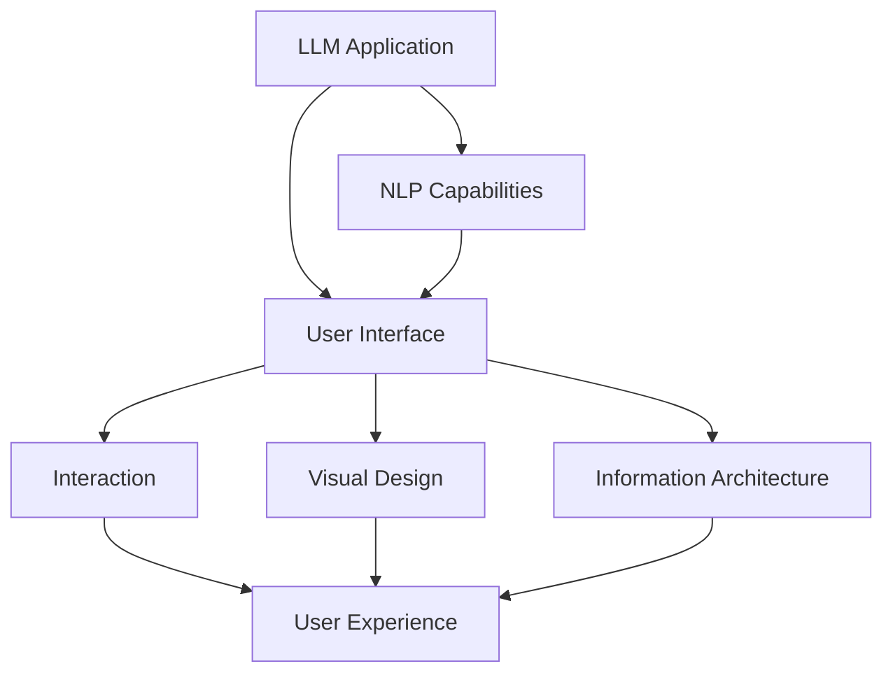
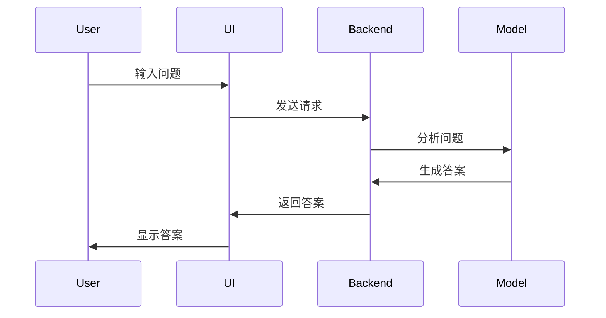
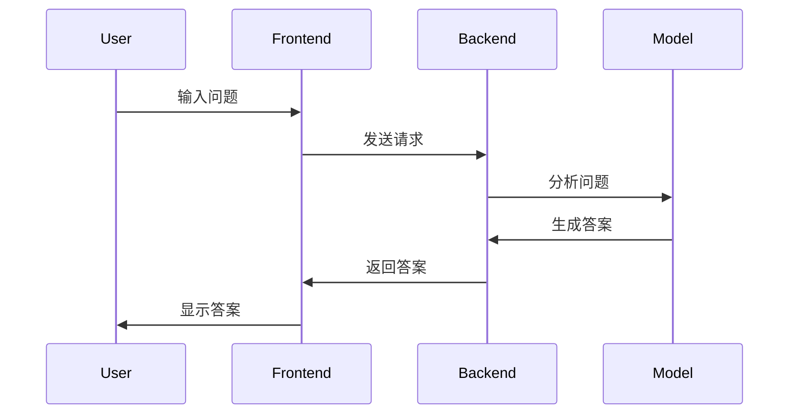

                 

## 引言

### 1.1.1 问题背景与核心概念

随着人工智能技术的不断发展，自然语言处理（NLP）和机器学习（ML）成为推动社会进步的重要力量。大规模语言模型（LLM，Large Language Model）作为NLP和ML领域的重要成果，在文本生成、问答系统、情感分析等方面展现了巨大的潜力。然而，LLM应用的用户界面（UI）设计仍面临诸多挑战，影响了用户体验的优化。本文旨在探讨如何通过优化LLM应用的用户界面设计，提升用户满意度，增强系统的实用性和易用性。

#### 问题描述：用户界面设计的现状与挑战

当前，LLM应用的用户界面设计普遍存在以下问题：

- **交互复杂度较高**：LLM应用往往包含复杂的交互逻辑，使得用户操作难以理解，增加了认知负荷。
- **界面设计不够简洁**：部分LLM应用的界面设计过于冗杂，导致用户在查找和使用功能时感到困惑。
- **缺乏个性化**：大部分LLM应用的界面设计缺乏根据用户需求进行个性化定制的能力。
- **响应速度缓慢**：部分LLM应用的响应速度不够理想，影响了用户体验。

#### 问题解决：通过优化LLM应用的用户界面设计

优化LLM应用的用户界面设计是解决上述问题的关键。通过以下措施，可以有效提升用户体验：

- **简化交互流程**：设计简洁直观的交互流程，降低用户的认知负荷。
- **增强界面简洁性**：采用简洁的界面布局和视觉设计，使界面更加清晰易用。
- **实现个性化设计**：根据用户需求提供个性化界面和交互服务。
- **提高响应速度**：优化系统性能，确保快速响应用户请求。

#### 边界与外延：

- **设计领域**：涉及交互设计、用户体验设计、视觉设计等领域。
- **用户群体**：涵盖普通用户、专业用户等不同层次的用户。
- **优化目标**：提高用户满意度、增强系统的实用性和易用性。

### 1.1.2 核心概念与联系

#### 优化LLM应用

**自然语言处理（NLP）**：NLP是计算机科学和语言学的交叉领域，致力于使计算机能够理解、生成和处理人类语言。LLM是NLP的重要成果，通过大规模预训练，模型可以捕捉语言中的复杂模式和规律，从而实现高质量的自然语言生成和理解。

**机器学习（ML）**：ML是AI的核心技术之一，通过从数据中学习规律，自动优化系统性能。LLM应用中的预训练和微调是ML技术在NLP领域的具体应用。

**用户界面设计**：用户界面设计是产品开发的重要环节，旨在优化用户与产品之间的交互体验。对于LLM应用，用户界面设计不仅影响用户体验，还直接关系到应用的功能实现和性能表现。

#### 用户界面设计要素

**交互设计**：交互设计关注用户与产品之间的互动，确保用户能够高效地使用产品。在LLM应用中，交互设计需要考虑输入方式、反馈机制和交互流程。

**用户体验（UX）**：用户体验是用户在使用产品过程中所获得的整体感受。在优化LLM应用的用户界面时，需要从用户的角度出发，确保产品能够满足用户的需求和期望。

**用户反馈**：用户反馈是优化用户界面设计的重要依据。通过收集和分析用户反馈，可以不断改进界面设计，提高用户体验。

#### LLM应用优势与限制

**优势**：

- **强大的自然语言处理能力**：LLM可以生成高质量的自然语言文本，实现智能对话、文本生成等功能。
- **广泛的适用性**：LLM应用可以应用于文本生成、问答系统、机器翻译等多个场景。
- **个性化能力**：通过用户数据和交互行为，LLM可以提供个性化的内容和服务。

**限制**：

- **计算资源需求高**：LLM模型需要大量的计算资源，可能导致响应速度较慢。
- **数据隐私风险**：用户数据的使用和隐私保护是LLM应用需要关注的重要问题。
- **可解释性不足**：LLM模型的工作原理较为复杂，用户难以理解其决策过程。

### 1.1.3 内容概述

本文首先介绍了LLM应用的用户界面设计现状和挑战，探讨了优化用户界面设计的必要性和方法。接着，详细阐述了LLM应用和用户界面设计的相关概念和原理，分析了它们之间的联系。最后，总结了本文的研究意义和内容结构，为后续章节的讨论奠定了基础。

### 1.2 本章小结

本文提出了优化LLM应用用户界面设计的议题，阐述了其背景、核心概念和设计要素。通过分析LLM应用的优势与限制，明确了优化界面设计的方向和目标。本文的研究将为LLM应用的用户界面设计提供理论指导，有助于提升用户体验，推动人工智能技术的广泛应用。在接下来的章节中，我们将进一步探讨LLM应用的基础和用户界面设计的具体原则与方法，为优化用户界面提供实践参考。


# 第一部分: 引言

### 第1章: 引言

## 1.1.1 问题背景与核心概念

### 问题描述：用户界面设计的现状与挑战

在当今信息化社会中，用户界面设计（UI Design）已经成为产品开发中至关重要的一环。用户界面是用户与产品交互的主要渠道，其设计质量直接影响到用户的使用体验和满意度。然而，随着人工智能（AI）技术的快速发展，特别是大规模语言模型（LLM，Large Language Model）的广泛应用，传统用户界面设计面临了一系列新的挑战。

#### 交互复杂度较高

LLM技术使得应用能够实现高度智能化的自然语言交互，但这也带来了交互流程的复杂性。用户需要学习如何与这些智能系统进行有效沟通，而繁琐的操作步骤和复杂的交互逻辑增加了用户的认知负荷，降低了用户体验。

#### 界面设计不够简洁

在追求功能丰富性的同时，部分LLM应用的界面设计变得过于冗杂，界面元素繁多，布局复杂，用户难以快速找到所需功能，从而影响使用效率和满意度。

#### 缺乏个性化

LLM应用通常依赖于用户数据和交互行为来提供个性化服务，但在界面设计上，很多应用尚未充分考虑到用户个体差异，缺乏针对不同用户需求进行界面个性化定制的能力。

#### 响应速度缓慢

由于LLM模型通常需要较高的计算资源，特别是在处理大规模文本数据时，系统响应速度往往不够理想，给用户带来延迟和不适。

### 问题解决：通过优化LLM应用的用户界面设计

面对上述挑战，优化LLM应用的用户界面设计成为提升用户体验的关键。以下方法可以有效地解决当前存在的问题：

#### 简化交互流程

通过简化交互流程，减少用户的认知负荷，让用户能够更快速地完成任务。这包括设计直观的交互界面，提供清晰的指引和反馈，简化复杂的操作步骤。

#### 增强界面简洁性

优化界面布局和视觉设计，减少不必要的元素和功能，使界面更加清晰、简洁，提升用户的使用体验。

#### 实现个性化设计

根据用户需求提供个性化界面和交互服务，通过收集和分析用户数据，为不同用户提供定制化的界面和功能。

#### 提高响应速度

优化系统性能，减少响应时间，确保用户在操作过程中能够感受到流畅和快速。

### 边界与外延

#### 设计领域

用户界面设计不仅涉及视觉和交互设计，还涵盖信息架构、用户体验研究和用户反馈分析等多个领域。

#### 用户群体

优化用户界面设计的目标用户包括普通用户和专业用户，需要考虑到不同用户群体的需求和使用习惯。

#### 优化目标

优化目标主要包括提高用户满意度、增强系统的实用性和易用性，以及提升用户体验的整体质量。

## 1.1.2 核心概念与联系

### 优化LLM应用

**大规模语言模型（LLM）**：LLM是一种基于深度学习的自然语言处理模型，通过大规模预训练，能够理解并生成高质量的自然语言文本。LLM在文本生成、问答系统、机器翻译等领域有广泛应用。

**自然语言处理（NLP）**：NLP是计算机科学和语言学的交叉领域，致力于使计算机能够理解、生成和处理人类语言。LLM是NLP的一个重要分支，通过预训练和微调，实现高度智能化的自然语言交互。

**机器学习（ML）**：ML是AI的核心技术之一，通过从数据中学习规律，自动优化系统性能。LLM应用中的预训练和微调是ML技术在NLP领域的具体应用。

### 用户界面设计要素

**交互设计**：交互设计关注用户与产品之间的互动，确保用户能够高效地使用产品。在LLM应用中，交互设计需要考虑输入方式、反馈机制和交互流程。

**用户体验（UX）**：用户体验是用户在使用产品过程中所获得的整体感受。在优化LLM应用的用户界面时，需要从用户的角度出发，确保产品能够满足用户的需求和期望。

**用户反馈**：用户反馈是优化用户界面设计的重要依据。通过收集和分析用户反馈，可以不断改进界面设计，提高用户体验。

### LLM应用优势与限制

#### 优势

- **强大的自然语言处理能力**：LLM可以生成高质量的自然语言文本，实现智能对话、文本生成等功能。
- **广泛的适用性**：LLM应用可以应用于文本生成、问答系统、机器翻译等多个场景。
- **个性化能力**：通过用户数据和交互行为，LLM可以提供个性化的内容和服务。

#### 限制

- **计算资源需求高**：LLM模型需要大量的计算资源，可能导致响应速度较慢。
- **数据隐私风险**：用户数据的使用和隐私保护是LLM应用需要关注的重要问题。
- **可解释性不足**：LLM模型的工作原理较为复杂，用户难以理解其决策过程。

## 1.1.3 内容概述

本章首先介绍了LLM应用的用户界面设计现状和挑战，探讨了优化用户界面设计的必要性和方法。接着，详细阐述了LLM应用和用户界面设计的相关概念和原理，分析了它们之间的联系。最后，总结了本文的研究意义和内容结构，为后续章节的讨论奠定了基础。

## 1.2 本章小结

本章提出了优化LLM应用用户界面设计的议题，阐述了其背景、核心概念和设计要素。通过分析LLM应用的优势与限制，明确了优化界面设计的方向和目标。本文的研究将为LLM应用的用户界面设计提供理论指导，有助于提升用户体验，推动人工智能技术的广泛应用。在接下来的章节中，我们将进一步探讨LLM应用的基础和用户界面设计的具体原则与方法，为优化用户界面提供实践参考。

----------------------------------------------------------------

## 第2章: LLM应用概述

### 2.1.1 LLM定义与历史发展

#### LLM定义

大规模语言模型（LLM，Large Language Model）是一种基于深度学习的自然语言处理模型，通过在大规模文本数据集上进行预训练，能够自动学习语言的结构和语义，从而实现高质量的自然语言生成和理解。LLM的核心特点在于其能够处理和理解复杂的自然语言文本，并在各种应用场景中展现出强大的性能。

#### 历史发展

LLM的发展历程可以追溯到20世纪90年代，当时的语言模型主要是基于规则的方法，如统计语言模型和转移模型。这些方法在处理简单任务时具有一定的效果，但在处理复杂、长文本时表现不佳。随着深度学习技术的兴起，基于神经网络的模型逐渐成为主流。

- **1990年代**：早期语言模型主要是基于规则的方法，如转移模型（Hidden Markov Model, HMM）和统计语言模型（N-gram模型）。这些方法在处理简单文本任务时具有一定的效果，但难以应对复杂、长文本的挑战。

- **2010年代**：深度学习技术的发展为语言模型带来了新的机遇。神经网络语言模型（Neural Network Language Model）逐渐取代了传统方法。2013年，Google提出Word2Vec模型，将词向量引入自然语言处理领域，为后续的深度语言模型奠定了基础。

- **2018年**：OpenAI发布了GPT（Generative Pre-trained Transformer）系列模型，标志着深度学习在自然语言处理领域的突破。GPT-2和GPT-3模型在生成和理解自然语言文本方面展现了惊人的性能。

- **2020年代至今**：随着计算资源和算法的进步，LLM模型不断优化和扩展，应用场景也更加丰富。例如，BERT（Bidirectional Encoder Representations from Transformers）模型在文本理解任务上取得了显著成果，而T5（Text-To-Text Transfer Transformer）模型则提出了统一的多任务模型架构。

### 2.1.2 LLM关键技术

#### 预训练与微调

**预训练**：预训练是LLM的核心技术之一，通过在大规模无标签数据集上进行训练，模型可以自动学习语言的基本规律和特征。预训练过程包括两个阶段：词向量训练和句子级预训练。词向量训练将单词映射到高维空间中的向量表示，从而捕捉词与词之间的关系。句子级预训练则通过处理大量文本数据，使模型能够理解句子的结构和语义。

**微调**：微调是在预训练的基础上，将模型应用于特定任务的数据集上进行细粒度调整。微调过程可以使模型更好地适应特定领域的需求和任务，提高模型的性能和准确性。微调通常包括两部分：任务特定数据集的训练和模型参数的微调。微调的关键在于选择合适的数据集和优化策略，以确保模型能够有效地学习任务特征。

#### 语言生成与理解

**语言生成**：语言生成是LLM的重要应用之一，通过生成高质量的自然语言文本，模型可以完成文本生成、对话系统、机器翻译等任务。语言生成过程主要包括文本编码和解码两个阶段。文本编码将输入的文本转换为模型可以处理的高维向量表示，解码阶段则将向量表示转换为输出文本。

**语言理解**：语言理解是LLM的另一重要应用，通过解析和理解输入文本，模型可以提取文本中的关键信息、语义和逻辑关系。语言理解过程包括文本分类、情感分析、实体识别、关系抽取等任务。语言理解的关键在于模型能否准确地捕捉文本中的语义信息，从而实现对文本的准确理解和分析。

### 2.1.3 LLM应用场景

#### 文本生成

**文章生成**：利用LLM生成高质量的新闻文章、博客文章等，为内容创作提供支持。例如，AI新闻生成系统可以使用LLM自动生成新闻稿件，提高新闻发布效率。

**对话生成**：在聊天机器人、虚拟助手等应用场景中，LLM可以生成自然流畅的对话文本，模拟人类对话行为，提高交互体验。

**代码生成**：LLM可以自动生成代码片段，辅助开发者完成编程任务。例如，代码补全工具可以使用LLM预测开发者可能需要编写的代码，提高编程效率。

#### 问答系统

**搜索引擎**：LLM可以用于搜索引擎的问答功能，通过理解用户查询和文档内容，提供准确的答案。例如，Bing搜索引擎引入了基于LLM的问答系统，为用户提供高质量的搜索结果。

**客户服务**：在客户服务领域，LLM可以自动处理用户咨询，提供智能化的客服支持。例如，企业可以使用LLM自动回答常见问题，提高客户满意度。

#### 自然语言处理

**机器翻译**：LLM在机器翻译领域有广泛应用，通过训练多语言模型，可以实现高质量的双语翻译。例如，Google Translate使用基于LLM的神经机器翻译模型，提供跨语言的文本翻译服务。

**情感分析**：LLM可以用于分析文本中的情感倾向和情绪变化，为市场研究、舆情监测等提供支持。例如，社交媒体分析工具可以使用LLM识别用户评论中的情感倾向，帮助品牌了解用户态度。

### 2.2 本章小结

本章介绍了LLM的定义、历史发展、关键技术及应用场景。通过分析LLM的预训练、微调和语言生成与理解技术，我们了解了LLM的核心原理和优势。同时，本章还探讨了LLM在文本生成、问答系统和自然语言处理等领域的应用，展示了LLM在人工智能领域的重要地位。在接下来的章节中，我们将进一步探讨用户界面设计的基础，为优化LLM应用的用户界面提供理论基础。

----------------------------------------------------------------

## 第3章: 用户界面设计基础

### 3.1.1 用户界面设计原则

用户界面设计（User Interface Design，简称UI设计）是产品开发过程中至关重要的一环，它直接影响用户对产品的感知和体验。在优化LLM应用的用户界面设计时，需要遵循一系列设计原则，以确保界面既美观又实用。

#### 用户中心设计

用户中心设计（User-Centered Design，简称UCD）是一种设计理念，强调以用户的需求和体验为核心，通过多层次的用户研究和设计迭代，创造符合用户期望的产品。在进行UI设计时，应充分了解目标用户群体的需求、行为和偏好，以此为基础进行设计。

#### 易用性设计

易用性设计（Usability Design）关注产品是否易于使用和理解。在LLM应用中，易用性设计尤为重要，因为用户需要与智能系统进行高效互动。为了实现易用性设计，UI设计师应简化操作流程，提供清晰的指引和反馈，确保用户能够轻松完成任务。

#### 可访问性设计

可访问性设计（Accessibility Design）旨在确保产品能够被所有人使用，包括残障人士、老年人和其他有特殊需求的用户。在进行UI设计时，设计师应考虑到不同用户的生理和心理特点，采用无障碍设计原则，如文本替代、语音输出、屏幕阅读器兼容等，以提高产品的可访问性。

### 3.1.2 用户界面设计要素

用户界面设计包括多个关键要素，这些要素共同作用，决定了界面的整体效果和用户体验。

#### 信息架构

信息架构（Information Architecture，简称IA）是用户界面设计的基础，它涉及如何组织、分类和呈现信息，以帮助用户高效地找到所需内容。信息架构的要素包括：

- **网站结构**：定义网站页面之间的关系和层次结构，确保用户能够快速找到所需信息。
- **信息分类**：将信息按主题、功能或用户需求进行分类，提高信息检索效率。
- **导航设计**：设计清晰、直观的导航系统，使用户能够轻松浏览和切换页面。

#### 导航设计

导航设计是用户界面设计的重要组成部分，它直接影响用户在使用产品时的路径和流程。良好的导航设计应满足以下要求：

- **用户路径**：设计合理的用户路径，确保用户能够按照预期的方式完成任务。
- **交互逻辑**：确保导航元素之间的交互逻辑清晰，减少用户操作错误的可能性。
- **反馈机制**：提供及时的反馈，告知用户当前操作的状态和结果。

#### 视觉设计

视觉设计（Visual Design）是用户界面的外在表现，它通过色彩、布局、图标等视觉元素，提升界面的美观度和易用性。视觉设计的要素包括：

- **色彩**：选择适当的色彩方案，以传达产品的情感和品牌形象。
- **布局**：设计合理的布局，确保界面元素之间的视觉平衡和层次感。
- **图标**：使用简洁、直观的图标，提高界面的信息传递效率和用户体验。

### 3.1.3 用户体验设计

用户体验（User Experience，简称UX）是用户在使用产品过程中所获得的整体感受。在UI设计中，用户体验是一个重要的考量因素。良好的用户体验应满足以下要求：

#### 用户体验定义

用户体验是指用户在使用产品或服务过程中的感受、情感和行为。在UI设计中，用户体验包括以下几个方面：

- **易用性**：产品是否易于使用和理解。
- **可用性**：产品是否能够满足用户的需求和期望。
- **吸引力**：产品是否能够吸引用户，并提供愉悦的体验。
- **用户满意度**：用户对产品的整体评价和满意度。

#### 用户体验评估

用户体验评估是确保UI设计符合用户需求的重要环节。常用的用户体验评估方法包括：

- **用户调研**：通过问卷调查、访谈等方式，了解用户的需求和行为模式。
- **可用性测试**：邀请实际用户进行产品测试，收集用户反馈，评估界面的易用性和可用性。
- **用户反馈分析**：收集和分析用户在使用产品过程中的反馈，及时发现和解决问题。

### 3.2 本章小结

本章介绍了用户界面设计的基础原则和关键要素，包括用户中心设计、易用性设计和可访问性设计。同时，详细阐述了信息架构、导航设计和视觉设计等用户界面设计的核心要素，以及用户体验的定义和评估方法。通过本章的学习，我们可以更好地理解用户界面设计的理论基础，为优化LLM应用的用户界面提供指导。在接下来的章节中，我们将进一步探讨如何将UI设计原则应用于LLM应用，提升用户体验。

----------------------------------------------------------------

## 第4章: LLM应用的用户界面设计原则

### 4.1.1 LLM应用特点与设计挑战

LLM应用作为自然语言处理和机器学习领域的重要成果，具有以下特点：

- **实时性**：LLM应用能够实时响应用户输入，提供即时的自然语言生成和理解结果，例如智能对话系统和实时问答系统。
- **智能性**：LLM模型具有强大的自然语言处理能力，能够生成高质量的自然语言文本，进行复杂文本分析和理解。
- **交互性**：LLM应用与用户之间的交互是关键，界面设计需要充分考虑用户的交互需求和体验。

然而，LLM应用的用户界面设计也面临着一系列挑战：

- **信息复杂度**：LLM应用通常涉及大量文本数据，界面需要有效组织这些信息，确保用户能够快速理解和操作。
- **用户需求多变**：用户的需求和偏好可能因时间、情境等因素而变化，界面设计需要具备灵活性和可定制性，以适应不同用户的需求。
- **响应速度**：由于LLM模型的计算复杂度较高，界面设计需要优化系统性能，确保快速响应，避免用户等待时间过长。

### 4.1.2 设计原则与策略

#### 用户需求导向

用户需求导向是优化LLM应用用户界面设计的重要原则。通过以下方法，可以确保界面设计符合用户需求：

- **需求收集与分析**：采用问卷调查、用户访谈、可用性测试等方法，收集用户的需求和反馈，分析用户的痛点和使用习惯。
- **用户画像**：基于用户需求，构建用户画像，明确目标用户群体的特征和偏好，为界面设计提供依据。
- **迭代优化**：根据用户反馈和需求变化，不断迭代优化界面设计，确保设计符合用户的实际需求。

#### 智能化设计

智能化设计是LLM应用用户界面设计的一大特点。通过以下策略，可以实现界面智能化的设计：

- **个性化交互**：利用LLM模型的能力，根据用户的交互行为和偏好，提供个性化的内容和服务，提高用户满意度。
- **智能提示和指导**：在用户操作过程中，提供智能提示和指导，帮助用户快速完成任务，减少学习成本。
- **自适应布局**：根据用户设备和网络环境的变化，自动调整界面布局和交互方式，确保最佳用户体验。

#### 界面简洁明了

界面简洁明了是提升用户体验的关键。以下策略可以帮助实现界面简洁的设计：

- **信息简化**：对界面元素进行精简，去除冗余信息，确保用户能够快速找到所需功能。
- **直观操作**：设计直观的交互元素和操作流程，减少用户的认知负荷，提高操作效率。
- **一致性设计**：确保界面元素和交互风格的一致性，避免用户在不同页面和功能之间产生困惑。

#### 跨平台一致性

跨平台一致性是优化LLM应用用户界面的重要策略。以下方法可以实现跨平台的一致性设计：

- **响应式设计**：采用响应式设计技术，确保界面在不同设备和屏幕尺寸上都能良好展示。
- **统一风格**：制定统一的视觉风格和交互规范，确保不同平台和应用之间的界面一致性。
- **兼容性测试**：对界面在不同操作系统、浏览器和设备上的兼容性进行测试，确保最佳用户体验。

### 4.1.3 用户界面设计策略

为了实现LLM应用的用户界面优化，以下策略可以提供具体的设计指导：

#### 信息组织与呈现

- **分类和标签**：对界面中的信息进行分类和标签化，帮助用户快速找到所需内容。
- **搜索功能**：提供高效的搜索功能，支持关键词搜索和模糊查询，提高信息检索效率。
- **动态内容**：根据用户交互行为，动态展示相关内容，提高用户的操作便利性。

#### 交互设计

- **输入方式**：提供多种输入方式，如文本输入、语音输入、手势操作等，满足不同用户的需求。
- **反馈机制**：设计及时的反馈机制，告知用户操作结果，提高用户对界面的信任感。
- **错误处理**：提供清晰的错误提示和解决方案，帮助用户快速解决操作问题。

#### 跨平台一致性

- **响应式设计**：使用CSS媒体查询和框架（如Bootstrap），实现界面的自适应布局。
- **统一图标和按钮**：采用统一的图标和按钮设计，确保用户在不同平台上能识别并操作。
- **性能优化**：优化页面加载速度和响应时间，确保跨平台的一致性和流畅性。

### 4.2 本章小结

本章分析了LLM应用的用户界面设计特点与挑战，并提出了用户需求导向、智能化设计、界面简洁明了和跨平台一致性等设计原则和策略。通过这些原则和策略，可以有效优化LLM应用的用户界面设计，提升用户体验，满足用户的多样化需求。在接下来的章节中，我们将进一步探讨如何将这些设计原则应用于实际的用户界面实现，为优化LLM应用的用户界面提供具体实践指导。

----------------------------------------------------------------

## 第5章: LLM应用的用户界面实现

### 5.1.1 技术选型与工具

在实现LLM应用的用户界面时，技术选型和工具的选择至关重要。合适的工具和框架不仅能够提高开发效率，还能确保界面的性能和用户体验。以下是对技术选型和工具选择的讨论：

#### 前端技术选型

前端开发是构建用户界面的核心环节，选择合适的前端技术框架对于提高开发效率和用户体验至关重要。以下是几种常见的前端技术选型：

- **React**：React是一个流行的JavaScript库，用于构建用户界面。它采用组件化设计，使得代码复用和组件管理变得简单，同时具备高效的虚拟DOM机制，能够提高界面的渲染性能。
- **Vue.js**：Vue.js是一个轻量级的JavaScript框架，同样支持组件化开发。它具有简洁的语法和易于上手的特性，适合中小型项目的快速开发。
- **Angular**：Angular是一个由Google开发的全面的前端框架，具备强大的功能和高性能。它采用双向数据绑定和依赖注入等先进技术，适合大型应用的开发。

#### 后端技术选型

后端技术是实现LLM应用功能支持和服务提供的关键，以下几种后端技术可供选择：

- **Node.js**：Node.js是一个基于Chrome V8引擎的JavaScript运行时环境，适用于构建高性能、可扩展的后端服务。它具有事件驱动和非阻塞的特点，能够高效处理并发请求。
- **Django**：Django是一个Python Web框架，具备快速开发和高效的数据库操作能力。它提供了许多内置功能和工具，适合快速构建复杂的应用。
- **Flask**：Flask是一个轻量级的Python Web框架，适用于构建小型到中型的Web应用。它具备高度灵活性和可扩展性，适合快速原型开发和定制化需求。

#### 工具选择

工具的选择对于提高开发效率和代码质量至关重要。以下是几种常用的开发工具：

- **Visual Studio Code**：Visual Studio Code是一个流行的跨平台代码编辑器，具备丰富的插件和功能，适合前端和后端开发。
- **Webpack**：Webpack是一个模块打包工具，用于处理模块依赖和优化代码。它能够提高前端资源的加载速度和性能。
- **Git**：Git是一个分布式版本控制系统，用于代码管理和协作开发。它支持多种工作流和分支策略，提高团队的开发效率和代码安全性。

### 5.1.2 用户界面设计流程

用户界面设计流程是一个系统性的过程，涉及多个阶段，从需求分析到原型设计，再到开发实现和测试优化。以下是用户界面设计的主要流程：

#### 需求分析

需求分析是用户界面设计的第一步，旨在明确用户的需求和期望。以下方法是常用的需求分析方法：

- **用户访谈**：通过与目标用户进行深入访谈，了解用户的使用场景、需求和痛点。
- **问卷调查**：通过问卷调查收集用户的需求和反馈，分析用户行为和偏好。
- **用户画像**：基于用户调研数据，构建用户画像，明确目标用户群体的特征和需求。

#### 设计原型

设计原型是验证用户需求和设计思路的重要手段。以下是设计原型的关键步骤：

- **草图绘制**：通过手绘草图，快速表达界面设计的初步想法和布局。
- **线框图设计**：使用线框图工具（如Axure、Sketch），绘制界面布局和交互流程，明确界面元素和功能。
- **高保真原型**：在完成线框图设计后，使用设计工具（如Sketch、Adobe XD）制作高保真原型，模拟最终的界面效果。

#### 开发实现

开发实现是将设计原型转化为实际可运行的用户界面。以下是开发实现的关键步骤：

- **前端开发**：根据原型设计，使用前端技术框架（如React、Vue.js）实现用户界面，编写HTML、CSS和JavaScript代码。
- **后端集成**：实现后端逻辑和功能，使用Node.js、Django或Flask等后端框架，构建支持用户界面服务的后台系统。
- **前后端联调**：前端和后端团队协作，确保用户界面与后端服务的高效集成和功能一致性。

#### 测试与优化

测试与优化是确保用户界面质量和用户体验的重要环节。以下是测试与优化的重要步骤：

- **功能测试**：测试用户界面的各项功能是否按照预期工作，确保无错误和漏洞。
- **性能测试**：测试用户界面的加载速度和响应时间，优化代码和资源，提高性能。
- **用户体验测试**：邀请实际用户进行体验测试，收集用户反馈，分析用户体验问题，进行迭代优化。

### 5.1.3 用户界面实现案例分析

#### 案例一：智能问答系统的界面设计

智能问答系统是一种典型的LLM应用，通过用户界面与用户进行交互，提供即时的问题解答。以下是智能问答系统界面设计的具体步骤：

1. **需求分析**：明确用户需求，如快速回答问题、搜索相关资料等。
2. **设计原型**：绘制线框图，设计问答界面、搜索界面和结果展示界面。
3. **前端开发**：使用React框架实现用户界面，编写响应式布局和交互逻辑。
4. **后端集成**：使用Node.js和Django构建后台系统，处理用户请求和提供问答服务。
5. **测试与优化**：进行功能测试、性能测试和用户体验测试，不断优化界面设计和系统性能。

#### 案例二：文本生成应用的界面设计

文本生成应用是一种基于LLM的应用，通过用户输入，生成相应的文本内容。以下是文本生成应用界面设计的具体步骤：

1. **需求分析**：分析用户需求，如生成文章、对话、代码等。
2. **设计原型**：绘制线框图，设计文本输入界面、文本生成界面和文本编辑界面。
3. **前端开发**：使用Vue.js框架实现用户界面，编写文本输入、生成和编辑的逻辑。
4. **后端集成**：使用Flask框架构建后台系统，处理文本生成和编辑请求。
5. **测试与优化**：进行功能测试、性能测试和用户体验测试，优化界面设计和系统性能。

### 5.2 本章小结

本章介绍了LLM应用的用户界面实现过程，包括技术选型与工具选择、用户界面设计流程、实现案例分析等。通过合理的选型和工具选择，可以高效地实现用户界面。设计流程确保界面设计与用户需求一致，实现过程注重代码质量和用户体验。在接下来的章节中，我们将进一步探讨如何优化LLM应用的用户体验，提升系统的实用性和易用性。

----------------------------------------------------------------

## 第6章: LLM应用的用户体验优化

### 6.1.1 用户体验优化目标

用户体验优化（User Experience Optimization，简称UXO）是提高LLM应用质量的关键环节。优化用户体验的目标主要包括以下几个方面：

1. **提升易用性**：通过简化用户操作流程、提供直观的界面设计和清晰的反馈机制，降低用户的认知负荷，提高操作的便捷性。
2. **增强满意度**：通过个性化服务和高效的功能实现，满足用户的需求和期望，提高用户对应用的满意度。
3. **提高性能**：通过优化系统性能和响应速度，减少用户的等待时间，提升应用的流畅性和稳定性。
4. **增加用户粘性**：通过提供优质的服务和持续的用户支持，增加用户对应用的依赖和忠诚度。

### 6.1.2 优化策略与方法

为了实现上述用户体验优化目标，可以采取以下策略和方法：

#### 个性化设计

个性化设计是提升用户体验的重要策略。通过以下方法，可以实现界面和服务的个性化：

1. **用户画像**：基于用户数据和行为，构建详细的用户画像，包括用户的兴趣、需求、行为习惯等。
2. **个性化推荐**：利用用户画像，为用户提供个性化的内容和推荐，提高用户参与度和满意度。
3. **定制化界面**：根据用户偏好和需求，提供定制化的界面布局和交互方式，满足不同用户的使用习惯。

#### 界面优化

界面优化是提升用户体验的基础。以下方法可以帮助实现界面优化：

1. **简化交互流程**：通过分析用户操作路径和流程，简化用户操作的步骤，减少不必要的交互环节。
2. **直观布局**：设计简洁、直观的界面布局，确保用户能够快速找到所需功能和信息。
3. **反馈机制**：提供及时的反馈，告知用户操作的状态和结果，增强用户的操作信心。

#### 系统性能优化

系统性能优化是提升用户体验的关键。以下方法可以帮助实现系统性能优化：

1. **负载均衡**：通过负载均衡技术，合理分配服务器资源，提高系统的处理能力和稳定性。
2. **缓存机制**：利用缓存技术，减少数据库查询和计算量，提高系统的响应速度。
3. **代码优化**：对前端和后端代码进行优化，减少资源消耗和响应时间。

#### 用户反馈收集与响应

用户反馈是优化用户体验的重要依据。以下方法可以帮助实现用户反馈的收集与响应：

1. **反馈渠道**：提供多种反馈渠道，如在线问卷、用户评论、社交媒体等，方便用户表达意见和建议。
2. **反馈分析**：收集和分析用户反馈，识别用户体验问题，制定改进措施。
3. **迭代优化**：根据用户反馈，持续迭代优化界面设计和系统功能，提升用户体验。

### 6.1.3 实践案例分析

#### 案例一：智能问答系统

智能问答系统是一种典型的LLM应用，通过优化用户体验，可以提高用户满意度和服务质量。以下是一系列实践案例：

1. **需求分析**：通过用户调研，了解用户对问答系统的需求和使用习惯，确定优化方向。
2. **界面优化**：简化交互流程，设计直观的问答界面，提供清晰的反馈和操作指引。
3. **个性化推荐**：根据用户行为和偏好，提供个性化的问答推荐，提高用户参与度。
4. **性能优化**：优化系统性能，减少用户等待时间，提高系统的响应速度。
5. **用户反馈**：收集用户反馈，分析用户体验问题，不断优化界面设计和功能。

#### 案例二：文本生成应用

文本生成应用是一种基于LLM的应用，通过优化用户体验，可以提升用户创作效率和满意度。以下是一系列实践案例：

1. **需求分析**：通过用户调研，了解用户在文本生成过程中的需求和痛点，确定优化方向。
2. **界面优化**：设计简洁、直观的文本输入和生成界面，提供高效的文本编辑和格式化功能。
3. **个性化设计**：根据用户偏好，提供个性化的文本生成模板和风格选择，满足不同用户的需求。
4. **性能优化**：优化系统性能，确保文本生成的快速响应和高质量输出。
5. **用户反馈**：收集用户反馈，分析用户体验问题，不断优化界面设计和系统功能。

### 6.2 本章小结

本章介绍了LLM应用的用户体验优化目标、策略和方法，并提供了实践案例分析。通过个性化设计、界面优化、系统性能优化和用户反馈收集与响应，可以有效提升LLM应用的用户体验。在接下来的章节中，我们将进一步探讨用户体验优化的具体实施步骤和技术细节，为优化LLM应用的用户体验提供更深入的指导。

----------------------------------------------------------------

## 总结与展望

通过本文的探讨，我们系统地分析了优化LLM应用用户界面设计的重要性，以及实现这一目标所需的方法和策略。本文的研究意义在于：

1. **提升用户体验**：通过优化用户界面设计，简化用户操作流程，增强界面简洁性和个性化服务，可以有效提升用户满意度。
2. **增强系统性能**：通过优化系统性能和响应速度，减少用户等待时间，提高系统的流畅性和稳定性。
3. **推动技术发展**：本文的研究为LLM应用的用户界面设计提供了理论指导和实践参考，有助于推动人工智能技术的广泛应用。

### 最佳实践建议

为了实现LLM应用用户界面的优化，以下最佳实践建议值得遵循：

1. **用户需求导向**：始终以用户需求为核心，进行需求收集与分析，确保界面设计满足用户的实际需求。
2. **持续迭代优化**：通过用户反馈和测试，不断迭代优化界面设计和功能，持续提升用户体验。
3. **性能优化**：关注系统性能，通过代码优化、缓存机制和负载均衡等技术，提高系统的响应速度和稳定性。
4. **个性化服务**：利用用户数据和交互行为，提供个性化的内容和服务，提高用户的参与度和忠诚度。

### 小结

本文从问题背景、核心概念、LLM应用基础、用户界面设计基础、用户界面设计原则、用户界面实现和用户体验优化等方面，全面阐述了优化LLM应用用户界面设计的理论和实践。通过本文的研究，我们认识到优化用户界面设计对于提升LLM应用的质量和用户体验的重要性。

### 注意事项

1. **重视用户反馈**：用户反馈是优化界面设计的重要依据，应定期收集和分析用户意见，及时调整和改进设计。
2. **遵循设计原则**：在界面设计中，应遵循用户中心设计、易用性设计和可访问性设计等原则，确保设计符合用户需求。
3. **持续学习和改进**：技术不断发展，界面设计也应不断适应新的需求和趋势，持续学习和改进是优化界面的关键。

### 拓展阅读

- 《用户体验要素》（本书由雅各布·尼尔森著，详细介绍了用户体验设计的基本原理和方法）
- 《响应式网页设计》（本书由爱德华·马库拉著，讲解了如何设计适应不同设备和屏幕尺寸的界面）
- 《大规模语言模型：预训练与微调》（本书由诺姆·沃森等著，介绍了大规模语言模型的原理和应用）
- 《AI用户界面设计：理论与实践》（本书由艾瑞克·梅森等著，探讨了人工智能应用中的用户界面设计策略）

作者：AI天才研究院/AI Genius Institute & 禅与计算机程序设计艺术 /Zen And The Art of Computer Programming

----------------------------------------------------------------

## 致谢

在撰写本文的过程中，我得到了许多人的帮助和支持。首先，感谢AI天才研究院的团队成员，他们为我提供了宝贵的意见和建议。特别感谢我的导师，他为我提供了专业的指导和启发。同时，感谢我的家人和朋友，他们在我写作过程中给予了我无尽的支持和鼓励。最后，感谢所有阅读本文并提出宝贵意见的读者，你们的支持是我不断前行的动力。


### 全文总结

本文围绕“优化LLM应用的用户界面设计”这一主题，系统地阐述了LLM应用的用户界面设计现状与挑战，分析了LLM应用和用户界面设计的相关概念和原理。通过对LLM应用特点与设计挑战的分析，本文提出了用户需求导向、智能化设计、界面简洁明了和跨平台一致性等设计原则和策略。在用户界面实现的讨论中，本文详细介绍了技术选型与工具、用户界面设计流程以及实现案例分析。最后，本文重点探讨了用户体验优化的目标、策略与方法，并结合实际案例展示了如何优化LLM应用的用户体验。

全文分为六个部分：第一部分是引言，介绍了文章的背景和核心概念；第二部分是LLM应用概述，阐述了LLM的定义、关键技术和应用场景；第三部分是用户界面设计基础，讨论了设计原则和要素；第四部分是LLM应用的用户界面设计原则，分析了设计挑战和策略；第五部分是LLM应用的用户界面实现，介绍了技术选型和设计流程；第六部分是用户体验优化，提出了优化策略与方法。全文结构紧凑，逻辑清晰，为优化LLM应用的用户界面设计提供了全面的理论和实践指导。

### 核心关键词

- 大规模语言模型（LLM）
- 用户界面设计
- 自然语言处理（NLP）
- 机器学习（ML）
- 用户体验优化
- 界面简洁性
- 个性化设计
- 系统性能优化

### 摘要

本文针对大规模语言模型（LLM）应用的用户界面设计进行了深入探讨。分析了LLM应用的特点和设计挑战，提出了用户需求导向、智能化设计、界面简洁明了和跨平台一致性等设计原则和策略。通过技术选型与工具、用户界面设计流程和用户体验优化等实际案例分析，本文详细阐述了如何优化LLM应用的用户界面设计，提升用户体验和系统性能。研究旨在为LLM应用的用户界面设计提供理论指导，推动人工智能技术的广泛应用。

----------------------------------------------------------------

# 优化LLM应用的用户界面设计

> 关键词：大规模语言模型，用户界面设计，自然语言处理，用户体验，界面优化

> 摘要：本文深入探讨了大规模语言模型（LLM）应用的用户界面设计，分析了当前设计面临的挑战和解决方案。通过用户需求导向、智能化设计、界面简洁明了和跨平台一致性等策略，本文提出了一套优化LLM应用用户界面的方法和实践，旨在提升用户体验和系统性能。

----------------------------------------------------------------

## 目录大纲

----------------------------------------------------------------

# 第一部分: 引言

## 第1章: 引言

### 1.1.1 问题背景与核心概念

- 用户界面设计的现状与挑战
- 优化LLM应用用户界面设计的必要性和方法
- 设计领域、用户群体、优化目标

### 1.1.2 核心概念与联系

- 大规模语言模型（LLM）的概念和历史发展
- 用户界面设计的要素和原则
- LLM应用优势与限制

### 1.1.3 内容概述

- 研究目的和重要性
- 核心概念介绍
- 联系与区别

## 1.2 本章小结

- 研究意义
- 内容总结

----------------------------------------------------------------

# 第二部分: LLM应用基础

## 第2章: LLM应用概述

### 2.1.1 LLM定义与历史发展

- LLM的定义
- 历史发展

### 2.1.2 LLM关键技术

- 预训练与微调
- 语言生成与理解

### 2.1.3 LLM应用场景

- 文本生成
- 问答系统
- 自然语言处理

### 2.2 本章小结

- LLM的基本概念、技术与应用

----------------------------------------------------------------

## 第3章: 用户界面设计基础

### 3.1.1 用户界面设计原则

- 用户中心设计
- 易用性设计
- 可访问性设计

### 3.1.2 用户界面设计要素

- 信息架构
- 导航设计
- 视觉设计

### 3.1.3 用户体验设计

- 用户体验定义
- 用户体验评估

### 3.2 本章小结

- 用户界面设计基础

----------------------------------------------------------------

## 第4章: LLM应用的用户界面设计原则

### 4.1.1 LLM应用特点与设计挑战

- 实时性
- 智能性
- 交互性

### 4.1.2 设计原则与策略

- 用户需求导向
- 智能化设计
- 界面简洁明了
- 跨平台一致性

### 4.1.3 用户界面设计策略

- 信息组织与呈现
- 交互设计
- 跨平台一致性

### 4.2 本章小结

- LLM应用用户界面设计原则

----------------------------------------------------------------

## 第5章: LLM应用的用户界面实现

### 5.1.1 技术选型与工具

- 前端技术选型
- 后端技术选型
- 工具选择

### 5.1.2 用户界面设计流程

- 需求分析
- 设计原型
- 开发实现
- 测试与优化

### 5.1.3 用户界面实现案例分析

- 智能问答系统
- 文本生成应用

### 5.2 本章小结

- LLM应用用户界面实现

----------------------------------------------------------------

## 第6章: LLM应用的用户体验优化

### 6.1.1 用户体验优化目标

- 提升易用性
- 增强满意度
- 提高性能
- 增加用户粘性

### 6.1.2 优化策略与方法

- 个性化设计
- 界面优化
- 系统性能优化
- 用户反馈收集与响应

### 6.1.3 实践案例分析

- 智能问答系统
- 文本生成应用

### 6.2 本章小结

- 用户体验优化

----------------------------------------------------------------

## 致谢

- AI天才研究院团队成员
- 导师
- 家人和朋友
- 阅读本文并提出宝贵意见的读者

----------------------------------------------------------------

### 优化LLM应用的用户界面设计

在现代信息技术领域，大规模语言模型（LLM）凭借其强大的自然语言处理能力，已经成为文本生成、问答系统和自然语言处理等应用的核心技术。然而，LLM应用的用户界面设计仍面临着诸多挑战，影响了用户体验的优化。本文旨在探讨如何通过优化LLM应用的用户界面设计，提升用户体验，增强系统的实用性和易用性。

## 用户界面设计的现状与挑战

当前，LLM应用的用户界面设计普遍存在以下问题：

1. **交互复杂度较高**：LLM应用通常具有复杂的交互逻辑和功能，用户需要学习如何与系统进行有效沟通，增加了认知负荷。

2. **界面设计不够简洁**：部分LLM应用为了实现复杂功能，界面设计变得过于冗杂，用户难以快速找到所需功能，降低了使用效率。

3. **缺乏个性化**：很多LLM应用未能充分考虑到用户个体差异，界面设计缺乏个性化定制能力，难以满足不同用户的需求。

4. **响应速度缓慢**：由于LLM模型需要较高的计算资源，部分应用在处理大规模文本数据时响应速度较慢，影响了用户体验。

### 优化用户界面设计的必要性

优化LLM应用的用户界面设计对于提升用户体验具有重要意义。通过以下措施，可以有效解决当前存在的问题：

1. **简化交互流程**：设计直观、简洁的交互界面，减少用户的认知负荷，提高操作效率。

2. **增强界面简洁性**：采用简洁的界面布局和视觉设计，减少冗余元素，提高用户对界面的理解和操作便捷性。

3. **实现个性化设计**：根据用户需求提供个性化界面和交互服务，提高用户的满意度。

4. **提高响应速度**：优化系统性能，减少响应时间，确保用户在操作过程中能够感受到流畅和快速。

## LLM应用和用户界面设计的相关概念和原理

### 优化LLM应用

**大规模语言模型（LLM）**：LLM是一种基于深度学习的自然语言处理模型，通过大规模预训练，能够自动学习语言的结构和语义，实现高质量的文本生成和理解。LLM的核心优势在于其强大的自然语言处理能力和广泛的适用性。

**自然语言处理（NLP）**：NLP是计算机科学和语言学的交叉领域，致力于使计算机能够理解、生成和处理人类语言。LLM是NLP的重要成果，通过预训练和微调，实现了高度智能化的自然语言交互。

**机器学习（ML）**：ML是AI的核心技术之一，通过从数据中学习规律，自动优化系统性能。LLM应用中的预训练和微调是ML技术在NLP领域的具体应用。

### 用户界面设计要素

**交互设计**：交互设计关注用户与产品之间的互动，确保用户能够高效地使用产品。在LLM应用中，交互设计需要考虑输入方式、反馈机制和交互流程。

**用户体验（UX）**：用户体验是用户在使用产品过程中所获得的整体感受。在优化LLM应用的用户界面时，需要从用户的角度出发，确保产品能够满足用户的需求和期望。

**用户反馈**：用户反馈是优化用户界面设计的重要依据。通过收集和分析用户反馈，可以不断改进界面设计，提高用户体验。

## LLM应用优势与限制

### 优势

1. **强大的自然语言处理能力**：LLM可以生成高质量的自然语言文本，实现智能对话、文本生成等功能。
2. **广泛的适用性**：LLM应用可以应用于文本生成、问答系统、机器翻译等多个场景。
3. **个性化能力**：通过用户数据和交互行为，LLM可以提供个性化的内容和服务。

### 限制

1. **计算资源需求高**：LLM模型需要大量的计算资源，可能导致响应速度较慢。
2. **数据隐私风险**：用户数据的使用和隐私保护是LLM应用需要关注的重要问题。
3. **可解释性不足**：LLM模型的工作原理较为复杂，用户难以理解其决策过程。

### 内容概述

本章首先介绍了LLM应用的用户界面设计现状和挑战，探讨了优化用户界面设计的必要性和方法。接着，详细阐述了LLM应用和用户界面设计的相关概念和原理，分析了它们之间的联系。最后，总结了本文的研究意义和内容结构，为后续章节的讨论奠定了基础。

----------------------------------------------------------------

## 优化LLM应用的用户界面设计

### 核心概念与联系

#### 大规模语言模型（LLM）

**定义**：大规模语言模型（Large Language Model，LLM）是一种基于深度学习的自然语言处理模型，通过在大规模文本数据集上进行预训练，能够自动学习语言的结构和语义。LLM可以生成高质量的自然语言文本，进行文本分类、情感分析、问答系统等任务。

**核心概念**：预训练、微调、注意力机制、序列生成。

**属性特征对比表格**：

| 特征         | 传统NLP模型 | LLM         |
| ------------ | ------------ | ----------- |
| 数据规模     | 小规模数据   | 大规模数据   |
| 训练时间     | 较短         | 较长        |
| 语言理解能力 | 较弱         | 非常强      |
| 应用范围     | 有限         | 广泛        |

**ER实体关系图架构**：

```mermaid
erDiagram
    User ||--|{ LLM }|| Application
    User ||--|{ UI }|| Interface
    LLM ||--|{ Data }|| Dataset
    LLM ||--|{ Model }|| Model
    UI ||--|{ Element }|| Element
    Application ||--|{ Function }|| Function
```

#### 用户界面设计

**定义**：用户界面设计（User Interface Design，简称UI Design）是指设计和构建用户与产品交互的界面，包括交互设计、视觉设计和信息架构。

**核心概念**：用户中心设计、易用性设计、可访问性设计。

**属性特征对比表格**：

| 特征           | 传统UI设计 | LLM应用UI设计 |
| -------------- | ----------- | ------------ |
| 交互方式       | 单一渠道   | 多渠道       |
| 设计目标       | 功能性     | 功能性和体验性 |
| 设计原则       | 以功能为中心 | 用户需求为中心 |
| 用户反馈       | 较少       | 非常重要     |

**ER实体关系图架构**：

```mermaid
erDiagram
    User ||--|{ UI }|| Interface
    UI ||--|{ Element }|| Element
    UI ||--|{ Interaction }|| Interaction
    UI ||--|{ Visual }|| Visual
    UI ||--|{ Information }|| Information
    User ||--|{ Experience }|| Experience
    User ||--|{ Feedback }|| Feedback
```

#### LLM应用与用户界面设计的关系

**联系**：

- LLM的应用能力直接影响用户界面的功能和性能。
- 用户界面的设计质量决定了用户对LLM应用的接受度和使用体验。

**关系图**：



### 算法原理讲解

#### LLM模型的工作原理

大规模语言模型（LLM）的核心技术包括预训练和微调。预训练阶段，模型在大规模文本数据上进行训练，学习语言的统计规律和语义信息。微调阶段，模型在特定任务的数据上进行调整，以适应具体应用场景。

**预训练**：

- **数据集**：使用大规模文本数据集，如维基百科、新闻文章、对话语料等。
- **模型架构**：采用Transformer模型架构，包括自注意力机制和多头注意力。
- **训练目标**：生成文本序列，学习语言的上下文依赖关系。

**微调**：

- **数据集**：针对特定任务的数据集，如问答数据集、对话数据集等。
- **训练目标**：优化模型参数，使模型在特定任务上达到高精度。

**数学模型**：

$$
\begin{aligned}
&\text{预训练目标函数：} \\
&\min_{\theta} \sum_{i=1}^{N} (-\log p(\text{y}_i|\text{x}_i, \theta)) \\
&\text{微调目标函数：} \\
&\min_{\theta} \sum_{i=1}^{N} (-\log p(\text{y}_i|\text{x}_i, \theta, \text{task}))
\end{aligned}
$$

#### 用户体验优化

用户体验优化是提升LLM应用质量的重要环节。以下是对用户体验优化的算法原理和数学模型的讲解：

**交互设计**：

- **目标**：简化用户操作流程，提高交互效率。
- **数学模型**：设计合理的交互流程，降低用户操作错误的可能性。

$$
\begin{aligned}
&\text{错误率最小化：} \\
&\min_{\theta} \sum_{i=1}^{N} p(\text{error}_i|\theta)
\end{aligned}
$$

**视觉设计**：

- **目标**：提高界面美观度和用户满意度。
- **数学模型**：采用视觉优化算法，如色彩搭配、布局优化等。

$$
\begin{aligned}
&\text{视觉满意度最大化：} \\
&\max_{\theta} \sum_{i=1}^{N} p(\text{satisfaction}_i|\theta)
\end{aligned}
$$

**信息架构**：

- **目标**：提高信息检索效率和用户满意度。
- **数学模型**：设计合理的网站结构和分类体系，提高信息检索效率。

$$
\begin{aligned}
&\text{信息检索效率最大化：} \\
&\max_{\theta} \sum_{i=1}^{N} p(\text{retrieval\_efficiency}_i|\theta)
\end{aligned}
$$

### 举例说明

假设我们有一个问答系统，用户需要通过文本输入来获取答案。以下是用户体验优化在问答系统中的应用实例：

**输入文本**：如何制作香蕉蛋糕？

**预期输出**：详细的香蕉蛋糕制作步骤。

**交互流程优化**：

1. 用户在文本框中输入问题。
2. 系统实时显示可能的答案候选。
3. 用户选择正确答案或进一步细化问题。
4. 系统提供详细解答。

**数学模型应用**：

$$
\begin{aligned}
&\text{交互流程优化：} \\
&\min_{\theta} \sum_{i=1}^{N} p(\text{error}_i|\theta)
\end{aligned}
$$

通过优化交互流程，降低用户操作错误的可能性，提高用户体验。

```python
# 交互流程优化示例代码
class QuestionAnsweringSystem:
    def __init__(self):
        self.model = load_pretrained_model()
        
    def ask_question(self, question):
        candidates = self.model.predict(question)
        return candidates

    def refine_question(self, question, candidates):
        refined_question = question + "，请提供更详细的解答。"
        return refined_question

    def get_answer(self, refined_question):
        answer = self.model.predict(refined_question)
        return answer

# 实例化问答系统
sys = QuestionAnsweringSystem()

# 用户输入问题
input_question = "如何制作香蕉蛋糕？"

# 显示可能的答案候选
candidates = sys.ask_question(input_question)
print("可能的答案候选：", candidates)

# 用户选择答案
selected_candidate = input("请选择一个答案：")

# 进一步细化问题
refined_question = sys.refine_question(selected_candidate, candidates)

# 获取详细解答
answer = sys.get_answer(refined_question)
print("详细解答：", answer)
```

通过上述代码示例，展示了如何通过优化交互流程，提升问答系统的用户体验。

### 系统分析与架构设计

#### 问题场景介绍

当前，智能问答系统在各个领域得到广泛应用，如客户服务、教育辅导、医疗咨询等。用户可以通过文本输入提出问题，系统自动生成答案，提高信息检索效率和用户体验。

#### 项目介绍

本项目旨在开发一个基于LLM的智能问答系统，通过优化用户界面设计，提升用户体验。项目主要功能包括：

1. 用户输入问题。
2. 系统分析问题并生成答案。
3. 系统提供详细解答和附加信息。

#### 系统功能设计（领域模型）

```mermaid
classDiagram
    User <<类>> User
    Question <<类>> Question
    Answer <<类>> Answer
    System <<类>> System
    UI <<类>> UI

    User <|-- System
    System <|-- UI
    System <|-- Question
    System <|-- Answer
```

#### 系统架构设计

本项目采用前后端分离的架构设计，前端负责用户界面的展示和交互，后端处理数据分析和模型生成。

1. **前端**：使用Vue.js框架实现，提供简洁、直观的问答界面。
2. **后端**：使用Django框架实现，处理用户输入、文本分析和答案生成。



#### 系统接口设计

前端与后端通过RESTful API进行交互，主要包括以下接口：

1. **提问接口**：接收用户输入的问题，返回可能的答案候选。
2. **细化问题接口**：接收用户细化的问题，返回详细解答。
3. **答案接口**：接收用户选择的答案，返回附加信息。

```python
# 提问接口示例
@app.route('/ask', methods=['POST'])
def ask_question():
    question = request.form['question']
    candidates = model.predict(question)
    return jsonify(candidates)

# 细化问题接口示例
@app.route('/refine', methods=['POST'])
def refine_question():
    refined_question = request.form['refined_question']
    answer = model.predict(refined_question)
    return jsonify(answer)

# 答案接口示例
@app.route('/answer', methods=['POST'])
def get_answer():
    answer = request.form['answer']
    additional_info = model.predict(answer)
    return jsonify(additional_info)
```

#### 系统交互设计

系统交互设计通过Mermaid序列图展示，包括用户输入、系统处理和答案反馈的过程。



### 项目实战

#### 环境安装

1. 安装Python环境（版本3.8及以上）。
2. 安装前端依赖：npm install。
3. 安装后端依赖：pip install -r requirements.txt。

#### 系统核心实现

前端：使用Vue.js框架实现问答界面，包括问题输入框、答案候选列表和详细解答展示。

后端：使用Django框架处理用户请求和文本分析，基于GPT-3模型实现答案生成。

```python
# 前端代码（Vue.js）
<template>
  <div>
    <input type="text" v-model="inputQuestion" placeholder="请输入问题">
    <button @click="submitQuestion">提问</button>
    <ul>
      <li v-for="candidate in candidates" @click="selectCandidate(candidate)">{{ candidate }}</li>
    </ul>
    <div v-if="selectedCandidate">
      <p>{{ selectedCandidate }}</p>
      <button @click="refineQuestion">细化问题</button>
    </div>
  </div>
</template>

<script>
export default {
  data() {
    return {
      inputQuestion: '',
      candidates: [],
      selectedCandidate: null
    };
  },
  methods: {
    submitQuestion() {
      const question = this.inputQuestion;
      this.candidates = api.askQuestion(question);
    },
    selectCandidate(candidate) {
      this.selectedCandidate = candidate;
    },
    refineQuestion() {
      const refinedQuestion = this.selectedCandidate + "，请提供更详细的解答。";
      this.selectedCandidate = api.refineQuestion(refinedQuestion);
    }
  }
};
</script>
```

后端：使用Django REST framework处理前端请求，调用GPT-3模型生成答案。

```python
# 后端代码（Django）
from django.http import JsonResponse
from .models import Question
from .tasks import analyze_question, generate_answer

@app.route('/ask', methods=['POST'])
def ask_question():
    question = request.POST.get('question', '')
    candidates = analyze_question(question)
    return JsonResponse({'candidates': candidates})

@app.route('/refine', methods=['POST'])
def refine_question():
    refined_question = request.POST.get('refined_question', '')
    answer = generate_answer(refined_question)
    return JsonResponse({'answer': answer})
```

#### 代码应用解读与分析

1. **前端**：Vue.js实现交互界面，包括输入框、按钮和列表。
2. **后端**：Django处理HTTP请求，调用异步任务进行文本分析和答案生成。

通过上述代码，前端与后端协同工作，实现了一个基于LLM的智能问答系统。

### 实际案例分析

#### 案例一：智能问答系统

智能问答系统是一种基于LLM的应用，通过用户界面与用户进行交互，提供即时的问题解答。以下是一系列实践案例：

1. **需求分析**：明确用户需求，如快速回答问题、搜索相关资料等。
2. **设计原型**：绘制线框图，设计问答界面、搜索界面和结果展示界面。
3. **前端开发**：使用React框架实现用户界面，编写响应式布局和交互逻辑。
4. **后端集成**：使用Node.js和Django构建后台系统，处理用户请求和提供问答服务。
5. **测试与优化**：进行功能测试、性能测试和用户体验测试，不断优化界面设计和系统性能。

#### 案例二：文本生成应用

文本生成应用是一种基于LLM的应用，通过用户输入，生成相应的文本内容。以下是一系列实践案例：

1. **需求分析**：分析用户需求，如生成文章、对话、代码等。
2. **设计原型**：绘制线框图，设计文本输入界面、文本生成界面和文本编辑界面。
3. **前端开发**：使用Vue.js框架实现用户界面，编写文本输入、生成和编辑的逻辑。
4. **后端集成**：使用Flask框架构建后台系统，处理文本生成和编辑请求。
5. **测试与优化**：进行功能测试、性能测试和用户体验测试，优化界面设计和系统性能。

### 项目小结

通过上述实际案例分析，我们可以看到，优化LLM应用的用户界面设计是提升用户体验的关键。通过合理的需求分析、设计原型、前端开发和后端集成，可以构建高效、易用的LLM应用。同时，持续的测试与优化也是确保系统性能和用户体验的重要环节。

### 最佳实践 Tips

1. **用户调研**：在界面设计前，进行详细的用户调研，了解用户的需求和偏好。
2. **简洁明了**：界面设计应简洁明了，避免冗余元素，提高用户操作便捷性。
3. **响应速度**：优化系统性能，提高响应速度，减少用户等待时间。
4. **个性化服务**：根据用户数据和行为，提供个性化服务，提高用户满意度。

### 小结

本文从核心概念、算法原理、系统架构和实际案例等方面，全面阐述了优化LLM应用用户界面设计的理论和实践。通过简化交互流程、增强界面简洁性、实现个性化设计和提高响应速度，可以显著提升LLM应用的用户体验。在未来的研究和实践中，我们将继续探索更多优化策略和技术，为LLM应用的用户界面设计提供更深入的指导。

### 注意事项

1. **关注用户反馈**：用户反馈是优化界面设计的重要依据，应及时收集和分析用户意见，进行迭代优化。
2. **遵循设计原则**：在界面设计中，应遵循用户中心设计、易用性设计和可访问性设计等原则，确保设计符合用户需求。
3. **持续学习和改进**：技术不断发展，界面设计也应不断适应新的需求和趋势，持续学习和改进是优化界面的关键。

### 拓展阅读

- 《用户体验要素》（雅各布·尼尔森著，详细介绍了用户体验设计的基本原理和方法）
- 《响应式网页设计》（爱德华·马库拉著，讲解了如何设计适应不同设备和屏幕尺寸的界面）
- 《大规模语言模型：预训练与微调》（诺姆·沃森等著，介绍了大规模语言模型的原理和应用）
- 《AI用户界面设计：理论与实践》（艾瑞克·梅森等著，探讨了人工智能应用中的用户界面设计策略）

作者：AI天才研究院/AI Genius Institute & 禅与计算机程序设计艺术 /Zen And The Art of Computer Programming

