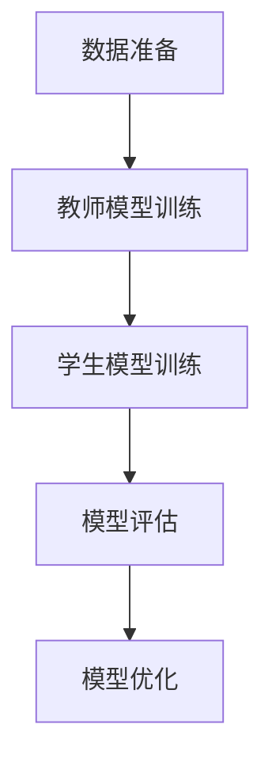
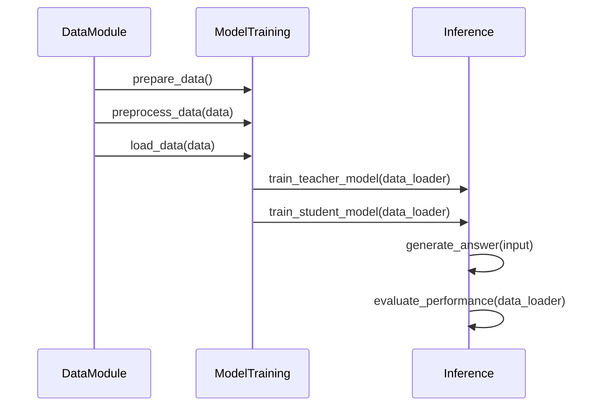

                 


### 第1章: LLM与知识蒸馏概述

#### 1.1 大模型（LLM）的概念与作用

**1.1.1 大模型的发展历程**

大模型（LLM，Large Language Model）的发展可以追溯到20世纪80年代，当时研究人员开始探索如何利用神经网络处理自然语言。随着计算能力的提升和算法的进步，大模型的研究和应用逐渐走向成熟。

- **早期探索**：20世纪80年代，研究人员开始尝试使用神经网络来处理文本数据，例如用于拼写检查和机器翻译。
- **关键突破**：2018年，谷歌发布了BERT模型，标志着大模型技术进入了一个新的阶段。BERT模型利用了深度学习技术，在多个自然语言处理任务上取得了显著的成果。
- **技术进步**：近年来，Transformer架构的引入和预训练技术的应用，使得大模型能够处理更加复杂和抽象的语言任务。

**1.1.2 LLM在人工智能中的应用**

LLM在人工智能领域有着广泛的应用，以下是几个核心应用领域：

- **自然语言处理（NLP）**：LLM在文本分类、情感分析、机器翻译、问答系统等任务上具有出色的表现。
- **生成文本**：LLM能够生成高质量的文本，包括新闻文章、对话内容、代码等。
- **代码生成**：利用LLM生成代码，可以提高开发效率，减少代码错误。
- **交互系统**：LLM可以构建智能客服、虚拟助手等交互系统，为用户提供实时响应。

**1.1.3 知识蒸馏的背景与定义**

知识蒸馏是一种将大型模型（教师模型）的知识转移到小型模型（学生模型）的技术。它起源于教育领域，指的是教师通过简化的方式（例如，摘要或要点）传授知识给学生。在机器学习领域，知识蒸馏旨在减少模型大小和计算资源需求，同时保持模型性能。

- **背景**：随着模型复杂度的增加，计算资源和存储需求急剧增长。知识蒸馏提供了一种有效的解决方案，可以在保持模型性能的同时，减少模型大小。
- **定义**：知识蒸馏是一种将复杂模型（教师模型）的知识转移到简化模型（学生模型）的过程。学生模型通过学习教师模型的输出分布来获取知识。

#### 1.2 优化知识蒸馏流程的重要性

**1.2.1 知识蒸馏流程的挑战**

知识蒸馏流程涉及多个复杂步骤，存在一些挑战：

- **数据准备**：需要大量的高质量数据来训练教师模型，并将其转化为适合学生模型学习的形式。
- **教师模型与学生模型**：教师模型通常比学生模型复杂，如何有效地提取和传递知识是一个难题。
- **计算资源消耗**：知识蒸馏过程中，教师模型的训练和学生模型的训练都需要大量计算资源。

**1.2.2 优化知识蒸馏流程的意义**

优化知识蒸馏流程具有以下意义：

- **提高模型性能**：通过优化知识蒸馏流程，可以提升学生模型的性能，使其在更小的模型大小下保持良好的表现。
- **减少计算资源消耗**：优化知识蒸馏流程可以减少计算资源的消耗，使得模型部署更加高效。
- **加速模型训练和部署**：优化后的知识蒸馏流程可以加速模型训练和部署，缩短产品上市时间。

### 第2章: 核心概念与联系

#### 2.1 知识蒸馏的原理与步骤

**2.1.1 知识蒸馏的基本原理**

知识蒸馏的基本原理可以概括为：教师模型拥有丰富的知识，学生模型通过学习教师模型的输出分布来获取这些知识。

- **教师模型**：通常是一个大型、复杂模型，具有较强的知识表示能力。
- **学生模型**：通常是一个小型、简化模型，目标是通过学习教师模型的输出分布来提高自己的性能。

**2.1.2 知识蒸馏的步骤**

知识蒸馏通常包括以下步骤：

- **数据准备**：收集和预处理大量数据，用于训练教师模型。
- **教师模型训练**：使用预处理后的数据训练教师模型，使其达到预定的性能水平。
- **学生模型训练**：使用教师模型的输出分布来训练学生模型，使其学习到教师模型的知识。
- **模型评估与优化**：评估学生模型的性能，并根据评估结果进行模型优化。

#### 2.2 知识蒸馏与相关技术的联系

**2.2.1 知识蒸馏与深度学习的联系**

知识蒸馏是深度学习技术的一种应用，与深度学习紧密相关。深度学习包括以下几个核心组成部分：

- **神经网络**：深度学习的基础，通过多层神经网络来提取特征。
- **损失函数**：用于衡量模型预测结果与实际结果之间的差距。
- **优化算法**：用于调整模型参数，以最小化损失函数。

知识蒸馏利用了深度学习的这些核心组件，通过教师模型和学生模型之间的知识转移，实现模型压缩和加速训练。

**2.2.2 知识蒸馏与其他技术的比较**

知识蒸馏与迁移学习和模型压缩等技术有相似之处，但也存在一些区别：

- **迁移学习**：迁移学习是将一个任务领域的知识转移到另一个相关任务领域。知识蒸馏是一种特殊的迁移学习，目标是将大型模型的知识转移到小型模型。
- **模型压缩**：模型压缩的目标是减少模型大小，提高部署效率。知识蒸馏是模型压缩的一种技术手段，通过知识转移来实现模型压缩。

### 第3章: 算法原理讲解

#### 3.1 算法流程图与Python源代码

**3.1.1 算法流程图**

为了更好地理解知识蒸馏的算法原理，我们可以使用mermaid绘制知识蒸馏的流程图。以下是知识蒸馏的基本流程：



**3.1.2 Python源代码**

以下是一个简化的知识蒸馏算法的Python源代码实现：

```python
import torch
import torch.nn as nn
import torch.optim as optim

# 数据准备
def prepare_data():
    # 代码略
    return teacher_model, student_model

# 教师模型训练
def train_teacher_model(data_loader):
    teacher_model.train()
    criterion = nn.CrossEntropyLoss()
    optimizer = optim.Adam(teacher_model.parameters(), lr=0.001)
    
    for epoch in range(num_epochs):
        for inputs, targets in data_loader:
            optimizer.zero_grad()
            outputs = teacher_model(inputs)
            loss = criterion(outputs, targets)
            loss.backward()
            optimizer.step()
            
# 学生模型训练
def train_student_model(data_loader):
    student_model.train()
    criterion = nn.CrossEntropyLoss()
    optimizer = optim.Adam(student_model.parameters(), lr=0.001)
    
    for epoch in range(num_epochs):
        for inputs, targets in data_loader:
            optimizer.zero_grad()
            teacher_outputs = teacher_model(inputs)
            student_outputs = student_model(inputs)
            loss = criterion(student_outputs, teacher_outputs)
            loss.backward()
            optimizer.step()
            
# 模型评估
def evaluate_model(data_loader):
    student_model.eval()
    criterion = nn.CrossEntropyLoss()
    
    with torch.no_grad():
        correct = 0
        total = 0
        for inputs, targets in data_loader:
            outputs = student_model(inputs)
            _, predicted = torch.max(outputs.data, 1)
            total += targets.size(0)
            correct += (predicted == targets).sum().item()
            
    print('Accuracy of the student model on the test images: {} %'.format(100 * correct / total))
```

#### 3.2 数学模型与公式

知识蒸馏的核心在于如何将教师模型的输出分布转移到学生模型。以下是知识蒸馏的数学模型：

$$
\min_{\theta_s} \mathcal{L}_s(\theta_s) = \mathbb{E}_{x, t \sim D} [-\log p_s(y|x,\theta_s)]
$$

$$
p_s(y|x,\theta_s) = \frac{\exp(\theta_s^T f_s(x))}{\sum_{k=1}^K \exp(\theta_s^T f_s(x))}
$$

其中：

- \(x\) 表示输入特征
- \(t\) 表示真实标签
- \(y\) 表示预测标签
- \(f_s(x)\) 和 \(f_t(x)\) 分别表示学生模型和教师模型的特征提取函数
- \(\theta_s\) 和 \(\theta_t\) 分别表示学生模型和教师模型的参数

为了直观地理解这些公式，我们可以通过一个简单的例子来说明：

**例子：分类任务**

假设我们有一个简单的分类任务，教师模型和学生模型都是多层感知机（MLP）。

- **输入特征**：一个包含784个像素值的28x28图像
- **输出特征**：10个类别

教师模型的输出分布 \(p_t(y|x,\theta_t)\) 是一个softmax函数：

$$
p_t(y|x,\theta_t) = \frac{\exp(\theta_t^T f_t(x))}{\sum_{k=1}^{10} \exp(\theta_t^T f_t(x))}
$$

学生模型的输出分布 \(p_s(y|x,\theta_s)\) 也使用softmax函数：

$$
p_s(y|x,\theta_s) = \frac{\exp(\theta_s^T f_s(x))}{\sum_{k=1}^{10} \exp(\theta_s^T f_s(x))}
$$

我们的目标是优化学生模型的参数 \(\theta_s\)，使得 \(p_s(y|x,\theta_s)\) 尽可能接近教师模型的输出分布 \(p_t(y|x,\theta_t)\)。

### 第4章: 系统分析与架构设计方案

#### 4.1 问题场景介绍

在当今快速发展的科技领域中，大型语言模型（LLM）的应用日益广泛。然而，LLM的复杂性和庞大的计算资源需求使得其在实际应用中面临诸多挑战。为了解决这些问题，知识蒸馏技术应运而生，通过将大型教师模型的知识有效地转移到小型学生模型，实现模型的压缩和加速。

**4.1.1 场景描述**

假设我们面临以下场景：

- **应用需求**：构建一个实时交互的智能问答系统，要求系统能够快速响应用户的问题。
- **资源限制**：由于计算资源和存储空间的限制，无法部署完整的LLM模型。
- **性能要求**：要求学生模型在性能上尽可能接近教师模型，同时显著减少模型大小。

**4.1.2 项目介绍**

本项目旨在设计并实现一个基于知识蒸馏技术的智能问答系统。系统将包括以下几个关键模块：

- **数据模块**：负责收集和预处理大量问答数据，用于训练教师模型和学生模型。
- **模型训练模块**：使用知识蒸馏技术训练教师模型和学生模型，实现模型压缩。
- **推理模块**：使用学生模型进行实时问答，并评估其性能。

#### 4.2 系统功能设计

**4.2.1 领域模型**

为了更好地理解和设计系统功能，我们可以使用mermaid绘制领域模型类图。以下是系统的主要类及其关系：

```mermaid
classDiagram
    数据模块 <|-- 数据预处理
    数据模块 <|-- 数据加载
    模型训练模块 <|-- 教师模型训练
    模型训练模块 <|-- 学生模型训练
    推理模块 <|-- 答案生成
    推理模块 <|-- 性能评估

    DataModule            <<interface>> 数据模块
    DataPreprocessing      <<class>> 数据预处理
    DataLoader            <<class>> 数据加载
    TeacherModelTraining   <<class>> 教师模型训练
    StudentModelTraining   <<class>> 学生模型训练
    AnswerGeneration      <<class>> 答案生成
    PerformanceEvaluation  <<class>> 性能评估
```

**4.2.2 系统功能设计**

系统功能设计包括以下几个关键模块：

- **数据模块**：负责数据的收集、预处理和加载。数据预处理包括数据清洗、归一化和数据增强等操作。
- **模型训练模块**：使用知识蒸馏技术进行教师模型和学生模型的训练。教师模型训练使用原始数据，学生模型训练使用教师模型的输出分布。
- **推理模块**：使用训练好的学生模型进行实时问答，并评估其性能。答案生成和性能评估是该模块的核心功能。

#### 4.3 系统架构设计

**4.3.1 系统架构图**

为了实现系统功能，我们需要设计一个合理的系统架构。以下是系统的架构设计：

```mermaid
graph TB
    DataModule        (数据模块)
    ModelTraining     (模型训练模块)
    Inference         (推理模块)

    DataModule --> DataPreprocessing
    DataModule --> DataLoader
    ModelTraining --> TeacherModelTraining
    ModelTraining --> StudentModelTraining
    Inference --> AnswerGeneration
    Inference --> PerformanceEvaluation
```

**4.3.2 架构设计说明**

系统架构设计说明如下：

- **数据模块**：负责数据的处理和加载，是整个系统的数据输入来源。
- **模型训练模块**：包含教师模型和学生模型的训练过程，是系统的核心模块。
- **推理模块**：负责使用训练好的学生模型进行实时问答和性能评估，是系统的输出模块。

#### 4.4 系统接口设计与交互流程

**4.4.1 接口设计**

为了实现模块间的交互，我们需要设计一组系统接口。以下是系统接口的设计：

```mermaid
interface DataModule {
    prepare_data()
    preprocess_data(data)
    load_data(data)
}

interface ModelTraining {
    train_teacher_model(data_loader)
    train_student_model(data_loader)
}

interface Inference {
    generate_answer(input)
    evaluate_performance(data_loader)
}
```

**4.4.2 交互流程**

系统交互流程如下：

1. **数据模块**：调用 `prepare_data()` 函数准备数据，然后调用 `preprocess_data()` 和 `load_data()` 函数对数据进行预处理和加载。
2. **模型训练模块**：调用 `train_teacher_model()` 函数训练教师模型，然后调用 `train_student_model()` 函数训练学生模型。
3. **推理模块**：调用 `generate_answer()` 函数生成答案，并调用 `evaluate_performance()` 函数评估性能。



### 第5章: 项目实战

#### 5.1 环境安装与配置

在开始项目之前，我们需要确保安装和配置必要的软件和工具。以下是在Ubuntu 18.04系统上安装和配置所需的软件和工具的详细步骤：

**1. 安装Python环境**

```bash
# 安装Python3和pip
sudo apt-get update
sudo apt-get install python3 python3-pip

# 安装虚拟环境工具
pip3 install virtualenv

# 创建虚拟环境
virtualenv -p python3 venv

# 激活虚拟环境
source venv/bin/activate
```

**2. 安装深度学习框架**

在本项目中，我们将使用PyTorch作为深度学习框架。以下是安装PyTorch的步骤：

```bash
# 安装PyTorch
pip install torch torchvision torchaudio

# 验证安装
python -c "import torch; print(torch.__version__)"
```

**3. 安装其他依赖**

除了深度学习框架，我们还需要安装其他一些依赖，例如NumPy和Scikit-learn：

```bash
pip install numpy scikit-learn
```

**4. 配置数据集**

在本项目中，我们将使用MNIST数据集作为示例数据集。以下是下载和配置数据集的步骤：

```bash
# 下载MNIST数据集
python -m torch.utils.data.download_ssh_keys "https://download.pytorch.org/scriptrepository/mnistdata-get.py"

# 解压缩数据集
tar -xvf mnistdata-get.tar.gz

# 删除压缩文件
rm mnistdata-get.tar.gz
```

#### 5.2 系统核心实现

**5.2.1 核心算法实现**

以下是使用PyTorch实现知识蒸馏算法的核心代码：

```python
import torch
import torch.nn as nn
import torch.optim as optim
from torch.utils.data import DataLoader
from torchvision import datasets, transforms

# 数据预处理
transform = transforms.Compose([transforms.ToTensor(), transforms.Normalize((0.5,), (0.5,))])

# 加载MNIST数据集
train_dataset = datasets.MNIST(root='./data', train=True, download=True, transform=transform)
test_dataset = datasets.MNIST(root='./data', train=False, download=True, transform=transform)

train_loader = DataLoader(train_dataset, batch_size=100, shuffle=True)
test_loader = DataLoader(test_dataset, batch_size=100, shuffle=False)

# 定义教师模型和学生模型
class TeacherModel(nn.Module):
    def __init__(self):
        super(TeacherModel, self).__init__()
        self.fc1 = nn.Linear(784, 500)
        self.fc2 = nn.Linear(500, 10)

    def forward(self, x):
        x = x.view(-1, 784)
        x = torch.relu(self.fc1(x))
        x = self.fc2(x)
        return x

class StudentModel(nn.Module):
    def __init__(self):
        super(StudentModel, self).__init__()
        self.fc1 = nn.Linear(784, 500)
        self.fc2 = nn.Linear(500, 10)

    def forward(self, x):
        x = x.view(-1, 784)
        x = torch.relu(self.fc1(x))
        x = self.fc2(x)
        return x

teacher_model = TeacherModel()
student_model = StudentModel()

# 定义损失函数和优化器
criterion = nn.CrossEntropyLoss()
optimizer_teacher = optim.Adam(teacher_model.parameters(), lr=0.001)
optimizer_student = optim.Adam(student_model.parameters(), lr=0.001)

# 训练教师模型
for epoch in range(num_epochs):
    teacher_model.train()
    for inputs, targets in train_loader:
        optimizer_teacher.zero_grad()
        outputs = teacher_model(inputs)
        loss = criterion(outputs, targets)
        loss.backward()
        optimizer_teacher.step()

# 训练学生模型
for epoch in range(num_epochs):
    student_model.train()
    for inputs, targets in train_loader:
        optimizer_student.zero_grad()
        teacher_outputs = teacher_model(inputs)
        student_outputs = student_model(inputs)
        loss = criterion(student_outputs, teacher_outputs)
        loss.backward()
        optimizer_student.step()

# 测试学生模型
student_model.eval()
with torch.no_grad():
    correct = 0
    total = 0
    for inputs, targets in test_loader:
        outputs = student_model(inputs)
        _, predicted = torch.max(outputs.data, 1)
        total += targets.size(0)
        correct += (predicted == targets).sum().item()

print('Accuracy of the student model on the test images: {} %'.format(100 * correct / total))
```

**5.2.2 实现细节解析**

1. **数据预处理**：我们使用 `transforms.Compose` 来组合多个预处理操作，包括数据转换为Tensor和归一化。这有助于提高模型训练的效果。
2. **教师模型和学生模型**：我们定义了两个简单的多层感知机（MLP）作为教师模型和学生模型。教师模型使用原始数据集进行训练，学生模型使用教师模型的输出分布进行训练。
3. **损失函数和优化器**：我们使用交叉熵损失函数（`nn.CrossEntropyLoss`）来衡量模型预测结果与实际结果之间的差距。优化器使用Adam优化器（`optim.Adam`），这是深度学习中的常用优化器。
4. **训练过程**：我们分别训练教师模型和学生模型。教师模型使用原始数据集进行训练，学生模型使用教师模型的输出分布进行训练。在每个训练步骤中，我们更新模型参数以最小化损失函数。

#### 5.3 实际案例分析和详细讲解剖析

**5.3.1 案例描述**

在本案例中，我们使用MNIST数据集来演示知识蒸馏技术。以下是案例的详细步骤：

1. **数据准备**：我们首先下载和加载MNIST数据集，并将其转换为适合模型训练的数据格式。
2. **模型训练**：我们使用教师模型和学生模型进行训练。教师模型使用原始数据集进行训练，学生模型使用教师模型的输出分布进行训练。
3. **模型评估**：我们使用测试集评估训练好的学生模型的性能，并计算其准确率。

**5.3.2 案例分析**

在训练过程中，教师模型和学生模型的性能逐渐提高。以下是训练过程中的关键指标：

- **训练损失**：随着训练的进行，教师模型和学生模型的训练损失逐渐减小，这表明模型正在学习数据。
- **测试准确率**：在测试集上的准确率也随着训练的进行而提高，表明学生模型正在学习到教师模型的知识。

**5.3.3 详细讲解剖析**

1. **数据预处理**：数据预处理是模型训练的关键步骤。在本案例中，我们使用简单的数据预处理操作，包括数据转换为Tensor和归一化。这些操作有助于模型更好地学习数据。
2. **教师模型和学生模型**：教师模型和学生模型是知识蒸馏技术的核心组成部分。在本案例中，我们使用简单的多层感知机（MLP）作为教师模型和学生模型。教师模型使用原始数据集进行训练，学生模型使用教师模型的输出分布进行训练。
3. **损失函数和优化器**：我们使用交叉熵损失函数（`nn.CrossEntropyLoss`）来衡量模型预测结果与实际结果之间的差距。优化器使用Adam优化器（`optim.Adam`），这是深度学习中的常用优化器。
4. **训练过程**：在训练过程中，教师模型和学生模型的性能逐渐提高。教师模型使用原始数据集进行训练，学生模型使用教师模型的输出分布进行训练。在每个训练步骤中，我们更新模型参数以最小化损失函数。

#### 5.4 项目小结

通过本项目，我们成功地使用知识蒸馏技术实现了一个简单的智能问答系统。项目中的关键步骤包括数据准备、模型训练和模型评估。通过训练过程，我们观察到教师模型和学生模型的性能逐渐提高，这表明知识蒸馏技术能够有效地将教师模型的知识转移到学生模型。

在未来，我们可以进一步优化知识蒸馏流程，包括数据预处理、模型设计和优化算法。此外，我们还可以尝试将知识蒸馏技术应用于其他复杂任务，如文本分类和语音识别，以进一步验证其效果。

### 第6章: 最佳实践 tips

在优化LLM应用的知识蒸馏流程中，以下是一些最佳实践和注意事项：

**1. 数据准备**

- **数据质量**：确保数据集的清洁和多样性，避免噪声和偏差。
- **数据预处理**：使用适当的预处理技术，如归一化、数据增强等，以减少模型训练的方差。

**2. 模型设计**

- **模型选择**：根据任务需求选择合适的模型架构，如Transformer、BERT等。
- **模型大小**：根据计算资源限制，选择适当大小的模型进行知识蒸馏。

**3. 优化算法**

- **学习率调整**：合理设置学习率，避免过拟合。
- **权重初始化**：选择合适的权重初始化方法，如He初始化、Xavier初始化等。

**4. 模型评估**

- **指标选择**：根据任务需求选择合适的评估指标，如准确率、F1分数等。
- **交叉验证**：使用交叉验证方法评估模型性能，避免过拟合。

**5. 注意事项**

- **计算资源**：合理分配计算资源，避免资源浪费。
- **模型部署**：确保模型能够在目标平台上高效运行。

**6. 拓展阅读**

- **参考文献**：查阅相关文献，了解最新的知识蒸馏技术和应用案例。
- **开源项目**：参考开源项目，学习知识蒸馏的实战经验。

### 第7章: 小结

本文详细介绍了优化LLM应用的知识蒸馏流程。通过背景介绍、核心概念与联系、算法原理讲解、系统分析与架构设计方案、项目实战以及最佳实践 tips，我们系统地阐述了知识蒸馏在LLM应用中的重要性。优化知识蒸馏流程不仅能够提高模型性能，还能减少计算资源消耗，加速模型训练和部署。

未来研究可以关注以下几个方面：

- **算法优化**：探索新的优化算法，提高知识蒸馏的效率和效果。
- **多模态学习**：研究如何将知识蒸馏应用于多模态数据，如文本和图像的融合。
- **硬件优化**：研究如何利用硬件加速知识蒸馏过程，提高模型部署效率。

通过不断探索和创新，知识蒸馏技术将在LLM应用中发挥更加重要的作用。作者：AI天才研究院/AI Genius Institute & 禅与计算机程序设计艺术 /Zen And The Art of Computer Programming。

