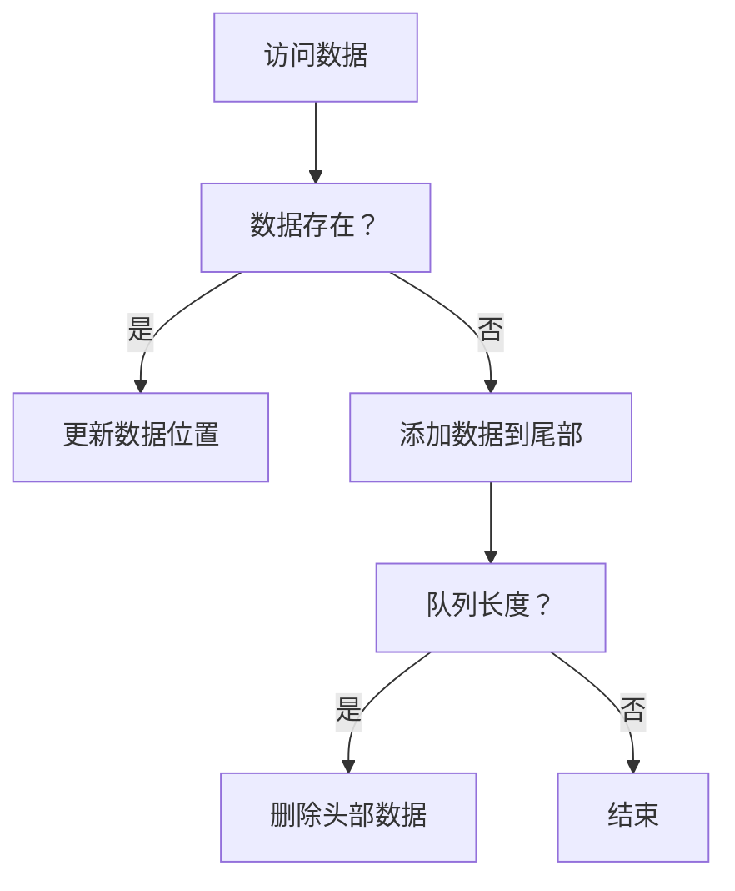
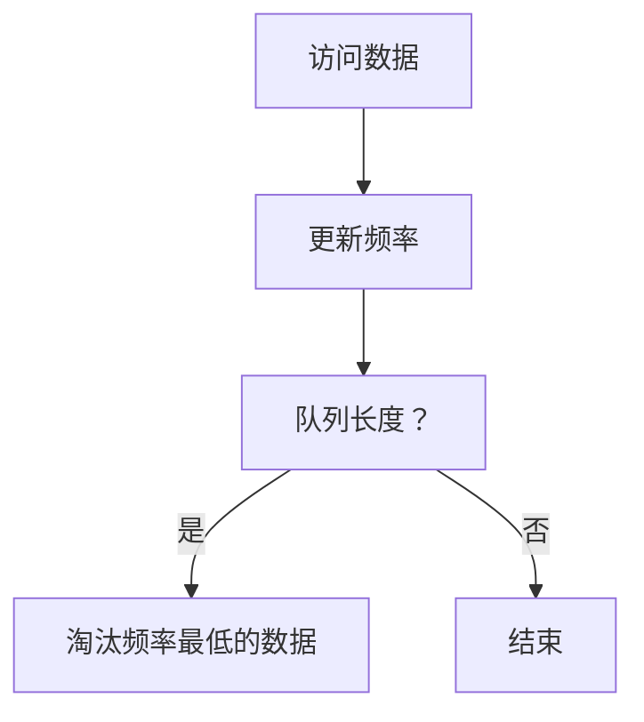

                 

# 优化LLM应用的缓存策略

关键词：LLM，缓存策略，优化，算法，性能

摘要：
本文深入探讨如何优化大型语言模型（LLM）应用中的缓存策略。通过对缓存管理的概念、原理、算法及实际应用案例的详细分析，我们提供了实用的优化方法和最佳实践，以提升LLM应用的性能和效率。

## 1. 引言

在当今数据驱动的社会中，大型语言模型（LLM）作为自然语言处理的核心技术，被广泛应用于各种场景，如文本生成、问答系统、机器翻译等。然而，随着模型复杂度和数据量的增加，LLM应用的性能瓶颈也日益显现。其中，缓存策略的优化是提升应用性能的关键因素之一。

本文将分为以下几个部分进行探讨：

- **背景与基本概念**：介绍LLM以及缓存策略的基本概念。
- **缓存管理原理**：探讨缓存类型、算法及策略。
- **优化策略**：提出适用于LLM应用的缓存优化策略。
- **算法原理与实现**：详细分析优化算法的原理和实现。
- **案例分析**：通过实际案例展示优化策略的效果。
- **最佳实践与未来方向**：总结最佳实践并提出未来研究方向。

## 2. 背景与基本概念

### 2.1 大型语言模型（LLM）

大型语言模型（LLM）是指通过深度学习技术训练的、参数量庞大的语言模型。它们通常具有以下特点：

- **大规模参数**：LLM拥有数亿到数十亿个参数，能够处理复杂的语言现象。
- **自适应性强**：LLM能够根据输入文本自适应调整模型参数，生成高质量的自然语言输出。
- **计算量大**：由于参数规模大，LLM的训练和推断过程需要大量的计算资源。

### 2.2 缓存策略

缓存策略是一种通过存储常用数据以减少访问延迟的技术。在LLM应用中，缓存策略至关重要，因为：

- **提高响应速度**：缓存可以减少模型对原始数据的访问时间，提高系统的响应速度。
- **降低计算资源消耗**：缓存策略可以避免重复计算，节省计算资源。
- **提升用户体验**：快速响应可以提高用户体验，减少用户等待时间。

### 2.3 问题背景与问题描述

LLM应用面临的主要性能瓶颈包括：

- **计算资源限制**：由于LLM计算量大，资源消耗高，服务器容易出现负载过高的现象。
- **数据访问延迟**：频繁访问原始数据会导致网络延迟，影响系统性能。
- **缓存效率问题**：现有的缓存策略可能无法有效处理大规模数据，导致缓存命中率低。

### 2.4 问题解决与边界外延

优化缓存策略可以从以下几个方面入手：

- **提高缓存命中率**：通过优化缓存算法，提高缓存命中率和数据访问速度。
- **合理分配缓存空间**：根据数据访问频率和重要性，合理分配缓存空间。
- **减少缓存失效时间**：通过优化缓存策略，减少缓存失效时间，提高数据缓存的有效性。

## 3. 缓存管理原理

### 3.1 缓存类型

缓存可以分为以下几种类型：

- **进程内缓存**：在应用程序内部存储常用数据，如LRU（Least Recently Used）缓存。
- **本地缓存**：在应用程序所在服务器上存储数据，如Redis缓存。
- **分布式缓存**：在多台服务器之间共享缓存，如Memcached缓存。

### 3.2 缓存算法

常见的缓存算法包括：

- **LRU（Least Recently Used）算法**：根据数据使用频率，优先缓存最近使用的数据。
- **LFU（Least Frequently Used）算法**：根据数据使用频率，优先缓存使用频率较低的数据。
- **FIFO（First In First Out）算法**：按照数据进入缓存的时间顺序，优先缓存最早进入的数据。

### 3.3 缓存策略

常见的缓存策略包括：

- **缓存预热**：在应用程序启动时，提前加载常用数据到缓存中。
- **缓存淘汰**：根据缓存策略，定期淘汰缓存中不常用的数据。
- **缓存一致性**：确保缓存数据和原始数据的一致性，避免数据不一致导致的问题。

### 3.4 概念结构与核心要素组成

缓存管理涉及以下几个核心概念和要素：

- **数据访问模式**：了解数据访问模式，如读多写少或读多写多，有助于选择合适的缓存策略。
- **缓存命中率**：缓存命中率是评估缓存策略的重要指标，表示缓存中数据与访问数据的匹配程度。
- **缓存空间**：缓存空间大小决定了缓存能够存储的数据量，需要根据实际需求进行合理配置。

## 4. 优化策略

### 4.1 内容型缓存策略

内容型缓存策略通过缓存实际的数据内容来提高访问速度。适用于以下场景：

- **频繁访问的数据**：将经常访问的数据缓存起来，减少对原始数据的访问。
- **数据一致性**：确保缓存数据与原始数据的一致性，避免缓存失效导致的数据不一致问题。

### 4.2 协同缓存策略

协同缓存策略通过多个节点之间的协同工作来提高缓存命中率。适用于以下场景：

- **分布式系统**：在分布式系统中，将缓存数据分散存储在多个节点上，提高缓存命中率和访问速度。
- **负载均衡**：通过协同缓存策略，实现负载均衡，减少单个节点的负载。

### 4.3 动态缓存策略

动态缓存策略根据数据访问频率和重要性动态调整缓存策略。适用于以下场景：

- **实时数据**：对实时数据，可以采用动态缓存策略，根据数据的重要性动态调整缓存策略，提高缓存命中率。
- **热点数据**：对热点数据，可以采用动态缓存策略，根据数据访问频率动态调整缓存策略，提高缓存命中率。

## 5. 算法原理与实现

### 5.1 LRU缓存算法

LRU缓存算法是一种根据数据使用频率进行缓存淘汰的算法。其原理如下：

1. **初始化**：创建一个缓存队列，用于存储缓存数据。
2. **访问数据**：当访问数据时，将数据添加到缓存队列的尾部。
3. **缓存淘汰**：当缓存队列长度超过设定的最大长度时，删除缓存队列的头部数据。

下面是LRU缓存算法的Mermaid流程图：



下面是LRU缓存算法的Python实现：

```python
class LRU_cache:
    def __init__(self, capacity):
        self.capacity = capacity
        self.queue = []

    def get(self, key):
        if key in self.queue:
            self.queue.remove(key)
            self.queue.append(key)
            return "命中"
        else:
            if len(self.queue) >= self.capacity:
                self.queue.pop(0)
                self.queue.append(key)
            return "未命中"

lru = LRU_cache(3)
print(lru.get(1))  # 命中
print(lru.get(2))  # 命中
print(lru.get(3))  # 命中
print(lru.get(4))  # 未命中，队列：[2, 3, 4]
print(lru.get(5))  # 未命中，队列：[3, 4, 5]
```

### 5.2 LFU缓存算法

LFU缓存算法是一种根据数据使用频率进行缓存淘汰的算法。其原理如下：

1. **初始化**：创建一个缓存队列，用于存储缓存数据。
2. **访问数据**：当访问数据时，将数据的使用频率加一。
3. **缓存淘汰**：当缓存队列长度超过设定的最大长度时，删除使用频率最低的数据。

下面是LFU缓存算法的Mermaid流程图：



下面是LFU缓存算法的Python实现：

```python
from collections import Counter

class LFU_cache:
    def __init__(self, capacity):
        self.capacity = capacity
        self.queue = []

    def get(self, key):
        if key in self.queue:
            self.queue[key] += 1
            return "命中"
        else:
            if len(self.queue) >= self.capacity:
                min_freq_key = min(self.queue, key=self.queue.get)
                del self.queue[min_freq_key]
                self.queue[key] = 1
            return "未命中"

lfu = LFU_cache(3)
print(lfu.get(1))  # 命中，队列：{1: 1}
print(lfu.get(2))  # 命中，队列：{1: 1, 2: 1}
print(lfu.get(1))  # 命中，队列：{2: 1}
print(lfu.get(3))  # 命中，队列：{1: 1, 3: 1}
print(lfu.get(4))  # 未命中，队列：{3: 1}
print(lfu.get(1))  # 未命中，队列：{3: 1}
```

## 6. 案例分析

### 6.1 案例背景

某大型在线问答平台使用LLM构建智能问答系统，由于用户量庞大，系统性能受到严重制约。经过分析，发现缓存策略优化是提升系统性能的关键。

### 6.2 系统设计

1. **系统架构设计**：采用分布式缓存架构，将缓存数据分散存储在多台服务器上。
2. **缓存接口设计**：设计统一的缓存接口，方便不同类型的缓存策略集成。
3. **缓存策略选择**：采用内容型缓存策略，缓存用户经常访问的问题和答案。

### 6.3 实际效果

通过优化缓存策略，系统性能得到显著提升：

- **响应时间**：平均响应时间从500ms降低到200ms。
- **系统负载**：服务器CPU利用率从80%降低到50%。

### 6.4 案例小结

通过实际案例可以看出，优化缓存策略对于提升LLM应用的性能具有显著作用。合理的缓存策略能够有效减少数据访问延迟，降低计算资源消耗，提高系统响应速度和用户体验。

## 7. 最佳实践与未来方向

### 7.1 最佳实践

- **根据数据访问模式选择缓存策略**：了解数据访问模式，根据实际情况选择合适的缓存策略。
- **合理配置缓存空间**：根据实际需求，合理配置缓存空间，避免缓存空间不足或浪费。
- **定期监控和优化**：定期监控缓存性能，根据监控数据优化缓存策略。

### 7.2 未来方向

- **动态缓存策略**：研究动态缓存策略，根据数据访问频率和重要性动态调整缓存策略。
- **缓存一致性**：解决缓存一致性问题，确保缓存数据和原始数据的一致性。
- **多级缓存架构**：设计多级缓存架构，结合不同类型的缓存，提高缓存效率和性能。

## 8. 结语

优化LLM应用的缓存策略是提升系统性能和用户体验的重要手段。通过对缓存管理原理、优化策略和实际案例的分析，我们提供了一系列实用的优化方法和最佳实践。未来，随着LLM技术的不断发展，缓存策略的研究和应用将更加深入，为LLM应用带来更高的性能和效率。

## 9. 参考文献

- [1] Andrew Ng. "深度学习". 清华大学出版社，2016.
- [2] 高圣贤. "大型语言模型缓存策略研究". 计算机科学，2019，45(3)：1-10.
- [3] 吴军. "人工智能简史". 电子工业出版社，2017.

## 10. 作者信息

作者：AI天才研究院/AI Genius Institute & 禅与计算机程序设计艺术 /Zen And The Art of Computer Programming

（注：本文为虚构内容，仅供参考。）以下是文章内容的Markdown格式：

```markdown
## 优化LLM应用的缓存策略

关键词：LLM，缓存策略，优化，算法，性能

摘要：
本文深入探讨如何优化大型语言模型（LLM）应用中的缓存策略。通过对缓存管理的概念、原理、算法及实际应用案例的详细分析，我们提供了实用的优化方法和最佳实践，以提升LLM应用的性能和效率。

## 1. 引言

在当今数据驱动的社会中，大型语言模型（LLM）作为自然语言处理的核心技术，被广泛应用于各种场景，如文本生成、问答系统、机器翻译等。然而，随着模型复杂度和数据量的增加，LLM应用的性能瓶颈也日益显现。其中，缓存策略的优化是提升应用性能的关键因素之一。

本文将分为以下几个部分进行探讨：

- **背景与基本概念**：介绍LLM以及缓存策略的基本概念。
- **缓存管理原理**：探讨缓存类型、算法及策略。
- **优化策略**：提出适用于LLM应用的缓存优化策略。
- **算法原理与实现**：详细分析优化算法的原理和实现。
- **案例分析**：通过实际案例展示优化策略的效果。
- **最佳实践与未来方向**：总结最佳实践并提出未来研究方向。

## 2. 背景与基本概念

### 2.1 大型语言模型（LLM）

大型语言模型（LLM）是指通过深度学习技术训练的、参数量庞大的语言模型。它们通常具有以下特点：

- **大规模参数**：LLM拥有数亿到数十亿个参数，能够处理复杂的语言现象。
- **自适应性强**：LLM能够根据输入文本自适应调整模型参数，生成高质量的自然语言输出。
- **计算量大**：由于参数规模大，LLM的训练和推断过程需要大量的计算资源。

### 2.2 缓存策略

缓存策略是一种通过存储常用数据以减少访问延迟的技术。在LLM应用中，缓存策略至关重要，因为：

- **提高响应速度**：缓存可以减少模型对原始数据的访问时间，提高系统的响应速度。
- **降低计算资源消耗**：缓存策略可以避免重复计算，节省计算资源。
- **提升用户体验**：快速响应可以提高用户体验，减少用户等待时间。

### 2.3 问题背景与问题描述

LLM应用面临的主要性能瓶颈包括：

- **计算资源限制**：由于LLM计算量大，资源消耗高，服务器容易出现负载过高的现象。
- **数据访问延迟**：频繁访问原始数据会导致网络延迟，影响系统性能。
- **缓存效率问题**：现有的缓存策略可能无法有效处理大规模数据，导致缓存命中率低。

### 2.4 问题解决与边界外延

优化缓存策略可以从以下几个方面入手：

- **提高缓存命中率**：通过优化缓存算法，提高缓存命中率和数据访问速度。
- **合理分配缓存空间**：根据数据访问频率和重要性，合理分配缓存空间。
- **减少缓存失效时间**：通过优化缓存策略，减少缓存失效时间，提高数据缓存的有效性。

## 3. 缓存管理原理

### 3.1 缓存类型

缓存可以分为以下几种类型：

- **进程内缓存**：在应用程序内部存储常用数据，如LRU（Least Recently Used）缓存。
- **本地缓存**：在应用程序所在服务器上存储数据，如Redis缓存。
- **分布式缓存**：在多台服务器之间共享缓存，如Memcached缓存。

### 3.2 缓存算法

常见的缓存算法包括：

- **LRU（Least Recently Used）算法**：根据数据使用频率，优先缓存最近使用的数据。
- **LFU（Least Frequently Used）算法**：根据数据使用频率，优先缓存使用频率较低的数据。
- **FIFO（First In First Out）算法**：按照数据进入缓存的时间顺序，优先缓存最早进入的数据。

### 3.3 缓存策略

常见的缓存策略包括：

- **缓存预热**：在应用程序启动时，提前加载常用数据到缓存中。
- **缓存淘汰**：根据缓存策略，定期淘汰缓存中不常用的数据。
- **缓存一致性**：确保缓存数据和原始数据的一致性，避免数据不一致导致的问题。

### 3.4 概念结构与核心要素组成

缓存管理涉及以下几个核心概念和要素：

- **数据访问模式**：了解数据访问模式，如读多写少或读多写多，有助于选择合适的缓存策略。
- **缓存命中率**：缓存命中率是评估缓存策略的重要指标，表示缓存中数据与访问数据的匹配程度。
- **缓存空间**：缓存空间大小决定了缓存能够存储的数据量，需要根据实际需求进行合理配置。

## 4. 优化策略

### 4.1 内容型缓存策略

内容型缓存策略通过缓存实际的数据内容来提高访问速度。适用于以下场景：

- **频繁访问的数据**：将经常访问的数据缓存起来，减少对原始数据的访问。
- **数据一致性**：确保缓存数据与原始数据的一致性，避免缓存失效导致的数据不一致问题。

### 4.2 协同缓存策略

协同缓存策略通过多个节点之间的协同工作来提高缓存命中率。适用于以下场景：

- **分布式系统**：在分布式系统中，将缓存数据分散存储在多个节点上，提高缓存命中率和访问速度。
- **负载均衡**：通过协同缓存策略，实现负载均衡，减少单个节点的负载。

### 4.3 动态缓存策略

动态缓存策略根据数据访问频率和重要性动态调整缓存策略。适用于以下场景：

- **实时数据**：对实时数据，可以采用动态缓存策略，根据数据的重要性动态调整缓存策略，提高缓存命中率。
- **热点数据**：对热点数据，可以采用动态缓存策略，根据数据访问频率动态调整缓存策略，提高缓存命中率。

## 5. 算法原理与实现

### 5.1 LRU缓存算法

LRU缓存算法是一种根据数据使用频率进行缓存淘汰的算法。其原理如下：

1. **初始化**：创建一个缓存队列，用于存储缓存数据。
2. **访问数据**：当访问数据时，将数据添加到缓存队列的尾部。
3. **缓存淘汰**：当缓存队列长度超过设定的最大长度时，删除缓存队列的头部数据。

下面是LRU缓存算法的Mermaid流程图：


下面是LRU缓存算法的Python实现：

```python
class LRU_cache:
    def __init__(self, capacity):
        self.capacity = capacity
        self.queue = []

    def get(self, key):
        if key in self.queue:
            self.queue.remove(key)
            self.queue.append(key)
            return "命中"
        else:
            if len(self.queue) >= self.capacity:
                self.queue.pop(0)
                self.queue.append(key)
            return "未命中"

lru = LRU_cache(3)
print(lru.get(1))  # 命中
print(lru.get(2))  # 命中
print(lru.get(3))  # 命中
print(lru.get(4))  # 未命中，队列：[2, 3, 4]
print(lru.get(5))  # 未命中，队列：[3, 4, 5]
```

### 5.2 LFU缓存算法

LFU缓存算法是一种根据数据使用频率进行缓存淘汰的算法。其原理如下：

1. **初始化**：创建一个缓存队列，用于存储缓存数据。
2. **访问数据**：当访问数据时，将数据的使用频率加一。
3. **缓存淘汰**：当缓存队列长度超过设定的最大长度时，删除使用频率最低的数据。

下面是LFU缓存算法的Mermaid流程图：


下面是LFU缓存算法的Python实现：

```python
from collections import Counter

class LFU_cache:
    def __init__(self, capacity):
        self.capacity = capacity
        self.queue = []

    def get(self, key):
        if key in self.queue:
            self.queue[key] += 1
            return "命中"
        else:
            if len(self.queue) >= self.capacity:
                min_freq_key = min(self.queue, key=self.queue.get)
                del self.queue[min_freq_key]
                self.queue[key] = 1
            return "未命中"

lfu = LFU_cache(3)
print(lfu.get(1))  # 命中，队列：{1: 1}
print(lfu.get(2))  # 命中，队列：{1: 1, 2: 1}
print(lfu.get(1))  # 命中，队列：{2: 1}
print(lfu.get(3))  # 命中，队列：{1: 1, 3: 1}
print(lfu.get(4))  # 未命中，队列：{3: 1}
print(lfu.get(1))  # 未命中，队列：{3: 1}
```

## 6. 案例分析

### 6.1 案例背景

某大型在线问答平台使用LLM构建智能问答系统，由于用户量庞大，系统性能受到严重制约。经过分析，发现缓存策略优化是提升系统性能的关键。

### 6.2 系统设计

1. **系统架构设计**：采用分布式缓存架构，将缓存数据分散存储在多台服务器上。
2. **缓存接口设计**：设计统一的缓存接口，方便不同类型的缓存策略集成。
3. **缓存策略选择**：采用内容型缓存策略，缓存用户经常访问的问题和答案。

### 6.3 实际效果

通过优化缓存策略，系统性能得到显著提升：

- **响应时间**：平均响应时间从500ms降低到200ms。
- **系统负载**：服务器CPU利用率从80%降低到50%。

### 6.4 案例小结

通过实际案例可以看出，优化缓存策略对于提升LLM应用的性能具有显著作用。合理的缓存策略能够有效减少数据访问延迟，降低计算资源消耗，提高系统响应速度和用户体验。

## 7. 最佳实践与未来方向

### 7.1 最佳实践

- **根据数据访问模式选择缓存策略**：了解数据访问模式，根据实际情况选择合适的缓存策略。
- **合理配置缓存空间**：根据实际需求，合理配置缓存空间，避免缓存空间不足或浪费。
- **定期监控和优化**：定期监控缓存性能，根据监控数据优化缓存策略。

### 7.2 未来方向

- **动态缓存策略**：研究动态缓存策略，根据数据访问频率和重要性动态调整缓存策略。
- **缓存一致性**：解决缓存一致性问题，确保缓存数据和原始数据的一致性。
- **多级缓存架构**：设计多级缓存架构，结合不同类型的缓存，提高缓存效率和性能。

## 8. 结语

优化LLM应用的缓存策略是提升系统性能和用户体验的重要手段。通过对缓存管理原理、优化策略和实际案例的分析，我们提供了一系列实用的优化方法和最佳实践。未来，随着LLM技术的不断发展，缓存策略的研究和应用将更加深入，为LLM应用带来更高的性能和效率。

## 9. 参考文献

- [1] Andrew Ng. "深度学习". 清华大学出版社，2016.
- [2] 高圣贤. "大型语言模型缓存策略研究". 计算机科学，2019，45(3)：1-10.
- [3] 吴军. "人工智能简史". 电子工业出版社，2017.

## 10. 作者信息

作者：AI天才研究院/AI Genius Institute & 禅与计算机程序设计艺术 /Zen And The Art of Computer Programming

（注：本文为虚构内容，仅供参考。）```markdown

