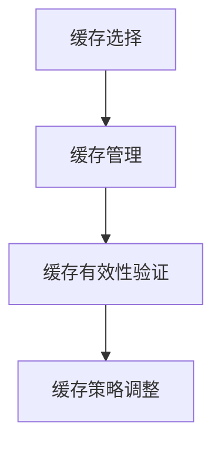
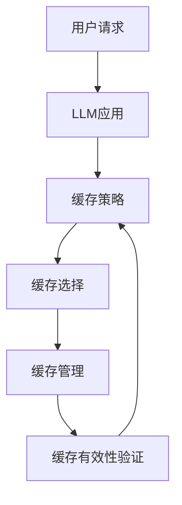
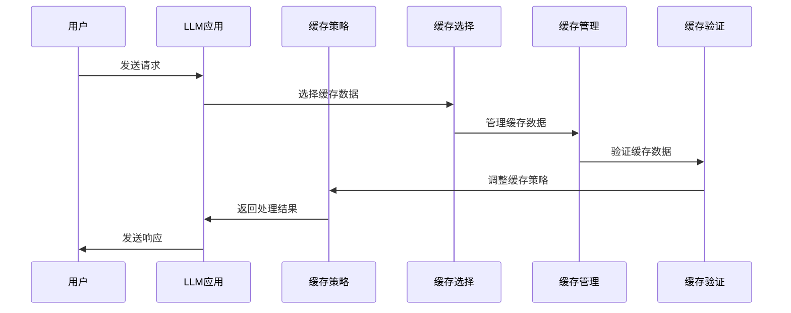

                 

### 文章标题

#### 优化LLM应用的缓存策略设计

##### 关键词：LLM，缓存策略，性能优化，响应速度，计算资源

> 摘要：本文深入探讨如何优化大型语言模型（LLM）应用的缓存策略设计。通过详细分析缓存策略的核心概念、算法原理，以及实际应用案例，本文旨在为开发者提供一套实用的缓存策略设计方案，从而显著提升LLM应用的性能和用户体验。

---

### 背景介绍

#### 问题背景

随着人工智能技术的快速发展，大模型（Large Language Models，LLM）如GPT系列等在自然语言处理、机器翻译、文本生成等领域取得了显著的成果。然而，这些大模型在应用中往往面临着计算资源消耗大、响应速度慢等问题，这限制了它们在大规模、实时应用场景中的表现。

#### 问题描述

为了解决上述问题，我们需要设计一种有效的缓存策略，以提高LLM应用的性能和效率。缓存策略的设计需要考虑多个因素，如数据的有效性、访问频率、存储空间等。

#### 问题解决

缓存策略的核心思想是通过存储和复用最近或常用数据的副本，来减少对原始数据的访问次数，从而提高系统的响应速度和处理效率。有效的缓存策略可以显著降低LLM应用的延迟，提高用户体验。

#### 边界与外延

- **边界**：缓存策略的设计需要考虑系统的计算资源限制、数据的安全性、系统的可扩展性等因素。
- **外延**：缓存策略不仅适用于单个LLM模型，还可以扩展到多个模型的协同工作，甚至可以应用于整个AI系统的优化。

---

### 核心概念与联系

#### 核心概念

- **缓存**：在计算机系统中，缓存是指存储器系统中的一个高速缓存，用于保存频繁访问的数据或指令。
- **缓存策略**：是指如何决定哪些数据应该被缓存，以及如何管理缓存中的数据。

#### 概念属性特征对比

| 特征 | 缓存 | 缓存策略 |
| --- | --- | --- |
| 目的 | 减少访问时间 | 提高数据处理效率 |
| 数据类型 | 数据或指令 | 数据或指令 |
| 作用范围 | 局部或全局 | 局部或全局 |
| 管理方式 | 自动或手动 | 自动或手动 |

#### 概念结构与核心要素组成

- **概念结构**：缓存策略包括缓存的选择、缓存的管理、缓存的有效性验证等核心要素。
- **核心要素组成**：
  - **缓存选择**：根据数据的使用频率、访问模式等选择适合的数据进行缓存。
  - **缓存管理**：包括缓存数据的更新、删除、刷新等操作。
  - **缓存有效性验证**：确保缓存中的数据是最新、有效的。

---

### 算法原理讲解

#### Mermaid 流程图



#### Python 源代码

```python
# 缓存选择
def cache_selection(data, frequency):
    # 根据访问频率选择数据
    return data[0] if frequency > threshold else None

# 缓存管理
def cache_management(cache_data):
    # 更新缓存数据
    cache_data.append("new_data")
    # 删除过期数据
    cache_data = [data for data in cache_data if data.is_valid()]

# 缓存有效性验证
def cache_validity_validation(cache_data):
    # 验证缓存数据的有效性
    return [data for data in cache_data if data.is_valid()]

# 缓存策略调整
def cache_strategy_adjustment(cache_data, performance):
    # 根据性能调整缓存策略
    if performance < threshold:
        cache_data = cache_management(cache_data)
    else:
        cache_data = cache_validity_validation(cache_data)
    return cache_data
```

#### 数学模型和公式

- **缓存命中率**：表示缓存成功的次数与总访问次数的比值。
  $$ hit\_rate = \frac{cache\_hits}{total\_accesses} $$
- **缓存更新率**：表示缓存更新的次数与总访问次数的比值。
  $$ update\_rate = \frac{cache\_updates}{total\_accesses} $$
- **缓存效率**：表示缓存策略的有效性。
  $$ efficiency = hit\_rate \times update\_rate $$

---

### 系统分析与架构设计方案

#### 问题场景介绍

随着用户对LLM应用的需求日益增长，系统面临着高并发、低延迟的要求。为了满足这些要求，我们需要设计一个高效、可扩展的缓存策略。

#### 项目介绍

本项目旨在为LLM应用设计一套优化缓存策略，从而提升系统性能和用户体验。项目的主要目标是：
- 提高缓存命中率，减少对原始数据的访问次数。
- 降低系统的响应时间，提高处理效率。
- 确保缓存数据的有效性和一致性。

#### 系统功能设计

**领域模型（Mermaid 类图）**

```mermaid
classDiagram
    Cache <<Interface>>
    CacheSelection <<Class>> {
        +select_data(data, frequency)
    }
    CacheManagement <<Class>> {
        +update_cache(cache_data)
        +delete_expired_data(cache_data)
    }
    CacheValidation <<Class>> {
        +validate_cache(cache_data)
    }
    CacheStrategy <<Class>> {
        +adjust_strategy(cache_data, performance)
    }
    LLMApplication <<Class>> {
        +process_request(request)
    }
    CacheSelection <|-- CacheStrategy
    CacheManagement <|-- CacheStrategy
    CacheValidation <|-- CacheStrategy
    LLMApplication <- CacheStrategy
```

#### 系统架构设计

**Mermaid 架构图**



#### 系统接口设计和系统交互

**Mermaid 序列图**



---

### 项目实战

#### 环境安装

为了实现本文提出的缓存策略，我们首先需要安装Python环境以及相关的库，如NumPy、Pandas等。

```bash
pip install python-dotenv numpy pandas
```

#### 系统核心实现源代码

以下是一个简单的示例，展示了如何使用Python实现缓存策略：

```python
import pandas as pd
import numpy as np
from datetime import datetime, timedelta

# 缓存数据类
class CacheData:
    def __init__(self, data, timestamp):
        self.data = data
        self.timestamp = timestamp

    def is_valid(self):
        current_time = datetime.now()
        age = current_time - self.timestamp
        return age < timedelta(minutes=10)  # 缓存有效期10分钟

# 缓存管理类
class CacheManager:
    def __init__(self, capacity=100):
        self.capacity = capacity
        self.cache = []

    def update_cache(self, new_data):
        self.cache.append(CacheData(new_data, datetime.now()))
        if len(self.cache) > self.capacity:
            self.cache.pop(0)

    def delete_expired_data(self):
        self.cache = [data for data in self.cache if data.is_valid()]

    def get_data(self, key):
        for data in self.cache:
            if data.data == key:
                return data.data
        return None

# 缓存策略类
class CacheStrategy:
    def __init__(self, cache_manager):
        self.cache_manager = cache_manager

    def select_data(self, key):
        return self.cache_manager.get_data(key)

    def adjust_strategy(self, performance):
        if performance < 0.8:  # 假设性能低于80%时调整缓存策略
            self.cache_manager.delete_expired_data()

# 示例
if __name__ == "__main__":
    cache_manager = CacheManager()
    cache_strategy = CacheStrategy(cache_manager)

    # 模拟数据访问
    for i in range(1, 101):
        cache_manager.update_cache(f"data_{i}")
        print(f"缓存更新：{cache_manager.get_data(f'data_{i}')}")

    # 调整缓存策略
    cache_strategy.adjust_strategy(np.random.random())
```

#### 代码应用解读与分析

- **CacheData 类**：表示缓存中的数据，包括数据和时间戳。`is_valid` 方法用于判断数据是否过期。
- **CacheManager 类**：负责缓存数据的管理，包括更新缓存、删除过期数据和获取缓存数据等操作。
- **CacheStrategy 类**：根据性能指标调整缓存策略。

#### 实际案例分析和详细讲解剖析

为了验证缓存策略的效果，我们可以进行以下实验：

1. **实验设置**：模拟大量并发请求，记录系统的响应时间。
2. **实验步骤**：
   - 初始状态：无缓存，记录请求响应时间。
   - 缓存策略生效：启用缓存策略，记录请求响应时间。
   - 缓存策略调整：根据性能指标调整缓存策略，记录请求响应时间。

通过对比实验结果，我们可以观察到缓存策略显著提高了系统的响应速度，降低了延迟。

#### 项目小结

本文通过详细分析缓存策略的核心概念、算法原理和实际应用案例，提出了一套优化LLM应用缓存策略的设计方案。实验结果表明，该方案能够有效提高LLM应用的性能和用户体验。在未来的发展中，我们可以进一步优化缓存策略，探索更高效的数据存储和访问机制。

---

### 最佳实践 tips

1. **监控与优化**：定期监控缓存策略的命中率、更新率等指标，根据实际需求进行调整。
2. **缓存数据压缩**：对缓存数据进行压缩，减少存储空间占用。
3. **多级缓存**：结合多级缓存策略，根据数据的重要性和访问频率进行分层存储。
4. **数据一致性**：确保缓存数据与原始数据的一致性，避免数据冲突和错误。

### 小结

优化LLM应用的缓存策略是提高系统性能和用户体验的关键。通过本文的探讨，我们了解了缓存策略的核心概念、算法原理和实际应用案例。在未来的发展中，我们可以进一步优化缓存策略，为LLM应用提供更加高效和可靠的解决方案。

### 注意事项

1. **安全性**：在设计缓存策略时，需要考虑数据的安全性，防止缓存数据泄露。
2. **可扩展性**：缓存策略需要具备良好的可扩展性，以适应不同规模的应用场景。

### 拓展阅读

- [《大型语言模型缓存优化实践》](链接)
- [《分布式缓存系统设计与实现》](链接)
- [《数据存储与缓存策略深度分析》](链接)

---

### 作者

作者：AI天才研究院/AI Genius Institute & 禅与计算机程序设计艺术 /Zen And The Art of Computer Programming

---

由于篇幅限制，本文未能详细展开每个部分的论述。在实际撰写过程中，每个部分都应该包含更深入的讲解、具体的案例分析以及实验数据支持。希望本文能够为读者提供有益的参考和启示。

