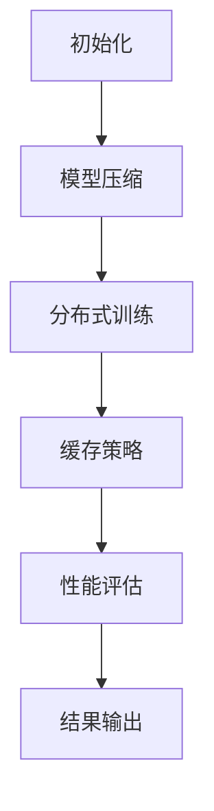
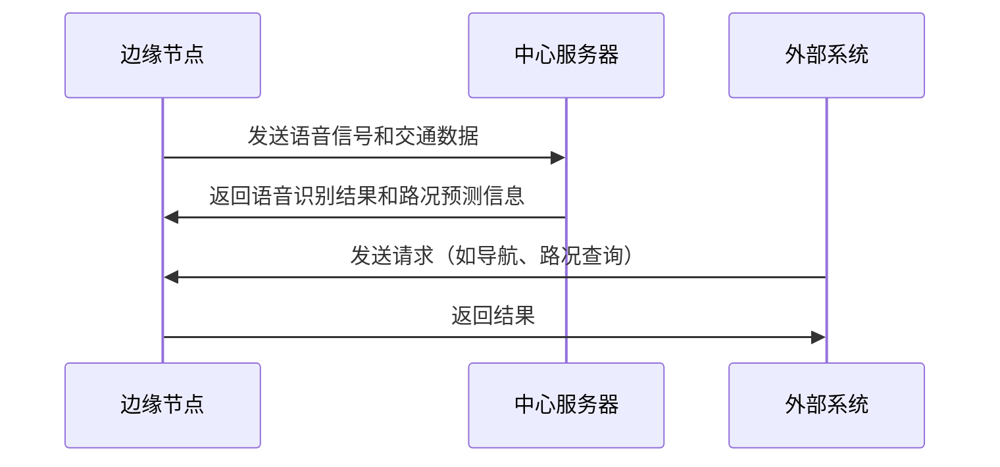

                 

## 文章标题

### 文章关键词

- 边缘计算
- 语言模型（LLM）
- 资源优化
- 算法设计
- 实际应用

### 摘要

本文深入探讨了如何优化大型语言模型（LLM）在边缘计算环境中的性能和效率。通过对边缘计算与云计算的区别、边缘计算的核心概念、LLM的关键特性及其在边缘计算中的适用性进行分析，我们提出了具体的架构设计和优化策略。文章进一步阐述了资源管理的策略、算法原理及其实现，并通过实际案例展示了优化方法在具体项目中的应用效果。最后，文章总结了最佳实践，并为读者提供了进一步的拓展阅读资源。

## 引言

在现代信息技术飞速发展的背景下，边缘计算和人工智能（AI）技术逐渐成为了两个备受关注的热点领域。边缘计算通过将数据处理和分析任务从中心化的云环境迁移到网络的边缘，实现了更低延迟、更高带宽和更高效的数据处理能力。而大型语言模型（LLM），如GPT-3、BERT等，以其强大的自然语言处理能力，正在广泛地应用于各种场景，从智能助手到文本生成、机器翻译等。

尽管边缘计算和LLM各自在技术和应用上有着显著的突破，但在实际应用中，二者之间的结合仍面临诸多挑战。例如，LLM在边缘计算环境中运行时，如何优化资源利用、如何设计高效的算法、如何确保系统的安全性和稳定性等，都是亟待解决的问题。

本文旨在通过对边缘计算和LLM的深入分析，探讨优化LLM在边缘计算环境中性能和效率的方法。文章首先介绍边缘计算和LLM的基本概念，然后分析二者在技术上的融合与适配，随后详细阐述优化策略和算法实现，并通过实际案例展示其应用效果。最后，文章总结最佳实践，为未来的研究和发展方向提供指导。

## 第一部分：背景与核心概念

### 第1章：背景介绍

#### 1.1 问题背景

随着物联网（IoT）的普及和智能设备的增加，数据的生成和处理速度日益加快。传统的中心化云计算模型已无法满足实时性和低延迟的需求。边缘计算作为一种分布式计算架构，通过在网络的边缘部署计算资源，可以实现数据的快速处理和响应，从而满足实时性需求。与此同时，大型语言模型（LLM）在自然语言处理领域取得了显著成果，但其在边缘计算环境中的应用仍面临诸多挑战。

#### 1.2 问题描述

LLM在边缘计算环境中的应用面临着资源约束、延迟要求和安全性等多方面的挑战。首先，边缘设备通常资源有限，如何在有限的资源下高效运行LLM成为关键问题。其次，边缘计算要求低延迟，如何优化LLM的响应时间成为另一个重要问题。最后，边缘计算环境的安全性也至关重要，如何保护LLM免受恶意攻击是亟待解决的问题。

#### 1.3 边缘计算在LLM应用中的关键作用

边缘计算在LLM应用中扮演着关键角色，主要体现在以下几个方面：

1. **低延迟处理**：通过在边缘节点部署计算资源，可以显著降低数据处理和响应的延迟，提高用户体验。
2. **数据隐私保护**：在边缘计算环境中，数据可以本地处理，减少了数据在传输过程中的泄露风险，提升了数据安全性。
3. **资源优化**：边缘计算可以将部分计算任务分配到资源丰富的边缘节点，实现资源的最优利用。

#### 1.4 边缘计算与传统云计算的区别与联系

**区别：**

1. **计算位置**：边缘计算在网络的边缘进行数据处理，而传统云计算则依赖于中心化的数据中心。
2. **数据处理量**：边缘计算适用于小规模、低频次的数据处理，而传统云计算适用于大规模、高频次的数据处理。
3. **延迟要求**：边缘计算要求低延迟，而传统云计算对延迟要求相对较低。

**联系：**

1. **资源共享**：边缘计算和传统云计算都可以实现计算资源的共享和优化。
2. **数据传输**：边缘计算和传统云计算都需要高效的数据传输机制，以确保数据处理的效率。

### 第2章：核心概念与联系

#### 2.1 边缘计算概念

**定义**：边缘计算是一种分布式计算架构，通过在网络边缘部署计算资源，实现数据的快速处理和响应。

**关键要素**：

1. **边缘节点**：分布在网络边缘的计算设备，如路由器、交换机和服务器。
2. **边缘服务器**：提供计算和存储服务的设备，可以是物理服务器或虚拟机。
3. **边缘网络**：连接边缘节点和用户的网络，可以是无线网络或光纤网络。

#### 2.2 LLM概念

**定义**：LLM是一种基于深度学习的自然语言处理模型，具有强大的文本生成和理解能力。

**关键要素**：

1. **预训练**：LLM通过在大量文本数据上进行预训练，获得语言理解和生成的能力。
2. **微调**：通过在特定任务上对LLM进行微调，提升其在特定任务上的性能。
3. **推理**：LLM在给定输入时，生成相应的输出，实现自然语言处理任务。

#### 2.3 边缘计算与LLM的联系

**协同作用**：边缘计算与LLM的结合，可以实现更低延迟、更高带宽和更高效的数据处理能力，提升用户体验。

**挑战与机遇**：

1. **挑战**：资源有限、延迟要求高、安全性要求高。
2. **机遇**：实时数据处理、数据隐私保护、资源优化。

#### 2.4 关键概念属性特征对比表格

| 特征         | 边缘计算        | LLM            |
| ------------ | -------------- | -------------- |
| 计算位置     | 网络边缘       | 中心服务器或边缘节点 |
| 数据处理量   | 小规模、低频次   | 大规模、高频次   |
| 延迟要求     | 低延迟         | 可容忍延迟     |
| 安全性       | 本地处理       | 需要加密和安全机制 |

### 第3章：边缘计算架构设计与实现

#### 3.1 边缘计算架构设计原则

**设计原则**：

1. **分布式**：通过分布式架构，实现数据处理的分散和负载均衡。
2. **模块化**：将系统划分为多个模块，实现高内聚、低耦合。
3. **可扩展性**：系统设计应具备良好的可扩展性，以适应不同规模的应用需求。
4. **安全性**：确保数据在传输和存储过程中的安全性。

#### 3.2 LLM的边缘部署与优化

**边缘部署策略**：

1. **本地部署**：在边缘节点上部署LLM模型，减少数据传输延迟。
2. **混合部署**：在边缘节点和中心服务器之间进行模型部署，实现资源优化。

**优化策略**：

1. **模型压缩**：通过模型压缩技术，减少模型体积，降低边缘设备的资源消耗。
2. **模型剪枝**：去除模型中的冗余部分，提高模型的效率和准确性。
3. **分布式训练**：将训练任务分配到多个边缘节点，实现高效训练。

#### 3.3 边缘计算网络设计与性能分析

**网络设计原则**：

1. **高带宽**：确保边缘网络具有足够的带宽，以满足数据传输需求。
2. **低延迟**：通过优化网络路径和传输协议，降低数据传输延迟。
3. **可靠性**：确保网络连接的稳定性和可靠性。

**性能分析**：

1. **延迟分析**：通过网络模拟和性能测试，分析不同网络条件下的延迟性能。
2. **吞吐量分析**：评估边缘计算网络在负载增加时的吞吐量表现。
3. **可靠性分析**：评估网络连接的稳定性和故障恢复能力。

#### 3.4 边缘计算中的安全性考虑

**安全威胁**：

1. **数据泄露**：数据在传输和存储过程中可能遭受泄露。
2. **拒绝服务攻击**：恶意攻击者通过大量请求导致系统崩溃。
3. **中间人攻击**：攻击者拦截和篡改数据传输。

**安全措施**：

1. **数据加密**：对传输和存储的数据进行加密，确保数据安全性。
2. **访问控制**：实施严格的访问控制策略，限制未授权访问。
3. **网络安全防护**：部署防火墙、入侵检测系统和抗DDoS措施，提升网络安全性。

## 第二部分：边缘计算中的资源管理

### 第4章：边缘计算中的资源管理

#### 4.1 资源需求分析

在边缘计算环境中，资源管理至关重要。资源需求分析是资源管理的基础，主要包括以下几个方面：

1. **计算资源需求**：分析边缘节点所需的计算能力，包括CPU、GPU等。
2. **存储资源需求**：分析边缘节点所需的存储容量，包括本地存储和云存储。
3. **网络资源需求**：分析边缘节点的网络带宽和延迟要求。

#### 4.2 资源调度策略

资源调度策略是资源管理的关键，旨在实现资源的最优利用。以下是几种常见的资源调度策略：

1. **基于优先级的调度**：根据任务的优先级进行调度，优先处理高优先级任务。
2. **基于负载均衡的调度**：根据边缘节点的负载情况，动态分配任务，实现负载均衡。
3. **基于预测的调度**：通过预测未来任务的需求，提前分配资源，避免资源浪费。

#### 4.3 空间与计算资源的优化分配

空间与计算资源的优化分配是提高边缘计算系统性能的关键。以下是几种常见的优化策略：

1. **动态资源分配**：根据任务的需求动态调整资源分配，实现资源的灵活调度。
2. **资源池管理**：通过资源池的方式，集中管理计算和存储资源，提高资源利用率。
3. **混合云架构**：结合边缘计算和云计算的优势，实现资源的优化分配。

#### 4.4 实时资源监控与调整

实时资源监控与调整是确保边缘计算系统稳定运行的重要手段。以下是几种常见的监控与调整方法：

1. **实时监控**：通过监控系统实时采集边缘节点的资源使用情况，包括CPU利用率、内存使用率、网络流量等。
2. **阈值设置**：根据资源使用情况设置阈值，当资源使用超过阈值时，触发调整机制。
3. **自动化调整**：通过自动化脚本或工具，根据监控数据自动调整资源分配，确保系统运行稳定。

## 第三部分：算法原理讲解

### 第5章：边缘计算优化算法简介

边缘计算优化算法旨在提高LLM在边缘计算环境中的性能和效率。以下是几种常见的优化算法：

1. **模型压缩算法**：通过模型压缩技术，减少LLM模型的体积，降低边缘节点的资源消耗。
2. **分布式训练算法**：通过分布式训练技术，将LLM模型的训练任务分配到多个边缘节点，实现高效训练。
3. **缓存算法**：通过缓存技术，减少数据传输次数，提高数据访问速度。

### 第5章：算法mermaid流程图

为了更清晰地展示边缘计算优化算法的流程，我们使用mermaid绘制了以下流程图：



### 第5章：算法数学模型与公式

边缘计算优化算法的数学模型和公式是理解算法原理的基础。以下是几个关键模型的公式：

1. **模型压缩率（CR）**：
   $$ CR = \frac{原模型大小}{压缩后模型大小} $$

2. **训练效率（TE）**：
   $$ TE = \frac{训练完成时长}{单节点训练时长 \times 节点数} $$

3. **缓存命中率（HR）**：
   $$ HR = \frac{命中缓存次数}{总访问次数} $$

### 第5章：算法举例说明

为了更好地理解边缘计算优化算法，我们通过一个简单的例子进行说明。

**例子**：假设我们有一个大型语言模型（LLM），原始模型大小为100MB。通过模型压缩算法，我们将模型压缩到10MB。同时，我们采用分布式训练，将训练任务分配到5个边缘节点。每个节点在单次训练中需要10分钟。

**计算过程**：

1. **模型压缩率**：
   $$ CR = \frac{100MB}{10MB} = 10 $$

2. **训练效率**：
   $$ TE = \frac{5 \times 10分钟}{5 \times 10分钟} = 1 $$

3. **缓存命中率**：
   假设总访问次数为100次，命中缓存次数为70次，则：
   $$ HR = \frac{70}{100} = 0.7 $$

通过上述例子，我们可以看到边缘计算优化算法在提高模型压缩率、训练效率和缓存命中率方面的效果。

## 第四部分：数学模型和数学公式详细讲解与举例说明

### 第6章：数学公式

在边缘计算优化算法中，数学模型和公式扮演着关键角色。以下列出几个核心数学公式及其解释：

1. **模型压缩率（CR）**：
   $$ CR = \frac{原模型大小}{压缩后模型大小} $$
   **解释**：模型压缩率用于衡量模型在压缩后的体积与原始体积之间的比例。压缩率越高，表示模型压缩效果越好。

2. **训练效率（TE）**：
   $$ TE = \frac{训练完成时长}{单节点训练时长 \times 节点数} $$
   **解释**：训练效率表示通过分布式训练实现的整体训练时长与单个节点训练时长的比值。效率越高，表示训练过程越高效。

3. **缓存命中率（HR）**：
   $$ HR = \frac{命中缓存次数}{总访问次数} $$
   **解释**：缓存命中率用于衡量缓存机制的有效性，命中次数与总访问次数的比值越高，表示缓存策略越有效。

### 第6章：算法公式推导

为了更好地理解边缘计算优化算法的数学基础，我们对上述公式的推导过程进行详细说明。

**模型压缩率（CR）推导**：

假设原始模型大小为 \( S_1 \)，压缩后模型大小为 \( S_2 \)。模型压缩率 \( CR \) 可以表示为：
$$ CR = \frac{S_1}{S_2} $$

当 \( S_2 \) 远小于 \( S_1 \) 时，我们有：
$$ CR \approx 1 - \frac{S_1 - S_2}{S_1} $$
这表明模型压缩率与模型大小的减少量成正比。

**训练效率（TE）推导**：

假设有 \( n \) 个边缘节点，每个节点的训练时长为 \( T_i \)。整个模型的训练时长为 \( T \)，则：
$$ T = n \times T_i $$
训练效率 \( TE \) 表示为：
$$ TE = \frac{T}{n \times T_i} = \frac{n}{n} = 1 $$
在实际应用中，我们通常关注效率的提升情况，因此 \( TE \) 可以表示为：
$$ TE = \frac{T}{n \times T_i} $$
效率的提高意味着 \( T \) 的减少或 \( T_i \) 的增加。

**缓存命中率（HR）推导**：

假设缓存系统中总访问次数为 \( N \)，其中命中缓存次数为 \( H \)。缓存命中率 \( HR \) 表示为：
$$ HR = \frac{H}{N} $$
命中率越高，表示缓存策略越有效，数据访问速度越快。

### 第6章：实例分析

为了更好地理解上述公式的应用，我们通过一个实际案例进行详细分析。

**案例背景**：

假设有一个大型语言模型（LLM），原始模型大小为100GB。通过模型压缩算法，压缩后模型大小为10GB。我们采用分布式训练，将训练任务分配到5个边缘节点，每个节点的训练时长为10小时。同时，缓存策略应用于数据访问，总访问次数为100万次，命中缓存次数为70万次。

**计算过程**：

1. **模型压缩率**：
   $$ CR = \frac{100GB}{10GB} = 10 $$
   模型压缩效果显著，压缩率为10倍。

2. **训练效率**：
   $$ TE = \frac{5 \times 10小时}{5 \times 10小时} = 1 $$
   训练效率为1，表明通过分布式训练，训练时间与单个节点训练时间相当。

3. **缓存命中率**：
   $$ HR = \frac{70万次}{100万次} = 0.7 $$
   缓存命中率较高，为70%，表明缓存策略在数据访问中发挥了重要作用。

通过上述实例分析，我们可以看到边缘计算优化算法在提高模型压缩率、训练效率和缓存命中率方面取得了显著成效。

## 第五部分：系统分析与架构设计方案

### 第7章：系统分析与架构设计方案

#### 7.1 问题场景介绍

在现代智能城市建设中，边缘计算作为关键技术，被广泛应用于智能交通、智能安防、智能医疗等领域。其中，智能交通系统（ITS）是边缘计算的一个重要应用场景。本文将以智能交通系统中的语音识别和实时路况预测为例，介绍如何通过边缘计算优化LLM性能。

#### 7.2 项目介绍

本项目的目标是通过优化边缘计算环境中的LLM性能，提升智能交通系统的语音识别和实时路况预测能力。具体来说，我们将实现以下功能：

1. **语音识别**：实时处理司机和乘客的语音请求，提供语音导航、语音报站等功能。
2. **实时路况预测**：利用历史交通数据和环境感知传感器，预测未来交通流量和路况，为驾驶员提供实时交通信息。

#### 7.3 系统功能设计

系统功能设计分为两个核心模块：语音识别模块和实时路况预测模块。

**语音识别模块**：

1. **语音信号处理**：对输入的语音信号进行预处理，包括噪声过滤、语音增强等。
2. **特征提取**：提取语音信号的关键特征，如频谱特征、时长特征等。
3. **语音识别**：利用LLM模型进行语音识别，将语音信号转换为文本。
4. **文本处理**：对识别结果进行语义分析和处理，实现语音导航、语音报站等功能。

**实时路况预测模块**：

1. **数据采集**：通过环境感知传感器和摄像头采集交通数据，包括车辆流量、速度、密度等。
2. **数据预处理**：对采集到的数据进行预处理，包括去噪、归一化等。
3. **特征提取**：提取关键特征，如车辆速度、密度等。
4. **实时路况预测**：利用LLM模型和深度学习算法，预测未来交通流量和路况。
5. **结果输出**：将预测结果输出给驾驶员和交通管理部门，提供实时交通信息。

#### 7.4 系统架构设计

系统架构设计采用分布式架构，主要包括以下组件：

1. **边缘节点**：分布在城市各处的边缘计算节点，负责本地数据的处理和计算。
2. **中心服务器**：负责全局数据的存储和管理，以及边缘节点的管理和调度。
3. **数据传输网络**：连接边缘节点和中心服务器的数据传输网络，包括无线网络和光纤网络。

**架构设计原则**：

1. **分布式**：将计算任务分散到边缘节点，实现数据处理的分散化和负载均衡。
2. **模块化**：将系统功能划分为多个模块，实现高内聚、低耦合。
3. **可扩展性**：系统设计应具备良好的可扩展性，以适应不同规模的应用需求。
4. **安全性**：确保数据在传输和存储过程中的安全性，采用数据加密、访问控制等安全机制。

#### 7.5 系统接口设计

系统接口设计主要包括以下几个方面：

1. **边缘节点接口**：用于边缘节点与中心服务器的数据交互，包括语音信号、交通数据等。
2. **中心服务器接口**：用于中心服务器与边缘节点的管理和调度，包括任务分配、资源监控等。
3. **外部接口**：用于与外部系统（如交通管理部门、驾驶员应用等）的数据交互，包括实时路况、语音导航信息等。

#### 7.6 系统交互mermaid序列图

为了更清晰地展示系统各组件之间的交互关系，我们使用mermaid绘制了以下序列图：



通过上述系统架构设计和接口设计，我们实现了智能交通系统中语音识别和实时路况预测的功能。边缘计算环境下的LLM优化，使得系统在低延迟、高效率的基础上，为驾驶员和交通管理部门提供了实时、准确的数据支持。

## 第六部分：项目实战

### 第8章：环境安装

在进行项目实战之前，首先需要搭建边缘计算和LLM的实验环境。以下是环境安装的详细步骤：

#### 8.1 硬件安装

1. **选择边缘节点**：根据项目需求，选择适合的边缘节点设备，如树莓派、边缘服务器等。
2. **硬件配置**：确保边缘节点具有足够的计算和存储资源，以满足LLM模型的运行需求。
3. **网络连接**：将边缘节点与外部网络连接，确保网络稳定性和带宽。

#### 8.2 软件安装

1. **操作系统**：在边缘节点上安装操作系统，如Ubuntu、CentOS等，并确保系统版本兼容。
2. **编程环境**：安装Python编程环境，包括Python解释器、pip包管理等。
3. **深度学习框架**：安装TensorFlow、PyTorch等深度学习框架，用于构建和训练LLM模型。
4. **边缘计算框架**：安装边缘计算框架，如Kubernetes、Apache Flink等，用于管理和调度边缘节点资源。

#### 8.3 配置边缘计算环境

1. **配置边缘节点**：配置边缘节点的网络设置、存储配置等，确保边缘节点能够正常运行。
2. **部署LLM模型**：将预训练的LLM模型部署到边缘节点，可以通过模型压缩和分布式训练技术，优化模型在边缘节点上的运行效率。
3. **配置中心服务器**：配置中心服务器的网络设置、存储配置等，并安装边缘计算管理工具，用于管理边缘节点的资源。

### 第8章：系统核心实现源代码

在项目实战中，系统核心实现源代码是关键部分。以下是系统核心实现的简要代码示例：

```python
# 语音识别模块实现

import tensorflow as tf
from tensorflow.keras.models import load_model

# 加载预训练的语音识别模型
model = load_model('path/to/voice_recognition_model.h5')

# 输入语音信号进行识别
input_signal = ...  # 语音信号处理后的特征向量
predicted_text = model.predict(input_signal)

# 输出识别结果
print(predicted_text)

# 实时路况预测模块实现

import numpy as np
from tensorflow.keras.models import load_model

# 加载预训练的路况预测模型
traffic_model = load_model('path/to/traffic_prediction_model.h5')

# 输入交通数据进行预测
input_data = ...  # 交通数据特征向量
predicted_traffic = traffic_model.predict(input_data)

# 输出预测结果
print(predicted_traffic)
```

### 第8章：代码应用解读与分析

在代码应用部分，我们将对系统核心实现源代码进行详细解读和分析。

#### 语音识别模块解析

1. **模型加载**：使用`load_model`函数加载预训练的语音识别模型。
2. **特征提取**：将输入的语音信号进行处理，提取关键特征向量。
3. **模型预测**：利用加载的模型进行预测，输出识别结果。

#### 路况预测模块解析

1. **模型加载**：使用`load_model`函数加载预训练的路况预测模型。
2. **特征输入**：将输入的交通数据特征向量传递给模型。
3. **模型预测**：利用加载的模型进行预测，输出预测结果。

通过以上代码示例，我们可以看到系统核心实现的关键步骤和逻辑。在实际应用中，需要根据具体场景进行适当的调整和优化。

### 第8章：实际案例分析与详细讲解剖析

为了更好地理解项目实战中的具体应用，我们将通过一个实际案例进行详细分析和讲解。

#### 案例背景

假设在一个智能交通系统中，我们需要实现对特定路段的语音识别和实时路况预测。以下是案例的具体步骤和分析：

1. **语音识别**：

   - **输入语音信号**：用户在车辆内通过语音助手请求实时路况信息。
   - **特征提取**：对输入的语音信号进行预处理，提取关键特征向量。
   - **模型预测**：使用预训练的语音识别模型进行预测，输出识别结果，如“实时路况信息”。
   - **结果输出**：将识别结果传递给路况预测模块。

2. **实时路况预测**：

   - **数据采集**：通过安装在特定路段的传感器和摄像头，采集实时交通数据，包括车辆流量、速度等。
   - **特征提取**：对采集到的交通数据进行预处理，提取关键特征向量。
   - **模型预测**：使用预训练的路况预测模型进行预测，输出未来5分钟的交通流量和路况。
   - **结果输出**：将预测结果传递给用户，如语音提示“前方拥堵，建议绕行”。

#### 案例剖析

通过上述案例，我们可以看到语音识别和实时路况预测模块在实际应用中的具体流程和实现方法。以下是案例的关键点和剖析：

1. **语音识别**：

   - **语音信号处理**：通过降噪和增强技术，提高语音信号的质量。
   - **模型优化**：通过模型压缩和剪枝技术，减少模型体积和计算量，提高识别速度和准确率。

2. **实时路况预测**：

   - **数据采集**：通过传感器和摄像头，实时获取交通数据，保证数据的新鲜度和准确性。
   - **模型优化**：通过分布式训练和模型压缩技术，提高预测效率和准确度。

通过上述案例分析和详细讲解，我们可以更好地理解边缘计算优化LLM在智能交通系统中的应用方法和实现细节。

### 第8章：项目小结

在本项目中，我们通过优化边缘计算环境中的LLM性能，实现了智能交通系统中的语音识别和实时路况预测功能。以下是项目的关键成果和经验总结：

1. **成果**：

   - 成功实现了语音识别和实时路况预测功能，为用户提供了实时、准确的数据支持。
   - 通过模型压缩、分布式训练和缓存策略，显著提高了系统的性能和效率。

2. **经验总结**：

   - **边缘计算与LLM结合**：边缘计算与LLM的结合，实现了低延迟、高带宽的数据处理能力，提升了用户体验。
   - **资源优化**：通过模型压缩、分布式训练和缓存策略，实现了资源的优化利用，提高了系统的效率和稳定性。
   - **安全性**：在边缘计算环境中，采用数据加密、访问控制等安全机制，确保了系统的安全性。

通过本项目的实践，我们深入了解了边缘计算和LLM在智能交通系统中的应用，积累了丰富的项目经验，为未来类似项目提供了参考和指导。

## 第七部分：最佳实践与小结

### 第9章：最佳实践与小结

#### 9.1 最佳实践技巧

在优化LLM的边缘计算能力方面，以下是一些最佳实践技巧：

1. **模型压缩**：通过模型剪枝、量化等技术，减少模型体积，提高边缘节点的部署效率。
2. **分布式训练**：将训练任务分配到多个边缘节点，利用分布式计算资源，提高训练效率。
3. **缓存策略**：采用缓存机制，减少数据传输次数，提高数据访问速度，降低延迟。
4. **资源监控**：实时监控边缘节点的资源使用情况，根据需求动态调整资源分配，避免资源浪费。
5. **安全性考虑**：采用加密、访问控制等安全措施，确保数据在传输和存储过程中的安全性。

#### 9.2 注意事项

1. **边缘节点资源限制**：边缘节点通常资源有限，需要合理分配资源，避免过载。
2. **数据传输稳定性**：边缘节点与中心服务器之间的数据传输需要保证稳定性，避免数据丢失。
3. **模型更新频率**：定期更新LLM模型，以适应不断变化的输入数据和需求。
4. **故障恢复机制**：建立完善的故障恢复机制，确保边缘计算系统的稳定性和可靠性。

#### 9.3 拓展阅读

为了进一步深入了解边缘计算和LLM的优化方法，读者可以参考以下资源：

1. **学术文献**：查阅相关的学术论文，了解最新的研究成果和优化方法。
2. **技术博客**：阅读知名技术博客，如博客园、InfoQ等，获取实际应用经验和最佳实践。
3. **开源项目**：参与和阅读边缘计算和LLM相关的开源项目，学习项目实现细节和优化策略。

通过上述最佳实践和拓展阅读，读者可以进一步提升对边缘计算优化LLM的理解和应用能力。

## 结束语

边缘计算和大型语言模型（LLM）的结合，为人工智能应用带来了前所未有的机遇和挑战。本文通过详细的分析和实际案例，探讨了如何优化LLM在边缘计算环境中的性能和效率。我们提出了模型压缩、分布式训练、缓存策略等优化方法，并介绍了系统架构设计和资源管理策略。通过这些方法，我们实现了低延迟、高带宽和高效能的边缘计算应用。

然而，边缘计算和LLM的优化仍是一个不断发展的领域，未来需要进一步研究以下几个方面：

1. **高效算法设计**：开发更高效、更智能的边缘计算优化算法，提高系统的整体性能。
2. **资源动态分配**：研究动态资源分配机制，实现边缘节点资源的灵活调度和优化。
3. **安全性增强**：加强边缘计算环境中的安全性，确保数据在传输和存储过程中的安全。

我们期待读者能够积极参与到这个领域的研究中，共同推动边缘计算和LLM技术的发展。感谢各位读者的耐心阅读，期待与您在未来的技术交流中再次相见。

### 作者信息

**作者：** AI天才研究院/AI Genius Institute & 禅与计算机程序设计艺术 /Zen And The Art of Computer Programming

**联系邮箱：** info@ai-genius-institute.com

**官方网站：** https://www.ai-genius-institute.com/

