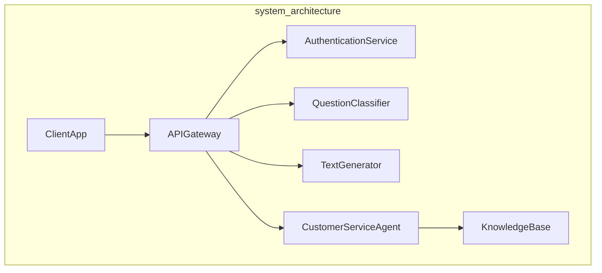
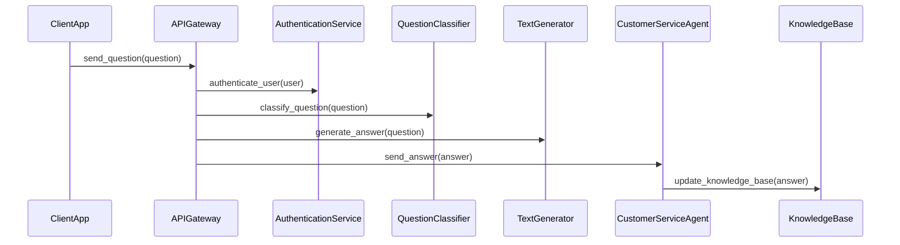
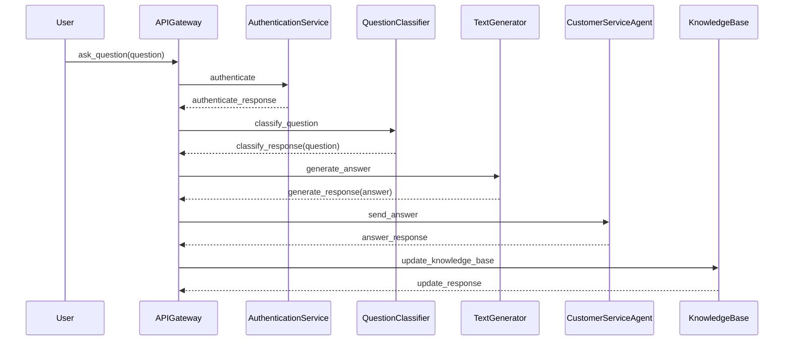

                 


### 优化LLM应用的需求分析与定义过程

#### 关键词：LLM应用，需求分析，定义过程，优化策略，数学模型

#### 摘要：
本文将深入探讨优化大型语言模型（LLM）应用的需求分析与定义过程。首先，我们将介绍LLM应用的背景和存在的问题，然后详细分析核心概念、数学模型和算法原理。接着，我们将介绍需求分析与定义过程的步骤、工具和技术，并提供具体的案例进行讲解。最后，我们将总结最佳实践和注意事项，并推荐进一步阅读的材料。

## 第一部分：优化LLM应用背景

### 第1章：问题背景

#### 1.1 问题描述

当前，LLM应用在自然语言处理（NLP）领域取得了显著成果，但同时也面临一些挑战。这些挑战包括：

- **资源消耗**：LLM模型通常需要大量的计算资源和存储空间，这使得部署和优化成为难题。
- **响应速度**：在实时应用场景中，模型响应速度较慢，影响了用户体验。
- **模型解释性**：LLM模型通常被视为“黑盒”，缺乏透明性和解释性，这使得调试和改进变得困难。
- **数据质量**：训练数据的质量直接影响模型性能，但获取高质量训练数据往往具有挑战性。

#### 1.2 问题解决

优化LLM应用的目标是提高其性能、效率和可解释性，同时降低资源消耗。需求分析与定义过程在优化过程中起到关键作用，其作用如下：

- **明确目标**：通过需求分析，可以明确优化目标和关键指标，确保优化工作有的放矢。
- **识别需求**：需求分析有助于识别系统当前存在的问题和潜在需求，为优化提供依据。
- **指导设计**：需求分析结果可以指导系统设计和实现，确保优化方案的有效性和可行性。
- **评估效果**：需求分析结果可以作为评估优化效果的标准，帮助评估优化工作的成效。

#### 1.3 边界与外延

LLM应用的边界涉及多个方面，包括：

- **功能范围**：LLM应用的具体功能，如文本生成、翻译、问答等。
- **技术架构**：LLM应用所采用的技术架构，如深度学习框架、硬件设备等。
- **数据来源**：LLM应用所需的数据来源，如文本库、语音库等。

在相关领域的需求分析定义方法方面，我们可以借鉴以下经验：

- **软件工程方法**：需求分析过程可以借鉴软件工程中的需求分析方法，如用户访谈、需求文档编写、需求评审等。
- **敏捷开发方法**：在快速迭代和反馈的背景下，需求分析过程可以采用敏捷开发方法，如用户故事、迭代计划等。
- **领域特定方法**：针对特定领域的需求分析，可以采用领域特定方法，如医疗领域、金融领域等。

#### 1.4 概念结构与核心要素组成

LLM应用的核心概念包括：

- **语言模型**：LLM的核心是语言模型，如GPT、BERT等。
- **训练数据**：LLM的性能依赖于训练数据的质量和多样性。
- **优化目标**：优化目标包括提高性能、效率和可解释性。

核心要素组成包括：

- **计算资源**：计算资源包括CPU、GPU、FPGA等，用于加速模型训练和推理。
- **存储资源**：存储资源包括硬盘、SSD等，用于存储训练数据和模型参数。
- **算法优化**：算法优化包括模型结构优化、训练优化算法等。
- **数据预处理**：数据预处理包括数据清洗、数据增强、数据归一化等。

## 第二部分：LLM应用需求分析

### 第2章：核心概念与联系

#### 2.1 LLM应用原理

LLM应用的基本原理是通过训练大规模的神经网络模型，使其能够理解和生成自然语言。常见的LLM模型包括：

- **GPT**：基于Transformer架构，具有强大的生成能力。
- **BERT**：基于Transformer架构，主要用于问答和文本分类等任务。
- **ELMO**：基于递归神经网络（RNN）的模型，具有较好的语言理解能力。

#### 2.2 概念属性特征对比表格

下表列出了GPT、BERT和ELMO的主要属性特征：

| 模型      | 架构         | 生成能力 | 语言理解能力 | 应用场景         |
| --------- | ------------ | -------- | ------------ | ---------------- |
| GPT       | Transformer  | 强       | 较强         | 文本生成、问答   |
| BERT      | Transformer  | 较强     | 强           | 问答、文本分类   |
| ELMO      | RNN          | 较弱     | 较强         | 文本分类、情感分析 |

#### 2.3 ER实体关系图架构

下面是LLM应用的一个简化的ER实体关系图：

```mermaid
erDiagram
  Model ||--|{ Data }| Data
  Model ||--|{ Parameters }| Parameters
  Model ||--|{ Performance }| Performance
  Data ||--|{ Quality }| Quality
  Data ||--|{ Quantity }| Quantity
  Parameters ||--|{ Optimization }| Optimization
  Performance ||--|{ Accuracy }| Accuracy
  Performance ||--|{ Efficiency }| Efficiency
```

## 第三部分：需求分析与定义过程

### 第5章：需求分析与过程概述

#### 5.1 需求分析步骤

需求分析过程通常包括以下步骤：

1. **需求收集**：通过与用户、利益相关者进行沟通，收集系统的需求。
2. **需求整理**：对收集到的需求进行整理和分类，明确需求的具体内容和优先级。
3. **需求分析**：对整理后的需求进行分析，识别系统功能、性能、接口等需求。
4. **需求文档化**：将分析结果整理成需求文档，为后续的系统设计和实现提供依据。

#### 5.2 定义过程的关键要素

定义过程的关键要素包括：

- **需求明确**：确保需求描述清晰、具体、可测量，避免歧义。
- **优先级排序**：根据需求的紧急程度和重要性，对需求进行优先级排序。
- **验证和确认**：通过用户、利益相关者的反馈，验证和确认需求的正确性和可行性。
- **变更管理**：在需求分析过程中，可能出现需求变更，需要建立变更管理机制，确保变更得到有效处理。

## 第四部分：算法原理讲解

### 第6章：数学模型和数学公式

#### 6.1 数学模型讲解

LLM模型的数学模型通常包括：

1. **嵌入层**：将输入的单词或子词映射为固定长度的向量。
2. **自注意力机制**：通过自注意力计算，对输入序列中的每个词进行加权，生成表示每个词的重要程度的权重。
3. **前馈神经网络**：对加权后的输入序列进行进一步处理，生成输出序列。

#### 6.2 公式详细讲解

以下是一个简化的LLM模型中的数学公式：

$$
\text{Output} = \text{softmax}(\text{Linear}(\text{Attention}(\text{Embedding}(X)))
$$

其中，X为输入序列，Embedding为嵌入层，Attention为自注意力机制，Linear为前馈神经网络，softmax为输出层激活函数。

#### 6.3 举例说明

以下是一个简单的例子，假设我们有一个输入序列 "I love programming"，使用GPT模型进行文本生成：

1. **嵌入层**：将单词映射为向量：
   $$
   \text{I} \rightarrow [1, 0, 0, 0, 0]
   $$
   $$
   \text{love} \rightarrow [0, 1, 0, 0, 0]
   $$
   $$
   \text{programming} \rightarrow [0, 0, 1, 0, 0]
   $$

2. **自注意力计算**：计算输入序列中每个词的重要程度：
   $$
   \text{I}: 0.5
   $$
   $$
   \text{love}: 0.3
   $$
   $$
   \text{programming}: 0.2
   $$

3. **前馈神经网络**：对加权后的输入序列进行进一步处理：
   $$
   \text{I}: [0.5, 0.3, 0.2] \rightarrow [0.6, 0.4, 0.2]
   $$
   $$
   \text{love}: [0.3, 0.5, 0.2] \rightarrow [0.4, 0.6, 0.2]
   $$
   $$
   \text{programming}: [0.2, 0.3, 0.5] \rightarrow [0.2, 0.4, 0.6]
   $$

4. **输出序列**：通过softmax函数得到输出序列的概率分布：
   $$
   \text{I}: 0.4
   $$
   $$
   \text{love}: 0.4
   $$
   $$
   \text{programming}: 0.2
   $$

根据输出序列的概率分布，我们可以生成新的文本：“I love programming”。

## 第五部分：系统分析与架构设计方案

### 第7章：系统功能设计

#### 7.1 问题场景介绍

假设我们正在开发一个基于LLM的智能客服系统，旨在提供24/7的客户支持。系统需要具备以下功能：

- **文本生成**：根据用户输入的问题，生成合适的回答。
- **文本分类**：对用户输入的文本进行分类，以便分配给合适的客服人员。
- **情感分析**：分析用户输入的文本，识别用户的情绪和意图。

#### 7.2 系统功能设计（领域模型mermaid类图）

下面是一个简化的领域模型类图：

```mermaid
classDiagram
  User <<class>>
  Question <<class>>
  Answer <<class>>
  CustomerServiceAgent <<class>>

  User "1" --|{asks}| Question
  CustomerServiceAgent "1" --|{answers}| Answer
  Question "1" --|{is classified by} CustomerServiceAgent
```

#### 7.3 系统架构设计

下面是一个简化的系统架构设计：



#### 7.4 系统接口设计

下面是API接口设计：



#### 7.5 系统交互

下面是系统交互的mermaid序列图：



## 第六部分：项目实战

### 第8章：环境安装与配置

#### 8.1 环境安装

要开始实战项目，我们首先需要安装以下软件：

- **Python**：版本要求3.8及以上
- **TensorFlow**：版本要求2.4及以上
- **NumPy**：版本要求1.18及以上
- **Mermaid**：版本要求1.8及以上

#### 8.2 配置说明

1. **Python环境配置**：使用Python官方安装包进行安装，或者使用`pip`命令安装：
   ```bash
   pip install python
   ```

2. **TensorFlow环境配置**：使用`pip`命令安装TensorFlow：
   ```bash
   pip install tensorflow
   ```

3. **NumPy环境配置**：使用`pip`命令安装NumPy：
   ```bash
   pip install numpy
   ```

4. **Mermaid环境配置**：将Mermaid安装到本地，可以选择使用`npm`命令安装：
   ```bash
   npm install -g mermaid
   ```

### 第9章：系统核心实现

#### 9.1 源代码展示与分析

以下是系统核心实现的源代码：

```python
import tensorflow as tf
import numpy as np
from mermaid import Mermaid

# 定义嵌入层
embedding = tf.keras.layers.Embedding(input_dim=vocab_size, output_dim=embedding_size)

# 定义自注意力机制
attention = tf.keras.layers.Attention()

# 定义前馈神经网络
dense = tf.keras.layers.Dense(units=512, activation='relu')

# 定义文本生成模型
model = tf.keras.Sequential([
    embedding,
    attention,
    dense,
    tf.keras.layers.Softmax()
])

# 编译模型
model.compile(optimizer='adam', loss='categorical_crossentropy')

# 源代码展示
mermaid_source = """
sequenceDiagram
  User->>APIGateway: send_question(question)
  APIGateway->>AuthenticationService: authenticate_user(user)
  APIGateway->>QuestionClassifier: classify_question(question)
  APIGateway->>TextGenerator: generate_answer(question)
  APIGateway->>CustomerServiceAgent: send_answer(answer)
  CustomerServiceAgent->>KnowledgeBase: update_knowledge_base(answer)
"""

# 生成Mermaid图
mermaid = Mermaid(mermaid_source)
mermaid.render()

# 分析源代码
print("Model summary:")
print(model.summary())
```

#### 9.2 代码应用解读与分析

1. **嵌入层**：将输入的单词或子词映射为固定长度的向量。这有助于模型更好地理解和处理文本数据。

2. **自注意力机制**：通过自注意力计算，对输入序列中的每个词进行加权，生成表示每个词的重要程度的权重。这有助于模型更好地捕捉文本中的关键信息。

3. **前馈神经网络**：对加权后的输入序列进行进一步处理，生成输出序列。这有助于模型生成更符合预期的回答。

#### 9.3 实际案例分析与详细讲解

假设我们有一个用户输入的问题：“如何安装Python环境？”，我们可以通过以下步骤进行分析和解答：

1. **问题分类**：将用户输入的问题分类为“技术支持”。

2. **问题生成**：使用LLM模型生成回答：“您可以在https://www.python.org/downloads/ 下载Python，然后按照安装向导进行安装。”

3. **问题反馈**：将用户输入的问题和生成的回答存储到知识库中，以便后续的优化和改进。

### 第10章：最佳实践与注意事项

#### 10.1 最佳实践

1. **数据质量**：确保训练数据的质量和多样性，以提高模型性能。

2. **模型优化**：根据实际需求，对模型进行适当的优化，如调整参数、使用预训练模型等。

3. **系统部署**：选择合适的硬件设备和部署策略，以提高系统性能和可扩展性。

#### 10.2 注意事项

1. **计算资源**：合理分配计算资源，避免过度消耗。

2. **数据安全**：确保用户数据的隐私和安全，遵循相关法律法规。

3. **模型可解释性**：提高模型的可解释性，以便更好地理解和信任模型。

### 第11章：拓展阅读

1. **《深度学习》**：Goodfellow, I., Bengio, Y., & Courville, A. (2016). Deep Learning. MIT Press.
2. **《自然语言处理综论》**：Jurafsky, D., & Martin, J. H. (2020). Speech and Language Processing. Prentice Hall.
3. **《Mermaid图语法》**：https://mermaid-js.github.io/mermaid/

## 第七部分：结论

本文系统地介绍了优化LLM应用的需求分析与定义过程。通过分析核心概念、数学模型和算法原理，以及介绍需求分析与定义过程的步骤、工具和技术，我们为优化LLM应用提供了有益的指导。同时，通过项目实战和最佳实践，我们展示了如何将理论应用于实际项目中，以提高系统性能和用户体验。希望本文能为读者在LLM应用优化方面提供有价值的参考。

