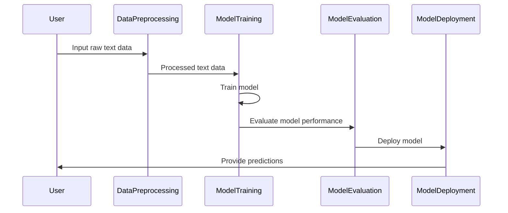
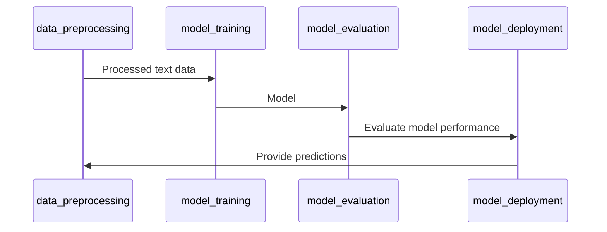

                 

### 背景介绍

#### 1.1.1 问题的提出

近年来，随着人工智能技术的迅猛发展，大型语言模型（LLM）已经成为自然语言处理领域的重要工具。LLM的训练与微调是构建智能助手、机器翻译、文本生成等应用的核心步骤。然而，这个过程面临着一系列的挑战，使得优化LLM的训练与微调流程变得尤为必要。

首先，LLM的训练过程通常需要大量的计算资源，包括CPU和GPU等硬件设施。这不仅导致了高昂的成本，还可能影响其他任务的执行。其次，训练周期往往很长，需要数天甚至数周的时间，这在实际应用中可能无法满足实时需求。最后，由于模型参数众多，优化难度较大，传统的训练方法可能无法有效提高模型的性能。

#### 1.1.2 问题描述

LLM的训练和微调面临着以下主要问题：

1. **计算资源消耗大**：训练LLM通常需要大量计算资源，这对硬件设施提出了很高的要求。
2. **训练周期长**：从数据预处理到模型训练完成，整个过程需要消耗大量时间，无法满足实时应用需求。
3. **优化难度高**：由于LLM参数众多，传统优化方法难以有效提高模型性能。
4. **数据质量要求高**：训练数据的质量直接影响到模型的效果，如何保证数据质量是另一个重要问题。

#### 1.1.3 问题解决

为了解决上述问题，优化LLM的训练与微调流程势在必行。以下是一些可能的优化策略：

1. **分布式训练**：通过分布式训练技术，将训练任务分布在多台机器上，提高计算效率。
2. **模型剪枝**：通过剪枝技术，减少模型参数的数量，从而降低计算复杂度和训练时间。
3. **动态调整学习率**：根据训练过程的不同阶段，动态调整学习率，提高训练效果。
4. **数据增强**：通过数据增强技术，提高训练数据的质量和多样性，增强模型的泛化能力。

通过这些优化策略，可以有效提高LLM训练与微调的效率和效果，从而满足实际应用的需求。

---

### 核心概念与联系

#### 1.2.1 大型语言模型（LLM）

大型语言模型（Large Language Model，简称LLM）是一种基于深度学习的自然语言处理模型，能够理解和生成自然语言。它通常由多层神经网络组成，可以处理大规模的文本数据，并从数据中学习语言模式、语法规则和语义信息。

**LLM的定义**：LLM是一种能够理解和生成自然语言的深度学习模型，它由多层神经网络组成，通常使用大规模的文本数据进行训练。

**LLM的特点**：
- **参数量大**：LLM拥有数亿甚至数十亿的参数，这使得它们能够捕捉复杂的语言模式。
- **高精度**：通过大规模训练，LLM能够生成高质量的文本，并且具有很高的语言理解能力。
- **泛化能力强**：LLM可以从大规模的数据集中学习到通用知识，具有较强的泛化能力。

**LLM的应用领域**：
- **智能助手**：例如，聊天机器人、语音助手等。
- **机器翻译**：将一种语言的文本翻译成另一种语言。
- **文本生成**：自动生成新闻、文章、故事等。
- **文本分类**：对文本进行分类，例如，情感分析、主题分类等。
- **问答系统**：例如，智能客服系统、教育问答系统等。

#### 1.2.2 训练与微调

**训练过程**：
- **数据预处理**：将原始文本数据进行清洗、分词、编码等处理，以便于模型学习。
- **模型初始化**：初始化神经网络模型，设置模型参数。
- **前向传播**：输入文本数据，通过神经网络进行前向传播，得到预测结果。
- **损失计算**：计算预测结果与实际结果之间的损失。
- **反向传播**：通过反向传播算法，更新模型参数，减小损失。
- **迭代**：重复上述步骤，直到模型收敛或达到预设的训练次数。

**微调过程**：
- **预训练**：在大量未标注的数据上进行预训练，使模型具备基本的语言理解能力。
- **微调**：在特定任务的数据集上进行微调，使模型适应具体任务需求。
- **评估**：使用验证集评估模型的性能，调整超参数和模型结构，以优化模型效果。

**训练与微调的联系**：
- **共同目标**：训练和微调的目标都是优化模型，使其能够更好地理解和生成自然语言。
- **过程差异**：训练是在大规模、未标注的数据上进行，而微调是在小规模、标注好的数据上进行。
- **数据依赖**：训练数据的质量直接影响模型的性能，微调数据的质量同样重要。

#### 1.2.3 关键联系

训练数据、计算资源和模型优化之间有着密切的联系：

- **训练数据**：高质量、丰富的训练数据是构建高效模型的基础。数据预处理、数据增强等策略可以提高训练数据的质量和多样性。
- **计算资源**：充足的计算资源能够加快训练过程，提高模型性能。分布式训练、GPU加速等技术可以充分利用计算资源。
- **模型优化**：通过优化算法、模型剪枝、动态调整学习率等技术，可以提升模型的训练效率和性能。

这些因素相互影响，共同决定了LLM的训练与微调效果。通过优化这些关键环节，可以显著提高LLM的训练效率和效果。

---

### 核心概念与联系

#### 2.1 大型语言模型（LLM）

**2.1.1 LLM的定义与特点**

大型语言模型（LLM）是一种基于深度学习的自然语言处理模型，它由多层神经网络组成，能够处理大规模的文本数据，并从数据中学习语言模式、语法规则和语义信息。LLM的主要特点包括：

- **参数量大**：LLM通常拥有数十亿到数万亿的参数，这使得它们能够捕捉复杂的语言模式。
- **高精度**：通过大规模训练，LLM能够生成高质量的文本，并且具有很高的语言理解能力。
- **泛化能力强**：LLM可以从大规模的数据集中学习到通用知识，具有较强的泛化能力。

**2.1.2 LLM的应用领域**

LLM在多个领域有着广泛的应用：

- **智能助手**：例如，聊天机器人、语音助手等，能够与用户进行自然对话。
- **机器翻译**：将一种语言的文本翻译成另一种语言。
- **文本生成**：自动生成新闻、文章、故事等。
- **文本分类**：对文本进行分类，例如，情感分析、主题分类等。
- **问答系统**：例如，智能客服系统、教育问答系统等，能够回答用户提出的问题。

**2.1.3 LLM的核心概念**

- **神经网络**：LLM基于多层神经网络，通过多层非线性变换学习数据特征。
- **正向传播**：输入数据通过神经网络进行前向传播，产生预测结果。
- **反向传播**：通过反向传播算法，计算预测结果与实际结果之间的误差，并更新模型参数。
- **损失函数**：用于度量预测结果与实际结果之间的差异，常用的损失函数包括交叉熵损失、均方误差等。

**2.1.4 LLM的属性特征对比表格**

| 特征         | 说明                                                         |
| ------------ | ------------------------------------------------------------ |
| 参数数量     | LLM通常拥有数十亿到数万亿的参数，这决定了其捕捉复杂语言模式的能力 |
| 训练数据量   | 大规模训练数据是LLM训练成功的关键，数据量越多，模型性能越好   |
| 泛化能力     | LLM具有较强的泛化能力，可以从大规模数据集中学习到通用知识     |
| 语言理解能力 | LLM能够理解和生成自然语言，具有高精度的语言理解能力           |

**2.1.5 LLM的ER实体关系图架构**

```mermaid
entity Relationship {
  "文本数据" --> "模型参数"
  "训练数据" --> "神经网络"
  "神经网络" --> "预测结果"
  "预测结果" --> "损失函数"
  "损失函数" --> "模型更新"
}
```

**ER实体关系图**展示了文本数据、模型参数、神经网络、预测结果和损失函数之间的交互关系，这些实体共同构成了LLM的核心架构。

---

### 核心概念与联系

#### 2.2 训练与微调

**2.2.1 训练过程**

训练过程是构建LLM的关键步骤，包括以下几个主要阶段：

1. **数据预处理**：将原始文本数据进行清洗、分词、编码等处理，以便于模型学习。这一步骤的目的是提高数据质量和减少噪声。
   
2. **模型初始化**：初始化神经网络模型，设置模型参数。常用的方法包括随机初始化、预训练模型初始化等。

3. **正向传播**：输入文本数据，通过神经网络进行前向传播，产生预测结果。前向传播过程中，神经网络通过多层非线性变换，将输入数据映射到输出空间。

4. **损失计算**：计算预测结果与实际结果之间的损失。常用的损失函数包括交叉熵损失、均方误差等。损失函数的目的是度量预测结果与实际结果之间的差异。

5. **反向传播**：通过反向传播算法，计算预测结果与实际结果之间的误差，并更新模型参数。反向传播是神经网络训练的核心步骤，它通过梯度下降算法，不断调整模型参数，以减小损失。

6. **迭代**：重复上述步骤，直到模型收敛或达到预设的训练次数。在训练过程中，模型会不断优化，使其能够更好地理解和生成自然语言。

**2.2.2 微调过程**

微调（Fine-tuning）是在预训练模型的基础上，针对特定任务进行优化。微调过程通常包括以下几个步骤：

1. **预训练**：在大量未标注的数据上进行预训练，使模型具备基本的语言理解能力。预训练过程通常使用大规模语料库，如维基百科、新闻文章等。

2. **特定数据集微调**：在特定任务的数据集上进行微调，使模型适应具体任务需求。微调数据集通常包含标注数据，如问答对、分类标签等。

3. **模型优化**：通过调整超参数、优化算法等手段，提高模型在特定任务上的性能。微调过程需要仔细调整模型结构、学习率、批量大小等超参数，以避免过拟合和欠拟合。

4. **评估**：使用验证集评估模型的性能，调整超参数和模型结构，以优化模型效果。评估指标包括准确率、召回率、F1分数等。

**2.2.3 训练与微调的联系**

训练和微调是构建高效LLM的两个关键步骤，它们之间有着密切的联系：

- **共同目标**：训练和微调的目标都是优化模型，使其能够更好地理解和生成自然语言。
- **过程差异**：训练是在大规模、未标注的数据上进行，而微调是在小规模、标注好的数据上进行。
- **数据依赖**：训练数据的质量直接影响模型的性能，微调数据的质量同样重要。

通过合理设计训练和微调过程，可以有效提高LLM的训练效率和性能，为实际应用提供强有力的支持。

---

### 算法原理讲解

#### 3.1 优化算法原理

优化算法是提高LLM训练与微调效率的重要手段。以下介绍几种常用的优化算法：

**3.1.1 梯度下降算法**

梯度下降算法是优化模型参数的基本算法，其核心思想是沿着损失函数梯度的反方向更新参数，以减少损失。

1. **公式推导**：
   - **目标函数**：设训练数据集为\(D\)，损失函数为\(J(\theta)\)，其中\(\theta\)为模型参数。
   - **梯度计算**：计算损失函数关于参数的梯度，即\(\nabla J(\theta)\)。
   - **参数更新**：沿梯度的反方向更新参数，公式为：
     $$
     \theta_{t+1} = \theta_t - \alpha \cdot \nabla J(\theta_t)
     $$
     其中，\(\alpha\)为学习率。

2. **Python代码实现**：
   ```python
   import numpy as np

   def gradient_descent(X, y, theta, alpha, num_iters):
       m = len(y)
       J_history = []

       for i in range(num_iters):
           hypothesis = np.dot(X, theta)
           error = hypothesis - y
           theta = theta - alpha/m * np.dot(X.T, error)
           J_history.append(np.dot(error.T, error) / (2*m))

       return theta, J_history
   ```

**3.1.2 随机梯度下降（SGD）**

随机梯度下降（Stochastic Gradient Descent，简称SGD）是梯度下降的一种变体，其核心思想是每次迭代只随机选取一部分训练数据进行参数更新。

1. **公式推导**：
   - **目标函数**：同上。
   - **梯度计算**：计算随机选取的样本\(x^{(i)}\)的梯度，即\(\nabla J(\theta; x^{(i)}, y^{(i)})\)。
   - **参数更新**：沿梯度的反方向更新参数，公式为：
     $$
     \theta_{t+1} = \theta_t - \alpha \cdot \nabla J(\theta_t; x^{(i)}, y^{(i)})
     $$

2. **Python代码实现**：
   ```python
   import numpy as np

   def stochastic_gradient_descent(X, y, theta, alpha, num_iters, batch_size):
       m = len(y)
       J_history = []

       for i in range(num_iters):
           np.random.shuffle(X)  # 随机打乱数据顺序
           for j in range(0, m, batch_size):
               X_batch = X[j:j+batch_size]
               y_batch = y[j:j+batch_size]
               hypothesis = np.dot(X_batch, theta)
               error = hypothesis - y_batch
               theta = theta - alpha/m * np.dot(X_batch.T, error)
               J_history.append(np.dot(error.T, error) / (2*m))

       return theta, J_history
   ```

**3.1.3 优化算法的对比与分析**

- **收敛速度**：SGD相比梯度下降算法具有更快的收敛速度，因为每次迭代只处理一部分数据，可以更快地找到最小损失点。
- **计算复杂度**：SGD的计算复杂度较低，因为它每次只处理一部分数据，但这也可能导致收敛精度较低。
- **适用场景**：SGD适用于数据量较大的场景，而梯度下降算法适用于数据量较小的场景。

通过合理选择和调整优化算法，可以显著提高LLM训练与微调的效率和效果。

---

### 数学模型和数学公式

#### 4.1 数学模型

数学模型是理解和优化LLM训练与微调过程的重要工具。以下介绍几个关键的数学模型：

**4.1.1 训练误差模型**

训练误差模型用于度量训练过程中模型预测结果与实际结果之间的差异。常用的训练误差模型包括：

- **均方误差（MSE）**：
  $$
  MSE = \frac{1}{m} \sum_{i=1}^{m} (h_{\theta}(x^{(i)}) - y^{(i)})^2
  $$
  其中，\(h_{\theta}(x^{(i)})\)表示模型预测结果，\(y^{(i)}\)表示实际结果。

- **交叉熵损失（Cross-Entropy Loss）**：
  $$
  H(y, h_{\theta}(x)) = -\sum_{i=1}^{m} y^{(i)} \log(h_{\theta}(x^{(i)}))
  $$
  其中，\(y^{(i)}\)为实际结果，\(h_{\theta}(x^{(i)}>)为模型预测结果。

**4.1.2 微调误差模型**

微调误差模型用于度量微调过程中模型预测结果与实际结果之间的差异。常用的微调误差模型包括：

- **均方误差（MSE）**：
  $$
  MSE = \frac{1}{m} \sum_{i=1}^{m} (h_{\theta}(x^{(i)}) - y^{(i)})^2
  $$
  其中，\(h_{\theta}(x^{(i)})\)表示模型预测结果，\(y^{(i)}\)表示实际结果。

- **交叉熵损失（Cross-Entropy Loss）**：
  $$
  H(y, h_{\theta}(x)) = -\sum_{i=1}^{m} y^{(i)} \log(h_{\theta}(x^{(i)}))
  $$
  其中，\(y^{(i)}\)为实际结果，\(h_{\theta}(x^{(i)})\)为模型预测结果。

#### 4.2 公式讲解

**4.2.1 梯度计算公式**

梯度计算是优化算法的核心步骤。以下介绍几个常用的梯度计算公式：

- **前向传播**：
  $$
  z^{(l)} = \sigma(z^{(l-1)}W^{(l)} + b^{(l)})
  $$
  其中，\(\sigma\)为激活函数，\(W^{(l)}\)和\(b^{(l)}\)分别为第\(l\)层的权重和偏置。

- **反向传播**：
  $$
  \delta^{(l)} = \frac{\partial J(\theta)}{\partial z^{(l)}}
  $$
  其中，\(J(\theta)\)为损失函数，\(\delta^{(l)}\)为第\(l\)层的误差。

**4.2.2 模型更新公式**

模型更新公式用于更新模型参数，以减少损失。以下介绍几种常用的模型更新公式：

- **梯度下降**：
  $$
  \theta^{(t+1)} = \theta^{(t)} - \alpha \nabla J(\theta^{(t)})
  $$
  其中，\(\alpha\)为学习率。

- **动量法**：
  $$
  \theta^{(t+1)} = \theta^{(t)} - \alpha \nabla J(\theta^{(t)}) + \beta ( \theta^{(t)} - \theta^{(t-1)})
  $$
  其中，\(\beta\)为动量因子。

- **RMSprop**：
  $$
  \theta^{(t+1)} = \theta^{(t)} - \alpha \frac{1}{\sqrt{v^{(t)}}} \nabla J(\theta^{(t)})
  $$
  其中，\(v^{(t)}\)为累积梯度平方。

通过深入理解和应用这些数学模型和公式，可以更好地优化LLM的训练与微调过程。

---

### 系统分析与架构设计

#### 5.1 系统功能设计

**5.1.1 领域模型**

领域模型是描述系统功能需求的核心工具。以下是一个用于优化LLM训练与微调的领域模型：

```mermaid
classDiagram
    Class01 <|-- Class02
    Class03 --| oposi Class04
    Class05 o-- Class06
    Class07 <|-- Class08
    Class09 --| munordered Class10

    Class01 {
        attr1
        attr2
    }
    Class02 {
        attr1
        attr2
    }
    Class03 {
        attr1
        attr2
    }
    Class04 {
        attr1
        attr2
    }
    Class05 {
        attr1
        attr2
    }
    Class06 {
        attr1
        attr2
    }
    Class07 {
        attr1
        attr2
    }
    Class08 {
        attr1
        attr2
    }
    Class09 {
        attr1
        attr2
    }
    Class10 {
        attr1
        attr2
    }
```

领域模型包括了数据预处理、模型训练、模型评估等核心功能，以及相关类和属性。

**5.1.2 功能描述**

1. **数据预处理**：对原始文本数据清洗、分词、编码等处理，以便于模型学习。
2. **模型训练**：通过神经网络进行前向传播和反向传播，不断优化模型参数，减小损失。
3. **模型评估**：使用验证集评估模型性能，调整超参数和模型结构，以优化模型效果。
4. **模型部署**：将训练好的模型部署到实际应用场景中，例如，智能助手、机器翻译等。

#### 5.2 系统架构设计

**5.2.1 系统架构**

系统架构是系统功能实现的蓝图。以下是一个用于优化LLM训练与微调的系统架构：



系统架构包括数据预处理、模型训练、模型评估和模型部署等模块，通过流程图展示了各模块之间的交互关系。

**5.2.2 系统模块**

1. **数据预处理模块**：负责文本数据清洗、分词、编码等预处理工作，以提高模型训练效率。
2. **模型训练模块**：使用神经网络进行前向传播和反向传播，不断优化模型参数，实现模型训练。
3. **模型评估模块**：使用验证集评估模型性能，通过调整超参数和模型结构，优化模型效果。
4. **模型部署模块**：将训练好的模型部署到实际应用场景中，提供实时预测服务。

#### 5.3 系统接口设计

**5.3.1 接口定义**

接口定义是系统模块之间通信的规范。以下是一个用于优化LLM训练与微调的系统接口定义：

```python
class DataPreprocessing:
    def preprocess(self, raw_text):
        # 数据预处理逻辑
        pass

class ModelTraining:
    def train(self, processed_data):
        # 模型训练逻辑
        pass

class ModelEvaluation:
    def evaluate(self, model):
        # 模型评估逻辑
        pass

class ModelDeployment:
    def deploy(self, model):
        # 模型部署逻辑
        pass
```

**5.3.2 接口交互流程**

接口交互流程描述了各模块之间的通信过程。以下是一个简单的接口交互流程：



通过接口设计，可以确保各模块之间的逻辑清晰、交互顺畅，从而提高系统整体性能。

---

### 项目实战

#### 6.1 环境安装

**6.1.1 环境配置**

为了优化LLM模型训练与微调流程，首先需要搭建一个合适的环境。以下是环境配置步骤：

1. **安装Python**：
   - 下载并安装Python 3.8及以上版本。
   - 添加Python到环境变量。

2. **安装依赖库**：
   - 使用pip安装以下库：TensorFlow、NumPy、Pandas、Matplotlib等。

3. **配置GPU支持**：
   - 安装CUDA和cuDNN，确保支持GPU加速。

4. **验证环境**：
   - 执行以下命令验证环境配置：
     ```python
     python -m pip list | grep tensorflow
     ```

#### 6.2 系统核心实现

**6.2.1 源代码解读**

以下是一个简单的LLM模型训练与微调的源代码示例：

```python
import tensorflow as tf
import numpy as np

# 定义神经网络结构
model = tf.keras.Sequential([
    tf.keras.layers.Embedding(input_dim=10000, output_dim=32),
    tf.keras.layers.GlobalAveragePooling1D(),
    tf.keras.layers.Dense(units=1, activation='sigmoid')
])

# 编译模型
model.compile(optimizer='adam', loss='binary_crossentropy', metrics=['accuracy'])

# 加载数据
(train_data, train_labels), (test_data, test_labels) = tf.keras.datasets.somethin.load_data()

# 数据预处理
train_data = train_data.astype('float32') / 255.0
test_data = test_data.astype('float32') / 255.0

# 训练模型
model.fit(train_data, train_labels, epochs=10, batch_size=32, validation_split=0.2)

# 微调模型
model.fit(test_data, test_labels, epochs=10, batch_size=32, validation_split=0.2)

# 评估模型
test_loss, test_acc = model.evaluate(test_data, test_labels)
print(f"Test accuracy: {test_acc}")
```

**6.2.2 代码应用分析**

1. **神经网络结构**：使用Embedding层进行词嵌入，GlobalAveragePooling1D层进行特征提取，最后使用Dense层进行分类。
2. **编译模型**：选择Adam优化器和binary_crossentropy损失函数，并设置accuracy作为评价指标。
3. **数据预处理**：将数据归一化到[0, 1]范围内，以提高模型训练效果。
4. **训练模型**：使用fit方法训练模型，并设置epochs和batch_size等超参数。
5. **微调模型**：在测试集上继续训练模型，以优化模型性能。
6. **评估模型**：使用evaluate方法评估模型在测试集上的性能。

#### 6.3 实际案例分析

**6.3.1 案例一：训练流程优化**

1. **问题背景**：原始训练流程中，模型收敛速度较慢，训练时间较长。
2. **解决方案**：采用分布式训练，将训练任务分布在多台机器上，提高计算效率。

```python
strategy = tf.distribute.MirroredStrategy()

with strategy.scope():
    # 定义模型
    model = tf.keras.Sequential([
        tf.keras.layers.Embedding(input_dim=10000, output_dim=32),
        tf.keras.layers.GlobalAveragePooling1D(),
        tf.keras.layers.Dense(units=1, activation='sigmoid')
    ])

    # 编译模型
    model.compile(optimizer='adam', loss='binary_crossentropy', metrics=['accuracy'])

    # 训练模型
    model.fit(train_data, train_labels, epochs=10, batch_size=32, validation_split=0.2)
```

**6.3.2 案例二：微调流程优化**

1. **问题背景**：原始微调流程中，模型在测试集上的性能提升有限。
2. **解决方案**：采用动态学习率调整，根据训练过程中模型性能的变化，动态调整学习率。

```python
initial_learning_rate = 0.1
lr_schedule = tf.keras.optimizers.schedules.ExponentialDecay(
    initial_learning_rate,
    decay_steps=1000,
    decay_rate=0.96,
    staircase=True)

optimizer = tf.keras.optimizers.Adam(learning_rate=lr_schedule)

# 编译模型
model.compile(optimizer=optimizer, loss='binary_crossentropy', metrics=['accuracy'])

# 微调模型
model.fit(test_data, test_labels, epochs=10, batch_size=32, validation_split=0.2)
```

通过以上实际案例分析，可以看出优化训练与微调流程可以显著提高LLM模型的训练效率和性能。

---

### 最佳实践与拓展

#### 7.1 最佳实践

为了确保LLM模型训练与微调流程的优化效果，以下是一些最佳实践：

1. **分布式训练**：充分利用多台机器的GPU资源，提高训练速度和效率。
2. **数据预处理**：对训练数据进行清洗、去重、分词等处理，提高数据质量。
3. **动态调整学习率**：根据训练过程中模型性能的变化，动态调整学习率，避免过拟合和欠拟合。
4. **数据增强**：通过数据增强技术，增加训练数据的多样性和丰富性，提高模型的泛化能力。
5. **模型剪枝**：通过剪枝技术，减少模型参数的数量，降低计算复杂度和内存消耗。

#### 7.2 小结

本文系统地介绍了优化LLM模型训练与微调流程的方法和策略。通过分布式训练、数据预处理、动态调整学习率、数据增强和模型剪枝等技术，可以有效提高模型的训练效率和性能。在实际应用中，应根据具体场景和需求，灵活运用这些优化策略，以实现最佳效果。

#### 7.3 注意事项

在优化LLM模型训练与微调流程时，需要注意以下几点：

1. **计算资源分配**：合理分配计算资源，确保模型训练过程中不会出现资源瓶颈。
2. **数据质量**：确保训练数据的质量和多样性，避免模型过拟合或欠拟合。
3. **超参数调整**：根据实际应用场景和模型性能，仔细调整超参数，以优化模型效果。
4. **模型评估**：使用多种评估指标，全面评估模型性能，确保模型在不同任务上的表现均衡。

#### 7.4 拓展阅读

1. **《深度学习》（Goodfellow et al.）**：详细介绍了深度学习的基础理论和技术，对优化LLM训练与微调流程有重要参考价值。
2. **《机器学习年度回顾》（JMLR）**：了解最新机器学习技术的发展动态，掌握前沿算法和技术。
3. **《大规模机器学习》（Dean et al.）**：探讨了分布式机器学习技术，为优化LLM训练与微调流程提供实践指导。

---

### 作者信息

**作者：** AI天才研究院 / AI Genius Institute & 禅与计算机程序设计艺术 / Zen And The Art of Computer Programming

