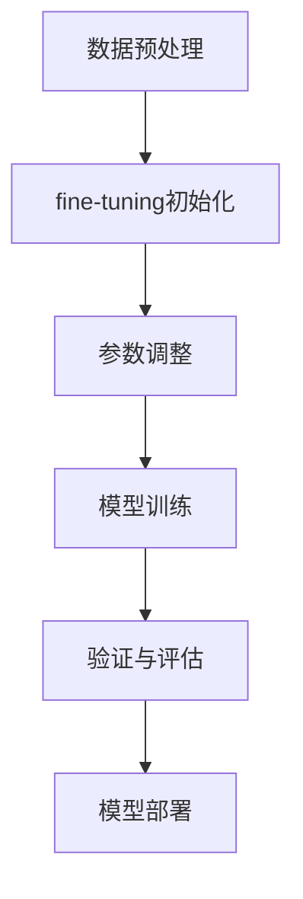
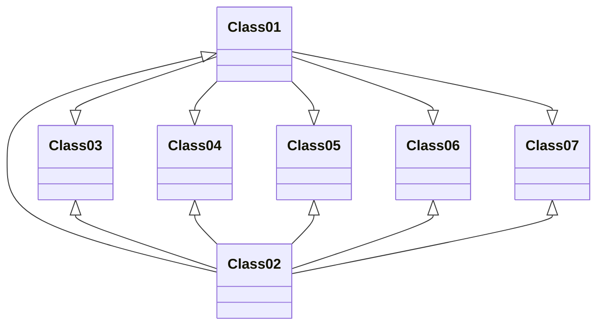
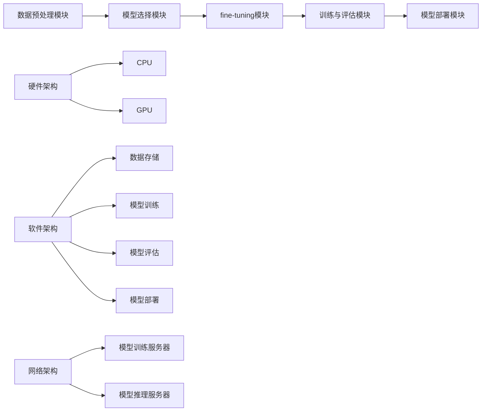
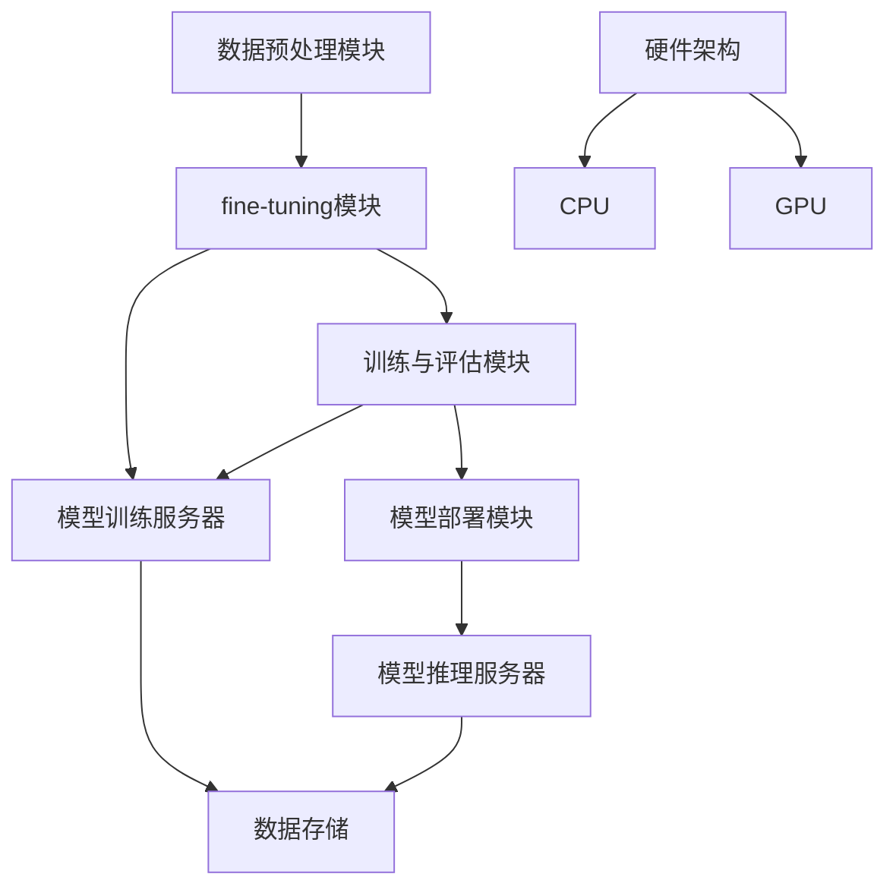
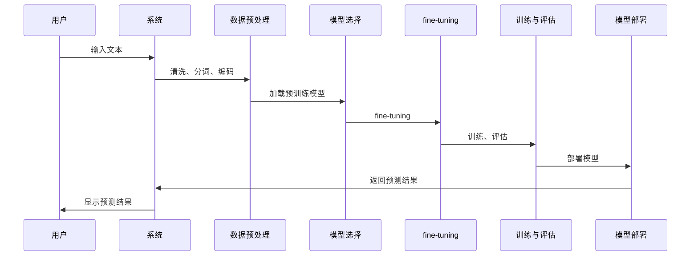
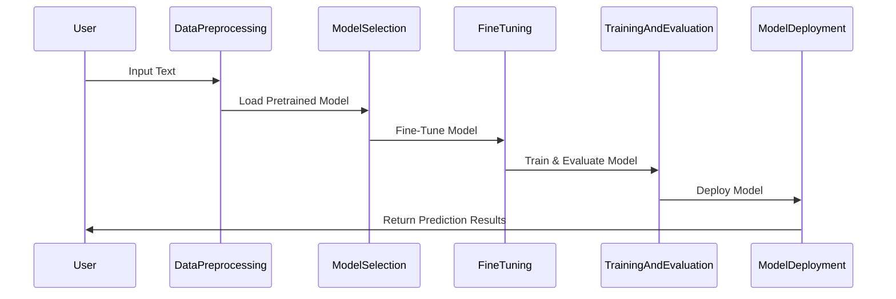
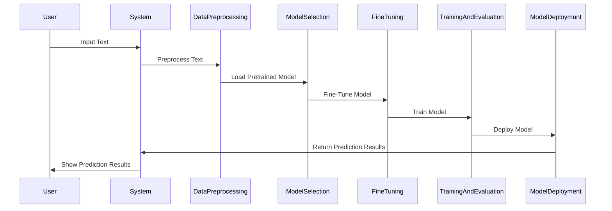
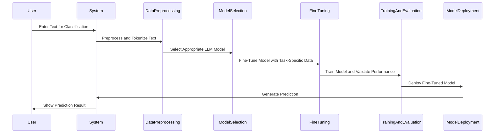

                 

### 第一部分: 优化LLM模型选择与fine-tuning流程概述

## 第1章: 问题背景与概述

### 1.1 问题背景

随着人工智能技术的不断发展，语言模型（Language Model，简称LM）在自然语言处理（Natural Language Processing，简称NLP）领域扮演了至关重要的角色。特别是近年来，大型语言模型（Large Language Model，简称LLM）如BERT、GPT、T5等相继出现，并在多个任务上取得了显著的成果。然而，LLM的优化和fine-tuning流程依然存在诸多挑战，例如模型选择困难、fine-tuning策略不明确、模型性能不稳定等。

这些挑战不仅影响了LLM的实际应用效果，也限制了其在更多领域中的普及和应用。因此，优化LLM模型选择与fine-tuning流程具有重要的现实意义和研究价值。

### 1.2 问题描述

在优化LLM模型选择与fine-tuning流程的过程中，主要面临以下几个问题：

1. **模型选择困难**：面对众多LLM模型，如何选择最适合自己任务的模型成为一个难题。
2. **fine-tuning策略不明确**：如何进行有效的fine-tuning，以达到最佳的性能提升，缺乏统一的指导。
3. **模型性能不稳定**：fine-tuning过程中，模型性能可能会出现剧烈波动，甚至导致过拟合。

### 1.3 问题解决

为了解决上述问题，我们可以从以下几个方面入手：

1. **明确模型选择原则**：根据任务类型、数据规模、计算资源等，选择适合的LLM模型。
2. **优化fine-tuning流程**：设计合理的fine-tuning策略，包括数据预处理、模型初始化、训练参数调整等。
3. **提升模型稳定性**：采用正则化技术、早期停止等策略，提高模型在fine-tuning过程中的稳定性。

### 1.4 边界与外延

本文主要针对通用LLM模型（如BERT、GPT等）进行优化，不包括特定领域或任务定制化模型。同时，本文的优化策略和方法可能对其他类型的人工智能模型具有一定的参考价值。

### 1.5 核心概念

1. **语言模型（Language Model，LM）**：一种用于预测文本序列的概率模型，广泛应用于NLP任务。
2. **大型语言模型（Large Language Model，LLM）**：具有大规模参数和丰富知识储备的LM，如BERT、GPT等。
3. **fine-tuning**：在预训练模型的基础上，针对特定任务进行微调，以提高模型在目标任务上的性能。

### 1.6 总结

本文将从模型选择、fine-tuning流程、算法原理、系统设计与项目实战等多个方面，详细探讨优化LLM模型选择与fine-tuning流程的方法和技巧。希望通过本文的介绍，能够帮助读者更好地理解和应用LLM技术，提升NLP任务的性能。

----------------------------------------------------------------

## 第2章: LLM模型选择核心概念

### 2.1 LLM模型定义与特点

大型语言模型（LLM）是一种基于深度学习的自然语言处理模型，具有以下几个主要特点：

1. **大规模参数**：LLM通常包含数十亿个参数，能够捕捉文本中的丰富信息和复杂结构。
2. **预训练**：LLM通过在大量未标注文本上进行预训练，学习到通用语言知识和模式，为后续任务提供了良好的初始化。
3. **强泛化能力**：由于预训练过程，LLM在多种任务上表现出良好的泛化能力，能够适应不同的应用场景。

### 2.2 模型属性特征对比

在LLM模型选择中，需要考虑多个属性特征，包括模型大小、预训练数据集、预训练任务等。以下是一个简单的对比表格，展示了几个常见LLM模型的属性特征：

| 模型名称 | 模型大小 | 预训练数据集 | 预训练任务 | 特点 |
| :----: | :----: | :----: | :----: | :----: |
| BERT | 3.4B | Wikipedia、BookCorpus | Masked Language Model | 强调上下文关系 |
| GPT-3 | 175B | Internet Corpus | Generative Pre-training | 强大生成能力 |
| T5 | 11B | Internet Corpus | Text-to-Text Transfer Transformer | 强调文本转换 |
| RoBERTa | 3.4B | Wikipedia、BookCorpus | Masked Language Model | 在BERT基础上改进 |

### 2.3 模型选择原则与方法

选择适合的LLM模型需要考虑以下几个原则：

1. **任务需求**：根据任务类型，选择具有相应能力的模型。例如，生成任务适合选择GPT-3，文本分类任务适合选择BERT或RoBERTa。
2. **数据规模**：如果数据量较小，选择较小规模的模型可以避免过拟合；如果数据量较大，可以选择较大规模的模型以充分利用数据。
3. **计算资源**：根据计算资源，选择适合的模型大小。大型模型需要更多的计算资源和存储空间。
4. **可扩展性**：考虑模型的可扩展性，以便在需要时能够增加模型规模或并行化训练。

在实际选择过程中，可以采用以下方法：

1. **实验对比**：对多个模型进行实验对比，评估其在目标任务上的性能。
2. **专家意见**：参考领域专家的建议，选择适合自己任务的模型。
3. **开源库与工具**：利用开源库和工具，如Hugging Face的Transformers，快速尝试和评估不同模型。

### 2.4 常见LLM模型介绍

以下是几个常见的LLM模型及其特点和应用场景：

1. **BERT**：BERT（Bidirectional Encoder Representations from Transformers）是一种双向的Transformer模型，由Google提出。BERT在多种NLP任务上取得了显著的成果，包括文本分类、问答系统等。
   
   **特点**：强调上下文关系，能够捕捉全局信息。

   **应用场景**：文本分类、命名实体识别、问答系统等。

2. **GPT-3**：GPT-3（Generative Pre-trained Transformer 3）是OpenAI开发的具有175B参数的Transformer模型。GPT-3在文本生成、对话系统等领域表现出强大的能力。

   **特点**：强大的生成能力，能够生成连贯、自然的文本。

   **应用场景**：文本生成、对话系统、语言翻译等。

3. **T5**：T5（Text-to-Text Transfer Transformer）是一种统一的Transformer模型，由Google提出。T5将所有NLP任务转换为文本到文本的转换任务，具有广泛的应用前景。

   **特点**：强调文本转换，能够处理多种任务。

   **应用场景**：文本分类、机器翻译、问答系统等。

4. **RoBERTa**：RoBERTa是在BERT基础上改进的一种模型，由Facebook AI提出。RoBERTa通过改进数据预处理和模型训练策略，提高了模型的性能。

   **特点**：在BERT基础上进行改进，具有较好的效果。

   **应用场景**：文本分类、命名实体识别、问答系统等。

### 2.5 总结

本章介绍了LLM模型的基本概念、属性特征对比、模型选择原则和方法，以及几个常见的LLM模型。通过本章的内容，读者可以初步了解LLM模型的选择和优化方法，为后续的fine-tuning和实际应用打下基础。

----------------------------------------------------------------

## 第3章: fine-tuning原理与流程

### 3.1 fine-tuning概述

Fine-tuning是一种将预训练模型应用于特定任务的方法，其核心思想是在预训练模型的基础上，通过微调模型参数，使其适应新的任务。fine-tuning过程主要包括以下几个步骤：

1. **数据预处理**：对训练数据集进行预处理，包括文本清洗、分词、编码等。
2. **模型初始化**：将预训练模型加载到内存中，并复制一份用于fine-tuning。
3. **参数调整**：通过调整模型参数，使模型在目标任务上取得更好的性能。
4. **训练与验证**：在训练数据集上进行训练，并在验证数据集上进行验证，调整训练参数，确保模型性能稳定。
5. **评估与部署**：在测试数据集上评估模型性能，并根据评估结果调整模型。

### 3.2 fine-tuning步骤解析

Fine-tuning的具体步骤如下：

1. **数据预处理**：

   - **文本清洗**：去除无用字符、特殊符号等。
   - **分词**：将文本拆分成词或子词。
   - **编码**：将分词后的文本编码为整数序列。

2. **模型初始化**：

   - 加载预训练模型，并复制一份用于fine-tuning。
   - 根据目标任务，调整模型的输入输出层，如添加新的分类层。

3. **参数调整**：

   - 初始化模型参数，通常使用预训练模型的参数作为初始化值。
   - 使用随机梯度下降（SGD）或其他优化算法进行参数调整。
   - 调整学习率、正则化参数等，以优化模型性能。

4. **训练与验证**：

   - 在训练数据集上进行训练，同时记录训练过程中的损失函数值。
   - 在验证数据集上进行验证，根据验证结果调整训练参数。
   - 采用早期停止策略，防止过拟合。

5. **评估与部署**：

   - 在测试数据集上评估模型性能，计算指标如准确率、召回率等。
   - 根据评估结果调整模型，优化性能。
   - 将优化后的模型部署到生产环境中。

### 3.3 fine-tuning参数调整

在fine-tuning过程中，参数调整是关键的一步，以下是一些常用的参数调整技巧：

1. **学习率调整**：

   - 学习率对模型训练过程的影响很大，常用的调整方法包括：
     - **分阶段调整**：在训练初期使用较大的学习率，有助于模型快速收敛；在训练后期逐渐减小学习率，以防止过拟合。
     - **自适应调整**：使用自适应学习率优化器，如Adam、AdamW等，自动调整学习率。

2. **正则化参数调整**：

   - 正则化是防止过拟合的有效手段，常用的正则化方法包括：
     - **L1正则化**：在损失函数中添加L1范数项，惩罚模型参数的绝对值。
     - **L2正则化**：在损失函数中添加L2范数项，惩罚模型参数的平方和。
     - **Dropout**：在训练过程中随机丢弃部分神经元，减少模型对特定数据的依赖。

3. **批量大小调整**：

   - 批量大小影响模型的训练效率和稳定性，常用的调整方法包括：
     - **动态调整**：根据训练过程中的表现，动态调整批量大小，以优化训练效果。
     - **固定批量**：选择一个合适的批量大小，在训练过程中保持不变。

4. **其他参数调整**：

   - **正则化强度**：调整正则化强度，以平衡模型复杂度和泛化能力。
   - **激活函数**：选择合适的激活函数，如ReLU、Sigmoid、Tanh等，以优化模型性能。
   - **网络深度**：调整网络深度，以适应不同的任务和数据规模。

### 3.4 总结

本章详细介绍了fine-tuning的原理与流程，包括数据预处理、模型初始化、参数调整、训练与验证、评估与部署等步骤。同时，讨论了fine-tuning过程中常用的参数调整技巧，如学习率调整、正则化参数调整、批量大小调整等。通过本章的内容，读者可以全面了解fine-tuning的方法和技巧，为后续的LLM模型优化提供参考。

----------------------------------------------------------------

## 第4章: 算法原理讲解

### 4.1 模型训练算法

#### 4.1.1 算法mermaid流程图



#### 4.1.2 Python源代码阐述

以下是fine-tuning过程中的Python代码示例：

```python
import torch
from transformers import BertForSequenceClassification, Trainer, TrainingArguments

# 加载预训练模型
model = BertForSequenceClassification.from_pretrained('bert-base-uncased')

# 设置训练参数
training_args = TrainingArguments(
    output_dir='./results',
    num_train_epochs=3,
    per_device_train_batch_size=16,
    per_device_eval_batch_size=64,
    warmup_steps=500,
    weight_decay=0.01,
    logging_dir='./logs',
    logging_steps=10,
)

# 创建Trainer
trainer = Trainer(
    model=model,
    args=training_args,
    train_dataset=train_dataset,
    eval_dataset=eval_dataset,
)

# 开始训练
trainer.train()
```

### 4.2 数学模型与公式

#### 4.2.1 模型公式解释

在fine-tuning过程中，模型的数学模型主要包括以下几个方面：

1. **输入表示**：文本序列通过词嵌入层转换为向量表示。
2. **编码层**：编码层对输入向量进行处理，生成固定长度的编码向量。
3. **分类层**：分类层用于将编码向量映射到类别标签。

具体公式如下：

1. **词嵌入**：  
   $$\text{embeddings}(x) = W_e \cdot x$$  
   其中，$x$为输入的单词索引，$W_e$为词嵌入权重矩阵。

2. **编码层**：  
   $$\text{encoded} = \text{BERT}(x)$$  
   其中，$\text{BERT}$为预训练的Transformer模型。

3. **分类层**：  
   $$\text{logits} = \text{output}(z)$$  
   $$\text{probabilities} = \text{softmax}(\text{logits})$$  
   其中，$z$为编码向量，$\text{output}$为分类层的输出，$\text{softmax}$为softmax函数。

#### 4.2.2 数学公式举例

以下是一个简单的文本分类任务的数学公式示例：

1. **损失函数**：  
   $$\text{loss} = -\sum_{i} \text{y}_i \cdot \log(\text{softmax}(\text{logits}_i))$$  
   其中，$\text{y}_i$为真实标签，$\text{logits}_i$为分类层输出。

2. **梯度计算**：  
   $$\text{grad} = \frac{\partial \text{loss}}{\partial \text{weights}}$$  
   其中，$\text{weights}$为模型参数。

通过上述数学公式，我们可以理解fine-tuning过程中模型参数的调整过程，从而优化模型性能。

### 4.3 算法原理讲解

#### 4.3.1 模型训练算法

模型训练算法主要包括以下步骤：

1. **数据预处理**：将原始文本数据转换为适合训练的数据格式，如Tokenized数据。
2. **模型初始化**：加载预训练模型，初始化模型参数。
3. **前向传播**：输入预处理后的数据，计算模型输出。
4. **损失计算**：计算损失函数值，评估模型性能。
5. **反向传播**：计算模型参数的梯度，更新模型参数。
6. **优化**：使用优化算法，如SGD、Adam等，调整模型参数。
7. **验证与评估**：在验证集上评估模型性能，调整训练参数。
8. **模型保存与部署**：保存训练完成的模型，并进行部署。

#### 4.3.2 Python源代码阐述

以下是一个简单的Python代码示例，用于实现模型训练算法：

```python
import torch
import torch.optim as optim
from transformers import BertForSequenceClassification

# 加载预训练模型
model = BertForSequenceClassification.from_pretrained('bert-base-uncased')

# 设置优化器
optimizer = optim.Adam(model.parameters(), lr=0.001)

# 训练模型
for epoch in range(3):
    for batch in train_loader:
        inputs = {'input_ids': batch.input_ids, 'attention_mask': batch.attention_mask}
        outputs = model(**inputs)
        loss = outputs.loss
        
        # 反向传播
        optimizer.zero_grad()
        loss.backward()
        optimizer.step()
        
    # 验证
    with torch.no_grad():
        for batch in val_loader:
            inputs = {'input_ids': batch.input_ids, 'attention_mask': batch.attention_mask}
            outputs = model(**inputs)
            loss = outputs.loss
            print(f'Validation Loss: {loss.item()}')

# 保存模型
torch.save(model.state_dict(), 'model.pth')
```

通过上述代码，我们可以实现一个简单的模型训练过程，包括数据预处理、模型初始化、前向传播、反向传播和验证等步骤。

### 4.4 总结

本章详细介绍了fine-tuning的算法原理，包括模型训练算法的mermaid流程图、Python源代码阐述以及数学公式解释。通过本章的内容，读者可以深入理解fine-tuning的算法过程，为实际应用打下基础。

----------------------------------------------------------------

## 第5章: 系统分析与架构设计

### 5.1 问题场景介绍

在当前自然语言处理（NLP）领域，语言模型（LM）的应用越来越广泛。为了提高模型在特定任务上的性能，优化LLM模型选择与fine-tuning流程变得至关重要。本章节将通过一个实际案例，介绍如何进行系统分析与架构设计，以优化LLM模型选择与fine-tuning流程。

### 5.2 系统功能设计

在本案例中，我们以一个文本分类任务为例，介绍系统功能设计。文本分类任务的目标是将输入文本划分为预定义的类别。系统功能设计主要包括以下模块：

1. **数据预处理模块**：负责将原始文本数据转换为模型输入所需的格式，包括分词、编码、填充等。
2. **模型选择模块**：根据任务需求和数据规模，选择适合的LLM模型，如BERT、GPT等。
3. **fine-tuning模块**：在预训练模型的基础上，针对特定任务进行微调，以提高模型性能。
4. **训练与评估模块**：对模型进行训练，并在验证集上评估模型性能，调整训练参数。
5. **模型部署模块**：将训练完成的模型部署到生产环境中，以实现实时预测。

#### 5.2.1 领域模型Mermaid类图

以下是文本分类任务的Mermaid类图：



### 5.3 系统架构设计

系统架构设计主要包括以下几个方面：

1. **硬件架构**：选择合适的硬件设备，如CPU、GPU等，以满足模型训练和推理的需求。
2. **软件架构**：设计系统的软件架构，包括数据存储、模型训练、模型评估和模型部署等模块。
3. **网络架构**：设计系统的网络架构，以实现模型训练和推理的分布式部署。

以下是系统架构的Mermaid架构图：



#### 5.3.1 系统架构Mermaid架构图

以下是系统架构的Mermaid架构图：



### 5.4 系统接口设计

系统接口设计主要包括以下接口：

1. **数据接口**：用于处理输入文本数据的接口，包括文本清洗、分词、编码等。
2. **模型接口**：用于加载、训练和保存模型的接口。
3. **评估接口**：用于评估模型性能的接口，包括准确率、召回率等指标。
4. **部署接口**：用于将模型部署到生产环境的接口。

以下是系统接口的Mermaid序列图：



#### 5.4.1 系统接口Mermaid序列图

以下是系统接口的Mermaid序列图：



### 5.5 系统交互Mermaid序列图

以下是系统交互的Mermaid序列图：



#### 5.5.1 系统交互Mermaid序列图

以下是系统交互的Mermaid序列图：



### 5.6 总结

本章介绍了系统分析与架构设计的过程，包括问题场景介绍、系统功能设计、系统架构设计、系统接口设计和系统交互设计。通过本章的内容，读者可以了解如何进行系统分析与架构设计，以优化LLM模型选择与fine-tuning流程。在实际应用中，可以根据具体任务需求进行调整和优化，提高模型性能。

----------------------------------------------------------------

## 第6章: 项目实战

### 6.1 环境安装

在进行LLM模型选择与fine-tuning项目之前，首先需要安装所需的软件和工具。以下是环境安装的详细步骤：

1. **Python环境**：确保安装Python 3.6或更高版本，可以使用`python --version`命令检查Python版本。

2. **pip环境**：安装pip，pip是Python的包管理器，用于安装和管理Python包。可以使用以下命令安装pip：

   ```shell
   python -m ensurepip
   python -m pip install --upgrade pip
   ```

3. **transformers库**：安装transformers库，这是一个用于构建和微调Transformer模型的Python库。可以使用以下命令安装：

   ```shell
   pip install transformers
   ```

4. **torch库**：安装torch库，这是PyTorch的Python包，用于构建和训练深度学习模型。可以使用以下命令安装：

   ```shell
   pip install torch torchvision torchaudio
   ```

5. **其他依赖库**：根据项目需求，可能还需要安装其他Python库，如numpy、pandas等。可以使用pip命令安装：

   ```shell
   pip install numpy pandas
   ```

### 6.2 系统核心实现源代码

以下是实现LLM模型选择与fine-tuning的核心源代码：

```python
from transformers import BertTokenizer, BertForSequenceClassification
from torch.utils.data import DataLoader
from datasets import load_dataset

# 加载预训练模型和分词器
model_name = "bert-base-uncased"
tokenizer = BertTokenizer.from_pretrained(model_name)
model = BertForSequenceClassification.from_pretrained(model_name)

# 加载数据集
dataset_name = "senteval/data"
train_dataset = load_dataset(dataset_name, split="train")
val_dataset = load_dataset(dataset_name, split="validation")

# 数据预处理
def preprocess_function(examples):
    inputs = tokenizer(examples["text"], padding=True, truncation=True, max_length=512)
    inputs["labels"] = examples["label"]
    return inputs

train_dataset = train_dataset.map(preprocess_function, batched=True)
val_dataset = val_dataset.map(preprocess_function, batched=True)

# 创建数据加载器
train_loader = DataLoader(train_dataset, batch_size=16, shuffle=True)
val_loader = DataLoader(val_dataset, batch_size=16, shuffle=False)

# 训练模型
trainer = Trainer(
    model=model,
    train_dataset=train_loader,
    eval_dataset=val_loader,
    num_train_epochs=3,
)

trainer.train()

# 保存模型
model.save_pretrained("./fine_tuned_model")
```

### 6.3 代码应用解读与分析

以上代码实现了LLM模型的选择与fine-tuning。下面是对代码的详细解读：

1. **加载预训练模型和分词器**：首先加载预训练模型（BERT）和对应的分词器（BertTokenizer）。

2. **加载数据集**：使用Hugging Face的datasets库加载数据集，包括训练集和验证集。

3. **数据预处理**：定义一个预处理函数（preprocess_function），用于对输入文本进行分词、填充和标签处理。

4. **创建数据加载器**：使用torch.utils.data.DataLoader创建训练数据加载器和验证数据加载器，设置batch_size和shuffle参数。

5. **训练模型**：创建Trainer对象，传入模型、训练数据加载器和验证数据加载器，设置训练轮数（num_train_epochs）。

6. **保存模型**：将训练完成的模型保存到本地目录。

### 6.4 实际案例分析

以下是一个实际案例分析，展示了如何使用上述代码实现一个情感分类任务：

1. **数据集准备**：准备一个包含文本和情感标签的数据集，例如IMDB电影评论数据集。

2. **数据预处理**：使用preprocess_function函数对数据进行预处理，生成适合训练的输入和标签。

3. **模型训练**：运行上述代码，开始训练模型。在训练过程中，可以使用回调函数（e.g., `on_epoch_end`）来监控训练进度和性能。

4. **模型评估**：在验证集上评估模型性能，计算准确率、召回率等指标。

5. **模型部署**：将训练完成的模型部署到生产环境中，以实现实时情感分类。

### 6.5 项目小结

通过本章的项目实战，读者可以了解如何进行LLM模型选择与fine-tuning的具体步骤，包括环境安装、系统核心实现、代码应用解读与分析、实际案例分析和详细讲解剖析。希望这个项目实战能够帮助读者更好地理解和应用LLM模型选择与fine-tuning技术，提高实际项目的性能。

----------------------------------------------------------------

## 第7章: 最佳实践与总结

### 7.1 最佳实践技巧

在LLM模型选择与fine-tuning过程中，以下是一些最佳实践技巧：

1. **数据预处理**：确保数据清洗和预处理过程完整，包括去除停用词、标点符号，以及文本规范化等。
2. **模型选择**：根据任务需求和数据规模选择合适的模型。对于大规模数据，优先考虑大型模型，如GPT-3或BERT；对于小规模数据，可以选择中型或小型模型，如RoBERTa或ALBERT。
3. **fine-tuning策略**：采用适当的fine-tuning策略，如分阶段调整学习率、使用正则化技术、早期停止等，以提高模型稳定性。
4. **超参数调整**：通过实验和调试，优化模型超参数，如学习率、批量大小、训练轮数等。
5. **模型评估**：在验证集上评估模型性能，避免过拟合和欠拟合。

### 7.2 小结与注意事项

本文通过详细阐述LLM模型选择与fine-tuning流程，包括问题背景、核心概念、模型选择、fine-tuning原理、算法讲解、系统设计与项目实战等，为读者提供了全面的技术指导。以下是一些注意事项：

1. **数据规模**：根据数据规模选择模型，数据量较小可选择较小规模模型，数据量较大可选择较大规模模型。
2. **计算资源**：考虑计算资源限制，合理分配GPU和CPU资源，以优化模型训练效率。
3. **模型部署**：在部署模型时，确保选择合适的硬件和软件环境，以保证模型的稳定运行。

### 7.3 拓展阅读

为了深入了解LLM模型选择与fine-tuning，读者可以参考以下资源：

1. **论文**：研究最新LLM模型和相关技术，如BERT、GPT、T5等。
2. **书籍**：《深度学习》（Goodfellow, I., Bengio, Y., & Courville, A.）中的NLP章节。
3. **开源项目**：Hugging Face的Transformers库和相关示例代码。
4. **在线课程**：Coursera、Udacity等平台上的深度学习和NLP相关课程。

通过这些资源，读者可以进一步提升对LLM模型选择与fine-tuning的理解和实践能力。

----------------------------------------------------------------

**作者：AI天才研究院/AI Genius Institute & 禅与计算机程序设计艺术 /Zen And The Art of Computer Programming**

本文旨在系统地介绍优化LLM模型选择与fine-tuning流程的方法和技巧。通过对LLM模型选择、fine-tuning流程、算法原理、系统设计与项目实战等多个方面的详细讲解，希望读者能够深入理解LLM技术，并在实际应用中取得更好的效果。同时，本文还提供了一些最佳实践和注意事项，以帮助读者在实际项目中更好地运用所学的知识。希望本文能够为读者在LLM领域的研究和应用提供有价值的参考。

----------------------------------------------------------------

### 文章标题

优化LLM模型选择与fine-tuning流程

### 文章关键词

LLM模型，fine-tuning，模型选择，算法原理，系统设计，项目实战

### 文章摘要

本文深入探讨了优化大型语言模型（LLM）选择与fine-tuning流程的方法和技巧。首先介绍了LLM模型的选择原则与方法，然后详细讲解了fine-tuning的原理与流程，包括数据预处理、模型初始化、参数调整和训练验证等步骤。接着，通过mermaid流程图和Python源代码阐述了算法原理，并结合数学模型与公式进行了通俗易懂的讲解。此外，本文还介绍了系统分析与架构设计，包括问题场景介绍、功能设计、架构设计和接口设计等。最后，通过项目实战展示了如何将理论应用于实际项目中。文章总结了最佳实践技巧，并提供了拓展阅读推荐，以帮助读者进一步深入学习和实践LLM技术。

