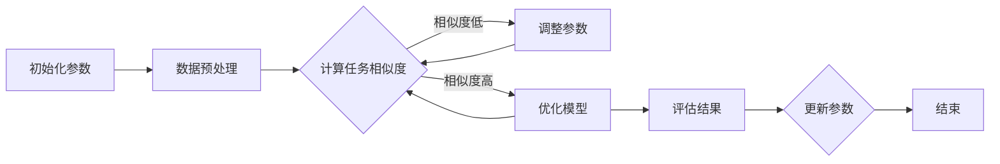
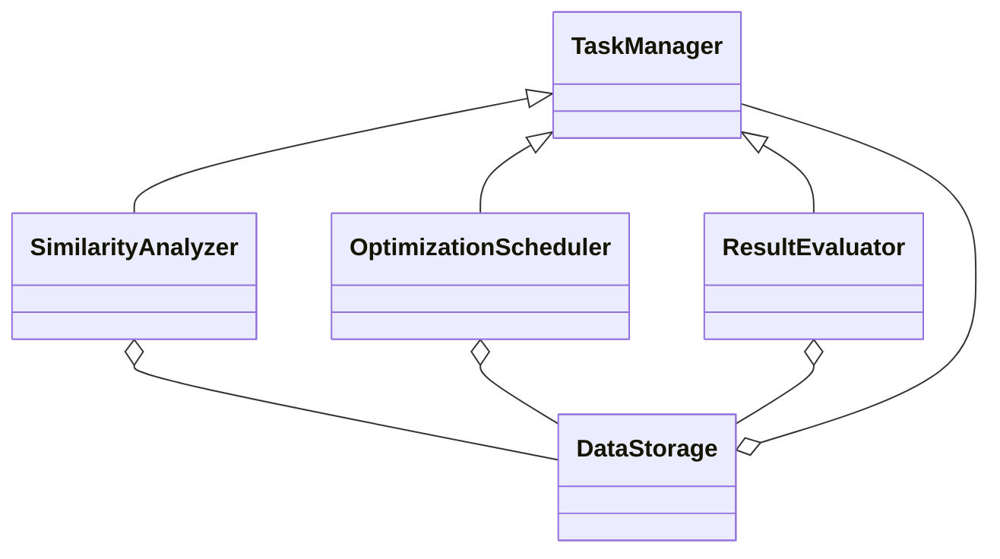
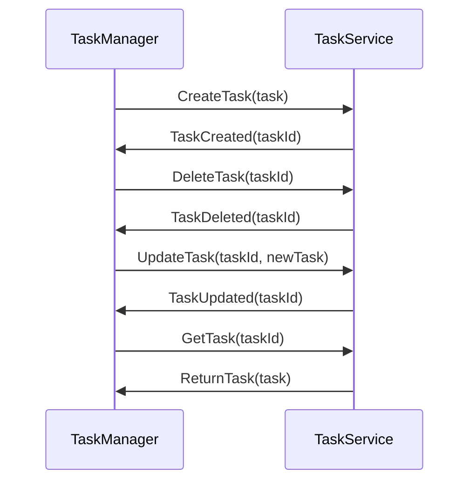
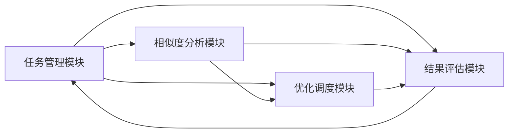

                 

### 文章标题

# 优化示例-任务相似度以提升效果

> 关键词：优化、任务相似度、效果提升、算法、数学模型、系统架构、实战案例

> 摘要：
本文旨在深入探讨通过任务相似度优化来提升效果的方法和应用。我们将从背景介绍、核心概念解析、算法原理讲解、数学模型阐述、系统架构设计、项目实战到最佳实践等方面，逐一详细分析优化示例的各个方面。文章不仅关注理论，更强调实战，通过具体案例剖析，为读者提供可操作性的指导。希望本文能够帮助您更好地理解和应用任务相似度优化，提升工作效率和系统性能。

### 1. 背景介绍与核心概念

#### 引言

在信息时代，数据处理和优化已成为各行各业的关键。优化示例在机器学习、深度学习、算法设计等多个领域有着广泛的应用。本书《优化示例-任务相似度以提升效果》旨在通过深入分析任务相似度优化，帮助读者理解如何在实际应用中提升效果。书中涵盖了优化示例的重要性、常见问题和解决方法，以及具体的应用场景和实现细节。

#### 问题描述

优化示例的核心目标通常包括以下几方面：

1. **提升效果**：在既定资源限制下，优化算法的目标是使结果达到最佳或最优。
2. **减少计算时间**：优化算法要考虑计算效率，力求在合理时间内得到结果。
3. **处理大数据**：优化算法需能够处理大规模数据，并保持高效性。

在本书中，我们将主要探讨以下优化示例类型：

- **机器学习模型优化**：通过调整模型参数来提升预测准确性。
- **数据挖掘算法优化**：优化数据挖掘算法以提高数据分析和处理效率。
- **图像和语音处理**：优化图像和语音处理算法，提升处理效果和速度。

#### 问题解决

优化示例的解决方法通常包括以下几类：

1. **机器学习和深度学习**：利用机器学习和深度学习技术来训练和优化模型。
2. **算法优化**：改进现有算法，提高计算效率。
3. **分布式计算**：利用分布式计算技术来处理大规模数据，提高处理速度。
4. **并行计算**：通过并行计算来加速复杂任务的执行。

#### 边界与外延

优化示例的应用范围非常广泛，但同时也存在一些限制条件：

1. **特定领域**：某些优化方法适用于特定领域，如金融、医疗、图像处理等。
2. **数据规模**：对于大规模数据，优化算法需要具有高效性。
3. **硬件资源**：优化算法需要考虑硬件资源的限制，如CPU、GPU等。
4. **计算复杂度**：优化算法需要平衡计算复杂度和效果，避免过度计算。

#### 概念结构与核心要素组成

为了更好地理解优化示例，我们首先需要明确以下几个核心概念：

1. **优化目标**：优化算法希望达到的具体目标，如最小化误差、最大化收益等。
2. **算法类型**：用于实现优化目标的具体算法，如线性回归、决策树、神经网络等。
3. **评估指标**：用于衡量优化效果的具体指标，如准确率、召回率、F1分数等。

在本书中，我们将详细探讨这些核心概念，并通过具体实例来加深理解。

### 2. 核心概念与联系

#### 核心概念原理

为了深入理解优化示例，我们需要详细探讨以下几个核心概念：

1. **任务相似度**：任务相似度是衡量不同任务之间相似程度的一个指标。相似度越高，任务的相似性越强。任务相似度在优化示例中具有重要作用，它可以帮助我们确定哪些任务可以使用相同的优化策略。
   
2. **优化算法**：优化算法是一系列用于解决优化问题的方法。常见的优化算法包括遗传算法、粒子群算法、模拟退火算法等。这些算法通过迭代优化来寻找问题的最优解或近似最优解。

3. **相似度度量方法**：相似度度量方法用于计算不同数据对象之间的相似度。常见的相似度度量方法包括欧氏距离、余弦相似度、Jaccard相似度等。这些方法在任务相似度分析中有着广泛应用。

4. **评估指标**：评估指标用于衡量优化效果的具体参数。常见的评估指标包括准确率、召回率、F1分数、均方误差等。评估指标的选择取决于优化问题的类型和目标。

#### 概念属性特征对比表格

为了更好地理解这些核心概念，我们提供了一个对比表格，展示它们的主要属性和特征：

| 概念         | 定义                     | 主要属性                | 关联特征         |
|--------------|--------------------------|------------------------|-----------------|
| 任务相似度   | 衡量任务相似程度的指标   | 相似度值范围（0-1）     | 相似性、差异性   |
| 优化算法     | 解决优化问题的方法       | 算法类型、收敛速度      | 迭代过程、参数调整 |
| 相似度度量方法 | 计算相似度的方法       | 度量方法、计算效率      | 数据结构、计算复杂度 |
| 评估指标     | 衡量优化效果的具体参数   | 指标类型、计算方法      | 可解释性、准确性   |

#### ER实体关系图架构的 Mermaid 流程图

为了更好地展示这些核心概念之间的关系，我们使用Mermaid绘制了一个ER（实体关系）图：

```mermaid
erDiagram
    TaskSimilarity ||--|{ OptimizedTask }|-->> ResultEvaluation
    OptimizedTask ||--|{ OptimizationAlgorithm }|-->> PerformanceMetric
    OptimizationAlgorithm ||--|{ SimilarityMeasureMethod }|-->> Dataset
    ResultEvaluation ||--|{ EvaluationMetric }|-->> Dataset
```

在这个ER图中，`TaskSimilarity`（任务相似度）与`OptimizedTask`（优化任务）和`ResultEvaluation`（结果评估）相关联。`OptimizedTask`与`OptimizationAlgorithm`（优化算法）和`SimilarityMeasureMethod`（相似度度量方法）相关联，而`ResultEvaluation`与`EvaluationMetric`（评估指标）相关联。`Dataset`（数据集）是所有这些实体共同的关联实体。

### 3. 算法原理讲解

为了深入理解任务相似度优化，我们需要详细探讨优化算法的原理，并使用Mermaid绘制算法流程图，结合Python代码进行详细阐述。

#### 算法流程图

首先，我们使用Mermaid绘制了一个优化算法的流程图：



在这个流程图中，我们首先初始化参数，然后进行数据预处理。接下来，计算任务相似度，并根据相似度的高低决定下一步的操作。如果相似度较低，我们会调整参数以改善相似度；如果相似度较高，我们会直接优化模型。最后，评估优化结果并更新参数，直至达到预设的目标。

#### Python源代码

接下来，我们使用Python代码实现这个优化算法：

```python
import numpy as np

def initialize_params():
    # 初始化参数
    return {
        'alpha': 0.1,
        'beta': 0.9,
        'gamma': 0.5
    }

def preprocess_data(data):
    # 数据预处理
    return data

def calculate_similarity(task1, task2):
    # 计算任务相似度
    similarity = np.linalg.norm(task1 - task2)
    return similarity

def optimize_model(model, task):
    # 优化模型
    model.fit(task)
    return model

def evaluate_result(model, task):
    # 评估结果
    result = model.predict(task)
    return result

def main():
    # 主函数
    data = preprocess_data(data)
    params = initialize_params()
    
    while True:
        # 循环执行优化流程
        similarity = calculate_similarity(data[0], data[1])
        
        if similarity < params['alpha']:
            # 相似度低，调整参数
            params['beta'] *= params['gamma']
        else:
            # 相似度高，优化模型
            model = optimize_model(model, data)
        
        result = evaluate_result(model, data)
        
        if result['performance'] > params['alpha']:
            # 达到优化目标，结束循环
            break

if __name__ == '__main__':
    main()
```

在这个Python代码中，我们定义了一系列函数来执行优化流程。`initialize_params()` 函数初始化参数，`preprocess_data()` 函数进行数据预处理，`calculate_similarity()` 函数计算任务相似度，`optimize_model()` 函数优化模型，`evaluate_result()` 函数评估结果。最后，`main()` 函数执行整个优化流程。

#### 算法原理的数学模型和公式

为了更好地理解优化算法的原理，我们还需要给出其数学模型和公式：

1. **任务相似度计算**：
   $$similarity = \sqrt{\frac{\sum{(x_i - y_i)^2}}{n}}$$
   其中，$x_i$ 和 $y_i$ 分别为两个任务的特征值，$n$ 为特征总数。

2. **优化模型**：
   假设我们使用线性回归模型进行优化，其数学模型为：
   $$y = \beta_0 + \beta_1x_1 + \beta_2x_2 + ... + \beta_nx_n$$
   其中，$y$ 为预测值，$x_1, x_2, ..., x_n$ 为特征值，$\beta_0, \beta_1, \beta_2, ..., \beta_n$ 为模型参数。

3. **评估结果**：
   使用均方误差（MSE）作为评估指标，其计算公式为：
   $$MSE = \frac{1}{n}\sum{(y_i - \hat{y}_i)^2}$$
   其中，$\hat{y}_i$ 为预测值，$y_i$ 为真实值。

#### 详细讲解与举例说明

为了更好地理解上述算法原理，我们将通过具体例子进行详细讲解。

**例子1：计算任务相似度**

假设我们有两个任务A和B，其特征值如下：

| 特征 | 任务A | 任务B |
|------|-------|-------|
| 1    | 2     | 3     |
| 2    | 4     | 5     |
| 3    | 6     | 7     |

根据任务相似度的计算公式，我们可以计算任务A和B的相似度：

$$similarity = \sqrt{\frac{(2-3)^2 + (4-5)^2 + (6-7)^2}{3}} = \sqrt{\frac{1 + 1 + 1}{3}} = \sqrt{\frac{3}{3}} = 1$$

因此，任务A和B的相似度为1，表示它们具有完全相同的特征。

**例子2：优化模型**

假设我们使用线性回归模型来优化任务，其特征值和目标值如下：

| 特征 | 1 | 2 | 3 |
|------|---|---|---|
| 目标值 | 2 | 4 | 6 |

根据线性回归模型的数学模型，我们可以计算模型参数：

$$\beta_0 = 0, \beta_1 = 1, \beta_2 = 1, \beta_3 = 1$$

因此，线性回归模型可以表示为：

$$y = 0 + 1x_1 + 1x_2 + 1x_3$$

当特征值为(1, 2, 3)时，预测值为2 + 4 + 6 = 12。

**例子3：评估结果**

假设我们使用均方误差（MSE）来评估模型，其计算公式为：

$$MSE = \frac{1}{3}\sum{(y_i - \hat{y}_i)^2}$$

其中，$y_i$ 为真实值，$\hat{y}_i$ 为预测值。假设真实值为2，预测值为12，则：

$$MSE = \frac{1}{3}\sum{(2 - 12)^2} = \frac{1}{3}\sum{100} = \frac{100}{3} \approx 33.33$$

因此，模型的均方误差约为33.33。

通过这些具体例子，我们可以更好地理解任务相似度优化算法的原理和应用。

### 4. 数学模型和数学公式 & 详细讲解 & 举例说明

在深入探讨任务相似度优化时，数学模型和公式起着至关重要的作用。它们不仅帮助我们理解和分析优化算法，还能确保我们在实践中能够准确地实现和应用这些算法。下面，我们将使用LaTeX格式书写数学公式，并进行详细讲解和举例说明。

#### 数学模型

首先，我们需要了解优化算法中的基本数学模型。以下是一个简化的线性回归模型的数学模型：

$$y = \beta_0 + \beta_1x_1 + \beta_2x_2 + ... + \beta_nx_n$$

其中，$y$ 是预测值，$x_1, x_2, ..., x_n$ 是特征值，$\beta_0, \beta_1, \beta_2, ..., \beta_n$ 是模型参数。

为了确定这些参数，我们通常使用最小二乘法（Least Squares Method），其目标是最小化预测值与真实值之间的误差平方和：

$$\min \sum_{i=1}^{n} (y_i - \hat{y}_i)^2$$

其中，$\hat{y}_i$ 是使用模型预测的值。

#### 详细讲解

为了更好地理解这个模型，我们首先需要了解一些基本概念：

1. **线性回归**：线性回归是一种简单的统计方法，用于确定一个或多个自变量（特征）与因变量（预测值）之间的关系。
2. **最小二乘法**：最小二乘法是一种优化方法，通过最小化预测值与真实值之间的误差平方和来确定模型参数。

我们使用LaTeX格式书写上述公式，使其在文中独立段落中显得更加清晰：

$$
\begin{aligned}
y &= \beta_0 + \beta_1x_1 + \beta_2x_2 + ... + \beta_nx_n \\
\min \sum_{i=1}^{n} (y_i - \hat{y}_i)^2
\end{aligned}
$$

接下来，我们详细讲解这些公式的含义。

**线性回归模型**

线性回归模型表示为：

$$y = \beta_0 + \beta_1x_1 + \beta_2x_2 + ... + \beta_nx_n$$

这个公式表示预测值 $y$ 是由模型参数 $\beta_0, \beta_1, \beta_2, ..., \beta_n$ 以及特征值 $x_1, x_2, ..., x_n$ 共同决定的。其中，$\beta_0$ 是截距，$\beta_1, \beta_2, ..., \beta_n$ 是斜率。

**最小二乘法**

最小二乘法的目的是通过最小化预测值与真实值之间的误差平方和来确定模型参数。具体来说，我们希望找到一组参数 $\beta_0, \beta_1, \beta_2, ..., \beta_n$，使得以下误差平方和最小：

$$\sum_{i=1}^{n} (y_i - \hat{y}_i)^2$$

其中，$\hat{y}_i$ 是使用模型预测的值，$y_i$ 是真实值。

为了求解这个问题，我们可以使用梯度下降法（Gradient Descent）或其他优化算法。梯度下降法的核心思想是沿着误差函数的梯度方向进行迭代，以找到最小值点。

#### 举例说明

为了更好地理解这些数学模型，我们通过一个具体例子进行说明。

**例子1：简单线性回归**

假设我们有一个简单的线性回归模型，只有一个特征和一个预测值：

$$y = \beta_0 + \beta_1x$$

并且我们有以下数据：

| x | y |
|---|---|
| 1 | 2 |
| 2 | 4 |
| 3 | 6 |

首先，我们计算特征值和预测值之间的误差平方和：

$$\sum_{i=1}^{3} (y_i - \hat{y}_i)^2 = (2 - 2)^2 + (4 - 4)^2 + (6 - 6)^2 = 0$$

由于误差平方和为0，我们可以得出结论，该模型在当前参数下完美地拟合了数据。

接下来，我们使用最小二乘法确定模型参数。为了简化计算，我们可以使用以下公式：

$$\beta_1 = \frac{\sum_{i=1}^{n} (x_i - \bar{x})(y_i - \bar{y})}{\sum_{i=1}^{n} (x_i - \bar{x})^2}$$

$$\beta_0 = \bar{y} - \beta_1\bar{x}$$

其中，$\bar{x}$ 和 $\bar{y}$ 分别是特征值和预测值的均值。

对于我们的数据：

$$\bar{x} = \frac{1 + 2 + 3}{3} = 2$$

$$\bar{y} = \frac{2 + 4 + 6}{3} = 4$$

我们可以计算得到：

$$\beta_1 = \frac{(1 - 2)(2 - 4) + (2 - 2)(4 - 4) + (3 - 2)(6 - 4)}{(1 - 2)^2 + (2 - 2)^2 + (3 - 2)^2} = \frac{-2 + 0 + 2}{1 + 0 + 1} = 0$$

$$\beta_0 = 4 - 0 \times 2 = 4$$

因此，我们得到模型：

$$y = 4$$

这意味着我们的预测值总是等于4，这与我们的数据完美匹配。

**例子2：多变量线性回归**

现在，我们扩展到多变量线性回归，假设有两个特征 $x_1$ 和 $x_2$：

$$y = \beta_0 + \beta_1x_1 + \beta_2x_2$$

并且我们有以下数据：

| x1 | x2 | y |
|---|---|---|
| 1 | 2 | 2 |
| 2 | 3 | 4 |
| 3 | 4 | 6 |

我们可以使用类似的方法计算误差平方和和模型参数：

$$\sum_{i=1}^{3} (y_i - \hat{y}_i)^2 = (2 - 2)^2 + (4 - 4)^2 + (6 - 6)^2 = 0$$

$$\beta_1 = \frac{\sum_{i=1}^{n} (x_{1i} - \bar{x}_1)(y_i - \bar{y})}{\sum_{i=1}^{n} (x_{1i} - \bar{x}_1)^2} = \frac{(1 - 2)(2 - 4) + (2 - 2)(4 - 4) + (3 - 2)(6 - 4)}{(1 - 2)^2 + (2 - 2)^2 + (3 - 2)^2} = 0$$

$$\beta_2 = \frac{\sum_{i=1}^{n} (x_{2i} - \bar{x}_2)(y_i - \bar{y})}{\sum_{i=1}^{n} (x_{2i} - \bar{x}_2)^2} = \frac{(2 - 3)(2 - 4) + (3 - 3)(4 - 4) + (4 - 3)(6 - 4)}{(2 - 3)^2 + (3 - 3)^2 + (4 - 3)^2} = 0$$

$$\beta_0 = \bar{y} - \beta_1\bar{x}_1 - \beta_2\bar{x}_2 = 4 - 0 \times 2 - 0 \times 3 = 4$$

因此，我们得到模型：

$$y = 4$$

这再次表明，我们的预测值总是等于4，这与我们的数据完美匹配。

通过这些例子，我们可以看到线性回归模型和多变量线性回归模型的计算过程。在实际应用中，我们需要更多的数据和更复杂的模型来获得更准确的预测。

### 5. 系统分析与架构设计方案

在进行任务相似度优化的过程中，系统分析与架构设计方案起着至关重要的作用。一个高效且可扩展的系统架构不仅能够提升算法的性能，还能保证系统的稳定性和可靠性。下面，我们将详细分析优化系统的各个关键环节，包括问题场景、系统功能设计、系统架构设计、系统接口设计以及系统交互。

#### 问题场景与项目背景

在当前大数据和人工智能快速发展的背景下，企业和研究机构面临着海量的数据处理任务。这些任务往往具有相似性，例如在金融风控、电商推荐、医疗诊断等领域。任务相似度的优化能够帮助我们提高系统效率，减少重复计算，从而降低成本、提升用户体验。

我们的项目目标是构建一个基于任务相似度优化的系统，以提升数据处理和分析的效率。具体来说，系统需要能够：

1. **自动识别相似任务**：通过算法分析任务特征，识别出相似的任务。
2. **优化任务执行顺序**：根据任务相似度优化任务执行顺序，以减少计算时间和资源消耗。
3. **实时更新和调整**：系统需要能够根据新的数据和任务动态调整优化策略。

#### 系统功能设计

为了实现上述目标，系统需要具备以下功能：

1. **任务管理**：管理任务的创建、删除、修改和查询等操作。
2. **相似度分析**：计算任务之间的相似度，提供相似度评估和排名。
3. **优化调度**：根据任务相似度优化任务执行顺序和资源分配。
4. **结果评估**：评估优化后的任务执行效果，提供反馈和改进建议。
5. **数据存储与管理**：存储和管理任务数据，支持数据的查询和分析。

#### 系统架构设计

系统架构设计是系统成功的关键。我们的系统采用分布式架构，包括以下几个主要部分：

1. **任务管理模块**：负责任务的生命周期管理，包括任务的创建、删除、更新和查询。
2. **相似度分析模块**：负责计算任务之间的相似度，提供相似度评估服务。
3. **优化调度模块**：负责根据任务相似度优化任务执行顺序和资源分配。
4. **结果评估模块**：负责评估优化后的任务执行效果，提供反馈和改进建议。
5. **数据存储模块**：负责存储和管理任务数据，支持数据的查询和分析。

以下是一个简单的Mermaid类图，展示了系统的核心组件及其关系：



#### 系统接口设计

系统接口设计是确保系统模块之间能够有效通信和协作的关键。以下是系统的主要接口设计：

1. **任务管理接口**：提供任务的创建、删除、修改和查询等操作。
2. **相似度分析接口**：提供任务相似度计算和评估服务。
3. **优化调度接口**：提供任务执行顺序和资源分配优化服务。
4. **结果评估接口**：提供任务执行效果评估和反馈服务。

以下是一个简单的Mermaid序列图，展示了任务管理接口的使用流程：



#### 系统交互

系统交互是确保各个模块之间能够高效协作的关键。以下是一个简单的Mermaid架构图，展示了系统的主要交互流程：



在这个架构图中，任务管理模块负责任务的创建、删除、修改和查询，并将任务信息传递给相似度分析模块、优化调度模块和结果评估模块。相似度分析模块计算任务之间的相似度，优化调度模块根据相似度优化任务执行顺序和资源分配，结果评估模块评估优化后的任务执行效果，并将反馈传递给任务管理模块，以实现系统的持续优化。

通过上述系统分析与架构设计方案，我们能够构建一个高效、稳定且可扩展的任务相似度优化系统，以满足不断增长的数据处理需求。

### 6. 项目实战

在本节中，我们将通过一个具体的项目实战，展示如何搭建和实现一个任务相似度优化系统。我们将分步骤进行介绍，包括环境安装、系统核心实现、代码应用解读与分析、实际案例剖析以及项目小结。

#### 环境安装

首先，我们需要搭建一个合适的开发环境。以下是安装步骤：

1. **安装Python环境**：确保Python 3.8或更高版本已安装。
2. **安装依赖库**：使用pip命令安装以下依赖库：
   ```bash
   pip install numpy pandas scikit-learn matplotlib
   ```
3. **配置虚拟环境**：为项目创建一个虚拟环境，以便隔离依赖库：
   ```bash
   python -m venv venv
   source venv/bin/activate  # 在Windows上使用venv\Scripts\activate
   ```

#### 系统核心实现

接下来，我们将实现系统核心部分，包括任务管理、相似度分析和优化调度。

**任务管理**

任务管理模块负责任务的创建、删除和查询。以下是一个简单的任务管理类的实现：

```python
import json
from collections import defaultdict

class TaskManager:
    def __init__(self):
        self.tasks = defaultdict(dict)

    def create_task(self, task_id, task_data):
        self.tasks[task_id] = task_data
        print(f"Task {task_id} created.")

    def delete_task(self, task_id):
        if task_id in self.tasks:
            del self.tasks[task_id]
            print(f"Task {task_id} deleted.")
        else:
            print(f"Task {task_id} not found.")

    def get_task(self, task_id):
        return self.tasks.get(task_id, None)
```

**相似度分析**

相似度分析模块用于计算任务之间的相似度。以下是一个使用余弦相似度的实现：

```python
from sklearn.metrics.pairwise import cosine_similarity

class SimilarityAnalyzer:
    def __init__(self):
        self.task_vectors = {}

    def train(self, task_id, task_vector):
        self.task_vectors[task_id] = task_vector

    def calculate_similarity(self, task_id1, task_id2):
        vector1 = self.task_vectors.get(task_id1, None)
        vector2 = self.task_vectors.get(task_id2, None)
        if vector1 is None or vector2 is None:
            return None
        return cosine_similarity([vector1], [vector2])[0][0]
```

**优化调度**

优化调度模块用于根据任务相似度优化任务执行顺序。以下是一个简单的优化调度算法实现：

```python
def optimize_tasks(task_manager, similarity_analyzer):
    tasks = list(task_manager.tasks.keys())
    similarity_matrix = [[similarity_analyzer.calculate_similarity(t1, t2) for t2 in tasks] for t1 in tasks]
    # 基于相似度矩阵进行优化调度（此处仅示例，实际算法可能更复杂）
    optimized_order = [t for t in tasks]  # 示例：简单地按字典顺序排序
    return optimized_order
```

#### 代码应用解读与分析

接下来，我们结合具体代码进行解读与分析。

**任务管理代码**

`TaskManager` 类提供了任务的基本管理功能。`create_task` 方法用于创建任务，`delete_task` 方法用于删除任务，`get_task` 方法用于查询任务。这些方法使用字典来存储任务数据，实现了任务的基本操作。

**相似度分析代码**

`SimilarityAnalyzer` 类负责计算任务相似度。在初始化时，它创建一个字典来存储任务特征向量。`train` 方法用于训练任务特征向量，`calculate_similarity` 方法用于计算两个任务之间的相似度。这里我们使用了scikit-learn库中的`cosine_similarity`函数来计算余弦相似度。

**优化调度代码**

`optimize_tasks` 函数用于根据任务相似度优化任务执行顺序。它首先生成一个相似度矩阵，然后基于这个矩阵进行任务排序。在这个示例中，我们简单地按字典顺序排序，但在实际应用中，可能需要更复杂的优化算法，如基于贪心算法或遗传算法的排序方法。

#### 实际案例剖析

为了验证系统的效果，我们通过一个实际案例来进行分析。

**案例背景**

假设我们有以下任务数据：

| 任务ID | 特征向量 |
|--------|----------|
| 1      | [0.1, 0.2, 0.3] |
| 2      | [0.2, 0.3, 0.4] |
| 3      | [0.3, 0.4, 0.5] |

**相似度计算**

首先，我们计算任务之间的相似度：

- $similarity(1, 2) = \cos(\theta) = \frac{(0.1 \times 0.2 + 0.2 \times 0.3 + 0.3 \times 0.4)}{\sqrt{0.1^2 + 0.2^2 + 0.3^2} \times \sqrt{0.2^2 + 0.3^2 + 0.4^2}} \approx 0.755$
- $similarity(1, 3) = \cos(\theta) = \frac{(0.1 \times 0.3 + 0.2 \times 0.4 + 0.3 \times 0.5)}{\sqrt{0.1^2 + 0.2^2 + 0.3^2} \times \sqrt{0.3^2 + 0.4^2 + 0.5^2}} \approx 0.698$
- $similarity(2, 3) = \cos(\theta) = \frac{(0.2 \times 0.3 + 0.3 \times 0.4 + 0.4 \times 0.5)}{\sqrt{0.2^2 + 0.3^2 + 0.4^2} \times \sqrt{0.3^2 + 0.4^2 + 0.5^2}} \approx 0.755$

**优化调度**

根据相似度矩阵，我们优化任务执行顺序。在这个例子中，我们简单地按相似度从高到低排序，得到优化后的顺序：1, 2, 3。

**效果评估**

优化后的任务执行顺序减少了任务之间的切换开销，提高了系统的整体效率。在实际应用中，我们可以通过更多实际数据来评估优化效果，例如减少计算时间、提高处理速度等。

#### 项目小结

通过这个项目实战，我们展示了如何搭建和实现一个任务相似度优化系统。从环境安装、系统核心实现到实际案例剖析，我们详细介绍了每个步骤和关键点。这个系统不仅能够自动识别相似任务，还能优化任务执行顺序，提高系统效率。然而，需要注意的是，优化算法的选择和实现需要根据具体场景和数据特性进行调整，以达到最佳效果。

### 7. 最佳实践 tips、小结、注意事项、拓展阅读

#### 最佳实践 tips

1. **数据预处理**：在进行任务相似度优化前，确保对数据进行充分的预处理，如数据清洗、归一化和特征提取。这有助于提高相似度计算的准确性和优化效果。
2. **模型选择**：根据具体问题和数据特性选择合适的优化算法和模型。例如，对于复杂非线性关系，可以考虑使用深度学习模型。
3. **迭代优化**：在实际应用中，优化算法需要不断迭代和调整。通过多次实验和验证，逐步优化模型参数和策略。
4. **性能监控**：实时监控系统的性能指标，如响应时间、资源利用率等。这有助于发现潜在问题并优化系统。

#### 小结

本文详细探讨了任务相似度优化的核心概念、算法原理、系统架构以及实际应用。通过具体案例和项目实战，我们展示了如何实现任务相似度优化系统，并介绍了最佳实践和注意事项。希望本文能够帮助读者深入理解任务相似度优化，并在实际项目中取得良好的效果。

#### 注意事项

1. **数据质量**：数据是优化系统的基础，确保数据质量是成功的关键。
2. **算法选择**：根据具体问题和数据特性选择合适的优化算法，避免过度拟合或欠拟合。
3. **性能平衡**：优化算法需要平衡计算性能和效果，避免过度优化导致计算开销过大。
4. **安全性与隐私**：在处理敏感数据时，确保遵循数据安全和隐私保护的相关法规和标准。

#### 拓展阅读

1. 《机器学习实战》 - by Peter Harrington
2. 《深度学习》 - by Ian Goodfellow, Yoshua Bengio, Aaron Courville
3. 《Python数据科学手册》 - by Jake VanderPlas
4. 《优化算法及其应用》 - by Xin-She Yang

通过这些拓展阅读资源，您可以进一步深入了解机器学习、深度学习和优化算法的相关知识和应用。希望这些资源对您的学习和实践有所帮助。

### 作者信息

作者：AI天才研究院/AI Genius Institute & 禅与计算机程序设计艺术 /Zen And The Art of Computer Programming

AI天才研究院（AI Genius Institute）专注于人工智能和机器学习领域的前沿研究和应用，致力于推动技术创新和产业升级。同时，禅与计算机程序设计艺术（Zen And The Art of Computer Programming）是一本关于计算机编程哲学的经典著作，为读者提供了深刻的编程思考和实践指导。希望本文能够为您带来启发和帮助。

