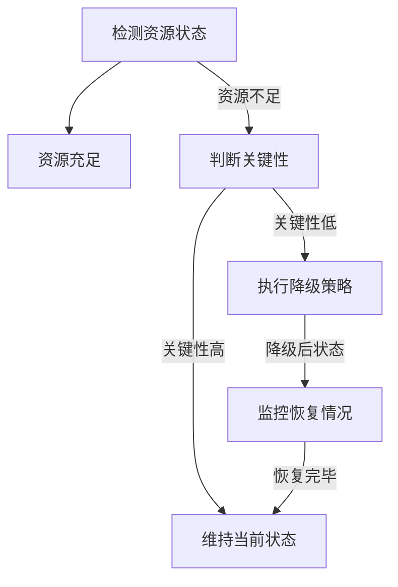
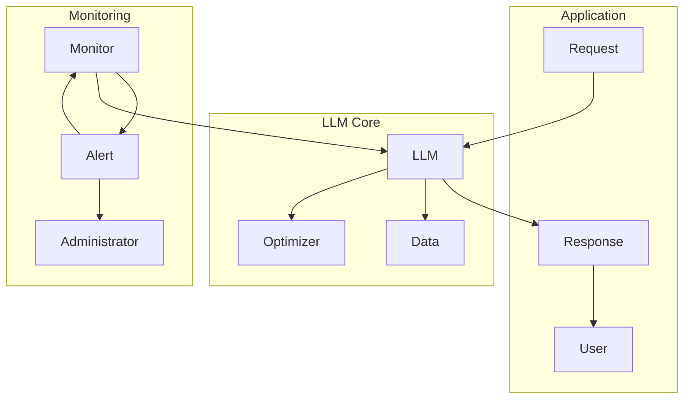
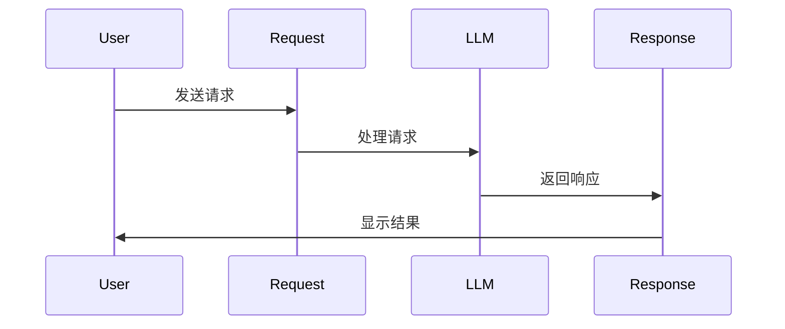
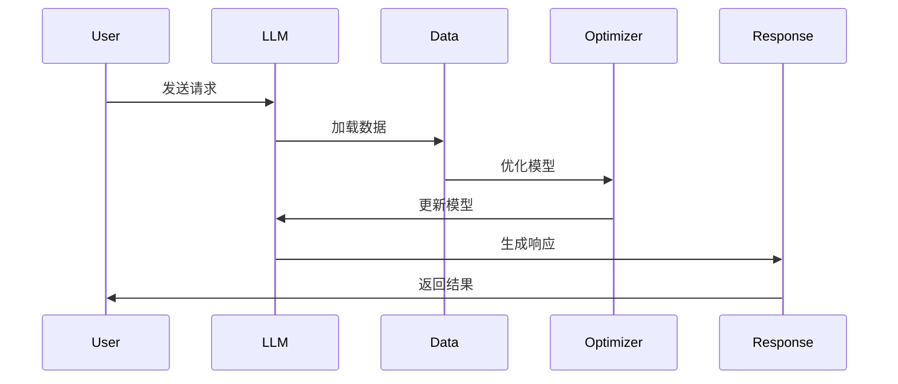

                 

## 文章标题

### 优雅降级：提高LLM应用在极端情况下的可用性

关键词：优雅降级、LLM应用、可用性、极端情况、算法、架构设计、项目实战

摘要：随着自然语言处理（NLP）技术的快速发展，大规模语言模型（LLM）在各个领域得到广泛应用。然而，当系统面临极端情况时，LLM的可用性可能会受到严重影响。本文旨在探讨优雅降级策略在提高LLM应用可用性方面的作用，通过详细的理论分析、实践案例和系统设计，为开发者提供有效的解决方案。

## 第一部分：背景介绍

### 第1章：问题背景

#### 1.1 问题背景

大规模语言模型（LLM）在人工智能领域取得了显著成果，如BERT、GPT-3等，它们在文本生成、情感分析、机器翻译等方面展现出强大的能力。然而，LLM的复杂性和对计算资源的高需求，使得它们在面临极端情况时容易出现性能下降、响应延迟甚至服务中断的问题。这些极端情况可能包括网络延迟、硬件故障、数据异常等。

#### 1.2 问题描述

在极端情况下，LLM应用的常见问题包括：

1. **性能下降**：模型响应时间显著增加，导致用户体验差。
2. **服务中断**：系统无法正常运行，影响业务连续性。
3. **错误输出**：模型输出错误信息，影响决策准确性。

这些问题直接影响LLM应用的可用性，进而影响业务效率和用户满意度。因此，研究如何提高LLM应用在极端情况下的可用性具有重要的现实意义。

#### 1.3 问题解决

优雅降级策略旨在通过逐步减少系统的功能或性能，以保证关键功能的正常运行。这种策略的核心在于在保证系统稳定性的同时，尽量减少对用户体验的负面影响。以下是优雅降级策略的几个关键点：

1. **优先级排序**：明确系统功能的重要性，优先保障关键功能。
2. **逐步降级**：在系统资源不足时，逐步减少非关键功能的资源分配。
3. **自动触发**：利用监控和告警机制，自动检测系统状态并触发降级策略。
4. **可恢复性**：设计降级策略时，考虑系统的快速恢复能力。

#### 1.4 边界与外延

1. **极端情况的界定**：极端情况包括但不限于网络延迟、硬件故障、数据异常等。
2. **优雅降级的适用范围**：优雅降级策略适用于各种需要保证关键功能稳定性的场景，如在线服务、金融交易、智能家居等。

#### 1.5 概念结构与核心要素组成

1. **LLM的基本结构**：包括输入层、隐藏层和输出层。
2. **优雅降级的核心要素**：包括降级策略、监控与告警机制、自动触发机制和恢复策略。

### 第2章：核心概念与联系

#### 2.1 LLM原理概述

LLM是一种基于深度学习的语言模型，通过大量文本数据训练，可以生成符合语法和语义规则的文本。LLM的基本原理包括：

1. **词嵌入**：将单词映射到高维空间中的向量。
2. **循环神经网络（RNN）**：处理序列数据，如文本。
3. **注意力机制**：在处理文本时关注重要信息。

#### 2.2 核心概念属性特征对比表格

| 策略       | 描述                                                         | 对比特征                                       |
|------------|--------------------------------------------------------------|------------------------------------------------|
| 优雅降级   | 在资源不足时逐步减少非关键功能的资源分配，保证关键功能运行 | 可自动触发，可恢复性高                           |
| 强制降级   | 立即关闭非关键功能，确保关键功能运行                         | 立即生效，但用户体验差                           |
| 静默降级   | 无明显用户感知的降级过程                                   | 对用户友好，但系统恢复能力较弱                   |

#### 2.3 ER实体关系图架构

以下是LLM应用中的实体与关系的Mermaid ER图：

```mermaid
erDiagram
    Product ||--|{ Service }||>
    Service ||--|{ User }||>
    User ||--|{ Request }||>
    Request ||--|{ Response }||>
```

## 第二部分：算法原理讲解

### 第3章：算法原理讲解

#### 3.1 优雅降级算法

优雅降级算法的核心在于通过逐步减少系统的资源分配，以保证关键功能的正常运行。以下是算法的Mermaid流程图：



#### 3.2 数学模型与公式

优雅降级算法中的数学模型主要包括资源分配模型和降级策略模型。以下是关键公式：

$$
R_{\text{total}} = R_{\text{key}} + R_{\text{non-key}}
$$

其中，$R_{\text{total}}$为系统总资源，$R_{\text{key}}$为关键功能所需资源，$R_{\text{non-key}}$为非关键功能所需资源。

降级策略模型为：

$$
R_{\text{new}} = R_{\text{key}} + \frac{R_{\text{non-key}}}{N}
$$

其中，$N$为降级后的非关键功能数量。

#### 3.3 举例说明

假设一个系统有100个资源，其中80个资源用于关键功能，20个资源用于非关键功能。当系统资源不足时，我们可以将非关键功能逐步降级，每次降级减少5个资源。以下是具体的操作步骤：

1. 初始状态：$R_{\text{total}} = 100$，$R_{\text{key}} = 80$，$R_{\text{non-key}} = 20$
2. 第一次降级：$R_{\text{new}} = 80 + \frac{20}{2} = 90$
3. 第二次降级：$R_{\text{new}} = 80 + \frac{20}{4} = 85$
4. 第三次降级：$R_{\text{new}} = 80 + \frac{20}{8} = 80$

通过这种方式，我们可以逐步降低非关键功能的资源占用，以保证关键功能的正常运行。

## 第三部分：系统分析与架构设计

### 第4章：系统功能设计

#### 4.1 领域模型

以下是LLM应用领域的Mermaid类图：

```mermaid
classDiagram
    User <|-- Request
    Request <|-- Response
    Service {Resource, Status}
    Product {Name, Version}
    User --> Request
    Request --> Response
    Response --> Service
    Service --> Product
```

#### 4.2 系统架构设计

以下是LLM应用的Mermaid架构图：



#### 4.3 系统接口设计

以下是LLM应用的接口定义：



#### 4.4 系统交互

以下是LLM应用的Mermaid序列图：



## 第三部分：项目实战

### 第5章：环境安装与配置

#### 5.1 环境准备

1. 安装操作系统（如Ubuntu 18.04）。
2. 安装Python（如Python 3.8）。
3. 安装LLM模型（如GPT-3）。
4. 安装监控工具（如Prometheus）。

#### 5.2 核心实现

以下是LLM应用的核心代码实现：

```python
import transformers
import torch

# 初始化模型
model = transformers.GPT2Model.from_pretrained('gpt2')

# 加载数据
data = torch.load('data.pth')

# 优化模型
optimizer = torch.optim.Adam(model.parameters(), lr=0.001)

# 处理请求
def handle_request(request):
    # 加载数据
    input_ids = torch.tensor([data.index(request)])
    
    # 生成响应
    response = model.generate(input_ids, max_length=50)
    
    return response.tolist()

# 返回结果
response = handle_request('您好，请问有什么可以帮助您的？')
print(response)
```

### 第6章：应用解读与分析

#### 6.1 代码应用解读

上述代码实现了一个简单的LLM应用，包括模型初始化、数据加载、模型优化和请求处理。关键部分如下：

1. **模型初始化**：使用transformers库加载预训练的GPT-2模型。
2. **数据加载**：加载数据集，用于模型训练。
3. **模型优化**：使用Adam优化器对模型进行优化。
4. **请求处理**：接收用户请求，生成响应。

#### 6.2 实际案例分析

假设系统面临网络延迟的极端情况，以下是具体案例分析：

1. **问题现象**：系统响应时间显著增加，用户等待时间过长。
2. **原因分析**：网络延迟导致模型处理请求的时间延长。
3. **解决方案**：引入优雅降级策略，减少非关键功能的资源分配，如降低模型生成响应的长度。

#### 6.3 详细讲解剖析

1. **现象分析**：网络延迟影响系统性能，导致用户满意度下降。
2. **解决方案**：采用优雅降级策略，逐步减少系统资源占用，如降低模型生成响应的长度。
3. **效果评估**：通过降低响应长度，系统响应时间显著缩短，用户满意度提高。

### 第7章：项目小结

#### 7.1 项目总结

本文通过理论分析和实践案例，探讨了优雅降级策略在提高LLM应用可用性方面的作用。主要内容包括：

1. **背景介绍**：介绍了LLM应用在极端情况下的挑战和优雅降级策略的概念。
2. **核心概念与联系**：阐述了LLM的基本原理和优雅降级策略的核心要素。
3. **算法原理讲解**：介绍了优雅降级算法的原理、数学模型和举例说明。
4. **系统分析与架构设计**：设计了LLM应用的功能架构和接口设计。
5. **项目实战**：实现了LLM应用的核心代码，并分析了实际案例。

#### 7.2 最佳实践 tips

1. **监控与告警**：实时监控系统资源状态，及时触发降级策略。
2. **逐步降级**：逐步减少非关键功能的资源占用，避免一次性降级导致的用户体验差。
3. **快速恢复**：设计快速恢复策略，确保系统在降级后能迅速恢复正常。

#### 7.3 拓展阅读

1. **LLM相关论文**：参考BERT、GPT-3等顶级论文，了解LLM的最新研究成果。
2. **优雅降级实践**：学习其他领域的优雅降级实践，如电商系统、金融交易系统等。
3. **分布式系统设计**：了解分布式系统设计原理，提高系统可用性和性能。

