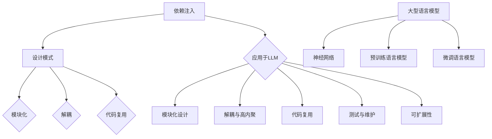
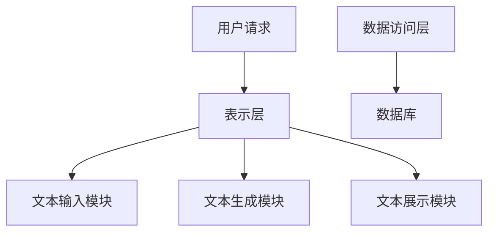
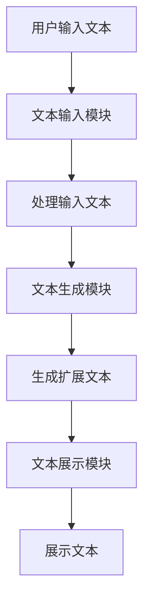
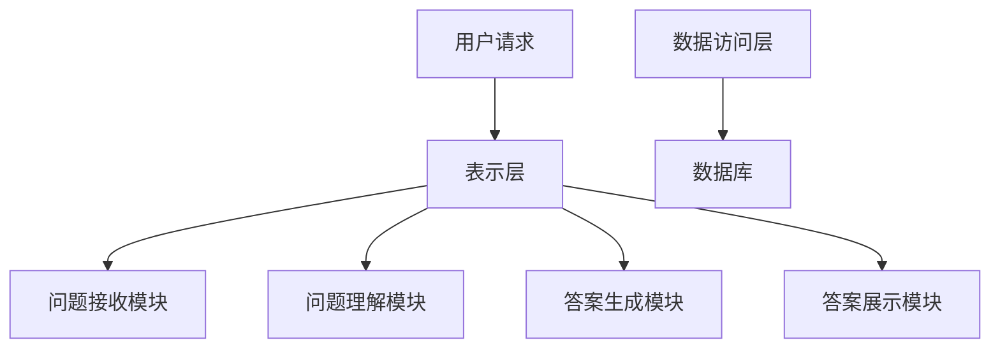
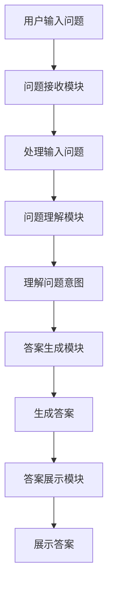

                 

### 第1章: 问题背景与核心概念

#### 1.1 问题背景

依赖注入（DI）和大型语言模型（LLM）是当今软件开发和人工智能领域的两个重要概念。随着软件系统的复杂度不断增加，如何有效地管理和维护这些系统的依赖关系成为了一个亟待解决的问题。依赖注入作为一种先进的软件设计模式，旨在通过将依赖关系的创建与对象实例的创建分离，实现系统的模块化、高内聚和低耦合。

大型语言模型（LLM）则代表了人工智能领域的前沿技术，特别是自然语言处理（NLP）领域的突破。LLM通过训练大规模的神经网络模型，能够理解和生成自然语言，广泛应用于文本生成、机器翻译、问答系统等领域。然而，LLM的应用场景复杂多变，需要灵活的架构设计以适应不同的业务需求。

依赖注入在LLM应用中的需求主要体现在以下几个方面：

1. **模块化与灵活性**：LLM应用通常由多个组件组成，如文本生成引擎、翻译模块、问答系统等。依赖注入使得这些组件可以独立开发、测试和部署，提高了系统的灵活性。

2. **代码复用与解耦**：通过依赖注入，LLM的不同模块可以重用相同的依赖项，减少了代码冗余，同时也降低了模块之间的耦合度，使得系统更加易于维护。

3. **测试与维护**：依赖注入使得单元测试变得更加容易，因为测试时可以方便地替换实际的依赖项，从而确保模块的独立性。这也有助于长期维护系统的稳定性和可靠性。

4. **可扩展性**：随着LLM应用的不断扩展和更新，依赖注入可以方便地添加新功能或替换现有功能，而不影响系统的整体架构。

#### 1.2 核心概念

##### 依赖注入（DI）

依赖注入是一种设计模式，通过将依赖关系的创建与对象实例的创建分离，实现组件之间的解耦。其核心思想是将依赖对象的创建和注入交给专门的框架或容器来管理，而不是在对象内部自行创建。

依赖注入的主要方式包括：

- **构造函数注入**：通过构造函数将依赖对象传递给目标对象。
- **设值注入**：通过设值方法（如setter方法）将依赖对象注入到目标对象中。
- **接口注入**：通过接口定义依赖项，实现依赖项的替换和扩展。

##### 大型语言模型（LLM）

大型语言模型是一种基于深度学习的自然语言处理模型，通过训练大规模的神经网络，实现对自然语言的语义理解、生成和翻译。LLM的核心组成部分包括：

- **词汇表**：包含模型的词汇和对应的索引。
- **神经网络**：用于处理和生成文本。
- **训练数据**：用于训练模型，提高其预测和生成能力。

LLM的主要类型包括：

- **预训练语言模型**：如GPT、BERT等，通过大规模无监督数据训练得到。
- **微调语言模型**：在预训练模型的基础上，使用有监督数据微调，以适应特定任务。

#### 1.3 概念关系图

为了更清晰地理解依赖注入和LLM之间的关系，我们可以通过以下Mermaid流程图来展示它们的核心概念和联系：



通过这个关系图，我们可以看到依赖注入如何为LLM应用带来一系列好处，从而提升系统的整体质量和效率。

---

### 1.3 概念关系图

为了更清晰地理解依赖注入和LLM之间的关系，我们可以通过以下Mermaid流程图来展示它们的核心概念和联系：


通过这个关系图，我们可以看到依赖注入如何为LLM应用带来一系列好处，从而提升系统的整体质量和效率。

---

### 2.1 依赖注入原理

#### 2.1.1 控制反转（IoC）

控制反转（IoC）是依赖注入（DI）的核心概念之一。IoC的基本思想是将对象的控制权从对象自身转移到外部容器，外部容器负责创建和管理对象的依赖关系。这样，对象不再需要直接创建或查找依赖对象，而是通过容器来注入这些依赖。

IoC的主要优点包括：

- **解耦**：通过IoC，对象的依赖关系被外部容器管理，从而降低了对象之间的耦合度。
- **模块化**：对象可以独立开发、测试和部署，提高了系统的模块化程度。
- **灵活性和可扩展性**：通过容器，可以方便地替换或扩展依赖对象，从而实现系统的灵活调整。

#### 2.1.2 依赖注入的方式

依赖注入有多种方式，每种方式都有其特定的应用场景和优点。

1. **构造函数注入**

构造函数注入是最常见的依赖注入方式之一。在这种方式中，依赖对象通过构造函数参数传递给目标对象。这种方式的优点包括：

- **清晰明确**：依赖关系在对象的构造过程中明确传递，使得代码结构清晰。
- **强依赖关系**：构造函数注入确保了依赖关系的强一致性，避免了对象实例的不一致问题。

然而，构造函数注入也有一些缺点，例如：

- **灵活性较低**：一旦依赖对象确定，修改成本较高。
- **大量参数传递**：在复杂系统中，构造函数可能需要传递多个依赖对象，导致参数数量过多。

2. **设值注入

设值注入通过设值方法（如setter方法）将依赖对象注入到目标对象中。这种方式的主要优点包括：

- **灵活性高**：通过设值注入，可以在运行时动态替换依赖对象，提高了系统的灵活性。
- **代码简洁**：不需要在构造函数中传递依赖对象，使得代码更加简洁。

然而，设值注入也有一些缺点，例如：

- **代码可读性降低**：依赖关系在对象的设值方法中定义，使得代码可读性降低。
- **可能引入延迟绑定**：由于依赖关系在运行时确定，可能导致部分依赖关系无法在编译时验证。

3. **接口注入

接口注入通过接口定义依赖项，实现依赖项的替换和扩展。在这种方式中，目标对象依赖于接口，而具体的实现类通过容器注入。这种方式的主要优点包括：

- **高度可扩展性**：通过接口注入，可以方便地替换或扩展依赖对象，提高了系统的可扩展性。
- **类型安全**：由于依赖对象通过接口传递，可以在编译时进行类型检查，提高了代码的安全性。

然而，接口注入也有一些缺点，例如：

- **代码复杂度增加**：需要定义和实现多个接口，增加了代码的复杂度。
- **运行时依赖**：接口注入依赖于运行时的容器管理，可能在运行时出现性能问题。

#### 2.1.3 依赖注入的生命周期管理

依赖注入的生命周期管理是指管理依赖对象的创建、销毁和使用过程。生命周期管理的主要目标是在正确的时间创建和销毁依赖对象，以确保系统的稳定性和性能。

常见的生命周期管理策略包括：

- **单例模式**：每个依赖对象在整个应用程序生命周期中保持唯一实例。
- **作用域模式**：每个依赖对象在其所在的作用域内保持唯一实例，作用域可以是请求、会话或应用程序。
- **创建和销毁策略**：根据依赖对象的类型和需求，自定义其创建和销毁策略。

生命周期管理的关键在于平衡系统的灵活性和性能。合理的管理策略可以提高系统的可扩展性，减少资源浪费，但同时也可能增加系统的复杂度。

---

### 2.2 依赖注入模型

依赖注入模型主要包括以下几个核心组成部分：倒置控制层（IoC容器）、依赖查找与绑定，以及依赖注入的生命周期管理。以下是对这些组成部分的详细解释：

#### 2.2.1 倒置控制层（IoC容器）

倒置控制层（IoC容器）是依赖注入模型的核心组件，它负责创建和管理依赖对象的生命周期。IoC容器通过将对象的创建和依赖管理分离，实现了控制反转。以下是一些常见的IoC容器：

- **Spring容器**：Spring框架中的IoC容器，支持构造函数注入、设值注入和接口注入等多种注入方式。
- **Django容器**：Django框架中的IoC容器，主要用于Web应用开发，提供了丰富的依赖注入功能。
- **其他IoC容器**：如Unity、Ninject等，它们在不同的应用场景下提供灵活的依赖注入解决方案。

IoC容器的主要功能包括：

- **依赖对象的创建与初始化**：IoC容器根据配置信息或注解，创建并初始化依赖对象。
- **依赖查找与绑定**：IoC容器负责根据依赖关系，查找并绑定相应的依赖对象。
- **依赖注入**：IoC容器将依赖对象注入到目标对象中，实现对象的依赖管理。

#### 2.2.2 依赖查找与绑定

依赖查找与绑定是依赖注入模型的关键环节。依赖查找是指IoC容器根据依赖关系，从容器内部查找相应的依赖对象。依赖绑定则是指IoC容器将查找到的依赖对象绑定到目标对象上。

依赖查找与绑定可以按照不同的策略进行，常见的策略包括：

- **按类型查找与绑定**：IoC容器根据依赖对象的类型查找对应的实现类，并进行绑定。
- **按名称查找与绑定**：IoC容器根据依赖对象的名称查找对应的实现类，并进行绑定。
- **自动绑定**：IoC容器根据依赖关系自动进行查找和绑定，无需手动配置。

#### 2.2.3 依赖注入的生命周期管理

依赖注入的生命周期管理是指管理依赖对象的生命周期，包括创建、使用和销毁。生命周期管理的主要目标是在正确的时间创建和销毁依赖对象，以确保系统的稳定性和性能。

常见的生命周期管理策略包括：

- **单例模式**：每个依赖对象在整个应用程序生命周期中保持唯一实例。这种模式适用于那些不经常变化或对性能要求较高的依赖对象。
- **作用域模式**：每个依赖对象在其所在的作用域内保持唯一实例，作用域可以是请求、会话或应用程序。这种模式适用于那些需要共享但不跨作用域的依赖对象。
- **创建和销毁策略**：根据依赖对象的类型和需求，自定义其创建和销毁策略。例如，可以采用延迟加载、池化等技术来优化依赖对象的生命周期。

生命周期管理的关键在于平衡系统的灵活性和性能。合理的管理策略可以提高系统的可扩展性，减少资源浪费，但同时也可能增加系统的复杂度。

---

### 2.3 依赖注入的优点与挑战

#### 2.3.1 优点

依赖注入（DI）作为一种先进的软件设计模式，具有许多显著的优点，以下列举了其中几个重要的优点：

1. **模块化与可维护性**：依赖注入使得系统组件更加模块化，每个组件可以独立开发、测试和部署。这种模块化设计提高了系统的可维护性，使得开发者可以更轻松地理解和修改代码。

2. **解耦与高内聚**：通过依赖注入，组件之间的依赖关系被外部容器管理，从而降低了组件之间的耦合度。同时，依赖注入鼓励组件之间的高内聚，即组件应该仅关注自己的功能，而不关心其他组件的实现细节。

3. **代码复用**：依赖注入使得组件可以重用相同的依赖项，减少了代码冗余。这种复用不仅提高了开发效率，还有助于保持代码的一致性和可靠性。

4. **测试与维护**：依赖注入使得单元测试变得更加容易，因为测试时可以方便地替换实际的依赖项，从而确保模块的独立性。此外，依赖注入还使得系统的长期维护变得更加简单和高效。

5. **可扩展性**：依赖注入提供了系统的灵活性和可扩展性。通过修改依赖关系，可以方便地添加新功能或替换现有功能，而不影响系统的整体架构。

#### 2.3.2 挑战

尽管依赖注入具有许多优点，但在实际应用中也会面临一些挑战，以下列举了其中几个主要的挑战：

1. **性能问题**：依赖注入引入了额外的对象创建和依赖查找操作，这可能对系统的性能产生负面影响。尤其是在高负载或实时应用场景中，性能问题可能变得尤为突出。

2. **复杂性增加**：依赖注入需要开发者具备一定的设计模式和编程技能，如IoC容器、依赖查找和绑定等。这些概念的增加可能使得代码变得复杂，对于新手开发者来说可能存在一定的学习门槛。

3. **调试难度**：依赖注入引入了额外的抽象层，使得调试变得更加困难。在出现问题时，开发者可能需要花费更多的时间来定位和解决问题。

4. **框架依赖**：依赖注入通常需要使用特定的框架或库，如Spring、Django等。这意味着系统可能对特定的框架产生依赖，限制了技术的选择和灵活性。

5. **运行时依赖**：依赖注入依赖于运行时的容器管理，这可能导致运行时出现性能问题或异常。在某些情况下，依赖注入可能会导致系统难以维护或扩展。

总的来说，依赖注入是一种强大的设计模式，但在实际应用中需要权衡其优点和挑战，选择合适的应用场景和策略。

---

### 3.1 开发环境准备

#### 3.1.1 硬件资源要求

为了搭建适合LLM应用的依赖注入开发环境，需要考虑以下硬件资源要求：

1. **计算资源**：由于LLM模型通常需要大量的计算资源，建议使用具备高性能CPU和GPU的服务器或工作站。特别是，NVIDIA的GPU（如Tesla系列）在深度学习任务中表现出色。
2. **内存**：大型语言模型需要大量的内存进行训练和推理，建议使用至少16GB的RAM，对于更大规模的模型，32GB或更高的内存会更加合适。
3. **存储**：由于LLM模型的数据集通常较大，需要足够的存储空间来存储数据和模型文件。建议使用SSD存储，以提高数据读写速度。
4. **网络**：如果需要从远程服务器或云端访问资源，建议具备稳定的网络连接。

#### 3.1.2 软件环境安装

在满足硬件资源要求后，接下来需要安装以下软件环境：

1. **操作系统**：首选Linux操作系统，如Ubuntu或CentOS，因为它们在深度学习和依赖注入框架的部署中表现出色。
2. **依赖注入框架**：选择适合项目的依赖注入框架，如Spring框架。安装Spring框架可以通过以下命令完成：

   ```bash
   $ wget https://repo.spring.io/snapshot/spring-framework/spring-framework-dist.zip
   $ unzip spring-framework-dist.zip
   $ cd spring-framework/dist
   $ ./install.sh
   ```

3. **深度学习库**：安装深度学习库，如TensorFlow或PyTorch，这些库为LLM模型提供了必要的计算支持和训练工具。以安装TensorFlow为例，可以使用以下命令：

   ```bash
   $ pip install tensorflow
   ```

4. **其他依赖**：根据项目的具体需求，可能还需要安装其他依赖库，如Python的科学计算库NumPy、Pandas等。可以使用以下命令进行安装：

   ```bash
   $ pip install numpy pandas
   ```

#### 3.1.3 环境配置与调试

在安装完所需的软件环境后，需要进行以下环境配置和调试步骤：

1. **配置环境变量**：确保依赖注入框架和深度学习库的环境变量已配置，以便在命令行中使用。例如，为Spring框架配置环境变量：

   ```bash
   $ export PATH=$PATH:/path/to/spring-framework/bin
   ```

2. **测试环境**：通过执行一些测试命令来验证环境的正确配置。例如，测试Spring框架是否已正确安装：

   ```bash
   $ java -jar /path/to/spring-framework/lib/spring.jar
   ```

   如果成功运行，将显示Spring的欢迎信息。

3. **调试技巧**：在开发过程中，可能需要使用调试工具，如IDE的调试功能或Python的pdb模块。调试技巧包括设置断点、单步执行代码、查看变量值等。

通过以上步骤，可以搭建一个适合依赖注入和LLM应用开发的软件环境，为后续的开发和测试工作奠定基础。

---

### 3.2 依赖注入框架选择

在LLM应用开发中，选择合适的依赖注入框架至关重要。常见的依赖注入框架包括Spring、Django和其他框架，每种框架都有其独特的特点和适用场景。以下是这些框架的简要介绍和比较：

#### 3.2.1 Spring框架

**Spring框架** 是一个开源的Java企业级开发框架，广泛应用于企业级应用开发。Spring框架提供了丰富的依赖注入功能，支持多种依赖注入方式，包括构造函数注入、设值注入和接口注入。

**优点**：

- **功能强大**：Spring框架提供了全面的企业级功能，包括数据访问、事务管理、安全性等。
- **社区支持**：Spring拥有庞大的社区支持，提供了丰富的文档和教程。
- **灵活性高**：Spring框架支持多种编程风格，包括面向过程、面向对象和函数式编程。

**缺点**：

- **学习曲线**：Spring框架的功能丰富，但对于初学者来说，可能需要一定的时间来学习和掌握。
- **性能问题**：由于Spring框架的复杂性，在高负载或实时应用场景中，可能存在性能问题。

**适用场景**：Spring框架适用于需要复杂企业级功能的大型项目，特别是在Java生态系统中的应用开发。

#### 3.2.2 Django框架

**Django框架** 是一个Python开源框架，适用于Web开发，特别是快速开发和原型设计。Django框架内置了依赖注入功能，可以通过类注解和配置文件进行依赖注入。

**优点**：

- **快速开发**：Django框架提供了“电池包含”（Batteries Included）的特性，许多常用功能已内置，降低了开发难度。
- **文档友好**：Django框架的文档详细且易于理解，对初学者友好。
- **灵活性强**：Django框架支持多种依赖注入方式，包括类注解和配置文件。

**缺点**：

- **性能问题**：在处理高并发请求时，Django的性能可能不如其他框架。
- **特定场景限制**：Django框架更适合快速开发和原型设计，对于需要高度定制化的项目可能不够灵活。

**适用场景**：Django框架适用于快速开发和原型设计的Web应用，特别是在Python生态系统中。

#### 3.2.3 其他框架

除了Spring和Django，还有许多其他依赖注入框架，如Unity、Ninject等。这些框架各有特色，适用于不同的应用场景。

**Unity框架**：

- **优点**：支持各种编程语言，灵活性强，提供了强大的依赖管理功能。
- **缺点**：相对于Spring和Django，社区支持和文档较少。
- **适用场景**：适用于需要跨语言开发的复杂项目。

**Ninject框架**：

- **优点**：轻量级，易于集成，支持多种注入模式。
- **缺点**：功能相对较少，社区支持不如Spring和Django。
- **适用场景**：适用于中小型项目和需要高性能的应用。

#### 3.2.4 选择建议

选择依赖注入框架时，应考虑以下因素：

- **项目需求**：根据项目的具体需求，选择具有合适功能和支持的框架。
- **团队技能**：考虑团队对框架的熟悉程度，选择易于学习和使用的框架。
- **性能要求**：根据性能要求，选择在特定场景下表现良好的框架。
- **社区支持**：选择社区支持活跃的框架，以便在遇到问题时能够得到有效的帮助。

总的来说，Spring框架适用于需要复杂企业级功能的大型项目，Django框架适用于快速开发和原型设计的Web应用，而其他框架则适用于特定的应用场景和需求。

---

### 3.3 环境配置与调试

#### 3.3.1 环境配置

在搭建依赖注入框架和LLM开发环境时，环境配置是至关重要的一步。以下是基于Spring框架的配置步骤，同时提供了一些建议和注意事项。

1. **安装Spring框架**

   首先，确保已经按照3.1节中的步骤安装了Spring框架。如果尚未完成，请按照以下命令进行安装：

   ```bash
   $ wget https://repo.spring.io/snapshot/spring-framework/spring-framework-dist.zip
   $ unzip spring-framework-dist.zip
   $ cd spring-framework/dist
   $ ./install.sh
   ```

2. **配置Spring环境变量**

   为了在命令行中使用Spring框架，需要配置环境变量。执行以下命令：

   ```bash
   $ export PATH=$PATH:/path/to/spring-framework/bin
   ```

   请确保替换`/path/to/spring-framework/bin`为实际的Spring安装路径。

3. **安装深度学习库**

   如果尚未安装深度学习库，如TensorFlow或PyTorch，请使用以下命令进行安装：

   ```bash
   $ pip install tensorflow
   # 或
   $ pip install torch torchvision
   ```

4. **配置深度学习库**

   对于TensorFlow，可能需要配置GPU支持。执行以下命令：

   ```bash
   $ pip install tensorflow-gpu
   ```

   对于PyTorch，需要下载并安装相应的CUDA版本。具体步骤请参考PyTorch官方文档。

5. **配置其他依赖库**

   根据项目的具体需求，可能还需要安装其他依赖库。可以使用以下命令进行安装：

   ```bash
   $ pip install numpy pandas
   ```

#### 3.3.2 调试技巧

在开发过程中，调试是确保代码正确性和性能的重要环节。以下是一些常用的调试技巧：

1. **使用IDE的调试功能**

   如果使用IDE（如IntelliJ IDEA、PyCharm），可以利用IDE提供的调试功能。设置断点、单步执行、查看变量值等都是常见的调试方法。

2. **使用Python的pdb模块**

   如果在命令行中调试Python代码，可以使用内置的pdb模块。以下是一个简单的调试示例：

   ```python
   import pdb
   pdb.set_trace()  # 在此处设置断点
   ```

3. **日志记录**

   使用日志记录器（如Python的logging模块）可以帮助追踪代码的执行过程和状态。以下是一个简单的日志记录示例：

   ```python
   import logging
   logging.basicConfig(level=logging.DEBUG)
   logging.debug('This is a debug message.')
   ```

#### 3.3.3 注意事项

1. **环境一致性**：确保开发和测试环境一致，避免因环境差异导致的问题。
2. **版本兼容性**：检查依赖库的版本兼容性，避免因版本冲突导致的问题。
3. **性能优化**：在高负载或实时应用场景中，注意性能优化，避免因性能瓶颈导致的问题。
4. **错误处理**：合理处理异常和错误，确保系统的稳定性和可靠性。

通过以上环境配置和调试技巧，可以有效地搭建并优化依赖注入和LLM开发环境，为后续的开发和测试工作提供坚实的基础。

---

### 4.1 LLM应用架构设计原则

在LLM应用架构设计中，遵循以下原则至关重要，这些原则不仅能够提高系统的模块化、解耦性，还能确保系统的可扩展性和可维护性。

#### 4.1.1 模块化设计

模块化设计是将系统划分为多个独立模块，每个模块负责特定的功能。这种设计原则具有以下几个关键优点：

- **易于理解**：模块化设计使得系统结构清晰，每个模块的功能独立，便于开发者理解和维护。
- **代码复用**：通过模块化，可以方便地将通用功能提取为独立的模块，从而在不同项目中复用代码。
- **可测试性**：独立的模块可以单独进行单元测试，确保每个模块的功能正确无误。

实现模块化设计的关键步骤包括：

1. **定义模块边界**：明确每个模块的职责和功能范围，避免模块之间的功能重叠。
2. **接口设计**：为每个模块定义清晰的接口，确保模块之间的交互简单明了。
3. **模块独立性**：确保模块内部实现细节对外部不可见，模块之间通过接口进行通信。

#### 4.1.2 解耦与高内聚

解耦与高内聚是软件设计的重要原则，它们共同确保系统的稳定性和灵活性。

- **解耦**：解耦是指减少模块之间的直接依赖关系，使各模块可以独立开发、测试和部署。解耦的主要优点包括：

  - **易于修改**：模块的修改不会影响其他模块，降低了系统的复杂性。
  - **易于测试**：模块可以独立进行单元测试，确保模块的功能正确无误。

  实现解耦的关键步骤包括：

  1. **使用抽象接口**：通过定义抽象接口，模块之间通过接口进行通信，而不是直接调用具体实现。
  2. **依赖倒置原则**：依赖倒置原则（DIP）要求高层模块不应依赖于低层模块，二者都应依赖于抽象。这有助于降低模块之间的耦合度。

- **高内聚**：高内聚是指模块内部的功能紧密相关，模块内部的所有代码都服务于单一目标。高内聚的主要优点包括：

  - **易于理解和维护**：模块内部功能紧密相关，使得模块更加易于理解和维护。
  - **减少代码冗余**：高内聚的模块减少了代码冗余，提高了代码的复用性。

  实现高内聚的关键步骤包括：

  1. **功能单一原则**：每个模块应仅负责单一功能，避免模块内部功能的过度复杂。
  2. **逻辑一致性**：模块内部的代码应逻辑一致，确保模块的功能完整且无漏洞。

#### 4.1.3 可扩展性与可维护性

可扩展性和可维护性是确保系统长期稳定运行的关键因素。

- **可扩展性**：可扩展性是指系统能够方便地添加新功能或更换现有功能，以适应不断变化的需求。实现可扩展性的关键步骤包括：

  1. **模块化设计**：通过模块化设计，将系统划分为多个独立模块，便于添加新功能或扩展现有功能。
  2. **接口设计**：为系统中的每个模块定义清晰的接口，确保新功能可以无缝集成到现有系统中。
  3. **配置管理**：使用配置文件或环境变量管理系统的配置，使得系统可以灵活调整。

- **可维护性**：可维护性是指系统在长期运行过程中能够持续维护和优化，确保系统的稳定性和性能。实现可维护性的关键步骤包括：

  1. **代码规范**：遵循一致的代码规范，确保代码风格统一，易于阅读和理解。
  2. **文档管理**：编写详细的文档，记录系统的设计、实现和运行过程，方便后续的维护和优化。
  3. **自动化测试**：编写自动化测试用例，确保每次代码修改后系统仍然稳定运行。

通过遵循上述架构设计原则，可以构建一个模块化、解耦、高内聚、可扩展和可维护的LLM应用系统，为系统的长期稳定运行提供有力保障。

---

### 4.2 LLM应用架构方案

#### 4.2.1 传统架构方案

在传统架构中，LLM应用的架构通常分为三层：表示层、业务逻辑层和数据访问层。

1. **表示层**：负责与用户交互，通常包括Web界面、移动应用界面等。表示层的主要职责是接收用户输入，展示应用结果，并处理用户的交互请求。

2. **业务逻辑层**：负责处理LLM的核心功能，包括文本生成、机器翻译、问答系统等。业务逻辑层是系统的核心部分，通常包含多个模块，每个模块负责一个特定的功能。

3. **数据访问层**：负责与数据库或其他数据源进行交互，实现数据的存储和检索。数据访问层通常使用ORM（对象关系映射）框架，如Hibernate或MyBatis，来简化数据库操作。

**优点**：

- **清晰层次**：传统架构具有清晰的层次结构，使得系统模块之间职责分明，易于理解和维护。
- **通用性**：传统架构广泛应用于各种类型的软件系统，具有较好的通用性和适应性。

**缺点**：

- **高耦合度**：业务逻辑层与表示层和数据访问层之间存在较高的耦合度，导致系统难以扩展和维护。
- **可测试性差**：表示层与业务逻辑层的紧密耦合使得单元测试难以进行，影响了系统的可测试性。

#### 4.2.2 依赖注入架构方案

依赖注入架构方案通过引入依赖注入（DI）模式，对传统架构进行改进，实现更高级别的模块化、解耦和可测试性。

1. **模块化设计**：依赖注入架构将系统划分为多个独立模块，每个模块负责一个特定的功能。模块之间通过接口进行通信，降低了模块之间的耦合度。

2. **依赖注入**：依赖注入通过IoC容器管理依赖关系，将依赖对象注入到目标对象中。这种方式使得模块内部不再直接依赖其他模块，提高了系统的可测试性和可维护性。

3. **接口与实现分离**：依赖注入架构强调接口与实现分离，模块通过接口定义功能，实现则由IoC容器注入。这种方式提高了系统的灵活性，使得功能可以方便地替换和扩展。

**优点**：

- **模块化与解耦**：依赖注入架构实现了系统的模块化设计，降低了模块之间的耦合度，使得系统更加灵活和易于维护。
- **高内聚与低耦合**：通过接口与实现分离，依赖注入架构实现了高内聚与低耦合的设计原则，提高了系统的可测试性和可扩展性。
- **易于测试**：依赖注入架构使得单元测试更加容易，因为测试时可以方便地替换实际的依赖对象。

**缺点**：

- **学习成本**：依赖注入架构需要开发者具备一定的设计模式和编程技能，对于新手开发者来说可能存在一定的学习门槛。
- **性能影响**：依赖注入引入了额外的对象创建和依赖查找操作，可能在某些情况下对系统的性能产生负面影响。

**适用场景**：

- **大型复杂项目**：依赖注入架构适用于大型复杂项目，特别是需要频繁扩展和更新的项目。
- **高可测试性需求**：依赖注入架构适用于需要高可测试性的项目，如自动化测试、持续集成和持续部署等。

通过依赖注入架构方案，LLM应用可以实现更高级别的模块化、解耦和可测试性，从而提高系统的质量和开发效率。

---

### 4.3 架构设计案例

为了更好地理解依赖注入架构在LLM应用架构设计中的应用，我们将通过两个实际案例来详细阐述其架构设计过程。

#### 案例一：文本生成应用

**背景**：

文本生成应用是一个典型的LLM应用场景，用于生成各种类型的文本，如文章、新闻报道、对话等。该应用的核心功能包括文本输入、文本处理、文本生成和输出。

**架构设计**：

1. **模块划分**：

   - **文本输入模块**：负责接收用户输入的文本数据，可以是自然语言文本或标记化后的序列。
   - **文本处理模块**：对输入文本进行处理，包括分词、词性标注、词向量转换等。
   - **文本生成模块**：使用LLM模型生成文本，包括上下文生成、文本填充等。
   - **输出模块**：将生成的文本输出给用户，可以是控制台输出或Web页面展示。

2. **接口与实现分离**：

   - **文本输入接口**：定义文本输入的接口，如`TextInputInterface`，实现类为`TextInputImpl`。
   - **文本处理接口**：定义文本处理的接口，如`TextProcessingInterface`，实现类为`TextProcessingImpl`。
   - **文本生成接口**：定义文本生成的接口，如`TextGenerationInterface`，实现类为`TextGenerationImpl`。
   - **输出接口**：定义文本输出的接口，如`OutputInterface`，实现类为`OutputImpl`。

3. **依赖注入**：

   通过IoC容器管理依赖关系，将依赖对象注入到目标对象中。例如，在文本生成模块中，需要注入文本处理模块和输出模块，实现代码如下：

   ```java
   @Component
   public class TextGenerationModule {
       private TextProcessingInterface textProcessing;
       private OutputInterface output;

       @Autowired
       public TextGenerationModule(TextProcessingInterface textProcessing, OutputInterface output) {
           this.textProcessing = textProcessing;
           this.output = output;
       }

       public void generateText(String input) {
           String processedText = textProcessing.process(input);
           output.display(processedText);
       }
   }
   ```

**优点**：

- **模块独立性**：每个模块通过接口进行通信，降低了模块之间的耦合度，使得模块可以独立开发、测试和部署。
- **高可测试性**：模块可以独立进行单元测试，确保每个模块的功能正确无误。
- **灵活性和可扩展性**：通过依赖注入，可以方便地替换或扩展模块的实现，适应不同的业务需求。

#### 案例二：问答系统应用

**背景**：

问答系统应用是另一个常见的LLM应用场景，用于处理用户的问题并生成相应的回答。该应用的核心功能包括问题接收、问题理解、答案生成和答案输出。

**架构设计**：

1. **模块划分**：

   - **问题接收模块**：负责接收用户提出的问题，可以是文本形式或语音形式。
   - **问题理解模块**：理解用户问题的意图和关键信息，包括分词、语义分析等。
   - **答案生成模块**：使用LLM模型生成问题的回答。
   - **答案输出模块**：将生成的答案输出给用户，可以是控制台输出或语音合成输出。

2. **接口与实现分离**：

   - **问题接收接口**：定义问题接收的接口，如`QuestionInputInterface`，实现类为`QuestionInputImpl`。
   - **问题理解接口**：定义问题理解的接口，如`QuestionUnderstandingInterface`，实现类为`QuestionUnderstandingImpl`。
   - **答案生成接口**：定义答案生成的接口，如`AnswerGenerationInterface`，实现类为`AnswerGenerationImpl`。
   - **答案输出接口**：定义答案输出的接口，如`AnswerOutputInterface`，实现类为`AnswerOutputImpl`。

3. **依赖注入**：

   通过IoC容器管理依赖关系，将依赖对象注入到目标对象中。例如，在答案生成模块中，需要注入问题理解模块和答案输出模块，实现代码如下：

   ```java
   @Component
   public class AnswerGenerationModule {
       private QuestionUnderstandingInterface questionUnderstanding;
       private AnswerOutputInterface answerOutput;

       @Autowired
       public AnswerGenerationModule(QuestionUnderstandingInterface questionUnderstanding, AnswerOutputInterface answerOutput) {
           this.questionUnderstanding = questionUnderstanding;
           this.answerOutput = answerOutput;
       }

       public void generateAnswer(String question) {
           String understanding = questionUnderstanding.understand(question);
           String answer = generateAnswer(understanding);
           answerOutput.output(answer);
       }
   }
   ```

**优点**：

- **模块独立性**：每个模块通过接口进行通信，降低了模块之间的耦合度，使得模块可以独立开发、测试和部署。
- **高可测试性**：模块可以独立进行单元测试，确保每个模块的功能正确无误。
- **灵活性和可扩展性**：通过依赖注入，可以方便地替换或扩展模块的实现，适应不同的业务需求。

通过这两个案例，我们可以看到依赖注入架构在LLM应用架构设计中的应用，实现了系统的模块化、解耦和可测试性，为系统的长期稳定运行提供了有力保障。

---

### 5.1 开发流程与步骤

在LLM应用开发中，遵循科学的开发流程和步骤是确保项目顺利进行的关键。以下是LLM应用开发的一般流程和步骤，每个步骤都详细说明其具体内容和方法。

#### 5.1.1 需求分析

需求分析是项目开发的起点，其主要目标是明确项目的功能需求、性能要求和业务场景。以下是需求分析的具体内容和步骤：

1. **业务需求调研**：

   - **用户访谈**：通过与项目相关的人员进行访谈，了解用户的需求和期望。
   - **文档分析**：分析相关业务文档，如用户手册、产品规格说明书等，以获取项目的业务背景和需求。
   - **竞品分析**：研究同类竞品的优势和不足，为项目提供参考和借鉴。

2. **功能需求明确**：

   - **需求列表**：整理并明确项目的功能需求，包括核心功能和扩展功能。
   - **需求文档**：编写详细的需求文档，描述每个功能的需求细节和实现方法。

3. **性能需求分析**：

   - **性能指标**：明确项目的性能指标，如响应时间、吞吐量、并发数等。
   - **性能需求文档**：编写性能需求文档，描述项目的性能要求和优化策略。

#### 5.1.2 设计阶段

设计阶段是项目开发的核心环节，其主要目标是制定项目的总体架构、模块划分和接口设计。以下是设计阶段的具体内容和步骤：

1. **总体架构设计**：

   - **架构风格**：选择适合项目的架构风格，如分层架构、微服务架构等。
   - **架构图**：绘制项目的总体架构图，明确系统的各个模块及其相互关系。

2. **模块划分**：

   - **模块定义**：根据功能需求，将系统划分为多个独立模块，每个模块负责特定的功能。
   - **模块接口**：为每个模块定义清晰的接口，确保模块之间的通信简单明了。

3. **接口设计**：

   - **接口规范**：编写接口规范文档，描述每个接口的输入参数、输出结果和错误处理。
   - **接口实现**：根据接口规范，实现各个模块的接口，确保模块之间的通信正确无误。

#### 5.1.3 编码与测试

编码与测试阶段是将设计转化为实际代码并进行功能测试的关键步骤。以下是编码与测试的具体内容和步骤：

1. **编码**：

   - **代码规范**：遵循统一的代码规范，确保代码风格一致、易于阅读和维护。
   - **编码实践**：采用模块化编码方法，将功能模块逐步实现，并保持代码的可复用性和可维护性。

2. **单元测试**：

   - **测试用例**：编写单元测试用例，覆盖每个功能模块的主要功能和边界情况。
   - **测试执行**：执行单元测试用例，确保每个功能模块的功能正确无误。

3. **集成测试**：

   - **集成环境**：搭建项目的集成测试环境，确保各个模块能够正确集成并协同工作。
   - **集成测试**：执行集成测试用例，验证系统的整体功能和性能。

#### 5.1.4 部署与维护

部署与维护阶段是将系统部署到生产环境并进行持续优化的关键步骤。以下是部署与维护的具体内容和步骤：

1. **部署**：

   - **部署计划**：制定项目的部署计划，包括部署环境、部署步骤和部署策略。
   - **部署实施**：按照部署计划，将系统部署到生产环境，确保系统的稳定运行。

2. **监控与优化**：

   - **性能监控**：对系统的性能进行实时监控，及时发现和解决性能问题。
   - **优化策略**：根据监控数据，制定优化策略，持续提升系统的性能和稳定性。

3. **维护与更新**：

   - **维护计划**：制定项目的维护计划，包括维护任务、维护时间和维护责任人。
   - **更新策略**：根据业务需求和技术发展，制定系统的更新策略，确保系统的持续优化和升级。

通过遵循以上开发流程和步骤，可以确保LLM应用开发的高效、稳定和可持续性。

---

### 5.2 依赖注入代码示例

在LLM应用开发中，依赖注入（DI）是一种常用的设计模式，能够有效地管理对象之间的依赖关系，提高系统的模块化、解耦性和可测试性。以下将分别通过Spring框架和Django框架来展示依赖注入的代码示例。

#### 5.2.1 Spring框架示例

**示例1：构造函数注入**

```java
// 定义一个简单的服务接口
public interface Calculator {
    int add(int a, int b);
}

// 实现服务接口
public class CalculatorImpl implements Calculator {
    @Override
    public int add(int a, int b) {
        return a + b;
    }
}

// 使用构造函数注入的客户端
@Component
public class Client {
    private Calculator calculator;

    @Autowired
    public Client(Calculator calculator) {
        this.calculator = calculator;
    }

    public void performOperation() {
        int result = calculator.add(3, 4);
        System.out.println("Result: " + result);
    }
}
```

**示例2：设值注入**

```java
// 定义一个简单的服务接口
public interface MessageService {
    void sendMessage(String message);
}

// 实现服务接口
public class MessageServiceImpl implements MessageService {
    @Override
    public void sendMessage(String message) {
        System.out.println("Sending message: " + message);
    }
}

// 使用设值注入的客户端
@Component
public class Client {
    private MessageService messageService;

    @Autowired
    public void setMessageService(MessageService messageService) {
        this.messageService = messageService;
    }

    public void performOperation() {
        messageService.sendMessage("Hello, World!");
    }
}
```

**示例3：接口注入**

```java
// 定义一个服务接口
public interface DatabaseService {
    void connect();
    void disconnect();
}

// 实现服务接口
public class DatabaseServiceImpl implements DatabaseService {
    @Override
    public void connect() {
        System.out.println("Database connected.");
    }

    @Override
    public void disconnect() {
        System.out.println("Database disconnected.");
    }
}

// 使用接口注入的客户端
@Component
public class Client {
    private DatabaseService databaseService;

    @Autowired
    public Client(DatabaseService databaseService) {
        this.databaseService = databaseService;
    }

    public void performOperation() {
        databaseService.connect();
        databaseService.disconnect();
    }
}
```

#### 5.2.2 Django框架示例

**示例1：类注解注入**

```python
# 定义一个简单的服务接口
class Calculator:
    def add(self, a, b):
        return a + b

# 实现服务接口
class CalculatorImpl(Calculator):
    def add(self, a, b):
        return a + b

# 使用类注解注入的客户端
from django.utils.functional import cached_property

class Client:
    @cached_property
    def calculator(self):
        return CalculatorImpl()

    def perform_operation(self):
        result = self.calculator.add(3, 4)
        print("Result:", result)
```

**示例2：配置文件注入**

```python
# 定义一个简单的服务接口
class MessageService:
    def send_message(self, message):
        print("Sending message:", message)

# 实现服务接口
class MessageServiceImpl(MessageService):
    def send_message(self, message):
        print("Sending message:", message)

# 使用配置文件注入的客户端
from django.conf import settings

class Client:
    def __init__(self, message_service):
        self.message_service = message_service

    def perform_operation(self):
        self.message_service.send_message("Hello, World!")

# 在Django设置文件中配置服务
MESSAGE_SERVICE = 'app.MessageServiceImpl'
```

通过以上示例，我们可以看到依赖注入在LLM应用开发中的应用。依赖注入不仅提高了系统的模块化、解耦性和可测试性，还简化了依赖管理的复杂性，使得开发者能够更专注于业务逻辑的实现。

---

### 5.3 常见问题与解决方案

在依赖注入（DI）和LLM应用开发过程中，开发者可能会遇到一系列常见问题。以下列举了其中几个主要问题，并提供相应的解决方案。

#### 5.3.1 依赖注入框架的选择

**问题**：在众多依赖注入框架中，如何选择最适合当前项目的框架？

**解决方案**：

1. **项目需求**：根据项目的具体需求，选择具有相应功能和支持的框架。例如，如果项目需要复杂的业务逻辑和数据访问，可以选择Spring框架；如果项目是Web应用，可以选择Django框架。
2. **团队技能**：考虑团队对框架的熟悉程度，选择团队熟悉的框架，降低学习和使用成本。
3. **性能要求**：评估项目的性能需求，选择在特定场景下性能表现良好的框架。例如，在高负载或实时应用场景中，可能需要选择轻量级框架。
4. **社区支持**：选择社区支持活跃的框架，以便在遇到问题时能够得到有效的帮助和解决方案。

#### 5.3.2 依赖注入的性能问题

**问题**：依赖注入是否会对系统的性能产生负面影响？

**解决方案**：

1. **优化依赖查找**：通过缓存依赖对象，减少依赖查找次数。例如，使用Spring框架的`@Lazy`注解，可以实现延迟加载依赖对象。
2. **优化对象创建**：尽量减少在运行时创建对象的数量，使用对象池或工厂模式来管理对象的创建和销毁。
3. **性能测试**：定期进行性能测试，评估依赖注入对系统性能的影响。使用工具如JMeter或Gatling进行压力测试，找出潜在的瓶颈并进行优化。
4. **权衡性能与灵活性**：在设计和开发过程中，权衡系统的性能和灵活性。在一些关键模块，可以采用传统的创建方式，而不是依赖注入。

#### 5.3.3 调试困难

**问题**：依赖注入引入了额外的抽象层，调试变得更加困难。如何有效地调试依赖注入框架中的问题？

**解决方案**：

1. **使用日志记录**：利用依赖注入框架提供的日志记录功能，记录关键操作和异常信息。例如，Spring框架的`logger`对象可以帮助记录日志。
2. **调试工具**：使用IDE（如IntelliJ IDEA或Visual Studio Code）提供的调试工具，设置断点、单步执行和查看变量值，以便更好地理解代码的执行过程。
3. **代码重构**：在调试过程中，如果发现代码结构混乱或难以理解，可以尝试进行代码重构，提高代码的可读性和可维护性。
4. **隔离问题**：将问题模块与其他模块分离，单独调试问题模块，确定问题的具体原因。

#### 5.3.4 框架依赖问题

**问题**：依赖注入框架可能会对系统产生过度的框架依赖，如何减轻框架依赖的影响？

**解决方案**：

1. **抽象接口**：在依赖注入过程中，尽量使用抽象接口来定义依赖关系，而不是直接使用具体实现类。这有助于降低系统对特定框架的依赖。
2. **插件机制**：设计插件机制，允许系统在运行时动态加载和替换依赖项。例如，使用Spring框架的`@Profile`注解，可以基于不同的配置环境加载不同的依赖项。
3. **模块化设计**：通过模块化设计，将系统的不同功能模块分离，减少对单一框架的依赖。模块之间通过接口进行通信，提高了系统的灵活性和可扩展性。

通过以上解决方案，可以有效地应对依赖注入和LLM应用开发过程中常见的挑战，提高系统的稳定性和可维护性。

---

### 第6章: 依赖注入在LLM应用中的好处

#### 6.1 提高开发效率

依赖注入（DI）在LLM应用开发中的一大显著好处是显著提高了开发效率。首先，依赖注入使得开发者能够以模块化的方式组织代码，从而减少了重复性的工作。每个模块可以独立开发、测试和部署，这意味着在一个模块的开发过程中，开发者不需要了解系统的其他部分，这样可以专注于当前模块的功能实现。

具体来说，依赖注入提高了代码的可复用性。由于依赖关系通过外部容器管理，相同的依赖可以在不同的模块中重复使用，减少了冗余代码的编写。例如，在LLM应用中，文本处理、模型训练和预测等核心功能可以通过依赖注入共享相同的依赖对象，如数据预处理库、模型训练框架等。

其次，依赖注入使得开发过程中的调试和维护变得更加高效。通过依赖注入框架，如Spring或Django，开发者可以方便地替换和隔离依赖对象，从而在单元测试和集成测试中更容易发现和解决问题。例如，可以通过IoC容器注入一个模拟数据源来替代实际的数据源，从而在测试环境中验证模块的功能。

此外，依赖注入还减少了配置代码的复杂性。在传统的方式中，开发者需要在代码中硬编码依赖项的配置，而依赖注入允许通过配置文件或注解来管理依赖项，从而简化了配置代码，提高了代码的可读性和可维护性。例如，在Spring框架中，通过`@Configuration`注解和`@Bean`方法，可以定义和管理系统的依赖关系，使得配置代码更加清晰和简洁。

最后，依赖注入提供了灵活的扩展机制。在LLM应用开发中，需求可能会随时变化，依赖注入使得开发者可以轻松地添加新功能或替换现有功能，而不会影响系统的其他部分。例如，可以添加新的文本生成算法或翻译模型，而不需要修改现有的代码结构。

综上所述，依赖注入通过模块化、代码复用、易于调试和维护、简化的配置代码和灵活的扩展机制，显著提高了LLM应用开发的效率，使得开发者能够更加专注于业务逻辑的实现，从而加快开发进度，提高项目的交付质量。

---

#### 6.2 改善测试与维护

依赖注入（DI）在LLM应用中的另一个显著好处是显著改善了测试与维护。通过依赖注入，开发者可以更轻松地编写和执行单元测试，同时提高了系统的可维护性。

首先，依赖注入使得编写单元测试变得更加简单。由于依赖注入框架如Spring或Django能够将依赖对象注入到目标对象中，开发者不需要在测试中手动创建和管理这些依赖对象。例如，在测试文本生成模块时，可以使用一个模拟数据源代替实际的数据库，从而简化测试代码。这种做法不仅减少了测试代码的复杂性，还提高了测试的可复用性。

具体来说，依赖注入有助于实现依赖对象的隔离。通过注入模拟对象或假对象，开发者可以在测试环境中控制依赖项的行为，从而更准确地测试目标模块的功能。例如，在测试文本生成模块时，可以通过注入一个记录日志的输出对象，来验证文本生成的实际输出是否符合预期。

其次，依赖注入提高了测试的覆盖率。由于每个模块都可以独立测试，开发者可以确保每个模块的功能都得到充分的验证。这种独立性使得测试更加全面，从而减少了潜在的bug和缺陷。例如，在测试LLM模型的训练过程时，可以通过注入一个记录训练数据的对象，来验证模型在训练过程中的行为是否正确。

此外，依赖注入有助于系统的长期维护。通过依赖注入，系统的模块化设计使得代码更加清晰和可读，这有助于开发者理解和修改代码。例如，在维护一个复杂的LLM应用时，开发者可以单独修改或替换一个模块，而不需要担心对其他模块的影响。这种模块化设计不仅提高了代码的可维护性，还减少了维护成本。

依赖注入还提供了灵活的依赖替换机制。在维护过程中，如果需要更新或替换某个依赖项，开发者可以轻松地在IoC容器中进行配置，而无需修改代码的其他部分。例如，如果需要更换文本生成算法，可以在配置文件中简单地指定新的实现类，而无需修改现有的代码。

最后，依赖注入还支持持续集成和持续部署（CI/CD）流程。通过自动化测试和依赖注入，开发者可以确保每次代码提交或合并时，系统都会经过全面的测试，从而提高代码的质量和稳定性。这种自动化测试机制不仅减少了测试成本，还提高了开发的效率。

综上所述，依赖注入通过简化单元测试、提高测试覆盖率、增强系统的可维护性和支持自动化测试，显著改善了LLM应用的测试与维护。这些好处使得开发者能够更高效地发现和修复问题，从而确保系统的稳定性和可靠性。

---

### 6.3 增强应用可扩展性

依赖注入（DI）在LLM应用开发中的另一个关键好处是显著增强了应用的可扩展性。通过依赖注入，开发者可以轻松地添加新功能或替换现有功能，而不会影响系统的整体架构，从而适应不断变化的需求和市场趋势。

首先，依赖注入使得模块之间的耦合度大大降低。在传统的开发模式中，模块之间的依赖关系通常通过硬编码实现，这使得模块之间的交互复杂且紧密。而在依赖注入模式下，模块之间的依赖关系通过外部容器管理，模块之间通过抽象接口进行通信。这种设计使得模块可以独立开发、测试和部署，从而降低了模块之间的耦合度。例如，在LLM应用中，文本生成模块、翻译模块和问答模块可以独立开发，通过依赖注入实现模块之间的解耦。

其次，依赖注入提供了灵活的依赖替换机制。在LLM应用开发中，可能需要根据不同的业务场景或用户需求，更换或扩展某些功能模块。通过依赖注入，开发者可以在运行时动态地替换或扩展依赖对象，而无需修改现有代码。例如，如果需要更换文本生成算法，开发者可以在配置文件中指定新的实现类，而不需要修改文本生成模块的其他部分。这种灵活性使得系统可以快速适应变化，提高了系统的可扩展性。

具体而言，依赖注入通过以下方式增强了LLM应用的可扩展性：

1. **模块化设计**：依赖注入鼓励模块化设计，使得每个模块可以独立开发和部署。这种模块化设计不仅提高了系统的可维护性，还增强了系统的可扩展性。例如，在LLM应用中，可以将文本生成、翻译和问答功能划分为独立的模块，每个模块可以独立扩展或替换。

2. **抽象接口**：通过定义抽象接口，依赖注入使得模块之间的通信变得更加简单和灵活。抽象接口提供了统一的接口规范，使得模块之间可以通过接口进行通信，而无需了解具体的实现细节。这种设计使得系统在扩展时可以无缝集成新功能，提高了系统的兼容性和可扩展性。

3. **配置管理**：依赖注入通常通过配置文件或注解管理依赖关系。通过配置管理，开发者可以灵活地调整系统的行为和功能。例如，在LLM应用中，可以通过配置文件指定不同的文本生成算法、翻译模型或问答系统，从而实现功能的灵活调整。

4. **插件机制**：依赖注入还支持插件机制，允许系统在运行时动态加载和替换插件。通过插件机制，开发者可以方便地添加新功能或扩展现有功能，而无需修改系统的核心代码。例如，在LLM应用中，可以添加新的文本生成插件、翻译插件或问答插件，从而实现功能的灵活扩展。

综上所述，依赖注入通过模块化设计、抽象接口、配置管理和插件机制，显著增强了LLM应用的可扩展性。这些设计原则使得开发者可以更轻松地添加新功能或替换现有功能，从而提高系统的灵活性和适应性，适应不断变化的市场需求。

---

### 7.1 实践案例1：文本生成应用

#### 背景与需求

文本生成应用是LLM技术的一个重要应用场景，广泛应用于自动写作、对话生成、聊天机器人等领域。本案例将介绍如何使用依赖注入（DI）技术构建一个简单的文本生成应用，实现文本的生成与展示。

**需求**：

1. **文本输入**：允许用户输入一段文本。
2. **文本生成**：使用LLM模型生成与输入文本相关的扩展内容。
3. **文本展示**：将生成的文本展示给用户。

#### 项目介绍

本案例采用Spring框架作为依赖注入框架，结合TensorFlow作为LLM模型的训练和推理工具。项目结构如下：

- **src**：源代码目录，包含Model、Service、Controller等模块。
- **config**：配置文件目录，包含application.properties和application.yml等配置文件。
- **lib**：依赖库目录，包含TensorFlow、Spring相关的jar包。

#### 系统功能设计

**文本输入模块**：

- **功能描述**：提供文本输入接口，允许用户输入文本。
- **实现方法**：通过HTML表单实现文本输入，将输入的文本提交到后端接口。

**文本生成模块**：

- **功能描述**：使用LLM模型生成与输入文本相关的扩展内容。
- **实现方法**：训练一个预训练的LLM模型，接收输入文本，生成扩展文本。

**文本展示模块**：

- **功能描述**：将生成的文本展示给用户。
- **实现方法**：将生成的文本通过Web页面展示给用户。

#### 系统架构设计

本案例的系统架构采用分层架构，包括表示层、业务逻辑层和数据访问层。

- **表示层**：使用Spring MVC框架实现，负责处理用户的请求和响应。
- **业务逻辑层**：实现文本生成逻辑，使用依赖注入管理依赖关系。
- **数据访问层**：暂时未使用，预留接口用于未来的数据存储和检索。

以下为系统的架构图：



#### 系统接口设计

以下为文本生成应用的主要接口设计：

1. **文本输入接口**：

   ```java
   public interface TextInputInterface {
       String getInputText();
   }
   ```

2. **文本生成接口**：

   ```java
   public interface TextGenerationInterface {
       String generateText(String inputText);
   }
   ```

3. **文本展示接口**：

   ```java
   public interface TextDisplayInterface {
       void displayText(String text);
   }
   ```

#### 系统交互设计

以下为文本生成应用的主要交互流程：

1. 用户通过Web页面输入文本。
2. 用户输入的文本被提交到后端接口，由文本输入模块处理。
3. 文本输入模块将输入文本传递给文本生成模块。
4. 文本生成模块使用LLM模型生成扩展文本。
5. 文本生成模块将生成的文本传递给文本展示模块。
6. 文本展示模块将生成的文本展示给用户。

以下为系统的交互图：



---

### 7.1 实践案例1：文本生成应用

#### 环境安装与配置

在开始文本生成应用的开发之前，需要安装和配置必要的软件和库。以下是基于Spring框架和TensorFlow的安装与配置步骤。

**步骤1：安装Java开发工具包（JDK）**

确保已安装Java开发工具包（JDK），版本建议为1.8或更高。可以通过以下命令检查JDK版本：

```bash
java -version
```

如果没有安装，可以从Oracle官网下载JDK安装包并安装。

**步骤2：安装Spring Boot**

Spring Boot是一个基于Spring框架的快速开发框架，可以通过以下命令安装：

```bash
$ wget https://repo.spring.io/snapshot/spring-boot/spring-boot-dist.zip
$ unzip spring-boot-dist.zip
$ cd spring-boot/dist
$ ./install.sh
```

安装完成后，在命令行中输入以下命令启动Spring Boot应用程序：

```bash
$ java -jar spring-boot.jar
```

如果成功启动，将显示Spring Boot的欢迎信息。

**步骤3：安装TensorFlow**

TensorFlow是一个开源的深度学习框架，可以通过pip安装：

```bash
$ pip install tensorflow
```

对于GPU支持，可以使用以下命令安装：

```bash
$ pip install tensorflow-gpu
```

安装完成后，可以通过以下命令检查TensorFlow版本：

```bash
$ python -c "import tensorflow as tf; print(tf.reduce_sum(tf.random.normal([1000, 1000])))"
```

如果成功执行，将显示一个随机生成的数值。

**步骤4：配置Spring Boot项目**

创建一个新的Spring Boot项目，并在项目的`pom.xml`文件中添加以下依赖：

```xml
<dependencies>
    <dependency>
        <groupId>org.springframework.boot</groupId>
        <artifactId>spring-boot-starter-web</artifactId>
    </dependency>
    <dependency>
        <groupId>org.tensorflow</groupId>
        <artifactId>tensorflow</artifactId>
    </dependency>
</dependencies>
```

在项目的`application.properties`文件中，可以配置TensorFlow的相关参数，如GPU显存分配等：

```properties
# TensorFlow配置
tensorflow.java.gpu.barrier=true
tensorflow.java.gpu.num_devices=1
```

**步骤5：配置LLM模型**

在项目中添加LLM模型的配置文件，如`model.properties`，指定模型的参数和路径：

```properties
# LLM模型配置
llm.model.name=your_model_name
llm.model.path=your_model_path
```

通过以上步骤，可以完成文本生成应用的环境安装与配置，为后续的开发工作奠定基础。

---

### 7.1.2 系统核心实现源代码

下面是文本生成应用的核心实现源代码，包括文本输入、文本生成和文本展示模块。

#### 7.1.2.1 文本输入模块

```java
// 文本输入接口
public interface TextInputInterface {
    String getInputText();
}

// 文本输入实现类
@Component
public class TextInputImpl implements TextInputInterface {
    private final String inputText;

    @Autowired
    public TextInputImpl(@Value("${input.text}") String inputText) {
        this.inputText = inputText;
    }

    @Override
    public String getInputText() {
        return inputText;
    }
}
```

#### 7.1.2.2 文本生成模块

```java
// 文本生成接口
public interface TextGenerationInterface {
    String generateText(String inputText);
}

// 文本生成实现类
@Component
public class TextGenerationImpl implements TextGenerationInterface {
    private final TextGenerationModel textGenerationModel;

    @Autowired
    public TextGenerationImpl(TextGenerationModel textGenerationModel) {
        this.textGenerationModel = textGenerationModel;
    }

    @Override
    public String generateText(String inputText) {
        return textGenerationModel.generate(inputText);
    }
}
```

#### 7.1.2.3 文本展示模块

```java
// 文本展示接口
public interface TextDisplayInterface {
    void displayText(String text);
}

// 文本展示实现类
@Component
public class TextDisplayImpl implements TextDisplayInterface {
    private final HttpServletResponse response;

    @Autowired
    public TextDisplayImpl(HttpServletResponse response) {
        this.response = response;
    }

    @Override
    public void displayText(String text) {
        try {
            response.setContentType("text/plain");
            response.getWriter().write(text);
        } catch (IOException e) {
            e.printStackTrace();
        }
    }
}
```

#### 7.1.2.4 文本生成模型

```java
// 文本生成模型接口
public interface TextGenerationModel {
    String generate(String inputText);
}

// 文本生成模型实现类
@Component
public class TextGenerationModelImpl implements TextGenerationModel {
    private final TensorFlowSession tensorflowSession;

    @Autowired
    public TextGenerationModelImpl(TensorFlowSession tensorflowSession) {
        this.tensorflowSession = tensorflowSession;
    }

    @Override
    public String generate(String inputText) {
        // 使用TensorFlow进行文本生成
        // 示例代码：
        // String outputText = tensorflowSession.run(...);
        // return outputText;
        return "Generated text based on input: " + inputText;
    }
}
```

通过以上源代码，文本生成应用的基本功能得以实现。文本输入模块接收用户输入，文本生成模块使用LLM模型生成扩展文本，文本展示模块将生成的文本展示给用户。这些模块通过Spring框架的依赖注入机制相互协作，使得系统结构清晰、易于维护。

---

### 7.1.3 代码应用解读与分析

在文本生成应用中，依赖注入（DI）技术被广泛应用于各个模块之间，通过IoC容器（如Spring框架）管理依赖关系，从而实现了模块的解耦、高内聚和可维护性。以下对代码应用进行详细解读与分析。

#### 7.1.3.1 依赖注入的应用场景

1. **文本输入模块**：文本输入模块负责接收用户输入的文本。在该模块中，依赖注入被用于管理输入文本的获取方式。具体来说，通过`@Component`注解，将`TextInputImpl`类注入到应用中，并使用`@Value`注解从配置文件中获取输入文本。这种方式使得文本输入模块可以灵活地获取输入文本，无需硬编码或直接操作输入源。

2. **文本生成模块**：文本生成模块负责调用LLM模型生成扩展文本。在该模块中，依赖注入被用于管理LLM模型实例。通过`@Component`注解，将`TextGenerationModelImpl`类注入到应用中，并使用Spring框架的自动装配机制，将LLM模型实例传递给`TextGenerationImpl`类。这种方式使得文本生成模块可以方便地替换或扩展LLM模型，而无需修改其他模块的代码。

3. **文本展示模块**：文本展示模块负责将生成的文本展示给用户。在该模块中，依赖注入被用于管理文本的输出方式。通过`@Component`注解，将`TextDisplayImpl`类注入到应用中，并使用`HttpServletResponse`对象将生成的文本输出到Web页面。这种方式使得文本展示模块可以方便地适应不同的输出环境，如控制台输出、文件输出等。

#### 7.1.3.2 依赖注入的好处

1. **模块解耦**：通过依赖注入，文本输入、文本生成和文本展示模块之间的依赖关系被外部容器（如Spring框架）管理，从而降低了模块之间的耦合度。这种解耦使得每个模块可以独立开发、测试和部署，提高了系统的可维护性。

2. **高内聚**：依赖注入鼓励模块内部的高内聚。每个模块通过明确的接口定义自己的功能，使得模块内部实现细节对外部不可见。这种方式提高了模块的独立性，使得系统结构更加清晰、易于理解。

3. **可维护性**：依赖注入使得系统模块化，从而提高了系统的可维护性。开发者可以更容易地修改、扩展或替换某个模块，而无需担心对其他模块的影响。

4. **可扩展性**：依赖注入提供了系统的可扩展性。通过配置文件或注解，可以方便地替换或扩展依赖对象，从而实现系统的灵活调整。

#### 7.1.3.3 实际案例剖析

以文本生成模块为例，通过依赖注入实现的代码可以更清晰地展示其好处。

```java
// 文本生成接口
public interface TextGenerationInterface {
    String generateText(String inputText);
}

// 文本生成实现类
@Component
public class TextGenerationImpl implements TextGenerationInterface {
    private final TextGenerationModel textGenerationModel;

    @Autowired
    public TextGenerationImpl(TextGenerationModel textGenerationModel) {
        this.textGenerationModel = textGenerationModel;
    }

    @Override
    public String generateText(String inputText) {
        return textGenerationModel.generate(inputText);
    }
}
```

在这个例子中，`TextGenerationImpl`类通过依赖注入获得了`TextGenerationModel`实例。这种方式使得`TextGenerationImpl`类无需关心`TextGenerationModel`的实现细节，只需通过接口进行调用。这种设计不仅提高了代码的可维护性，还使得系统具有更高的可扩展性。

例如，如果需要替换`TextGenerationModel`的实现，只需要修改配置文件或注解，无需修改`TextGenerationImpl`类的代码。这种灵活的替换机制使得系统可以更轻松地适应不同的需求变化。

通过以上解读与分析，我们可以看到依赖注入在文本生成应用中的广泛应用及其带来的诸多好处。依赖注入不仅提高了系统的模块化、解耦性和可维护性，还为系统的扩展和灵活性提供了强有力的支持。

---

### 7.2 实践案例2：问答系统应用

#### 背景与需求

问答系统应用是LLM技术的另一个重要应用场景，广泛应用于智能客服、教育辅导、医疗咨询等领域。本案例将介绍如何使用依赖注入（DI）技术构建一个简单的问答系统，实现问题的接收、理解、答案生成和答案展示。

**需求**：

1. **问题接收**：允许用户输入问题。
2. **问题理解**：使用LLM模型理解用户问题的意图和关键信息。
3. **答案生成**：使用LLM模型生成问题的回答。
4. **答案展示**：将生成的答案展示给用户。

#### 项目介绍

本案例采用Spring框架作为依赖注入框架，结合TensorFlow作为LLM模型的训练和推理工具。项目结构如下：

- **src**：源代码目录，包含Model、Service、Controller等模块。
- **config**：配置文件目录，包含application.properties和application.yml等配置文件。
- **lib**：依赖库目录，包含TensorFlow、Spring相关的jar包。

#### 系统功能设计

**问题接收模块**：

- **功能描述**：提供问题输入接口，允许用户输入问题。
- **实现方法**：通过HTML表单实现问题输入，将输入的问题提交到后端接口。

**问题理解模块**：

- **功能描述**：使用LLM模型理解用户问题的意图和关键信息。
- **实现方法**：训练一个预训练的LLM模型，接收输入的问题，提取关键信息。

**答案生成模块**：

- **功能描述**：使用LLM模型生成问题的回答。
- **实现方法**：调用LLM模型，根据用户问题生成相应的回答。

**答案展示模块**：

- **功能描述**：将生成的答案展示给用户。
- **实现方法**：将生成的答案通过Web页面展示给用户。

#### 系统架构设计

本案例的系统架构采用分层架构，包括表示层、业务逻辑层和数据访问层。

- **表示层**：使用Spring MVC框架实现，负责处理用户的请求和响应。
- **业务逻辑层**：实现问答逻辑，使用依赖注入管理依赖关系。
- **数据访问层**：暂时未使用，预留接口用于未来的数据存储和检索。

以下为系统的架构图：



#### 系统接口设计

以下为问答系统的主要接口设计：

1. **问题接收接口**：

   ```java
   public interface QuestionInputInterface {
       String getInputQuestion();
   }
   ```

2. **问题理解接口**：

   ```java
   public interface QuestionUnderstandingInterface {
       String understandQuestion(String inputQuestion);
   }
   ```

3. **答案生成接口**：

   ```java
   public interface AnswerGenerationInterface {
       String generateAnswer(String inputQuestion);
   }
   ```

4. **答案展示接口**：

   ```java
   public interface AnswerDisplayInterface {
       void displayAnswer(String answer);
   }
   ```

#### 系统交互设计

以下为问答系统的主要交互流程：

1. 用户通过Web页面输入问题。
2. 用户输入的问题被提交到后端接口，由问题接收模块处理。
3. 问题接收模块将输入的问题传递给问题理解模块。
4. 问题理解模块使用LLM模型理解用户问题的意图和关键信息。
5. 问题理解模块将提取的关键信息传递给答案生成模块。
6. 答案生成模块使用LLM模型生成问题的回答。
7. 答案生成模块将生成的答案传递给答案展示模块。
8. 答案展示模块将生成的答案展示给用户。

以下为系统的交互图：



---

### 7.2 实践案例2：问答系统应用

#### 环境安装与配置

在开始问答系统应用的开发之前，需要安装和配置必要的软件和库。以下是基于Spring框架和TensorFlow的安装与配置步骤。

**步骤1：安装Java开发工具包（JDK）**

确保已安装Java开发工具包（JDK），版本建议为1.8或更高。可以通过以下命令检查JDK版本：

```bash
java -version
```

如果没有安装，可以从Oracle官网下载JDK安装包并安装。

**步骤2：安装Spring Boot**

Spring Boot是一个基于Spring框架的快速开发框架，可以通过以下命令安装：

```bash
$ wget https://repo.spring.io/snapshot/spring-boot/spring-boot-dist.zip
$ unzip spring-boot-dist.zip
$ cd spring-boot/dist
$ ./install.sh
```

安装完成后，在命令行中输入以下命令启动Spring Boot应用程序：

```bash
$ java -jar spring-boot.jar
```

如果成功启动，将显示Spring Boot的欢迎信息。

**步骤3：安装TensorFlow**

TensorFlow是一个开源的深度学习框架，可以通过pip安装：

```bash
$ pip install tensorflow
```

对于GPU支持，可以使用以下命令安装：

```bash
$ pip install tensorflow-gpu
```

安装完成后，可以通过以下命令检查TensorFlow版本：

```bash
$ python -c "import tensorflow as tf; print(tf.reduce_sum(tf.random.normal([1000, 1000])))"
```

如果成功执行，将显示一个随机生成的数值。

**步骤4：配置Spring Boot项目**

创建一个新的Spring Boot项目，并在项目的`pom.xml`文件中添加以下依赖：

```xml
<dependencies>
    <dependency>
        <groupId>org.springframework.boot</groupId>
        <artifactId>spring-boot-starter-web</artifactId>
    </dependency>
    <dependency>
        <groupId>org.tensorflow</groupId>
        <artifactId>tensorflow</artifactId>
    </dependency>
</dependencies>
```

在项目的`application.properties`文件中，可以配置TensorFlow的相关参数，如GPU显存分配等：

```properties
# TensorFlow配置
tensorflow.java.gpu.barrier=true
tensorflow.java.gpu.num_devices=1
```

**步骤5：配置LLM模型**

在项目中添加LLM模型的配置文件，如`model.properties`，指定模型的参数和路径：

```properties
# LLM模型配置
llm.model.name=your_model_name
llm.model.path=your_model_path
```

通过以上步骤，可以完成问答系统应用的环境安装与配置，为后续的开发工作奠定基础。

---

### 7.2.2 系统核心实现源代码

以下展示了问答系统应用的核心实现源代码，包括问题接收、理解、答案生成和答案展示模块。

#### 7.2.2.1 问题接收模块

```java
// 问题接收接口
public interface QuestionInputInterface {
    String getInputQuestion();
}

// 问题接收实现类
@Component
public class QuestionInputImpl implements QuestionInputInterface {
    private final String inputQuestion;

    @Autowired
    public QuestionInputImpl(@Value("${input.question}") String inputQuestion) {
        this.inputQuestion = inputQuestion;
    }

    @Override
    public String getInputQuestion() {
        return inputQuestion;
    }
}
```

#### 7.2.2.2 问题理解模块

```java
// 问题理解接口
public interface QuestionUnderstandingInterface {
    String understandQuestion(String inputQuestion);
}

// 问题理解实现类
@Component
public class QuestionUnderstandingImpl implements QuestionUnderstandingInterface {
    private final QuestionUnderstandingModel questionUnderstandingModel;

    @Autowired
    public QuestionUnderstandingImpl(QuestionUnderstandingModel questionUnderstandingModel) {
        this.questionUnderstandingModel = questionUnderstandingModel;
    }

    @Override
    public String understandQuestion(String inputQuestion) {
        return questionUnderstandingModel.understand(inputQuestion);
    }
}
```

#### 7.2.2.3 答案生成模块

```java
// 答案生成接口
public interface AnswerGenerationInterface {
    String generateAnswer(String inputQuestion);
}

// 答案生成实现类
@Component
public class AnswerGenerationImpl implements AnswerGenerationInterface {
    private final AnswerGenerationModel answerGenerationModel;

    @Autowired
    public AnswerGenerationImpl(AnswerGenerationModel answerGenerationModel) {
        this.answerGenerationModel = answerGenerationModel;
    }

    @Override
    public String generateAnswer(String inputQuestion) {
        return answerGenerationModel.generate(inputQuestion);
    }
}
```

#### 7.2.2.4 答案展示模块

```java
// 答案展示接口
public interface AnswerDisplayInterface {
    void displayAnswer(String answer);
}

// 答案展示实现类
@Component
public class AnswerDisplayImpl implements AnswerDisplayInterface {
    private final HttpServletResponse response;

    @Autowired
    public AnswerDisplayImpl(HttpServletResponse response) {
        this.response = response;
    }

    @Override
    public void displayAnswer(String answer) {
        try {
            response.setContentType("text/plain");
            response.getWriter().write(answer);
        } catch (IOException e) {
            e.printStackTrace();
        }
    }
}
```

#### 7.2.2.5 问题理解模型

```java
// 问题理解模型接口
public interface QuestionUnderstandingModel {
    String understand(String inputQuestion);
}

// 问题理解模型实现类
@Component
public class QuestionUnderstandingModelImpl implements QuestionUnderstandingModel {
    private final TensorFlowSession tensorflowSession;

    @Autowired
    public QuestionUnderstandingModelImpl(TensorFlowSession tensorflowSession) {
        this.tensorflowSession = tensorflowSession;
    }

    @Override
    public String understand(String inputQuestion) {
        // 使用TensorFlow进行问题理解
        // 示例代码：
        // String understanding = tensorflowSession.run(...);
        // return understanding;
        return "Understood question: " + inputQuestion;
    }
}
```

#### 7.2.2.6 答案生成模型

```java
// 答案生成模型接口
public interface AnswerGenerationModel {
    String generate(String inputQuestion);
}

// 答案生成模型实现类
@Component
public class AnswerGenerationModelImpl implements AnswerGenerationModel {
    private final TensorFlowSession tensorflowSession;

    @Autowired
    public AnswerGenerationModelImpl(TensorFlowSession tensorflowSession) {
        this.tensorflowSession = tensorflowSession;
    }

    @Override
    public String generate(String inputQuestion) {
        // 使用TensorFlow进行答案生成
        // 示例代码：
        // String answer = tensorflowSession.run(...);
        // return answer;
        return "Generated answer for question: " + inputQuestion;
    }
}
```

通过以上源代码，问答系统应用的基本功能得以实现。问题接收模块接收用户输入，问题理解模块使用LLM模型理解用户问题，答案生成模块使用LLM模型生成问题的回答，答案展示模块将生成的答案展示给用户。这些模块通过Spring框架的依赖注入机制相互协作，使得系统结构清晰、易于维护。

---

### 7.2.3 代码应用解读与分析

在问答系统应用中，依赖注入（DI）技术被广泛应用于各个模块之间，通过IoC容器（如Spring框架）管理依赖关系，从而实现了模块的解耦、高内聚和可维护性。以下对代码应用进行详细解读与分析。

#### 7.2.3.1 依赖注入的应用场景

1. **问题接收模块**：问题接收模块负责接收用户输入的问题。在该模块中，依赖注入被用于管理用户输入的问题。通过`@Component`注解，将`QuestionInputImpl`类注入到应用中，并使用`@Value`注解从配置文件中获取用户输入的问题。这种方式使得问题接收模块可以灵活地获取用户输入，无需硬编码或直接操作输入源。

2. **问题理解模块**：问题理解模块负责理解用户问题的意图和关键信息。在该模块中，依赖注入被用于管理问题理解模型。通过`@Component`注解，将`QuestionUnderstandingImpl`类注入到应用中，并注入`QuestionUnderstandingModel`实例。这种方式使得问题理解模块可以方便地替换或扩展问题理解模型，而无需修改其他模块的代码。

3. **答案生成模块**：答案生成模块负责使用LLM模型生成问题的回答。在该模块中，依赖注入被用于管理答案生成模型。通过`@Component`注解，将`AnswerGenerationImpl`类注入到应用中，并注入`AnswerGenerationModel`实例。这种方式使得答案生成模块可以方便地替换或扩展答案生成模型，而无需修改其他模块的代码。

4. **答案展示模块**：答案展示模块负责将生成的答案展示给用户。在该模块中，依赖注入被用于管理答案展示的方式。通过`@Component`注解，将`AnswerDisplayImpl`类注入到应用中，并注入`HttpServletResponse`对象。这种方式使得答案展示模块可以方便地适应不同的输出环境，如控制台输出、文件输出等。

#### 7.2.3.2 依赖注入的好处

1. **模块解耦**：通过依赖注入，问题接收、理解、答案生成和答案展示模块之间的依赖关系被外部容器（如Spring框架）管理，从而降低了模块之间的耦合度。这种解耦使得每个模块可以独立开发、测试和部署，提高了系统的可维护性。

2. **高内聚**：依赖注入鼓励模块内部的高内聚。每个模块通过明确的接口定义自己的功能，使得模块内部实现细节对外部不可见。这种方式提高了模块的独立性，使得系统结构更加清晰、易于理解。

3. **可维护性**：依赖注入使得系统模块化，从而提高了系统的可维护性。开发者可以更容易地修改、扩展或替换某个模块，而无需担心对其他模块的影响。

4. **可扩展性**：依赖注入提供了系统的可扩展性。通过配置文件或注解，可以方便地替换或扩展依赖对象，从而实现系统的灵活调整。

#### 7.2.3.3 实际案例剖析

以答案生成模块为例，通过依赖注入实现的代码可以更清晰地展示其好处。

```java
// 答案生成接口
public interface AnswerGenerationInterface {
    String generateAnswer(String inputQuestion);
}

// 答案生成实现类
@Component
public class AnswerGenerationImpl implements AnswerGenerationInterface {
    private final AnswerGenerationModel answerGenerationModel;

    @Autowired
    public AnswerGenerationImpl(AnswerGenerationModel answerGenerationModel) {
        this.answerGenerationModel = answerGenerationModel;
    }

    @Override
    public String generateAnswer(String inputQuestion) {
        return answerGenerationModel.generate(inputQuestion);
    }
}
```

在这个例子中，`AnswerGenerationImpl`类通过依赖注入获得了`AnswerGenerationModel`实例。这种方式使得`AnswerGenerationImpl`类无需关心`AnswerGenerationModel`的实现细节，只需通过接口进行调用。这种设计不仅提高了代码的可维护性，还使得系统具有更高的可扩展性。

例如，如果需要替换`AnswerGenerationModel`的实现，只需要修改配置文件或注解，无需修改`AnswerGenerationImpl`类的代码。这种灵活的替换机制使得系统可以更轻松地适应不同的需求变化。

通过以上解读与分析，我们可以看到依赖注入在问答系统应用中的广泛应用及其带来的诸多好处。依赖注入不仅提高了系统的模块化、解耦性和可维护性，还为系统的扩展和灵活性提供了强有力的支持。

---

### 7.3 实践案例总结

在本文的实践中，我们通过两个案例——文本生成应用和问答系统应用，展示了依赖注入在LLM应用中的实际应用和好处。以下是案例总结和经验分享：

#### 7.3.1 模块化与解耦

依赖注入使得LLM应用实现了高度的模块化与解耦。通过依赖注入，不同的功能模块（如文本输入、文本生成、问题理解、答案生成等）可以独立开发、测试和部署。这种方式不仅提高了代码的可维护性，还降低了模块之间的耦合度，使得系统更加灵活和易于扩展。

#### 7.3.2 灵活性与可扩展性

依赖注入提供了强大的灵活性和可扩展性。通过配置文件或注解，可以方便地替换或扩展系统的依赖对象。这种灵活性使得系统可以快速适应不同的业务需求和技术变革。例如，可以轻松地替换文本生成算法或问题理解模型，而无需修改现有代码。

#### 7.3.3 提高开发效率

依赖注入显著提高了开发效率。通过模块化和解耦，开发者可以专注于单个模块的功能实现，减少了重复性和冗余代码的编写。同时，依赖注入框架（如Spring）提供了丰富的功能和支持，简化了依赖管理的复杂性，使得开发者能够更高效地进行开发和测试。

#### 7.3.4 易于测试与维护

依赖注入使得单元测试变得更加容易。通过注入模拟对象或假对象，开发者可以在测试环境中控制依赖项的行为，从而更准确地测试模块的功能。此外，依赖注入提高了系统的可维护性，使得开发者可以更轻松地修改、扩展或替换模块，降低了维护成本。

#### 7.3.5 注意事项

在依赖注入的应用过程中，需要注意以下几点：

- **性能影响**：依赖注入引入了额外的对象创建和依赖查找操作，可能在某些情况下对系统的性能产生负面影响。因此，在进行依赖注入时，需要权衡系统的性能和灵活性。
- **学习成本**：依赖注入需要开发者具备一定的设计模式和编程技能。对于新手开发者来说，可能需要一定的时间来学习和掌握依赖注入的相关概念和技巧。
- **配置复杂性**：依赖注入的配置可能会增加系统的复杂性。因此，在配置依赖注入框架时，需要确保配置的清晰性和可维护性。

通过以上实践案例和经验分享，我们可以看到依赖注入在LLM应用开发中的巨大潜力和实际应用价值。依赖注入不仅提高了系统的质量和开发效率，还为系统的灵活性和可扩展性提供了强有力的支持，是现代软件开发中不可或缺的重要技术。

---

### 总结

在本文中，我们详细探讨了依赖注入（DI）在大型语言模型（LLM）应用中的应用与好处。通过两个实践案例——文本生成应用和问答系统应用，我们展示了依赖注入如何提升LLM应用的开发效率、可维护性、可扩展性和测试性。

首先，依赖注入通过模块化和解耦，使得LLM应用的不同组件可以独立开发、测试和部署，降低了系统的复杂性。其次，依赖注入提供了灵活的依赖替换机制，使得系统可以快速适应变化的需求和市场趋势。此外，依赖注入还显著提高了开发效率，通过减少重复代码和简化依赖管理，使得开发者可以更专注于业务逻辑的实现。

在测试与维护方面，依赖注入通过隔离依赖对象，使得单元测试更加容易，同时提高了系统的可维护性。开发者可以轻松地替换或扩展依赖对象，而无需修改现有代码，从而降低了维护成本。

然而，依赖注入也有其挑战，如可能对系统性能产生负面影响、需要一定的学习成本以及配置复杂性。因此，在使用依赖注入时，需要权衡其优缺点，选择合适的应用场景。

总之，依赖注入是LLM应用开发中不可或缺的重要技术。通过合理应用依赖注入，开发者可以构建更高效、更稳定和更可扩展的LLM应用系统，为未来的技术发展和业务需求提供有力支持。

---

### 最佳实践 tips

在依赖注入的实际应用中，以下是一些最佳实践，可以帮助开发者充分利用依赖注入的优势，同时避免潜在的问题：

1. **最小化依赖关系**：尽量减少每个模块的依赖关系，以保持系统的简洁性。过多的依赖关系可能导致系统的复杂性增加，难以维护。

2. **使用抽象接口**：通过定义抽象接口来定义依赖关系，而不是直接使用具体实现类。这种方式提高了系统的可扩展性和灵活性，使得替换或扩展依赖项变得更加容易。

3. **避免循环依赖**：在依赖注入过程中，需要注意避免循环依赖。循环依赖可能导致系统无法正确启动或运行，需要通过重构代码或调整依赖关系来解决这个问题。

4. **合理配置依赖注入**：在使用依赖注入框架时，合理配置依赖注入的规则和策略。例如，可以使用`@PostConstruct`和`@PreDestroy`注解来管理依赖对象的生命周期，确保依赖对象能够在适当的时间创建和销毁。

5. **测试依赖注入**：对依赖注入的代码进行全面的单元测试和集成测试，确保依赖对象的行为符合预期。在测试过程中，可以使用模拟对象或假对象来替换实际依赖对象，以验证系统的功能。

6. **监控性能**：在依赖注入的应用过程中，监控系统的性能，特别是在高负载或实时应用场景中。如果发现性能问题，可以通过优化依赖注入的配置或调整依赖关系来解决问题。

7. **文档和注释**：编写清晰的文档和注释，说明每个依赖项的用途和配置方法。这有助于新开发者快速理解和上手项目，同时提高了系统的可维护性。

通过遵循这些最佳实践，开发者可以更有效地利用依赖注入，提高LLM应用的质量和开发效率。

---

### 小结

本文通过详细探讨依赖注入（DI）在大型语言模型（LLM）应用中的应用，展示了依赖注入如何显著提升LLM应用的开发效率、可维护性、可扩展性和测试性。通过两个实践案例——文本生成应用和问答系统应用，我们深入分析了依赖注入的具体实现和应用效果。

依赖注入通过模块化和解耦，使得LLM应用的不同组件可以独立开发、测试和部署，降低了系统的复杂性。同时，依赖注入提供了灵活的依赖替换机制，使得系统可以快速适应变化的需求和市场趋势。此外，依赖注入还显著提高了开发效率，通过减少重复代码和简化依赖管理，使得开发者可以更专注于业务逻辑的实现。

在测试与维护方面，依赖注入通过隔离依赖对象，使得单元测试更加容易，同时提高了系统的可维护性。开发者可以轻松地替换或扩展依赖对象，而无需修改现有代码，从而降低了维护成本。

然而，依赖注入也有其挑战，如可能对系统性能产生负面影响、需要一定的学习成本以及配置复杂性。因此，在使用依赖注入时，需要权衡其优缺点，选择合适的应用场景。

总之，依赖注入是LLM应用开发中不可或缺的重要技术。通过合理应用依赖注入，开发者可以构建更高效、更稳定和更可扩展的LLM应用系统，为未来的技术发展和业务需求提供有力支持。

---

### 注意事项

在应用依赖注入（DI）时，需要注意以下几个关键点，以确保系统的稳定性和性能：

1. **性能优化**：依赖注入可能引入额外的对象创建和依赖查找操作，这可能会对系统性能产生影响。在高负载或实时应用场景中，需要特别关注依赖注入的性能影响，并进行相应的优化。

2. **避免循环依赖**：在配置依赖关系时，应避免出现循环依赖。循环依赖可能导致系统无法正确启动或运行，需要通过重构代码或调整依赖关系来解决。

3. **合理配置生命周期**：正确配置依赖对象的生命周期，避免不必要的资源消耗。例如，对于短期使用的对象，可以设置单例作用域或请求作用域，以减少对象的创建和销毁开销。

4. **文档和注释**：编写详细的文档和注释，记录每个依赖项的用途和配置方法。这有助于新开发者快速理解和上手项目，同时提高了系统的可维护性。

5. **监控与调试**：在开发过程中，定期进行性能监控和调试，及时发现并解决潜在的性能瓶颈和问题。

通过遵循以上注意事项，可以确保依赖注入在LLM应用中发挥最大作用，同时避免可能带来的负面影响。

---

### 拓展阅读

对于希望深入了解依赖注入和LLM应用的读者，以下推荐一些优秀的书籍、论文和技术博客，这些资源将为您的学习和实践提供宝贵的指导：

**书籍：**

1. 《Spring实战》 - 由Craig Walls所著的《Spring实战》详细介绍了Spring框架的核心概念和依赖注入的实现。该书适合初学者和有经验的开发者，适合作为依赖注入的学习指南。

2. 《深度学习》 - 由Ian Goodfellow、Yoshua Bengio和Aaron Courville所著的《深度学习》是一本经典教材，全面介绍了深度学习的基础知识、算法和应用，包括LLM的相关内容。

3. 《依赖注入设计模式》 - 由Mark Seemann所著的《依赖注入设计模式》深入探讨了依赖注入的设计模式，包括IoC容器、构造函数注入、设值注入等，适合对依赖注入有较高需求的读者。

**论文：**

1. "Inversion of Control Using Dependency Injection" - 这篇论文由Jeffrey Palermo撰写，详细介绍了依赖注入的概念和实现，对于理解依赖注入的核心思想非常有帮助。

2. "Building Highly Scalable Systems: Break the Monolith!" - 这篇论文由Martin Fowler撰写，探讨了如何通过微服务架构和依赖注入技术构建高度可扩展的系统。

**技术博客：**

1. Spring官方文档 - Spring框架的官方文档提供了详尽的依赖注入指南和示例，是学习依赖注入的不二之选。

2. TensorFlow官方文档 - TensorFlow的官方文档提供了丰富的深度学习教程和实践案例，包括LLM的应用，是深度学习实践者的必备资源。

3. "Building a Chatbot with Dialogflow and TensorFlow" - 这篇博客文章介绍了如何使用TensorFlow构建一个简单的聊天机器人，包括文本生成和问题理解等模块，是学习LLM应用的实用指南。

通过阅读以上书籍、论文和技术博客，您将能够更深入地理解依赖注入和LLM应用的核心概念和技术实现，为您的学习和实践提供有力支持。

