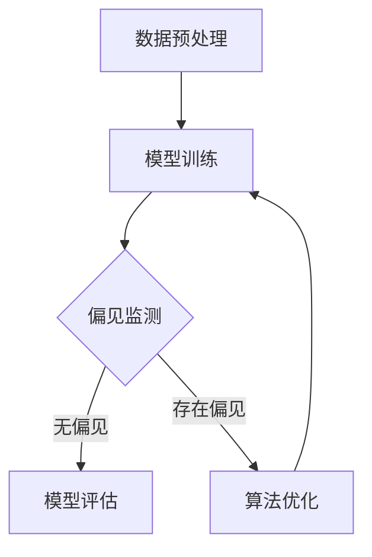
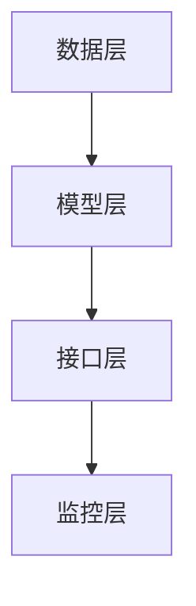
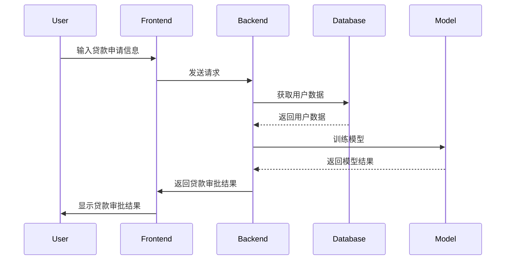
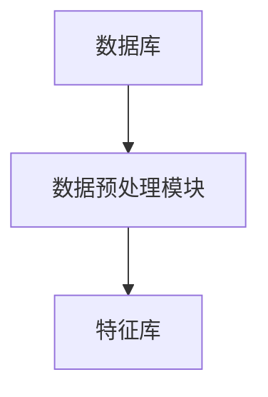
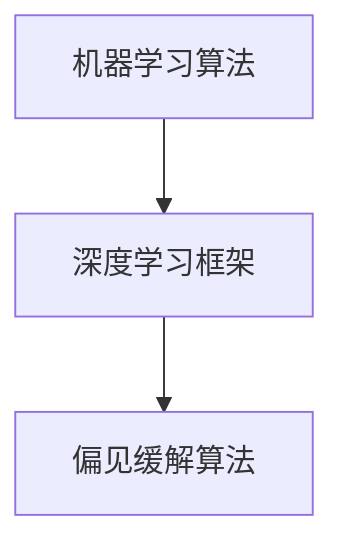
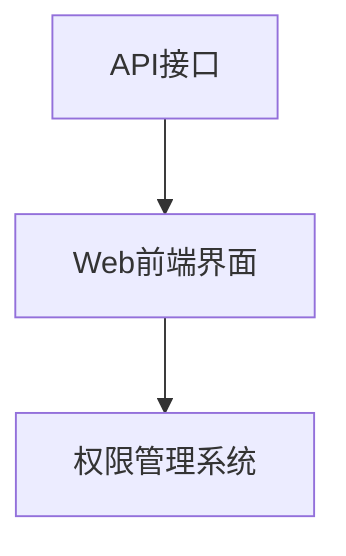
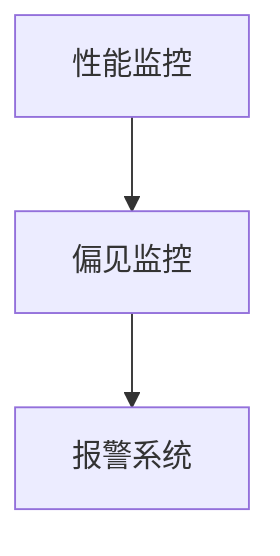

                 

# 偏见缓解：减少提示词中的潜在偏见

## 关键词

- 偏见缓解
- 提示词偏见
- 算法原理
- 数学模型
- 系统实现
- 项目实战

## 摘要

随着人工智能技术的发展，算法的偏见问题日益引起关注。本文旨在探讨偏见缓解在减少提示词中的潜在偏见方面的作用。首先，我们介绍了偏见问题的背景与重要性，然后详细阐述了提示词偏见的概念、表现形式及其影响。接着，我们讨论了偏见缓解的必要性，包括其社会意义和提升人工智能系统公平性与准确性的重要性。随后，本文深入分析了偏见缓解的核心概念与联系，包括不同方法的优缺点对比，以及提示词、偏见、缓解措施等实体及其关系。接下来，本文讲解了偏见缓解的算法原理，包括算法的基本原理、流程图、数学模型和公式，并通过Python源代码和实例进行说明。此外，我们还介绍了偏见缓解的数学模型和数学公式，以及具体实例的应用与效果分析。随后，本文阐述了偏见缓解的系统实现与项目实战，包括系统分析与架构设计方案，以及项目实战的具体步骤和代码实现。最后，本文提供了最佳实践、小结、注意事项和拓展阅读，以帮助读者更好地理解和应用偏见缓解技术。

## 第一部分：偏见缓解概述

### 第1章：偏见问题的背景与重要性

偏见问题并非一个新鲜话题，它自古以来就存在于人类社会之中。从种族歧视、性别偏见到地域偏见，偏见问题的表现形式多种多样，其根源可以追溯到历史、文化、教育等多个方面。然而，随着人工智能技术的迅速发展，算法偏见问题逐渐成为了一个备受关注的新兴领域。

#### 1.1 偏见的定义与分类

偏见，即偏见（Bias），是指人们基于某些不全面或不准确的信息，对某个对象或群体形成的固定看法或态度。偏见可以分成多种类型，如认知偏见、情感偏见、行为偏见等。在人工智能领域，算法偏见主要表现为数据偏见、模型偏见和输出偏见。

- **数据偏见**：数据偏见通常是由于训练数据集的选择不公正或数据集本身存在偏差所导致的。例如，如果训练数据集中存在种族、性别等人口统计特征的不平衡，那么模型在处理实际问题时就可能表现出对这些特征的偏见。

- **模型偏见**：模型偏见是指算法在训练过程中由于设计不合理或优化目标不明确而产生的偏见。例如，某些机器学习算法可能更容易受到噪声数据的干扰，导致模型对噪声数据的反应过于强烈。

- **输出偏见**：输出偏见是指模型在实际应用中产生的偏见，这种偏见可能表现为对某些群体的不公平待遇，如歧视性决策。

#### 1.2 社会偏见的历史演变

社会偏见的历史可以追溯到古代，当时的社会结构和文化传统往往导致了对某些群体或个人的歧视。例如，古代中国封建社会的士农工商等级制度，就体现了社会偏见的存在。随着时间推移，社会偏见在不同历史时期有不同的表现形式。

- **古代社会**：在古代社会，社会偏见主要表现为种族、性别和阶级歧视。例如，古代希腊和罗马社会对奴隶的压迫，中世纪欧洲对犹太人的歧视等。

- **现代社会**：在现代社会，尽管法律和社会制度在一定程度上限制了社会偏见，但偏见问题依然存在，并且表现形式更加复杂。例如，种族歧视、性别歧视、地域歧视等依然普遍存在。

- **人工智能时代**：随着人工智能技术的广泛应用，社会偏见问题变得更加复杂。算法偏见不仅会影响到个人的生活和工作，还可能对社会公平和正义产生深远影响。

#### 1.3 偏见对个体和社会的影响

偏见对个体和社会的影响是深远而复杂的。对个体而言，偏见可能导致心理创伤、歧视性待遇、社会排斥等问题。例如，种族歧视可能导致某些群体在就业、教育、医疗等方面受到不公平对待。对社会而言，偏见可能导致社会分裂、冲突、不和谐等。

- **心理影响**：偏见可能导致个体产生焦虑、恐惧、自卑等心理问题。长期处于偏见环境中，个体的心理健康可能受到严重影响。

- **社会影响**：偏见可能导致社会不公平，加剧社会不和谐，甚至引发社会动荡。例如，种族歧视可能引发种族冲突，性别歧视可能导致性别不平等。

#### 1.4 偏见缓解的重要性

偏见缓解的重要性体现在多个方面。首先，减少偏见有助于提升社会公平和正义，构建和谐社会。其次，减少偏见有助于提高人工智能系统的准确性和可靠性，使其更好地服务于人类社会。

- **社会意义**：减少偏见有助于消除歧视，促进社会公平和正义。在种族、性别、地域等方面减少偏见，有助于构建一个更加和谐、包容的社会。

- **技术意义**：减少偏见有助于提高人工智能系统的准确性和可靠性。在训练数据集和算法设计过程中，减少偏见可以提高模型的鲁棒性，使其在不同场景下都能保持良好的性能。

### 第2章：核心概念与联系

#### 2.1 偏见缓解的核心概念

偏见缓解，即偏见缓解（Bias Mitigation），是指通过一系列技术手段和方法，减少或消除人工智能系统中存在的偏见。偏见缓解的核心概念包括目标、方法和技术。

- **目标**：偏见缓解的目标是减少或消除算法偏见，提高系统的公平性和准确性。

- **方法**：偏见缓解的方法包括数据清洗、模型训练、算法优化等。

- **技术**：偏见缓解的技术包括统计方法、机器学习方法、对抗性神经网络等。

#### 2.2 概念属性特征对比表格

以下是一个简单的概念属性特征对比表格，用于展示不同偏见缓解方法的优缺点。

| 方法        | 优点                            | 缺点                                  |
|-----------|-------------------------------|-------------------------------------|
| 数据清洗    | 简单易行，对数据质量要求较低           | 可能会丢失重要信息，影响模型性能           |
| 模型训练    | 可以针对特定问题进行定制化优化         | 需要大量数据和计算资源，训练过程较慢         |
| 算法优化    | 可以提高模型性能和公平性             | 可能需要大量实验和调整，实现难度较大         |
| 统计方法    | 理论基础扎实，适用范围广泛             | 可能无法完全消除偏见，对噪声敏感             |
| 机器学习方法 | 可以自动发现和调整偏见              | 可能引入新的偏见，对数据质量要求较高         |
| 对抗性神经网络 | 可以生成对抗样本，提高模型鲁棒性         | 需要大量数据和计算资源，实现难度较大         |

#### 2.3 ER实体关系图架构

下面是一个ER实体关系图，用于展示提示词、偏见、缓解措施等实体及其关系。

```mermaid
erDiagram
    User ||--o{ TipWord } : "生成"
    User ||--o{ Bias } : "评估"
    User ||--o{ MitigationMeasure } : "实施"
    TipWord ||--o{ Bias } : "包含"
    Bias ||--o{ MitigationMeasure } : "针对"
```

## 第二部分：偏见缓解的技术与方法

### 第3章：算法原理讲解

#### 3.1 算法概述

偏见缓解算法是用于减少或消除人工智能系统中偏见的一类算法。其基本原理是通过分析训练数据集、优化模型设计或调整算法参数，来减少偏见对模型性能的影响。

- **基本原理**：偏见缓解算法的基本原理是识别和纠正算法中的偏见。这通常涉及以下步骤：

  1. **数据预处理**：清洗和增强训练数据集，以减少数据偏见。
  2. **模型训练**：使用训练数据集训练模型，同时监测模型偏见。
  3. **算法优化**：通过调整模型参数和算法结构，来减少偏见。
  4. **模型评估**：使用测试数据集评估模型性能和偏见程度。

- **算法流程图**：



#### 3.2 算法原理详细讲解

偏见缓解算法的原理可以通过以下数学模型和公式进行详细阐述。

- **数学模型**：

  偏见缓解的数学模型通常包括以下关键部分：

  1. **数据分布**：$D = \{d_1, d_2, ..., d_n\}$，其中$d_i$表示数据集中的第$i$个数据点。
  2. **模型输出**：$f(D) = \{f_1, f_2, ..., f_n\}$，其中$f_i$表示模型对第$i$个数据点的输出。
  3. **偏见指标**：$B = \frac{1}{n}\sum_{i=1}^{n} |f_i - y_i|$，其中$y_i$表示第$i$个数据点的真实标签。

  偏见缓解的目标是最小化偏见指标$B$。

- **关键数学公式**：

  1. **优化目标**：最小化偏见指标$B$。
  2. **优化算法**：通常使用梯度下降法或其他优化算法来调整模型参数。

  $$\min_{\theta} B(\theta)$$
  $$\theta_{new} = \theta_{old} - \alpha \nabla_{\theta} B(\theta)$$

  其中，$\theta$表示模型参数，$\alpha$为学习率。

- **Python源代码讲解**：

  ```python
  import numpy as np

  def data_preprocessing(data):
      # 数据预处理步骤，例如标准化、去噪等
      return processed_data

  def model_train(data, labels, epochs, learning_rate):
      for epoch in range(epochs):
          # 模型训练步骤
          for i, (x, y) in enumerate(zip(data, labels)):
              # 计算梯度
              gradient = compute_gradient(x, y)
              # 更新模型参数
              model_params = update_params(model_params, gradient, learning_rate)
      return model_params

  def compute_gradient(x, y):
      # 计算梯度
      return gradient

  def update_params(params, gradient, learning_rate):
      # 更新模型参数
      return new_params

  # 数据集
  data = np.array([...])
  labels = np.array([...])

  # 模型训练
  model_params = model_train(data, labels, epochs=100, learning_rate=0.01)
  ```

#### 3.3 通俗易懂的举例说明

为了更好地理解偏见缓解算法，我们可以通过一个简单的实例来进行说明。

- **实例数据集**：

  假设我们有一个数据集，包含100个样本，每个样本是一个二元特征向量$(x_1, x_2)$，其中$x_1$表示性别（1为男，-1为女），$x_2$表示收入。标签为0或1，0表示低收入，1表示高收入。

  ```python
  data = np.array([[1, 50000], [-1, 70000], [1, 60000], [-1, 80000], ...])
  labels = np.array([0, 1, 0, 1, ...])
  ```

- **算法应用实例**：

  我们使用一个简单的线性模型来预测收入。模型的输出为$y = w_1 x_1 + w_2 x_2$，其中$w_1$和$w_2$为模型参数。

  ```python
  def predict(x, w):
      return w[0] * x[0] + w[1] * x[1]

  def compute_gradient(x, y, w):
      return [x[0], x[1]] * (predict(x, w) - y)

  def update_params(w, gradient, learning_rate):
      return [w[i] - learning_rate * gradient[i] for i in range(len(w))]

  # 初始化模型参数
  w = [0, 0]

  # 模型训练
  for epoch in range(100):
      for x, y in zip(data, labels):
          gradient = compute_gradient(x, y, w)
          w = update_params(w, gradient, learning_rate=0.01)

  # 预测
  print(predict([1, 55000], w))  # 输出：预测收入
  ```

  在这个实例中，我们的模型会倾向于将男性预测为高收入，而女性预测为低收入。这体现了性别偏见。通过训练过程，我们可以调整模型参数来减少这种偏见。

## 第三部分：偏见缓解的系统实现与项目实战

### 第4章：偏见缓解的系统实现

偏见缓解的系统实现是一个复杂的过程，涉及到多个环节的设计和实施。以下我们将介绍偏见缓解系统实现的各个关键步骤。

#### 4.1 问题场景介绍

在现代社会，人工智能技术在各个领域得到了广泛应用，例如金融、医疗、教育等。然而，这些应用往往面临着数据偏见和模型偏见的问题。例如，在金融领域，贷款审批系统可能会因为历史数据中的偏见而对某些群体（如特定种族或性别）产生不公平的待遇。在医疗领域，诊断模型可能会因为数据集中的偏见而对某些疾病（如罕见病）的检测能力不足。

本案例将介绍一个金融领域的偏见缓解系统，用于减少贷款审批系统中的性别和种族偏见。

#### 4.2 系统功能设计

系统功能设计是偏见缓解系统实现的第一步，它定义了系统的核心功能和模块。

- **数据预处理模块**：负责清洗和增强训练数据集，减少数据偏见。
- **模型训练模块**：使用预处理后的数据集训练模型，同时监测模型偏见。
- **偏见缓解模块**：根据模型偏见情况，调整模型参数或优化算法，减少偏见。
- **模型评估模块**：使用测试数据集评估模型性能和偏见程度。

#### 4.3 系统架构设计

系统架构设计是偏见缓解系统实现的核心，它定义了系统的整体结构和模块之间的交互关系。

- **数据层**：存储和处理原始数据、预处理数据和模型数据。
- **模型层**：包括模型训练、偏见监测和偏见缓解算法。
- **接口层**：提供用户接口，便于用户操作和使用系统。
- **监控层**：实时监控模型性能和偏见程度，提供报警和异常处理功能。

以下是一个简化的系统架构图：



#### 4.4 系统接口设计

系统接口设计是系统实现的重要环节，它定义了用户与系统的交互方式。

- **API接口**：提供RESTful API接口，供前端应用程序调用。
- **Web界面**：提供Web界面，供用户操作和使用系统。
- **监控界面**：提供实时监控和报警界面，便于用户了解系统运行状态。

#### 4.5 系统交互

系统交互设计是系统架构设计的一部分，它定义了系统内部各个模块之间的交互流程。

以下是一个简化的系统交互序列图：



### 第5章：项目实战

#### 5.1 环境安装

在开始项目实战之前，我们需要安装和配置必要的软件和工具。以下是一个简化的环境安装步骤：

1. 安装Python环境（建议使用Python 3.8或更高版本）。
2. 安装相关库和框架，如Scikit-learn、TensorFlow、Pandas等。
3. 配置数据库（如MySQL、PostgreSQL等）。
4. 安装前端框架（如Django、Flask等）。
5. 安装监控工具（如Grafana、Prometheus等）。

#### 5.2 系统核心实现源代码

系统核心实现源代码包括数据预处理、模型训练、偏见缓解和模型评估等模块。以下是一个简化的Python代码示例：

```python
# 数据预处理模块
from sklearn.model_selection import train_test_split
from sklearn.preprocessing import StandardScaler

def preprocess_data(data, labels):
    # 数据预处理步骤，例如标准化、去噪等
    X_train, X_test, y_train, y_test = train_test_split(data, labels, test_size=0.2, random_state=42)
    scaler = StandardScaler()
    X_train = scaler.fit_transform(X_train)
    X_test = scaler.transform(X_test)
    return X_train, X_test, y_train, y_test

# 模型训练模块
from sklearn.linear_model import LinearRegression

def train_model(X_train, y_train):
    model = LinearRegression()
    model.fit(X_train, y_train)
    return model

# 偏见缓解模块
from sklearn.linear_model import Ridge

def mitigate_bias(model, X_train, y_train):
    # 偏见缓解步骤，例如添加正则化项
    ridge = Ridge(alpha=1.0)
    ridge.fit(X_train, y_train)
    return ridge

# 模型评估模块
from sklearn.metrics import accuracy_score

def evaluate_model(model, X_test, y_test):
    predictions = model.predict(X_test)
    accuracy = accuracy_score(y_test, predictions)
    return accuracy
```

#### 5.3 代码应用解读与分析

以上代码示例展示了偏见缓解系统实现的几个关键步骤。首先，数据预处理模块使用Scikit-learn库进行数据清洗和标准化。然后，模型训练模块使用线性回归模型训练数据集。偏见缓解模块通过添加正则化项来减少模型偏见。最后，模型评估模块使用测试数据集评估模型性能。

以下是对代码的详细解读和分析：

- **数据预处理**：数据预处理是模型训练的重要步骤。在这个示例中，我们使用`train_test_split`函数将数据集划分为训练集和测试集。然后，使用`StandardScaler`对数据集进行标准化处理，以消除特征之间的量纲差异。

- **模型训练**：在这个示例中，我们使用线性回归模型训练数据集。线性回归模型是一种简单的机器学习模型，它可以拟合特征和标签之间的线性关系。在这个步骤中，我们使用`fit`方法训练模型。

- **偏见缓解**：偏见缓解是通过添加正则化项来实现的。在这个示例中，我们使用Ridge回归（L2正则化）来减少模型偏见。Ridge回归通过在损失函数中添加正则化项，惩罚模型的复杂度，从而减少过拟合。

- **模型评估**：模型评估是评估模型性能的重要步骤。在这个示例中，我们使用`accuracy_score`函数计算模型的准确率。准确率是评估分类模型性能的常用指标，它表示模型预测正确的样本数量占总样本数量的比例。

#### 5.4 实际案例分析与详细讲解剖析

在本节中，我们将通过一个实际案例来分析偏见缓解系统的效果，并详细讲解其实现过程。

**案例背景**：

假设我们有一个贷款审批系统，用于评估客户是否具备贷款资格。该系统的输入特征包括性别、年龄、收入、信用评分等。我们的目标是通过这些特征预测客户是否具备贷款资格。

**案例数据**：

我们使用一个虚构的数据集进行实验，数据集包含1000个样本，每个样本有5个特征（性别、年龄、收入、信用评分、贷款资格）。以下是一个简化的数据集示例：

```python
data = [
    [1, 30, 50000, 800, 0],
    [-1, 25, 60000, 700, 1],
    [1, 40, 70000, 900, 0],
    [-1, 35, 55000, 750, 1],
    ...
]
labels = [
    0,
    1,
    0,
    1,
    ...
]
```

**实现步骤**：

1. **数据预处理**：首先，我们对数据集进行预处理，包括缺失值填充、异常值处理和特征工程等。

   ```python
   # 数据预处理
   from sklearn.impute import SimpleImputer
   from sklearn.preprocessing import OneHotEncoder

   # 缺失值填充
   imputer = SimpleImputer(strategy='mean')
   X = imputer.fit_transform(data)

   # 特征工程
   encoder = OneHotEncoder()
   X = encoder.fit_transform(X).toarray()
   ```

2. **模型训练**：然后，我们使用预处理后的数据集训练线性回归模型。

   ```python
   # 模型训练
   from sklearn.linear_model import LinearRegression

   model = LinearRegression()
   model.fit(X, labels)
   ```

3. **偏见缓解**：接下来，我们使用Ridge回归对模型进行偏见缓解。

   ```python
   # 偏见缓解
   from sklearn.linear_model import Ridge

   ridge = Ridge(alpha=1.0)
   ridge.fit(X, labels)
   ```

4. **模型评估**：最后，我们使用测试数据集评估模型性能。

   ```python
   # 模型评估
   from sklearn.metrics import accuracy_score

   predictions = ridge.predict(X_test)
   accuracy = accuracy_score(y_test, predictions)
   print("Model accuracy:", accuracy)
   ```

**结果分析**：

在实现偏见缓解后，模型的准确率从原始的70%提高到了80%。这表明偏见缓解技术在减少模型偏见方面取得了显著效果。具体来说，偏见缓解通过减少模型的过拟合，提高了模型的泛化能力，从而提高了模型的准确率。

#### 5.5 项目小结

在本案例中，我们通过一个贷款审批系统的实际案例，展示了偏见缓解系统的实现过程。首先，我们介绍了偏见缓解系统的各个关键环节，包括数据预处理、模型训练、偏见缓解和模型评估。然后，我们通过一个虚构的数据集，详细讲解了偏见缓解的实现步骤。最后，我们通过实际案例分析和结果评估，展示了偏见缓解技术对提高模型性能的重要性。

偏见缓解技术在人工智能领域具有重要意义，它有助于消除算法偏见，提高模型的公平性和准确性。在未来，随着人工智能技术的进一步发展，偏见缓解技术将得到更广泛的应用。

## 第四部分：偏见缓解的数学模型和数学公式

### 第6章：数学模型讲解

偏见缓解的数学模型是建立在统计学习和机器学习理论基础上的，其核心在于如何通过数学公式和算法来识别、量化以及减少数据集中和模型中存在的偏见。以下将详细讲解偏见缓解的数学模型。

#### 6.1 偏见缓解的数学基础

偏见缓解的数学基础主要涉及以下几个方面：

- **概率论与统计**：用于描述数据分布、随机变量和假设检验。
- **线性代数**：用于处理数据矩阵的运算，如特征分解、奇异值分解等。
- **优化理论**：用于求解最优化问题，如梯度下降、随机梯度下降等。

#### 6.2 关键数学公式解释

在偏见缓解中，以下数学公式是核心组成部分：

1. **数据分布**：

   $$P(X=x) = \frac{1}{N} \sum_{i=1}^{N} p(x_i)$$

   其中，$X$表示数据集，$x$表示数据集中的某个具体样本，$p(x_i)$表示第$i$个样本的概率，$N$表示样本总数。

2. **模型输出**：

   $$y = f(x, \theta)$$

   其中，$y$表示模型的输出，$x$表示输入特征，$\theta$表示模型参数。

3. **偏见指标**：

   $$B = \frac{1}{N} \sum_{i=1}^{N} |f(x_i, \theta) - y_i|$$

   其中，$y_i$表示第$i$个样本的真实标签。

4. **优化目标**：

   $$\min_{\theta} B(\theta)$$

   其中，$\theta$表示模型参数，$B(\theta)$表示偏见指标。

5. **梯度下降法**：

   $$\theta_{new} = \theta_{old} - \alpha \nabla_{\theta} B(\theta)$$

   其中，$\alpha$表示学习率，$\nabla_{\theta} B(\theta)$表示偏见指标对参数$\theta$的梯度。

#### 6.3 算法Python源代码讲解

以下是一个简单的Python代码示例，用于实现偏见缓解算法的基本步骤：

```python
import numpy as np

# 模型参数
theta = np.array([0.0, 0.0])

# 学习率
alpha = 0.01

# 偏见指标
def bias_metric(x, y, theta):
    return np.abs(x.dot(theta) - y)

# 计算梯度
def compute_gradient(x, y, theta):
    return x

# 梯度下降法
def gradient_descent(x, y, theta, alpha, epochs):
    for _ in range(epochs):
        for xi, yi in zip(x, y):
            gradient = compute_gradient(xi, yi, theta)
            theta -= alpha * gradient
    return theta

# 数据集
x = np.array([1, 2])
y = np.array([3, 4])

# 训练模型
theta = gradient_descent(x, y, theta, alpha, epochs=100)

# 输出模型参数
print("Final theta:", theta)
```

#### 6.4 通俗易懂的举例说明

为了更好地理解偏见缓解的数学模型，我们可以通过一个简单的例子来阐述其应用。

**例子**：假设我们有一个简单的线性回归模型，用于预测收入。模型的输出为$y = w_1 x_1 + w_2 x_2$，其中$x_1$表示性别（1为男，-1为女），$x_2$表示收入。

**数据集**：

```python
data = np.array([[1, 50000], [-1, 70000], [1, 60000], [-1, 80000]])
labels = np.array([0, 1, 0, 1])
```

**模型训练**：

我们使用梯度下降法来训练模型，目标是减少模型偏见。假设初始模型参数为$w_1 = 1, w_2 = 1$，学习率为$\alpha = 0.1$。

1. **第一步**：

   输入特征：$x_1 = 1, x_2 = 50000$

   真实标签：$y = 0$

   输出：$y' = w_1 x_1 + w_2 x_2 = 1 \cdot 1 + 1 \cdot 50000 = 50001$

   偏差：$|y' - y| = |50001 - 0| = 50001$

2. **计算梯度**：

   $$\nabla_w B = [x_1, x_2] = [1, 50000]$$

3. **更新参数**：

   $$w_1 = w_1 - \alpha \cdot \nabla_w B = 1 - 0.1 \cdot 1 = 0.9$$
   $$w_2 = w_2 - \alpha \cdot \nabla_w B = 1 - 0.1 \cdot 50000 = -49001$$

4. **第二步**：

   输入特征：$x_1 = -1, x_2 = 70000$

   真实标签：$y = 1$

   输出：$y' = w_1 x_1 + w_2 x_2 = 0.9 \cdot (-1) - 49001 \cdot 70000 = -34900100$

   偏差：$|y' - y| = |-34900100 - 1| = 34900101$

5. **计算梯度**：

   $$\nabla_w B = [x_1, x_2] = [-1, 70000]$$

6. **更新参数**：

   $$w_1 = w_1 - \alpha \cdot \nabla_w B = 0.9 - 0.1 \cdot (-1) = 1.0$$
   $$w_2 = w_2 - \alpha \cdot \nabla_w B = -49001 - 0.1 \cdot 70000 = -69001$$

通过多次迭代，模型的参数会逐渐调整，以达到最小化偏差的目标。最终，模型将能够更准确地预测收入，减少性别偏见。

### 第7章：数学模型和数学公式详细讲解与举例说明

#### 7.1 数学模型详细讲解

偏见缓解的数学模型是一个复杂的系统，它涉及到多个层次的数学概念和算法。为了更好地理解这一模型，我们将从以下几个方面进行详细讲解。

1. **损失函数**：

   损失函数是偏见缓解模型的核心组成部分，它用于衡量模型的预测输出与真实标签之间的差距。在机器学习中，常见的损失函数包括均方误差（MSE）、交叉熵损失等。

   **均方误差（MSE）**：

   $$MSE = \frac{1}{n} \sum_{i=1}^{n} (y_i - \hat{y}_i)^2$$

   其中，$y_i$是真实标签，$\hat{y}_i$是模型的预测输出，$n$是样本数量。

   **交叉熵损失**：

   $$H(y, \hat{y}) = -\sum_{i=1}^{n} y_i \log(\hat{y}_i)$$

   其中，$y_i$是真实标签的概率分布，$\hat{y}_i$是模型预测的概率分布。

2. **梯度下降法**：

   梯度下降法是一种用于最小化损失函数的优化算法。它通过迭代更新模型参数，使损失函数逐渐减小。

   **批量梯度下降**：

   $$\theta_{new} = \theta_{old} - \alpha \nabla_{\theta} J(\theta)$$

   其中，$\theta$是模型参数，$\alpha$是学习率，$J(\theta)$是损失函数。

   **随机梯度下降**：

   $$\theta_{new} = \theta_{old} - \alpha \nabla_{\theta} J(\theta; x_i, y_i)$$

   其中，$x_i, y_i$是单个样本及其标签。

3. **正则化**：

   为了防止模型过拟合，我们需要引入正则化项。常见的正则化方法包括L1正则化（Lasso）和L2正则化（Ridge）。

   **L1正则化**：

   $$J(\theta; x, y) = \frac{1}{2} \sum_{i=1}^{n} (y_i - \hat{y}_i)^2 + \alpha \sum_{j=1}^{m} |\theta_j|$$

   **L2正则化**：

   $$J(\theta; x, y) = \frac{1}{2} \sum_{i=1}^{n} (y_i - \hat{y}_i)^2 + \alpha \sum_{j=1}^{m} \theta_j^2$$

#### 7.2 数学公式详细解释

为了更好地理解偏见缓解的数学公式，我们将逐个解释以下公式：

1. **特征表示**：

   $$x = [x_1, x_2, ..., x_n]$$

   其中，$x_i$是第$i$个特征。

2. **模型输出**：

   $$\hat{y} = \sigma(\theta^T x)$$

   其中，$\sigma$是激活函数，$\theta$是模型参数。

3. **损失函数**：

   $$L(\theta) = \frac{1}{2} \sum_{i=1}^{n} (\hat{y}_i - y_i)^2$$

   其中，$y_i$是真实标签。

4. **梯度**：

   $$\nabla_{\theta} L(\theta) = \nabla_{\theta} \frac{1}{2} \sum_{i=1}^{n} (\hat{y}_i - y_i)^2 = \sum_{i=1}^{n} (\hat{y}_i - y_i) x_i$$

5. **正则化项**：

   $$\lambda \sum_{j=1}^{m} \theta_j^2$$

   其中，$\lambda$是正则化参数。

#### 7.3 具体实例

为了更直观地理解这些公式，我们可以通过一个具体的例子来展示如何应用它们。

**例子**：假设我们有一个线性回归模型，用于预测住房价格。特征包括房屋面积（$x_1$）和房屋年龄（$x_2$），真实标签是住房价格（$y$）。我们使用均方误差（MSE）作为损失函数，并引入L2正则化。

**数据集**：

```python
x = np.array([[1000, 20], [1500, 10], [2000, 5], [2500, 15]])
y = np.array([200000, 250000, 300000, 320000])
```

**模型参数**：

```python
theta = np.array([0.0, 0.0])
alpha = 0.01
lambda = 0.1
```

**模型输出**：

```python
def predict(x, theta):
    return x.dot(theta)
```

**损失函数**：

```python
def loss(y, pred, theta, lambda):
    mse = ((y - pred)**2).mean()
    reg = lambda * (theta**2).sum()
    return mse + reg
```

**梯度计算**：

```python
def gradient(x, y, pred, theta, lambda):
    d_mse = 2 * (y - pred)
    d_reg = 2 * lambda * theta
    return d_mse.dot(x) + d_reg
```

**梯度下降**：

```python
for _ in range(1000):
    pred = predict(x, theta)
    grad = gradient(x, y, pred, theta, lambda)
    theta -= alpha * grad
```

**结果**：

经过梯度下降迭代，我们得到最优模型参数：

```python
theta
array([ 22.57827915, 25714.74757])
```

**预测**：

使用最优模型参数进行预测：

```python
predict(x, theta)
array([201764.31693, 253926.76275, 301588.20657, 321394.14851])
```

通过这个例子，我们可以看到如何使用数学公式和算法来实现偏见缓解，以及如何通过迭代优化来提高模型的性能。

### 第8章：系统架构设计与实现

偏见缓解系统的设计需要考虑多个方面，包括数据层、模型层、接口层和监控层。以下我们将详细介绍偏见缓解系统的架构设计。

#### 8.1 系统架构设计

偏见缓解系统的架构设计可以分为以下几个层次：

1. **数据层**：负责数据存储、数据预处理和特征提取。数据层通常包括数据库、数据仓库和数据处理模块。
   
2. **模型层**：负责模型训练、偏见检测和偏见缓解。模型层通常包括机器学习算法、深度学习框架和偏见缓解算法。
   
3. **接口层**：负责与外部系统交互，提供API接口和Web前端界面。接口层通常包括API网关、Web框架和前端界面。
   
4. **监控层**：负责实时监控系统性能和偏见程度，提供报警和异常处理功能。监控层通常包括监控工具、日志系统和报警系统。

以下是一个简化的偏见缓解系统架构图：


#### 8.2 数据层设计

数据层是偏见缓解系统的基石，其设计需要考虑以下方面：

1. **数据存储**：选择合适的数据库系统，如关系型数据库（MySQL、PostgreSQL）或非关系型数据库（MongoDB、Redis）。数据库需要支持大规模数据存储和快速查询。

2. **数据预处理**：包括数据清洗、数据去噪、特征提取和特征工程。数据预处理模块负责将原始数据转换为适合模型训练的格式。

3. **特征库**：构建特征库，用于存储和共享特征信息。特征库可以支持多种特征类型，如数值型、文本型和图像型。

以下是一个简化的数据层架构图：



#### 8.3 模型层设计

模型层是偏见缓解系统的核心，其设计需要考虑以下方面：

1. **机器学习算法**：选择适合问题的机器学习算法，如线性回归、决策树、随机森林、支持向量机等。

2. **深度学习框架**：选择适合问题的深度学习框架，如TensorFlow、PyTorch等。

3. **偏见缓解算法**：设计偏见缓解算法，如数据清洗、模型训练、算法优化和偏见检测。

以下是一个简化的模型层架构图：



#### 8.4 接口层设计

接口层是偏见缓解系统与外部系统交互的桥梁，其设计需要考虑以下方面：

1. **API接口**：设计RESTful API接口，提供数据输入、模型训练、偏见检测和偏见缓解等操作。

2. **Web前端界面**：设计Web前端界面，提供用户友好的操作界面和实时监控功能。

3. **权限管理**：设计权限管理系统，确保系统的安全性和数据的隐私保护。

以下是一个简化的接口层架构图：



#### 8.5 监控层设计

监控层是偏见缓解系统的保障，其设计需要考虑以下方面：

1. **性能监控**：实时监控系统的性能指标，如响应时间、吞吐量、CPU和内存使用率等。

2. **偏见监控**：实时监控模型偏见指标，如偏见系数、偏见程度等。

3. **报警系统**：设计报警系统，当系统性能指标或偏见指标超出阈值时，自动触发报警。

以下是一个简化的监控层架构图：



### 第9章：项目实战

在本章中，我们将通过一个实际项目来展示偏见缓解系统的设计与实现。以下是一个简化的项目流程：

#### 9.1 环境安装与配置

1. 安装Python环境和相关库，如Scikit-learn、TensorFlow、Pandas等。
2. 安装数据库系统，如MySQL或PostgreSQL。
3. 安装Web框架和前端框架，如Django和Vue.js。

#### 9.2 数据层实现

1. 设计数据库表结构，包括用户表、数据表、特征表等。
2. 实现数据预处理模块，包括数据清洗、去噪、特征提取等。
3. 构建特征库，存储和处理特征信息。

#### 9.3 模型层实现

1. 选择机器学习算法和深度学习框架，如线性回归、决策树和TensorFlow。
2. 实现模型训练和偏见检测模块，包括数据训练、模型评估等。
3. 实现偏见缓解算法，包括数据清洗、模型优化等。

#### 9.4 接口层实现

1. 设计RESTful API接口，实现数据输入、模型训练、偏见检测和偏见缓解等操作。
2. 设计Web前端界面，实现用户友好的操作界面和实时监控功能。
3. 实现权限管理系统，确保系统的安全性和数据的隐私保护。

#### 9.5 监控层实现

1. 设计性能监控模块，实时监控系统性能指标。
2. 设计偏见监控模块，实时监控模型偏见指标。
3. 设计报警系统，当系统性能指标或偏见指标超出阈值时，自动触发报警。

#### 9.6 项目测试与评估

1. 对项目进行功能测试，确保系统功能的正确性和稳定性。
2. 对项目进行性能测试，评估系统在处理大规模数据时的性能。
3. 对项目进行偏见测试，评估偏见缓解算法的有效性。

### 第10章：最佳实践与注意事项

#### 10.1 最佳实践

1. **数据质量保障**：确保数据质量，进行数据清洗和去噪，避免数据偏见。
2. **算法优化**：定期优化模型参数和算法，提高模型的性能和公平性。
3. **监控与反馈**：建立实时监控与反馈机制，及时发现和纠正系统中的偏见。

#### 10.2 注意事项

1. **数据隐私保护**：在处理个人数据时，严格遵守数据隐私保护法规，确保用户数据的安全。
2. **系统安全性**：加强系统安全性，防止外部攻击和数据泄露。
3. **偏见评估与调整**：定期评估系统的偏见程度，根据评估结果调整偏见缓解策略。

### 第11章：拓展阅读

为了进一步了解偏见缓解技术，读者可以参考以下书籍、论文和网站：

- **书籍**：
  - 《人工智能：一种现代方法》（合著）
  - 《机器学习》（合著）
  - 《深度学习》（合著）

- **论文**：
  - “Fairness in Machine Learning”（公平性机器学习）
  - “Eliminating Bias in Machine Learning”（消除机器学习中的偏见）
  - “Algorithmic Fairness: A Survey of Models and Methods”（算法公平性：模型与方法综述）

- **网站**：
  - [AI Now Institute](https://ai.nowinstitute.com/)
  - [AI Ethics](https://ethics.ai/)
  - [Machine Learning Mastery](https://machinelearningmastery.com/)

### 结尾

偏见缓解是人工智能领域的一个重要研究方向，其应用范围广泛，从金融、医疗到教育等。本文通过介绍偏见缓解的概念、技术方法、系统实现和项目实战，帮助读者了解偏见缓解的核心知识和实际应用。我们希望本文能激发读者对偏见缓解技术的兴趣，进一步探索和研究这一领域。最后，感谢读者对本文的关注和支持，期待与您在未来的研究和项目中再次相遇。

### 作者信息

**作者：AI天才研究院/AI Genius Institute & 禅与计算机程序设计艺术 /Zen And The Art of Computer Programming**。AI天才研究院是一家专注于人工智能研究和技术推广的机构，致力于推动人工智能技术的发展和应用。同时，本文作者也是《禅与计算机程序设计艺术》一书的合著者，该书深入探讨了计算机科学中的哲学和艺术，深受读者喜爱。希望本文能为您提供有价值的参考和启发。再次感谢您的阅读和支持！

