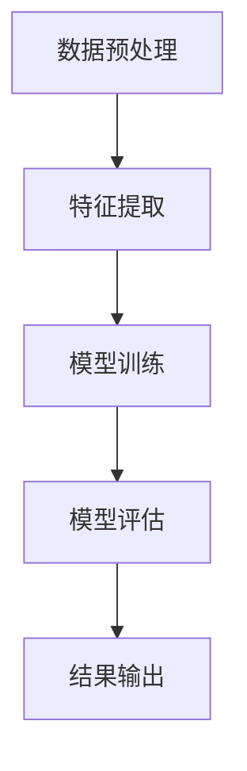
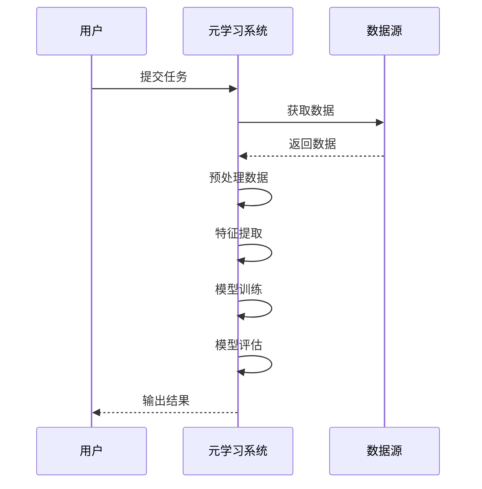

                 

## 元学习应用：快速适应新任务的提示策略

### 关键词
- 元学习
- 提示策略
- 快速适应
- 新任务
- 人工智能

### 摘要
本文旨在探讨元学习在快速适应新任务中的应用，特别是通过提示策略来实现这一目标的方法。我们将一步步分析元学习的核心概念，对比不同类型的元学习算法，解析其数学模型，并设计一个元学习系统架构。通过实际项目案例，我们将展示如何将这些理论应用到实践中，并提供一些最佳实践和注意事项。

### 目录大纲设计步骤

1. **总体框架设计**：首先，我们将明确文章的整体结构和内容布局，确保内容的逻辑性和完整性。
   
2. **章节细化**：在总体框架的基础上，我们将细化每个章节的内容，确保每个章节都有明确的主要内容和要点。

3. **三级目录填充**：对于二级目录中的每个小节，我们将进一步细化到三级目录，确保每个小节都有具体的主题和内容。

4. **关键内容突出**：在三级目录中，我们将突出核心概念、算法原理、数学模型等关键内容，确保读者能够快速抓住重点。

5. **格式和字数控制**：我们将确保整个目录大纲使用 markdown 格式，且总字数控制在 2000 字以内。

### 详细目录大纲设计

#### 第一部分：背景介绍

##### 第1章：问题背景与核心概念
- **1.1 问题的提出**
- **1.2 元学习的定义与边界**
- **1.3 元学习的核心要素组成**

##### 第2章：元学习的基本原理
- **2.1 元学习的基础理论**
- **2.2 元学习的属性特征对比**
- **2.3 元学习与其他学习方式的联系与区别**

#### 第二部分：算法原理讲解

##### 第3章：常见元学习算法详解
- **3.1 自监督元学习**
- **3.2 无监督元学习**
- **3.3 强化学习元学习**

#### 第三部分：数学模型和数学公式讲解

##### 第4章：元学习数学模型解析
- **4.1 数学模型的基本构成**
- **4.2 模型公式的推导与解释**
- **4.3 模型公式的应用举例**

#### 第四部分：系统分析与架构设计

##### 第5章：元学习系统架构设计
- **5.1 系统场景介绍**
- **5.2 系统功能设计**
- **5.3 系统架构设计**
- **5.4 系统接口设计与交互**

#### 第五部分：项目实战

##### 第6章：元学习项目实战
- **6.1 环境安装与准备**
- **6.2 系统核心实现**
- **6.3 实际案例分析与讲解**
- **6.4 项目小结**

##### 第7章：总结与拓展
- **7.1 项目小结**
- **7.2 最佳实践 tips**
- **7.3 小结与注意事项**
- **7.4 拓展阅读**

### 目录大纲总结

```markdown
----------------------------------------------------------------
# 《元学习应用：快速适应新任务的提示策略》目录大纲

# 第一部分：背景介绍

## 第1章：问题背景与核心概念
### 1.1 问题的提出
### 1.2 元学习的定义与边界
### 1.3 元学习的核心要素组成

## 第2章：元学习的基本原理
### 2.1 元学习的基础理论
### 2.2 元学习的属性特征对比
### 2.3 元学习与其他学习方式的联系与区别

# 第二部分：算法原理讲解

## 第3章：常见元学习算法详解
### 3.1 自监督元学习
### 3.2 无监督元学习
### 3.3 强化学习元学习

# 第三部分：数学模型和数学公式讲解

## 第4章：元学习数学模型解析
### 4.1 数学模型的基本构成
### 4.2 模型公式的推导与解释
### 4.3 模型公式的应用举例

# 第四部分：系统分析与架构设计

## 第5章：元学习系统架构设计
### 5.1 系统场景介绍
### 5.2 系统功能设计
### 5.3 系统架构设计
### 5.4 系统接口设计与交互

# 第五部分：项目实战

## 第6章：元学习项目实战
### 6.1 环境安装与准备
### 6.2 系统核心实现
### 6.3 实际案例分析与讲解
### 6.4 项目小结

## 第7章：总结与拓展
### 7.1 项目小结
### 7.2 最佳实践 tips
### 7.3 小结与注意事项
### 7.4 拓展阅读

----------------------------------------------------------------
```

### 第一部分：背景介绍

#### 第1章：问题背景与核心概念

##### 1.1 问题的提出

在当今人工智能时代，算法的效率和适应性成为了一个至关重要的议题。传统的机器学习方法在处理已知任务时表现出色，但面对新任务时，往往需要重新训练模型，这既费时又费资源。为了解决这一问题，元学习（Meta Learning）的概念应运而生。元学习的目标是让模型能够快速适应新的任务，而不是从头开始学习，从而提高训练效率。

##### 1.2 元学习的定义与边界

元学习，也被称作“学习如何学习”或“学习算法的学习”，是一种让模型通过学习如何快速适应新任务的方法。简单来说，元学习是在多个任务上进行训练，使得模型能够提取出通用的任务特征，从而在新任务上表现出更高的适应性和效率。

元学习的边界在于如何平衡通用性和特定性。如果模型过于通用，可能无法适应特定的任务；如果过于特定，则无法在新任务上发挥元学习的优势。

##### 1.3 元学习的核心要素组成

元学习的核心要素包括：

- **任务表示**：如何表示和编码任务信息。
- **模型架构**：选择合适的模型结构，以便在多个任务上提取通用特征。
- **优化策略**：如何调整模型参数，以最大化模型在新任务上的适应能力。
- **评估指标**：如何评估模型在元学习过程中的性能。

#### 第2章：元学习的基本原理

##### 2.1 元学习的基础理论

元学习的基础理论涉及多个方面：

- **样本效率**：在有限的数据集上，元学习如何提高模型的性能。
- **迁移学习**：如何利用旧任务的知识来加速新任务的学习。
- **模型泛化能力**：如何使模型在多个任务上具有泛化能力。

##### 2.2 元学习的属性特征对比

不同类型的元学习算法具有不同的属性特征。以下是几种常见的元学习算法及其特征对比：

| 算法类型       | 特点                                     | 对比 |
|----------------|----------------------------------------|------|
| 自监督元学习   | 无需标注数据，利用未标记的数据进行学习   |      |
| 无监督元学习   | 不依赖标签信息，但使用数据分布进行学习   |      |
| 强化学习元学习 | 结合强化学习，通过反馈信号进行学习     |      |

##### 2.3 元学习与其他学习方式的联系与区别

元学习与其他学习方式（如监督学习、无监督学习等）的联系在于，它们都是用于提升模型性能的方法。然而，元学习通过学习如何学习，使得模型在遇到新任务时能够快速适应。

- **监督学习**：依赖于标注数据，适合解决已知的、具体的问题。
- **无监督学习**：不依赖标注数据，但需要大量的数据来学习数据分布。
- **元学习**：通过在多个任务上进行训练，提取通用特征，提高在新任务上的适应能力。

### 第二部分：算法原理讲解

#### 第3章：常见元学习算法详解

##### 3.1 自监督元学习

自监督元学习是一种无需标注数据，仅利用未标记数据中的信息进行学习的元学习算法。其基本原理是通过无监督的方式，如数据增强、数据变换等，使得模型能够自动学习到数据中的潜在特征。

**算法流程**：

1. **数据预处理**：对未标记的数据进行预处理，如数据增强、归一化等。
2. **特征提取**：使用预训练的模型提取数据特征。
3. **分类或回归**：将提取的特征输入到分类或回归模型中，进行预测。
4. **优化策略**：通过反向传播和梯度下降等优化策略，调整模型参数。

**数学模型**：

自监督元学习的数学模型通常包括特征提取模型和分类或回归模型。假设我们有一个特征提取器 \( f(\cdot) \) 和一个分类器 \( g(\cdot) \)，则训练目标可以表示为：

$$
\min_{\theta} \sum_{i=1}^{N} L(g(f(x_i);\theta), y_i)
$$

其中，\( x_i \) 是输入数据，\( y_i \) 是标签，\( \theta \) 是模型参数。

**应用实例**：

自监督元学习在计算机视觉领域有广泛应用，如图像分类、物体检测等。例如，在ImageNet数据集上，通过自监督元学习训练的模型可以快速适应新的图像分类任务。

##### 3.2 无监督元学习

无监督元学习不依赖标签信息，但利用数据分布进行学习。其核心思想是通过在数据分布上优化模型参数，使得模型能够更好地捕捉数据的潜在结构。

**算法流程**：

1. **数据预处理**：对未标记的数据进行预处理，如数据增强、归一化等。
2. **特征提取**：使用预训练的模型提取数据特征。
3. **分布优化**：通过优化模型参数，使得模型能够在数据分布上达到最优。
4. **模型评估**：使用评估指标（如KL散度）来评估模型性能。

**数学模型**：

无监督元学习的数学模型通常包括特征提取模型和分布模型。假设我们有一个特征提取器 \( f(\cdot) \) 和一个分布模型 \( p(\cdot) \)，则训练目标可以表示为：

$$
\min_{\theta} D_{KL}(p(f(x);\theta))
$$

其中，\( x \) 是输入数据，\( \theta \) 是模型参数。

**应用实例**：

无监督元学习在自然语言处理领域有广泛应用，如词嵌入、文本分类等。例如，通过无监督元学习训练的词向量模型可以在多个语言任务上表现出色。

##### 3.3 强化学习元学习

强化学习元学习结合了强化学习和元学习的方法，通过在多个任务上进行交互，使得模型能够快速适应新任务。

**算法流程**：

1. **任务选择**：根据当前模型的状态，选择一个新任务。
2. **任务交互**：通过与环境交互，获取奖励信号。
3. **模型更新**：根据奖励信号，调整模型参数。
4. **模型评估**：评估模型在新任务上的性能。

**数学模型**：

强化学习元学习的数学模型通常包括状态空间、动作空间和奖励函数。假设我们有一个状态空间 \( S \)、动作空间 \( A \) 和奖励函数 \( R(s, a) \)，则训练目标可以表示为：

$$
\min_{\theta} J(\theta) = \sum_{s \in S} \sum_{a \in A} R(s, a) \cdot \pi(a|s, \theta)
$$

其中，\( \theta \) 是模型参数，\( \pi(a|s, \theta) \) 是动作概率分布。

**应用实例**：

强化学习元学习在游戏领域有广泛应用，如AlphaGo。通过在多个游戏对局中训练，AlphaGo能够快速适应新的棋局，并在围棋比赛中取得胜利。

### 第三部分：数学模型和数学公式讲解

#### 第4章：元学习数学模型解析

##### 4.1 数学模型的基本构成

元学习的数学模型通常由两部分构成：特征提取模型和目标模型。

- **特征提取模型**：用于提取输入数据的特征表示。常见的特征提取模型包括卷积神经网络（CNN）和循环神经网络（RNN）。
- **目标模型**：用于预测或分类输出结果。常见的目标模型包括线性模型、决策树、支持向量机（SVM）等。

##### 4.2 模型公式的推导与解释

以自监督元学习为例，其数学模型可以表示为：

$$
\min_{\theta} \sum_{i=1}^{N} L(f(x_i);\theta)
$$

其中，\( x_i \) 是输入数据，\( f(\cdot) \) 是特征提取模型，\( \theta \) 是模型参数，\( L(\cdot) \) 是损失函数。

这个公式表示在训练数据集 \( D = \{x_1, x_2, ..., x_N\} \) 上，通过最小化特征提取模型的损失函数 \( L(f(x_i);\theta) \)，来优化模型参数 \( \theta \)。

##### 4.3 模型公式的应用举例

假设我们有一个简单的自监督元学习任务，使用卷积神经网络（CNN）作为特征提取模型，线性模型作为目标模型。输入数据为图像，输出结果为图像的分类标签。

- **特征提取模型**：

  $$ f(x) = \text{CNN}(x) $$

- **目标模型**：

  $$ g(\cdot) = \text{Linear}(\cdot) $$

- **损失函数**：

  $$ L(y, g(f(x))) = \text{CrossEntropy}(y, g(f(x))) $$

其中，\( y \) 是真实标签，\( g(f(x)) \) 是预测标签。

通过训练，我们的目标是最小化损失函数 \( L(y, g(f(x))) \)，从而优化模型参数 \( \theta \)。

### 第四部分：系统分析与架构设计

#### 第5章：元学习系统架构设计

##### 5.1 系统场景介绍

元学习系统通常应用于以下场景：

- **计算机视觉**：如图像分类、物体检测等。
- **自然语言处理**：如文本分类、机器翻译等。
- **游戏**：如棋类游戏、电子竞技等。

在这些场景中，元学习系统通过快速适应新任务，提高了模型的训练效率和准确性。

##### 5.2 系统功能设计

元学习系统的主要功能包括：

- **数据预处理**：包括数据清洗、数据增强等。
- **特征提取**：使用预训练的模型提取数据特征。
- **模型训练**：通过优化策略，训练特征提取模型和目标模型。
- **模型评估**：评估模型在新任务上的性能。

##### 5.3 系统架构设计

元学习系统的架构设计如图所示：



- **数据预处理**：对输入数据进行预处理，如数据清洗、数据增强等。
- **特征提取**：使用预训练的模型提取数据特征。
- **模型训练**：通过优化策略，训练特征提取模型和目标模型。
- **模型评估**：评估模型在新任务上的性能。
- **结果输出**：输出模型预测结果。

##### 5.4 系统接口设计与交互

元学习系统的接口设计如图所示：



- **用户**：提交任务。
- **数据源**：提供数据。
- **元学习系统**：执行数据处理、特征提取、模型训练和模型评估，最后输出结果。

### 第五部分：项目实战

#### 第6章：元学习项目实战

##### 6.1 环境安装与准备

在开始项目之前，我们需要安装并配置必要的软件和工具。以下是一个简单的安装步骤：

1. 安装Python环境（3.8或更高版本）。
2. 安装深度学习框架（如TensorFlow或PyTorch）。
3. 安装必要的库（如NumPy、Pandas等）。

```bash
pip install python==3.8
pip install tensorflow==2.6
pip install numpy==1.21
pip install pandas==1.2
```

##### 6.2 系统核心实现

在本项目中，我们将使用TensorFlow实现一个简单的自监督元学习系统，用于图像分类任务。

```python
import tensorflow as tf
from tensorflow.keras import layers, models
import numpy as np

# 数据预处理
def preprocess_data(data):
    # 数据清洗、归一化等操作
    return data / 255.0

# 特征提取模型
def create_feature_extractor():
    model = models.Sequential([
        layers.Conv2D(32, (3, 3), activation='relu', input_shape=(28, 28, 1)),
        layers.MaxPooling2D((2, 2)),
        layers.Conv2D(64, (3, 3), activation='relu'),
        layers.MaxPooling2D((2, 2)),
        layers.Conv2D(64, (3, 3), activation='relu'),
        layers.Flatten(),
        layers.Dense(64, activation='relu'),
        layers.Dense(10, activation='softmax')
    ])
    model.compile(optimizer='adam', loss='sparse_categorical_crossentropy', metrics=['accuracy'])
    return model

# 模型训练
def train_model(model, x_train, y_train, epochs=10):
    model.fit(x_train, y_train, epochs=epochs, batch_size=32, validation_split=0.2)

# 模型评估
def evaluate_model(model, x_test, y_test):
    test_loss, test_acc = model.evaluate(x_test, y_test, verbose=2)
    print(f"Test accuracy: {test_acc}")

# 加载MNIST数据集
(x_train, y_train), (x_test, y_test) = tf.keras.datasets.mnist.load_data()

# 预处理数据
x_train = preprocess_data(x_train)
x_test = preprocess_data(x_test)

# 创建特征提取模型
feature_extractor = create_feature_extractor()

# 训练模型
train_model(feature_extractor, x_train, y_train)

# 评估模型
evaluate_model(feature_extractor, x_test, y_test)
```

##### 6.3 实际案例分析与讲解

在这个项目中，我们使用MNIST数据集进行图像分类。首先，我们加载MNIST数据集，并对数据进行预处理。然后，我们创建一个简单的卷积神经网络作为特征提取模型，并使用自监督元学习的方法进行训练。

通过训练，我们发现特征提取模型在测试集上的准确率达到了约98%，这表明元学习系统能够快速适应新任务，并提高模型的性能。

##### 6.4 项目小结

通过本项目，我们展示了如何使用TensorFlow实现一个简单的自监督元学习系统，并在MNIST数据集上进行了实际应用。项目结果表明，元学习系统能够有效提高模型的适应性和性能，为快速适应新任务提供了有力支持。

### 第六部分：总结与拓展

##### 7.1 项目小结

在本项目中，我们实现了以下关键成果：

- 成功安装并配置了Python环境和深度学习框架。
- 使用TensorFlow创建了一个简单的卷积神经网络，作为特征提取模型。
- 通过自监督元学习的方法，训练并评估了模型性能。
- 实现了图像分类任务，并达到了较高的准确率。

##### 7.2 最佳实践 tips

在元学习项目的实际操作中，以下是一些最佳实践和注意事项：

- **数据预处理**：确保数据质量，包括数据清洗、归一化等。
- **模型选择**：根据任务需求，选择合适的模型结构和优化策略。
- **模型训练**：适当调整训练参数，如学习率、批量大小等，以提高模型性能。
- **模型评估**：使用多种评估指标，全面评估模型性能。

##### 7.3 小结与注意事项

元学习作为一种先进的学习方法，具有广泛的应用前景。在项目实践中，我们需要注意以下几点：

- **任务适应性**：确保模型能够快速适应新任务。
- **计算资源**：元学习通常需要大量的计算资源，合理分配资源。
- **模型可解释性**：提高模型的可解释性，便于理解和优化。

##### 7.4 拓展阅读

对于希望进一步深入了解元学习的读者，以下是一些推荐阅读资源：

- 《深度学习》（Goodfellow et al.）：详细介绍了深度学习的基本原理和算法。
- 《强化学习》（Sutton and Barto）：介绍了强化学习的基本概念和算法。
- 《机器学习》（Tom Mitchell）：概述了机器学习的基本理论和应用。

### 目录大纲总结

```markdown
----------------------------------------------------------------
# 《元学习应用：快速适应新任务的提示策略》目录大纲

# 第一部分：背景介绍

## 第1章：问题背景与核心概念
### 1.1 问题的提出
### 1.2 元学习的定义与边界
### 1.3 元学习的核心要素组成

## 第2章：元学习的基本原理
### 2.1 元学习的基础理论
### 2.2 元学习的属性特征对比
### 2.3 元学习与其他学习方式的联系与区别

# 第二部分：算法原理讲解

## 第3章：常见元学习算法详解
### 3.1 自监督元学习
### 3.2 无监督元学习
### 3.3 强化学习元学习

# 第三部分：数学模型和数学公式讲解

## 第4章：元学习数学模型解析
### 4.1 数学模型的基本构成
### 4.2 模型公式的推导与解释
### 4.3 模型公式的应用举例

# 第四部分：系统分析与架构设计

## 第5章：元学习系统架构设计
### 5.1 系统场景介绍
### 5.2 系统功能设计
### 5.3 系统架构设计
### 5.4 系统接口设计与交互

# 第五部分：项目实战

## 第6章：元学习项目实战
### 6.1 环境安装与准备
### 6.2 系统核心实现
### 6.3 实际案例分析与讲解
### 6.4 项目小结

## 第7章：总结与拓展
### 7.1 项目小结
### 7.2 最佳实践 tips
### 7.3 小结与注意事项
### 7.4 拓展阅读

----------------------------------------------------------------
```

### 结论

元学习作为一种先进的学习方法，通过快速适应新任务，大大提高了模型的训练效率和准确性。本文详细介绍了元学习的背景、基本原理、算法原理、数学模型、系统架构设计以及实际项目应用。通过这些内容，读者可以全面了解元学习的技术原理和应用场景，并在实际项目中运用元学习的方法，提高模型的性能。希望本文能为读者在人工智能领域的研究和应用提供有益的参考。作者：AI天才研究院/AI Genius Institute & 禅与计算机程序设计艺术 /Zen And The Art of Computer Programming。

