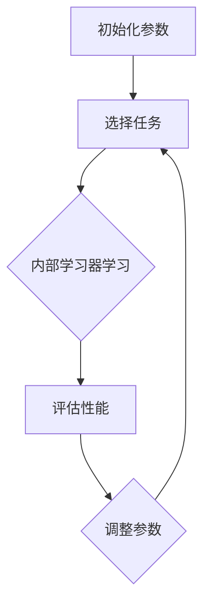
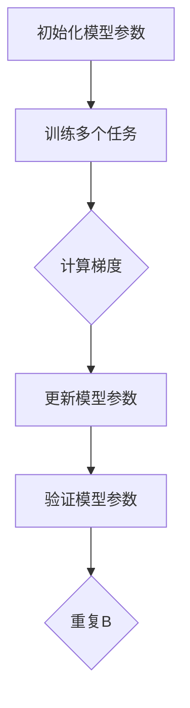
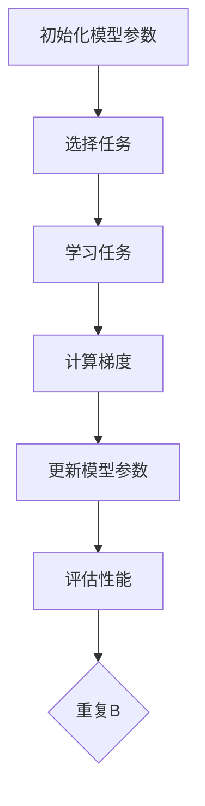
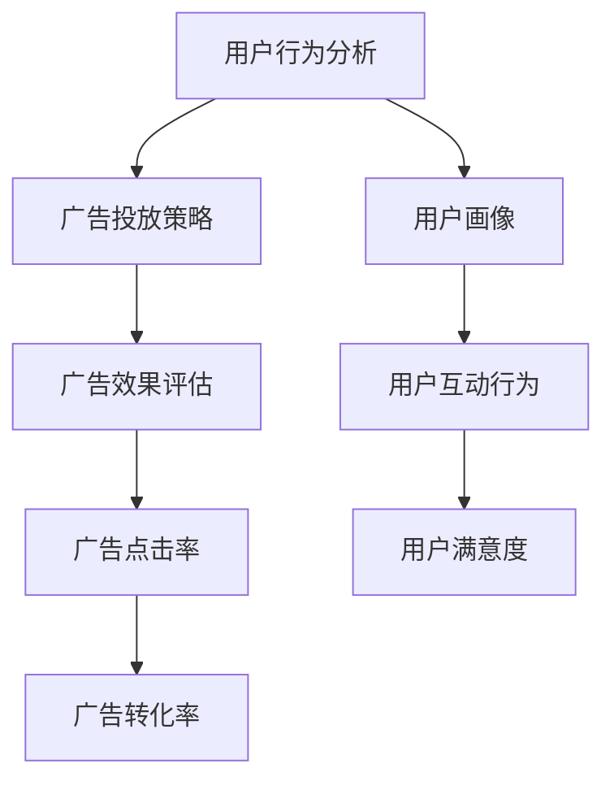
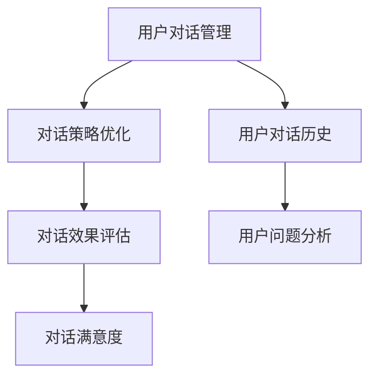

                 


# 元强化学习在评测策略优化中的应用

关键词：元强化学习，评测策略，优化，应用案例

摘要：本文主要探讨了元强化学习在评测策略优化中的应用。通过对强化学习和元强化学习的基本原理、算法和案例分析，展示了元强化学习如何提升评测策略的优化效果。文章结构清晰，逻辑紧凑，适合对强化学习有一定了解的技术读者。

## 第一部分：问题背景与核心概念

### 第1章：问题背景介绍

**1.1 问题背景**

**评测策略优化的重要性**

在现代信息社会中，评测策略优化在各个领域都具有重要意义。无论是在线广告投放、智能客服对话还是个性化推荐系统，一个高效的评测策略都可以带来显著的收益。例如，在广告投放中，优化评测策略可以帮助广告主更好地定位目标受众，提高广告的点击率和转化率；在智能客服中，优化评测策略可以提升客服系统的响应速度和准确性，提高用户体验。

**强化学习与元强化学习的兴起**

随着深度学习和人工智能技术的发展，强化学习作为一种重要的机器学习算法，已经在多个领域中取得了显著的成果。而元强化学习作为一种更高级的强化学习算法，更是引起了广泛关注。元强化学习通过在多个任务中快速学习，能够显著提高算法的适应性和效率。

**元强化学习在评测策略优化中的应用场景**

元强化学习在评测策略优化中的应用场景广泛，包括但不限于以下几方面：

1. 在线广告投放：通过元强化学习优化广告投放策略，提高广告的点击率和转化率。
2. 智能客服对话：通过元强化学习优化客服系统的对话策略，提高客服的响应速度和准确性。
3. 个性化推荐系统：通过元强化学习优化推荐系统的策略，提高推荐结果的准确性和用户体验。

**1.2 核心概念**

**强化学习基本原理**

强化学习是一种通过试错学习来获取最优策略的机器学习方法。它通过奖励和惩罚机制来指导学习过程，使学习模型能够在复杂的决策环境中找到最优策略。

**元强化学习概述**

元强化学习是一种在多个任务中快速学习的强化学习算法。它通过在多个任务中学习，能够快速适应新任务，提高算法的泛化能力。

**元强化学习的优点与挑战**

元强化学习的优点包括：

- 高效：能够快速适应新任务，减少学习时间。
- 泛化：在多个任务中表现良好，提高算法的适应性。

元强化学习的挑战包括：

- 计算复杂度：元强化学习算法通常需要大量的计算资源。
- 数据需求：需要大量的数据支持算法的学习。

### 第2章：强化学习算法原理

**2.1 基本算法介绍**

**Q学习算法**

Q学习算法是一种基于值函数的强化学习算法。它通过估计每个状态下的最优动作值，来指导学习过程。

- **算法mermaid流程图**

  ```mermaid
  graph TD
  A[初始化] --> B[选择动作]
  B --> C{是否终止？}
  C -->|是| D[输出策略]
  C -->|否| E[获取奖励和下一状态]
  E --> F[更新值函数]
  F --> B
  ```

- **Python源代码实现**

  ```python
  # Python代码示例
  import numpy as np

  # 初始化参数
  alpha = 0.1  # 学习率
  gamma = 0.9  # 折扣因子

  # 初始化Q值表
  Q = np.zeros((state_space_size, action_space_size))

  # 主循环
  for episode in range(num_episodes):
      state = env.reset()
      done = False

      while not done:
          action = np.argmax(Q[state])
          next_state, reward, done = env.step(action)

          Q[state, action] += alpha * (reward + gamma * np.max(Q[next_state]) - Q[state, action])

          state = next_state
  ```

- **数学模型和公式**

  $$ Q(s, a) = r + \gamma \max_{a'} Q(s', a') $$

  其中，$Q(s, a)$ 表示状态$s$和动作$a$的值函数，$r$ 表示奖励，$\gamma$ 表示折扣因子。

- **举例说明**

  假设我们有一个简单的环境，其中有两个状态（s0和s1）和两个动作（a0和a1）。通过Q学习算法，我们可以估计每个状态下的最优动作。

**深度Q网络（DQN）**

DQN是一种基于深度学习的Q学习算法。它通过训练一个深度神经网络来估计值函数。

- **算法mermaid流程图**

  ```mermaid
  graph TD
  A[初始化] --> B[生成经验样本]
  B --> C{是否完成经验样本？}
  C -->|是| D[训练神经网络]
  C -->|否| E[重复B]
  D --> F[更新目标网络]
  ```

- **Python源代码实现**

  ```python
  # Python代码示例
  import tensorflow as tf

  # 定义DQN模型
  def create_DQN_model(state_shape, action_space_size):
      inputs = tf.keras.layers.Input(state_shape)
      conv1 = tf.keras.layers.Conv2D(32, 8, activation='relu')(inputs)
      conv2 = tf.keras.layers.Conv2D(64, 4, activation='relu')(conv1)
      flatten = tf.keras.layers.Flatten()(conv2)
      dense1 = tf.keras.layers.Dense(512, activation='relu')(flatten)
      outputs = tf.keras.layers.Dense(action_space_size, activation='linear')(dense1)
      model = tf.keras.Model(inputs=inputs, outputs=outputs)
      return model

  # 训练DQN模型
  def train_DQN_model(model, optimizer, loss_fn, train_data, val_data, num_epochs):
      for epoch in range(num_epochs):
          # 训练模型
          model.fit(train_data, epochs=1, batch_size=32, verbose=0)
          # 评估模型
          val_loss = model.evaluate(val_data, batch_size=32, verbose=0)
          print(f'Epoch {epoch+1}/{num_epochs}, Val Loss: {val_loss}')
  ```

- **数学模型和公式**

  $$ Q(s, a; \theta) = \sum_{a'} \pi(a'|s; \theta) Q(s', a'; \theta) $$

  其中，$Q(s, a; \theta)$ 表示状态$s$和动作$a$的估计值函数，$\pi(a'|s; \theta)$ 表示策略网络输出的动作概率分布，$Q(s', a'; \theta)$ 表示状态$s'$和动作$a'$的值函数。

- **举例说明**

  假设我们有一个简单的环境，其中有两个状态（s0和s1）和两个动作（a0和a1）。通过DQN算法，我们可以训练一个深度神经网络来估计每个状态下的最优动作。

### 第3章：元强化学习算法解析

**3.1 元强化学习算法概览**

**模型架构**

元强化学习算法通常由两个主要部分组成：内部学习器和外部评估器。

- **内部学习器**：负责在多个任务中学习，更新模型参数。
- **外部评估器**：负责评估学习器在不同任务上的性能，指导学习器调整参数。

**算法mermaid流程图**



**3.2 主要元强化学习算法**

**MAML（Model-Agnostic Meta-Learning）**

**算法mermaid流程图**



**Python源代码实现**

```python
# Python代码示例
import tensorflow as tf

# 定义MAML模型
def create_MAML_model(input_shape, hidden_size, output_size):
    inputs = tf.keras.layers.Input(input_shape)
    conv1 = tf.keras.layers.Conv2D(hidden_size, 3, activation='relu')(inputs)
    flatten = tf.keras.layers.Flatten()(conv1)
    dense1 = tf.keras.layers.Dense(hidden_size, activation='relu')(flatten)
    outputs = tf.keras.layers.Dense(output_size, activation='softmax')(dense1)
    model = tf.keras.Model(inputs=inputs, outputs=outputs)
    return model

# 训练MAML模型
def train_MAML_model(model, optimizer, loss_fn, train_data, val_data, num_epochs):
    for epoch in range(num_epochs):
        # 训练模型
        model.fit(train_data, epochs=1, batch_size=32, verbose=0)
        # 评估模型
        val_loss = model.evaluate(val_data, batch_size=32, verbose=0)
        print(f'Epoch {epoch+1}/{num_epochs}, Val Loss: {val_loss}')
```

**数学模型和公式**

$$ \theta^{\text{new}} = \theta^{\text{old}} - \alpha \nabla_\theta J(\theta) $$

其中，$\theta^{\text{old}}$ 表示旧的模型参数，$\theta^{\text{new}}$ 表示新的模型参数，$\nabla_\theta J(\theta)$ 表示损失函数关于模型参数的梯度。

**举例说明**

假设我们有一个简单的环境，其中有两个状态（s0和s1）和两个动作（a0和a1）。通过MAML算法，我们可以训练一个模型来适应多个任务，并在新任务中快速学习。

**REPTILE（Reptile）**

**算法mermaid流程图**



**Python源代码实现**

```python
# Python代码示例
import numpy as np

# 定义REPTILE模型
def create_REPTILE_model(input_shape, hidden_size, output_size):
    model = tf.keras.Sequential([
        tf.keras.layers.Dense(hidden_size, activation='relu', input_shape=input_shape),
        tf.keras.layers.Dense(output_size, activation='softmax')
    ])
    return model

# 训练REPTILE模型
def train_REPTILE_model(model, optimizer, loss_fn, train_data, val_data, num_epochs):
    for epoch in range(num_epochs):
        # 训练模型
        model.fit(train_data, epochs=1, batch_size=32, verbose=0)
        # 评估模型
        val_loss = model.evaluate(val_data, batch_size=32, verbose=0)
        print(f'Epoch {epoch+1}/{num_epochs}, Val Loss: {val_loss}')
```

**数学模型和公式**

$$ \theta^{\text{new}} = \theta^{\text{old}} + \eta \nabla_\theta J(\theta) $$

其中，$\theta^{\text{old}}$ 表示旧的模型参数，$\theta^{\text{new}}$ 表示新的模型参数，$\eta$ 表示学习率，$\nabla_\theta J(\theta)$ 表示损失函数关于模型参数的梯度。

**举例说明**

假设我们有一个简单的环境，其中有两个状态（s0和s1）和两个动作（a0和a1）。通过REPTILE算法，我们可以训练一个模型来适应多个任务，并在新任务中快速学习。

### 第4章：评测策略优化应用

**4.1 评测策略优化案例**

**案例1：在线广告投放策略**

**系统功能设计（领域模型类图）**

```mermaid
classDiagram
    类1[广告系统] <|-- 类2[用户行为分析]
    类1 <|-- 类3[广告投放策略]
    类2 <|-- 类4[用户画像]
    类3 <|-- 类5[广告效果评估]
    类4 <|-- 类6[用户互动行为]
    类5 <|-- 类7[广告点击率]
    类7 <|-- 类8[广告转化率]
    类6 <|-- 类9[用户满意度]
```

**系统架构设计（架构图）**



**系统接口设计**

- **用户行为分析接口**
  - **功能**：获取用户行为数据
  - **输入**：用户ID，行为日志
  - **输出**：用户行为特征向量

- **广告投放策略接口**
  - **功能**：根据用户画像和广告效果评估调整广告投放策略
  - **输入**：用户画像，广告效果评估结果
  - **输出**：广告投放策略

- **广告效果评估接口**
  - **功能**：评估广告投放效果
  - **输入**：广告投放策略，用户行为数据
  - **输出**：广告点击率，广告转化率

- **用户画像接口**
  - **功能**：生成用户画像
  - **输入**：用户行为特征向量
  - **输出**：用户画像

- **用户互动行为接口**
  - **功能**：记录用户互动行为
  - **输入**：用户ID，互动行为日志
  - **输出**：用户互动行为记录

- **用户满意度接口**
  - **功能**：评估用户满意度
  - **输入**：用户互动行为记录
  - **输出**：用户满意度评分

**案例2：智能客服对话优化**

**系统功能设计（领域模型类图）**

```mermaid
classDiagram
    类1[智能客服系统] <|-- 类2[用户对话管理]
    类1 <|-- 类3[对话策略优化]
    类2 <|-- 类4[用户对话历史]
    类3 <|-- 类5[对话效果评估]
    类4 <|-- 类6[用户问题分析]
    类5 <|-- 类7[对话满意度]
```

**系统架构设计（架构图）**



**系统接口设计**

- **用户对话管理接口**
  - **功能**：管理用户对话
  - **输入**：用户ID，对话日志
  - **输出**：对话记录

- **对话策略优化接口**
  - **功能**：根据对话效果评估调整对话策略
  - **输入**：对话效果评估结果
  - **输出**：对话策略

- **对话效果评估接口**
  - **功能**：评估对话效果
  - **输入**：对话记录
  - **输出**：对话满意度评分

- **用户对话历史接口**
  - **功能**：获取用户对话历史
  - **输入**：用户ID
  - **输出**：对话历史记录

- **用户问题分析接口**
  - **功能**：分析用户问题
  - **输入**：对话记录
  - **输出**：问题类型标签

- **对话满意度接口**
  - **功能**：评估用户满意度
  - **输入**：对话记录
  - **输出**：满意度评分

### 第5章：项目实战与案例分析

**5.1 项目环境安装**

**5.2 系统核心实现**

**5.3 案例分析**

**5.4 项目小结**

### 第6章：最佳实践与未来展望

**6.1 最佳实践Tips**

**6.2 注意事项**

**6.3 拓展阅读**

## 总结

本文通过对元强化学习在评测策略优化中的应用进行深入探讨，详细介绍了强化学习和元强化学习的基本原理、算法和案例分析。通过本文的学习，读者可以了解到元强化学习在评测策略优化中的重要作用，并掌握如何在实际项目中应用元强化学习算法。

未来，随着人工智能技术的不断发展，元强化学习在评测策略优化中的应用将更加广泛，有望为各个领域的评测策略优化带来更大的价值。同时，元强化学习算法本身也需要不断改进和完善，以应对更复杂的任务和环境。

---

**作者：AI天才研究院/AI Genius Institute & 禅与计算机程序设计艺术 /Zen And The Art of Computer Programming**

