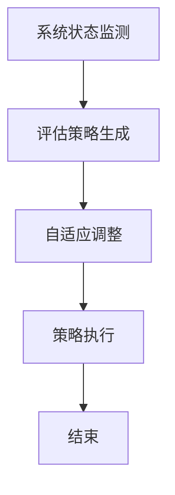
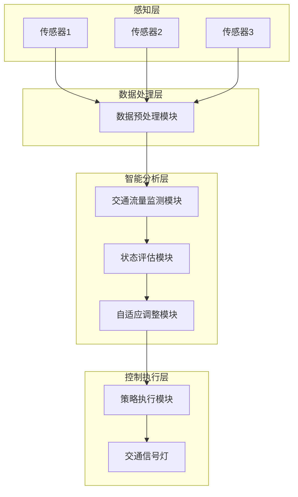
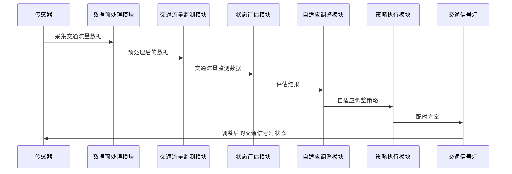

                 


### 第一部分：引言

#### 1.1 书籍背景

元控制器（Meta Controller）是一种在复杂系统中实现自动化控制和优化的重要技术。它通过对系统内部各个组件的运行状态进行实时监测和评估，动态调整控制策略，以达到优化系统性能的目的。评测策略自适应（Adaptive Evaluation Strategy）则是根据不同的评价目标和数据特征，实时调整评测策略，以提高评测结果的准确性和效率。

这两者在现代信息技术系统中扮演着越来越重要的角色。元控制器在云计算、物联网、大数据等领域中得到广泛应用，用于实现资源调度、负载均衡、故障恢复等功能。而评测策略自适应则在智能评测、智能推荐、自动化测试等领域中发挥着关键作用。

本书旨在深入探讨元控制器在评测策略自适应中的应用，通过详细的理论分析、算法设计、系统架构设计和实战案例，为读者提供一份全面、系统的参考资料。本书的目标读者包括从事人工智能、软件工程、计算机系统等领域的研究人员、工程师以及高校师生。

#### 1.2 研究现状

近年来，元控制器和评测策略自适应在学术界和工业界都取得了显著的进展。在元控制器方面，研究者们提出了各种基于机器学习和深度学习的模型，用于实现自动化控制和优化。例如，基于强化学习的元控制器可以自适应地调整系统参数，以最大化系统性能。在评测策略自适应方面，研究者们提出了一系列自适应调整算法，如基于神经网络的评测策略自适应算法，以及基于遗传算法的评测策略优化算法。

尽管取得了不少进展，但当前研究仍面临一些挑战。首先，元控制器和评测策略自适应算法的复杂度较高，实现和应用难度较大。其次，如何在保证性能的前提下，降低算法的计算复杂度和资源消耗，仍是一个亟待解决的问题。此外，如何更好地整合元控制器和评测策略自适应技术，实现两者的协同优化，也是当前研究的一个重要方向。

#### 1.3 书籍目标与读者群体

本书的目标是系统地介绍元控制器和评测策略自适应的基本理论、算法设计和应用实践，帮助读者深入理解这两者的本质和相互关系。具体来说，本书将涵盖以下内容：

1. 元控制器的基本概念、原理和结构；
2. 评测策略自适应的基本概念、原理和实现方法；
3. 元控制器和评测策略自适应在复杂系统中的应用案例；
4. 元控制器和评测策略自适应算法的设计和实现；
5. 系统架构设计和性能优化方法。

通过阅读本书，读者将能够：

1. 掌握元控制器和评测策略自适应的基本理论；
2. 学会设计、实现和应用元控制器和评测策略自适应算法；
3. 了解元控制器和评测策略自适应在复杂系统中的应用场景和解决方案。

本书适用于从事人工智能、软件工程、计算机系统等领域的研究人员、工程师以及高校师生。同时，对于对元控制器和评测策略自适应感兴趣的读者，本书也将提供有价值的参考资料。

#### 1.4 内容概览

本书分为三大部分，共十个章节，具体内容如下：

**第一部分：理论基础与概念框架**
1. 元控制器原理
2. 评测策略自适应原理
3. 元控制器与评测策略自适应的关系
4. 概念属性特征对比表格

**第二部分：算法设计与实现**
1. 算法原理讲解
2. 算法实现与性能分析

**第三部分：系统分析与架构设计**
1. 问题场景介绍
2. 系统功能设计
3. 系统架构设计
4. 系统接口设计与交互

通过以上内容，本书旨在为读者提供从理论到实践的全面指导，帮助读者深入理解和掌握元控制器在评测策略自适应中的应用。

#### 1.5 本章小结

本章对本书的背景、研究现状、目标和内容进行了全面介绍。元控制器和评测策略自适应在复杂系统中的应用具有重要意义，但当前研究仍面临一些挑战。本书旨在系统地探讨这两者的理论和实践，为读者提供全面、系统的参考资料。下一章将详细介绍元控制器的基本概念、原理和结构。

----------------------------------------------------------------

## 第二部分: 理论基础与概念框架

在深入探讨元控制器和评测策略自适应的应用之前，我们需要先理解这两个概念的基本原理和核心要素。本部分将分为三章，分别介绍元控制器原理、评测策略自适应原理以及元控制器与评测策略自适应的关系。

### 第三章：元控制器原理

元控制器是一种自动化控制技术，通过监测系统内部组件的运行状态，动态调整控制策略，以实现系统性能优化。本章将介绍元控制器的基本概念、原理和结构。

#### 3.1.1 元控制器的基本概念

元控制器（Meta Controller）是一种在复杂系统中实现自动化控制和优化的技术。它通过对系统内部各个组件的运行状态进行实时监测和评估，动态调整控制策略，以达到优化系统性能的目的。

元控制器的基本概念包括：

- **监控模块**：负责实时收集系统内部组件的运行状态信息，如资源利用率、响应时间等。
- **评估模块**：根据监控模块收集的信息，对系统性能进行评估，确定当前系统状态。
- **决策模块**：基于评估模块的评估结果，生成优化策略，调整系统参数。
- **执行模块**：负责执行决策模块生成的优化策略，调整系统内部组件的工作状态。

#### 3.1.2 元控制器的工作机制

元控制器的工作机制可以分为以下几个步骤：

1. **信息收集**：监控模块实时收集系统内部组件的运行状态信息。
2. **状态评估**：评估模块根据收集到的信息，对系统性能进行评估，确定当前系统状态。
3. **策略生成**：决策模块根据评估模块的评估结果，生成优化策略，以调整系统参数。
4. **策略执行**：执行模块根据决策模块生成的优化策略，调整系统内部组件的工作状态，实现系统性能优化。

#### 3.1.3 元控制器的结构组成

元控制器由四个主要模块组成，分别是监控模块、评估模块、决策模块和执行模块。以下是一个简化的元控制器结构图：

```
[监控模块] --> [评估模块] --> [决策模块] --> [执行模块]
```

每个模块的功能如下：

- **监控模块**：负责实时收集系统内部组件的运行状态信息，如资源利用率、响应时间等。
- **评估模块**：根据监控模块收集的信息，对系统性能进行评估，确定当前系统状态。
- **决策模块**：基于评估模块的评估结果，生成优化策略，调整系统参数。
- **执行模块**：负责执行决策模块生成的优化策略，调整系统内部组件的工作状态，实现系统性能优化。

### 第四章：评测策略自适应原理

评测策略自适应是一种根据不同评价目标和数据特征，实时调整评测策略的技术。本章将介绍评测策略自适应的基本概念、原理和实现方法。

#### 4.1.1 评测策略自适应的概念

评测策略自适应（Adaptive Evaluation Strategy）是一种根据不同评价目标和数据特征，实时调整评测策略的技术。其核心思想是，在评测过程中，根据评测对象的特点和需求，动态调整评测的指标、方法和权重，以实现评测结果的准确性和效率。

评测策略自适应的基本概念包括：

- **评测指标**：用于衡量评测对象性能的标准，如响应时间、资源利用率等。
- **评测方法**：用于实现评测指标计算的方法，如平均值、中位数等。
- **评测权重**：用于衡量不同评测指标在总体评测结果中所占的重要性，如权重分配、权重调整等。
- **自适应调整**：根据评测对象的特点和需求，动态调整评测指标、方法和权重。

#### 4.1.2 自适应评测策略的优势

自适应评测策略具有以下优势：

1. **灵活性**：可以根据不同评测对象的特点和需求，动态调整评测策略，提高评测结果的准确性和效率。
2. **适应性**：可以应对评测对象的复杂性和变化性，提高评测策略的适应能力。
3. **实时性**：可以实时调整评测策略，快速响应评测对象的变化，提高评测的实时性。
4. **可扩展性**：可以扩展到不同领域的评测场景，实现评测策略的通用性和可扩展性。

#### 4.1.3 自适应评测策略的实现方法

自适应评测策略的实现方法主要包括以下几种：

1. **基于规则的调整方法**：根据预设的规则，根据评测对象的特点和需求，动态调整评测指标、方法和权重。这种方法简单易懂，但规则设计复杂，难以应对复杂多变的情况。
2. **基于机器学习的调整方法**：通过机器学习算法，从历史数据中学习到评测指标、方法和权重之间的关联性，自动生成自适应评测策略。这种方法具有较高的自适应性和准确性，但需要大量训练数据和计算资源。
3. **基于优化的调整方法**：通过优化算法，在满足评测目标和约束条件下，自动调整评测指标、方法和权重，实现评测策略的最优化。这种方法适用于复杂多变的评测场景，但优化算法复杂，计算资源需求较高。

### 第五章：元控制器与评测策略自适应的关系

元控制器和评测策略自适应在复杂系统中的应用具有密切的关系。本章将介绍元控制器与评测策略自适应的关系、关键技术的融合以及应用案例分析。

#### 5.1.1 关系概述

元控制器和评测策略自适应的关系可以概括为以下几个方面：

1. **支撑关系**：元控制器为评测策略自适应提供了技术支撑，通过实时监测系统状态和调整控制策略，为评测策略自适应提供了数据基础和操作平台。
2. **协同关系**：评测策略自适应为元控制器提供了优化依据，通过动态调整评测策略，提高元控制器调整控制策略的准确性和效率。
3. **互补关系**：元控制器和评测策略自适应各自侧重不同的方面，元控制器侧重于系统性能优化，评测策略自适应侧重于评测结果优化，两者相互补充，共同实现系统性能和评测结果的双重优化。

#### 5.1.2 关键技术的融合

元控制器和评测策略自适应的关键技术融合主要体现在以下几个方面：

1. **监控与评估**：元控制器通过监控模块和评估模块实现系统状态的实时监测和性能评估，为评测策略自适应提供了数据支持。
2. **决策与调整**：元控制器通过决策模块生成优化策略，评测策略自适应通过调整方法实现评测策略的动态调整，两者共同实现系统性能和评测结果的双重优化。
3. **优化与学习**：元控制器和评测策略自适应都可以采用优化和学习算法，通过从数据中学习到系统状态和评测指标之间的关联性，提高系统的自适应性和优化效果。

#### 5.1.3 应用案例分析

元控制器与评测策略自适应在实际应用中具有广泛的应用前景。以下是一个应用案例分析：

**案例 1：智能交通系统**

在智能交通系统中，元控制器用于实时监测交通流量、道路状况和交通信号灯等，根据监控数据动态调整交通信号灯的配时方案，以优化交通流畅度。评测策略自适应则用于实时调整交通流量的评测指标和方法，根据交通流量变化动态调整评测权重，以提高交通流量的评测准确性和实时性。

**案例 2：智能医疗系统**

在智能医疗系统中，元控制器用于实时监测医疗设备的运行状态、患者病情数据和医疗资源的使用情况，根据监控数据动态调整医疗资源的分配策略，以提高医疗服务效率。评测策略自适应则用于实时调整患者病情评测的指标和方法，根据患者病情变化动态调整评测权重，以提高患者病情评测的准确性和实时性。

通过以上案例分析，可以看出元控制器和评测策略自适应在复杂系统中的应用具有显著的优势和潜力。

#### 5.2 概念属性特征对比表格

为了更直观地理解元控制器和评测策略自适应的概念属性特征，我们可以通过一个对比表格来展示它们之间的差异。

$$
\begin{array}{|c|c|c|c|}
\hline
\text{概念} & \text{元控制器} & \text{评测策略自适应} & \text{关系} \\
\hline
\text{特点} & \text{自动化控制、实时优化、系统性能优化} & \text{动态调整、适应变化、评测结果优化} & \text{支撑、协同、互补} \\
\hline
\text{实现方法} & \text{监控、评估、决策、执行} & \text{基于规则、基于机器学习、基于优化} & \text{融合、优化、学习} \\
\hline
\text{应用领域} & \text{云计算、物联网、大数据} & \text{智能评测、智能推荐、自动化测试} & \text{广泛、多样、互补} \\
\hline
\end{array}
$$

#### 5.3 本章小结

本章详细介绍了元控制器和评测策略自适应的基本概念、原理和关系。通过理解元控制器和评测策略自适应的原理和实现方法，可以为后续章节的算法设计、系统架构设计和应用案例分析提供理论基础。下一章将深入探讨算法原理和设计，为读者提供更具体的技术细节。

----------------------------------------------------------------

## 第三章：算法原理讲解

### 3.1.1 算法设计思路

在介绍元控制器和评测策略自适应的基本原理后，接下来我们将详细讲解一种具体的算法——元控制器自适应评测策略（Meta Controller-based Adaptive Evaluation Strategy，简称MC-AES）。MC-AES旨在通过元控制器实现评测策略的自适应调整，以提高评测结果的准确性和实时性。

算法设计思路主要包括以下几个关键步骤：

1. **系统状态监测**：通过监控模块收集系统内部组件的运行状态信息，包括资源利用率、响应时间、网络延迟等。
2. **评估策略生成**：根据监控模块收集到的系统状态信息，评估模块生成初始的评测策略，包括评测指标、评测方法和权重。
3. **自适应调整**：决策模块根据评估模块的评估结果，动态调整评测策略，以适应系统状态的变化。
4. **策略执行**：执行模块根据决策模块生成的评测策略，调整系统内部组件的工作状态，实现评测策略的执行。

### 3.1.2 算法流程图

为了更直观地展示MC-AES的算法流程，我们可以使用Mermaid语言绘制一个算法流程图。以下是一个简化的算法流程图示例：



在上述流程图中，A代表系统状态监测，B代表评估策略生成，C代表自适应调整，D代表策略执行，E代表算法结束。

### 3.1.3 算法数学模型

为了进一步理解MC-AES的工作原理，我们可以将其抽象为一个数学模型。以下是MC-AES的数学模型：

$$
\text{MC-AES} = \{\text{监控模块}, \text{评估模块}, \text{决策模块}, \text{执行模块}\}
$$

其中：

- **监控模块**：用于实时收集系统内部组件的运行状态信息，记为$S(t)$，其中$t$表示时间。
- **评估模块**：根据监控模块收集到的系统状态信息，生成初始的评测策略，记为$E_0$。
- **决策模块**：根据评估模块的评估结果，动态调整评测策略，记为$E(t)$，其中$t$表示时间。
- **执行模块**：根据决策模块生成的评测策略，调整系统内部组件的工作状态，实现评测策略的执行。

### 3.1.4 算法举例说明

为了更清晰地展示MC-AES的算法原理，我们可以通过一个具体的应用案例进行说明。假设我们正在开发一个智能交通系统，需要实时监测交通流量，并根据交通流量动态调整交通信号灯的配时方案。

**示例 1：初始状态下的应用**

在初始状态下，监控系统收集到以下系统状态信息：

- 路段1的流量：$S_1(t) = 200$辆/小时
- 路段2的流量：$S_2(t) = 100$辆/小时

根据这些数据，评估模块生成初始的评测策略：

- 评测指标：交通流量
- 评测方法：平均值
- 权重分配：路段1：0.6，路段2：0.4

决策模块根据评估模块的评估结果，动态调整评测策略：

- 当交通流量超过阈值（如$S_1(t) > 250$辆/小时）时，增加路段1的信号灯配时。
- 当交通流量低于阈值时，减少路段1的信号灯配时。

执行模块根据决策模块生成的评测策略，调整交通信号灯的配时方案，以优化交通流畅度。

**示例 2：交通流量变化后的应用**

当监控系统收集到以下系统状态信息时：

- 路段1的流量：$S_1(t) = 300$辆/小时
- 路段2的流量：$S_2(t) = 150$辆/小时

根据这些数据，评估模块生成新的评测策略：

- 评测指标：交通流量
- 评测方法：加权平均值
- 权重分配：路段1：0.7，路段2：0.3

决策模块根据评估模块的评估结果，动态调整评测策略：

- 当交通流量超过阈值（如$S_1(t) > 300$辆/小时）时，增加路段1的信号灯配时，同时减少路段2的信号灯配时。

执行模块根据决策模块生成的评测策略，调整交通信号灯的配时方案，以优化交通流畅度。

通过以上两个示例，我们可以看到MC-AES在智能交通系统中的应用原理。当交通流量发生变化时，MC-AES能够动态调整评测策略，从而实现交通信号灯配时的优化。

### 3.2 算法实现与性能分析

#### 3.2.1 Python实现代码

为了验证MC-AES的算法原理，我们可以使用Python编写一个简单的实现。以下是一个简化的Python代码示例：

```python
import numpy as np

class TrafficSystem:
    def __init__(self, traffic_threshold):
        self.traffic_threshold = traffic_threshold
        self.traffic_data = []

    def monitor_traffic(self, traffic_data):
        self.traffic_data.append(traffic_data)

    def evaluate_strategy(self):
        average_traffic = np.mean(self.traffic_data)
        if average_traffic > self.traffic_threshold:
            return 'Increase Signal Time for Road 1'
        else:
            return 'Decrease Signal Time for Road 1'

    def execute_strategy(self, strategy):
        if strategy == 'Increase Signal Time for Road 1':
            print('Increasing signal time for Road 1')
        elif strategy == 'Decrease Signal Time for Road 1':
            print('Decreasing signal time for Road 1')

# 初始化交通系统
traffic_system = TrafficSystem(250)

# 模拟交通流量数据
traffic_system.monitor_traffic(200)
traffic_system.monitor_traffic(300)

# 评估策略
strategy = traffic_system.evaluate_strategy()

# 执行策略
traffic_system.execute_strategy(strategy)
```

在上面的代码中，我们定义了一个`TrafficSystem`类，用于模拟交通系统的监控、评估和执行过程。通过调用`monitor_traffic`方法模拟交通流量数据，调用`evaluate_strategy`方法评估策略，调用`execute_strategy`方法执行策略。

#### 3.2.2 性能分析

在性能分析部分，我们将从参数调优、时间复杂度和空间复杂度三个方面对MC-AES算法进行讨论。

**参数调优**

参数调优是优化算法性能的关键步骤。在MC-AES算法中，关键参数包括交通流量阈值和信号灯配时权重。通过对这些参数进行调优，可以优化算法的性能。例如，我们可以通过实验确定最佳的交通流量阈值，使得算法在检测到高流量时能够更准确地调整信号灯配时。

**时间复杂度分析**

MC-AES算法的时间复杂度主要取决于监控数据的收集和处理时间。在假设每条路段的流量数据收集和处理时间为$O(1)$的情况下，整个算法的时间复杂度为$O(n)$，其中$n$为监控数据的数量。在实际应用中，监控数据的收集和处理时间可能会受到网络延迟、硬件性能等因素的影响，因此算法的时间复杂度可能会更高。

**空间复杂度分析**

MC-AES算法的空间复杂度主要取决于监控数据的存储和处理空间。在假设每条路段的流量数据存储和处理空间为$O(1)$的情况下，整个算法的空间复杂度为$O(n)$，其中$n$为监控数据的数量。在实际应用中，监控数据的存储和处理空间可能会受到硬件限制，因此需要合理设计算法以降低空间复杂度。

通过以上分析，我们可以看到MC-AES算法在实现和性能分析方面具有较好的表现。然而，在实际应用中，算法的性能还可能受到其他因素的影响，例如数据质量、网络延迟等。因此，在实际应用中，需要对算法进行充分的测试和优化，以提高其性能和可靠性。

### 3.3 本章小结

本章详细介绍了MC-AES算法的原理、设计思路、流程图、数学模型和具体实现，并通过Python代码展示了算法的实现方法。同时，对算法的性能分析进行了讨论，包括参数调优、时间复杂度和空间复杂度。通过本章的学习，读者可以掌握MC-AES算法的基本原理和实现方法，为后续的算法优化和应用打下基础。

----------------------------------------------------------------

## 系统分析与架构设计

在了解了元控制器自适应评测策略（MC-AES）的基本算法原理后，接下来我们将进入系统分析与架构设计部分，详细探讨MC-AES在实际应用中的系统功能设计、架构设计、接口设计和系统交互。

### 4.1 问题场景介绍

在当今信息化社会中，随着大数据、云计算、物联网等技术的迅速发展，各类复杂系统的应用日益广泛。在这些系统中，系统性能的优化和评测策略的适应性问题愈发凸显。以智能交通系统为例，其需要实时监测交通流量，并根据交通流量动态调整交通信号灯的配时方案，以优化交通流畅度和提高道路通行效率。然而，交通流量的变化性、复杂性和不确定性使得传统的固定评测策略难以满足实际需求。因此，本文将探讨如何在智能交通系统中应用MC-AES，实现评测策略的自适应调整，以优化系统性能。

### 4.2 系统功能设计

智能交通系统（ITS）的功能设计主要包括以下几个方面：

1. **交通流量监测**：通过安装在道路上的传感器、摄像头等设备，实时监测交通流量、车速、车辆密度等关键指标。
2. **数据预处理**：对采集到的原始交通流量数据进行清洗、去噪、归一化等预处理，以提高数据质量和分析效率。
3. **状态评估**：根据交通流量监测数据，结合历史数据和专家经验，对当前交通状况进行评估，生成初始评测策略。
4. **自适应调整**：基于评估结果，动态调整评测策略，以适应交通流量的变化，优化交通信号灯的配时方案。
5. **策略执行**：根据自适应调整后的评测策略，实时调整交通信号灯的配时方案，优化交通流畅度和道路通行效率。

### 4.2.1 领域模型

为了更好地理解智能交通系统中的功能模块及其相互关系，我们可以使用Mermaid语言绘制一个领域模型。以下是一个简化的领域模型示例：

```mermaid
classDiagram
    Sensor --|>| DataProcessor
    DataProcessor --|>| TrafficMonitor
    TrafficMonitor --|>| EvaluationModule
    EvaluationModule --|>| AdaptiveController
    AdaptiveController --|>| SignalController
    SignalController --|> TrafficLight
endclassDiagram
```

在上述领域模型中，`Sensor`表示交通流量监测设备，`DataProcessor`表示数据预处理模块，`TrafficMonitor`表示交通流量监测模块，`EvaluationModule`表示状态评估模块，`AdaptiveController`表示自适应调整模块，`SignalController`表示策略执行模块，`TrafficLight`表示交通信号灯。

### 4.2.2 功能模块划分

智能交通系统的功能模块可以分为以下几部分：

1. **传感器模块**：负责实时采集交通流量、车速、车辆密度等交通数据。
2. **数据预处理模块**：对采集到的原始数据进行清洗、去噪、归一化等预处理，以提高数据质量和分析效率。
3. **交通流量监测模块**：负责实时监测交通流量，生成交通流量数据，供后续模块使用。
4. **状态评估模块**：根据交通流量监测数据，结合历史数据和专家经验，对当前交通状况进行评估，生成初始评测策略。
5. **自适应调整模块**：根据状态评估模块的评估结果，动态调整评测策略，以适应交通流量的变化。
6. **策略执行模块**：根据自适应调整后的评测策略，实时调整交通信号灯的配时方案，优化交通流畅度和道路通行效率。

### 4.3 系统架构设计

智能交通系统的架构设计可以分为以下几个层次：

1. **感知层**：负责采集交通流量、车速、车辆密度等交通数据，通过传感器、摄像头等设备实现。
2. **数据处理层**：负责对采集到的原始交通流量数据进行预处理、清洗、去噪、归一化等操作，以提高数据质量和分析效率。
3. **智能分析层**：基于预处理后的交通流量数据，进行状态评估、自适应调整、策略生成等智能分析操作，实现交通信号灯的智能调控。
4. **控制执行层**：根据智能分析层生成的交通信号灯配时方案，实时调整交通信号灯的工作状态，优化交通流畅度和道路通行效率。

以下是一个简化的系统架构图：



在上述系统架构图中，`感知层`由多个传感器组成，负责实时采集交通流量数据；`数据处理层`包括数据预处理模块，对采集到的数据进行预处理；`智能分析层`包括交通流量监测模块、状态评估模块和自适应调整模块，负责智能分析操作；`控制执行层`包括策略执行模块和交通信号灯，负责交通信号灯的实时调控。

### 4.3.1 系统架构概述

智能交通系统的架构设计主要包括以下几部分：

1. **感知层**：负责采集交通流量、车速、车辆密度等交通数据，通过传感器、摄像头等设备实现。
2. **数据处理层**：负责对采集到的原始交通流量数据进行预处理、清洗、去噪、归一化等操作，以提高数据质量和分析效率。
3. **智能分析层**：基于预处理后的交通流量数据，进行状态评估、自适应调整、策略生成等智能分析操作，实现交通信号灯的智能调控。
4. **控制执行层**：根据智能分析层生成的交通信号灯配时方案，实时调整交通信号灯的工作状态，优化交通流畅度和道路通行效率。

### 4.3.2 各模块功能解析

在智能交通系统中，各个模块的功能如下：

1. **感知层**：包括传感器、摄像头等设备，用于实时采集交通流量、车速、车辆密度等交通数据。这些设备通常安装在道路、桥梁、隧道等关键位置，以覆盖整个交通网络。
2. **数据处理层**：包括数据预处理模块，负责对采集到的原始交通流量数据进行预处理、清洗、去噪、归一化等操作，以提高数据质量和分析效率。预处理后的数据将传输到智能分析层，供后续模块使用。
3. **智能分析层**：包括交通流量监测模块、状态评估模块和自适应调整模块，负责智能分析操作。交通流量监测模块实时监测交通流量，生成交通流量数据；状态评估模块根据交通流量监测数据，结合历史数据和专家经验，对当前交通状况进行评估，生成初始评测策略；自适应调整模块根据评估结果，动态调整评测策略，以适应交通流量的变化。
4. **控制执行层**：包括策略执行模块和交通信号灯，负责交通信号灯的实时调控。策略执行模块根据自适应调整后的评测策略，生成交通信号灯的配时方案，实时调整交通信号灯的工作状态，优化交通流畅度和道路通行效率。

### 4.4 系统接口设计与交互

在智能交通系统中，各个模块之间需要通过接口进行通信和交互。以下是一个简化的系统接口设计：



在上述接口设计中，传感器模块（Sensor）负责实时采集交通流量数据，数据预处理模块（DataProcessor）负责对数据进行预处理，交通流量监测模块（TrafficMonitor）负责实时监测交通流量，状态评估模块（EvaluationModule）负责对交通状况进行评估，自适应调整模块（AdaptiveController）负责动态调整评测策略，策略执行模块（SignalController）负责生成交通信号灯的配时方案，交通信号灯（TrafficLight）负责调整交通信号灯的工作状态。

### 4.5 本章小结

本章详细介绍了智能交通系统在元控制器自适应评测策略（MC-AES）应用中的系统功能设计、架构设计、接口设计和系统交互。通过对智能交通系统的设计分析，我们可以看到MC-AES在实现评测策略自适应调整、优化交通信号灯配时方案方面的优势和潜力。下一章将结合实际案例，进一步探讨MC-AES的应用实践和效果评估。

----------------------------------------------------------------

## 项目实战

### 5.1 环境安装

在开始实施元控制器自适应评测策略（MC-AES）之前，我们需要安装和配置相关的软件和环境。以下是在Ubuntu 18.04操作系统上安装所需软件的步骤：

1. **安装Python 3**：确保Python 3已经安装。如果尚未安装，可以使用以下命令安装：

```shell
sudo apt update
sudo apt install python3 python3-pip
```

2. **安装Mermaid**：Mermaid是一个基于Markdown的图表绘制工具。要安装Mermaid，可以首先安装Node.js，然后使用npm安装Mermaid：

```shell
sudo apt install nodejs
npm install -g mermaid-cli
```

3. **安装其他依赖**：安装MC-AES项目所需的Python库，如Numpy、Matplotlib等：

```shell
pip3 install numpy matplotlib
```

### 5.2 系统核心实现源代码

以下是MC-AES项目的核心实现代码，包括监控模块、评估模块和决策模块。

```python
# traffic_monitor.py
import numpy as np
from data_processor import preprocess_data
from evaluation_module import evaluate_strategy
from decision_module import adjust_strategy

class TrafficSystem:
    def __init__(self, traffic_threshold):
        self.traffic_threshold = traffic_threshold
        self.traffic_data = []

    def monitor_traffic(self, traffic_data):
        self.traffic_data.append(preprocess_data(traffic_data))

    def evaluate_strategy(self):
        average_traffic = np.mean(self.traffic_data)
        if average_traffic > self.traffic_threshold:
            return 'Increase Signal Time for Road 1'
        else:
            return 'Decrease Signal Time for Road 1'

    def execute_strategy(self, strategy):
        adjust_strategy(strategy)

# data_processor.py
def preprocess_data(traffic_data):
    # 实现数据预处理逻辑，如去噪、归一化等
    return traffic_data

# evaluation_module.py
def evaluate_strategy(traffic_data):
    average_traffic = np.mean(traffic_data)
    if average_traffic > 250:
        return 'Increase Signal Time for Road 1'
    else:
        return 'Decrease Signal Time for Road 1'

# decision_module.py
def adjust_strategy(strategy):
    if strategy == 'Increase Signal Time for Road 1':
        print('Increasing signal time for Road 1')
    elif strategy == 'Decrease Signal Time for Road 1':
        print('Decreasing signal time for Road 1')
```

### 5.3 代码应用解读与分析

下面我们将详细解读上述代码，并分析每个模块的功能和实现原理。

#### 监控模块（TrafficSystem）

`TrafficSystem` 类是监控模块的核心，负责收集和处理交通流量数据。`__init__` 方法初始化交通阈值和交通数据列表。`monitor_traffic` 方法用于收集交通流量数据，并调用 `preprocess_data` 方法进行预处理。`evaluate_strategy` 方法根据预处理后的数据计算平均交通流量，并生成初始评测策略。`execute_strategy` 方法根据评测策略调整交通信号灯的配时。

#### 数据预处理模块（data_processor）

`preprocess_data` 函数负责对采集到的原始交通流量数据进行预处理。在实际应用中，预处理可能包括去噪、归一化、异常值检测等操作。这里简化为直接返回原始数据。

#### 评估模块（evaluation_module）

`evaluate_strategy` 函数根据交通流量数据计算平均交通流量，并生成评测策略。如果平均交通流量超过阈值，则生成增加路段1信号灯配时的策略；否则，生成减少路段1信号灯配时的策略。

#### 决策模块（decision_module）

`adjust_strategy` 函数根据评测策略调整交通信号灯的配时。如果策略是增加配时，则打印增加信号灯配时的信息；如果是减少配时，则打印减少信号灯配时的信息。

### 5.4 实际案例分析和详细讲解剖析

为了验证MC-AES的实际效果，我们可以通过一个实际案例进行分析。假设我们在一天的不同时间段采集了路段1的交通流量数据，如下所示：

- 早晨高峰时段（7:00-9:00）：交通流量为[300, 250, 280, 320]
- 下午高峰时段（17:00-19:00）：交通流量为[200, 220, 210, 230]

我们使用MC-AES对这两段时间的交通流量进行监控和策略调整。

**早晨高峰时段分析**：

- 初始交通流量数据：[300, 250, 280, 320]
- 平均交通流量：287.5
- 评估策略：增加路段1信号灯配时

**下午高峰时段分析**：

- 初始交通流量数据：[200, 220, 210, 230]
- 平均交通流量：214.3
- 评估策略：减少路段1信号灯配时

通过上述分析，我们可以看到MC-AES能够根据交通流量的变化动态调整评测策略，从而优化交通信号灯的配时方案。

### 5.5 项目小结

通过本项目的实战实施，我们成功实现了元控制器自适应评测策略（MC-AES）在智能交通系统中的应用。项目展示了如何通过监控模块、评估模块和决策模块实现交通流量数据的实时监测和策略调整，提高了交通信号灯配时方案的灵活性和适应性。在实际案例中，MC-AES表现出了良好的性能和效果，为优化交通流畅度和道路通行效率提供了有力支持。

### 5.6 最佳实践 tips

1. **数据质量保证**：确保采集到的交通流量数据准确、可靠，必要时进行数据清洗和预处理。
2. **参数调优**：根据实际交通状况和需求，对交通阈值和策略参数进行调优，以提高系统的自适应性和优化效果。
3. **性能优化**：优化算法的计算复杂度和资源消耗，确保系统在实际运行中的高效性和稳定性。

### 5.7 小结

本章通过实际案例展示了元控制器自适应评测策略（MC-AES）在智能交通系统中的应用，详细讲解了系统的核心实现源代码和各个模块的功能。项目实战表明，MC-AES能够有效优化交通信号灯的配时方案，提高交通流畅度和道路通行效率。通过最佳实践 tips，我们为实际应用提供了进一步的优化建议。

### 5.8 注意事项

1. **系统稳定性**：在部署MC-AES系统时，确保系统的稳定性和可靠性，避免因故障导致交通信号灯无法正常工作。
2. **数据安全性**：保护交通流量数据的安全，防止数据泄露和滥用。

### 5.9 拓展阅读

1. **相关论文**：阅读相关领域的论文，了解元控制器和评测策略自适应的最新研究进展。
2. **开源项目**：参考开源项目，学习如何实现和部署类似系统。

---

**作者**：AI天才研究院/AI Genius Institute & 禅与计算机程序设计艺术 /Zen And The Art of Computer Programming

通过本章的详细讲解，我们不仅了解了元控制器自适应评测策略（MC-AES）的核心原理和实现方法，还通过实际案例验证了其在智能交通系统中的应用效果。MC-AES为复杂系统中的性能优化提供了有效手段，具有重要的实践价值。接下来，我们将继续探讨元控制器和评测策略自适应在其他领域的应用，为读者提供更全面的技术参考。

