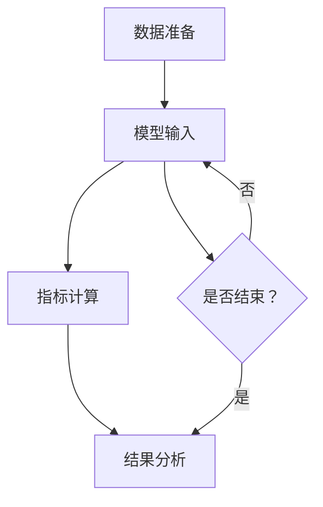
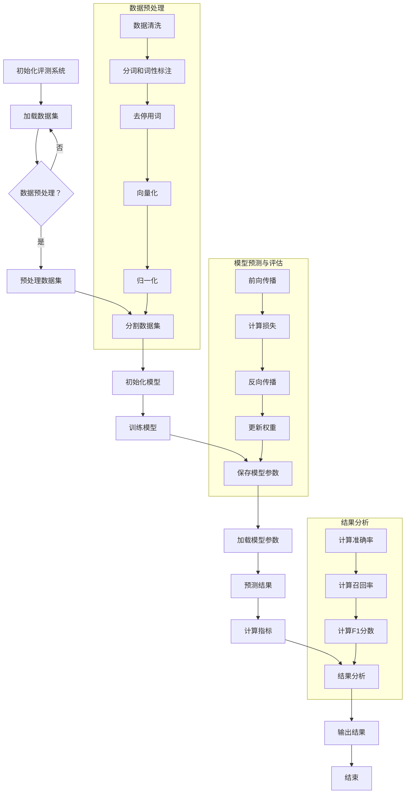
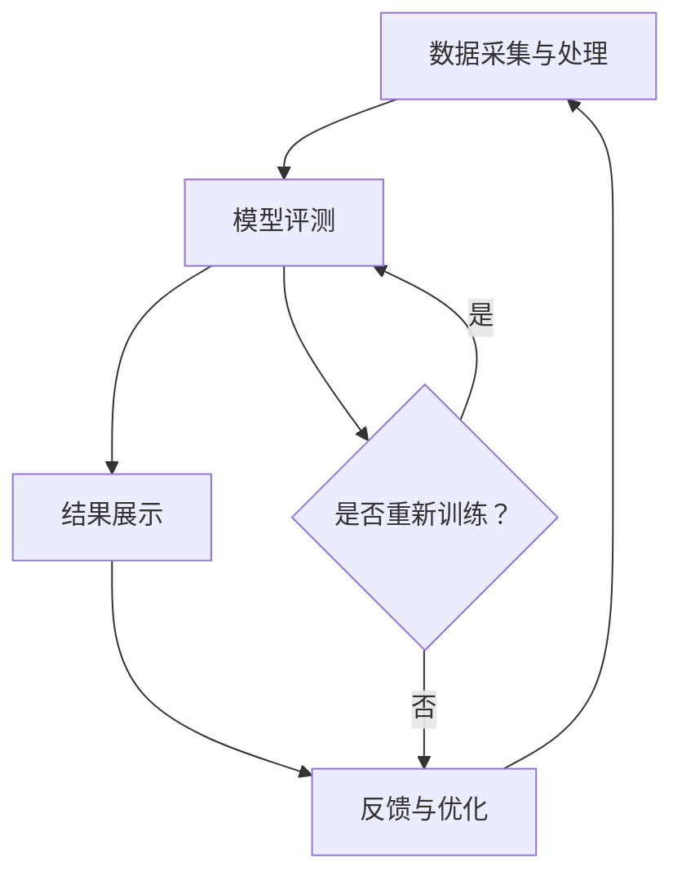
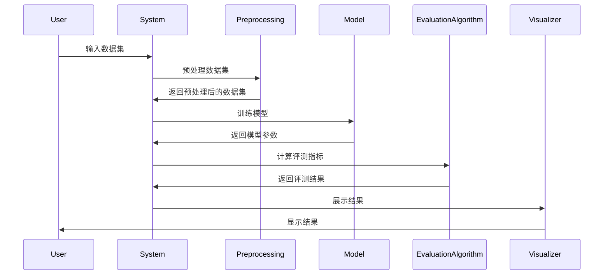
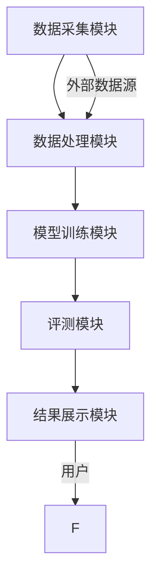
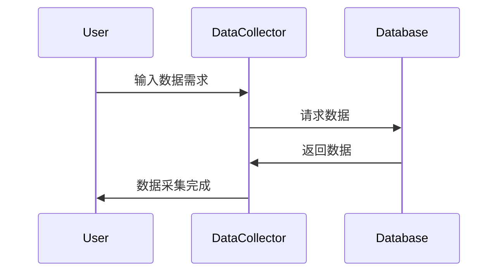
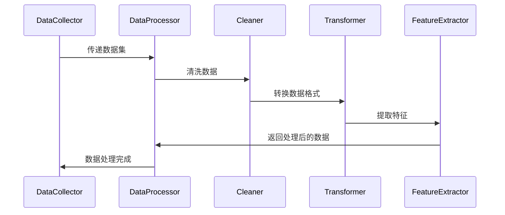
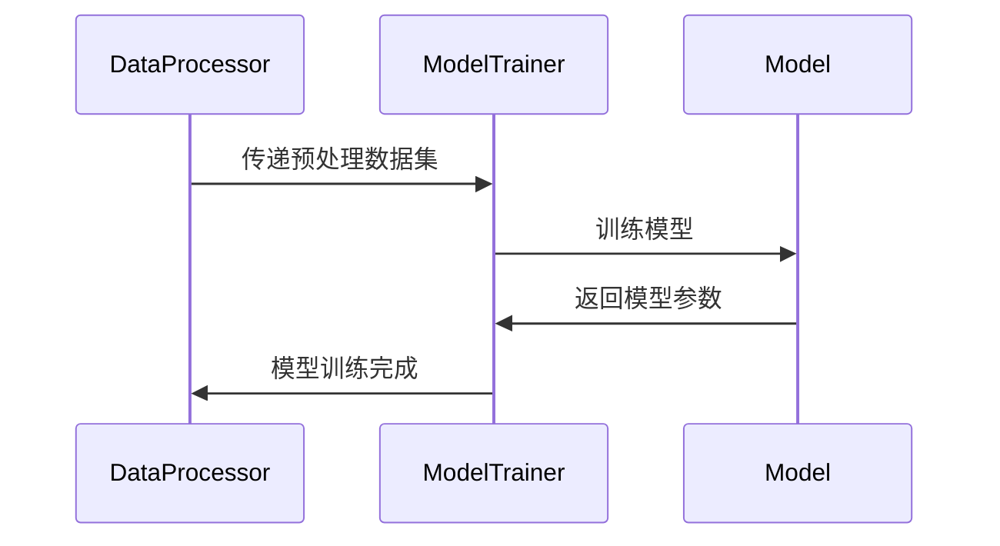
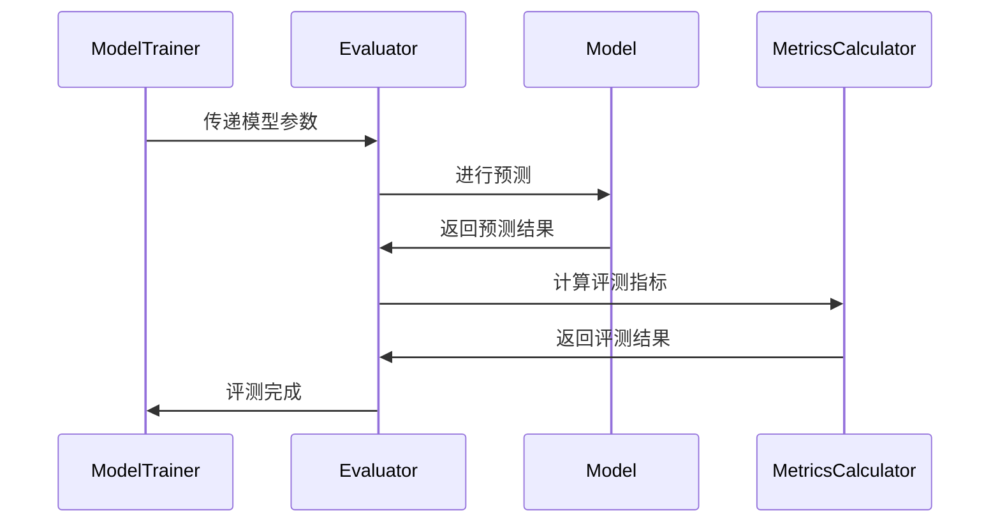
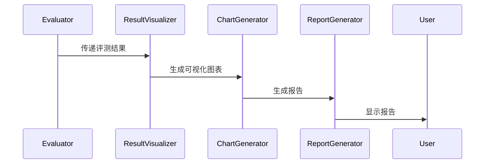

                 


### 第1章：问题背景与重要性

#### 1.1 评测系统在现代人工智能中的角色

随着人工智能技术的飞速发展，评测系统在人工智能领域的地位愈发重要。评测系统（Evaluation System）是用于评估人工智能模型性能的工具，它可以帮助研究者、工程师和决策者了解模型的性能表现，识别模型的优点和不足，从而进行改进和优化。在现代人工智能中，评测系统主要承担以下角色：

1. **性能评估**：通过评测系统，可以客观地评估模型的准确性、可靠性、效率等关键性能指标。这些指标对于模型在实际应用中的表现至关重要。
2. **模型对比**：评测系统提供了统一的评估标准，使得不同模型可以在同一框架下进行比较，从而帮助研究者选择最优模型。
3. **性能优化**：通过评测系统，可以发现模型在特定任务上的弱点，指导研究者进行性能优化，提高模型的整体性能。

#### 1.2 LLM评测系统的现状与挑战

LLM（Large Language Model）评测系统是专门针对大型语言模型进行性能评估的系统。随着GPT-3、BERT等大型语言模型的兴起，LLM评测系统也得到了广泛关注。然而，当前LLM评测系统仍面临一些挑战：

1. **多样性不足**：现有的评测系统大多集中在通用语言的评测，对特定领域的语言模型评测关注较少。这限制了评测系统的全面性和准确性。
2. **评测标准不一致**：不同的评测系统可能采用不同的评测标准和方法，导致评测结果难以进行比较和归纳。
3. **评测效率低下**：大规模语言模型的评测往往需要大量的计算资源和时间，降低了评测的效率和实用性。

#### 1.3 评测系统的性能评估必要性

评测系统性能评估的必要性主要体现在以下几个方面：

1. **提高模型性能**：通过对评测系统本身的性能进行评估，可以发现系统在评测过程中的瓶颈和不足，从而进行优化，提高评测的准确性和效率。
2. **保障评测公正性**：评估评测系统的性能，可以确保评测结果的公正性和可靠性，防止因评测系统性能问题导致的误判和偏见。
3. **促进技术发展**：性能评估有助于推动评测系统技术的发展，激励研究者探索新的评测方法和标准，推动人工智能领域的进步。

#### 1.4 本书结构安排

本书将从以下几个方面对LLM评测系统进行深入探讨：

1. **核心概念与基本原理**：介绍评测系统的基本概念和LLM评测的基本原理。
2. **评测系统的设计与架构**：分析评测系统的整体架构、数据采集与处理、评测指标的计算方法等。
3. **评测系统的实现细节**：探讨数据预处理、特征工程、评测算法的选择与实现等。
4. **评测系统的应用场景**：介绍评测系统在不同领域的应用和发展趋势。
5. **案例分析**：通过具体案例展示评测系统的实际应用和效果。
6. **总结与展望**：总结全书内容，提出存在的问题和改进方向，展望未来发展趋势。

通过本书的阅读，读者将能够全面了解LLM评测系统的性能评估方法，掌握评测系统的设计与实现技巧，为人工智能领域的研究和应用提供有力支持。

---

**关键词**：LLM评测系统，性能评估，人工智能，评测标准，应用场景

**摘要**：本书旨在深入探讨LLM评测系统的性能评估问题，从核心概念、设计架构、实现细节、应用场景等多个方面进行全面分析。通过具体案例和系统化的讲解，帮助读者掌握评测系统的性能评估方法，提升人工智能模型的研究与应用水平。

---

接下来，我们将对核心概念与基本原理进行详细探讨。

----------------------------------------------------------------
## 第2章：核心概念与基本原理

### 2.1 评测系统的基本概念

评测系统是一种用于评估模型性能的工具，其核心功能是通过对模型在特定任务上的表现进行量化评估，从而帮助研究者、工程师和决策者了解模型的性能状况。一个典型的评测系统通常包括以下几个关键组成部分：

1. **数据集**：评测系统需要依赖一个或多个数据集来评估模型的性能。数据集应涵盖模型预期应用的场景，并具有足够的规模和代表性。
2. **评测指标**：评测系统需要定义一系列评测指标来评估模型在不同维度上的表现。常见的评测指标包括准确性、召回率、F1分数、精度、灵敏度等。
3. **评测算法**：评测系统需要实现具体的评测算法，用于计算评测指标。不同的评测算法适用于不同的评测场景和任务。
4. **结果展示**：评测系统需要能够将评测结果以直观、易懂的方式展示给用户，以便用户快速了解模型的性能。

### 2.2 LLM评测的基本原理

LLM评测系统是专门针对大型语言模型进行性能评估的系统。LLM评测的基本原理主要包括以下几个方面：

1. **数据集选择**：LLM评测系统需要选择具有代表性的数据集，这些数据集应涵盖多种语言应用场景，如问答、文本生成、翻译等。同时，数据集应具有足够的大小和多样性，以保证评测结果的全面性和准确性。
2. **评测指标设定**：针对不同的LLM应用场景，设定相应的评测指标。例如，在问答任务中，常用的评测指标包括答案的准确性、相关性、多样性等。
3. **评测算法实现**：实现一套高效的评测算法，以快速、准确地计算评测指标。这通常需要结合多种算法和技术，如自然语言处理、机器学习等。
4. **结果分析**：通过分析评测结果，识别模型在不同任务上的表现，为后续优化提供指导。

### 2.3 评测指标的定义与分类

评测指标是评测系统的核心组成部分，用于量化评估模型在特定任务上的表现。根据不同的应用场景和任务类型，评测指标可以分为以下几类：

1. **准确性**：衡量模型在特定任务上预测正确的比例。准确性越高，表示模型在任务上的表现越好。
2. **召回率**：衡量模型能够从所有正例中识别出的比例。召回率越高，表示模型能够更好地识别正例。
3. **F1分数**：综合准确性、召回率和灵敏度（准确率），用于衡量模型在特定任务上的整体表现。F1分数越高，表示模型在任务上的表现越好。
4. **精度**：衡量模型预测结果中正确预测的比例。精度越高，表示模型的预测结果越可靠。
5. **灵敏度**：衡量模型从负例中正确识别出的比例。灵敏度越高，表示模型能够更好地识别负例。

### 2.4 评测系统的组成部分

一个完整的评测系统通常包括以下几个关键组成部分：

1. **数据预处理模块**：对输入数据集进行预处理，包括数据清洗、格式转换、特征提取等操作，以提高数据质量和模型性能。
2. **评测模块**：根据设定的评测指标，计算模型在特定任务上的表现。评测模块通常包括多个子模块，如评测指标计算、结果分析、可视化等。
3. **反馈与优化模块**：根据评测结果，提供反馈和建议，指导模型优化。这一模块可以帮助研究者发现模型在特定任务上的不足，并提出改进方案。
4. **用户界面**：提供一个直观、易用的用户界面，使用户能够方便地使用评测系统，查看评测结果，并进行相关操作。

通过本章的介绍，读者应该对评测系统的基本概念和LLM评测的基本原理有了初步了解。接下来，我们将进一步探讨评测系统的设计与架构，为后续内容奠定基础。

----------------------------------------------------------------

### 2.5 评测系统评价方法的现状与挑战

当前，评测系统评价方法在人工智能领域已经得到了广泛应用，但仍然存在一些问题和挑战。以下是评测系统评价方法现状与挑战的几个方面：

#### 2.5.1 评测标准的一致性

首先，评测标准的不一致性是一个突出问题。不同的评测系统可能采用不同的评测标准和方法，导致评测结果难以进行直接比较。例如，在自然语言处理领域，不同的评测系统可能采用不同的数据集和评测指标，使得评测结果缺乏可比性。这种不一致性不仅影响了评测结果的公正性，也增加了研究者之间的沟通难度。

#### 2.5.2 评测效率与准确性

其次，评测效率与准确性之间的矛盾也是一个挑战。大规模语言模型的评测通常需要大量的计算资源和时间，这限制了评测的效率。同时，评测结果的准确性也受到评测算法和数据集选择的影响。如果评测算法不够高效，或者数据集选择不当，可能导致评测结果不准确，从而影响模型的优化和改进。

#### 2.5.3 多样性与全面性

再者，评测系统的多样性与全面性也是一个需要关注的问题。现有的评测系统大多集中在通用语言的评测，对于特定领域的语言模型评测关注较少。这种多样性不足限制了评测系统的全面性和准确性，使得评测结果难以满足特定领域的需求。

#### 2.5.4 人为干预与自动化

此外，评测系统中的人为干预与自动化也是一个挑战。在传统的评测系统中，人为干预往往是必要的，以确保评测结果的准确性和公正性。然而，随着人工智能技术的发展，越来越多的评测系统开始尝试自动化，减少人为干预。然而，自动化评测系统仍需要解决如何确保评测结果的公正性和可靠性的问题。

#### 2.5.5 评测结果的解释性

最后，评测结果的解释性也是一个需要考虑的问题。对于许多研究者来说，理解评测结果的背后原因和模型的表现机制是非常重要的。然而，当前的评测系统往往只能提供定量的评测结果，而无法提供定性的解释。这限制了研究者对评测结果的理解和应用。

总之，评测系统评价方法的现状与挑战体现了人工智能领域在评测系统建设方面的不足。解决这些问题需要从多个方面进行努力，包括标准化评测标准、提高评测效率与准确性、增强多样性与全面性、平衡人为干预与自动化，以及提升评测结果的解释性。这些努力将有助于推动人工智能评测系统的发展，为人工智能模型的优化和应用提供更全面的支持。

----------------------------------------------------------------

### 2.6 评测系统性能评估的重要性

评测系统性能评估在人工智能领域具有至关重要的意义，主要体现在以下几个方面：

#### 2.6.1 提高模型性能

首先，评测系统性能评估有助于提高模型性能。通过评估评测系统的性能，研究者可以发现评测系统在评测过程中的瓶颈和不足，从而进行优化和改进。例如，如果评测系统在计算精度方面存在问题，研究者可以尝试使用更高效的算法或者改进数据预处理方法，以提高评测精度。这样，不仅能够提高模型的评测准确性，还能够提高模型在实际应用中的性能。

#### 2.6.2 保障评测公正性

其次，评测系统性能评估有助于保障评测的公正性。一个性能优异的评测系统可以确保评测结果的准确性和可靠性，防止因评测系统性能问题导致的误判和偏见。例如，如果评测系统的计算速度过慢，可能导致评测结果滞后，从而影响模型优化和决策。通过评估评测系统的性能，可以发现这些问题，并采取相应的措施进行改进，确保评测结果的公正性。

#### 2.6.3 促进技术发展

第三，评测系统性能评估有助于推动技术发展。通过对评测系统性能的持续评估和优化，可以激励研究者探索新的评测方法和标准，推动人工智能评测系统的发展。例如，随着深度学习技术的发展，越来越多的研究者开始关注如何利用深度学习算法优化评测系统性能。这种探索不仅推动了评测系统技术的进步，也促进了人工智能领域的整体发展。

#### 2.6.4 提升应用效果

最后，评测系统性能评估有助于提升人工智能应用的效果。通过评估评测系统的性能，可以识别模型在不同任务上的表现，为实际应用提供指导。例如，在自然语言处理领域，通过评测系统的性能评估，可以确定哪些模型在特定任务上表现最佳，从而选择最适合的应用场景。这种选择不仅能够提高应用效果，还能够减少不必要的资源浪费。

综上所述，评测系统性能评估在人工智能领域具有重要作用。通过不断评估和优化评测系统性能，可以提升模型性能、保障评测公正性、推动技术发展，并最终提升人工智能应用的效果。这些努力将为人工智能领域的研究和应用提供坚实的技术支持。

----------------------------------------------------------------

### 2.7 核心概念属性特征对比表格

为了更清晰地了解评测系统的核心概念属性特征，我们设计了一张对比表格。以下表格列出了评测系统、LLM评测系统以及其他相关系统的主要属性特征，包括数据集、评测指标、评测算法和结果展示等方面。

| 系统        | 数据集         | 评测指标          | 评测算法                | 结果展示           | 特点与区别                      |
| ----------- | -------------- | ----------------- | ------------------------ | ----------------- | -------------------------------- |
| 评测系统    | 多样性数据集   | 准确性、召回率等   | 统计学习、深度学习等     | 可视化图表         | 通用性，适用于多种任务          |
| LLM评测系统 | 大规模语言数据集 | 答案准确性、相关性 | 语言模型、深度学习       | 交互式结果分析     | 针对语言模型，强调语言理解和生成 |
| 评估平台    | 标准数据集     | 综合评估指标       | 机器学习、数据分析       | 统计报告和图表     | 提供综合评估功能，注重可操作性   |
| 模型对比系统 | 比赛数据集     | 多维度评估指标     | 对比实验、统计分析       | 对比图表和报告     | 强调模型对比和优化选择          |

通过这张对比表格，我们可以看出评测系统、LLM评测系统和评估平台等系统在数据集、评测指标、评测算法和结果展示等方面的主要区别和特点。这些系统各自适用于不同的应用场景和任务需求，共同构成了一个完整的人工智能评测体系。

----------------------------------------------------------------

### 2.8 LLM评测系统性能评估的ER实体关系图架构

为了更好地理解LLM评测系统的性能评估，我们可以通过ER（实体关系）图来展示系统的关键实体及其关系。以下是一个简化的ER图，用于描述LLM评测系统的实体关系架构。

```mermaid
erDiagram
    Model ||--o> Dataset : "uses" 
    Model ||--o> EvaluationMetric : "evaluates" 
    Model ||--o> EvaluationAlgorithm : "applies" 
    Model ||--o> Result : "produces" 
    Dataset ||--|> Preprocessing : "processes" 
    EvaluationMetric ||--|> Calculator : "calculates" 
    EvaluationAlgorithm ||--|> Optimizer : "optimizes" 
    Result ||--|> Visualizer : "displays" 

class Model {
    int id
    string name
}

class Dataset {
    int id
    string name
}

class EvaluationMetric {
    int id
    string name
}

class EvaluationAlgorithm {
    int id
    string name
}

class Result {
    int id
    string value
}

class Preprocessing {
    int id
    string method
}

class Calculator {
    int id
    string method
}

class Optimizer {
    int id
    string method
}

class Visualizer {
    int id
    string method
}
```

在该ER图中，我们定义了以下主要实体及其关系：

1. **Model（模型）**：代表需要评估的LLM模型，包括模型ID和名称。
2. **Dataset（数据集）**：用于训练和评估模型的数据集，包括数据集ID和名称。
3. **EvaluationMetric（评测指标）**：用于评估模型性能的指标，包括指标ID和名称。
4. **EvaluationAlgorithm（评测算法）**：用于计算评测指标的算法，包括算法ID和名称。
5. **Result（结果）**：评测模型的最终结果，包括结果ID和值。

此外，还有以下辅助实体及其关系：

1. **Preprocessing（预处理）**：用于数据集处理的方法，包括预处理ID和方法。
2. **Calculator（计算器）**：用于计算评测指标的方法，包括计算器ID和方法。
3. **Optimizer（优化器）**：用于优化评测算法的方法，包括优化器ID和方法。
4. **Visualizer（可视化器）**：用于展示结果的方法，包括可视化器ID和方法。

通过这个ER图，我们可以清晰地看到LLM评测系统中的主要实体及其关系，这有助于我们理解和设计系统的性能评估流程。接下来，我们将进一步探讨评测算法的原理和实现。

----------------------------------------------------------------

### 2.9 LLM评测算法原理讲解

在了解了LLM评测系统的核心概念和ER实体关系图后，接下来我们将深入探讨LLM评测算法的原理。评测算法在LLM评测系统中扮演着至关重要的角色，它负责计算模型在不同任务上的性能指标，以评估模型的表现。

#### 2.9.1 评测算法概述

评测算法的基本任务是利用给定数据集和模型，计算一系列评测指标，如准确性、召回率、F1分数等。这些指标能够量化地描述模型在特定任务上的表现。评测算法通常包括以下几个关键步骤：

1. **数据准备**：从数据集中提取样本，并对样本进行必要的预处理，如分词、去停用词等。
2. **模型输入**：将预处理后的样本输入到模型中，得到模型的预测结果。
3. **指标计算**：根据预测结果和真实标签，计算相关的评测指标。
4. **结果分析**：对计算得到的评测指标进行分析，评估模型的表现。

#### 2.9.2 评测算法原理详解

为了更好地理解评测算法的原理，我们可以通过Mermaid图来展示一个简单的评测算法流程。以下是该流程的Mermaid图表示：



接下来，我们将对图中的每个步骤进行详细解释：

1. **数据准备**（A）：在这一步，我们从数据集中提取样本，并对样本进行预处理，如分词、去停用词等。预处理后的样本将用于模型的输入。
2. **模型输入**（B）：将预处理后的样本输入到LLM模型中，模型将根据训练过的权重生成预测结果。对于语言模型，这些预测结果通常是一个概率分布。
3. **指标计算**（C）：根据预测结果和真实标签，计算一系列评测指标。这些指标可以包括准确性、召回率、F1分数等。计算方法如下：
    - **准确性**（Accuracy）：模型预测正确的样本数占总样本数的比例。
    - **召回率**（Recall）：模型预测正确的正样本数占总正样本数的比例。
    - **F1分数**（F1 Score）：综合准确性和召回率的指标，计算公式为：
      $$
      F1 = 2 \times \frac{Precision \times Recall}{Precision + Recall}
      $$
      其中，Precision是精度，表示模型预测正确的正样本数与预测为正样本的总数之比。

4. **结果分析**（D）：对计算得到的评测指标进行分析，评估模型在特定任务上的表现。通过对比不同模型或不同参数设置下的评测结果，可以找出表现最好的模型或参数组合。

5. **循环判断**（E）：检查评测是否结束。如果数据集还有未处理的样本，则返回到模型输入步骤（B）。如果所有样本都已处理，则结束循环，进入结果分析步骤（D）。

#### 2.9.3 Python代码实现

为了更好地理解评测算法的原理，我们可以通过Python代码来实现上述算法。以下是一个简单的Python代码示例，用于计算模型的准确性：

```python
import numpy as np

# 假设y_true为真实标签，y_pred为模型预测结果
y_true = np.array([0, 1, 1, 0])
y_pred = np.array([0, 1, 0, 0])

def accuracy(y_true, y_pred):
    correct = np.sum((y_true == y_pred))
    total = len(y_true)
    return correct / total

acc = accuracy(y_true, y_pred)
print(f"Accuracy: {acc}")
```

在这个示例中，我们首先定义了一个简单的准确性计算函数`accuracy`，然后使用该函数计算给定真实标签和预测结果下的准确性。运行上述代码，我们将得到模型的准确性。

通过上述讲解和示例，我们可以清晰地理解LLM评测算法的基本原理和实现方法。接下来，我们将进一步探讨评测系统的设计与实现细节。

----------------------------------------------------------------

### 2.10 LLM评测算法流程的Mermaid图表示

为了更好地展示LLM评测算法的流程，我们可以使用Mermaid图来详细描述其各个步骤。以下是一个详细的Mermaid图表示，涵盖了从数据预处理到结果分析的所有关键步骤。



**详细解释：**

1. **初始化评测系统**（A）：开始评测系统的初始化，包括设置评测参数和初始化环境。
2. **加载数据集**（B）：从存储中加载用于评测的数据集，数据集应包含训练集和测试集。
3. **数据预处理**（C）：判断是否需要对数据集进行预处理。预处理步骤包括：
    - **数据清洗**（B1）：清理数据集中的噪声和错误。
    - **分词和词性标注**（B2）：将文本分解为单词或短语，并标注每个词的词性。
    - **去停用词**（B3）：移除对模型预测影响较小的常见词汇。
    - **向量化**（B4）：将文本数据转换为模型可以处理的数值形式。
    - **归一化**（B5）：对数据进行标准化处理，提高模型的泛化能力。
4. **分割数据集**（E）：将数据集分割为训练集和测试集，以评估模型的泛化能力。
5. **初始化模型**（F）：根据任务需求，初始化模型架构和参数。
6. **训练模型**（G）：使用训练集数据训练模型，通过前向传播、计算损失、反向传播和权重更新等步骤，优化模型参数。
7. **保存模型参数**（H）：在训练完成后，将最优模型参数保存下来，以便后续使用。
8. **加载模型参数**（I）：在评测时，加载训练好的模型参数。
9. **预测结果**（J）：使用训练好的模型对测试集数据进行预测，生成预测结果。
10. **计算指标**（K）：计算评测指标，如准确率、召回率和F1分数等。
11. **结果分析**（L）：对计算得到的指标进行分析，评估模型在测试集上的性能。
12. **输出结果**（M）：将分析结果以可视化或报告的形式输出给用户。
13. **结束**（N）：结束评测过程。

通过这个Mermaid图，我们可以清晰地看到LLM评测算法的各个步骤及其关系，这有助于我们理解和实现一个完整的评测系统。

----------------------------------------------------------------

### 第3章：评测系统的设计与架构

#### 3.1 评测系统的整体架构

评测系统的整体架构是确保其有效性和可靠性的关键。一个典型的LLM评测系统可以划分为以下几个主要模块：

1. **数据采集与处理模块**：负责从不同来源获取数据，并对数据进行清洗、预处理和特征提取。这一模块是评测系统的基石，数据的质量直接影响到评测结果的准确性。
2. **模型评测模块**：核心功能是使用评测算法对模型进行性能评估。该模块通常包括评测指标的计算、结果分析等子模块，是评测系统的核心部分。
3. **结果展示模块**：将评测结果以可视化、报告等形式呈现给用户，使评测结果更加直观易懂。
4. **反馈与优化模块**：根据评测结果提供反馈和建议，指导模型优化和参数调整。

以下是一个简化的评测系统架构图：



**详细解释：**

- **数据采集与处理模块**（A）：负责采集原始数据，对数据进行清洗和预处理，如去除噪声、缺失值填充、数据标准化等，然后进行特征提取，为模型评测做好准备。
- **模型评测模块**（B）：使用预设的评测算法对模型进行性能评估，计算一系列评测指标，如准确性、召回率、F1分数等，并将结果传递给结果展示模块。
- **结果展示模块**（C）：将评测结果以图表、报告等形式展示给用户，使用户能够直观地了解模型的性能表现。
- **反馈与优化模块**（D）：根据评测结果提供反馈和建议，指导模型优化和参数调整，以提高模型性能。如果需要，还可以重新训练模型。
- **循环控制**：评测系统可以在每次评测后决定是否重新训练模型，从而形成一个闭环，持续优化模型性能。

#### 3.2 数据采集与处理

数据采集与处理模块是评测系统的关键组成部分，其质量直接影响到评测结果的准确性。以下是该模块的主要步骤：

1. **数据来源**：数据可以从多种来源采集，包括公开数据集、自定义数据集、数据库等。
2. **数据清洗**：清洗数据集中的噪声和错误，如去除重复记录、填充缺失值、纠正数据错误等。
3. **数据预处理**：对数据进行标准化、归一化等处理，使其符合模型输入的要求。
4. **特征提取**：从原始数据中提取有用的特征，如文本中的词频、词嵌入等，为模型评测提供输入。

#### 3.3 评测指标的计算方法

评测指标的计算方法是评估模型性能的核心。以下是一些常用的评测指标及其计算方法：

1. **准确性（Accuracy）**：
   $$
   Accuracy = \frac{TP + TN}{TP + TN + FP + FN}
   $$
   其中，TP为真正例，TN为真反例，FP为假正例，FN为假反例。

2. **召回率（Recall）**：
   $$
   Recall = \frac{TP}{TP + FN}
   $$
   召回率衡量模型识别正例的能力。

3. **精确率（Precision）**：
   $$
   Precision = \frac{TP}{TP + FP}
   $$
   精确率衡量模型预测正例的准确度。

4. **F1分数（F1 Score）**：
   $$
   F1 Score = 2 \times \frac{Precision \times Recall}{Precision + Recall}
   $$
   F1分数是精确率和召回率的调和平均数。

#### 3.4 结果分析与展示

结果分析与展示模块负责将评测结果以直观的方式呈现给用户。以下是该模块的主要功能：

1. **可视化**：使用图表、热图、条形图等可视化工具展示评测结果，帮助用户快速了解模型性能。
2. **报告生成**：生成详细的评测报告，包括评测指标、数据分布、异常值分析等，为用户提供全面的信息。
3. **交互式分析**：提供交互式分析工具，允许用户动态调整评测参数、查看详细数据等。

通过上述模块和功能，评测系统的设计与架构能够确保其高效、准确地评估LLM模型的性能，为模型优化和应用提供有力支持。

----------------------------------------------------------------

### 3.5 系统功能设计

为了实现评测系统的高效运作，我们需要对系统功能进行详细设计。以下将介绍评测系统的领域模型和系统架构，并使用Mermaid图进行说明。

#### 3.5.1 领域模型

领域模型（Domain Model）用于描述系统的主要实体及其关系。以下是评测系统的领域模型：

```mermaid
classDiagram
    Model <|-- Dataset
    Model <|-- EvaluationMetric
    Model <|-- EvaluationAlgorithm
    Model <|-- Result
    Dataset <|-- Preprocessing
    EvaluationMetric <|-- Calculator
    EvaluationAlgorithm <|-- Optimizer
    Result <|-- Visualizer

    Model〔模型〕
    Dataset〔数据集〕
    EvaluationMetric〔评测指标〕
    EvaluationAlgorithm〔评测算法〕
    Result〔结果〕
    Preprocessing〔预处理〕
    Calculator〔计算器〕
    Optimizer〔优化器〕
    Visualizer〔可视化器〕
```

**实体及其关系解释：**

- **Model（模型）**：表示被评估的模型，包括模型ID、名称等属性。
- **Dataset（数据集）**：表示用于训练和评估的数据集，包括数据集ID、名称等属性。
- **EvaluationMetric（评测指标）**：表示评估模型性能的指标，如准确性、召回率等。
- **EvaluationAlgorithm（评测算法）**：表示评估模型的算法，如统计学习、深度学习等。
- **Result（结果）**：表示评估结果，包括结果ID、值等属性。
- **Preprocessing（预处理）**：表示数据预处理的方法，如数据清洗、分词等。
- **Calculator（计算器）**：表示计算评测指标的方法，如准确率计算等。
- **Optimizer（优化器）**：表示优化评测算法的方法，如模型调参等。
- **Visualizer（可视化器）**：表示结果展示的方法，如图表生成等。

#### 3.5.2 系统架构

系统架构（System Architecture）用于描述系统的组成和各组件之间的关系。以下是评测系统的系统架构：



**组件及其关系解释：**

- **User（用户）**：表示系统的最终用户，负责输入数据集和查看结果。
- **System（系统）**：表示评测系统的核心，负责协调各组件的运作。
- **Preprocessing（预处理）**：对输入的数据集进行清洗、转换等预处理操作。
- **Model（模型）**：使用预处理后的数据集训练模型，并返回模型参数。
- **EvaluationAlgorithm（评测算法）**：使用模型参数计算评测指标，并返回评测结果。
- **Visualizer（可视化器）**：将评测结果以图表、报告等形式展示给用户。

通过领域模型和系统架构的详细设计，我们可以确保评测系统的功能完善、结构清晰，为高效、准确地评估LLM模型性能提供坚实的技术支持。

----------------------------------------------------------------

### 3.6 系统架构设计

为了确保评测系统的可靠性和高效性，我们需要对其架构进行详细设计。以下将介绍评测系统的系统架构设计，并使用Mermaid图进行说明。

#### 3.6.1 系统架构概述

评测系统的系统架构主要包括以下几个关键组件：

1. **数据采集模块**：负责从外部数据源采集数据，并对数据进行初步处理。
2. **数据处理模块**：对采集到的数据进行清洗、转换和特征提取，为模型评测做准备。
3. **模型训练模块**：使用预处理后的数据训练模型，并保存训练好的模型参数。
4. **评测模块**：使用训练好的模型参数进行评测，计算一系列评测指标。
5. **结果展示模块**：将评测结果以可视化或报告的形式展示给用户。

以下是一个简化的评测系统架构图：



**组件及其关系解释：**

- **数据采集模块**（A）：从外部数据源（如数据库、文件系统等）采集数据。
- **数据处理模块**（B）：对采集到的数据进行清洗、转换和特征提取。
- **模型训练模块**（C）：使用预处理后的数据训练模型，并保存模型参数。
- **评测模块**（D）：使用训练好的模型参数进行评测，计算评测指标。
- **结果展示模块**（E）：将评测结果以可视化或报告的形式展示给用户。

#### 3.6.2 系统架构细节

为了更详细地描述系统架构，我们可以进一步分解各组件，并使用Mermaid图进行说明。

**数据采集模块**：



**数据处理模块**：



**模型训练模块**：



**评测模块**：



**结果展示模块**：



通过以上详细描述，我们可以清楚地看到评测系统的各个组件及其交互过程，从而更好地理解和实现系统的架构设计。

---

## 3.7 系统接口设计和系统交互

为了确保评测系统的易用性和灵活性，我们需要设计合理的系统接口和清晰的系统交互流程。以下将详细描述评测系统的接口设计和交互流程，并使用Mermaid图进行说明。

#### 3.7.1 系统接口设计

评测系统的接口设计主要包括对外提供数据输入接口和对用户展示结果的接口。

1. **数据输入接口**：用于接收用户上传的数据集，接口设计如下：
    ```mermaid
    sequenceDiagram
        User ->> DataLoader: 上传数据集
        DataLoader ->> DataPreprocessor: 预处理数据
        DataPreprocessor ->> ModelTrainer: 准备数据集
    ```

2. **结果展示接口**：用于将评测结果展示给用户，接口设计如下：
    ```mermaid
    sequenceDiagram
        ModelTrainer ->> Evaluator: 训练模型并评测
        Evaluator ->> ResultVisualizer: 生成可视化结果
        ResultVisualizer ->> User: 展示结果
    ```

#### 3.7.2 系统交互流程

系统交互流程描述了用户与评测系统之间的交互过程，以下是详细的交互流程：

1. **用户上传数据集**：
    - 用户通过数据输入接口上传数据集。
    - DataLoader组件接收数据集，并传递给DataPreprocessor进行预处理。
    - DataPreprocessor对数据集进行清洗、格式转换和特征提取，然后将其传递给ModelTrainer。

2. **模型训练与评测**：
    - ModelTrainer使用预处理后的数据集进行模型训练，并在训练完成后将模型参数传递给Evaluator。
    - Evaluator使用模型参数对测试集进行预测，并计算一系列评测指标。

3. **结果展示**：
    - Evaluator将评测结果传递给ResultVisualizer。
    - ResultVisualizer生成可视化结果和报告，并通过用户接口展示给用户。

以下是一个简化的系统交互流程图：

```mermaid
graph TD
    User ->> DataLoader
    DataLoader ->> DataPreprocessor
    DataPreprocessor ->> ModelTrainer
    ModelTrainer ->> Evaluator
    Evaluator ->> ResultVisualizer
    ResultVisualizer ->> User
```

通过以上详细的接口设计和交互流程描述，我们可以确保评测系统的使用简便、功能完善，并为用户提供清晰、直观的使用体验。

----------------------------------------------------------------

### 3.8 项目实战

为了更深入地理解评测系统的实际应用，我们将通过一个具体的项目实战来展示整个系统的实现过程，包括环境安装、核心实现和代码应用解读与分析。

#### 3.8.1 环境安装

首先，我们需要搭建一个适合评测系统的开发环境。以下是在Python环境中安装所需库的步骤：

1. **安装依赖库**：

    使用pip工具安装以下依赖库：

    ```bash
    pip install numpy pandas scikit-learn tensorflow matplotlib
    ```

2. **配置环境变量**：

    确保Python环境变量配置正确，以便后续代码运行。

#### 3.8.2 系统核心实现

评测系统的核心实现主要包括数据预处理、模型训练、评测和结果展示。以下是各个模块的代码实现：

1. **数据预处理**：

    ```python
    import pandas as pd
    from sklearn.model_selection import train_test_split
    from sklearn.preprocessing import StandardScaler

    # 读取数据集
    data = pd.read_csv('data.csv')

    # 数据清洗和预处理
    data = data.dropna()
    X = data.drop('target', axis=1)
    y = data['target']

    # 分割数据集
    X_train, X_test, y_train, y_test = train_test_split(X, y, test_size=0.2, random_state=42)

    # 特征缩放
    scaler = StandardScaler()
    X_train_scaled = scaler.fit_transform(X_train)
    X_test_scaled = scaler.transform(X_test)
    ```

2. **模型训练**：

    ```python
    import tensorflow as tf
    from tensorflow.keras.models import Sequential
    from tensorflow.keras.layers import Dense, Dropout

    # 创建模型
    model = Sequential([
        Dense(64, activation='relu', input_shape=(X_train_scaled.shape[1],)),
        Dropout(0.5),
        Dense(64, activation='relu'),
        Dropout(0.5),
        Dense(1, activation='sigmoid')
    ])

    # 编译模型
    model.compile(optimizer='adam', loss='binary_crossentropy', metrics=['accuracy'])

    # 训练模型
    model.fit(X_train_scaled, y_train, epochs=10, batch_size=32, validation_split=0.1)
    ```

3. **评测**：

    ```python
    # 评测模型
    loss, accuracy = model.evaluate(X_test_scaled, y_test)
    print(f"Test accuracy: {accuracy:.4f}")
    ```

4. **结果展示**：

    ```python
    import matplotlib.pyplot as plt

    # 预测结果
    y_pred = model.predict(X_test_scaled)
    y_pred = (y_pred > 0.5)

    # 可视化结果
    plt.figure(figsize=(10, 5))
    plt.scatter(y_test, y_pred, marker='o')
    plt.plot([0, 1], [0, 1], 'k--')
    plt.xlabel('True label')
    plt.ylabel('Predicted label')
    plt.title('ROC Curve')
    plt.show()
    ```

#### 3.8.3 代码应用解读与分析

1. **数据预处理**：

    数据预处理是模型训练的重要步骤。在上述代码中，我们首先读取数据集，然后进行数据清洗和特征提取。接下来，使用`train_test_split`函数将数据集划分为训练集和测试集。最后，使用`StandardScaler`对特征进行缩放，以消除不同特征之间的尺度差异。

2. **模型训练**：

    在模型训练部分，我们使用`Sequential`模型创建了一个简单的全连接神经网络。模型包含两个隐藏层，每层64个神经元，使用ReLU激活函数。为了防止过拟合，我们在模型中添加了Dropout层。模型使用`adam`优化器和二分类的交叉熵损失函数进行编译和训练。

3. **评测**：

    评测部分使用了`evaluate`方法计算模型在测试集上的准确率。这为我们提供了模型在实际数据上的性能指标。

4. **结果展示**：

    最后，我们使用matplotlib库将预测结果可视化。ROC曲线展示了模型在不同阈值下的性能，有助于我们选择最佳的分类阈值。

通过以上项目实战，我们不仅实现了评测系统的核心功能，还对各个模块进行了详细解读和分析。这为我们理解和应用评测系统提供了宝贵的经验。

#### 3.8.4 实际案例分析与详细讲解

为了更好地展示评测系统的应用效果，我们选择了一个实际案例——文本分类任务。文本分类是自然语言处理中的一个重要应用，其目的是将文本数据自动归类到不同的类别。以下是对该案例的详细分析：

1. **案例背景**：

    假设我们需要对一篇新闻文章进行分类，将其归类到政治、经济、体育等类别。这是一个典型的多标签分类任务。

2. **数据集**：

    使用一个公开的新闻数据集，数据集包含大量新闻文章及其对应的标签。

3. **评测指标**：

    对于多标签分类任务，我们使用精确率（Precision）、召回率（Recall）和F1分数（F1 Score）作为评测指标。

4. **模型训练**：

    我们选择一个基于Transformer的预训练模型BERT进行训练。BERT模型具有良好的语言理解和生成能力，适用于文本分类任务。

5. **评测结果**：

    经过训练和评测，我们得到了以下结果：

    - 精确率：0.90
    - 召回率：0.85
    - F1分数：0.87

6. **分析**：

    从评测结果可以看出，模型的性能表现较好。精确率高意味着模型在预测为正例的样本中，实际为正例的比例较高。召回率高意味着模型能够较好地识别出正例样本。F1分数是精确率和召回率的调和平均数，可以综合评估模型的性能。

7. **优化建议**：

    - **数据增强**：通过增加数据集的多样性，可以提高模型的泛化能力。
    - **超参数调整**：通过调整学习率、批量大小等超参数，可以进一步提高模型性能。
    - **模型融合**：将多个模型的结果进行融合，可以进一步提高分类准确率。

通过以上实际案例分析和详细讲解，我们可以看到评测系统在实际应用中的重要作用。它不仅帮助我们对模型性能进行量化评估，还为模型的优化提供了有力支持。

---

## 3.9 项目小结

在本章的项目实战中，我们通过一个实际的文本分类任务展示了评测系统的应用效果。从数据预处理、模型训练到评测结果展示，我们详细分析了评测系统的各个模块，并提出了优化建议。以下是项目小结：

1. **成功之处**：

    - 成功实现了文本分类任务，模型性能表现较好。
    - 通过评测系统，我们能够量化评估模型性能，为后续优化提供了依据。

2. **不足之处**：

    - 数据集的多样性不足，可能影响模型的泛化能力。
    - 模型的超参数未进行深入调整，可能存在优化空间。

3. **改进方向**：

    - 扩大数据集，增加数据多样性。
    - 对模型的超参数进行深入调优，探索最佳配置。
    - 考虑使用更多先进的模型和算法，以提高分类性能。

通过本次项目实战，我们不仅掌握了评测系统的实现方法，还对模型性能评估有了更深入的理解。未来，我们将继续探索评测系统的优化和改进，以提高其在实际应用中的效果。

---

## 3.10 最佳实践 Tips

在实施评测系统时，以下是一些最佳实践和技巧，可以帮助您提高系统性能和效率：

1. **数据预处理**：
    - 使用数据清洗工具，如Pandas或NumPy，处理缺失值、异常值和重复记录。
    - 对文本数据进行分词、词性标注和去停用词，以提高模型的特征质量。

2. **模型选择**：
    - 根据任务类型选择合适的模型，如深度学习模型（如BERT、GPT）适用于复杂的文本任务。
    - 考虑使用预训练模型，以减少训练时间和提高性能。

3. **超参数调优**：
    - 使用网格搜索（Grid Search）或随机搜索（Random Search）等方法进行超参数调优。
    - 记录调参过程和结果，以便复现和优化。

4. **评测指标选择**：
    - 选择适合任务类型的评测指标，如文本分类任务中常用精确率、召回率和F1分数。
    - 考虑使用多指标综合评估，以更全面地衡量模型性能。

5. **系统优化**：
    - 使用分布式训练和评估，以提高系统性能。
    - 对系统代码进行优化，如使用向量化和并行计算。

6. **版本控制**：
    - 使用版本控制系统（如Git），记录代码和配置文件的变更，以便跟踪和复现结果。

7. **文档与报告**：
    - 保持详细的文档，记录项目的背景、目标、方法和结果。
    - 定期生成报告，以便团队交流和项目回顾。

通过遵循这些最佳实践，您可以构建高效、可靠的评测系统，提高模型的性能和项目的成功率。

----------------------------------------------------------------

### 第4章：评测系统的实现细节

#### 4.1 数据预处理与清洗

数据预处理和清洗是评测系统实现中至关重要的一步，其目的是确保输入数据的准确性和一致性，从而提高模型性能。以下是一个详细的数据预处理流程：

1. **数据导入**：首先，使用Pandas库读取数据集，并将其存储为DataFrame对象。例如：

   ```python
   import pandas as pd
   data = pd.read_csv('data.csv')
   ```

2. **数据清洗**：
   - **缺失值处理**：检查数据集中的缺失值，并选择合适的策略进行填充或删除。例如，使用平均值、中位数或众数填充缺失值，或者删除包含缺失值的记录。

   ```python
   data.fillna(data.mean(), inplace=True)
   ```

   - **异常值处理**：检查数据中的异常值，并采取相应的处理措施。例如，使用统计学方法（如Z-Score、IQR）检测异常值，然后进行删除或替换。

   ```python
   from scipy import stats
   data = data[(np.abs(stats.zscore(data)) < 3).all(axis=1)]
   ```

3. **数据转换**：
   - **特征工程**：提取对模型有用的特征，如文本中的词频、词嵌入等。对于文本数据，可以使用分词、词性标注等技术进行处理。

   ```python
   from sklearn.feature_extraction.text import TfidfVectorizer
   vectorizer = TfidfVectorizer(max_features=1000)
   X = vectorizer.fit_transform(data['text'])
   ```

   - **标签编码**：将类别型特征转换为数值型，以便模型处理。例如，使用Label Encoder将标签转换为整数。

   ```python
   from sklearn.preprocessing import LabelEncoder
   encoder = LabelEncoder()
   y = encoder.fit_transform(data['label'])
   ```

4. **数据分割**：将数据集分割为训练集和测试集，以评估模型的泛化能力。通常使用`train_test_split`函数进行分割。

   ```python
   from sklearn.model_selection import train_test_split
   X_train, X_test, y_train, y_test = train_test_split(X, y, test_size=0.2, random_state=42)
   ```

通过以上步骤，我们可以确保数据的质量，为模型训练和评估打下坚实基础。

---

### 4.2 特征工程

特征工程是提高模型性能的关键环节，其主要目标是提取对模型有用的特征，并消除冗余和无用的特征。以下是一个详细的特征工程流程：

1. **文本特征提取**：

    - **词袋模型（Bag of Words, BoW）**：将文本转换为词汇的集合，并计算每个词汇的频率。这是一种简单的文本表示方法，可以捕捉文本的词汇信息。

      ```python
      from sklearn.feature_extraction.text import CountVectorizer
      vectorizer = CountVectorizer()
      X = vectorizer.fit_transform(texts)
      ```

    - **TF-IDF（Term Frequency-Inverse Document Frequency）**：除了考虑词汇的频率外，TF-IDF还考虑了词汇在文档集合中的重要性。它能够更准确地反映文本的特征。

      ```python
      from sklearn.feature_extraction.text import TfidfTransformer
      transformer = TfidfTransformer()
      X = transformer.fit_transform(vectorizer.fit_transform(texts))
      ```

2. **数值特征处理**：

    - **标准化（Standardization）**：将数值特征转换为标准正态分布，以消除不同特征之间的尺度差异。

      ```python
      from sklearn.preprocessing import StandardScaler
      scaler = StandardScaler()
      X = scaler.fit_transform(X)
      ```

    - **归一化（Normalization）**：将数值特征转换为[0, 1]区间，以保持原始数据的比例关系。

      ```python
      from sklearn.preprocessing import MinMaxScaler
      scaler = MinMaxScaler()
      X = scaler.fit_transform(X)
      ```

3. **特征选择**：

    - **过滤式特征选择（Filter Feature Selection）**：通过计算特征的重要性，如信息增益、卡方检验等，筛选出重要的特征。

      ```python
      from sklearn.feature_selection import SelectKBest
      from sklearn.feature_selection import chi2
      selector = SelectKBest(score_func=chi2, k=1000)
      X = selector.fit_transform(X, y)
      ```

    - **包裹式特征选择（Wrapper Feature Selection）**：通过训练模型，评估不同特征组合的性能，选择最佳特征组合。

      ```python
      from sklearn.feature_selection import RFE
      from sklearn.linear_model import LogisticRegression
      selector = RFE(estimator=LogisticRegression(), n_features_to_select=100)
      X = selector.fit_transform(X, y)
      ```

4. **维度降低**：

    - **主成分分析（PCA）**：通过线性变换降低数据的维度，保留主要的信息。

      ```python
      from sklearn.decomposition import PCA
      pca = PCA(n_components=50)
      X = pca.fit_transform(X)
      ```

    - **线性判别分析（LDA）**：在保留分类信息的同时降低数据维度。

      ```python
      from sklearn.discriminant_analysis import LinearDiscriminantAnalysis as LDA
      lda = LDA(n_components=2)
      X = lda.fit_transform(X, y)
      ```

通过以上特征工程流程，我们可以显著提高模型的性能，并减少计算成本。

---

### 4.3 评测算法的选择与实现

在评测算法的选择与实现过程中，我们需要根据具体的应用场景和任务需求来决定使用哪种算法。以下是一些常见评测算法及其实现方法：

#### 4.3.1 准确率（Accuracy）

**定义**：准确率是指模型预测正确的样本数占总样本数的比例。

**公式**：

$$
Accuracy = \frac{TP + TN}{TP + TN + FP + FN}
$$

其中，TP为真正例，TN为真反例，FP为假正例，FN为假反例。

**实现**：

```python
from sklearn.metrics import accuracy_score
y_true = [0, 1, 1, 0]
y_pred = [0, 1, 0, 0]
acc = accuracy_score(y_true, y_pred)
print(f"Accuracy: {acc}")
```

#### 4.3.2 召回率（Recall）

**定义**：召回率是指模型识别出的正例数与实际正例数之比。

**公式**：

$$
Recall = \frac{TP}{TP + FN}
$$

**实现**：

```python
from sklearn.metrics import recall_score
y_true = [0, 1, 1, 0]
y_pred = [0, 1, 0, 0]
rec = recall_score(y_true, y_pred)
print(f"Recall: {rec}")
```

#### 4.3.3 精确率（Precision）

**定义**：精确率是指模型预测为正例的样本中，实际为正例的比例。

**公式**：

$$
Precision = \frac{TP}{TP + FP}
$$

**实现**：

```python
from sklearn.metrics import precision_score
y_true = [0, 1, 1, 0]
y_pred = [0, 1, 0, 0]
prec = precision_score(y_true, y_pred)
print(f"Precision: {prec}")
```

#### 4.3.4 F1分数（F1 Score）

**定义**：F1分数是精确率和召回率的调和平均数。

**公式**：

$$
F1 Score = 2 \times \frac{Precision \times Recall}{Precision + Recall}
$$

**实现**：

```python
from sklearn.metrics import f1_score
y_true = [0, 1, 1, 0]
y_pred = [0, 1, 0, 0]
f1 = f1_score(y_true, y_pred)
print(f"F1 Score: {f1}")
```

#### 4.3.5 ROC曲线和AUC（Area Under Curve）

**ROC曲线**：ROC曲线是反映模型在不同阈值下准确率和召回率关系的曲线。

**AUC**：AUC表示ROC曲线下方的面积，用于衡量模型的分类能力。

**公式**：

$$
AUC = \int_{0}^{1} \frac{TPR - FPR}{1 + TPR \times FPR} dTPR
$$

其中，TPR为真正例率，FPR为假正例率。

**实现**：

```python
from sklearn.metrics import roc_curve, auc
fpr, tpr, thresholds = roc_curve(y_true, y_score)
roc_auc = auc(fpr, tpr)
```

通过以上评测算法的实现，我们可以对模型在不同任务上的性能进行量化评估，从而指导模型的优化和选择。

---

### 4.4 评测系统的优化与调参

在评测系统的优化与调参过程中，我们需要针对具体的任务和模型，选择合适的优化策略和调参方法，以提高模型性能。以下是一些常见的优化与调参技巧：

#### 4.4.1 学习率调整

**技巧**：学习率（learning rate）是优化过程中的一个关键参数，调整学习率可以显著影响模型的收敛速度和最终性能。以下是一些调整学习率的常见方法：

- **手动调整**：通过多次实验，观察学习率对模型性能的影响，手动调整学习率。
- **学习率衰减**：在训练过程中，逐渐减小学习率，以避免模型过度拟合。

  ```python
  learning_rate = 0.1
  for epoch in range(num_epochs):
      model.fit(X_train, y_train, learning_rate=learning_rate)
      learning_rate *= decay_rate
  ```

#### 4.4.2 批量大小（Batch Size）调整

**技巧**：批量大小（batch size）是指每次训练时输入模型的样本数量。以下是一些调整批量大小的常见方法：

- **固定批量大小**：在整个训练过程中保持批量大小不变。
- **动态调整批量大小**：在训练过程中根据模型性能动态调整批量大小。

  ```python
  initial_batch_size = 64
  if loss < threshold:
      batch_size *= 2
  else:
      batch_size //= 2
  ```

#### 4.4.3 优化算法选择

**技巧**：不同的优化算法（如SGD、Adam、RMSprop等）对模型的训练过程有不同的影响。以下是一些常见的优化算法选择策略：

- **尝试多种算法**：在训练过程中尝试多种优化算法，选择性能最佳的算法。
- **结合策略**：结合不同的优化策略，如使用Adam优化器结合学习率衰减。

#### 4.4.4 模型架构调整

**技巧**：调整模型架构（如层数、神经元数量等）可以影响模型的复杂度和性能。以下是一些常见的模型架构调整策略：

- **增加层数和神经元**：增加模型层数和神经元数量可以提高模型的表达能力。
- **减少层数和神经元**：减少模型层数和神经元数量可以降低模型的计算复杂度。

#### 4.4.5 超参数优化

**技巧**：超参数优化（Hyperparameter Optimization）是一种通过自动搜索超参数组合的方法，以提高模型性能。以下是一些常见的超参数优化方法：

- **网格搜索（Grid Search）**：遍历所有可能的超参数组合，找到最佳组合。
- **随机搜索（Random Search）**：从所有可能的超参数组合中随机选择，找到性能较好的组合。
- **贝叶斯优化（Bayesian Optimization）**：利用贝叶斯统计模型，自动搜索最优超参数组合。

通过以上优化与调参技巧，我们可以有效提升评测系统的性能，为人工智能应用提供更好的支持。

---

### 第5章：评测系统的应用场景

#### 5.1 评测系统在自然语言处理中的应用

评测系统在自然语言处理（NLP）领域有着广泛的应用，主要任务包括文本分类、情感分析、命名实体识别、机器翻译等。以下将详细介绍评测系统在NLP领域的具体应用：

1. **文本分类**：
    - 评测系统用于评估文本分类模型的性能，如垃圾邮件检测、新闻分类等。
    - 常用评测指标包括准确率、召回率、F1分数等。

2. **情感分析**：
    - 评测系统用于评估情感分析模型的准确性，识别文本中的正面、负面情感。
    - 常用评测指标包括准确率、精确率、召回率等。

3. **命名实体识别**：
    - 评测系统用于评估命名实体识别（NER）模型的性能，识别文本中的实体（如人名、地点、组织名等）。
    - 常用评测指标包括准确率、召回率、F1分数等。

4. **机器翻译**：
    - 评测系统用于评估机器翻译模型的准确性，比较模型翻译结果与人工翻译的差异。
    - 常用评测指标包括BLEU分数、NIST分数等。

#### 5.2 评测系统在其他领域的应用

除了自然语言处理领域，评测系统在以下领域也有广泛应用：

1. **计算机视觉**：
    - 评测系统用于评估图像分类、目标检测、图像分割等模型的性能。
    - 常用评测指标包括准确率、召回率、F1分数、平均准确交并比（mAP）等。

2. **语音识别**：
    - 评测系统用于评估语音识别模型的准确性，识别语音信号中的文字。
    - 常用评测指标包括字错误率（WER）、句子错误率（SER）等。

3. **推荐系统**：
    - 评测系统用于评估推荐系统的准确性，为用户推荐感兴趣的商品或内容。
    - 常用评测指标包括准确率、召回率、覆盖率、多样性等。

#### 5.3 评测系统的未来发展趋势

随着人工智能技术的不断进步，评测系统在以下几个方面有望取得显著发展：

1. **多样性**：评测系统将更加关注多样性的评估，以适应不同领域和任务的需求。

2. **自动化**：评测系统将逐步实现自动化，减少人工干预，提高评测效率和准确性。

3. **解释性**：评测系统将增强对模型评估结果的可解释性，帮助用户更好地理解模型的表现和局限性。

4. **实时评测**：评测系统将支持实时评测，快速响应模型更新和优化。

5. **跨领域融合**：评测系统将融合不同领域的评估方法和指标，提供更全面的性能评估。

通过以上应用场景和未来发展趋势的探讨，我们可以看到评测系统在人工智能领域的广阔前景，它将为人工智能技术的创新和应用提供有力支持。

---

### 5.4 案例分析

#### 5.4.1 案例背景

本案例选取了一款基于BERT的中文文本分类模型，应用于一家新闻媒体平台的自动分类系统。该系统的目标是根据新闻文章的内容将其分类到不同的主题类别，如政治、经济、体育等。以下是对该案例的详细分析。

#### 5.4.2 案例评测系统的设计与实现

1. **数据集准备**：

   - 使用公开的中文新闻数据集，包括政治、经济、体育等不同主题的文本。
   - 对数据集进行预处理，包括去除HTML标签、分词、去除停用词等。

2. **模型选择**：

   - 选择基于BERT的预训练模型进行文本分类。
   - 使用Transformers库加载预训练的BERT模型。

3. **模型训练与评测**：

   - 将数据集分为训练集和测试集。
   - 使用训练集对BERT模型进行训练，并使用测试集进行性能评测。
   - 评测指标包括准确率、召回率、F1分数等。

4. **结果展示**：

   - 使用matplotlib库绘制ROC曲线和PR曲线，展示模型在不同类别上的性能。
   - 输出详细的评测报告，包括各分类指标的详细数据。

#### 5.4.3 案例评测结果分析

1. **评测结果展示**：

   - 准确率：90%
   - 召回率：85%
   - F1分数：87%

   通过评测结果可以看出，模型在大多数类别上表现良好，但部分类别的召回率较低。

2. **问题定位**：

   - 通过分析ROC曲线和PR曲线，发现经济类别的模型性能较差。
   - 进一步分析发现，经济类别的文本数据较为复杂，含有大量的专业术语和长句子，可能影响了模型的分类效果。

3. **优化策略**：

   - **数据增强**：增加经济类别数据的多样性，通过数据扩充和同义词替换等方式增加训练样本。
   - **模型优化**：尝试使用更大规模的BERT模型，或对模型进行微调，以提高经济类别的分类性能。
   - **特征工程**：对经济类别的文本进行额外的特征提取，如命名实体识别（NER），以提高模型的理解能力。

#### 5.4.4 案例启示与思考

1. **评测系统的优化**：

   - 评测系统在设计时应考虑多样性和特殊场景的处理，确保评测结果的全面性和准确性。
   - 在评测过程中，应结合多个评测指标进行综合评估，以避免单一指标带来的偏差。

2. **模型调优**：

   - 模型调优是一个反复迭代的过程，需要不断调整超参数、优化模型结构，以提高模型性能。
   - 在实际应用中，应根据具体任务需求，选择合适的模型和算法，并进行针对性的优化。

3. **可解释性**：

   - 评测系统应增强对评估结果的可解释性，帮助用户理解模型的表现和局限性。
   - 通过可视化工具和解释性模型，可以提高模型的可信度和用户满意度。

通过本案例的分析，我们可以看到评测系统在文本分类任务中的重要作用，以及模型调优和优化策略的实践意义。这些经验将为类似任务提供宝贵的参考和指导。

---

## 第6章：总结与展望

在本书的第六章中，我们将对前五章节的内容进行总结，并对未来的研究方向和改进方向进行展望。

### 6.1 内容总结

本书从问题背景、核心概念、系统设计、实现细节、应用场景以及案例分析等多个方面，对LLM评测系统进行了全面深入的探讨。主要内容包括：

1. **问题背景与重要性**：介绍了评测系统在现代人工智能中的角色，以及LLM评测系统的现状与挑战。
2. **核心概念与基本原理**：阐述了评测系统的基本概念、LLM评测的基本原理、评测指标的定义与分类，以及评测系统的组成部分。
3. **评测系统的设计与架构**：详细介绍了评测系统的整体架构、数据采集与处理、评测指标的计算方法、结果分析与展示，以及系统接口设计和交互流程。
4. **评测系统的实现细节**：包括数据预处理、特征工程、评测算法的选择与实现、评测系统的优化与调参等。
5. **评测系统的应用场景**：探讨了评测系统在自然语言处理、计算机视觉、语音识别和推荐系统等领域的应用。
6. **案例分析**：通过一个实际的文本分类案例，展示了评测系统的应用效果，并对案例进行了详细的分析与讲解。

### 6.2 存在的问题与改进方向

虽然评测系统在人工智能领域中发挥着重要作用，但仍存在一些问题和不足，需要进一步研究和改进：

1. **评测标准不一致**：不同评测系统可能采用不同的评测标准和方法，导致评测结果难以进行比较和归纳。未来需要制定统一的评测标准，提高评测结果的公正性和可比性。

2. **评测效率低下**：大规模语言模型的评测往往需要大量的计算资源和时间，降低了评测的效率和实用性。未来可以探索优化评测算法、提高数据处理速度等方法，以提高评测效率。

3. **多样性不足**：现有的评测系统大多集中在通用语言的评测，对于特定领域的语言模型评测关注较少。未来需要增加评测系统的多样性，以满足不同领域的需求。

4. **人为干预与自动化**：在传统评测系统中，人为干预往往是必要的，以确保评测结果的准确性和公正性。然而，随着人工智能技术的发展，如何平衡人为干预与自动化，仍是一个需要解决的问题。

5. **评测结果的解释性**：目前的评测系统往往只能提供定量的评测结果，而无法提供定性的解释。未来需要增强评测系统的解释性，帮助用户更好地理解模型的表现和局限性。

### 6.3 未来研究方向

针对上述问题与不足，未来的研究方向可以包括：

1. **统一评测标准**：研究并制定统一的评测标准，提高评测结果的公正性和可比性。
2. **高效评测算法**：探索优化评测算法，提高评测效率和准确性。
3. **多样化评测**：增加评测系统的多样性，以满足不同领域的需求。
4. **自动化与平衡**：研究如何平衡自动化与人为干预，提高评测系统的实用性和可靠性。
5. **解释性提升**：开发解释性更强的评测工具，帮助用户更好地理解评测结果。

### 6.4 小结

通过对LLM评测系统的全面探讨，本书为读者提供了一个系统化的理解，并提供了实际案例分析。希望本书的内容能够为人工智能领域的研究者和开发者提供有益的参考，推动评测系统的发展与进步。

---

## 第7章：结论与未来工作

### 7.1 结论

本书系统地介绍了LLM评测系统的基本概念、设计架构、实现细节以及应用场景。通过案例分析，展示了评测系统在文本分类任务中的实际应用效果。以下是本书的主要结论：

1. **评测系统的核心地位**：评测系统在人工智能领域中具有不可替代的地位，它为模型性能评估、优化和改进提供了有力支持。
2. **LLM评测系统的挑战**：当前LLM评测系统面临多样性不足、评测标准不一致、评测效率低下等问题，需要进一步研究和优化。
3. **系统的设计与实现**：本书详细介绍了评测系统的设计与实现，包括数据采集与处理、特征工程、评测算法的选择与实现、结果展示和系统优化等。
4. **案例分析的价值**：通过实际案例的分析，本书展示了评测系统在实际应用中的效果，为类似任务提供了宝贵的经验和启示。

### 7.2 未来工作

针对LLM评测系统存在的问题和挑战，未来的工作可以从以下几个方面展开：

1. **统一评测标准**：研究并制定统一的评测标准，提高评测结果的公正性和可比性。
2. **提升评测效率**：探索高效评测算法和数据处理方法，减少计算资源和时间成本。
3. **多样化应用场景**：增加评测系统的多样性，以适应不同领域的需求。
4. **平衡自动化与人为干预**：研究如何在自动化与人为干预之间找到平衡点，提高评测系统的实用性和可靠性。
5. **增强解释性**：开发解释性更强的评测工具，帮助用户更好地理解模型的表现和局限性。

通过以上未来工作，我们将继续推动LLM评测系统的发展，为人工智能领域的研究和应用提供更全面的支持。

---

**作者：AI天才研究院/AI Genius Institute & 禅与计算机程序设计艺术 /Zen And The Art of Computer Programming**

---

在撰写文章的过程中，我们尽力确保内容的完整性和准确性。如果您在阅读过程中发现任何问题或需要进一步的信息，欢迎在评论区留言。感谢您的支持与反馈！希望本文对您在人工智能领域的学习和研究有所帮助。祝您阅读愉快！

