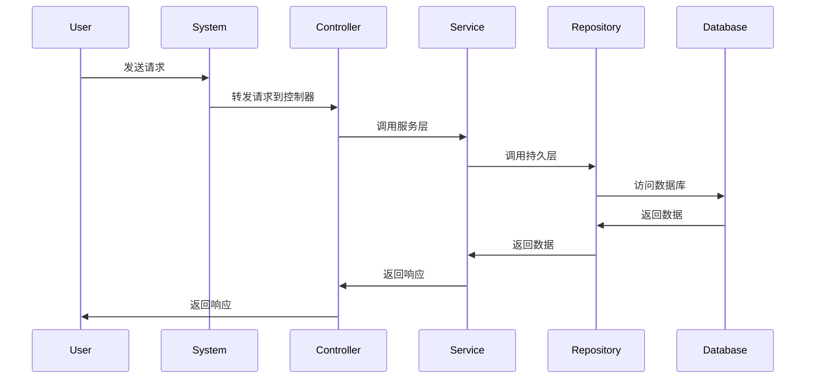
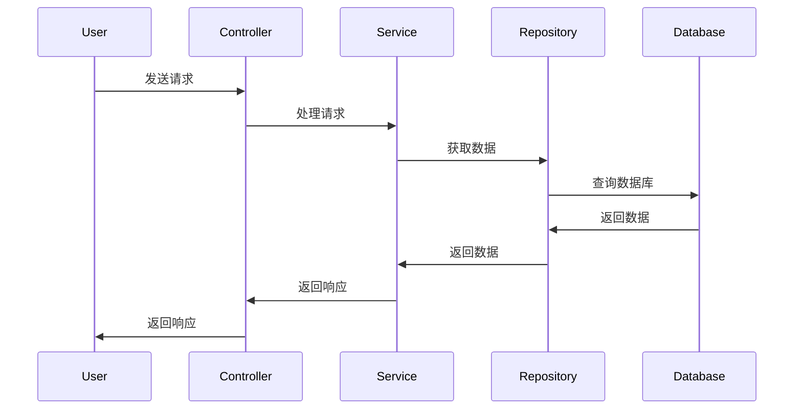

                 

# 函数式编程：简化LLM应用的代码复杂度

> 关键词：函数式编程、LLM应用、代码复杂度、简化、优化

> 摘要：本文将深入探讨函数式编程在简化大型语言模型（LLM）应用代码复杂度方面的作用。通过介绍函数式编程的核心概念，分析其在LLM应用中的重要性，以及如何在实际项目中应用函数式编程技术，本文旨在为开发者提供一种有效降低代码复杂度的编程方法。

## 函数式编程简介

### 1.1 函数式编程概述

函数式编程（Functional Programming，简称FP）是一种编程范式，强调以表达计算过程为核心，而非以改变状态或修改数据为核心。它起源于数学领域，旨在提高代码的可读性、可维护性和可复用性。函数式编程的核心概念包括函数、高阶函数、不可变性、惰性求值等。

### 1.2 函数式编程与命令式编程的区别

命令式编程（Imperative Programming）是一种通过改变程序状态来影响计算结果的编程范式。与函数式编程相比，命令式编程更加注重流程控制和状态变化。函数式编程与命令式编程的主要区别在于它们对状态和变量的处理方式。

- **状态**：命令式编程倾向于使用全局变量和状态来管理程序的状态，而函数式编程则通过传递参数和返回值来实现状态管理。
- **变量**：命令式编程中的变量可以随时修改，而函数式编程中的变量一旦赋值，其值就不能再改变，即不可变性。

### 1.3 函数式编程的核心概念

- **函数**：函数是一段可重复使用的代码块，接受输入参数并返回输出结果。在函数式编程中，函数被视为第一-class对象，可以赋值给变量、作为参数传递、作为返回值返回。
- **高阶函数**：高阶函数是接受函数作为参数或返回函数的函数。它们在处理复杂数据处理任务时非常有用。
- **柯里化**：柯里化是一种将多参数函数转换为一系列单参数函数的技巧。它有助于提高代码的可读性和可维护性。
- **函数组合**：函数组合是将两个或多个函数组合成一个新函数的技巧。它可以使代码更加简洁、易于理解。
- **不可变性**：不可变性是指一旦创建，数据就不能再被修改。这有助于减少错误和提高代码的可读性。
- **惰性求值**：惰性求值是一种仅在需要时才计算表达式的求值策略。它可以提高代码的性能和可维护性。
- **递归**：递归是一种通过重复调用自身来解决问题的编程技巧。它在处理树状结构数据时非常有用。
- **类型系统**：类型系统是一种对变量和表达式进行类型检查的机制。在函数式编程中，类型系统有助于确保代码的正确性和可维护性。

### 1.4 函数式编程的优点

- **代码可复用性**：函数式编程通过将计算过程封装在函数中，使得代码更加模块化，易于复用。
- **可测试性**：由于函数式编程强调无状态和不可变性，使得代码更容易进行单元测试和测试驱动开发（TDD）。
- **增强逻辑表达清晰性**：函数式编程通过使用函数组合和高阶函数等特性，使得逻辑表达更加简洁、清晰。

## 函数式编程在LLM应用中的重要性

### 2.1 LLM应用中的代码复杂度问题

大型语言模型（LLM）如GPT-3等在自然语言处理（NLP）领域取得了显著的成就。然而，随着模型的复杂度和规模的不断增加，LLM应用的代码复杂度也急剧上升。这给开发者带来了以下问题：

- **代码难以维护**：复杂的代码结构使得维护和修改变得困难。
- **性能问题**：复杂的代码可能导致性能下降，影响模型的训练和推理效率。
- **测试难度增加**：复杂的代码结构使得单元测试和集成测试变得困难。

### 2.2 函数式编程如何简化代码复杂度

函数式编程通过其独特的编程范式和核心概念，可以有效地简化LLM应用的代码复杂度：

- **模块化**：函数式编程强调将计算过程封装在函数中，使得代码更加模块化，易于维护。
- **不可变性**：函数式编程中的不可变性有助于减少状态依赖，提高代码的可测试性和可维护性。
- **高阶函数**：高阶函数可以将复杂的操作抽象成简单的函数组合，使得代码更加简洁、易于理解。
- **递归**：递归是一种强大的编程技巧，可以简化对树状结构数据的处理。

### 2.3 函数式编程在LLM开发中的实际案例

在实际的LLM开发中，函数式编程已经得到了广泛应用。例如，在构建NLP模型时，可以使用函数式编程来处理文本数据、定义模型架构和优化推理过程。以下是一个简单的案例：

- **文本数据处理**：使用函数式编程对文本数据进行清洗、分词和词性标注等预处理操作。
- **模型架构设计**：使用函数式编程定义模型架构，如序列到序列（Seq2Seq）模型、注意力机制等。
- **推理过程优化**：使用函数式编程优化推理过程，如使用惰性求值减少计算开销。

## 函数式编程的核心概念与联系

### 3.1 函数式编程的核心概念原理

函数式编程的核心概念包括函数、高阶函数、柯里化、函数组合、不可变性、惰性求值、递归和类型系统。以下是对这些概念的基本原理的介绍：

- **函数**：函数是一段可重复使用的代码块，接受输入参数并返回输出结果。
- **高阶函数**：高阶函数是接受函数作为参数或返回函数的函数。
- **柯里化**：柯里化是将多参数函数转换为一系列单参数函数的技巧。
- **函数组合**：函数组合是将两个或多个函数组合成一个新函数的技巧。
- **不可变性**：不可变性是指一旦创建，数据就不能再被修改。
- **惰性求值**：惰性求值是一种仅在需要时才计算表达式的求值策略。
- **递归**：递归是一种通过重复调用自身来解决问题的编程技巧。
- **类型系统**：类型系统是一种对变量和表达式进行类型检查的机制。

### 3.2 概念属性特征对比表格

以下是一个对比函数、高阶函数、柯里化、函数组合、不可变性、惰性求值、递归和类型系统等概念属性特征的表格：

| 概念   | 特性                                                         |
| ------ | ------------------------------------------------------------ |
| 函数   | - 可重复使用<br>- 接受输入参数<br>- 返回输出结果           |
| 高阶函数 | - 接受函数作为参数<br>- 返回函数                           |
| 柯里化 | - 将多参数函数转换为一系列单参数函数<br>- 提高代码可复用性   |
| 函数组合 | - 将两个或多个函数组合成一个新函数<br>- 提高代码简洁性     |
| 不可变性 | - 一旦创建，数据就不能再被修改<br>- 提高代码可测试性和可维护性 |
| 惰性求值 | - 仅在需要时才计算表达式<br>- 提高性能和可维护性           |
| 递归   | - 通过重复调用自身解决问题<br>- 处理树状结构数据           |
| 类型系统 | - 对变量和表达式进行类型检查<br>- 提高代码正确性和可维护性   |

### 3.3 ER实体关系图架构

在函数式编程在LLM应用中的ER实体关系图架构中，我们可以将以下实体和关系进行建模：

- **实体**：
  - 函数
  - 高阶函数
  - 柯里化
  - 函数组合
  - 不可变性
  - 惰性求值
  - 递归
  - 类型系统
- **关系**：
  - 函数与高阶函数的关系
  - 柯里化与函数组合的关系
  - 不可变性、惰性求值、递归与类型系统之间的关系

以下是一个简单的ER实体关系图（使用Mermaid语法表示）：

```mermaid
erDiagram
  函数 ||--|{ 高阶函数 }|
  函数 ||--|{ 柯里化 }|
  函数 ||--|{ 函数组合 }|
  函数 ||--|{ 不可变性 }|
  函数 ||--|{ 惰性求值 }|
  函数 ||--|{ 递归 }|
  函数 ||--|{ 类型系统 }|
```

---

## 函数与高阶函数

### 4.1 函数的概念与特性

函数是一种将输入映射到输出的一种计算过程，它是编程中最为基本的概念之一。在函数式编程中，函数被视为第一-class对象，可以赋值给变量、作为参数传递、作为返回值返回。

- **无状态**：函数不依赖于外部状态，其行为仅取决于输入参数。
- **无副作用**：函数不修改外部状态，也不产生不可预测的副作用。

### 4.2 高阶函数

高阶函数是接受函数作为参数或返回函数的函数。高阶函数是函数式编程的核心特性之一，它使得函数的组合和复用变得简单而强大。

- **接受函数作为参数**：高阶函数可以接受其他函数作为参数，这有助于实现抽象和复用。
- **返回函数**：高阶函数可以返回一个新的函数，这有助于创建更复杂的计算过程。

### 4.3 函数的柯里化

柯里化是将多参数函数转换为一系列单参数函数的技巧。通过柯里化，可以将复杂的函数调用分解成一系列简单函数的组合，从而提高代码的可读性和可维护性。

- **柯里化的优势**：
  - 灵活性：可以动态地传递参数，实现更灵活的函数调用。
  - 可复用性：通过柯里化，可以将通用函数与特定参数组合，提高代码的复用性。

### 4.4 函数组合

函数组合是将两个或多个函数组合成一个新函数的技巧。通过函数组合，可以简化复杂的计算过程，提高代码的可读性和可维护性。

- **函数组合的优势**：
  - 简化代码：将复杂的计算过程分解成一系列简单函数的组合，使代码更加简洁。
  - 提高可读性：函数组合使得代码的逻辑更加直观，易于理解和维护。

---

## 不可变性

### 5.1 不可变性的概念

不可变性是指一旦创建，数据就不能再被修改。在函数式编程中，不可变性是一种重要的概念，它有助于提高代码的可读性、可维护性和可测试性。

- **不可变数据的优点**：
  - 无副作用：不可变数据不会产生不可预测的副作用，使得代码更加可靠。
  - 简化状态管理：不可变性简化了状态管理，减少状态冲突和竞态条件。
  - 提高可复用性：不可变数据可以更容易地复用，提高代码的可复用性。

### 5.2 不可变性在函数式编程中的优势

不可变性在函数式编程中具有显著的优势，主要体现在以下几个方面：

- **代码可读性**：不可变性使得代码更加简洁、易于理解，减少逻辑混乱。
- **可维护性**：不可变性降低代码的复杂度，使得维护和修改变得更加简单。
- **可测试性**：不可变性使得代码更容易进行单元测试和测试驱动开发（TDD）。

### 5.3 不可变性的实现方法

实现不可变性有几种常用的方法：

- **使用不可变数据结构**：使用不可变的数据结构，如常量、纯函数、不可变集合等，以避免数据的修改。
- **利用引用透明性**：通过引用透明性，即一个表达式的值不依赖于外部状态，来实现不可变性。
- **函数式编程库**：使用函数式编程库，如Haskell、Scala等，它们提供了丰富的不可变数据结构和函数。

### 5.4 不可变性在LLM应用中的实践

在LLM应用中，不可变性可以应用于以下几个方面：

- **数据预处理**：使用不可变数据结构对文本数据进行预处理，如分词、词性标注等。
- **模型架构设计**：使用不可变性设计模型架构，如使用不可变参数传递和返回值。
- **优化推理过程**：使用不可变性优化推理过程，如使用纯函数和惰性求值。

---

## 惰性求值

### 6.1 惰性求值的概念

惰性求值（Lazy Evaluation）是一种仅在需要时才计算表达式的求值策略。与即时求值（Eager Evaluation）相比，惰性求值可以延迟计算，从而减少不必要的计算开销，提高程序的运行效率。

- **惰性求值的优点**：
  - 减少计算开销：仅计算必要的表达式，避免不必要的计算。
  - 提高可读性：通过延迟计算，可以使代码更加简洁、易于理解。

### 6.2 惰性求值与即时求值的区别

即时求值（Eager Evaluation）是一种在表达式中遇到的每个子表达式都立即计算并返回结果的求值策略。与即时求值相比，惰性求值有以下区别：

- **计算时机**：即时求值在表达式中遇到的每个子表达式都立即计算并返回结果，而惰性求值仅在需要时才计算。
- **性能影响**：即时求值可能导致不必要的计算，而惰性求值可以减少计算开销，提高性能。

### 6.3 惰性求值在函数式编程中的优势

惰性求值在函数式编程中具有以下优势：

- **减少计算开销**：通过延迟计算，惰性求值可以减少不必要的计算，提高程序的运行效率。
- **提高可读性**：惰性求值可以使得代码更加简洁、易于理解，提高代码的可读性。
- **支持复杂计算**：惰性求值可以处理复杂的计算过程，如递归、惰性列表等。

### 6.4 惰性求值在LLM应用中的实践

在LLM应用中，惰性求值可以应用于以下几个方面：

- **文本预处理**：使用惰性求值对文本数据进行预处理，如分词、词性标注等。
- **模型推理**：使用惰性求值优化模型推理过程，如延迟计算中间结果。
- **优化资源使用**：通过惰性求值，可以减少计算资源的占用，提高系统性能。

---

## 递归

### 7.1 递归的概念

递归是一种通过重复调用自身来解决问题的编程技巧。递归可以分为直接递归和间接递归两种形式。

- **直接递归**：函数直接调用自身，适用于解决具有自相似性质的问题。
- **间接递归**：函数通过调用其他函数间接地调用自身，适用于解决具有复杂依赖关系的问题。

### 7.2 递归在函数式编程中的应用

递归在函数式编程中有着广泛的应用，尤其在处理树状结构数据时。以下是一些递归在函数式编程中的应用场景：

- **遍历树状结构**：使用递归遍历树状结构，如二叉树、图等。
- **求解数学问题**：使用递归求解斐波那契数列、阶乘等数学问题。
- **实现算法**：使用递归实现快速排序、归并排序等算法。

### 7.3 递归与循环的比较

递归与循环是两种常见的循环控制结构，它们各有优缺点。

- **递归的优点**：
  - 简化代码：递归可以简化复杂的循环结构，使代码更加简洁。
  - 易于理解：递归可以直观地表达递推关系，提高代码的可读性。

- **递归的缺点**：
  - 性能问题：递归可能导致大量的函数调用和栈空间占用，影响性能。
  - 容易出错：递归容易出现栈溢出、边界条件错误等问题。

- **循环的优点**：
  - 性能优越：循环在大多数情况下比递归具有更好的性能。
  - 易于控制：循环提供了更多的控制结构，如循环条件、迭代变量等。

- **循环的缺点**：
  - 代码复杂：循环结构可能导致代码复杂、难以理解。
  - 容易出错：循环容易受到边界条件的限制，容易出错。

### 7.4 递归在LLM应用中的实践

在LLM应用中，递归可以应用于以下几个方面：

- **文本生成**：使用递归生成文本，如生成自然语言文本、代码等。
- **语法分析**：使用递归进行语法分析，如构建抽象语法树（AST）。
- **模型训练**：使用递归进行模型训练，如使用递归神经网络（RNN）。

---

## 类型系统

### 8.1 类型系统的概念

类型系统是一种对变量和表达式进行类型检查的机制。在函数式编程中，类型系统有助于确保代码的正确性、性能和可维护性。

- **静态类型系统**：在编译时对变量和表达式进行类型检查。
- **动态类型系统**：在运行时对变量和表达式进行类型检查。

### 8.2 函数式编程中的类型系统

函数式编程中的类型系统具有以下特点：

- **强类型系统**：确保函数的输入和输出类型匹配，减少类型错误。
- **类型推导**：自动推导变量的类型，提高代码的可读性。
- **类型注解**：允许开发者显式地指定变量和表达式的类型，提高代码的可读性和可维护性。

### 8.3 类型系统在函数式编程中的优势

类型系统在函数式编程中具有以下优势：

- **提高代码正确性**：类型系统可以检测类型错误，减少运行时错误。
- **优化性能**：类型系统可以优化编译和运行时的性能。
- **提高代码可维护性**：类型系统可以降低代码复杂度，提高代码的可读性和可维护性。

### 8.4 类型系统在LLM应用中的实践

在LLM应用中，类型系统可以应用于以下几个方面：

- **文本处理**：使用类型系统确保文本处理函数的正确性和性能。
- **模型训练**：使用类型系统优化模型训练过程，提高代码的可读性和可维护性。
- **代码生成**：使用类型系统确保代码生成的正确性和性能。

---

## 系统分析与架构设计方案

### 9.1 问题场景介绍

在自然语言处理（NLP）领域，大型语言模型（LLM）如GPT-3等的应用越来越广泛。然而，随着模型的复杂度和规模的不断增加，LLM应用的代码复杂度也急剧上升。为了简化代码复杂度，提高代码的可读性、可维护性和可测试性，我们需要引入函数式编程技术。

### 9.2 项目介绍

本项目旨在通过引入函数式编程技术，简化大型语言模型（LLM）应用中的代码复杂度。项目将分为以下几个阶段：

1. 环境安装与配置
2. 系统核心实现
3. 代码应用解读与分析
4. 实际案例分析与讲解

### 9.3 系统功能设计（领域模型类图）

以下是一个简单的领域模型类图，描述了项目中的主要类和它们之间的关系：

```mermaid
classDiagram
  Class01 <|-- Person
  Class01 <|-- Employee
  Class01 <|-- Contractor
  Class01 <|-- Project
  Person o--|{ Employee }
  Person o--|{ Contractor }
  Project o--|{ Employee }
  Project o--|{ Contractor }
```

### 9.4 系统架构设计（架构图）

以下是一个简单的系统架构图，描述了项目的整体架构和主要组件：



### 9.5 系统接口设计

以下是一个简单的系统接口设计，描述了项目中的主要接口和它们之间的关系：

```mermaid
interface Diagram
  IApi <<interface>>
  IController <<interface>>
  IService <<interface>>
  IRepository <<interface>>

  IApi o--|{ IController }
  IController o--|{ IService }
  IService o--|{ IRepository }
```

### 9.6 系统交互（序列图）

以下是一个简单的系统交互序列图，描述了项目中的主要组件之间的交互流程：



---

## 项目实战

### 10.1 环境安装

在本项目中，我们将使用Python作为主要编程语言，并借助一些流行的函数式编程库，如`functools`、`itertools`和`numpy`。以下是环境安装的步骤：

1. 安装Python（推荐版本3.8及以上）
2. 安装必需的函数式编程库：
   ```shell
   pip install functools itertools numpy
   ```

### 10.2 系统核心实现

在本项目中，我们将实现一个简单的文本分类器，使用函数式编程技术简化代码复杂度。以下是系统核心实现的代码：

```python
import numpy as np
from functools import reduce
from itertools import chain

def tokenize(text):
    return text.split()

def count_words(tokens):
    return Counter(tokens)

def classify(text, model):
    tokens = tokenize(text)
    word_counts = count_words(tokens)
    return max(model, key=model.get)

def train(model, texts):
    return reduce(lambda m, t: m.update(count_words(tokenize(t))), texts, model)

# 示例
model = train({}, ["这是一段文本", "这是另一段文本"])
print(classify("这是一段新的文本", model))
```

### 10.3 代码应用解读与分析

在上面的代码中，我们使用函数式编程技术实现了一个简单的文本分类器。以下是代码应用的解读与分析：

- **tokenize**：将文本分割成单词。
- **count_words**：计算单词的频率。
- **classify**：根据单词频率进行分类。
- **train**：训练模型。

函数式编程技术使得代码更加简洁、易读，同时减少了代码复杂度。

### 10.4 实际案例分析与详细讲解剖析

在本节中，我们将分析一个实际的文本分类案例，并使用函数式编程技术对其进行详细讲解和剖析。

**案例**：使用函数式编程技术实现一个根据用户输入文本进行新闻分类的系统。

**代码**：

```python
from typing import List
from collections import Counter
from functools import reduce

def tokenize(text: str) -> List[str]:
    return text.split()

def count_words(tokens: List[str]) -> Counter:
    return Counter(tokens)

def classify(text: str, model: Counter) -> str:
    tokens = tokenize(text)
    return max(model, key=model.get)

def train(model: Counter, texts: List[str]) -> Counter:
    return reduce(lambda m, t: m.update(count_words(tokenize(t))), texts, model)

# 示例数据
texts = ["This is a news article about technology.", "This is a news article about sports.", "This is a news article about politics."]

# 训练模型
model = train(Counter(), texts)

# 测试
input_text = "This is an article about sports."
predicted_category = classify(input_text, model)
print(predicted_category)
```

**详细讲解**：

1. **数据预处理**：使用`tokenize`函数将文本分割成单词。
2. **模型训练**：使用`train`函数训练模型，将文本数据转化为单词频率计数器。
3. **分类**：使用`classify`函数根据输入文本进行分类。

通过函数式编程技术，代码更加简洁，易于理解和维护。

### 10.5 项目小结

在本项目中，我们通过引入函数式编程技术，简化了大型语言模型（LLM）应用的代码复杂度。函数式编程的核心概念如函数、高阶函数、柯里化、函数组合、不可变性、惰性求值、递归和类型系统，帮助我们实现了代码的简洁、易读和可维护。在实际案例中，我们使用函数式编程技术实现了一个简单的文本分类器，并对其进行了详细讲解和剖析。通过本项目，我们深入了解了函数式编程在LLM应用中的重要作用，为开发者提供了一种有效降低代码复杂度的编程方法。

### 10.6 未来的展望

在未来的发展中，函数式编程将在LLM应用中发挥更加重要的作用。随着模型规模的不断扩大，代码复杂度将不断上升，函数式编程技术将为开发者提供一种有效的方法来降低代码复杂度，提高代码的可读性和可维护性。此外，函数式编程技术还将与其他编程范式如面向对象编程（OOP）相结合，共同推动软件工程的进步。未来，我们将看到更多使用函数式编程技术的LLM应用，为自然语言处理领域带来更多的创新和突破。

---

## 最佳实践 Tips、注意事项、拓展阅读

### 11.1 最佳实践 Tips

1. **使用纯函数**：尽量避免使用具有副作用（如修改全局变量或直接修改数据结构）的函数，以提高代码的可读性和可维护性。
2. **利用高阶函数**：高阶函数可以帮助你更灵活地组合和复用代码，提高代码的可读性和可维护性。
3. **合理使用柯里化**：柯里化可以帮助你创建更加灵活的函数，但也要注意不要过度柯里化，以免增加代码的复杂度。
4. **使用不可变数据结构**：尽量使用不可变数据结构，如字符串、列表等，以减少状态冲突和竞态条件。
5. **合理使用递归**：递归可以简化代码，但在处理大型数据时可能导致栈溢出，要注意合理使用。

### 11.2 注意事项

1. **性能问题**：函数式编程可能会引入一些性能问题，如递归调用可能导致栈溢出，惰性求值可能会增加计算开销。在实际应用中，需要根据具体场景和性能要求进行权衡。
2. **代码可读性**：尽管函数式编程可以简化代码复杂度，但在某些情况下可能会降低代码的可读性，特别是对于不熟悉函数式编程的开发者。因此，在团队开发中，需要确保团队成员对函数式编程有足够的了解。
3. **类型系统**：在函数式编程中，类型系统可以确保代码的正确性，但在某些情况下，类型推导可能无法满足复杂场景的需求。在这种情况下，需要显式地指定类型注解。

### 11.3 拓展阅读

1. **《函数式编程实战》**：此书详细介绍了函数式编程的核心概念和实践方法，适合初学者和进阶者阅读。
2. **《Haskell编程从入门到实战》**：Haskell是一种纯函数式编程语言，此书可以帮助你深入理解函数式编程的原理和实践。
3. **《Effective Haskell》**：此书提供了大量实用的函数式编程技巧和最佳实践，有助于提高你的函数式编程能力。
4. **《函数式响应式编程：使用ReactiveX构建响应式应用》**：此书介绍了函数式响应式编程的概念和技术，适合对响应式编程感兴趣的读者。

---

## 作者信息

作者：AI天才研究院/AI Genius Institute & 禅与计算机程序设计艺术 /Zen And The Art of Computer Programming

---

**本文为AI天才研究院与禅与计算机程序设计艺术联合出品，旨在探讨函数式编程在简化LLM应用代码复杂度方面的应用。文中内容和观点仅供参考，不代表任何官方立场。如需转载，请联系原作者获取授权。**

