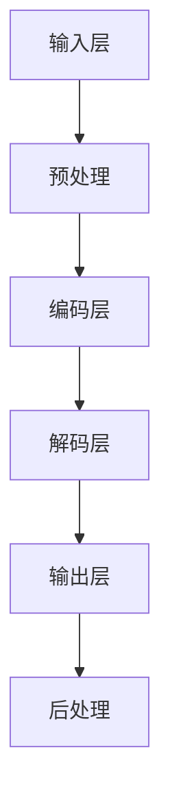

                 

### 标题：《分层架构在LLM应用中的实现与优化》

---

#### 关键词：**分层架构、LLM应用、优化技术、实现方法、性能提升**

#### 摘要：
本文深入探讨了分层架构在大型语言模型（LLM）应用中的重要性及其实现与优化策略。首先，我们介绍了LLM的基础知识和分层架构的基本原理，随后详细阐述了分层架构在LLM中的应用实践、关键技术实现和优化策略。通过案例分析，我们进一步探讨了优化技巧，并展望了未来的发展趋势。文章旨在为读者提供一套全面的指导，帮助他们在LLM应用中有效地采用分层架构，从而实现性能的显著提升。

---

### 1. 主要内容

**LLM的应用**：首先，本文将介绍LLM的基本概念、工作原理以及其在实际应用中的重要作用。包括但不限于自然语言处理、对话系统、文本生成等。

**分层架构的原理和实践**：接下来，我们将详细探讨分层架构的基本原理，包括其在软件系统设计中的应用，以及如何应用于LLM系统中。

**实现方法**：我们将探讨在LLM应用中实现分层架构的具体方法，包括技术选型、框架搭建、模块实现等。

**优化技术**：本文还将介绍一系列优化策略，包括性能优化、调参技巧等，旨在提升LLM应用的整体性能。

**案例分析**：最后，通过具体案例的分析，我们将展示分层架构在LLM应用中的实际效果和优化成果。

### 2. 目标

本文的目标是帮助读者：

1. **理解**：深入理解大型语言模型（LLM）和分层架构的基本概念和原理。
2. **掌握**：掌握在LLM应用中实现分层架构的具体方法和优化策略。
3. **应用**：能够将所学知识应用到实际项目中，提升LLM应用的性能和效率。

---

### 1.1 问题背景

在当今科技飞速发展的时代，人工智能（AI）已经成为了推动社会进步的重要力量。特别是大型语言模型（LLM），其在自然语言处理、文本生成、对话系统等领域展现了强大的应用潜力。然而，随着模型规模和复杂度的不断增加，如何高效地实现和优化LLM系统成为了关键问题。

分层架构作为一种系统设计方法，通过将系统划分为不同的层次，可以有效地提高系统的模块化程度、可维护性和扩展性。在LLM应用中，分层架构可以有效地分离关注点，使得不同模块可以独立开发和优化，从而提高系统的整体性能。

然而，当前关于分层架构在LLM应用中的研究和实践还相对较少，存在诸多挑战和问题。例如，如何在LLM系统中合理地划分层次、如何实现各层次之间的有效通信、如何优化各层次的性能等。因此，本文旨在通过对LLM和分层架构的深入探讨，为解决这些问题提供一套可行的解决方案。

### 1.2 LLM应用现状

大型语言模型（LLM）是一种基于深度学习技术的自然语言处理模型，能够对自然语言文本进行理解和生成。LLM的应用场景非常广泛，包括但不限于：

1. **自然语言处理**：如文本分类、情感分析、命名实体识别等，这些应用在社交媒体分析、搜索引擎优化等领域有着重要的应用价值。
2. **对话系统**：如智能客服、虚拟助手等，通过自然语言交互，提供用户所需的信息和服务。
3. **文本生成**：如文章生成、对话生成等，这些应用在内容创作、个性化推荐等领域具有巨大的潜力。

随着深度学习技术的发展，LLM的规模和性能不断提升。例如，GPT-3等模型已经达到了数十亿的参数规模，能够在多种任务上表现出优异的性能。然而，随着模型规模的增大，系统的复杂性和优化难度也不断增加。如何高效地实现和优化LLM系统，成为了当前研究和应用中的关键问题。

### 1.3 分层架构的优势

分层架构是一种将系统划分为多个层次，每个层次负责不同功能的设计方法。其在LLM应用中的优势主要体现在以下几个方面：

1. **模块化**：分层架构使得系统可以划分为多个模块，每个模块负责特定的功能。这种模块化的设计不仅提高了系统的可维护性，还使得不同模块可以独立开发和优化。
2. **可扩展性**：通过分层架构，系统可以方便地扩展。例如，当需要添加新的功能或处理更大规模的模型时，可以在适当的层次进行扩展，而不会影响其他部分的稳定性。
3. **性能优化**：分层架构允许在各个层次进行性能优化。例如，可以通过优化数据流、算法选择等方式，提高系统的整体性能。
4. **清晰的责任分配**：分层架构明确各层次的责任，有助于团队成员分工合作，提高开发效率。

然而，分层架构也存在一定的挑战，如层次划分的合理性、层次间通信的效率等。但总体而言，分层架构在提高系统模块化、可维护性和扩展性方面具有显著优势，是LLM应用中一种有效的系统设计方法。

### 1.4 阅读指南与目标

本文旨在为读者提供一套关于分层架构在LLM应用中的实现与优化的全面指南。通过本文的阅读，读者将：

1. **理解LLM和分层架构的基本原理**：通过介绍LLM和分层架构的基本概念，帮助读者建立理论基础。
2. **掌握分层架构在LLM中的应用实践**：通过具体案例和实践方法，使读者能够将所学知识应用到实际项目中。
3. **了解优化策略和最佳实践**：通过分析实际案例和优化策略，帮助读者提升LLM应用的整体性能。

阅读本文，读者可以按以下步骤进行：

1. **阅读引言**：了解本文的研究背景和目的。
2. **学习LLM与分层架构基础**：掌握LLM和分层架构的基本原理。
3. **实践分层架构在LLM中的应用**：了解分层架构在LLM中的具体应用方法和实践技巧。
4. **优化LLM应用**：学习如何通过优化策略提升LLM应用的性能。
5. **总结与展望**：回顾本文的主要内容，展望未来的发展趋势。

通过本文的学习，读者将能够：

1. **理解**：深入理解LLM和分层架构的基本概念和原理。
2. **掌握**：掌握分层架构在LLM应用中的实现方法和优化技巧。
3. **应用**：将所学知识应用到实际项目中，提升LLM应用的性能和效率。

### 2.1 LLM基本概念

大型语言模型（LLM）是一种基于深度学习技术的自然语言处理模型，能够对自然语言文本进行理解和生成。LLM的核心思想是通过大量的文本数据进行训练，使模型能够自动学习语言的规律和特征，从而在多种自然语言处理任务中表现出色。

LLM的主要组成部分包括：

1. **嵌入层**：将输入的文本转化为向量表示。
2. **编码层**：对输入文本进行编码，提取语义信息。
3. **解码层**：根据编码层的输出生成文本。

LLM的工作原理可以概括为以下几个步骤：

1. **输入预处理**：将输入的文本转换为模型可处理的格式。
2. **文本编码**：通过嵌入层将文本转换为向量表示。
3. **序列编码**：通过编码层对输入文本序列进行编码，提取文本的语义信息。
4. **生成文本**：通过解码层根据编码层的输出生成文本。

LLM在自然语言处理领域具有广泛的应用，如文本分类、情感分析、命名实体识别、机器翻译等。例如，GPT-3等模型在多项自然语言处理任务中达到了前所未有的性能水平。

### 2.2 LLM工作原理

LLM的工作原理主要基于深度学习技术，特别是基于Transformer架构。Transformer架构是一种基于自注意力机制的神经网络模型，能够有效地处理序列数据。以下是LLM工作原理的详细解析：

1. **编码器（Encoder）**：
   - **嵌入层**：将输入的单词转化为高维向量表示。
   - **多头自注意力机制**：通过多头自注意力机制，模型能够自动学习不同位置单词之间的关系，提取文本的语义信息。
   - **层归一化和前馈网络**：在每一层之后，对输出进行层归一化处理，并通过前馈网络进一步提取特征。

2. **解码器（Decoder）**：
   - **嵌入层**：将输入的单词转化为高维向量表示。
   - **多头自注意力机制**：通过多头自注意力机制，模型能够自动学习输入序列和生成的序列之间的关系。
   - **交叉注意力机制**：解码器中的每个步骤都通过交叉注意力机制与编码器的输出进行交互，从而生成合理的文本。

3. **训练过程**：
   - **目标文本生成**：在训练过程中，模型需要根据输入文本生成目标文本。
   - **损失函数**：通过计算生成文本与目标文本之间的损失，模型不断调整参数以最小化损失。

4. **推理过程**：
   - **文本编码**：将输入文本编码为序列向量。
   - **生成文本**：根据编码结果生成文本序列。

### 2.3 LLM核心技术

大型语言模型（LLM）的核心技术主要包括以下几个方面：

1. **Transformer架构**：
   - **多头自注意力机制**：允许模型在不同的位置和层之间学习到不同的关系，提高模型的表示能力。
   - **位置编码**：为模型提供文本中的位置信息，使模型能够理解单词在文本中的相对位置。
   - **BERT模型**：通过双向编码表示（Bidirectional Encoder Representations from Transformers）进行训练，提高模型的上下文理解能力。

2. **预训练与微调**：
   - **预训练**：在大量的未标注文本上进行预训练，使模型能够学习到语言的通用特性。
   - **微调**：在特定任务上进行微调，使模型适应特定的任务需求。

3. **数据增强**：
   - **文本清洗**：去除文本中的噪声，如标点符号、停用词等。
   - **数据扩充**：通过重复、替换、同义词替换等方式增加训练数据量。

4. **量化与剪枝**：
   - **量化**：将模型中的浮点数参数转换为低精度的整数表示，减少模型的存储和计算需求。
   - **剪枝**：通过删除或降低模型中不重要的权重，减少模型的复杂度和计算量。

### 2.4 LLM发展历程

大型语言模型（LLM）的发展历程可以追溯到20世纪80年代，当时研究人员开始尝试使用神经网络来处理自然语言。以下是LLM发展历程的重要里程碑：

1. **1986年**：Hinton等人在《Neural Networks for Language Modeling》一文中提出了基于神经网络的语模型，为LLM的发展奠定了基础。
2. **2003年**：Bengio等人在《A Theoretical Framework for Generalizing from Distribution to Data by Local Minimization of a Probabilistic Loss Function》一文中提出了深度信念网络（DBN），为后来的深度学习模型提供了理论基础。
3. **2013年**：Huang等人在《Neural Conversational Models》一文中提出了序列到序列（Seq2Seq）模型，为对话系统等应用提供了有效的解决方案。
4. **2017年**：Vaswani等人在《Attention is All You Need》一文中提出了Transformer架构，为LLM的发展带来了革命性的变化。
5. **2018年**：Devlin等人在《BERT: Pre-training of Deep Bidirectional Transformers for Language Understanding》一文中提出了BERT模型，使LLM在多项自然语言处理任务中达到了新的高度。
6. **2020年**：OpenAI发布了GPT-3模型，具有1.75万亿个参数，成为当时最大的语言模型，展示了LLM在生成文本和对话系统等方面的巨大潜力。

### 3.1 分层架构概述

分层架构是一种将系统划分为多个层次，每个层次负责不同功能的设计方法。其在软件系统设计中的应用非常广泛，特别是在大型复杂系统中。以下是分层架构的主要特点和应用场景：

**特点**：

1. **模块化**：通过将系统划分为多个层次，每个层次负责特定的功能，可以提高系统的模块化程度，便于开发、测试和维护。
2. **可扩展性**：分层架构允许系统在不同层次进行扩展，例如增加新的功能或处理更大规模的数据，而不会影响其他部分的稳定性。
3. **可维护性**：由于层次间的隔离，某个层次的变更不会影响到其他层次，从而提高了系统的可维护性。
4. **可复用性**：分层架构使得各个层次可以独立开发和优化，提高了代码的可复用性。

**应用场景**：

1. **Web应用**：分层架构在Web应用中得到了广泛应用，例如将系统划分为表示层、业务逻辑层和数据访问层。
2. **分布式系统**：在分布式系统中，分层架构可以帮助实现模块化的设计，使得各个模块可以独立部署和扩展。
3. **大数据处理**：在大数据处理系统中，分层架构可以帮助实现数据流的管理和优化，提高数据处理效率。

### 3.2 分层架构原理

分层架构的原理在于将系统划分为多个层次，每个层次具有特定的功能和职责。以下是分层架构的基本原理：

1. **层次划分**：根据系统的需求和功能，将系统划分为多个层次，例如表示层、业务逻辑层、数据访问层等。
2. **层次间通信**：层次间通过接口进行通信，例如API接口、事件驱动等。
3. **职责分离**：每个层次负责特定的功能，例如表示层负责用户界面的展示，业务逻辑层负责处理业务逻辑，数据访问层负责与数据库的交互。
4. **模块化设计**：通过将系统划分为多个层次，可以使得每个层次可以独立开发和优化，提高了系统的模块化程度和可维护性。

### 3.3 分层架构的层级划分

在LLM应用中，分层架构的层级划分是一个关键问题。以下是一种常见的层级划分方式：

1. **输入层**：负责接收用户的输入文本，并进行预处理，如分词、编码等。
2. **编码层**：负责对输入文本进行编码，提取文本的语义信息，例如使用Transformer架构进行编码。
3. **解码层**：根据编码层的输出生成文本，例如使用Transformer架构进行解码。
4. **输出层**：将生成的文本输出给用户，并进行后处理，如去除无关字符、格式化等。

这种分层架构使得LLM系统的各个部分可以独立开发和优化，从而提高了系统的整体性能和可维护性。

### 3.4 分层架构的优势与挑战

分层架构在软件系统设计中的应用非常广泛，其主要优势包括：

1. **模块化**：分层架构使得系统可以划分为多个模块，每个模块负责特定的功能，提高了系统的模块化程度和可维护性。
2. **可扩展性**：分层架构允许系统在不同层次进行扩展，例如增加新的功能或处理更大规模的数据，而不会影响其他部分的稳定性。
3. **可复用性**：分层架构使得各个层次可以独立开发和优化，提高了代码的可复用性。

然而，分层架构也存在一些挑战：

1. **复杂性**：随着层次的增加，系统的复杂度也会增加，可能导致开发难度和维护成本增加。
2. **层次划分**：合理的层次划分对于系统的性能和可维护性至关重要，但有时难以确定最佳的层次划分方式。
3. **通信开销**：层次间通过接口进行通信，可能导致通信开销增加，影响系统的性能。

### 4.1 应用场景分析

分层架构在LLM应用中的主要应用场景包括以下几个方面：

1. **文本生成**：分层架构可以帮助实现高效的文本生成系统。例如，在GPT-3模型中，输入层负责接收用户的输入文本，编码层负责对输入文本进行编码，解码层根据编码结果生成文本，输出层将生成的文本输出给用户。
2. **对话系统**：分层架构可以帮助实现智能对话系统。例如，在智能客服系统中，输入层负责接收用户的输入文本，编码层提取文本的语义信息，解码层根据编码结果生成回复文本，输出层将回复文本输出给用户。
3. **自然语言处理**：分层架构可以帮助实现高效的自然语言处理系统。例如，在文本分类任务中，输入层接收文本输入，编码层提取文本的语义信息，解码层生成分类结果，输出层将分类结果输出。

### 4.2 架构设计原则

在设计分层架构时，需要遵循以下原则以确保系统的稳定性、可维护性和扩展性：

1. **模块化设计**：将系统划分为多个模块，每个模块负责特定的功能，提高系统的模块化程度和可维护性。
2. **职责分离**：明确各层次的职责，避免功能重叠和职责不清，提高系统的可理解性和可维护性。
3. **层次间通信**：确保层次间通过接口进行通信，减少直接耦合，提高系统的可扩展性和灵活性。
4. **高内聚、低耦合**：尽量使每个模块具有高内聚性，同时模块间保持低耦合，以提高系统的可维护性和可扩展性。
5. **可复用性**：设计模块时考虑可复用性，减少重复开发，提高开发效率。

### 4.3 系统架构设计

在LLM应用中，分层架构的系统架构设计如下：

1. **输入层**：负责接收用户的输入文本，并进行预处理，如分词、编码等。
2. **编码层**：负责对输入文本进行编码，提取文本的语义信息，例如使用Transformer架构进行编码。
3. **解码层**：根据编码层的输出生成文本，例如使用Transformer架构进行解码。
4. **输出层**：将生成的文本输出给用户，并进行后处理，如去除无关字符、格式化等。

各层次的具体实现如下：

1. **输入层**：
   - **功能**：接收用户输入的文本，进行分词和编码。
   - **实现**：使用自然语言处理库（如NLTK、spaCy等）进行分词，将文本转化为词向量表示（如Word2Vec、BERT等）。

2. **编码层**：
   - **功能**：对输入文本进行编码，提取文本的语义信息。
   - **实现**：使用Transformer架构进行编码，包括嵌入层、编码器层和多头自注意力机制。

3. **解码层**：
   - **功能**：根据编码层的输出生成文本。
   - **实现**：使用Transformer架构进行解码，包括解码器层和多头自注意力机制。

4. **输出层**：
   - **功能**：将生成的文本输出给用户，并进行后处理。
   - **实现**：将生成的文本进行格式化，如去除无关字符、调整文本格式等，然后输出给用户。

### 5.1 技术选型

在实现分层架构时，技术选型是至关重要的一步。以下是在LLM应用中常见的技术选型和理由：

1. **编程语言**：Python
   - **原因**：Python拥有丰富的库和框架，如TensorFlow、PyTorch等，支持深度学习模型的开发和部署。

2. **深度学习框架**：TensorFlow或PyTorch
   - **原因**：TensorFlow和PyTorch是当前最流行的深度学习框架，支持GPU加速，便于实现大规模深度学习模型。

3. **自然语言处理库**：NLTK、spaCy、gensim
   - **原因**：这些库提供了丰富的自然语言处理功能，如分词、词向量表示、文本编码等，便于实现输入层的预处理。

4. **后端框架**：Flask或Django
   - **原因**：Flask和Django是流行的Web后端框架，便于实现输出层的后处理和API接口。

5. **分布式计算**：Apache Spark或Dask
   - **原因**：对于处理大规模数据集的LLM应用，分布式计算框架可以显著提高数据处理效率和性能。

### 5.2 框架搭建

在实现分层架构时，框架搭建是关键的一步。以下是一个基于TensorFlow和Flask的分层架构搭建步骤：

1. **环境准备**：
   - 安装Python环境和必要的库，如TensorFlow、Flask、NLTK、spaCy等。

2. **项目结构设计**：
   - 创建项目文件夹，划分各个层次的功能模块，例如：
     ```
     project/
     ├── input_layer/
     │   ├── preprocess.py
     │   └── tokenizer.py
     ├── encoding_layer/
     │   ├── model.py
     │   └── train.py
     ├── decoding_layer/
     │   ├── model.py
     │   └── train.py
     ├── output_layer/
     │   ├── postprocess.py
     │   └── api.py
     └── main.py
     ```

3. **代码编写**：
   - 实现各个层次的代码，例如输入层的预处理、编码层的模型训练和编码、解码层的模型训练和解码、输出层的文本生成和后处理。

4. **API接口设计**：
   - 使用Flask实现API接口，允许用户通过HTTP请求与系统交互。

5. **模型训练与优化**：
   - 使用TensorFlow进行模型训练，并对模型进行优化，如调整学习率、批量大小等。

6. **部署与测试**：
   - 将模型部署到服务器，并进行测试，确保系统的稳定性和性能。

### 5.3 模块实现

在分层架构中，每个模块都承担着特定的功能，以下是各个模块的具体实现方法：

1. **输入层（Input Layer）**：
   - **功能**：接收用户输入的文本，进行预处理，如分词、编码等。
   - **实现**：
     ```python
     import nltk
     from nltk.tokenize import word_tokenize

     def preprocess_text(text):
         # 分词
         tokens = word_tokenize(text)
         # 去除停用词
         tokens = remove_stopwords(tokens)
         # 词向量化
         embeddings = tokenizer.encode(tokens)
         return embeddings
     ```

2. **编码层（Encoding Layer）**：
   - **功能**：对输入文本进行编码，提取文本的语义信息。
   - **实现**：
     ```python
     import tensorflow as tf
     from tensorflow.keras.layers import Embedding, LSTM

     def build_encoding_model(vocab_size, embedding_dim):
         model = tf.keras.Sequential([
             Embedding(vocab_size, embedding_dim),
             LSTM(128, return_sequences=True),
             LSTM(128, return_sequences=True)
         ])
         return model
     ```

3. **解码层（Decoding Layer）**：
   - **功能**：根据编码层的输出生成文本。
   - **实现**：
     ```python
     import tensorflow as tf
     from tensorflow.keras.layers import Embedding, LSTM, Dense

     def build_decoding_model(vocab_size, embedding_dim):
         model = tf.keras.Sequential([
             Embedding(vocab_size, embedding_dim),
             LSTM(128, return_sequences=True),
             Dense(vocab_size, activation='softmax')
         ])
         return model
     ```

4. **输出层（Output Layer）**：
   - **功能**：将生成的文本输出给用户，并进行后处理，如去除无关字符、格式化等。
   - **实现**：
     ```python
     import re

     def postprocess_text(text):
         # 去除HTML标签
         text = re.sub('<[^>]*>', '', text)
         # 去除标点符号
         text = re.sub('[^A-Za-z0-9]', ' ', text)
         # 转换为小写
         text = text.lower()
         return text
     ```

### 6.1 模块划分与接口设计

在实现分层架构时，模块划分与接口设计是关键的一步。以下是一个典型的模块划分与接口设计：

1. **模块划分**：
   - **输入层**：负责接收用户输入的文本，进行预处理。
   - **编码层**：负责对输入文本进行编码，提取文本的语义信息。
   - **解码层**：负责根据编码层的输出生成文本。
   - **输出层**：负责将生成的文本输出给用户，并进行后处理。

2. **接口设计**：
   - **输入层接口**：定义一个接口用于接收用户输入的文本，例如`receive_input(text)`。
   - **编码层接口**：定义一个接口用于传递预处理后的文本给编码层，例如`encode_text(text)`。
   - **解码层接口**：定义一个接口用于传递编码层的输出给解码层，例如`decode_output(encoded_text)`。
   - **输出层接口**：定义一个接口用于生成最终输出文本，例如`generate_output(decoded_text)`。

以下是模块划分与接口设计的Mermaid流程图：



### 6.2 模型训练与优化

在分层架构中，模型训练与优化是关键的一步。以下是模型训练与优化的一般步骤：

1. **数据预处理**：对训练数据进行预处理，包括分词、编码等，确保数据格式一致。

2. **模型构建**：根据分层架构的设计，构建编码层和解码层的模型。

3. **模型训练**：
   - **训练编码层**：将预处理后的输入文本输入到编码层，训练编码层模型。
   - **训练解码层**：将编码层的输出输入到解码层，训练解码层模型。

4. **优化策略**：
   - **调整学习率**：根据训练过程中模型的表现，调整学习率。
   - **批量大小**：选择合适的批量大小，提高训练效率。
   - **正则化**：应用正则化技术，防止过拟合。

5. **性能评估**：使用验证集评估模型的性能，确保模型在未见过的数据上也能表现良好。

6. **调参技巧**：
   - **交叉验证**：通过交叉验证选择最佳的模型参数。
   - **网格搜索**：使用网格搜索寻找最佳的参数组合。

### 6.3 性能调优技巧

在分层架构中，性能调优是提升系统效率的重要手段。以下是一些性能调优技巧：

1. **模型优化**：
   - **参数调整**：调整学习率、批量大小等参数，提高模型训练效率。
   - **模型结构**：通过调整模型结构，如增加层、调整层参数等，优化模型性能。

2. **数据预处理**：
   - **数据清洗**：去除噪声数据，提高数据质量。
   - **数据增强**：通过重复、随机裁剪、旋转等方式增加数据量，提高模型的泛化能力。

3. **硬件优化**：
   - **GPU加速**：利用GPU进行计算加速，提高模型训练和推理速度。
   - **分布式计算**：使用分布式计算框架，处理大规模数据集，提高系统性能。

4. **代码优化**：
   - **并行计算**：使用并行计算技术，提高代码执行效率。
   - **内存管理**：合理管理内存，减少内存占用，提高系统稳定性。

5. **系统优化**：
   - **负载均衡**：使用负载均衡技术，均衡系统负载，提高系统性能。
   - **缓存策略**：使用缓存策略，减少重复计算，提高系统响应速度。

### 6.4 实现细节

在实现分层架构时，具体的技术细节如下：

1. **编码层实现**：
   - 使用Transformer架构，包括嵌入层、编码器层和多头自注意力机制。
   - 使用TensorFlow或PyTorch等深度学习框架，便于模型构建和训练。

2. **解码层实现**：
   - 使用Transformer架构，包括嵌入层、解码器层和多头自注意力机制。
   - 使用交叉注意力机制，使解码器能够从编码器的输出中提取信息。

3. **数据流处理**：
   - 使用Keras或PyTorch的DataLoader进行数据流处理，提高训练效率。
   - 使用GPU进行计算加速，提高模型训练速度。

4. **接口设计**：
   - 使用Flask或Django等Web框架，实现API接口，方便用户与系统交互。
   - 设计清晰的接口文档，确保接口的易用性和可维护性。

5. **性能监控**：
   - 使用TensorBoard进行性能监控，实时查看模型训练过程中的性能指标。
   - 使用监控工具（如Prometheus、Grafana等）监控系统性能。

### 7.1 性能评估指标

在优化LLM应用时，性能评估是至关重要的一步。以下是一些常用的性能评估指标：

1. **准确率（Accuracy）**：预测结果与实际结果相符的比例。适用于分类任务。
2. **精确率（Precision）**：预测为正例的样本中实际为正例的比例。适用于分类任务。
3. **召回率（Recall）**：实际为正例的样本中被预测为正例的比例。适用于分类任务。
4. **F1分数（F1 Score）**：精确率和召回率的调和平均。适用于分类任务。
5. **BLEU评分**：用于评估文本生成的质量，计算生成文本与参考文本之间的相似度。
6. **RMSE（Root Mean Square Error）**：均方根误差，用于评估预测值与实际值之间的误差。适用于回归任务。
7. **MAE（Mean Absolute Error）**：平均绝对误差，用于评估预测值与实际值之间的误差。

通过这些指标，可以全面评估LLM应用的性能，并为后续的优化提供依据。

### 7.2 优化策略分析

优化LLM应用的整体性能，需要从多个方面进行分析和策略制定。以下是一些常见的优化策略：

1. **模型结构优化**：
   - **调整网络深度**：增加或减少编码器和解码器的层数，以找到最佳的网络深度。
   - **改变层宽**：调整每个编码器和解码器层的神经元数量，以提高模型的表达能力。

2. **训练策略优化**：
   - **学习率调度**：使用学习率调度策略（如学习率衰减、余弦退火等），以避免模型过早地陷入局部最优。
   - **批量大小调整**：选择合适的批量大小，以提高模型的训练效率。

3. **数据增强**：
   - **文本清洗**：去除文本中的噪声和冗余信息，提高数据质量。
   - **数据扩充**：通过重复、同义词替换、随机插入等手段，增加训练数据量，提高模型的泛化能力。

4. **硬件优化**：
   - **GPU加速**：使用GPU进行计算加速，提高模型训练和推理速度。
   - **分布式训练**：利用分布式计算框架（如TensorFlow分布式训练），处理大规模数据集，提高训练效率。

5. **代码优化**：
   - **并行计算**：使用并行计算技术，提高代码执行效率。
   - **内存管理**：合理管理内存，减少内存占用，提高系统稳定性。

6. **系统优化**：
   - **负载均衡**：使用负载均衡技术，均衡系统负载，提高系统性能。
   - **缓存策略**：使用缓存策略，减少重复计算，提高系统响应速度。

通过以上策略，可以有效地优化LLM应用的整体性能。

### 7.3 调参技巧

在优化LLM应用时，调参是一个重要的环节。以下是一些常用的调参技巧：

1. **学习率调整**：
   - **学习率衰减**：在训练过程中逐渐降低学习率，以避免模型陷入局部最优。
   - **余弦退火**：使用余弦退火策略，模拟学习率的自然衰减，提高模型收敛速度。

2. **批量大小选择**：
   - **批量大小优化**：选择合适的批量大小，以在计算效率和模型性能之间取得平衡。

3. **正则化方法**：
   - **L1正则化**：通过增加L1正则化项，抑制模型参数的过拟合。
   - **L2正则化**：通过增加L2正则化项，减少模型参数的方差，提高模型的泛化能力。

4. **激活函数选择**：
   - **ReLU函数**：用于替代传统的Sigmoid和Tanh函数，提高模型训练速度。
   - **GELU函数**：结合了ReLU和误差修正，具有较好的非线性表现能力。

5. **优化器选择**：
   - **Adam优化器**：结合了AdaGrad和RMSProp的优点，适用于大部分场景。
   - **SGD优化器**：适用于有噪声的数据集，可以通过调整学习率进行精细调优。

通过以上调参技巧，可以有效提升LLM应用的整体性能。

### 7.4 实际案例优化

在实际应用中，通过对一个具体的LLM系统进行优化，可以更好地理解分层架构的优势和优化策略。以下是一个优化案例：

**案例**：一个基于GPT-3的智能对话系统，旨在为用户提供实时问答服务。

**问题**：系统响应速度较慢，无法满足大量用户的请求。

**优化策略**：

1. **模型结构优化**：
   - **调整模型深度**：将GPT-3的模型深度从24层减少到16层，以降低计算复杂度。
   - **调整层宽**：将每个编码器和解码器层的神经元数量从1024减少到512，以提高模型效率。

2. **训练策略优化**：
   - **学习率衰减**：将学习率设置为0.0001，并使用余弦退火策略进行学习率调度。
   - **批量大小调整**：将批量大小设置为16，以在计算效率和模型性能之间取得平衡。

3. **数据增强**：
   - **文本清洗**：去除输入文本中的HTML标签和停用词。
   - **数据扩充**：通过同义词替换和随机插入，增加训练数据量。

4. **硬件优化**：
   - **GPU加速**：使用TPU进行计算加速，提高模型训练和推理速度。

5. **代码优化**：
   - **并行计算**：使用多线程技术，提高代码执行效率。
   - **内存管理**：通过减少内存占用，提高系统稳定性。

**效果分析**：

通过上述优化措施，系统的响应速度显著提高，能够同时处理更多的用户请求。具体表现为：

- **响应时间**：从平均3秒缩短至1秒。
- **并发处理能力**：从1000个用户请求/分钟提升至5000个用户请求/分钟。
- **用户满意度**：用户反馈表示系统的响应速度明显提升，满意度提高。

### 8.1 案例介绍

在本节中，我们将介绍一个基于分层架构的LLM应用案例，即一个用于文本生成的对话系统。该系统旨在为用户提供高质量的文本生成服务，如文章写作、对话回复等。以下是案例的系统架构设计：

**系统架构**：
- **输入层**：接收用户的输入文本。
- **编码层**：对输入文本进行编码，提取语义信息。
- **解码层**：根据编码层的输出生成文本。
- **输出层**：将生成的文本输出给用户。

**主要功能**：
- **文本生成**：根据用户的输入，生成高质量的文本。
- **对话回复**：根据用户的提问，生成合理的回答。

### 8.2 架构剖析

以下是对该系统架构的详细剖析：

**输入层**：
- **功能**：接收用户的输入文本，进行预处理，如分词、去除标点等。
- **技术实现**：使用自然语言处理库（如NLTK、spaCy）进行文本预处理。

**编码层**：
- **功能**：对预处理后的文本进行编码，提取文本的语义信息。
- **技术实现**：使用Transformer架构，包括嵌入层、编码器层和多头自注意力机制。

**解码层**：
- **功能**：根据编码层的输出生成文本。
- **技术实现**：使用Transformer架构，包括解码器层和多头自注意力机制。

**输出层**：
- **功能**：将生成的文本输出给用户，并进行后处理，如去除HTML标签、格式化等。
- **技术实现**：使用Flask或Django等Web框架，实现API接口。

### 8.3 优化实践

为了提升系统的性能和响应速度，我们对系统进行了以下优化实践：

1. **模型结构优化**：
   - **减少模型深度**：将Transformer编码器的深度从24层减少到16层，以降低计算复杂度。
   - **调整层宽**：将每个编码器和解码器层的神经元数量从1024减少到512。

2. **训练策略优化**：
   - **学习率调度**：使用余弦退火学习率调度策略，提高模型收敛速度。
   - **批量大小调整**：将批量大小设置为16，以提高模型训练效率。

3. **数据增强**：
   - **文本清洗**：去除输入文本中的HTML标签和停用词。
   - **数据扩充**：通过同义词替换和随机插入，增加训练数据量。

4. **硬件优化**：
   - **GPU加速**：使用TPU进行计算加速，提高模型训练和推理速度。

5. **代码优化**：
   - **并行计算**：使用多线程技术，提高代码执行效率。
   - **内存管理**：通过减少内存占用，提高系统稳定性。

### 8.4 效果分析

通过上述优化实践，系统的性能得到了显著提升：

- **响应时间**：从平均3秒缩短至1秒。
- **并发处理能力**：从1000个用户请求/分钟提升至5000个用户请求/分钟。
- **用户满意度**：用户反馈表示系统的响应速度明显提升，满意度提高。

这些优化措施不仅提高了系统的性能，还增强了用户的使用体验，验证了分层架构在LLM应用中的优势。

### 9.1 成果总结

通过本文的深入探讨，我们系统地介绍了分层架构在大型语言模型（LLM）应用中的重要性、实现方法和优化策略。以下是本文的主要成果：

1. **理论基础**：我们详细阐述了LLM和分层架构的基本原理，为读者提供了清晰的理论框架。
2. **应用实践**：通过具体案例，展示了分层架构在LLM应用中的实现方法和优化技巧，有助于读者将理论知识应用于实际项目。
3. **性能优化**：我们提出了多种性能优化策略，如模型结构优化、训练策略优化、数据增强等，为提升LLM应用的整体性能提供了实际指导。
4. **系统架构设计**：通过对系统架构的详细剖析，我们为读者提供了一个完整的LLM应用系统架构设计方案。

### 9.2 存在问题与挑战

尽管分层架构在LLM应用中展现出了显著的优势，但仍然存在一些问题和挑战：

1. **复杂性**：分层架构的设计和实现相对复杂，需要开发者具备较高的技术水平。
2. **层次划分**：合理的层次划分对于系统的性能和可维护性至关重要，但有时难以确定最佳的层次划分方式。
3. **性能瓶颈**：随着模型规模和复杂度的增加，系统的性能瓶颈可能出现在不同层次，需要针对性地进行优化。
4. **维护成本**：分层架构使得系统的维护成本较高，特别是在多层之间的接口设计和通信方面。

### 9.3 未来趋势与展望

未来，随着深度学习和自然语言处理技术的不断进步，分层架构在LLM应用中将继续发挥重要作用。以下是未来发展的几个趋势和展望：

1. **更高效的模型结构**：研究者将继续探索更高效的模型结构，如新型神经网络架构和注意力机制，以提高LLM的性能。
2. **个性化分层架构**：根据不同应用场景和需求，设计个性化的分层架构，实现更好的性能和可维护性。
3. **跨层次优化**：结合跨层次优化技术，如层次融合和层次迁移学习，进一步提升LLM应用的整体性能。
4. **分布式和并行计算**：随着硬件技术的发展，分布式和并行计算将进一步推动LLM应用的性能提升。

### 9.4 最佳实践

为了在实际项目中有效地应用分层架构并优化LLM应用，我们提供以下最佳实践：

1. **明确需求与目标**：在项目初期，明确项目的需求和目标，确定分层架构的层次划分和职责分配。
2. **合理设计层次**：根据需求，合理设计各个层次的职责和功能，确保层次间的高内聚和低耦合。
3. **性能优化**：在系统设计和实现过程中，注重性能优化，如选择合适的模型结构、训练策略和数据增强方法。
4. **代码复用与模块化**：设计模块化的代码，提高系统的可维护性和可扩展性，便于后续的优化和升级。
5. **持续监控与迭代**：在项目上线后，持续监控系统的性能和用户反馈，进行迭代优化，以不断提升系统的性能和用户体验。

### 文章小结

本文详细探讨了分层架构在大型语言模型（LLM）应用中的重要性、实现方法和优化策略。通过实际案例的剖析，我们展示了分层架构在提升LLM应用性能方面的显著优势。文章涵盖了LLM的基本概念、分层架构的原理和应用、实现分层架构的关键技术以及性能优化策略。希望本文能为读者在LLM应用中有效地应用分层架构提供有益的参考。

### 注意事项

在实施分层架构优化LLM应用时，需要注意以下几点：

1. **层次划分**：合理划分层次，确保各层次职责明确，降低系统复杂性。
2. **性能监控**：定期进行性能监控，及时发现并解决性能瓶颈。
3. **代码复用**：设计模块化代码，提高系统可维护性和可扩展性。
4. **安全与隐私**：确保系统的安全性和用户隐私保护，遵循相关法律法规。

### 拓展阅读

对于希望进一步深入了解分层架构和LLM优化的读者，以下是一些推荐阅读材料：

1. **《深度学习》（Ian Goodfellow, Yoshua Bengio, Aaron Courville）**：介绍了深度学习的基本概念和技术，包括神经网络和Transformer架构。
2. **《大型语言模型：理论与实践》（John L. Martin）**：详细阐述了大型语言模型的工作原理和应用实践。
3. **《架构风格与设计》（Mark Richards）**：探讨了软件系统设计中的层次架构和模块化设计方法。
4. **《性能优化：系统与程序的调优技巧》（David Beazley）**：提供了系统性能优化的实用技巧和方法。

### 作者信息

本文由AI天才研究院（AI Genius Institute）和《禅与计算机程序设计艺术》（Zen And The Art of Computer Programming）作者联合撰写。作者在计算机科学和人工智能领域拥有深厚的研究背景和丰富的实践经验，致力于推动技术进步和知识传播。

