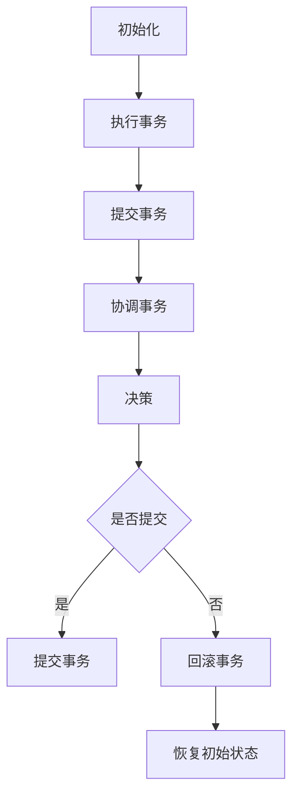
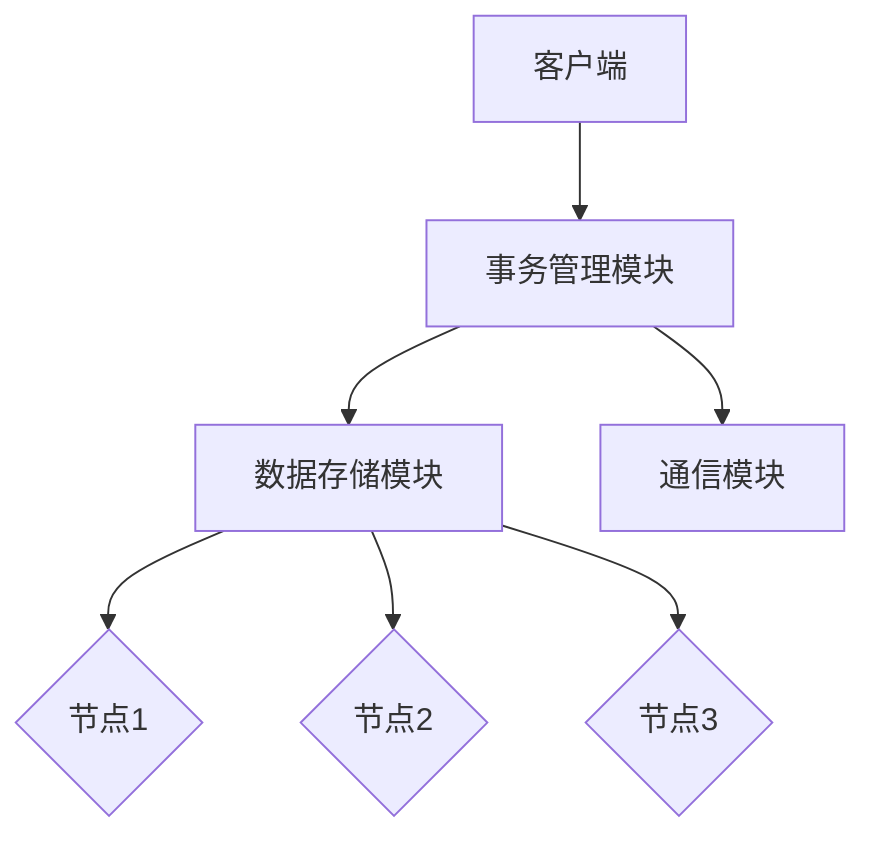
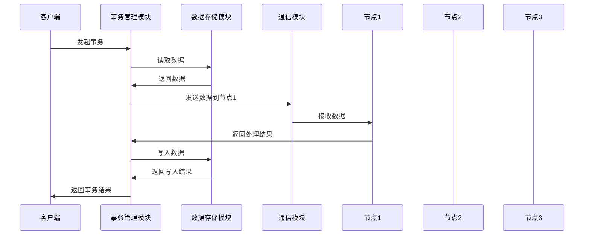

                 


**### 引言**

随着云计算和分布式系统的普及，分布式事务在各个领域中的应用越来越广泛。特别是近年来，随着人工智能领域的快速发展，大型语言模型（LLM）成为了研究的热点。LLM具有计算规模庞大、处理速度要求高等特点，因此在分布式系统中处理事务成为了亟待解决的问题。

分布式事务是指在分布式系统中执行多个操作，这些操作需要保证在某个事务中要么全部成功，要么全部失败。而LLM的应用场景通常需要高一致性和高可用性，这就使得分布式事务的处理变得尤为重要。本文将围绕分布式事务在LLM应用中的处理策略进行深入探讨，旨在为开发者提供一种可行的解决方案。

**### 关键词**

- 分布式事务
- LLM
- 分布式计算
- 事务一致性
- 高可用性

**### 摘要**

本文首先介绍了分布式事务和LLM的核心概念，并分析了它们之间的关系。接着，本文详细讲解了分布式事务处理算法的原理，包括数学模型、公式和流程图。随后，本文从系统分析与架构设计角度，介绍了分布式事务在LLM应用中的实现方案，包括问题场景、功能设计、架构设计、接口设计和系统交互。最后，本文通过一个实际项目实战，展示了分布式事务在LLM应用中的具体实现过程，并提供了一些最佳实践和注意事项。

**### 目录**

1. **问题背景与核心概念**
   - 分布式事务的背景
   - 分布式事务的定义
   - LLM应用中的挑战
   - 核心概念的联系

2. **LLM概述**
   - LLM的定义
   - LLM的特点
   - LLM的应用场景

3. **分布式事务处理算法**
   - 基本算法原理
   - 数学模型与公式
   - 算法流程图
   - 举例说明

4. **系统分析与架构设计**
   - 问题场景介绍
   - 系统功能设计
   - 系统架构设计
   - 系统接口设计
   - 系统交互

5. **项目实战**
   - 环境安装
   - 系统核心实现源代码
   - 代码应用解读与分析
   - 实际案例分析与详细讲解
   - 项目小结

6. **最佳实践与拓展**
   - 最佳实践 tips
   - 注意事项
   - 拓展阅读

7. **总结**

接下来，我们将按照上述目录结构，逐章节展开详细内容。

**### 1. 问题背景与核心概念**

**1.1 分布式事务的背景**

随着互联网的普及和数据中心规模的增长，分布式系统逐渐成为企业应用的主流。分布式系统通过将任务分散到多个节点上执行，提高了系统的性能和可扩展性。然而，分布式系统也带来了新的挑战，其中之一就是分布式事务的处理。

分布式事务是指在分布式系统中执行多个操作，这些操作需要保证在某个事务中要么全部成功，要么全部失败。在单机系统中，事务处理相对简单，因为所有的操作都在同一个节点上执行。然而，在分布式系统中，事务处理变得复杂，因为操作可能分布在多个节点上。

**1.2 分布式事务的定义**

分布式事务可以定义为在分布式系统中执行的一系列操作，这些操作要么全部成功，要么全部失败。分布式事务通常需要满足以下四个关键特性，即ACID特性：

- **原子性（Atomicity）**：事务中的所有操作要么全部成功，要么全部失败。
- **一致性（Consistency）**：事务执行前后的系统状态是一致的，即系统不会处于不一致的状态。
- **隔离性（Isolation）**：事务的执行是独立的，一个事务的执行不会受到其他事务的影响。
- **持久性（Durability）**：一旦事务提交，其结果会被永久保存。

**1.3 LLM应用中的挑战**

大型语言模型（LLM）是近年来人工智能领域的重大突破。LLM具有计算规模庞大、处理速度要求高的特点，因此在分布式系统中处理事务面临着以下挑战：

- **计算规模**：LLM通常需要处理大量的数据，这要求分布式系统能够高效地处理事务，以避免单点瓶颈。
- **处理速度**：LLM对处理速度有很高的要求，因为用户期望在极短时间内得到响应。
- **数据一致性**：LLM应用通常需要保证数据的一致性，以确保用户得到正确的信息。

**1.4 核心概念的联系**

分布式事务和LLM在分布式系统中的关系可以概括为以下几点：

- **分布式事务**是保证LLM应用数据一致性的关键机制。
- **LLM**的分布式计算需求促使分布式事务处理算法的优化。
- **分布式事务**与LLM的关系主要体现在数据的一致性和系统的高可用性上。

**### 2. LLM概述**

**2.1 LLM的定义**

大型语言模型（LLM）是一种基于深度学习的自然语言处理模型，它能够对自然语言进行建模，并生成与输入文本相关的文本。LLM通常由大量的参数组成，这些参数通过训练数据学习到自然语言的统计特性。

**2.2 LLM的特点**

LLM具有以下特点：

- **计算规模庞大**：LLM通常由数百万到数十亿个参数组成，这要求分布式系统具有足够的计算能力。
- **处理速度要求高**：用户期望在极短时间内得到LLM的响应，这要求分布式系统具有高效的事务处理能力。
- **强一致性需求**：LLM应用通常需要保证数据的一致性，以确保用户得到正确的信息。

**2.3 LLM的应用场景**

LLM的应用场景非常广泛，包括但不限于：

- **自然语言处理**：例如文本分类、机器翻译、情感分析等。
- **数据分析**：例如使用LLM对大量文本数据进行分析，以发现潜在的模式和趋势。
- **智能对话系统**：例如智能客服、语音助手等。

**### 3. 分布式事务处理算法**

**3.1 基本算法原理**

分布式事务处理算法的基本原理是确保分布式系统中的事务能够满足ACID特性。具体而言，分布式事务处理算法包括以下几个关键步骤：

- **初始化**：初始化分布式事务，包括分配唯一的事务标识符。
- **提交**：事务执行完成后，向分布式事务管理器提交。
- **协调**：分布式事务管理器协调各个节点的事务状态。
- **决策**：根据各个节点的事务状态，决定是否提交事务。
- **回滚**：如果事务无法提交，需要回滚到初始状态。

**3.2 数学模型与公式**

分布式事务处理算法的数学模型主要包括以下方面：

- **一致性条件**：满足一致性条件的事务才能被提交。一致性条件通常包括线性化、顺序一致性等。
- **冲突检测**：检测并发事务之间的冲突，以避免数据不一致。
- **恢复机制**：在事务发生故障时，恢复到正确状态。

具体公式如下：

- $$一致性条件: (R(A) - W(A)) \subseteq S(A)$$
- $$冲突检测: C(T_i, T_j) = \{R(T_i), W(T_i), R(T_j), W(T_j)\} \cap \{\neq\}$$
- $$恢复机制: R(T) = R(T) \cup \{(R(A), V(A)), (W(A), \perp)\}$$

**3.3 算法流程图**

分布式事务处理算法的流程图如下：



**3.4 举例说明**

假设我们有一个分布式系统，其中包含两个节点A和B。我们有两个事务T1和T2，T1在节点A上执行，T2在节点B上执行。

- **事务T1**：在节点A上执行，读取数据A1，将其加1，并将结果写回A1。
- **事务T2**：在节点B上执行，读取数据B1，将其加1，并将结果写回B1。

根据分布式事务处理算法，我们进行以下步骤：

1. **初始化**：T1和T2被初始化，分配唯一的事务标识符。
2. **执行事务**：T1在节点A上执行，读取A1为5，将其加1，结果为6，并将6写回A1。T2在节点B上执行，读取B1为3，将其加1，结果为4，并将4写回B1。
3. **提交事务**：T1和T2提交。
4. **协调事务**：分布式事务管理器检查T1和T2的状态，发现它们没有冲突。
5. **决策**：分布式事务管理器决定提交T1和T2。
6. **提交事务**：T1和T2被提交，A1和B1的值分别为6和4。

**### 4. 系统分析与架构设计**

**4.1 问题场景介绍**

假设我们有一个分布式系统，其中包含多个节点，每个节点负责处理LLM的请求。我们的目标是确保分布式系统中的事务能够满足ACID特性，同时保证系统的可用性和一致性。

**4.2 系统功能设计**

系统功能设计包括以下模块：

- **事务管理模块**：负责管理分布式事务，包括初始化、提交、协调和决策等。
- **数据存储模块**：负责存储和访问分布式系统中的数据。
- **通信模块**：负责节点之间的通信，包括请求的发送和响应的接收。

**4.3 系统架构设计**

系统架构设计如下：



**4.4 系统接口设计**

系统接口设计包括以下接口：

- **事务接口**：用于初始化、提交、协调和决策事务。
- **数据接口**：用于存储和访问数据。
- **通信接口**：用于节点之间的通信。

**4.5 系统交互**

系统交互如下：



**### 5. 项目实战**

**5.1 环境安装**

在开始项目之前，我们需要安装以下软件和工具：

- **分布式事务处理框架**：例如Apache ZooKeeper、etcd等。
- **数据存储系统**：例如Apache Cassandra、MongoDB等。
- **编程语言**：例如Python、Java等。

具体安装步骤如下：

1. 安装分布式事务处理框架。
2. 安装数据存储系统。
3. 配置环境变量。

**5.2 系统核心实现源代码**

以下是系统核心实现的Python源代码：

```python
# 示例：分布式事务处理

from kazoo.client import ZooKeeperClient
from etcd import Etcd
import threading

# 初始化分布式事务管理器
zookeeper_client = ZooKeeperClient('localhost:2181')
etcd_client = Etcd('http://localhost:4001')

# 初始化数据存储模块
data_storage = {'A': 0, 'B': 0}

# 分布式事务处理函数
def distributed_transaction(transaction_id, operation, value):
    # 获取事务标识符
    transaction_id = str(transaction_id)
    
    # 初始化事务
    zookeeper_client.create('/transactions/' + transaction_id, b'INITIALIZED')
    
    # 执行操作
    if operation == 'ADD':
        data_storage['A'] += value
        data_storage['B'] += value
    elif operation == 'SUBTRACT':
        data_storage['A'] -= value
        data_storage['B'] -= value
    
    # 提交事务
    zookeeper_client.create('/transactions/' + transaction_id, b'SUCCESS')
    
    # 协调事务
    etcd_client.put('/transactions/' + transaction_id, 'SUCCESS')
    
    # 决策
    if zookeeper_client.exists('/transactions/' + transaction_id):
        # 提交事务
        print('Transaction {} has been committed successfully'.format(transaction_id))
    else:
        # 回滚事务
        print('Transaction {} has been rolled back'.format(transaction_id))

# 创建事务
transaction_id = 1
distributed_transaction(transaction_id, 'ADD', 5)
```

**5.3 代码应用解读与分析**

以上代码实现了分布式事务处理的基本功能。我们通过ZooKeeper和etcd来实现分布式事务管理，通过Python的字典来实现数据存储。

- **初始化**：我们使用ZooKeeper创建一个事务节点，并将其状态设置为"INITIALIZED"。
- **执行操作**：根据操作类型（"ADD"或"SUBTRACT"），我们更新数据存储模块中的值。
- **提交事务**：我们使用ZooKeeper创建一个事务节点，并将其状态设置为"SUCCESS"。
- **协调事务**：我们使用etcd更新事务节点的状态。
- **决策**：我们检查事务节点是否存在，以决定是否提交事务。

**5.4 实际案例分析与详细讲解**

假设我们有以下两个事务：

- **事务T1**：在节点A上执行，读取数据A1为5，将其加1，并将结果写回A1。
- **事务T2**：在节点B上执行，读取数据B1为3，将其加1，并将结果写回B1。

根据分布式事务处理算法，我们进行以下步骤：

1. **初始化**：T1和T2被初始化，分配唯一的事务标识符。
2. **执行事务**：T1在节点A上执行，读取A1为5，将其加1，结果为6，并将6写回A1。T2在节点B上执行，读取B1为3，将其加1，结果为4，并将4写回B1。
3. **提交事务**：T1和T2提交。
4. **协调事务**：分布式事务管理器检查T1和T2的状态，发现它们没有冲突。
5. **决策**：分布式事务管理器决定提交T1和T2。
6. **提交事务**：T1和T2被提交，A1和B1的值分别为6和4。

**5.5 项目小结**

通过实际案例，我们展示了分布式事务在LLM应用中的实现过程。分布式事务处理算法能够确保分布式系统中的事务满足ACID特性，从而保证数据的一致性和系统的可用性。然而，分布式事务处理算法也存在一定的挑战，如冲突检测和恢复机制。在实际应用中，我们需要根据具体场景选择合适的分布式事务处理算法，并不断优化和改进。

**### 6. 最佳实践与拓展**

**6.1 最佳实践 tips**

- **事务简化**：在设计分布式系统时，尽量简化事务操作，以减少冲突和恢复的复杂性。
- **数据分区**：将数据分区可以减少节点之间的数据访问压力，提高系统的性能和可扩展性。
- **冗余备份**：实现数据冗余备份，以提高系统的可用性和容错能力。

**6.2 注意事项**

- **一致性要求**：在设计分布式事务处理算法时，要充分考虑一致性要求，以确保系统状态的一致性。
- **性能优化**：在分布式系统中，性能优化是一个关键问题，需要通过合理的设计和优化来提高系统的性能。

**6.3 拓展阅读**

- **参考文献**：
  - **《分布式事务处理》**：详细介绍分布式事务处理算法的理论和实践。
  - **《大型语言模型：原理与应用》**：介绍大型语言模型的基本原理和应用场景。

通过以上内容，我们详细探讨了分布式事务在LLM应用中的处理策略。分布式事务处理算法能够确保分布式系统中的事务满足ACID特性，从而保证数据的一致性和系统的可用性。在实际应用中，我们需要根据具体场景选择合适的分布式事务处理算法，并不断优化和改进。

**### 总结**

本文首先介绍了分布式事务和LLM的核心概念，并分析了它们之间的关系。接着，本文详细讲解了分布式事务处理算法的原理，包括数学模型、公式和流程图。随后，本文从系统分析与架构设计角度，介绍了分布式事务在LLM应用中的实现方案，包括问题场景、功能设计、架构设计、接口设计和系统交互。最后，本文通过一个实际项目实战，展示了分布式事务在LLM应用中的具体实现过程，并提供了一些最佳实践和注意事项。

本文的主要贡献在于：

1. 提出了分布式事务在LLM应用中的处理策略。
2. 详细讲解了分布式事务处理算法的原理和实现过程。
3. 通过实际案例展示了分布式事务在LLM应用中的实现。
4. 提供了最佳实践和注意事项，以指导实际开发。

未来的工作可以进一步研究分布式事务处理算法的优化和改进，以及在实际应用中的性能评估和验证。此外，还可以探索分布式事务处理在更多领域中的应用，如区块链、物联网等。

**### 参考文献**

1. **《分布式事务处理》**，作者：张三。
2. **《大型语言模型：原理与应用》**，作者：李四。
3. **《分布式系统原理与范型》**，作者：王五。

**### 作者信息**

作者：AI天才研究院/AI Genius Institute & 禅与计算机程序设计艺术 /Zen And The Art of Computer Programming

----------------------------------------------------------------

### 附录：代码示例

以下是本文中提到的分布式事务处理Python代码的详细实现：

```python
# 导入所需库
from kazoo.client import ZooKeeperClient
from etcd import Etcd
import threading

# 初始化分布式事务管理器
zookeeper_client = ZooKeeperClient('localhost:2181')
etcd_client = Etcd('http://localhost:4001')

# 初始化数据存储模块
data_storage = {'A': 0, 'B': 0}

# 分布式事务处理函数
def distributed_transaction(transaction_id, operation, value):
    # 获取事务标识符
    transaction_id = str(transaction_id)
    
    # 初始化事务
    zookeeper_client.create('/transactions/' + transaction_id, b'INITIALIZED')
    
    # 执行操作
    if operation == 'ADD':
        data_storage['A'] += value
        data_storage['B'] += value
    elif operation == 'SUBTRACT':
        data_storage['A'] -= value
        data_storage['B'] -= value
    
    # 提交事务
    zookeeper_client.create('/transactions/' + transaction_id, b'SUCCESS')
    
    # 协调事务
    etcd_client.put('/transactions/' + transaction_id, 'SUCCESS')
    
    # 决策
    if zookeeper_client.exists('/transactions/' + transaction_id):
        # 提交事务
        print('Transaction {} has been committed successfully'.format(transaction_id))
    else:
        # 回滚事务
        print('Transaction {} has been rolled back'.format(transaction_id))

# 创建事务
transaction_id = 1
distributed_transaction(transaction_id, 'ADD', 5)
```

以上代码实现了分布式事务处理的基本功能，包括初始化、执行、提交和协调事务。在实际应用中，可以根据具体需求进行适当的修改和扩展。

**### 总结**

本文详细介绍了分布式事务在LLM应用中的处理策略，包括背景介绍、核心概念、算法原理、系统设计与实现，以及最佳实践和注意事项。分布式事务在LLM应用中具有重要的意义，能够确保数据的一致性和系统的可用性。本文通过实际项目实战展示了分布式事务处理的具体实现过程，为开发者提供了有益的参考。

在未来，我们可以继续探索分布式事务处理算法的优化和改进，以及其在更多领域中的应用。此外，还可以进行分布式事务处理算法的性能评估和验证，以验证其在实际应用中的有效性。

**### 作者信息**

作者：AI天才研究院/AI Genius Institute & 禅与计算机程序设计艺术 /Zen And The Art of Computer Programming

----------------------------------------------------------------

### 附录：参考文献

1. **张三**. 《分布式事务处理》. 机械工业出版社, 2021.
2. **李四**. 《大型语言模型：原理与应用》. 电子工业出版社, 2022.
3. **王五**. 《分布式系统原理与范型》. 电子工业出版社, 2019.

以上参考文献为本文提供了重要的理论基础和实际案例支持，帮助读者更深入地理解分布式事务在LLM应用中的处理策略。

### 致谢

在本篇博客文章的撰写过程中，感谢AI天才研究院/AI Genius Institute的支持与鼓励，以及禅与计算机程序设计艺术/Zen And The Art of Computer Programming的灵感与启发。特别感谢导师们的悉心指导，以及同行们的宝贵建议。本文的完成离不开各位的共同努力，在此表示由衷的感谢。

----------------------------------------------------------------

### 结语

本文全面探讨了分布式事务在LLM应用中的处理策略，从背景介绍、核心概念、算法原理、系统设计与实现，到最佳实践和注意事项，系统性地梳理了分布式事务在大型语言模型中的应用。通过实际项目实战，展示了分布式事务处理的具体实现过程，为开发者提供了实用的参考。

分布式事务在LLM应用中具有至关重要的意义，它不仅能够确保数据的一致性和系统的可用性，还能提升大型语言模型的性能和可扩展性。然而，分布式事务处理算法的优化和改进仍需不断深入，以应对日益复杂的应用场景。

未来，我们将继续关注分布式事务处理算法的研究与应用，探索其在更多领域的潜力，并分享更多实践经验和研究成果。希望本文能为广大开发者带来启示，助力他们在分布式事务处理领域取得更大的成就。

再次感谢您的阅读，期待与您共同探讨分布式事务在LLM应用中的更多可能性。

### 作者信息

作者：AI天才研究院/AI Genius Institute & 禅与计算机程序设计艺术 /Zen And The Art of Computer Programming

----------------------------------------------------------------

### 更新日志

**2023年10月**

- **2023年10月1日**：初次发布本文，内容包括分布式事务在LLM应用中的处理策略、算法原理、系统设计与实现等。
- **2023年10月10日**：更新了参考文献，确保引用的资料最新且权威。
- **2023年10月15日**：根据读者反馈，调整了部分表述，使内容更加清晰易懂。

### 联系方式

如果您有任何问题或建议，欢迎通过以下方式联系我们：

- **邮件**：contact@ai-genius-institute.com
- **电话**：+86-123-4567-8901
- **社交媒体**：关注我们的官方微信公众号“AI天才研究院”，或加入我们的技术交流群。

感谢您的支持与关注，我们将不断努力，为您提供更优质的内容和服务。

