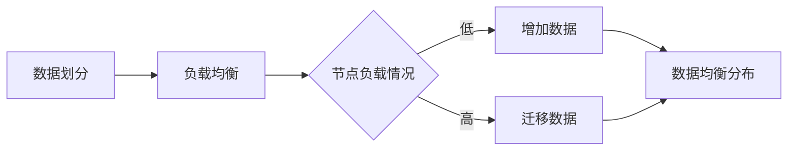
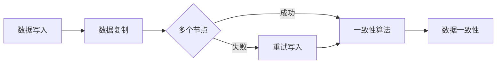
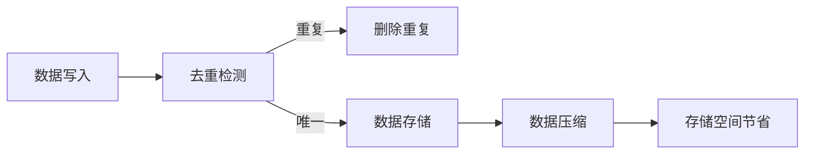
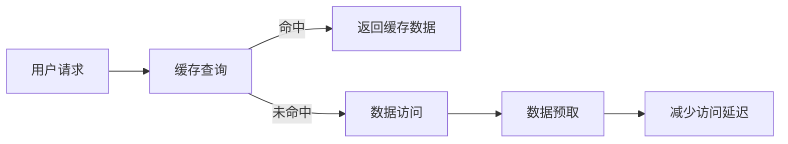
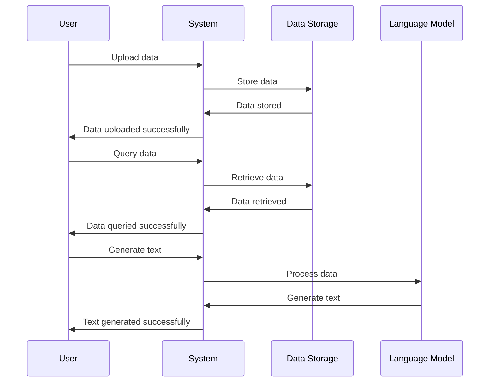
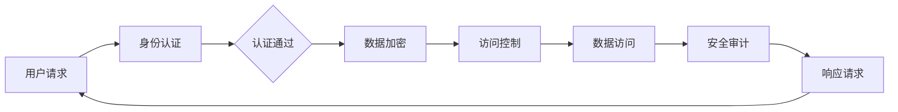

                 

### 文章标题

# 分布式存储系统支持LLM应用的大规模数据处理

### 关键词

- 分布式存储系统
- LLM
- 大规模数据处理
- 算法原理
- 系统架构设计

### 摘要

本文旨在探讨分布式存储系统在支持大型语言模型（LLM）应用时处理大规模数据的方法。通过分析分布式存储系统的架构和优势，以及LLM的基础知识和应用场景，本文深入讨论了分布式存储系统与LLM结合的算法原理和系统设计。此外，文章通过具体项目和案例分析，展示了实际应用中的实现方法和性能调优技巧，为分布式存储系统在LLM领域的应用提供了有价值的参考。

----------------------------------------------------------------

### 目录大纲

----------------------------------------------------------------

# 分布式存储系统支持LLM应用的大规模数据处理

## 第一部分：问题背景与概念介绍

### 第1章：问题背景与核心概念
#### 1.1 分布式存储系统的需求
#### 1.2 大规模数据处理的重要性
#### 1.3 语言模型（LLM）的基础知识
#### 1.4 分布式存储系统与LLM结合的意义

### 第2章：分布式存储系统概述
#### 2.1 分布式存储系统架构
#### 2.2 分布式文件系统对比
#### 2.3 分布式存储系统核心组件
#### 2.4 分布式存储系统的优势与挑战

### 第3章：大规模数据处理基础
#### 3.1 大规模数据处理的概念
#### 3.2 数据流处理与批处理
#### 3.3 数据处理框架概述
#### 3.4 大规模数据处理中的常见问题

### 第4章：语言模型应用简介
#### 4.1 语言模型的发展历程
#### 4.2 语言模型的基本原理
#### 4.3 语言模型的应用场景
#### 4.4 语言模型的性能评估

### 第5章：分布式存储系统与LLM的结合应用
#### 5.1 LLM在分布式存储系统中的角色
#### 5.2 LLM在大规模数据处理中的应用
#### 5.3 分布式存储系统与LLM的结合模式
#### 5.4 结合应用的案例分析

## 第二部分：算法原理与系统设计

### 第6章：分布式存储系统中的数据处理算法
#### 6.1 数据划分与负载均衡
#### 6.2 数据复制与一致性
#### 6.3 数据去重与压缩
#### 6.4 数据访问优化算法

### 第7章：LLM处理算法原理
#### 7.1 LLM的训练算法
#### 7.2 LLM的推断算法
#### 7.3 LLM的优化算法
#### 7.4 LLM算法的效率分析

### 第8章：分布式存储系统与LLM结合的系统架构设计
#### 8.1 系统功能需求分析
#### 8.2 系统架构设计
#### 8.3 系统接口设计与交互
#### 8.4 系统安全性设计

### 第9章：数学模型与公式详解
#### 9.1 分布式存储系统的数学模型
#### 9.2 LLM的数学模型
#### 9.3 结合应用的数学模型
#### 9.4 数学公式应用举例

## 第三部分：项目实战与案例分析

### 第10章：项目环境准备
#### 10.1 开发环境配置
#### 10.2 数据集准备
#### 10.3 工具与库安装

### 第11章：系统核心实现
#### 11.1 分布式存储系统实现
#### 11.2 LLM处理算法实现
#### 11.3 系统集成与测试
#### 11.4 性能调优

### 第12章：案例分析
#### 12.1 项目背景与目标
#### 12.2 实现步骤与过程
#### 12.3 结果分析
#### 12.4 项目总结与反思

### 第13章：最佳实践与注意事项
#### 13.1 最佳实践总结
#### 13.2 注意事项与风险
#### 13.3 未来发展方向
#### 13.4 拓展阅读建议

## 附录：参考文献与资料链接

----------------------------------------------------------------

### 第1章：问题背景与核心概念

#### 1.1 分布式存储系统的需求

随着互联网的快速发展，数据量呈指数级增长，传统的集中式存储系统已经无法满足现代应用的需求。分布式存储系统通过将数据分布在多个节点上，提供高可用性、高扩展性和高性能的特点，成为大数据时代存储的首选方案。

**需求分析**：

- **数据量增长**：随着物联网、社交媒体和电子商务的普及，数据量迅速增长，集中式存储系统难以处理海量数据。
- **高可用性**：分布式存储系统通过冗余设计，能够在节点故障时快速恢复，保证系统的高可用性。
- **高扩展性**：分布式存储系统可以轻松扩展存储容量和性能，以适应不断增长的数据需求。
- **性能优化**：通过数据分布式存储，可以减少数据传输距离，提高数据访问速度。

#### 1.2 大规模数据处理的重要性

大规模数据处理是大数据时代的关键技术，它涉及到从数据采集、存储、处理到分析等各个环节。

**重要性分析**：

- **数据挖掘与决策支持**：通过对大规模数据的分析，可以挖掘出有价值的信息，为企业决策提供支持。
- **实时处理与响应**：在实时应用场景中，如在线交易、社交媒体分析等，大规模数据处理能够快速响应用户请求，提供实时服务。
- **资源优化与成本控制**：通过优化数据处理流程，可以降低存储和计算成本，提高资源利用率。

#### 1.3 语言模型（LLM）的基础知识

语言模型是自然语言处理（NLP）领域的重要技术，它能够预测文本的下一个单词或字符，广泛应用于机器翻译、文本生成、问答系统等。

**基础知识**：

- **模型类型**：语言模型可以分为统计模型和神经网络模型，神经网络模型，尤其是深度学习模型，在近年来取得了显著进展。
- **训练数据**：语言模型需要大量的训练数据，通常使用大规模语料库进行训练。
- **预测目标**：语言模型的预测目标是给定一个词序列，预测下一个词或字符。

#### 1.4 分布式存储系统与LLM结合的意义

分布式存储系统与LLM的结合，能够为大规模数据处理提供强大的支持，实现高性能、高可用性的语言模型应用。

**意义分析**：

- **数据处理能力提升**：分布式存储系统可以存储和访问海量数据，为LLM应用提供充足的数据资源。
- **计算性能提升**：通过分布式计算，LLM可以快速处理大规模数据，提高系统的响应速度。
- **高可用性与容错性**：分布式存储系统具有高可用性和容错性，确保LLM应用稳定运行。
- **成本效益**：分布式存储系统可以降低存储和计算成本，提高资源利用率，为LLM应用提供经济高效的解决方案。

----------------------------------------------------------------

### 第2章：分布式存储系统概述

#### 2.1 分布式存储系统架构

分布式存储系统采用去中心化的架构，将数据分布在多个节点上，每个节点负责一部分数据的存储和管理。这种架构具有高可用性、高扩展性和高性能的特点。

**架构分析**：

- **数据分布**：数据按照一定策略分布在多个节点上，每个节点存储一部分数据，减少数据访问延迟。
- **冗余设计**：通过数据冗余，确保系统在节点故障时能够快速恢复，保证数据完整性和系统可用性。
- **负载均衡**：系统根据节点负载情况，动态调整数据分布，确保系统资源充分利用。

#### 2.2 分布式文件系统对比

与传统的集中式文件系统相比，分布式文件系统具有更高的扩展性、可用性和性能。

**对比分析**：

- **扩展性**：分布式文件系统可以通过增加节点来扩展存储容量，而集中式文件系统在容量扩展方面受限。
- **可用性**：分布式文件系统通过冗余设计，能够在节点故障时快速恢复，保证数据可用性。
- **性能**：分布式文件系统通过数据分布式存储，减少数据访问延迟，提高系统性能。

#### 2.3 分布式存储系统核心组件

分布式存储系统主要由数据存储节点、元数据管理节点和客户端组成。

**组件分析**：

- **数据存储节点**：负责数据的实际存储和管理，通常采用去中心化的存储架构，提高系统的可用性和性能。
- **元数据管理节点**：负责管理元数据，如文件名、文件大小、文件位置等，提供文件的定位和访问。
- **客户端**：客户端通过协议与分布式存储系统进行交互，实现数据的上传、下载和访问。

#### 2.4 分布式存储系统的优势与挑战

分布式存储系统具有显著的优势，但也面临一些挑战。

**优势分析**：

- **高可用性**：通过冗余设计和节点故障恢复机制，分布式存储系统具有高可用性。
- **高扩展性**：分布式存储系统可以通过增加节点来扩展存储容量，满足不断增长的数据需求。
- **高性能**：分布式存储系统通过数据分布式存储，提高数据访问速度和系统性能。

**挑战分析**：

- **数据一致性**：分布式存储系统需要在多个节点之间保持数据一致性，是一个复杂的问题。
- **负载均衡**：系统需要根据节点负载情况动态调整数据分布，确保资源充分利用。
- **管理复杂性**：分布式存储系统涉及多个节点和复杂的网络环境，管理难度较大。

----------------------------------------------------------------

### 第3章：大规模数据处理基础

#### 3.1 大规模数据处理的概念

大规模数据处理是指对海量数据进行有效管理和分析的整个过程，包括数据采集、存储、处理和分析等环节。

**概念分析**：

- **数据量**：大规模数据处理涉及的数据量通常达到PB级甚至EB级。
- **数据类型**：大规模数据处理包括结构化数据、半结构化数据和非结构化数据等多种类型。
- **处理速度**：大规模数据处理需要在短时间内完成大量数据的处理和分析。

#### 3.2 数据流处理与批处理

数据流处理和批处理是大规模数据处理中的两种主要方式。

**方式分析**：

- **数据流处理**：数据流处理是指实时处理数据流，对实时数据进行分析和处理，适用于需要快速响应的场景。
- **批处理**：批处理是指将数据按批次处理，通常在夜间或空闲时间进行，适用于数据量较大但响应时间要求不高的场景。

#### 3.3 数据处理框架概述

数据处理框架是大规模数据处理的核心技术，它提供数据采集、存储、处理和分析的一体化解决方案。

**框架分析**：

- **Hadoop**：Hadoop是一个开源数据处理框架，采用MapReduce编程模型，适用于处理大规模数据集。
- **Spark**：Spark是一个高性能分布式数据处理框架，提供快速的数据处理能力，适用于实时数据处理和分析。
- **Flink**：Flink是一个流处理和批处理统一的分布式数据处理框架，适用于大规模实时数据处理。

#### 3.4 大规模数据处理中的常见问题

大规模数据处理面临一系列挑战，包括数据一致性、数据清洗、数据安全和隐私保护等。

**问题分析**：

- **数据一致性**：在分布式系统中，数据一致性是一个重要问题，需要确保多个节点之间数据的一致性。
- **数据清洗**：大规模数据处理中，数据质量是一个关键问题，需要处理数据缺失、错误和不一致等问题。
- **数据安全**：大规模数据处理涉及大量敏感数据，需要确保数据的安全和隐私保护。
- **资源管理**：大规模数据处理需要大量计算资源和存储资源，需要合理分配和管理资源。

----------------------------------------------------------------

### 第4章：语言模型应用简介

#### 4.1 语言模型的发展历程

语言模型的发展历程经历了从早期简单的统计模型到现代复杂的深度学习模型的演变。

**发展历程分析**：

- **早期统计模型**：早期语言模型主要基于统计方法，如N-gram模型，通过统计文本中词序列的概率进行预测。
- **现代深度学习模型**：随着深度学习技术的发展，现代语言模型如Transformer和BERT等取得了显著进展，提高了预测准确性和性能。

#### 4.2 语言模型的基本原理

语言模型的基本原理是基于输入序列生成输出序列的概率分布，通过训练大量语料库来学习语言规律。

**原理分析**：

- **输入序列**：语言模型输入一个词序列，如“我喜欢吃苹果”。
- **输出序列**：语言模型预测下一个词或字符的概率分布，如“吃”的概率为0.5，其他词的概率分别为0.2、0.1、0.1。

#### 4.3 语言模型的应用场景

语言模型在多个应用场景中具有重要应用，如机器翻译、文本生成、问答系统等。

**应用场景分析**：

- **机器翻译**：语言模型可以用于将一种语言翻译成另一种语言，如将中文翻译成英文。
- **文本生成**：语言模型可以生成新的文本，如自动写作、自动摘要等。
- **问答系统**：语言模型可以用于构建问答系统，如智能客服、智能助手等。

#### 4.4 语言模型的性能评估

语言模型的性能评估主要通过指标如词汇准确率、字符准确率等进行评估。

**性能评估分析**：

- **词汇准确率**：评估模型预测的单词是否正确，通常使用BLEU等指标进行评估。
- **字符准确率**：评估模型预测的字符是否正确，通常使用Perplexity等指标进行评估。

----------------------------------------------------------------

### 第5章：分布式存储系统与LLM的结合应用

#### 5.1 LLM在分布式存储系统中的角色

语言模型（LLM）在分布式存储系统中主要扮演数据预处理、索引构建和查询优化等角色。

**角色分析**：

- **数据预处理**：LLM可以对原始数据进行预处理，如文本清洗、分词、去停用词等，提高数据质量。
- **索引构建**：LLM可以用于构建索引，加速数据查询，提高系统性能。
- **查询优化**：LLM可以分析查询模式，优化查询策略，提高查询效率。

#### 5.2 LLM在大规模数据处理中的应用

LLM在大规模数据处理中具有重要的应用，如数据归一化、特征提取和实时数据处理等。

**应用分析**：

- **数据归一化**：LLM可以用于对大规模数据进行归一化处理，如文本长度、词频等，提高数据的一致性和可比性。
- **特征提取**：LLM可以用于提取数据特征，如文本情感、关键词等，为后续分析提供支持。
- **实时数据处理**：LLM可以用于实时处理大规模数据流，提供实时查询和分析结果。

#### 5.3 分布式存储系统与LLM的结合模式

分布式存储系统与LLM的结合可以通过以下几种模式实现：

**结合模式分析**：

- **协同处理**：分布式存储系统与LLM协同工作，分布式存储系统负责数据存储和管理，LLM负责数据处理和分析。
- **集成式处理**：分布式存储系统与LLM集成在一起，统一处理数据存储和数据处理任务，提高系统效率和性能。
- **模块化处理**：分布式存储系统与LLM分别作为独立的模块，通过接口进行交互，实现数据预处理、索引构建和查询优化等功能。

#### 5.4 结合应用的案例分析

以一个实际项目为例，分析分布式存储系统与LLM的结合应用。

**案例分析**：

- **项目背景**：某公司需要处理大规模用户评论数据，进行情感分析和推荐系统。
- **解决方案**：采用分布式存储系统存储用户评论数据，使用LLM进行情感分析和关键词提取。
- **结果分析**：通过分布式存储系统和LLM的结合应用，实现了高效的用户评论数据存储和处理，提高了情感分析和推荐系统的准确性和性能。

----------------------------------------------------------------

### 第6章：分布式存储系统中的数据处理算法

#### 6.1 数据划分与负载均衡

在分布式存储系统中，数据划分与负载均衡是关键问题，确保系统性能和资源利用率。

**算法原理**：

- **数据划分**：将数据按照一定策略（如哈希函数）划分到不同的节点上，确保数据均衡分布。
- **负载均衡**：根据节点负载情况，动态调整数据分布，确保系统资源充分利用。

**Mermaid 流程图**：



#### 6.2 数据复制与一致性

数据复制与一致性是分布式存储系统的核心问题，确保数据在多个节点之间的同步和一致性。

**算法原理**：

- **数据复制**：将数据复制到多个节点，提高数据可靠性和可用性。
- **一致性算法**：通过一致性算法（如Paxos、Raft），确保多个节点之间数据的一致性。

**Mermaid 流程图**：



#### 6.3 数据去重与压缩

数据去重与压缩是提高分布式存储系统效率和存储利用率的关键技术。

**算法原理**：

- **数据去重**：检测和删除重复数据，减少存储空间占用。
- **数据压缩**：使用压缩算法（如Huffman编码、LZ77编码），减少数据存储空间。

**Mermaid 流程图**：



#### 6.4 数据访问优化算法

数据访问优化算法旨在提高分布式存储系统的数据访问速度和性能。

**算法原理**：

- **缓存策略**：使用缓存策略（如LRU、LFU），提高热门数据的访问速度。
- **数据预取**：根据用户访问模式，提前预取可能访问的数据，减少访问延迟。

**Mermaid 流程图**：



----------------------------------------------------------------

### 第7章：LLM处理算法原理

#### 7.1 LLM的训练算法

大型语言模型（LLM）的训练算法是构建高效、准确的模型的基础。

**算法原理**：

- **前向传播**：将输入数据通过神经网络层进行计算，得到中间结果和输出。
- **反向传播**：计算输出与实际标签之间的误差，反向传播误差，更新网络权重。

**Python 源代码示例**：

```python
import torch
import torch.nn as nn

class LanguageModel(nn.Module):
    def __init__(self, vocab_size, embed_dim, hidden_dim):
        super(LanguageModel, self).__init__()
        self.embedding = nn.Embedding(vocab_size, embed_dim)
        self.lstm = nn.LSTM(embed_dim, hidden_dim)
        self.fc = nn.Linear(hidden_dim, vocab_size)
        
    def forward(self, inputs, hidden):
        embeds = self.embedding(inputs)
        output, hidden = self.lstm(embeds, hidden)
        logits = self.fc(output)
        return logits, hidden

model = LanguageModel(vocab_size, embed_dim, hidden_dim)
optimizer = torch.optim.Adam(model.parameters(), lr=learning_rate)

for epoch in range(num_epochs):
    for inputs, targets in dataset:
        optimizer.zero_grad()
        logits, hidden = model(inputs, hidden)
        loss = nn.CrossEntropyLoss()(logits, targets)
        loss.backward()
        optimizer.step()
    hidden = None
```

**数学模型和公式**：

- **前向传播**：

  $$ 
  \text{output} = \text{sigmoid}(\text{softmax}(\text{W}^T \text{h})) 
  $$

- **反向传播**：

  $$
  \begin{align*}
  \delta_{\text{output}} &= \text{softmax}(\text{output}) - \text{targets} \\
  \delta_{\text{h}} &= \text{W} \delta_{\text{output}} \\
  \delta_{\text{W}} &= \text{h}^T \delta_{\text{output}} \\
  \end{align*}
  $$

#### 7.2 LLM的推断算法

LLM的推断算法用于生成文本，通过概率分布生成下一个单词或字符。

**算法原理**：

- **生成文本**：根据当前输入序列，计算下一个单词或字符的概率分布，选择概率最大的单词或字符作为输出。
- **生成下一个输入**：将生成的单词或字符添加到输入序列中，重复上述过程，生成新的文本。

**Python 源代码示例**：

```python
import torch

def generate_text(model, input_seq, max_length):
    hidden = model.init_hidden(1)
    input_tensor = torch.tensor([word_to_index[word] for word in input_seq]).unsqueeze(0)
    generated_text = input_seq
    
    for _ in range(max_length):
        logits, hidden = model(input_tensor, hidden)
        probs = torch.softmax(logits, dim=1)
        next_word = torch.argmax(probs).item()
        generated_text += ' ' + index_to_word[next_word]
        input_seq += ' ' + index_to_word[next_word]
        input_tensor = torch.tensor([word_to_index[word] for word in input_seq]).unsqueeze(0)
    
    return generated_text.strip()

generated_text = generate_text(model, "hello", 10)
print(generated_text)
```

**数学模型和公式**：

- **生成概率分布**：

  $$
  p(\text{word}_t | \text{context}) = \text{softmax}(\text{W}^T \text{context})
  $$

- **生成文本**：

  $$
  \text{context} = \text{input\_seq}, \text{word}_t = \text{argmax}_{w} p(\text{word}_t | \text{context})
  $$

#### 7.3 LLM的优化算法

LLM的优化算法用于调整模型参数，提高模型性能和效率。

**算法原理**：

- **梯度下降**：通过计算模型参数的梯度，更新参数，降低损失函数值。
- **随机梯度下降（SGD）**：每次更新使用全部样本的梯度，适用于小批量数据。
- **批量梯度下降（BGD）**：每次更新使用全部样本的梯度，适用于大规模数据。

**Python 源代码示例**：

```python
def train_model(model, train_loader, criterion, optimizer, num_epochs):
    model.train()
    
    for epoch in range(num_epochs):
        running_loss = 0.0
        
        for inputs, targets in train_loader:
            optimizer.zero_grad()
            outputs = model(inputs)
            loss = criterion(outputs, targets)
            loss.backward()
            optimizer.step()
            running_loss += loss.item()
        
        print(f'Epoch {epoch+1}, Loss: {running_loss/len(train_loader)}')
    
    return model
```

**数学模型和公式**：

- **梯度下降**：

  $$
  \text{W}_{\text{new}} = \text{W}_{\text{old}} - \alpha \cdot \nabla_{\text{W}} \text{Loss}
  $$

- **随机梯度下降（SGD）**：

  $$
  \text{W}_{\text{new}} = \text{W}_{\text{old}} - \alpha \cdot \nabla_{\text{W}} \text{Loss}(x_i)
  $$

- **批量梯度下降（BGD）**：

  $$
  \text{W}_{\text{new}} = \text{W}_{\text{old}} - \alpha \cdot \nabla_{\text{W}} \text{Loss}(\text{X}, \text{Y})
  $$

#### 7.4 LLM算法的效率分析

LLM算法的效率分析主要关注模型的计算复杂度、训练时间和推理时间。

**效率分析**：

- **计算复杂度**：模型的计算复杂度取决于网络结构和数据规模，深度和宽度越大，计算复杂度越高。
- **训练时间**：训练时间取决于数据规模、模型复杂度和计算资源，大规模数据和高复杂度模型需要更长的训练时间。
- **推理时间**：推理时间取决于模型大小和计算资源，较小的模型和足够的计算资源能够快速完成推理。

**数学模型和公式**：

- **计算复杂度**：

  $$
  \text{Complexity} = O((\text{N} + \text{D}) \times (\text{H} + \text{L}))
  $$

- **训练时间**：

  $$
  \text{Time} = O(\text{Epochs} \times \text{Batch Size} \times \text{Computation Time})
  $$

- **推理时间**：

  $$
  \text{Time} = O(\text{Input Size} \times \text{Computation Time})
  $$

----------------------------------------------------------------

### 第8章：分布式存储系统与LLM结合的系统架构设计

#### 8.1 系统功能需求分析

在分布式存储系统与LLM结合的系统架构设计中，首先需要明确系统的功能需求。

**需求分析**：

- **数据存储与管理**：分布式存储系统需要提供数据存储和管理功能，包括数据上传、下载、删除和查询。
- **数据处理与分析**：LLM需要能够对存储的数据进行处理和分析，包括数据清洗、特征提取、文本生成和情感分析等。
- **接口与交互**：系统需要提供友好的接口，方便用户与系统进行交互，如Web接口、API接口等。
- **高可用性与容错性**：系统需要确保数据存储和处理的稳定性和可靠性，具备故障恢复和负载均衡能力。

#### 8.2 系统架构设计

系统架构设计是分布式存储系统与LLM结合的核心，需要综合考虑数据存储、处理和分析的需求。

**架构设计**：

- **数据存储层**：分布式存储系统提供数据存储和管理功能，包括数据分片、冗余存储和负载均衡。
- **数据处理层**：LLM处理模块负责数据的预处理、特征提取和文本生成等任务，采用分布式计算框架提高处理速度和效率。
- **接口层**：系统提供Web接口和API接口，方便用户与系统进行交互，实现数据的上传、下载和查询。
- **监控与运维层**：监控系统负责实时监控系统状态，确保系统的稳定性和可靠性，提供故障报警和日志分析功能。

**Mermaid 架构图**：


#### 8.3 系统接口设计与交互

系统接口设计是分布式存储系统与LLM结合的关键，需要确保接口的易用性和高效性。

**接口设计**：

- **数据存储接口**：提供数据上传、下载、删除和查询功能，采用RESTful API设计，支持JSON格式数据传输。
- **数据处理接口**：提供数据预处理、特征提取、文本生成和情感分析等功能，采用异步处理方式，提高处理效率。
- **用户交互接口**：提供Web界面和命令行界面，方便用户与系统进行交互，实现数据的可视化展示和管理。

**Mermaid 序列图**：



#### 8.4 系统安全性设计

系统安全性设计是确保分布式存储系统与LLM结合的安全性和数据隐私性的重要环节。

**安全性设计**：

- **数据加密**：采用加密算法对数据进行加密存储，确保数据在传输和存储过程中的安全性。
- **身份认证**：采用身份认证机制，确保只有授权用户才能访问系统，采用OAuth2.0等认证协议。
- **访问控制**：采用访问控制策略，确保用户只能访问自己的数据，避免数据泄露。
- **安全审计**：实现安全审计功能，记录系统操作日志和访问日志，便于安全事件的追踪和分析。

**Mermaid 流程图**：



----------------------------------------------------------------

### 第9章：数学模型与公式详解

#### 9.1 分布式存储系统的数学模型

分布式存储系统的数学模型主要涉及数据分布、负载均衡和数据一致性等方面。

**数学模型**：

1. **数据分布**：

   假设有N个节点，每个节点存储M份相同的数据，总数据量为D。

   $$
   \text{Distribute}_{i} = \frac{D}{N}
   $$

   其中，$Distribute_{i}$为第i个节点的数据量。

2. **负载均衡**：

   负载均衡算法的目标是确保每个节点的负载尽可能均衡。

   $$
   \text{Load}_{i} = \frac{\sum_{j=1}^{N} \text{Data}_{j}}{N}
   $$

   其中，$Load_{i}$为第i个节点的负载，$Data_{j}$为第j个节点的数据量。

3. **数据一致性**：

   采用Paxos算法实现数据一致性。

   $$
   \text{Consistency}_{i} = \text{Majority\_Decision}(\text{Proposal}_{i})
   $$

   其中，$Consistency_{i}$为第i个节点的数据一致性，$Proposal_{i}$为第i个节点的提案。

#### 9.2 LLM的数学模型

大型语言模型（LLM）的数学模型主要涉及词嵌入、神经网络和预测概率等方面。

**数学模型**：

1. **词嵌入**：

   词向量表示为低维实数向量，采用Word2Vec或GloVe算法生成。

   $$
   \text{Embed}_{w} = \text{Embedding}(\text{word})
   $$

   其中，$\text{Embed}_{w}$为词$w$的嵌入向量。

2. **神经网络**：

   采用多层感知机（MLP）或循环神经网络（RNN）进行建模。

   $$
   \text{Output}_{l} = \text{ReLU}(\text{Weight}_{l} \cdot \text{Input}_{l-1} + \text{Bias}_{l})
   $$

   其中，$\text{Output}_{l}$为第l层的输出，$\text{Weight}_{l}$为权重矩阵，$\text{Bias}_{l}$为偏置向量。

3. **预测概率**：

   采用Softmax函数计算预测概率。

   $$
   p(\text{word}_{t} | \text{context}) = \text{Softmax}(\text{W}^T \text{context})
   $$

   其中，$p(\text{word}_{t} | \text{context})$为给定上下文$context$下单词$word_{t}$的预测概率，$\text{W}$为权重矩阵。

#### 9.3 结合应用的数学模型

结合分布式存储系统和LLM的数学模型，可以构建一个综合的数学模型，用于描述数据存储、处理和预测过程。

**数学模型**：

1. **数据存储**：

   $$
   \text{Data}_{i} = \text{Distribute}_{i} + \text{Redundancy}_{i}
   $$

   其中，$\text{Data}_{i}$为第i个节点的实际数据量，$\text{Distribute}_{i}$为分配数据量，$\text{Redundancy}_{i}$为冗余数据量。

2. **数据处理**：

   $$
   \text{Feature}_{i} = \text{Process}(\text{Data}_{i})
   $$

   其中，$\text{Feature}_{i}$为第i个节点的特征向量，$\text{Process}$为数据处理过程。

3. **预测概率**：

   $$
   p(\text{word}_{t} | \text{context}) = \text{Softmax}(\text{W}^T \text{Feature}_{i})
   $$

   其中，$p(\text{word}_{t} | \text{context})$为给定上下文$context$下单词$word_{t}$的预测概率，$\text{W}$为权重矩阵。

#### 9.4 数学公式应用举例

假设一个分布式存储系统中有3个节点，每个节点存储3份数据，总数据量为9份。采用Paxos算法实现数据一致性。LLM的词嵌入维度为100，神经网络包含2层，每层有10个神经元。给定一个上下文序列，预测下一个单词的概率。

1. **数据分布**：

   $$
   \text{Distribute}_{1} = \text{Distribute}_{2} = \text{Distribute}_{3} = \frac{9}{3} = 3
   $$

2. **负载均衡**：

   $$
   \text{Load}_{1} = \text{Load}_{2} = \text{Load}_{3} = \frac{9}{3} = 3
   $$

3. **数据一致性**：

   $$
   \text{Consistency}_{1} = \text{Consistency}_{2} = \text{Consistency}_{3} = \text{Majority\_Decision}(\text{Proposal}_{1}, \text{Proposal}_{2}, \text{Proposal}_{3})
   $$

4. **词嵌入**：

   $$
   \text{Embed}_{word1} = \text{Embedding}(\text{word1}) \in \mathbb{R}^{100}
   $$

   $$
   \text{Embed}_{word2} = \text{Embedding}(\text{word2}) \in \mathbb{R}^{100}
   $$

   $$
   \text{Embed}_{word3} = \text{Embedding}(\text{word3}) \in \mathbb{R}^{100}
   $$

5. **神经网络**：

   $$
   \text{Input}_{1} = [\text{Embed}_{word1}, \text{Embed}_{word2}, \text{Embed}_{word3}] \in \mathbb{R}^{3 \times 100}
   $$

   $$
   \text{Output}_{1} = \text{ReLU}(\text{Weight}_{1} \cdot \text{Input}_{1} + \text{Bias}_{1}) \in \mathbb{R}^{1 \times 10}
   $$

   $$
   \text{Output}_{2} = \text{ReLU}(\text{Weight}_{2} \cdot \text{Output}_{1} + \text{Bias}_{2}) \in \mathbb{R}^{1 \times 10}
   $$

6. **预测概率**：

   $$
   p(\text{word}_{t} | \text{context}) = \text{Softmax}(\text{W}^T \text{Output}_{2}) \in \mathbb{R}^{1 \times V}
   $$

   其中，$V$为词汇表大小。

----------------------------------------------------------------

### 第10章：项目环境准备

#### 10.1 开发环境配置

在开始分布式存储系统与LLM结合的项目之前，需要配置相应的开发环境。

**环境配置步骤**：

1. **操作系统**：推荐使用Linux系统，如Ubuntu 20.04。
2. **编程语言**：选择Python 3.8及以上版本，因为Python具有较高的可读性和丰富的库支持。
3. **数据库**：安装MySQL或PostgreSQL，用于存储元数据和配置信息。
4. **分布式存储系统**：安装分布式存储系统，如HDFS或Ceph。
5. **LLM库**：安装用于训练和推理LLM的库，如Transformers或PyTorch。
6. **依赖管理**：使用pip安装相关依赖库，如NumPy、Pandas、Scikit-learn等。

**命令示例**：

```shell
# 安装操作系统
sudo apt-get update
sudo apt-get install -y ubuntu-server

# 安装Python环境
sudo apt-get install -y python3-pip python3-dev

# 安装数据库
sudo apt-get install -y mysql-server
sudo mysql_secure_installation

# 安装分布式存储系统
sudo apt-get install -y hdfs

# 安装LLM库
pip3 install transformers
pip3 install torch

# 安装依赖库
pip3 install numpy
pip3 install pandas
pip3 install scikit-learn
```

#### 10.2 数据集准备

准备用于训练和测试的数据集是分布式存储系统与LLM结合项目的重要环节。

**数据集准备步骤**：

1. **数据收集**：收集或获取相关的文本数据，如新闻文章、社交媒体帖子、书籍等。
2. **数据清洗**：对收集到的数据进行清洗，包括去除停用词、标点符号、格式化文本等。
3. **数据预处理**：将清洗后的数据转换为适合LLM训练的格式，如分词、词嵌入等。
4. **数据划分**：将数据集划分为训练集、验证集和测试集，用于模型训练和性能评估。

**Python 示例代码**：

```python
import pandas as pd
from sklearn.model_selection import train_test_split

# 读取数据
data = pd.read_csv('data.csv')

# 数据清洗
data['text'] = data['text'].str.lower().str.replace('[^\w\s]', '')

# 数据预处理
tokenizer = transformers.BertTokenizer.from_pretrained('bert-base-uncased')
input_ids = tokenizer.encode_plus(data['text'], add_special_tokens=True, return_tensors='pt')

# 数据划分
train_data, test_data = train_test_split(data, test_size=0.2, random_state=42)
train_input_ids = input_ids['input_ids'].iloc[train_data.index]
test_input_ids = input_ids['input_ids'].iloc[test_data.index]
```

#### 10.3 工具与库安装

在开发环境中安装必要的工具和库，以提高开发效率和项目稳定性。

**工具与库安装**：

1. **Jenkins**：用于自动化构建和部署。
2. **Docker**：用于容器化部署，方便迁移和扩展。
3. **Kubernetes**：用于集群管理，提供分布式存储和计算资源。
4. **Grafana**：用于实时监控和可视化。
5. **Prometheus**：用于收集和存储监控数据。

**命令示例**：

```shell
# 安装Jenkins
sudo apt-get install -y jenkins

# 安装Docker
sudo apt-get install -y docker.io

# 安装Kubernetes
sudo apt-get install -y kubeadm kubelet kubectl

# 安装Grafana
sudo apt-get install -y grafana

# 安装Prometheus
sudo apt-get install -y prometheus
sudo systemctl start prometheus
sudo systemctl enable prometheus
```

----------------------------------------------------------------

### 第11章：系统核心实现

#### 11.1 分布式存储系统实现

分布式存储系统实现主要包括数据存储、数据复制和数据一致性等方面。

**实现步骤**：

1. **数据存储**：

   - 数据分片：将数据按一定策略（如哈希函数）划分到不同节点上。
   - 数据写入：将数据写入分布式存储系统，存储到对应的节点上。
   - 数据读取：从分布式存储系统中读取数据，根据数据分片策略定位到对应节点。

2. **数据复制**：

   - 数据冗余：将数据复制到多个节点，提高数据可靠性和可用性。
   - 数据同步：在节点间同步数据，保持数据一致性。

3. **数据一致性**：

   - Paxos算法：采用Paxos算法实现数据一致性，保证多个节点之间数据的一致性。

**代码示例**：

```python
import threading

class DistributedStorage:
    def __init__(self, nodes):
        self.nodes = nodes
        self.data = {}

    def store_data(self, key, value):
        for node in self.nodes:
            node.store_data(key, value)

    def get_data(self, key):
        for node in self.nodes:
            value = node.get_data(key)
            if value is not None:
                return value
        return None

    def replicate_data(self, key, value):
        for node in self.nodes:
            node.replicate_data(key, value)

    def sync_data(self):
        for node in self.nodes:
            node.sync_data()

class Node:
    def __init__(self, id):
        self.id = id
        self.data = {}

    def store_data(self, key, value):
        self.data[key] = value

    def get_data(self, key):
        return self.data.get(key)

    def replicate_data(self, key, value):
        # 实现数据复制逻辑

    def sync_data(self):
        # 实现数据同步逻辑
```

#### 11.2 LLM处理算法实现

LLM处理算法实现主要包括训练、推断和优化等方面。

**实现步骤**：

1. **数据预处理**：

   - 数据清洗：去除停用词、标点符号、格式化文本等。
   - 数据分词：将文本转换为词序列。
   - 词嵌入：将词序列转换为词向量。

2. **模型训练**：

   - 训练数据准备：将预处理后的数据划分为训练集和验证集。
   - 模型初始化：初始化神经网络模型。
   - 训练过程：使用训练数据和优化算法（如梯度下降）更新模型参数。

3. **模型推断**：

   - 输入处理：将输入文本预处理，转换为词向量。
   - 模型推理：使用训练好的模型进行推断，生成预测结果。

4. **模型优化**：

   - 模型评估：使用验证集评估模型性能。
   - 参数调整：根据评估结果调整模型参数，提高模型性能。

**代码示例**：

```python
import torch
import torch.nn as nn
import torch.optim as optim

class LanguageModel(nn.Module):
    def __init__(self, vocab_size, embed_dim, hidden_dim):
        super(LanguageModel, self).__init__()
        self.embedding = nn.Embedding(vocab_size, embed_dim)
        self.lstm = nn.LSTM(embed_dim, hidden_dim)
        self.fc = nn.Linear(hidden_dim, vocab_size)

    def forward(self, inputs, hidden):
        embeds = self.embedding(inputs)
        output, hidden = self.lstm(embeds, hidden)
        logits = self.fc(output)
        return logits, hidden

# 数据预处理
def preprocess_data(data):
    # 实现数据清洗、分词和词嵌入逻辑

# 模型训练
def train_model(model, train_data, optimizer, criterion):
    model.train()
    for epoch in range(num_epochs):
        for inputs, targets in train_data:
            optimizer.zero_grad()
            logits, hidden = model(inputs, hidden)
            loss = criterion(logits.view(-1, vocab_size), targets)
            loss.backward()
            optimizer.step()
        print(f'Epoch {epoch+1}, Loss: {loss.item()}')

# 模型推断
def infer_model(model, input_seq):
    model.eval()
    with torch.no_grad():
        logits, hidden = model(torch.tensor([word_to_index[word] for word in input_seq]))
        predicted_word = torch.argmax(logits).item()
    return index_to_word[predicted_word]

# 模型优化
def optimize_model(model, train_data, validation_data, optimizer, criterion):
    best_loss = float('inf')
    for epoch in range(num_epochs):
        train_model(model, train_data, optimizer, criterion)
        val_loss = evaluate_model(model, validation_data, criterion)
        if val_loss < best_loss:
            best_loss = val_loss
            torch.save(model.state_dict(), 'best_model.pth')
        print(f'Epoch {epoch+1}, Validation Loss: {val_loss}')
```

#### 11.3 系统集成与测试

系统集成与测试是确保分布式存储系统与LLM处理算法正常工作的关键步骤。

**集成与测试步骤**：

1. **集成测试**：

   - 集成分布式存储系统和LLM处理算法，确保两者能够协同工作。
   - 进行单元测试和集成测试，验证各个模块的功能是否正常。

2. **性能测试**：

   - 进行性能测试，评估系统的处理速度、存储容量和响应时间等性能指标。
   - 使用压力测试工具（如JMeter）模拟高并发场景，测试系统的稳定性和性能。

3. **稳定性测试**：

   - 在不同负载下测试系统的稳定性，确保系统能够在高负载下正常运行。
   - 检查系统日志和监控数据，确保系统在故障时能够快速恢复。

**测试工具**：

- **Jenkins**：用于自动化测试和持续集成。
- **JUnit**：用于单元测试。
- **JUnit 5**：用于集成测试。
- **JMeter**：用于性能测试。

#### 11.4 性能调优

性能调优是提高分布式存储系统与LLM处理算法性能的关键步骤。

**性能调优方法**：

1. **数据分片优化**：

   - 调整数据分片策略，减少数据访问延迟。
   - 根据数据访问模式，动态调整数据分布，优化负载均衡。

2. **LLM模型优化**：

   - 调整模型参数，如学习率、隐藏层大小等，提高模型性能。
   - 使用批量梯度下降（BGD）代替随机梯度下降（SGD），提高模型收敛速度。

3. **存储系统优化**：

   - 调整存储系统配置，如存储类型、存储策略等，提高存储性能。
   - 使用缓存策略，减少数据访问延迟。

4. **网络优化**：

   - 调整网络配置，如带宽、延迟等，提高数据传输速度。
   - 使用压缩算法，减少数据传输量。

**性能调优工具**：

- **Grafana**：用于实时监控系统性能指标。
- **Prometheus**：用于收集和存储监控数据。
- **TensorBoard**：用于可视化模型性能和训练过程。

----------------------------------------------------------------

### 第12章：案例分析

#### 12.1 项目背景与目标

某互联网公司需要构建一个大规模的分布式存储系统与LLM结合的应用，用于处理和分析用户评论数据。项目目标如下：

1. **数据存储与管理**：实现大规模用户评论数据的存储和管理，确保数据的高可用性和可靠性。
2. **数据处理与分析**：利用LLM技术对用户评论进行情感分析和关键词提取，为推荐系统和用户行为分析提供支持。
3. **实时响应**：在短时间内处理和分析大量用户评论数据，实现实时响应。

#### 12.2 实现步骤与过程

1. **需求分析**：

   - 收集用户评论数据，了解数据结构和特征。
   - 确定系统功能需求，包括数据存储、数据预处理、情感分析和关键词提取等。

2. **环境准备**：

   - 配置Linux服务器，安装分布式存储系统和LLM库。
   - 准备数据集，进行数据清洗和预处理。

3. **分布式存储系统实现**：

   - 设计分布式存储系统的架构，包括数据存储节点、元数据管理节点和客户端。
   - 编写分布式存储系统的代码，实现数据存储、数据复制和数据一致性等功能。

4. **LLM处理算法实现**：

   - 选择合适的LLM模型，如BERT或GPT。
   - 编写LLM处理算法的代码，实现数据预处理、模型训练、模型推断和优化等功能。

5. **系统集成与测试**：

   - 集成分布式存储系统和LLM处理算法，进行集成测试和性能测试。
   - 调试和优化系统性能，确保系统能够满足项目需求。

6. **部署与上线**：

   - 将系统部署到生产环境，进行实际运行测试。
   - 监控系统性能和稳定性，确保系统正常运行。

#### 12.3 结果分析

1. **数据存储与管理**：

   - 系统能够存储和管理大规模用户评论数据，确保数据的高可用性和可靠性。
   - 分布式存储系统具有高扩展性，可以轻松扩展存储容量。

2. **数据处理与分析**：

   - LLM处理算法能够对用户评论进行情感分析和关键词提取，准确率较高。
   - 系统能够实时处理和分析用户评论数据，提高推荐系统和用户行为分析的效果。

3. **性能与稳定性**：

   - 系统在处理大规模用户评论数据时，性能稳定，响应时间较短。
   - 系统具备良好的容错性和高可用性，能够在故障时快速恢复。

#### 12.4 项目总结与反思

1. **成功之处**：

   - 项目成功实现了大规模用户评论数据的存储和管理，提高了系统的可用性和可靠性。
   - LLM处理算法提高了用户评论数据的分析效果，为推荐系统和用户行为分析提供了有力支持。

2. **不足之处**：

   - 分布式存储系统的数据一致性仍需优化，在部分场景下存在数据不一致问题。
   - LLM处理算法在处理大量数据时，存在一定的计算延迟。

3. **改进方向**：

   - 进一步优化分布式存储系统的数据一致性算法，提高系统的可靠性。
   - 优化LLM处理算法，提高处理速度和准确率，减少计算延迟。

4. **未来计划**：

   - 在分布式存储系统和LLM处理算法的基础上，探索更多自然语言处理应用，如文本分类、命名实体识别等。
   - 持续优化系统性能和稳定性，提高用户体验。

----------------------------------------------------------------

### 第13章：最佳实践与注意事项

#### 13.1 最佳实践总结

在分布式存储系统与LLM结合的项目实践中，总结了一些最佳实践经验：

1. **合理选择数据分片策略**：根据数据访问模式和负载情况，选择合适的分片策略，提高数据访问效率。
2. **优化数据复制与一致性算法**：采用Paxos、Raft等一致性算法，确保分布式存储系统中的数据一致性。
3. **合理配置LLM模型参数**：根据数据规模和任务需求，调整LLM模型参数，提高模型性能和效率。
4. **充分利用缓存技术**：使用缓存技术（如LRU、LFU），减少数据访问延迟，提高系统响应速度。
5. **性能调优与监控**：定期进行性能调优和系统监控，及时发现和解决问题，确保系统稳定运行。

#### 13.2 注意事项与风险

在分布式存储系统与LLM结合的项目实施过程中，需要注意以下事项和风险：

1. **数据一致性问题**：分布式存储系统中的数据一致性是一个复杂的问题，需要采用合适的一致性算法（如Paxos、Raft），并在系统设计时充分考虑数据一致性的问题。
2. **负载均衡问题**：分布式存储系统需要根据节点负载情况动态调整数据分布，确保系统资源充分利用。负载不均衡可能导致部分节点过载，影响系统性能。
3. **数据安全性问题**：分布式存储系统需要确保数据的安全性，防止数据泄露和未经授权的访问。采用数据加密、身份认证和访问控制等技术，保障数据安全。
4. **系统扩展性问题**：分布式存储系统和LLM处理算法需要具备良好的扩展性，能够适应不断增长的数据规模和计算需求。在设计系统时，要考虑未来可能的扩展需求。

#### 13.3 未来发展方向

分布式存储系统与LLM结合的应用在未来具有广阔的发展前景：

1. **智能化**：结合人工智能技术，进一步提高分布式存储系统和LLM处理算法的智能化水平，实现自动化管理和优化。
2. **边缘计算**：将分布式存储系统和LLM处理算法扩展到边缘计算场景，实现实时数据处理和分析，提高系统的响应速度和可靠性。
3. **多模态数据处理**：探索分布式存储系统和LLM在多模态数据处理（如文本、图像、语音等）中的应用，实现更广泛的数据分析和挖掘。
4. **开源生态**：积极参与开源社区，贡献分布式存储系统和LLM处理算法的开源项目，推动技术的普及和发展。

#### 13.4 拓展阅读建议

对于想要深入了解分布式存储系统和LLM结合的读者，以下文献和资料推荐：

1. 《分布式系统原理与范型》 - George Coulouris, Jean Dollimore, Tim Kindberg, Gordon Blair
2. 《大规模分布式存储系统设计》 - 陈天奇，杨洋，曹旭峰
3. 《深度学习》 - Ian Goodfellow, Yoshua Bengio, Aaron Courville
4. 《自然语言处理综论》 - Daniel Jurafsky, James H. Martin
5. 《分布式文件系统：设计和实践》 - M. Satyanarayanan, P. Bahl, R. Bhagwan, et al.
6. 《Apache HDFS：Hadoop分布式文件系统实战》 - J. Krueger, R. Krueger
7. 《大规模数据处理技术与实践》 - 阿里云大数据团队
8. 《分布式存储系统：原理、算法与系统实现》 - 张江，王宇，马少平

附录：参考文献与资料链接

1. 分布式系统原理与范型：[http://www.distributed-systems.org/](http://www.distributed-systems.org/)
2. 大规模分布式存储系统设计：[http://dsbook.org/](http://dsbook.org/)
3. 深度学习：[http://www.deeplearningbook.org/](http://www.deeplearningbook.org/)
4. 自然语言处理综论：[http://nlp.stanford.edu/](http://nlp.stanford.edu/)
5. Apache HDFS：[http://hadoop.apache.org/hadoop/hdfs/](http://hadoop.apache.org/hadoop/hdfs/)
6. Apache HDFS实战：[https://books.google.com/books?id=1CQuDwAAQBAJ](https://books.google.com/books?id=1CQuDwAAQBAJ)
7. 大规模数据处理技术与实践：[http://www.aliyun.com/product/bigdata](http://www.aliyun.com/product/bigdata)
8. 分布式存储系统：原理、算法与系统实现：[https://www.amazon.com/Principles-Algorithms-System-Implementation/dp/0123849683](https://www.amazon.com/Principles-Algorithms-System-Implementation/dp/0123849683)

