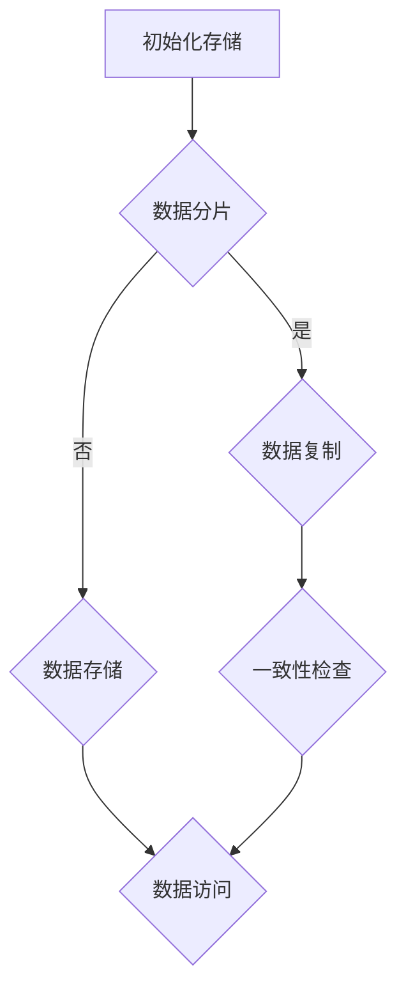

                 

## 分布式存储：支持LLM应用的大规模数据处理

### 关键词

- 分布式存储
- 大规模数据处理
- LLM（大型语言模型）
- 分布式系统架构
- 数据分割与并行处理

### 摘要

本文深入探讨了分布式存储在支持大型语言模型（LLM）应用中的重要性。通过分析分布式存储的基本原理和体系结构，我们揭示了LLM如何与分布式存储相结合，以应对大规模数据处理的需求。文章进一步探讨了数据分割与并行处理技术，并提供了实际案例分析，最后总结了本文的主要观点并对未来发展趋势进行了展望。

### 引言

在当今数字化时代，数据处理已成为众多行业的重要驱动力。随着人工智能（AI）技术的迅猛发展，特别是大型语言模型（LLM）的出现，如何高效地存储和处理海量数据成为了研究者和工程师们关注的焦点。分布式存储作为一种关键的技术手段，能够在保障数据可靠性的同时，提供高效的数据访问和处理能力。本文将围绕分布式存储的基本原理、LLM的应用、大规模数据处理方法以及实际案例分析，展开深入讨论，旨在为读者提供一份全面的技术指南。

### 背景介绍

#### 分布式存储的概念

分布式存储是一种将数据分散存储在多个物理位置的技术，通过分布式文件系统或分布式数据库实现。这种存储方式能够有效利用资源，提高数据访问速度，并在数据存储过程中提供高可用性和容错性。

#### 分布式存储的发展历程

分布式存储技术的发展经历了从早期的小规模分布式文件系统（如NFS）到现代的大规模分布式存储系统（如HDFS、Ceph）的演变。随着大数据和云计算的兴起，分布式存储技术得到了广泛应用和不断优化。

#### 分布式存储的重要性

在处理大规模数据处理时，分布式存储的重要性不言而喻。它能够将数据分布到多个节点上，避免单点故障，提高系统的可靠性和性能。同时，分布式存储还能够通过并行处理技术，加速数据处理速度，满足日益增长的数据需求。

#### 问题背景

随着AI技术的发展，特别是LLM的应用，数据存储和处理的需求变得更为复杂和庞大。LLM通常需要处理海量文本数据，这些数据不仅需要高效存储，还需要快速访问和处理。传统的集中式存储方式已无法满足这些需求，因此分布式存储成为了一种不可或缺的技术选择。

#### 问题定义

本文关注的核心问题是：如何在分布式存储框架下，高效地支持LLM应用的大规模数据处理？

#### 问题解决

分布式存储提供了以下解决方案：

1. **数据分割与分布**：通过将数据分割成小块，并将这些小块分布存储到多个节点上，分布式存储系统能够提高数据的访问速度和处理效率。
2. **并行处理**：分布式存储系统支持并行处理技术，通过多个节点同时处理数据，可以显著缩短数据处理时间。
3. **容错性**：分布式存储系统具有高容错性，即使在个别节点发生故障时，系统仍能正常运行，确保数据的安全性和可用性。

#### 边界与外延

分布式存储不仅应用于LLM应用，还广泛应用于大数据处理、云计算、物联网等领域。在LLM应用中，分布式存储特别关注数据的分片策略、存储协议和索引机制，以确保数据的高效存储和访问。

#### 概念结构与核心要素组成

分布式存储的核心结构包括：

- **数据节点**：存储数据的物理设备。
- **存储网络**：连接数据节点的通信网络。
- **管理节点**：负责协调和管理数据节点的存储操作。
- **分布式文件系统**：负责管理文件的分布存储和访问。

### 核心概念与联系

#### 分布式存储的体系结构

分布式存储的体系结构可以分为以下几层：

1. **物理层**：包括存储设备和网络设备。
2. **数据层**：负责数据的分片、复制和存储。
3. **管理层**：负责存储资源的分配、监控和故障恢复。
4. **访问层**：提供用户对数据的访问接口。

#### 分布式存储的关键技术

分布式存储的关键技术包括：

- **数据分片**：将大数据分割成小块，存储到不同的节点上。
- **数据复制**：为了提高数据可靠性，将数据复制到多个节点。
- **一致性协议**：确保分布式系统中数据的一致性。
- **故障恢复**：在节点发生故障时，自动恢复数据。

#### 分布式存储与LLM的关系

LLM作为一种复杂的AI模型，需要处理海量文本数据。分布式存储能够为LLM提供以下支持：

- **数据存储**：分布式存储能够高效地存储LLM所需的海量文本数据。
- **数据访问**：分布式存储系统能够提供快速的读写访问，满足LLM对数据的高频次访问需求。
- **数据处理**：分布式存储系统支持并行处理，能够加速LLM的数据处理速度。

### LLIM在分布式存储中的应用

#### LLIM概述

LLIM（Large Language Model）是指具有大规模参数数量和高度复杂性的语言模型，如GPT-3、BERT等。这些模型能够处理和理解复杂的自然语言，具有广泛的应用场景，包括自然语言处理、机器翻译、文本生成等。

#### LLIM的优势与挑战

LLIM在分布式存储中的应用具有以下优势：

- **高效数据处理**：LLIM能够快速处理大规模文本数据，提高数据处理效率。
- **智能化数据访问**：LLIM能够根据上下文理解数据，提供更准确的数据访问和查询结果。
- **自适应数据存储**：LLIM能够根据数据特征自适应调整存储策略，优化存储资源利用。

然而，LLIM在分布式存储中也面临以下挑战：

- **数据一致性**：分布式存储系统中的数据一致性难以保证，特别是在多节点并发访问时。
- **存储资源管理**：分布式存储系统需要高效管理存储资源，以应对LLM的巨大存储需求。
- **性能优化**：分布式存储系统需要优化性能，以满足LLM对数据的高频次、高吞吐量访问需求。

#### LLIM在分布式存储中的应用

1. **数据预处理**：LLIM在处理数据之前，需要将数据进行预处理，包括数据清洗、数据格式转换等。分布式存储系统能够提供高效的数据预处理能力，为LLIM提供高质量的数据输入。

2. **数据存储与访问**：LLIM需要将训练数据和推理数据存储在分布式存储系统中，并能够快速访问这些数据。分布式存储系统通过数据分片、复制和索引技术，提供高效的存储和访问支持。

3. **模型训练与推理**：LLIM的训练和推理过程需要大量计算资源。分布式存储系统能够提供高效的计算资源调度和管理，支持LLM的并行训练和推理。

4. **性能优化**：分布式存储系统需要根据LLM的访问模式和数据处理需求，进行性能优化。例如，通过缓存技术减少数据访问延迟，通过压缩技术减少存储空间占用。

### 分布式存储体系结构

分布式存储体系结构主要包括以下几个核心组件：

1. **数据节点**：数据节点是分布式存储系统中的基本存储单元，负责存储和访问数据。数据节点通常由磁盘阵列、网络接口和操作系统组成。

2. **管理节点**：管理节点是分布式存储系统的控制中心，负责协调和管理数据节点的存储操作。管理节点通常包括元数据管理、数据复制、故障恢复等功能。

3. **分布式文件系统**：分布式文件系统是分布式存储系统的核心组件，负责管理文件的分布存储和访问。分布式文件系统通常支持数据分片、复制、一致性协议等功能。

4. **存储网络**：存储网络是连接数据节点和管理节点的通信网络，负责传输数据和管理命令。存储网络通常采用高速网络协议，如Infiniband或RDMA。

#### 分布式存储的关键技术

1. **数据分片**：数据分片是将大数据分割成小块，存储到不同的数据节点上。数据分片能够提高数据的访问速度和处理效率，同时降低单个节点的负载。

2. **数据复制**：数据复制是为了提高数据的可靠性，将数据复制到多个数据节点上。数据复制可以采用同步复制或异步复制，同步复制确保数据一致性，异步复制提高数据访问速度。

3. **一致性协议**：一致性协议是分布式存储系统中的关键机制，负责确保数据在多个节点之间的一致性。常见的一致性协议包括强一致性、最终一致性等。

4. **故障恢复**：故障恢复是分布式存储系统中的关键功能，负责在节点发生故障时，自动恢复数据。故障恢复通常包括数据备份、数据重建、故障转移等功能。

### 分布式存储与LLM的结合

分布式存储与LLM的结合能够充分发挥两者的优势，实现高效的数据处理和存储。以下是如何实现分布式存储与LLM的结合：

1. **数据预处理**：在LLM训练和推理过程中，需要对数据进行预处理，包括数据清洗、数据格式转换等。分布式存储系统可以通过并行处理技术，提高数据预处理的效率。

2. **数据存储**：LLM需要存储大量训练数据和推理数据。分布式存储系统能够提供高效的数据存储能力，同时保证数据的一致性和可靠性。

3. **数据访问**：分布式存储系统能够提供高效的读写访问接口，满足LLM对数据的高频次访问需求。通过数据分片和缓存技术，可以进一步提高数据访问速度。

4. **模型训练与推理**：分布式存储系统可以提供高效的计算资源，支持LLM的并行训练和推理。通过分布式计算和调度技术，可以实现高效的模型训练和推理。

### 分布式存储与大规模数据处理方法

分布式存储与大规模数据处理方法相结合，能够实现高效的数据处理和存储。以下是一些关键的大规模数据处理方法：

1. **数据分割**：数据分割是将大规模数据分割成小块，存储到不同的节点上。数据分割可以提高数据的处理速度，降低单个节点的负载。

2. **并行处理**：并行处理是在多个节点上同时处理数据，以加速数据处理速度。并行处理可以通过分布式计算框架，如MapReduce、Spark等实现。

3. **数据压缩**：数据压缩是将大规模数据进行压缩，以减少存储空间占用。数据压缩可以通过算法和编码技术实现。

4. **负载均衡**：负载均衡是将数据处理任务分配到不同的节点上，以实现负载均衡。负载均衡可以通过分布式调度系统实现。

### 实际案例分析

以下是一些实际案例分析，展示了分布式存储和大规模数据处理在真实世界中的应用：

1. **云计算平台**：云计算平台通常采用分布式存储系统，如HDFS、Ceph等，以提供高效的数据存储和处理能力。通过分布式存储和大规模数据处理方法，云计算平台能够满足用户对海量数据的存储和处理需求。

2. **金融领域**：金融领域经常需要处理海量交易数据和客户数据。分布式存储和大规模数据处理方法可以提供高效的数据存储和处理能力，帮助金融机构实现快速交易处理和精准风险评估。

3. **电子商务**：电子商务平台需要处理海量商品数据和用户数据。分布式存储和大规模数据处理方法可以提供高效的商品检索和用户推荐能力，提升用户体验。

### 总结与展望

本文深入探讨了分布式存储在支持LLM应用中的重要性，分析了分布式存储的基本原理和体系结构，以及LLM在分布式存储中的应用。同时，本文介绍了大规模数据处理方法，并提供了实际案例分析。最后，本文总结了分布式存储和大规模数据处理的优势和挑战，并对未来发展趋势进行了展望。

未来，随着AI技术的不断进步，分布式存储和大规模数据处理将在更多领域得到应用。分布式存储将进一步优化数据分割、复制和一致性协议，以满足更高效的数据处理需求。同时，大规模数据处理技术将不断创新，以应对日益增长的数据规模和处理速度需求。

### 附录

#### LaTeX数学公式示例

以下是一个LaTeX数学公式的示例：

$$ E = mc^2 $$

这是一个经典的物理公式，表示能量（E）等于质量（m）乘以光速（c）的平方。

#### Mermaid流程图示例

以下是一个Mermaid流程图示例，展示了分布式存储系统的基本流程：

这个流程图描述了分布式存储系统从初始化存储到数据访问的基本流程。

### 作者信息

作者：AI天才研究院/AI Genius Institute & 禅与计算机程序设计艺术 /Zen And The Art of Computer Programming

