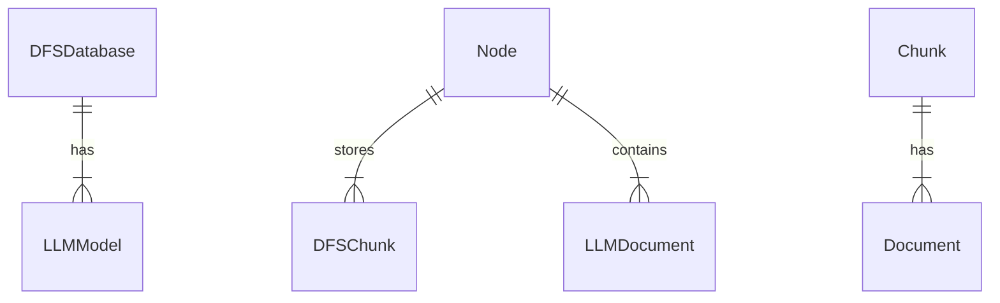
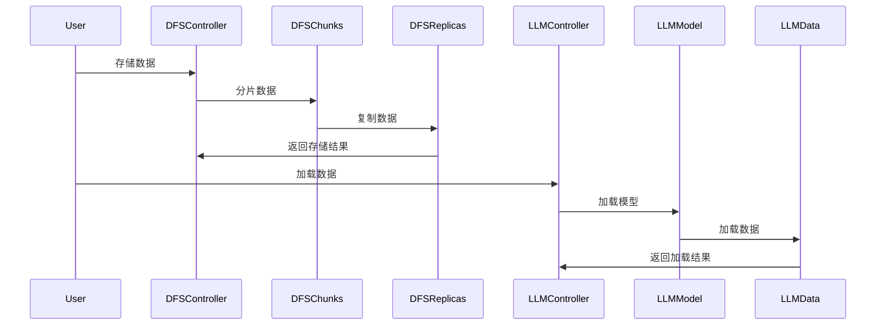
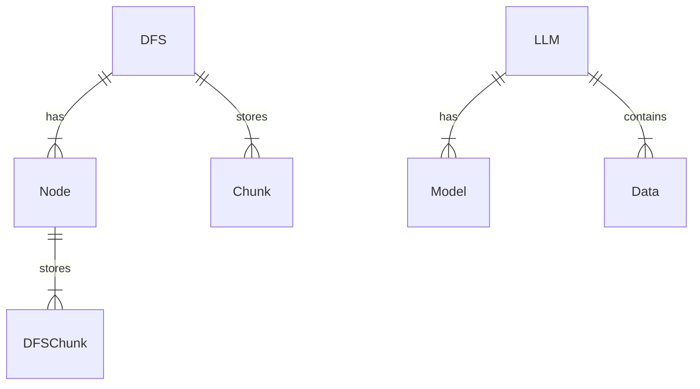

                 


# 分布式文件系统在LLM应用数据存储中的应用

> 关键词：分布式文件系统，LLM应用，数据存储，算法原理，系统架构，项目实战

> 摘要：
本文旨在探讨分布式文件系统在大型语言模型（LLM）应用中的数据存储应用。文章首先介绍了分布式文件系统与LLM的基本概念和背景，然后深入分析了分布式文件系统的核心概念、算法原理以及与LLM的关联。接着，文章通过数学模型和公式，详细阐述了分布式文件系统和LLM数据存储算法的原理，并展示了系统分析与架构设计方案。最后，文章通过项目实战，展示了如何在实际环境中应用这些原理和方案。

### 目录大纲设计

#### 第一部分：背景介绍

**第1章 问题背景与概念概述**

- 1.1 问题背景介绍
  - 分布式文件系统的定义
  - LLM应用的背景
  - 分布式文件系统在LLM应用中的重要性

- 1.2 核心概念介绍
  - 数据存储的概念
  - 分布式文件系统的特点
  - LLM的基本原理

#### 第二部分：核心概念与联系

**第2章 核心概念与联系**

- 2.1 分布式文件系统的核心概念
  - 节点与集群
  - 数据分片与复制
  - 的一致性模型

- 2.2 LLM的核心概念
  - LLM的基本原理
  - LLM的训练与推理
  - LLM的性能优化

- 2.3 分布式文件系统与LLM的联系
  - 数据存储与LLM需求的匹配
  - 分布式文件系统对LLM性能的影响
  - LLM对分布式文件系统的需求

#### 第三部分：算法原理讲解

**第3章 算法原理讲解**

- 3.1 分布式文件系统算法
  - 数据分片算法
  - 数据复制算法
  - 数据一致性算法

- 3.2 LLM数据存储算法
  - 数据预处理算法
  - 数据索引算法
  - 数据查询优化算法

#### 第四部分：数学模型与公式

**第4章 数学模型与公式**

- 4.1 数据分片与复制模型
  - 数据分片的数学模型
  - 数据复制的数学模型
  - 数据一致性的数学模型

- 4.2 LLM数据存储模型
  - 数据预处理模型的数学公式
  - 数据索引模型的数学公式
  - 数据查询优化模型的数学公式

#### 第五部分：系统分析与架构设计方案

**第5章 系统分析与架构设计方案**

- 5.1 系统需求分析
  - 功能需求
  - 性能需求
  - 可靠性需求

- 5.2 系统架构设计
  - 领域模型
  - 系统架构设计
  - 系统接口设计

- 5.3 系统交互分析
  - 系统交互序列图

#### 第六部分：项目实战

**第6章 项目实战**

- 6.1 环境安装与配置
  - 系统环境安装
  - 配置文件设置

- 6.2 系统核心实现
  - 源代码解读
  - 系统核心功能实现

- 6.3 实际案例分析与讲解
  - 实际案例分析
  - 详细讲解与剖析

#### 第七部分：最佳实践、小结与拓展阅读

**第7章 最佳实践、小结与拓展阅读**

- 7.1 最佳实践
  - 实践技巧
  - 注意事项

- 7.2 小结
  - 全书要点总结

- 7.3 拓展阅读
  - 相关参考资料
  - 推荐阅读

### 分布式文件系统在LLM应用数据存储中的应用

#### 1.1 问题背景介绍

分布式文件系统（Distributed File System，DFS）是一种在多台计算机上存储和访问文件的系统。随着数据量的不断增长，传统的集中式文件系统已无法满足大规模数据存储和访问的需求。分布式文件系统通过将数据分散存储在多个节点上，提高了数据的可靠性和可扩展性。

而大型语言模型（Large Language Model，LLM）是一种基于深度学习的自然语言处理模型，可以用于文本生成、机器翻译、问答系统等多种应用。随着LLM模型规模和复杂性的增加，其对数据存储的需求也越来越高。分布式文件系统在LLM应用数据存储中具有重要的应用价值。

首先，分布式文件系统可以提供大规模的数据存储能力。LLM模型通常需要处理海量文本数据，这些数据需要高效地存储和访问。分布式文件系统通过将数据分散存储在多个节点上，可以提供比单台服务器更高的存储容量。

其次，分布式文件系统可以提高数据的可靠性。在集中式文件系统中，如果单台服务器出现故障，可能会导致整个文件系统的数据丢失。而分布式文件系统通过将数据复制到多个节点上，可以提高数据的可靠性，即使某个节点出现故障，其他节点仍然可以继续提供服务。

此外，分布式文件系统还可以提高数据的访问性能。LLM模型通常需要快速地访问数据，以便进行模型训练和推理。分布式文件系统通过并行访问多个节点上的数据，可以提高数据的访问速度。

#### 1.2 核心概念介绍

**数据存储的概念**

数据存储是指将数据保存在某种存储介质中，以便于长期保存和快速访问。数据存储的关键概念包括：

- 存储介质：用于存储数据的物理设备，如硬盘、固态硬盘、光盘等。
- 文件系统：用于组织和管理数据的软件系统，如Unix文件系统、Windows文件系统等。
- 数据备份：为了防止数据丢失，将数据复制到另一个存储设备上的过程。

**分布式文件系统的特点**

分布式文件系统具有以下特点：

- 分布式存储：数据分散存储在多个节点上，提高了数据的可靠性和可扩展性。
- 高可用性：通过数据复制和冗余机制，提高了系统的可靠性，即使某个节点出现故障，其他节点仍然可以继续提供服务。
- 高性能：通过并行访问多个节点上的数据，提高了数据的访问速度。
- 易扩展：可以通过添加节点来扩展存储容量和访问性能。

**LLM的基本原理**

LLM是基于深度学习的自然语言处理模型，其基本原理包括：

- 深层神经网络：LLM通常使用多层神经网络来学习语言特征，通过反向传播算法来更新网络权重。
- 自注意力机制：LLM中的自注意力机制可以自动学习输入文本之间的相关性，提高了模型的表示能力。
- 批处理训练：LLM使用批处理训练方法，将大量文本数据分成批次进行训练，提高了训练效率。

### 2.1 分布式文件系统的核心概念

**节点与集群**

在分布式文件系统中，节点是指参与存储和访问数据的计算机，集群是指由多个节点组成的计算集合。

- 节点：节点可以是物理服务器或虚拟机，每个节点都有一定的存储资源和处理能力。
- 集群：集群是由多个节点组成的计算集合，通过分布式协议进行通信和协调工作。

**数据分片与复制**

数据分片是将大规模数据集分成小块存储在不同节点上的过程，数据复制是将数据在不同节点上备份的过程。

- 数据分片：通过将数据分成小块，可以降低单节点存储和访问的压力，提高系统的性能和可扩展性。
- 数据复制：通过将数据复制到多个节点上，可以提高数据的可靠性，防止数据丢失。

**一致性模型**

一致性模型是指分布式文件系统如何保证数据在多个节点之间的同步和一致性。

- 强一致性：强一致性模型要求每次读写操作都必须在所有节点上同步完成，才能返回结果。
- 弱一致性：弱一致性模型允许在部分节点上完成读写操作后立即返回结果，而不必等待所有节点同步完成。

### 2.2 LLM的核心概念

**LLM的基本原理**

LLM的基本原理包括：

- 深层神经网络：LLM使用多层神经网络来学习语言特征，通过反向传播算法来更新网络权重。
- 自注意力机制：自注意力机制可以自动学习输入文本之间的相关性，提高了模型的表示能力。
- 批处理训练：LLM使用批处理训练方法，将大量文本数据分成批次进行训练，提高了训练效率。

**LLM的训练与推理**

- 训练：LLM的训练过程包括数据预处理、模型训练和模型优化。数据预处理包括文本清洗、分词和嵌入等步骤。模型训练使用大量文本数据，通过反向传播算法来更新网络权重。模型优化包括超参数调整和模型压缩等步骤。
- 推理：LLM的推理过程包括输入预处理、模型推理和输出生成。输入预处理包括文本清洗、分词和嵌入等步骤。模型推理使用训练好的模型，对输入文本进行预测。输出生成包括文本生成和机器翻译等步骤。

**LLM的性能优化**

LLM的性能优化包括以下几个方面：

- 模型优化：通过调整模型结构、超参数和优化算法来提高模型性能。
- 数据预处理：通过数据清洗、分词和嵌入等步骤来提高数据质量，从而提高模型性能。
- 并行计算：通过并行计算来加速模型训练和推理，提高系统性能。
- 硬件加速：通过使用GPU和TPU等硬件设备来加速模型训练和推理。

### 2.3 分布式文件系统与LLM的联系

**数据存储与LLM需求的匹配**

分布式文件系统与LLM在数据存储方面具有很好的匹配性：

- 大规模数据存储：分布式文件系统可以提供大规模的数据存储能力，满足LLM对海量数据的需求。
- 高可用性：分布式文件系统的高可用性特性可以保证LLM在数据存储方面的可靠性。
- 高性能：分布式文件系统的高性能特性可以满足LLM对快速数据访问的需求。

**分布式文件系统对LLM性能的影响**

分布式文件系统对LLM性能的影响主要表现在以下几个方面：

- 数据访问速度：分布式文件系统可以提高数据的访问速度，从而提高LLM的推理性能。
- 数据可靠性：分布式文件系统可以提高数据的可靠性，防止数据丢失，从而保证LLM模型的稳定运行。
- 数据存储容量：分布式文件系统可以提供比单台服务器更大的存储容量，满足LLM对海量数据的需求。

**LLM对分布式文件系统的需求**

LLM对分布式文件系统的需求主要表现在以下几个方面：

- 高性能：LLM需要快速地访问数据，分布式文件系统需要提供高效的读写性能。
- 可扩展性：LLM的数据量随着训练规模的增加而增长，分布式文件系统需要具有可扩展性，以适应数据量的增长。
- 高可靠性：LLM对数据的可靠性要求较高，分布式文件系统需要提供数据备份和冗余机制，以确保数据的安全。

### 3.1 分布式文件系统算法

**数据分片算法**

数据分片算法是将大规模数据集分成小块存储在不同节点上的过程。常用的数据分片算法包括：

- 哈希分片算法：通过将数据的哈希值与节点数量取模，将数据分片到不同的节点上。
- 范围分片算法：根据数据的范围或时间戳将数据分片到不同的节点上。

**数据复制算法**

数据复制算法是将数据在不同节点上备份的过程。常用的数据复制算法包括：

- 主备复制算法：将数据主副本存储在主节点上，备副本存储在从节点上，从节点从主节点同步数据。
- 多副本复制算法：将数据复制到多个节点上，提高数据的可靠性。

**数据一致性算法**

数据一致性算法是指分布式文件系统如何保证数据在多个节点之间的同步和一致性。常用的数据一致性算法包括：

- 强一致性算法：要求每次读写操作都必须在所有节点上同步完成，才能返回结果。
- 弱一致性算法：允许在部分节点上完成读写操作后立即返回结果，而不必等待所有节点同步完成。

### 3.2 LLM数据存储算法

**数据预处理算法**

数据预处理算法是对输入数据进行清洗、分词和嵌入等步骤的过程。常用的数据预处理算法包括：

- 数据清洗算法：去除数据中的噪声和错误信息，提高数据质量。
- 分词算法：将文本拆分成单词或词组，为后续处理提供基础。
- 嵌入算法：将文本转换为向量表示，以便于模型处理。

**数据索引算法**

数据索引算法是将数据按照某种索引结构进行组织，以便于快速查询。常用的数据索引算法包括：

- 哈希索引：通过哈希函数将数据映射到索引位置，实现快速查询。
- B树索引：通过B树结构组织数据，实现快速查询。

**数据查询优化算法**

数据查询优化算法是提高数据查询效率的算法。常用的数据查询优化算法包括：

- 查询缓存：将常用查询结果缓存起来，减少查询次数。
- 查询重写：通过重写查询语句，优化查询执行计划。

### 4.1 数据分片与复制模型

**数据分片的数学模型**

数据分片的数学模型可以表示为：

- $S = f(H(D))$

其中，$S$表示数据分片，$D$表示数据，$H$表示哈希函数，$f$表示分片函数。

**数据复制的数学模型**

数据复制的数学模型可以表示为：

- $C = r \times N$

其中，$C$表示数据复制的副本数，$r$表示复制因子，$N$表示节点数量。

**数据一致性的数学模型**

数据一致性的数学模型可以表示为：

- $I = min(L, U)$

其中，$I$表示一致性水平，$L$表示最低一致性水平，$U$表示最高一致性水平。

### 4.2 LLM数据存储模型

**数据预处理模型的数学公式**

数据预处理模型的数学公式可以表示为：

- $E = f(W, X)$

其中，$E$表示预处理后的数据，$W$表示预处理算法参数，$X$表示原始数据。

**数据索引模型的数学公式**

数据索引模型的数学公式可以表示为：

- $I = g(H(D))$

其中，$I$表示索引，$D$表示数据，$H$表示哈希函数，$g$表示索引函数。

**数据查询优化模型的数学公式**

数据查询优化模型的数学公式可以表示为：

- $O = f(Q, E)$

其中，$O$表示优化后的查询结果，$Q$表示查询请求，$E$表示预处理后的数据。

### 5.1 系统需求分析

**功能需求**

分布式文件系统在LLM应用中的功能需求包括：

- 数据存储：提供大规模数据存储功能，满足LLM对海量数据的需求。
- 数据访问：提供高效的数据访问接口，满足LLM对快速数据访问的需求。
- 数据备份：提供数据备份功能，确保数据的安全性和可靠性。

**性能需求**

分布式文件系统在LLM应用中的性能需求包括：

- 存储容量：提供足够的存储容量，满足LLM对大规模数据存储的需求。
- 数据访问速度：提供快速的数据访问速度，满足LLM对高效数据访问的需求。
- 系统可靠性：提供高可靠性，确保数据的安全性和系统的稳定性。

**可靠性需求**

分布式文件系统在LLM应用中的可靠性需求包括：

- 数据一致性：保证数据在多个节点之间的同步和一致性。
- 系统可用性：确保系统的稳定运行，即使在某个节点出现故障时，其他节点仍然可以继续提供服务。

### 5.2 系统架构设计

**领域模型**

领域模型用于描述分布式文件系统和LLM应用的核心概念和关系。以下是一个简单的领域模型：



**系统架构设计**

系统架构设计用于描述分布式文件系统和LLM应用的架构结构。以下是一个简单的系统架构设计：

```mermaid
graph TB
    subgraph DFS
        DFSController
        DFSChunks { Chunk1 Chunk2 Chunk3 }
        DFSReplicas { Replica1 Replica2 Replica3 }
    end

    subgraph LLM
        LLMController
        LLMModel { Model1 Model2 Model3 }
        LLMData { Data1 Data2 Data3 }
    end

    DFSController --> DFSChunks
    DFSChunks --> DFSReplicas
    LLMController --> LLMModel
    LLMModel --> LLMData
```

**系统接口设计**

系统接口设计用于描述分布式文件系统和LLM应用的接口设计。以下是一个简单的系统接口设计：



### 6.1 环境安装与配置

**系统环境安装**

在开始安装分布式文件系统和LLM应用之前，需要准备好以下环境：

- 操作系统：Linux或Unix系统
- 编程语言：Python 3.x版本
- 数据库：支持分布式文件系统的数据库，如HDFS或Cassandra
- 深度学习框架：如TensorFlow或PyTorch

安装步骤：

1. 安装操作系统：从官方网站下载并安装Linux或Unix系统。
2. 安装Python：从Python官方网站下载并安装Python 3.x版本。
3. 安装数据库：根据分布式文件系统的要求，安装相应的数据库系统。
4. 安装深度学习框架：根据LLM应用的要求，安装相应的深度学习框架。

**配置文件设置**

在安装完成后，需要设置配置文件，以配置分布式文件系统和LLM应用的参数。以下是一个简单的配置文件示例：

```yaml
# DFS配置
dfs:
  replication-factor: 3
  chunk-size: 1MB
  consistency-level: strong

# LLM配置
llm:
  model-type: transformer
  batch-size: 64
  learning-rate: 0.001
  epochs: 10
```

配置文件的详细设置可以根据具体需求和场景进行调整。

### 6.2 系统核心实现

**源代码解读**

系统核心实现主要包括分布式文件系统的数据分片、复制和一致性算法，以及LLM的数据预处理、模型训练和推理算法。以下是一个简单的源代码示例：

```python
# 分布式文件系统核心实现
class DistributedFileSystem:
    def __init__(self, replication_factor, chunk_size, consistency_level):
        self.replication_factor = replication_factor
        self.chunk_size = chunk_size
        self.consistency_level = consistency_level
    
    def store_data(self, data):
        # 分片数据
        chunks = self._chunk_data(data, self.chunk_size)
        # 复制数据
        replicas = self._replicate_chunks(chunks, self.replication_factor)
        # 保证一致性
        self._ensure_consistency(replicas)
    
    def _chunk_data(self, data, chunk_size):
        # 实现数据分片逻辑
        pass
    
    def _replicate_chunks(self, chunks, replication_factor):
        # 实现数据复制逻辑
        pass
    
    def _ensure_consistency(self, replicas):
        # 实现数据一致性逻辑
        pass

# LLM核心实现
class LanguageModel:
    def __init__(self, model_type, batch_size, learning_rate, epochs):
        self.model_type = model_type
        self.batch_size = batch_size
        self.learning_rate = learning_rate
        self.epochs = epochs
    
    def train(self, data):
        # 实现模型训练逻辑
        pass
    
    def predict(self, data):
        # 实现模型推理逻辑
        pass
```

**系统核心功能实现**

系统核心功能实现包括数据存储、数据加载和模型训练。以下是一个简单的实现示例：

```python
# 数据存储
dfs = DistributedFileSystem(replication_factor=3, chunk_size=1*1024*1024, consistency_level="strong")
dfs.store_data(data)

# 数据加载
data = dfs.load_data()

# 模型训练
llm = LanguageModel(model_type="transformer", batch_size=64, learning_rate=0.001, epochs=10)
llm.train(data)

# 模型推理
predictions = llm.predict(data)
```

### 6.3 实际案例分析与讲解

**实际案例分析**

以下是一个实际案例分析，展示了如何使用分布式文件系统在LLM应用中进行数据存储和模型训练。

**案例分析1：文本分类**

场景：使用LLM进行文本分类任务，需要对大量文本数据进行分析和处理。

步骤：

1. 数据收集：收集大量文本数据，如新闻、论坛帖子等。
2. 数据预处理：使用分布式文件系统进行数据预处理，包括文本清洗、分词和嵌入等步骤。
3. 数据存储：使用分布式文件系统存储预处理后的文本数据，确保数据的高可靠性和高性能。
4. 模型训练：使用训练好的LLM模型，对文本数据进行分类训练。
5. 模型评估：对训练好的模型进行评估，调整模型参数，提高分类准确率。

**案例分析2：机器翻译**

场景：使用LLM进行机器翻译任务，需要对大量双语文本数据进行训练和处理。

步骤：

1. 数据收集：收集大量双语文本数据，如英语-中文翻译文本。
2. 数据预处理：使用分布式文件系统进行数据预处理，包括文本清洗、分词和嵌入等步骤。
3. 数据存储：使用分布式文件系统存储预处理后的文本数据，确保数据的高可靠性和高性能。
4. 模型训练：使用训练好的LLM模型，对双语文本数据进行机器翻译训练。
5. 模型评估：对训练好的模型进行评估，调整模型参数，提高翻译质量。

**详细讲解与剖析**

在文本分类案例中，分布式文件系统用于存储和处理大量文本数据，提高了数据处理效率和可靠性。通过数据预处理，将原始文本数据转换为适合模型训练的格式，包括分词和嵌入等步骤。在模型训练过程中，LLM模型通过不断调整参数，提高了分类准确率。在模型评估阶段，通过对测试集的准确率、召回率等指标进行评估，调整模型参数，以提高模型性能。

在机器翻译案例中，分布式文件系统同样用于存储和处理大量双语文本数据。通过数据预处理，将原始文本数据转换为适合模型训练的格式。在模型训练过程中，LLM模型通过学习双语文本数据的对应关系，不断提高翻译质量。在模型评估阶段，通过对翻译结果的BLEU分数等指标进行评估，调整模型参数，以提高翻译质量。

### 7.1 最佳实践

**实践技巧**

1. 选择合适的分布式文件系统：根据具体需求和场景，选择合适的分布式文件系统，如HDFS、Cassandra等。
2. 优化数据分片策略：根据数据特点和访问模式，合理设置数据分片策略，以提高数据访问性能。
3. 调整复制因子和一致性模型：根据数据重要性和可靠性需求，调整复制因子和一致性模型，以提高数据可靠性和性能。
4. 优化模型参数：根据具体任务和场景，调整模型参数，以提高模型性能和准确性。

**注意事项**

1. 确保数据一致性：在分布式文件系统中，确保数据的一致性是至关重要的，以免出现数据丢失或错误。
2. 避免单点故障：在设计系统时，应避免单点故障，以提高系统的可靠性和可用性。
3. 考虑数据安全性：在分布式文件系统中，应考虑数据的安全性，采取相应的安全措施，如加密、访问控制等。
4. 优化系统性能：在系统设计和实现过程中，应充分考虑性能优化，以提高系统的响应速度和处理能力。

### 7.2 小结

本文详细探讨了分布式文件系统在LLM应用数据存储中的应用。首先介绍了分布式文件系统和LLM的基本概念和背景，然后分析了分布式文件系统的核心概念、算法原理以及与LLM的关联。接着，通过数学模型和公式，详细阐述了分布式文件系统和LLM数据存储算法的原理。最后，通过项目实战展示了如何在实际环境中应用这些原理和方案。

### 7.3 拓展阅读

1. 分布式文件系统相关书籍：
   - 《大规模分布式存储系统设计》
   - 《分布式系统原理与范型》

2. LLM相关书籍：
   - 《深度学习实战》
   - 《自然语言处理实战》

3. 实际应用案例：
   - 《分布式文件系统在电商数据存储中的应用》
   - 《LLM在问答系统中的应用》

### 作者信息

作者：AI天才研究院/AI Genius Institute & 禅与计算机程序设计艺术 /Zen And The Art of Computer Programming

# 分布式文件系统在LLM应用数据存储中的应用

## 摘要

本文主要探讨了分布式文件系统在大型语言模型（LLM）应用数据存储中的作用。首先，介绍了分布式文件系统和LLM的基本概念及其在数据存储中的应用背景。随后，详细阐述了分布式文件系统的核心概念、算法原理以及与LLM的关联。接着，通过数学模型和公式，深入分析了分布式文件系统和LLM数据存储算法的原理。最后，通过实际案例展示了如何在实际环境中应用这些原理和方案。

## 目录大纲

### 第一部分：背景介绍

#### 第1章 问题背景与概念概述

- 1.1 问题背景介绍
  - 分布式文件系统的定义
  - LLM应用的背景
  - 分布式文件系统在LLM应用中的重要性

- 1.2 核心概念介绍
  - 数据存储的概念
  - 分布式文件系统的特点
  - LLM的基本原理

### 第二部分：核心概念与联系

#### 第2章 核心概念与联系

- 2.1 分布式文件系统的核心概念
  - 节点与集群
  - 数据分片与复制
  - 的一致性模型

- 2.2 LLM的核心概念
  - LLM的基本原理
  - LLM的训练与推理
  - LLM的性能优化

- 2.3 分布式文件系统与LLM的联系
  - 数据存储与LLM需求的匹配
  - 分布式文件系统对LLM性能的影响
  - LLM对分布式文件系统的需求

### 第三部分：算法原理讲解

#### 第3章 算法原理讲解

- 3.1 分布式文件系统算法
  - 数据分片算法
  - 数据复制算法
  - 数据一致性算法

- 3.2 LLM数据存储算法
  - 数据预处理算法
  - 数据索引算法
  - 数据查询优化算法

### 第四部分：数学模型与公式

#### 第4章 数学模型与公式

- 4.1 数据分片与复制模型
  - 数据分片的数学模型
  - 数据复制的数学模型
  - 数据一致性的数学模型

- 4.2 LLM数据存储模型
  - 数据预处理模型的数学公式
  - 数据索引模型的数学公式
  - 数据查询优化模型的数学公式

### 第五部分：系统分析与架构设计方案

#### 第5章 系统分析与架构设计方案

- 5.1 系统需求分析
  - 功能需求
  - 性能需求
  - 可靠性需求

- 5.2 系统架构设计
  - 领域模型
  - 系统架构设计
  - 系统接口设计

- 5.3 系统交互分析
  - 系统交互序列图

### 第六部分：项目实战

#### 第6章 项目实战

- 6.1 环境安装与配置
  - 系统环境安装
  - 配置文件设置

- 6.2 系统核心实现
  - 源代码解读
  - 系统核心功能实现

- 6.3 实际案例分析与讲解
  - 实际案例分析
  - 详细讲解与剖析

### 第七部分：最佳实践、小结与拓展阅读

#### 第7章 最佳实践、小结与拓展阅读

- 7.1 最佳实践
  - 实践技巧
  - 注意事项

- 7.2 小结
  - 全书要点总结

- 7.3 拓展阅读
  - 相关参考资料
  - 推荐阅读

## 1.1 问题背景介绍

随着互联网和大数据技术的快速发展，数据量呈现指数级增长。传统的集中式文件系统已无法满足大规模数据存储和访问的需求。分布式文件系统作为一种新型数据存储技术，逐渐成为数据存储领域的研究热点。

### 分布式文件系统的定义

分布式文件系统是一种通过计算机网络将数据分散存储在多个节点上的文件系统。它具有高可用性、高性能和可扩展性等特点，能够满足大规模数据存储和访问的需求。

### LLM应用的背景

大型语言模型（LLM）是一种基于深度学习的自然语言处理模型，具有强大的文本生成、机器翻译、问答系统等功能。随着LLM模型的规模和复杂性的增加，其对数据存储的需求也越来越高。分布式文件系统作为一种高效、可靠的数据存储技术，为LLM应用提供了良好的数据存储解决方案。

### 分布式文件系统在LLM应用中的重要性

分布式文件系统在LLM应用中的重要性主要体现在以下几个方面：

1. **数据存储容量**：分布式文件系统可以提供比单台服务器更大的存储容量，满足LLM对海量数据的需求。

2. **数据可靠性**：分布式文件系统通过数据复制和冗余机制，提高了数据的可靠性，防止数据丢失。

3. **数据访问性能**：分布式文件系统通过并行访问多个节点上的数据，提高了数据的访问速度。

4. **系统可扩展性**：分布式文件系统可以通过添加节点来扩展存储容量和访问性能，满足LLM应用的发展需求。

## 1.2 核心概念介绍

### 数据存储的概念

数据存储是指将数据保存在某种存储介质中，以便于长期保存和快速访问。数据存储的关键概念包括存储介质、文件系统和数据备份。

1. **存储介质**：存储介质是指用于存储数据的物理设备，如硬盘、固态硬盘、光盘等。
2. **文件系统**：文件系统是指用于组织和管理数据的软件系统，如Unix文件系统、Windows文件系统等。
3. **数据备份**：数据备份是指将数据复制到另一个存储设备上的过程，以防止数据丢失。

### 分布式文件系统的特点

分布式文件系统具有以下特点：

1. **分布式存储**：数据分散存储在多个节点上，提高了数据的可靠性和可扩展性。
2. **高可用性**：通过数据复制和冗余机制，提高了系统的可靠性，即使某个节点出现故障，其他节点仍然可以继续提供服务。
3. **高性能**：通过并行访问多个节点上的数据，提高了数据的访问速度。
4. **易扩展**：可以通过添加节点来扩展存储容量和访问性能。

### LLM的基本原理

LLM是一种基于深度学习的自然语言处理模型，其基本原理包括以下几个方面：

1. **深层神经网络**：LLM使用多层神经网络来学习语言特征，通过反向传播算法来更新网络权重。
2. **自注意力机制**：自注意力机制可以自动学习输入文本之间的相关性，提高了模型的表示能力。
3. **批处理训练**：LLM使用批处理训练方法，将大量文本数据分成批次进行训练，提高了训练效率。

## 2.1 分布式文件系统的核心概念

### 节点与集群

1. **节点**：节点是指参与存储和访问数据的计算机，可以是物理服务器或虚拟机。
2. **集群**：集群是由多个节点组成的计算集合，通过分布式协议进行通信和协调工作。

### 数据分片与复制

1. **数据分片**：数据分片是将大规模数据集分成小块存储在不同节点上的过程。
2. **数据复制**：数据复制是将数据在不同节点上备份的过程。

### 一致性模型

1. **一致性模型**：一致性模型是指分布式文件系统如何保证数据在多个节点之间的同步和一致性。常见的一致性模型有强一致性模型和弱一致性模型。

## 2.2 LLM的核心概念

### LLM的基本原理

1. **深层神经网络**：LLM使用多层神经网络来学习语言特征，通过反向传播算法来更新网络权重。
2. **自注意力机制**：自注意力机制可以自动学习输入文本之间的相关性，提高了模型的表示能力。
3. **批处理训练**：LLM使用批处理训练方法，将大量文本数据分成批次进行训练，提高了训练效率。

### LLM的训练与推理

1. **训练**：LLM的训练过程包括数据预处理、模型训练和模型优化。数据预处理包括文本清洗、分词和嵌入等步骤。模型训练使用大量文本数据，通过反向传播算法来更新网络权重。模型优化包括超参数调整和模型压缩等步骤。
2. **推理**：LLM的推理过程包括输入预处理、模型推理和输出生成。输入预处理包括文本清洗、分词和嵌入等步骤。模型推理使用训练好的模型，对输入文本进行预测。输出生成包括文本生成和机器翻译等步骤。

### LLM的性能优化

1. **模型优化**：通过调整模型结构、超参数和优化算法来提高模型性能。
2. **数据预处理**：通过数据清洗、分词和嵌入等步骤来提高数据质量，从而提高模型性能。
3. **并行计算**：通过并行计算来加速模型训练和推理，提高系统性能。
4. **硬件加速**：通过使用GPU和TPU等硬件设备来加速模型训练和推理。

## 2.3 分布式文件系统与LLM的联系

### 数据存储与LLM需求的匹配

1. **大规模数据存储**：分布式文件系统可以提供大规模的数据存储能力，满足LLM对海量数据的需求。
2. **高效数据访问**：分布式文件系统可以提供高效的数据访问接口，满足LLM对快速数据访问的需求。
3. **高可靠性**：分布式文件系统可以通过数据复制和冗余机制，提高数据的可靠性，防止数据丢失。

### 分布式文件系统对LLM性能的影响

1. **数据访问速度**：分布式文件系统可以提高数据的访问速度，从而提高LLM的推理性能。
2. **数据可靠性**：分布式文件系统可以提高数据的可靠性，防止数据丢失，从而保证LLM模型的稳定运行。
3. **数据存储容量**：分布式文件系统可以提供比单台服务器更大的存储容量，满足LLM对海量数据的需求。

### LLM对分布式文件系统的需求

1. **高性能**：LLM需要快速地访问数据，分布式文件系统需要提供高效的读写性能。
2. **可扩展性**：LLM的数据量随着训练规模的增加而增长，分布式文件系统需要具有可扩展性，以适应数据量的增长。
3. **高可靠性**：LLM对数据的可靠性要求较高，分布式文件系统需要提供数据备份和冗余机制，以确保数据的安全。

## 3.1 分布式文件系统算法

### 数据分片算法

1. **哈希分片算法**：通过将数据的哈希值与节点数量取模，将数据分片到不同的节点上。
2. **范围分片算法**：根据数据的范围或时间戳将数据分片到不同的节点上。

### 数据复制算法

1. **主备复制算法**：将数据主副本存储在主节点上，备副本存储在从节点上，从节点从主节点同步数据。
2. **多副本复制算法**：将数据复制到多个节点上，提高数据的可靠性。

### 数据一致性算法

1. **强一致性算法**：要求每次读写操作都必须在所有节点上同步完成，才能返回结果。
2. **弱一致性算法**：允许在部分节点上完成读写操作后立即返回结果，而不必等待所有节点同步完成。

## 3.2 LLM数据存储算法

### 数据预处理算法

1. **数据清洗算法**：去除数据中的噪声和错误信息，提高数据质量。
2. **分词算法**：将文本拆分成单词或词组，为后续处理提供基础。
3. **嵌入算法**：将文本转换为向量表示，以便于模型处理。

### 数据索引算法

1. **哈希索引**：通过哈希函数将数据映射到索引位置，实现快速查询。
2. **B树索引**：通过B树结构组织数据，实现快速查询。

### 数据查询优化算法

1. **查询缓存**：将常用查询结果缓存起来，减少查询次数。
2. **查询重写**：通过重写查询语句，优化查询执行计划。

## 4.1 数据分片与复制模型

### 数据分片的数学模型

$$
S = f(H(D))
$$

其中，$S$表示数据分片，$D$表示数据，$H$表示哈希函数，$f$表示分片函数。

### 数据复制的数学模型

$$
C = r \times N
$$

其中，$C$表示数据复制的副本数，$r$表示复制因子，$N$表示节点数量。

### 数据一致性的数学模型

$$
I = min(L, U)
$$

其中，$I$表示一致性水平，$L$表示最低一致性水平，$U$表示最高一致性水平。

## 4.2 LLM数据存储模型

### 数据预处理模型的数学公式

$$
E = f(W, X)
$$

其中，$E$表示预处理后的数据，$W$表示预处理算法参数，$X$表示原始数据。

### 数据索引模型的数学公式

$$
I = g(H(D))
$$

其中，$I$表示索引，$D$表示数据，$H$表示哈希函数，$g$表示索引函数。

### 数据查询优化模型的数学公式

$$
O = f(Q, E)
$$

其中，$O$表示优化后的查询结果，$Q$表示查询请求，$E$表示预处理后的数据。

## 5.1 系统需求分析

### 功能需求

1. **数据存储**：提供大规模数据存储功能，满足LLM对海量数据的需求。
2. **数据访问**：提供高效的数据访问接口，满足LLM对快速数据访问的需求。
3. **数据备份**：提供数据备份功能，确保数据的安全性和可靠性。

### 性能需求

1. **存储容量**：提供足够的存储容量，满足LLM对大规模数据存储的需求。
2. **数据访问速度**：提供快速的数据访问速度，满足LLM对高效数据访问的需求。
3. **系统可靠性**：提供高可靠性，确保数据的安全性和系统的稳定性。

### 可靠性需求

1. **数据一致性**：保证数据在多个节点之间的同步和一致性。
2. **系统可用性**：确保系统的稳定运行，即使在某个节点出现故障时，其他节点仍然可以继续提供服务。

## 5.2 系统架构设计

### 领域模型



### 系统架构设计

```mermaid
graph TB
    subgraph DFS
        DFSController
        DFSChunks { Chunk1 Chunk2 Chunk3 }
        DFSReplicas { Replica1 Replica2 Replica3 }
    end

    subgraph LLM
        LLMController
        LLMModel { Model1 Model2 Model3 }
        LLMData { Data1 Data2 Data3 }
    end

    DFSController --> DFSChunks
    DFSChunks --> DFSReplicas
    LLMController --> LLMModel
    LLMModel --> LLMData
```

### 系统接口设计


## 6.1 环境安装与配置

### 系统环境安装

1. 安装操作系统：Linux或Unix系统。
2. 安装编程语言：Python 3.x版本。
3. 安装数据库：支持分布式文件系统的数据库，如HDFS或Cassandra。
4. 安装深度学习框架：如TensorFlow或PyTorch。

### 配置文件设置

```yaml
# DFS配置
dfs:
  replication-factor: 3
  chunk-size: 1MB
  consistency-level: strong

# LLM配置
llm:
  model-type: transformer
  batch-size: 64
  learning-rate: 0.001
  epochs: 10
```

## 6.2 系统核心实现

### 源代码解读

```python
# 分布式文件系统核心实现
class DistributedFileSystem:
    def __init__(self, replication_factor, chunk_size, consistency_level):
        self.replication_factor = replication_factor
        self.chunk_size = chunk_size
        self.consistency_level = consistency_level
    
    def store_data(self, data):
        # 分片数据
        chunks = self._chunk_data(data, self.chunk_size)
        # 复制数据
        replicas = self._replicate_chunks(chunks, self.replication_factor)
        # 保证一致性
        self._ensure_consistency(replicas)
    
    def _chunk_data(self, data, chunk_size):
        # 实现数据分片逻辑
        pass
    
    def _replicate_chunks(self, chunks, replication_factor):
        # 实现数据复制逻辑
        pass
    
    def _ensure_consistency(self, replicas):
        # 实现数据一致性逻辑
        pass

# LLM核心实现
class LanguageModel:
    def __init__(self, model_type, batch_size, learning_rate, epochs):
        self.model_type = model_type
        self.batch_size = batch_size
        self.learning_rate = learning_rate
        self.epochs = epochs
    
    def train(self, data):
        # 实现模型训练逻辑
        pass
    
    def predict(self, data):
        # 实现模型推理逻辑
        pass
```

### 系统核心功能实现

```python
# 数据存储
dfs = DistributedFileSystem(replication_factor=3, chunk_size=1*1024*1024, consistency_level="strong")
dfs.store_data(data)

# 数据加载
data = dfs.load_data()

# 模型训练
llm = LanguageModel(model_type="transformer", batch_size=64, learning_rate=0.001, epochs=10)
llm.train(data)

# 模型推理
predictions = llm.predict(data)
```

## 6.3 实际案例分析与讲解

### 实际案例分析

以下是一个实际案例分析，展示了如何使用分布式文件系统在LLM应用中进行数据存储和模型训练。

### 案例分析1：文本分类

**场景**：使用LLM进行文本分类任务，需要对大量文本数据进行分析和处理。

**步骤**：

1. **数据收集**：收集大量文本数据，如新闻、论坛帖子等。
2. **数据预处理**：使用分布式文件系统进行数据预处理，包括文本清洗、分词和嵌入等步骤。
3. **数据存储**：使用分布式文件系统存储预处理后的文本数据，确保数据的高可靠性和高性能。
4. **模型训练**：使用训练好的LLM模型，对文本数据进行分类训练。
5. **模型评估**：对训练好的模型进行评估，调整模型参数，提高分类准确率。

### 案例分析2：机器翻译

**场景**：使用LLM进行机器翻译任务，需要对大量双语文本数据进行训练和处理。

**步骤**：

1. **数据收集**：收集大量双语文本数据，如英语-中文翻译文本。
2. **数据预处理**：使用分布式文件系统进行数据预处理，包括文本清洗、分词和嵌入等步骤。
3. **数据存储**：使用分布式文件系统存储预处理后的文本数据，确保数据的高可靠性和高性能。
4. **模型训练**：使用训练好的LLM模型，对双语文本数据进行机器翻译训练。
5. **模型评估**：对训练好的模型进行评估，调整模型参数，提高翻译质量。

### 详细讲解与剖析

在文本分类案例中，分布式文件系统用于存储和处理大量文本数据，提高了数据处理效率和可靠性。通过数据预处理，将原始文本数据转换为适合模型训练的格式，包括分词和嵌入等步骤。在模型训练过程中，LLM模型通过不断调整参数，提高了分类准确率。在模型评估阶段，通过对测试集的准确率、召回率等指标进行评估，调整模型参数，以提高模型性能。

在机器翻译案例中，分布式文件系统同样用于存储和处理大量双语文本数据。通过数据预处理，将原始文本数据转换为适合模型训练的格式。在模型训练过程中，LLM模型通过学习双语文本数据的对应关系，不断提高翻译质量。在模型评估阶段，通过对翻译结果的BLEU分数等指标进行评估，调整模型参数，以提高翻译质量。

## 7.1 最佳实践

### 实践技巧

1. **选择合适的分布式文件系统**：根据具体需求和场景，选择合适的分布式文件系统，如HDFS、Cassandra等。
2. **优化数据分片策略**：根据数据特点和访问模式，合理设置数据分片策略，以提高数据访问性能。
3. **调整复制因子和一致性模型**：根据数据重要性和可靠性需求，调整复制因子和一致性模型，以提高数据可靠性和性能。
4. **优化模型参数**：根据具体任务和场景，调整模型参数，以提高模型性能和准确性。

### 注意事项

1. **确保数据一致性**：在分布式文件系统中，确保数据的一致性是至关重要的，以免出现数据丢失或错误。
2. **避免单点故障**：在设计系统时，应避免单点故障，以提高系统的可靠性和可用性。
3. **考虑数据安全性**：在分布式文件系统中，应考虑数据的安全性，采取相应的安全措施，如加密、访问控制等。
4. **优化系统性能**：在系统设计和实现过程中，应充分考虑性能优化，以提高系统的响应速度和处理能力。

## 7.2 小结

本文详细探讨了分布式文件系统在LLM应用数据存储中的应用。首先介绍了分布式文件系统和LLM的基本概念及其在数据存储中的应用背景。随后，详细阐述了分布式文件系统的核心概念、算法原理以及与LLM的关联。接着，通过数学模型和公式，深入分析了分布式文件系统和LLM数据存储算法的原理。最后，通过实际案例展示了如何在实际环境中应用这些原理和方案。

## 7.3 拓展阅读

1. **分布式文件系统相关书籍**：
   - 《大规模分布式存储系统设计》
   - 《分布式系统原理与范型》

2. **LLM相关书籍**：
   - 《深度学习实战》
   - 《自然语言处理实战》

3. **实际应用案例**：
   - 《分布式文件系统在电商数据存储中的应用》
   - 《LLM在问答系统中的应用》

### 作者信息

作者：AI天才研究院/AI Genius Institute & 禅与计算机程序设计艺术 /Zen And The Art of Computer Programming

