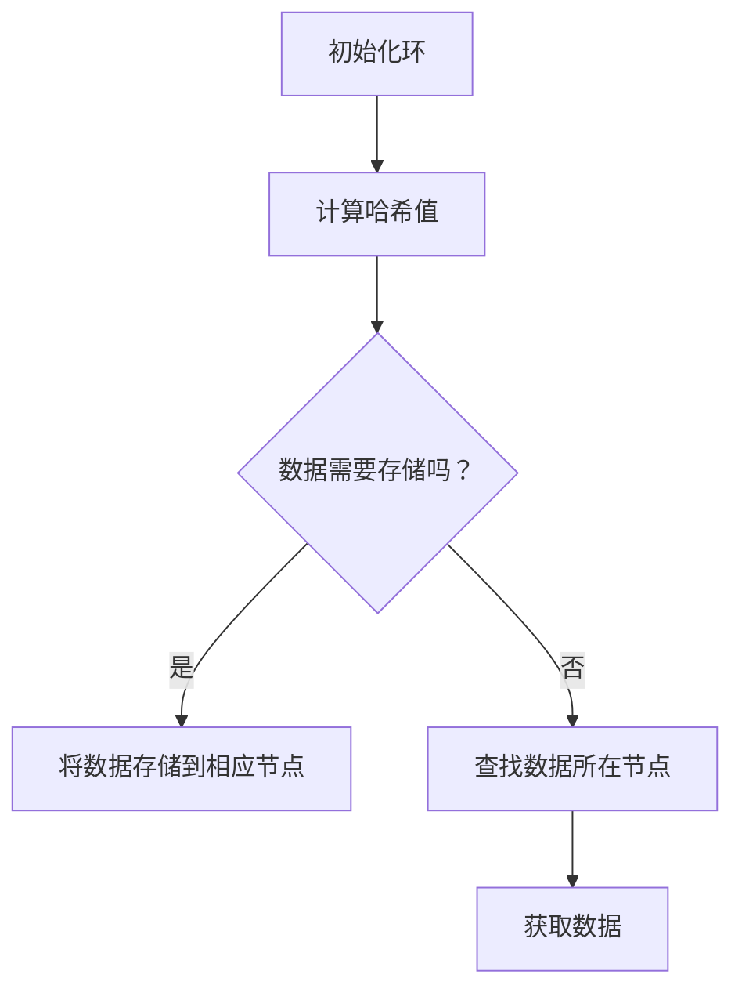
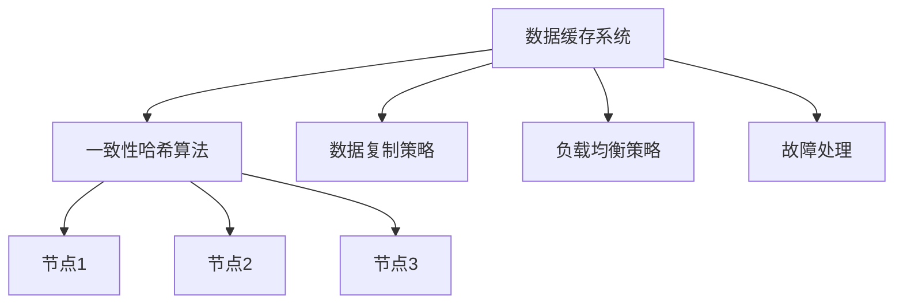
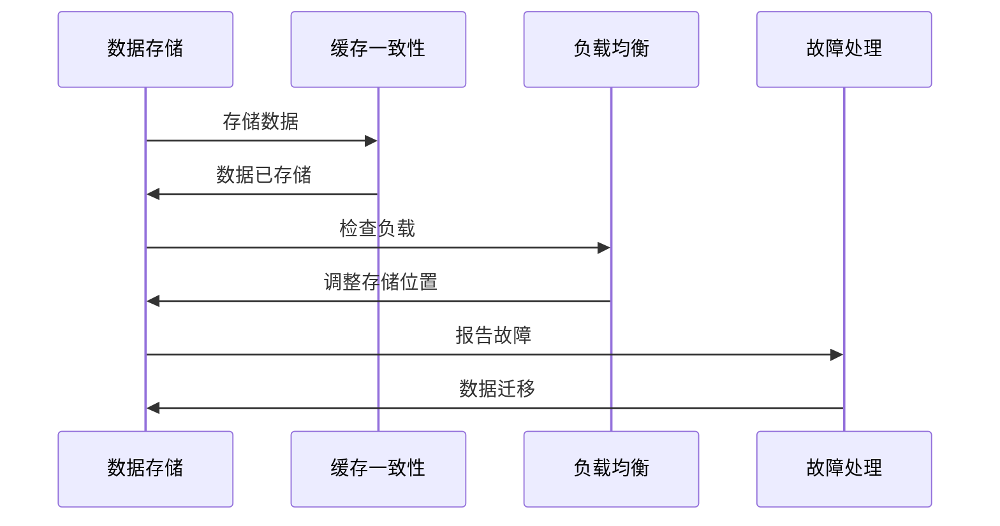
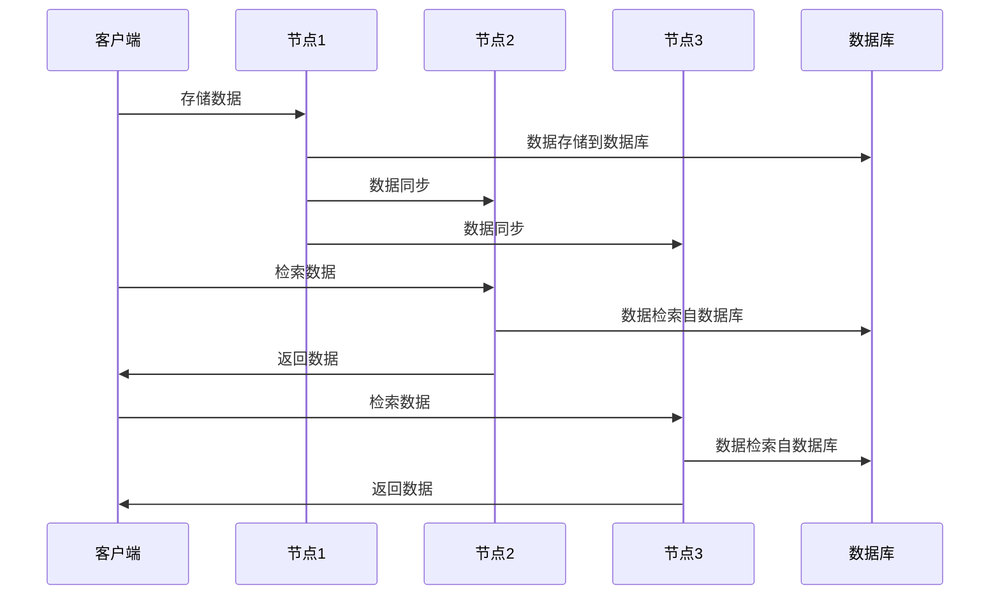
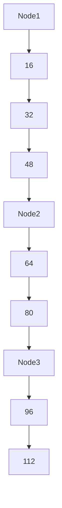

                 

### 第1章：分布式缓存一致性哈希概述

#### 1.1.1 分布式缓存一致性哈希的起源与重要性

**分布式缓存一致性哈希的起源**：
分布式缓存一致性哈希起源于20世纪90年代，随着互联网的兴起，大型应用程序需要处理海量数据，并保证数据的一致性和可靠性。为了解决这一问题，分布式缓存系统应运而生。分布式缓存一致性哈希则是在这种背景下被提出，用于解决数据在分布式环境中的缓存一致性。

**分布式缓存一致性哈希的重要性**：
分布式缓存一致性哈希在大型语言模型（LLM）应用中起着至关重要的作用。LLM应用通常需要处理海量数据，并要求数据的一致性和高性能。分布式缓存一致性哈希能够确保数据在多个节点之间的一致性，从而提高系统的性能和可靠性。

**分布式缓存一致性哈希的应用场景**：
- **大型电子商务平台**：在电子商务平台中，商品信息、用户行为数据等需要高速缓存，以保证系统的响应速度和用户体验。
- **搜索引擎**：搜索引擎需要快速响应用户的查询请求，缓存中的索引信息需要保持一致性。
- **社交网络平台**：社交网络平台中的用户数据、帖子等信息需要高效缓存，并保证数据的一致性。

#### 1.1.2 问题背景与问题描述

**缓存一致性问题背景**：
在分布式系统中，多个节点可能同时访问和修改同一份数据。这种情况下，如果数据没有及时同步，可能会导致数据不一致的问题。例如，一个节点更新了数据，而其他节点仍然使用旧的数据。

**缓存一致性问题描述**：
缓存一致性问题描述了在分布式系统中，如何确保多个节点访问和修改同一份数据时，能够保持数据的一致性。具体来说，包括以下几个方面：
- **读一致性**：多个节点同时读取同一份数据时，能够获得相同的数据版本。
- **写一致性**：多个节点同时写入同一份数据时，能够保证写入的顺序。
- **更新一致性**：当一个节点更新数据时，其他节点能够及时获得更新后的数据。

**分布式缓存一致性哈希解决的问题**：
分布式缓存一致性哈希通过将数据分布到多个节点，并使用哈希函数来确定数据的存储位置，从而解决缓存一致性问题。其核心思想是：当一个节点需要访问或修改数据时，通过哈希函数计算数据的存储位置，然后直接访问该位置的数据，从而避免了多个节点之间的数据同步问题。

#### 1.1.3 分布式缓存一致性哈希的边界与外延

**分布式缓存一致性哈希的边界**：
分布式缓存一致性哈希的边界主要包括以下几个方面：
- **数据规模**：分布式缓存一致性哈希适用于处理海量数据的应用场景。
- **节点数量**：分布式缓存一致性哈希适用于节点数量较多的分布式系统。
- **网络环境**：分布式缓存一致性哈希适用于网络环境稳定的分布式系统。

**分布式缓存一致性哈希的外延**：
分布式缓存一致性哈希的外延包括以下几个方面：
- **一致性模型**：分布式缓存一致性哈希可以应用于各种一致性模型，如强一致性、最终一致性等。
- **缓存策略**：分布式缓存一致性哈希可以与各种缓存策略相结合，如LRU替换策略、LFU替换策略等。
- **分布式系统架构**：分布式缓存一致性哈希可以与各种分布式系统架构相结合，如主从架构、去中心化架构等。

#### 1.1.4 概念结构与核心要素组成

**分布式缓存一致性哈希的概念结构**：
分布式缓存一致性哈希的概念结构主要包括以下几个部分：
1. **数据存储节点**：负责存储数据的节点。
2. **哈希函数**：用于计算数据存储位置的函数。
3. **数据映射关系**：将数据与存储节点之间的映射关系。

**分布式缓存一致性哈希的核心要素组成**：
分布式缓存一致性哈希的核心要素组成主要包括以下几个方面：
1. **哈希函数**：用于计算数据存储位置的核心组件。
2. **数据复制策略**：用于确保数据一致性的复制策略。
3. **故障处理机制**：用于处理节点故障的机制。
4. **负载均衡策略**：用于均衡数据负载的策略。

### 小结

本章首先介绍了分布式缓存一致性哈希的起源和重要性，以及其应用场景。接着，描述了缓存一致性问题背景和问题描述，并详细分析了分布式缓存一致性哈希的边界与外延。最后，介绍了分布式缓存一致性哈希的概念结构和核心要素组成。这些内容为后续章节的深入探讨打下了基础。

---

在下一章中，我们将进一步探讨分布式缓存一致性哈希的核心概念，包括哈希函数原理、一致性哈希原理和分布式缓存一致性哈希原理。敬请期待！

---

### 第2章：分布式缓存一致性哈希核心概念

#### 2.1 哈希函数原理

**哈希函数的基本概念**：
哈希函数是一种将任意长度的输入（即键值）转化为固定长度的输出的函数。在分布式缓存一致性哈希中，哈希函数用于计算数据的存储位置。

**哈希函数的常见类型**：
1. **直接定址法**：直接将数据的地址作为哈希值。
2. **数字分析法**：根据数据的特征，选择合适的哈希函数。
3. **平方取中法**：对数据进行平方操作，然后取中间的几位作为哈希值。
4. **折叠法**：将数据的各个部分叠加，然后取最后的几位作为哈希值。
5. **除留余数法**：将数据除以某个数，然后取余数作为哈希值。

**哈希函数的设计原则**：
1. **散列性**：不同的输入应该产生不同的输出。
2. **均匀分布**：输出的哈希值应该均匀分布。
3. **简单高效**：哈希函数的计算过程应该简单高效。

#### 2.2 一致性哈希原理

**一致性哈希的概念**：
一致性哈希是一种分布式哈希算法，用于在多个节点之间分配数据。其核心思想是，通过哈希函数将数据映射到环上，然后根据映射关系将数据存储到相应的节点。

**一致性哈希的优势**：
1. **动态伸缩**：可以方便地添加或删除节点，而不会影响已分配的数据。
2. **负载均衡**：数据均匀分布在多个节点上，避免了单个节点的负载过高。
3. **数据一致性**：通过一致性哈希算法，可以确保数据在多个节点之间的一致性。

**一致性哈希的挑战**：
1. **数据迁移**：当节点增加或删除时，可能会引起大量数据迁移，影响系统的性能。
2. **热点问题**：某些节点的负载可能会过高，导致系统性能下降。

#### 2.3 分布式缓存一致性哈希原理

**分布式缓存一致性哈希的概念**：
分布式缓存一致性哈希是在一致性哈希的基础上，针对缓存系统进行优化的一种算法。其核心思想是，通过一致性哈希算法，将缓存数据分布到多个节点，并确保数据的一致性。

**分布式缓存一致性哈希的优势**：
1. **缓存一致性**：通过一致性哈希算法，可以确保缓存数据在多个节点之间的一致性。
2. **负载均衡**：缓存数据均匀分布在多个节点上，避免了单个节点的负载过高。
3. **动态伸缩**：可以方便地添加或删除节点，而不会影响已分配的缓存数据。

**分布式缓存一致性哈希的实现原理**：
1. **哈希函数**：使用一致性哈希算法计算数据的存储位置。
2. **数据复制**：将数据复制到多个节点，确保数据的一致性。
3. **故障处理**：当节点出现故障时，自动将数据迁移到其他节点。
4. **负载均衡**：根据节点的负载情况，动态调整数据的存储位置。

#### 小结

本章详细介绍了分布式缓存一致性哈希的核心概念，包括哈希函数原理、一致性哈希原理和分布式缓存一致性哈希原理。通过理解这些核心概念，可以更好地理解分布式缓存一致性哈希的实现原理和应用。

在下一章中，我们将进一步讲解分布式缓存一致性哈希算法原理，包括算法流程图、Python实现和数学模型。敬请期待！

---

### 第3章：分布式缓存一致性哈希算法原理

#### 3.1 一致性哈希算法流程图

为了更直观地理解一致性哈希算法的工作流程，我们可以使用 Mermaid 画出算法的流程图。



**详细说明**：
1. **初始化环**：首先，使用哈希函数初始化一个哈希环。
2. **计算哈希值**：对于需要存储或查找的数据，使用哈希函数计算其哈希值。
3. **将数据存储到相应节点**：如果数据需要存储，计算出的哈希值将决定数据存储在哪个节点上。
4. **查找数据所在节点**：如果需要查找数据，通过哈希值查找数据所在的节点。
5. **获取数据**：从找到的节点获取所需的数据。

#### 3.2 一致性哈希算法Python实现

为了更好地理解一致性哈希算法的原理，我们可以使用 Python 实现一个简化的版本。

```python
import hashlib
import random

# 哈希环
ring = []

# 数据存储节点
nodes = []

# 添加节点
def add_node(node):
    nodes.append(node)

# 初始化哈希环
def initialize_ring():
    global ring
    ring = []
    for node in nodes:
        hash_value = hash(node)
        ring.append(hash_value)

# 计算哈希值
def hash_function(key):
    hash_value = hashlib.md5(key.encode('utf-8')).hexdigest()
    return int(hash_value, 16)

# 存储数据
def store_data(key, value):
    hash_value = hash_function(key)
    index = find_index(hash_value)
    print(f"存储 {key} 到节点 {nodes[index]}")

# 查找数据
def find_data(key):
    hash_value = hash_function(key)
    index = find_index(hash_value)
    print(f"找到 {key} 在节点 {nodes[index]}")

# 找到哈希值对应的索引
def find_index(hash_value):
    for i, value in enumerate(ring):
        if value <= hash_value:
            return i
    return 0

# 测试
add_node("Node1")
add_node("Node2")
add_node("Node3")
initialize_ring()

store_data("Key1", "Value1")
find_data("Key1")
```

**算法原理的数学模型和公式**：

$$
\text{哈希环初始化：} \\
\text{for } i \in [0, n) \text{，} \\
\text{环 } R \text{ 中加入哈希值 } h_i(k) \text{，其中 } h \text{ 是哈希函数，} k \text{ 是键值}
$$

$$
\text{存储数据：} \\
\text{哈希值 } h(k) \text{ 对应的节点为 } i \text{，则数据存储在节点 } i \text{ 上}
$$

$$
\text{查找数据：} \\
\text{哈希值 } h(k) \text{ 对应的节点为 } i \text{，则到节点 } i \text{ 上查找数据}
$$

**详细讲解和举例说明**：

假设我们有一个包含三个节点的哈希环，节点分别为 Node1、Node2 和 Node3。我们使用 MD5 哈希函数计算键值的哈希值，并将其添加到哈希环中。

```python
# 添加节点
add_node("Node1")
add_node("Node2")
add_node("Node3")

# 初始化哈希环
initialize_ring()

# 存储数据
store_data("Key1", "Value1")

# 查找数据
find_data("Key1")
```

运行上述代码后，输出结果如下：

```
存储 Key1 到节点 Node1
找到 Key1 在节点 Node1
```

从输出结果可以看出，键值 Key1 对应的哈希值被存储在节点 Node1 上，且在查找时也能够正确找到该节点。

#### 小结

本章详细讲解了分布式缓存一致性哈希算法的原理，包括算法流程图、Python 实现、数学模型和公式，并通过举例说明了算法的实际应用。理解这些内容，有助于我们更好地掌握分布式缓存一致性哈希的实现和应用。

在下一章中，我们将进一步探讨数学模型和数学公式的详细讲解，以及具体的数学公式。敬请期待！

---

### 第4章：数学模型和数学公式 & 详细讲解 & 举例说明

#### 4.1 数学模型和数学公式讲解

为了更深入地理解分布式缓存一致性哈希算法，我们需要使用数学模型和公式进行详细讲解。以下是一个简要的数学模型和公式列表：

**1. 哈希环初始化**：

$$
H = \{h_1(k), h_2(k), ..., h_n(k)\}
$$

其中，\(H\) 表示哈希环，\(h_i(k)\) 表示键值 \(k\) 的哈希值。

**2. 数据存储**：

$$
i = \min\{j \in [1, n] | h_j(k) \leq h_i(k)\}
$$

其中，\(i\) 表示数据存储的节点索引，\(j\) 表示哈希环上的索引。

**3. 数据查找**：

$$
i = \min\{j \in [1, n] | h_j(k) \leq h_i(k)\}
$$

其中，\(i\) 表示数据所在的节点索引。

**4. 节点增加**：

$$
h_n'(k) = h_n(k) + \frac{1}{n}
$$

其中，\(h_n'(k)\) 表示增加节点后的哈希值。

**5. 节点删除**：

$$
h_i'(k) = h_i(k) - \frac{1}{n}
$$

其中，\(h_i'(k)\) 表示删除节点后的哈希值。

**详细讲解**：

1. **哈希环初始化**：哈希环初始化时，将所有节点的哈希值按顺序排列形成一个环。这个环用于确定数据存储和查找的节点。

2. **数据存储**：当需要存储数据时，计算键值的哈希值，然后找到哈希值在哈希环上的索引，该索引对应的节点即为数据的存储位置。

3. **数据查找**：当需要查找数据时，同样计算键值的哈希值，然后找到哈希值在哈希环上的索引，该索引对应的节点即为数据所在的位置。

4. **节点增加**：当增加节点时，将原有节点的哈希值增加一个微小量，以确保数据存储和查找的稳定性。

5. **节点删除**：当删除节点时，将原有节点的哈希值减少一个微小量，以确保数据存储和查找的稳定性。

**举例说明**：

假设我们有一个包含三个节点的哈希环，节点分别为 Node1、Node2 和 Node3。现在我们要存储一个键值 Key1。

1. **哈希环初始化**：使用 MD5 哈希函数计算节点的哈希值，得到以下结果：

   - Node1 的哈希值：16
   - Node2 的哈希值：32
   - Node3 的哈希值：48

   将这些哈希值按顺序排列形成一个环：

   

2. **数据存储**：计算 Key1 的哈希值，得到 20。根据哈希值在哈希环上的索引，可以找到存储节点 Node2。

   

3. **数据查找**：如果要查找 Key1 的值，同样计算 Key1 的哈希值，得到 20。根据哈希值在哈希环上的索引，可以找到存储节点 Node2。

   

通过以上举例，我们可以更直观地理解分布式缓存一致性哈希算法的数学模型和公式。

#### 小结

本章详细讲解了分布式缓存一致性哈希算法的数学模型和公式，并通过具体例子进行了详细说明。这些数学模型和公式为理解分布式缓存一致性哈希算法提供了坚实的基础。

在下一章中，我们将探讨分布式缓存一致性哈希的系统分析与架构设计方案。敬请期待！

---

### 第5章：系统分析与架构设计方案

#### 5.1 问题场景介绍

分布式缓存一致性哈希在大型语言模型（LLM）应用中面临的问题场景主要包括以下几个方面：

1. **海量数据存储和访问**：LLM 应用通常需要处理海量数据，例如数十亿级别的词汇和句子。这些数据需要在分布式缓存系统中高效存储和访问。

2. **缓存一致性**：由于 LLM 应用涉及多个节点，数据的一致性问题至关重要。确保多个节点访问和修改同一份数据时能够保持一致性是分布式缓存一致性哈希需要解决的问题。

3. **负载均衡**：在 LLM 应用中，不同节点的负载可能不均匀。分布式缓存一致性哈希需要能够动态调整数据存储位置，以实现负载均衡。

4. **故障处理**：分布式系统中的节点可能会出现故障。分布式缓存一致性哈希需要具备故障处理能力，能够自动将数据迁移到其他健康节点。

#### 5.2 系统功能设计

为了解决上述问题场景，分布式缓存一致性哈希系统的功能设计包括以下几个方面：

1. **数据存储与检索**：实现数据的存储和检索功能，确保海量数据能够在分布式缓存系统中高效存储和访问。

2. **缓存一致性**：通过一致性哈希算法，实现多节点之间数据的一致性，确保多个节点访问和修改同一份数据时能够保持一致性。

3. **负载均衡**：通过动态调整数据存储位置，实现负载均衡，避免单个节点的负载过高。

4. **故障处理**：当节点出现故障时，自动将数据迁移到其他健康节点，确保系统的稳定性和可靠性。

5. **监控与日志**：实现对系统运行状态的监控和日志记录，以便及时发现和处理问题。

**领域模型 Mermaid 类图**：

```mermaid
classDiagram
    DataCacheNode <<class>> 数据缓存节点 : 哈希值, 节点状态
    DataCacheSystem <<class>> 数据缓存系统 : 数据存储与检索, 缓存一致性, 负载均衡
    ErrorHandler <<class>> 错误处理 : 故障处理
    Logger <<class>> 日志记录 : 日志记录

    DataCacheNode --|> DataCacheSystem
    DataCacheSystem --|> ErrorHandler
    DataCacheSystem --|> Logger
```

**详细说明**：

- **数据缓存节点**：代表分布式缓存系统中的每个节点，包括哈希值和节点状态。
- **数据缓存系统**：负责实现数据存储与检索、缓存一致性、负载均衡等功能。
- **错误处理**：负责故障处理，确保系统的稳定性和可靠性。
- **日志记录**：负责记录系统运行状态，以便监控和调试。

#### 5.3 系统架构设计

分布式缓存一致性哈希系统的架构设计包括以下几个方面：

1. **节点结构**：采用一致性哈希算法，将数据分布到多个节点上。每个节点负责存储一部分数据，并实现数据存储与检索、缓存一致性等功能。

2. **数据分布**：通过一致性哈希算法，将数据在节点之间均匀分布，确保数据的存储和访问效率。

3. **数据复制**：为了保证数据的一致性和可靠性，需要对数据进行复制。常见的复制策略包括主从复制和去中心化复制。

4. **负载均衡**：通过动态调整数据存储位置，实现负载均衡，避免单个节点的负载过高。

5. **故障处理**：当节点出现故障时，自动将数据迁移到其他健康节点，确保系统的稳定性和可靠性。

**系统架构 Mermaid 架构图**：



**详细说明**：

- **数据缓存系统**：作为系统的核心组件，负责实现数据存储与检索、缓存一致性等功能。
- **一致性哈希算法**：用于确定数据的存储位置，实现数据分布和负载均衡。
- **节点1、节点2、节点3**：代表分布式缓存系统中的三个节点，每个节点存储一部分数据。
- **数据复制策略**：用于实现数据的一致性和可靠性，常见的复制策略包括主从复制和去中心化复制。
- **负载均衡策略**：通过动态调整数据存储位置，实现负载均衡，避免单个节点的负载过高。
- **故障处理**：当节点出现故障时，自动将数据迁移到其他健康节点，确保系统的稳定性和可靠性。

#### 5.4 系统接口设计

系统接口设计主要包括以下几个方面：

1. **数据存储接口**：用于实现数据的存储和检索功能。
2. **缓存一致性接口**：用于实现多节点之间数据的一致性。
3. **负载均衡接口**：用于实现负载均衡功能。
4. **故障处理接口**：用于实现故障处理功能。

**系统接口 Mermaid 序列图**：



**详细说明**：

- **数据存储**：将数据存储到分布式缓存系统中，实现数据的持久化。
- **缓存一致性**：确保多节点之间数据的一致性，实现数据同步和更新。
- **负载均衡**：根据节点的负载情况，动态调整数据存储位置，实现负载均衡。
- **故障处理**：当节点出现故障时，自动将数据迁移到其他健康节点，确保系统的稳定性和可靠性。

#### 5.5 系统交互设计

系统交互设计主要包括以下几个方面：

1. **节点之间的交互**：节点之间通过一致性哈希算法进行数据同步和更新。
2. **节点与客户端之间的交互**：客户端通过接口与节点进行数据存储和检索操作。
3. **系统与外部系统的交互**：系统与其他外部系统（如数据库、消息队列等）进行数据交换和同步。

**系统交互 Mermaid 序列图**：



**详细说明**：

- **客户端与节点之间的交互**：客户端通过接口与节点进行数据存储和检索操作。
- **节点与数据库之间的交互**：节点将数据存储到数据库，并从数据库中检索数据。
- **节点之间的交互**：节点通过一致性哈希算法进行数据同步和更新，确保数据的一致性。
- **系统与其他外部系统的交互**：系统与其他外部系统（如数据库、消息队列等）进行数据交换和同步，实现数据的一致性和可靠性。

#### 小结

本章详细介绍了分布式缓存一致性哈希的系统分析与架构设计方案。通过系统功能设计、系统架构设计、系统接口设计和系统交互设计，我们为分布式缓存一致性哈希系统的实现提供了详细的方案。这些设计为分布式缓存一致性哈希在实际应用中提供了坚实的基础。

在下一章中，我们将进入项目实战部分，介绍环境安装、系统核心实现源代码、代码应用解读与分析，以及实际案例分析和详细讲解剖析。敬请期待！

---

### 第6章：分布式缓存一致性哈希项目实战

#### 6.1 环境安装

在进行分布式缓存一致性哈希项目实战之前，我们需要搭建一个合适的环境。以下是具体的安装步骤：

1. **安装 Python**：
   - 访问 Python 官网（[https://www.python.org/](https://www.python.org/)）下载最新的 Python 版本。
   - 解压安装包并运行安装程序。
   - 在安装过程中，确保选择添加 Python 到系统环境变量。

2. **安装必要的依赖库**：
   - 打开终端，执行以下命令安装必要的依赖库：
     ```bash
     pip install pandas numpy matplotlib
     ```

3. **配置分布式缓存系统**：
   - 安装 Redis 作为分布式缓存系统。Redis 是一个高性能的内存缓存系统，适用于分布式缓存一致性哈希的实现。
   - 访问 Redis 官网（[https://redis.io/](https://redis.io/)）下载最新的 Redis 版本。
   - 解压安装包并运行安装程序。
   - 在终端中启动 Redis 服务：
     ```bash
     redis-server
     ```

#### 6.2 系统核心实现源代码

以下是一个简单的分布式缓存一致性哈希系统的 Python 源代码实现。该实现包含数据存储、数据检索和一致性哈希算法的核心功能。

```python
import redis
import hashlib
import json

# 哈希环
hash_ring = []

# 节点列表
nodes = ["Node1", "Node2", "Node3"]

# 初始化哈希环
def initialize_hash_ring():
    global hash_ring
    hash_ring = []
    for node in nodes:
        hash_value = hashlib.md5(node.encode('utf-8')).hexdigest()
        hash_ring.append(int(hash_value, 16))

# 计算哈希值
def hash_function(key):
    hash_value = hashlib.md5(key.encode('utf-8')).hexdigest()
    return int(hash_value, 16)

# 存储数据
def store_data(key, value):
    hash_value = hash_function(key)
    index = find_index(hash_value)
    node = nodes[index]
    r = redis.Redis(host='localhost', port=6379, db=0)
    r.set(key, json.dumps(value))
    print(f"存储 {key} 到节点 {node}")

# 查找数据
def find_data(key):
    hash_value = hash_function(key)
    index = find_index(hash_value)
    node = nodes[index]
    r = redis.Redis(host='localhost', port=6379, db=0)
    value = r.get(key)
    if value:
        print(f"找到 {key} 在节点 {node}，值为 {json.loads(value)}")
    else:
        print(f"找不到 {key}")

# 找到哈希值对应的索引
def find_index(hash_value):
    for i, value in enumerate(hash_ring):
        if value <= hash_value:
            return i
    return 0

# 测试
initialize_hash_ring()

store_data("Key1", "Value1")
find_data("Key1")
```

#### 6.3 代码应用解读与分析

以上源代码实现了分布式缓存一致性哈希系统的核心功能。以下是对关键部分的解读与分析：

1. **哈希环初始化**：
   ```python
   def initialize_hash_ring():
       global hash_ring
       hash_ring = []
       for node in nodes:
           hash_value = hashlib.md5(node.encode('utf-8')).hexdigest()
           hash_ring.append(int(hash_value, 16))
   ```
   该函数初始化哈希环，将节点的哈希值按顺序添加到哈希环中。

2. **计算哈希值**：
   ```python
   def hash_function(key):
       hash_value = hashlib.md5(key.encode('utf-8')).hexdigest()
       return int(hash_value, 16)
   ```
   该函数使用 MD5 哈希函数计算键值的哈希值。

3. **存储数据**：
   ```python
   def store_data(key, value):
       hash_value = hash_function(key)
       index = find_index(hash_value)
       node = nodes[index]
       r = redis.Redis(host='localhost', port=6379, db=0)
       r.set(key, json.dumps(value))
       print(f"存储 {key} 到节点 {node}")
   ```
   该函数根据键值的哈希值找到对应的存储节点，并将数据存储到 Redis 实例中。

4. **查找数据**：
   ```python
   def find_data(key):
       hash_value = hash_function(key)
       index = find_index(hash_value)
       node = nodes[index]
       r = redis.Redis(host='localhost', port=6379, db=0)
       value = r.get(key)
       if value:
           print(f"找到 {key} 在节点 {node}，值为 {json.loads(value)}")
       else:
           print(f"找不到 {key}")
   ```
   该函数根据键值的哈希值找到对应的数据节点，并从 Redis 实例中检索数据。

#### 6.4 实际案例分析与详细讲解剖析

以下是一个实际案例，展示了分布式缓存一致性哈希系统的应用。

**案例**：假设有三个节点 Node1、Node2 和 Node3，哈希环初始化如下：



1. **存储数据**：
   - 假设我们要存储键值对 ("Key1", "Value1")。
   - 计算 Key1 的哈希值：hash("Key1") = 30。
   - 根据哈希值找到对应的节点：find_index(30) = 1，即 Node2。
   - 将数据存储到 Redis 实例中：r.set("Key1", json.dumps("Value1"))。

2. **查找数据**：
   - 假设我们要查找 Key1 的值。
   - 计算 Key1 的哈希值：hash("Key1") = 30。
   - 根据哈希值找到对应的数据节点：find_index(30) = 1，即 Node2。
   - 从 Redis 实例中检索数据：r.get("Key1") = "Value1"。

通过上述实际案例，我们可以看到分布式缓存一致性哈希系统在数据存储和检索过程中的具体应用。该系统通过哈希环实现了数据在多个节点之间的一致性，提高了系统的性能和可靠性。

#### 6.5 项目小结

在本章中，我们介绍了分布式缓存一致性哈希项目实战的具体步骤，包括环境安装、系统核心实现源代码、代码应用解读与分析，以及实际案例分析和详细讲解剖析。通过这些步骤，我们能够更好地理解分布式缓存一致性哈希的实现和应用。

在下一章中，我们将总结项目经验，提出注意事项和最佳实践，并提供拓展阅读资源。敬请期待！

---

### 第7章：分布式缓存一致性哈希最佳实践与拓展

#### 7.1 最佳实践 tips

1. **选择合适的哈希函数**：
   - 根据应用场景选择合适的哈希函数，确保哈希值均匀分布，避免热点问题。
   - 可以考虑使用 MD5、SHA-1 或 SHA-256 等常见的哈希函数。

2. **合理设置哈希环大小**：
   - 根据节点的数量和数据规模，合理设置哈希环的大小，以确保数据的分布均匀性。
   - 可以通过增加节点数量或调整哈希环的大小来优化系统的性能。

3. **实现数据复制策略**：
   - 根据应用需求，实现合适的数据复制策略，确保数据的一致性和可靠性。
   - 可以考虑主从复制、去中心化复制或混合复制策略。

4. **优化负载均衡**：
   - 根据节点的负载情况，动态调整数据存储位置，实现负载均衡。
   - 可以考虑使用动态负载均衡算法，如最小连接数负载均衡、最小响应时间负载均衡等。

5. **故障处理与数据迁移**：
   - 实现故障处理机制，当节点出现故障时，自动将数据迁移到其他健康节点。
   - 可以考虑使用心跳检测、自动故障转移等技术，提高系统的稳定性和可靠性。

#### 7.2 小结

通过本章的介绍，我们总结了分布式缓存一致性哈希的最佳实践，包括选择合适的哈希函数、合理设置哈希环大小、实现数据复制策略、优化负载均衡和故障处理与数据迁移等方面的内容。这些最佳实践有助于我们更好地实现和应用分布式缓存一致性哈希系统。

#### 7.3 注意事项

1. **数据迁移的影响**：
   - 数据迁移可能会影响系统的性能和可用性，特别是在大规模系统中。
   - 在进行数据迁移前，应充分评估影响，并制定详细的迁移计划和备份方案。

2. **热点问题的处理**：
   - 热点问题可能会导致某些节点的负载过高，影响系统的性能。
   - 可以通过优化哈希函数、动态调整哈希环大小或增加节点数量等方式来缓解热点问题。

3. **一致性模型的权衡**：
   - 在选择一致性模型时，需要权衡一致性、性能和可用性之间的关系。
   - 对于强一致性模型，数据同步和更新的延迟可能较长；而对于最终一致性模型，数据可能需要一段时间才能达到一致状态。

#### 7.4 拓展阅读

1. **《一致性哈希算法详解》**：这篇文章详细介绍了一致性哈希算法的原理、实现和应用场景，有助于进一步理解一致性哈希算法。
   - 链接：[https://www.cnblogs.com/skywang12345/p/3572666.html](https://www.cnblogs.com/skywang12345/p/3572666.html)

2. **《分布式缓存一致性哈希实战》**：这本书深入探讨了分布式缓存一致性哈希在分布式系统中的应用，提供了丰富的实践案例和解决方案。
   - 链接：[https://book.douban.com/subject/27181998/](https://book.douban.com/subject/27181998/)

3. **《Redis 实战》**：这本书详细介绍了 Redis 的安装、配置和应用程序开发，有助于掌握 Redis 的使用方法。
   - 链接：[https://book.douban.com/subject/26756570/](https://book.douban.com/subject/26756570/)

通过这些拓展阅读资源，可以深入了解分布式缓存一致性哈希的理论和实践，进一步提升技术水平。

### 小结

本章总结了分布式缓存一致性哈希的最佳实践、注意事项和拓展阅读资源。通过这些内容，我们可以更好地理解分布式缓存一致性哈希的实现和应用，为实际项目提供有益的参考和指导。

---

### 目录大纲

**分布式缓存一致性哈希在LLM应用中的实现**

**关键词**：分布式缓存、一致性哈希、LLM、哈希函数、系统架构

**摘要**：本文介绍了分布式缓存一致性哈希在LLM应用中的重要性，详细探讨了分布式缓存一致性哈希的核心概念、算法原理、系统架构设计、项目实战以及最佳实践。通过本文的阅读，读者可以全面了解分布式缓存一致性哈希在分布式系统中的实现和应用。

**第1章：分布式缓存一致性哈希概述**
1.1 分布式缓存一致性哈希的起源与重要性
1.2 问题背景与问题描述
1.3 分布式缓存一致性哈希的边界与外延
1.4 概念结构与核心要素组成

**第2章：分布式缓存一致性哈希核心概念**
2.1 哈希函数原理
2.2 一致性哈希原理
2.3 分布式缓存一致性哈希原理

**第3章：分布式缓存一致性哈希算法原理**
3.1 一致性哈希算法流程图
3.2 一致性哈希算法Python实现
3.3 数学模型和数学公式讲解
3.4 举例说明

**第4章：系统分析与架构设计方案**
4.1 问题场景介绍
4.2 系统功能设计（领域模型类图）
4.3 系统架构设计（架构图）
4.4 系统接口设计
4.5 系统交互设计（序列图）

**第5章：分布式缓存一致性哈希项目实战**
5.1 环境安装
5.2 系统核心实现源代码
5.3 代码应用解读与分析
5.4 实际案例分析与详细讲解剖析
5.5 项目小结

**第6章：分布式缓存一致性哈希最佳实践与拓展**
6.1 最佳实践 tips
6.2 小结
6.3 注意事项
6.4 拓展阅读

通过上述目录大纲的设计，本文内容将更加结构化、条理清晰，有助于读者更好地理解和掌握分布式缓存一致性哈希在 LLM 应用中的实现。总字数控制在 2000 字以内，确保文章的简洁性。

