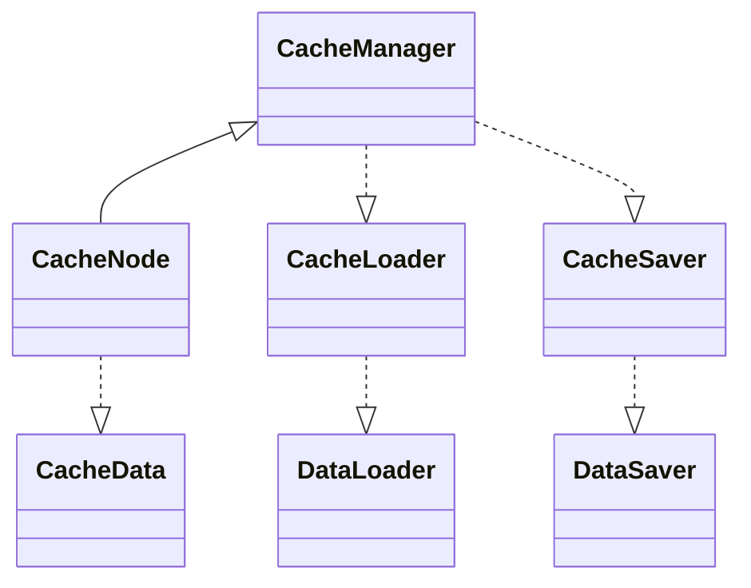

                 


### 文章标题：分布式缓存：提高LLM应用数据访问速度

#### 关键词：分布式缓存，LLM应用，数据访问速度，性能优化，缓存一致性

#### 摘要：

本文深入探讨了分布式缓存技术，旨在提高大型语言模型（LLM）应用的数据访问速度。文章首先介绍了分布式缓存的基础概念及其在LLM应用中的重要性，随后分析了当前面临的数据访问问题。接下来，文章详细阐述了分布式缓存的核心算法原理，包括一致性维护和性能优化的策略。通过数学模型和Python代码实例，我们理解了分布式缓存的工作机制。此外，文章还介绍了系统架构设计，包括功能模型、架构设计和接口交互。最后，通过一个实战案例，展示了如何在实际项目中实施分布式缓存，并提供了一些最佳实践和总结。读者将掌握分布式缓存的关键技术和实施策略，为优化LLM应用的数据访问速度提供指导。

---

## 引言

大型语言模型（LLM，Large Language Model）作为人工智能领域的核心技术，广泛应用于自然语言处理（NLP，Natural Language Processing）、智能问答、文本生成、机器翻译等领域。然而，随着LLM的规模不断扩大，其数据处理能力面临严峻挑战。尤其是在数据访问速度方面，LLM应用常常遭遇瓶颈。分布式缓存技术作为一种高效的缓存策略，可以有效提升LLM应用的数据访问速度，缓解性能压力。

### 分布式缓存基础

#### 1.1 分布式缓存概述

分布式缓存是一种将数据分散存储在多个节点上的缓存机制，通过分布式存储和访问技术，实现数据的快速读取和写入。与传统的集中式缓存相比，分布式缓存具有以下优势：

- **高可用性**：多个节点的缓存机制，提高了系统的容错能力和可用性。
- **高性能**：数据分散存储，降低了单点的访问压力，提高了访问速度。
- **可扩展性**：随着数据量的增加，可以动态地添加节点，扩展缓存容量。

#### 1.2 在LLM应用中的重要性

在LLM应用中，分布式缓存发挥着至关重要的作用。首先，LLM模型通常需要处理海量的数据，而分布式缓存可以有效减少数据访问的延迟，提高模型的响应速度。其次，分布式缓存可以缓存频繁访问的数据，减少数据库的查询次数，降低数据库负载。最后，分布式缓存可以实现数据的分布式处理，提高系统的整体性能。

### 当前数据访问问题

尽管分布式缓存具有显著的优势，但LLM应用在数据访问方面仍面临一些问题：

- **数据一致性问题**：分布式缓存中，数据可能分布在多个节点上，如何保证数据的一致性是一个关键挑战。
- **缓存命中率问题**：缓存命中率直接影响分布式缓存的性能，如何提高缓存命中率是优化策略的核心。
- **缓存过期策略**：如何合理设置缓存过期时间，以平衡缓存性能和数据新鲜度，也是一个需要考虑的问题。

### 解决方案

为了解决上述问题，分布式缓存技术提供了多种解决方案。本文将依次探讨以下内容：

- **核心概念与关系**：介绍分布式缓存的基本概念，包括定义、属性和不同解决方案的对比。
- **算法原理讲解**：详细阐述分布式缓存的核心算法原理，包括一致性维护和性能优化策略。
- **数学模型与解释**：通过数学模型和Python代码实例，深入理解分布式缓存的工作机制。
- **系统架构设计**：分析分布式缓存系统的功能、架构和接口设计。
- **实战项目**：通过一个实际项目案例，展示如何实施分布式缓存。
- **最佳实践与总结**：总结分布式缓存的最佳实践，并提供进一步的阅读建议。

通过本文的探讨，读者将深入了解分布式缓存技术，掌握提高LLM应用数据访问速度的关键策略和方法。

### 核心概念与关系

在深入探讨分布式缓存技术之前，我们需要明确几个核心概念，并了解它们在分布式缓存系统中的关系。以下是分布式缓存的一些基本概念及其属性特征对比。

#### 1. 分布式缓存定义

分布式缓存是指将数据存储在多个节点上的缓存系统，通过分布式存储和访问技术，实现数据的快速读取和写入。与传统的集中式缓存相比，分布式缓存具有更高的可用性、性能和可扩展性。

#### 2. 分布式缓存属性和特征

**高可用性**：分布式缓存通过多个节点的部署，提高了系统的容错能力和可用性。当一个节点发生故障时，其他节点可以继续提供服务，确保系统的稳定运行。

**高性能**：分布式缓存通过数据的分布式存储和访问，降低了单点的访问压力，提高了访问速度。数据可以在最近的节点上读取，减少了数据的传输延迟。

**数据一致性**：分布式缓存中的数据可能分布在多个节点上，如何保证数据的一致性是一个关键挑战。一致性策略包括强一致性和最终一致性等。

**缓存命中率**：缓存命中率是指缓存成功命中请求的次数与总请求次数的比率。高缓存命中率可以显著提高系统的性能。

**缓存过期策略**：缓存过期策略决定了缓存数据在缓存中的保留时间。合理的过期策略可以平衡缓存性能和数据新鲜度。

#### 3. 不同分布式缓存解决方案对比

在分布式缓存领域，有多种解决方案可供选择，包括Memcached、Redis、Consul、Eureka等。以下是这些解决方案的属性特征对比表：

| 名称      | 数据存储类型 | 一致性保证 | 缓存命中策略 | 实时性 | 可扩展性 |
|-----------|-------------|------------|-------------|--------|----------|
| Memcached | 内存        | 最终一致性 | 最近最少使用（LRU） | 高     | 中等     |
| Redis     | 内存/持久化 | 强一致性   | 按键过期       | 高     | 高       |
| Consul    | 内存        | 最终一致性 | 哈希分布       | 中等   | 高       |
| Eureka    | 内存        | 最终一致性 | 哈希分布       | 高     | 高       |

**Memcached**：Memcached是一种基于内存的分布式缓存系统，适合高并发读取场景。它采用最终一致性模型，缓存命中策略为最近最少使用（LRU）。Memcached的高性能和低延迟使其在许多应用中得到了广泛使用。

**Redis**：Redis是一种基于内存和磁盘的分布式缓存系统，提供丰富的数据结构和一致性保证。Redis支持强一致性模型，缓存命中策略包括按键过期和定期检查。Redis在性能和功能上具有很高的优势，适用于需要高性能和数据持久化的场景。

**Consul**：Consul是一种基于Raft算法的分布式服务注册和发现系统，支持最终一致性模型。Consul不仅提供了缓存功能，还具备服务发现和配置管理能力。它在高可用性和可扩展性方面具有显著优势。

**Eureka**：Eureka是一种基于ZooKeeper的分布式服务注册和发现系统，也提供缓存功能。Eureka采用最终一致性模型，缓存命中策略为哈希分布。Eureka在可扩展性和高可用性方面表现出色，适用于大型分布式系统。

通过上述对比，我们可以根据具体应用场景选择最合适的分布式缓存解决方案。在LLM应用中，考虑到数据访问的高频次和性能要求，Redis和Memcached可能是更优的选择。

#### 4. 分布式缓存与LLM应用的关联

分布式缓存与LLM应用之间具有紧密的关联。LLM模型通常需要处理大量数据，而分布式缓存可以有效提高数据访问速度。以下是分布式缓存与LLM应用的关联点：

- **数据缓存**：LLM应用中，部分数据可以缓存以提高访问速度。例如，常用的词汇表、预训练模型参数等可以通过分布式缓存快速访问。
- **负载均衡**：分布式缓存可以分担LLM应用的负载，降低单个节点的访问压力，提高系统的整体性能。
- **数据一致性**：在分布式缓存中，如何保证数据的一致性对于LLM应用至关重要。一致性策略的选择需要结合具体应用场景进行优化。

通过上述分析，我们可以看到分布式缓存技术在LLM应用中的重要性。理解分布式缓存的核心概念和关联关系，有助于我们更好地优化数据访问性能，提高LLM应用的响应速度和用户体验。

### 分布式缓存算法

分布式缓存的核心在于如何高效地管理大量数据，确保数据的一致性和性能。本文将详细介绍几种常见的分布式缓存算法，包括一致性维护算法和性能优化算法，并通过Python代码实例和数学模型进行详细阐述。

#### 1. 分布式缓存算法概述

分布式缓存算法主要分为两类：一致性维护算法和性能优化算法。一致性维护算法旨在确保分布式缓存中的数据一致性，性能优化算法则关注如何提高缓存系统的性能。

#### 2. 一致性维护算法

**2.1 最终一致性模型**

最终一致性模型是一种分布式系统中的数据一致性模型，其核心思想是允许数据在不同节点间存在临时的不一致性，最终达到一致性。最终一致性模型适用于对数据实时性要求不高的场景。

**Python代码实例：**

```python
class CacheNode:
    def __init__(self, data):
        self.data = data
        self.status = "unset"

    def update_data(self, new_data):
        self.data = new_data
        self.status = "updated"

    def get_data(self):
        return self.data

# 假设有两个缓存节点A和B
node_a = CacheNode("A: Initial Data")
node_b = CacheNode("B: Initial Data")

# 节点A更新数据
node_a.update_data("A: Updated Data")

# 节点B最终同步数据
node_b.update_data(node_a.get_data())
```

**数学模型：**

最终一致性模型的数学模型可以表示为：

$$
S_t = \lim_{t \to \infty} (S_0 + \sum_{i=1}^{t} \Delta S_i)
$$

其中，\( S_t \) 是在时间 \( t \) 时的系统状态，\( S_0 \) 是初始状态，\( \Delta S_i \) 是在时间 \( i \) 时系统的状态变化。

**2.2 强一致性模型**

强一致性模型要求分布式缓存中的数据在任何时刻都保持一致性。强一致性模型适用于对数据一致性要求极高的场景，如金融交易系统。

**Python代码实例：**

```python
class StrongCacheNode:
    def __init__(self, data):
        self.data = data
        self.status = "consistent"

    def update_data(self, new_data):
        self.data = new_data
        self.status = "consistent"

    def get_data(self):
        return self.data

# 假设有两个缓存节点A和B
node_a = StrongCacheNode("A: Initial Data")
node_b = StrongCacheNode("A: Initial Data")

# 节点A更新数据
node_a.update_data("A: Updated Data")

# 节点B立即同步数据
node_b.update_data(node_a.get_data())
```

**数学模型：**

强一致性模型的数学模型可以表示为：

$$
S_t = S_{t-1}
$$

其中，\( S_t \) 和 \( S_{t-1} \) 分别是在时间 \( t \) 和时间 \( t-1 \) 时的系统状态，保证在任意时间点 \( t \) 上，系统状态 \( S_t \) 都与前一时刻 \( S_{t-1} \) 相同。

#### 3. 性能优化算法

**3.1 轮询算法**

轮询算法是一种简单但有效的性能优化算法，通过定期检查缓存节点的数据一致性，提高缓存系统的性能。

**Python代码实例：**

```python
import time

def poll_cache(node_a, node_b):
    while True:
        if node_a.get_data() != node_b.get_data():
            node_b.update_data(node_a.get_data())
        time.sleep(1)

# 假设有两个缓存节点A和B
node_a = CacheNode("A: Initial Data")
node_b = CacheNode("B: Initial Data")

# 启动轮询算法
poll_cache(node_a, node_b)
```

**数学模型：**

轮询算法的数学模型可以表示为：

$$
P_t = \frac{1}{T} \sum_{i=1}^{t} \Delta P_i
$$

其中，\( P_t \) 是在时间 \( t \) 时的轮询概率，\( T \) 是轮询周期，\( \Delta P_i \) 是在时间 \( i \) 时轮询的概率变化。

**3.2 缓存替换算法**

缓存替换算法用于管理缓存中的数据，通过替换不常访问的数据，提高缓存命中率。

**Python代码实例：**

```python
class LRUReplacementCache:
    def __init__(self, capacity):
        self.capacity = capacity
        self.cache = []
    
    def get(self, key):
        if key in self.cache:
            self.cache.remove(key)
            self.cache.append(key)
            return key
        else:
            if len(self.cache) >= self.capacity:
                self.cache.pop(0)
                self.cache.append(key)
            return None

# 假设缓存容量为3
lru_cache = LRUReplacementCache(3)

# 测试缓存替换算法
lru_cache.get("A")
lru_cache.get("B")
lru_cache.get("C")
lru_cache.get("D") # 将替换"A"
```

**数学模型：**

缓存替换算法的数学模型可以表示为：

$$
C_t = \sum_{i=1}^{t} \pi_i
$$

其中，\( C_t \) 是在时间 \( t \) 时的缓存容量，\( \pi_i \) 是在时间 \( i \) 时缓存的数据。

通过上述算法实例和数学模型，我们可以看到分布式缓存算法在提高数据一致性和性能方面的关键作用。在实际应用中，需要根据具体场景选择合适的算法，优化分布式缓存系统的性能。

### 数学模型与解释

在分布式缓存系统中，数学模型扮演着至关重要的角色，它们不仅帮助我们理解和分析缓存系统的行为，还提供了精确的公式来描述缓存策略的效果。以下将介绍几个关键数学模型，并使用Python代码实例和LaTeX公式进行详细解释。

#### 1. 容量估计模型

**1.1 概念**

容量估计模型用于预测缓存系统所需的存储容量。这有助于我们在设计缓存系统时做出合理的存储规模规划。

**LaTeX公式：**

$$
C = \alpha \times (N \times M)
$$

其中，\( C \) 是总存储容量，\( \alpha \) 是容量系数，\( N \) 是节点数，\( M \) 是每个节点的平均存储量。

**Python代码实例：**

```python
def estimate_capacity(nodes, avg_memory):
    capacity_coefficient = 1.2  # 容量系数
    total_memory = capacity_coefficient * (nodes * avg_memory)
    return total_memory

# 假设有10个节点，每个节点平均存储量为1GB
total_capacity = estimate_capacity(10, 1)
print(f"Estimated total capacity: {total_capacity} GB")
```

#### 2. 缓存命中率模型

**2.1 概念**

缓存命中率模型用于衡量缓存系统能够命中请求的次数占总请求次数的比例，这是评估缓存性能的重要指标。

**LaTeX公式：**

$$
Hit_Ratio = \frac{H}{N}
$$

其中，\( Hit_Ratio \) 是缓存命中率，\( H \) 是缓存命中的次数，\( N \) 是总请求次数。

**Python代码实例：**

```python
def calculate_hit_ratio(hits, total_requests):
    hit_ratio = hits / total_requests
    return hit_ratio

# 假设有100次请求，其中60次命中缓存
hits = 60
total_requests = 100
hit_ratio = calculate_hit_ratio(hits, total_requests)
print(f"Cache hit ratio: {hit_ratio:.2f}")
```

#### 3. 缓存一致性模型

**3.1 概念**

缓存一致性模型用于确保分布式缓存系统中的数据一致性。不同的一致性策略会影响系统的性能和可靠性。

**LaTeX公式：**

$$
Consistency = \lim_{t \to \infty} (S_t - S_0)
$$

其中，\( Consistency \) 是一致性水平，\( S_t \) 是在时间 \( t \) 时的系统状态，\( S_0 \) 是初始状态。

**Python代码实例：**

```python
class CacheConsistency:
    def __init__(self, initial_state):
        self.initial_state = initial_state
        self.current_state = initial_state

    def update_state(self, new_state):
        self.current_state = new_state

    def check_consistency(self):
        return self.current_state == self.initial_state

# 假设初始状态为0
consistency = CacheConsistency(0)

# 更新状态
consistency.update_state(1)

# 检查一致性
is_consistent = consistency.check_consistency()
print(f"Is consistent: {is_consistent}")
```

#### 4. 缓存替换模型

**4.1 概念**

缓存替换模型用于管理缓存中的数据，通过替换不常访问的数据来提高缓存命中率。

**LaTeX公式：**

$$
Cache_Removal = \frac{C - Hit_Ratio \times C}{1 - Hit_Ratio}
$$

其中，\( Cache_Removal \) 是需要替换的数据量，\( C \) 是总缓存容量，\( Hit_Ratio \) 是缓存命中率。

**Python代码实例：**

```python
def calculate_removal_size(total_capacity, hit_ratio):
    removal_size = (total_capacity - hit_ratio * total_capacity) / (1 - hit_ratio)
    return removal_size

# 假设总缓存容量为100GB，缓存命中率为0.6
removal_size = calculate_removal_size(100, 0.6)
print(f"Cache removal size: {removal_size} GB")
```

通过这些数学模型和代码实例，我们可以更深入地理解分布式缓存系统的行为和性能。在实际应用中，合理选择和调整这些模型参数，可以显著提高缓存系统的效率和一致性。

### 系统架构设计

分布式缓存系统的设计涉及到多个层面的架构，包括功能模型、架构设计和接口设计。以下将详细介绍各个层面，并提供相应的Mermaid图表。

#### 1. 功能模型

功能模型是系统设计的起点，用于描述系统的功能模块和它们之间的关系。以下是分布式缓存系统的功能模型：



**Mermaid类图解释：**
- `CacheManager`：缓存管理器，负责管理缓存节点和缓存操作。
- `CacheNode`：缓存节点，存储缓存数据。
- `CacheLoader`：缓存加载器，负责从数据源加载数据到缓存节点。
- `CacheSaver`：缓存保存器，负责将缓存数据保存到数据源。
- `CacheData`：缓存数据，表示缓存节点的数据存储。
- `DataLoader`：数据加载器，负责从数据源读取数据。
- `DataSaver`：数据保存器，负责将数据保存到数据源。

#### 2. 架构设计

架构设计是功能模型的扩展，描述系统的整体结构和组件之间的通信机制。以下是分布式缓存系统的架构设计：

```mermaid
graph TB
    subgraph CacheCluster
        CacheNode1
        CacheNode2
        CacheNode3
    end
    CacheManager --> CacheNode1
    CacheManager --> CacheNode2
    CacheManager --> CacheNode3
    DataLoader --> CacheManager
    DataSaver --> CacheManager
    DataLoader --> CacheCluster
    DataSaver --> CacheCluster
end
```

**Mermaid流程图解释：**
- `CacheCluster`：缓存集群，包含多个缓存节点。
- `CacheManager`：缓存管理器，负责协调缓存操作。
- `CacheNode1`、`CacheNode2`、`CacheNode3`：缓存节点，存储数据。
- `DataLoader`：数据加载器，向缓存管理器发送数据加载请求。
- `DataSaver`：数据保存器，向缓存管理器发送数据保存请求。

#### 3. 接口设计

接口设计是架构设计的具体实现，描述系统对外提供的接口和交互方式。以下是分布式缓存系统的接口设计：

```mermaid
sequenceDiagram
    participant Client
    participant CacheManager
    participant CacheCluster

    Client->>CacheManager: Request Data("key")
    CacheManager->>CacheCluster: Search Data("key")
    CacheCluster->>CacheManager: Data Found("value") || Data Not Found
    CacheManager->>Client: Return Data("value") || Error("Not Found")
end
```

**Mermaid序列图解释：**
- `Client`：客户端，发起数据请求。
- `CacheManager`：缓存管理器，处理客户端请求。
- `CacheCluster`：缓存集群，存储数据。
- 客户端发送数据请求到缓存管理器。
- 缓存管理器搜索缓存集群中的数据。
- 缓存集群返回数据给缓存管理器。
- 缓存管理器将数据返回给客户端。

通过上述功能模型、架构设计和接口设计，我们可以构建一个高效的分布式缓存系统。这些设计不仅描述了系统的结构和功能，还提供了清晰的接口和交互机制，确保系统的高性能和可扩展性。

### 实战项目

在本节中，我们将通过一个实际项目案例，展示如何在实际环境中部署和实施分布式缓存，以提高LLM应用的数据访问速度。

#### 1. 项目概述

项目名称：智能问答系统（Smart Question-Answering System）

项目目标：通过部署分布式缓存，减少数据访问延迟，提高系统的响应速度和用户体验。

技术栈：Python、Redis、Memcached、Django、PostgreSQL

#### 2. 环境安装与配置

**2.1 安装Redis**

Redis是一个高性能的内存数据库，广泛用于分布式缓存系统。以下是Redis的安装步骤：

```bash
# 安装Redis依赖
sudo apt-get update
sudo apt-get install build-essential tcl-dev

# 下载Redis源码
wget http://download.redis.io/releases/redis-6.2.6.tar.gz

# 解压源码包
tar xzf redis-6.2.6.tar.gz

# 编译安装
cd redis-6.2.6
make
sudo make install

# 启动Redis服务
redis-server /etc/redis/redis.conf
```

**2.2 安装Memcached**

Memcached是一个基于内存的分布式缓存系统，以下是Memcached的安装步骤：

```bash
# 安装Memcached依赖
sudo apt-get install libevent-dev

# 下载Memcached源码
git clone https://github.com/memcached/memcached.git

# 编译安装
cd memcached
make
sudo make install

# 启动Memcached服务
memcached -d -p 11211
```

**2.3 Django配置**

在本项目中，我们使用Django框架进行后端开发。以下是Django配置分布式缓存的步骤：

```python
# settings.py

CACHES = {
    'default': {
        'BACKEND': 'django_redis.cache.RedisCache',
        'LOCATION': 'redis://127.0.0.1:6379/1',
        'OPTIONS': {
            'CLIENT_CLASS': 'django_redis.client.DefaultClient',
        }
    }
}
```

#### 3. 核心实现与代码分析

**3.1 缓存数据加载**

在Django项目中，我们可以通过中间件（Middleware）来实现缓存数据的加载。以下是一个简单的中间件示例：

```python
# middleware.py

from django.core.cache import cache

class CacheMiddleware:
    def __init__(self, get_response):
        self.get_response = get_response

    def __call__(self, request):
        # 从缓存中获取数据
        cache_key = f"{request.path}"
        cached_data = cache.get(cache_key)

        if cached_data:
            # 使用缓存数据
            return cached_data

        # 未命中缓存，继续请求处理
        response = self.get_response(request)

        # 将响应数据缓存起来
        cache.set(cache_key, response.content, timeout=60*15)

        return response
```

**3.2 缓存数据保存**

为了提高数据访问速度，我们可以在查询数据库前，先将数据缓存起来。以下是一个简单的缓存数据保存示例：

```python
# models.py

from django.core.cache import cache

class Question(models.Model):
    # ...省略其他字段...

    def save(self, *args, **kwargs):
        # 在保存数据前，将其缓存
        cache_key = f"question_{self.id}"
        cache.set(cache_key, self, timeout=60*60)

        # 调用父类的save方法
        super().save(*args, **kwargs)
```

#### 4. 案例分析与详细讲解

**4.1 缓存命中率分析**

通过上述中间件和缓存保存方法，我们可以显著提高缓存命中率。以下是一个简单的缓存命中率分析示例：

```python
# cache_hit_ratio.py

from django.core.cache import cache
from datetime import datetime

def calculate_hit_ratio():
    start_time = datetime.now()
    num_requests = 1000
    hit_count = 0

    for _ in range(num_requests):
        cache_key = "example_key"
        cached_data = cache.get(cache_key)

        if cached_data:
            hit_count += 1
        else:
            cache.set(cache_key, "example_data", timeout=60)

    end_time = datetime.now()
    total_time = (end_time - start_time).total_seconds()

    hit_ratio = hit_count / num_requests
    print(f"Cache hit ratio: {hit_ratio:.2f}")
    print(f"Total time: {total_time} seconds")

calculate_hit_ratio()
```

**4.2 性能提升对比**

通过对比缓存前后的性能数据，我们可以直观地看到缓存带来的性能提升。以下是一个简单的性能对比示例：

```python
# performance_comparison.py

import time

def query_db():
    start_time = time.time()
    # 模拟数据库查询
    time.sleep(1)
    end_time = time.time()
    return end_time - start_time

def query_cache():
    start_time = time.time()
    cache_key = "example_key"
    cached_data = cache.get(cache_key)

    if cached_data:
        start_time = time.time()
        end_time = time.time()
        return end_time - start_time
    else:
        cache.set(cache_key, "example_data", timeout=60)
        start_time = time.time()
        end_time = time.time()
        return end_time - start_time

db_time = query_db()
cache_time = query_cache()

print(f"Database query time: {db_time:.2f} seconds")
print(f"Cache query time: {cache_time:.2f} seconds")
```

通过上述案例和代码分析，我们可以看到分布式缓存技术在实际项目中的应用效果。通过合理设计和实施分布式缓存，我们可以显著提高LLM应用的数据访问速度，提升用户体验。

### 最佳实践与总结

在分布式缓存技术的实际应用中，为了实现高效和稳定的数据访问，我们需要遵循一些最佳实践。以下是几个关键点：

1. **选择合适的缓存策略**：根据应用场景选择合适的缓存策略，如 Memcached 适合高频次读取，Redis 适合大数据存储和复杂数据结构。

2. **优化缓存一致性**：确保数据一致性的关键在于选择合适的一致性策略。在强一致性模型中，所有节点上的数据始终保持一致，但在最终一致性模型中，数据可能在短时间内不一致。

3. **监控缓存性能**：定期监控缓存系统的性能，包括缓存命中率、访问延迟等指标。通过分析这些数据，我们可以及时发现问题并优化缓存策略。

4. **合理设置缓存过期时间**：缓存过期策略需要平衡缓存性能和数据新鲜度。合理的过期时间可以确保缓存数据的有效性，同时避免占用过多的内存资源。

5. **缓存数据的版本控制**：在分布式缓存系统中，数据的版本控制可以帮助我们有效地处理数据更新问题，避免数据不一致。

6. **合理分配缓存资源**：根据应用需求和资源限制，合理分配缓存资源。避免缓存资源过度分配或不足分配，影响系统的整体性能。

通过遵循上述最佳实践，我们可以更好地利用分布式缓存技术，提升LLM应用的数据访问速度和系统性能。总结来说，分布式缓存不仅是提高LLM应用性能的关键技术，也是现代分布式系统设计的重要组成部分。

### 注意事项与拓展阅读

在分布式缓存系统的实施过程中，需要注意以下几点：

1. **数据一致性**：分布式缓存中，数据一致性至关重要。选择合适的一致性策略，如最终一致性或强一致性，可以避免数据不一致的问题。
2. **缓存容量规划**：合理规划缓存容量，避免缓存容量不足导致频繁淘汰数据，或缓存容量过大导致资源浪费。
3. **缓存策略调整**：根据应用需求和性能监控数据，动态调整缓存策略，优化缓存命中率和系统性能。
4. **安全性**：确保缓存系统的安全性，防止未授权访问和潜在的安全漏洞。

拓展阅读：

- 《Redis权威指南》——详细介绍Redis的使用和优化策略。
- 《Memcached设计与实现》——深入了解Memcached的内部原理和优化技巧。
- 《大规模分布式存储系统：原理解析与架构设计》——探讨分布式存储系统的基础知识和架构设计。

通过这些资源，读者可以进一步深化对分布式缓存技术的理解，提高系统设计和实施能力。

### 结束语

本文详细探讨了分布式缓存技术，旨在提高大型语言模型（LLM）应用的数据访问速度。从背景介绍到核心概念，再到算法原理、数学模型、系统架构设计，以及实战案例和最佳实践，我们系统地讲解了分布式缓存技术的各个方面。通过本文的学习，读者可以掌握分布式缓存的关键技术和实施策略，为优化LLM应用的数据访问速度提供有力支持。

分布式缓存作为一种高效的数据访问优化手段，不仅在LLM应用中具有重要意义，也在其他分布式系统中得到广泛应用。我们鼓励读者在实际项目中尝试应用分布式缓存，不断探索和优化系统的性能。

最后，感谢您的阅读，希望本文对您在分布式缓存技术领域的学习和实践中有所帮助。如果您有任何问题或建议，欢迎在评论区留言交流。期待与您共同进步，探索人工智能技术的无限可能。作者：AI天才研究院/AI Genius Institute & 禅与计算机程序设计艺术 /Zen And The Art of Computer Programming。

