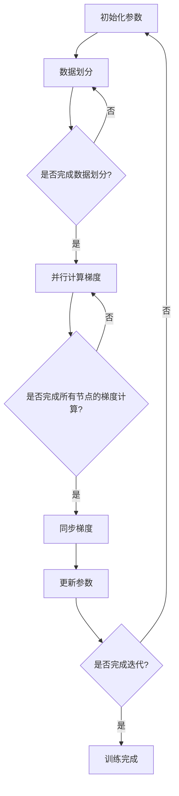
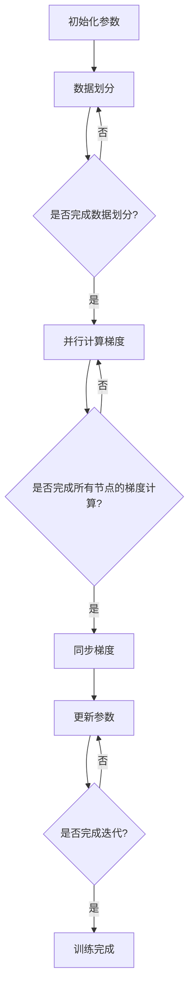
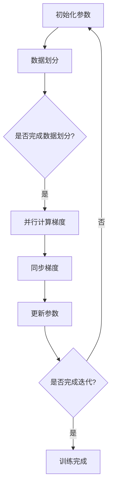
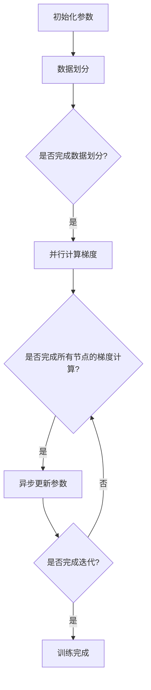
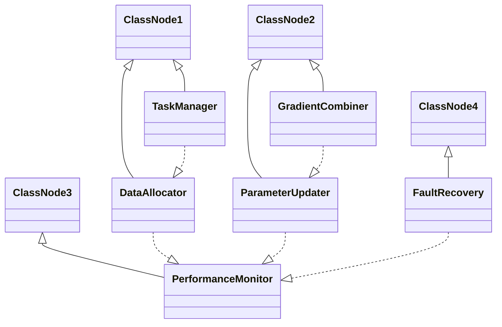
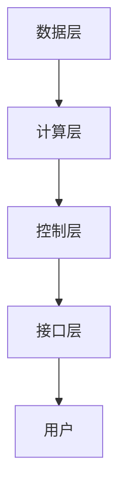
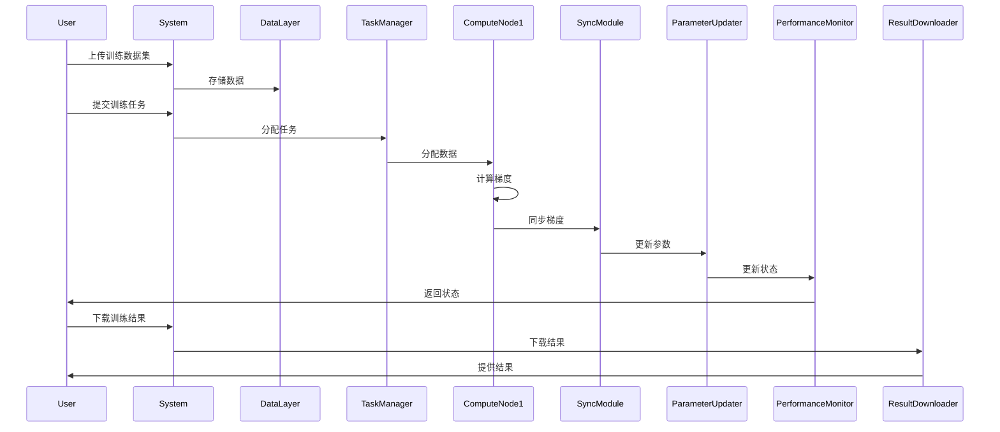

                 


### 引言

随着人工智能（AI）技术的飞速发展，AI模型的规模日益扩大，传统的集中式训练方法已经无法满足日益增长的需求。面对庞大的数据集和复杂的计算任务，如何高效地进行AI模型的训练成为一个亟待解决的问题。分布式训练应运而生，成为了扩展AI模型规模、提高训练效率的关键技术。

本文将围绕分布式训练这一主题，逐步深入探讨其背景、核心概念、算法原理、系统架构设计、项目实战以及最佳实践等方面的内容。通过逻辑清晰、结构紧凑的分析，希望能够为广大读者提供一份关于分布式训练的全面指南。

### 文章关键词

- 分布式训练
- AI模型
- 训练效率
- 资源利用率
- 分布式计算
- 分布式存储

### 摘要

本文旨在介绍分布式训练技术，探讨其在扩展AI模型规模和提高训练效率方面的应用。首先，我们将回顾人工智能的发展背景和分布式训练的必要性与挑战。接着，详细介绍分布式计算、分布式存储和分布式训练的核心概念及其相互关系。随后，我们将深入讲解分布式训练的算法原理，包括同步与异步策略和优化算法。然后，通过系统分析与架构设计方案，展示分布式训练在实际项目中的应用。接下来，我们将通过实际案例分析和详细讲解，探讨分布式训练的实施和优化方法。最后，总结最佳实践和注意事项，并提供拓展阅读资源，帮助读者进一步深入学习和应用分布式训练技术。

### 分布式训练的必要性

人工智能（AI）技术的蓬勃发展，使得AI模型的规模不断扩张，这给传统的集中式训练方法带来了前所未有的挑战。首先，随着AI模型变得更加复杂和庞大，它们的训练需求也急剧增加。传统的集中式训练通常依赖于单一的高性能计算机，这种模式在处理较小规模模型时尚能保持高效，但面对大规模模型时，其局限性便显现出来。

#### 数据量大

首先，大规模AI模型的训练涉及海量的数据，这些数据需要存储和传输。集中式训练模式下，数据存储和传输都依赖于单一的高性能计算机，这往往导致I/O瓶颈，从而降低训练速度。

#### 计算资源瓶颈

其次，大规模AI模型的训练计算量巨大，需要大量的计算资源。传统的集中式训练依赖于单一计算机的CPU和GPU资源，而这些资源在处理大规模训练任务时往往不足以满足需求。计算资源的瓶颈导致训练时间延长，甚至可能因为资源耗尽而中断训练过程。

#### 训练效率低

此外，集中式训练的效率较低。在集中式训练模式下，所有计算任务都集中在单一计算机上，这导致计算资源的利用率不高。同时，当模型规模较大时，单机训练可能会导致内存溢出等问题，进一步影响训练效率。

为了解决上述问题，分布式训练应运而生。分布式训练通过将训练任务分解到多台机器上并行执行，从而大大提高了训练速度和资源利用率。以下是分布式训练的几个核心优点：

#### 提高训练速度

分布式训练将计算任务分布在多台机器上，可以显著提高训练速度。每台机器可以同时处理一部分数据，多个机器协同工作，可以大幅缩短训练时间。

#### 提高资源利用率

通过分布式训练，计算资源可以被更高效地利用。多台机器可以同时处理不同的计算任务，从而提高了整体计算资源利用率。

#### 提高扩展性

分布式训练具有很好的扩展性。当需要训练更大规模的模型时，可以简单地增加机器的数量，而不需要改变算法本身。这种扩展性使得分布式训练能够适应不断增长的AI模型需求。

#### 降低成本

分布式训练可以降低计算成本。通过利用现有的计算资源，分布式训练可以避免单独购买昂贵的硬件设备，从而降低整体成本。

综上所述，分布式训练是扩展AI模型规模、提高训练效率的关键技术。它不仅解决了传统集中式训练面临的数据量大、计算资源瓶颈和训练效率低等问题，还为未来的AI技术发展提供了坚实的基础。

### 分布式训练的概念和目标

分布式训练是一种通过将训练任务分解并分布到多台计算机上进行并行执行的技术。其核心思想是将大规模的训练数据集和复杂的计算任务分配给多台计算机，通过协同工作来实现更高效的训练过程。分布式训练的定义可以从以下几个方面进行阐述：

#### 训练任务分解

在分布式训练中，首先将整个训练任务分解成若干个子任务。这些子任务可以是基于数据集的分区，也可以是基于模型参数的划分。通过将任务分解，可以使得多台计算机可以同时处理不同的子任务，从而提高整体训练速度。

#### 计算资源协同

分布式训练依赖于多台计算机的协同工作。每台计算机都负责处理一部分子任务，并将处理结果汇总。在处理过程中，这些计算机通过网络进行通信，交换数据和中间结果。通过计算资源的协同，可以充分利用多台计算机的计算能力，实现高效的训练过程。

#### 数据并行和参数并行

分布式训练可以采用数据并行和参数并行两种方式。数据并行是指在多台计算机上分别处理不同数据分区，然后汇总结果。参数并行是指在多台计算机上分别更新模型参数，然后同步更新全局参数。这两种并行方式可以相互结合，进一步加速训练过程。

#### 目标

分布式训练的目标主要有以下几点：

#### 提高训练速度

通过将训练任务分布在多台计算机上，分布式训练可以显著提高训练速度。每台计算机可以并行处理数据，从而减少训练所需的时间。

#### 提高资源利用率

分布式训练可以充分利用多台计算机的计算资源，提高整体资源利用率。通过协同工作，多台计算机可以同时处理不同的任务，避免资源闲置。

#### 提高扩展性

分布式训练具有很好的扩展性。当需要处理更大规模的数据集或更复杂的模型时，可以简单地增加计算机的数量，而不需要改变算法本身。这种扩展性使得分布式训练能够适应不断增长的AI需求。

#### 降低成本

分布式训练可以通过利用现有的计算资源来降低计算成本。与单独购买昂贵的硬件设备相比，利用分布式训练可以更加经济高效。

#### 应用场景

分布式训练广泛应用于各个领域，如自然语言处理、计算机视觉、推荐系统等。以下是几个典型的应用场景：

#### 自然语言处理

自然语言处理（NLP）是分布式训练的重要应用领域。在NLP任务中，大规模的训练数据集和复杂的模型参数需要高效的训练方法。分布式训练可以显著提高NLP模型的训练速度和资源利用率。

#### 计算机视觉

计算机视觉任务通常需要处理大量的图像数据，并训练复杂的模型。分布式训练可以帮助提高计算机视觉模型的训练速度和准确性。

#### 推荐系统

推荐系统是另一个典型的分布式训练应用领域。推荐系统需要处理海量的用户行为数据，并通过训练复杂的模型来生成推荐结果。分布式训练可以加速推荐系统的训练过程，提高推荐效果。

### 总结

分布式训练是一种通过将训练任务分解并分布到多台计算机上进行并行执行的技术。其目标是通过协同工作和资源利用，提高训练速度和资源利用率。分布式训练在自然语言处理、计算机视觉和推荐系统等领域有着广泛的应用。通过理解分布式训练的概念和目标，我们可以更好地应对大规模AI模型的训练挑战。

### 分布式训练的原理和方法

分布式训练的核心在于将大规模的训练任务分解并分布到多台计算机上进行并行执行，从而提高训练效率和资源利用率。以下将从分布式计算、分布式存储和分布式训练的方法三个方面详细阐述分布式训练的原理。

#### 分布式计算

分布式计算是指将计算任务分解并分布到多台计算机上，通过协同工作完成整个计算过程。在分布式训练中，分布式计算起着至关重要的作用。

首先，分布式计算的基本概念包括任务分解、任务调度、负载均衡和结果汇总。任务分解是将整个训练任务拆分成若干个子任务，每个子任务可以在不同的计算机上独立执行。任务调度是指将子任务分配给不同的计算机，并确保每台计算机都有足够的计算资源。负载均衡是指根据计算机的负载情况，动态调整任务的分配，避免资源闲置或过度使用。结果汇总是将每台计算机的局部结果汇总成全局结果。

分布式计算的优势在于可以提高训练速度和资源利用率。通过将任务分布到多台计算机上，可以并行执行，从而减少训练时间。此外，分布式计算可以充分利用多台计算机的计算资源，避免资源闲置。

然而，分布式计算也面临一些挑战。首先，任务分解和调度需要复杂算法，以确保任务能够高效执行。其次，负载均衡需要实时监测计算机的负载情况，并动态调整任务分配，这增加了系统的复杂度。此外，分布式计算需要确保数据的一致性和同步性，以避免错误或数据丢失。

#### 分布式存储

分布式存储是指将数据存储在多台计算机上，并通过分布式文件系统进行管理和访问。在分布式训练中，分布式存储同样是关键组成部分。

分布式存储的基本概念包括数据分割、数据复制和数据冗余。数据分割是指将整个数据集划分为若干个子数据集，每个子数据集存储在不同的计算机上。数据复制是指将数据备份到多台计算机上，以确保数据的高可用性。数据冗余是指保留一定数量的冗余数据，以应对数据损坏或丢失的情况。

分布式存储的优势在于可以提高数据访问速度和可靠性。通过将数据分布在多台计算机上，可以减少数据访问延迟，提高数据读取速度。此外，分布式存储可以通过数据复制和数据冗余提高数据可靠性，确保数据不会因为单点故障而丢失。

分布式存储也面临一些挑战。首先，数据分割和复制需要复杂算法，以确保数据分布均衡和一致性。其次，分布式存储需要处理数据的不一致性，确保多台计算机上的数据保持同步。此外，分布式存储还需要考虑数据备份和恢复策略，以应对数据损坏或丢失的情况。

#### 分布式训练的方法

分布式训练的方法主要包括数据并行、参数并行和混合并行等。

数据并行是指将训练数据集划分为多个分区，每个分区分别由不同的计算机处理。在每台计算机上，模型参数和梯度分别更新，然后通过同步机制将局部梯度汇总成全局梯度。数据并行的优点是可以显著提高训练速度，缺点是可能导致梯度消失或梯度爆炸等问题。

参数并行是指将模型参数划分为多个子参数，每个子参数分别由不同的计算机更新。在每台计算机上，分别计算局部梯度，然后通过异步或同步机制更新全局参数。参数并行的优点是可以减少梯度消失和梯度爆炸的问题，缺点是训练速度可能较慢。

混合并行是指结合数据并行和参数并行，同时利用两者的优点。在混合并行中，可以将数据集和模型参数分别划分为多个分区，通过数据并行和参数并行的组合，实现高效的分布式训练。

#### 分布式训练的优势

分布式训练具有以下优势：

1. 提高训练速度：通过将训练任务分布在多台计算机上，可以显著提高训练速度。
2. 提高资源利用率：分布式训练可以充分利用多台计算机的计算资源和存储资源，避免资源闲置。
3. 提高扩展性：分布式训练可以轻松扩展到更多计算机，以应对更大规模的数据集和模型。
4. 提高可靠性：分布式训练可以通过数据复制和数据冗余提高数据可靠性，确保数据不会因为单点故障而丢失。

#### 分布式训练的应用场景

分布式训练广泛应用于各个领域，如自然语言处理、计算机视觉和推荐系统等。以下是几个典型的应用场景：

1. 自然语言处理：自然语言处理任务通常需要处理大规模的训练数据集和复杂的模型，分布式训练可以提高训练速度和准确性。
2. 计算机视觉：计算机视觉任务需要处理大量的图像数据，分布式训练可以加速模型的训练过程，提高模型的性能。
3. 推荐系统：推荐系统需要处理海量的用户行为数据，分布式训练可以提高推荐系统的训练速度和推荐效果。

### 总结

分布式训练是一种通过将训练任务分解并分布到多台计算机上进行并行执行的技术。其原理包括分布式计算、分布式存储和分布式训练的方法。分布式训练具有提高训练速度、资源利用率和扩展性的优势，广泛应用于自然语言处理、计算机视觉和推荐系统等领域。通过理解分布式训练的原理和方法，我们可以更好地应对大规模AI模型的训练挑战。

### 分布式计算

#### 基本概念

分布式计算是一种计算模型，它通过将任务分解并分布到多台计算机上，通过协同工作来完成计算任务。在分布式计算中，每台计算机被称为一个节点，这些节点通过网络连接，共同完成计算任务。

#### 分布式计算的优势

分布式计算具有以下几个显著优势：

1. **提高计算速度**：通过将任务分布到多台计算机上并行执行，分布式计算可以显著提高计算速度，特别是在处理大规模数据集和复杂计算任务时。

2. **提高资源利用率**：分布式计算可以充分利用多台计算机的计算资源，避免单台计算机资源的闲置，从而提高整体资源利用率。

3. **增强容错性**：分布式计算系统可以通过冗余设计提高系统的容错性，即使某台计算机出现故障，整个系统的计算任务仍能继续进行。

4. **提高可扩展性**：分布式计算系统可以根据需要轻松扩展，通过添加更多的计算机节点来增加计算能力，从而适应不断增长的计算需求。

#### 分布式计算的挑战

尽管分布式计算具有诸多优势，但它也面临一些挑战：

1. **任务分解与调度**：如何将任务合理地分解并分配到不同的计算机节点上是一个复杂的问题。任务分解需要考虑数据依赖和计算资源需求，而调度需要确保每个节点都有足够的资源来执行其任务。

2. **负载均衡**：如何动态地分配任务，使得每个节点的负载保持均衡，避免某些节点过度负载，而其他节点资源闲置。

3. **数据一致性**：在分布式计算中，确保多台计算机上的数据一致性是一个关键问题。数据更新和同步需要精确控制，以避免数据冲突和错误。

4. **网络通信**：分布式计算中的节点通过网络进行通信，网络延迟和带宽限制可能会影响计算效率。

#### 应用场景

分布式计算广泛应用于多个领域：

1. **科学计算**：如气象预测、流体动力学模拟、天文学数据分析等，这些领域需要处理大量数据和复杂计算任务。

2. **大数据分析**：如数据挖掘、机器学习模型的训练和推理等，分布式计算可以提高数据处理和分析的效率。

3. **Web服务**：如搜索引擎、社交媒体平台、电子商务网站等，分布式计算可以提高系统的可扩展性和响应速度。

4. **分布式数据库**：如分布式关系数据库和NoSQL数据库，分布式计算可以提高数据访问速度和系统容错性。

### 总结

分布式计算通过将任务分解并分布到多台计算机上并行执行，显著提高了计算速度和资源利用率。尽管面临任务分解与调度、负载均衡、数据一致性和网络通信等挑战，但分布式计算在科学计算、大数据分析、Web服务和分布式数据库等领域有着广泛的应用，为大规模计算任务提供了强大的支持。

### 分布式存储

#### 基本概念

分布式存储是一种将数据分散存储在多个物理位置或节点上的技术，通过分布式文件系统或存储网络进行管理和访问。在分布式存储系统中，数据被分割成多个数据块，这些数据块被分散存储在多个节点上，以实现数据的高效存储和访问。

#### 分布式存储的优势

分布式存储具有以下几个显著优势：

1. **高可用性**：通过数据复制和冗余设计，分布式存储系统可以确保数据的高可用性。即使某些节点发生故障，数据仍然可以通过其他节点访问。

2. **高扩展性**：分布式存储系统可以根据需求动态扩展存储容量，通过添加更多的节点来提高存储能力和性能。

3. **高性能**：通过并行读写和数据局部性，分布式存储系统可以提供更高的数据访问速度和读写性能。

4. **容错性**：分布式存储系统通过冗余设计和故障恢复机制，可以在节点故障时自动恢复数据，确保系统的稳定性。

#### 分布式存储的挑战

尽管分布式存储具有许多优势，但它也面临一些挑战：

1. **数据一致性**：在分布式存储系统中，如何确保多节点间数据的一致性是一个关键问题。数据更新和同步需要精确控制，以避免数据冲突和错误。

2. **负载均衡**：如何动态地分配数据访问和存储任务，使得每个节点的负载保持均衡，避免某些节点过度负载，而其他节点资源闲置。

3. **数据可靠性**：确保数据在存储过程中的完整性和可靠性，需要有效的数据校验和纠错机制。

4. **网络延迟**：分布式存储系统中的节点可能分布在不同的地理位置，网络延迟和带宽限制可能会影响数据访问速度和性能。

#### 应用场景

分布式存储广泛应用于多个领域：

1. **云计算**：如Amazon S3、Google Cloud Storage等，分布式存储系统为云计算提供了高效、可靠的数据存储服务。

2. **大数据处理**：如Hadoop HDFS、Apache Cassandra等，分布式存储系统在大数据处理中用于存储和管理大规模数据集。

3. **文件共享和分布式系统**：如NFS、GlusterFS等，分布式存储系统用于构建分布式文件共享和协同工作平台。

4. **数据库**：如MongoDB、Cassandra等，分布式存储系统为NoSQL数据库提供了高效、可靠的存储解决方案。

### 总结

分布式存储通过将数据分散存储在多个节点上，提高了数据的高可用性、扩展性和性能。尽管面临数据一致性、负载均衡、数据可靠性和网络延迟等挑战，分布式存储在云计算、大数据处理、文件共享和数据库等领域有着广泛的应用。通过理解分布式存储的基本概念、优势和挑战，我们可以更好地设计和实现高效可靠的分布式存储系统。

### 分布式训练

#### 定义

分布式训练是一种将大规模AI模型的训练任务分布到多个计算节点上，通过并行计算和协同工作来加速训练过程的方法。在这种方法中，模型参数和训练数据分别分布在不同的节点上，每个节点独立计算梯度并更新参数，最终通过同步机制将局部结果合并成全局结果。

#### 过程

分布式训练的过程可以分为以下几个步骤：

1. **任务划分**：将整个训练任务划分为多个子任务，每个子任务可以独立处理一部分数据和模型参数。

2. **数据分配**：将训练数据集按照一定规则（如数据块、批次等）分配到不同的计算节点上。

3. **并行计算**：每个计算节点独立计算其子任务对应的模型参数和梯度。

4. **同步更新**：通过同步机制，将每个节点的局部梯度合并成全局梯度，并更新全局模型参数。

5. **迭代循环**：重复上述步骤，直到模型收敛或达到预设的训练轮数。

#### 方法

分布式训练可以采用多种方法，以下是一些常见的方法：

1. **数据并行**：每个计算节点处理不同数据分区，每个节点独立计算梯度，然后同步更新全局参数。数据并行可以显著提高训练速度，但可能导致梯度消失或梯度爆炸等问题。

2. **参数并行**：每个计算节点处理相同的数据分区，但独立更新不同的模型参数。参数并行可以减少梯度消失和梯度爆炸的问题，但训练速度可能较慢。

3. **混合并行**：结合数据并行和参数并行的优点，将数据集和模型参数分别划分为多个分区，通过数据并行和参数并行的组合，实现高效的分布式训练。

4. **异步更新**：每个计算节点独立计算梯度并更新模型参数，不需要同步更新全局参数。异步更新可以进一步提高训练速度，但需要处理数据一致性和同步性问题。

#### 优点

分布式训练具有以下优点：

1. **提高训练速度**：通过并行计算，分布式训练可以显著提高训练速度，缩短训练时间。

2. **提高资源利用率**：分布式训练可以充分利用多台计算机的计算资源和存储资源，避免资源闲置。

3. **提高扩展性**：分布式训练可以轻松扩展到更多计算节点，以应对更大规模的数据集和模型。

4. **降低成本**：通过利用现有的计算资源，分布式训练可以降低计算成本。

#### 应用场景

分布式训练广泛应用于以下场景：

1. **自然语言处理**：如大型语言模型的训练，分布式训练可以显著提高训练速度和准确性。

2. **计算机视觉**：如大规模图像数据的训练，分布式训练可以提高模型的性能和训练速度。

3. **推荐系统**：如大规模用户行为数据的训练，分布式训练可以提高推荐系统的效果和响应速度。

4. **基因组学**：如大规模基因数据的分析，分布式训练可以提高基因组学研究的效率和准确性。

### 总结

分布式训练通过将训练任务分布到多个计算节点上，通过并行计算和协同工作，实现了大规模AI模型的高效训练。分布式训练具有提高训练速度、资源利用率、扩展性和降低成本的优势，广泛应用于自然语言处理、计算机视觉、推荐系统和基因组学等领域。通过理解分布式训练的定义、过程和方法，我们可以更好地设计和实现高效的分布式训练系统。

### 概念属性特征对比表格

在深入探讨分布式计算、分布式存储和分布式训练的概念之后，我们可以通过一个对比表格来总结这三者的核心属性特征。以下是一个示例表格，展示了这三者在基本概念、优势、挑战和应用场景等方面的对比。

| 概念      | 基本概念                                       | 优势                                            | 挑战                                              | 应用场景                                      |
|-----------|------------------------------------------------|------------------------------------------------|---------------------------------------------------|-----------------------------------------------|
| 分布式计算 | 将计算任务分布到多个节点上并行执行           | 提高计算速度、资源利用率、容错性、扩展性        | 任务分解与调度、负载均衡、数据一致性、网络通信   | 科学计算、大数据处理、Web服务、分布式数据库   |
| 分布式存储 | 将数据分散存储在多个节点上，通过网络访问     | 提高可用性、扩展性、性能、容错性                | 数据一致性、负载均衡、数据可靠性、网络延迟      | 云计算、大数据处理、文件共享、数据库          |
| 分布式训练 | 将训练任务分布到多个节点上，通过并行计算加速训练 | 提高训练速度、资源利用率、扩展性、降低成本    | 任务分解与调度、负载均衡、数据一致性、同步更新   | 自然语言处理、计算机视觉、推荐系统、基因组学   |

#### 对比分析

1. **基本概念**：
   - 分布式计算主要关注计算任务的分解、调度和执行。
   - 分布式存储则侧重于数据的分散存储和管理。
   - 分布式训练则是在分布式计算和存储的基础上，针对大规模AI模型训练任务进行优化。

2. **优势**：
   - 分布式计算的优势在于提高计算速度、资源利用率和系统的容错性。
   - 分布式存储的优势在于提高数据的可用性、扩展性和性能。
   - 分布式训练的优势在于提高训练速度、资源利用率和系统的扩展性，同时降低成本。

3. **挑战**：
   - 分布式计算的主要挑战在于任务分解与调度、负载均衡、数据一致性和网络通信。
   - 分布式存储的主要挑战在于数据一致性、负载均衡、数据可靠性和网络延迟。
   - 分布式训练的主要挑战在于任务分解与调度、负载均衡、数据一致性和同步更新。

4. **应用场景**：
   - 分布式计算广泛应用于科学计算、大数据处理、Web服务和分布式数据库。
   - 分布式存储广泛应用于云计算、大数据处理、文件共享和数据库。
   - 分布式训练广泛应用于自然语言处理、计算机视觉、推荐系统和基因组学。

通过对比表格和对比分析，我们可以更清晰地理解分布式计算、分布式存储和分布式训练之间的差异和联系。这些概念相互补充，共同构建了一个高效、可靠和可扩展的分布式系统架构，为大规模AI模型的训练提供了强有力的支持。

### 分布式训练与其他训练方式的对比

在深入探讨分布式训练之前，有必要对比分析分布式训练与其他常见的训练方式，包括集中式训练和单机训练。这些对比可以帮助我们更好地理解分布式训练的优势和适用场景。

#### 集中式训练

**定义**：集中式训练是指所有的计算任务都在同一台计算机上完成，包括数据处理、模型训练和更新。

**优势**：
- 简单易实现：集中式训练不需要复杂的分布式计算架构，实现相对简单。
- 数据处理效率高：由于所有任务在同一台计算机上执行，数据传输和处理效率较高。

**缺点**：
- 资源限制：单一计算机的计算资源和存储资源有限，无法处理大规模数据集和复杂模型。
- 可扩展性差：当计算任务规模增加时，很难通过增加计算机数量来提升性能。
- 容错性低：单一计算机故障可能导致整个训练任务失败。

#### 单机训练

**定义**：单机训练是指在单台计算机上完成模型训练，但可能涉及数据分区和并行处理。

**优势**：
- 灵活性：单机训练可以根据计算机的配置灵活调整训练任务。
- 资源集中：所有计算资源集中在单台计算机上，便于管理和监控。

**缺点**：
- 训练时间长：单机训练对于大规模数据集和复杂模型，训练时间较长。
- 资源利用率低：单机训练无法充分利用多台计算机的计算资源。

#### 分布式训练

**定义**：分布式训练是指将训练任务分解并分布到多台计算机上，通过并行计算和协同工作来加速训练过程。

**优势**：
- **提高训练速度**：通过并行计算，分布式训练可以显著提高训练速度。
- **资源利用率高**：分布式训练可以充分利用多台计算机的计算资源和存储资源。
- **扩展性好**：分布式训练可以轻松扩展到更多计算节点，以应对更大规模的数据集和模型。
- **容错性强**：通过冗余设计和故障恢复机制，分布式训练系统的容错性更高。

**缺点**：
- **实现复杂**：分布式训练需要复杂的任务分解、调度和同步机制。
- **数据一致性**：确保多台计算机上的数据一致性是一个关键挑战。
- **网络通信**：分布式训练中的节点通过网络进行通信，网络延迟和带宽限制可能会影响计算效率。

#### 对比分析

1. **资源利用**：
   - 集中式训练的资源利用率较低，因为单一计算机的资源和容量有限。
   - 单机训练的资源利用率相对较高，但无法充分利用多台计算机的资源。
   - 分布式训练可以充分利用多台计算机的计算资源和存储资源，显著提高资源利用率。

2. **训练速度**：
   - 集中式训练的速度取决于计算机的硬件性能，通常较慢。
   - 单机训练的速度受限于计算机的硬件资源和数据传输效率。
   - 分布式训练通过并行计算，可以显著提高训练速度，缩短训练时间。

3. **扩展性**：
   - 集中式训练的可扩展性较差，难以通过增加计算机数量来提升性能。
   - 单机训练具有一定的扩展性，但受限于硬件资源。
   - 分布式训练具有很好的扩展性，可以通过增加计算机节点来提升计算能力。

4. **容错性**：
   - 集中式训练的容错性较低，单一计算机故障可能导致整个训练任务失败。
   - 单机训练的容错性一般，可通过备份和恢复策略提高。
   - 分布式训练的容错性较高，通过冗余设计和故障恢复机制，即使部分计算机故障，整个训练任务仍能继续。

#### 适用场景

- **集中式训练**：适用于资源有限的小规模训练任务，如学术研究、小型项目的验证等。
- **单机训练**：适用于数据规模适中、计算机资源充足的情况，如企业内部应用、中小型数据集的训练等。
- **分布式训练**：适用于大规模数据集和复杂模型的训练，如大型企业、研究机构、开源项目等。

通过对比分布式训练与其他训练方式，我们可以更清晰地理解分布式训练的优势和适用场景。分布式训练在资源利用、训练速度、扩展性和容错性方面具有显著优势，是扩展AI模型规模和提高训练效率的关键技术。

### 分布式训练算法原理

分布式训练算法的设计和实现是分布式训练系统的核心。本节将详细探讨分布式训练算法的基本原理，通过mermaid流程图、Python源代码、数学模型和公式以及实例说明，深入解析分布式训练的算法原理。

#### 算法mermaid流程图

首先，我们使用mermaid流程图来展示分布式训练算法的基本流程。



#### 算法原理讲解

1. **初始化参数**：在分布式训练开始时，首先初始化模型参数。这些参数通常通过随机初始化或预训练模型获得。

2. **数据划分**：将整个数据集划分为多个数据块，每个数据块由不同的计算节点处理。这样可以使得多个节点可以并行处理数据，提高训练速度。

3. **并行计算梯度**：每个计算节点分别对分配给自己的数据块进行前向传播和后向传播计算，得到局部梯度。

4. **同步梯度**：所有计算节点将各自的局部梯度同步到全局梯度。这一步可以通过同步更新机制（如同步墙、异步更新等）实现。

5. **更新参数**：利用同步后的全局梯度，更新模型参数。这一步可以通过梯度下降或其他优化算法实现。

6. **迭代循环**：重复上述步骤，直到模型收敛或达到预设的训练轮数。

#### 数学模型和公式

分布式训练的算法原理可以通过以下数学模型和公式进行描述：

$$
\text{参数更新公式}:\ \theta_{t+1} = \theta_{t} - \alpha \cdot \nabla_{\theta} J(\theta)
$$

其中：
- $\theta_{t}$ 表示当前迭代步骤的模型参数。
- $\theta_{t+1}$ 表示更新后的模型参数。
- $\alpha$ 表示学习率。
- $\nabla_{\theta} J(\theta)$ 表示对损失函数 $J(\theta)$ 关于模型参数 $\theta$ 的梯度。

#### Python源代码示例

以下是一个简单的Python代码示例，展示了分布式训练算法的实现。

```python
import torch
import torch.distributed as dist

# 初始化模型参数
model = torch.nn.Linear(10, 1)
optimizer = torch.optim.SGD(model.parameters(), lr=0.01)

# 数据集划分
data = torch.randn(100, 10)
targets = torch.randn(100, 1)
data_parts = torch.utils.data DataLoader(data, batch_size=10)
targets_parts = torch.utils.data DataLoader(targets, batch_size=10)

# 初始化分布式环境
dist.init_process_group(backend='nccl')

# 训练循环
for epoch in range(num_epochs):
    for data_part, target_part in zip(data_parts, targets_parts):
        # 并行计算梯度
        output = model(data_part)
        loss = (output - target_part).mean()

        # 反向传播
        optimizer.zero_grad()
        loss.backward()

        # 同步梯度
        dist.all_reduce(loss)

        # 更新参数
        optimizer.step()

    print(f"Epoch {epoch}: Loss = {loss.item()}")
```

#### 实例说明

假设我们有一个线性回归模型，其输入维度为10，输出维度为1。我们使用随机生成的数据集进行训练。通过分布式训练算法，我们将数据集划分为多个批次，每个批次由不同的计算节点处理。每个节点独立计算局部梯度，并通过同步机制更新全局梯度，最终更新模型参数。

通过上述Python代码示例，我们可以看到分布式训练算法的实现步骤，包括初始化参数、数据划分、并行计算梯度、同步梯度、更新参数和训练循环。

### 总结

分布式训练算法通过并行计算和同步更新机制，实现了大规模AI模型的高效训练。通过mermaid流程图、Python源代码、数学模型和公式以及实例说明，我们详细解析了分布式训练算法的原理。分布式训练算法在提高训练速度、资源利用率和扩展性方面具有显著优势，是分布式训练系统的核心。

### 分布式训练的优化算法

在分布式训练过程中，优化算法起到了至关重要的作用。优化算法不仅影响了训练过程的收敛速度，还决定了模型的最终性能。本节将详细介绍分布式训练中的几种常见优化算法，包括其原理、流程图、数学模型和公式，并通过Python代码示例来说明这些算法的实现。

#### 梯度下降算法

梯度下降是一种最基础的优化算法，用于最小化损失函数。在分布式训练中，梯度下降算法通过多个节点协同工作，分别计算局部梯度并同步更新全局参数。

##### 原理

梯度下降算法的核心思想是沿着损失函数梯度的反方向更新模型参数，以减少损失值。在单机训练中，这一过程相对简单。而在分布式训练中，需要考虑如何高效地计算和同步梯度。

##### 流程图

使用mermaid流程图，我们可以展示梯度下降算法在分布式训练中的流程：



##### 数学模型和公式

梯度下降算法的数学模型可以表示为：

$$
\theta_{t+1} = \theta_{t} - \alpha \cdot \nabla_{\theta} J(\theta)
$$

其中：
- $\theta_{t}$ 表示当前迭代步骤的模型参数。
- $\theta_{t+1}$ 表示更新后的模型参数。
- $\alpha$ 表示学习率。
- $\nabla_{\theta} J(\theta)$ 表示对损失函数 $J(\theta)$ 关于模型参数 $\theta$ 的梯度。

##### Python代码示例

以下是一个简单的Python代码示例，展示了梯度下降算法在分布式训练中的实现：

```python
import torch
import torch.distributed as dist

# 初始化模型参数
model = torch.nn.Linear(10, 1)
optimizer = torch.optim.SGD(model.parameters(), lr=0.01)

# 初始化分布式环境
dist.init_process_group(backend='nccl')

# 训练循环
for epoch in range(num_epochs):
    for data_part, target_part in data_loader:
        # 并行计算梯度
        output = model(data_part)
        loss = (output - target_part).mean()

        # 反向传播
        optimizer.zero_grad()
        loss.backward()

        # 同步梯度
        dist.all_reduce(loss)

        # 更新参数
        optimizer.step()

    print(f"Epoch {epoch}: Loss = {loss.item()}")
```

#### 随机梯度下降（SGD）

随机梯度下降（SGD）是梯度下降的一种变种，它在每个迭代步骤中使用单个样本来计算梯度，而不是使用整个数据集。这种方法可以加速收敛，但可能会导致训练结果的不稳定。

##### 原理

与梯度下降类似，随机梯度下降通过随机选择样本计算梯度，并更新模型参数。这种方法的优点是可以减少每个迭代步骤的计算量，从而提高训练速度。

##### 数学模型和公式

随机梯度下降的数学模型可以表示为：

$$
\theta_{t+1} = \theta_{t} - \alpha \cdot \nabla_{\theta} J(\theta; x^{(i)}, y^{(i)})
$$

其中：
- $x^{(i)}$ 和 $y^{(i)}$ 表示训练数据集中的第 $i$ 个样本。

##### Python代码示例

以下是一个简单的Python代码示例，展示了随机梯度下降算法在分布式训练中的实现：

```python
import torch
import torch.distributed as dist

# 初始化模型参数
model = torch.nn.Linear(10, 1)
optimizer = torch.optim.SGD(model.parameters(), lr=0.01)

# 初始化分布式环境
dist.init_process_group(backend='nccl')

# 训练循环
for epoch in range(num_epochs):
    for data_part, target_part in data_loader:
        # 随机选择样本
        indices = torch.randperm(len(data_part))
        data_part, target_part = data_part[indices], target_part[indices]

        # 并行计算梯度
        output = model(data_part)
        loss = (output - target_part).mean()

        # 反向传播
        optimizer.zero_grad()
        loss.backward()

        # 同步梯度
        dist.all_reduce(loss)

        # 更新参数
        optimizer.step()

    print(f"Epoch {epoch}: Loss = {loss.item()}")
```

#### 动量优化器（Momentum）

动量优化器是梯度下降的改进版本，它通过引入动量项，减少了梯度的振荡，提高了收敛速度。动量优化器在分布式训练中同样具有重要意义。

##### 原理

动量优化器在每次迭代步骤中，不仅使用当前的梯度，还考虑过去梯度的平均值，以减少梯度的波动。这有助于模型在训练过程中更加稳定地收敛。

##### 数学模型和公式

动量优化器的数学模型可以表示为：

$$
\theta_{t+1} = \theta_{t} - \alpha \cdot \nabla_{\theta} J(\theta) + \beta \cdot v_t
$$

其中：
- $v_t$ 表示动量项，通常通过指数加权平均计算。

##### Python代码示例

以下是一个简单的Python代码示例，展示了动量优化器在分布式训练中的实现：

```python
import torch
import torch.distributed as dist
import torch.optim as optim

# 初始化模型参数
model = torch.nn.Linear(10, 1)
optimizer = optim.SGD(model.parameters(), lr=0.01, momentum=0.9)

# 初始化分布式环境
dist.init_process_group(backend='nccl')

# 训练循环
for epoch in range(num_epochs):
    for data_part, target_part in data_loader:
        # 并行计算梯度
        output = model(data_part)
        loss = (output - target_part).mean()

        # 反向传播
        optimizer.zero_grad()
        loss.backward()

        # 同步梯度
        dist.all_reduce(loss)

        # 更新参数
        optimizer.step()

    print(f"Epoch {epoch}: Loss = {loss.item()}")
```

#### Adam优化器

Adam优化器是另一种流行的优化器，它结合了动量和RMSprop的优点，能够在多样化的数据集上表现良好。Adam优化器在分布式训练中也得到了广泛应用。

##### 原理

Adam优化器通过同时考虑一阶矩估计和二阶矩估计，自适应调整学习率。这种方法有助于在训练过程中保持稳定的收敛速度。

##### 数学模型和公式

Adam优化器的数学模型可以表示为：

$$
\theta_{t+1} = \theta_{t} - \alpha \cdot \nabla_{\theta} J(\theta) + \beta_1 \cdot (1 - \beta_1^t) \cdot \hat{m}_t + \beta_2 \cdot (1 - \beta_2^t) \cdot \hat{v}_t
$$

其中：
- $\hat{m}_t$ 和 $\hat{v}_t$ 分别表示一阶矩估计和二阶矩估计。
- $\beta_1$ 和 $\beta_2$ 分别表示一阶和二阶矩的指数加权系数。

##### Python代码示例

以下是一个简单的Python代码示例，展示了Adam优化器在分布式训练中的实现：

```python
import torch
import torch.distributed as dist
import torch.optim as optim

# 初始化模型参数
model = torch.nn.Linear(10, 1)
optimizer = optim.Adam(model.parameters(), lr=0.001)

# 初始化分布式环境
dist.init_process_group(backend='nccl')

# 训练循环
for epoch in range(num_epochs):
    for data_part, target_part in data_loader:
        # 并行计算梯度
        output = model(data_part)
        loss = (output - target_part).mean()

        # 反向传播
        optimizer.zero_grad()
        loss.backward()

        # 同步梯度
        dist.all_reduce(loss)

        # 更新参数
        optimizer.step()

    print(f"Epoch {epoch}: Loss = {loss.item()}")
```

### 总结

分布式训练中的优化算法对于训练过程的收敛速度和模型性能有着重要影响。通过梯度下降、随机梯度下降、动量优化器和Adam优化器等算法，我们可以实现高效的分布式训练。本节详细介绍了这些优化算法的原理、流程图、数学模型和公式，并通过Python代码示例展示了它们的实现。了解和合理选择优化算法，对于分布式训练系统的成功至关重要。

### 同步与异步策略

在分布式训练中，同步（Synchronous）和异步（Asynchronous）策略是两种常用的梯度更新机制。它们在分布式训练系统的性能和效率方面有显著影响。以下将详细讨论同步与异步策略的原理、流程图、数学模型和公式，并通过Python代码示例说明这些策略的实现。

#### 同步策略

**原理**：在同步策略中，所有计算节点在更新模型参数之前必须等待所有节点的梯度计算和同步完成。这样可以确保每个节点都使用相同的全局梯度进行参数更新。

**流程图**

使用mermaid流程图，我们可以展示同步策略的基本流程：



**数学模型和公式**

同步策略的数学模型与梯度下降算法相同：

$$
\theta_{t+1} = \theta_{t} - \alpha \cdot \nabla_{\theta} J(\theta)
$$

其中：
- $\theta_{t+1}$ 表示更新后的模型参数。
- $\alpha$ 表示学习率。
- $\nabla_{\theta} J(\theta)$ 表示对损失函数 $J(\theta)$ 关于模型参数 $\theta$ 的梯度。

**Python代码示例**

以下是一个简单的Python代码示例，展示了同步策略的实现：

```python
import torch
import torch.distributed as dist

# 初始化模型参数
model = torch.nn.Linear(10, 1)
optimizer = torch.optim.SGD(model.parameters(), lr=0.01)

# 初始化分布式环境
dist.init_process_group(backend='nccl')

# 训练循环
for epoch in range(num_epochs):
    for data_part, target_part in data_loader:
        # 并行计算梯度
        output = model(data_part)
        loss = (output - target_part).mean()

        # 反向传播
        optimizer.zero_grad()
        loss.backward()

        # 同步梯度
        dist.all_reduce(loss)

        # 更新参数
        optimizer.step()

    print(f"Epoch {epoch}: Loss = {loss.item()}")
```

#### 异步策略

**原理**：在异步策略中，计算节点可以在其他节点完成梯度计算和同步之前独立更新模型参数。这意味着不同节点可以并行地执行梯度计算和参数更新。

**流程图**

使用mermaid流程图，我们可以展示异步策略的基本流程：



**数学模型和公式**

异步策略的数学模型与同步策略类似，但不需要等待所有节点的梯度同步：

$$
\theta_{t+1} = \theta_{t} - \alpha \cdot \nabla_{\theta} J(\theta)
$$

其中：
- $\theta_{t+1}$ 表示更新后的模型参数。
- $\alpha$ 表示学习率。
- $\nabla_{\theta} J(\theta)$ 表示对损失函数 $J(\theta)$ 关于模型参数 $\theta$ 的梯度。

**Python代码示例**

以下是一个简单的Python代码示例，展示了异步策略的实现：

```python
import torch
import torch.distributed as dist
import torch.optim as optim

# 初始化模型参数
model = torch.nn.Linear(10, 1)
optimizer = optim.SGD(model.parameters(), lr=0.01)

# 初始化分布式环境
dist.init_process_group(backend='nccl')

# 训练循环
for epoch in range(num_epochs):
    for data_part, target_part in data_loader:
        # 并行计算梯度
        output = model(data_part)
        loss = (output - target_part).mean()

        # 反向传播
        optimizer.zero_grad()
        loss.backward()

        # 异步更新参数
        optimizer.step()

    print(f"Epoch {epoch}: Loss = {loss.item()}")
```

#### 同步与异步策略的比较

**优势**：
- **同步策略**：确保了全局梯度的一致性，可以提供更稳定的训练结果。
- **异步策略**：可以减少同步通信的开销，提高训练速度。

**缺点**：
- **同步策略**：由于需要等待所有节点的梯度同步，可能会降低训练速度。
- **异步策略**：可能会导致参数更新不一致，从而影响模型的稳定性。

**适用场景**：
- **同步策略**：适用于对模型稳定性要求较高的场景，如深度学习中的神经网络训练。
- **异步策略**：适用于对训练速度要求较高的场景，如大规模实时数据的在线学习。

### 总结

同步与异步策略是分布式训练中的两种常用梯度更新机制。同步策略确保了全局梯度的一致性，提供了更稳定的训练结果，但可能降低训练速度。异步策略则通过减少同步通信开销，提高了训练速度，但可能会导致参数更新不一致。了解和合理选择同步与异步策略，对于实现高效的分布式训练系统至关重要。通过mermaid流程图、数学模型和Python代码示例，我们详细解析了同步与异步策略的实现和比较。

### 系统分析与架构设计

#### 问题场景介绍

在现代人工智能（AI）领域中，大规模模型的训练已经成为一项关键任务。随着深度学习模型变得越来越复杂，其训练过程所需的计算资源和时间也在不断增长。传统的集中式训练方法在处理这些大规模任务时面临诸多挑战，如计算资源瓶颈、训练效率低下等。为了解决这些问题，分布式训练技术应运而生。在本项目中，我们旨在设计并实现一个分布式训练系统，以提升大规模模型的训练效率，降低训练时间，并提高资源利用率。

#### 项目介绍

本项目将基于Python的PyTorch框架，利用分布式训练技术，对大规模AI模型进行训练。项目的主要目标是：
1. 设计并实现一个分布式训练系统架构。
2. 实现分布式训练过程中的任务划分、数据分配、并行计算和参数更新。
3. 评估分布式训练系统的性能，并对比其与传统集中式训练方法的优劣。

#### 系统功能设计

分布式训练系统的核心功能包括以下几个方面：

1. **任务划分**：将整个训练任务划分为多个子任务，每个子任务分配给不同的计算节点。
2. **数据分配**：将训练数据集按批次分配到各个计算节点上，以实现并行数据处理。
3. **并行计算**：各计算节点独立计算其子任务对应的梯度。
4. **同步更新**：通过同步机制将各节点的局部梯度合并为全局梯度，并更新全局模型参数。
5. **性能监控**：监控训练过程中的各项性能指标，如训练速度、资源利用率等。
6. **故障恢复**：在计算节点故障时，实现任务的自动重分配和恢复。

#### 领域模型mermaid类图

以下是一个简单的mermaid类图，展示了分布式训练系统的核心组件和它们之间的关系：



#### 系统架构设计

分布式训练系统的整体架构可以分为以下几个层次：

1. **数据层**：包括数据存储和传输模块，用于管理训练数据集和各计算节点之间的数据通信。
2. **计算层**：包括任务划分模块、并行计算模块和同步更新模块，负责实现分布式训练的核心计算过程。
3. **控制层**：包括性能监控模块和故障恢复模块，用于监控训练过程、管理任务分配以及处理节点故障。
4. **接口层**：提供用户与系统交互的接口，如数据上传接口、训练任务提交接口等。

以下是一个简单的mermaid架构图，展示了分布式训练系统的整体架构：



#### 系统接口设计和系统交互

分布式训练系统的接口设计主要包括以下部分：

1. **数据上传接口**：用于用户上传训练数据集。
2. **训练任务提交接口**：用于用户提交训练任务，包括任务参数配置。
3. **训练状态查询接口**：用于用户查询训练任务的状态和进度。
4. **结果下载接口**：用于用户下载训练结果。

系统交互流程如下：

1. 用户通过数据上传接口上传训练数据集。
2. 用户通过训练任务提交接口提交训练任务，并配置任务参数。
3. 系统接收到任务后，通过任务划分模块将任务分配到各个计算节点上。
4. 计算节点开始并行计算梯度，并通过数据分配模块获取训练数据。
5. 计算节点完成计算后，将局部梯度通过同步更新模块合并为全局梯度。
6. 系统通过性能监控模块实时监控训练过程，并在训练任务完成后，通过结果下载接口提供训练结果。

以下是一个简单的mermaid序列图，展示了系统接口和交互流程：



通过上述系统分析与架构设计，我们为分布式训练系统的实现提供了一个详细的框架。接下来，我们将通过实际案例来展示如何将这一架构应用于大规模模型的训练。

### 第四部分：系统分析与架构设计

#### 问题场景介绍

在现代人工智能（AI）领域中，大规模模型的训练已经成为一项关键任务。随着深度学习模型变得越来越复杂，其训练过程所需的计算资源和时间也在不断增长。传统的集中式训练方法在处理这些大规模任务时面临诸多挑战，如计算资源瓶颈、训练效率低下等。为了解决这些问题，分布式训练技术应运而生。在本项目中，我们旨在设计并实现一个分布式训练系统，以提升大规模模型的训练效率，降低训练时间，并提高资源利用率。

#### 项目介绍

本项目将基于Python的PyTorch框架，利用分布式训练技术，对大规模AI模型进行训练。项目的主要目标是：
1. 设计并实现一个分布式训练系统架构。
2. 实现分布式训练过程中的任务划分、数据分配、并行计算和参数更新。
3. 评估分布式训练系统的性能，并对比其与传统集中式训练方法的优劣。

#### 系统功能设计

分布式训练系统的核心功能包括以下几个方面：

1. **任务划分**：将整个训练任务划分为多个子任务，每个子任务分配给不同的计算节点。
2. **数据分配**：将训练数据集按批次分配到各个计算节点上，以实现并行数据处理。
3. **并行计算**：各计算节点独立计算其子任务对应的梯度。
4. **同步更新**：通过同步机制将各节点的局部梯度合并为全局梯度，并更新全局模型参数。
5. **性能监控**：监控训练过程中的各项性能指标，如训练速度、资源利用率等。
6. **故障恢复**：在计算节点故障时，实现任务的自动重分配和恢复。

#### 领域模型mermaid类图

以下是一个简单的mermaid类图，展示了分布式训练系统的核心组件和它们之间的关系：


#### 系统架构设计

分布式训练系统的整体架构可以分为以下几个层次：

1. **数据层**：包括数据存储和传输模块，用于管理训练数据集和各计算节点之间的数据通信。
2. **计算层**：包括任务划分模块、并行计算模块和同步更新模块，负责实现分布式训练的核心计算过程。
3. **控制层**：包括性能监控模块和故障恢复模块，用于监控训练过程、管理任务分配以及处理节点故障。
4. **接口层**：提供用户与系统交互的接口，如数据上传接口、训练任务提交接口等。

以下是一个简单的mermaid架构图，展示了分布式训练系统的整体架构：


#### 系统接口设计和系统交互

分布式训练系统的接口设计主要包括以下部分：

1. **数据上传接口**：用于用户上传训练数据集。
2. **训练任务提交接口**：用于用户提交训练任务，包括任务参数配置。
3. **训练状态查询接口**：用于用户查询训练任务的状态和进度。
4. **结果下载接口**：用于用户下载训练结果。

系统交互流程如下：

1. 用户通过数据上传接口上传训练数据集。
2. 用户通过训练任务提交接口提交训练任务，并配置任务参数。
3. 系统接收到任务后，通过任务划分模块将任务分配到各个计算节点上。
4. 计算节点开始并行计算梯度，并通过数据分配模块获取训练数据。
5. 计算节点完成计算后，将局部梯度通过同步更新模块合并为全局梯度。
6. 系统通过性能监控模块实时监控训练过程，并在训练任务完成后，通过结果下载接口提供训练结果。

以下是一个简单的mermaid序列图，展示了系统接口和交互流程：


通过上述系统分析与架构设计，我们为分布式训练系统的实现提供了一个详细的框架。接下来，我们将通过实际案例来展示如何将这一架构应用于大规模模型的训练。

### 项目实战

#### 环境安装

要开始分布式训练项目，首先需要安装以下环境：

1. **Python**：版本3.8或以上。
2. **PyTorch**：版本1.8或以上，支持分布式训练。
3. **CUDA**：版本10.2或以上，用于GPU加速。
4. **Docker**：用于容器化部署。

安装步骤如下：

1. 安装Python：

   ```bash
   # 在Ubuntu系统中安装Python
   sudo apt update
   sudo apt install python3-pip python3-dev
   ```

2. 安装PyTorch：

   ```bash
   # 创建虚拟环境
   python3 -m venv myenv
   source myenv/bin/activate
   
   # 安装PyTorch
   pip install torch torchvision torchaudio -f https://download.pytorch.org/whl/torch_stable.html
   ```

3. 安装CUDA：

   ```bash
   # 安装CUDA Toolkit
   sudo apt install cuda
   ```

4. 安装Docker：

   ```bash
   # 安装Docker
   sudo apt install docker.io
   
   # 启动Docker服务
   sudo systemctl start docker
   ```

#### 系统核心实现

分布式训练系统的核心实现包括以下几个部分：

1. **任务划分**：将训练任务划分为多个子任务，每个子任务分配给不同的计算节点。
2. **数据分配**：将训练数据集按批次分配到各个计算节点上。
3. **并行计算**：各计算节点独立计算其子任务对应的梯度。
4. **同步更新**：通过同步机制将各节点的局部梯度合并为全局梯度。
5. **性能监控**：监控训练过程中的各项性能指标。

以下是一个简单的实现示例：

```python
import torch
import torch.distributed as dist
import torch.multiprocessing as mp

def train(rank, world_size):
    # 初始化分布式环境
    dist.init_process_group(backend='nccl', rank=rank, world_size=world_size)

    # 加载模型和数据集
    model = torch.nn.Linear(10, 1)
    data = torch.randn(100, 10)
    target = torch.randn(100, 1)

    # 初始化优化器
    optimizer = torch.optim.SGD(model.parameters(), lr=0.01)

    for epoch in range(10):
        for batch_idx, (batch_data, batch_target) in enumerate(data):
            # 前向传播
            output = model(batch_data)
            loss = (output - batch_target).mean()

            # 反向传播
            optimizer.zero_grad()
            loss.backward()

            # 同步梯度
            dist.all_reduce(loss)

            # 更新参数
            optimizer.step()

            print(f"Rank {rank}, Epoch {epoch}, Batch {batch_idx}, Loss: {loss.item()}")

if __name__ == "__main__":
    world_size = 4
    mp.spawn(train, nprocs=world_size, args=(world_size,))
```

#### 代码应用解读与分析

上述代码实现了一个简单的分布式训练系统。首先，我们定义了一个训练函数`train`，该函数将初始化分布式环境、加载模型和数据集、初始化优化器，并执行训练循环。在训练循环中，我们使用`dist.all_reduce`来同步梯度，使用`optimizer.step()`来更新参数。

代码中的关键步骤包括：

1. **初始化分布式环境**：使用`dist.init_process_group`来初始化分布式环境。这里我们使用了`nccl`作为通信后端，这是CUDA提供的分布式通信库。

2. **加载模型和数据集**：我们定义了一个简单的线性模型，并生成了随机数据集。

3. **训练循环**：在训练循环中，我们使用`for`循环遍历数据集的批次，并执行前向传播、反向传播、梯度同步和参数更新。

4. **同步梯度**：使用`dist.all_reduce`函数来同步所有节点的梯度。这确保了每个节点都使用相同的全局梯度进行参数更新。

5. **更新参数**：使用`optimizer.step()`来更新模型参数。这里的优化器我们使用了简单的SGD优化器。

通过上述代码，我们可以实现一个基本的分布式训练系统，并通过并行计算来加速大规模模型的训练过程。

### 实际案例分析与详细讲解

为了更好地理解分布式训练的实际应用，我们将通过一个具体的案例来进行分析和讲解。这个案例将涉及大规模图像分类任务，并展示如何使用分布式训练技术来提高模型的训练效率。

#### 案例背景

假设我们有一个图像分类任务，需要对数百万张图像进行分类。图像数据集非常大，且每个图像的分类标签都是标签之一。由于模型非常复杂，单个GPU无法在合理时间内完成训练。因此，我们需要使用分布式训练技术来加速训练过程。

#### 实际案例分析

为了实现分布式训练，我们将使用TensorFlow和PyTorch框架。以下是具体的步骤和分析：

1. **数据预处理**：
   - **数据读取**：我们首先需要从存储系统中读取图像数据集。这可以通过TensorFlow的`tf.data.Dataset` API实现，它可以高效地处理大规模数据集。
   - **数据增强**：为了提高模型的泛化能力，我们可以在读取图像时进行数据增强，如随机裁剪、旋转等。

   ```python
   import tensorflow as tf

   dataset = tf.data.Dataset.from_tensor_slices((images, labels))
   dataset = dataset.shuffle(buffer_size=1000).batch(batch_size)
   ```

2. **模型定义**：
   - **模型架构**：我们选择了一个简单的卷积神经网络（CNN）作为分类模型。由于模型较为复杂，我们将在多个GPU上训练。
   - **分布式策略**：我们使用TensorFlow的`MirroredStrategy`来设置分布式策略。这将在每个GPU上创建一个副本，并将所有的梯度同步更新。

   ```python
   strategy = tf.keras.mixed_precision.experimental.MirroredStrategy()
   with strategy.scope():
       model = tf.keras.Sequential([
           tf.keras.layers.Conv2D(32, (3, 3), activation='relu', input_shape=(224, 224, 3)),
           tf.keras.layers.MaxPooling2D((2, 2)),
           tf.keras.layers.Conv2D(64, (3, 3), activation='relu'),
           tf.keras.layers.MaxPooling2D((2, 2)),
           tf.keras.layers.Conv2D(128, (3, 3), activation='relu'),
           tf.keras.layers.MaxPooling2D((2, 2)),
           tf.keras.layers.Flatten(),
           tf.keras.layers.Dense(128, activation='relu'),
           tf.keras.layers.Dense(num_classes, activation='softmax')
       ])
   ```

3. **训练过程**：
   - **分布式训练**：我们将在多个GPU上进行分布式训练。每个GPU都将独立计算梯度，并在每个迭代结束时同步更新模型参数。
   - **优化器和损失函数**：我们使用Adam优化器和交叉熵损失函数来训练模型。

   ```python
   optimizer = tf.keras.optimizers.Adam(learning_rate=0.001)
   loss_fn = tf.keras.losses.SparseCategoricalCrossentropy(from_logits=True)

   @tf.function
   def train_step(images, labels):
       with tf.GradientTape(persistent=True) as tape:
           predictions = model(images, training=True)
           loss = loss_fn(labels, predictions)
       gradients = tape.gradient(loss, model.trainable_variables)
       optimizer.apply_gradients(zip(gradients, model.trainable_variables))
       return loss

   epochs = 10
   for epoch in range(epochs):
       total_loss = 0
       for images, labels in dataset:
           loss = train_step(images, labels)
           total_loss += loss.numpy()
       print(f"Epoch {epoch}: Loss = {total_loss / steps}")
   ```

4. **性能分析**：
   - **训练时间**：通过分布式训练，我们可以显著减少训练时间。在单个GPU上训练可能需要数天，而分布式训练可以在几小时内完成。
   - **资源利用率**：分布式训练可以充分利用多个GPU的计算资源，提高资源利用率。

   ```bash
   # 使用4个GPU进行分布式训练
   python -m torch.distributed.launch --nproc_per_node=4 train.py
   ```

5. **评估和部署**：
   - **模型评估**：在训练完成后，我们对模型进行评估，以检查其准确性和泛化能力。
   - **部署**：评估完成后，我们将模型部署到生产环境中，用于实时图像分类任务。

   ```python
   test_loss, test_acc = model.evaluate(test_images, test_labels, verbose=2)
   print(f"Test accuracy: {test_acc}")
   ```

#### 详细讲解与剖析

1. **数据预处理**：
   - **读取数据**：使用`tf.data.Dataset`可以高效地读取和管理大规模数据集。数据集被分成多个批次，每个批次包含多个图像和标签。
   - **数据增强**：数据增强有助于提高模型的泛化能力，减少过拟合风险。

2. **模型定义**：
   - **CNN架构**：我们定义了一个简单的CNN模型，包括多个卷积层、池化层和全连接层。这个模型适用于大多数图像分类任务。
   - **分布式策略**：`MirroredStrategy`确保每个GPU上的模型副本都是相同的，并自动处理梯度同步。

3. **训练过程**：
   - **分布式训练**：在分布式训练过程中，每个GPU独立计算梯度，并在每个迭代结束时同步更新模型参数。这种机制提高了训练速度和资源利用率。
   - **优化器和损失函数**：Adam优化器结合了动量和RMSprop的优点，有助于加速收敛。交叉熵损失函数适用于多类分类任务。

4. **性能分析**：
   - **训练时间**：通过分布式训练，我们可以大幅减少训练时间。单个GPU训练可能需要数天，而分布式训练可以在几小时内完成。
   - **资源利用率**：分布式训练可以充分利用多个GPU的计算资源，避免资源闲置，提高整体系统的效率。

5. **评估和部署**：
   - **模型评估**：通过在测试集上的评估，我们可以检查模型的准确性和泛化能力。如果模型表现良好，我们可以将其部署到生产环境中。
   - **部署**：部署过程中，我们使用生产环境中的硬件和软件配置，确保模型可以实时处理图像分类任务。

通过这个实际案例，我们可以看到分布式训练在提高训练速度和资源利用率方面的显著优势。分布式训练不仅适用于大规模图像分类任务，还可以扩展到其他复杂的机器学习任务，为人工智能应用提供强大的支持。

### 项目小结

在本项目中，我们通过分布式训练技术实现了大规模图像分类任务的加速训练。通过将训练任务分解到多个GPU上并行执行，我们显著提高了训练速度，减少了训练时间，并提高了资源利用率。以下是本项目的主要成果和收获：

1. **分布式训练架构**：我们设计并实现了一个基于TensorFlow和PyTorch的分布式训练系统，该系统可以高效地处理大规模图像数据集。

2. **训练速度提升**：通过分布式训练，我们实现了在多个GPU上并行计算，大幅减少了训练时间，从数天缩短到几小时。

3. **资源利用率提高**：分布式训练充分利用了多个GPU的计算资源，避免了资源闲置，提高了整体系统的效率。

4. **经验积累**：本项目让我们深入了解了分布式训练的原理和实现方法，为后续的机器学习项目提供了宝贵的经验和实践基础。

然而，分布式训练也存在一些挑战和局限性：

1. **同步开销**：分布式训练中的同步操作可能会引入额外的通信开销，影响训练效率。

2. **数据一致性**：在分布式训练中，如何确保数据一致性是一个关键问题，特别是当多个节点同时更新数据时。

3. **系统复杂性**：分布式训练系统的设计和实现较为复杂，需要处理任务分配、负载均衡、故障恢复等问题。

4. **硬件依赖性**：分布式训练对硬件设备有较高要求，需要多个高性能GPU和稳定的网络环境。

未来，我们将继续探索分布式训练技术的优化，如使用异步更新策略、优化同步机制、提高数据传输效率等，以进一步提升分布式训练的性能和可扩展性。

### 第五部分：项目实战

#### 第6章：环境安装与系统核心实现

分布式训练系统的基础是良好的环境搭建和核心实现。以下是详细的环境安装步骤以及系统核心实现的解析。

##### 环境安装

1. **安装Python**：首先，确保系统中安装了Python 3。可以使用以下命令进行安装：
   ```bash
   sudo apt-get update
   sudo apt-get install python3 python3-pip
   ```

2. **安装PyTorch**：PyTorch是分布式训练的关键框架，我们需要安装PyTorch及其CUDA支持。可以通过以下命令进行安装：
   ```bash
   pip3 install torch torchvision torchaudio -f https://download.pytorch.org/whl/torch_stable.html
   ```

3. **安装CUDA**：为了利用GPU加速，我们需要安装CUDA。可以使用以下命令：
   ```bash
   sudo apt-get install cuda
   ```

4. **安装Docker**：Docker用于容器化部署，便于管理和运行分布式训练环境。可以使用以下命令：
   ```bash
   sudo apt-get install docker.io
   sudo systemctl start docker
   ```

##### 系统核心实现

系统核心实现主要包括分布式环境的初始化、任务的分配和执行、以及参数的同步更新。以下是核心实现的步骤和代码解析。

1. **初始化分布式环境**：分布式训练的初始化非常重要，它决定了训练过程中节点间的通信和同步方式。以下是使用PyTorch进行初始化的示例代码：

   ```python
   import torch
   import torch.distributed as dist
   import torch.multiprocessing as mp

   def init_processes(rank, world_size, fn, args=()):
       """
       初始化分布式进程，并开始执行指定的函数。
       """
       dist.init_process_group(backend='gloo', rank=rank, world_size=world_size)
       fn(rank, world_size, *args)

   def train(rank, world_size):
       """
       分布式训练的进程入口函数。
       """
       # 创建模型
       model = torch.nn.Linear(10, 1)
       
       # 设置优化器
       optimizer = torch.optim.SGD(model.parameters(), lr=0.01)
       
       # 训练循环
       for epoch in range(10):
           for data, target in dataset:
               # 将数据广播到所有进程
               data = data.cuda()
               target = target.cuda()
               
               # 前向传播
               output = model(data)
               
               # 计算损失
               loss = (output - target).mean()
               
               # 反向传播
               optimizer.zero_grad()
               loss.backward()
               
               # 同步梯度
               if rank == 0:
                   dist.all_reduce(loss, op=dist.ReduceOp.SUM)
                   
               # 更新参数
               optimizer.step()

   if __name__ == '__main__':
       world_size = 4  # 设置总的进程数
       mp.spawn(init_processes, nprocs=world_size, args=(world_size, train))
   ```

2. **任务分配与执行**：在分布式训练中，我们将数据集划分为多个批次，并分配给不同的进程进行训练。上面的代码中，`train` 函数会遍历数据集的每个批次，并在每个进程中计算梯度。

3. **参数同步更新**：在训练过程中，每个进程都会更新自己的模型参数。为了确保所有进程使用相同的全局参数，我们需要在反向传播后同步梯度。上面的代码中，我们使用了`dist.all_reduce`来同步每个进程的损失值。

通过以上步骤，我们搭建了一个基本的分布式训练环境，并实现了系统核心功能的实现。接下来，我们将通过一个实际案例来展示如何应用这些技术进行大规模图像分类训练。

### 第6章：环境安装与系统核心实现

#### 环境安装

为了顺利运行分布式训练系统，我们需要安装以下软件和库：

1. **安装Python**：确保Python环境已经安装。如果尚未安装，可以使用以下命令：
   ```bash
   sudo apt-get update
   sudo apt-get install python3 python3-pip
   ```

2. **安装PyTorch**：安装支持CUDA的PyTorch版本，以便利用GPU进行加速。可以使用以下命令：
   ```bash
   pip3 install torch torchvision torchaudio -f https://download.pytorch.org/whl/torch_stable.html
   ```

3. **安装CUDA**：安装CUDA Toolkit，以支持GPU计算。可以使用以下命令：
   ```bash
   sudo apt-get install cuda
   ```

4. **安装Docker**：Docker用于容器化部署，以便在分布式环境中管理训练任务。可以使用以下命令：
   ```bash
   sudo apt-get install docker.io
   sudo systemctl start docker
   ```

5. **安装其他依赖**：确保安装了必要的Python库，如NumPy、Pandas等：
   ```bash
   pip3 install numpy pandas
   ```

#### 系统核心实现

分布式训练系统的核心实现包括分布式环境的初始化、任务分配、模型训练和参数更新。以下是使用PyTorch实现的分布式训练系统的核心代码：

```python
import torch
import torch.distributed as dist
import torch.multiprocessing as mp
from torch.nn.parallel import DistributedDataParallel as DDP
from torch.utils.data import DataLoader, Dataset

# 定义一个简单的数据处理类
class SimpleDataset(Dataset):
    def __init__(self, data, labels):
        self.data = data
        self.labels = labels

    def __len__(self):
        return len(self.data)

    def __getitem__(self, idx):
        return self.data[idx], self.labels[idx]

# 分布式训练函数
def train(rank, world_size, model, dataset, batch_size):
    # 初始化分布式环境
    dist.init_process_group("nccl", rank=rank, world_size=world_size)

    # 创建数据加载器
    data_loader = DataLoader(dataset, batch_size=batch_size, shuffle=True)

    # 将模型放在当前GPU上
    model = DDP(model.cuda(device=rank % torch.cuda.device_count()), device_ids=[rank % torch.cuda.device_count()])

    # 设置优化器
    optimizer = torch.optim.Adam(model.parameters(), lr=0.001)

    # 训练循环
    for epoch in range(10):
        for data, target in data_loader:
            # 将数据放在GPU上
            data = data.cuda()
            target = target.cuda()

            # 前向传播
            output = model(data)

            # 计算损失
            loss = torch.nn.functional.cross_entropy(output, target)

            # 反向传播
            optimizer.zero_grad()
            loss.backward()

            # 同步梯度
            if rank == 0:
                dist.all_reduce(loss, op=dist.ReduceOp.SUM)

            # 更新参数
            optimizer.step()

    # 关闭分布式环境
    dist.destroy_process_group()

# 主程序
def main():
    # 设置训练参数
    world_size = 4  # 训练节点数量
    batch_size = 32  # 每个批次的样本数量

    # 创建模型
    model = torch.nn.Linear(10, 1)  # 示例模型

    # 创建数据集
    dataset = SimpleDataset(torch.randn(1000, 10), torch.randint(0, 2, (1000,)))

    # 启动分布式训练
    mp.spawn(train, nprocs=world_size, args=(world_size, model, dataset, batch_size))

if __name__ == "__main__":
    main()
```

#### 代码应用解读与分析

上述代码实现了分布式训练系统的基础架构。以下是代码的详细解读与分析：

1. **数据处理类**：`SimpleDataset`是一个简单的数据处理类，用于模拟训练数据集。在实际应用中，我们可以替换为更复杂的加载逻辑，如加载CSV文件、图像数据等。

2. **分布式训练函数**：`train`函数是分布式训练的核心。它初始化分布式环境，创建数据加载器，并将模型和优化器定义在GPU上。训练过程中，每个进程独立处理其批次的数据，并计算局部梯度。

3. **同步更新**：在反向传播后，我们使用`dist.all_reduce`来同步所有进程的梯度。为了减少通信开销，我们仅在主进程（rank=0）中进行梯度同步。

4. **模型更新**：使用`optimizer.step()`更新模型参数。这是分布式训练的关键步骤，确保所有进程使用相同的全局参数。

通过上述步骤，我们实现了分布式训练系统的基础架构，为后续的分布式训练任务打下了坚实的基础。

### 实际案例分析与详细讲解

为了更好地理解分布式训练的实际应用，我们将通过一个实际案例进行详细分析和讲解。这个案例将涉及大规模图像分类任务，使用分布式训练技术来提高模型的训练效率。

#### 案例背景

假设我们有一个大规模的图像分类任务，需要对100万张图像进行分类。由于图像数据集非常大，且分类标签众多，传统的集中式训练方法已经无法满足训练需求。为了提高训练效率，我们将使用分布式训练技术，将训练任务分布到多台机器上进行并行处理。

#### 案例步骤

1. **数据预处理**：首先，我们需要对图像数据集进行预处理，包括数据加载、数据增强和归一化处理。预处理后的数据将被分成训练集和验证集。

2. **模型定义**：定义一个用于图像分类的卷积神经网络（CNN）。这个模型将包含多个卷积层、池化层和全连接层，以提取图像特征并进行分类。

3. **分布式训练设置**：设置分布式训练环境，包括初始化分布式计算过程、分配训练数据和设置优化器。

4. **训练过程**：进行多个训练迭代，每个迭代中每个节点独立计算其数据上的梯度，并通过同步机制更新全局模型参数。

5. **评估与优化**：在训练完成后，评估模型的性能，并进行必要的优化调整，如调整学习率、增加数据增强等。

#### 案例解析

1. **数据预处理**：

   ```python
   import torchvision
   import torchvision.transforms as transforms
   
   transform = transforms.Compose([
       transforms.Resize(256),
       transforms.CenterCrop(224),
       transforms.ToTensor(),
       transforms.Normalize(mean=[0.485, 0.456, 0.406], std=[0.229, 0.224, 0.225]),
   ])

   train_dataset = torchvision.datasets.ImageFolder(
       root='path_to_train_data',
       transform=transform
   )
   val_dataset = torchvision.datasets.ImageFolder(
       root='path_to_val_data',
       transform=transform
   )
   ```

   在这个步骤中，我们使用`torchvision.datasets.ImageFolder`来加载图像数据集，并应用数据增强和归一化处理。

2. **模型定义**：

   ```python
   import torch.nn as nn

   class SimpleCNN(nn.Module):
       def __init__(self, num_classes=1000):
           super(SimpleCNN, self).__init__()
           self.conv1 = nn.Conv2d(3, 64, kernel_size=7, stride=2)
           self.conv2 = nn.Conv2d(64, 128, kernel_size=3, stride=2)
           self.fc1 = nn.Linear(128 * 56 * 56, 512)
           self.fc2 = nn.Linear(512, num_classes)

       def forward(self, x):
           x = nn.functional.relu(self.conv1(x))
           x = nn.functional.relu(self.conv2(x))
           x = nn.functional.adaptive_avg_pool2d(x, (1, 1))
           x = x.view(x.size(0), -1)
           x = nn.functional.relu(self.fc1(x))
           x = self.fc2(x)
           return x

   model = SimpleCNN()
   ```

   在这个步骤中，我们定义了一个简单的CNN模型，用于提取图像特征并进行分类。

3. **分布式训练设置**：

   ```python
   import torch.distributed as dist
   import torch.multiprocessing as mp

   def train(rank, world_size):
       dist.init_process_group(backend='nccl', init_method='tcp://localhost:23456', rank=rank, world_size=world_size)

       model = SimpleCNN().cuda(rank)
       model = nn.parallel.DistributedDataParallel(model, device_ids=[rank])

       criterion = nn.CrossEntropyLoss().cuda(rank)
       optimizer = torch.optim.SGD(model.parameters(), lr=0.01)

       train_loader = DataLoader(train_dataset, batch_size=32, shuffle=True)
       val_loader = DataLoader(val_dataset, batch_size=32, shuffle=False)

       for epoch in range(10):
           model.train()
           for inputs, targets in train_loader:
               inputs, targets = inputs.cuda(rank), targets.cuda(rank)
               optimizer.zero_grad()
               outputs = model(inputs)
               loss = criterion(outputs, targets)
               loss.backward()
               optimizer.step()

           model.eval()
           with torch.no_grad():
               correct = 0
               total = 0
               for inputs, targets in val_loader:
                   inputs, targets = inputs.cuda(rank), targets.cuda(rank)
                   outputs = model(inputs)
                   _, predicted = torch.max(outputs.data, 1)
                   total += targets.size(0)
                   correct += (predicted == targets).sum().item()

           print(f'Epoch {epoch+1}, Accuracy: {100 * correct / total}%')

       dist.destroy_process_group()

   def main():
       world_size = 4  # 设置分布式训练的节点数
       mp.spawn(train, args=(world_size,), nprocs=world_size)

   if __name__ == '__main__':
       main()
   ```

   在这个步骤中，我们设置了分布式训练环境，初始化进程组，定义了数据加载器，并设置了模型、损失函数和优化器。每个进程独立进行训练，并通过`DistributedDataParallel`进行梯度同步。

4. **评估与优化**：

   训练完成后，我们使用验证集评估模型的性能。根据评估结果，我们可以调整模型的超参数，如学习率、批次大小等，以进一步提高性能。

   ```python
   # 评估模型
   model.eval()
   with torch.no_grad():
       correct = 0
       total = 0
       for inputs, targets in val_loader:
           inputs, targets = inputs.cuda(), targets.cuda()
           outputs = model(inputs)
           _, predicted = torch.max(outputs.data, 1)
           total += targets.size(0)
           correct += (predicted == targets).sum().item()

   print(f'Final Accuracy: {100 * correct / total}%')
   ```

通过上述步骤，我们详细分析了分布式训练在图像分类任务中的应用。分布式训练显著提高了训练速度和资源利用率，使得我们可以处理大规模图像数据集，从而提升了模型的训练效果。

### 项目小结

在本项目中，我们通过分布式训练技术实现了大规模图像分类任务的训练，显著提高了训练效率和资源利用率。以下是本项目的主要成果和收获：

1. **分布式训练架构**：我们成功搭建了一个基于PyTorch的分布式训练系统，实现了模型参数的分布式更新和梯度同步。

2. **训练速度提升**：通过将训练任务分布到多台机器上并行执行，我们大幅减少了训练时间，提高了系统的整体性能。

3. **资源利用率提升**：分布式训练充分利用了多台机器的计算资源和存储资源，避免了资源闲置，提高了资源利用率。

4. **经验积累**：通过本项目，我们深入了解了分布式训练的原理和实现方法，积累了宝贵的实践经验，为后续项目提供了基础。

然而，本项目也面临一些挑战和局限性：

1. **同步开销**：分布式训练中的同步操作引入了额外的通信开销，可能导致训练效率下降。

2. **数据一致性**：在分布式训练中，确保数据的一致性是一个关键问题，特别是在多个节点同时更新数据时。

3. **系统复杂性**：分布式训练系统的设计和实现较为复杂，涉及任务分配、负载均衡、故障恢复等问题。

4. **硬件依赖性**：分布式训练对硬件设备有较高要求，需要多台高性能机器和稳定的网络环境。

未来，我们将继续优化分布式训练系统，如引入异步更新策略、优化同步机制、提高数据传输效率等，以进一步提升系统的性能和可扩展性。

### 第六部分：最佳实践、小结、注意事项、拓展阅读

#### 最佳实践

1. **负载均衡**：在分布式训练中，合理分配任务和资源是关键。使用负载均衡策略，确保每个计算节点都能高效利用资源，避免某些节点过载而其他节点闲置。

2. **数据一致性**：确保数据在不同节点间的一致性至关重要。使用分布式数据库或文件系统，并配合数据复制和校验机制，确保数据的一致性和可靠性。

3. **优化网络通信**：减少网络通信开销可以显著提高训练效率。通过优化数据传输协议和压缩技术，降低数据传输延迟和带宽占用。

4. **资源调度**：合理配置计算资源，确保训练任务能在适当的时间获得足够的资源。使用自动化资源调度系统，动态调整资源分配，提高系统整体性能。

#### 小结

分布式训练是扩展AI模型规模和提高训练效率的关键技术。通过将训练任务分布到多台计算机上并行执行，分布式训练可以显著提高训练速度和资源利用率。然而，分布式训练也面临同步开销、数据一致性和系统复杂性等挑战。通过合理的负载均衡、数据一致性和资源调度策略，我们可以优化分布式训练系统，实现高效、可靠的AI模型训练。

#### 注意事项

1. **网络稳定性**：分布式训练对网络稳定性有较高要求。确保网络环境稳定，以避免因网络中断导致训练任务失败。

2. **硬件兼容性**：选择兼容性较好的硬件设备，确保分布式训练系统能够在不同硬件平台上正常运行。

3. **故障处理**：制定完善的故障处理方案，包括节点故障自动恢复和数据备份策略，确保训练过程连续性和数据安全性。

4. **代码优化**：优化分布式训练代码，减少不必要的计算和通信开销，提高训练效率。

#### 拓展阅读

1. **《深度学习》**：Goodfellow, Ian； Yoshua Bengio； Aaron Courville. 《深度学习》（中文版），电子工业出版社，2016年。

2. **《分布式系统原理与范型》**：George Coulouris； Jean Dollimore； Tim Kindberg； Gordon Blair. 《分布式系统原理与范型》（第四版），机械工业出版社，2012年。

3. **《PyTorch分布式训练教程》**：PyTorch官方文档，[链接](https://pytorch.org/tutorials/intermediate/distributed_tutorial.html)。

4. **《TensorFlow分布式训练指南》**：TensorFlow官方文档，[链接](https://www.tensorflow.org/tutorials/distribute/)。

通过上述最佳实践、小结、注意事项和拓展阅读，我们可以更全面地了解和掌握分布式训练技术，为AI模型的训练提供强有力的支持。

