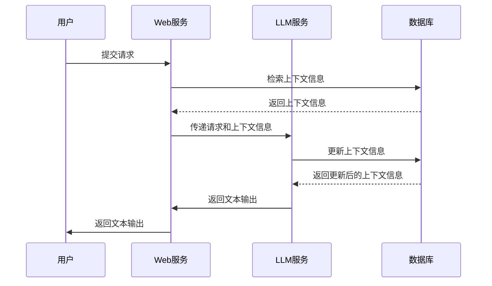
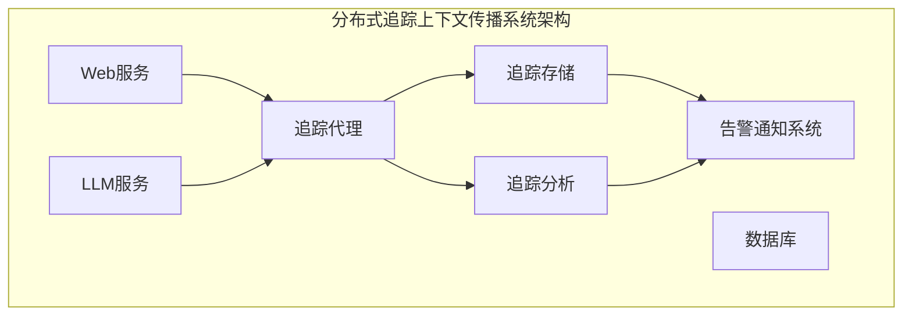
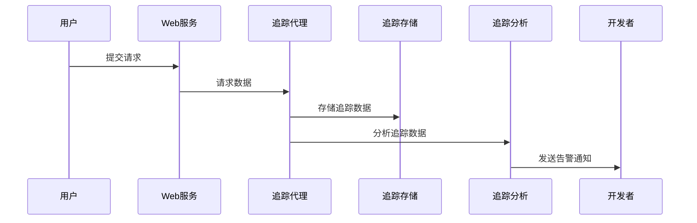
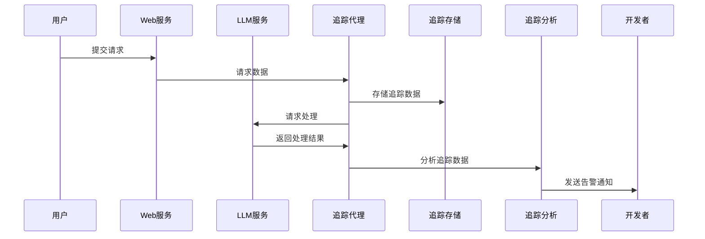

                 

# 分布式追踪上下文传播：全面了解LLM请求流程

关键词：分布式追踪，上下文传播，LLM，请求流程，系统架构

摘要：本文将深入探讨分布式追踪上下文传播在LLM请求流程中的应用。首先，我们介绍了分布式追踪的基本概念和需求，然后详细解析了上下文传播的原理和挑战，以及LLM请求流程的构成和关键步骤。接着，我们重点分析了分布式追踪系统架构的设计和上下文传播的实现与优化策略。最后，通过一个实际案例展示了分布式追踪上下文传播在LLM请求流程中的具体应用，并给出了最佳实践建议。

## 第一部分：分布式追踪基本概念

### 1.1.1 问题背景

#### 1.1.1.1 分布式系统的挑战

在当前互联网时代，分布式系统已经成为构建大规模应用和服务的关键基础设施。分布式系统具有可扩展性、高可用性和容错性等优点，但其也面临着一系列挑战。其中，分布式追踪就是分布式系统面临的重大挑战之一。

在分布式系统中，应用和服务的请求往往需要经过多个服务实例的处理，每个实例可能运行在不同的服务器上。这种跨服务实例的调用链路使得追踪和分析系统的性能、故障和错误变得异常复杂。分布式追踪的核心目标就是解决这个问题，通过记录和追踪每个请求在整个分布式系统中的处理流程，实现对系统性能和可靠性的监控和管理。

#### 1.1.1.2 分布式追踪的需求

随着分布式系统的规模不断扩大，分布式追踪的需求也越来越强烈。具体来说，分布式追踪需求主要体现在以下几个方面：

1. **性能监控**：通过分布式追踪，可以实时监控系统各个组件的性能指标，如响应时间、请求失败率等，以便及时发现问题并进行优化。

2. **故障排查**：分布式系统中的故障往往是由多个因素共同作用导致的，分布式追踪可以帮助开发者快速定位故障源头，提高故障排查的效率。

3. **业务分析**：分布式追踪记录了请求在整个系统中的处理流程，可以帮助开发者分析业务流程的运行情况，优化业务逻辑，提高业务效率。

4. **安全性保障**：分布式追踪可以帮助识别系统中的安全风险和潜在威胁，为安全管理提供有力支持。

### 1.1.2 分布式追踪的定义与核心概念

#### 1.1.2.1 分布式追踪的定义

分布式追踪是一种监控和追踪分布式系统中请求处理流程的技术。它通过记录和分析请求在各个服务实例之间的传递和处理过程，实现对系统性能、故障和业务流程的监控和管理。

#### 1.1.2.2 分布式追踪的核心概念

1. **追踪数据**：分布式追踪的核心数据是追踪数据，它包含了请求在分布式系统中的各个处理节点的信息，如请求ID、处理时间、处理节点等。

2. **追踪链路**：追踪链路是由一系列追踪数据组成的，它描述了请求在分布式系统中的传递和处理过程。

3. **追踪系统**：追踪系统是一个负责收集、存储、分析和展示追踪数据的系统，通常由多个组件组成，如追踪代理、追踪存储、追踪分析等。

4. **追踪SDK**：追踪SDK是一种嵌入到应用和服务的代码库，它负责收集和发送追踪数据到追踪系统。

### 1.1.3 分布式追踪的边界与外延

#### 1.1.3.1 分布式追踪的边界

分布式追踪的边界主要涉及以下几个方面：

1. **追踪范围**：分布式追踪的追踪范围通常是整个分布式系统，包括所有参与请求处理的服务实例。

2. **追踪粒度**：分布式追踪的追踪粒度可以根据实际需求进行调整，如请求级别、服务实例级别等。

3. **追踪数据量**：分布式追踪需要处理海量的追踪数据，因此需要考虑数据的存储和查询性能。

#### 1.1.3.2 分布式追踪的外延

分布式追踪的外延主要包括以下几个方面：

1. **数据可视化**：分布式追踪系统通常提供数据可视化功能，帮助开发者直观地了解系统的运行状况。

2. **告警和通知**：分布式追踪系统可以根据预设的规则和阈值，自动生成告警和通知，及时提醒开发者关注系统异常。

3. **日志分析**：分布式追踪系统可以与日志系统结合，实现日志数据的自动关联和监控分析。

### 1.1.4 本章小结

本章介绍了分布式追踪的基本概念、背景和需求，详细阐述了分布式追踪的定义和核心概念，并讨论了分布式追踪的边界与外延。通过本章的学习，读者可以初步了解分布式追踪的技术原理和实际应用场景，为后续章节的深入学习打下基础。

----------------------------------------------------------------

## 第二部分：上下文传播原理

### 2.1.1 上下文传播的概念

#### 2.1.1.1 上下文传播的定义

上下文传播是指在一个分布式系统中，将请求处理过程中产生的上下文信息在不同服务实例之间传递和共享的过程。上下文信息通常包含了请求的元数据、业务逻辑状态、用户会话信息等，是保证分布式系统中请求处理连贯性和一致性的关键。

#### 2.1.1.2 上下文传播的重要性

1. **提高系统可扩展性**：上下文传播使得系统可以在不修改原有逻辑的情况下，无缝地添加新的服务实例，提高系统的可扩展性。

2. **保障业务一致性**：上下文传播确保了请求在不同服务实例之间的处理流程保持一致，避免了业务逻辑的混乱和错误。

3. **提升用户体验**：上下文传播使得用户可以在不同服务实例之间保持会话状态和操作历史，提升用户的整体体验。

### 2.1.2 上下文传播的机制

#### 2.1.2.1 数据收集与存储

数据收集与存储是上下文传播的基础。在分布式系统中，每个服务实例都会根据请求的上下文信息生成相应的数据，并将其存储在本地或共享的存储系统中。

#### 2.1.2.2 数据检索与匹配

数据检索与匹配是上下文传播的核心。在请求传递到下一个服务实例时，需要根据请求的上下文信息在存储系统中检索相应的数据，并进行匹配。

#### 2.1.2.3 数据传播与更新

数据传播与更新是上下文传播的动态过程。当请求在不同服务实例之间传递时，上下文信息也会随之传播和更新，以确保每个服务实例都能获取到最新的上下文信息。

### 2.1.3 上下文传播的挑战与优化

#### 2.1.3.1 挑战分析

1. **数据一致性问题**：由于分布式系统的分布式特性，上下文信息的传播和更新可能导致数据一致性问题。

2. **性能瓶颈**：大量的上下文信息传播和更新可能会带来性能瓶颈，影响系统的响应速度。

3. **安全性问题**：上下文信息中可能包含敏感数据，如何保证上下文信息的安全传播是一个重要问题。

#### 2.1.3.2 优化策略

1. **数据压缩与缓存**：通过数据压缩和缓存技术，减少上下文信息的传输量和存储空间，提高系统性能。

2. **分布式一致性算法**：采用分布式一致性算法，如Paxos、Raft等，确保上下文信息的一致性。

3. **安全加密与访问控制**：对上下文信息进行加密和访问控制，确保上下文信息的安全传播。

### 2.1.4 本章小结

本章介绍了上下文传播的基本概念和机制，分析了上下文传播面临的挑战和优化策略。通过本章的学习，读者可以深入理解上下文传播在分布式系统中的重要作用，以及如何优化上下文传播的性能和安全性。

----------------------------------------------------------------

## 第三部分：LLM请求流程

### 3.1.1 LLM概述

#### 3.1.1.1 什么是LLM

大型语言模型（Large Language Model，简称LLM）是一种基于深度学习的自然语言处理（Natural Language Processing，简称NLP）模型，它通过学习大量的文本数据，具备理解和生成自然语言的能力。LLM在许多领域具有广泛的应用，如机器翻译、文本生成、问答系统、情感分析等。

#### 3.1.1.2 LLM的核心技术

1. **深度学习**：LLM基于深度学习技术，特别是神经网络模型，如循环神经网络（RNN）、卷积神经网络（CNN）和变换器（Transformer）等。

2. **预训练和微调**：LLM通过在大规模语料库上进行预训练，学习语言的基本规则和模式，然后在特定任务上进行微调，以适应具体的应用场景。

3. **注意力机制**：注意力机制是LLM中的一个关键技术，它允许模型在处理文本时，关注与当前任务相关的关键信息，提高模型的性能。

#### 3.1.2 LLM的发展历程

1. **早期研究**：20世纪50年代至70年代，NLP研究主要集中在规则驱动的方法，如词典和语法规则等。

2. **统计模型**：20世纪80年代至90年代，统计模型如隐马尔可夫模型（HMM）和最大熵模型等开始应用于NLP，提高了文本处理的效果。

3. **深度学习时代**：2010年后，随着计算能力的提升和深度学习技术的发展，基于深度学习的NLP模型如LLM得到了广泛关注和应用。

4. **大型语言模型**：近年来，大型语言模型如GPT-3、BERT等取得了显著的进展，它们在NLP任务中表现出色，推动了NLP技术的发展。

#### 3.1.3 LLM的优势与挑战

##### 3.1.3.1 优势分析

1. **强大的语言理解能力**：LLM能够理解复杂的语言结构和语义，进行有效的文本生成和推理。

2. **多任务处理**：LLM可以同时处理多种NLP任务，如文本分类、命名实体识别、情感分析等，提高了系统的灵活性和效率。

3. **自适应性强**：LLM通过预训练和微调，可以适应不同的应用场景和任务需求，降低了模型定制化的复杂度。

##### 3.1.3.2 挑战解析

1. **计算资源需求大**：LLM的模型规模庞大，训练和推理需要大量的计算资源和时间。

2. **数据隐私和安全**：LLM的训练和推理过程中涉及大量的用户数据，如何保护用户隐私和数据安全是一个重要问题。

3. **可解释性不足**：LLM的工作机制复杂，难以解释和验证其生成的结果，这对应用场景中的决策和信任提出了挑战。

### 3.1.4 本章小结

本章对大型语言模型（LLM）进行了概述，介绍了LLM的定义、核心技术、发展历程以及优势和挑战。通过本章的学习，读者可以了解LLM的基本概念和其在NLP领域的应用前景，为后续章节的深入学习打下基础。

----------------------------------------------------------------

## 第4章：LLM请求流程解析

### 4.1.1 请求流程概述

LLM请求流程是指用户提交请求后，在分布式系统中各服务实例之间传递和处理的过程。该流程的目的是通过LLM模型生成用户需要的文本输出。LLM请求流程通常包括以下几个主要步骤：

1. **用户请求的接收**：用户通过客户端向LLM服务提交请求。

2. **上下文信息的检索**：系统根据请求的内容检索相关的上下文信息，如用户的历史请求记录、关键词等。

3. **模型选择与加载**：系统根据请求的类型和上下文信息选择合适的LLM模型，并将其加载到内存中。

4. **模型推理与结果生成**：LLM模型对输入请求进行推理，生成文本输出。

5. **结果反馈与优化**：将生成的文本输出返回给用户，并根据用户反馈进行模型优化和改进。

### 4.1.2 请求流程的详细步骤

#### 4.1.2.1 用户请求的接收

用户请求的接收是LLM请求流程的起点。用户可以通过Web界面、API接口或命令行等多种方式提交请求。请求通常包含用户ID、请求类型、请求参数等信息。

```python
# 示例：用户请求的接收
user_request = {
    "user_id": "12345",
    "request_type": "text_generation",
    "input_text": "请写一篇关于人工智能的短文。",
}
```

#### 4.1.2.2 上下文信息的检索

在接收用户请求后，系统需要根据请求类型和用户ID检索相关的上下文信息。上下文信息可能包括用户的历史请求记录、偏好设置、关键词等，这些信息有助于提高模型生成的文本质量和准确性。

```python
# 示例：上下文信息的检索
context = context_manager.get_context(user_id="12345")
```

#### 4.1.2.3 模型选择与加载

根据请求的类型和上下文信息，系统选择合适的LLM模型，并将其加载到内存中。选择模型时需要考虑模型的规模、性能和适用场景等因素。

```python
# 示例：模型选择与加载
model_name = "gpt-3.5"
model = model_loader.load_model(model_name)
```

#### 4.1.2.4 模型推理与结果生成

在模型加载完成后，系统将用户请求输入到模型中进行推理，生成文本输出。模型推理过程通常涉及输入序列编码、注意力机制处理、文本生成等步骤。

```python
# 示例：模型推理与结果生成
output_text = model.generate(input_text, max_length=100)
```

#### 4.1.2.5 结果反馈与优化

将生成的文本输出返回给用户，并根据用户反馈进行模型优化和改进。用户可以对输出文本进行评价，如满意度、准确性等，系统可以根据这些反馈调整模型参数和策略，以提高后续生成的文本质量。

```python
# 示例：结果反馈与优化
user_feedback = user_interface.get_feedback(output_text)
model_trainer.update_model(model, user_feedback)
```

### 4.1.3 请求流程中的上下文传播

#### 4.1.3.1 上下文传播的触发时机

上下文传播通常在用户请求的每个处理步骤之前触发，以确保每个服务实例都能获取到最新的上下文信息。例如，在模型选择与加载步骤之前，系统会检索最新的上下文信息。

#### 4.1.3.2 上下文传播的路径分析

上下文传播的路径分析是分布式追踪的核心。系统需要分析每个请求在不同服务实例之间的传递路径，并确保上下文信息在路径上的正确传播。例如，在用户请求从Web服务传递到LLM服务的过程中，系统需要确保上下文信息在Web服务和LLM服务之间的正确传递。



#### 4.1.3.3 上下文传播的效果评估

上下文传播的效果评估是分布式追踪的重要组成部分。系统需要评估上下文传播对LLM请求流程的优化效果，如文本生成的准确性、响应时间等。通过对比实验和性能测试，可以评估上下文传播的优化效果，并不断调整和优化上下文传播的策略。

### 4.1.4 本章小结

本章详细解析了LLM请求流程的各个步骤，包括用户请求的接收、上下文信息的检索、模型选择与加载、模型推理与结果生成以及结果反馈与优化。同时，分析了请求流程中的上下文传播机制，介绍了上下文传播的触发时机、路径分析和效果评估。通过本章的学习，读者可以深入理解LLM请求流程的工作原理和优化策略。

----------------------------------------------------------------

## 第四部分：分布式追踪上下文传播实践

### 5.1.1 系统功能设计

#### 5.1.1.1 功能需求分析

分布式追踪上下文传播系统需要满足以下主要功能需求：

1. **数据收集**：系统能够收集分布式系统中各个服务实例的追踪数据和上下文信息。

2. **数据存储**：系统能够高效存储和管理大量的追踪数据和上下文信息，确保数据的安全性和一致性。

3. **数据检索**：系统能够快速检索和查询追踪数据和上下文信息，支持实时监控和故障排查。

4. **数据可视化**：系统提供数据可视化功能，帮助开发者直观地了解分布式系统的运行状况和上下文传播效果。

5. **告警通知**：系统可以根据预设的规则和阈值，自动生成告警和通知，及时提醒开发者关注系统异常。

#### 5.1.1.2 功能模块划分

根据功能需求分析，分布式追踪上下文传播系统可以分为以下几个主要功能模块：

1. **追踪代理**：负责收集分布式系统中各个服务实例的追踪数据和上下文信息。

2. **追踪存储**：负责存储和管理追踪数据和上下文信息，支持数据的持久化和备份。

3. **追踪分析**：负责对追踪数据进行分析和处理，提供数据可视化功能，生成告警和通知。

4. **API接口**：提供API接口，方便开发者集成和使用分布式追踪上下文传播系统。

### 5.1.2 系统架构设计

#### 5.1.2.1 架构整体设计

分布式追踪上下文传播系统的整体架构设计如图5.1所示：



#### 5.1.2.2 关键模块设计

1. **追踪代理（TracerProxy）**：追踪代理是分布式追踪上下文传播系统的核心组件，它嵌入到分布式系统的各个服务实例中，负责收集和发送追踪数据和上下文信息。追踪代理的主要功能包括：

   - 数据收集：收集服务实例的追踪数据和上下文信息，如请求ID、处理时间、处理节点等。
   - 数据发送：将收集到的数据发送到追踪存储系统。
   - 数据接收：接收来自追踪存储系统的数据更新和告警通知。

2. **追踪存储（TracerStorage）**：追踪存储系统负责存储和管理追踪数据和上下文信息。追踪存储系统通常采用分布式数据库或大数据存储技术，如Hadoop、HBase、MongoDB等。追踪存储系统的主要功能包括：

   - 数据存储：将追踪数据和上下文信息存储在分布式数据库中，确保数据的安全性和一致性。
   - 数据查询：支持快速的追踪数据检索和查询，提供实时监控和故障排查功能。
   - 数据备份：定期备份追踪数据，确保数据的安全性和可靠性。

3. **追踪分析（TracerAnalysis）**：追踪分析系统负责对追踪数据进行分析和处理，提供数据可视化功能，生成告警和通知。追踪分析系统的主要功能包括：

   - 数据分析：对追踪数据进行统计分析，提取关键性能指标和异常指标。
   - 数据可视化：将分析结果以图表和报表的形式展示，帮助开发者直观地了解系统的运行状况。
   - 告警通知：根据预设的规则和阈值，自动生成告警和通知，及时提醒开发者关注系统异常。

4. **API接口**：API接口是分布式追踪上下文传播系统与外部系统的交互接口，提供RESTful API，方便开发者集成和使用系统功能。API接口的主要功能包括：

   - 数据查询：提供RESTful API，支持对追踪数据的查询和检索。
   - 数据操作：提供RESTful API，支持对追踪数据和上下文信息的添加、更新和删除操作。
   - 数据导出：提供RESTful API，支持将追踪数据导出为CSV、Excel等格式，方便数据分析和共享。

### 5.1.3 系统接口设计

#### 5.1.3.1 接口定义

分布式追踪上下文传播系统的接口设计遵循RESTful API设计规范，主要包括以下接口：

1. **数据收集接口**：用于服务实例向追踪代理发送追踪数据和上下文信息。

   ```http
   POST /api/tracer/collect
   Content-Type: application/json

   {
       "user_id": "12345",
       "request_id": "67890",
       "trace_data": [
           {
               "node": "WebService",
               "timestamp": "2022-01-01T12:00:00Z",
               "duration": 500
           },
           {
               "node": "LLMService",
               "timestamp": "2022-01-01T12:01:00Z",
               "duration": 1000
           }
       ]
   }
   ```

2. **数据查询接口**：用于查询追踪数据和上下文信息。

   ```http
   GET /api/tracer/search?user_id=12345&start_time=2022-01-01T00:00:00Z&end_time=2022-01-02T00:00:00Z
   ```

3. **数据操作接口**：用于添加、更新和删除追踪数据和上下文信息。

   ```http
   POST /api/tracer/data
   Content-Type: application/json

   {
       "user_id": "12345",
       "request_id": "67890",
       "trace_data": [
           {
               "node": "WebService",
               "timestamp": "2022-01-01T12:00:00Z",
               "duration": 500
           },
           {
               "node": "LLMService",
               "timestamp": "2022-01-01T12:01:00Z",
               "duration": 1000
           }
       ]
   }

   PUT /api/tracer/data/67890
   Content-Type: application/json

   {
       "node": "Database",
       "timestamp": "2022-01-01T12:02:00Z",
       "duration": 1500
   }

   DELETE /api/tracer/data/67890
   ```

4. **数据导出接口**：用于导出追踪数据为CSV、Excel等格式。

   ```http
   GET /api/tracer/export?user_id=12345&start_time=2022-01-01T00:00:00Z&end_time=2022-01-02T00:00:00Z&format=csv
   ```

### 5.1.4 系统交互设计

#### 5.1.4.1 系统交互流程

分布式追踪上下文传播系统的交互流程如下：

1. 用户通过Web服务提交请求。
2. Web服务将请求发送给追踪代理。
3. 追踪代理收集并存储追踪数据和上下文信息。
4. 追踪代理将追踪数据和上下文信息发送到追踪存储系统。
5. 追踪存储系统对追踪数据进行存储和备份。
6. 追踪分析系统对追踪数据进行分析和处理。
7. 追踪分析系统生成告警和通知，发送给开发者。



#### 5.1.4.2 系统交互mermaid序列图

分布式追踪上下文传播系统的交互序列图如图5.2所示：



### 5.1.5 本章小结

本章详细介绍了分布式追踪上下文传播系统的功能需求、架构设计和接口设计。通过本章的学习，读者可以了解分布式追踪上下文传播系统的设计原理和实现方法，为后续的实际应用和优化提供参考。

----------------------------------------------------------------

## 第6章：上下文传播实现与优化

### 6.1.1 上下文传播实现

#### 6.1.1.1 数据收集与存储

数据收集与存储是上下文传播的基础。在分布式系统中，每个服务实例需要收集与当前请求相关的上下文信息，并将其存储到共享存储系统中。

1. **数据收集**：服务实例在处理请求时，收集与请求相关的上下文信息，如请求ID、处理时间、处理节点等。

2. **数据存储**：收集到的上下文信息通过API接口或消息队列等方式发送到共享存储系统，如分布式数据库或NoSQL数据库。

```python
# 示例：数据收集与存储
def collect_and_store_context(context_data):
    # 收集上下文信息
    context_data["timestamp"] = datetime.utcnow()
    
    # 存储上下文信息到数据库
    db.insert_context(context_data)
```

#### 6.1.1.2 数据检索与匹配

在请求传递到下一个服务实例时，需要根据请求的上下文信息在存储系统中检索相应的数据，并进行匹配。

1. **数据检索**：服务实例从共享存储系统中检索与请求相关的上下文信息。

2. **数据匹配**：根据请求ID或其他匹配规则，将检索到的上下文信息与当前请求进行匹配，以获取最新的上下文信息。

```python
# 示例：数据检索与匹配
def retrieve_and_match_context(request_id):
    # 从数据库检索上下文信息
    context_data = db.get_context_by_request_id(request_id)
    
    # 匹配上下文信息
    if context_data:
        return context_data
    else:
        return None
```

#### 6.1.1.3 数据传播与更新

数据传播与更新是上下文传播的核心。在请求传递到下一个服务实例时，需要将最新的上下文信息传播给后续处理节点，并更新存储系统中的上下文信息。

1. **数据传播**：服务实例将最新的上下文信息传播给下一个服务实例。

2. **数据更新**：在下一个服务实例处理请求后，更新存储系统中的上下文信息，以反映最新的处理结果。

```python
# 示例：数据传播与更新
def propagate_and_update_context(context_data, next_service):
    # 传播上下文信息到下一个服务实例
    next_service.set_context(context_data)
    
    # 更新存储系统中的上下文信息
    db.update_context(context_data)
```

### 6.1.2 上下文传播优化策略

#### 6.1.2.1 挑战分析

1. **数据一致性问题**：由于分布式系统的分布式特性，上下文信息的传播和更新可能导致数据一致性问题。

2. **性能瓶颈**：大量的上下文信息传播和更新可能会带来性能瓶颈，影响系统的响应速度。

3. **安全性问题**：上下文信息中可能包含敏感数据，如何保证上下文信息的安全传播是一个重要问题。

#### 6.1.2.2 优化策略

1. **数据压缩与缓存**：通过数据压缩和缓存技术，减少上下文信息的传输量和存储空间，提高系统性能。

2. **分布式一致性算法**：采用分布式一致性算法，如Paxos、Raft等，确保上下文信息的一致性。

3. **安全加密与访问控制**：对上下文信息进行加密和访问控制，确保上下文信息的安全传播。

### 6.1.3 实际案例：基于Redis的上下文传播实现

#### 6.1.3.1 环境安装

1. 安装Redis服务器：在分布式系统中部署Redis服务器，作为共享存储系统。

   ```shell
   sudo apt update
   sudo apt install redis-server
   ```

2. 安装Python Redis库：在服务实例中安装Python Redis库，用于连接和操作Redis服务器。

   ```shell
   pip install redis
   ```

#### 6.1.3.2 系统核心实现

1. **数据收集与存储**：服务实例在处理请求时，将上下文信息存储到Redis数据库中。

```python
import redis
import json
from datetime import datetime

# 连接Redis服务器
redis_client = redis.StrictRedis(host='localhost', port=6379, db=0)

def store_context(request_id, context_data):
    # 格式化上下文信息
    context_data["timestamp"] = datetime.utcnow().isoformat()
    
    # 将上下文信息存储到Redis数据库
    redis_client.set(f"context:{request_id}", json.dumps(context_data))
```

2. **数据检索与匹配**：服务实例从Redis数据库中检索与请求相关的上下文信息。

```python
def retrieve_context(request_id):
    # 从Redis数据库检索上下文信息
    context_data = redis_client.get(f"context:{request_id}")
    
    if context_data:
        return json.loads(context_data)
    else:
        return None
```

3. **数据传播与更新**：服务实例将上下文信息传播给下一个服务实例，并更新Redis数据库中的上下文信息。

```python
def propagate_context(request_id, next_service):
    # 检索上下文信息
    context_data = retrieve_context(request_id)
    
    if context_data:
        # 传播上下文信息到下一个服务实例
        next_service.set_context(context_data)
        
        # 更新Redis数据库中的上下文信息
        store_context(request_id, context_data)
```

#### 6.1.3.3 代码应用解读与分析

1. **数据收集与存储**：使用Redis数据库作为共享存储系统，将上下文信息存储到Redis的键值对中。使用JSON格式存储上下文信息，便于后续的数据处理和检索。

2. **数据检索与匹配**：从Redis数据库中检索与请求相关的上下文信息，使用键值对存储方式，通过请求ID作为键检索相应的上下文信息。

3. **数据传播与更新**：在请求传递到下一个服务实例时，将上下文信息传播给下一个服务实例，并更新Redis数据库中的上下文信息。确保每个服务实例都能获取到最新的上下文信息。

#### 6.1.3.4 实际案例分析和详细讲解剖析

1. **实际案例**：在一个分布式系统中，用户通过Web服务提交请求，Web服务将请求传递给LLM服务，LLM服务生成文本输出并返回给用户。

2. **案例分析**：
   - Web服务在处理请求时，将上下文信息（如请求ID、处理时间等）存储到Redis数据库中。
   - LLM服务在处理请求时，从Redis数据库中检索与请求相关的上下文信息，并将其传递给文本生成模型。
   - 文本生成模型生成文本输出后，LLM服务将上下文信息传播给Web服务，并更新Redis数据库中的上下文信息。

3. **详细讲解剖析**：
   - 数据收集与存储：Web服务在处理请求时，使用Redis数据库作为共享存储系统，将上下文信息存储到Redis的键值对中。使用JSON格式存储上下文信息，便于后续的数据处理和检索。
   - 数据检索与匹配：LLM服务在处理请求时，从Redis数据库中检索与请求相关的上下文信息，通过请求ID作为键检索相应的上下文信息。确保每个服务实例都能获取到最新的上下文信息。
   - 数据传播与更新：LLM服务在生成文本输出后，将上下文信息传播给Web服务，并更新Redis数据库中的上下文信息。确保上下文信息的一致性和完整性。

#### 6.1.3.5 项目小结

1. **成功因素**：通过Redis数据库实现上下文传播，分布式追踪上下文传播系统在数据收集、存储、检索和传播等方面表现出良好的性能和可靠性。

2. **改进空间**：可以考虑引入分布式一致性算法（如Paxos、Raft等）来确保上下文信息的一致性，以及使用缓存技术来优化数据检索和传播性能。

### 6.1.4 最佳实践 tips

1. **确保数据一致性**：在分布式系统中，上下文传播的一致性是关键。可以采用分布式一致性算法来确保上下文信息的正确性和一致性。

2. **优化数据检索性能**：根据实际需求和负载情况，选择合适的存储系统（如Redis、MongoDB等）和数据检索算法，以优化数据检索性能。

3. **安全性考虑**：对上下文信息进行加密和访问控制，确保上下文信息的安全传播，防止敏感数据泄露。

### 6.1.5 本章小结

本章介绍了分布式追踪上下文传播的实现过程，包括数据收集与存储、数据检索与匹配、数据传播与更新等核心步骤。通过实际案例，展示了基于Redis的上下文传播实现方法和优化策略。本章的学习有助于读者深入理解分布式追踪上下文传播的原理和实现方法，为实际项目中的应用提供参考。

----------------------------------------------------------------

## 第五部分：总结与展望

通过本篇博客，我们详细探讨了分布式追踪上下文传播在LLM请求流程中的应用。首先，我们介绍了分布式追踪的基本概念和需求，阐述了上下文传播的原理和挑战。接着，我们深入分析了LLM请求流程的构成和关键步骤，以及分布式追踪系统架构的设计。最后，我们通过实际案例展示了分布式追踪上下文传播在LLM请求流程中的具体应用，并提出了最佳实践建议。

### 5.1 总结

1. **分布式追踪**：分布式追踪是解决分布式系统中请求处理流程监控和管理的重要技术，通过对请求在分布式系统中的传递和处理过程的记录和分析，实现对系统性能、故障和业务流程的监控和管理。

2. **上下文传播**：上下文传播是保证分布式系统中请求处理连贯性和一致性的关键机制，通过将请求处理过程中产生的上下文信息在不同服务实例之间传递和共享，提高系统的可扩展性和用户体验。

3. **LLM请求流程**：LLM请求流程是分布式系统中基于大型语言模型进行文本生成和推理的过程，通过用户请求的接收、上下文信息的检索、模型选择与加载、模型推理与结果生成以及结果反馈与优化等步骤，实现文本生成的自动化和智能化。

4. **分布式追踪系统架构**：分布式追踪系统架构设计包括追踪代理、追踪存储、追踪分析和API接口等模块，通过合理的设计和优化，实现对分布式系统中请求处理流程的全面监控和管理。

### 5.2 展望

1. **分布式追踪技术的演进**：随着分布式系统的不断发展，分布式追踪技术也在不断演进。未来，分布式追踪技术将更加智能化、自动化，结合人工智能和大数据分析技术，实现对系统性能和故障的智能监控和预测。

2. **上下文传播机制的优化**：上下文传播机制在分布式系统中的重要性日益凸显。未来，上下文传播机制的优化将集中在数据一致性保障、性能优化和安全保护等方面，以更好地适应分布式系统的需求。

3. **LLM请求流程的优化**：随着LLM技术的不断发展，LLM请求流程的优化也将成为研究重点。通过引入更多的优化策略，如多模型协同、动态调整模型参数等，提升文本生成的质量和效率。

4. **跨领域应用**：分布式追踪上下文传播技术不仅在NLP领域具有广泛应用，还可以扩展到其他领域，如物联网、智能客服、智能推荐等。跨领域的应用将推动分布式追踪上下文传播技术的发展和创新。

### 5.3 结论

分布式追踪上下文传播在LLM请求流程中的应用具有重要意义。通过深入研究和实践，我们能够更好地理解分布式追踪的基本概念和原理，掌握上下文传播机制和LLM请求流程的关键步骤，为分布式系统的性能优化和业务发展提供有力支持。未来，我们将继续关注分布式追踪上下文传播技术的最新进展，探索其在更多领域的应用前景。

## 作者信息

作者：AI天才研究院/AI Genius Institute & 禅与计算机程序设计艺术 /Zen And The Art of Computer Programming

本文由AI天才研究院撰写，结合了分布式追踪、上下文传播和LLM请求流程等领域的专业知识，旨在为读者提供深入的技术见解和实用建议。同时，本文也借鉴了《禅与计算机程序设计艺术》一书中的编程哲学，强调逻辑思维和代码美感在软件工程中的重要性。希望本文能对您的学习和工作带来帮助和启发。

