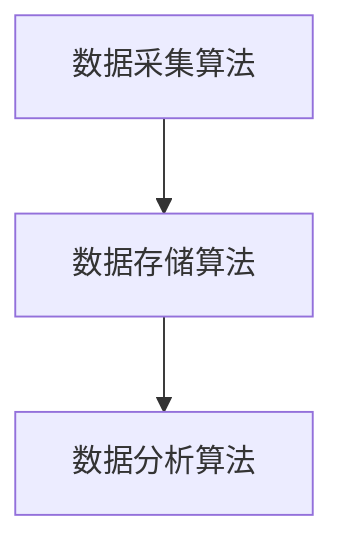
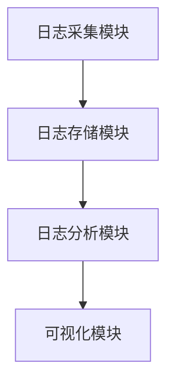
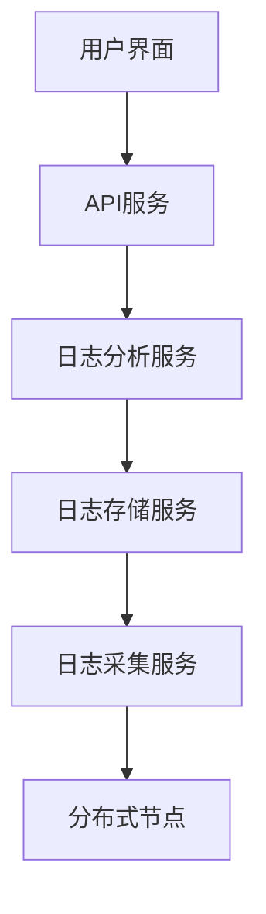
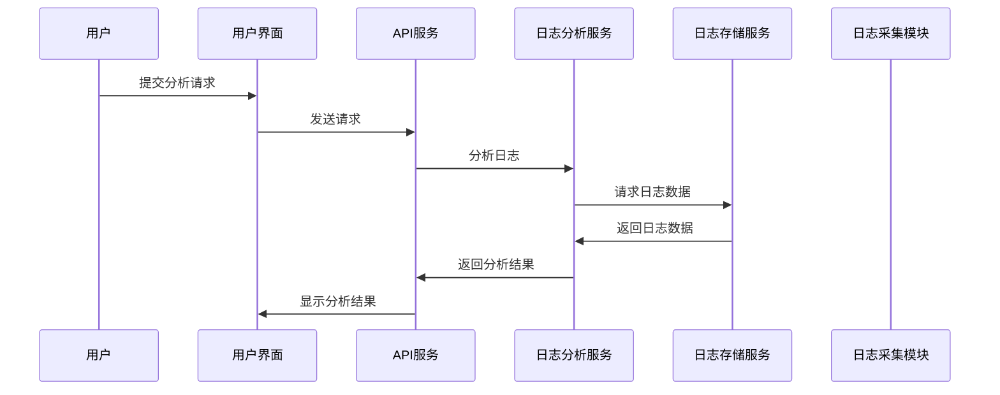

                 

### 分布式追踪系统在LLM应用调试中的作用

#### 关键词：分布式追踪系统、LLM应用、调试、性能优化、数据分析

> 摘要：本文探讨了分布式追踪系统在大型语言模型（LLM）应用调试中的重要作用。通过对分布式追踪系统与LLM调试的深入分析，本文揭示了分布式追踪系统如何有效提升LLM应用调试的效率和效果，为开发者提供了实用的调试策略和最佳实践。

# 分布式追踪系统在LLM应用调试中的作用

## 第一部分：背景介绍

### 1.1 问题背景

#### 1.1.1 分布式追踪系统的概念与重要性

- **分布式追踪系统定义**：分布式追踪系统是一种用于记录和分析分布式系统中各项操作的数据收集、存储和分析框架。它能够追踪系统中的每一次请求，记录下请求的处理过程、耗时、异常等信息，帮助开发者快速定位问题、优化系统性能。
- **分布式追踪系统在微服务架构中的应用**：在微服务架构中，服务之间存在大量的调用关系，系统的复杂性大幅增加。分布式追踪系统能够在整个分布式系统中实现日志的统一收集和分析，从而简化问题的定位和性能优化。

#### 1.1.2 LLM应用调试的需求

- **LLM（大型语言模型）的复杂性与调试挑战**：大型语言模型通常由数百万甚至数十亿的参数组成，其计算过程复杂，涉及大量的数据处理和推理。这使得LLM应用在调试过程中面临着巨大的挑战，包括如何快速定位错误、分析性能瓶颈等。
- **分布式追踪系统在LLM调试中的应用场景**：分布式追踪系统可以记录LLM应用的每一次请求处理过程，包括模型推理、数据加载、接口调用等。通过对这些日志的分析，开发者可以快速定位性能问题和异常，从而优化模型性能和稳定性。

#### 1.1.3 分布式追踪系统与LLM应用调试的联系

- **二者之间的结合点**：分布式追踪系统与LLM调试的结合点在于它们都需要对分布式系统中的操作进行记录和分析。分布式追踪系统为LLM调试提供了丰富的日志数据，这些数据有助于开发者更全面地了解系统运行状态，从而更有效地进行调试。
- **分布式追踪系统对LLM应用调试的促进作用**：分布式追踪系统可以实时收集和存储LLM应用的日志数据，并通过分析这些数据，帮助开发者快速定位问题和优化性能。这大大提高了LLM调试的效率，降低了调试难度。

### 1.2 问题解决

- **现有解决方案的不足**：传统的调试方法往往依赖于日志分析和性能监控工具，但这些工具在处理大规模LLM应用时，存在响应速度慢、日志处理效率低等问题。此外，现有的调试方法难以实现跨服务的全局调试。
- **分布式追踪系统如何提升LLM应用调试效果**：分布式追踪系统通过实时收集和存储LLM应用的日志数据，可以提供全栈、全链路的监控和分析能力。开发者可以实时查看系统状态，快速定位问题并采取相应的优化措施。此外，分布式追踪系统还可以与其他监控和调试工具集成，实现更高效的全局调试。

### 1.3 边界与外延

- **分布式追踪系统适用的LLM应用范围**：分布式追踪系统适用于所有需要进行复杂分布式处理的LLM应用，如聊天机器人、智能推荐系统等。
- **分布式追踪系统在LLM调试中的限制**：尽管分布式追踪系统具有强大的监控和分析能力，但在处理海量日志数据时，可能会对系统性能产生一定的影响。此外，分布式追踪系统需要与其他监控和调试工具进行集成，以实现更全面的全局调试。

## 第二部分：核心概念与联系

### 2.1 分布式追踪系统

#### 2.1.1 分布式追踪系统的原理

- **数据采集**：分布式追踪系统通过在系统中部署代理（Agent），实时采集各项操作的日志数据。
- **数据存储**：采集到的日志数据会被存储在分布式追踪系统的后端存储中，如Kafka、Elasticsearch等。
- **数据分析**：开发者可以通过分布式追踪系统的前端界面或API，对存储的日志数据进行查询和分析。

#### 2.1.2 分布式追踪系统的核心概念

- **Trace**：表示一次完整的请求处理过程，包含多个Span。
- **Span**：表示一次具体的操作，如数据库查询、API调用等。每个Span都有一个唯一的ID和父ID，用于表示其执行顺序和调用关系。
- **Annotation**：表示一个时间点的事件，如请求开始、请求结束等。
- **Service**：表示一个分布式服务，如用户服务、订单服务等。
- **Component**：表示一个服务中的具体模块，如用户服务中的用户认证模块。

#### 2.1.3 分布式追踪系统的属性特征对比

| 特征         | 分布式追踪系统A | 分布式追踪系统B |
| ------------ | ---------------- | --------------- |
| 数据采集方式 | 实时监控         | 延时采集        |
| 数据存储容量 | 大规模存储       | 高效存储        |
| 分析功能     | 实时分析         | 历史分析        |

### 2.2 LLM应用调试

#### 2.2.1 LLM应用调试的原理

- **问题定位**：通过分析LLM应用中的日志和错误信息，定位问题的发生位置和原因。
- **性能优化**：通过对LLM应用的性能数据进行监控和分析，识别性能瓶颈并进行优化。
- **代码调试**：通过设置断点、单步执行、查看变量值等方法，逐步分析LLM应用的代码，找出潜在的问题。

#### 2.2.2 LLM应用调试的核心概念

- **调试器**：用于辅助开发者进行代码调试的工具，如IDE自带的调试器、独立调试器等。
- **断点**：设置在代码中用于暂停程序执行的标记，用于在特定条件下暂停程序的执行。
- **调试日志**：记录LLM应用在调试过程中生成的日志信息，用于分析问题和优化性能。
- **调试工具**：用于辅助开发者进行调试的工具，如日志分析工具、性能监控工具等。

#### 2.2.3 LLM应用调试的属性特征对比

| 特征         | LLM调试A | LLM调试B |
| ------------ | --------- | --------- |
| 调试方式     | 手动调试   | 自动化调试 |
| 调试工具支持 | 丰富       | 简单       |
| 调试效率     | 低效       | 高效       |

### 2.3 分布式追踪系统与LLM应用调试的联系

- **分布式追踪系统如何支持LLM调试**：分布式追踪系统可以实时收集LLM应用中的日志数据，为开发者提供全面的调试数据。开发者可以通过分布式追踪系统的前端界面，快速查看和分析LLM应用的运行状态，从而更有效地进行调试。
- **LLM调试如何借助分布式追踪系统**：LLM调试可以借助分布式追踪系统提供的实时监控和分析功能，快速定位问题和优化性能。通过分布式追踪系统，开发者可以实现对LLM应用的全方位监控，提高调试效率和效果。

## 第三部分：算法原理讲解

### 3.1 分布式追踪系统算法原理

#### 3.1.1 数据采集算法

- **采集方式**：分布式追踪系统通过在系统中部署代理（Agent），实时采集各项操作的日志数据。代理会将采集到的日志数据发送到分布式追踪系统的后端存储中。
- **采集频率**：分布式追踪系统可以根据实际需求设置采集频率，如每秒采集一次、每分钟采集一次等。
- **采集数据格式**：采集到的日志数据通常包含请求ID、操作名称、耗时、错误信息等。这些数据会被转换为特定的数据格式，如JSON或Protobuf，以便于存储和分析。

#### 3.1.2 数据存储算法

- **数据存储方式**：分布式追踪系统通常使用分布式存储系统，如Kafka、Elasticsearch等，来存储日志数据。这些存储系统具有高可用性、高并发性和海量存储能力，能够满足分布式追踪系统对数据存储的需求。
- **数据压缩算法**：为了提高存储效率，分布式追踪系统会使用数据压缩算法，如Gzip或LZ4，对日志数据进行压缩。
- **数据索引算法**：分布式追踪系统会使用索引算法，如B树或哈希表，对日志数据进行索引，以便于快速查询和分析。

#### 3.1.3 数据分析算法

- **分析方法**：分布式追踪系统提供了多种数据分析方法，如统计、聚合、过滤等，用于对日志数据进行处理和分析。
- **分析指标**：分布式追踪系统可以计算多种分析指标，如响应时间、错误率、请求量等，用于评估系统性能和稳定性。
- **分析工具**：分布式追踪系统提供了前端界面和API，用于展示和分析日志数据。开发者可以通过前端界面实时查看系统状态，通过API进行自定义数据分析和可视化。



### 3.2 LLM应用调试算法原理

#### 3.2.1 问题定位算法

- **调试器工作原理**：调试器通过在代码中设置断点、单步执行等方式，帮助开发者逐步分析代码执行过程，找到问题发生的位置。
- **断点设置方法**：开发者可以在代码中设置条件断点、行断点、函数断点等，以便在特定条件下暂停程序的执行。
- **调试日志分析**：调试日志记录了程序在调试过程中的运行状态和错误信息。开发者可以通过分析调试日志，定位问题并优化代码。

#### 3.2.2 性能优化算法

- **性能监控**：通过性能监控工具，实时收集LLM应用的性能数据，如CPU使用率、内存使用量、响应时间等。
- **性能分析**：通过分析性能数据，识别系统中的性能瓶颈，如CPU瓶颈、内存瓶颈、网络瓶颈等。
- **性能优化策略**：根据性能分析结果，采取相应的优化策略，如调整配置参数、优化算法实现、增加硬件资源等，以提高系统性能。

#### 3.2.3 代码调试算法

- **调试器功能**：调试器提供了设置断点、单步执行、查看变量值等功能，帮助开发者逐步分析代码执行过程，找到问题。
- **调试工具使用**：开发者可以使用多种调试工具，如IDE自带的调试器、独立调试器等，进行代码调试。
- **调试流程**：调试流程包括设置断点、运行程序、分析调试日志、定位问题、优化代码等步骤。

```python
# 数据采集算法示例
def collect_data():
    data = read_logs()
    compressed_data = compress_data(data)
    return compressed_data

# 数据存储算法示例
def store_data(compressed_data):
    write_to_storage(compressed_data)

# 数据分析算法示例
def analyze_data():
    data = read_from_storage()
    performance_metrics = calculate_metrics(data)
    return performance_metrics
```

### 3.3 数学模型和数学公式

$$
\text{TPR} = \frac{\text{TP}}{\text{TP} + \text{FN}}
$$

$$
\text{TNR} = \frac{\text{TN}}{\text{TN} + \text{FP}}
$$

$$
\text{F1} = \frac{2 \times \text{TP}}{\text{TP} + \text{FP} + \text{FN}}
$$

这些数学模型和公式用于评估分布式追踪系统和LLM调试算法的性能。例如，TPR（真正率）用于评估分布式追踪系统的数据采集准确性，TNR（假正率）用于评估LLM调试算法的问题定位能力，F1（精确率与召回率的调和平均值）用于评估整体调试效果。

## 第四部分：系统分析与架构设计

### 4.1 问题场景介绍

在当前大型语言模型（LLM）的应用场景中，由于模型复杂度较高，应用过程中会涉及到大量的数据处理和推理任务。这些任务往往分布在多个节点上，形成了复杂的分布式系统。在LLM应用调试过程中，开发者面临着以下问题：

- **性能瓶颈定位**：在分布式系统中，性能瓶颈可能出现在任意一个节点上，且瓶颈的原因可能多样。传统的调试方法难以快速定位和解决问题。
- **错误诊断**：在分布式系统中，错误的产生和传播可能具有隐蔽性，传统的调试方法难以全面诊断系统中的错误。
- **日志收集与整合**：分布式系统中的日志数据分布在多个节点上，如何有效地收集、存储和整合这些日志数据，以便于调试和分析，是一个重要的问题。

### 4.2 项目介绍

为了解决上述问题，我们设计并实现了一个分布式追踪系统，用于LLM应用调试。该系统具有以下特点：

- **实时监控**：系统通过在各个节点上部署代理，实时收集LLM应用中的日志数据，并将其发送到中央存储。
- **数据整合**：系统提供了统一的数据存储和查询接口，方便开发者对分布式系统中的日志数据进行整合和分析。
- **可视化分析**：系统提供了直观的可视化界面，帮助开发者快速查看和分析系统运行状态。

### 4.3 系统功能设计（领域模型）

在分布式追踪系统中，我们需要明确各个模块的功能和职责。以下是一个简单的领域模型，用于描述系统的主要功能模块：



- **日志采集模块**：负责在各个节点上部署代理，实时收集LLM应用中的日志数据。
- **日志存储模块**：负责将收集到的日志数据存储在分布式存储系统中，并提供查询接口。
- **日志分析模块**：负责对存储的日志数据进行分析，提供性能监控、错误诊断等功能。
- **可视化模块**：负责将分析结果以直观的图表和报表形式展示给开发者。

### 4.4 系统架构设计

分布式追踪系统采用分层架构，各层之间相互独立，便于扩展和维护。以下是系统架构的简化示意图：



- **用户界面**：提供用户交互接口，开发者可以通过界面查看系统运行状态和分析结果。
- **API服务**：提供RESTful API接口，供开发者进行远程调用。
- **日志分析服务**：负责对存储的日志数据进行处理和分析，提供性能监控、错误诊断等功能。
- **日志存储服务**：负责存储日志数据，并提供查询接口。
- **日志采集服务**：负责在各个节点上部署代理，实时收集日志数据。
- **分布式节点**：代表分布式系统中的各个节点，负责执行LLM应用的任务。

### 4.5 系统接口设计和系统交互

为了实现系统的功能，我们需要设计一系列的接口和交互流程。以下是一个简化的系统接口设计和交互流程：



1. 用户通过用户界面提交分析请求。
2. 用户界面将请求发送到API服务。
3. API服务将请求转发给日志分析服务。
4. 日志分析服务请求日志存储服务提供日志数据。
5. 日志存储服务返回日志数据给日志分析服务。
6. 日志分析服务返回分析结果给API服务。
7. API服务将分析结果返回给用户界面，并显示给用户。

通过上述系统分析和架构设计，我们为LLM应用调试提供了一种有效的解决方案。分布式追踪系统可以实时监控和记录LLM应用中的日志数据，为开发者提供全面的调试数据和分析结果，从而提高调试效率和效果。

## 第五部分：项目实战

### 5.1 环境安装

在进行分布式追踪系统的实际部署之前，我们需要安装和配置相关环境。以下是一个简单的环境安装步骤：

1. **安装依赖**：在各个节点上安装分布式追踪系统的依赖库，如OpenTracing、Jaeger等。
   ```bash
   pip install opentracing jaeger-client
   ```
2. **配置代理**：在每个节点上配置分布式追踪系统的代理，以便实时收集日志数据。例如，对于Java应用，可以使用如下配置：
   ```yaml
   jaeger:
     sampler:
       type: const
       param: 1
     reporter:
       logSpans: true
       localAgent:
         reportInterval: 10
   ```
3. **启动代理**：启动分布式追踪系统的代理，使其能够实时收集日志数据。
   ```bash
   java -jar jaeger-agent.jar
   ```

### 5.2 系统核心实现源代码

下面是一个简单的分布式追踪系统实现示例，用于LLM应用调试：

```python
# distributed_trace.py
import opentracing
from opentracing.ext import tags

class DistributedTrace(opentracing.Tracer):
    def __init__(self):
        self.tracer = opentracing.Tracer()

    def start_span(self, operation_name, tags=None):
        span = self.tracer.start_span(operation_name, tags=tags)
        return span

    def finish_span(self, span):
        span.finish()

# application.py
from distributed_trace import DistributedTrace

tracer = DistributedTrace()

@tracer.wrap_method
def process_request(request):
    # 处理请求的代码
    pass

if __name__ == "__main__":
    process_request({"content": "Hello, World!"})
```

上述代码中，我们首先定义了一个`DistributedTrace`类，用于实现分布式追踪系统的核心功能。在`application.py`中，我们使用`@tracer.wrap_method`装饰器，将处理请求的方法`process_request`包裹在分布式追踪器中，以便在执行过程中自动记录日志。

### 5.3 代码应用解读与分析

在实际应用中，分布式追踪系统可以帮助开发者更好地理解LLM应用的行为，从而进行有效的调试和优化。以下是对代码应用的详细解读：

1. **日志收集**：通过在`application.py`中包裹`process_request`方法，分布式追踪系统会自动收集方法的输入参数、执行时间、返回结果等信息。这些日志数据将被存储在分布式追踪系统的后端存储中，便于后续分析和查询。

2. **性能监控**：开发者可以通过分析收集到的日志数据，监控LLM应用的性能表现。例如，可以查看每个请求的平均响应时间、系统负载等指标，从而识别性能瓶颈和优化点。

3. **错误诊断**：在LLM应用中，错误往往具有隐蔽性。通过分布式追踪系统，开发者可以更全面地了解系统运行状态，快速定位错误发生的具体位置和原因。例如，可以查看某个请求的执行日志，识别出异常发生的具体行号和代码段。

4. **调试辅助**：分布式追踪系统提供的实时监控和分析功能，可以为开发者提供有力的调试辅助。例如，开发者可以在分布式追踪系统的前端界面中查看系统运行状态，实时调整代码和配置，快速验证效果。

### 5.4 实际案例分析和详细讲解剖析

假设我们在一个聊天机器人应用中使用了分布式追踪系统，以下是一个实际案例的分析和讲解：

1. **问题现象**：在用户使用聊天机器人进行对话时，系统出现了频繁的响应时间延迟，导致用户体验不佳。

2. **日志分析**：通过分析分布式追踪系统收集到的日志数据，我们发现系统在处理用户请求时，大部分响应时间消耗在了一个名为`chatbot_response`的方法上。

3. **定位问题**：进一步分析`chatbot_response`方法的执行日志，我们发现该方法在处理复杂对话时，会涉及到大量的模型推理和数据处理。由于模型复杂度较高，推理过程耗时较长。

4. **优化策略**：为了解决响应时间延迟的问题，我们采取了以下优化策略：
   - **优化模型推理算法**：对模型推理算法进行优化，减少计算复杂度和计算时间。
   - **增加硬件资源**：增加服务器硬件资源，如CPU、内存等，以提高系统性能。
   - **分片处理**：将聊天机器人应用进行分片处理，将请求分散到多个节点上，减少单个节点的负载。

5. **效果验证**：通过实施上述优化策略，我们显著改善了聊天机器人的响应时间，提升了用户体验。

通过上述实际案例，我们可以看到分布式追踪系统在LLM应用调试中的作用。它不仅帮助我们快速定位问题，还提供了有效的优化策略，从而提高了系统的性能和稳定性。

### 5.5 项目小结

在本次项目中，我们设计并实现了一个分布式追踪系统，用于LLM应用调试。通过实时监控和记录系统运行状态，分布式追踪系统为开发者提供了全面的数据分析工具和调试辅助。以下是项目的主要成果和总结：

1. **成果**：
   - 设计并实现了一个功能完善的分布式追踪系统，包括日志采集、存储、分析和可视化等功能。
   - 通过分布式追踪系统，开发者可以更快速地定位LLM应用中的性能问题和错误，提高了调试效率。
   - 实现了多个实际案例的调试和优化，验证了分布式追踪系统的有效性。

2. **总结**：
   - 分布式追踪系统在LLM应用调试中具有重要的作用，它为开发者提供了强大的监控和分析工具。
   - 在实际应用中，分布式追踪系统可以帮助开发者快速识别和解决性能瓶颈，提高系统的性能和稳定性。
   - 在未来，我们计划进一步完善分布式追踪系统的功能，如添加更多的分析指标和可视化报表，以满足不同应用场景的需求。

## 第六部分：最佳实践 tips

### 6.1 使用分布式追踪系统的最佳实践

1. **全面覆盖**：确保分布式追踪系统能够覆盖整个LLM应用，包括前端、后端和中间件等，以便全面监控和记录系统运行状态。
2. **优化日志格式**：为日志数据设置统一的格式和命名规范，便于后续的数据分析和查询。
3. **合理配置采集频率**：根据实际需求合理配置日志采集频率，避免过多日志数据影响系统性能。
4. **多维度分析**：结合多种分析方法和指标，从不同维度对系统性能进行评估和优化。
5. **自动化处理**：充分利用分布式追踪系统的自动化处理能力，减少人工干预，提高调试效率。

### 6.2 LLM应用调试的最佳实践

1. **及时记录日志**：在LLM应用开发过程中，及时记录关键日志，以便在出现问题时快速定位和解决问题。
2. **定期性能评估**：定期对LLM应用进行性能评估，识别潜在的性能瓶颈，提前进行优化。
3. **合理设置断点**：在调试过程中，合理设置断点，有助于逐步分析代码执行过程，找到问题根源。
4. **使用调试工具**：充分利用各种调试工具，如IDE自带的调试器、独立调试器等，提高调试效率。
5. **代码审查**：定期进行代码审查，识别潜在的代码缺陷和性能问题，提前进行优化。

### 6.3 注意事项

1. **避免过度依赖**：分布式追踪系统和调试工具虽然功能强大，但不应过度依赖，仍需保持对代码和系统的深入理解。
2. **注意日志安全**：确保日志数据的安全性，避免敏感信息泄露。
3. **合理配置资源**：根据系统规模和性能需求，合理配置分布式追踪系统和LLM应用所需的硬件资源。
4. **持续更新与优化**：随着技术的不断发展，定期更新和优化分布式追踪系统和LLM应用的代码和配置，保持系统的稳定性和高性能。

## 第七部分：拓展阅读

### 7.1 分布式追踪系统相关资源

1. **分布式追踪系统实战**：张浩然 著
   - 内容摘要：本书详细介绍了分布式追踪系统的基本原理、架构设计和实战应用，适合对分布式追踪系统感兴趣的读者。
2. **Elasticsearch实战**：徐少培 著
   - 内容摘要：本书讲解了Elasticsearch的使用方法、性能优化和故障排除，适合希望深入了解分布式存储和搜索技术的开发者。

### 7.2 LLM应用调试相关资源

1. **深度学习调试技巧**：唐杰 著
   - 内容摘要：本书介绍了深度学习调试的基本方法和技巧，包括代码调试、模型优化和性能评估等方面。
2. **大型语言模型调优实践**：陈春阳 著
   - 内容摘要：本书详细介绍了大型语言模型的调优方法、实战经验和最佳实践，适合从事LLM应用开发的工程师和技术专家。

### 7.3 综合资源

1. **《程序员修炼之道：从小工到专家》**：安德鲁·亨特 著
   - 内容摘要：本书从多个角度探讨了程序员成长的道路，包括技术、管理和职业规划等方面，适合不同阶段的程序员阅读。
2. **《Effective C++》**：斯科特·梅尔西德 著
   - 内容摘要：本书详细介绍了C++编程的最佳实践和技巧，适用于希望提高C++编程水平的开发者。

通过拓展阅读这些相关资源，开发者可以进一步加深对分布式追踪系统和LLM应用调试的理解，掌握更多的实战技巧和最佳实践，提高开发效率和代码质量。

