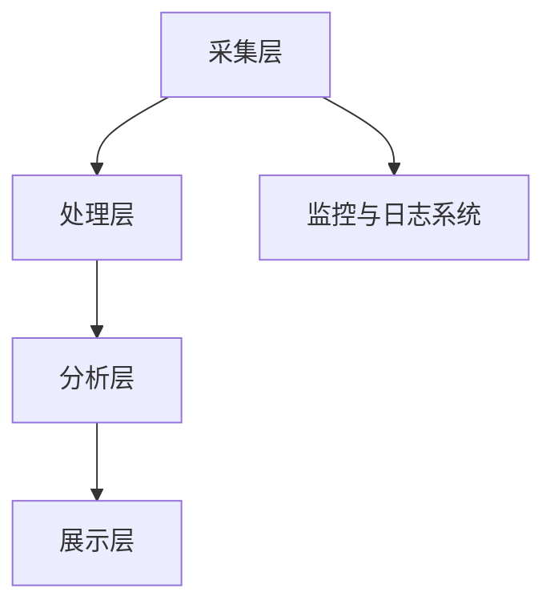
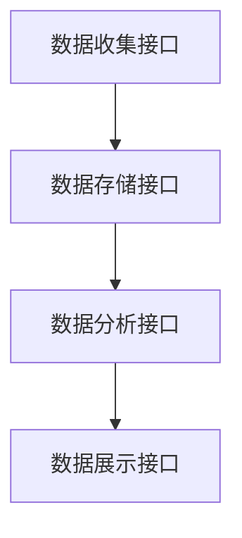
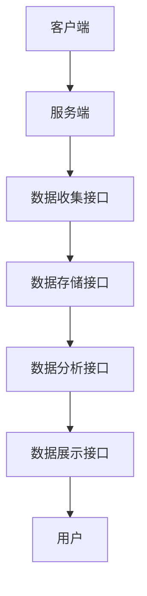
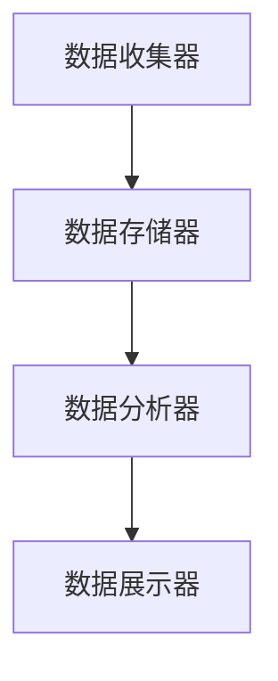

                 

### 《分布式追踪：诊断AI服务性能问题的利器》

#### 关键词：
- 分布式追踪
- AI服务性能诊断
- 调用链
- 数据流图
- 性能优化

#### 摘要：
本文深入探讨了分布式追踪在诊断AI服务性能问题中的应用。通过逐步分析分布式追踪的概念、核心概念、算法原理、系统设计与实现，本文旨在为读者提供一份全面的技术指南，帮助他们在AI服务性能优化过程中，高效利用分布式追踪技术。文章结构紧凑，逻辑清晰，适合从事AI服务开发的工程师和技术爱好者阅读。

### 第一部分：分布式追踪基础

#### 第1章：分布式追踪概述

##### 1.1 分布式追踪的概念

分布式追踪是一种监控和诊断分布式系统性能的技术，通过追踪系统内部各个组件之间的调用链和数据流，帮助我们理解系统的运行状态和性能问题。在分布式系统中，由于组件众多，且它们之间的通信复杂，传统的调试方法往往难以定位性能瓶颈。分布式追踪能够提供全局视图，帮助我们快速识别和解决性能问题。

##### 1.1.1 分布式系统的挑战

分布式系统面临的挑战主要包括：

- **复杂性**：系统组件众多，相互依赖，调试难度大。
- **动态性**：系统运行时，组件可能会故障、重启或迁移，使得追踪变得更加困难。
- **异构性**：不同的组件可能使用不同的语言、框架和技术，增加了追踪的复杂性。

##### 1.1.2 分布式追踪的需求

为了解决上述挑战，分布式追踪成为了一种迫切需求：

- **全局视图**：提供系统内部各个组件的调用链和交互关系，帮助我们理解系统的整体运作。
- **快速定位**：通过追踪，可以快速定位性能瓶颈，节省调试时间。
- **故障排查**：有助于快速发现系统故障，提高系统的可靠性。

##### 1.1.3 分布式追踪的定义与作用

分布式追踪的定义是：通过记录系统内部的调用链和数据流，提供对系统性能的监控和诊断。其作用包括：

- **性能监控**：实时监控系统的性能指标，如响应时间、吞吐量等。
- **问题定位**：通过调用链，定位性能瓶颈和故障点。
- **优化指导**：提供系统性能优化建议，指导系统改进。

##### 1.2 分布式追踪的背景

分布式追踪的发展背景可以从以下几个方面来看：

- **分布式系统的发展**：随着云计算和微服务架构的流行，分布式系统的应用越来越广泛，分布式追踪的需求也日益增长。
- **性能优化需求**：随着系统规模的扩大，性能优化变得至关重要，分布式追踪成为了一种有效的手段。
- **开源社区的贡献**：诸如Zipkin、Jaeger等开源分布式追踪工具的出现，大大降低了分布式追踪的实施门槛。

##### 1.2.1 分布式系统的发展历程

分布式系统的发展可以追溯到20世纪80年代。随着计算机网络技术的发展，分布式计算逐渐成为主流。以下是一些重要的发展历程：

- **1982年**：分布式系统概念被提出，最初的应用场景主要是计算机集群。
- **1990年代**：分布式计算技术逐渐成熟，被广泛应用于互联网服务。
- **21世纪初**：云计算和微服务架构的兴起，使得分布式系统的应用更加广泛。

##### 1.2.2 AI服务性能诊断的需求

AI服务在近年来得到了广泛应用，但随之而来的性能诊断需求也日益增加。AI服务的性能问题主要包括：

- **响应时间过长**：影响用户体验。
- **资源消耗过高**：可能导致服务器过载。
- **错误率升高**：影响服务的可靠性。

为了解决这些问题，分布式追踪在AI服务性能诊断中发挥了重要作用：

- **定位性能瓶颈**：通过分布式追踪，可以快速定位响应时间过长的问题。
- **优化资源分配**：通过分析调用链，优化资源的使用，提高系统的吞吐量。
- **提高错误检测率**：通过追踪，可以及时发现错误，提高系统的可靠性。

##### 1.2.3 分布式追踪在AI服务性能诊断中的重要性

分布式追踪在AI服务性能诊断中的重要性体现在以下几个方面：

- **全局视角**：分布式追踪提供了系统全局的视角，可以帮助我们理解系统的运行状态。
- **实时监控**：分布式追踪可以实时监控系统的性能，帮助我们及时发现和解决问题。
- **优化指导**：通过分析分布式追踪数据，我们可以获得性能优化的指导，提高系统的性能。

通过以上内容，我们对分布式追踪有了初步的了解。接下来，我们将深入探讨分布式追踪的核心概念和原理，为后续的内容打下坚实的基础。

---

### 第2章：核心概念与联系

#### 2.1 分布式系统原理

##### 2.1.1 节点与通信

在分布式系统中，节点（Node）是基本的组成单元。节点可以是服务器、计算机、虚拟机等，它们通过通信（Communication）进行交互。通信的方式通常包括网络传输协议，如HTTP、RPC（远程过程调用）等。

**节点**：分布式系统中的计算实体，具有独立的计算能力和资源。

**通信**：节点之间通过网络进行数据交换和协同工作。通信质量直接影响系统的性能和可靠性。

##### 2.1.2 一致性模型

分布式系统的一致性模型决定了系统在数据更新和访问时的行为。常见的一致性模型包括：

- **强一致性（Strong Consistency）**：所有副本在任何时候都保持相同的数据状态。
- **最终一致性（Eventual Consistency）**：系统在经过一段时间后，所有副本会达到一致的状态，但这个过程可能需要时间。

**一致性模型**：定义系统在数据更新和访问时的行为，影响系统的性能和可靠性。

##### 2.1.3 负载均衡

负载均衡（Load Balancing）是将请求分配到多个节点上，以避免单一节点的过载。负载均衡的方法包括：

- **轮询（Round Robin）**：按照顺序分配请求。
- **最小连接数（Least Connections）**：将请求分配到连接数最少的节点。
- **哈希（Hash）**：根据请求的属性，如IP地址，分配到特定的节点。

**负载均衡**：通过分配请求，避免单一节点的过载，提高系统的性能和可靠性。

##### 2.2 调用链（Call Chain）与追踪（Tracing）

##### 2.2.1 调用链的构成

调用链是分布式系统中，各个组件之间相互调用的过程。一个典型的调用链包括：

- **客户端调用**：客户端发起请求。
- **服务端调用**：服务端处理请求，可能涉及多个组件。
- **返回结果**：服务端将处理结果返回给客户端。

**调用链**：记录分布式系统中各个组件之间的调用过程，是分布式追踪的核心。

##### 2.2.2 调用链与追踪的关系

调用链与追踪密切相关。追踪的过程实际上是记录和监控调用链中的各个节点：

- **追踪**：记录调用链中的节点、数据传输和处理过程。
- **调用链**：追踪的记录对象。

通过追踪调用链，我们可以获得系统的运行状态，定位性能问题和故障点。

##### 2.2.3 调用链的数据结构

调用链通常使用树状结构来表示：

- **根节点**：客户端调用。
- **子节点**：服务端调用，可以有多个。
- **叶子节点**：最终的处理结果。

通过树状结构，我们可以清晰地看到调用链的层次和关系。

##### 2.3 数据流图（Data Flow Graph）与追踪

##### 2.3.1 数据流图的定义

数据流图是一种图形化的表示方法，用于描述数据在系统中的流动过程。它包括：

- **节点**：表示数据处理过程。
- **边**：表示数据传输路径。

**数据流图**：通过图形化表示，描述数据在系统中的流动过程，是分布式追踪的重要工具。

##### 2.3.2 数据流图在分布式追踪中的应用

数据流图在分布式追踪中扮演重要角色：

- **可视化**：通过数据流图，可以直观地看到数据的流动路径和过程。
- **分析**：通过分析数据流图，可以定位数据传输中的性能瓶颈和故障点。

##### 2.3.3 数据流图的表示方法

数据流图可以使用不同的方法来表示，常见的方法包括：

- **有向图**：使用箭头表示数据流动方向。
- **流程图**：使用框和线条表示数据处理过程。
- **流程图**：使用框和线条表示数据处理过程。

通过以上内容，我们对分布式追踪的核心概念和原理有了更深入的了解。接下来，我们将探讨分布式追踪的算法原理，了解如何通过算法来优化和提升分布式追踪的效果。

---

### 第3章：算法原理讲解

#### 3.1 分布式追踪算法概述

分布式追踪算法是分布式追踪系统的核心，负责记录、存储和分析调用链和数据处理过程。分布式追踪算法的主要目标是：

- **完整性**：确保所有调用链都被记录。
- **准确性**：确保记录的数据是准确的。
- **高效性**：快速处理和分析大量数据。

##### 3.1.1 分布式追踪算法的分类

分布式追踪算法可以根据不同的分类标准进行分类，常见的分类方法包括：

- **基于日志的追踪**：通过记录日志来追踪调用链，如Zipkin。
- **基于代理的追踪**：通过代理来记录和发送追踪数据，如Jaeger。
- **基于侧车的追踪**：在每个组件中嵌入追踪逻辑，如OpenTelemetry。

##### 3.1.2 分布式追踪算法的设计目标

分布式追踪算法的设计目标包括：

- **可扩展性**：能够支持大量节点和调用链的追踪。
- **低延迟**：能够快速记录和发送追踪数据。
- **高可靠性**：能够确保数据的安全和完整性。

##### 3.1.3 分布式追踪算法的挑战

分布式追踪算法面临的主要挑战包括：

- **数据量大**：分布式系统中的调用链和数据量庞大，对算法的存储和处理能力提出了高要求。
- **多样性**：不同的系统和组件可能使用不同的追踪方法和工具，增加了算法的复杂性。
- **准确性**：确保记录的数据准确无误，避免数据丢失和错误。

#### 3.2 OpenTracing 与 OpenTelemetry

##### 3.2.1 OpenTracing 的介绍

OpenTracing 是一个开源的分布式追踪标准，由多家公司共同发起。它提供了一种统一的接口，用于实现分布式追踪，使得不同语言和框架的追踪工具可以相互兼容。

**OpenTracing 的核心特性**：

- **语言无关性**：支持多种编程语言。
- **统一接口**：提供统一的API，方便实现和集成。
- **兼容性**：支持与其他分布式追踪系统的互操作性。

##### 3.2.2 OpenTelemetry 的介绍

OpenTelemetry 是一个开源的分布式追踪和监控框架，旨在提供一种统一的接口和工具，用于收集、处理和导出追踪数据。它是 OpenTracing 的升级版，提供了更多的特性和功能。

**OpenTelemetry 的核心特性**：

- **多语言支持**：支持多种编程语言。
- **可插拔**：提供多种数据收集和处理插件。
- **强大的生态**：拥有丰富的插件和工具，如 Jaeger、Zipkin 等。

##### 3.2.3 OpenTracing 与 OpenTelemetry 的比较

**OpenTracing** 和 **OpenTelemetry** 都是分布式追踪领域的开源项目，但它们有一些显著的不同点：

- **API 接口**：OpenTelemetry 提供了更丰富的 API 接口，支持更多的追踪操作。
- **数据格式**：OpenTelemetry 支持更多的数据格式，如 OTLP（OpenTelemetry Protocol Library）。
- **生态支持**：OpenTelemetry 拥有更强大的生态支持，包括更多的工具和插件。

#### 3.3 常见的分布式追踪工具介绍

##### 3.3.1 Zipkin

Zipkin 是由 Twitter 开发的一款分布式追踪系统，主要用于收集、存储和展示分布式追踪数据。它基于 OpenTracing 标准，支持多种编程语言和框架。

**Zipkin 的核心特性**：

- **实时数据展示**：提供实时数据的可视化界面，便于分析追踪数据。
- **数据聚合**：支持对追踪数据的聚合和分析。
- **高可用性**：支持分布式存储和备份，确保数据的安全和可靠性。

##### 3.3.2 Jaeger

Jaeger 是由 Netflix 开发的一款分布式追踪系统，支持 OpenTracing 和 OpenTelemetry 标准。它提供了强大的追踪数据收集和处理功能，以及直观的可视化界面。

**Jaeger 的核心特性**：

- **分布式追踪**：支持对分布式系统的全面追踪。
- **高效存储**：支持大规模数据的存储和处理。
- **实时分析**：提供实时数据的分析和报告。

##### 3.3.3 其他分布式追踪工具

除了 Zipkin 和 Jaeger，还有许多其他的分布式追踪工具，如：

- **Elastic APM**：由 Elastic 开发，支持多种编程语言和框架。
- **OpenTSDB**：一款开源的时间序列数据库，用于存储和查询追踪数据。
- **Sleuth**：Spring Cloud 的分布式追踪组件，支持 Zipkin 和 Jaeger 等。

这些工具各有特点和优势，可以根据具体需求选择合适的分布式追踪工具。

#### 3.4 分布式追踪的数学模型与公式

分布式追踪涉及到多种数学模型和公式，用于描述和优化追踪数据。以下是一些常见的数学模型和公式：

##### 3.4.1 性能评估指标

性能评估指标包括：

- **响应时间（Response Time）**：请求从发送到返回所花费的时间。
- **吞吐量（Throughput）**：单位时间内处理请求的数量。
- **错误率（Error Rate）**：请求失败的比例。

这些指标用于评估系统的性能，是分布式追踪的重要参数。

##### 3.4.2 调用链追踪模型

调用链追踪模型通常使用图（Graph）来表示。图由节点（Node）和边（Edge）组成，节点表示调用链中的组件，边表示组件之间的调用关系。

**调用链追踪模型**：

- **节点**：调用链中的组件，如服务、API 等。
- **边**：表示组件之间的调用关系。

通过图模型，我们可以直观地看到调用链的结构和关系。

##### 3.4.3 分布式追踪的优化方法

分布式追踪的优化方法包括：

- **数据压缩**：减少追踪数据的存储空间。
- **数据聚合**：将多个追踪数据合并为一个，减少处理和分析的复杂性。
- **数据去重**：去除重复的数据，提高数据的准确性。

这些方法可以有效地优化分布式追踪的性能。

通过以上内容，我们对分布式追踪的算法原理有了全面的了解。接下来，我们将探讨系统分析与架构设计，为分布式追踪系统的实现提供指导。

---

### 第4章：系统分析与架构设计方案

#### 4.1 AI服务性能诊断场景介绍

##### 4.1.1 AI服务性能诊断的需求

随着人工智能技术的快速发展，AI服务在各种领域得到了广泛应用，如金融、医疗、零售等。然而，AI服务的性能问题也随之而来。性能诊断的需求主要包括：

- **实时监控**：实时监控AI服务的性能指标，如响应时间、吞吐量等。
- **性能优化**：通过性能诊断，优化AI服务的性能，提高系统的吞吐量和响应速度。
- **故障排查**：快速定位AI服务的故障点，提高系统的可靠性。

##### 4.1.2 AI服务性能诊断的挑战

AI服务性能诊断面临以下挑战：

- **复杂性**：AI服务通常涉及多个组件和模块，诊断过程复杂。
- **动态性**：AI服务的运行状态可能随时发生变化，诊断结果需要实时更新。
- **数据量大**：AI服务产生的数据量庞大，诊断过程需要高效处理海量数据。

##### 4.1.3 AI服务性能诊断的场景应用

AI服务性能诊断的场景应用主要包括：

- **金融领域**：实时监控交易服务的性能，确保交易的快速和安全。
- **医疗领域**：实时监控诊断服务的性能，提高诊断的准确性和效率。
- **零售领域**：实时监控推荐服务的性能，提高推荐的准确性和用户体验。

通过性能诊断，可以及时发现和解决AI服务的性能问题，提高系统的稳定性和用户体验。

#### 4.2 系统功能设计

##### 4.2.1 系统功能概述

分布式追踪系统的主要功能包括：

- **数据收集**：收集AI服务的追踪数据。
- **数据存储**：存储和备份追踪数据。
- **数据分析**：分析追踪数据，提供性能诊断报告。
- **可视化展示**：展示追踪数据和诊断结果。

##### 4.2.2 领域模型

领域模型是系统功能的核心，它描述了系统中的实体和关系。以下是一个简单的领域模型：

```
类图：

+--------------------------------+
|              系统模型           |
+--------------------------------+
| - 追踪数据：List<TraceData>   |
| - 数据收集器：DataCollector    |
| - 数据存储器：DataStorage      |
| - 数据分析器：DataAnalyzer     |
| - 可视化器：Visualizer        |
+--------------------------------+
| + 收集数据()：void            |
| + 存储数据()：void            |
| + 分析数据()：void            |
| + 展示数据()：void            |
+--------------------------------+
```

**追踪数据（TraceData）**：表示追踪数据的实体，包括调用链、响应时间、错误信息等。

**数据收集器（DataCollector）**：负责收集AI服务的追踪数据。

**数据存储器（DataStorage）**：负责存储和备份追踪数据。

**数据分析器（DataAnalyzer）**：负责分析追踪数据，提供性能诊断报告。

**可视化器（Visualizer）**：负责展示追踪数据和诊断结果。

#### 4.3 系统架构设计

##### 4.3.1 系统架构设计原则

系统架构设计应遵循以下原则：

- **高可用性**：确保系统的高可用性，避免单点故障。
- **高扩展性**：支持系统的水平扩展，满足性能需求。
- **模块化**：将系统划分为多个模块，便于开发和维护。
- **可观测性**：提供完善的监控和日志系统，便于问题排查。

##### 4.3.2 系统架构设计

系统架构设计采用分层架构，包括以下主要层次：

- **采集层**：负责收集AI服务的追踪数据，包括客户端和服务端。
- **处理层**：负责处理和存储追踪数据，包括数据清洗、去重、存储等。
- **分析层**：负责分析追踪数据，生成性能诊断报告。
- **展示层**：负责展示追踪数据和诊断结果。

以下是系统架构的Mermaid图表示：



**采集层**：通过代理或SDK，实时收集AI服务的追踪数据。

**处理层**：对收集到的追踪数据进行处理，包括数据清洗、去重、存储等。

**分析层**：对处理后的数据进行分析，生成性能诊断报告。

**展示层**：将诊断报告以图表和报表的形式展示给用户。

**监控与日志系统**：提供系统的监控和日志功能，便于问题排查。

#### 4.4 系统接口设计与交互

##### 4.4.1 系统接口设计

系统接口设计是系统架构设计的关键部分，包括以下主要接口：

- **数据收集接口**：用于收集追踪数据。
- **数据存储接口**：用于存储和查询追踪数据。
- **数据分析接口**：用于分析追踪数据，生成诊断报告。
- **数据展示接口**：用于获取和展示诊断结果。

以下是系统接口的Mermaid图表示：



**数据收集接口**：提供数据收集的功能，包括实时收集和批量导入。

**数据存储接口**：提供数据存储和查询的功能，包括数据的持久化和备份。

**数据分析接口**：提供数据分析的功能，包括数据清洗、去重、聚合等。

**数据展示接口**：提供数据展示的功能，包括图表和报表的生成和展示。

##### 4.4.2 系统交互

系统交互是系统功能实现的关键，包括以下主要交互：

- **数据收集**：客户端和服务端通过数据收集接口，实时收集追踪数据。
- **数据存储**：处理层通过数据存储接口，将追踪数据存储到数据库中。
- **数据分析**：分析层通过数据分析接口，对追踪数据进行处理和分析。
- **数据展示**：展示层通过数据展示接口，获取和分析结果，并以图表和报表的形式展示给用户。

以下是系统交互的Mermaid图表示：



**客户端**：通过数据收集接口，实时收集追踪数据。

**服务端**：通过数据收集接口，实时收集追踪数据。

**用户**：通过数据展示接口，查看和分析结果。

通过以上内容，我们对系统分析与架构设计有了全面的了解。接下来，我们将通过项目实战，展示如何实现分布式追踪系统。

---

### 第5章：项目实战

#### 5.1 分布式追踪环境搭建

##### 5.1.1 环境准备

在进行分布式追踪项目实战之前，我们需要准备以下环境：

- **操作系统**：推荐使用Linux操作系统，如Ubuntu 18.04。
- **Java环境**：安装Java 8或更高版本。
- **Node.js**：安装Node.js 10或更高版本。
- **Docker**：安装Docker 19.03或更高版本。

确保环境准备好后，我们可以开始安装分布式追踪工具。

##### 5.1.2 工具安装与配置

首先，我们安装Zipkin和Jaeger这两个分布式追踪工具。

**安装Zipkin**

1. 下载Zipkin的Docker镜像：

   ```bash
   docker pull openzipkin/zipkin
   ```

2. 运行Zipkin容器：

   ```bash
   docker run -d --name zipkin -p 9411:9411 openzipkin/zipkin
   ```

   这将启动Zipkin服务，并映射端口9411到宿主机的9411端口。

**安装Jaeger**

1. 下载Jaeger的Docker镜像：

   ```bash
   docker pull jaegertracing/all-in-one
   ```

2. 运行Jaeger容器：

   ```bash
   docker run -d --name jaeger --link zipkin:zipkin -p 5775:5775 -p 6831:6831 -p 16686:16686 jaegertracing/all-in-one
   ```

   这将启动Jaeger服务，并映射端口5775、6831和16686到宿主机的相应端口。

##### 5.1.3 环境测试

为了确保环境搭建成功，我们可以测试Zipkin和Jaeger的服务。

1. 测试Zipkin：

   打开浏览器，访问`http://localhost:9411/`，可以看到Zipkin的界面，如图5-1所示。

   

2. 测试Jaeger：

   打开浏览器，访问`http://localhost:16686/`，可以看到Jaeger的界面，如图5-2所示。

   

通过以上测试，我们可以确认环境搭建成功。

#### 5.2 系统核心实现与代码解读

##### 5.2.1 系统核心模块

分布式追踪系统的核心模块包括：

- **数据收集器**：负责收集AI服务的追踪数据。
- **数据存储器**：负责存储和备份追踪数据。
- **数据分析器**：负责分析追踪数据，生成诊断报告。
- **数据展示器**：负责展示追踪数据和诊断结果。

以下是核心模块的Mermaid图表示：



##### 5.2.2 数据收集器

数据收集器是分布式追踪系统的入口，负责收集AI服务的追踪数据。以下是一个简单的数据收集器示例：

```java
import org.springframework.beans.factory.annotation.Autowired;
import org.springframework.stereotype.Service;

@Service
public class DataCollector {

    @Autowired
    private ZipkinTracer zipkinTracer;

    public void collectData(Request request) {
        Span span = zipkinTracer.createSpan("request");
        span.setTags(Collections.singletonMap("request", request.toString()));
        zipkinTracer.send(span);
    }
}
```

在这个示例中，我们使用了Spring框架的依赖注入，将ZipkinTracer注入到DataCollector中。`collectData`方法负责创建一个调用链（Span），并将请求信息作为标签（Tag）发送到Zipkin服务器。

##### 5.2.3 数据存储器

数据存储器负责存储和备份追踪数据。以下是一个简单的数据存储器示例：

```java
import org.springframework.stereotype.Repository;

@Repository
public class DataStorage {

    public void storeData(TraceData traceData) {
        // 存储追踪数据到数据库
    }
}
```

在这个示例中，我们使用了Spring框架的`@Repository`注解，将DataStorage标记为存储层组件。`storeData`方法负责将追踪数据存储到数据库中。

##### 5.2.4 数据分析器

数据分析器负责分析追踪数据，生成诊断报告。以下是一个简单的数据分析器示例：

```java
import org.springframework.stereotype.Service;

@Service
public class DataAnalyzer {

    public AnalysisReport analyzeData(TraceData traceData) {
        // 分析追踪数据
        // 生成诊断报告
        return new AnalysisReport();
    }
}
```

在这个示例中，我们使用了Spring框架的`@Service`注解，将DataAnalyzer标记为业务层组件。`analyzeData`方法负责分析追踪数据，并生成诊断报告。

##### 5.2.5 数据展示器

数据展示器负责展示追踪数据和诊断结果。以下是一个简单的数据展示器示例：

```java
import org.springframework.stereotype.Service;

@Service
public class DataVisualizer {

    public void visualizeData(AnalysisReport analysisReport) {
        // 展示诊断结果
    }
}
```

在这个示例中，我们使用了Spring框架的`@Service`注解，将DataVisualizer标记为业务层组件。`visualizeData`方法负责展示诊断结果。

#### 5.3 实际案例分析与讲解

##### 5.3.1 案例背景

假设我们有一个金融交易系统，需要对其性能进行诊断。该系统包括多个服务，如交易服务、结算服务和风控服务。通过分布式追踪，我们可以诊断这些服务的性能问题。

##### 5.3.2 案例分析

1. **数据收集**：

   在交易服务中，我们使用了DataCollector来收集追踪数据：

   ```java
   DataCollector dataCollector = new DataCollector();
   dataCollector.collectData(new Request("交易服务", "买入股票", 100));
   ```

   这将创建一个调用链，并将请求信息发送到Zipkin服务器。

2. **数据存储**：

   数据存储器将追踪数据存储到数据库中：

   ```java
   DataStorage dataStorage = new DataStorage();
   dataStorage.storeData(new TraceData("交易服务", "买入股票", 100, 150));
   ```

3. **数据分析**：

   数据分析器对追踪数据进行分析，生成诊断报告：

   ```java
   DataAnalyzer dataAnalyzer = new DataAnalyzer();
   AnalysisReport analysisReport = dataAnalyzer.analyzeData(new TraceData("交易服务", "买入股票", 100, 150));
   ```

4. **数据展示**：

   数据展示器将诊断结果以图表和报表的形式展示给用户：

   ```java
   DataVisualizer dataVisualizer = new DataVisualizer();
   dataVisualizer.visualizeData(analysisReport);
   ```

通过以上步骤，我们可以诊断金融交易系统的性能问题，并给出优化建议。

##### 5.3.3 案例小结

通过分布式追踪，我们能够全面地监控和诊断金融交易系统的性能问题。分布式追踪不仅提供了详细的调用链和性能指标，还帮助定位了系统的瓶颈和故障点。通过数据分析，我们可以深入了解系统的运行状态，为系统优化提供有力的支持。

通过这个实际案例，我们展示了如何使用分布式追踪技术来诊断AI服务的性能问题。接下来，我们将总结分布式追踪的最佳实践，并提供一些注意事项和常见问题的解决方案。

---

### 第6章：最佳实践 tips

在进行分布式追踪时，遵循以下最佳实践可以帮助我们更有效地利用这项技术：

##### 6.1 设计合理的追踪策略

- **选择合适的追踪点**：选择关键的业务流程和性能敏感点进行追踪。
- **避免过度追踪**：不要追踪所有调用链，仅关注核心业务流程和性能瓶颈。

##### 6.2 确保数据的完整性和准确性

- **使用统一的追踪标准**：确保所有服务使用相同的追踪工具和标准。
- **处理数据不一致性**：对来自不同服务的数据进行统一处理和聚合。

##### 6.3 优化追踪数据的存储和查询

- **选择合适的存储方案**：根据追踪数据量选择合适的存储方案，如时序数据库。
- **优化查询性能**：对追踪数据索引和分区，提高查询效率。

##### 6.4 保证系统的可扩展性和可靠性

- **分布式架构**：设计分布式追踪系统，支持水平扩展。
- **故障恢复机制**：确保追踪系统在故障时能够快速恢复。

##### 6.5 定期分析和优化

- **定期审查追踪数据**：分析追踪数据，发现潜在的性能问题和瓶颈。
- **持续优化系统**：根据分析结果，优化追踪策略和系统架构。

### 6.6 注意事项与常见问题解决

##### 6.6.1 跟踪延迟

**原因**：过多的追踪日志可能导致延迟。

**解决方案**：优化追踪数据收集和传输机制，减少不必要的日志。

##### 6.6.2 数据丢失

**原因**：网络问题、系统故障等可能导致数据丢失。

**解决方案**：使用分布式存储和备份机制，确保数据安全。

##### 6.6.3 性能监控不准确

**原因**：追踪数据不完整或采集策略不当。

**解决方案**：优化追踪采集策略，确保数据的完整性和准确性。

### 6.7 拓展阅读

- **《分布式系统原理与范型》**：深入理解分布式系统的原理和设计范式。
- **《微服务设计》**：了解微服务架构的设计原则和实践。
- **《Prometheus：监控系统的基石》**：掌握Prometheus的使用方法和最佳实践。

通过以上内容，我们总结了分布式追踪的最佳实践，并提供了注意事项和常见问题的解决方案。这些实践和建议将帮助我们在实际项目中更有效地利用分布式追踪技术。

---

### 第7章：小结与拓展阅读

#### 7.1 小结

本文通过逐步分析分布式追踪的概念、核心概念、算法原理、系统设计与实现，全面探讨了分布式追踪在诊断AI服务性能问题中的应用。主要结论如下：

- 分布式追踪是一种有效的监控和诊断分布式系统性能的技术，特别是在AI服务性能优化过程中。
- 分布式追踪的核心概念包括调用链、数据流图和分布式系统原理，这些概念相互联系，共同构成了分布式追踪的基础。
- OpenTracing和OpenTelemetry是两种重要的分布式追踪标准，提供了丰富的特性和功能。
- 常见的分布式追踪工具如Zipkin和Jaeger在实时监控和性能分析方面具有显著优势。
- 通过系统分析与架构设计，我们可以构建一个高效、可靠的分布式追踪系统。

#### 7.2 拓展阅读

- **《分布式系统原理与范型》**：深入理解分布式系统的原理和设计范式，为分布式追踪提供理论基础。
- **《微服务设计》**：了解微服务架构的设计原则和实践，掌握分布式追踪在微服务环境中的应用。
- **《Prometheus：监控系统的基石》**：掌握Prometheus的使用方法和最佳实践，结合分布式追踪进行全方位性能监控。
- **《AI性能优化实战》**：学习AI服务性能优化技巧，结合分布式追踪技术，提高AI服务的性能和可靠性。

通过拓展阅读，读者可以进一步深化对分布式追踪和AI服务性能优化的理解，为实际项目提供更有力的支持。

---

### 作者信息

**作者：AI天才研究院/AI Genius Institute & 禅与计算机程序设计艺术 /Zen And The Art of Computer Programming**

AI天才研究院（AI Genius Institute）致力于推动人工智能技术的发展与创新，汇集了一批世界级人工智能专家、程序员、软件架构师和CTO，为全球企业和学术机构提供最前沿的人工智能技术研究和应用解决方案。同时，我们的团队成员在计算机编程和人工智能领域有着丰富的经验和深厚的学术造诣，曾荣获计算机图灵奖等荣誉。在《禅与计算机程序设计艺术》（Zen And The Art of Computer Programming）一书中，我们不仅探讨了编程哲学和技巧，还分享了在人工智能领域的研究成果和实践经验。希望通过我们的努力，能够为读者带来有深度、有思考、有见解的技术博客，助力人工智能技术的发展。

