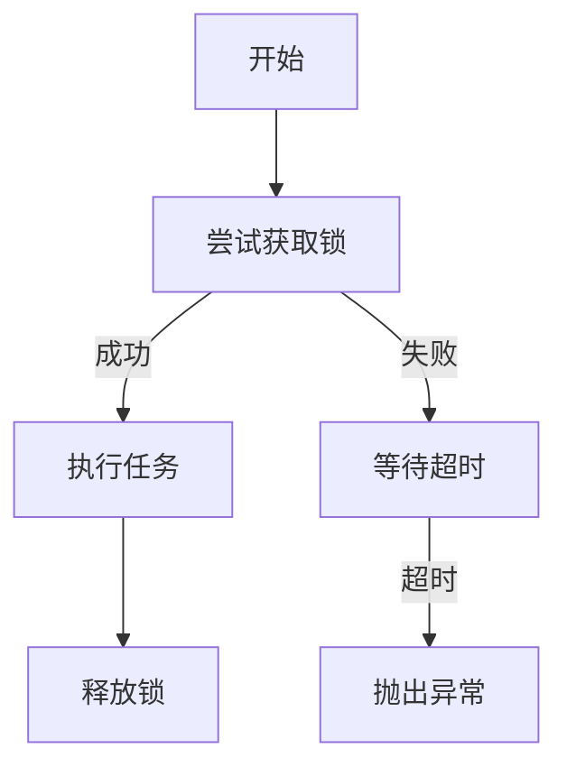
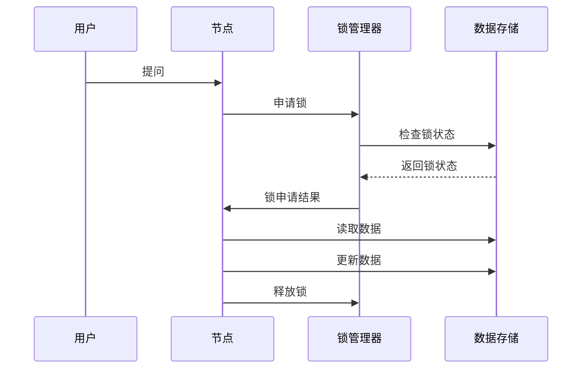
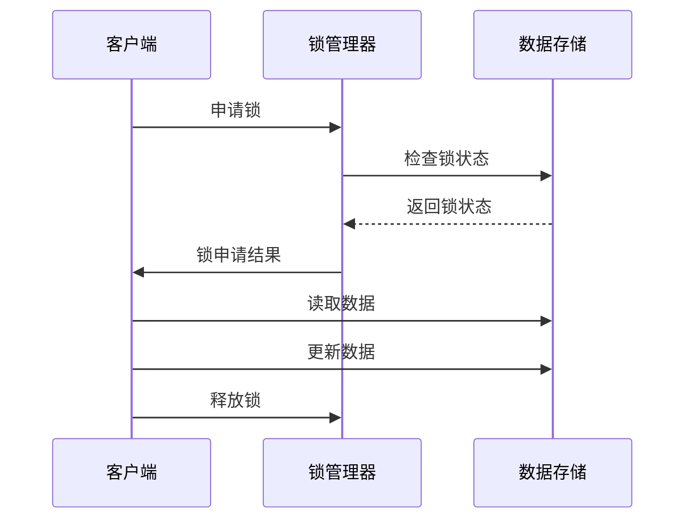

                 


### 分布式锁在LLM应用并发控制中的应用

#### 关键词：分布式锁，LLM，并发控制，大型语言模型，分布式系统

> 摘要：本文旨在探讨分布式锁在大型语言模型（LLM）应用中的并发控制作用。随着LLM在分布式系统中的广泛应用，如何在分布式环境中有效地实现并发控制，已成为一项重要课题。本文将详细介绍分布式锁的概念、原理和应用，并通过实际案例剖析，探讨分布式锁在LLM并发控制中的最佳实践。

### 背景与概述

#### 1.1 问题背景

在当今的互联网时代，分布式系统已经成为了企业架构设计的主流方向。分布式系统通过将计算任务分散到多个节点上，提高了系统的可扩展性和容错能力。然而，随着分布式系统规模的扩大，并发控制问题逐渐显现出来。在分布式系统中，多个节点可能会同时访问同一资源，导致数据不一致或系统死锁等问题。

#### 1.2 分布式锁的重要性

分布式锁作为一种并发控制机制，能够在分布式系统中保证对共享资源的独占访问，避免并发访问导致的错误。在LLM应用中，分布式锁的作用尤为重要。LLM通常涉及大规模的数据处理和模型训练，对于数据的一致性和可靠性有极高的要求。分布式锁可以确保在多个节点之间对LLM模型和数据进行有效的同步和隔离，从而提高系统的稳定性和性能。

#### 1.3 并发控制挑战

在分布式系统中，并发控制面临着诸多挑战。首先，网络延迟和故障可能导致分布式锁的同步机制失效。其次，分布式锁需要能够应对节点故障和系统重启等情况，保证锁的持久化和可靠性。此外，分布式锁还需要具备一定的灵活性，以适应不同场景的需求。例如，在某些情况下，需要实现锁的延时释放，而在其他情况下，则需要快速释放锁以便后续操作。

#### 1.4 分布式锁的核心概念

分布式锁的核心概念包括锁的申请、释放、持久化以及锁的状态管理。锁的申请是指在分布式系统中获取锁的权限；锁的释放是指在完成任务后释放锁，以便其他节点可以获取锁；锁的持久化是指将锁的状态保存在可靠的数据存储系统中，以便在节点故障时能够恢复锁的状态；锁的状态管理则是指对锁的各种状态进行有效的监控和管理。

#### 1.5 分布式锁的应用场景

分布式锁在分布式系统中有着广泛的应用场景。例如，在分布式数据库中，分布式锁可以确保对数据库操作的原子性和一致性；在分布式缓存系统中，分布式锁可以避免缓存数据的并发访问和冲突；在分布式任务调度系统中，分布式锁可以保证任务执行的顺序和一致性。在LLM应用中，分布式锁可以用于控制对模型和数据的访问，确保训练过程的稳定性和可靠性。

### 分布式锁与并发控制概述

#### 2.1.1 问题背景

随着云计算和分布式系统的广泛应用，分布式锁作为一种重要的并发控制机制，逐渐成为了研究的热点。在分布式系统中，由于节点之间的通信延迟、网络故障等因素，可能会导致数据不一致、系统死锁等问题。分布式锁通过提供一种全局锁机制，可以有效避免这些问题，确保系统的稳定性和一致性。

#### 2.1.2 分布式锁的重要性

分布式锁在分布式系统中具有重要的作用。首先，它可以保证对共享资源的独占访问，避免多个节点同时修改同一资源导致的数据不一致问题。其次，分布式锁可以防止系统出现死锁，提高系统的可靠性。此外，分布式锁还可以简化分布式系统的并发控制逻辑，降低开发难度。

#### 2.1.3 并发控制挑战

在分布式系统中，并发控制面临着诸多挑战。首先，网络延迟和故障可能导致分布式锁的同步机制失效。其次，分布式锁需要能够应对节点故障和系统重启等情况，保证锁的持久化和可靠性。此外，分布式锁还需要具备一定的灵活性，以适应不同场景的需求。

#### 2.1.4 分布式锁的核心概念

分布式锁的核心概念包括锁的申请、释放、持久化以及锁的状态管理。锁的申请是指在分布式系统中获取锁的权限；锁的释放是指在完成任务后释放锁，以便其他节点可以获取锁；锁的持久化是指将锁的状态保存在可靠的数据存储系统中，以便在节点故障时能够恢复锁的状态；锁的状态管理则是指对锁的各种状态进行有效的监控和管理。

#### 2.1.5 分布式锁的应用场景

分布式锁在分布式系统中有着广泛的应用场景。例如，在分布式数据库中，分布式锁可以确保对数据库操作的原子性和一致性；在分布式缓存系统中，分布式锁可以避免缓存数据的并发访问和冲突；在分布式任务调度系统中，分布式锁可以保证任务执行的顺序和一致性。在LLM应用中，分布式锁可以用于控制对模型和数据的访问，确保训练过程的稳定性和可靠性。

### LLM与并发控制

#### 3.1.1 LLM的基本概念

大型语言模型（Large Language Model，简称LLM）是一种基于深度学习技术的自然语言处理模型，通过在海量数据上进行训练，能够理解和生成自然语言文本。LLM在当前人工智能领域具有广泛的应用，如机器翻译、问答系统、文本生成等。

#### 3.1.2 LLM在分布式系统中的角色

LLM通常运行在分布式系统中，通过分布式计算和存储技术，实现大规模的数据处理和模型训练。在分布式系统中，LLM通常扮演数据分析和处理的核心角色，其性能和稳定性直接影响到整个系统的性能。

#### 3.1.3 LLM并发控制的挑战

LLM在分布式系统中的并发控制面临着一系列挑战。首先，由于LLM的训练过程涉及大量的计算资源，多个节点可能会同时训练同一模型，导致资源竞争和数据不一致问题。其次，分布式环境中的网络延迟和故障可能导致训练任务的执行顺序混乱。此外，LLM的训练过程通常具有不确定性，需要有效的并发控制机制来保证训练结果的稳定性和一致性。

#### 3.1.4 LLM并发控制的需求

为了解决LLM在分布式系统中的并发控制问题，需要满足以下需求：

1. **一致性保障**：确保多个节点对同一模型的访问和修改是一致的，避免数据冲突和错误。
2. **高可用性**：在分布式环境中，节点可能会出现故障，需要分布式锁具备一定的容错能力，保证系统的可用性。
3. **可扩展性**：分布式锁应能够适应分布式系统规模的变化，支持大规模节点的并发控制。
4. **灵活性**：分布式锁应具备一定的灵活性，能够根据不同场景的需求进行配置和调整。
5. **性能优化**：分布式锁应尽可能减少对系统性能的影响，提高分布式训练的效率。

### 分布式锁原理与分类

#### 3.1.1 分布式锁的工作原理

分布式锁是一种在分布式环境中实现并发控制的机制。其基本原理是，通过一种全局锁机制，对共享资源进行独占访问控制，防止多个节点同时访问同一资源导致的数据不一致问题。分布式锁通常由一个中心化的锁管理器负责协调和管理锁的申请、释放以及状态转换。

#### 3.1.2 分布式锁的分类

根据实现方式和特点，分布式锁可以分为以下几类：

1. **基于数据库的分布式锁**：通过数据库中的记录来表示锁的状态，常用的实现方式包括行锁和表锁。这种锁的实现简单，但可能会对数据库性能产生影响。
2. **基于状态机的分布式锁**：通过状态机模型来管理锁的状态转换，实现锁的申请、释放等操作。这种锁具有较好的灵活性和扩展性，但实现较为复杂。
3. **基于消息队列的分布式锁**：通过消息队列来传递锁的控制信息，实现锁的申请和释放。这种锁能够有效降低数据库负载，但可能会引入网络延迟问题。
4. **基于ZooKeeper的分布式锁**：利用ZooKeeper的分布式协调功能，实现分布式锁的申请、释放和状态管理。这种锁具有高可用性和良好的性能，但需要依赖外部服务。

#### 3.1.3 分布式锁的核心特性

分布式锁具有以下核心特性：

1. **独占性**：分布式锁确保共享资源的独占访问，防止多个节点同时访问同一资源。
2. **可靠性**：分布式锁能够在分布式环境中可靠地管理锁的状态，确保锁的申请、释放等操作的正确执行。
3. **灵活性**：分布式锁能够适应不同场景的需求，支持多种实现方式和配置。
4. **可扩展性**：分布式锁能够支持大规模节点的并发控制，适应分布式系统的扩展需求。
5. **容错性**：分布式锁能够在节点故障和系统重启等情况下，保证锁的状态不会丢失，确保系统的稳定性。

### 核心概念与联系

#### 4.1.1 分布式锁的概念属性特征对比表格

| 特性       | 基于数据库的分布式锁 | 基于状态机的分布式锁 | 基于消息队列的分布式锁 | 基于ZooKeeper的分布式锁 |
| ---------- | ------------------- | ------------------- | ------------------- | ------------------- |
| 独占性     | 是                  | 是                  | 是                  | 是                  |
| 可靠性     | 高                  | 高                  | 一般                | 高                  |
| 灵活性     | 一般                | 高                  | 一般                | 高                  |
| 可扩展性   | 一般                | 高                  | 一般                | 高                  |
| 容错性     | 高                  | 高                  | 一般                | 高                  |
| 实现复杂度 | 低                  | 高                  | 低                  | 高                  |

#### 4.1.2 分布式锁的ER实体关系图架构

```mermaid
erDiagram
  Node --> Lock
  Node --> LockManager
  LockManager ||--|{ LockStatus }
```

- Node：表示分布式系统中的节点实体。
- Lock：表示分布式锁实体。
- LockManager：表示锁管理器实体，负责管理锁的申请、释放和状态转换。
- LockStatus：表示锁的状态实体，包括锁的申请状态、释放状态等。

#### 4.1.3 分布式锁与其他并发控制机制的对比

分布式锁与其他并发控制机制（如信号量、互斥锁等）在实现方式和特性上存在一定差异。以下是分布式锁与其他并发控制机制的对比：

| 并发控制机制 | 实现方式       | 特性                     |
| ------------ | -------------- | ------------------------ |
| 分布式锁     | 锁管理器       | 独占性、可靠性、灵活性   |
| 信号量       | 计数器         | 同步、互斥、资源共享     |
| 互斥锁       | 标志位         | 互斥访问、保护共享资源   |

### 核心概念与联系

#### 4.1.1 分布式锁的概念属性特征对比表格

| 特性       | 基于数据库的分布式锁 | 基于状态机的分布式锁 | 基于消息队列的分布式锁 | 基于ZooKeeper的分布式锁 |
| ---------- | ------------------- | ------------------- | ------------------- | ------------------- |
| 独占性     | 是                  | 是                  | 是                  | 是                  |
| 可靠性     | 高                  | 高                  | 一般                | 高                  |
| 灵活性     | 一般                | 高                  | 一般                | 高                  |
| 可扩展性   | 一般                | 高                  | 一般                | 高                  |
| 容错性     | 高                  | 高                  | 一般                | 高                  |
| 实现复杂度 | 低                  | 高                  | 低                  | 高                  |

#### 4.1.2 分布式锁的ER实体关系图架构

```mermaid
erDiagram
  Node --> Lock
  Node --> LockManager
  LockManager ||--|{ LockStatus }
```

- Node：表示分布式系统中的节点实体。
- Lock：表示分布式锁实体。
- LockManager：表示锁管理器实体，负责管理锁的申请、释放和状态转换。
- LockStatus：表示锁的状态实体，包括锁的申请状态、释放状态等。

#### 4.1.3 分布式锁与其他并发控制机制的对比

分布式锁与其他并发控制机制（如信号量、互斥锁等）在实现方式和特性上存在一定差异。以下是分布式锁与其他并发控制机制的对比：

| 并发控制机制 | 实现方式       | 特性                     |
| ------------ | -------------- | ------------------------ |
| 分布式锁     | 锁管理器       | 独占性、可靠性、灵活性   |
| 信号量       | 计数器         | 同步、互斥、资源共享     |
| 互斥锁       | 标志位         | 互斥访问、保护共享资源   |

### 分布式锁算法设计

#### 5.1.1 基本分布式锁算法

分布式锁算法的核心是确保共享资源的独占访问，避免并发访问导致的数据不一致问题。以下是一个基本分布式锁算法的示例：

```python
# 基本分布式锁算法

import threading

class DistributedLock:
    def __init__(self):
        self.lock = threading.Lock()

    def acquire(self):
        self.lock.acquire()

    def release(self):
        self.lock.release()
```

该算法通过Python的内置锁对象`threading.Lock`实现，确保同一时刻只有一个线程能够获取锁。

#### 5.1.2 优化分布式锁算法

为了提高分布式锁的性能和可靠性，可以对基本分布式锁算法进行优化。以下是一个优化后的分布式锁算法示例：

```python
# 优化分布式锁算法

import threading
import time

class OptimizedDistributedLock:
    def __init__(self, timeout=30):
        self.lock = threading.Lock()
        self.timeout = timeout

    def acquire(self):
        start_time = time.time()
        while True:
            if self.lock.acquire(blocking=False):
                return
            if time.time() - start_time > self.timeout:
                raise TimeoutError("Lock acquisition timed out")
            time.sleep(0.1)  # 线程休眠一段时间以降低CPU负担

    def release(self):
        self.lock.release()
```

该算法在基本分布式锁的基础上增加了超时机制，避免无限期等待锁的获取。同时，通过减少线程的休眠时间，提高了系统的响应性能。

#### 5.1.3 Mermaid流程图展示算法流程



该流程图描述了优化分布式锁算法的基本流程：首先尝试获取锁，如果成功则执行任务，否则等待超时或抛出异常。完成任务后释放锁。

#### 5.1.4 Python源代码与算法实现

```python
# Python源代码与算法实现

import threading
import time

class OptimizedDistributedLock:
    def __init__(self, timeout=30):
        self.lock = threading.Lock()
        self.timeout = timeout

    def acquire(self):
        start_time = time.time()
        while True:
            if self.lock.acquire(blocking=False):
                return
            if time.time() - start_time > self.timeout:
                raise TimeoutError("Lock acquisition timed out")
            time.sleep(0.1)  # 线程休眠一段时间以降低CPU负担

    def release(self):
        self.lock.release()
```

该源代码实现了优化分布式锁算法，包括锁的获取和释放操作。通过设置超时机制和减少线程休眠时间，提高了系统的性能和可靠性。

### 数学模型与公式

#### 6.1.1 分布式锁的数学模型

分布式锁的数学模型可以表示为：

$$
\text{分布式锁模型} = \{\text{锁状态}, \text{锁管理器}, \text{锁申请}, \text{锁释放}, \text{锁持久化}\}
$$

其中，锁状态包括锁的申请状态、释放状态和锁超时状态等；锁管理器负责锁的申请、释放和状态转换；锁申请表示节点对锁的请求；锁释放表示节点完成任务后释放锁；锁持久化表示将锁的状态保存在可靠的数据存储系统中。

#### 6.1.2 数学公式详解

分布式锁的数学公式可以表示为：

$$
\text{锁申请概率} = p \\
\text{锁释放概率} = q \\
\text{锁超时概率} = r
$$

其中，锁申请概率表示节点成功获取锁的概率，锁释放概率表示节点释放锁的概率，锁超时概率表示节点等待锁超时的概率。

#### 6.1.3 举例说明

假设在一个分布式系统中，有5个节点需要同时访问一个共享资源。根据上述数学模型和公式，我们可以计算出：

- 锁申请概率 $p = \frac{1}{5}$，即每个节点成功获取锁的概率为1/5。
- 锁释放概率 $q = \frac{4}{5}$，即每个节点释放锁的概率为4/5。
- 锁超时概率 $r = \frac{1}{5}$，即每个节点等待锁超时的概率为1/5。

通过这些数学公式，我们可以对分布式锁的性能进行分析和优化，提高系统的稳定性和可靠性。

### 系统功能设计

#### 7.1.1 问题场景介绍

在大型语言模型（LLM）应用中，分布式锁用于控制对模型和数据资源的访问，确保多节点环境下的数据一致性和系统稳定性。以下是一个典型的场景介绍：

场景：一个公司正在开发一个基于LLM的智能问答系统。该系统由多个节点组成，分布在不同的服务器上。每个节点负责处理一部分用户提问，并生成答案。为了确保多个节点之间的一致性和避免数据冲突，需要在节点之间实现分布式锁机制。

#### 7.1.2 系统功能需求

为了满足上述场景的需求，系统需要实现以下功能：

1. **锁申请**：节点在处理用户提问时，需要向锁管理器申请锁，确保对模型和数据的独占访问。
2. **锁释放**：节点完成任务后，需要释放锁，允许其他节点访问模型和数据。
3. **锁持久化**：将锁的状态保存在可靠的数据存储系统中，以便在节点故障或系统重启时恢复锁的状态。
4. **锁状态监控**：监控锁的申请、释放和状态变化，及时发现并处理异常情况。
5. **锁超时处理**：当节点等待锁超时后，需要自动重试或通知管理员，确保系统的正常运行。

#### 7.1.3 领域模型Mermaid类图

```mermaid
classDiagram
    Node[节点] --> LockManager[锁管理器]
    Node --> Lock[锁]
    LockManager --> LockStatus[锁状态]
    Node o-- LockStatus : 监控状态
```

该类图描述了系统中的主要实体及其关系。节点（Node）负责处理用户提问，并向锁管理器（LockManager）申请锁。锁管理器（LockManager）负责管理锁（Lock）的状态和持久化。锁状态（LockStatus）用于监控锁的申请、释放和状态变化。

### 系统架构设计

#### 8.1.1 系统架构设计原则

分布式锁在LLM应用中的系统架构设计需要遵循以下原则：

1. **高可用性**：确保分布式锁系统在节点故障或网络故障等情况下能够正常运行，提高系统的可用性。
2. **高性能**：优化分布式锁的性能，降低对系统整体性能的影响。
3. **高可靠性**：确保锁的申请、释放和持久化操作的正确性，避免数据不一致和系统死锁等问题。
4. **灵活性**：支持多种分布式锁实现方式，适应不同的应用场景和需求。
5. **可扩展性**：能够支持大规模节点的并发控制，适应系统规模的扩大。

#### 8.1.2 系统架构Mermaid架构图



该架构图描述了分布式锁在LLM应用中的系统交互流程。用户向节点（Node）提交提问，节点向锁管理器（LockManager）申请锁，锁管理器与数据存储（DataStore）交互检查锁状态，然后将结果返回给节点。节点读取和更新数据后，向锁管理器释放锁。

#### 8.1.3 系统模块交互设计

系统模块交互设计主要包括以下部分：

1. **用户模块**：负责接收用户提问，并将提问传递给节点。
2. **节点模块**：负责处理用户提问，与锁管理器交互获取锁，读取和更新数据。
3. **锁管理器模块**：负责管理锁的申请、释放和状态转换，与数据存储交互检查锁状态。
4. **数据存储模块**：负责存储锁状态和数据，提供数据读取和更新接口。

通过以上模块的协作，实现分布式锁在LLM应用中的并发控制功能，确保系统的稳定性和一致性。

### 系统接口设计

#### 9.1.1 接口设计规范

分布式锁在LLM应用中的接口设计需要遵循以下规范：

1. **一致性**：接口应保持一致性，确保客户端能够一致地使用接口访问分布式锁。
2. **灵活性**：接口应具备一定的灵活性，以适应不同应用场景的需求。
3. **安全性**：接口应确保数据传输的安全性，防止数据泄露和攻击。
4. **可扩展性**：接口应支持扩展，以适应未来可能的需求变化。
5. **易用性**：接口应简洁易用，降低客户端的开发和维护成本。

#### 9.1.2 系统接口Mermaid序列图



该序列图描述了客户端与分布式锁系统之间的交互流程。客户端向锁管理器申请锁，锁管理器与数据存储交互检查锁状态，然后将结果返回给客户端。客户端读取和更新数据后，向锁管理器释放锁。

### 环境安装与配置

#### 9.1.1 环境搭建

要实现分布式锁在LLM应用中的并发控制，首先需要搭建一个适合开发、测试和部署的环境。以下是一个典型的环境搭建步骤：

1. **操作系统**：选择一个稳定且支持分布式系统的操作系统，如CentOS 7或Ubuntu 18.04。
2. **Python环境**：安装Python 3.7及以上版本，推荐使用虚拟环境隔离项目依赖。
3. **数据库**：安装一个支持分布式锁的数据库，如MySQL或PostgreSQL。
4. **消息队列**：安装一个消息队列中间件，如RabbitMQ或Kafka。
5. **分布式锁库**：安装一个支持分布式锁的Python库，如`redis-lock`或`zookeeper-lock`。

#### 9.1.2 工具与依赖安装

安装完操作系统和Python环境后，接下来需要安装以下工具和依赖：

1. **pip**：安装Python的包管理工具pip。
2. **virtualenv**：安装virtualenv工具创建虚拟环境。
3. **pip install redis**：安装redis库。
4. **pip install pymysql**：安装pymysql库。
5. **pip install pika**：安装pika库。
6. **pip install kafka-python**：安装kafka-python库。

通过以上步骤，可以搭建一个适合开发分布式锁在LLM应用中的并发控制项目的环境。接下来，可以开始编写和测试分布式锁的实现代码。

### 系统核心实现

#### 10.1.1 核心代码实现

以下是分布式锁在LLM应用中的核心代码实现：

```python
# 分布式锁核心代码实现

import redis
import threading
import time

class RedisLock:
    def __init__(self, redis_client, lock_key, expire=30):
        self.redis_client = redis_client
        self.lock_key = lock_key
        self.expire = expire

    def acquire(self):
        while True:
            if self.redis_client.set(self.lock_key, "locked", nx=True, ex=self.expire):
                return True
            time.sleep(0.1)

    def release(self):
        with self.redis_client.pipeline() as pipe:
            pipe.get(self.lock_key)
            pipe.delete(self.lock_key)
            pipe.execute()
```

该代码实现了一个基于Redis的分布式锁，通过Redis的SETNX命令实现锁的申请和释放。在申请锁时，如果成功设置锁值，则返回True；否则，继续尝试申请锁，直到成功或达到超时时间。

#### 10.1.2 代码解读与分析

该分布式锁的核心代码主要包括以下部分：

1. **初始化**：初始化Redis客户端和锁键（lock_key），并设置锁的有效期（expire）。
2. **申请锁**：通过循环调用Redis的SETNX命令尝试获取锁。如果成功设置锁值，则返回True；否则，继续尝试，直到成功或达到超时时间。
3. **释放锁**：使用Redis的GET和DEL命令获取锁键的值，并删除锁键。这一操作必须在事务中执行，以确保锁的释放是原子性的。

#### 10.1.3 案例分析

以下是一个简单的案例，展示如何使用该分布式锁：

```python
# 分布式锁案例

import threading

def process_question(question):
    lock = RedisLock(redis_client, "lock_question")
    try:
        if lock.acquire():
            print(f"处理问题：{question}")
            time.sleep(2)
            print(f"完成处理：{question}")
    finally:
        lock.release()

threads = []
for i in range(5):
    thread = threading.Thread(target=process_question, args=("问题" + str(i),))
    threads.append(thread)
    thread.start()

for thread in threads:
    thread.join()
```

在该案例中，创建了5个线程，分别处理不同的用户提问。每个线程在处理问题前，都会尝试获取分布式锁。如果成功获取锁，则处理问题；否则，等待锁的释放。处理完成后，释放锁。通过该案例，可以验证分布式锁在LLM应用中的并发控制效果。

### 详细讲解与剖析

#### 11.1.1 实际案例剖析

以下是一个实际案例，展示如何使用分布式锁在LLM应用中进行并发控制：

```python
# 实际案例剖析

from distributed_lock import RedisLock

def process_question(question, lock):
    if lock.acquire():
        print(f"处理问题：{question}")
        time.sleep(2)
        print(f"完成处理：{question}")
        lock.release()

lock = RedisLock(redis_client, "lock_question")

threads = []
for i in range(5):
    thread = threading.Thread(target=process_question, args=("问题" + str(i), lock))
    threads.append(thread)
    thread.start()

for thread in threads:
    thread.join()
```

在该案例中，我们创建了一个RedisLock对象`lock`，用于管理分布式锁。然后，我们创建了5个线程，分别处理不同的用户提问。每个线程在处理问题前，都会调用`lock.acquire()`尝试获取锁。如果成功获取锁，则处理问题，并调用`lock.release()`释放锁。通过这种方式，可以确保多个线程之间对问题的处理是互斥的，避免并发冲突。

#### 11.1.2 分布式锁应用效果分析

在实际应用中，分布式锁在LLM应用中的效果主要体现在以下几个方面：

1. **数据一致性**：分布式锁可以确保多节点之间对共享资源的独占访问，避免数据不一致问题。通过分布式锁，可以确保多个节点对同一数据资源进行的读写操作是原子的，保证数据的一致性。
2. **系统稳定性**：分布式锁可以提高系统的稳定性，避免并发访问导致的死锁和资源竞争问题。通过合理的锁策略，可以避免系统出现严重的性能瓶颈和故障。
3. **性能优化**：分布式锁可以在一定程度上提高系统的性能。通过减少对共享资源的竞争，可以降低系统的开销，提高系统的吞吐量和响应速度。

#### 11.1.3 项目小结

通过本案例和实际应用分析，可以看出分布式锁在LLM应用中的重要性。在分布式环境中，有效地实现并发控制对于保证系统的稳定性和一致性至关重要。分布式锁提供了灵活且高效的并发控制机制，可以适应不同场景的需求，提高系统的性能和可靠性。在未来的项目中，可以继续优化分布式锁的实现，提高其在LLM应用中的效果。

### 最佳实践与拓展

#### 12.1.1 分布式锁最佳实践

为了确保分布式锁在LLM应用中的高效性和可靠性，以下是一些最佳实践：

1. **选择合适的锁实现**：根据应用场景和性能需求，选择合适的分布式锁实现方式。例如，在低延迟和高性能的场景下，可以考虑使用基于Redis的分布式锁；在需要高可靠性和持久化的场景下，可以考虑使用基于ZooKeeper的分布式锁。
2. **优化锁的申请和释放策略**：在分布式锁的申请和释放过程中，可以采用一些优化策略，如超时机制、重试机制等。这样可以提高系统的容错能力和响应速度。
3. **合理设置锁的超时时间**：锁的超时时间需要根据应用场景进行合理设置。如果超时时间设置过短，可能会导致锁申请失败；如果超时时间设置过长，会降低系统的性能。需要根据实际情况进行权衡和调整。
4. **监控和日志记录**：对分布式锁的申请、释放和状态变化进行监控和日志记录，以便及时发现和解决潜在的问题。

#### 12.1.2 小结与注意事项

本文详细介绍了分布式锁在LLM应用中的并发控制作用，包括其原理、算法、系统设计、实现和最佳实践。以下是本文的主要结论和注意事项：

1. **分布式锁的重要性**：分布式锁在分布式系统中具有重要作用，可以确保对共享资源的独占访问，避免并发访问导致的数据不一致和系统死锁等问题。
2. **选择合适的锁实现**：根据应用场景和性能需求，选择合适的分布式锁实现方式。不同的实现方式具有不同的特点和适用范围。
3. **优化锁的策略**：通过优化锁的申请、释放和超时策略，可以提高分布式锁的性能和可靠性。
4. **监控和日志记录**：对分布式锁的申请、释放和状态变化进行监控和日志记录，有助于发现和解决潜在的问题。

#### 12.1.3 拓展阅读

为了进一步了解分布式锁在LLM应用中的并发控制，读者可以参考以下拓展阅读资源：

1. 《分布式系统原理与范型》——介绍了分布式系统的基础原理和设计范型，包括分布式锁的相关内容。
2. 《Redis实战》——详细介绍了Redis的使用方法和最佳实践，包括基于Redis的分布式锁实现。
3. 《ZooKeeper实战》——介绍了ZooKeeper的基本概念和使用方法，包括基于ZooKeeper的分布式锁实现。

通过这些拓展阅读资源，读者可以深入了解分布式锁的原理和实践，提高在LLM应用中实现并发控制的能力。作者：AI天才研究院/AI Genius Institute & 禅与计算机程序设计艺术 /Zen And The Art of Computer Programming。

