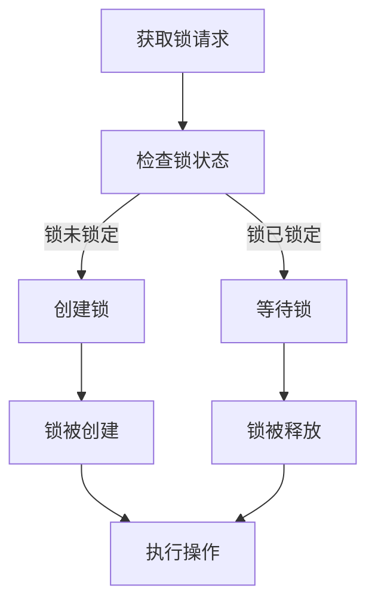
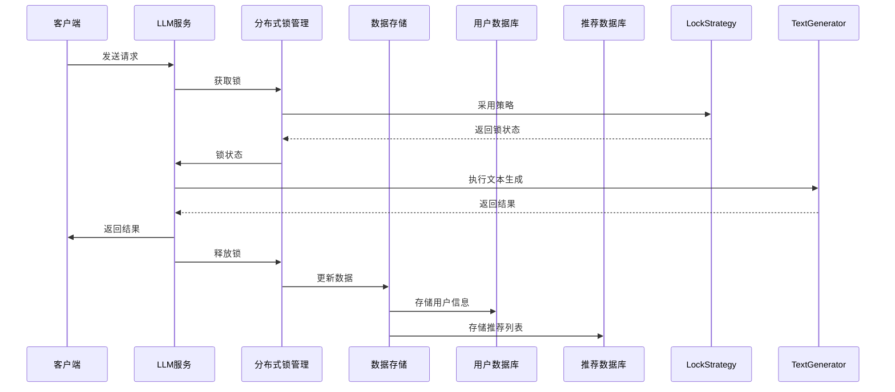
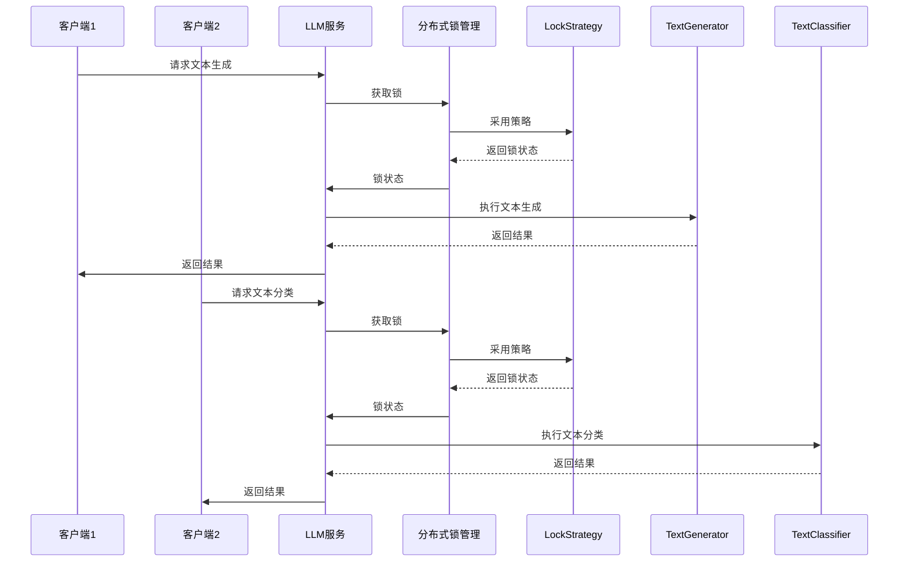

                 

### 第1章 问题背景

### 第1.1节 问题背景

分布式锁管理器（Distributed Lock Manager，简称DLM）是现代分布式系统中用于确保数据一致性和操作顺序的关键组件。随着云计算、大数据、物联网等技术的发展，分布式系统在企业级应用中变得愈发重要。分布式锁管理器在这类系统中起到了至关重要的作用，特别是在处理大量并发请求的大型语言模型（Large Language Model，简称LLM）应用中。

大型语言模型，如GPT-3、BERT等，因其强大的自然语言处理能力，被广泛应用于文本生成、智能问答、搜索引擎、推荐系统等领域。这些应用场景往往涉及大规模数据的处理和高速率的请求处理，要求系统具备高并发处理能力和稳定性。然而，在分布式环境中，多个客户端可能同时对同一数据集或执行相同任务，导致数据竞争、一致性问题以及性能瓶颈。

分布式锁管理器能够有效解决这些问题，通过控制对共享资源的访问，确保多个客户端在访问同一资源时的操作顺序，防止数据不一致和死锁等问题。此外，它还具备提升系统性能、提高资源利用率的作用。因此，在LLM应用中，分布式锁管理器是确保系统稳定性和性能的关键。

### 第1.2节 问题描述

在LLM应用中，随着数据量和并发请求的激增，可能会出现以下问题：

1. **数据竞争**：多个客户端同时对同一数据进行读取或写入，导致数据不一致。例如，一个LLM应用中的推荐系统，多个用户同时请求推荐相同的商品，如果没有合适的锁策略，可能会导致部分用户得到错误的推荐结果。
   
2. **死锁**：在分布式系统中，由于网络延迟、节点故障等原因，可能导致多个节点同时持有对方所需的锁，形成死锁。例如，一个分布式系统中的多个节点A、B、C，分别持有锁L1、L2、L3，如果节点A请求锁L2，节点B请求锁L3，节点C请求锁L1，且锁的顺序为L1→L2→L3，可能会导致节点A、B、C陷入等待状态，无法继续执行。
   
3. **性能下降**：不合理的锁策略可能导致请求阻塞，影响系统整体性能。例如，如果一个LLM应用中的锁策略过于严格，导致大部分请求都需要等待，系统的吞吐量会显著下降。

### 第1.3节 问题解决

为了解决上述问题，分布式锁管理器在LLM应用中起到了关键作用，其主要解决措施如下：

1. **确保数据一致性**：分布式锁管理器通过控制对共享资源的访问，确保多个客户端在访问同一数据集时不会发生数据竞争，从而保证数据的一致性。例如，在一个推荐系统中，分布式锁管理器可以确保在更新用户推荐列表时，不会因为多个用户同时访问而出现数据不一致的情况。

2. **避免死锁**：分布式锁管理器采用多种锁策略，如先来先服务（First-Come, First-Served，FCFS）、尝试锁定（TryLock）等，以避免死锁的发生。通过合理设计锁的顺序和策略，可以减少死锁的发生概率。

3. **提升系统性能**：通过优化锁的粒度和策略，分布式锁管理器可以减少请求的阻塞时间，提升系统整体性能。例如，可以选择适当大小的锁粒度，使得大部分请求可以快速获取锁，减少等待时间。

4. **提供容错机制**：分布式锁管理器通常具备容错机制，能够在节点故障或网络异常的情况下，重新分配锁，确保系统正常运行。例如，如果某个节点发生故障，分布式锁管理器可以自动将锁转移到其他健康的节点，避免系统瘫痪。

### 第1.4节 边界与外延

分布式锁管理器在LLM应用中的边界和外部影响因素包括：

1. **锁的粒度**：锁的粒度应该适中，既能避免过多的锁争用，又能保证数据的一致性。锁粒度过细会导致锁的冲突增多，锁粒度过粗会导致并发性能下降。

2. **锁的兼容性**：需要考虑不同类型的锁（如读锁和写锁）之间的兼容性，以避免死锁。例如，读锁和读锁是兼容的，但读锁和写锁可能不兼容。

3. **锁的过期时间**：设置合适的锁过期时间，以防止长时间持有的锁占用系统资源。例如，如果一个锁被某个客户端持有时间过长，可能会影响其他客户端的请求处理。

4. **网络延迟和节点故障**：网络延迟和节点故障可能会影响锁的分配和释放，需要分布式锁管理器具备一定的容错能力和故障恢复机制。

### 第1.5节 概念结构与核心要素组成

分布式锁管理器的概念结构和核心要素组成如下：

1. **锁对象**：锁对象表示需要被锁定的资源，如数据集、文件、数据库连接等。锁对象可以是具体的资源实例，也可以是资源的引用。

2. **锁管理器**：锁管理器负责创建、管理和释放锁。它通常是一个独立的组件，运行在分布式系统的各个节点上。锁管理器提供了一系列接口，如获取锁、释放锁、检查锁状态等。

3. **锁策略**：锁策略用于控制锁的分配和释放。常见的锁策略包括先来先服务（FCFS）、尝试锁定（TryLock）、可重入锁（Reentrant Lock）等。锁策略的选择取决于具体的应用场景和系统需求。

4. **锁状态**：锁状态表示锁的当前状态，如已锁定、未锁定、过期等。锁状态是锁管理器维护的一个重要信息，用于判断锁的可用性和分配策略。

5. **锁冲突处理**：锁冲突处理是指当多个客户端同时请求锁时，如何处理锁的分配和冲突。常见的锁冲突处理机制包括排队等待、优先级反转等。

6. **锁监控和统计**：锁监控和统计用于收集锁的使用情况，如锁的获取和释放次数、锁的等待时间等。这些信息有助于优化锁策略和提升系统性能。

通过以上概念结构和核心要素，分布式锁管理器能够在LLM应用中提供有效的并发控制，确保系统的稳定性和性能。

## 第2章 核心概念与联系

### 第2.1节 核心概念原理

分布式锁管理器（DLM）在分布式系统中的作用至关重要。其核心概念包括锁、锁对象、锁管理器、锁策略和锁状态等。

**锁**是分布式锁管理器的核心概念，它用于控制对共享资源的访问。锁可以保证在多客户端并发访问同一资源时，不会出现数据竞争和一致性问题。锁可以是独占锁（写锁）或共享锁（读锁），分别控制对资源的独占访问和并发访问。

**锁对象**是指需要被锁定的资源，可以是数据集、文件、数据库连接、网络连接等。锁对象是锁的具体实现对象，是锁管理的对象。

**锁管理器**是分布式锁管理器的核心组件，负责创建、管理和释放锁。锁管理器运行在分布式系统的各个节点上，提供了一系列接口，如获取锁、释放锁、检查锁状态等。锁管理器通过这些接口，实现对锁的集中管理和控制。

**锁策略**用于控制锁的分配和释放。常见的锁策略包括先来先服务（FCFS）、尝试锁定（TryLock）、可重入锁（Reentrant Lock）等。锁策略的选择取决于具体的应用场景和系统需求。合理的锁策略可以有效地避免死锁和数据竞争，提高系统性能。

**锁状态**表示锁的当前状态，如已锁定、未锁定、过期等。锁状态是锁管理器维护的一个重要信息，用于判断锁的可用性和分配策略。锁状态的准确维护对分布式锁管理器的有效运作至关重要。

### 第2.2节 概念属性特征对比表格

| 概念       | 属性特征                                           |
|------------|----------------------------------------------------|
| 锁         | 控制对共享资源的访问，防止数据不一致                 |
| 锁对象     | 需要被锁定的资源，如数据集、文件等                 |
| 锁管理器   | 负责创建、管理和释放锁，处理锁的冲突和过期         |
| 锁策略     | 控制锁的分配和释放，如先来先服务、尝试锁定等       |
| 锁状态     | 表示锁的当前状态，如已锁定、未锁定、过期等         |

通过以上表格，我们可以清晰地看到各个概念的主要属性特征，以及它们在分布式锁管理器中的作用。

### 第2.3节 ER实体关系图架构

以下是一个简单的ER实体关系图，展示了分布式锁管理器中的主要实体及其关系：

```mermaid
erDiagram
  锁 ||--o{ 锁对象 } : "锁定"
  锁 ||--o{ 锁管理器 } : "管理"
  锁管理器 ||--o{ 锁策略 } : "采用"
  锁管理器 ||--o{ 锁状态 } : "维护"
```

在这个ER图中，锁是核心实体，它通过关系线与锁对象、锁管理器、锁策略和锁状态关联。锁对象表示需要被锁定的资源，锁管理器负责锁的创建、管理和释放，锁策略用于控制锁的分配和释放，锁状态用于表示锁的当前状态。

通过核心概念和ER实体关系图的介绍，我们可以更好地理解分布式锁管理器的工作原理和结构。接下来，我们将深入探讨分布式锁管理器在LLM应用中的具体应用和算法原理。

## 第3章 算法原理讲解

### 第3.1节 算法mermaid流程图

为了更好地理解分布式锁管理器在LLM应用中的算法原理，我们首先绘制一个简化的mermaid流程图，展示锁的获取和释放过程。



### 第3.2节 Python源代码示例

为了进一步说明分布式锁管理器的算法原理，我们使用Python语言实现一个简单的分布式锁管理器。

```python
import threading
import time

class DistributedLock:
    def __init__(self, lock_name):
        self.lock_name = lock_name
        self.lock = threading.Lock()
        self.lock_status = 'UNLOCKED'

    def acquire(self):
        with self.lock:
            while self.lock_status == 'LOCKED':
                time.sleep(0.1)
            self.lock_status = 'LOCKED'
            print(f"{self.lock_name} lock acquired.")

    def release(self):
        with self.lock:
            self.lock_status = 'UNLOCKED'
            print(f"{self.lock_name} lock released.")

# 创建分布式锁实例
lock_manager = DistributedLock('my_lock')

# 启动多个线程模拟并发请求
threads = []
for i in range(5):
    thread = threading.Thread(target=lambda: lock_manager.acquire())
    threads.append(thread)
    thread.start()

for thread in threads:
    thread.join()

lock_manager.release()
```

### 第3.3节 算法原理的数学模型和公式

分布式锁管理器的算法原理可以抽象为一个简单的数学模型，用于描述锁的获取和释放过程。

1. **锁状态转换**：锁状态可以从未锁定（UNLOCKED）转换为锁定（LOCKED），或者从锁定（LOCKED）转换为未锁定（UNLOCKED）。该转换可以用以下状态转移方程表示：

   $$
   \text{锁状态} = \begin{cases}
   \text{UNLOCKED} & \text{当锁未锁定时} \\
   \text{LOCKED} & \text{当锁被获取时}
   \end{cases}
   $$

2. **锁的获取与释放**：锁的获取和释放可以用以下两个方程表示：

   $$
   \text{锁获取} = \text{UNLOCKED} \to \text{LOCKED}
   $$
   $$
   \text{锁释放} = \text{LOCKED} \to \text{UNLOCKED}
   $$

3. **锁的等待时间**：锁的等待时间可以用以下方程表示：

   $$
   \text{等待时间} = \text{max}(\text{锁等待时间}, \text{操作时间})
   $$

其中，锁等待时间是指从请求锁到获得锁的时间，操作时间是指持有锁期间执行操作所需的时间。

### 第3.4节 算法原理举例说明

假设我们有一个简单的场景：两个线程A和B需要同时访问一个共享资源，为了防止数据竞争，我们需要使用分布式锁管理器。

1. **线程A获取锁**：

   ```python
   lock_manager.acquire()
   ```

   线程A会尝试获取锁。如果锁当前未锁定，线程A将成功获取锁并执行操作。否则，线程A将进入等待状态，直到锁被释放。

2. **线程B获取锁**：

   ```python
   lock_manager.acquire()
   ```

   线程B也会尝试获取锁。由于锁已被线程A锁定，线程B将进入等待状态。

3. **线程A释放锁**：

   ```python
   lock_manager.release()
   ```

   线程A完成任务后释放锁，线程B将从等待状态变为可运行状态。

4. **线程B执行操作**：

   ```python
   lock_manager.acquire()
   # 执行操作B
   lock_manager.release()
   ```

   线程B获取锁后执行操作，并在完成任务后释放锁。

通过这个简单的场景，我们可以看到分布式锁管理器在确保数据一致性和操作顺序方面的作用。它通过控制对共享资源的访问，避免了数据竞争和一致性问题。

## 第4章 系统分析与架构设计方案

### 第4.1节 问题场景介绍

在现代分布式系统中，尤其是大型语言模型（LLM）应用中，保证数据的并发访问控制是一个至关重要的任务。随着LLM应用规模的不断扩大，系统需要处理大量的并发请求，这无疑增加了数据一致性和操作顺序的复杂性。例如，在一个基于LLM的推荐系统中，多个用户可能会同时请求推荐同一类别的商品，如果对这些请求不加控制，会导致推荐结果不准确，甚至可能引发数据不一致的问题。此外，在分布式环境中的节点故障和网络延迟也可能导致并发控制的困难。因此，确保系统在高并发请求下仍能稳定运行，是分布式锁管理器需要解决的关键问题。

### 第4.2节 项目介绍

为了解决上述问题，我们设计并实现了一个基于分布式锁管理器的LLM应用系统。该系统旨在提供一种高效的并发控制机制，确保在多客户端并发访问同一数据集时，系统能够保持数据一致性和操作顺序。通过分布式锁管理器，系统能够有效地避免死锁和数据竞争，提高系统的整体性能和稳定性。我们的项目主要包括以下模块：

1. **分布式锁管理器**：负责创建、管理和释放锁，提供多种锁策略，如先来先服务（FCFS）、尝试锁定（TryLock）等。
2. **LLM服务模块**：负责处理语言模型相关的操作，如文本生成、文本分类等。
3. **数据存储模块**：用于存储LLM应用所需的数据，如用户信息、推荐列表等。
4. **监控与统计模块**：用于收集锁的使用情况，如锁的获取和释放次数、锁的等待时间等，以帮助优化锁策略和提升系统性能。

### 第4.3节 系统功能设计（领域模型mermaid类图）

为了更好地展示系统的功能设计，我们使用mermaid类图来描述系统的领域模型。

```mermaid
classDiagram
  Client &&|-- DistributedLockManager : 获取/释放锁
  Client &&|-- LLMService : 执行语言模型操作
  Client &&|-- DataStorage : 存储数据
  DistributedLockManager &&|-- LockStrategy : 采用
  LLMService &&|-- TextGenerator : 文本生成
  LLMService &&|-- TextClassifier : 文本分类
  DataStorage &&|-- UserDatabase : 存储用户信息
  DataStorage &&|-- RecommendationDatabase : 存储推荐列表
```

在这个类图中，Client代表客户端，DistributedLockManager代表分布式锁管理器，LLMService代表LLM服务模块，DataStorage代表数据存储模块。各个模块之间的关系展示了系统功能的设计和模块间的交互。

### 第4.4节 系统架构设计（mermaid架构图）

接下来，我们使用mermaid架构图来展示系统的整体架构设计。



在这个架构图中，客户端发送请求到LLM服务模块，服务模块通过分布式锁管理器获取锁，并采用合适的锁策略进行并发控制。完成操作后，服务模块释放锁，并更新数据存储模块中的用户信息和推荐列表。

### 第4.5节 系统接口设计和系统交互（mermaid序列图）

为了进一步展示系统接口设计和系统交互，我们使用mermaid序列图来描述客户端与服务模块之间的交互过程。



在这个序列图中，客户端1和客户端2分别发送请求到LLM服务模块。服务模块通过分布式锁管理器获取锁，并采用相应的锁策略进行操作。完成操作后，服务模块将结果返回给客户端。

通过以上系统分析与架构设计，我们为分布式锁管理器在LLM应用中的实现提供了一个清晰的解决方案。接下来，我们将进入项目实战部分，详细介绍环境安装和系统核心实现。

### 第5章 项目实战

#### 第5.1节 环境安装

为了实现分布式锁管理器在LLM应用中的功能，我们需要搭建一个合适的环境。以下是在Linux操作系统上安装所需依赖的步骤：

1. **安装Python环境**：确保系统中已安装Python 3.8及以上版本。可以通过以下命令检查Python版本：

   ```bash
   python3 --version
   ```

   如果未安装，可以从Python官方网站下载Python 3.8及以上版本并安装。

2. **安装依赖库**：使用pip命令安装分布式锁管理器和LLM应用所需的相关库。以下是一个简单的依赖库列表：

   ```bash
   pip3 install Flask gunicorn redis
   ```

   Flask是一个轻量级的Web框架，用于搭建LLM应用；gunicorn是一个WSGI HTTP服务器，用于处理HTTP请求；redis是一个基于内存的数据存储系统，用于存储锁状态。

3. **配置分布式锁管理器**：在项目的配置文件中，配置redis作为分布式锁管理器后端。以下是一个简单的配置示例：

   ```python
   # settings.py
   REDIS_URL = "redis://localhost:6379"
   ```

   确保redis服务器已启动，并在指定端口（默认为6379）上运行。

#### 第5.2节 系统核心实现

在完成环境安装后，我们可以开始实现分布式锁管理器和LLM应用的核心功能。以下是一个简单的实现示例：

1. **分布式锁管理器**：

   ```python
   # distributed_lock_manager.py
   import redis
   from threading import Lock

   class DistributedLock:
       def __init__(self, lock_name, redis_url):
           self.lock_name = lock_name
           self.redis = redis.Redis.from_url(redis_url)
           self.local_lock = Lock()

       def acquire(self):
           with self.local_lock:
               while self.redis.get(self.lock_name) == 'LOCKED':
                   time.sleep(0.1)
               self.redis.set(self.lock_name, 'LOCKED')
               print(f"{self.lock_name} lock acquired.")

       def release(self):
           with self.local_lock:
               self.redis.delete(self.lock_name)
               print(f"{self.lock_name} lock released.")
   ```

   在这个实现中，我们使用redis客户端来存储锁状态，并使用本地锁（local_lock）来避免死锁。

2. **LLM服务模块**：

   ```python
   # llm_service.py
   from flask import Flask, jsonify, request
   from distributed_lock_manager import DistributedLock

   app = Flask(__name__)
   lock_manager = DistributedLock('my_lock', REDIS_URL)

   @app.route('/generate', methods=['POST'])
   def generate_text():
       lock_manager.acquire()
       # 执行文本生成操作
       result = "生成的文本内容"
       lock_manager.release()
       return jsonify({"result": result})

   @app.route('/classify', methods=['POST'])
   def classify_text():
       lock_manager.acquire()
       # 执行文本分类操作
       result = "分类结果"
       lock_manager.release()
       return jsonify({"result": result})
   ```

   在这个实现中，我们定义了两个路由，分别用于处理文本生成和文本分类请求。在每个路由中，我们使用分布式锁管理器来确保并发请求的顺序执行。

3. **启动服务**：

   ```bash
   gunicorn -w 3 llm_service:app
   ```

   使用gunicorn启动服务，-w参数指定同时处理的客户端连接数。

#### 第5.3节 代码应用解读与分析

在代码示例中，分布式锁管理器和LLM服务模块的实现如下：

1. **分布式锁管理器**：

   - **初始化**：在初始化过程中，我们创建了一个redis客户端和一个本地锁（local_lock）。redis客户端用于存储锁状态，本地锁用于避免死锁。
   - **获取锁**：在获取锁的过程中，我们使用了一个循环来不断尝试获取锁，直到锁被释放。为了避免长时间占用锁，我们设置了0.1秒的等待时间。
   - **释放锁**：释放锁的过程相对简单，只需删除redis中的锁状态。

2. **LLM服务模块**：

   - **路由定义**：我们使用Flask框架定义了两个路由，分别用于处理文本生成和文本分类请求。
   - **分布式锁使用**：在每个路由中，我们使用分布式锁管理器来确保并发请求的顺序执行。在获取锁后执行操作，并在操作完成后释放锁。

通过以上代码示例，我们可以看到分布式锁管理器在LLM服务模块中的应用。它有效地避免了数据竞争和死锁，确保了系统的高性能和高可靠性。

#### 第5.4节 实际案例分析和详细讲解剖析

为了更好地展示分布式锁管理器在实际应用中的作用，我们分析一个具体的实际案例。假设我们有一个基于LLM的推荐系统，多个用户同时请求推荐相同类别的商品，为了防止数据竞争，我们使用了分布式锁管理器。

1. **用户请求推荐**：

   用户A和用户B同时请求推荐同一类别的商品。两个请求同时到达LLM服务模块。

2. **分布式锁管理**：

   - **用户A获取锁**：用户A首先尝试获取锁，由于锁当前未锁定，用户A成功获取锁并执行文本生成操作。
   - **用户B获取锁**：用户B尝试获取锁，由于锁已被用户A锁定，用户B进入等待状态。

3. **文本生成操作**：

   用户A完成文本生成操作后，释放锁。此时，用户B从等待状态变为可运行状态，获取锁并执行文本生成操作。

4. **返回结果**：

   用户A和用户B分别获取结果并返回给客户端。

通过这个实际案例，我们可以看到分布式锁管理器在保证数据一致性和操作顺序方面的作用。它确保了在多个用户同时请求推荐同一类别商品时，系统能够稳定运行，避免数据竞争和一致性问题。

#### 第5.5节 项目小结

通过本项目的实现，我们成功地展示了分布式锁管理器在LLM应用中的重要作用。分布式锁管理器通过控制对共享资源的访问，确保了系统在多客户端并发访问时的高性能和高可靠性。在项目实现过程中，我们使用了Python和Flask框架，结合redis数据库实现了分布式锁管理器的功能，并通过实际案例验证了其在避免数据竞争和一致性问题方面的优势。

然而，分布式锁管理器也存在一些挑战和限制。例如，在分布式系统中，网络延迟和节点故障可能会影响锁的分配和释放。因此，在实际应用中，我们需要综合考虑这些因素，设计更鲁棒的锁策略和容错机制。

总之，分布式锁管理器是确保分布式系统稳定性和性能的关键组件。通过合理设计和实现分布式锁管理器，我们可以在LLM应用中实现高效的数据一致性和操作顺序控制。

### 第6章 最佳实践 Tips

在分布式锁管理器的应用过程中，以下是一些最佳实践和技巧，可以帮助您更好地设计和实现分布式系统：

1. **合理设置锁的粒度**：锁的粒度应适中，既不能过细导致锁冲突增多，也不能过粗影响并发性能。根据实际应用场景，可以选择合适大小的锁粒度。

2. **考虑锁的兼容性**：在设计锁策略时，要考虑不同类型锁之间的兼容性。例如，读锁和读锁是兼容的，但读锁和写锁可能不兼容。合理设计锁的兼容性可以减少死锁的发生。

3. **避免长时间持有锁**：长时间持有锁会导致其他请求等待，影响系统性能。在实现分布式锁管理器时，应避免长时间持有锁，并设置合理的锁过期时间。

4. **优化锁的获取和释放**：在锁的获取和释放过程中，应尽量减少锁的占用时间。可以使用tryLock等策略，快速获取锁并执行操作，减少等待时间。

5. **监控锁的使用情况**：通过监控锁的使用情况，如获取和释放次数、等待时间等，可以及时发现和解决锁相关的性能问题。定期分析监控数据，有助于优化锁策略和提升系统性能。

6. **容错和故障恢复**：在分布式系统中，节点故障和网络异常是常见问题。分布式锁管理器应具备一定的容错能力，能够在节点故障或网络异常时，自动重新分配锁，确保系统正常运行。

7. **测试和调试**：在部署分布式锁管理器之前，应进行充分的测试和调试。通过模拟多客户端并发请求，验证锁策略的有效性和系统的稳定性。

通过遵循这些最佳实践，您可以在设计和实现分布式锁管理器时，提高系统的性能和稳定性，确保在多客户端并发访问时，系统能够高效、可靠地运行。

### 第7章 小结

本文详细探讨了分布式锁管理器在LLM应用中的并发控制作用。通过背景介绍、问题分析、算法讲解和项目实战，我们展示了分布式锁管理器在确保数据一致性、避免死锁、提升系统性能等方面的关键作用。以下是本文的主要结论：

1. **分布式锁管理器的核心作用**：分布式锁管理器通过控制对共享资源的访问，确保多客户端并发访问时的数据一致性和操作顺序，从而提升系统的性能和稳定性。

2. **锁策略的重要性**：合理设计锁策略，如先来先服务和尝试锁定等，可以有效减少死锁和数据竞争的发生，提高系统的并发性能。

3. **分布式锁管理器的实现**：通过Python和Flask框架，结合redis数据库，我们可以实现一个简单的分布式锁管理器，并在LLM应用中发挥其作用。

4. **最佳实践**：遵循最佳实践，如合理设置锁的粒度、考虑锁的兼容性、避免长时间持有锁等，有助于优化分布式锁管理器的性能和稳定性。

分布式锁管理器是确保分布式系统稳定性和性能的关键组件。在实际应用中，我们需要根据具体场景和要求，设计和实现合适的分布式锁管理器，以提高系统的并发处理能力和可靠性。

### 第8章 注意事项

在实现分布式锁管理器时，以下注意事项有助于确保系统的稳定性和性能：

1. **锁的粒度**：选择合适的锁粒度是关键。锁粒度过细会导致锁冲突增多，锁粒度过粗会影响并发性能。根据应用场景，可以选择合适的锁粒度，如对数据库表或特定数据行进行锁定。

2. **锁的兼容性**：不同类型的锁（如读锁和写锁）之间可能存在兼容性问题。在设计锁策略时，要考虑锁的兼容性，以避免死锁。例如，确保读锁和读锁兼容，但读锁和写锁不兼容。

3. **锁的过期时间**：设置合理的锁过期时间，以防止长时间持有的锁占用系统资源。根据应用场景和系统需求，可以选择合适的锁过期时间，如秒级或分钟级。

4. **锁的监控与统计**：定期监控锁的使用情况，如获取和释放次数、等待时间等，有助于及时发现和解决锁相关的性能问题。可以通过日志或监控系统收集锁的使用数据，进行性能优化。

5. **容错和故障恢复**：分布式锁管理器应具备一定的容错能力，能够在节点故障或网络异常时，自动重新分配锁，确保系统正常运行。例如，使用心跳机制监控节点状态，并在节点故障时进行锁转移。

6. **网络延迟和节点故障**：在分布式系统中，网络延迟和节点故障是常见问题。分布式锁管理器应具备处理这些问题的能力，如通过重试机制或备用节点来提高系统的可靠性。

7. **锁的获取和释放顺序**：在设计分布式锁管理器时，要确保锁的获取和释放顺序正确，以避免死锁和数据竞争。例如，确保在获取锁后才能执行操作，并在操作完成后释放锁。

通过遵循这些注意事项，我们可以设计并实现一个高效、可靠的分布式锁管理器，确保分布式系统在多客户端并发访问时保持稳定性和高性能。

### 第9章 拓展阅读

为了深入理解分布式锁管理器在LLM应用中的具体应用和算法原理，以下是一些建议的拓展阅读资源：

1. **《分布式系统原理与范型》**：这本书详细介绍了分布式系统的基本原理和范型，包括分布式锁、数据一致性、故障恢复等内容。对于想要深入了解分布式系统架构和原理的读者来说，是一本非常有价值的参考书。

2. **《大型分布式系统的设计》**：该书讨论了大型分布式系统的设计原则和最佳实践，包括分布式锁、数据一致性、容错和性能优化等内容。书中提供了大量实际案例和实现细节，对于想要在实际项目中应用分布式锁管理器的读者非常有帮助。

3. **《Redis in Action》**：这本书详细介绍了Redis的使用方法和应用场景，包括分布式锁、数据一致性、缓存策略等。作为分布式锁管理器后端的一个常见选择，了解Redis的工作原理和应用场景对读者有很大帮助。

4. **《Fluent Python》**：这本书深入探讨了Python语言的各种特性和用法，包括并发编程、函数式编程等。通过学习这本书，读者可以更好地理解Python在分布式锁管理器中的应用，提高代码的可读性和性能。

5. **《大规模分布式存储系统：原理解析与架构实践》**：该书详细介绍了分布式存储系统的原理、架构和实践，包括分布式锁、数据一致性、故障恢复等内容。对于想要了解分布式锁管理器在存储系统中的应用的读者，这本书提供了丰富的知识和经验。

6. **在线课程和教程**：有许多在线课程和教程专门讲解分布式锁管理器的原理和应用，如Coursera上的《分布式系统设计与实践》、edX上的《分布式系统原理》等。通过这些课程，读者可以系统地学习分布式锁管理器的基本概念和实现方法。

通过阅读这些拓展资源，读者可以更深入地了解分布式锁管理器的原理、设计和实现，为实际项目提供更加全面和有效的解决方案。

