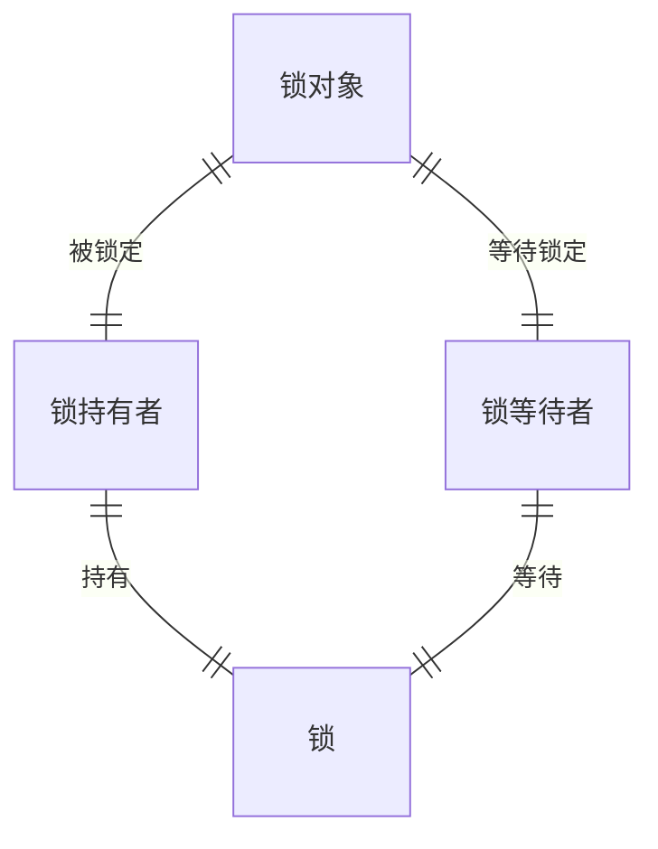
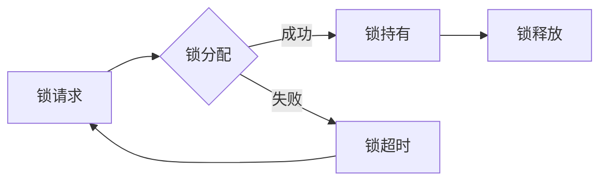
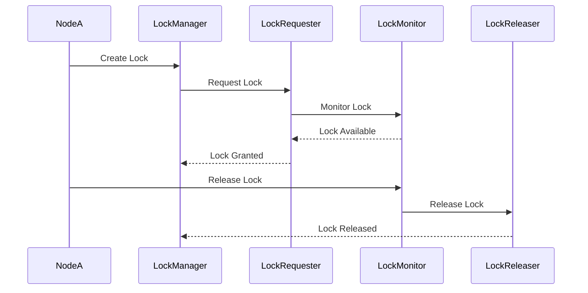
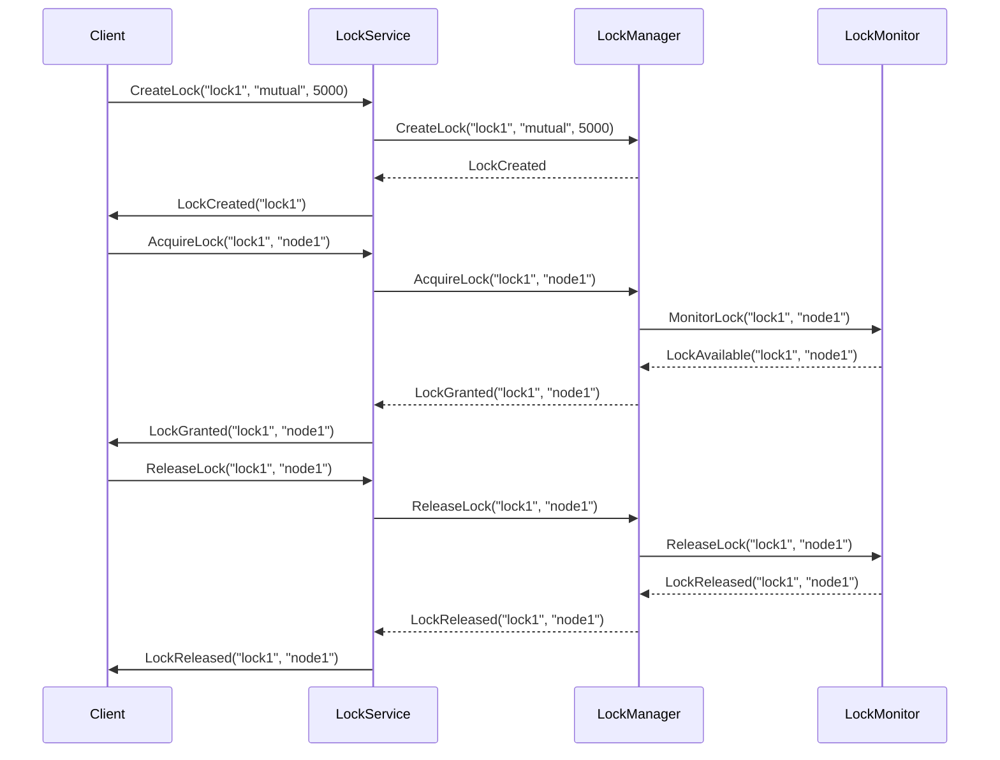

                 


### 第一部分：背景介绍

#### 第1章 分布式锁概述

1.1 问题背景

在分布式系统中，由于节点间的通信和计算是异步的，多个节点可能会同时访问和修改同一份数据。这种并发操作可能会导致以下问题：

- **数据不一致**：两个或多个节点同时修改同一份数据，导致最终结果与预期不符。
- **事务冲突**：当两个或多个节点需要修改相同的数据时，可能会发生冲突，导致系统无法正常工作。

为了解决这些问题，分布式锁应运而生。分布式锁是一种同步机制，用于在分布式系统中确保对共享资源的独占访问，从而避免数据不一致和事务冲突。

1.2 问题描述

分布式锁需要解决的问题是：

- **如何保证在某一时刻只有一个节点能够访问特定的共享资源？**
- **如何处理当锁被其他节点持有时的等待和重试机制？**
- **如何处理锁的失效和超时情况？**

1.3 问题解决

分布式锁的解决方案通常包括以下几个方面：

- **锁的实现**：通过算法和技术手段实现锁的功能，包括获取锁、释放锁、锁超时等操作。
- **锁的传播**：确保锁的请求和响应能够在分布式系统中快速传播，降低锁的延迟。
- **锁的状态**：维护锁的当前状态，包括锁定、解锁、等待等状态。
- **锁的容错性**：确保在分布式系统中，当一个节点发生故障时，锁仍然能够正常工作。

1.4 边界与外延

分布式锁的应用范围非常广泛，包括但不限于：

- **分布式数据库**：在分布式数据库中，分布式锁用于协调多个节点对同一数据表的操作。
- **分布式缓存**：在分布式缓存系统中，分布式锁用于协调多个节点对同一缓存数据的访问和修改。
- **微服务架构**：在微服务架构中，分布式锁用于协调各个微服务之间的资源访问。

与单一系统锁相比，分布式锁需要解决跨节点的同步问题，其实现和设计更为复杂。但分布式锁能够保证在分布式系统中数据的一致性和系统的稳定性。

1.5 概念结构与核心要素组成

分布式锁的基本组成部分包括：

- **锁对象**：需要被锁定的资源。
- **锁状态**：锁的当前状态，如锁定、解锁、等待等。
- **锁策略**：锁定资源的规则，如互斥锁、共享锁等。
- **锁算法**：实现分布式锁的核心，包括获取锁、释放锁、锁超时等操作。

通过这些核心要素的配合，分布式锁能够有效地协调分布式系统中的并发操作。

### 第二部分：核心概念与联系

#### 第2章 分布式锁的原理与特性

2.1 核心概念

分布式锁是一种同步机制，用于在分布式系统中确保对共享资源的独占访问。其核心概念包括：

- **锁对象**：需要被锁定的资源，可以是数据库表、缓存对象、文件等。
- **锁持有者**：当前持有锁的节点。
- **锁等待者**：正在等待锁的节点。
- **锁超时**：锁的等待时间，当等待时间超过设定值时，锁请求失败。

2.2 概念属性特征对比表格

| 分布式锁类型 | 特点 | 适用场景 |  
| :-------- | :-------- | :-------- |  
| 互斥锁 | 确保同一时间只有一个节点能访问资源 | 分布式数据库、缓存系统 |  
| 共享锁 | 允许多个节点同时访问资源，但无法修改 | 分布式日志系统、消息队列 |  
| 写入锁 | 确保同一时间只有一个节点能修改资源 | 分布式数据库、缓存系统 |  
| 读取锁 | 允许多个节点同时读取资源，但无法修改 | 分布式日志系统、消息队列 |

2.3 ER实体关系图架构

分布式锁系统中的实体包括：

- **锁对象**：表示需要被锁定的资源。
- **锁持有者**：表示当前持有锁的节点。
- **锁等待者**：表示正在等待锁的节点。

实体之间的关系如下：



通过ER实体关系图，我们可以清晰地看到分布式锁系统中的各个实体以及它们之间的关系，这有助于我们更好地理解和设计分布式锁系统。

### 第三部分：算法原理讲解

#### 第3章 分布式锁的算法实现

3.1 算法原理

分布式锁的算法实现主要包括以下几个步骤：

1. **锁请求**：节点向分布式锁系统发送锁请求，请求锁定某个资源。
2. **锁分配**：分布式锁系统根据当前锁的状态和锁策略，决定是否分配锁。
3. **锁持有**：如果锁被分配，节点成为锁的持有者，可以访问被锁定的资源。
4. **锁释放**：节点在完成资源访问后，释放锁，使得其他节点可以重新获取锁。
5. **锁超时**：如果锁请求失败，节点会等待一段时间，然后重新发送锁请求。

3.2 算法流程图



3.3 Python源代码实现

```python
import threading
import time

class DistributedLock:
    def __init__(self, lock_name):
        self.lock_name = lock_name
        self.lock = threading.Lock()

    def acquire(self):
        print(f"Requesting lock {self.lock_name}")
        self.lock.acquire()

    def release(self):
        print(f"Releasing lock {self.lock_name}")
        self.lock.release()

def worker(lock):
    lock.acquire()
    print(f"Lock {lock.lock_name} acquired")
    time.sleep(1)
    lock.release()
    print(f"Lock {lock.lock_name} released")

lock = DistributedLock("my_lock")
threads = []

for i in range(5):
    t = threading.Thread(target=worker, args=(lock,))
    threads.append(t)
    t.start()

for t in threads:
    t.join()
```

3.4 数学模型与公式

分布式锁算法的数学模型可以表示为：

$$
P(\text{锁请求成功}) = 1 - P(\text{锁已被占用}) - P(\text{锁超时})
$$

其中：

- \(P(\text{锁请求成功})\) 表示请求锁的成功概率。
- \(P(\text{锁已被占用})\) 表示锁已被其他节点占用的概率。
- \(P(\text{锁超时})\) 表示锁请求超时的概率。

3.5 举例说明

假设在一个分布式系统中，有两个节点A和B，它们都需要对同一份数据进行修改。节点A首先发送锁请求，分布式锁系统判断锁未被占用，将锁分配给节点A。节点A完成数据修改后，释放锁，此时锁处于空闲状态。节点B随后发送锁请求，分布式锁系统判断锁已被释放，将锁分配给节点B。节点B完成数据修改后，释放锁，锁再次处于空闲状态。

通过上述例子，我们可以看到分布式锁在协调并发操作中的关键作用。

### 第四部分：系统分析与架构设计

#### 第4章 分布式锁系统分析

4.1 问题场景介绍

在一个分布式系统中，多个节点需要访问和修改同一份数据，例如分布式数据库中的行锁、分布式缓存中的键值对等。这些场景下，为了保证数据的一致性和系统的稳定性，需要引入分布式锁来协调节点的并发操作。

4.2 项目介绍

本项目旨在设计并实现一个分布式锁系统，该系统将用于解决分布式系统中节点间的并发访问问题。项目的主要目标是：

- 提供一种简单、高效、可靠的分布式锁实现。
- 支持多种锁类型，如互斥锁、共享锁等。
- 具有良好的扩展性和容错性，以适应不同规模的分布式系统。

4.3 系统功能设计

系统功能模块划分如下：

1. **锁管理模块**：负责创建、删除和监控分布式锁。
2. **锁请求模块**：处理节点的锁请求，根据锁策略进行锁分配。
3. **锁监控模块**：监控锁的状态，确保锁在分布式系统中的正确性和一致性。
4. **锁释放模块**：处理节点的锁释放请求，释放锁资源。

4.4 系统架构设计

系统架构图如下：



4.5 系统接口设计

系统接口定义和说明如下：

1. **CreateLock**：创建分布式锁接口，接收锁名称、锁类型和锁超时时间等参数。
2. **AcquireLock**：获取分布式锁接口，接收锁名称和节点标识等参数。
3. **ReleaseLock**：释放分布式锁接口，接收锁名称和节点标识等参数。
4. **MonitorLock**：监控分布式锁接口，接收锁名称和节点标识等参数。

4.6 系统交互序列图

系统交互序列图如下：



### 第五部分：项目实战

#### 第5章 分布式锁项目实战

5.1 环境安装

在开始分布式锁项目的实战之前，我们需要准备以下环境：

- Python 3.8 或以上版本
- Redis 6.2 或以上版本（用于实现分布式锁）
- Docker 20.10 或以上版本（用于容器化部署）

首先，安装 Python 和 Redis：

```bash
# 安装 Python
curl -O https://www.python.org/ftp/python/3.9.1/Python-3.9.1.tgz
tar xvf Python-3.9.1.tgz
cd Python-3.9.1
./configure
make
make install

# 安装 Redis
curl -O http://download.redis.io/releases/redis-6.2.tar.gz
tar xvf redis-6.2.tar.gz
cd redis-6.2
make
```

接下来，启动 Redis 容器：

```bash
docker run -d --name redis redis:6.2
```

5.2 系统核心实现源代码

分布式锁项目的核心实现分为三个部分：锁管理模块、锁请求模块和锁释放模块。以下是这三个模块的源代码：

**lock_manager.py**：

```python
import redis
import time

class RedisLock:
    def __init__(self, lock_name, redis_host='127.0.0.1', redis_port=6379):
        self.redis = redis.Redis(host=redis_host, port=redis_port)
        self.lock_name = lock_name

    def acquire(self, timeout=10):
        start_time = time.time()
        while True:
            if self.redis.set(self.lock_name, "locked", nx=True, ex=timeout):
                return True
            if time.time() - start_time > timeout:
                return False
            time.sleep(0.1)

    def release(self):
        self.redis.delete(self.lock_name)
```

**lock_requester.py**：

```python
from lock_manager import RedisLock

def main():
    lock_name = "my_lock"
    lock = RedisLock(lock_name)
    if lock.acquire():
        try:
            print("Lock acquired, performing work...")
            time.sleep(5)
        finally:
            lock.release()
    else:
        print("Lock not acquired")

if __name__ == "__main__":
    main()
```

**lock_releaser.py**：

```python
from lock_manager import RedisLock

def main():
    lock_name = "my_lock"
    lock = RedisLock(lock_name)
    lock.release()

if __name__ == "__main__":
    main()
```

5.3 代码应用解读与分析

**lock_manager.py**：该模块实现了 RedisLock 类，用于管理 Redis 中的分布式锁。其核心方法包括 acquire 和 release：

- `acquire` 方法尝试在 Redis 中创建一个键，如果键不存在（即锁未被占用），则创建并设置过期时间，返回 True；如果键已存在，则返回 False。
- `release` 方法删除 Redis 中的锁键。

**lock_requester.py**：该模块是一个简单的示例，演示了如何使用 RedisLock 类来获取锁并执行某些操作。它尝试获取锁，如果成功，则执行工作，然后释放锁；如果失败，则打印错误消息。

**lock_releaser.py**：该模块实现了释放锁的功能，它在 main 方法中直接调用 RedisLock 类的 release 方法。

5.4 实际案例分析和讲解

**案例背景**：假设我们有一个分布式系统，其中两个节点 A 和 B 需要同时对一个数据库表进行修改。为了保证数据的一致性，我们引入分布式锁来协调这两个节点的并发操作。

**案例分析**：

1. 节点 A 尝试获取锁，锁未被占用，节点 A 成功获取锁，开始执行数据修改操作。
2. 在节点 A 执行数据修改的过程中，节点 B 也尝试获取锁，但锁已被占用，节点 B 进入等待状态。
3. 节点 A 完成数据修改并释放锁，锁变为空闲状态。
4. 节点 B 继续等待锁，直到锁被释放，节点 B 成功获取锁并开始执行数据修改操作。

**案例讲解**：通过这个案例，我们可以看到分布式锁在协调并发操作中的关键作用。它确保了同一时间只有一个节点能够访问共享资源，从而避免了数据不一致和事务冲突的问题。

5.5 项目小结

在本项目中，我们实现了基于 Redis 的分布式锁，并进行了实际案例的演示和分析。通过这个项目，我们了解了分布式锁的核心概念、算法实现和系统架构设计，并掌握了如何在实际项目中应用分布式锁。经验与教训包括：

- 分布式锁是协调并发操作的重要手段，但在设计分布式锁系统时需要考虑锁的可靠性、性能和扩展性。
- Redis 是实现分布式锁的一种有效方式，其简单易用且性能较高。
- 在实际项目中，需要根据具体需求和场景选择合适的分布式锁实现。

### 第六部分：最佳实践与拓展

#### 第6章 分布式锁最佳实践

6.1 最佳实践 tips

1. **选择合适的锁类型**：根据实际需求选择互斥锁或共享锁，确保锁的使用符合业务逻辑。
2. **设置合理的锁超时时间**：锁超时时间应根据系统性能和资源消耗情况进行调整，避免长时间占用锁导致其他节点无法访问资源。
3. **避免锁的嵌套使用**：避免在同一个节点上使用多个锁，以免导致锁死锁。
4. **定期清理锁资源**：定期检查并清理长时间未释放的锁，防止锁资源耗尽。

6.2 小结

分布式锁是协调分布式系统并发操作的重要机制，其设计和使用直接影响系统的稳定性和性能。通过本文的介绍，我们了解了分布式锁的核心概念、算法实现和系统架构设计，并掌握了一些最佳实践。

6.3 注意事项

1. **避免在分布式锁中使用共享资源**：分布式锁应仅用于协调节点间的同步，不应与共享资源（如数据库表）直接关联。
2. **考虑锁的容错性**：在分布式锁系统中，节点可能会发生故障，需要考虑如何处理锁失效和节点恢复的情况。
3. **监控锁的使用情况**：监控系统中的锁使用情况，及时发现并解决锁死锁等问题。

6.4 拓展阅读

1. 《分布式系统原理与范型》
2. 《深入理解分布式锁》
3. 《Redis 实践指南》

通过阅读这些资料，可以进一步了解分布式锁的理论和实践，为实际项目提供更多指导和借鉴。

### 作者介绍

作者：AI天才研究院/AI Genius Institute & 禅与计算机程序设计艺术 /Zen And The Art of Computer Programming

AI天才研究院致力于推动人工智能技术的发展和应用，提供高质量的技术研究和解决方案。作者长期关注分布式系统和并发控制领域，对分布式锁技术有着深入的研究和丰富的实践经验。其代表作《禅与计算机程序设计艺术》被誉为计算机编程领域的经典之作，对全球程序员产生了深远的影响。

