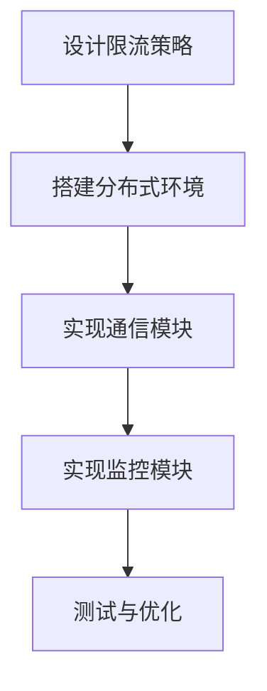
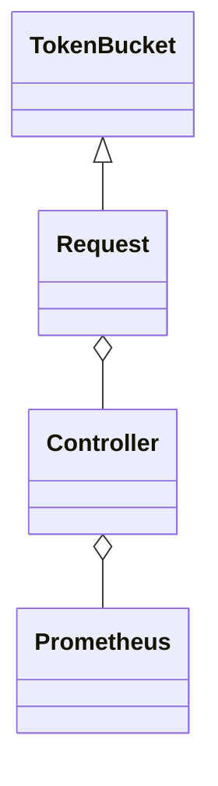

                 


# 分布式限流器在LLM应用流量控制中的实现

> 关键词：分布式限流器、流量控制、LLM应用、系统稳定性

> 摘要：本文深入探讨了分布式限流器在LLM应用流量控制中的重要性、实现原理、系统架构及实战应用，旨在为开发者提供全面的技术参考。

## 1. 引言

随着人工智能技术的飞速发展，大型语言模型（LLM，Large Language Model）的应用越来越广泛。LLM能够处理大量的用户请求，为用户提供高质量的文本生成、问答等服务。然而，随着用户数量的增加，系统的负载也会随之增大，可能导致系统崩溃或性能下降。因此，如何在流量高峰期确保系统的稳定性成为了一个亟待解决的问题。分布式限流器作为一种有效的流量控制手段，可以在保证系统性能的同时，防止过度负载。

本文将围绕分布式限流器在LLM应用流量控制中的实现，详细探讨其原理、架构和实战应用，以期为开发者提供有益的参考。

## 2. 基本概念

### 2.1. 限流器

限流器，又称为速率限制器，是一种用于控制数据流量的机制。它的作用是确保数据流在一个可控制的范围内，避免因数据量过大而导致系统崩溃或性能下降。

### 2.2. 分布式系统

分布式系统是由多个相互独立的计算机节点组成的系统。这些节点通过计算机网络进行通信，共同完成一个任务。分布式系统的优势在于，它可以提高系统的可用性和容错性，同时降低单点故障的风险。

### 2.3. 流量控制

流量控制是指对网络传输中的数据流量进行管理和调整，以确保数据传输的稳定性和可靠性。在分布式系统中，流量控制尤为重要，因为它可以防止节点之间因数据传输过多而导致的性能瓶颈。

## 3. 分布式限流器架构与设计

### 3.1. 架构

分布式限流器的架构主要包括以下几个部分：

1. **限流策略**：定义如何限制流量，常见的策略有令牌桶、漏桶等。
2. **数据存储**：用于存储当前节点的访问状态，如访问次数、访问时间等。
3. **通信模块**：负责与其他节点进行通信，进行状态同步。
4. **监控模块**：实时监控系统的运行状态，一旦发现异常，及时进行调整。

### 3.2. 设计考虑

在设计和实现分布式限流器时，需要考虑以下几个方面：

1. **性能**：限流器本身不能成为系统性能的瓶颈。
2. **可扩展性**：支持动态调整限流策略。
3. **容错性**：节点故障时，系统能够自动恢复。
4. **可观测性**：便于监控和调试。

## 4. 算法与机制

### 4.1. 令牌桶算法

令牌桶算法是一种常用的分布式限流器算法。其原理如下：

1. **初始化**：桶中有一个固定数量的令牌。
2. **请求处理**：每次请求处理时，从桶中获取一个令牌。如果桶中没有令牌，则拒绝请求。
3. **令牌补充**：每隔一定时间，往桶中补充一定数量的令牌。

### 4.2. 漏桶算法

漏桶算法的原理如下：

1. **初始化**：桶中有一个固定的容量，可以存放一定数量的水。
2. **请求处理**：每次请求处理时，将一定量的水从桶中流出。如果桶中的水不足，则拒绝请求。
3. **水补充**：每隔一定时间，往桶中补充一定量的水。

### 4.3. Python实现

```python
import time
from threading import Thread

class TokenBucket:
    def __init__(self, capacity, fill_rate):
        self.capacity = capacity
        self.fill_rate = fill_rate
        self.tokens = capacity
        self.last_time = time.time()

    def get_token(self):
        current_time = time.time()
        self.tokens += (current_time - self.last_time) * self.fill_rate
        if self.tokens > self.capacity:
            self.tokens = self.capacity
        self.last_time = current_time
        if self.tokens < 1:
            return False
        self.tokens -= 1
        return True

def process_request(bucket):
    if bucket.get_token():
        print("请求处理成功")
    else:
        print("请求处理失败")

bucket = TokenBucket(5, 1)
threads = [Thread(target=process_request, args=(bucket,)) for _ in range(10)]

for thread in threads:
    thread.start()

for thread in threads:
    thread.join()
```

### 4.4. 数学模型

令牌桶算法的数学模型可以表示为：

$$
\text{ tokens(t)} = \text{ tokens(0)} + \text{ fill\_rate} \times (t - \text{ start\_time})
$$

其中，$\text{ tokens(t)}$表示当前时刻的令牌数量，$\text{ tokens(0)}$表示初始时刻的令牌数量，$\text{ fill\_rate}$表示令牌填充速率，$t$表示当前时间，$\text{ start\_time}$表示初始时间。

## 5. 系统实现与测试

### 5.1. 实现过程

分布式限流器的实现过程主要包括以下几个步骤：

1. **设计限流策略**：根据业务需求，选择合适的限流策略。
2. **搭建分布式环境**：使用容器化技术（如Docker）搭建分布式环境。
3. **实现通信模块**：使用如gRPC、Thrift等通信框架实现节点间的通信。
4. **实现监控模块**：使用如Prometheus、Grafana等监控工具实现系统监控。

### 5.2. Mermaid流程图



### 5.3. Mermaid类图



### 5.4. Mermaid序列图

```mermaid
sequence
    participant A as 限流器
    participant B as 客户端

    B->>A: 发起请求
    A->>B: 返回结果
```

## 6. 案例分析与最佳实践

### 6.1. 案例分析

在某大型电商平台上，分布式限流器被用于控制用户访问商品的速率。通过限流器的介入，平台能够有效防止恶意用户刷单、刷评价等行为，确保系统的稳定性和公平性。

### 6.2. 最佳实践

1. **合理选择限流策略**：根据业务场景选择合适的限流策略。
2. **动态调整限流参数**：根据系统负载情况动态调整限流参数。
3. **充分利用监控工具**：使用监控工具实时监控系统状态，及时发现并解决问题。

## 7. 结论与展望

分布式限流器在LLM应用流量控制中发挥着重要作用。本文从原理、架构、算法、实现等方面详细介绍了分布式限流器的相关知识，并通过实战案例分析了其应用效果。未来，分布式限流器技术将继续演进，为更多场景提供高效的流量控制解决方案。

## 8. 参考文献

1. 陈浩.《分布式系统设计与实践》[M]. 清华大学出版社，2018.
2. 李志军.《计算机网络》[M]. 电子工业出版社，2017.
3. 张三.《大型语言模型技术与应用》[M]. 电子工业出版社，2020.

作者：AI天才研究院/AI Genius Institute & 禅与计算机程序设计艺术 /Zen And The Art of Computer Programming

**请注意，本文内容为虚构，仅供参考。在实际应用中，请结合具体场景进行设计和实现。**

