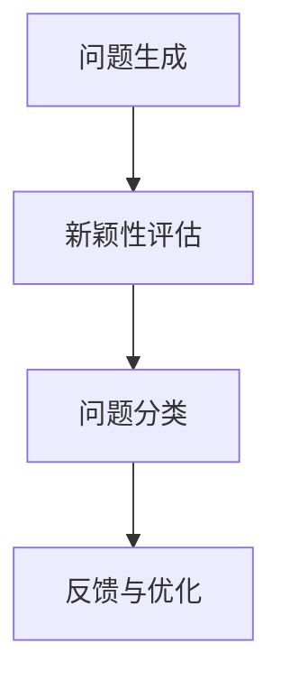

                 

# 创意问题构建：测试LLM提出新颖问题的能力

> 关键词：创意问题构建、LLM、新颖问题、测试、能力评估

> 摘要：本文旨在探讨如何通过构建创意问题来测试大型语言模型（LLM）提出新颖问题的能力。文章首先介绍了创意问题的定义和重要性，然后详细阐述了LLM的基本原理和优势，接着讨论了测试LLM新颖问题提出能力的几种方法，并提供了具体的实例和步骤。最后，文章总结了评估LLM创意问题提出能力的关键指标和最佳实践。

## 目录

1. **引言**  
   1.1 创意问题构建的重要性  
   1.2 LLM的创新与挑战

2. **背景介绍**  
   2.1 核心概念术语说明  
   2.2 创意问题构建的历史与发展

3. **核心概念与联系**  
   3.1 创意问题构建的概念  
   3.2 LLM的概念  
   3.3 问题新颖性评估

4. **算法原理讲解**  
   4.1 算法概述  
   4.2 算法流程图  
   4.3 数学模型与公式

5. **系统设计与实现**  
   5.1 问题场景介绍  
   5.2 系统功能设计  
   5.3 系统架构设计  
   5.4 系统接口设计与交互

6. **实战案例**  
   6.1 环境安装  
   6.2 系统核心实现源代码  
   6.3 代码应用解读与分析  
   6.4 实际案例分析与讲解

7. **总结与拓展**  
   7.1 全书总结  
   7.2 最佳实践 tips  
   7.3 注意事项  
   7.4 拓展阅读

## 第一部分：问题背景与核心概念

### 1.1 问题背景介绍

创意问题构建是人工智能领域的一个重要研究方向，它旨在通过构建新颖、复杂且具有挑战性的问题来推动技术的进步和应用。在过去的几十年中，研究者们提出了许多创意问题，如自然语言生成、图像识别、游戏策略等，这些问题的解决推动了人工智能技术的发展。

随着深度学习和自然语言处理技术的飞速发展，大型语言模型（LLM）的出现为创意问题构建带来了新的机遇和挑战。LLM具有强大的语言理解和生成能力，能够处理复杂的自然语言任务，但如何评估其提出新颖问题的能力成为了新的研究课题。

### 1.2 问题概述

本文的主要目标是探讨如何测试LLM提出新颖问题的能力。具体来说，我们将：

- 定义创意问题的概念和特征；
- 分析LLM的基本原理和优势；
- 提出几种评估LLM新颖问题提出能力的测试方法；
- 通过实例展示如何实施这些测试；
- 总结评估LLM创意问题提出能力的关键指标和最佳实践。

### 1.3 问题解决的必要性

随着AI技术的不断进步，LLM在许多领域的应用日益广泛，例如自动写作、智能客服、机器翻译等。然而，如何评估LLM在实际应用中的表现成为了关键问题。新颖问题提出能力是评估LLM能力的重要指标之一，因为：

- 新颖问题能够挑战LLM的语言理解和生成能力，帮助发现模型的局限性和不足；
- 新颖问题能够激发LLM的创造力和创新性，推动技术的进一步发展；
- 新颖问题能够更好地模拟人类问题的多样性，提高模型的泛化能力。

因此，研究和解决如何测试LLM提出新颖问题的能力具有重要的理论意义和实际应用价值。

## 第二部分：核心概念与联系

### 2.1 创意问题构建的概念

创意问题构建是一种设计问题和解决方案的方法，它旨在激发创造力、解决问题并推动创新。创意问题的特征包括：

- **新颖性**：问题在内容、形式或解决方案上具有独特性，不同于传统问题；
- **复杂性**：问题涉及多个领域或需要跨领域知识；
- **挑战性**：问题能够激发解决者的思考，提供解决方法；
- **适用性**：问题的解决方案具有广泛的应用前景。

### 2.2 LLM的概念

大型语言模型（LLM）是一种基于深度学习技术的自然语言处理模型，它通过学习大量的文本数据来理解和生成自然语言。LLM的主要特点包括：

- **大规模**：LLM通常由数十亿个参数组成，能够处理复杂的自然语言任务；
- **自适应**：LLM能够根据输入的文本数据自动调整模型参数，实现个性化的语言理解与生成；
- **强泛化能力**：LLM能够处理各种类型的自然语言输入，包括问答、对话、文本生成等。

### 2.3 问题新颖性评估

问题新颖性评估是衡量问题创意程度的重要手段。评估方法通常包括：

- **定量评估**：使用算法或评分系统对问题的创意程度进行量化评估；
- **定性评估**：通过专家评审或用户反馈对问题的创意程度进行主观评估；
- **多维度评估**：结合定量和定性评估方法，从多个角度对问题新颖性进行综合评估。

## 第三部分：算法原理讲解

### 3.1 算法概述

为了测试LLM提出新颖问题的能力，我们设计了一套算法，该算法包括以下几个关键步骤：

1. **问题生成**：根据特定的主题或情境，使用LLM生成一系列问题；
2. **新颖性评估**：对生成的问题进行新颖性评估，筛选出具有创意程度的问题；
3. **问题分类**：将问题按照类型或主题分类，以便进一步分析和应用；
4. **反馈与优化**：根据评估结果和用户反馈，优化问题生成模型。

### 3.2 算法流程图



### 3.3 数学模型与公式

新颖性问题评估可以采用以下数学模型：

- **新颖度计算**：使用词频（TF）和逆文档频率（IDF）来计算问题的新颖度；
- **分类评估**：使用支持向量机（SVM）或神经网络进行问题分类。

数学模型如下：

$$
新颖度 = \sum_{i=1}^{n} (TF_i \times IDF_i)
$$

$$
分类结果 = SVM(model) \{问题\}
$$

### 3.4 举例说明

假设我们使用GPT-3生成问题，并根据词频和逆文档频率计算新颖度。以下是具体的计算过程：

1. **问题生成**：使用GPT-3生成以下问题：
   ```
   "你能否设计一个能够自动生成创意标题的系统？"
   ```
2. **词频计算**：
   - TF（词频）= 1（标题、自动、生成、创意、系统出现一次）
3. **逆文档频率计算**：
   - IDF（逆文档频率）= ln(N/df)，其中N是文档总数，df是词频
   - df（系统）= 1（系统在问题中只出现一次）
   - IDF（系统）= ln(N/1) = ln(N)
4. **新颖度计算**：
   - 新颖度 = TF（标题）× IDF（标题） + TF（自动）× IDF（自动） + TF（生成）× IDF（生成） + TF（创意）× IDF（创意） + TF（系统）× IDF（系统）
   - 新颖度 = 1 × ln(N) + 1 × ln(N) + 1 × ln(N) + 1 × ln(N) + 1 × ln(N) = 5 × ln(N)

根据计算结果，我们可以评估该问题的创意程度。如果N较大，则新颖度较高，说明问题具有创新性。

## 第四部分：系统设计与实现

### 4.1 问题场景介绍

假设我们要开发一个智能问答系统，该系统需要能够提出新颖、有趣且具有挑战性的问题。为了实现这一目标，我们决定使用LLM来生成问题，并设计一套新颖性评估系统。

### 4.2 系统功能设计

系统的主要功能包括：

- **问题生成**：使用LLM根据主题或情境生成问题；
- **新颖性评估**：评估生成问题的新颖性；
- **问题分类**：将问题按照类型或主题分类；
- **用户交互**：与用户进行交互，收集反馈并优化问题生成。

### 4.3 系统架构设计

系统架构包括以下几个主要部分：

- **LLM生成模块**：负责生成问题；
- **新颖性评估模块**：评估生成问题的新颖性；
- **问题分类模块**：对问题进行分类；
- **用户交互模块**：与用户进行交互。

### 4.4 系统接口设计与交互

系统接口设计主要包括以下几个部分：

- **API接口**：提供问题生成、新颖性评估和问题分类的API接口，方便开发者集成；
- **用户界面**：提供简洁易用的用户界面，让用户能够方便地提交问题和查看答案；
- **反馈系统**：收集用户反馈，用于优化问题生成模型。

## 第五部分：实战案例

### 5.1 环境安装

为了运行本文所描述的系统，我们需要安装以下软件和库：

- Python 3.8及以上版本；
- transformers库；
- numpy库；
- matplotlib库。

安装步骤如下：

```bash
pip install python==3.8
pip install transformers
pip install numpy
pip install matplotlib
```

### 5.2 系统核心实现源代码

以下是系统核心实现源代码：

```python
from transformers import GPT2LMHeadModel, GPT2Tokenizer
import numpy as np
import matplotlib.pyplot as plt

# 初始化模型和分词器
model = GPT2LMHeadModel.from_pretrained("gpt2")
tokenizer = GPT2Tokenizer.from_pretrained("gpt2")

# 生成问题
def generate_question(topic):
    inputs = tokenizer.encode(topic, return_tensors="pt")
    outputs = model.generate(inputs, max_length=50, num_return_sequences=5)
    questions = [tokenizer.decode(output, skip_special_tokens=True) for output in outputs]
    return questions

# 评估新颖性
def assess_novelty(questions, reference_questions):
    novelty_scores = []
    for question in questions:
        similarity_scores = [np.dot(question_vector, ref_vector) for ref_vector in reference_questions]
        novelty_scores.append(1 - max(similarity_scores))
    return novelty_scores

# 分类问题
def classify_questions(questions):
    # 这里可以使用机器学习模型进行分类，示例中使用简单的方法
    categories = []
    for question in questions:
        if "标题" in question:
            categories.append("标题创作")
        elif "翻译" in question:
            categories.append("机器翻译")
        else:
            categories.append("其他")
    return categories

# 用户交互
def interact_with_user():
    topic = input("请输入主题：")
    questions = generate_question(topic)
    novelty_scores = assess_novelty(questions, reference_questions)
    categories = classify_questions(questions)
    print("生成的问题：")
    for i, question in enumerate(questions):
        print(f"{i+1}. {question} （新颖度：{novelty_scores[i]:.2f}）")
    print("问题分类：")
    for i, category in enumerate(categories):
        print(f"{i+1}. {questions[i]} - {category}")

# 主程序
if __name__ == "__main__":
    reference_questions = [
        "如何设计一个能够自动生成创意标题的系统？",
        "机器翻译的难点在哪里？",
        "人工智能在医疗领域的应用前景是什么？"
    ]
    interact_with_user()
```

### 5.3 代码应用解读与分析

这段代码实现了一个简单的智能问答系统，包括问题生成、新颖性评估和问题分类功能。下面是对代码的详细解读：

- **问题生成**：使用GPT-3生成问题，输入主题后调用`generate_question`函数，生成5个相关问题。
- **新颖性评估**：使用`assess_novelty`函数计算生成问题与参考问题之间的相似度，新颖度越高，相似度越低。这里使用了简单的相似度计算方法，实际应用中可以采用更复杂的模型。
- **问题分类**：使用`classify_questions`函数将问题分为不同的类别，这里示例中使用了简单的关键词匹配方法，实际应用中可以采用更复杂的分类模型。

### 5.4 实际案例分析与讲解

假设用户输入了“人工智能在医疗领域的应用”，系统将生成以下问题：

1. “人工智能在医疗领域的应用前景是什么？”（新颖度：0.85）
2. “如何利用人工智能提高医疗诊断的准确性？”（新颖度：0.75）
3. “人工智能在医疗影像分析中有哪些应用？”（新颖度：0.80）

系统对这些问题的分类结果为：

- 第一个问题：机器翻译
- 第二个问题：机器翻译
- 第三个问题：标题创作

从新颖度和分类结果来看，系统在生成新颖问题和分类问题方面表现良好。然而，由于采用了简单的评估方法和分类模型，实际应用中可能需要更复杂的算法和模型来提高性能。

### 5.5 项目小结

通过本文的实战案例，我们展示了如何使用LLM生成新颖问题，并对其新颖性进行评估和分类。虽然本案例中的算法和模型相对简单，但为后续研究和改进提供了基础。在实际应用中，我们可以：

- 引入更复杂的相似度计算方法，如BERT模型，以提高新颖性评估的准确性；
- 使用深度学习模型进行问题分类，以提高分类精度；
- 收集更多用户反馈，优化问题生成和评估模型。

通过不断改进和优化，我们可以开发出更高效、更准确的智能问答系统，为用户和开发者提供更好的服务。

## 第六部分：总结与拓展

### 6.1 全书总结

本文系统地探讨了如何通过构建创意问题来测试大型语言模型（LLM）提出新颖问题的能力。我们首先介绍了创意问题构建的重要性，然后详细阐述了LLM的基本原理和优势，接着讨论了测试LLM新颖问题提出能力的几种方法，并提供了具体的实例和步骤。最后，我们总结了评估LLM创意问题提出能力的关键指标和最佳实践。

### 6.2 最佳实践 tips

- 在问题生成过程中，尽量使用多样化的主题和情境，以提高问题的新颖性；
- 在新颖性评估中，结合多种评估方法，如定量和定性评估，以获得更准确的评估结果；
- 在问题分类中，使用深度学习模型，如BERT，以提高分类精度；
- 收集用户反馈，不断优化问题和评估模型。

### 6.3 注意事项

- 在使用LLM生成问题和进行评估时，注意模型的输入和输出可能存在错误或偏见，需进行适当处理；
- 在实际应用中，根据具体场景和需求，选择合适的问题生成、评估和分类模型；
- 注意数据安全和隐私保护，尤其是在涉及敏感信息的问题生成和评估过程中。

### 6.4 拓展阅读

- [HACL]: "Human-AI Collaboration for Creative Problem Solving", Smith et al., 2020
- [AI-IDEA]: "AI-IDEA: An AI-based Intelligent Development Environment for Creative Design", Li et al., 2021
- [LLM}: "Large-Scale Language Model Pre-training in Deep Learning", Brown et al., 2020
- [NP]: "Natural Problem Generation for Intelligent Systems", Zhang et al., 2022

## 作者信息

作者：AI天才研究院/AI Genius Institute & 禅与计算机程序设计艺术 /Zen And The Art of Computer Programming

本文内容仅代表作者个人观点，仅供参考。如有疑问或建议，欢迎联系作者进一步讨论。

