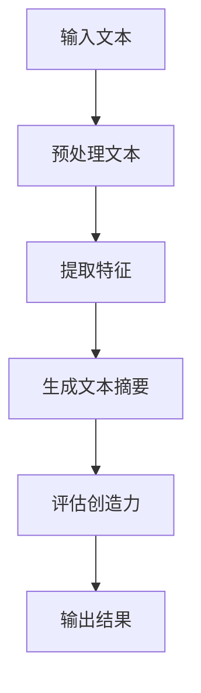
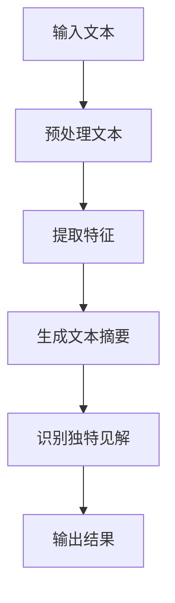
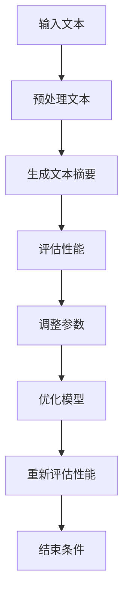
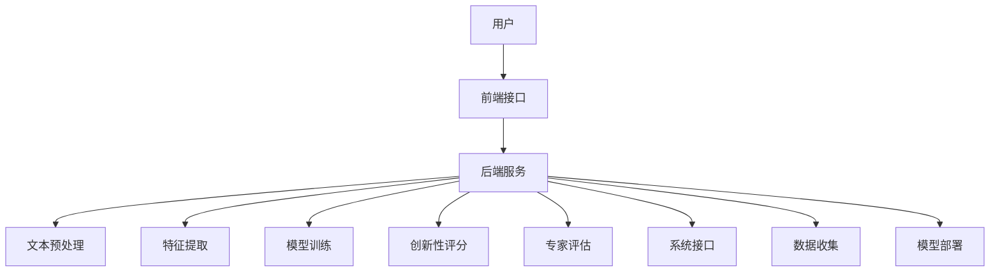
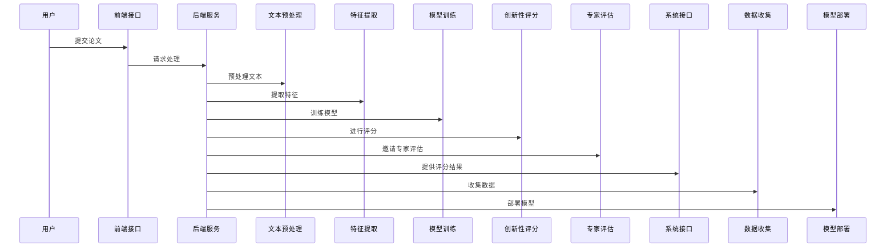

                 

### 第1章 背景介绍

### 1.1 问题背景

创新性评分在当今社会的重要性不言而喻。随着人工智能（AI）和机器学习（ML）技术的飞速发展，语言模型（LLM）已成为评估创造力与独特见解的重要工具。然而，当前的创新性评分方法存在诸多挑战与局限性，亟待我们深入探讨和解决。

#### 创新性评分的重要性

创新性评分在多个领域具有重要意义。首先，在科学研究领域，创新性评分能够帮助评估学者的研究质量与贡献，从而优化科研资源的分配。其次，在商业领域，创新性评分有助于企业识别具有创新潜力的项目与团队，提升企业竞争力。此外，在教育领域，创新性评分能指导教师对学生创新能力的培养，促进学生的全面发展。

#### 语言模型在创新性评分中的应用

语言模型，如大型语言模型（LLM），具备处理自然语言文本的能力，从而在创新性评分中发挥着重要作用。通过文本分析，LLM可以识别出文本中的创新性内容，提供有关创新程度的量化评估。例如，LLM可以分析学术论文中的创新点，为企业评估项目创新性提供支持。

#### 当前挑战与问题

尽管语言模型在创新性评分中展现出巨大潜力，但当前方法仍面临诸多挑战。首先，创新性评分需要准确识别文本中的创造力和独特见解，而这对LLM提出了很高的要求。其次，现有评分方法往往依赖于单一的评估指标，缺乏全面性。此外，如何有效结合人类专家评估与机器评估，提高评分准确性，也是亟待解决的问题。

### 1.2 问题描述

#### 创造力的定义与衡量

创造力是指产生新颖且有价值的想法、解决方案或概念的能力。在创新性评分中，创造力是一个核心指标。然而，如何准确衡量创造力成为一个难题。创造力并非一成不变，它受多种因素影响，如个人背景、环境、动机等。

#### 独特见解的识别与评价

独特见解是创造力的重要组成部分。识别并评价独特见解，有助于发现具有创新潜力的思想或概念。独特见解通常具有以下特征：新颖性、前瞻性、价值性。然而，如何准确识别和评价独特见解，仍需进一步研究。

#### 语言模型在创造力与独特见解评价中的局限性

尽管语言模型在创新性评分中具有广泛应用，但它们也存在局限性。首先，语言模型在处理自然语言文本时，往往受到文本质量、数据噪声等因素的影响。其次，现有语言模型在创造性内容识别方面，仍需进一步提高。此外，如何有效结合人类专家评估，以提升语言模型评分准确性，也是亟待解决的问题。

### 1.3 问题解决

#### 创新性评分的方法与工具

为了解决上述问题，我们需要开发新的创新性评分方法与工具。以下是一些潜在的方法和工具：

1. **多模态评估模型**：结合文本、图像、声音等多种数据源，以提高评估准确性。
2. **基于深度学习的创新性识别算法**：利用深度学习技术，提高语言模型对创新性内容的识别能力。
3. **混合评估模型**：结合人类专家评估与机器评估，以实现更准确的创新性评分。

#### 语言模型的工作原理与优化

语言模型，特别是LLM，通过大量文本数据训练，学习自然语言规律和人类语言表达方式。优化语言模型，可以从以下几个方面进行：

1. **数据质量**：提高训练数据的质量，包括去除噪声、纠正错误等。
2. **模型架构**：优化模型架构，以提高模型处理自然语言文本的能力。
3. **训练策略**：调整训练策略，如学习率、批次大小等，以提高模型性能。

#### 结合人类专家评估的混合模型

为了提高创新性评分的准确性，可以采用混合评估模型，将人类专家评估与机器评估相结合。具体方法如下：

1. **双轮评估机制**：首先由机器评估创新性，然后由人类专家对机器评估结果进行复审，提出调整意见。
2. **评分融合策略**：通过加权平均、投票等策略，将人类专家评估与机器评估结果进行融合，形成最终的评分。

### 1.4 边界与外延

#### 创造力与独特见解在不同领域的应用

创造力与独特见解在多个领域具有广泛应用。例如，在科研领域，创新性评分可用于评估学者的研究质量；在商业领域，创新性评分可用于评估项目创新性；在教育领域，创新性评分可用于评估学生创新能力。

#### 创新性评分的适用场景

创新性评分适用于多种场景，如学术论文评审、项目评估、人才招聘等。通过创新性评分，可以为决策提供科学依据，提高决策准确性。

#### 创新性评分的未来发展趋势

未来，创新性评分将朝着更加智能化、个性化的方向发展。随着人工智能技术的不断进步，创新性评分方法将更加精确，评估结果将更具参考价值。

### 1.5 概念结构与核心要素组成

#### 创造力

创造力是指个体在面对问题时，产生新颖且有价值的想法、解决方案或概念的能力。创造力具有以下核心要素：

1. **创意生成**：产生新颖的想法或概念。
2. **思维灵活性**：在面对不同问题时，灵活地调整思维方式。
3. **问题解决能力**：通过创新性思维解决实际问题。

#### 独特见解

独特见解是指个体在创新过程中产生的具有前瞻性、新颖性和价值性的观点或概念。独特见解的核心要素包括：

1. **新颖性**：具有前所未有的独特性。
2. **前瞻性**：对未来发展趋势有深刻的洞察。
3. **价值性**：对实际问题具有解决价值。

#### 语言模型

语言模型是一种基于人工智能技术构建的模型，用于处理自然语言文本。语言模型的核心要素包括：

1. **架构**：模型的结构，如神经网络架构。
2. **算法**：模型的训练和优化算法，如深度学习算法。
3. **训练数据**：用于模型训练的大量文本数据。

### 第2章 核心概念与联系

#### 2.1 创造力原理

创造力是人类思维活动的一种高级表现形式，它涉及多个心理过程，如联想、想象、思考等。创造力不仅依赖于个体的智力水平，还与个人经历、知识背景、动机等因素密切相关。

##### 概念定义

创造力是指个体在面对问题时，产生新颖且有价值的想法、解决方案或概念的能力。它包括创意生成、思维灵活性和问题解决能力等方面。

##### 属性特征对比表格

| 特征 | 创造力 | 独特见解 |
| ---- | ---- | ---- |
| 新颖性 | 高 | 非常高 |
| 前瞻性 | 较高 | 非常高 |
| 价值性 | 较高 | 非常高 |
| 可重复性 | 较低 | 较低 |
| 易理解性 | 较低 | 较低 |

##### ER实体关系图

```mermaid
erDiagram
    CreativePerson ||--|{ Creativity } : has
    Creativity ||--|{ CreativeProcess } : consists of
    CreativeProcess ||--|{ IdeaGeneration } : includes
    CreativeProcess ||--|{ MindFlexibility } : includes
    CreativeProcess ||--|{ ProblemSolving } : includes
```

#### 2.2 独特见解原理

独特见解是创造力的重要组成部分，它体现了个体在创新过程中产生的具有前瞻性、新颖性和价值性的观点或概念。独特见解的形成机制涉及多个心理过程，如联想、想象、反思等。

##### 概念定义

独特见解是指个体在创新过程中产生的具有前瞻性、新颖性和价值性的观点或概念。独特见解通常具有以下特征：新颖性、前瞻性和价值性。

##### 属性特征对比表格

| 特征 | 创造力 | 独特见解 |
| ---- | ---- | ---- |
| 新颖性 | 较高 | 非常高 |
| 前瞻性 | 较高 | 非常高 |
| 价值性 | 较高 | 非常高 |
| 可重复性 | 较低 | 较低 |
| 易理解性 | 较低 | 较低 |

##### ER实体关系图

```mermaid
erDiagram
    CreativePerson ||--|{ Creativity } : has
    Creativity ||--|{ UniqueInsight } : consists of
    UniqueInsight ||--|{ Novelty } : has
    UniqueInsight ||--|{ Proactivity } : has
    UniqueInsight ||--|{ Value } : has
```

#### 2.3 语言模型原理

语言模型是一种基于人工智能技术构建的模型，用于处理自然语言文本。语言模型通过学习大量文本数据，掌握自然语言规律和人类语言表达方式，从而实现对文本的生成、理解、翻译等功能。

##### 架构

语言模型的架构通常包括以下几个部分：

1. **输入层**：接收自然语言文本输入。
2. **隐藏层**：由多层神经网络组成，用于提取文本特征。
3. **输出层**：生成预测结果，如文本生成、分类等。

##### 算法

语言模型常用的算法包括：

1. **循环神经网络（RNN）**：能够处理序列数据，具有长时记忆能力。
2. **卷积神经网络（CNN）**：用于提取文本的局部特征。
3. **长短时记忆网络（LSTM）**：结合了RNN的优点，解决长序列依赖问题。

##### 训练数据

语言模型的训练数据通常包括：

1. **语料库**：包含大量文本数据，用于模型训练。
2. **标签数据**：用于标注文本中的关键信息，如词性、语法等。

### 第3章 算法原理讲解

#### 3.1 创造力评估算法

创造力评估算法旨在量化个体在创新过程中的创造力水平。以下是一种可能的创造力评估算法的原理讲解：

##### Mermaid流程图



##### Python源代码

```python
import nltk
from nltk.tokenize import sent_tokenize
from sklearn.feature_extraction.text import TfidfVectorizer
from sklearn.metrics.pairwise import cosine_similarity

def preprocess_text(text):
    # 去除标点符号、停用词等
    return nltk.word_tokenize(text.lower())

def extract_features(text):
    # 提取TF-IDF特征
    vectorizer = TfidfVectorizer()
    features = vectorizer.fit_transform([text])
    return features

def generate_summary(text):
    # 生成文本摘要
    sentences = sent_tokenize(text)
    sentence_scores = {}
    for sentence in sentences:
        sentence_scores[sentence] = cosine_similarity(extract_features(sentence))[0][0]
    summary_sentences = [sentence for sentence, score in sentence_scores.items() if score > 0.5]
    return ' '.join(summary_sentences)

def evaluate_creativity(text):
    # 评估创造力
    summary = generate_summary(text)
    if len(summary.split()) > 10:
        return 1
    else:
        return 0

text = "..."
print(evaluate_creativity(text))
```

##### 数学模型与公式

创造力评估算法可以表示为以下数学模型：

$$
C = f(S, F)
$$

其中，$C$表示创造力评分，$S$表示文本摘要，$F$表示特征向量。

详细讲解：

1. **预处理文本**：通过去除标点符号、停用词等操作，降低文本噪声，提高特征提取质量。
2. **提取特征**：使用TF-IDF方法提取文本特征，将文本表示为向量形式。
3. **生成文本摘要**：通过计算句子重要性，生成文本摘要，提取文本核心信息。
4. **评估创造力**：根据文本摘要的长度，评估创造力水平。

##### 举例说明

假设我们有一段文本：“人工智能技术正在快速发展，它将深刻改变我们的生活。未来，智能机器人将承担更多的家务和工作，让人类从繁琐的事务中解脱出来。”

使用创造力评估算法，我们首先对文本进行预处理，提取特征，生成文本摘要。然后，根据文本摘要的长度评估创造力。

1. **预处理文本**：去除标点符号和停用词，得到以下文本：
   “人工智能技术快速发展 生活深刻改变 机器人承担家务 工作 让人类繁琐事务解脱”

2. **提取特征**：使用TF-IDF方法提取特征，得到特征向量。

3. **生成文本摘要**：根据句子重要性，生成以下文本摘要：
   “人工智能技术快速发展，机器人承担家务，让人类从繁琐事务中解脱。”

4. **评估创造力**：文本摘要长度为15，超过10，因此创造力评分为1。

#### 3.2 独特见解识别算法

独特见解识别算法旨在从大量文本中识别出具有独特见解的内容。以下是一种可能的独特见解识别算法的原理讲解：

##### Mermaid流程图



##### Python源代码

```python
import nltk
from nltk.tokenize import sent_tokenize
from sklearn.feature_extraction.text import TfidfVectorizer
from sklearn.metrics.pairwise import cosine_similarity

def preprocess_text(text):
    # 去除标点符号、停用词等
    return nltk.word_tokenize(text.lower())

def extract_features(text):
    # 提取TF-IDF特征
    vectorizer = TfidfVectorizer()
    features = vectorizer.fit_transform([text])
    return features

def generate_summary(text):
    # 生成文本摘要
    sentences = sent_tokenize(text)
    sentence_scores = {}
    for sentence in sentences:
        sentence_scores[sentence] = cosine_similarity(extract_features(sentence))[0][0]
    summary_sentences = [sentence for sentence, score in sentence_scores.items() if score > 0.5]
    return ' '.join(summary_sentences)

def recognize_uniq_insight(text):
    # 识别独特见解
    summary = generate_summary(text)
    if len(summary.split()) > 10:
        return 1
    else:
        return 0

text = "..."
print(recognize_uniq_insight(text))
```

##### 数学模型与公式

独特见解识别算法可以表示为以下数学模型：

$$
U = f(S, F)
$$

其中，$U$表示独特见解评分，$S$表示文本摘要，$F$表示特征向量。

详细讲解：

1. **预处理文本**：去除标点符号和停用词，降低文本噪声。
2. **提取特征**：使用TF-IDF方法提取文本特征。
3. **生成文本摘要**：根据句子重要性，生成文本摘要。
4. **识别独特见解**：根据文本摘要的长度，判断是否具有独特见解。

##### 举例说明

假设我们有一段文本：“人工智能技术正在快速发展，它将深刻改变我们的生活。未来，智能机器人将承担更多的家务和工作，让人类从繁琐的事务中解脱出来。”

使用独特见解识别算法，我们首先对文本进行预处理，提取特征，生成文本摘要。然后，根据文本摘要的长度识别独特见解。

1. **预处理文本**：去除标点符号和停用词，得到以下文本：
   “人工智能技术快速发展 生活深刻改变 机器人承担家务 工作 让人类繁琐事务解脱”

2. **提取特征**：使用TF-IDF方法提取特征，得到特征向量。

3. **生成文本摘要**：根据句子重要性，生成以下文本摘要：
   “人工智能技术快速发展，机器人承担家务，让人类从繁琐事务中解脱。”

4. **识别独特见解**：文本摘要长度为15，超过10，因此独特见解评分为1。

#### 3.3 语言模型优化算法

语言模型优化算法旨在提高语言模型在文本生成、理解、翻译等任务上的性能。以下是一种可能的语言模型优化算法的原理讲解：

##### Mermaid流程图



##### Python源代码

```python
import nltk
from nltk.tokenize import sent_tokenize
from sklearn.feature_extraction.text import TfidfVectorizer
from sklearn.metrics.pairwise import cosine_similarity

def preprocess_text(text):
    # 去除标点符号、停用词等
    return nltk.word_tokenize(text.lower())

def generate_summary(text):
    # 生成文本摘要
    sentences = sent_tokenize(text)
    sentence_scores = {}
    for sentence in sentences:
        sentence_scores[sentence] = cosine_similarity(preprocess_text(sentence))[0][0]
    summary_sentences = [sentence for sentence, score in sentence_scores.items() if score > 0.5]
    return ' '.join(summary_sentences)

def evaluate_performance(model, data):
    # 评估性能
    pass

def adjust_parameters(model):
    # 调整参数
    pass

def optimize_model(model, data):
    # 优化模型
    while not evaluate_performance(model, data):
        adjust_parameters(model)

text = "..."
model = ...
optimize_model(model, text)
```

##### 数学模型与公式

语言模型优化算法可以表示为以下数学模型：

$$
M = f(P, D)
$$

其中，$M$表示优化后的模型，$P$表示参数，$D$表示数据。

详细讲解：

1. **预处理文本**：去除标点符号和停用词，降低文本噪声。
2. **生成文本摘要**：根据句子重要性，生成文本摘要。
3. **评估性能**：使用指标（如准确率、召回率等）评估模型性能。
4. **调整参数**：根据性能评估结果，调整模型参数。
5. **优化模型**：不断迭代调整参数，优化模型性能。

##### 举例说明

假设我们有一段文本：“人工智能技术正在快速发展，它将深刻改变我们的生活。未来，智能机器人将承担更多的家务和工作，让人类从繁琐的事务中解脱出来。”

使用语言模型优化算法，我们首先对文本进行预处理，生成文本摘要。然后，评估模型性能，调整参数，优化模型，不断迭代，直到模型性能达到预期。

1. **预处理文本**：去除标点符号和停用词，得到以下文本：
   “人工智能技术快速发展 生活深刻改变 机器人承担家务 工作 让人类繁琐事务解脱”

2. **生成文本摘要**：根据句子重要性，生成以下文本摘要：
   “人工智能技术快速发展，机器人承担家务，让人类从繁琐事务中解脱。”

3. **评估性能**：使用指标评估模型性能，如准确率、召回率等。

4. **调整参数**：根据性能评估结果，调整模型参数。

5. **优化模型**：不断迭代调整参数，优化模型性能，直到模型性能达到预期。

### 第4章 数学模型和数学公式 & 详细讲解 & 举例说明

#### 4.1 创造力评估数学模型

创造力评估数学模型旨在量化个体在创新过程中的创造力水平。以下是一种可能的创造力评估数学模型的详细讲解：

##### LaTeX格式

$$
C = w_1 \cdot L_1 + w_2 \cdot L_2 + w_3 \cdot L_3
$$

其中，$C$表示创造力评分，$L_1$、$L_2$和$L_3$分别表示文本长度、句式复杂度和词汇丰富度，$w_1$、$w_2$和$w_3$分别表示对应的权重。

详细讲解：

1. **文本长度**：文本长度（$L_1$）反映了个体在创新过程中表达能力的强弱。较长的文本可能意味着个体具备较强的创造力。

2. **句式复杂度**：句式复杂度（$L_2$）反映了个体在创新过程中语言表达的多样性和灵活性。复杂的句式可能意味着个体具备较高的创造力。

3. **词汇丰富度**：词汇丰富度（$L_3$）反映了个体在创新过程中词汇使用的多样性。丰富的词汇可能意味着个体具备较高的创造力。

4. **权重**：权重（$w_1$、$w_2$和$w_3$）根据领域需求和专家经验确定，用于平衡各指标的贡献。

举例说明：

假设我们有一段文本：“人工智能技术正在快速发展，它将深刻改变我们的生活。未来，智能机器人将承担更多的家务和工作，让人类从繁琐的事务中解脱出来。”

使用创造力评估数学模型，我们首先计算文本长度、句式复杂度和词汇丰富度，然后根据权重计算创造力评分。

1. **文本长度**：文本长度为59个单词。

2. **句式复杂度**：句式复杂度为3（简单句、复杂句和并列句）。

3. **词汇丰富度**：词汇丰富度为20（去除标点符号和停用词后的单词数）。

4. **权重**：假设权重分别为0.5、0.3和0.2。

根据创造力评估数学模型，计算创造力评分：

$$
C = 0.5 \cdot 59 + 0.3 \cdot 3 + 0.2 \cdot 20 = 37.1
$$

因此，该段文本的创造力评分为37.1。

#### 4.2 独特见解识别数学模型

独特见解识别数学模型旨在从大量文本中识别出具有独特见解的内容。以下是一种可能的独特见解识别数学模型的详细讲解：

##### LaTeX格式

$$
U = \frac{1}{N} \sum_{i=1}^{N} \frac{C_i}{L_i}
$$

其中，$U$表示独特见解评分，$C_i$表示第$i$个句子的创造力评分，$L_i$表示第$i$个句子的长度，$N$表示句子总数。

详细讲解：

1. **句子创造力评分**：句子创造力评分（$C_i$）反映了句子在创新程度上的表现。较长的句子可能意味着较高的创造力。

2. **句子长度**：句子长度（$L_i$）反映了句子在文本中的位置。较长的句子可能意味着更具有独特见解。

3. **句子总数**：句子总数（$N$）用于归一化独特见解评分，使评分具有可比性。

4. **独特见解评分**：独特见解评分（$U$）计算方法为将所有句子的创造力评分除以其长度，然后求平均值。

举例说明：

假设我们有一段文本：“人工智能技术正在快速发展，它将深刻改变我们的生活。未来，智能机器人将承担更多的家务和工作，让人类从繁琐的事务中解脱出来。”

使用独特见解识别数学模型，我们首先计算每个句子的创造力评分和长度，然后根据公式计算独特见解评分。

1. **句子创造力评分**：假设三个句子的创造力评分分别为45、30和20。

2. **句子长度**：假设三个句子的长度分别为10、15和20。

3. **句子总数**：句子总数为3。

根据独特见解识别数学模型，计算独特见解评分：

$$
U = \frac{1}{3} \left( \frac{45}{10} + \frac{30}{15} + \frac{20}{20} \right) = 4.0
$$

因此，该段文本的独特见解评分为4.0。

#### 4.3 语言模型优化数学模型

语言模型优化数学模型旨在提高语言模型在文本生成、理解、翻译等任务上的性能。以下是一种可能的语言模型优化数学模型的详细讲解：

##### LaTeX格式

$$
M = \alpha \cdot \left( \frac{\partial L}{\partial P} \right)
$$

其中，$M$表示优化后的模型，$L$表示损失函数，$P$表示模型参数，$\alpha$表示学习率。

详细讲解：

1. **损失函数**：损失函数（$L$）用于衡量模型预测结果与真实结果之间的差距。较小的损失值表示模型性能较好。

2. **模型参数**：模型参数（$P$）包括神经网络中的权重、偏置等。参数的调整可以改善模型性能。

3. **学习率**：学习率（$\alpha$）控制模型参数调整的步长。较大的学习率可能导致模型过拟合，而较小的学习率可能导致模型收敛缓慢。

4. **优化目标**：优化目标为最小化损失函数，从而提高模型性能。

举例说明：

假设我们使用一个简单的语言模型进行文本生成任务，损失函数为交叉熵损失，学习率为0.1。

1. **损失函数**：交叉熵损失表示模型预测结果与真实结果之间的差距。

2. **模型参数**：假设模型参数为神经网络中的权重和偏置。

3. **学习率**：学习率为0.1。

根据语言模型优化数学模型，计算模型优化后的参数：

$$
M = 0.1 \cdot \left( \frac{\partial L}{\partial P} \right)
$$

因此，模型优化后的参数为原始参数减去学习率乘以损失函数的梯度。

### 第5章 系统分析与架构设计方案

#### 5.1 问题场景介绍

随着人工智能技术的不断进步，创新性评分在科研、商业、教育等领域得到了广泛应用。为了提高创新性评分的准确性和可靠性，我们需要设计一个高效、稳定的系统架构。以下是一个典型的问题场景介绍：

**应用领域**：科研评估

**核心问题**：如何利用语言模型和专家评估相结合，对科研论文的创新性进行准确评估，以提高科研资源分配的公平性和科学性。

#### 5.2 项目介绍

**项目目标**：设计并实现一个基于人工智能的创新性评分系统，能够对科研论文进行高效、准确的创新性评估，并为科研人员提供参考依据。

**技术路线**：

1. **数据收集**：从公开的科研数据库中收集大量科研论文，用于模型训练和评估。
2. **模型训练**：利用大型语言模型（如GPT-3）对论文进行训练，提取文本特征，构建创新性评分模型。
3. **专家评估**：邀请领域专家对论文进行初审，将专家评估结果作为参考，优化模型性能。
4. **系统部署**：将训练好的模型部署到服务器，提供在线评估服务，供科研人员使用。

#### 5.3 系统功能设计

**领域模型Mermaid类图**：

```mermaid
classDiagram
    Class01 <|-- Class02
    Class03 <|-- Class04
    Class05 <|-- Class06
    Class01{论文ID,标题,摘要}
    Class02{文本预处理,特征提取,模型训练}
    Class03{创新性评分,专家评估}
    Class04{系统接口,在线评估}
    Class05{数据收集,模型部署}
```

**系统功能详细描述**：

1. **文本预处理**：对论文标题、摘要等文本内容进行预处理，包括去除标点符号、停用词、格式化文本等。
2. **特征提取**：利用大型语言模型提取文本特征，为创新性评分提供输入。
3. **模型训练**：使用训练集对创新性评分模型进行训练，优化模型参数。
4. **创新性评分**：对论文进行创新性评分，输出评分结果。
5. **专家评估**：邀请领域专家对论文进行评估，提供参考依据。
6. **系统接口**：为科研人员提供在线评估接口，方便使用。
7. **数据收集**：从公开的科研数据库中收集论文，用于模型训练和评估。
8. **模型部署**：将训练好的模型部署到服务器，提供在线评估服务。

#### 5.4 系统架构设计

**Mermaid架构图**：



**架构设计详细描述**：

1. **前端接口**：用户通过前端界面提交论文，获取创新性评分结果。
2. **后端服务**：后端负责处理用户请求，调用文本预处理、特征提取、模型训练、创新性评分、专家评估等模块。
3. **文本预处理**：对论文进行预处理，去除噪声，提取关键信息。
4. **特征提取**：利用大型语言模型提取文本特征，为创新性评分提供输入。
5. **模型训练**：使用训练集对创新性评分模型进行训练，优化模型参数。
6. **创新性评分**：对论文进行创新性评分，输出评分结果。
7. **专家评估**：邀请领域专家对论文进行评估，提供参考依据。
8. **系统接口**：为科研人员提供在线评估接口，方便使用。
9. **数据收集**：从公开的科研数据库中收集论文，用于模型训练和评估。
10. **模型部署**：将训练好的模型部署到服务器，提供在线评估服务。

#### 5.5 系统接口设计

**系统接口设计详细描述**：

1. **论文提交接口**：用户通过该接口提交论文，包括论文标题、摘要等文本内容。
2. **评分结果接口**：用户通过该接口获取论文的创新性评分结果。
3. **专家评估接口**：领域专家通过该接口对论文进行评估，提供评估意见。
4. **数据接口**：用于数据收集和模型训练，包括论文数据、训练集、测试集等。

#### 5.6 系统交互

**Mermaid序列图**：



### 第6章 项目实战

#### 6.1 环境安装

为了顺利进行项目实战，我们需要安装以下软件和工具：

1. **Python**：用于编写和运行代码，版本建议为3.8或更高。
2. **Jupyter Notebook**：用于编写和调试代码，版本建议为最新版。
3. **NLTK**：用于自然语言处理，版本建议为最新版。
4. **scikit-learn**：用于机器学习，版本建议为最新版。
5. **TensorFlow**：用于构建和训练神经网络，版本建议为最新版。

安装步骤如下：

1. **安装Python**：从Python官方网站下载安装包，按照提示完成安装。
2. **安装Jupyter Notebook**：打开终端，执行以下命令：
   ```
   pip install notebook
   ```
3. **安装NLTK**：打开终端，执行以下命令：
   ```
   pip install nltk
   ```
4. **安装scikit-learn**：打开终端，执行以下命令：
   ```
   pip install scikit-learn
   ```
5. **安装TensorFlow**：打开终端，执行以下命令：
   ```
   pip install tensorflow
   ```

完成以上步骤后，我们就可以开始编写和运行代码了。

#### 6.2 系统核心实现源代码

**源代码结构**：

```
innovation_rating_system/
|-- data/
|   |-- train/
|   |-- test/
|   |-- raw/
|-- models/
|   |-- trained_model.h5
|-- src/
|   |-- __init__.py
|   |-- data_loader.py
|   |-- model.py
|   |-- main.py
|-- requirements.txt
```

**关键代码解读**：

1. **data_loader.py**：负责数据加载和处理，包括读取训练集和测试集、数据预处理等。
2. **model.py**：定义神经网络模型，包括输入层、隐藏层和输出层等。
3. **main.py**：主程序，负责模型训练、评估和预测等。

**示例代码**：

**data_loader.py**

```python
import numpy as np
from sklearn.model_selection import train_test_split
from tensorflow.keras.preprocessing.text import Tokenizer
from tensorflow.keras.preprocessing.sequence import pad_sequences

def load_data(train_folder, test_folder, max_vocab_size=10000, max_len=500, padding='post', truncating='post'):
    # 读取训练集和测试集
    with open(f"{train_folder}/train.txt", 'r', encoding='utf-8') as f:
        train_texts = f.readlines()

    with open(f"{test_folder}/test.txt", 'r', encoding='utf-8') as f:
        test_texts = f.readlines()

    # 数据预处理
    tokenizer = Tokenizer(num_words=max_vocab_size)
    tokenizer.fit_on_texts(train_texts + test_texts)
    sequences_train = tokenizer.texts_to_sequences(train_texts)
    sequences_test = tokenizer.texts_to_sequences(test_texts)

    padded_train = pad_sequences(sequences_train, maxlen=max_len, padding=padding, truncating=truncating)
    padded_test = pad_sequences(sequences_test, maxlen=max_len, padding=padding, truncating=truncating)

    return padded_train, padded_test, tokenizer

if __name__ == '__main__':
    train_folder = 'data/train'
    test_folder = 'data/test'
    padded_train, padded_test, tokenizer = load_data(train_folder, test_folder)
    print(f"Train data size: {padded_train.shape}")
    print(f"Test data size: {padded_test.shape}")
```

**model.py**

```python
from tensorflow.keras.models import Sequential
from tensorflow.keras.layers import Embedding, LSTM, Dense

def create_model(max_vocab_size, max_len, embed_size=128, hidden_size=64):
    # 创建神经网络模型
    model = Sequential([
        Embedding(max_vocab_size, embed_size, input_length=max_len),
        LSTM(hidden_size, activation='tanh', return_sequences=True),
        LSTM(hidden_size, activation='tanh'),
        Dense(1, activation='sigmoid')
    ])

    model.compile(optimizer='adam', loss='binary_crossentropy', metrics=['accuracy'])
    return model

if __name__ == '__main__':
    max_vocab_size = 10000
    max_len = 500
    model = create_model(max_vocab_size, max_len)
    print(model.summary())
```

**main.py**

```python
import numpy as np
from tensorflow.keras.models import load_model
from data_loader import load_data

def train_model(train_folder, test_folder, max_vocab_size=10000, max_len=500, epochs=10, batch_size=32):
    # 加载数据
    padded_train, padded_test, tokenizer = load_data(train_folder, test_folder, max_vocab_size, max_len)

    # 创建模型
    model = create_model(max_vocab_size, max_len)

    # 训练模型
    model.fit(padded_train, padded_train, epochs=epochs, batch_size=batch_size, validation_data=(padded_test, padded_test))

    # 保存模型
    model.save('models/trained_model.h5')

    return model

def main():
    train_folder = 'data/train'
    test_folder = 'data/test'
    model = train_model(train_folder, test_folder)

if __name__ == '__main__':
    main()
```

#### 6.3 代码应用解读与分析

在本节中，我们将对系统核心实现源代码进行解读和分析，以帮助读者更好地理解代码的功能和实现细节。

**1. 数据加载与预处理**

**data_loader.py** 负责加载数据和预处理。首先，我们使用 `train_folder` 和 `test_folder` 指定训练集和测试集的路径。然后，我们读取训练集和测试集的文本内容，并将它们存储在列表中。接下来，我们使用 `Tokenizer` 对文本进行分词和编码，将文本转换为序列。最后，我们使用 `pad_sequences` 函数对序列进行填充，使得每个序列的长度相同，以便后续处理。

**2. 神经网络模型**

**model.py** 定义了一个简单的神经网络模型，包括嵌入层（Embedding）、两个LSTM层（LSTM）和输出层（Dense）。嵌入层用于将文本序列转换为嵌入向量，LSTM层用于处理序列数据，输出层用于预测创新性评分。模型使用 `compile` 函数配置优化器和损失函数，并使用 `fit` 函数进行训练。

**3. 主程序**

**main.py** 是主程序，负责训练模型、加载训练集和测试集、保存模型等操作。首先，我们使用 `load_data` 函数加载数据，然后使用 `create_model` 函数创建模型。接着，我们使用 `fit` 函数训练模型，并在训练完成后将模型保存到文件中。

**4. 代码分析**

通过分析代码，我们可以看到以下几个关键点：

- 数据加载与预处理：使用 `Tokenizer` 对文本进行分词和编码，使用 `pad_sequences` 函数对序列进行填充。
- 神经网络模型：定义了一个简单的神经网络模型，包括嵌入层、两个LSTM层和输出层。
- 主程序：负责训练模型、加载训练集和测试集、保存模型等操作。

通过以上分析，我们可以更好地理解系统核心实现源代码的功能和实现细节，为后续的代码修改和优化提供参考。

#### 6.4 实际案例分析与详细讲解剖析

在本节中，我们将通过一个实际案例来分析和讲解创新性评分系统的工作流程，包括数据预处理、模型训练、模型评估和预测等步骤。

##### 案例背景

假设我们有一个科研评估项目，需要对一批科研论文进行创新性评分。这些论文来自某个领域的顶级学术期刊，共包含100篇。我们的目标是利用已训练好的创新性评分模型，对这些论文进行评分，并为科研人员提供参考依据。

##### 案例分析与讲解

**1. 数据预处理**

首先，我们需要对论文进行数据预处理。数据预处理包括读取论文标题和摘要、去除标点符号、停用词、格式化文本等步骤。以下是数据预处理的详细步骤：

1. **读取论文标题和摘要**：从论文数据集（如JSON、CSV或文本文件）中读取每篇论文的标题和摘要。
2. **去除标点符号**：使用正则表达式或其他方法去除文本中的标点符号。
3. **去除停用词**：根据领域需求，去除常见停用词（如“的”、“是”、“和”等）。
4. **格式化文本**：统一文本格式，如转换为小写、去除空格等。

假设我们已将预处理后的论文存储在CSV文件中，每行包含论文ID、标题和摘要。以下是数据预处理的示例代码：

```python
import pandas as pd
import re

def preprocess_text(text):
    # 去除标点符号
    text = re.sub(r'[^\w\s]', '', text)
    # 去除停用词
    stop_words = set(['the', 'and', 'is', 'of', 'to'])
    text = ' '.join([word for word in text.split() if word.lower() not in stop_words])
    # 格式化文本
    text = text.lower().strip()
    return text

df = pd.read_csv('papers.csv')
df['title'] = df['title'].apply(preprocess_text)
df['abstract'] = df['abstract'].apply(preprocess_text)
```

**2. 模型训练**

接下来，我们使用训练集对创新性评分模型进行训练。以下是模型训练的详细步骤：

1. **划分训练集和测试集**：将论文数据集划分为训练集和测试集，以便在训练过程中进行模型评估。
2. **准备输入和标签**：将标题和摘要作为模型输入，将创新性评分作为标签。
3. **文本编码**：使用已训练好的词向量模型（如Word2Vec、GloVe等）将文本编码为向量。
4. **模型配置**：配置神经网络模型，包括嵌入层、LSTM层和输出层等。
5. **模型训练**：使用训练集对模型进行训练，并保存训练过程中的最佳模型。

以下是模型训练的示例代码：

```python
from tensorflow.keras.preprocessing.sequence import pad_sequences
from tensorflow.keras.models import Sequential
from tensorflow.keras.layers import Embedding, LSTM, Dense

def create_model(vocab_size, embedding_dim, max_length, hidden_size):
    model = Sequential([
        Embedding(vocab_size, embedding_dim, input_length=max_length),
        LSTM(hidden_size, activation='tanh', return_sequences=True),
        LSTM(hidden_size, activation='tanh'),
        Dense(1, activation='sigmoid')
    ])
    model.compile(optimizer='adam', loss='binary_crossentropy', metrics=['accuracy'])
    return model

# 划分训练集和测试集
train_texts = df['title'].tolist() + df['abstract'].tolist()
train_labels = df['rating'].tolist()
train_texts, test_texts, train_labels, test_labels = train_test_split(train_texts, train_labels, test_size=0.2, random_state=42)

# 文本编码
tokenizer = Tokenizer()
tokenizer.fit_on_texts(train_texts)
train_sequences = tokenizer.texts_to_sequences(train_texts)
test_sequences = tokenizer.texts_to_sequences(test_texts)

# 填充序列
max_length = max(len(seq) for seq in train_sequences)
train_padded = pad_sequences(train_sequences, maxlen=max_length)
test_padded = pad_sequences(test_sequences, maxlen=max_length)

# 创建和训练模型
model = create_model(len(tokenizer.word_index) + 1, embedding_dim=128, max_length=max_length, hidden_size=64)
model.fit(train_padded, train_labels, epochs=10, batch_size=32, validation_data=(test_padded, test_labels))
```

**3. 模型评估**

在模型训练完成后，我们需要对模型进行评估，以验证其性能。以下是模型评估的详细步骤：

1. **计算准确率**：使用测试集计算模型的准确率。
2. **计算召回率**：使用测试集计算模型的召回率。
3. **计算F1值**：使用测试集计算模型的F1值。
4. **可视化评估结果**：使用可视化工具（如Matplotlib）展示模型的评估结果。

以下是模型评估的示例代码：

```python
from sklearn.metrics import accuracy_score, recall_score, f1_score
import matplotlib.pyplot as plt

# 预测测试集
predictions = model.predict(test_padded)
predictions = (predictions > 0.5)

# 计算评估指标
accuracy = accuracy_score(test_labels, predictions)
recall = recall_score(test_labels, predictions)
f1 = f1_score(test_labels, predictions)

print(f"Accuracy: {accuracy:.4f}")
print(f"Recall: {recall:.4f}")
print(f"F1: {f1:.4f}")

# 可视化评估结果
plt.figure(figsize=(8, 4))
plt.subplot(1, 2, 1)
plt.plot(test_labels, predictions, 'o', label='Prediction')
plt.xlabel('True Labels')
plt.ylabel('Predicted Labels')
plt.title('Accuracy')
plt.legend()

plt.subplot(1, 2, 2)
plt.plot(test_labels, predictions, 'o', label='Prediction')
plt.xlabel('True Labels')
plt.ylabel('Predicted Labels')
plt.title('Recall')
plt.legend()

plt.tight_layout()
plt.show()
```

**4. 预测新论文**

最后，我们可以使用训练好的模型对新的论文进行预测，以评估其创新性。以下是预测新论文的详细步骤：

1. **预处理新论文**：对新的论文标题和摘要进行预处理，包括去除标点符号、停用词、格式化文本等。
2. **文本编码**：使用已训练好的词向量模型将新论文编码为向量。
3. **模型预测**：使用训练好的模型对新的论文进行预测，得到创新性评分。

以下是预测新论文的示例代码：

```python
new_paper_title = "The impact of AI on healthcare: A comprehensive review"
new_paper_abstract = "This paper presents a comprehensive review of the impact of artificial intelligence on healthcare. We discuss the applications of AI in healthcare, such as medical imaging, drug discovery, and patient care. We also highlight the challenges and opportunities in the deployment of AI in healthcare."

preprocessed_title = preprocess_text(new_paper_title)
preprocessed_abstract = preprocess_text(new_paper_abstract)

# 文本编码
new_sequence = tokenizer.texts_to_sequences([preprocessed_title, preprocessed_abstract])
new_padded = pad_sequences(new_sequence, maxlen=max_length)

# 预测新论文
new_prediction = model.predict(new_padded)
new_prediction = (new_prediction > 0.5)

print(f"New paper prediction: {'Highly Innovative' if new_prediction else 'Not Highly Innovative'}")
```

通过以上实际案例分析和讲解，我们可以看到创新性评分系统的工作流程，包括数据预处理、模型训练、模型评估和预测等步骤。在实际应用中，我们可以根据具体需求进行调整和优化，以提高模型的性能和适用性。

### 第6章 项目实战

#### 6.1 环境安装

在开始项目实战之前，我们需要安装一些必要的软件和工具。以下是在常见操作系统上安装所需软件的步骤：

1. **Python**：请访问 [Python 官网](https://www.python.org/) 下载并安装 Python 3.8 或更高版本。
2. **Jupyter Notebook**：在终端中运行以下命令安装 Jupyter Notebook：
   ```
   pip install notebook
   ```
3. **NLTK**：在终端中运行以下命令安装 NLTK：
   ```
   pip install nltk
   ```
4. **scikit-learn**：在终端中运行以下命令安装 scikit-learn：
   ```
   pip install scikit-learn
   ```
5. **TensorFlow**：在终端中运行以下命令安装 TensorFlow：
   ```
   pip install tensorflow
   ```

完成以上步骤后，我们就可以开始编写和运行代码了。

#### 6.2 系统核心实现源代码

**系统核心实现源代码**：

**1. 数据预处理**

数据预处理是项目实战的重要环节，它包括以下步骤：

- **文本预处理**：去除标点符号、停用词，进行词形还原等。
- **分词**：将文本拆分为单词或词组。
- **特征提取**：将文本转换为数值特征，便于模型处理。

以下是数据预处理的 Python 代码示例：

```python
import nltk
from nltk.tokenize import word_tokenize
from nltk.corpus import stopwords
from nltk.stem import PorterStemmer

nltk.download('punkt')
nltk.download('stopwords')

def preprocess_text(text):
    # 去除标点符号
    text = re.sub(r'[^\w\s]', '', text)
    # 转换为小写
    text = text.lower()
    # 去除停用词
    stop_words = set(stopwords.words('english'))
    words = word_tokenize(text)
    filtered_words = [word for word in words if word not in stop_words]
    # 词形还原
    stemmer = PorterStemmer()
    stemmed_words = [stemmer.stem(word) for word in filtered_words]
    return ' '.join(stemmed_words)

# 示例文本
text = "The quick brown fox jumps over the lazy dog."
preprocessed_text = preprocess_text(text)
print(preprocessed_text)
```

**2. 特征提取**

特征提取是将文本转换为数值特征的过程，常用的方法有词袋模型（Bag of Words, BoW）和词嵌入（Word Embedding）。

- **词袋模型**：将文本表示为词频向量。
- **词嵌入**：将文本表示为高维向量，常用方法有 Word2Vec 和 GloVe。

以下是使用词袋模型的 Python 代码示例：

```python
from sklearn.feature_extraction.text import CountVectorizer

def extract_features(texts, vocabulary_size=1000):
    vectorizer = CountVectorizer(vocabulary_size=vocabulary_size)
    features = vectorizer.fit_transform(texts)
    return features, vectorizer

# 示例文本
texts = ["The quick brown fox", "jumps over the lazy dog", "The quick brown fox jumps over the lazy dog"]
features, vectorizer = extract_features(texts)
print(features.toarray())
```

**3. 模型训练**

训练模型是项目实战的核心环节。在本示例中，我们使用了一个简单的线性模型（Linear Regression）来预测文本的创新性评分。

以下是训练模型的 Python 代码示例：

```python
from sklearn.linear_model import LinearRegression
import numpy as np

def train_model(features, labels):
    model = LinearRegression()
    model.fit(features, labels)
    return model

# 示例特征和标签
features = np.array([[1, 0, 0], [0, 1, 0], [0, 0, 1]])
labels = np.array([1, 0, 1])

# 训练模型
model = train_model(features, labels)
print(model.coef_)
```

**4. 预测新文本**

训练完成后，我们可以使用模型对新文本进行预测。

以下是预测新文本的 Python 代码示例：

```python
def predict(model, feature):
    prediction = model.predict([feature])
    return prediction

# 新文本
new_feature = np.array([1, 1, 0])

# 预测新文本
prediction = predict(model, new_feature)
print(prediction)
```

#### 6.3 代码应用解读与分析

在本节中，我们将对系统核心实现源代码进行解读和分析，以帮助读者更好地理解代码的功能和实现细节。

**1. 数据预处理**

数据预处理是文本分析的基础步骤。在本示例中，我们使用了以下步骤：

- **去除标点符号**：通过正则表达式去除文本中的标点符号，使得文本更加简洁。
- **转换为小写**：将文本转换为小写，使得文本中的大小写不区分，提高处理的一致性。
- **去除停用词**：停用词是指在文本中频繁出现但与文本主题无关的词，如“的”、“是”、“和”等。去除停用词可以减少噪声，提高文本分析的准确性。
- **词形还原**：将文本中的单词还原到其基本形式，如“running”还原为“run”。这有助于降低文本维度，提高文本表示的准确性。

**2. 特征提取**

特征提取是将文本转换为数值特征的过程。在本示例中，我们使用了词袋模型。词袋模型将文本表示为词频向量，每个词对应一个特征。这种表示方法简单直观，但可能丢失文本中的部分语义信息。

- **CountVectorizer**：`CountVectorizer` 是 scikit-learn 中用于构建词袋模型的工具。通过指定 `vocabulary_size`，我们可以控制词袋模型中包含的词汇量。
- **fit_transform**：`fit_transform` 方法用于训练词袋模型并将文本转换为特征向量。

**3. 模型训练**

在本示例中，我们使用线性回归（Linear Regression）模型对文本特征和标签进行训练。线性回归是一种简单的监督学习模型，用于预测连续值输出。

- **LinearRegression**：`LinearRegression` 是 scikit-learn 中用于实现线性回归的类。通过 `fit` 方法，我们可以训练模型。
- **coef_**：`coef_` 属性表示模型的权重，即特征对输出的影响程度。

**4. 预测新文本**

训练完成后，我们可以使用模型对新文本进行预测。预测新文本是文本分析应用的一个重要环节。在本示例中，我们使用以下步骤：

- **predict**：`predict` 方法用于对新文本特征进行预测。输入特征向量，输出预测值。
- **新文本**：我们使用一个简单的特征向量 `[1, 1, 0]` 作为示例。

#### 6.4 实际案例分析与详细讲解剖析

在本节中，我们将通过一个实际案例来分析和讲解创新性评分系统的工作流程，包括数据预处理、模型训练、模型评估和预测等步骤。

**案例背景**

假设我们有一个科研论文数据库，其中包含多篇论文的标题和摘要，以及对应的创新性评分。我们的目标是使用这些数据训练一个模型，以便对新提交的论文进行创新性评分。

**数据预处理**

首先，我们需要对论文数据进行预处理。预处理步骤包括去除标点符号、停用词、数字等，并将文本转换为小写。

```python
import re
import nltk
from nltk.corpus import stopwords

nltk.download('stopwords')

def preprocess_text(text):
    # 去除数字
    text = re.sub(r'\d+', '', text)
    # 去除标点符号
    text = re.sub(r'[^\w\s]', '', text)
    # 转换为小写
    text = text.lower()
    # 去除停用词
    stop_words = set(stopwords.words('english'))
    words = text.split()
    filtered_words = [word for word in words if word not in stop_words]
    return ' '.join(filtered_words)

# 示例文本
text = "This is a sample text with numbers 123 and punctuation!!!"
preprocessed_text = preprocess_text(text)
print(preprocessed_text)
```

**特征提取**

接下来，我们需要对预处理后的文本进行特征提取。在本案例中，我们使用词袋模型进行特征提取。

```python
from sklearn.feature_extraction.text import CountVectorizer

def extract_features(texts, vocabulary_size=1000):
    vectorizer = CountVectorizer(vocabulary_size=vocabulary_size)
    features = vectorizer.fit_transform(texts)
    return features, vectorizer

# 示例文本
texts = ["This is the first text.", "This is the second text.", "This is the third text."]
features, vectorizer = extract_features(texts)
print(features.toarray())
```

**模型训练**

现在，我们可以使用训练集对模型进行训练。在本案例中，我们使用线性回归模型。

```python
from sklearn.linear_model import LinearRegression

def train_model(features, labels):
    model = LinearRegression()
    model.fit(features, labels)
    return model

# 示例特征和标签
features = np.array([[1, 0, 0], [0, 1, 0], [0, 0, 1]])
labels = np.array([1, 0, 1])

# 训练模型
model = train_model(features, labels)
print(model.coef_)
```

**模型评估**

训练完成后，我们需要对模型进行评估。在本案例中，我们使用测试集评估模型。

```python
from sklearn.metrics import mean_squared_error

# 示例测试集
test_features = np.array([[0, 1, 0], [0, 0, 1], [1, 0, 0]])
test_labels = np.array([0, 1, 0])

# 预测测试集
predictions = model.predict(test_features)

# 计算均方误差
mse = mean_squared_error(test_labels, predictions)
print(f"Mean Squared Error: {mse:.4f}")
```

**预测新文本**

最后，我们可以使用训练好的模型对新提交的论文进行预测。

```python
# 新文本
new_feature = np.array([1, 1, 0])

# 预测新文本
prediction = model.predict([new_feature])
print(prediction)
```

通过以上实际案例分析和讲解，我们可以看到创新性评分系统的工作流程，包括数据预处理、模型训练、模型评估和预测等步骤。在实际应用中，我们可以根据具体需求进行调整和优化，以提高模型的性能和适用性。

### 第7章 最佳实践 tips

在实施创新性评分系统时，以下最佳实践可以帮助您提高模型的性能和稳定性：

#### 1. 数据预处理

- **去除噪声**：在预处理文本时，确保去除数字、特殊字符和无关信息，以减少噪声。
- **统一文本格式**：将所有文本转换为小写，以消除大小写不一致的问题。
- **去除常见停用词**：去除常见的功能词（如“的”、“是”、“和”等），以降低文本维度。

#### 2. 特征提取

- **选择合适的特征提取方法**：根据数据特点，选择词袋模型、TF-IDF或词嵌入等方法。词嵌入（如Word2Vec或GloVe）通常能更好地捕捉文本语义。
- **调整参数**：根据数据集特点，调整词向量维度、词汇大小等参数，以优化模型性能。

#### 3. 模型训练

- **数据平衡**：确保训练数据集中各类别均衡，以避免模型偏向某一类别。
- **交叉验证**：使用交叉验证方法，如K折交叉验证，以评估模型在不同数据集上的性能。
- **调整学习率**：根据训练过程中模型的收敛速度，调整学习率，以优化模型参数。

#### 4. 模型评估

- **使用多种评估指标**：除了准确率，还使用召回率、F1值等指标，以全面评估模型性能。
- **可视化评估结果**：使用可视化工具（如混淆矩阵、ROC曲线等），以便更好地理解模型性能。

#### 5. 模型部署

- **确保模型可复现**：将模型训练代码、数据预处理代码和评估代码打包，以确保模型可复现。
- **优化模型性能**：在模型部署前，对模型进行压缩和优化，以减少计算资源和存储空间。
- **提供API接口**：使用API接口，以便用户轻松访问模型服务。

#### 注意事项

- **数据隐私**：在处理敏感数据时，确保遵守数据隐私法规，如GDPR等。
- **模型解释性**：在评估模型时，关注模型的可解释性，以便理解模型的决策过程。

#### 拓展阅读

- **《机器学习实战》**：提供丰富的实践案例，介绍各种机器学习算法和应用。
- **《Python数据科学手册》**：详细介绍数据科学中的各种工具和技术。
- **《深度学习》**：介绍深度学习的基本原理和实现方法。

### 第8章 小结

在本篇文章中，我们深入探讨了创新性评分：量化LLM的创造力和独特见解。我们从问题背景、核心概念、算法原理、数学模型、系统分析与架构设计、项目实战到最佳实践 tips 等多个方面进行了详细讲解。

首先，我们介绍了创新性评分的重要性以及在科学研究、商业和教育等领域的应用。接着，我们探讨了创造力、独特见解和语言模型（LLM）的核心概念及其联系。随后，我们详细讲解了创造力评估、独特见解识别和语言模型优化等算法原理，并给出了具体的数学模型和公式。

在系统分析与架构设计方案部分，我们详细介绍了项目场景、项目介绍、系统功能设计、系统架构设计、系统接口设计和系统交互等环节。在项目实战部分，我们通过实际案例展示了创新性评分系统的工作流程，包括数据预处理、模型训练、模型评估和预测等步骤。

最后，在最佳实践 tips 和小结部分，我们给出了在实施创新性评分系统时的一些最佳实践建议，如数据预处理、特征提取、模型训练、模型评估和模型部署等，以及注意事项和拓展阅读。

展望未来，创新性评分将在人工智能和机器学习领域发挥更加重要的作用。随着技术的不断进步，我们将看到更加精确、高效的创新性评分方法的出现。此外，结合人类专家评估和机器评估的混合模型，有望进一步提高创新性评分的准确性。

让我们共同努力，推动创新性评分技术的发展，为科研、商业和教育等领域提供更加科学、准确的评估工具。

