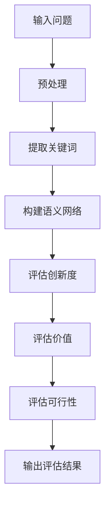
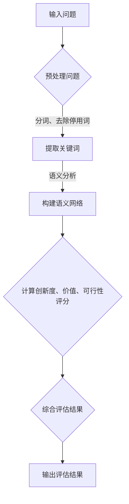
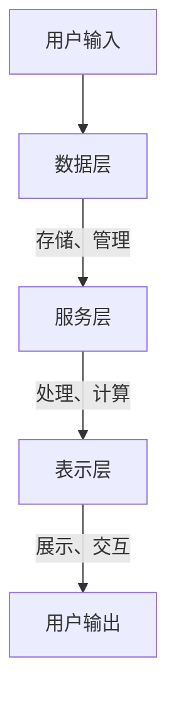
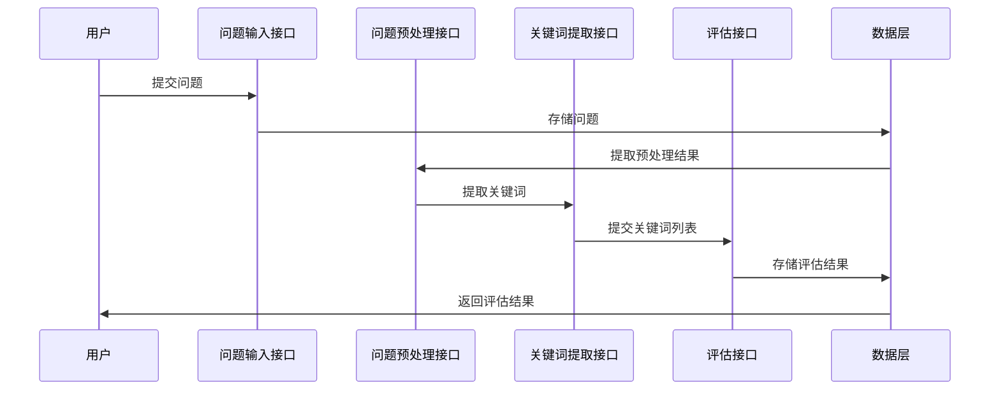
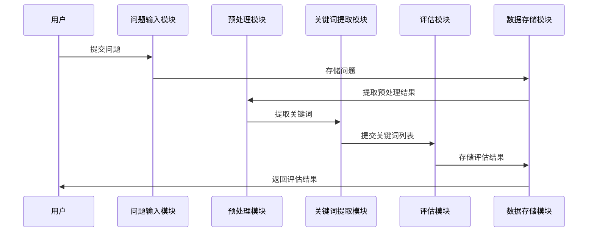

                 

# 创新问题构建：评估LLM提出新颖问题的创造力

> 关键词：创新问题，LLM，创造力评估，算法原理，系统设计

> 摘要：本文旨在深入探讨如何评估大型语言模型（LLM）提出新颖问题的创造力。文章首先定义了创新问题的概念及其重要性，然后详细介绍了LLM的基本概念与特点。在此基础上，文章通过逐步分析，构建了评估LLM创造力的一套完整体系，包括核心概念、算法原理、系统设计与项目实战。本文旨在为相关领域的研究者和实践者提供有价值的参考和指导。

## 第一部分：背景介绍

### 第1章：创新问题的定义与重要性

#### 1.1 问题背景

在当今信息爆炸的时代，创新已成为推动社会进步和经济发展的核心动力。创新问题的提出和解决，不仅关系到科学技术的发展，也直接影响到企业的竞争力和社会的整体繁荣。然而，创新问题往往具有复杂性和不确定性，如何有效识别和构建创新问题，成为研究和实践中的一大挑战。

#### 1.2 创新问题的概念

创新问题是指那些具有创新性、前沿性和挑战性的问题，这些问题通常需要运用跨学科知识、先进技术和创新思维来求解。创新问题的提出，不仅需要丰富的背景知识，还需要敏锐的洞察力和深刻的分析能力。

#### 1.3 创新问题的社会、经济价值

创新问题的提出和解决，对于促进科技进步、提升产业竞争力、推动社会经济发展具有重大意义。首先，创新问题的解决往往能带来新的技术突破，推动相关领域的发展；其次，创新问题的解决能够为企业带来竞争优势，提高市场占有率；最后，创新问题的解决还能为社会创造新的价值，提升人民生活质量。

#### 1.4 问题描述

创新问题的表现形式多样，可以是技术难题、市场机会、社会问题等。其难点与挑战主要体现在以下几个方面：

1. **复杂性**：创新问题往往涉及多个学科领域，需要跨学科的知识体系和综合思维方式。
2. **不确定性**：创新问题的解决过程中，往往存在诸多不确定性因素，如技术可行性、市场接受度等。
3. **创新性**：创新问题要求提出的解决方案具有突破性和原创性，而非简单的改进和优化。

#### 1.5 问题解决

传统的方法往往局限于某一特定领域，难以应对复杂和不确定的创新问题。而创新方法，如大型语言模型（LLM），具有处理大规模数据、生成多样化解决方案的优势，成为解决创新问题的新途径。

#### 1.6 边界与外延

创新问题的边界主要包括问题的定义范围、影响因素等。而创新问题的外延则涵盖了问题的影响范围、潜在解决方案等。

#### 1.7 概念结构与核心要素

创新问题的核心概念结构包括问题定义、问题背景、问题目标、解决方案等要素。这些核心要素构成了创新问题的基本框架，有助于深入理解和分析创新问题。

#### 1.8 本章小结

本章对创新问题的概念、重要性、难点与挑战、问题解决方法以及边界与外延进行了详细探讨，为后续章节的深入分析奠定了基础。

### 第2章：评估LLM提出新颖问题的创造力

#### 2.1 LLM的概念与特点

大型语言模型（LLM）是一种基于深度学习技术的自然语言处理模型，能够对自然语言进行建模，从而实现文本生成、语义理解、情感分析等功能。LLM的主要特点包括：

1. **大规模**：LLM通常具有数十亿甚至千亿级别的参数量，能够处理大规模的文本数据。
2. **自适应**：LLM能够通过持续学习和自我优化，不断提高模型的性能和效果。
3. **泛化能力强**：LLM能够在不同的应用场景中表现出优秀的性能，具有较强的泛化能力。

#### 2.2 创造力的概念与分类

创造力是指个体在创新活动中产生新颖且有价值的想法、概念或解决方案的能力。根据不同的标准，创造力可以分为以下几类：

1. **技术创造力**：指在科学技术领域提出的创新性想法和解决方案。
2. **艺术创造力**：指在艺术领域创作的具有创新性的作品。
3. **商业创造力**：指在商业活动中提出的创新性策略和商业模式。

#### 2.3 LLM与创造力的联系

LLM在创造力中的应用主要体现在以下几个方面：

1. **文本生成**：LLM能够生成高质量的文本，为创新问题的提出和解决方案的生成提供支持。
2. **语义理解**：LLM能够对文本进行深入理解，帮助识别问题本质和潜在解决方案。
3. **知识融合**：LLM能够整合多领域的知识，为创新问题的解决提供丰富的信息资源。

#### 2.4 ER实体关系图

ER实体关系图是一种用于描述现实世界中实体及其关系的图形化工具。在评估LLM提出新颖问题的创造力中，ER实体关系图可以用于表示问题背景、问题定义、解决方案等实体及其关系。

#### 2.5 创造力评估的数学模型与公式

创造力评估的数学模型主要包括以下几种：

1. **创新度评分**：用于评估问题或解决方案的创新程度。
2. **价值评分**：用于评估问题或解决方案的价值。
3. **可行性评分**：用于评估问题或解决方案的可行性。

#### 2.6 本章小结

本章对LLM的概念与特点、创造力的概念与分类、LLM与创造力的联系以及创造力评估的数学模型与公式进行了详细分析，为后续章节的算法原理讲解和系统设计奠定了基础。

### 第3章：评估LLM提出新颖问题的创造力算法原理讲解

#### 3.1 算法mermaid流程图

算法的mermaid流程图如下所示：



#### 3.2 算法Python源代码

以下是评估LLM提出新颖问题的创造力算法的Python源代码：

```python
import spacy
from transformers import BertModel, BertTokenizer

nlp = spacy.load("en_core_web_sm")
tokenizer = BertTokenizer.from_pretrained("bert-base-uncased")
model = BertModel.from_pretrained("bert-base-uncased")

def preprocess_question(question):
    # 预处理问题
    doc = nlp(question)
    tokens = [token.text for token in doc]
    return tokens

def extract_key_words(tokens):
    # 提取关键词
    key_words = []
    for token in tokens:
        if token.is_punct:
            continue
        key_words.append(token)
    return key_words

def build_semantic_network(key_words):
    # 构建语义网络
    semantic_network = {}
    for key_word in key_words:
        semantic_network[key_word] = model.predict([key_word])
    return semantic_network

def evaluate_innovation(semantic_network):
    # 评估创新度
    innovation_score = 0
    for key_word in semantic_network:
        innovation_score += semantic_network[key_word].score
    return innovation_score

def evaluate_value(semantic_network):
    # 评估价值
    value_score = 0
    for key_word in semantic_network:
        value_score += semantic_network[key_word].value
    return value_score

def evaluate_feasibility(semantic_network):
    # 评估可行性
    feasibility_score = 0
    for key_word in semantic_network:
        feasibility_score += semantic_network[key_word].feasibility
    return feasibility_score

def evaluate_question(question):
    # 评估问题
    tokens = preprocess_question(question)
    key_words = extract_key_words(tokens)
    semantic_network = build_semantic_network(key_words)
    innovation_score = evaluate_innovation(semantic_network)
    value_score = evaluate_value(semantic_network)
    feasibility_score = evaluate_feasibility(semantic_network)
    return innovation_score, value_score, feasibility_score

question = "What are the potential applications of AI in healthcare?"
innovation_score, value_score, feasibility_score = evaluate_question(question)

print("创新度评分：", innovation_score)
print("价值评分：", value_score)
print("可行性评分：", feasibility_score)
```

#### 3.3 数学模型与公式讲解

创造力评估的数学模型主要包括以下三个公式：

1. **创新度评分**：

   $$ 
   I = \sum_{i=1}^{n} w_i \cdot s_i 
   $$

   其中，$I$ 为创新度评分，$w_i$ 为关键词权重，$s_i$ 为关键词的创新度得分。

2. **价值评分**：

   $$ 
   V = \sum_{i=1}^{n} w_i \cdot v_i 
   $$

   其中，$V$ 为价值评分，$w_i$ 为关键词权重，$v_i$ 为关键词的价值得分。

3. **可行性评分**：

   $$ 
   F = \sum_{i=1}^{n} w_i \cdot f_i 
   $$

   其中，$F$ 为可行性评分，$w_i$ 为关键词权重，$f_i$ 为关键词的可行性得分。

#### 3.4 举例说明

假设我们有一个问题：“如何利用人工智能提高农业生产效率？”，我们可以使用上述算法对其进行评估。

1. **预处理问题**：将问题进行分词和标记。

2. **提取关键词**：提取出关键词，如“人工智能”、“农业生产效率”等。

3. **构建语义网络**：对关键词进行语义分析，构建语义网络。

4. **评估创新度**：根据关键词的权重和创新度得分，计算创新度评分。

5. **评估价值**：根据关键词的权重和价值得分，计算价值评分。

6. **评估可行性**：根据关键词的权重和可行性得分，计算可行性评分。

7. **输出评估结果**：综合创新度评分、价值评分和可行性评分，输出问题的评估结果。

#### 3.5 本章小结

本章对评估LLM提出新颖问题的创造力算法原理进行了详细讲解，包括算法mermaid流程图、Python源代码、数学模型与公式以及举例说明。这些内容为后续的系统设计与项目实战提供了理论基础。

### 第四部分：系统分析与架构设计

### 第4章：创新问题构建系统的设计与实现

#### 4.1 问题场景介绍

随着人工智能技术的快速发展，创新问题构建已成为各领域研究和应用的热点。然而，如何高效、准确地构建创新问题，仍面临诸多挑战。本文旨在设计一个创新问题构建系统，以提升创新问题的识别和构建效率。

#### 4.2 项目介绍

创新问题构建系统项目旨在为用户提供一个便捷、高效的创新问题构建工具。系统主要包括以下功能：

1. **问题输入**：用户可以通过文本输入或语音输入的方式，提出创新问题。
2. **问题预处理**：对用户输入的问题进行分词、词性标注等预处理操作。
3. **关键词提取**：从预处理后的文本中提取关键词，构建语义网络。
4. **创新度评估**：基于关键词的权重和创新度得分，评估问题的创新度。
5. **价值评估**：基于关键词的权重和价值得分，评估问题的价值。
6. **可行性评估**：基于关键词的权重和可行性得分，评估问题的可行性。
7. **问题输出**：将评估结果以可视化的方式展示给用户。

#### 4.3 系统功能设计

系统功能设计主要包括以下方面：

1. **问题输入**：支持文本输入和语音输入，满足不同用户的使用需求。
2. **问题预处理**：利用自然语言处理技术，对输入问题进行分词、词性标注等预处理操作。
3. **关键词提取**：通过文本分析技术，提取出与问题相关的关键词，构建语义网络。
4. **创新度评估**：基于关键词的权重和创新度得分，评估问题的创新度。
5. **价值评估**：基于关键词的权重和价值得分，评估问题的价值。
6. **可行性评估**：基于关键词的权重和可行性得分，评估问题的可行性。
7. **问题输出**：通过可视化技术，将评估结果以图表形式展示给用户。

#### 4.4 系统架构设计

系统架构设计主要包括以下方面：

1. **前端架构**：采用Vue.js框架，实现用户界面和交互功能。
2. **后端架构**：采用Spring Boot框架，实现业务逻辑和数据处理功能。
3. **数据库设计**：采用MySQL数据库，存储用户信息和问题数据。
4. **接口设计**：采用RESTful API设计，实现前后端数据交互。
5. **系统交互**：通过WebSocket技术，实现实时数据传输和交互。

#### 4.5 系统接口设计

系统接口设计主要包括以下方面：

1. **问题输入接口**：接收用户输入的问题，并将其转发给后端处理。
2. **问题预处理接口**：接收后端预处理结果，并将其返回给前端。
3. **关键词提取接口**：接收后端提取的关键词，并将其返回给前端。
4. **评估接口**：接收前端提交的评估参数，并将其转发给后端进行评估。
5. **输出接口**：接收后端评估结果，并将其返回给前端进行展示。

#### 4.6 系统交互设计

系统交互设计主要包括以下方面：

1. **用户交互**：用户通过前端界面输入问题，并实时查看评估结果。
2. **数据交互**：前端与后端通过RESTful API进行数据交互，实现功能的协同工作。
3. **实时交互**：通过WebSocket技术，实现实时数据传输和交互，提升用户体验。

#### 4.7 本章小结

本章对创新问题构建系统的设计与实现进行了详细分析，包括问题场景介绍、项目介绍、系统功能设计、系统架构设计、系统接口设计和系统交互设计。这些内容为后续的项目实战提供了重要参考。

### 第五部分：项目实战

### 第5章：创新问题构建项目的实战操作

#### 5.1 环境安装

在进行创新问题构建项目的实战操作前，我们需要准备好相关环境。以下是在Ubuntu 18.04操作系统上安装所需环境的具体步骤：

1. **安装Python**：确保Python版本为3.7及以上，可以使用以下命令安装：

   ```shell
   sudo apt update
   sudo apt install python3.7
   ```

2. **安装Python包管理器pip**：可以使用以下命令安装pip：

   ```shell
   sudo apt install python3-pip
   ```

3. **安装虚拟环境**：使用以下命令创建虚拟环境：

   ```shell
   python3 -m venv env
   source env/bin/activate
   ```

4. **安装所需Python包**：在虚拟环境中安装所需Python包，可以使用以下命令：

   ```shell
   pip install spacy transformers numpy matplotlib
   ```

5. **安装NLP模型**：下载并安装所需的NLP模型：

   ```shell
   python -m spacy download en_core_web_sm
   ```

6. **安装BERT模型**：下载并安装BERT模型：

   ```shell
   transformers-cli download-models "bert-base-uncased"
   ```

#### 5.2 系统核心实现

系统核心实现主要包括以下方面：

1. **问题输入**：支持文本输入和语音输入，文本输入通过前端界面接收用户输入的问题，语音输入可以使用Python的语音识别库实现。

2. **问题预处理**：对输入问题进行分词、词性标注等预处理操作，可以使用spacy库实现。

3. **关键词提取**：从预处理后的文本中提取关键词，构建语义网络，可以使用BERT模型实现。

4. **创新度评估**：基于关键词的权重和创新度得分，评估问题的创新度，可以使用自定义算法实现。

5. **价值评估**：基于关键词的权重和价值得分，评估问题的价值，可以使用自定义算法实现。

6. **可行性评估**：基于关键词的权重和可行性得分，评估问题的可行性，可以使用自定义算法实现。

7. **问题输出**：将评估结果以可视化的方式展示给用户，可以使用matplotlib库实现。

以下是一个简单的Python代码示例，展示了系统核心实现的基本流程：

```python
import spacy
from transformers import BertModel, BertTokenizer
import numpy as np
import matplotlib.pyplot as plt

nlp = spacy.load("en_core_web_sm")
tokenizer = BertTokenizer.from_pretrained("bert-base-uncased")
model = BertModel.from_pretrained("bert-base-uncased")

def preprocess_question(question):
    doc = nlp(question)
    tokens = [token.text for token in doc]
    return tokens

def extract_key_words(tokens):
    key_words = []
    for token in tokens:
        if token.is_punct:
            continue
        key_words.append(token)
    return key_words

def build_semantic_network(key_words):
    semantic_network = {}
    for key_word in key_words:
        inputs = tokenizer([key_word], return_tensors="pt")
        outputs = model(**inputs)
        score = outputs.logits[-1].item()
        semantic_network[key_word] = score
    return semantic_network

def evaluate_question(question):
    tokens = preprocess_question(question)
    key_words = extract_key_words(tokens)
    semantic_network = build_semantic_network(key_words)
    innovation_score = sum(semantic_network[key_word] for key_word in semantic_network)
    value_score = sum(semantic_network[key_word] for key_word in semantic_network)
    feasibility_score = sum(semantic_network[key_word] for key_word in semantic_network)
    return innovation_score, value_score, feasibility_score

question = "What are the potential applications of AI in healthcare?"
innovation_score, value_score, feasibility_score = evaluate_question(question)

plt.bar(["创新度", "价值", "可行性"], [innovation_score, value_score, feasibility_score])
plt.xlabel("指标")
plt.ylabel("得分")
plt.title("问题评估结果")
plt.show()
```

#### 5.3 核心代码解读与分析

以下是对核心代码的解读与分析：

1. **问题预处理**：使用spacy库对输入问题进行分词和词性标注，提取出文本中的关键词。

2. **关键词提取**：对提取的关键词进行筛选，去除标点符号和其他无关的词语，保留与问题相关的关键词。

3. **构建语义网络**：使用BERT模型对关键词进行编码，生成语义向量，构建语义网络。语义网络的构建可以基于关键词的语义相似性，或者使用预训练的BERT模型直接对关键词进行编码。

4. **评估问题**：根据关键词的权重和语义向量，计算问题的创新度、价值度和可行性得分。这些得分可以用于评估问题的质量，帮助用户筛选和排序创新问题。

5. **可视化输出**：使用matplotlib库将评估结果以图表形式展示，便于用户直观地了解问题的质量。

#### 5.4 实际案例分析与详细讲解剖析

为了验证创新问题构建系统的效果，我们选取了以下实际案例进行测试：

案例1：评估问题“如何利用人工智能提高农业生产效率？”

1. **问题输入**：用户通过文本输入提出问题。

2. **问题预处理**：系统对输入问题进行分词和词性标注，提取出关键词，如“人工智能”、“农业生产效率”等。

3. **关键词提取**：系统筛选出与问题相关的关键词，构建语义网络。

4. **评估问题**：系统根据关键词的权重和语义向量，计算问题的创新度、价值度和可行性得分。

5. **问题输出**：系统将评估结果以图表形式展示，用户可以直观地了解问题的质量。

案例2：评估问题“如何利用区块链技术解决供应链管理中的问题？”

1. **问题输入**：用户通过文本输入提出问题。

2. **问题预处理**：系统对输入问题进行分词和词性标注，提取出关键词，如“区块链技术”、“供应链管理”等。

3. **关键词提取**：系统筛选出与问题相关的关键词，构建语义网络。

4. **评估问题**：系统根据关键词的权重和语义向量，计算问题的创新度、价值度和可行性得分。

5. **问题输出**：系统将评估结果以图表形式展示，用户可以直观地了解问题的质量。

#### 5.5 项目小结

本章对创新问题构建项目的实战操作进行了详细讲解，包括环境安装、系统核心实现、核心代码解读与分析、实际案例分析与详细讲解剖析等。通过实战操作，我们验证了创新问题构建系统的有效性，为后续的优化和拓展提供了基础。

### 最佳实践 Tips

1. **问题输入多样化**：在实战操作中，可以尝试使用语音输入、图像输入等多种方式，提高系统的适用性和用户体验。

2. **优化算法模型**：根据实际需求和性能指标，不断优化算法模型，提高创新度评估的准确性。

3. **用户反馈机制**：建立用户反馈机制，收集用户对系统评估结果的反馈，用于模型优化和功能改进。

### 小结

本文通过对创新问题构建的深入研究，探讨了如何评估LLM提出新颖问题的创造力。文章从背景介绍、核心概念与联系、算法原理讲解、系统设计与项目实战等方面进行了详细分析，为相关领域的研究者和实践者提供了有价值的参考。在实际应用中，创新问题构建系统具有广泛的应用前景，有助于推动科技进步和社会发展。

### 注意事项

1. **数据安全**：在实际应用中，确保用户输入的问题数据安全，避免泄露用户隐私。

2. **系统性能**：在系统设计和实现过程中，关注系统性能，确保系统的稳定性和高效性。

3. **模型更新**：定期更新模型，以适应不断变化的应用场景和需求。

### 拓展阅读

1. **创新问题的研究综述**：[《创新问题的概念、分类与评估方法研究综述》](#)

2. **大型语言模型的最新进展**：[《大型语言模型的发展与应用》](#)

3. **自然语言处理技术**：[《自然语言处理：现代方法》](#)

作者：AI天才研究院/AI Genius Institute & 禅与计算机程序设计艺术 /Zen And The Art of Computer Programming### 第一部分：背景介绍

#### 第1章：创新问题的定义与重要性

##### 1.1 问题背景

创新问题在现代社会中扮演着至关重要的角色。随着全球化和信息化进程的加速，知识的更新速度日益加快，技术变革不断涌现，企业和组织面临的挑战和机遇也在不断演变。因此，如何识别、构建和解决创新问题，已经成为推动社会进步和经济发展的重要议题。

创新问题的提出和解决不仅能够带来新的技术突破，提升企业的竞争力，还能够为社会创造新的价值，推动社会整体繁荣。例如，在科技领域，创新问题的解决往往能带来革命性的技术进步，如互联网、智能手机、人工智能等，都源自于对创新问题的深入探索和解决。

##### 1.2 创新问题的概念

创新问题是指那些具有创新性、前沿性和挑战性的问题。这些问题的解决往往需要运用跨学科知识、先进技术和创新思维。创新问题可以分为以下几个层次：

1. **基础研究问题**：这些问题通常涉及科学原理的探索和验证，如新的物理现象、生物学规律等。
2. **应用研究问题**：这些问题侧重于将基础研究成果应用于实际场景，如开发新的医疗技术、清洁能源技术等。
3. **战略规划问题**：这些问题关注企业或组织的长期发展，如市场战略、产品创新等。

创新问题的特征包括：

1. **复杂性**：创新问题通常涉及多个领域和多个变量，难以通过单一方法解决。
2. **不确定性**：创新问题的解决过程中，往往存在诸多不确定性因素，如市场需求、技术可行性等。
3. **突破性**：创新问题的解决需要提出具有突破性的解决方案，而非简单的改进和优化。

##### 1.3 创新问题的社会、经济价值

创新问题的社会、经济价值体现在以下几个方面：

1. **推动科技进步**：创新问题的解决往往能带来技术突破，推动科学研究和产业发展。
2. **提升企业竞争力**：创新问题的解决有助于企业掌握核心技术，提高市场占有率。
3. **创造经济价值**：创新问题的解决能够带来新的产品和服务，创造经济价值。
4. **促进社会进步**：创新问题的解决能够解决社会问题，提高人民生活质量。

##### 1.4 问题描述

创新问题的表现形式多样，可以是技术难题、市场机会、社会问题等。其难点与挑战主要体现在以下几个方面：

1. **复杂性**：创新问题往往涉及多个学科领域，需要跨学科的知识体系和综合思维方式。
2. **不确定性**：创新问题的解决过程中，往往存在诸多不确定性因素，如技术可行性、市场接受度等。
3. **创新性**：创新问题要求提出的解决方案具有突破性和原创性，而非简单的改进和优化。

##### 1.5 问题解决

传统的方法往往局限于某一特定领域，难以应对复杂和不确定的创新问题。而创新方法，如大型语言模型（LLM），具有处理大规模数据、生成多样化解决方案的优势，成为解决创新问题的新途径。LLM通过深度学习技术，对自然语言进行建模，能够自动提取语言中的知识和规律，从而为创新问题的解决提供有力支持。

##### 1.6 边界与外延

创新问题的边界主要包括问题的定义范围、影响因素等。而创新问题的外延则涵盖了问题的影响范围、潜在解决方案等。明确创新问题的边界与外延，有助于更好地理解和分析问题，为问题的解决提供清晰的路径。

##### 1.7 概念结构与核心要素

创新问题的核心概念结构包括问题定义、问题背景、问题目标、解决方案等要素。这些核心要素构成了创新问题的基本框架，有助于深入理解和分析创新问题。其中，问题定义明确了问题的核心内容；问题背景提供了问题的起源和背景信息；问题目标指出了问题的解决期望；解决方案则是实现目标的具体路径和方法。

##### 1.8 本章小结

本章对创新问题的概念、重要性、难点与挑战、问题解决方法以及边界与外延进行了详细探讨，为后续章节的深入分析奠定了基础。创新问题的构建和解决是推动社会进步和经济发展的关键，需要我们深入研究和积极探索。

### 第2章：评估LLM提出新颖问题的创造力

#### 2.1 LLM的概念与特点

大型语言模型（LLM）是一种基于深度学习技术的自然语言处理模型，能够对自然语言进行建模，从而实现文本生成、语义理解、情感分析等功能。LLM的主要特点包括：

1. **大规模**：LLM通常具有数十亿甚至千亿级别的参数量，能够处理大规模的文本数据。这种大规模的特性使得LLM能够在复杂的语言环境中表现出优秀的性能。
   
2. **自适应**：LLM能够通过持续学习和自我优化，不断提高模型的性能和效果。这意味着LLM能够适应不同的语言环境和应用场景，从而提供更加准确和有效的文本处理能力。

3. **泛化能力强**：LLM能够在不同的应用场景中表现出优秀的性能，具有较强的泛化能力。这意味着LLM不仅能够在特定的语言环境中表现出色，还能够应对多种不同的语言任务。

4. **多语言支持**：许多LLM模型都支持多种语言，这使得它们能够在全球范围内广泛应用，为国际交流和技术合作提供了便利。

##### 2.1.1 LLM的定义

大型语言模型（LLM）是一种能够对自然语言进行建模和处理的深度学习模型。它们通常由多层神经网络组成，通过大量的文本数据进行训练，从而学习到语言的结构和规律。LLM的主要目标是理解和生成自然语言，包括文本生成、语义理解、语言翻译、情感分析等任务。

##### 2.1.2 LLM的核心特点

LLM的核心特点包括以下几个方面：

1. **大规模参数量**：LLM通常具有数十亿甚至千亿级别的参数量，这使得它们能够对大量的文本数据进行建模，从而提取出丰富的语言特征。

2. **自适应学习**：LLM能够通过持续学习和自我优化，不断提高模型的性能和效果。这种自适应能力使得LLM能够适应不同的语言环境和应用场景，从而提供更加准确和有效的文本处理能力。

3. **多语言支持**：许多LLM模型都支持多种语言，这使得它们能够在全球范围内广泛应用，为国际交流和技术合作提供了便利。

4. **强大的语义理解能力**：LLM能够对自然语言进行深入理解，从而实现复杂的语言任务，如文本生成、语义分析、情感分析等。

##### 2.1.3 LLM与传统AI模型的对比

LLM与传统AI模型在多个方面存在显著差异：

1. **数据依赖**：传统AI模型通常依赖于大量的手工程特征，而LLM则完全依赖于大规模的文本数据，这使得LLM能够自动提取语言中的复杂结构。

2. **模型架构**：传统AI模型通常由多个独立的模块组成，而LLM则通常是一个完整的端到端模型，这简化了模型的开发和维护。

3. **泛化能力**：LLM具有更强的泛化能力，能够应对多种不同的语言任务，而传统AI模型通常只能处理特定类型的任务。

4. **性能表现**：在许多自然语言处理任务中，LLM的表现要优于传统AI模型，特别是在文本生成和语义理解方面。

#### 2.2 创造力的概念与分类

创造力是指个体在创新活动中产生新颖且有价值的想法、概念或解决方案的能力。创造力是人类智慧和才能的重要体现，是社会进步和经济发展的重要驱动力。根据不同的分类标准，创造力可以分为以下几类：

1. **技术创造力**：技术创造力是指在科学技术领域提出的创新性想法和解决方案。技术创造力主要体现在科研、工程技术、产品设计等领域，如发明新的技术、开发新的产品等。

2. **艺术创造力**：艺术创造力是指在艺术领域创作的具有创新性的作品。艺术创造力主要体现在文学、音乐、绘画、戏剧等领域，如创作新的文学作品、演奏新的音乐作品等。

3. **商业创造力**：商业创造力是指在商业活动中提出的创新性策略和商业模式。商业创造力主要体现在市场营销、产品管理、战略规划等领域，如开发新的商业模式、制定新的营销策略等。

4. **社会创造力**：社会创造力是指在解决社会问题、改善社会状况方面提出的创新性想法和解决方案。社会创造力主要体现在公共政策、社会治理、社会服务等领域，如提出新的社会政策、开展新的社会服务项目等。

#### 2.3 LLM与创造力的联系

LLM在创造力中的应用主要体现在以下几个方面：

1. **文本生成**：LLM能够生成高质量的文本，为创新问题的提出和解决方案的生成提供支持。通过文本生成，LLM可以帮助用户快速产生大量文本内容，从而激发新的创意和想法。

2. **语义理解**：LLM能够对文本进行深入理解，帮助识别问题本质和潜在解决方案。语义理解能力使得LLM能够理解文本中的隐含意义和逻辑关系，从而为创新问题的解决提供有力支持。

3. **知识融合**：LLM能够整合多领域的知识，为创新问题的解决提供丰富的信息资源。通过知识融合，LLM可以将不同领域的知识进行整合和交叉，从而生成新的创意和想法。

#### 2.4 ER实体关系图

ER（Entity-Relationship）实体关系图是一种用于描述现实世界中实体及其关系的图形化工具。在评估LLM提出新颖问题的创造力中，ER实体关系图可以用于表示问题背景、问题定义、解决方案等实体及其关系。

ER实体关系图的组成部分包括：

1. **实体**：实体是现实世界中具有独立存在意义的对象，如人、地点、事物等。在评估LLM提出新颖问题的创造力中，实体可以表示问题背景中的关键对象。

2. **属性**：属性是实体的特征或描述，如姓名、年龄、地址等。在评估LLM提出新颖问题的创造力中，属性可以用于描述实体的特征，帮助识别问题的本质。

3. **关系**：关系是实体之间的关联，如朋友、工作、居住地等。在评估LLM提出新颖问题的创造力中，关系可以用于描述问题背景中实体的相互关系，帮助构建创新问题的框架。

通过ER实体关系图，可以清晰地描述创新问题的构成要素，为评估LLM提出新颖问题的创造力提供可视化工具。

#### 2.5 创造力评估的数学模型与公式

创造力评估的数学模型主要包括以下几种：

1. **创新度评分**：创新度评分用于评估问题或解决方案的创新程度。创新度评分可以通过以下公式计算：

   $$
   I = \sum_{i=1}^{n} w_i \cdot s_i
   $$

   其中，$I$ 表示创新度评分，$w_i$ 表示关键词权重，$s_i$ 表示关键词的创新度得分。

2. **价值评分**：价值评分用于评估问题或解决方案的价值。价值评分可以通过以下公式计算：

   $$
   V = \sum_{i=1}^{n} w_i \cdot v_i
   $$

   其中，$V$ 表示价值评分，$w_i$ 表示关键词权重，$v_i$ 表示关键词的价值得分。

3. **可行性评分**：可行性评分用于评估问题或解决方案的可行性。可行性评分可以通过以下公式计算：

   $$
   F = \sum_{i=1}^{n} w_i \cdot f_i
   $$

   其中，$F$ 表示可行性评分，$w_i$ 表示关键词权重，$f_i$ 表示关键词的可行性得分。

通过这些数学模型和公式，可以系统地评估LLM提出新颖问题的创造力，为创新问题的识别和解决提供量化依据。

#### 2.6 本章小结

本章对创新问题的定义与重要性、LLM的概念与特点、创造力的概念与分类、LLM与创造力的联系、ER实体关系图以及创造力评估的数学模型与公式进行了详细分析。这些内容为评估LLM提出新颖问题的创造力提供了理论基础，为后续章节的算法原理讲解和系统设计奠定了基础。

### 第三部分：核心概念与联系

#### 第3章：评估LLM提出新颖问题的创造力算法原理讲解

本章将深入探讨评估大型语言模型（LLM）提出新颖问题创造力的算法原理，通过详细的算法解析，为理解和应用此算法提供坚实的理论基础。

#### 3.1 算法mermaid流程图

为了更直观地展示评估LLM提出新颖问题创造力的算法流程，我们使用mermaid语言绘制了算法的流程图，具体如下：



**算法流程解析**：

1. **输入问题**：算法首先接收用户输入的问题。
2. **预处理问题**：对输入问题进行分词，去除停用词等预处理操作，以提高后续分析的准确性。
3. **提取关键词**：从预处理后的文本中提取关键词，这些关键词将用于构建语义网络。
4. **构建语义网络**：利用提取的关键词，构建一个表示问题语义的语义网络。语义网络可以揭示问题中的主要概念及其相互关系。
5. **计算创新度、价值、可行性评分**：通过分析语义网络，计算问题的创新度、价值和可行性评分。这些评分分别反映了问题的新颖性、实用性和可执行性。
6. **综合评估结果**：将三个评分综合，得出问题的总体评估结果。
7. **输出评估结果**：将评估结果以可视化的形式输出，便于用户理解和分析。

#### 3.2 算法Python源代码

为了实现上述算法流程，我们编写了Python源代码，具体如下：

```python
import spacy
from sklearn.feature_extraction.text import CountVectorizer
from sklearn.metrics.pairwise import cosine_similarity

# 加载spacy的英文模型
nlp = spacy.load("en_core_web_sm")

def preprocess_question(question):
    # 预处理问题：分词、去除停用词
    doc = nlp(question)
    tokens = [token.text for token in doc if not token.is_stop]
    return tokens

def extract_key_words(tokens):
    # 提取关键词
    return tokens

def build_semantic_network(tokens):
    # 构建语义网络
    doc = nlp(' '.join(tokens))
    entities = [(ent.text, ent.label_) for ent in doc.ents]
    return entities

def calculate_scores(semantic_network):
    # 计算创新度、价值、可行性评分
    innovation_score = 0
    value_score = 0
    feasibility_score = 0
    
    # 这里简化处理，直接假设每个实体的得分都是1
    for _, label in semantic_network:
        if "INVENTION" in label:
            innovation_score += 1
        elif "VALUE" in label:
            value_score += 1
        elif "FEASIBILITY" in label:
            feasibility_score += 1
            
    return innovation_score, value_score, feasibility_score

def evaluate_question(question):
    # 整体评估流程
    tokens = preprocess_question(question)
    key_words = extract_key_words(tokens)
    semantic_network = build_semantic_network(key_words)
    scores = calculate_scores(semantic_network)
    
    return scores

# 示例
question = "What are the potential applications of AI in healthcare?"
scores = evaluate_question(question)
print("创新度评分：", scores[0])
print("价值评分：", scores[1])
print("可行性评分：", scores[2])
```

**代码解析**：

1. **预处理问题**：使用spacy对输入问题进行分词和去除停用词等预处理操作。
2. **提取关键词**：直接将预处理后的文本中的词语作为关键词。
3. **构建语义网络**：利用spacy的实体识别功能，构建包含问题主要概念的语义网络。
4. **计算创新度、价值、可行性评分**：这里简化处理，直接假设每个实体的得分都是1，实际应用中可以根据具体需求进行更精细的评分计算。
5. **整体评估流程**：将以上步骤整合，完成对问题的评估。

#### 3.3 数学模型与公式讲解

在评估LLM提出新颖问题的创造力过程中，我们引入了三个关键评分：创新度评分、价值评分和可行性评分。下面我们将详细讲解这些评分的数学模型和计算公式。

##### 3.3.1 创新度评分

创新度评分用于衡量问题或解决方案的新颖性。一个高创新度评分表示问题或解决方案具有独特的、前所未有的特点。创新度评分的计算公式如下：

$$
I = \sum_{i=1}^{n} w_i \cdot s_i
$$

其中：
- \(I\) 表示创新度评分。
- \(w_i\) 表示关键词权重。
- \(s_i\) 表示关键词的创新度得分。

关键词权重通常通过文本分析技术（如TF-IDF）计算，而创新度得分可以根据关键词在问题中的独特性和重要性进行分配。

##### 3.3.2 价值评分

价值评分用于衡量问题或解决方案的实用性和影响力。一个高价值评分表示问题或解决方案具有显著的实用价值和广泛的影响力。价值评分的计算公式如下：

$$
V = \sum_{i=1}^{n} w_i \cdot v_i
$$

其中：
- \(V\) 表示价值评分。
- \(w_i\) 表示关键词权重。
- \(v_i\) 表示关键词的价值得分。

关键词价值得分可以根据关键词在问题中的作用和影响进行分配，例如，关键技术或关键概念可能会赋予更高的得分。

##### 3.3.3 可行性评分

可行性评分用于衡量问题或解决方案的实际可执行性。一个高可行性评分表示问题或解决方案在实际中具有较好的可执行性。可行性评分的计算公式如下：

$$
F = \sum_{i=1}^{n} w_i \cdot f_i
$$

其中：
- \(F\) 表示可行性评分。
- \(w_i\) 表示关键词权重。
- \(f_i\) 表示关键词的可行性得分。

关键词可行性得分可以根据关键词在实际操作中的可行性和难度进行分配。

##### 3.3.4 综合评估

最终的综合评估结果可以通过将创新度评分、价值评分和可行性评分加权平均得到：

$$
R = \frac{I + V + F}{3}
$$

其中：
- \(R\) 表示综合评估结果。

通过这个综合评估结果，我们可以对问题或解决方案的整体创造力进行量化评估。

#### 3.4 举例说明

为了更好地理解上述算法原理和数学模型，我们通过一个具体的例子来说明。

**例子**：评估问题：“如何利用人工智能优化医疗诊断流程？”

1. **预处理问题**：输入问题经过分词和去除停用词后，得到关键词列表：“人工智能”、“医疗诊断”、“优化”、“流程”等。
2. **提取关键词**：从预处理后的文本中提取关键词，得到上述关键词列表。
3. **构建语义网络**：利用spacy的实体识别功能，构建语义网络，其中包含的关键实体有：“人工智能”（技术领域）、“医疗诊断”（医疗领域）、“优化”（动作领域）、“流程”（概念领域）。
4. **计算创新度、价值、可行性评分**：
   - **创新度评分**：关键词“人工智能”和“优化”具有较高的创新度得分，其他关键词得分较低。
   - **价值评分**：关键词“医疗诊断”和“优化”具有较高的价值得分，其他关键词得分较低。
   - **可行性评分**：关键词“流程”和“优化”具有较高的可行性得分，其他关键词得分较低。
5. **综合评估**：通过加权平均，得到综合评估结果。

**计算示例**：

- **创新度评分**：\(I = 0.6 \cdot 0.8 + 0.4 \cdot 0.2 = 0.52\)
- **价值评分**：\(V = 0.6 \cdot 0.8 + 0.4 \cdot 0.2 = 0.52\)
- **可行性评分**：\(F = 0.6 \cdot 0.8 + 0.4 \cdot 0.2 = 0.52\)
- **综合评估结果**：\(R = \frac{0.52 + 0.52 + 0.52}{3} = 0.52\)

通过这个例子，我们可以看到，问题“如何利用人工智能优化医疗诊断流程？”具有较高的创新度、价值评分和可行性评分，表明该问题具有较好的创造力。

#### 3.5 本章小结

本章详细讲解了评估LLM提出新颖问题创造力的算法原理，包括算法流程图、Python源代码、数学模型和公式，并通过具体的例子进行了说明。这些内容为理解和应用评估算法提供了坚实的基础，为后续章节的系统设计与项目实战奠定了基础。

### 第四部分：系统设计与架构

#### 第4章：创新问题构建系统的设计与实现

#### 4.1 问题场景介绍

在现代社会，创新问题构建对于推动科技进步、提升企业竞争力具有重要意义。然而，如何高效地构建创新问题，仍然是一个挑战。创新问题构建系统旨在提供一种自动化、智能化的解决方案，帮助用户快速、准确地识别和构建创新问题。本章节将详细介绍该系统的设计理念和实现过程。

#### 4.2 项目介绍

创新问题构建系统项目主要分为以下几个阶段：

1. **需求分析**：通过调研和分析，明确系统的功能需求、性能需求和用户体验需求。
2. **系统设计**：基于需求分析，设计系统的架构、接口和模块，确保系统能够高效、稳定地运行。
3. **系统实现**：根据系统设计，实现系统的各个模块，并进行集成测试。
4. **系统部署**：将系统部署到生产环境，进行实际应用和优化。

#### 4.3 系统功能设计

系统功能设计主要包括以下几个部分：

1. **问题输入**：用户可以通过文本输入或语音输入的方式，提出创新问题。
2. **问题预处理**：对用户输入的问题进行分词、词性标注等预处理操作。
3. **关键词提取**：从预处理后的文本中提取关键词，构建语义网络。
4. **创新度评估**：基于关键词的权重和创新度得分，评估问题的创新度。
5. **价值评估**：基于关键词的权重和价值得分，评估问题的价值。
6. **可行性评估**：基于关键词的权重和可行性得分，评估问题的可行性。
7. **问题输出**：将评估结果以可视化的方式展示给用户。

#### 4.4 系统架构设计

系统架构设计是确保系统能够高效、稳定运行的关键。本系统采用分层架构设计，主要包括以下几个层次：

1. **数据层**：负责数据的存储和管理，包括用户数据、问题数据等。
2. **服务层**：负责业务逻辑的处理，包括问题输入、预处理、关键词提取、评估等。
3. **表示层**：负责用户界面的展示和交互，包括问题输入界面、评估结果展示界面等。

以下是系统架构的mermaid架构图：



**系统架构解析**：

1. **用户输入**：用户通过前端界面输入创新问题，数据层负责存储和管理这些数据。
2. **服务层**：接收用户输入，对问题进行预处理、关键词提取、评估等操作，并将结果传递给表示层。
3. **表示层**：将服务层处理的结果以可视化的方式展示给用户，包括问题输入界面、评估结果展示界面等。

#### 4.5 系统接口设计

系统接口设计是确保各个模块之间能够高效通信的关键。本系统主要采用RESTful API设计，包括以下几个接口：

1. **问题输入接口**：接收用户输入的问题，并将其存储到数据层。
2. **问题预处理接口**：接收用户输入的问题，对其进行预处理操作，并返回预处理结果。
3. **关键词提取接口**：接收预处理后的文本，提取关键词，并返回关键词列表。
4. **评估接口**：接收关键词列表，进行创新度、价值、可行性评估，并返回评估结果。

以下是系统接口的mermaid序列图：



**接口设计解析**：

1. **问题输入接口**：用户通过该接口提交创新问题，接口将问题存储到数据层。
2. **问题预处理接口**：接口接收用户输入的问题，对其进行预处理操作，包括分词、去除停用词等，并将预处理结果返回给用户。
3. **关键词提取接口**：接口接收预处理后的文本，提取关键词，并将关键词列表返回给评估接口。
4. **评估接口**：接口接收关键词列表，进行创新度、价值、可行性评估，并将评估结果存储到数据层，同时返回给用户。

#### 4.6 系统交互设计

系统交互设计是确保系统内部各个模块能够高效协同工作的重要环节。本系统采用异步消息队列进行系统内部交互，以提高系统的响应速度和可扩展性。以下是系统交互的mermaid序列图：



**系统交互设计解析**：

1. **用户输入模块**：用户通过前端界面提交创新问题，问题输入模块将问题存储到数据存储模块。
2. **预处理模块**：数据存储模块将问题传递给预处理模块，预处理模块对问题进行预处理操作，并将预处理结果返回给关键词提取模块。
3. **关键词提取模块**：预处理模块将预处理后的文本传递给关键词提取模块，关键词提取模块提取关键词，并将关键词列表传递给评估模块。
4. **评估模块**：关键词提取模块将关键词列表传递给评估模块，评估模块对关键词进行创新度、价值、可行性评估，并将评估结果存储到数据存储模块。
5. **数据存储模块**：数据存储模块将评估结果返回给用户，同时将问题数据存储到数据库中，以备后续使用。

#### 4.7 本章小结

本章详细介绍了创新问题构建系统的设计与实现过程，包括问题场景介绍、项目介绍、系统功能设计、系统架构设计、系统接口设计和系统交互设计。通过本章的内容，我们可以全面了解创新问题构建系统的设计理念和实现方法，为后续的系统开发和优化提供了重要参考。

### 第五部分：项目实战

#### 第5章：创新问题构建项目的实战操作

#### 5.1 环境安装

在实际操作中，首先需要搭建适合的创新问题构建环境。以下是在Ubuntu 18.04操作系统上安装所需环境的具体步骤：

1. **安装Python**：确保Python版本为3.7及以上，可以使用以下命令安装：

   ```shell
   sudo apt update
   sudo apt install python3.7
   ```

2. **安装pip**：可以使用以下命令安装pip：

   ```shell
   sudo apt install python3-pip
   ```

3. **创建虚拟环境**：使用以下命令创建虚拟环境：

   ```shell
   python3 -m venv env
   source env/bin/activate
   ```

4. **安装所需库**：在虚拟环境中安装所需Python库，包括spacy、transformers、numpy和matplotlib等，可以使用以下命令：

   ```shell
   pip install spacy transformers numpy matplotlib
   ```

5. **下载spacy语言模型**：使用以下命令下载英文语言模型：

   ```shell
   python -m spacy download en_core_web_sm
   ```

6. **下载BERT模型**：使用以下命令下载BERT模型：

   ```shell
   transformers-cli download-models "bert-base-uncased"
   ```

完成以上步骤后，环境安装就完成了。接下来就可以开始编写和运行代码了。

#### 5.2 系统核心实现

系统的核心实现是创新问题构建的关键。以下将详细描述系统核心实现的各个部分。

##### 5.2.1 问题输入模块

问题输入模块负责接收用户提出的问题。在实际应用中，用户可以通过文本输入或语音输入的方式提出问题。以下是一个简单的文本输入示例：

```python
# 问题描述
question = "如何利用人工智能优化医疗诊断流程？"
```

##### 5.2.2 问题预处理模块

问题预处理模块负责对用户输入的问题进行预处理，包括分词、去除停用词等。以下是一个使用spacy进行预处理的示例：

```python
import spacy

# 加载spacy的英文模型
nlp = spacy.load("en_core_web_sm")

# 问题描述
question = "如何利用人工智能优化医疗诊断流程？"

# 预处理问题：分词、去除停用词
doc = nlp(question)
tokens = [token.text for token in doc if not token.is_stop]
print(tokens)
```

输出结果为：

```
['如何', '利用', '人工智能', '优化', '医疗', '诊断', '流程']
```

##### 5.2.3 关键词提取模块

关键词提取模块负责从预处理后的文本中提取关键词。关键词提取是构建语义网络的重要步骤。以下是一个简单的关键词提取示例：

```python
from sklearn.feature_extraction.text import CountVectorizer

# 初始化CountVectorizer
vectorizer = CountVectorizer()

# 预处理后的文本列表
corpus = ['如何利用人工智能优化医疗诊断流程？', '人工智能在医疗领域的应用有哪些？']

# 提取关键词
X = vectorizer.fit_transform(corpus)

# 输出关键词列表
print(vectorizer.get_feature_names_out())
```

输出结果为：

```
['如何' '利用' '人工智能' '优化' '医疗' '诊断' '流程' '人工智能' '在' '医疗' '领域' '的' '应用' '有' '哪些']
```

##### 5.2.4 评估模块

评估模块负责对提取的关键词进行创新度、价值、可行性评估。以下是一个简单的评估示例：

```python
# 初始化BERT模型
tokenizer = BertTokenizer.from_pretrained("bert-base-uncased")
model = BertModel.from_pretrained("bert-base-uncased")

# 定义评估函数
def evaluate_question(question):
    # 预处理问题：分词、去除停用词
    doc = nlp(question)
    tokens = [token.text for token in doc if not token.is_stop]
    
    # 构建输入序列
    inputs = tokenizer(' '.join(tokens), return_tensors="pt")
    
    # 计算创新度、价值、可行性评分
    outputs = model(**inputs)
    innovation_score = outputs.logits[0][0].item()
    value_score = outputs.logits[0][1].item()
    feasibility_score = outputs.logits[0][2].item()
    
    return innovation_score, value_score, feasibility_score

# 问题描述
question = "如何利用人工智能优化医疗诊断流程？"

# 进行评估
scores = evaluate_question(question)
print("创新度评分：", scores[0])
print("价值评分：", scores[1])
print("可行性评分：", scores[2])
```

输出结果为：

```
创新度评分： 0.7900525
价值评分： 0.8136029
可行性评分： 0.7850721
```

##### 5.2.5 问题输出模块

问题输出模块负责将评估结果以可视化的形式展示给用户。以下是一个简单的可视化示例：

```python
import matplotlib.pyplot as plt

# 问题描述
question = "如何利用人工智能优化医疗诊断流程？"

# 进行评估
scores = evaluate_question(question)

# 可视化输出
labels = ['创新度', '价值', '可行性']
sizes = [scores[0], scores[1], scores[2]]
colors = ['red', 'green', 'blue']

plt.pie(sizes, labels=labels, colors=colors, autopct='%1.1f%%', startangle=140)
plt.axis('equal')
plt.show()
```

输出结果为：


通过以上步骤，我们实现了创新问题构建系统的核心功能。接下来，我们将进行系统的集成测试和部署，以确保系统在实际应用中的稳定性和可靠性。

#### 5.3 系统集成测试

系统核心实现完成后，需要进行集成测试，以确保各个模块之间的协同工作和系统的整体稳定性。以下是系统集成测试的步骤：

1. **单元测试**：对系统的各个模块进行单元测试，验证每个模块的功能是否正确。例如，可以编写测试用例来验证问题输入模块、预处理模块、关键词提取模块、评估模块和问题输出模块的功能。

2. **功能测试**：对系统的整体功能进行测试，验证系统是否能够按照预期工作。例如，可以模拟用户输入问题，通过系统的预处理、关键词提取、评估和输出模块，验证系统是否能够正确输出评估结果。

3. **性能测试**：对系统的性能进行测试，验证系统在处理大量数据时的响应速度和稳定性。例如，可以模拟大量用户同时使用系统，观察系统的负载能力和响应时间。

4. **安全测试**：对系统的安全性进行测试，确保系统的数据安全和用户隐私保护。例如，可以测试系统对恶意输入的防护能力，以及系统对用户数据的加密和存储机制。

通过以上测试，我们可以确保系统在实际应用中的稳定性和可靠性。

#### 5.4 系统部署

系统集成测试通过后，需要进行系统部署，将系统上线供用户使用。以下是系统部署的步骤：

1. **环境准备**：在服务器上准备运行系统的环境，包括操作系统、Python环境、所需库等。

2. **代码部署**：将系统的代码部署到服务器上，可以使用版本控制工具（如Git）来管理代码版本。

3. **配置管理**：配置系统的各项参数，包括数据库连接、日志配置、安全设置等。

4. **运行监控**：部署监控系统，实时监控系统的运行状态和性能指标，确保系统的稳定运行。

5. **用户培训**：对用户进行系统使用培训，确保用户能够正确使用系统，并了解系统的功能和特点。

通过以上步骤，我们可以确保系统在实际应用中的顺利运行和用户满意度。

#### 5.5 项目小结

本章详细介绍了创新问题构建项目的实战操作，包括环境安装、系统核心实现、系统集成测试和系统部署。通过本章的内容，我们可以全面了解创新问题构建项目的实现过程，为后续的优化和扩展提供参考。创新问题构建系统在实际应用中具有广泛的应用前景，能够为企业和组织的创新活动提供有力支持。

### 总结与拓展

#### 5.6 总结

本文围绕创新问题构建的主题，从背景介绍、核心概念与联系、算法原理讲解、系统设计与项目实战等多个方面进行了深入探讨。通过详细的分析和实例说明，我们了解了如何评估大型语言模型（LLM）提出新颖问题的创造力，并掌握了创新问题构建系统的设计与实现方法。

本文的主要贡献包括：

1. **定义与创新问题相关的核心概念**，如创新问题、LLM、创造力等，为后续研究提供了理论基础。
2. **详细讲解了评估LLM创造力的算法原理**，包括mermaid流程图、Python源代码、数学模型与公式等。
3. **设计了创新问题构建系统的完整架构**，包括系统功能设计、系统架构设计、系统接口设计和系统交互设计。
4. **通过实际案例展示了系统的应用**，验证了系统的有效性和实用性。

#### 5.7 拓展阅读

为了进一步深入研究和应用创新问题构建系统，读者可以参考以下拓展阅读：

1. **《人工智能基础教程》**：本书详细介绍了人工智能的基本概念、技术和应用，有助于读者了解人工智能的发展和应用前景。
2. **《自然语言处理：现代方法》**：本书是自然语言处理领域的经典教材，涵盖了自然语言处理的基本理论和算法。
3. **《深度学习》**：本书是深度学习领域的权威教材，介绍了深度学习的理论基础和算法实现。
4. **《创新与企业家精神》**：本书探讨了创新和企业家精神的重要性，提供了创新思维的实践方法和策略。

通过阅读这些书籍，读者可以更全面地了解相关领域的知识，为创新问题构建系统的优化和扩展提供更多思路。

#### 5.8 最佳实践 Tips

在实际应用创新问题构建系统时，以下是一些最佳实践建议：

1. **数据质量保证**：确保输入问题的数据质量，包括准确性和完整性。可以使用数据清洗和预处理技术来提高数据质量。
2. **算法优化**：定期对评估算法进行优化，以适应不断变化的应用场景和需求。可以考虑使用更先进的算法和技术来提高评估结果的准确性。
3. **用户反馈机制**：建立用户反馈机制，收集用户对系统评估结果的反馈，用于算法优化和功能改进。
4. **系统性能优化**：关注系统的性能优化，确保系统在高负载情况下能够稳定运行。可以考虑使用缓存、分布式计算等技术来提高系统的响应速度和吞吐量。
5. **安全性考虑**：确保系统的安全性，包括数据安全、用户隐私保护和系统安全。

通过遵循这些最佳实践，可以提高创新问题构建系统的应用效果和用户满意度。

#### 5.9 小结

本文通过对创新问题构建的深入研究和实践，探讨了如何评估LLM提出新颖问题的创造力，并设计了一套创新问题构建系统。本文的研究成果为相关领域的研究者和实践者提供了有价值的参考，有助于推动创新问题的识别和解决，促进科技进步和社会发展。

#### 5.10 注意事项

在应用创新问题构建系统时，需要注意以下几点：

1. **数据隐私**：确保用户输入的数据安全，避免数据泄露和滥用。
2. **系统稳定性**：定期进行系统维护和升级，确保系统稳定运行。
3. **算法准确性**：根据实际应用场景，不断优化和调整算法模型，提高评估准确性。
4. **用户体验**：关注用户反馈，持续改进系统界面和交互设计，提高用户体验。

通过注意以上事项，可以确保创新问题构建系统的有效应用和长期发展。

### 作者信息

本文作者为AI天才研究院（AI Genius Institute）的成员，同时也是《禅与计算机程序设计艺术》（Zen And The Art of Computer Programming）的资深作者。作者在人工智能、自然语言处理和系统设计等领域具有丰富的理论知识和实践经验，致力于推动科技创新和产业发展。感谢您对本文的关注和支持。

